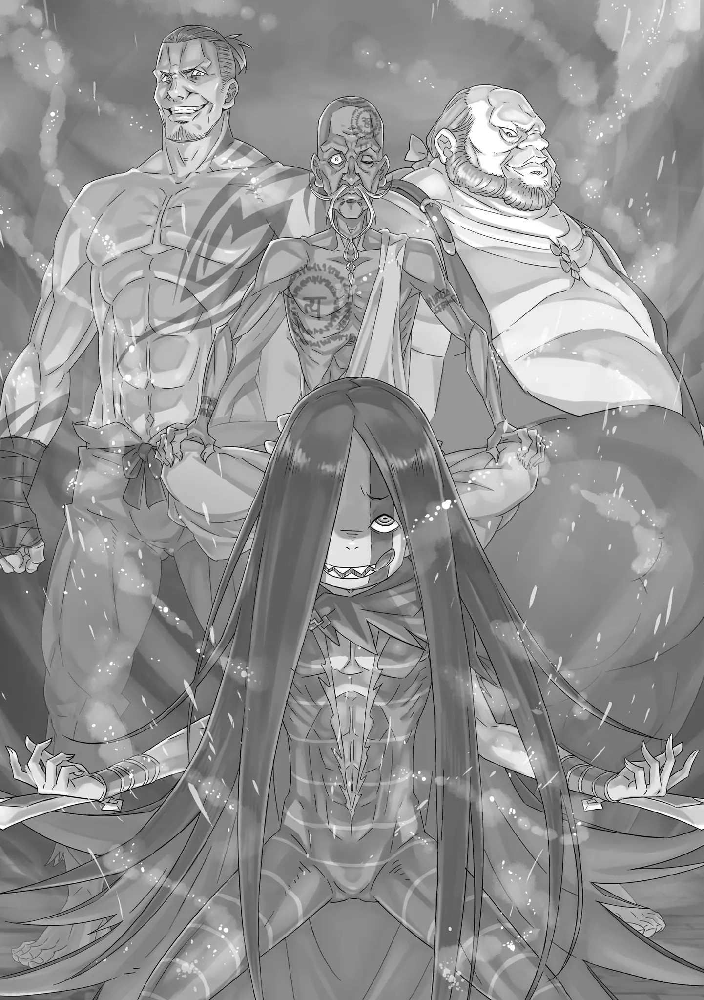

QC: Silly

――Сереброволосый, неизвестный человек.

Субару: «Ха?» Неожиданная фраза Рам создала в сознании Субару небольшой пробел.

Может это и окольной способ выражения, но если бы это был просто «сереброволосый человек», Субару бы не чувствовал себя так странно взволнованным.

Нет никаких сомнений, что Эмилия имеет красивые серебристые волосы. Ее темно-фиолетовые глаза тоже прекрасны. Части ее лица, а также все части, составляющие все ее тело, очаровательны, выглядящие как божественные произведения искусства.

Однако, всего одно лишнее слово «Незнакомый» кардинально меняет смысл.

Субару: Сереброволосый, незнакомый человек……

Рам: Да, верно. Я никогда раньше не видела её в этой башне. По крайней мере, она не была враждебна к нам. ……Я ушла, как только увидела ситуацию. Но Юлиус: ――Кто бы ни присоединился к подкреплению, совсем другое дело, что противник — «Обжорство».

Рам кивнула в ответ на бормотание Субару и перевела взгляд в ту сторону, откуда она пришла. Тем, кто перенял слова Рам, был Юлиус, у которого было мрачное выражение лица при имени «Обжорство».

Он коснулся рыцарского меча на бедре и плотно сжал губы.

Юлиус: Это неожиданная встреча, но, раз уж мы встретили здесь врагов, мы не позволим им сбежать.

Первоначально наша цель как раз состояла в том, чтобы найти способ противодействовать ущербу, причиненному Архиепископами Греха «Обжорства» и «Похоти». Раз они появились, мы узнаем об этом прямо из их уст.

Рам: Я согласна. Рам тоже не позволит им уйти живыми.

Мы должны заставить их пожалеть о том, что они вот так беззаботно заявились.

Субару: По, подождите! Подождите минутку! Я понимаю ваш энтузиазм! Я понимаю, но…… «хк» Когда эти двое проявили сильную враждебность по отношению к «Обжорству», Субару невольно остановил их.

Юлиус, чье существование было отрезано от мира, и Рам, чья любимая сестра была вырвана с корнем и поглощена изнутри―― Ясно, что они оба были очень мотивированы, чтобы победить «Обжорство».

Действительно, Субару также чувствовал, что это и хорошая, и плохая возможность одновременно.

Но, главным был вопрос―― Субару: Вы, ребята, пропускаете имя Эмилии в своем разговоре. Это, что случилось? «――――» С дурным предчувствием в сердце, Субару сразу перешел к вопросу.

Неестественная манера Рам и отсутствие реакции со стороны Юлиуса, Беатрис и остальных на его слова.

Если бы вы посмотрели на них, то увидели, что у Беатрис и Ехидны также не было выражения неправильности происходящего на лицах.

Ответ на его вопрос раскрыл ему истину слов Рам насчет «Сереброволосого, незнакомого человека»―― Рам: ――Эмилия, кто это?

Субару: «――хк» У Субару от ужаса сжалось горло, когда он услышал слова Рам, которая наклонив голову и не пряча сомнений, сказала это.

Юлиус, Беатрис и даже Ехидна смотрели на Субару с непониманием в глазах. ――Он не мог скрыть своего шока от этого.

Субару: Но ведь, Прошла, вероятно, всего минута с начала этого разговора.

Прямо незадолго до этого, Субару говорил об «Эмилии» с Юлиусом и остальными. С самого начала, причина, по которой он выбежал с балкона в башню, заключалась в том, что ему не терпелось, чтобы Эмилия и Рам присоединились к ним, и он надеялся на их безопасность, ведь так?

Как это могло произойти так мгновенно―― Беатрис: ――Субару, может ли быть, Внезапно, Беатрис, которая держала Субару за руку, заметила что-то в его много эмоциональном выражении лица. Хоть первой это и заметила Беатрис, у остальных в группе также стало появляться понимание на лице.

Они сразу же поняли, что имя, произнесенное Субару, имя, которое они не помнили, — это имя, которое имеет огромное значение для них.

Беатрис: Эмилия…… это имя той сереброволосой девушки?

Субару: ――. Верно. Если здесь была девушка с серебристыми волосами, то ее зовут Эмилия, и она одна из нас. Вот почему она сказала Рам бежать, а сама осталась. Она продолжает сражается Юлиус: Полагаю, что-то такое могло случиться. Простонапросто, ведь я сам это испытывал «――――» Получив слабый ответ Субару, Юлиус, услышав невероятное положение вещей, коснулся своей челки.

В то время как Юлиус не мог скрыть своего удивления, Субару наконец познал пределы силы «Обжорства», и живо ощутив чудовищность и быстродействие этой силы, он начал чувствовать её истинный страх.

Честно говоря, даже несмотря на то, что он осознавал, что у него отняли воспоминания, реальное ощущение этого было слабым в сознании Субару.

Разумеется, недоразумения, необоснованные опасения и негативные чувства по отношению к Эмилии и другим, возникшие из-за потери его памяти, было трудно забыть, и это является частью его тёмного прошлого, которое он предпочел бы забыть навсегда.

Но, все также, реальное ощущение этого было слабым.

Искать и чувствовать что-то, чего нет, как если бы оно было там, — это неопределенная битва, похожая на рыбалку в море ночью, когда вы ничего не видите.

Вот почему, это ощущение было слабый. Тем не менее, это не все.

В мгновение ока они забыли Эмилию, человека, которого они помнили всего минуту назад, друга, с которыми они преодолевали трудности до сего времени. ――Что еще может быть ужаснее этого?

Узурпатор воспоминаний, тот, кто попирает воспоминания других людей; «Обжорство» было рецидивистом, поедающим чужие узы из раза в раз.

Увидев это наконец собственными глазами, Субару понял это. «Обжорство» — это сущий дьявол, который нарушает царство неприкосновенного в своем стремлении к счастью.

Рам: «――Уг, ку» Субару: Рам!?

И, после того, как Субару смог так или иначе переварить свое удивление внутри себя, прямо перед ним, а также среди людей, которые тоже были удивлены тем фактом, что у них отняли воспоминания о их друге, Рам внезапно упала на колени.

Стоя рядом с Патраш, опираясь на ноги этого черного земляного дракона, Рам тяжело дышала.

Субару: Что случилось? Все в порядке?

Рам: ……У меня просто немного заболела голова, вот и все. После того, как подумала об этом, незнакомом человеке.

Субару: Об Эмилии……?

Брови Субару нахмурились, когда Рам, положив на голову, покачала головой с болезненным выражением на своем остром лице.

Вероятно, если «Обжорство» забрало воспоминания Эмилии, Рам, сопровождающая ее, увидела эту сцену прямо перед своими глазами. Субару задался вопросом, оказало ли это на нее влияние.

Однако, Беатрис, «Субару», похлопав его по плечу, медленно покачала горизонтально головой.

Беатрис: Дальше, лучше перестать пытаться вспоминать. Слишком многого не хватает, я полагаю.

Субару: Слишком не хватает, говоришь……

Беатрис: Появилась небрежная часть полномочия «Обжорства». ――Это эффект того, что в воспоминаниях есть так много деталей, которые просто невозможны без человека, которого забрали из воспоминаний, из-за чего возникают несоответствия, я полагаю.

Субару: «――――» Услышав слова Беатрис, Субару на мгновение растерялся.

Однако, он быстро проглотил смысл и понял, что именно это означало.

Из-за работы полномочия «Обжорства», Рам и остальные потеряли воспоминания об Эмилии.

Должность Рам — сопровождающий Эмилии―― У них были так называемые отношения господина и слуги.

Отношения между ними двумя было трудно понять, но в них была определенная теплота.

Потеряв все до последнего, внутри Рам, существование «Эмилии» заменилось пустотой.

Воспоминания похожи на сувениры(что-л. памятное, запомнившееся), хранящиеся в ящике стола.

Обычно мы не осознаем, что они там есть, но как только мы открываем ящик, чтобы вспомнить, мы достаем их оттуда и видим различные вещи. ――Без этого, жизнь была бы невозможна.

Другими словами, для Рам, поиск имени Эмилии в её голове прямо сейчас был бы эквивалентен открытию бесчисленных ящиков, чтобы найти то, что она не сможет найти, сколько бы раз она их ни открыла.

Ехидна: Я позабочусь о ней Субару: Ехидна……?

Ехидна, стоявшая рядом с Рам, чье лицо было искажено болью, подняла руку. Пока Субару был удивлен ее шагом вперед, Ехидна пожала худыми плечами и, Ехидна: Сейчас, у нас нет времени дискутировать об этом. Мы не можем продолжать, особенно если надвигается «Обжорство» и один из наших товарищей сейчас сражается, пока его имя забирают. Мы не должны останавливаться.

Юлиус: Ехидна, позаботьтесь о Мисс Рам и её сестре.

Вместе с Патраш, держитесь подальше от сражения.

Ехидна: Да, можешь доверить мне это. ――Юлиус, хоть это и критический момент, не перенапрягайся слишком сильно.

Юлиус: Я понимаю. Мой боевой дух холоден, конечно.

Словно этот меч.

Юлиус моментально принял рекомендацию Ехидны и повернул свое полное достоинства лицо вперед. В нем был такой острый боевой дух, что Субару не решался прервать его.

Субару: Рам Рам: Это позорно, но сейчас Рам будет только обузой, если пойдет с вами. Оставьте меня. Однако, оставьте жизнь Обжорству. Можете ради этого отдать все, кроме органов Барусу Субару: Ты говоришь так, будто о корове или свинье, но ладно, как бы то ни было, просто отдыхай. Мы уходим!

Рам: ――Да, вперёд.

Оставив позади раскаивающуюся Рам, Субару кивнул девушкам и оставшейся Ехидне. Затем, прежде чем убежать, он погладил Патраш по шее и посмотрел в профиль спящей красавицы у неё на спине.

Рем: «――――» С теми же тихими, почти не дышащими вдохами, Рем продолжала видеть сны с закрытыми глазами.

Пока все в порядке. Он уже получил от нее нужные ему слова.

Поэтому дальше―― Субару: Жди нас, Обжорство……! Мне надоело позволять вам, ублюдкам, кормить себя!

――Честно говоря, если начать поднимать вопросы, они продолжат возникать без конца.

Почему эффект полномочия «Обжорства» не был заметен в Субару?

Несмотря на то, что имя Эмилии было отнято у нее и исчезло из воспоминаний Беатрис и Рам, ее имя, фигура и голос четко сохранились в сознании Субару.

Эти слабые чувства, которые он испытывает к ней, непременно хранятся в его сердце, и он их не забыл. 'Дело в том, что я из другого мира……?' Может быть, именно поэтому правила этого мира неприменимы к Субару?

Если воспоминания этого мира — это записи жизней, которые затем отдирают с душ умерших в «Коридоре воспоминаний», то вполне возможно, что сила «Обжорства», способная перехватить их, не достигает Субару из-за той особенности, что Субару — существо из другого мира?

Если так, будет ли память о «Нацуки Субару» когданибудь выгравирована в «Коридоре воспоминаний» этого мира, если он умрет? Или―― 'Это невозможно для меня из-за того, что я «Посмертно возвращаюсь»?' Это был такой холодный вывод, что он съежился, подумав об этом.

Если бы это было ответом на механизм «Посмертного возвращения» Субару, то жизнь Субару продолжала бы существовать вечно, не будучи вовлеченной когда-либо в спираль этого мира.

То есть, это значит, что проведя десятилетия в этом мире, он даже не сможет умереть от старости.

Если к нему это правило не применимо, то чтобы Субару закончить свою жизнь, надо, вероятно, чтобы он или Нацуки Субару отдали поистине все воспоминания об этом мире―― ???: Искусство ледяного призыва!

Субару: «――хк!?» Мгновенно, его сознание, которое было погружено в раздумья, прорезал острый голос, похожий на звон колокольчика.

Вбежав в конечный пункт своего назначения, Субару увидел перед собой―― Коридор, ведущий в зеленую комнату, был замерзшим белым, и его встретил ужасно холодный воздух, который он ощущал своей кожей.

А отправной точкой этого ветра была снежная фея, которая порхала среди танцующих ледяных кристаллов―― Нет, не так. Той, кто танцевал с развевающимися серебряными волосами, была Эмилия.

Эмилия: ――Эрья! Соя! Эиэи! Яа!

Взяв в руки два ледяных меча и размахивая ими, Эмилия яростно сражалась, поднимая свой голос. Этот крик слегка падал духом, однако, в скорости, с которой ледяные мечи рассекали воздух, не было ничего милого.

Удар был правильным, и он хлынул на противостоящего врага, пытаясь срубить его одним ударом.

Субару: Это……

И затем, ледяной меч в руке танцующей Эмилии, заставил коридор, ставшим её полем боя, застыть белоголубым, словно создавая внутри башни посреди песка впечатление другого мира.

Возможно, это был эффект, который магия льда, которой владеет Эмилия, оказывает на ее окружение.

Он не был уверен, насколько это мощная сила в этом мире, но Беатрис и Юлиус ахнули, когда увидели это.

Но не только из-за этого―― ???: Аахахаа! Делаешь это, ты делаешь это, делаешь, не правда ли, ты действительно делаешь это, и ты продолжаешь делать это, именно потому, что ты в состоянии это делать, именно потому, ты продолжаешь это делать! У нас тоже есть что пое~есть!

Существо, стоящее напротив Эмилии, смеясь, с лёгкостью парировало светящийся ледяной меч. «――――» Это был мальчик с очень длинными темно-коричневыми волосами и улыбкой, которая излучала какое-то мрачное безумие.

На вид ему было около пятнадцати-шестнадцати лет, и вид у него был потрепанный, даже грязный. Его внешний вид был ни в коем случае не гигиеничен, но что делало его еще более отвратительным, так это то, как он насмехался над другим человеком и не стеснялся охотиться на него, а блеск в его глазах показывал его отчаянную жажду к «Жизни».

Он понял это с первого взгляда. Ему не нужно было говорить это.

Тот факт, что есть еще одно существо с такими глазами, кроме Луис Арнеб, невыносим.

Субару: ――Архиепископ Греха «Обжорства»!

Обжорство: Ахаа! Посетитель! Не правда ли! Главное блюдо, Братец! Мы с надеждой желали встретить тебя.

Похоже, младшая сестра благодарна тебе!

Услышав рычащий голос Субару, «Обжорство», которое победило атаку меча Эмилии, усилило свой злобный смех. Почувствовав страх от этой злой улыбки, Эмилия в тот же момент заметила позади себя Субару и остальных, и изумлённо выкрикнула «А!», Эмилия: Ах, ребята! Возможно, вы меня не узнаете, но это враг! Плохой человек! Я позабочусь об этом…… боюсь, что вы меня не узнаете, но все же! «――――» В присутствии своих товарищей, стоящих позади, Эмилия хорошо понимала ситуацию, в которой она оказалась.

Естественно, она, должно быть, была потрясена, когда воспоминания о ней были потеряны у других. Этот шок был непостижим для Субару, который никогда не испытывал забвения.

Тем не менее, она не только решительно отпустила Рам, но и продолжая таким образом борьбу с «Обжорством», она беспокоилась о прибежавших Субару и других.

Охваченный волной чувств, Субару закричал.

Субару: Все в порядке, Эмилия-тян! Я не забыл!

Эмилия: «――――» Субару: Да, я никогда тебя не забуду! Что бы ни случилось, я никогда, никогда тебя не забуду!

Подняв кулак, Субару сказал это в спину Эмилии.

Как только она услышала это, глаза Эмилии расширились, а затем через мгновение сузились.

Эмилия: «――――» Субару не знал точно, какие эмоции проносились в ее голове в тот момент.

Однако, судя по улыбке, которую она ему сразу же после этого подарила, он был уверен, что в ней не было никакой недоброжелательности.

Оставаясь в том же положении, Эмилия повернулась кругом в сторону «Обжорства» и бросила прямо в него свои ледяные мечи, а затем подняла с пола ледяное копье и атаковала своего врага танцем льда.

Юлиус: Я не думаю, что она понимает, как сильно твои слова повлияли на нее сейчас.

Субару: Что?

Он услышал, как Юлиус, наблюдавший ту же сцену рядом с ним, с улыбкой произнес это. Это прозвучало очень многозначительно, но Юлиус не ответил Субару, который вопросительно повернул свою голову к нему.

Только, он вытащил меч из-за пояса и нарисовал им красивую траекторию.

И затем―― Юлиус: Думаю, мне не нужно спрашивать, на нашей ли она стороне, Субару.

Субару: Да, верно. Она же такая милая, она не может быть нашим врагом!

Юлиус: ――Буду иметь в виду.

Юлиус кивнул в ответ, и его фигура исчезла с края его поля зрения. ――Нет, это была иллюзия.

В следующее мгновение, удар Юлиуса, ускорившегося одним шагом и нырнувшего в ледяную схватку, попал в «Обжорство», который скрестил руки на груди, и заставил его с размаху отскочить назад.

Обжорство: У~упс, Братец, это……

Юлиус: Я так долго ждал этого, Обжорство……!

Острый удар меча Юлиуса мощно атаковал улыбающегося «Обжорство». Однако, «Обжорство» нейтрализовало этот удар, отпрыгнув назад, а затем, поставив ноги на ледяную стену, ужасно прочистило горло.

А после, «Обжорство» вызывающе слегка высунуло свой длинный язык―― Обжорство: Оиои, пожалуйста, не бросайся так ко мне.

Мне жаль, но если мы что-то едим, это не значит, что мы делимся всем. Я не узнаю Братца. Разве это не значит, что это сделал Рой, а не мы?

Юлиус: «――хк» Обжорство: Ну, некоторые люди думают, что это не имеет особого значения. Тем не менее, в отличии от Роя, мы на самом деле не заинтересованы в Братце.

Думаю, ты просто не соответствуешь нашим стандартам питания?

Юлиус: Стандарты питания, говоришь?

Обжорство: Да, верно-верно. Это……

На запястьях вяло опущенных рук «Обжорства» были закреплены какие-то ножи. Смотря на Юлиуса, оно пыталось говорить в ужасно зловещем стиле.

Однако―― Эмилия: «Соия――хк!!» Обжорство: «――цу!?» В сторону «Обжорства», без всяких колебаний, Эмилия швырнула обоими руками куски льда.

Ее безжалостный выстрел был специализирован на том, чтобы легко заполнить широкий проход, который нельзя назвать подходящим местом для боя, и нанести удар без возможности побега.

Посреди разговора, этот мощный выстрел был действительно неожиданным, но «Обжорство», также изменившись в лице, нырнул под ледяную глыбу, едва сумев спасти свою жизнь.

Обжорство: Тц~ц ~цу! Мы знали это, когда съели тебя, но ты действительно непоколебимая, Эмилия! Если ты так будешь нападать, то люди подумают, что ты страшный человек……

Эмилия: Все нормально, так что помолчи! Я привыкла к тому, что люди думают, что я страшная, и ты это знаешь! Важно то, что я думаю обо всех! К тому же……

Эмилия отправила свое белое колено в лицо «обжорства», дыхание которого было грубым из-за того, что ему пришлось увернуться от кусков льда. «Обжорство» поймало колено рукой, и от удара его отбросило назад.

В том же положении, Эмилия храбро рявкнула, оглянувшись на Субару в конце своих слов.

Эмилия: Человек, который я хотела бы больше всего, чтобы он меня запомнил, меня запомнил. Так что, сейчас я действи-и-ительно полна энергии!

Обжорство: Вот почему тип людей, который руководствуется лишь чувствами, не является нашей сильной стороной. Против этого типа мы наименее хороши.

Юлиус: ――Вот как. Но, в этом я с ней согласен.

Длинное тело Юлиуса проскользнуло за «Обжорство», щеки которого были искажены отвращением. «Обжорство» за раз повернуло свои руки назад, чтобы принять рубящий удар.

Однако, этот несовершенный прием не остановил удар полностью, из-за чего оно было глубоко порезано от локтя до локтя, откуда затем хлынула кровь. «Обжорство» закричало от боли, однако нападение не остановилось―― Юлиус: ――Будучи однажды полностью забытым всеми, я почувствовал, что, потеряв собственную опору, я также лишился жизни, но с самого начала мне не нужно было недоумевать над тем, где я нахожусь.

Обжорство: «Тц! Уг, гхи, гьхяа!» Со спокойной решимостью в словах, острота ударов меча, нанесенных Юлиусом, постепенно возрастала. «Обжорство» не выдерживало их, и раны постепенно увеличивались, пока, наконец, оно не получило приличный удар в грудь и не закричало.

Беатрис: Субару Субару: Я знаю. Я не могу быть в центре всего этого.

Беатрис: ……Хорошо, что ты это понимаешь.

Юлиус продолжал свой натиск, а Эмилия также продолжила свою безжалостную атаку на «Обжорство».

Посему, «обжорство», на которого нападали с обоих сторон, находилось только в обороне.

Конечно, если бы это было возможно, Субару хотел бы присоединиться и помочь загнать «Обжорство» в угол, но очевидно, что у него не было навыков для этого.

На данный момент, у него не было выбора, кроме как оставаться здесь и наблюдать, веря в то, что дуэт Эмилии и Юлиуса победит «Обжорство». Но―― Обжорство: Делаете такое с наспех созданным дуэтом ~цу! Но, как насчет э~этого?

Эмилия: Что?

Обжорство: ――Искусство ледяного призыва Тем не менее, даже проливая кровь, «Обжорство» не утратило своей улыбки и пробормотало это, глядя вниз.

Услышав его бормотание, Субару и Эмилия удивленно подняли брови. Юлиус и Беатрис нахмурились, не понимая смысла сказанного. Однако все четверо были удивлены сценой, которая сразу же последовала после.

Сразу же после этого, ледяное копье вылетело из-под ног «Обжорства», которое Юлиус избежал, уклонившись, в то время как Эмилия предотвратила это, превратив копье в своей руке в ледяной молот и насильно уничтожив его.

Однако, хоть они и избежали этого удара, это не означало, что это не застало их врасплох и что они не были вынуждены перейти от нападения к обороне.

Обжорство: Хаха ~цу! Интересно, какое это чувство получить свой собственный фирменный прие~ем! Как это, каково это, как же это, интересно, как это, а как это?, действительно интересно, как это, даже если так, каково это, как же ты себя чувствуешь, пьянство ~цу! обжорство ~цу!

Эмилия: ――хк! Внезапно, Юлиус: Его движения изменились!?

На глазах у Эмилии и Юлиуса, которые изобразили удивление, «Обжорство» вытащило с пола ледяное оружие. Когда Субару увидел, какое оружие детально формировалось из льда, у него перехватило дыхание.

Потому, что это был―― Субару: Э, Экскалибур!?

Обжорство: Несмотря на то, что Искусство ледяного призыва само по себе является техникой Эмилии, воспроизводим её мы, те, кто съел Братца~! Знания наше оружие! Мы — интеллигентный Архиепископ Греха.

Юлиус & Эмилия: «――хк» Сказав это, «Обжорство» воссоздало из льда священный меч и взмахнуло им, поразив Эмилию и Юлиуса блестящим ударом. Конечно, это было всего лишь оружие, которое воспроизводило внешний вид из льда, и от него не исходило никакой световой энергии.

Однако, «Обжорство» с такой скоростью создавало оружие, которое не могло существовать в этом другом мире, одно за другим, что удивительным образом загоняло Эмилию и Юлиуса в более плохое положение.

Разумеется, Эмилия и Юлиус быстро восстановили свои позиции, отбросив первоначальный шок и попытавшись дать отпор «Обжорству», но каждый раз оно меняло свой боевой стиль, как будто это был новый человек, что вновь требовало их адаптироваться, и из-за чего они вновь оказывались в невыгодной боевой ситуации.

Субару: «――――» Наблюдая за атаками и защитой «Обжорства», Субару узнал насколько высока их угроза из-за захвата множества воспоминаний других людей.

Техника Эмилии по созданию ледяного оружия одного за другим достаточно мощна сама по себе, но когда к ней добавляется еще и воображение пользователя, она превращается в технику, которая показывает совершенно другое лицо. В частности, знания о других мирах, которые Субару привез с собой, и оружие, воссозданное на основе этих знаний, чрезвычайно проблематичны.

Существует гора вооружения, которого нет в этом мире, и все же они достаточно практичны. Это связано с тёмной историей Субару, когда он читал книги об оружии со всего мира, когда учился в младших классах средней школы.

Вдобавок ко всему, оно, вероятно, приняло в себя еще и многих воинов за свою жизнь, в результате установив боевую мощь многих воинов в своем сознании.

Поэтому, просто вытащив наиболее подходящую память из своего запаса, оно мгновенно превращалось в эксперта по любому оружию и могло атаковать и защищаться по собственному желанию.

И, была еще одна причина плохого положения Эмилии и Юлиуса.

Эмилия: Юлиус! Не туда!

Юлиус: «Ку……кх» Крик Эмилии был встречен болезненным стоном Юлиуса.

Их сотрудничество и координация были слишком плохими, чтобы победить одного врага.

Эмилия и Юлиус, эти двое плохо работали вместе.

Во многом это связано с тем фактом, что Эмилия «чувствительный человек», который оставляет свой боевой стиль своим чувствам, в то время как Юлиус «умелый человек», который тренировался, тренировался и тренировался.

Однако, эту проблему можно было бы легко исправить, если бы эти два человека, примерно одинаковые по силе, знали бы привычки друг друга.

Да, если есть ценность в отношениях, они могли узнать привычки друг друга.

Обжорство: Это печально, не так ли? Вы действительно думали, что сможете работать вместе? Знать, с кем имеешь дело, и доверять ему — это две совершенно разные вещи, хоть они и указывают в одном направлении, верно? Вы не можете просто соответствовать друг другу, потому что не знаете мысли друг друга, и вы не можете исправить это, потому что не знаете привычки друг друга. В конце концов, эта помеха мешает слиться…… хахаа, это ведь бесполезно-бесполезно, вы двое-сан!

Эмилия: «Ку……» Обжорство: Знание — это сила! Память — это наша связь!

Воспоминания — наша жертва, и мы на высоте! Мы сильны! Мы будем махать крыльями везде-везде!

Подпрыгнув, «Обжорство» выпустило удар, который настиг их обоих одновременно.

Подошвы его ног, все еще маленьких и не очень длинных, ударили их обоих по плечам и отбросили их с криком назад.

Тем временем «Обжорство» ловко кувыркнулось и приземлилось на четыре конечности на ледяную землю.

Обжорство: Проблемный! Наглый! Великое сражение!

Что думаете о нашем выступлении! Братец, который тоже просто наблюдает оттуда, ты удовлетворен тем, что охвачен раздражением, хм?

Субару: Ублюдок……

Обжорство: Ты сказал, что никогда не забудешь и все такое, но насколько это поможет? В конце концов, опыт

— это то, что имеет значение. Именно накопление превосходных знаний обогащает жизнь человека и делает его победителем. Вот почему мы лучшие!

Раскинув руки и обнажив острые клыки, «Обжорство» усмехнулся над всем, что он хотел сказать.

Значит, слова «Обжорства» — это его философия, верно?

Это немного отличается от «философии счастья», которая была у его сестры, Луис, но, в конце концов, этот вид философии, который направлен на то, чтобы использовать жизни других людей в качестве трамплина для саморазвития, намного хуже.

Субару от всего сердца ненавидел эту концепцию―― ???: Вы, какого черта вы все тут собрались?

Обжорство: Чт Все: «――――» «Обжорство», которое до этого смеялось так, словно оно находилось на вершине своего процветания*, раскрыло глаза, как только услышало этот голос. И это удивление также разделили Субару и остальные.

Это было вторжение Асуры* на сцену так внезапно, так естественно, так величественно. (1. Так. Тут как и в 52 главе используется «весна мира», но я нашел более правильную формулировку. Перевод в 52 главе этого момента был +- правильный. 2. .) Медленно и твердо, высокий красноволосый мужчина в кимоно, с одним обнаженным плечом, ступал по ледяному коридору в дзори*. Чудовищно улыбаясь, он появился с противоположной стороны коридора―― Находясь за «Обжорством», он появился перед Субару с остальными. (Если говорить просто — японские сандалии. Дальше просто сандалии.) И―― ???: Не может быть, чтобы лучший был таким искаженным ребенком, как ты. Превосходный, сильнейший, самый высокий и самый лучший — все это слова, которые предназначены для меня.

Сказав это, Рейд Астрея, спустившийся со второго этажа, откуда он не должен был спускаться, появился перед ними со злобной улыбкой на лице.

