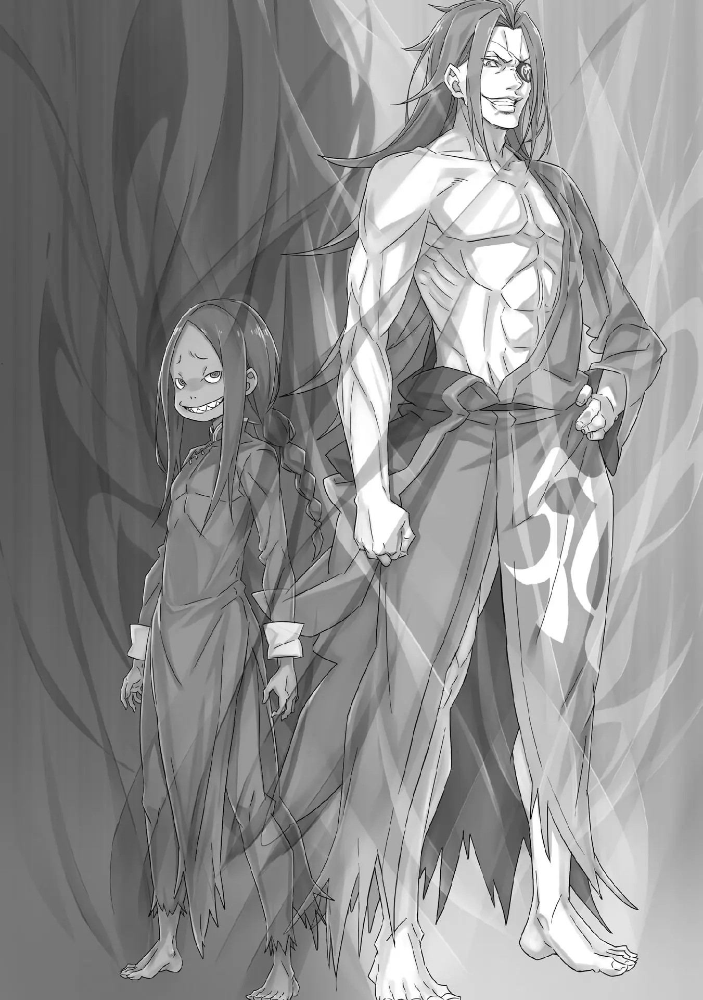

QC: Silly

――Когда он впервые услышал имя Шаулы, он сразу подумал об этом.

Это было не потому, что у него были какие-то особые чувства по поводу самого имени «Шаула».

Просто это имя резонировало в памяти Субару. «Шаула» — это название звезды, сияющей в ночном небе――Слово, которое обозначает созвездие Скорпиона*. (. Это не играет особой роли, но в названии главы созвездие скорпиона пишется как . Я думаю это используется просто для того, чтобы показать о ком речь. Гигантский скорпион — .) Это был простой, без всяких поворотов, ответ: Истинное лицо человека, носящего имя созвездия Скорпиона, это гигантский скорпион в черном как смоль панцире.

Это было настолько просто, что заставляет усомниться во вкусе человека, который дал такое имя.

Но, прямо сейчас первым кандидатом на это отсутствие вкуса является Нацуки Субару, к которому относятся как к «Мастеру-сама».

Не имеет значения, есть у него воспоминания или нет, Субару все же не думает, что у него была возможность назвать Шаулу, и возможности проверить и подтвердить это у них сейчас нет. «――――» Перед глазами, команда из Эмилии и Рам вели ожесточенную битву с Луис Арнеб, Архиепископом Греха «Обжорства». Посреди этой битвы их прервал гигантский скорпион цвета кромешной тьмы, который в дальней части коридора начал греметь жестокими ножницами, уставившись на них своими красными фасеточными глазами.

Тяжёлый, зловещий звук трущихся друг о друга лезвий естественных ножниц, которые развились ради бойни, заставлял думать, что они были достаточно острыми, чтобы легко разрезать кости и внутренние органы человеческого тела.

Красные глаза, две большие ножницы, несколько ног, поддерживающих огромное тело, и панцирь, который может похвастаться прочностью железной брони, — все это символы отточенного разрушения и насилия.

На самом деле, его боевая мощь совершенно не обманывает свой свирепый внешний вид.

Субару уже подтвердил это битвами до сих пор, миром доныне, снова и снова видел это своими глазами а также чувствовал это своим телом.

Субару: «Т……» В тот момент, когда это осознание осенило его, события предыдущего цикла промелькнули в его сознании.

Как раз в тот момент, когда они подумали, что отбили беспощадную атаку гигантского скорпиона и каким-то образом заставили его временно отступить, Субару и остальные были поражены взрывом прощального подарка, который унес жизни двоих, Беатрис и Ехидны.

Он никогда не забудет невыносимый гнев, который испытал в тот момент.

Неконтролируемый гнев, который он испытывал, был гневом на собственную неспособность что-либо с этим поделать, и в то же самое время он был направлен на гигантского скорпиона, совершившего убийство. ――Объектом его ярости был гигантский скорпион, который на самом деле был их товарищем, Шаулой.

Теперь, когда он знал это, разум Субару наполнился бурей эмоций и сомнений, которым некуда было деться.

Почему Шаула принимает форму гигантского скорпиона?

Почему Шаула нападает и пытается убить Субару и остальных?

Почему Шаула раскрывает свою истинную природу в этот момент, вмешиваясь в сражение?

Почему, почему, почему, почему, почему, почему, почему, почему, почему, почему, почему―― ???: ――Субару, успокойся. Прежде всего, глубоко дыши, я полагаю «――――» Мысли Субару были заполнены этим шокирующим фактом. Тем, кто тихо позвал Субару по имени и привел его в чувство, была Беатрис, стоявшая рядом с ним.

Только когда ее маленькая ладошка сжала его руку, Субару осознал, что забыл дышать. Медленно, следуя инструкциям, Субару глубоко вдохнул и выдохнул.

А затем, Беатрис: Вот так, молодец. ――Это и правда Шаула, я полагаю?

Прежде, чем ответить Беатрис, Субару еще раз сверился с самим собой. «Кор Леонис»―― Только зародившееся полномочие, способности которого он только начал осознавать, но это без сомнений сила, которая говорит Субару, где находятся его друзья и которая позволяет забирать себе их проблемы.

Поэтому, Субару может смутно представлять местонахождение своих товарищей в башне, таких как Эмилия, Рам, Беатрис, Юлиус, Мейли и Ехидна.

И это слабое, теплое чувство, которое он испытывает к своим товарищам, он также испытывает к этому гигантскому скорпиону.

Учитывая нынешнее положение товарищей в башне, он не мог найти какого-либо другого кандидата.

Следовательно, этот гигантский скорпион безошибочно―― Субару: Это безусловно Шаула. Я не знаю почему, но она превратилась в гигантского скорпиона……

Беатрис: ――. Это правда, что с самого начала она была неопознанной девушкой. Не стоит удивляться, что ее истинной личностью является насекомое, которое чуть больше других, я полагаю Субару: Невероятная смелость……

Назвав скорпиона насекомым, Беатрис отразила шок, но не пониманием, а сравнением сил. Поражённый её подходом, Субару ещё раз уставился на гигантского скорпиона.

Он не знал, куда были уставлены его красные фасеточные глаза, но он вонзил свой взгляд прямо в них, и, Субару: Почему бы тебе не ответить мне как-нибудь! Я уже знаю, кто ты такой, черт возьми!! «――――» Субару: Оправдаться или облизать губы перед своей добычей, ты могла бы хоть что-то сделать……«кх» Когда он повысил свой голос, полный гнева, его вялая голова ужасно заболела. Но Субару проигнорировал боль и потребовал ответа от гигантского скорпиона.

Тем не менее, гигантский скорпион не пытался ему даже ответить, он продолжал выглядеть необщительным.

Субару: Ни единого оправдания, ты не собираешься дать мне хотя бы его, не так ли……

Слабо бормоча, Субару боролся с чувством рвоты, пока думал.

Как Субару и вспоминал раньше, он многократно испытывал трудности из-за этого гигантского скорпиона.

Шаула была такой наивной и дикой, и она никогда не пыталась скрыть доброжелательность, глубокую привязанность или что-либо другое к Субару―― Тот факт, что она обманула его и устроила против него заговор, поразил его в самое сердце.

Её улыбка, её слова, ее отношение и всё другое, было ли это просто подделкой?

Была ли она тем предателем, который обманул Субару и остальных?

Субару: Нет…… «Предатель», когда это слово пришло ему на ум, щеки Субару затвердели от едва уловимого ощущения неправильности происходящего.

Шаула предала их. ――Эта мысль как такова является неизбежным выводом в свете нынешней ситуации. Тем не менее, есть место для споров относительно того, действительно ли Шаула врала во всем.

Разумеется, вполне возможно, что все, что Шаула говорила и делала до сих пор, было притворством, и что ее улыбка, контакт кожа к коже и все остальное было простым обманом.

Это было возможно. Только, ради чего――?

Если она притворялась чтобы заслужить доверие Субару и других, то её цели враждебны по отношению к ним.

Однако, если Шаула действительно хотела сделать что-то плохое, ей не имело смысла вмешиваться в драку на этом этапе, у неё было много возможностей совершить подлый поступок в прошлом.

Несомненно, Субару и остальные уже так сильно доверяли ей, что у неё было бесконечное количество возможностей аккуратно подмешать им яд.

Почему она упустила эту возможность и раскрыла свое предательство здесь?

Подобное совершенно не логично.

Какой смысл специально вот так обманывать, чтобы притвориться их товарищем?

То, что она прислушалась к просьбе Субару и совместно с Мейли пыталась остановить магверей, демонстрируя свою супер-магию, не имело смысла.

Абсолютно всё не имеет смысла, разве не так?

Субару: Неужели я хочу так думать из-за того, что я очарован белыми ногами, которые видно сквозь ее шортики?

Беатрис: Если Субару так думает из-за этого, то тактика Шаулы действительно довольно впечатляющая.

Субару: И правда. Так как мои чувства направлены на Эмилию-тян…… говоря об этом, уваа!?

Пока он делился своим ощущением неправильности касательно поведения Шаулы, Беатрис неожиданно потянула его за руку. Это был не протест, а решительный шаг к спасению.

Когда Субару непроизвольно сделал шаг или два вперед, прямо над его головой пролетел белый свет, который чуть не забрал его жизнь.

Беатрис: Похоже, у нас нет времени на болтовню, я пола, гаю!

Сказав это, Беатрис, продолжая держать Субару за руку, подняла вторую руку, и окружение вокруг неё слабо засветилось.

То, что развернулось, было большим количеством фиолетовых кристаллов с острыми кончиками.

Фиолетовые стрелы, окружавшие Субару с Беатрис, были выпущены прямо в гигантского скорпиона.

В тот же момент, фиолетовая стрела и белый свет, который так же вылетел им на встречу, столкнулись друг с другом, и свет бурно заплясал.

Субару: Уоооооооо!?

Беатрис: Опусти голову! Ничего хорошего не случится, если ты получишь прямое попадание, я полагаю!

Бурно сверкающий фиолетовый свет и звук бьющегося стекла имели красивую взаимосвязь.

Несмотря на великолепное, обжигающее глаза зрелище, гигантский скорпион испустил вспышку―― Нет, удар острого хвостового жала, который был направлен на то, чтобы безжалостно пронзить жизнь Субару.

Беатрис пыталась защититься от надвигающейся стрелы с убийственным намерением с помощью магической силы, однако сотни стрел были просто парированы, сметены и отброшены.

Материальное преимущество было просто подавлено.

Беатрис: Гх, это плохо……! Если все будет продолжаться в том же духе, то скоро закончится мана, я полагаю……!

Субару: Что произойдет, когда она закончится!?

Беатрис: Бетти и Субару будут дружно насажены на одно жало!

Дружно или нет, так или иначе ситуация неудовлетворительная.

Беатрис собственноручно признала то, что ее сил не хватит надолго против надвигающегося натиска. Им необходимо выбраться из этой ситуации хоть как-то, пока они не были раздавлены.

Субару сжал зубы от такого ощущения кризиса, и сразу после этого―― ???: ――Вот так размахивать над головами людей довольно опасно, знаешь ли!

Голос, похожий на серебряный колокольчик, сильно заявил это, и с огромной силой ледяной камушек ударил по панцирю большого скорпиона. Звук выстрела эхом разнесся по коридору, и бесстрастные красные фасеточные глаза скорпиона выглядели так, как будто они были поражены.

Тем, кто вызвал эту реакцию, была Эмилия, которая ударила ногой по ледяной стене, которую создала посреди коридора, и решительно нанесла удар в грудь скорпиона.

Затем, с развевающимися серебристыми волосами, она величественно прыгнула на скорпиона и замахнулась длинным ледяным мечом, Эмилия: Целиться в Субару с Беатрис…… Нечестно издеваться над слабыми! «――――» Атака Эмилии, которая собиралась ударить мечом в голову и разрубить её надвое, была сметена огромными ножницами гигантского скорпиона, ноги которого с высокой скоростью задвигались назад. Но, Эмилия, не желая давать ему возможность убежать, погналась за огромной фигурой; Началось сражение между красивой девушкой и скорпионом в узком коридоре.

Эмилия: Тея! Эи! Урьаа!

Созданный из льда длинный меч, двойные мечи, копье и огромный молот, были разбиты с легким звуком, и Эмилия танцевала среди сверкающих кусочков льда.

Мощь крепких ножниц гигантского скорпиона была ошеломляюща, их скрытая титаническая сила ловила оружие противника и с лёгкостью разбивала его, разрезала. Однако, разрушение оружия не влияло на Эмилию.

Искусство ледяного призыва Эмилии — её магическая способность, позволяющая ей создавать бесчисленное количество оружия.

Для Эмилии, одноразовые ледяные оружия — что-то пустяковое. Независимо от того, сколько их было разбито или разрезано, для Эмилии это как об стенку горохом.

Эмилия: Со, яаа!!

Уклонившись от ножниц и хвостового жала, Эмилия выпустила в воздух ледяной столб. Он столкнулся лоб в лоб с белым светом, излучаемым скорпионом, рассеяв свет вокруг.

Это была битва между человеком и нечеловеком, между теми, кто обладает подавляющей силой.

Что было удивительным, так это чувство Эмилии, которая без колебаний прыгает и наседает на врага, подход которого против противника-гуманоида значительно отличался.

Для Эмилии, которая предпочитает сражаться инстинктивно, форма врага не является абсолютной.

Для нее важна не закалка, которую она накопила, а чувство боя, которое она имеет в своем теле.

Таким образом, битва между Эмилией и гигантским скорпионом — это ситуация 50 на 50.

Однако, битва Эмилии с гигантским скорпионом сильно повлияла на другую боевую обстановку.

Например, Луис Арнеб, Архиепископ Греха «Обжорства», которая была вынуждена только защищаться из-за одновременной атаки двух людей―― Это значит, что теперь против неё была только Рам.

Субару: Рам!!

Рам: Прекращай кричать из раза в раз, я и так тебя слышу. Заткнись. Отвлекает.

Голос Субару, выражающий беспокойство о её благополучии, был отброшен холодным ответом.

Одна, Рам стояла посреди прохода, лицом к Луис. Стоя к нему спиной, она находилась перед огромным телом, которое испускает ужасающее давление.

Естественно, Субару считал, что ситуация усложнилась из-за отсутствия Эмилии, но―― Рам: «Ши ~хк!» Луис: Хигьахаа! Нее-сама действительно жестока, безжалостна!

С улыбкой липкого* человека, гигант покачал головой и сделал шаг назад, вместо того, чтобы отпрыгнуть. (. Если я не ошибаюсь — что-то типо Настойчивого человека, где настойчивость обычно имеется в виду в плохом смысле.) Он отступил, чтобы увернуться от удара локтем в лицо.

Перед огромным телом, Рам, которая попыталась ударить, резко развернулась и решительно начала сражаться в ближнем бою против мастера, который представился как «Король Кулака».

Боевые искусства, используемые Луис, обладали убойной силой, соответствующей своему имени «Король кулака». Однако, Рам превосходила эти достигшие предела боевые навыки исключительно своим ненормальным чутьем.

И вот, ее белый кулак был безжалостно выпущен в живот противника.

Луис: Поразительно! Просто поразительно! Это действительно поразительно, невероятно поразительно! Нее-сама намного сильнее, чем мы знаем ~цу! Что это, что же это, почему ты можешь так двигаться!?

Рам: Не говори так, словно ты меня знаешь, просто заткнись и умри.

Корчась от боли от жестоких ударов, Луис ликовала.

Правая рука Луис была сломана. В этом состоянии тело человека, чья сила была сосредоточена лишь в руках, не в состоянии продемонстрировать свою истинную силу.

Опыт «Короля Кулака» в боевых искусствах был бесполезен перед Рам в полном расцвете сил.

Настолько, что прирожденные способности Рам подавляют врага.

Однако, чем больше Рам сражается―― Субару: «Гх, бу» Тем больше его охватывает чувство рвоты, тем сильнее, словно без ограничений, растет температура тела.

Субару боролся с усталостью во всем теле; Он чувствовал такой звон в ушах и головную боль, словно внутри его головы громко били в гонг.

Это то состояние, которое Рам, похоже, испытывает регулярно.

Это было так, словно его тело и душу безжалостно строгали с помощью напильника.

Какое там привыкание, с каждой секундной этот холод становился все сильнее, и чем больше росло напряжение Рам, тем более заметной становилась тяжесть. «――――» Но, сжав зубы, Субару вытерпел это чувство тошноты, головную боль, чувство усталости.

Благодаря этому полномочию он может избавить Рам от страданий и дать ей силы бороться. Эти страдания Субару — цена, которую ему нужно проглотить.

Все его тело было вялым, его конечности скрипели, в ушах раздражающе звенело, его порезанные бедра болели, его избитый живот болел, его дыхание прерывалось от изнеможения из-за применения силы и его зрение мерцало красным и белым. ――Он может притвориться, что это все — пустяк.

Рам: ――действительно идиот Затем, когда она взглянула на Субару, который стоял на коленях позади Беатрис, было заметно, как губы Рам что-то тихо пробормотали.

Но, полномочие берет на себя только бремя, — это не значит, что другая сторона знает всё.

Коротко пробормотанные слова Рам были неразборчивы и привели лишь к тому, что Субару нахмурился.

Однако―― Рам: Довольно, падай уже. Если мы будем продолжать в том же духе слишком долго, ответственный за наши домашние дела упадет в обморок.

Луис: Как бессердечно, так бессердечно, бессердечно, не правда ли, ведь нет ничего более бессердечного!

Нее-сама, Нее-сама! Развлеки нас ещё больше! Будем наслаждаться этим! Несмотря на то, что мы сестры, мы никогда раньше так не сражались, ведь так ~цу!

Рам: ――Раз так, я дам тебе то, что ты хочешь.

Холодно прищурив глаза, Рам ударила ладонью по лицу Луис, которая была в весёлом настроении.

И вот так, начав с плавного движения в ту же щеку, в которую она била ранее локтем, она с высокой скоростью стала наносить Луис бесчисленные удары по всему телу.

Ударив ладонью в подбородок, Рам схватила Луис, которая перешла в одну защиту, за грудь и с силой впечатала её лицо в стену, после чего ударила в нос изящным коленом.

Луис: «Пгх, гхе» Получив удар об стену и коленом, нос Луис был разбит и с него закапала кровь. Затем, Рам без колебаний повернула ладонь к затылку Луис.

Очень маленькое лезвие из ветра закружилось в её ладони. Однако не стоит недооценивать его из-за размеров. Вихрь ветряного лезвия в её ладони был достаточно силен, чтобы проделать дырку в жизненно важных частях человеческого тела.

Этой атаке нет необходимости создавать грандиозное разрушение, всё, что ей нужно было — попасть в жизненно важный орган и прикончить врага. Если она попадет в шею, то даже толстая шея «Короля Кулака» не сможет этого выдержать.

И вот, один удар Рам решал исход сражения―― ???: ――Боже, почему ты всегда поступаешь своевольно когда люди спят, а~а? Именно поэтому нельзя позволять младшим сестрам быть эгоистичными. Неесама должна считать так же, ве~ерно?

Рам: «――» В тот момент, когда удар должен был попасть по затылку, форма «Короля Кулака» изменилась, и ладонь Рам промахнулась.

Непосредственно после этого, тонкое туловище Рам поймало от Луис, которая стала значительно ниже ростом―― Нет, это был удар в спину от Лея Батенкайтоса.

Субару: Поменялись……!?

Лей: Это не так-не так-не так-не так-не так ~цу! Я не стремился к этому, просто в тот момент, когда случайно проснулся, я увидел, что младшая сестрёнка оказалась в плохом положении. Братец должен понимать это, не так ли? Невозможно спокойно смотреть, как кто-то из близких плохо играет в игру, поэтому мы взяли контроллер в свои руки~ Томно высунув язык, Лей, негодяй с темнокаштановыми волосами, улыбнулся Субару.

По другую сторону от Лея, который так злобно улыбнулся, Рам, получившая пинок в живот, сделала значительный шаг назад. Затем, её щеки скривились и она тяжело вздохнула.

В то же время, полномочие Субару взяло на себя причину её остановки.

И――, Субару: «Гх, Гьаааааааа――кх!» В животе возникла невыносимо жгучая боль, от которой Субару завопил.

Это была такая острая боль, словно внутренности его живота размешивали кочергой. Его поле зрения потемнело от удара, и он чувствовал, как все его внутренние органы кричали.

Луис: Хмммм? Как мы и думали~. Вот почему Нее-сама может двигаться с такой лёгкостью благодаря Братцу ~цу! Значит, пока твоя младшая сестрёнка отсутствует, Нее-сама углубила связь с тем, кого она любит!?

Лей, бормоча какую-то чушь, ударил пяткой об пол, наблюдая за кричащим Субару. Под его ногами из пятки выглядывало спрятанное короткое лезвие, кончик которого был мокрым от крови Рам.

Его пырнули. Боль, которую сейчас испытывал Субару, он забирал у Рам.

Может из-за обжигающего жара, или, может быть, лезвие было покрыто каким-то ядом. Так или иначе, температура его тела падала с жуткой скоростью и все его тело начало обильно потеть.

Беатрис: Субару!?

Рам: Барусу, отменяй это!

Беатрис была поражена воплем Субару, а на лице потребовавшей это Рам было видно, что она догадалась в чем дело.

Это вполне себе естественный ход вещей. Лучше всего, чтобы эти боли были у Субару. Таким образом, никто из них не проиграет. Они могут сражаться. Он может помочь им сражаться.

Субару: рано……

Рам: Беатрис-сама! Пожалуйста, возьмите с собой Барусу и уходите отсюда! Он лишь помеха!

Услышав бред Субару, Рам быстро приняла решение.

Она сняла верхнюю одежду и обернула ею рану на животе, чтобы остановить кровотечение, а затем решила продолжить битву. Взамен, она подтолкнула Беатрис унести Субару с этого места.

Решив последовать решению Рам, Беатрис потянула Субару за рукав.

Беатрис: Субару! Как говорит Рам, я полагаю! Сейчас уберемся отсюда……

Субару: Не, нельзя……! Если я, уйду отсюда……

Покачав головой на Беатрис, которая потянула его за рукав, Субару попытался удержаться на месте.

Сейчас, если он отделится от этого места, действие «Кор Леониса» прекратится, и поле боя, которое держится лишь на Рам, может рухнуть сразу.

Если это произойдет, то в чем, черт возьми, был смысл уходить?

Рам: Кгх……! Эмилия-сама! На секунду, подойдите сюда!

Эмилия: Э? А, хорошо! Я поняла!

Увидев как Субару пытается остаться, Рам подозвала Эмилию.

Эмилия, которая была сосредоточена на борьбе с гигантским скорпионом, отскочила на зов. Гигантский скорпион попытался последовать за ней, но его преследование было заблокировано могущественной ледяной стеной, которая заполнила проход.

Конечно, ледяная стена не продержалась бы и секунды перед ножницами скорпиона, но этой секунды Эмилии хватило, чтобы отступить.

В связи с этим―― Лей: Эйэйэй, минутку-минутку-минутку! Думаешь, что после подобного возвращения ты сможешь отступить……

Рам: ――Надоел Лей: «Ухии» Облизнув губы, Лей поднял кинжал и замахнулся на Эмилию, которая пыталась отступить. Однако подсечка Рам, подкравшаяся из низкой позы, великолепно помешала ему.

Затем, когда Лей упал, Эмилия перепрыгнула над его головой как через какое-то препятствие. В результате, когда Лей встал в проходе―― ―――― Лей: Тц~! Хахаха ~цу! Ну и ну, ты сделала это, не так ли ~цу!

Гигантский скорпион, пытавшийся яростно догнать Эмилию, столкнулся с Леем, который остался в зоне боевых действий. Хоть фасеточные глаза Гигантского скорпиона и были сосредоточены лишь на Субару, даже в таком случае он не мог просто пройти мимо и проигнорировать препятствие, стоящее на его пути.

Гигантский скорпион взмахнул ножницами, и Лей отразил их с феноменальным мастерством владения своим кинжалом. Хрупкое лезвие должно было легко разбиться от сильного удара, однако мастерство Лея с легкостью реализовало это.

В таком положении, бросив косой взгляд на двух столкнувшихся врагов, Рам: Эмилия-сама! Барусу!

Эмилия: Оставь это на меня!

Услышав крик Рам, которая побежала вперёд, Эмилия взяла на руки скорчившегося Субару. Эмилия перекинула своими тонкими руками его через плечо, «Воааа!», что заставило Субару удивлённо закричать, Эмилия: Извини, просто помолчи минутку!

Субару: Меня несёт девушка, моя гордость ранена……

Рам: Уже слишком поздно волноваться о раненой гордости, знаешь? Молчи, пока с тобой обращаются как с багажом!

Скорость Эмилии нисколько не замедлилась, пока она несла Субару, который никак не мог уняться.

Позади них, Лей и гигантский скорпион развернули ожесточенную битву, и независимо от того, чем они закончат, они будут оба будут заняты еще какое-то время.

Но несмотря на это―― Беатрис: ――Должно быть, цель Шаулы — Субару. Будет опасно, если мы отведем от нее глаза и потеряем её местоположение, я полагаю!

Рам: У меня есть вопрос, Беатрис-сама. ――Это и впрямь Шаула?

Бегущие рядом с Эмилией, которая несет Субару, Рам и Беатрис начали разговаривать о ситуации.

Главная причина вопроса Рам заключалась в том, что она хотела убедиться в личности гигантского скорпиона, в которой Субару был так уверен. В ответ Беатрис бросила косой взгляд на Субару и кивнула, Беатрис: Субару убеждён в этом. Эта атака, которая отправляет свет в полет — совпадает, я полагаю Рам: ……Балкон, и нападение, которое мы увидели, когда шли через дюны?

Услышав анализ Беатрис, Рам задумчиво подняла брови.

Немного погодя, она посмотрела в сторону Субару, и пока он раскачивался в объятиях Эмилии, ударила его в лоб, Рам: Барусу, я не знаю, что ты делаешь, но прекрати.

Думаю, в таком состоянии……

Субару: Х, хочешь сказать, что я не смогу это вынести?

Вот что скажу, я парень. Терпеть из гордости и хвастаться своей силой — наша мужская прерогатива……

Рам: Можешь так говорить, хоть и разваливаешься на части пока тебя несёт Эмилия-сама на своем плече?

Субару: «У-гху» Он ничего не мог сказать на слова Рам.

В действительности, из-за последствий перенесенного на себя состояния Рам все его тело было вялым, и даже дышать было трудно. Чувство усталости, которое нарастало с каждой секундой, было таким, словно он получил проклятье, которое разъедало его жизнь.

На подобное хвастовство Субару, Эмилия пробормотала «Как и ожидалось», Эмилия: Субару, ты и правда что-то делаешь, да? С середины сражения я чувствую себя действи-и-ительно легче, и место, куда меня ударили, не болит……

Беатрис, если Субару попросил тебя сделать что-то необоснованное, Беатрис: Это не Бетти. Субару делает это по своей воле…… с помощью полномочия, я полагаю. Бетти тоже хотела бы прекратить, если бы могла Эмилия: Полномочия……?

Когда Эмилия горько пожаловалась, Беатрис воспротивилась, отрицая свою причастность. Эмилия и Рам нахмурились, услышав то, что она сказала.

Полномочие; Беатрис, казалось, имела представление о силе, которую использовал Субару―― Рам: Беатрис-сама, что такое «полномочие»?

Беатрис: ――. Что-то вроде обратной совместимости Божественной Защиты, я полагаю. Субару поступает довольно безрассудно, раз использует это. Это также главная причина состояния Эмилии и Рам, я полагаю. «――――» У Эмилии перехватило дух от этих слов, а взгляд Рам стал острее.

Несмотря на то, что её состояние должно было улучшиться, в светло-розовых глазах Рам было сильное негодование. Этими глазами Рам уставилась на Субару, Рам: Когда ты успел стать таким могущественным, чтобы без разрешения отнимать у Рам обязанности?

Субару: Я извиняюсь…… я джентльмен. Вот почему я буду элегантно нести багаж девушек……

Рам: И в результате ты заменил этот багаж? Я говорила это много раз, но не ставь телегу впереди лошади Последовавший за этим вздох Рам был чем-то вроде смирения с отношением Субару. А также, она, должно быть, смирилась, что Субару не собирался возвращать ей это бремя.

Честно говоря, будет трудно нести это бремя вечно, но все же, по крайней мере, на время битвы―― Субару: Точ, но Подумав об этом, Субару наконец сосредоточил свое внимание глубоко в животе―― Вместо того, чтобы сосредоточиться на каждом из внутренних органов, которые громко жаловались, он сосредоточил свое внимание на другой части.

Его сознание прошло через физическое тело, значительно расширив диапазон восприятия. Затем, схватив в руки «Кор Леоанис», он соединился к состоянию и местоположению товарищей.

Без всяких изменений, Ехидна и Рем продолжали находится в «Тайгете», вместе с Патраш. Немного вдали, на нижнем этаже, находился Джиан, а затем―― Субару: Как я и думал Эмилия: Думал? Что как ты и думал?

Субару: На балконе, Мейли даже сейчас продолжает сдерживать Магверей……

На слегка отдаленном расстоянии, на балконе четвертого этажа, мерцал бедный огонёк. Несмотря на то, что с ней не было Шаулы, она мобилизовала всю свою силу, чтобы справиться с роем магических зверей.

Он глубоко впечатлен и благодарен ей за её усилия, но―― Беатрис: Это значит, что на этого ребёнка Шаула не напала?

Субару: Совершенно верно.

Слова Беатрис были подтверждены Субару на плече Эмилии.

Сразу после того, как начались сражения в разных местах, Субару поручил Мейли и Шауле разбираться с полчищем магических зверей, которые приближались к сторожевой башне. спустя некоторое время, Шаула превратилась в гигантского скорпиона и напала на Субару остальными, из-за чего, естественно, они были обеспокоены безопасностью Мейли, которая должна была быть с ней, но―― Субару чувствовал, что с ней все было нормально.

Другими словами, Субару: Шаула стала такой после того, как рассталась с Мейли. В любом случае, она не тронула Мейли……

Выяснить, какое отношение это имеет к нынешней ситуации, было невозможно для его неработающей головы.

К тому же, если они продолжат вот так убегать―― Эмилия: Если мы не решим вставшую проблему, нам придется лишь бежать пока нас не загонят в тупик!

Сокрушающийся крик Эмилии прекрасно выражал нынешнее положение Субару и остальных.

Из пяти препятствий, рой магических зверей был на Мейли, Гигантский скорпион и «Обжорство» сейчас пытались съесть друг друга, а наступление черной как смоль тени еще не проявило никаких признаков.

Однако, Рейд Астрея, вооруженный насилием, которое является железным молотом неразумного бога―― Рам: ――«кх», Остановитесь! «――!?» Рам, бежавшая впереди, выставила руку назад, чтобы остановить Эмилию и остальных. В то мгновение, когда три человека остановилось, впереди них прошла взрывная волна.

Взрывная волна разрезала, казалось, каменный проход, пополам по диагонали, подняв облако из каменной крошки и дыма.

Согласно памяти Субару, это уже третий раз, когда сторожевая башня, которая должна была быть нерушимой, была разрушена―― Однако если исключить разрушения от тени, то это был первый раз.

И, истинное лицо этого разрушения―― ???: Мисс Рам…… Кроме того, Эмилия-сама и Беатриссама?

Субару: Юлиус!?

Тем, кто появился прорвавшись сквозь клубы дыма с помощью большого прыжка назад, был красивый мужчина, чье белое одеяние было испачкано кровью и пылью — Юлиус Юклиус.

Он замер от шока, но сразу же пришёл в себя и оглядел их своими желтыми глазами, остановив в конце свой взгляд на Субару на плече Эмилии, Юлиус: Кажется, мы разделились всего несколько минут назад, но ты уже довольно сильно пострадал?

Субару: Заткнись…… Может это так не выглядит, но я цел и невредим……

Юлиус: Я не видел, чтобы целые и невредимые люди были в холодном поту……

Юлиус закрыл один глаз, глядя на бледное лицо Субару, который тяжело дыша говорил гадости. Как и ожидалось, хоть он и догадливый человек, он не мог догадаться о действии полномочия «Кор Леонис».

И, к сожалению, времени на спокойную дискуссию по этому поводу у них не оставалось.

Субару: Прошу тебя, скажи, что тебе удалось отрубить Рейду голову……

Юлиус: Мне, как рыцарю, чрезвычайно сложно докладывать то, что отличается от действительности……

Беатрис: ……Это уже служит ответом, я полагаю Молитвенная просьба Субару была отвергнута искренним ответом. Чувствуя, как надежда сменяется отчаянием, лицо Субару стало горьким.

Его барабанные перепонки наполнились звуком тяжёлых шагов в сандалях по осколкам стен, ???: Хах! А я-то думал, куда ты пропал, а ты вышел к женщинам, которые собрались тут, ты? Я уж начал скучать, ведь мы поиграли совсем немного. Ты и они будут моими противниками, хах?

Рам: ……Наихудшее развитие событий Вслед за Юлиусом, из дыма появился высокий мускулистый герой с длинными красными волосами в кимоно с одним спущенным рукавом―― Красное насилие, Рейд Астрея.

Они не были на втором этаже, однако фигура Рейда величественно ступала по четвёртому этажу, на что Рам выдавила это низким тоном. Затем, разделяя такое же удивление, Эмилия дрожащим голосом сказала, «Ты……», Эмилия: Почему ты на этом этаже? У тебя ведь не должно быть возможности уходить оттуда……

Рейд: Оиои, не заставляй меня смеяться, горячая красотка. Я иду туда, куда хочу, убиваю то, что хочу убить, и хватаю женщину, если хочу схватить. С каких пор я должен следовать обычаям других людей?

Беатрис: ……этот парень во всех отношениях ненормальный.

Дрожащая Беатрис прищелкнула языком в ответ на эгоистичную философию, которой придерживался Рейд.

Тем не менее, Рейд в самом деле появился здесь и стоял на пути Субару и остальных.

С этим, главными воротами был Рейд, а задними воротами «Обжорство» и Гигантский скорпион. ――Это было место крупной кровавой битвы.* Субару: Вероятно говорить это бесполезно, но…… То, что сейчас происходит в башне……

Рейд: Аа, я слышал этот шум, ну и? Для меня это не имеет значения. Если эта компания встанет у меня на пути, я их обезглавлю, а если они расчистят дорогу и не станут меня преследовать, то я не стану их обезглавливать. ――Однако рыбки, которые участвуют в Испытании — другой случай. Хотя это ничем не отличается от того, что искать со мной драки.

Субару: В таком случае……

Рейд: ――Ои, малёк. Больше не говори скучные вещи, понял?

Субару попытался добиться уступки от Рейда с помощью слов. Однако Рейд заткнул его рот, выпустив ненормальную ауру меча. «――――» Давление было настолько сильным, что Субару почувствовал физическое онемение, словно его ударило током―― Нет, не только Субару, но и пятеро человек, стоявших в проходе. Или, может быть, он потряс всю башню.

Это было недовольство всего лишь одного человека.

Это было лишь его запугивание.

И этот могущественный человек был не единственной угрозой в Сторожевой Башне Плеяд, были и другие―― Субару: Мы все еще не нашли способа справиться с последним из «Обжорств» и той тенью……

Юлиус: ――Субару, относительно этого вопроса, у меня есть хорошая и плохая новость Услышав слабое бормотание Субару, Юлиус, приготовивший свой рыцарский меч, сказал это. У Субару затвердели щеки от слов, которые были словно началом какой-то иностранной мелодрамы Хорошая и плохая новость — обычное выражение в творчестве, которые звучит просто душераздирающе в реальной жизни.

Сглотнув слюну, Субару убедился еще раз, «хорошая и плохая», Субару: В таком случае, давай начнем с хорошей Юлиус: Тот, о ком ты так волнуешься — один из Архиепископов Греха «Обжорства», которого нигде не видно, нет необходимости быть начеку с ним. Я могу гарантировать это Субару: ――? Я не знаю почему ты так говоришь, но это определенно хорошая новость. Так в чем же заключается плохая новость?

Субару приподнял одну бровь в ответ на разъяснение Юлиуса, задаваясь вопросом, нашел ли он его следы, или у него были доказательства того, что он вообще не входил в сторожевую башню.

Если здесь был только один Архиепископ Греха «Обжорства», то, безусловно, у них становилось на одну проблему меньше.

Сравнивая свои карты и карты противника, нездоровое тело Субару размышляло о том, что было бы лучше всего сделать.

Затем, глядя на такого Субару, Юлиус слегка затаил дыхание, и продолжил.

Юлиус: Архиепископ Греха Обжорства, Рой Альфард, находится здесь.

Субару: ……а?

С серьезным тоном, Юлиус указал кончиком своего рыцарского меча вперед.

Единственное, что стояло на пути острия его меча, был великий человек с жестокой улыбкой как у акулы.

Больше ничего, ничего, что имело бы хоть какой-то смысл. ――Там стоял лишь мужчина с акульей улыбкой.

И, обращаясь к ошеломленному Субару и остальным, Юлиус продолжил.

Юлиус: Перед глазами находится первый Святой Меча, Рейд Астрея. ――Но он — Рой Альфард.

(Надеюсь в этот раз иллюстрацию я вставил в правильное место…)

