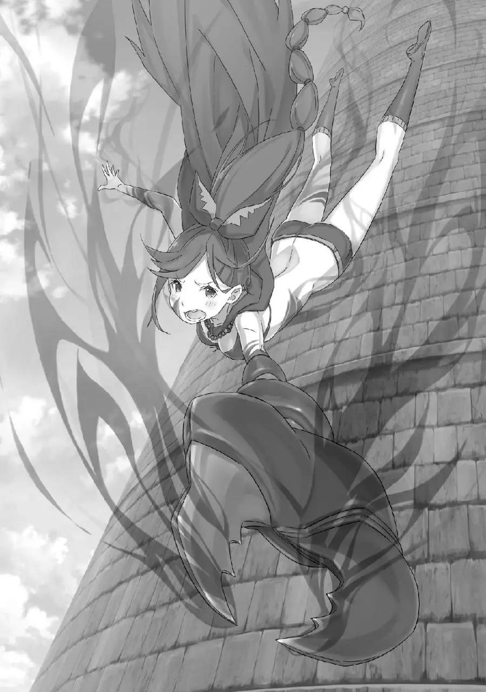

QC: Silly

Я не помню, говорил это или нет, но: Шаула в конце предложений всегда добавляет ~ссу. Я заменил это на не самый лучший вариант, на просто ~. Ближе к концу я перестал это добавлять, ибо иначе теряется напряжение (имхо).

――В разрушающейся башне, жизнь Нацуки Субару сгорела под ударом Рейда.

Он буквально сгорел дотла в конце своей жизни.

Прежде всего, есть много вещей, в которых он хотел бы убедиться, например, каким образом Рейд стоял на ногах в рушащейся башне, каким образом он сопротивлялся интенсивности приближающейся тени, что он планировал делать потом, но он оставит всё это.

Единственное, что было несомненно, это то, что последняя вспышка Рейда поглотила и испарила его.

Вероятно, это не было больно, — подумал он.

Конечно, он ни капельки не думал, что это было милосердием Рейда, но тот факт, что момент «Смерти» не сопровождался болью и страхом, был редкостью для Субару, который умер много раз за короткий промежуток времени.

Да, боли и страха не было. ――Но, был лишь «Гнев» '――Я' Сколько ещё он будет продолжать накапливать бессмысленные «смерти»?

До тех пор, пока есть вещи, которые можно вернуть, и намеки на преодоление трудностей, «Смерть» Субару не бессмысленна, и «Смерти», которые продолжают накапливаться, не были напрасными.

Это был ужасный обман.

Это всего лишь предлог, чтобы закрывать глаза на собственную беспомощность.

Он просто не хочет думать, что умер бессмысленно, беспомощно, случайно, бессердечно, безрезультатно.

Поэтому он жаждал причину в своей «Смерти».

Если бы он не был слабым.

Если бы он был более сообразительным.

Если бы только он был сильным, умным и крепким духом, а не таким. 'Но……' Так как здесь был только слабый, тупой, жалкий Нацуки Субару.

Так как никто и никогда не пытался бросить подобного Субару.

Так как они поддерживают его нынешнюю, покрытую ранами решимость. 'Поэтому, я――' Поэтому, Нацуки Субару――

«――Если я скажу тебе умереть, ты умрёшь?» То, что он решительно заявил это, не означает, что в нем не было нерешительности.

Она была в нём, ведь в тот момент, когда он задал этот вопрос, он не мог предсказать, какая у неё будет реакция. ――Нет, по меньшей мере это он мог предсказать.

Он представил себе несколько вариантов и он думал, что это будет один из них.

Тогда в чем заключается эта нерешительность, которую он почувствовал в тот момент, когда задал этот вопрос?

Так или иначе―― Шаула: ――? Умру ли я, если Мастер-сама скажет?

Он почувствовал боль в груди, когда Шаула растерянно подняла палец к собственной щеке.

Это было похоже на удар ножом, такой болезненный, что он разрывает на части и заставляет кричать глубоко в груди. «――――» Схватившись за грудь, Субару глубоко-глубоко вздыхает.

Он подумал, что это забавно: хоть он и был тем, кто добровольно произнес душераздирающие слова, но тем, кому было больно, был он. Увидев Субару в таком состоянии, Шаула удивленно вытаращила глаза.

Поведение Шаулы было таким, как будто ее спросили, что она хочет сегодня на ужин, и она ответила на это без всякой злобы.

Ее реакция — вторая из худших среди тех, что предсказал Субару.

Без всяких колебаний Шаула принимает приказ расстаться с собственной жизнью.

Посмотрев ей прямо в глаза, можно было легко сказать, что это не ложь и не шутка, а ее безошибочно истинные чувства.

Вероятно, сердце Субару было бы спасено, если бы он смог увидеть её тёмные расчеты и мысли.

Однако реальность не предоставила Субару такого пути спасения. На данном этапе он даже не мог отличить, милосердие это или бессердечие, но―― Субару: ……Вот как Шаула: Мастер-сама, вы хотите чтобы я умерла~? У-м-м, я была бы счастлива сделать все, о чем попросит меня Мастер-сама, и я совершенно готова, но вы снова сделали решительный шаг в очень странное время, да?

Сейчас в башне очень запутанная ситуация……

Субару: Я понимаю. Понимаю.

Услышав хриплый ответ Субару, Шаула поворачивает голову, продолжая прижимать палец к щеке. Когда ее шея двинулась, ее длинная коса―― скорпионий хвост закачался.

Скорпионий хвост. Если подумать, это такое ироническое название.

Аналогично тому, что «Шаула» означает созвездие Скорпиона, это имя выражалось в её теле. И это, несомненно, отражалось не только в ее имени, но и во многих других аспектах ее личности.

Несомненно, потому, что она не скрывает свои мысли.

Потому―― Субару: ――Шаула, ты можешь превратиться в гигантского скорпиона?

Без всякого промедления, Субару бросил мяч прямо* в секрет другой стороны. (Очередная отсылка к бейсболу, ) Пять препятствий нападают на Сторожевую башню Плеяд―― Одно из них — черный как смоль гигантский скорпион. Субару отчасти был убежден, что это Шаула.

Однако, несмотря ни на что, это всего лишь сенситивный ответ, данный «Кор Леонисом», полномочием, сила которого также является непонятной для Субару.

Самый быстрый способ убедиться в сенситивном ответе это напрямую задать вопрос.

Конечно, если бы у него было больше времени, он бы вероятно выбрал другой подход, и если бы он не доверял ответу другой стороны, ему все равно пришлось бы искать другие средства.

Но, вопрос Субару заставил Шаулу продолжить наклонять голову, Шаула: Это не совсем «превращение», но да, я могу это сделать~! Ах, правда мне это не нравится, потому что это не подходит моей красоте~. Я думаю, что лучше всего выгляжу в этой форме, которую Мама-сама и Мастер-сама придумали для меня~ Несмотря на то, что это был несвязанный вопрос, Шаула ответила легко и без колебаний. «――――» У нее не было намерений что-либо скрывать.

Характер Шаулы, можно сказать, был установлен с помощью этого ответа. В то же время, гигантский скорпион, появившийся в башне―― теперь он был убежден, что это была она.

Когда «Кор Леонис» показал местоположение его товарищей в башне, один из огоньков указывал на того гигантского скорпиона; Как и ожидалось, это был именно такой механизм.

Шаула: Мастер-сама? Всё в порядке~? Вы не хорошо выглядите? Хотите освежиться на подушке из моих коленей, руках, груди, объятиях или что-то в этом роде~?

Субару: ……Не начинай говорить то, что выводит из себя. Ты ведь сама сказала, что мы не можем себе сейчас этого позволить Шаула: Это правда, что башня находится в беспорядке, но, с моей точки зрения, у Мастера-сама гораздо более высокий приоритет, поэтому все остальное отходит на второй план~. Так что если Мастер-сама решит использовать мое смятение в своих интересах и скажет, что хочет сцепиться со мной, я бы приветствовала это очень тепло~. Я вся горю~ Субару: Не гори. Возьми немного воды.

Шаула: Мастер-сама такой злой~~ Шаула надула губы и бросила на Субару обиженный взгляд.

Если обращать внимание только на её речь и выражение лица, то можно ошибочно подумать, что ситуация, в которой сейчас находятся Субару и компания настолько мирная, насколько это только возможно. «――――» Однако реальность совсем не добра к ним. Всё далеко от мира.

Пока Субару и Шаула неторопливо беседовали, Эмилия и Рам усердно старались остановить «Обжорство», а Беатрис присоединилась к ним в качестве подкрепления. Юлиус должен был столкнуться с Рейдом = Роем на втором этаже, а Ехидна присоединиться к Патраш и эвакуироваться в «Тайгету» с Рем. А Мейли сдерживала стадо магических зверей―― В настоящее время были предприняты наилучшие шаги для устранения пяти препятствий.

Однако все это было лишь обманом ради разговора с Шаулой.

Потому, что в этом цикле, Нацуки Субару―― Шаула: М, Мастер-сама? Произошло что-то понастоящему серьезное? Если вы будете смотреть на меня такими внушительными глазами, я не смогу сдержать своё четырехсотлетнее ожидание, вы знаете……?

Находясь под пристальным взглядом Субару, Шаула обнимает свое тело руками. Это старалось выглядеть как обычно, но по какой-то причине это не было так.

Она на самом деле чувствует волнение из-за поведения Субару. Отличается―― Нет, это не так. Возможно, это и есть ее истинные намерения.

Её не затрясло, когда Субару сказал ей умереть, однако если Субару ведёт себя как-то ненормально, то она была удивительно хрупка. ――Она подобна цыпленку, невинно тоскующему по своим родителям. «――――» Когда он задал Шауле первый вопрос, у Субару в голове было несколько вариантов.

Наихудшей возможностью из всех было то, что как только Субару бросит в нее эти бессердечные слова, Шаула преобразится и раскроет свою истинную природу, убив в этом импульсе Субару. ――Если отношение Шаулы до этого момента было всего лишь притворством, и все это было лишь ложью.

Эта возможность не была невозможна.

Хотя он не был уверен на 100% до этого вопроса, но у него есть реальные результаты от ее превращения в гигантского скорпиона, убийство Субару, Ехидны и Беатрис. Весьма возможно, что она также была вовлечена в трагический цикл, в котором Субару не смог найти живых, так как она стала гигантским скорпионом.

Поэтому первый вопрос был азартной игрой для Субару.

Это не было бы странно, если бы в следующий момент после того, как Шаула поняла вопрос, голова Субару испарилась, и подобную ставку―― Он мог сказать, что выиграл её.

Однако на одной ставке это не закончится.

Потребуется нечто большее, чем серия небольших побед, чтобы компенсировать долг, который Субару неосознанно накопил, ставки, установленные «Обжорством» и Сторожевой башней Плеяд, и поражения до сих пор.

Чтобы выиграть по-крупному, вы должны делать большие ставки.

Посему―― Субару: Шаула, извини за все эти вопросы, но я должен спросить. Из того, что я слышал, есть какие-то правила для этого Испытания Сторожевой башни Плеяд, верно?

Шаула: Вы спрашиваете это в тот момент времени, когда я вся пылаю!? ……Ну, они есть? Я уже говорила это до того, как Мастер-сама ударился головой об унитаз, но……

Субару: Расскажи мне о них.

Не скрывая своего угрюмого отношения от претензии Субару, Шаула слегка столкнула пальцами* перед грудью. Но, она быстро подняла палец вверх и пробормотала, «Умм», (. если я правильно понимаю, это ) Шаула: Первое, запрещено уходить не закончив Испытания. Второе, запрещено нарушать правила Испытаний. Третье, запрещено проявлять неуважение к библиотеке. Четвертое, запрещено какое-либо вредительство в отношении самой башни. ――Вот.

Считая на пальцах, Шаула объяснила это ужасно беглым голосом.

Конечно, она очень красноречивый человек, если разговор ограничен бесполезностью, так что нет чувства неправильности в том, что она дает такое скупое объяснение. Нет неправильности, но было за что зацепиться.

У нее был непривычно серьезный тон, а также в конце своего считания на пальцах, она прикоснулась к последнему пальцу и остановилась.

Субару: ――И пятое?

Шаула: ……Его нет. Мастер-сама, вы меня не слышали~?

Я ведь сказала лишь четыре~. Мастер-сама, вы забыли даже как считать? Это никуда не годится. Я не сильна в цифрах, но я могу сосчитать до стольки……

Субару: Шаула. «――――» «Топ», Субару сделал один шаг, подойдя поближе к Шауле.

Первоначально они стояли напротив, но расстояние между ними сократилось до того, что протянув руки они могли схватить друг друга. ――Это действие — ставка со стороны Субару.

Разумеется, разница в силе между ними не настолько мала, чтобы с ней можно было справиться просто тем, что они стали на один шаг ближе друг к другу.

Шаула: Мастер-сама… возможно, вы играете с моим сердцем~? В сущности, это Мастер-сама так приблизился, если уж вы хотите чтобы я заговорила, то тому и быть. Если вы продолжите в том же духе и крепко обнимете меня……

Субару: Если это действительно заставит тебя признаться, я это сделаю. Думаю, можно сказать, что это твоя привилегия служебного положения. ……Хотя, если полагаться на мою ненадежную интуицию, то думаю, что этого не произойдет. «――――» Субару: Шаула, я спрошу еще раз. Какое пятое правило башни?

Получив тихий отказ Шаулы, Субару вновь задал этот вопрос.

Это было действие, которое ступало не в её физическое пространство, а в ее душу. Возможно это было резко, но она не могла просто сделать вид, что не услышала его; ей нужно дать что-то в ответ.

Схватившись за эту решимость, Шаула сделала небольшой вдох перед Субару, который сжал кулаки, Шаула: ―― (Бесполезно/Ни в коем случае/Нет/и т.д.

Примерно такой смысл.) Субару: ……?

Отрицательно покачав головой, Шаула скрестила руки на своей пышной груди, создав крест.

Жест сам по себе был детским, но ее глаза были наполнены серьёзностью. «――――» Уставившись на Субару, который ступил на рискованное место, глаза Шаулы наполняются сильными эмоциями.

Эти хрупкие и эфемерные, но тихие и во всех отношениях глубокие эмоции были тем, что следовало бы назвать мольбой.

Неохотно, она снова покачала головой, Шаула: NG. Ни в коем случае, я не хочу это говорить.

Пятое правило? Не стоит беспокоиться об этом, не так ли? В наш с Мастером-сама медовый месяц, какое это имеет отношение……

Субару: Как это может не иметь отношения? Я, все остальные, проходим Испытания этой башни. Я не могу оптимистически думать, что с нами все будет в порядке, если мы не будем знать правил. Поэтому, Шаула, Шаула: Я не хочу Субару: Шаула!

Словно ребенок, не желающий считаться ни с какими доводами, Шаула заткнула уши и отвернулась. В ответ на поведение Шаулы, Субару сильным тоном заявил.

Субару: Ты — это ты, и у тебя есть своя роль в этой башне. Звездный страж башни……? Ты делаешь это уже давно, я прав? Не знаю, так ли это, но уже 400 лет! В таком случае―― Шаула: Четыре, дня.

Субару: ……что?

Раздавшийся шепот на мгновение остановил мысли Субару.

Количество лет, упомянутые Субару, и несравнимо меньшее время. Разумеется, её разговоры были ложью, и Шаула провела гораздо меньшее время в сторожевой башне―― Такое было просто невозможно.

Пока её глаза продолжали содержать в себе мольбу, Шаула, с дрожащими губами, продолжила.

Шаула: Прошло всего четыре дня с тех пор, как Мастерсама с остальными пришли в башню. Из этих четырех дней, первые два Мастер-сама был в постели, так что у меня и Мастера-сама было лишь два дня, чтобы встретиться, поговорить, побыть друг с другом…… Я ждала 400 лет! Всего два дня……

Субару: Шаула……

Шаула: Я думала, что будет достаточно одного момента, одного взгляда Почти опустив глаза, Шаула быстро остановила себя.

Как будто она не хотела выпускать Субару из виду даже на мгновение. ――Нет, если подумать, то так оно и есть.

Насколько Субару мог вспомнить, всякий раз, когда Шаула находилась в том же месте, что и он, она всегда смотрела на него. Безусловно, это не из-за того, что она жаждет наблюдать за каждым его движением―― Шаула: Четыреста лет, всё время в башне, я ждала Мастера-сама. Я думала, что буду довольна, если смогу увидеть хоть раз. ――Однако подобное было ложью «――――» Шаула: Потому что Мастер-сама — это все для меня. Весь Мастера-сама, все мои мысли состоят из всего Мастерасама. Даже если бы я использовала все 400 лет, я все равно не смогла бы передать это Мастеру-сама. И всего два дня…… Я не хочу этого.

Субару: ……Поэтому ты не расскажешь мне о пятом правиле?

Острое чувство охватывает все тело Шаулы и формирует ее существо.

Четыреста лет―― Субару, наконец, почувствовал тяжесть этих слов, которые он воспринимал лишь буквально.

Потому что ее отношение было слишком легкомысленным, чтобы говорить о четырехстах годах.

Может у нее нет органа, который существует для того, чтобы чувствовать боль, страдание, печаль, эмоции?

Он задался вопросом, было ли даже её сердце, даже её душа такой же неорганической, как у того скорпиона.

Шаула: Я не хочу говорить это правило. NG. Потому что если я скажу…… «――――» Шаула: Если я скажу, Мастер-сама обнаружит способ пройти Испытания. Поэтому, если я скажу, если я все же расскажу…… Мое с Мастером-сама время закончится.

Сильно обняв свое тело, Шаула излила свои чувства Субару.

Ее тон голоса, словно ее рвало кровью―― Нет, как будто она рыдала, пронзил сердце Субару.

Это был ответ, которого он не ожидал.

Как и в случае с первым вопросом, у Субару было несколько возможных ответов на этот вопрос.

Истинная причина, по которой Шаула скрывает правило Сторожевой башни Плеяд. ――Он думал, что раз она сообщница человека со скверным характером, который создал правила этой башни, то за этим должен стоять какой-то мотив.

Или, это не имело никакого отношения к чему-либо темному, и ее неспособность рассказать правило, возможно, была простой прихотью или забывчивостью и, возможно, вообще ничего не значила.

Но на деле это не было ни то, ни другое.

Мотив Шаулы заключался в том, что она не хочет говорить правило башни. И этот мотив был искренним желанием, не связанным с Мудрецом, построившим башню. ――Спустя четыреста лет одиночества, Шаула воссоединилась с человеком, которого она так долго ждала.

Это сбылось, и она рада, что это произошло, поэтому она хочет, чтобы это время длилось как можно дольше.

И чтобы исполнить эту маленькую жадность―― Шаула: Мастер-сама, вы возненавидите меня, ту, кто вам соврал? «――――» Шаула: Возненавидите и не захотите больше видеть лица…… так вы думаете?

Почему она выглядит более огорченной, чем когда он сказал ей «Ты умрешь?».

Почему она придает большее значение тому, будет ли он ненавидеть её или нет, чем тому, что перестанет жить? ――Почему она думает лишь об этой цели, несмотря на аж четырехсотлетнее ожидание?

Субару: ……Я не возненавижу тебя или что-либо в этом роде «――――» Субару: Потому, что ты молчала, я думал, что, вероятно, переживу что-то невероятно трудное, и, честно говоря, думаю, что мне даже не следовало так загонять тебя в угол Субару честно рассказал то, что было у него на душе Шауле, которая хранила молчание.

В этом нет лжи. Это его истинные мысли. Намеренное сокрытие Шаулой информации, несомненно, помешало ему принять необходимые решения, получить ответы, и в результате Субару умер несколькими ужасными смертями.

Не только Субару. Помимо Субару, Эмилия, Беатрис, а также другие.

Он не может забыть то отчаяние, разочарование, беспомощность в те моменты.

Поэтому, если существовала такая сущность, похожая на корень всех зол, которая привела к этим моментам, Субару был уверен, что он не смог бы простить этого человека.

В таком случае, может ли он подумать то же самое о Шауле, которая сейчас вот так стоит перед ним? '――Нет' Он не может думать о Шауле, о той, кто провела четыреста лет в одиночестве, той, кто наполнил смысл своего рождения всего за два дня и была удовлетворена настолько, что обрела счастье, как о корне всех зол.

Если и есть корень всех зол, то это несправедливость самого мира, тот, кто создал эти вынужденные обстоятельства, «Мастер-сама», который приказал Шауле провести четыреста лет―― «――ах» Внезапно с губ Шаулы сорвался хриплый вздох.

Субару: Шаула?

Шаула: А, ах…… аах, а……

Почувствовав что-то необычное в состоянии Шаулы перед ним, Субару позвал ее по имени. Однако Шаула не ответила на призыв Субару, а лишь закрыла лицо ладонью.

Болезненный, дрожащий голос, не похожий на ее собственный, вырвался из ее горла.

Шаула: Не, хорошо…… не хорошо…… Мастер-сама!

Мастер-сама, Мастер-сама-Мастер-сама-Мастер-самаМастер-сама……!

Субару: Шаула!? Шаула, что случилось? Так внезапно……

Шаула: ――Кто-то, нарушил правило «――――» Субару подбежал к ней и попытался потрясти ее за белое плечо, но наоборот была схвачена его рука. Затем, Шаула больно схватила Субару за запястье своей тонкой рукой, и сказала это.

Когда она сказала это, у Субару, который смотрел прямо в глаза Шауле, перехватило дыхание. ――В темных глаза Шаулы проистекали странные изменения.

Внутри ее круглых глаз, черные зрачки разделились на три части и начали пульсировать ярко-красным цветом.

Трансформация произошла одновременно в левом и правом глазных яблоках, что означало, что черные зрачки разделились на шесть частей. ――Шесть фасеточных глаз, по три с каждой стороны.

Шаула: Мастер-сама……! Пока ещё не слишком поздно……

Субару: Не поздно?

Субару: Если Мастер-сама прикажет, я…… я, могу ещё убить себя Глазные яблоки Шаулы пульсировали алым, и белый пар медленно начал подниматься от всего ее тела. Белая кожа постепенно становилась красноватой, и даже Субару, стоявший прямо рядом с ней, мог почувствовать ненормальное повышение температуры ее тела.

Принцип неизвестен. ――Но тело Шаулы температурит и начинает трансформироваться.

Возможно, что это результат начальной ступени превращения в гигантского скорпиона.

Шаула: Когда я трансформируюсь, я не смогу этого сделать. Я стану бесчувственной машиной для убийств и убью Мастер-сама. Но я хочу Мастера-сама… невыносимо хочу, хочу Мастера-сама…… поэтому, Субару: Прежде, чем это произойдет, Шаула: Пожалуйста, прикажите мне умереть. ……Если я сделаю это, я, Мастера-сама, Шаула не стала продолжать говорить, что тогда она не убьет его.

Но вместо слов, её глаза, дрожащий голос, вся душа говорила это. «――――» *Дрожь*, Все тело Субару также наполнилось беспрецедентным чувством страха. Это, несомненно, инстинктивная человеческая реакция на ужас перед его лицом, который не кажется чем-то от мира сего. «Человек» Нацуки Субару боится Шаулу перед своими глазами, «Чудовище».

Поэтому, Субару―― Субару: Шаула, расскажи мне пятое правило Шаула: Мастер-сама, сейчас не время……

Субару: Если расскажешь――!

Субару громким голосом прервал настойчивую просьбу Шаулы. Плечи Шаулы задрожали от его грозного вида.

Субару схватил ее за дрожащие плечи. Горячо.

Температура тела Шаулы выросла настолько сильно, что его ладони, казалось, вот-вот сгорят.

Но он не отпустит. Сейчас, то, что раскаляет её душу и тело, он не отпустит.

Субару: Если ты расскажешь, я отдам приказ. ――Успокойся. Прежде чем ты превратишься в монстра, я отдам приказ. «――――» Услышав прямое заявление Субару, глаза Шаулы раскрылись. немного погодя, она обратилась к Субару, «Мастерсама», Шаула: Мастер-сама, вы бабник () Субару: Я не помню, что был таким……

Шаула: Тогда, Мастер-сама Шаула-ник (). Я сосредоточена на -нике……

Тонко улыбнувшись, Шаула легонько положила свою руку на руку Субару, которая была на ее плече.

И―― Шаула: ――Пятое, не запрещено разрушать Испытания «――――» Шаула: Смотрите, изменился цвет глаз. ――На любимый Мастер-сама, С этими словами, Шаула толкнула Субару в грудь.

Так как это было сильнее, чем он ожидал, Субару не смог удержаться за её плечи и отступил назад. Слегка кашлянув и посмотрев вперед, Шаула обхватила себя руками и скорчилась на месте―― Шаула: «Аа, ах…… аах, ааа…… кх!» Кроваво-красный пар поднимался от всего ее тела. Пар изменил цвет, опасный признак. Глаза Шаулы также потеряли свою черноту, и незаметно изменились до неузнаваемости в ярко-красные.

Шаула: Мас, тер-сама…… быстрее. Прежде, чем я, я закончу…… «――――» Шаула: Пожалуйста, скажите…… убить себя! Если Мастер-сама скажет, я……

Тем же ртом, что говорил, что не хочет чтобы Субару и остальные закончили Испытания и ушли из башни, Шаула настойчиво просила разрушить ее собственную жизнь, чтобы Субару и другие―― Нет, она хотела избежать убийства Субару.

Услышав отчаянный голос Шаулы, Субару вздохнул.

А после, Субару: Шаула.

Шаула: Мастер-сама……

Субару: ――Я виноват. Я солгал тебе Шаула: э?

Глаза Шаулы расширились от слов Субару. Увидев реакцию Шаулы, Субару задержал дыхание, и прыгнул далеко назад.

То, что Шаула оттолкнула его, было благословением*. ――Если бы Шаула продолжала держать его за запястье, он бы никогда не смог этого сделать. (. Неудачное событие или ситуация, которая приводит к непредвиденному положительному результату. Я не смог найти подходящий русский аналог.) ――Тело Субару перевалилось через край балкона и вылетело в свободное пространство.

Шаула: Мас―― Голос Шаулы, последовавший в следующее мгновение, в сию же секунду заглушился свирепым песчаным ветром.

И в таком темпе, тело Субару безостановочно стало падать с высоты нескольких сотен метров вниз без какой-либо страховки. «――――» Тот факт, что он спрыгнул вниз, не означает, что у него был план спасения.

Он ничего не готовил заранее. То, что сделал Субару, было чистейшим самоубийством. Он ни в коем случае не хотел бы этого делать, и не хотел бы говорить, но―― С самого начала он планировал это сделать.

Если в этом цикле эти действия были бы допустимы, то он бы обязательно так и сделал.

Потому, что теперь Субару может без колебаний доверять своему выбору.

Но―― Шаула: Мастер-сама――!!

Таким же образом спрыгнув с балкона, Шаула погналась за Субару С широко раскрытыми глазами, в отчаянии вытянув руку, Шаула выпрыгнула на встречу Субару, но не чтобы попытаться убить его своими руками, но чтобы спасти ему жизнь. ――Истинным лицом гигантского скорпиона была Шаула. ――Шаула намеренно скрывала правило башни. ――Шаула неоднократно убила Субару и его товарищей, и является одним из пяти препятствий на их пути.

И всё же―― Субару: Это ведь нормально, что я хочу тебя спасти? «――――» Как она умоляла Субару отдать ей приказ умереть, чтобы она не убила его, трансформировавшись против своей воли до самого конца, он никогда этого не забудет.

Хоть это и не в его характере, но он хочет быть уверен в том, что так оно и будет.

Кому он поможет, кому не поможет, кого он победит, кого защитит, кого будет любить?

Он знал, что Нацуки Субару не сможет продвинуться дальше, не решив это.

Теперь он больше не сомневается в том, кого любить.

Шаула: ――Мастер-самааааааАААААААА!

Пока Шаула протягивала руку и пыталась догнать Субару, ее облик изменялся.

Вытянутые руки увеличиваются, превращаясь в пару больших ножниц с черным как смоль панцирем.

Белая кожа полностью покрылась грубым панцирем, а тело расширяется, как будто оно разрывается изнутри.

В мгновение, болезненные физические трансформации, подобные взрыву плоти и крови, собираются, словно повёрнутая вспять рулетка, и, наконец, достигают кульминации в своей катастрофической трансформации―― явив завершенного гигантского скорпиона.

Затем, хвост гигантского скорпиона быстро нацелился на Субару.

Вероятно, белое светящееся жало вылетит оттуда и в одно мгновение сожжет жизнь Субару. Для Субару в воздухе нет никакого способа избежать его.

Но―― Субару: ――Я не позволю тебе убить меня, потому что тогда Шаула будет плакать «――――» Выпущенное жало―― не достигнет его быстрее, чем наступит конец падения.

Неистово, Субару и Гигантский скорпион падают на рой магических зверей, которые собирались ворваться в Песчаную Башню. Субару не сможет увидеть своими глазами этого.

Существование, называемое Нацуки Субару, не сможет выдержать падение с нескольких сотен метров.

Он лопнет, и его жизнь рассеется.

Однако, непосредственно перед тем, как его жизнь исчезла, он сказал всего одну пару слов―― «Я непременно спасу тебя» ――Песчаному ветру потребовалось совсем немного времени чтобы унести послание, которое не дошло до гигантского скорпиона.

