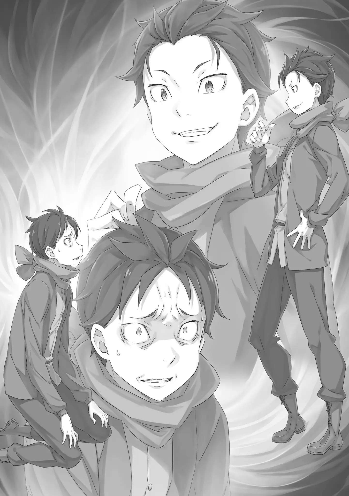

Человек с короткими чёрными волосами, длинным туловищем но короткими ногами, и будто желающими убить санпаку глазами.

Он был до отвращения знакомым, и смотрел сверху вниз на Нацуки Субару, который стоял на коленях на белой земле. «――――» Ошеломленно, не моргая, он смотрел на лицо человека напротив.

Куда бы он не смотрел, он узнавал это лицо―― Нет, оно немного отличалось. Возможно потому, что ему не привычна эта настоящая фигура.

Большую часть времени то, что мы привыкли видеть ежедневно, — это отражение в зеркале или на поверхности воды. Человеческое лицо не является строго симметричным, и это создает тонкие различия.

Поэтому―― Ах, верно. Это не зеркальное отражение, так что это немного неудобно? В этом смысле это больше похоже на просмотр фотографии или видео, так? «――кх» ――? А, возможно, ты думаешь так же? Его щеки напряглись при звуке голоса, который будто прочитал его мысли, но человеку напротив лишь пришла та же мысль.

Это также шумело в его ■, но возражение в ответ не принесло бы ни вреда, ни пользы. Во-первых, для Субару важен не обмен подобным.

Более сильная, безошибочно, проблема, которая словно раскачивала всё―― И снова…… Йо, брат «――――» Нет, брат немного дезориентирует? Здесь правильнее…… Йо, другой я Человек, который поднимает руку и приветствует его легким тоном―― Нет, он не такой уж незнакомец. У них такая связь, что даже назвать их близкими друзьями было бы довольно мягко.

Потому что тем, кто тут был, без сомнения, был никто иной, как «Нацуки Субару», у которого было то же лицо, что и у Нацуки Субару. «―― »Нацуки Субару« » ……Что это за еле заметный странный тон? Кроме того, называть себя полным именем…… Хотя, я не знаю, как еще называть. Несмотря на то, что такие ситуации часто встречаются в манге, на деле, это довольно запутанно « »Нацуки Субару« ……!» Возмущенный беззаботной речью «Субару», Субару встаёт. Он попытался схватить его за воротник, но его ноги запутались.

От недостатка сил в коленях, его поза рушиться―― Ой, это ведь опасно «――кх, Не прикасайся!» Его тело, которое вот-вот должно было упасть вперед, было поймано «Субару», который был перед ним. В тот момент, когда его коснулась рука, Субару почувствовал невыносимое отвращение и стряхнул его руку.

Затем он делает шаг или два в сторону от «Субару» и смотрит на него. "Почему ты здесь…… Прежде всего, здесь это где!?

Имея «Субару» в поле зрения, Субару указывает рукой на белый мир вокруг.

Белое пространство, пустое место, совсем как колыбель Од Лагуна, где он встретился с Архиепископом Греха «Обжорства», Луис Арнеб. «Дерьмо……!» Это создаёт хаос в его голове.

Внутри башни не прошло и несколько часов с тех пор, как он столкнулся с Луис.

Однако для Субару, который предпринял множество попыток преодолеть пять препятствий, это событие кажется давним.

Кроме того, Субару более двадцати раз пережил жизнь и смерть «Нацуки Субару» в «Книге мертвых». Некоторые «Книги мертвых» представляли собой короткие промежутки менее пяти минут между жизнью и смертью, в то время как одна даже длилась более года, и ничего не происходило.

Он пробовал их одну за другой, словно пожирал их. Для него было невозможно не потерять свое восприятие.

Течение времени было неопределенным, и вдобавок ко всему, он столкнулся с неожиданным противником.

Глаза Субару раскрылись, и дико замахав руками, «Почему я нахожусь в подобном месте!!» ――Это доказательство того, что ты меня догнал «――――» Ты догнал меня, прочитав «Книги мертвых». Должно быть, ты увидел и пережил все, чего не знал обо мне.

Мою, жизнь в другом мире «Ха» Субару громко выдохнул, в ответ на равнодушную манеру речи «Субару». Субару сжал зубы, глядя на его беспечное отношение.

Ему не нравится его пустое лицо, его словно всезнающее отношение и всё остальное. ――Во первых, что сейчас, этот человек сказал ему с невыносимым выражением на лице? «Я, догнал тебя?» Верно. Больше нет ничего, чего бы ты еще не знал обо мне. Поэтому…… «Хватит шутить ~кх!!» ―――― «Говоришь, что я догнал тебя? Это не смешно! Хватит врать! Ещё не все! Я знаю, что должно быть что-то ещё, что-то самое важное!» С вытаращенными глазами Субару закричал, на этот раз схватившись за воротник «Субару». «Субару» не пытался сопротивляться. И, притянув воротник человека на против на такое расстояние, что они могли чувствовать дыхание друг друга, он смотрит в его черные глаза. «――――» В момент, когда он увидел в отражении черных глаз абсолютно такое же лицо, внутри него поднялась отвратительная ненависть к самому себе.

Он не знал и не хотел знать, было ли это отвращение к самому себе или к «Себе» перед ним.

Но, на таком близком расстоянии, глядя на него, он зарычал. "Расскажи мне! Раз уж ты здесь, то будь полезен!

РАССКАЖИ! Где находится причина, которая сделала тебя тобой! Я её не вижу. Я не могу ее найти. Эту…… Причина, из-за которой я стал собой? «Да! Я уверен, что эта причина, сделавшая тебя тобой, существует. Тебя, тебя……» ――Ты ведь это уже увидел, нет? Схваченный за воротник, не сопротивляясь, «Субару» смотрит на Субару.

Он даже не пытается отбросить руку. Это заставляет Субару думать, что его не воспринимают всерьез.

Он смотрит на него сверху вниз с высокого места, которого он не может достичь―― «ХВАТИТ ТАК НА МЕНЯ СМОТРЕТЬ!» ――Га ~кх! Субару замахивается, и бьёт его кулаком в лицо.

Получив сильный удар, «Субару» падает. Точно такая же боль отражается и на Субару — подобного не было.

Боль, которую получил «Субару», боль, которую получал «Субару», раны.

Это, от того, что получал Нацуки Субару, отличается. «Говоришь так, словно я уже все узнал…… ясно, я понял» Субару ударил, заставив «Субару» упасть. Увидев, как он потирает тыльной стороной ладони место удара, Субару понимает.

Он уверен кто этот человек перед ним, который говорит так, словно всё знает.

Во первых, если это Колыбель Од Лагуна―― если это Коридор Воспоминаний, то разве он не должен прежде всего остерегаться его? «Ты Луис? Архиепископ Греха Обжорства! Это снова ты!? ……Я? »Не валяй дурака!« В прошлый раз, когда он столкнулся с Луис в Коридоре Воспоминаний, она побуждала его отделиться от »Нацуки Субару", чтобы затем полностью сожрать его.

Он смог вырваться из её клыков в самый последний момент, но если бы она сдалась и стала вести себя прилично после этого, её и других бы не называли Архиепископом Греха.

Он уже видел, насколько уродливы и неисправимы Архиепископы Греха.

Бетельгейзе, Регулус, Сириус и Капелла, они самые худшие из людей. Лей, Рой, а также Луис, не являются исключением.

Что, если Луис, которая ждала его в Книге мертвых Рейда, теперь, каким бы то ни было образом, скрылась в Книге мертвых Нацуки Субару ?

Таким образом, понятно, почему тут так величественно ждали Субару. "Это ведь действительно ты, Обжорство! Луис Арнеб!

Ты ни за что не сможешь так сбить меня с толку, изменив свою внешность!

Полномочие Луис Арнеб заключается в том, что помимо навыков, отнимая «Воспоминания» и «Имена», она даже отнимает их формы и пережевывает их в свои собственные.

Эта гнусность уже была продемонстрирована в башне.

Тот факт, что место, где это теперь демонстрируется, было изменено на Коридор Воспоминаний, не имеет никакого значения. «На этот раз ты таким образом захотела погрызть и захватить меня? Настойчива даже несмотря на то, что тебе однажды отказали…… ты так сильно хочешь Посмертно Вернуться!?» Без колебаний, он упомянул «Посмертное Возвращение».

Он много раз пережил ту адскую боль в воспоминаниях от произношения этих слов. Его сердце в наказание сжимали, что сопровождалось острой болью. Но, все было бы хорошо, если бы эту боль испытывал только он. ――Если бы это не касалось Эмилии, или других вокруг.

Однако, Субару, который подавил малейший страх и закричал, не был наказан.

У «Субару» перед ним тоже не было никаких признаков сжатия сердца. Он заметил, что «Субару», который, возможно, ожидал того же, также испытал облегчение из-за того, что дьявольская рука не появилась. Это, раздражает.

Такое же как у него лицо, такая же как у него взволнованность. ――Это выглядит словно утверждение, что они, несмотря ни на что, — это одно и то же. "――кх! Хватит, я уже понял! Это действительно такая поразительная сила? Это восхитительная сила!? Лишь возможность переделать все, умерев. Умерев, переделать все…… ничего кроме этого. Так как я дерьмо, результат тоже выходит дерьмовый!

Поэтому……« ―――― »Поэтому, я никого не смогу спасти. ……я позволю всем умереть. Из-за того, что я слабый, все будут горевать.

Даже если хочу сейчас, никого не могу спасти……!« ――»Посмертное Возвращение" не было тем, что нужно.

В самом деле худшая, похожая на дерьмо, сила.

Лучше бы подобный способ всегда являлся ненужным.

Одна ведьма пыталась объяснить ему, что эта сила прекрасна, что это лучшая вещь в мире, но он совсем с ней не согласен.

Вы не можете дать пушку в руки муравья и ожидать, что он с ней будет умело обращаться. В конце концов, они на это не способны.

Он слабый, крошечный, одинокий, плачущий, неразумный ребенок.

Ведьмы были правы на том чаепитии во сне. Он безнадёжен. Слабый. Он не может найти. Он не может использовать. К черту «Обжорство», к черту «Ведьму Жадности», которые этого не понимают.

Сколько черт возьми раз его должны обмануть, сколько раз его надежды должны растоптать, сколько раз его ■ должны разбить, чтобы он наконец научился.

Почему после стольких обманов, стольких растоптанных надежд, стольких разбитий ■, он все еще думает об этом. «Посмертное возвращение» показывает только отвратительные вещи этого мира.

Показывает неразумность, абсурдность, судьбу, которая заставляет хотеть отвернуться.

Несмотря на это, почему―― «――я люблю, всех?» Не осознавая, Субару опустил голову, встал на колени, и начал выкрикивать проклятия.

И на эти рыдающие, безобразные жалобы, «Субару» покачал головой. Покачав еще раз, он сказал, ――Я люблю всех. Вот почему я не могу остановиться «――――» Вытерев пальцами покрасневшую от удара щеку, «Субару» вместо Субару поднимается. «Нацуки Субару», который носит ту же одежду, имеет то же лицо и имя, но выглядит решительно, в отличии от него―― Вот почему, глядя на Нацуки Субару, Честно говоря, я даже представить себе не могу, как тебе, должно быть, тяжело находиться в таком положении. Со всем совершенно новым, начал с 6-го уровня, будучи первого без возможности возврата. Я понимаю все твои слёзные жалобы. Потому, что мне тоже неоднократно приходилось испытывать эти раны. Недостаток сил, недостаток знаний — он смотрел на лицо, которое должно было неоднократно пережить это. ――Нет, он неоднократно пережил это.

Субару узнал все поражения, всю боль, всю скорбь смерти, которые испытал «Субару». Он увидел все это своими собственными глазами. Все это, тело, ■, испытало.

Потому что он пережил это, потому что он знает, что это не ложь, он не может принять слова «Субару». Он не хочет их принимать. Если бы я был сильным, если бы я был мудрый, если бы я более, более…… это досадно, ведь так «Не говори, будто знаешь……! Обо мне, что ты знаешь» Я знаю. Ты должен знать, что я знаю. Это бесполезная ссора, на самом деле. Для меня, для тебя «――кх» В его словах возражения не было сил. Это было естественно.

Возражение отвергает точку зрения другой стороны, не соглашается и отражает, разрушает то, что вы не правы. Такая готовность необходима.

Нынешний Субару не может направить это на «Субару».

В конце концов, он знал это.

Он знал, что это не ложь и не обман, а целостность «Нацуки Субару». «Я не видел, твои воспоминания……» Ты не можешь вести себя как кто-то, кто без разрешения прочитал дневник другого «Я не видел, твои воспоминания!» Субару крепко сжал кулаки, услышав хмурый голос «Субару». «Субару», которого он ударил, который высказывает неодобрение в его адрес и чья поза ни разу не обрушилась во время диалога, кажется гораздо более зрелым, чем Субару. Возможно, это само собой разумеется.

В действительности, «Субару» ведь должен быть на год старше него.

Он накопил богатый опыт и много «смертей» в другом мире, а вдобавок ко всему сплел множество связей и приобрел то положение, в котором он находится сейчас.

Тем не менее―― «Я не видел, твои воспоминания……кх» Еще раз, Субару ещё раз говорит эти слова.

И снова, «Субару» ничего не сказал Субару, который повторил то же самое сожаление. Не ожидая ответа, Субару продолжил говорить в бреду. «Я, хотел видеть в тебе надежду. Что ты невероятный парень, и что если бы я узнал »Что-то«, что поддерживало твою крутость, я бы смог стать таким же. Однако……» И всё же, он понял.

Всё, он увидел.

Он понял, что «Нацуки Субару» — слабый и крошечный человек, ничем не отличающийся от Нацуки Субару здесь.

Он был просто обычным человеком, который встретил людей, которых Субару не знал, то время, которого Субару не знал, пробежал через историю, которую Субару не знал, и увидел виды, которых Субару не знал. «――Я хотел отрицать тебя, дать тебе что-то правдоподобное» Однако, это невозможно. «Но, я понял тебя. ――Ты такой же, как я» Мир, который видел «Нацуки Субару», мир, который он испытал, он его видел.

Он видел все раны, которые «Нацуки Субару» перенес, чтобы полюбить и продолжать любить этот мир, людей, которые в нем живут, а также Эмилию и других.

Он ошибался. Он заблуждался.

Поскольку это касается его самого, возможно, будет уместнее сказать, что он был слишком высокого мнения о себе.

Иллюзия, что «Нацуки Субару» был сверхчеловеком, была разрушена и отброшена. «Да, я понимал! Я знал! Ты…… Ты продолжал стоять, не сдавался на грани смерти, потому что на большее ты не способен!!» Как и он, «Субару» много раз натыкался на непреодолимые стены.

Каждый раз «Субару» преодолевал трудности умирая снова и снова, накапливая «Смерти», меняя ситуацию, то, как они встретились, и то, как они соединились.

Было только это. "Кто бы не встал после таких слов Рем!? Только когда Отто избил меня, я понял, что я слишком зазнался! Я всегда знал, что мои мама и папа так обо мне думали!

Потому что они мои отец и мать!

Виды, мимо которых проходил «Нацуки Субару», причины, ради которых ему нужно было преодолеть там не было «Что-то», к чему стремился Субару, там были, несомненно, только нагроможденные желания. «Я люблю Эмилию. Я хочу защитить ее. Я хочу быть с ней. Причина, по которой я хотел стать рыцарем, заключается в том, чтобы она думала обо мне именно так. Я был счастлив. Я хотел, чтобы девочка, которая боится, что ее возненавидят, вышла на улицу без всяких волнений, гордо заявив, что она из тех, кто способен быть любимым всеми! Я наконец смог вытащить Беатрис. Я хочу сделать ее счастливой на столько же времени, сколько она страдала. Ведь она имеет право быть счастливой, она!» Поэтому―― «――Ты не можешь сдаться просто потому, что ты любишь их всех! Кусок дерьма! Почему ты не сверхчеловек!! Почему ты все еще глупый ребенок!!» ―――― «Будь сильным, как Рейнхард! Будь хорош во всем, как Юлиус! Если ты не можешь этого сделать, будь полезен, как Феррис! Как насчёт овладения чего-нибудь одного, как Вильгельм-сан!? Ты, хотя бы как один из них……» Потребовалось долгое, даже болезненное время, но это всё, что он понял. «Нацуки Субару» — обычный человек, он, как и нынешний Субару, владеет теми же козырями в рукаве, совершенно плох даже в их использовании, нет удачи, когда доходит до победы или поражения.

Хотя бы как один―― «Хотя бы как один……» Он бормочет голосом, который потерял все свои силы.

Он сжимает руки, в которых не было хотя бы одного, даже одного. «……ты ведь Луис, верно» Хриплый голос задал вопрос, который не имел никакого отношения к предыдущему.

Услышав это, «Субару», который долгое время молчал, издал «Ах» и кивнул головой. Это не так. Я не Луис. Я бы не сказал, что к сожалению. Я бы не хотел с ней даже пересекаться.

Мне не нужно объяснять тебе, что у неё ужасный характер, не так ли? «угу…… да, это так» Тихо и слабо ответив, Субару закрыл лицо руками.

Из-за криков его горло охрипло, а кулак, ударивший «Субару», теперь жалуется на боль.

Если это Коридор Воспоминаний, и тело Субару здесь это лишь его сущность, то кажется нерезонным то, что он чувствует боль ――Да, боль и «смерть» всегда нерезонны и невыносимы.

Вот почему Луис Арнеб, Архиепископ Греха «Обжорства», ошибается.

Её мысли, что она хочет этого для себя, определенно неверны. «……почему ты исчез» А? «Почему ты исчез? Ты пропал, поэтому, столько трудностей……» Не пропавшее непонимание и причина, с которой все началось.

Почему «Нацуки Субару» исчез и родился Нацуки Субару.

Что случилось с «Нацуки Субару», который исчез вместе со своими воспоминаниями? «Твое исчезновение……» ……Это моя ошибка. Желая найти способ победы над Рейдом, я отправился в Тайгету. И, я обрадовался, успешно найдя его книгу, но……« »……Его книга оказалось пустой« Там я встретился с Обжорством. Остальное мне не нужно рассказывать тебе Почесывая затылок, »Субару" оглядывается на свой позор.

После встречи с Луис Арнеб в Коридоре Воспоминаний, «Нацуки Субару» был лишен своих «Воспоминаний». И вот, забыв все о своей жизни в другом мире и неспособный понять чувства окружающих, не говоря уже о своих собственных, родился Нацуки Субару. Не принижай настолько себя. ……Говорить такое трудно? Ведь ты — это я, верно «…… »Нацуки Субару« слабый, крошечный, неисправимый дурак» Это не неверно «Но» ――? «Субару», согласившийся с кривой улыбкой, поднимает брови от слабого бормотания Субару.

Глядя на подобную реакцию «Субару», Субару произносит последующие слова.

Ими были―― «――Ты поразительный парень, »Нацуки Субару"« ――Он увидел более двадцати »Посмертных Возвращений" — это была непререкаемая правда.

«――――» Он медленно прищуривается, глядя на человека, стоящего перед ним.

Знакомое лицо, лицо, которое он устал видеть, даже неприглядное лицо, но это его лицо. Это его, но это не его. Это его, но оно не похоже на его.

На этом лице была такая реакция, как будто оно впервые встретилось с чем-то неожиданным, оно было восхищённо. '……Самый близкий человек, хах?' Не многие люди могут любить себя от всего сердца.

Субару был особенно хорош в этом, он ненавидел себя.

Вероятно, для «Нацуки Субару» это ничем не отличается. ――Субару, «Субару», не любит себя.

Но, как самый близкий человек, «Нацуки Субару» в глазах Нацуки Субару, хотя это совершено неловко говорить, казался крутым. «Я уважаю тебя за то, что хоть ты и слабый, беспомощный, неспособный что-либо сделать, но все же ты борешься и очень любишь этих ребят. Поэтому――» ―――― «――Значение, которое я искал в твоих Книгах Мёртвых, заключается в этом» Но Книги Мёртвых были открыты не только для того, чтобы пережевать свою беспомощность, сожалеть о потере путеводной нити и упрекать себя за то, что у него было такое же лицо.

Конечно, не для того, чтобы удовлетворить свою манию величия, проследить корни сверхчеловека Нацуки Субару и получить уникальную силу.

Он узнал, что «Нацуки Субару» — просто человек, и он признает его поступки, его путь. ……Ты действительно парень, который внезапно говорит постыдные вещи «Субару», который до сих пор был заморожен заявлением Субару, неожиданно начал двигаться.

Прищурив глаза, «Субару» с дурным настроением―― Нет, он уставился на Субару c несколько неловким взглядом, и медленно указав на себя, Мне кажется странным говорить такое, но оглядываясь на мое прошлое ты действительно можешь говорить такое? Раз зашла уж речь об этом, это «Жизнь Нацуки Субару в другом мире с нуля», знаешь. «Ах, это странное чувство, когда имя главного героя совпадает с твоим» Это лучше, чем героиня, названная в честь твоей матери. ……Нет, это не то Обменявшись несколькими легкомысленными словами, Субару смотрит в глаза «Субару». «Субару», выглядя словно его скрутили*, он, указывая на себя рукой, (Я не знаю как это описывать. катасукаши — техника из сумо) Я говорил ранее, что это не так, но это действительно нормально? Возможность того, что я — это Луис, полностью не исчезла «Исчезла. Ты не попятился даже после того, как я ударил тебя» Все вернулось бы в норму только в случае, если это копирующая способность Янагисавы…… (Копирование — Способность Мицунари, позволяющая ему при касании головы кого-либо, полностью его копировать, в том числе внешность, воспоминания, характер и даже способности цели вместе с генетическим кодом, из-за чего даже близкие люди, обладающие сенсорными способностями, не способны заметить подмену. Несмотря на все это, если ударить его достаточно сильно, причинив боль, он вернется к своему настоящему облику) Как «Субару» и указал, это не является серьезной основой для таких выводов.

Однако, на данный момент, Субару отказался от своих подозрений по поводу «Субару».

Вероятно, из-за того, что «Субару» сказал ранее.

Даже если Луис Арнеб способна поглотить жизнь человека с головы до ног, она не смогла бы воссоздать это лицо, этот голос.

Потому что она не понимает счастье, блаженство, радость.

Поэтому―― «Тот, кто не может никого любить, не знает, каково это »Посмертно вернуться« потому, что любит кого-то другого.» ―――― «Субару» перед ним хранил молчание, когда Субару издал долгий, болезненный вздох.

Это было ужасно банально, просто красивые слова, приятные на слух. И все же он не мог найти другого ответа.

Итак, «Субару» перед ним — это безошибочно «Нацуки Субару». «Почему ты здесь? Ты ждал меня?» Он признает, что «Субару» перед ним имеет те же корни, что и он сам.

Тогда возникает вопрос, почему два Субару встретились здесь.

В ответ на вопрос Субару, «Субару» топнул по совершенно белому полу и, Мы с тобой встретились здесь лицом к лицу потому, что это наша единственная точка соприкосновения «Наша, точка соприкосновения……» Единственное место в башне, где пересекаются пути меня, у которого есть «Воспоминания», и тебя, у которого нет «Воспоминаний», — это на этом цикле «Книги мертвых». После этого момента или до этого момента мы с тобой никогда бы не встретились «――. Я все равно вернусь к своему первоначальному вопросу. Почему ты здесь?» Не понимая объяснения «Субару», Субару вновь задаёт тот же самый вопрос.

Строго говоря, двум Субару не имеет смысла встречаться здесь. Субару с «Воспоминаниями» и Субару без «Воспоминаний» существовали бы одновременно. ――Правила, по которым создается Книга мертвых, точно неизвестны.

Начнем с того, что странным было то, что книгНацуки Субарунакопилось столько же, сколько смертей до сих пор. Это было бы невозможно, если бы мир не наблюдал и фиксировал «Смерти»Нацуки Субаруизвне.

Выполняло ли Од Лагуна эту роль наблюдателя? «Но если это так, я не понимаю, почему Луис в Коридоре Воспоминаний была так взволнованна, если видела »Посмертное Возвращение«. Если это можно узнать извне……» Она просто находится в Коридоре Воспоминаний, она там не правитель. У правителя…… Я думаю, что у него, вероятно, еще худший характер. Если рассматривать с точки зрения этой ситуации «Я понял, когда ты сказал »человек с плохим характером«. Наиболее вероятный кандидат……» Одновременно остановившись, Субару и «Субару» в один голос сказали. «――Мудрец Флюгель» Человек, который больше всего подходит под описание «Наихудший характер».

Человек, который имеет отношение к строительству этой Сторожевой Башни Плеяд, который создал Испытание, поместив в него Рейда, и который также заставил Шаулу пройти через четырехсотлетнее одиночество, которое неизвестно когда закончилось бы.

Честно говоря, ему жаль Шаулу. Если это возможно, то он бы забрал её у этого мастера или кем бы он ни был. «Тогда, почему существует моё я с »Воспоминаниями« и без них одновременно……» ――. Это вопрос, на который нет ответа. Пока я здесь, и ты здесь «Похоже, что так?……» Хоть это и не давало ему покоя, Субару принял слова «Субару» и вздернул подбородок.

На самом деле, это должно быть вопрос такого рода, в котором нет задающего вопросы. Даже если можно прийти к какой-то теории, в конце концов на нее не было бы ответа.

Но если допустить, что этот вопрос должен быть исследован и ответ на него дан, то―― «Пока ты на самом деле не Луис Арнеб, это не является проблемой» Довольно назойливое подтверждение. Ты действительно мне веришь? «Я верю, верю. Я бы поверил ещё больше, если бы ты позволил мне снова ударить, но в другую сторону» Я понял. Ну, не сказал бы что это выгодная сделка, знаешь? Обменявшись легкомысленными словами в непринужденном тоне, Субару пожимает плечами на слова «Субару».

Трусливые слова, которые вот так пытаются изменить суть разговора, может и сработают на других, но они слишком прозрачны для таких как вы сами.

Поэтому, Субару смело задает один и тот же вопрос в третий раз. «Э~эй, другой я. ――Ради чего ты здесь?» ―――― «Я не поверю подобным словам, я уверен, что ты знаешь» Черные глаза Субару сузились, и он пробормотал это себе под нос в ответ на молчание «Субару». Но даже услышав его бормотание, он не ответил чем-то легкомысленным, как делал ранее.

Вместо этого, в черных глазах «Субару» всплывает блеск, который был там с самого начала.

Вероятно, это было, так называемое, чувство вины―― ――Хей, как ты думаешь, что происходит при слиянии воспоминаний? Вот почему Субару намеренно спросил это жизнерадостным тоном.

«――Интересно, есть ли ответ, который является образцом для такого рода разговоров?» «Я не знаю. Кажется, что на это нет точного ответа» «Вообще-то, ты, кажется, знаешь об этом месте больше, чем я, но есть ли какое-нибудь известное тебе правило, которое дало бы тебе преимущество передо мной?» «Ты ведь читал книгу, раскрывающую меня. Мы равны» «Равны?» «Равны» «……Что, если при случайном столкновении друг с другом, мы оба исчезнем?» «Можешь не говорить об этом. То, о чем ты беспокоишься, в основном беспокоит и меня……» «Что ж, и то верно. Итак, никаких обид, независимо от того, кто победит, хорошо? »Нет, я очень на тебя обижен. И если я обижаюсь на тебя, это означает, что ты тоже обижаешься на меня« »Нуу, это так. Наверное, это так. Хм, ■ узкое« (Он кажется говорит определенное слово, но мы пока что не знаем, что стоит за квадратиком, так что перевожу дословно) »Что ты сказал?« »■ узкое…… что-то не так?« »Нет, наверное мне послышалось« »――――« »――――« »Ах, верно. У меня есть пара вещей, о которых я хочу сказать, просто на случай, если вдруг что-то случится.

Можно?« »Ну, после того, как мы зашли так далеко, ты можешь говорить что угодно« »Ты, по сути, знаешь этот мир получше, чем я…… Это преимущество практически исчезло после того, как я прочитал «Книгу мертвых», но все немного изменилось, не так ли?« »Что-то изменилось?« »После того, как «Воспоминания» исчезли, я говорил и знакомился со всеми…… Я говорю о «Жизни Нацуки Субару в другом мире с нуля», о которой ты не знаешь« »――――« »В первую очередь, Мейли. У неё в кармане много бомб, и это нелегко, но она из тех людей, которые понимают, если с ними поговорить, так что, пожалуйста, поговори с ней. Думаю, прямо сейчас Мейли-семпай очень злится« »Ага, понял« »Также в башне бродит гигантский скорпион, но на самом деле это Шаула. Это очень опасная на вид штука, но…… Это не то, что она хочет делать. Пожалуйста, помоги также и ей. «Ага, понял» «Ох, я забыл упомянуть, что Рем пнула меня в спину, когда я встретил Луис. Тогда я не помнил Рем, так что только после того, как прочитал книгу, я вспомнил, какой она была…… Умм, как и ожидалось, это была моя Рем» «Нет, это моя Рем» «Нет, моя» «Моя» «――――» «――――» «Рам как-то говорила. Когда наступит оттепель, вещи, которые мы не могли видеть, будут хорошо видны и покажут свои лица. ……Как и ожидалось от нее» «Ага, верно» «Что касается Юлиуса…… Ну, нечего особо сказать, все в порядке. Он не настолько беспомощный, чтобы я или ты должны были что-то говорить» «Ага, я тоже так думаю» «Спасибо, что извинился перед папой и мамой» «Ага, м-м» «Спасибо, что помог Отто и Гарфиэлю» «Ага» «Спасибо, что помог Петре, Фредерике, жителям деревни Арам» «Ага» «Спасибо, что вытащил Беатрис, и взялся с ней за руки» «――――» «Эмилию……» «――――» «Спасибо, что любишь Эмилию. Я тоже, люблю её. Очень люблю» «……Да, я понимаю» «――Нацуки Субару. Я отлично знаю, что ты поразительный парень, поэтому ты несомненно будешь в порядке» «Да» «――――» «Ум. ……Полагаю, это так» «――――» «Да. ――Если это мы, то все будет в порядке»

«В порядке, хах?» «Всё верно. В порядке, разве нет?» «Как я и знал, ты потрясающий» «……Ах, но, ум. Я должен сказать» «――――» «――Похоже, что мои летние каникулы, закончились»

――Разговор подходит к концу, и они пожимают друг другу руки. «――――» Вдох, выдох.

Вероятно, слияние не произойдет в иррегулярной форме. ――Нет, вероятно, процесс слияния изначально не должен был происходить здесь.

Само существование Субару, сами события, которые происходили, все было иррегулярно.

Поэтому―― «――――» По щекам Субару потекли слезы, и когда они скатились до подбородка, он наконец это заметил.

Так или иначе, он не мог заставить себя вытереть их, потому что слезы, которые текли, определенно, не были пролиты Субару.

Слезы потекли от кого-то в Субару, кто теперь медленно сливался с ним.

Затем, глубоко и часто дыша, он начал осознавать свой собственный разум. Эти палящие внутри него, его собственные воспоминания―― «――кх» Внезапно, двадцать неизвестных Нацуки Субару «Смертей», появились перед его глазами.

Во всех он боролся в башне и в конце испытывал «смерть»―― Та часть, которую он рассматривал с опаской, будет ли она передана или нет, была прикреплена к нему.

Связь, была создана. "Ты тоже пересек мост более чем достаточно раз……!

Другой он, который множество раз произносил хвалебные слова в его адрес. Проглотив эту одинокую борьбу и тяжелую борьбу за доверие к своим товарищам, Субару понимает.

Действительно, как Субару и сказал. ――Он может уважать это в тебе.

Он глубоко вздохнул и кивнул, пытаясь сдержать такие эмоции и странно учащенное сердцебиение.

Затем Субару поднял голову и уставился вперед.

Неизменное белое пространство.

Пустое место в Коридоре Воспоминаний, созданное иррегулярной ситуацией.

Там, где всего несколько мгновений назад был другой Субару, которому он пожал руку. ――Увидев маленькую фигуру, сидевшую снизу, черные глаза Субару сузились.

И―― «Что ж. Ты увидела то, что хотела увидеть? ――Луис Арнеб» Нацуки Субару, который начав читать Книгу мертвых, прибыл в это место и исчез―― Нет, Субару тихо задал вопрос, Луис Арнеб.

