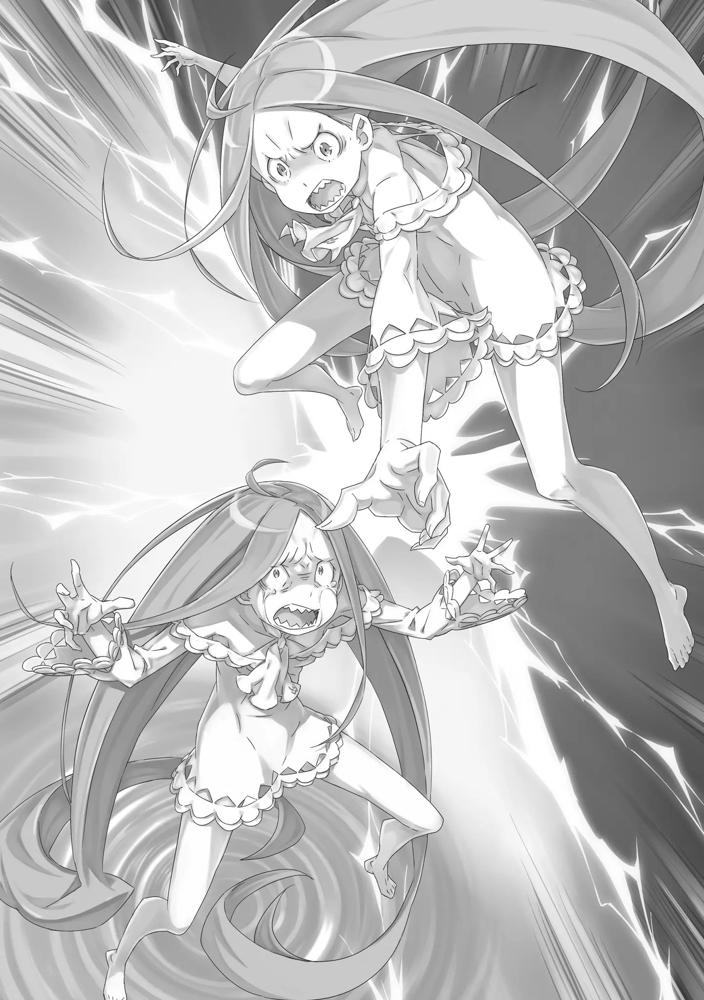

«――――» ――Нацуки Субару смотрит на свою ладонь перед девочкой, которая рыдает, обхватив голову руками, после того, как пережила «Посмертное Возвращение».

Ему не больно от того, что она называла его монстром и ругалась на него.

Это безумие. Он согласен с её выкриками, что это невозможно вынести.

Субару сам умирал очень много раз.

Он осознает, что этот опыт не является чем-то лёгким.

Просто, стиснув зубы, он терпит.

Он всей душой желает, чтобы вместо кого-либо, друзей и знакомых, тех, чье лицо и имя он не знает, дорогих товарищей и любимых людей, жестокий вид смерти встречал лично он.

Это―― '――Ах, я действительно невероятный, верно, Нацуки Субару?' Сжав ладонь, на которую он смотрел, Субару искренне «хвалит себя».

Он хвалил себя не похожими на правду, легкомысленными аргументами. Он использовал такие слова, чтобы утешить или вдохновить себя.

Но, нынешнее «самовосхваление» — отличается.

Существо под именем Нацуки Субару, которое ужасно объективно увидело «Воспоминания» и «Реальные ощущения», похвалило свой собственный путь, по которому он продолжал следовать до сих пор. 'Что за. Неожиданно, я довольно большая шишка, хах?' И это также верно для «Нацуки Субару», который потерял свои «Воспоминания», вернулся к началу своего призыва в другой мир и попал сюда, прочитав «Книги мертвых».

Он поражен тем, что из состояния неведения о другом мире, он вернулся без разбитого сердца после того, как накопил столько переживаний «Смерти», сколько было у Субару за год.

Благодаря этому, потерянные «Воспоминания» и дальнейшие «Воспоминания» смогли слиться. 'О Мейли, Шауле, которых ты поручил, я позабочусь' Мейли, у которой убийство вошло в привычку, и будущее стало почти темным и закрытым.

Шаула, освобожденная от четырехсотлетнего ожидания, которая хочет продолжать жить в благословенном настоящем. 'И Рам, и Юлиус слишком сильно давят на себя, чёрт. Не могу поверить, что эти двое это делают' Рам, которая всегда максимально заставляет думать, что нет никого более благоразумного, на кого можно положиться.

Юлиус, который потерял свое место в мире, но все еще с верой держится за свой меч. 'Беатрис и Ехидне тоже доставляю неприятности? Черт, я такой……' Беатрис, которая самоотверженно поддерживала Субару и которая раньше всех заметила пределы его сердца.

Ехидна, которая больше всех сомневалась в Субару, который потерял память, и которая в самом конце просила прощения. «――――» И, независимо от того, потерял ли он свои «Воспоминания», независимо от того, сколько раз он переделывал, он в конечном счете вернулся на путь, начертанный ему.

Он желает так поступить. Он обязан. Другой путь невозможен.

Вот насколько, он―― '――' С любовью и несомненным душевным спокойствием на губах, Субару поднял голову.

И затем он смотрит на Луис, которая все еще закрывает лицо руками и дрожит.

Субару: Эй Луис: «Хик!» Субару ……Ты слишком напугана Когда она так сильно испугалась одного-единственного зова, Субару чешет пальцем щеку.

Девочка, которую без сомнений можно назвать ребёнком. Вид такой девочки, дрожащей от страха и отчаянно отвергающей мир, душераздирающ. По виду, она девочка, которая родилась с такой эфемерной хрупкостью, что невольно появляется желание протянуть ей руку помощи.

Несомненно у неё есть природная способность ослаблять бдительность противников и проникать внутрь. ――Она выглядела как младенец, словно чистейший кристалл, который насильственно отполировали.

Луис Арнеб, которая не знает мира, похожа на невинного младенца.

Однако―― Субару: ――Луис Арнеб, ты проиграла. ――Нацуки Субару не позволит Луис Арнеб плакать, как младенцу. «――――» Глаза абсолютно неподвижной Луиc расширяются от брошенного в лицо доказательства поражения.

Разум Субару, однако, был спокоен, как штиль в море, пока он наблюдал, как страх растекается в её глазах, как чернила по белой бумаге.

Не все проблемы в мире можно решить, сказав, что вы о них не знали. И то, что сделала Луис и её братья, — это злодеяние, которое никогда и ни в коем случае не должно быть прощено.

Дело не в том, что у нее не было возможности узнать. У нее была возможность учиться через «Воспоминания» других людей, соприкасаясь с радостью, гневом, печалью и весельем, хорошим и плохим.

Но то, что она впитала, было не состраданием и добротой к другим, а более темным, уродливым желанием и поведением, состоящим в том, чтобы топтать и плевать на тяжелую жизнь других.

Может быть, учителя были плохими. Ее братья были плохими образцами для подражания в ее жизни.

Однако это было ее решение не использовать ни единой возможности, чтобы вернуться на путь, с которого она сошла.

Субару: Если ты была частью меня, то ты должна знать.

Вы…… те, кто называют себя Архиепископами Греха с короной на голове, являетесь семью смертными грехами. «Семь смертных грехов» — это романтические слова для распространителей синдрома восьмиклассника, но есть нечто близкое к этому, называемое «Семь добродетелей».

Семь смертных грехов, «Гордыня», «Зависть», «Гнев», «Обжорство», «Лень», «Похоть», «Жадность».

И Семь добродетелей, «Благоразумие», «Мужество», «Умеренность», «Справедливость», «Вера», «Надежда», «Любовь».

Если семь смертных грехов были кармой, которую невозможно отделить от людей, пока они живы, то это были семь обещаний, которые нельзя забывать, чтобы люди, несущие эти грехи, могли жить с другими.

Потому, что мы уважаем друг друга за это, люди могут жить вместе.

Субару: Однако, вы…… ты, нарушила это.

Поэтому, Архиепископы Греха, Луис Арнеб, стали злом, которое нельзя простить. «Хк, хк, хк» Испуганная и съежившаяся Луис была поражена словами Субару и задрожала, словно от боли.

Каждое движение других людей, всего мира, приводит к страху. Субару знал это чувство.

Испытав чувство из другого измерения, под названием «Посмертное Возвращение», в заблокированной ситуации, когда человек не знает, как преодолеть «Смерть», даже звук трепещущих на ветру сухих листьев кажется смертельным.

Вспомнив это леденящее душу ощущение, Субару закрыл глаза.

И, Субару: Луис Арнеб, ты проиграла. «――――» Субару: Так что признай это и отпусти все.

Субару вновь повторил, что она потерпела поражение, чтобы она это поняла. Получив в ответ от девочки молчание, он вонзил еще одно требование.

Субару вернул свои «Воспоминания» благодаря случайной встречи Нацуки Субару, который потерял свою память, и Нацуки Субару незадолго до того, как у него отняли память―― Благодаря тому, что «Книги мертвых» воспроизвели шаги Субару в другом мире, он смог вернуть свои воспоминания, проследив их.

Использовав «Книги мертвых», он вновь пережил свои украденные «Воспоминания».

И затем, слияние Нацуки Субару до и после потери «Воспоминаний», привело к успешному второму пришествию Нацуки Субару.

В качестве побочного продукта, Луис, которая вошла в Субару как фактор ведьмы, была изгнана как инородное тело. Но, Субару своими собственными глазами видел, как она, обращаясь с украденными «Воспоминаниями» так, как ей захочется, свободно извлекла их, оторвала.

Если это возможно, тогда способ, как спасти тех, кто был лишен своих «Воспоминаний» и «Имени»―― Субару: Ты сказала «Если мы думаем, что можем это сделать, значит мы можем сделать все», верно? В таком случае……

Из самоуверенности и чувства собственного достоинства она зашла так далеко, что даже разделила Фактор ведьмы на две части.

Если она может это сделать, то вполне возможно отменить результат своего собственного полномочия.

Если это, хотя бы это, можно сделать, то возможно―― ――Люди, у которых забрали «Воспоминания» и «Имя», Рем, смогут вернуться.

Субару: В таком случае, освободи всех людей, которых ты съела до сих пор. Если ты это сделаешь……

Луис: ……Если это сделаем, то что? «――――» Голос Субару был полон энергии, но Луис кратко прервала этот голос.

Луис, сидя на белом полу, притянув свои колени, смотрела на Субару сквозь просветы в своих золотых, длинных-длинных волосах, которые раскинулись по полу, обвивая её.

То единственное, что отражалось в её глазах, было безошибочным страхом. «Если это сделаем, то что?» Луис повторяет этот же вопрос ещё раз.

На мгновение Субару был застигнут врасплох реакцией Луис, но он быстро восстановил самообладание, когда увидел её позицию в диалоге. Гораздо лучше, чем молчание из-за страха.

Он должен ударить напрямую словами и найти компромисс, который изменит ситуацию.

Субару: Освободи всех людей, которых ты съела. Как только их «Имена» вернутся, честь тех, кто уже мертв, будет восстановлена. Если же они живы, то они смогут воссоединиться со своими семьями. Если ты это сделаешь, я на тебя……

Луис: ――Закроешь глаза, хочешь сказать? Если это сделаем, то Братец закроет на нас глаза? Закроешь глаза?

Его слова снова прерывают, и Субару смущается.

Наблюдая за реакцией Субару, «Ха», Луис открыла рот, в котором были острые клыки, и, Луис: Это не так, не так ли! Подобное невозможно!

Энергично подняв голову, со сверкающими и блестящими, широко раскрытыми глазами, Луис кричит.

Оба её глаза, смотрящие на Субару, все еще влажные от страха, тускло светились. С этими блестящими глазами, Луис сильно раскачивается взад-вперед, «Это не так! Ведь не так, действительно не так, конечно не так, это не может быть так, поэтому нет, мы понимаем, что это не так, поэтому! Братец не закроет на нас глаза! Абсолютно безусловно! Но» «――――» "Братец уничтожает своих врагов! Абсолютно сокрушая их до самого конца! Не оставив даже кусочка кожи!

Основательно! Завершает идеальной игрой! В состоянии это сделать! В таком случае тогда это не так!

Это не имеет смысла!" Как будто она услышала первоклассную шутку, Луис разбивает молчание и эмоционально взрывается.

И фигура вспыхнувшей Луис показалась Субару ужасно далёкой, маленькой.

Выражение лица Луис было в беспорядке, она будто собиралась смеяться, собиралась злиться, собиралась быть печальной, и в замешательстве, растеряно, она умоляла, чтобы страх, которого не было ни в одной из этих реакций, проявился. «――――» Все бурные эмоциональные выходы Луис были напрямую связаны со «Страхом».

Не имеет значения, является ли вход радостью, гневом или печалью. Если она знает, что за любым концом следует «Страх», то о чем, черт возьми, она должна радоваться, злиться или грустить?

Даже то, во что она верила, в конце привело к «Страху».

Укоренившееся в Луис отрицание было более чем понятно для Субару. Она проклинала все на свете и чувствовала себя так, словно попала в бурю сомнений и не могла двигаться дальше.

Это был ад, носящий имя самого себя, который Нацуки Субару тоже испытал.

Причина, по которой Субару смог сбежать из такого безнадежного ада, несомненно, заключалась в том, что кто-то держал его за руку, и тепло этой руки удерживало его от потери себя.

Сереброволосая девушка, которая спасла жизнь и сердце Субару в его самом первом другом мире.

Девочка в платье, которая пыталась защитить Субару, которого все предали.

Синеволосая девушка, которая нежно ранила Субару, который хотел бросить всё. ――Именно по этим причинам Нацуки Субару не попал в ловушку ада. «――――» Подобной душевной поддержки нет у Луис Арнеб, которая тонет в страхе у него перед глазами.

Поэтому она не может преодолеть «Страх». ――О «Посмертном возвращении» можно думать только как о проклятии, которое затягивает в страшный сон, в ад, из которого никогда не выберешься.

Это банальное выражение, но человек не может существовать один. Поэтому, ей, чтобы выбраться из лап «Страха», нужен кто-то, кто протянет ей руку.

Так же, как однажды это сделал Субару.

Однако―― Субару: ――Я, не помогу тебе. ――Субару не подаст руку Луис Арнеб. «――ах» Субару: Я, не помогу тебе. Я не пожалею тебя.

Луис Арнеб, Архиепископ Греха «Обжорства» — человек, который осквернял «Души», стоя в белом мире.

Независимо от того, насколько мило она выглядит, насколько жалкое и хрупкое она впечатление производит, или насколько сильное желание помочь она вызывает, Субару не простит ее.

Архиепископы греха совершили непростительные грехи. ――Таков вывод Нацуки Субару.

Субару: Прежде всего, думаю, что бы я не сказал, это не послужит для тебя спасением. «ик» Испугавшись, глаза Луис широко раскрываются, и в них нет ничего, кроме страха по отношению к Субару.

В этом месте, единственный человек, который может понять страх, который она испытывает, — это Субару, который и является причиной ее страха. Другими словами, ее путаница не решится.

И, когда Субару открыто заявил, что он не спасёт её, что он ненавидит её, Луис вцепилась когтями в бесформенный белый мир и отчаянно попятилась, чтобы держаться подальше от Субару―― Луис: Знаем…… мы знаем приёмы Братца! Мы ведь были Братцем! Поэтому знаем, что делает Братец……

Но, не позволим этого ~цу!

Субару: Ты……

Луис: Вернуть что съели? Категорически нет! Ведь это наша жизненная линия! Если она пропадет, Братец нас убьет! Пока это не возвращено, Братец не сможет нас убить! Наоборот, это наоборот, совершенно наоборот!

Чтобы Братец нас не убил, мы не можем вернуть это!

Поэтому-у!!

С громким криком, Луис повернула ладонь к Субару.

Ничего из её белой руки не вылетело. Однако, цель Луис осуществилась другим способом.

Медленно зрение Субару искажается в белый, и «Коридор Воспоминаний» изменяется. Обнаружив присутствие инородного вещества, мир, чтобы устранить его, начинает сжиматься.

В результате, существование Субару стало извлекаться―― Луис: Достаточно, мы не желаем находиться с Братцем в одном месте ни секунды больше! Невозможно с точки зрения физиологии! Невозможно с точки зрения жизни!

Это невозможно с точки зрения судьбы! Онии-чан и Ниисама съедят Братца! Пусть делают всё, что хотят! Мы увольняемся!

Решение Луис, насколько бы это не раздражало, было ее наилучшим ходом.

Субару выталкивает из «Коридора Воспоминаний» и отправляет назад в реальность. Этого антагониста Луис поручает своим братьям, Лею и Рою.

Если Архиепископы Греха «Обжорства» могут выбирать, разделять еду или нет, то Луис попрощается с наихудшим блюдом из всех, Нацуки Субару. Будут ли ее Братья страдать так же, как и она, она сейчас не знает.

Субару: «――гх» Стоять на месте, довольно трудно.

Нет никаких опор, и даже почва, на которой он стоял, была расплывчатой: Субару беспомощно слаб в этом «Коридоре воспоминаний».

Субару: Если я тебе не нравлюсь…… то реши это сама……

Луис: Мы не попадемся на такое ~цу! Даже если мы убьём тебя, это бесполезно! Ты собираешься прижать нас с помощью «Посмертного Возвращения», не так ли!

Не позволим это! Онии-чан и Нии-сама съедят Братца до конца! Это условия для нашей победы ~цу!!

Оскалив клыки, Луис уставившись смотрит на Субару, который пытался удержаться на ногах. Он больше не может сопротивляться этому. Понимая это, он глубоко выдыхает.

Затем, черные глаза Субару, прямо пронизывают Луис―― Луис: «――ик» Субару: Твои братья — твоя последняя надежда, понятно. ――Я перережу этот канат и заставлю тебя заплатить. Запомни это, Луис Арнеб.

Указав пальцем на испуганную, съежившуюся Луис, он продолжает. «Всё отвратительное, всё тяжёлое, ты лично понесёшь. ――Ты не убежишь от »Воспоминаний"« И стыд, и сожаления — это »Воспоминания", которые были необходимы, чтобы сформировать то, кем он является сегодня.

Всё это было пищей для человека по имени Нацуки Субару, и Нацуки Субару, который был создан всем этим, прибыл сюда после накопления многих «смертей».

Если Нацуки Субару потрясающий, то именно стыд и сожаления сделали его таким. «Как бы то ни было, с меня достаточно подобного стыда» Как только его поле зрения стало полностью белым, в разгар выталкивания из места, которого нигде нет, мира, которого нет снаружи, Субару пробормотал это.

И, «Коридор воспоминаний» развалился――

Затем, когда в «Коридоре Воспоминаний» исчез из виду невероятный безумец, Луис Арнеб сделала долгий, долгий, дрожащий вдох, убеждаясь в своей собственной жизни. «Ах, Ах, Аах……» Горло дрожало, лёгкие дрожали, сердце дрожало, душа дрожала.

Даже Луис, которая сожрала всевозможные «Воспоминания», не могла понять такое ужасающее существование. Что действительно пугало в нем, так это невероятная духовность. «Поче, му……» Она не знала, может ли она быть нормальной.

Луис стала его частью, до этого практически вырвав его «Воспоминания» до конца. Медленно и тщательно она грызла, жевала «Воспоминания».

Это действие было похоже на очистку луковицы слой за слоем — после каждой «Смерти» появлялась новая жизнь, и она попробовала на вкус это больше двадцати раз.

До того, как она испытала «Посмертное возвращение», она была в таком восторге, что каждое из множества «Воспоминаний» она съедала по отдельности, но теперь это был ужас за гранью понимания.

Прежде всего, почему она не смогла забрать «Воспоминания» до «Призыва в другой мир», или как там это называется?

Сила «Обжорства» способна поглощать «Воспоминания» цели вплоть до момента рождения. Тем не менее, у него забрались «Воспоминания» лишь за один год.

Словно Од Лагуна не расценивала «Воспоминания» до этого, ненавидела, или―― ――Эй, разве это не отличается от того, как должно быть? «――――» Внезапно, голос прогремел среди «Коридора воспоминаний», места, где она должна была остаться одна, и испугавшись, Луис оборачивается. Однако, её сомнения сразу же рассеялись Взгляд обернувшейся Луис упал на―― «Мы……» Правильно, это мы. Мы те, кто ждал здесь, потому что вытянули короткий конец палки. Та, кто играла в пробную версию наилучшей жизни, став частично Братцем, ты как следует подготовила игровую обстановку? Ты здесь, чтобы сообщить об этом? (Как я понимаю, она к ней обращается на «Мы». В целях удобства заменил на «ты» (не везде)) Сказав это, улыбающееся существо, как две капли воды похожее на Луис――― это была «Луис».

Фактор ведьмы, который исконно должен был быть единым, был разделен на два, и этот точно такой же человек является второй частью её «Души», в правильном значении, другой ею.

Возможно, самой вероятной причиной, сделавшей такое возможным, является то, что Луис была существованием с «душой» но без тела, которое не боится самотрансформации.

Она с «Луис», её вторым Я, не разделяет личный опыт.

Поэтому образ «Луис», открыто смеющейся, казался ей странно далеким. ――? В чем дело, мы? Делаешь такое лицо, хм. Вопервых, что с Братцем? Если ты тут, значит, что он попал сюда, вновь прочитав Книгу мертвых, верно? «――――» К тому же, почему ты долгое время уже сидишь так?

Почему ты свернулась калачиком? Эй, эй-эй, ты достигла того, что хотела? Мы потерпели неудачу, но ты ведь справилась, да? Поразительно, поразительно, хорошо выступила, не так ли. Братец нисколько этого не заметил. Мы внутри него! Хлопая в ладоши с приподнятым настроением, «Луис» вспоминает их запретное рандеву.

Разумеется, говорить ей об этом нет смысла, ведь Луис знает об этом случае.

Он соединился с «Коридором воспоминаний», думая, что найдет способ победы над Рейдом Астрея, тираническим мечником, с помощью его «Книги мертвых». Затем «Луис» снова встретилась с ним, который все и вся забыл, и, если удастся, она планировала съесть его вместе с Луис, Фактор ведьмы.

Это был эксперимент, можно ли захватить его полномочие, объединив Факторы ведьмы, но он провалился из-за неожиданной помехи.

Она совершенно точно не ожидала, что одно из «Воспоминаний», которое она съела, нанесет ответный удар.

Однако, оглядываясь сейчас, если бы та помеха не появилась, Луис, возможно, уже стала бы единым целым с ним.

Он и―― Эй-эй, что случилось, мы! Расскажи нам все детали, проинформируй нас! Увидела, верно? Услышала, верно?

Унюхала, верно? Коснулась, верно? Почувствовала, верно? ――Полномочия Нацуки Субару! «――Не произноси его имя~я!! ――~цу Вслед за словами с возбуждённым тоном, »Луис" слегка протянула руку. Как раз в тот момент, когда рука собиралась коснуться её плеча, Луис в гневе стряхивает ее.

Буйно, изо всех сил, со всем отторжением, буквально руку своей второй половины. ……ха? Естественно, не поняв что значит это действие её второй половины, на лице «Луис» появляется замешательство.

Однако у Луис не было возможности обратить внимание на такую реакцию «Луис». Луис схватилась за плечо, к которому пытался прикоснуться «Другой человек», и отступая назад, она с отвращением качает головой. «Нет! Нет-нет-нет! Не прикасайся! Не подходи!» Она была поражена, собственным сознанием.

Но, это её чувства. Они не могут предать так же, как ад, носящий имя самого себя.

Она понимает. Перед ней такое же как у неё лицо, «Луис» с таким же как у неё опытом.

Существо, которое было второй частью её «Души»―― Теперь, для Луис это был другой человек.

Она не знает, что этот другой человек сделает. Она не защитит её.

Она может стать причиной её смерти. Она опасный враг, который может убить её, что не хочет умирать. "Не приближайся! Не подходи — не подходи — не подходи

— не подходи ~цу! Не приближайся ближе! Не прикасайся к на-ам!" ―――― Она может реагировать только точно так же, как тогда, когда обнимала себя встретившись с ним.

В этом пространстве, где она не может свободно смотреть в зеркало, для Луис, которая сформировала себя с помощью «Воспоминаний» других, чувство чужеродности по отношению к «Луис», у которой такое же лицо, как у неё, сильнее, чем к незнакомцу.

И вот так, видя, что Луис повторяет отрицать и отказываться, «Луис» перевела взгляд на свою руку, которую она стряхнула. И, Ха? Что за В ответ на отторжение Луис, «Луис» сжала свою руку.

Затем, ужасно жаждущим голосом, она посмотрела вниз на Луис, и заскрежетала зубами. Что за. Что за — что за, что это значит? Что это значит, что это за намерение, что это за план, что это за мысль, эй!? «Хи-ик ~цу» Это отличается от того, как должно быть ~цу! Что случилось, мы!? Что с этой реакцией! Поведением!

Ответом! Отвергнутая «Луис» раздражается и сокращает дистанцию до съежившейся Луис. Присев на корточки перед Луис, чье горло сжимается от этой силы, «Луис» хватает за волосы свою вторую половину.

И, с силой подняв её голову, на расстоянии, что можно почувствовать дыхание, два одинаковых лица смотрят друг на друга. Это ведь ненормально. Ненормально, это ненормально, ведь ненормально, крайне ненормально, действительно ненормально, так как ненормально, конечно ненормально, так как слишком ненормально, я говорю, что это ненормально!! «――――» Что со стратегией? План ведь сработал, не так ли?

План состоял в том, чтобы став Фактором проникнуть в Братца и совершать плохие поступки, верно? Это было прекрасное исполнение. Братец боялся! Он был ошибочно убежден, что он и «Нацуки Субару» самые близкие люди! Луис нечего сказать в ответ на планы, о которых рассказывает «Луис», и на достигнутый прогресс.

На самом деле, план Луис и «Луис» шел хорошо. Луис испытала «Посмертное возвращение» в Субару, и творила зло чтобы вызвать разделение Субару и «Нацуки Субару».

И, оставшаяся в «Коридоре Воспоминаний» «Луис» собиралась съесть Субару, который отделил себя от «Нацуки Субару», и забрать его полномочие. Оставался всего один шаг.

И даже если бы это не сработало―― ――Не важно сколько раз, десятки или сотни!

Обещание было бросать вызов пока не заберём полномочие «Посмертного Возвращения», не так ли! Что такого в том, что немного потерпели поражение! Мы можем снова забрать «Воспоминания» Братца и заставить его начинать все сначала столько раз, сколько захотим. Давай поменяемся ролями и бросим вызов снова, и снова, и снова! Ошибки, могут быть исправлены! Она собиралась полностью захватить Полномочие, меняясь ролями с тем, кто ассимилируется в качестве Фактора Ведьмы и тем, кто ожидает в «Коридоре воспоминаний», столько раз, пока не надоест.

И всё же―― ――И всё же, в чем причина твоего отвержения! «НЕЕЕЕЕеееет――~цу!!» У, ах! Резко, в руку, которая держала её волосы, была вложена сила, и Луис с агонией и страхом закричала.

Она толкнула «Луис» перед ней в грудь, заставив вторую половину от боли вскрикнуть и упасть на ягодицы.

Они недоверчиво смотрят друг на друга, и на белый мир опускается трогательная тишина. Затем, когда Луис не может ничего сказать, зрачки «Луис» расширяются и, Неужели…… ты хочешь забрать полномочие себе? «――――» Теперь, когда ты успешна получила силу «Посмертного Возвращения», быстро удалив Братца, ты собираешься наслаждаться этим одна? Оставив нас, тоже «Это, это не так ~цу!» Луис кричит на «Луис», которая описывает свои ошеломительные, обездвиживающие, омерзительные сомнения. Подобное категорически невозможно. Этого не может быть. Она даже частичку этого не хочет держать при себе.

Если бы она могла избавиться от подобной вещи, она бы это сделала. Но, это невозможно.

Потому что это не «Воспоминания» кого-то другого, а «Луис Арнеб». Нельзя стереть свои собственные «Воспоминания». Их нельзя отнять. Их нельзя ни принять, ни вынуть. Всё отвратительное, всё тяжёлое, ты лично понесёшь. ――Ты не убежишь от «Воспоминаний» «ик» Это было то, что он сказал в самый последний момент.

То, что она пережила, путь, по которому она прошла, не может быть стерт. Это история самой «Луис Арнеб», которая, безусловно, родилась в ней. Хватит шутить ~цу! Что-то подобное, никогда не сможем принять……! Она хотела обрести счастье. Стать счастливой, обретя свою собственную жизнь.

Однако её собственная жизнь, которую она приобрела в неожиданной форме, разбила её ■―― «Сердце» вдребезги, нанеся ей ранение, которое нельзя исправить. «Луис» не может понять страха Луис от разбитого и поношенного сердца. Мы не позволим тебе монополизировать путь к нашему счастью! "Это не так! Не так — не так — не так — не та-а-а-а-ак!

Подобное не верно! Подобное не является правдой!

Подобное действительно не верно-о!!« Никогда в такое не поверим! Никогда не думали, что ты предашь! Как и ожидалось, да, мы! Ага. Понятнопонятно. Да-да, действительно понятно! »Нет! Не понимаешь! Не понимаешь! Ты никогда не поймешь наши чувства!" Нет, понимаем! Ведь речь о нас. Действительно. Если это для нашего счастья, то мы не выбираем и не должны выбирать способы для его достижения! Счастье

— это то, что уменьшается все больше и больше с каждой мелочью! «Луис» прыжком встаёт на ноги и складывает руки перед своей худой грудью. Затем, она с великолепной, широкой улыбкой, посылает косой взгляд на Луис, которая с голосом полных слез отрицает её слова. Что, если мы бессознательно готовили заговор против нас? Если мы заполучили «Посмертное возвращение», то нас ни за что нельзя победить, как бы сильно ни старались! Потрясающе! Умно, не так ли! «Не хотим умирать! Мы не хотим умирать! Не хотим умирать — не хотим умирать — не хотим умира-а-а-ать!» Не ври так очевидно ~цу! Не хотим умирать? Почему?

Из-за чего? Если ты не хочешь, отдай это нам! Такая грязная жажда исключительного владения……

Подобное не похоже на нас! «――――» Из уст «Луис» выходит отрицание, что они одно и то же существо.

Как только это произошло, Луис показалось, что она услышал звук того, как что-то внутри неё жаждет, трескается и разбивается вдребезги. Она не знала, что именно разрушалось внутри неё.

Хоть она и не понимала―― ――Нацуки Субару принадлежит нам. Ты, вордомушник Она понятия не имеет, что(Субару) это такое, и все же она высокомерно говорит о нем как о вещи.

Хотя она единственная, кто действительно понимает, что это такое, она своевольно это говорит. ――Только она, понимает его. «――Мы единственные, кто знает Нацуки Субару. Ты, глупая девчонка» Он ужасен. Он омерзителен. Он, ненавистный.

Поэтому―― Дай нам тоже попробовать―― ~цу!! «Луис» набрасывается, чтобы забрать «Воспоминания», которые сделали Луис тем, кто она есть.

Передача этого означала бы «Смерть» для Луис Арнеб.

Означала, «Смерть». ――Означала мир, который видел он. «А, А-а-а-а―― ~цу!!» Закричала. Закричала. Кричит, кричит, кричит, кричала.

Продолжая кричать, кричала, разбрасывала крик, продолжала поднимать крик―― «――Не хотим умирать» Ужасно величественный, бессмысленный конфликт, начался в «Коридоре воспоминаний».

Конфликт, который никто не видел, которым никто не интересовался.

Начался, и закончился. ――Лишённый победителя, конфликт.

???: «――Искусство ледяного призыва!!» В тот момент, когда она решительно выкрикнула это, внутри ладоней создалось чувство, которое она сильно сжала, и замахнулась. То, что возникло в обеих руках, было длинным мечом, сделанным изо льда, острота которого была намного острее, чем у незаконченного железного меча.

Хотя она только начала практиковаться в фехтовании, она была хороша в движении своего тела. Продолжив свои движения, она взмахнула своим ледяным мечом и перекрывая ему пути к бегству, она попыталась нанести смертельный удар.

Однако―― ???: «Хакхахаа! Делаешь это~о! Но, говорю же, это все ещё все ещё не достигнет цели~и! ???: »――кх!" Враг избегает её жестких атак, размахивая своими длинными волосами пока ползал на четвереньках по земле.

Тот, кто уставился на неё, оскалив свои острые клыки, был Архиепископом Греха «Обжорства», который представился как Лей Батенкайтос.

При упоминании имени Архиепископов Греха, в её груди поднимается какое-то приглушенное отвращение.

Потому, что около месяца назад они столкнулись с несколькими Архиепископами Греха в Городе Водных Врат Пристелла, которые вызвали разные решения, вызвали откладывание разных решений, и, в любом случае, гору ужасных событий.

Было рождено много печальных и больных чувств.

Ликвидация или решение этого не было выполнено даже сейчас, и именно поэтому они все так усердно работают. ???: Почему вы, вот такое――!

Лей: Почему? Это почему? Почему, интересно? Почему это почему? Почему почему, интересно? Почему должен думать почему~у? Почему что-то должно быть почему?

Почему то что есть почему является почему является почему! (…Я не могу обещать, что это перевел верно. Почему?) В дразнящих словах не было даже отголоска серьезности, её оппонент не собирался давать прямой ответ.

Почувствовав это, она сильно давит на свои щеки. Если она сможет все обсудить, то это будет лучше всего. Но если он не согласится говорить, она, не колеблясь, пойдет дальше этого.

Это решительное изменение было отчётливо сделано в этот момент. ???: ――Ледяной Барьер Лей: «Вао» Одновременно с заклинанием, за ледяным мечом раздается звук замерзающего воздуха. Это свидетельство того, что в воздухе рождается бесчисленное множество ледяных колов с заостренными наконечниками, готовых к выпуску.

Он увидел это, однако, самообладание Лея оставалось непоколебимым. Не испытывая к этому глубоких чувств, а просто в соответствии со своим покрывшемся льдом боевым духом, она начинает свою атаку. «――――» Количество ледяных колов, выпущенных за один вдох, не достигало сотни, но было достаточно близко к ней.

Мелкие, танцующие ледяные частицы заполнили коридор из камня, так как в пол, стены и потолок попали снаряды, и из белого, ледяного воздуха, должно было появиться существо, понёсшее колоссальный ущерб.

Но―― Лей: Прости, Сестрица. Устали это видеть…… это не то, что мы скажем, но мы видели это раньше. Поско~ольку у нас есть задатки гения, не думаем, что атака, которую мы уже видели, сможет нас поразить!

Взмахнув кинжалами, что были привязаны к его рукам, и отбившись от чудовищного натиска льда, Лей смеётся.

Это мастерство и тот результат, что он на самом деле вышел из этого невредимым, захватывают дух. Но, если в первый раз он вынес это, то во второй раз, в третий раз, если и тогда не сработает, то еще больше.

Лей: Ты думаешь, что сможешь победить если сделаешь это 100 раз? Можешь хоть тысячу, это не сработает, знаешь? ???: Тогда я просто сделаю это десять тысяч раз! Я не позволю тебе пройти к остальным!

Лей: Ахаха~цу, очень большой размах! Боже мой, как возмути~ительно!

Лей ложит руку на лоб и вздыхает в равной степени с изумлением и раздражением. Смотря на него, она тихо задерживает дыхание, собираясь последовать своим словам.

Она сказала эти слова сгоряча, но раз так, она сделать это.

Сто, тысячу, десять тысяч раз. Никто другой не справится, но раз это она, у неё получится.

И, когда она собиралась сделать шаг вперед, чтобы сделать это―― «――Лей Батенкайтос!!» «――――» Позади прозвучал голос, эхом отдавшийся по коридору, который принадлежал ни ей, ни Лею, и она невольно остановилась. Она сразу же обернулась, привлеченная голосом, и из-за угла появилась фигура человека, выпрыгивающего в поле зрения.

Это был парень с темными волосами и немного пугающими глазами. С храбрым выражением лица он вбежал на поле боя и смотрит на неё и Лея, сражающихся в коридоре. ???: «Ах……» В эту же секунду внутри неё промелькнула мысль «Не надо».

Она должна была что-то сказать, но в её словах была пустота. Это связано с различными эмоциями, которые переполняли парня, который выбежал вперёд.

Но, она пошевелила губами, торопясь что-то сказать, прежде чем в темных глазах парня, смотрящих на неё, появилось «необъяснимое», ???: Подожди, это опасно! Ум-м, меня, может быть ты не знаешь, но там враг! Я позабочусь об этом! Меня, возможно, ты не помнишь, но!

Она хочет, чтобы он оставил это место ей и не думал слишком много о ней.

Потому что, по крайней мере, прямо сейчас, в этот момент, если она будет думать о чем-то другом, кроме борьбы, она заплачет.

Она не хочет беспокоить всех, демонстрируя свою слабость подобным образом.

Несмотря на это―― «Все хорошо, Эмилия-тан» Парень, который подбежал к ней, сказал два слова, и назвал её по имени.

Одного лишь этого было достаточно, чтобы вся тревога, печаль и другие чувства, которые она пыталась скрыть в своей груди, в этот же момент перестали её беспокоить.

Потому что―― «――Меня зовут Нацуки Субару. Первый рыцарь Эмилиитан!» В этот момент, внутри груди «Эмилии», сердце билось с таким теплом, таким жаром.

