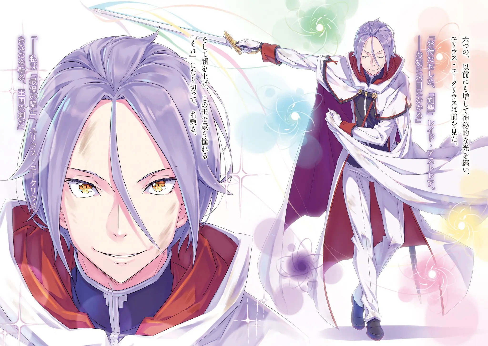

――Волканика, «Божественный Дракон», прожив долгие годы в спокойствии, достиг духовной «Смерти».

Говоря как есть, он долгое время оставался в покое и в конце концов выжил из ума. «Но я не могу допустить, чтобы вы вели себя как старый человек! Эй, Волканика!» ――Ты, кто достиг вершины башни. Пройди через первый этаж, Всемогущий Проситель. «Боже! Никуда не годится!» Стуча по его лапе, Эмилия отчаянно зовет, но все, что приходит в ответ, — это ощущение твердой чешуи и ментальный барьер забвения, который кажется даже прочнее чешуи.

Испытание, в ходе которого мертвый был возвращен к жизни в том состоянии, в котором он находился в то время, то есть случай с Рейдом, было той еще задачкой, но если думать об этом сейчас, это кажется более милым направлением.

Она никогда не думала, что назовет грубого Рейда милым, и само по себе это смешно, но―― «Рейд мог говорить и объяснять, что нам нужно делать, но……» Волканика не был на это способен.

Для Эмилии, которая должна прорваться через Испытание первого этажа, тот факт, что задающий вопросы выжил из ума, был наихудшим исходом.

Ведь она должна как можно скорее сообщить хорошие новости Субару и остальным. «Уух…… что делать — что делать, что же делать…… Вряд ли нужно победить Волканику, как Рейда……» Даже если бы это было так, это было бы очень трудным Испытанием, но разница в содержании испытаний между третьим и вторым этажами вывела Эмилию из задумчивости.

Испытание третьего этажа «Тайгета» требовало использовать свой мозг для решения представленного вопроса.

К счастью, они смогли решить его благодаря знаниям Субару с другой стороны Великого Водопада, без которых это было бы очень сложно.

И испытанием второго этажа «Электра», как хорошо известно, был Рейд Астрея.

Даже в этом случае Эмилии удалось победить, потому что она делала все возможное и смогла ударить Рейда по голове, но это получилось только потому, что это была их первая попытка.(?) В любом случае, нет никаких сомнений в том, что третий и второй этажи достались им с большим трудом.

Поэтому, сам лишь вызов был уже достаточно трудной задачей, но―― «Я не могу поверить, что не будет выставлен даже вопрос……» ――Я, Волканика. Согласно древнему пакту, я спрошу о чаяниях тех, кто достигнет вершины «Боже! Я поняла уже! Я хочу, чтобы вы сказали то, что следует после этого!» Она может понадеяться, что после нескольких раз он наконец скажет последующие слова, но она не хочет тратить время на то, чтобы попробовать это.

Эмилия огляделась вокруг, пытаясь подавить желание топнуть ногой по земле.

Испытание третьего этажа — это белая комната с вопросом на черной табличке―― На вещи, которую Субару и Юлиус будто с радостью называли монолитом.

Возможно, такая вещь скрыта и на этом этаже.

До тех пор, пока на Волканику нельзя положиться, лучше всего искать вопрос самостоятельно. «Сейчас я должна сделать все, что в моих силах……!» Эмилия, всегда следя за состоянием Волканики, решила начать исследование первого этажа.

Во-первых, первый этаж — это вершина Сторожевой Башни Плеяд―― Он(этаж) находится в положении, которое слишком высоко, чтобы его можно было увидеть снизу. Пространство окружено шестью столбами и ещё одним огромным в центре―― Волканика прислонен к столбу в центре пространства, радиус которого, кажется, составляет около 100 метров. «Увидеть что снизу…… невозможно?» Держась за одну из колонн*, окружающих периметр первого этажа, Эмилия проверяет что внизу. (Я буду использовать и слово столб, и слово колонна.) Внутри башни и на земле, должно быть, боролись Субару, Рам и остальные, но густые облака закрывали обзор, не позволяя разглядеть, что находится снизу.

Или, возможно, если бы она прыгнула в облака, она бы смогла присоединиться к своим товарищам―― «Мне кажется, что он разозлится, если кто-то нечестным путем вскарабкается наверх извне…… Нет, прежде всего, даже если бежать изо всех моих сил, невозможно так быстро подняться за облака» Она не считает, что это сложно для её атлетических способностей, но даже Эмилия знает, как высоко находятся облака и небо.

Когда она была маленькой, она не могла протянув руку схватить облака, и то же самое верно, когда она пыталась уже не будучи маленькой. Если бы она была такой же, как Рейнхард, то, возможно, она смогла бы даже подпрыгнуть до облаков, но Эмилия не способна на такое.

Итак, должно быть, Эмилия поднялась на вершину башни с помощью какой-то таинственной силы. «Тогда Испытание все-таки должно быть в этом месте!» Воодушевленная собственными мыслями, Эмилия оглядывается на шесть колонн, постукивает по ним и пытается взобраться на них. Однако она не смогла найти какие-нибудь явления или символы.

Тогда, оставшаяся возможность―― «――Большой столб посередине, к которому прислоняется Волканика» Если на окружающих колоннах ничего нет, то, весьма вероятно, что это большая центральная колонна.

В отличие от шести столбов, только этот столб возвышается над первым этажом. ――Или есть место над первым этажом, которое следует назвать нулевым этажом?

Ей кажется, что это место было способом, которое изменит ситуацию здесь, где никаких изменений не происходит.

Однако―― ――Ты, кто достиг вершины башни. Пройди через первый этаж, Всемогущий Проситель. Чтобы исследовать этот столб, она не может избежать Волканику, который повторяет одни и те же слова. «――――» Она готова пройти Испытание первого этажа, но провоцировать Волканику — это совсем другая история.

Поддерживая это напряжение, Эмилия приближается к центральному столбу, к Волканике. "Волканика, что мне нужно сделать для Испытания? ――Я, Волканика. Согласно древнему пакту, я спрошу о чаяниях тех, кто достигнет вершины Ответ Волканики оставался прежним.

Вместо того, чтобы быть обескураженной или разочарованной этим, Эмилия, напротив, почувствовала облегчение. Если реакция Волканики остается прежней, то он должен быть так же безразличен, как и тогда, когда она коснулась его лапы.

Поверив в это, Эмилия обошла Волканику с противоположной стороны, чтобы осмотреть толстую колонну―― «――э» Как раз в тот момент, когда она собиралась коснуться колонны, Эмилия услышала шум ветра.

Прежде, чем она смогла выяснить, что это было, инстинкты Эмилии создали ледяную стену над ее головой. Мгновение спустя импульс ударил Эмилию сквозь ледяную стену, и ее тонкое тело значительно завертелось. «Кафу ~кх» Импульс прошел через спину в грудь, и Эмилия сильно закашлялась, яростно покатившись по полу первого этажа. И в таком положении, она остановила этот импульс, упершись руками в пол, хоть как-то затормозив свое унесшее тело.

Эмилия медленно поднимает глаза и понимает, что, черт возьми, произошло. ――Хвост «Божественного Дракона», прислоненный к колонне, медленно опустился на пол. «……Хвост, меня ударил?» На словах это был действительно простой удар.

Использование драконом своего хвоста для выражения эмоций часто случается между Субару и Патраш. Когда Субару как-то проказничает, либо Рам, либо Патраш дают ему удар, словно соревнуясь друг с другом.

Однако удар хвоста Волканики был ничем по сравнению с таким выражением привязанности между человеком и животным.

Мгновенная защита Эмилии спасла ее, но если бы она отреагировала позже, то неудивительно, если бы ее шея была сломана или голова снесена.

К тому же, для Волканики это поведение было эквивалентно смахиванию насекомого в состоянии туманного сознания.

С ней обращались словно с маленьким насекомым, которое забавлялось под ногами гигантского существа. «――――» От осознания этого факта по затылку и спине Эмилии потек холодный пот.

Но это также поднимает одну возможность для Эмилии. «Похоже как я и думала, с этой колонной что-то связано» ―――― «Вы ведь здесь для Испытания. Даже сейчас я не забыла этого, хоть и забыла об Испытании. Вот почему вы объясняете одно и то же снова и снова» Волканика, который, похоже, забыл, что он должен был делать.

Тем не менее, тот факт, что «Божественный Дракон» все еще здесь, доказывает, что его желание сдержать обещание, которое он дал перед тем, как его душа «Умерла», было настолько сильным. «Мудрец», «Святой Меча» и «Божественный Дракон» каждый из них испытывает мудрость, силу и волю.

В таком случае―― «――Нельзя быть нерешительным. Я тоже собираюсь быть серьезной» Эмилия заявляет о применении силы, предполагая, что другая сторона будет вмешиваться.

В этот же момент воздух вокруг Эмилии закричал, и мир медленно начал замерзать. Словно следуя за Эмилией как за своей королевой, ледяные солдаты рождались один за другим―― Это новая возможность Эмилии, получившей дальнейшее развитие от Искусства ледяного призыва.

Она не могла испытать это в маленькой сторожевой башне, но с такими размерами и противником пощада бесполезна.

Она не рассказала об этом Субару, поэтому он не дал имени.

Поэтому, Эмилия сама дала его. «Ледяные Солдаты и Исскуство ледяного призыва!» Рождаются семь ледяных солдатов, каждый в облике человека, каждый вооружен своим собственным оружием, чтобы вместе с Эмилией храбро присоединиться к смертельной схватке―― «――Я наступаю, господин соня! Если ты собираешься вставать, то обязательно вставай побыстрее!» Сказав это, Эмилия, вооруженная ледяным оружием, приближается к Волканике вместе с ледяными солдатами.

Уставившись на это бесстрастными глазами, Волканика открывает рот. ――Ты, кто достиг вершины башни. Пройди через первый этаж, Всемогущий Проситель. Его сознание продолжало быть погребенным за гранью неизменной безграничности.

――В то же время Эмилия была не единственной, кто сражался с грозным врагом, превосходящим собственные силы.

Столкновение фехтовальщиков, происходящее на втором этаже «Электра», на один этаж ниже Эмилии, которая сражается со слабоумным «Божественным Драконом», также усиливается.

Однако тот факт, что оно одностороннее, остается непоколебимым. «Эйэйэйэй, что такое — что такое — что такое-е! У меня только одна рука и оставшаяся палочка. Если ты все еще не можешь коснуться меня, ты, то это даже не игра, ты, ты, ты-ы!» «Гх…… ~кх!» Выкрикивая презрительные насмешки, Мужчина с танцующими длинными красными волосами сильно пинает ногой.

Рыцарь с изящным лицом принял её рукоятью рыцарского меча в своей руке, а сам отлетел далеко назад. Он не может уничтожить импульс. Только рассеять. И прежде, чем он рассеялся, приходит следующий.

Снова и снова это повторение происходило на поле боя второго этажа.

И затем, в неизвестно какой раз, рыцарь был отброшен ударом мечника, и когда он отлетел далеко назад, мечник выплюнул, «Боже». «Когда меняется настроение, меняется и меч. Я рассчитываю на то, что у тебя будет этот взрыв, понимаешь? Но когда, блять, собираешься измениться, ты? Или……» Сказав это, красноволосый фехтовальщик―― Рейд поворачивает голову и кривит губы.

С величественной, словно смотрящей свысока на противника насмешливой осанкой, удивительный фехтовальщик свирепо смотрит на своего противника рыцаря, «Ты так одержим манерами, что проигрываешь, не так ли, ты. Ты удовлетворен этим, ты?» «――Что за самодовольные слова» Рыцарь, которому говорят то, что заблагорассудится, ослабляет губы от комментария Рейда.

Несмотря ни на что рыцарь мрачно проверяет на ощупь рыцарский меч, который онемел от удара, и принимает острый взгляд Рейда лицом к лицу.

Юлиус Юклиус, который отказался от безымянного рыцаря и бросил вызов судьбе. «Ты бросал мне эти слова много раз. Я недостаточно интересен, чтобы сражаться, я недостаточно хорош в обращении с мечом, я недостоин игры…… Я хорошо знаком с этими словами» «Хах, похоже, что так. Я уверен, что все чувствуют то же самое, даже если они не равны мне. Твой меч — не что иное, как отчаяние» «……Отчаяние, хах?» Небрежные заявления Рейда не были произнесены из благородных побуждений.

Возможно, он просто высказывает то, что он думает, так, как он это думает. Это отражает суть, потому что даже с намеренно прикрытым одним глазом он все равно может видеть все своим голубым глазом.

Он может видеть истинный характер Юлиуса, покрытый очень хрупкими идеалами. «――――» Оглянувшись, он увидел женщину, наблюдающую за битвой между ним и Рейдом.

Для Юлиуса это была женщина, которая теперь самое драгоценное существо в мире, однако внутри неё находится совершено другое содержание.

Несмотря на то, что это был форс-мажор, прошло около двух месяцев с момента событий, произошедших в том городе водных врат―― Такие пустые отношения между господином и слугой они продолжали поддерживать между собой. «Оглядываясь назад, мы с тобой должны были быть более откровенными» «Юлиус……?» «Если бы мы это сделали, мы с тобой были бы хорошими друзьями. Мы могли бы оба лелеять одну и ту же женщину и восхищаться ею» Юлиус, говоря то, что чувствует внутри, снова бросает вызов «Святому Меча».

Рейд, держа в правой руке короткую тонкую палочку, встретил наступающего Юлиуса встречным ударом.

Отсекает, колит, замахивается, опускает вниз, наносит серию ударов.

Юлиус время от времени использует рукоять своего меча или работает ногами, сплетая вместе действительность и вымысел, но Рейд с лёгкостью мешает ему делать это с таким отношением, показывающим, что он даже не серьезен. «И-и вновь это? Не заставляй меня снова и снова повторять, что это не сработает……» «Пускай! Можешь называть меня занудой, но это мой меч!» «Цуто~о!» Отвергая нарастающий зевок ревом, пинок Рейда встречается с нападающим мечом Юлиуса.

Удар ногой выбивает Юлиуса из позы, и Рейд ударяет палочкой по диагонали в открывшуюся щель в защите―― В этот момент Юлиус откинул свой плащ и быстро спрятался за ним. «Хее» И, Рейд рассмеялся над этим движением и попытался разрезать надвое Юлиуса с другой стороны плаща.

Но, к тому времени, когда сила удара сдула плащ, Юлиус уже летел горизонтально назад, сбежав от зоны поражения резни палочки. «О~ох, это оно!» «Нет, ошибаешься!» «А~ан?» Рейд похвалил этот боевой стиль, использующий белый наряд в качестве отвлекающего маневра, сбивающего с правильного пути. Юлиус, однако, тут же отрезал похвалу и бросился к плащу, который унесло ветром.

Затем он поднимает плащ, разорванный ударами палочкой, и снова накидывает его на себя.

Надежно застегнув застежки, он воплощает рыцаря в белой униформе и белом плаще.

Он может перестать быть никем, но он не перестанет быть рыцарем.

Видя отношение Юлиуса, как бы указывающее на это, Рейд вновь раздраженно прищелкнул языком. «Ты, я надеялся, что ты изменился, когда я увидел тебя и горячую красотку позади тебя, понимаешь? Что ты будешь стремиться к победе, чего бы это ни стоило. Что увижу подобного тебя. Ты не знаешь о себе, не так ли?» «――――» «Ты можешь притворяться рыцарем, но это не то, кем ты являешься. Ты просто »Махающий палкой«, как и я. Я не могу смотреть на эту строгость, ты» Тыкнув палочкой в лицо Юлиусу, Рейд с хмурым выражением выплюнул это.

Услышав это заявление Рейда, Юлиус закрыл глаза.

Затем, после некоторого молчания, он пробормотал одно-единственное слово, «Понятно». «Думаю, что наконец-то понял это» «А~а? Что понял?» «Почему ты так одержим мной» Хоть он и раздражен, Рейд не останавливал себя от слов в сторону Юлиуса.

Метод жестокий, и хотя он, возможно, не стремился к такой цели, это похоже на методы его наставников, которые учили и направляли Юлиуса.

Но после всего этого, он, наконец, понял, почему Рейд таскался за ним. «――Ты увидел во мне то же самое, что видел в себе» Он много раз насмехался над Юлиусом за его скучный стиль боя и манерное фехтование, потому что думал, что спящий лев прячется внутри скорлупы, которая покрывает Юлиуса.

И хотя Юлиус считает, что называть себя львом — это преувеличение―― «Меня не волнуют детали, ты, незрелая тыква. Я просто делаю то, что хочу делать. Это то, что подсказывает мне мое чутье. Ты был бы интереснее, если бы сорвал свою маску» «――――» «Вот почему я пытаюсь сорвать её. Ты понимаешь, о чем я говорю? Таким образом ты не сможешь дотянуться до меня, и не сможешь выглядеть круто перед красоткой позади себя» Когда Рейд кивает подбородком, указывая на Ехидну, Юлиус натянуто улыбается.

Действительно, у Рейда отличные глаза, которые хорошо видят. ――Он хорошо знает, что Юлиус Юклиус — человек, который просто хочет хорошо выглядеть. «Вот почему я не буду прогибаться, чтобы быть собой» «Чего?» «Я думаю, что твои слова верны. Есть много вещей, которые приходят на ум. ……Я никогда не говорил об этом в мире, где все забыли меня, но я не являюсь законным наследником семьи Юклиус» Он говорит это так, чтобы Рейд, который хмурится, и Ехидна, которая уверенно смотрит вперед, могли его услышать.

История Юлиуса Юклиуса, которую помнит только Нацуки Субару, и никто больше. «Мой отец, сбежавший из знатной семьи, женился на простолюдинке, и у них родился я. Поэтому, мое происхождение — из простолюдинов. Я не имел ничего общего с аристократической культурой, пока мои родители не умерли и мой нынешний отец, который был моим дядей, не взял меня к себе―― Поэтому я стал тем, кем являюсь» «Что за грубое папье-маше» «Может быть и так. Полагаю, что моя сущность это невоспитанный ребенок, который никогда не знал идеала, который был одет в простую одежду вместо официального наряда и бегал по полям, смеясь со своими друзьями» Никакого чувства вежливости, никаких идеалов, к которым следует стремиться, просто стремление быть живым день за днём.

Быть именно таким Юлиусом, каким он должен быть такое будущее должно было быть у него.

Но это будущее, вместе с его собственными родителями, было сметено и унесено за горизонт внезапным наводнением.

Вот почему―― «Вот почему я буду изображать из себя рыцаря. Держась за внешний вид, я сдержу свое истинное Я» «Ты……» «Я ничего не знал, я был невежественен, но я встретил идеал. ――Я мечтал быть рыцарем. Я мечтал о достойной и чистой фигуре рыцаря. Поэтому я буду следовать своей мечте» Со звуком он вновь застегивает застежку своего плаща, и желтые глаза Юлиуса наполняются силой.

Выражение лица Рейда, который был в плохом настроении, изменилось с раздраженного на сомневающееся. Он был удивлён, что его слова отрицали, но не набросились в ответ.

Человек, представляющий собой само высокомерие, был ошеломлен словами Юлиуса.

Посему, Юлиус продолжил громко говорить. «Я неуклюжий человек. Я воспринимаю все, смотря только на внешность. Я всегда верил, что если бы у меня был прекрасный меч, если бы я носил элегантную одежду и если бы я мог правильно выражаться, я смог бы стать человеком с хорошими манерами. Вот почему я буду возвращаться к этому характеру. Буду сохранять внешний вид» Он знает, что есть люди, которые не любят хорошо выглядеть и ненавидят подобные выражения.

Нацуки Субару, вероятно, лучший пример, который приходит на ум.

Однако, Юлиус считает так. «Я распрямлю спину, приведу себя в порядок и приму облик того, кем я хочу быть, и буду использовать это как трость, чтобы отстаивать свою волю. Это папье-маше, которое я решил носить вечно» «――――» "Некоторые будут высмеивать этот внешний вид. Но я верю, что есть и другие, кто считает внешний вид ослепляющим. ――Точно так же, как я стремлюсь к тому, каким должен быть рыцарь.

Он не помнит, из-за кого в нем зародилось желание стать рыцарем.

Но Юлиус стал им.

Причина, по которой Юлиуса называли «Наилучшим», заключается не только в его отточенном владении мечом, утонченных духовных техниках и высоком уровне его способностей, подкрепленных этими навыками.

Потому что они думали, что таким, каким является Юлиус Юклиус, и должен быть рыцарь.

То, почему «Самый» «Лучший» «Рыцарь» должен быть таким, заключается в том, что его форму, выставляющую себя напоказ, считали ослепительной.

Сказав всё это, Юлиус разжал губы и повернулся к Ехидне.

Юлиус слегка качает головой ей, кто позаимствовал облик его дорогой и любимой госпожи. ――Ей, кто искренне сожалеет о том, что она не может вспомнить Юлиуса.

Говорит ей, что не нужно чувствовать такую вину. «Нет необходимости бояться, сожалеть или скорбеть на то, что обо мне забыли. Потому что в рыцарстве, о котором все знают и к которому все стремятся, я существую» И то же самое он мог сказать «девушкам», которые здесь находились. «Я прошу прощения за все до сих пор, мои бутоны. Я цеплялся за утраченную связь, отказывался отпускать вас и заставлял чувствовать себя тревожно все это время. Теперь я освобождаю вас от этого бремени» Юлиус шепчет это, и то, что становится видимым, — это бледный свет, сияющий яркими оттенками―― Квазидухи Юлиуса Юклиуса, прекрасные духи, которые отстаивают шесть атрибутов.

Они были рядом с Юлиусом Юклиусом еще до того, как он стал рыцарем, и ему трудно расставаться с их присутствием.

Эти девушки тоже забыли Юлиуса, который потерял свое «Имя» из-за полномочия «Обжорства».

Однако, связанные нерасторжимым контрактом между духом и контрактором и очарованные силой врожденной «Божественной Защиты Привлечения Духов» Юлиуса, они продолжали оставаться на дистанции рядом с ним.

Юлиус не хотел их отпускать, полагая, что отношения можно будет восстановить, как только будет восстановлено «Имя».

Как это было глупо.

Все изменилось, и он не хотел менять ничего из того, что осталось.

Однако―― «Раньше вы были со мной, и я был с вами, мои бутоны. Я был избалован вашей любовью и упорно не хотел отпускать теплые чувства. Я надеялся, что мы благополучно сможем вернуться в те дни. ――Я верну такого слабого, жалкого, невзрачного себя» Озадаченные, шесть квазидухов колышутся вокруг Юлиуса.

Повернувшись к ним, Юлиус слегка протянул им руку.

Квазидухи, увидевшие вытянутую, словно насест, руку, осторожно собираются у неё.

Затем, Юлиус улыбнулся бледным огонькам, которые остановились на его руке. "Я боялся измениться. Но есть некоторые вещи, которые вы можете приобрести, только если вы готовы потерять.

Например — распускание бутонов, называемое любовью.

Я своими глазами увижу, какие лепестки распустятся из бутонов, которые так долго были рядом со мной" ―――― Девушки ничего не отвечают.

Но они, казалось, ожидали то, что должно было произойти.

Поэтому Юлиус делает то, что должен―― «Мои бутоны! Я отпускаю вас. Мне жаль, что я так долго цеплялся за разорванные узы» Одновременно с его словами квазидухи, окружающие руку Юлиуса, уходят.

Казалось, что это даже сопровождалось шоком, болезненным ощущением, подобным удару молнии, который, безусловно, пронзил только Юлиуса и квазидухов.

Связь, узы, контракт, которые, несомненно, существовали и связывали душу с душой, разорваны.

Это боль и скорбь от потери существ, по-настоящему связанных с душой, которую могут понять только пользователи духов.

Юлиус этого не знает, но эта же боль когда-то заставила Эмилию присесть и заплакать.

Юлиус лично испытал это, расставшись сразу с шестью духами, что нанесло рану его душе.

Искаженное ощущение пронзило его грудь, и Юлиус ощутил отрыв от души.

Это боль, которая в корне отличается от той, когда Бутоны забыли о нем из-за полномочия «Обжорства».

Не только Юлиус, но и квазидухи, должно быть, испытали ту же боль и сожаление.

Может быть, они проклинают раны на своей душе, говоря, что им никогда не следовало заключать контракт с человеческим существом.

Но―― «――Вдобавок ко всему, я еще раз обращусь к вам, ребята» ―――― «Я люблю вас. Если вы примете ухаживание этого тщеславного человека, то давайте вновь соединимся. ――Новый контракт между вами и мной!!» Юлиус закричал во весь голос, простирая к небесам свою однажды опущенную руку.

Услышав его прошение, квазидухи, которые рассеялись, на секунду тихо замерцали.

Колебания и нерешительность, длились всего секунду.

Теплый свет окутывает все тело Юлиуса Юклиуса.

Он ласково-слабо проникает в душевные раны, которые были нанесены разрывом контракта.

Была радость. Был гнев. Была печаль. Была любовь.

Была ненависть.

Эти многочисленные эмоции были между Юлиусом и его девушками более чем десять лет.

Сделав вид, что этого никогда не было, они снова соткут новое будущее.

Он не знал, правильный ли это ответ. Но он хочет, чтобы это был правильный ответ, как ему и показалось.

Много раз он может пойти не так.

Он не может все время выбирать правильный путь, и может совершать ошибки.

Но он будет каждый раз придавать себе форму.

Даже если совершал ошибки, он не одинок. Он не один.

Если он решит двигаться вперед, то существуют идеалы, созданные великолепными предшественниками.

Если он решит остановиться, то существует тепло его бутонов, которые продолжали наблюдать за ним с глубокой любовью.

И если он посмотрит рядом с собой, то увидит профиль госпожи, которая клянется посвятить себя убеждениям, которые сформировали его.

Чего, черт возьми, после этого, мог бояться Юлиус Юклиус? «――Вероятно, что так. Мои прекрасные, цветущие девы» Этот единственный голос отвечал шести бутонам―― Нет, это был ответ для расцветших дев.

Свет, был рожден――

«Отныне я буду идти по этому пути глубоко, нежно, получая боль» Боль от разрыва контракта была исцелена связанными вновь узами.

Облаченный в шесть еще более загадочных, чем прежде, огоньков, Юлиус Юклиус смотрит вперед.

Там стояла фигура того, кем он восхищался и кто посвятив свое тело мечу достиг апогея.

Однако зависть Юлиуса Юклиуса находится не на вершине, а в другом месте.

Поэтому нет никаких колебаний в том, чтобы открыть это стремление светом радуги. «Прошу прощения, что заставил ждать, »Святой Меча« Рейд Астрея. ――Рад первой встрече» Стряхнув свой рыцарский меч, Юлиус схватил свой плащ и грациозно поклонился.

Затем он поднимает глаза, и став «тем», к кому стремился больше всего в этом мире, произносит свое имя. «――Я »Наилучший Рыцарь«, Юлиус Юклиус. Меч королевства, который убьет тебя»

