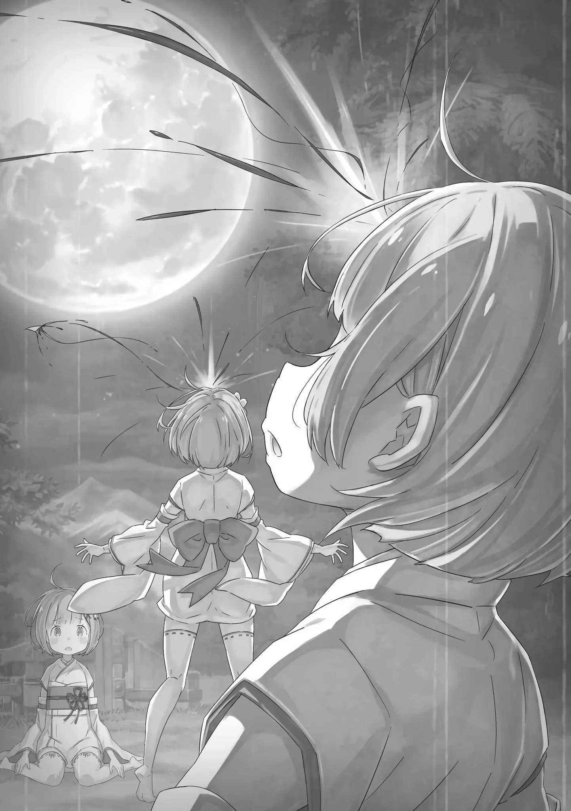

Глава 83 — «Рам»

――Она помнит, что всё было красное-красное, в пылающем огне.

Мирные, застойные, упадочные дни внезапно подошли к концу.

До этого маниакального насилия, титул самой могущественной расы полулюдей, звание самого страшного деревенского старейшины и всеобщая любовь родителей к своим детям ничего не значили.

Тот факт, что она заметила распространение резни запоздало, вызывал глубокое сожаление. ――Нет, возможно, в данном случае следует хвалить прекрасное исполнение другой стороны.

Это были те, кого мир ненавидел, избегал, отвергал и притеснял.

Поэтому они знали, как прятаться в темноте, уничтожать знаки, не допускать звуков и подкрадываться.

С самого первого момента внезапного нападения, можно скачать, что исход уже был ясен.

Слабый осадок смешался с маной в атмосфере, и к тому времени, когда рог почувствовал ненормальность, было уже слишком поздно.

Во-первых, половина деревни была отрезана с самого начала, и на тот момент менее половины из них были способны сражаться. Вдобавок, другая половина жителей деревни, почувствовав, что что-то не так, не смогла осознать серьезность ситуации, полагая, что, должно быть, произошла какая-то ошибка.

Короче говоря, души были испорчены миром и безмятежностью.

Когда-то их называли сильнейшей расой полулюдей, и даже говорили, что если бы они участвовали в «Войне Полулюдей», ситуация в Королевстве Лугуника изменилась бы―― Даже если бы такое «что, если» в истории произошло, несомненно, что Клан Они многого бы не добился.

В любом случае, половина от общего количества, уменьшенного первым нападением, была вновь уменьшена до половины последующим вторым нападением.

В тот момент изо всех мест деревни поднялись языки пламени, и к тому времени, когда эхо уничтожения отразилось в освещенном красным ночном небе, все Они в деревне почувствовали, что что-то не так.

Но, в это время лишь два человека осознавали, что клан Они будет уничтожен―― «――Рам! Убирайся из окружения!! Всё нормально, пока хотя бы ты жива!!» Старейшина, с двумя увеличившимися огромными рогами и вздувшимися мускулами по всему телу, рычит.

Старейшина выбежал из дома, неся большой меч, свое личное оружие, и велел Рам, которая с ветром прорывалась сквозь солдатов, жить. Жить, сказал он, не потому, что беспокоился о Рам.

Потому что это был старейшина, который больше всего по глупости верил, что Рам — это славное будущее клана Они.

Второй приход «Бога Они», некогда слава Клана Они, который безраздельно правил в эпоху «Ведьмы».

Это роль, возложенная на вундеркинда по имени Рам, и, должно быть, горячее желание последнего главы клана Они, который забыл всё о сражениях. «Хах!» Ей захотелось рассмеяться над нелепостью этого.

В этот последний момент, желал ли представитель деревни Они оставить реализацию несбывшейся мечты на будущее? Есть много вещей, которые он мог бы сделать, например, быстро организовать соратников и попытаться контратаковать врага.

Однако, у Рам не было намерений советовать это главе рода.

Причина не в этой ночи.

Давным-давно Рам разочаровалась в своем народе. «Какая ещё слава Они……» Бессмыслица. Бессмыслица. Бессмыслица.

Тот факт, что в ней течет чистейшая кровь такого Клана Они, также омерзителен.

Действительно, если она жаждет власти, её кровь закипает, чувство поднятого духа охватывает все её тело, и она наполняется ощущением всемогущества, как будто всё принадлежит лишь ей.

В самом деле, если бы Рам выросла здоровой, это чувство всемогущества могло бы быть подлинным.

Однако, Рам не желала этого.

Вместо того, чтобы изображать из себя Сына Божьего в маленьком мире, Рам хотела выбрать своё будущее.

Это гораздо ценнее, чем превозносить второе пришествие Бога Они, или провести всю жизнь в качестве ковчега рода, который продолжает цепляться за славу, которая уже была уничтожена. ――Она хотела жить как ■ ■■■. «――――» Сосредоточив свое сознание на лбу, она принимает горячо освещенную ману во все свое тело через белый рог.

С сильными молитвами, восприятие Рам значительно усилилось, и взяв на себя видение всех живых существ вокруг, она смогла в совершенстве осознать события, которые происходили в маленькой деревне.

Враг многочислен, и они окружили деревню, чтобы не дать им сбежать.

Реакция на самый первый момент была медленной, и только половина из половины могла оказывать сопротивление, едва похожее сопротивление, но даже это уже сократилось до числа, которое можно пересчитать по пальцам одной руки, и сила воли Клана Они, похоже, иссякла.

Один из старейшин, кажется, ожесточённо сражался, но враги, собравшиеся там, были довольно способны―― Присутствие старейшины, который начал ослабевать, было окутано плотной «смертью». «――■■■» Рам, с ветром, укутавшим её маленькое тело, неслась по деревне, как ураган.

Её губы шевелятся, а мысли заняты только её единственной любимой ■. Это не значит, что Рам бессердечна. Просто её сознание переключилось.

Потому что родители Рам были включены в первую половину, и уже не было никакой возможности помочь им. ――Она никогда не испытывала отвращения к родителям.

Тем не менее, она считает, что они оба, к лучшему или к худшему, родившись в этой деревне, выростя в этой деревне, будучи людьми Клана Они, которые решили умереть в этой деревне, неосознанно приняли медленную кончину.

Поэтому то, что их жизни были разбросаны в эту ночь, было своего рода неизбежностью.

Однако―― «――Это не значит, что за это не ответят возмездием» Черная тень стоит на пути, враг, одетый в мантию, которая полностью окутывает все его тело с головы до пят.

В сторону шутников, которые размахивают мечами в форме крестов, Рам обрушает ветер без всякого сдерживания.

Либо они недооценивают ребенка, либо они просто недостаточно хороши.

Неспособные поймать ветряной клинок Рам, черные тени рубятся одна за другой, массово производя жалкие трупы. А после, Рам, окутанная в ветер, словно танцуя внутри пламени, продолжает резню.

Это могло бы выглядеть как красивый танцевальный номер.

В действительности, однако, жизнь рассеивается с каждым взмахом руки Рам, и каждый раз, когда она заставляет фигуры лишаться чего-либо, темная радость кричит от восторга внутри ее незрелого сердца.

Яростно кричала «убивай ещё больше».

Внутреннее «я» призывало забирать кровь, плоть, кости, души и жизни.

В эту ночь она слышит эти взывания не в первый раз. ――Ещё с тех пор, как она родилась, этот голос искушал при каждой возможности.

Он просит отдать кровь, плоть, кости, душу и жизнь, дабы пробудить внутреннее «я».

Он взывает, что она может убивать все больше и больше, что может разрушать все больше и больше.

Что же в этом такого замечательного, находится за пределами понимания Рам.

Ни старейшины, ни родители, никто не сможет этого понять. Она даже не хотела рассказать об этом тому, кто требовал от Рам никакой иной роли, кроме как быть Рам.

Как будто рог пытался управлять ею.

Без твердого самоощущения, молодая личность была бы легко поглощена, уничтожена, и стала реинкарнацией Бога Они, как того желали окружающие.

Но, этого не случилось. Потому, что―― «■-тян!!» Услышав громкий голос, она обернулась и увидела ■■■, освещенную пламенем.

Мгновенно, порыв ветра сдувает надвигающуюся толпу черных теней, одним духом отбрасывая их в сторону.

Затем, быстрым шагом, Рам направилась к ■. «■■■……» Испуганный взгляд, без сил в ногах, ■■■ рухнула на месте.

Она тянется к такой любимой ■ и пытается поставить её на ноги. Она должна долго жить, как того желает старейшина. Но не одна, а с ■■■―― ――Это, было мгновенно.

Проверяя благополучие ■■■, лишь на одно мгновение, она расслабилась.

Когда она заметила присутствие, она уже была окружена, и было трудно найти путь к отступлению.

Только для нее, это не было бы невозможным. Но, если она выживет в одиночку, это ничем не будет отличаться от смерти.

Хоть как-то, она должна была выйти из этой ситуации.

Ради этого она должна снять все оковы, запечатывающие ее силы, и направить бушующий ветер на врага―― «――――» Вероятно, это был пробел в сердце, вызванный отвратительным чувством всемогущества.

Черная тень увернулась от ветряного лезвия, и вспышка от тени ударила её в лоб, взорвав поле зрения.

Рам посмотрела, отойдя назад от сильного импульса и испытывая острое чувство потери.

Вращаясь и переворачиваясь, навстречу красной ночи, освещенную пламенем, которое сожгло деревню, вращаясь и кружа, летел белый рог.

Осознав, что это был её рог, её тонкое горло закричало от боли и чувства потери.

Кричит, однако, в то же время Рам замечает.

Она не слышала этот голос, который изъедал её с тех пор, как она родилась.

Ах, насколько это было легко; её собственная глупость сводила с ума.

Наблюдая за изображённой параболой рога в красной ночи―― ――Ах, наконец-то он сломан.

Она подумала так.

――В поле зрения, разделенном «Ясновидением», чёрный земляной дракон отчаянно и изо всех сил бежал.

На своей спине он нёс девушку, которая должна была быть второй важной половиной Рам.

Недостающее, отсутствующее в воспоминаниях крыло, которое оставило после себя лишь зияющее чувство утраты―― «――Рем» Понимая, что это означает, сердце Рам сжалось от гнева.

Как бы ей ни было неприятно это признавать, ей удалось восстановить часть своей первоначальной силы с помощью Субару, и эта сила сокрушила и ослабила Архиепископа Греха «Обжорства», Лея Батенкайтоса.

Сама Рам может решительно заявить, что с точки зрения простого убийства, у неё было бесчисленное множество возможностей сделать это.

Однако, хлопотное Полномочие в его руках, существование силы, которая пожирает «Воспоминания» и «Имена» других людей, заставило Рам колебаться, стоит ли необдуманно лишать жизни этого богохульника.

Это было решение, принятое по необходимости, а не из любезности. Но, результат есть результат.

Как результат — Батенкайтос использовал свое Полномочие, чтобы сбежать от Рам, и отправился получать личность Рем, вторую половину Рам.

Цель была ясна―― Он был уверен, что если сразится с ней лицом к лицу, он не сможет победить.

Он вступает в прямую конфронтацию, а если понимает, что находится в невыгодном положении, отступает и меняет свою тактику.

Архиепископы греха — не воины. Это существа, которые продолжают действовать с жадностью только для того, чтобы исполнить свои собственные желания, и у них ни одной причины упорно держаться ради победы.

Поэтому он планировал отомстить Рам за то, что та унизила его, и сократить лимит времени цунонаши Рам на основании «Воспоминаний» Рем, которую он отнял.

Эта стратегия, вызывающая гнев, является наиболее подходящим решением.

Если он заберёт личность Рем, Рам легко станет бессильной.

Даже если нет, сила их лагеря значительно уменьшится, если она потратит еще больше времени. С каждой секундой их шансы на победу уменьшаются.

Поэтому―― 'Надо догнать Патраш как можно быстрее' К счастью, Патраш, которая отвечает за Рем, является самым умным земляным драконом и заслуживает больше всего доверия среди боевого порядка в башне, уступая только Юлиусу.

Субару и Беатрис иррегулярны, а относительно Ехидны и Мейли многое неизвестно. А такие как Эмилия, чья атмосфера заставляет чрезмерно сомневаться в том, что на неё можно положиться, неописуемо возмутительны.

И это сложно(?), но Батенкайтос явно мучает Патраш.

Он мог бы загнать её в угол в одно мгновение, если бы захотел, но Батенкайтос намеренно смягчал свое нападение, создавая брешь в погоне и наслаждаясь охотой, чтобы привести в изнеможение свою жертву.

Все ради того, чтобы Рам, которая владеет его полем зрения, запечатлела эту сцену.

Она не может позволить ему делать все, что он хочет, сверх этого―― «――ах» В тот момент, когда она собиралась окутать себя ветром, чтобы поторопиться.

Её поле зрения, нацеленное на верхний этаж винтовой лестницей, затуманилось, и, на мгновение, «Ясновидение» отключилось. Поскольку её правый глаз продолжает отражать поле зрения Батенкайтоса, она сохраняет свое собственное в левом глазу, которое расплылось еще сильнее.

Но не только это. Тяжелая усталость, которая раньше не ощущалась, дискомфорт и боль, как будто невидимая рука царапает её внутренние органы, обрушились на саму Рам.

Это, безошибочно, следствие усталости, которую регулярно испытывает Рам.

Цена, которую Субару самоуверенно заявил, что заберёт на себя с помощью своего рода Полномочия, и которая должна была вечно разъедать «Цунонаши» Рам―― Отскакивает назад на Рам.

Сразу приходит на ум возможность того, что Субару умер неприглядной собачьей смертью.

Однако по легкости груза, которая отскочила обратно, она может судить, что это не так. Прошло всего несколько минут, но, учитывая силу, которую извлекла Рам, это не та цена, которую нужно платить.

Это должен быть тот вид страданий, который заставляет буквально кашлять кровью и корчиться.

Тот факт, что этого не было, означает, что, хоть и произошли непредвиденные обстоятельства, они не были причиной того, что Субару выбыл из игры.

Или, она может предположить, что произошло совершено противоположное развитие событий.

Другими словами, если у кого-то случилось несчастье, то Субару пришлось взять на себя больше, чем одно лишь бремя тела Рам. 'Беатрис-сама или Мейли, или рыцарь Юлиус……' Это то, о чем она может думать, но нет смысла фиксировать этот ответ.

В этот момент важно то, что Рам стало трудно проявлять ту силу, которая ранее подавила Батенкайтоса. ――Если говорить о оковах, то она может снять лишь одни.

Возможно, если очень постараться, удастся отцепить вторые и продержаться несколько десятков секунд, но это не более чем приблизительная оценка.

Итак, получится ли победить Лея Батенкайтоса―― 'Что это за робость. ――Остаётся лишь стремиться к победе" Пока она проводит время так, шансы лагеря на победу продолжают уменьшаться.

И вновь, чуть не оступившись, Рам ступает на ступеньку, и начинает бежать вверх по винтовой лестнице. ――Она ощутила покалывание пустоты в своем сердце, когда почувствовала, словно уже когда-то бежала вот так, задыхаясь, к своей младшей сестре.

―― «Хаха~а! И впрямь хорош~! Стараешься изо всех сил, хоть ты и земляной дракон~!» Он восхищается черным земляным драконом, который мчится по узкому проходу и чья чешуя покрыта ранами от кинжалов.

Из рваных ран текла кровь, вызывая жалость, однако, земляной дракон благоразумно решился на побег и был полон решимости не отказываться от своих условий победы. «Божественная Защита Укрытия от Ветра» — это черта, которой обладает вся раса земляных драконов.

Пока этот земляной дракон продолжает бежать, он будет игнорировать большинство внешних факторов, таких как ветер и плохая опора под ногами, и утверждать действие под названием «бег» ради достижения цели.

Эти преимущества также распространяются на драконью повозку, соединенную с земляным драконом, и людей на его спине.

Другими словами, тот факт, что «Спящая красавица», которая привязана к седлу в бессознательном состоянии, не была сброшена, во многом объясняется тем, что она находится под влиянием «Божественной Защиты Укрытия от Ветра».

Без этого, «Спящая красавица» давно бы попала в руки Батенкайтоса. «Прекрасно-прекрасно, отважно-отважно ~цу! Несмотря на то, что тебе так и сяк мешают бежать, ты продолжаешь держаться и не останавливаться. Ну~у, если ты перестанешь бежать, то »Божественная Защита Укрытия от Ветра« аннулируется, так что понимаю, почему ты в таком отчаянии!» ―― «Земляные драконы славные, трудолюбивые и преданные своему хозяину. Если бы ты был человеком, наверняка ты был бы желанным блюдом для нас, »гурманов« ~цу! Но, ноно, нононононононо! К сожалению, земляной дракон не может насытить наш желудок ~цу!» Есть воля, душа, «Воспоминания» и «Имя».

Тем не менее, полномочие «Обжорства» может поедать «Это» только у людей.

Поэтому такое отчаяние, усердие и смелость против непреодолимого врага у земляного дракона, несмотря на то, что это самые любимые качества Батенкайтоса, он не может этого сделать.

Это так вкусно, что у него текут слюни, но он не может это съесть.

Это как если бы это была еда, нарисованная на картине превосходной кистью. ――Нельзя съесть рисовую лепёшку на картине, для него это похоже на такое выражение. "А~ах, это оно! абсолютно точно оно!

Когда голодаешь, голодаешь, голодаешь и голодаешь, и ничего не можешь с этим поделать ~цу! Такая картина аппетитно выглядящей еды — это натуральное убийство.

Разве это не жестокое обращение с детьми ~цу!?" Преследуя скачущего земляного дракона, он выпускает кровавый сгусток, застрявший в задней части его носа.

Его лицо было разбито в предыдущей битве, а глазное яблоко левого глаза болталось, как будто глазное дно было разбито. Его клыки сломаны, язык разорван, а нижняя челюсть пропитана бесконечным потоком крови, но все это не имеет значения. ――Его сердце дрожит при мысли, что Рам сейчас наблюдает за этой сценой. «Нее-сама――» Чистое, благородное, превосходное, безупречное и завершённое существование.

Это было то, что говорили спящие внутри него «Воспоминания», а также разумная оценка после того, как он был избит до полусмерти, не имея ни единой возможности дотянуться до нее рукой или ногой.

Серьезная Рам не по зубам Батенкайтосу. ――Нет, вероятно, любой из Архиепископов Греха был бы легко скручен до смерти.

Или, может быть, Регулус смог бы выиграть с абсолютной натурой своего полномочия―― «Ну~у, подобный идиот не смог бы убить Нее-сама~. Во всяком случае, если бы она не смогла его убить, то просто сбросила в великий водопад или что-то такое, не так ли~» Даже если его нельзя убить, есть множество способов сдержать его.

Точно так же, как «Ведьма Зависти» не смогла быть убита даже руками трех героев и до сих пор находится взаперти в святилище запечатывающего магического(магию?) камня.

Другими словами, что бы ни случилось―― «Будет невежливо, если мы не подготовимся к принятию самой лучшей и совершенной Нее-сама~!» Широко раскрыв свой подрагивающий левый глаз, Батенкайтос улыбается ужасающей, истекающей кровью улыбкой.

Скорость земляного дракона велика, но его подвижность бесполезна в закрытом помещении. Даже больше чем бесполезна, поскольку в любой момент применив на практике метод ходьбы из «Воспоминаний», Батенкайтос способен переместиться в пространстве и полностью свести на нет расстояние, открытое между ними. «Поэтому как младшая сестра Нее-сама, должна вырасти без стыда» С разбухшим чувством долга в груди, Батенкайтос вытаскивает «Воспоминания» из себя.

Одной из способностей полномочия «Обжорства» является способность, называемая «Затмение». Она разделяется на два типа, «Солнечное Затмение» и «Лунное Затмение», но они очень сложны в использовании. «Лунное Затмение» — это явление, при котором луна перестаёт быть видна. ――С другой стороны, Батенкайтос извлекает «Воспоминания» человека, которого он съел, и воспроизводит их в своем собственном теле.

Как правило, Батенкайтос просматривает разнообразные «Воспоминания» и комбинирует их, чтобы проявить очень высокого уровня синтез боевых искусств, — истинное качество «Лунного Затмения».

Тогда как «Солнечное Затмение» — это явление, при котором солнце скрывается. ――С другой стороны, это приём, позволяющий действовать в соответствии с первоначальными спецификациями, покрывая себя не только съеденными «Воспоминаниями» человека, но и самим его существованием.

Естественно, тела пользователей, создавших техники, сильнее, потому что они овладели ими.

Однако, когда тело трансформируется в тело другого человека, на него может слишком сильно повлиять душа другого человека, что впоследствии может значительно отразиться. По этой причине Батенкайтос и Альфард используют этот метод только если всё идёт не так.

Лей Батенкайтос и Рой Альфард преимущественно используют «Лунное Затмение».

Луис Арнеб преимущественно использует «Солнечное Затмение»―― Поскольку у Луис не было собственного тела и твердого эго, она могла непринуждённо использовать это последнее средство.

Но, в тот момент, когда он был избит до полусмерти в сражении с Рам и воссоздал «Прыгуна» Доркеля «Солнечным Затмением», чтобы выжить, Батенкайтос вырвался из своей скорлупы.

Он нашел способ сохранить свою твердость, используя «Солнечное Затмение», которое он боялся использовать из-за страха потерять самого себя.

Теперь он мог наслаждаться главным блюдом, под названием «Жизнь» других людей, более идеально и плодотворно. "Развитие в разгар битвы — это то, чего никогда не случилось бы с таким стариком, как я*. Хаха ~цу! Это шедевр! Не так ли, Нее-сама! (Опять Washi, но теперь в единственном числе) Какое освежающее чувство, благодаря утверждению сильного эго.

Он хотел, чтобы превосходная Нее-сама осмотрела его должным образом в этом пробужденном состоянии. Ради этого он должен выбрать метод, который вызовет еще больше её ненависти.

Запах гнева, вкус гнева, текстура гнева, полноценный ужин гнева.

Какой, чёрт возьми, из него «Гурман», если он не насладиться изо всех сил любимым человеком?

По этой причине, «Себя», на спине земляного дракона перед глазами―― "Кстати, это то, что никогда раньше не случалось.

Интересно, приведет ли убийство самого себя к новой системе ценностей~?" ―― В мгновение ока мир меняется в результате короткого пространственного скачка.

Земляной дракон, издавший стон в глубине своего горла, поражен появлением Батенкайтоса, который должен был быть позади него, и пытается пробежать прямо мимо него, не останавливаясь.

Отважно, действительно отважно. Но мужество — это не более чем приправа к последующей трагедии. «――Ладонь Короля Кулака» Размашистый удар кулаком вонзается в боковую часть живота земляного дракона.

Обычно этот удар выпускался карликовым телом Батенкайтоса, но теперь, пробудившись от увиденной бездны смерти, вырвавшись из своей скорлупы и приобретя новую силу, это было не так.

Удар оригинального тела Нейджа Локхарта пронзает туловище земляного дракона.

Железный кулак Короля Кулака, который одним ударом побеждал даже огромные тела в доспехах в бесчисленных смертельных поединках на Гладиаторском Острове.

Земляной дракон, приняв его, издал смертельный крик и был сильно впечатан в стену коридора. Но даже падая, земляной дракон продолжал защищать девушку на своей спине от кулака, стены, пола, и своего собственного огромного тела.

Вытянутый хвост мягко подхватывает тело падающей девушки и опускает ее на пол коридора.

Хоть это и должна была быть самка, но то, как она обращалась с ней, было достаточно изящно, чтобы все джентльмены захотели бы у нее поучиться.

Непроизвольно, даже Батенкайтос зааплодировал. «Од-на-ко ~цу! Несмотря на то, что ты потрудился аккуратно уложить ее на пол, я собираюсь внимательно отрубить ей голову и сделать сувенир для Нее-сама» ―― «Хорошо-хорошо, не капризничай — не капризничай, это приз за хорошо выполненную работу» Он пинает нижнюю челюсть земляного дракона, который пытается укусить его, даже лежа на боку.

Эта тяжелая работа почти вызывает слезы на глазах, но, к сожалению, Батенкайтос и земляной дракон — враги.

Он может похвалить его за хорошую борьбу, но они не могут смотреть в одно и то же победное небо.

Когда одна сторона выигрывает, другая сторона проигрывает. К сожалению, такова реальность. «Давай! Как! Следует ~цу! Это! Понимать!» Тщательно выговаривая каждое слово, каждую паузу и каждый крик, он вбивает это в чёрного земляного дракона.

Земляной дракон, скорчившийся на земле с раздробленными скулами и лапами, должно быть, извлек этот урок вместе с болью. К счастью, Батенкайтос не может есть «Воспоминания» земляных драконов.

Так что нет никаких причин лишать его жизни. Он хочет, чтобы они помнили этот день вместе.

А дальше―― «Ради Нее-сама, Драгоценная Рем Нее-сама, от руки Рем……» «――Переставай говорить такие жуткие вещи» Сразу же после холодного и чистого голоса, лицо, которое нависло над Рем, было сильно оттолкнуто.

Лицо, которое он поднял на раздавшийся голос, было поражено подошвами двух ботинок, летевших прямо на него. Батенкайтос был отброшен назад и заскользил по полу на спине.

И―― "Аххахахахаха~а…… ты наконец-то догнала, Нее-сама.

Мы…… хм? Мы…… Нас……? ――Рем ждали тебя~" (…… 1 — . 2 — . 3 — . 4 — . Самое важное 4 — Рем во множественном числе) Он медленно поднимается из лежачего положения, используя только силу ног.

И, уставившись на свою любимую вторую половину, у Рам появилось лицо, словно она что-то увидела впервые. «……Ты стал намного уродливее за очень короткое время»

«……Ты стал намного уродливее за очень короткое время» Таково было честное впечатление Рам, когда она догнала устроившего ужасно безвкусную игру в догонялки.

Продолжая владеть полем зрения Батенкайтоса, Рам побежала, волоча свое тело в неполном состоянии освобождения и веря в ожесточённое сражение Патраш.

На четвертом этаже, в коридоре на некотором расстоянии от винтовой лестницы, она увидела земляного дракона, который был измучен до такого состояния, что рухнул, и фигуру Рем, лежащую рядом с ним.

И, тот, кто навис над Рем―― «Говоришь уродливее, Нее-сама жесто~ока…… Мы так, так, так~! Так серьезно думаем о Нее-сама»* (Я не буду пытаться это переводить. — ) Тон неустойчив, речь невнятна, а мысли вдребезги нарушены.

Причина была вызвана ненормальностью в душе, Рам―― Нет, любой понял бы это с первого взгляда.

Потому, что облик Батенкайтоса был крайне искажен. «――――» Способность воспроизводить вытащенные «Воспоминания» на своём теле, и копировать форму противника такой, какая она есть, была скрытой жемчужиной Батенкайтоса, которую он должен показывать только в самый последний момент.

Но это, по-видимому, было запрещённым приёмом даже для Батенкайтоса, и фигура «Обжорства» перед глазами Рам была и в то же время не была вытащена из «Воспоминаний».

Она обмякшая и перемешанная.

Есть части лысого старика, который прыгает в пространстве, части тучного гиганта, который выдержал ветряной клинок Рам, части мастера боевых искусств, чьи способности достигли святых пределов, и различные другие человеческие физические характерные черты, которые составляют это зловещее человеческое тело.

Длина правой руки и левой руки и размеры ладоней были разными, и даже части лица отличались и выглядели так, как будто ссылались на кого-то другого.

Единственное, что осталось из характерного для оригинального Батенкайтоса, — это, если уж на то пошло, его глаза, но даже это уже может быть заимствованной чертой.

И, по-видимому, сам Батенкайтос не знает о такой искаженной ситуации. «――?» Батенкайтос был на грани того, чтобы стать чем-то, что было ничем.

Возможно, существование, которое по своей природе специализировалось на изъятии «Воспоминаний» у других, имело мало прочной основы для самости. Вот что сломало его.

И то, что родилось взамен―― «――Монстр, притворяющийся Рем. Честно, я никогда еще не была так зла» Глядя сверху вниз на лицо младшей сестры, которую она узнала в осколках, заполняющих недостающее место, Рам испытывает отвращение к Батенкайтосу, который добавил ее черты в части своего лица.

Как он может так точно действовать другим на нервы?

Субару и он могли бы посоревноваться в том, кто раздражает людей сильнее. «Ты проделала отличную работу, Патраш. Возьми Рем и держись подальше» Она прикрыла Патраш позади себя, которая ответила слабым голосом, выплёвывая кровь.

Патраш волочит свое огромное тело и хватает Рем за затылок, а затем отступает назад. Идея состоит в том, чтобы вот так держать их подальше от поля боя, но―― "Это бесполезно~, Нее-сама. Это важная закуска……

Знаешь ли, что обязательно есть гарнир до того, как будешь наслаждаться основным блюдом――« »――Сдохни" Сделав шаг величиной с человеческую голову, она поворачивает ладонь к лицу, которое пыталось разъяснить абсурд.

Закружившие в ней ветряные клинки представляют собой небольшой шторм, скрывающим в себе способность разорвать шею противника в клочья. ――Когда дело дошло до этого, Рам перестала сдерживаться.

Попытка найти способ вернуть «Воспоминания», не убивая его а причиняя боль, подвергла Рем опасности и, фактически, привела к тому, что Патраш была серьезно ранена.

Рам восприняла это очень серьезно. ――Она должна глубоко извиниться перед Субару.

И осуществить свое намерение убить, чтобы больше не повторять эту ошибку.

Учитывая заявления этой безумной души, сделанного непосредственно до этого, маловероятно, что она получит прямой ответ от Батенкайтоса. В целом, это правильный выбор.

Разгромить Батенкайтоса и забрать у Субару бремя её тела.

В дополнение, она должна вернуть Патраш и Рем в зеленую комнату и побежать помогать кому-нибудь.

И, когда она подумала до этого. «――――» Прямо перед тем, как разорвать его лицо штормом, Рам широко раскрыла глаза от произошедших изменений.

Ничего особенного. Просто внешний вид Батенкайтоса вновь изменился.

Однако это было изменение, которое Рам было трудно не заметить. ――На лбу лица, собранного из черт многих людей, появился один единственный белый рог. «Это……» Действительно, от всего сердца, если бы она двигалась согласно своим инстинктам, то она сняла бы шляпу.

Каждое действие Батенкайтоса только и делало, что буйно раздражало Рам. «――Нее-сама» В этот момент лицо, которое, несомненно, является зеркальным отражением Рем, окликает её голосом, который можно было бы ожидать от неё.

Удар огромной руки Батенкайтоса прилетел в лицо Рам, которое окаменело.

Это не было смертельно.

Но это и не был легкий удар, чтобы испытывать оптимизм.

Мозг дрожит, а из носа капает кровь.

Тот факт, что опора под ногами неуверенная независимо от бремени, свидетельствует об огромном ущербе.

И, к этому привела симпатичная девушка с голубыми волосами и нежным лицом―― словно какая-то шутка, в этом месте было три лица с одинаковой атмосферой. «Пожалуйста заплачь, Нее-сама» С видом мольбы и слез в светло-голубых глазах, он размахивает кулакими.

Импульс каждого удара достигает костного мозга, или души, которая находится глубоко внутри. «Пожалуйста разозлись, Нее-сама» Она получает удар в живот, её лицо опускается, и прямо снизу наносится удар в челюсть. Она не прикусывает язык, но её снова бьют в живот, отбрасывают назад, и она становится жертвой серии ударов локтями по голове. «Пожалуйста засмейся, Нее-сама» Любовь в его голосе разрывает сердце Рам с каждым словом.

Все это время в сознании Рам Рем продолжала спать.

Она — младшая cестра, «Воспоминания» о которой были стёрты, сестра, которая всегда должна была быть рядом с ней в её жизни, но которой нигде не было, сестра, которую у неё украли.

Она с нетерпением ждала того дня, когда она проснется и впервые обратится к ней.

Рам не знала, восстановит ли память о своей сестре в тот момент.

Даже если бы они не вернулись, или даже если бы они вернулись, это первое слово в тот момент, несомненно, было бы таким же особенным, как первый крик после рождения.

Это―― ЗаплачьРазозлисьЗасмейсяСтрадайУлыбнись Испытай больРассердисьПриди в восторг ЗасмущайсяВздремниПокраснейОскорбись УдивисьЗапразднуй Нее-самаНее-самаНее-самаНее-самаНее-сама Нее-самаНее-самаНее-самаНее-самаНее-сама Нее-самаНее-самаНее-самаНее-самаНее-сама Нее-самаНее-самаНее-самаНее-самаНее-сама Нее-самаНее-самаНее-самаНее-самаНее-сама Нее-самаНее-самаНее-самаНее-самаНее-сама Нее-самаНее-самаНее-самаНее-самаНее-сама Нее-самаНее-самаНее-самаНее-самаНее-сама Нее-самаНее-самаНее-самаНее-самаНее-сама Нее-самаНее-самаНее-сама―― «Не――кх» «Обращайся так ко мне», Она пыталась выкрикнуть это, но ее рот был заблокирован нижней частью его ладони, так что она не могла говорить.

Монстр, которого Рам создала, загнав в тупик―― его сила была ошеломляющей.

Никаких колебаний. Никаких ограничений на изъятие.

Никакого осознания собственной потери. И все же эта фигура не отделялась от драгоценной второй половины Рам.

Несмотря на то, что луна и солнце были затемнены, тьма безупречно нарисовала «Обжорство».

Естественно, Рам не собиралась продолжать получать удары. Она контратакует.

Она снимает свои оковы до того предела, который Субару может принять, перепрыгивает через ограничение, которое она наложила на себя, что она может использовать это только в течение нескольких десятков секунд, и вкладывает все свои силы в цель на этот раз убить его.

К сожалению, он был ей совершено не по зубам. «Нее-сама, Нее-сама, не думаю, что такое лицо похоже на тебя» «――кх» Младшая сестра с надутыми губами и словно избалованным выражением лица исправляет эту ошибку кулаком.

Получив удар в лицо и врезавшись в стену позади себя, Рам гордится тем, что сумела не упасть перед богохульником. Однако, это было лучшее, что Рам могла сделать на данный момент.

Сколько времени прошло с тех пор, как началась битва с этим монстром?

Десять секунд, двадцать секунд, нет никаких сомнений в том, что первоначально установленный лимит времени давно превышен. Ощущение время ненадежно, а возможность для подсчета фактического времени полностью отсутствовала.

Однако самым важным было то, смогли они сбежать или нет.

Она была куклой для битья, которая помогала отступать Патраш и Рем.

Возможно, это и было целью, но слишком много ударов по голове заглушили и это.

Тело тяжелое. Выдохлась. Болит голова, горло пересохло, конечности онемели, а из старой раны на лбу потекла кровь. Кровь текла из белого от потери рога шрама, словно продольного разреза на лице. «――Подобная грязь никуда не годится» Её лицо, испачканное кровью, снова ударяет ладонь.

Её тело скользит от удара, и, наконец, колени больше не выдерживают вес тела. Как раз в тот момент, когда она собиралась упасть на бок, «Нельзя», тихий голос остановил её, и последовал удар ногой.

Она получает удар в незащищённую грудь, её грудная клетка скрипит, и Рам врезается в стену.

Незаметно, Сторожевая Башня Плеяд, которая, как ожидалось, должна была быть сделана из твердых материалов, потеряла свою крепкость и превратилась в объект, прочность которого была соизмерима простому сырью.

Другими словами, упорно принимая стойкость Рам вместе с безжалостными атаками на неё, стена наконец разбивается на куски.

Пройдя через каменную стену, Рам перекатилась на противоположную сторону коридора.

Густой дым навис вокруг, и она сильно закашляла чувствуя вкус крови и пыли на языке. Сломанные кости и раздавленная плоть в этот момент хором завопили.

Она повернула шею, чтобы посмотреть, куда, черт возьми, её забросило. «――ах» Вырвался тихий, охрипший вздох.

Возможно, он был смешан с унынием, а может с неудовлетворительной сентиментальностью.

В поле зрения Рам, чуть дальше по коридору, в который она упала, были фигуры Патраш и Рем.

Расстояние до них, в лучшем случае, было метров десять―― Время, заработанное Рам, которое растягивалось от боли и казалось намного, намного длиннее, составляло всего лишь десять с лишним секунд. «Нее-сама, Нее-сама, ты в порядке?» Неприкрыто спросив о её благополучии, Батенкайтос не перелезает через разрушенную стену, а пытается обойти коридор, чтобы подойти к ней.

Тем временем, держась за одну из своих рук, Рам какимто образом удалось встать.

Прислонившись к стене, она обменивается взглядом с Патраш в потрепанном состоянии. ―― «――Да, я знаю. Когда все закончится, мы обе отчитаем Барусу» На деле, она не знала, что сказала Патраш.

Однако тот факт, что черный земляной дракон не стал поправлять её, доказывал, что ответ Рам не был ошибочным. «――――» Она вынуждена признать, что её решение имеет неприятные последствия.

То, что она первым делом не убила Батенкайтоса, вызвало всё это.

Решив исправить свою ошибку, она отправилась с намерением в следующий раз немедленно лишить его жизни, но Батенкайтос, пережив смертельное состояние, обнаружил наиболее подходящее для себя решение.

В результате, настоящее тело её младшей сестры, которое должно было спать, было забрано, и задрожавшей Рам был нанесен удар.

Использовав все карты, которые у неё были, она вытаскивает другие, но они все предают её.

Хотя Рам осознавала, что она превосходна во всех отношениях, она также осознавала, что ей, с чем ничего не поделаешь, не хватало одного конкретного момента. ――Удачи со временем. (?) С того самого дня, как её рог отломился и образ жизни в качестве члена Клана Они был подорван, это остаётся непоколебимым.

Хотя у неё не было сильной привязанности к этому образу жизни и тому подобному. Так как сама Рам была тем, кто больше всего отвращения в этом мире испытывал к растущему у неё на лбу белому рогу.

И все же, всё было бы хорошо, если бы у неё сейчас был потерянный рог. ――Нет, это неправильно. Правильнее — как таковой рог у неё есть.

Сам рог все еще находятся под рукой Рам. Любимая палочка, которую она всегда имела при себе―― Основа этой палочки сделана из сломанного рога Рам.

Рог — жизненно важный орган для эффективного сбора маны, которая требуется сильным телам Клана Они.

Поэтому как катализатор для применения магии, ничто не могло быть более близким для Рам.

По этой причине Розваль потрудился вернуть рог и на спецзаказ изготовить эту палочку.

В каком месте бы ни находился рог, в палочке или на лбу, большого значения―― Большого значения―― «――――» Внезапно, Рам пришла в голову мысль о роге.

В результате того, что Рам мобилизует свои знания ради того, чтобы соединить возможности и разрушить эту ситуацию, размышляя о наличии или отсутствии рога, а также о факте, что она когда-то одолела Батенкайтоса.

Рам со сломанным рогом и Рем, которая все еще спит.

Последнее это результат последствий, но первое. ――Почему Розваль забрал Рам?

Рам знает, какую роль Розваль хочет от неё.

Она также знает, что Розваль планирует сделать в процессе.

Она слышала, что для этого необходима она, и что, когда придет время, она будет знать, что делать.

Поэтому Рам не собиралась расследовать это до того, как ей это понадобится.

Но, в этот момент, подумав, что самой Рам, Рем, которая продолжает спать, и Патраш, которая сражалась ради сестёр, нужно выжить, в голове всплывает мысль.

Это была ужасно абсурдная возможность.

Но, в то же время она может гордиться тем, что это убедительный вывод.

Если это возлюбленный Рам, Розваль Л. Мейзерс―― «Он определено бы сделал это, зная, что его назовут бесчеловечным» Рам дрожащей рукой вытащила палочку, прикрепленную к её бедру.

Она смотрит на палочку, которой пользовалась уже десять лет, а затем с силой ударяет ею о стену.

Из разбившейся на куски палочки выскочило то, что она долгое время не видала. ――Завертелось и закрутилось, мозоля глаза, как в тот раз.

Батенкайтос медленно выходит, смахивая рукой нависшую в коридоре белую пыль.

То, о чем как минимум надо беспокоиться, будучи горничной — это быть изящной в своих жестах, грациозной в походке и не производить больше шума, чем необходимо, чтобы не опозорить своего господина.

За дымом должна была лежать его любимая старшая сестра.

Он хотел увидеть у нее всякого рода лица. Он хотел снова заглянуть в ее пылающие светло-розовые глаза, наполненные сильными эмоциями.

Теперь это желание настолько примитивно, что даже кажется любовью. «Ах» (Ara/) ―― Первое, что он увидел сквозь дым, было прихрамывающим черным земляным драконом.

Земляной дракон, который каким-то образом исчез из поля зрения во время его разговора и прикосновений со старшей сестрой. Хоть он и не был отдельным объектом его интересов, у него есть дела с существом, которое было с ним.

Он хочет стереть существование той, кто непреднамеренно занимает мысли старшей сестры.

Он единственный, кто может нежно называть старшую сестру Нее-сама. Старшую сестру, которая принадлежит только ему. «А~ах, нашел» В противоположной стороне от извивающегося земляного дракона находилась фигура «Спящей красавицы», прислонившаяся к стене.

Тело идеально приподнято, поэтому легко прицелиться в шею или сердце. Ему нужно быстро убить её и приступить к главному блюду, старшей сестре.

Подумав так и начав сокращать дистанцию до «Спящей красавицы», Батенкайтос заметил. ――Опущенная голова девушки, на которую падают голубые волосы, издает тусклое, бледное свечение.

На мгновение он задумался, что это был за свет.

Но этого не могло быть, и самоосознание заставило его отрицать возникший ответ.

Девушка, которая продолжает спать, не должна быть в состоянии это сделать―― «Поправочка» «――хк, Нее-са» «Я всё время думала, что мне не везёт со временем. ――Но это было не так» Он попытался окликнуть по имени владельца голоса, который услышал, однако, не смог.

Намного быстрее ему в лицо прилетает удар. Его переполняет изумление, и в следующее мгновение ударная волна пронзает его насквозь и отбрасывает в противоположном направлении по коридору, по которому он шел. «цу!?» Не сумев погасить импульс такой силы, Батенкайтос остановился лишь пройдя через две стены.

Удивление предшествовало боли и страданию, и после того, как он встал, тяжесть повреждений поставила его на колени. Это был тяжелый как свинец удар, который потряс его до сердцевины тела.

Милое лицо Батенкайтоса покрылось изумлением, когда он задался вопросом, что же, черт возьми, произошло―― «По-видимому, даже небеса без ума от миловидности Рам и Рем» Как раз в тот момент, когда он попытался заглянуть за столб дыма, поднимающийся из дыры в стене, которую он проделал, чья-то ладонь схватила его лицо со скоростью, которая оставила позади даже звук.

Затем он смотрит на противника перед собой, чья сила сжатия рукой заставляет его щеки и челюсть скрипеть.

Это был―― «Нее, сама……» "К сожалению, младшая сестра Рам спит глубоко внутри.

Рам знает это благодаря Синестезии« »Сине, сте……?« »Синестезия. Похоже, что Рам и Рем были очень близкими сестрами. Они могут делиться радостью, гневом, печалью, болью и тому подобными вещами. ――Ре-активировать сломанный рог, а также его бремя" Он не понимает смысл.

Однако то, что Батенкайтос видел своими глазами, подтвердилось.

До того, как его ударили, он видел белый рог виден на лбу «Спящей красавицы»―― Единственное достоинство, превосходящее ее старшую сестру, которой девочка Они обладала от рождения.

Потому что это есть, потому что это сияет, потому что это переходит, что это значит? «Мне неприятно, что стратегия Барусу дала намек, но ладно» «Субару-кун, что……» «――Прекращай говорить имя Барусу с таким выражением лица и голосом» «――~цу!!» В этот же момент его тело было поднято за лицо, которое она держала, и Батенкайтос был захватывающе брошен в землю.

У Батенкайтоса дрожат руки и ноги. Перед ним Рам открывает и закрывает ладонь, словно что-то проверяя, и с её старой раны на лбу обильно течет кровь.

Но вместо того, чтобы быть обеспокоенной кровотечением, губы Рам тепло расслабились.

Словно кровь и боль были доказательством того, что утраченные узы были связаны. «Если ты родился в темном месте, возвращайся в темное место. Если ты родился с криком со слезами в голосе, умри со слезами в голосе» Она осторожно вытирает кровь со лба ладонью, и её светло-розовые глаза смотрят на Батенкайтоса сверху вниз.

Батенкайтоса, который собрал так много всего до сих пор, надеясь увидеть сильные эмоции в её глазах. ――Рам с замораживающими глазами посмотрела сверху вниз на такого Архиепископа Греха «Обжорства». «Второй приход Бога Они. Мне это не нравится, но я сыграю эту роль только сегодня. ――Подделка милой младшей сестры Рам, на этот раз я разорву тебя на куски»

