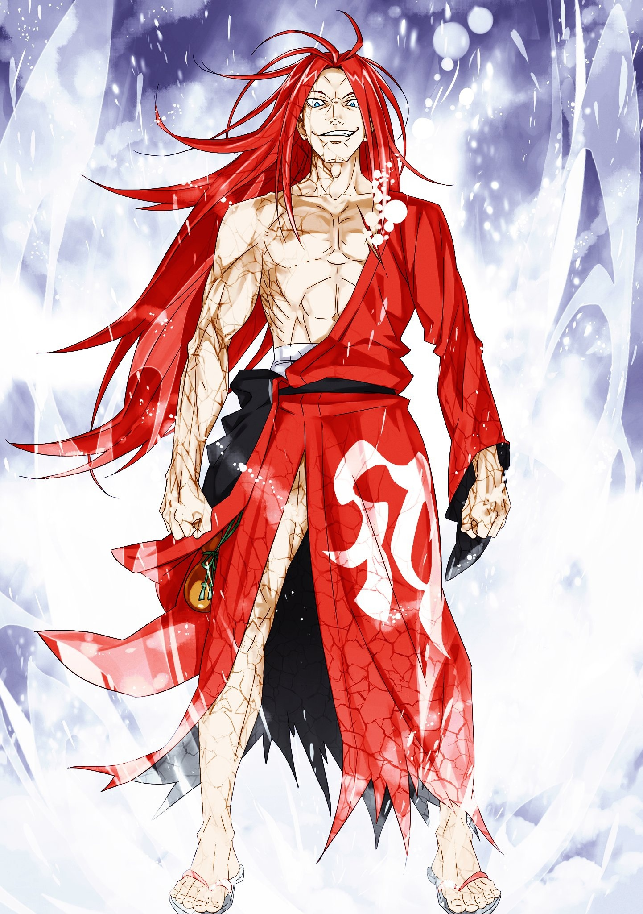
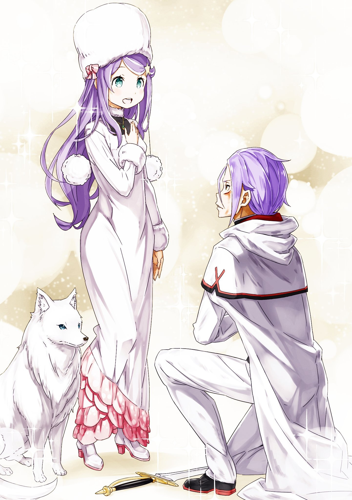

……«Величайший Рыцарь», чтобы назвать себя так, требовалось мужество.

Он действительно гордился тем, что его так называли, так превозносили другие.

Однако никогда не было ни одного случая, когда бы он назвал себя

«Самым» «Лучшим».

Он обладал самонадеянностью прожитых дней, накапливая безжалостный тяжелый труд и усердно предаваясь учебе.

Однако в своей некомпетентной и неопытной судьбе он был всего лишь окружен непревзойденными первопроходцами, товарищами, вызывающими уважение, и молодыми людьми, достойными восхищения.

Несмотря на досаду, он считал это блаженством. ……Он действительно трудился достаточно много, чтобы быть достойным этого.

Он определенно обладал самомнением того, что прожил дни, накапливая безжалостный тяжелый труд и прилежную преданность обучению.

Однако переступил ли он границы? Полировал ли он себя каждый день, пока не исчерпал все свои силы? Вдохновленный напряженными усилиями других, обещал ли он и дальше упорно трудиться над своими идеалами?

Он ответит на свой вопрос, сам.

Юлиус Юклиус действительно добился этого.

Преодолевая границы, шлифуя и совершенствуя себя до тех пор, пока он не исчерпал все свои силы, вдохновляясь напряженными усилиями других, он пообещал продолжать усердную работу во имя своих идеалов. ……Следовательно, перед существом, которое стояло на вершине

«Меча», он с уверенностью держал голову высоко.

Юлиус: ……Я «Величайший Рыцарь», Юлиус Юклиус. Меч королевства, который поразит тебя.

Рейд: …………

Схватившись за край плаща, Юлиус поклонился, и перед ним молча стоял «Святой Меча».

Он закрыл другой глаз, который не был скрыт повязкой, и не смотрел на Юлиуса. Но, молча обхватив себя массивными, крепкими руками, он о чем-то задумался.

Однако его размышления длились недолго. Просто по их короткому общению до сих пор было ясно, что он был тем, кто обладал предрасположенностью быть совершенно неспособным к размышлениям.

Таким образом……

Рейд: Ах, ах, а~а~а~а~х, ааааааааааааа черт возьми!!

Сильно почесав в затылке, «Святой Меча» Рейд единожды мощно топнул по полу.

После этого необычного удара чистый пол второго этажа задрожал, словно раскололся. Хотя тело Ехидны, которая наблюдала за противостоянием этих двух, оттолкнуло, Юлиус стоял твердо, непоколебимо.

Увидев это, Рейд щелкнул языком «Тс».

Рейд: Внешность, внешность, внешность…… да, внешность аы. Ты действительно несешь дерьмище, как мой последователь. Какой же ты невыносимый ублюдок, ты.

Юлиус: Хоть, к сожалению, я с ним не знаком, я должен выразить свои соболезнования человеку, которого ты называешь своим последователем.

Рейд: Ха? Кто, черт возьми, сказал, что мой последователь парень?

Собирать ублюдков по кругу не весело, это во-первых. Последователь о котором я говорю — женщина. У нее красивое лицо, но, черт возьми, её рассуждения меня раздражают.

Юлиус: Женщина…… тогда, какое сходство между мной и ней, о котором ты говоришь?

Рейд: А? Не заставляй меня говорить это снова и снова.

Когда на его морде появились морщинки, Рейд выразил свирепую улыбку, похожую на акулью.

И, разжав скрещенные руки и стуча руками по щекам Рейд: Вонючие рассуждения и хорошее лицо.

Что-то вроде того, чтобы давать советы младшим, было непостоянством, невообразимым, учитывая личность Рейда.

Он сделал это, должно быть, из-за собственной капризности Рейда и того, что он считал отчаянную форму Юлиуса, который только цеплялся за меч, расточительностью.

Если вы все равно собираетесь держаться за меч, тогда займите стойку, не обращая внимания на внешность. ……Именно такого отношения и решимости он добивался для Юлиуса, и это тоже был осуществимый путь.

Однако……

Юлиус: Я решил пойти по этому пути. Или, возможно, вместо того, чтобы обнажить то, что я есть на самом деле, как ты говоришь, может сделать меня сильнее.

Юлиус понимал, что если бы он сам не осознавал этого в полной мере, то, естественно, стал бы таким.

Внезапное мгновение, узкий обмен ударами, если бы хоть один кусочек его кожуры отличил жизнь от смерти, то появилось бы лицо истинного Юлиуса.

Однако это говорило о сценарии, при котором он не мог бы полностью осознавать это. ……Он должен, больше не колебаться.

Юлиус: Торжественно объявляю. Я буду думать о себе как о рыцаре.

Более того, вместо пути, по которому ты пытался меня направить, я стану самим собой, превосходящим во всех отношениях.

Рейд: Ха, черт возьми, рассуждения заставляют тебя говорить, что ты собираешься это сделать, ты.

Юлиус: Это очевидно. ……Рыцарь, на которого я возлагаю свои доверия, является олицетворением идеалов. Он благороден, справедлив и сильнее любого другого. Тогда неизбежно, что я, называющий себя рыцарем, тоже должен быть таким.

Рейд: ……Ха.

Даже его собственное слово, смехотворные рассуждения, нелогичная линия аргументов и утверждений, самовольный произвол — естественный предмет насмешек.

Однако, даже если Рейд открыто выразил свой гнев, услышав это, он просто показал свои острые клыки и засмеялся, не выражая никакого отвращения или пренебрежения.

И……

Рейд: Я заставлю тебя плакать.

Произнеся это, Рейд отбросил в сторону палочку для еды, которую держал, и перед Юлиусом, который смотрел с удивлением, сделал большой прыжок назад и отступил назад. Впоследствии он неуклонно протянул руку в сторону.

То, за что держалась его огромная ладонь, было мечом, воткнутым в белый пол.

Рейд Астреа, изначально предполагавший, что он просто предоставил свое существование в качестве судьи сторожевой башни.

По какой-то иронии судьбы он отделил расположение башни от интенсивного самосознания и, наконец, переписав плотское тело набегающего Архиепископа Греха «Чревоугодия», выполнил свое псевдо-возрождение.

В этом состоянии, в этой позиции, когда ему не нужно было подчиняться «Испытанию» башни, только тогда Рейд впервые вытащил предусмотренный меч, соблюдая свою первоначальную роль.

А именно……

Юлиус: ……Получи его прощение рукой глупца, достигшего небесного меча.

Рейд: Это моя фраза, шаришь…… ну, хотя я совершенно забыл об этом.

Юлиус: Я так и думал, поэтому я сказал это вместо тебя. ……Я бросаю тебе вызов.

Рейд: Черта с два я бы простил тебя, ты придурок. Я заставлю тебя безобразно плакать.

Перед Юлиусом, который держал свой рыцарский меч наготове, Рейд грубо указал на меч, который он вытащил.

Никаких интервалов, вообще никаких. Приняв расслабленную позу, достигнув крайностей, непревзойденный мечник…… ……Вершина всех, кто когда-либо владел мечом, «Святой Меча» Рейд Астрея.

Юлиус: А теперь……

Рейд: Как тебе будет угодно.

Юлиус: К бою!!

Поверив в рыцарство, формирующее себя, Юлиус Юклиус изо всех сил атаковал «Святого Меча».

И его тело, и сердце чувствовали легкость.

В переносном смысле это была мощь усиления, охватившая Юлиуса, когда он взмахнул рыцарским мечом.

Излишне говорить, что стабильность разума имела огромное влияние в бою.

Поразмыслив, заявить, что Юлиус находился в небезопасном состоянии с тех пор, как прибыл в эту Сторожевую башню Плеяд…… нет, с тех пор, как он потерял своё «Имя», украденное в Городе Водных Врат, было бы безошибочным.

Конечно, Юлиус предостерегал и сдерживал себя, насколько это было возможно, запрещая показывать это на своем лице.

Самообладание любой оценил бы как сродни рациональности стали…… однако это не было чем-то, что хвалили.

Более того, запрет на то, чтобы его низшая форма отображалась на его лице, как следствие обмана своих товарищей и даже самого себя, привело к неприглядному поражению последовательных, последовательных потерь с момента их прибытия в эту башню.

Для начала Юлиусу следовало бы довериться другим.

Потеряв присутствие духа из-за того, что все забыли о существовании его «я», просто жалея себя, оторванного от мира других людей, он не заметил, во что ему следовало бы верить больше всего.

Были ли люди, которых лелеял Юлиус, которым он доверял, которым он клялся в своей верности, которым он доверил свою спину, такие люди, которые просто игнорировали бы Юлиуса Юклиуса, который был оторван от их мира без их уведомления. ……Абсолютно нет, он мог бы утверждать так.

Следовательно, то, что должен был сделать Юлиус, было просто одной вещью.

Взывая искренне, он должен был проявить свою привязанность по своей воле. ……Как он это сделал, со своими бутонами.

Юлиус: Я должен был восстановить разорванные узы. Тот, кто есть никто, может стать кем угодно…… ибо никто, кроме меня самого, не является живым свидетелем этого!

Ребенок простого человека, который был никем, стал даже самым привлекательным и крутым рыцарем в этом мире.

Юлиус, который стал никем, должен был снова стать кем-то.

И……

Юлиус: Сколько бы шансов мне ни дали, я, несомненно, все равно был бы очарован ослепительным молодым человеком в тот день, увидев идеалы на спине того, кто стоял за рыцаря, и бросил бы вызов тебе, вершине «Меча», в конце концов!

Рейд: Болтать о дерьме, чертовски нахально с твоей стороны, ты!!

После обезглавливающего удара Юлиуса, чья решимость была сосредоточена на кончике его меча, Рейд взревел, одновременно нанося те же удары мечом.

Поскольку все его тело было подвержено этим движениям меча и силе меча, Юлиус прищурил свои желтые глаза и почувствовал удивление.

Это будет уже четвертый раз, когда он будет сражаться с Рейдом таким образом, учитывая новые попытки.

Первый вызов и сразу же последовавшее за ним поражение. На этот раз, кроме того, с ограничением всей сузившейся сторожевой башни, и успешно восстановившись со своими бутонами, это был четвертый раз.

Во всех разах Рейд использует как оружие, только палочки для еды…… хотя упоминание о палочках как о оружии имело большой простор для сомнений, во всяком случае, когда он размахивал чем-то, кроме палочек для еды, было впервые. «И в этот момент, вершина «Меча», «Святой Меча» с удовольствием держит меч», — подумал он.

Юлиус: Сила твоего меча не изменилась по сравнению с тем временем, когда ты использовал палочки для еды…!

Рейд: Я же го~ворил, черт возьми. Причина, по которой я силен, не в том, что я размахиваю мечом. Единственная причина, по которой я силен, — это просто потому, что я силен.

Защищаясь от ударов меча, которые небрежно опускались над головой, как только его колени заскрипели, преследование ударов нацелилось на него прямо снизу. Узко уклонившись от атаки, свидетелем которой он был впервые, Юлиус полетел в тыл при ударе.

Рейд последовал за ним, не бросившись в погоню, а просто сделав несколько длинных шагов.

Хотя можно было бы заподозрить его странную походку, в ней не было ничего особенного.

Просто шагнув вперед при мысли о том, чтобы догнать отступившего противника, легко изобрести и реализовать новую форму походки, непохожую ни на одну из ранее существовавших, было просто способностью Рейда.

Как и утверждал сам Рейд, это было просто вопросом его нормы, превышающей «Существование».

Рейд: Теперь хочешь поплакать?

Юлиус: ……Нет, чувство борьбы с легендой оживляет мою грудь!

Это не блеф, Юлиус ответил правдиво, хотя его и подталкивали.

Да, это было правдой. Тот, кто стоял перед его глазами, был Рейд Астрея.

Судя по его легендам, просто сколько раз у Юлиуса билось сердце, сверкали глаза, и он восхищался им, тосковал по нему.

Встретившись с этим человеком на самом деле, хоть он и был поражен его личностью, его сила была именно теми идеалами, которыми он восхищался и к которым стремился.

Отныне насколько расточительным было его «я» в том, чем он занимался.

И все это при наличии возможности обмениваться с ним словами, мечами, верами и убеждениями……

Юлиус: Хах.

Скрещивая мечи с «Истинным», Юлиус выдохнул, когда пришла непредвиденная мысль.

Однако крайне неуместное предвкушение заставило его сердце биться чаще, поистине восхитительно и пикантно.

Рейд: Какого хера ты улыбаешься?

Юлиус: Ничего, меня просто осенило. ……Как только я выполню здесь свою задачу и вернусь на службу к моей госпоже, я брошу вызов моему другу Райнхарду.

Юлиус высказал свою идею на вопрос Рейда.

До сих пор Юлиус ни разу не соревновался с Райнхардом в их навыках владения мечом. Напротив, до того, как было решено, что они будут в разных лагерях на королевских выборах, ему никогда не приходила в голову идея соперничать друг с другом за что-либо вообще. ……Сожаление о том, что никогда не пытался добиться равного положения.

Это тоже было одной из причин, почему Юлиус служил Анастасии и участвовал в королевских выборах.

Однако, даже если бы он не обладал этими чувствами, Юлиус все равно был бы очарован огромным талантом Анастасии, хотел видеть те же сны, что и она, и стоять на том же месте.

Таким образом, с самого начала он никогда не нуждался в тупых отговорках или окольных взглядах.

С самого начала ему просто следовало взять два деревянных меча и направиться к Райнхарду.

Когда-то в прошлом Райнхард и сильнейший мечник Империи Волакия скрестили мечи.

В тот день, когда все присутствующие на плацу прониклись диким энтузиазмом по поводу атмосферы меча, Юлиус тоже почувствовал тепло в груди.

Ибо это был ответ……

Рейд: Ха, это имя, о котором я никогда не слышал. Кто, черт возьми, этот никто?

Юлиус: Он твой потомок. И , наряду с тем, что он в настоящее время

«Святой Меча», также мой друг.

Рейд: Кха! Ребенок моего ребенка, уже просто какой-то посторонний, черт возьми. Я его не замечу, даже если увижу на какой-нибудь обочине.

Переплетая движения меча и удары ногами, Рейд разъяснил свою безответственность, фыркнув носом.

Найдя слабое опровержение в этом рассуждении, Юлиус попытался открыть рот, обмениваясь мечами……

Рейд: Я начинаю уставать от разговоров о посторонних. Ты, ты хочешь поболтать со мной?

Юлиус: ……. Хотя я не буду этого отрицать, я, пожалуй, откажусь.

Рейд: …………

Юлиус: Если бы только было время, я бы хотел поговорить с тобой, пусть это будет два дня или три дня. Однако в настоящее время времени для этого, к сожалению, нет. Я тороплюсь и меня толкают в спину. Так что……

Когда расстояние между ними увеличилось, Рейд приподнял щеки, глядя на Юлиуса. В голубом глазу Рейда была фигура Юлиуса, увеличивающая его яркость.

Шесть кружащихся разноцветных огней смешались, мягко начав рисовать сияние, радугу.

И……

Юлиус: Ал Клаузерия!!

Сияние испускаемой радуги устремило завоевывающий белый мир к Рейду.

Сам Юлиус тоже расширил глаза, глядя на размах и мощь излучаемого сияния.

На данный момент это было максимальное духовное искусство, преобразованное в магию необычайного масштаба, с которой обращались так же, как и раньше, приглашая к невежливости……

Юлиус: ………

Бутоны…… нет, он не будет называть тех девушек, которые дословно заставили свой закрытый дар и талант расцвести, бутонами.

Те девушки, которые достигли роста, чтобы их можно было считать возвышенными, красивыми, с обаянием, с героизмом, с достоинством, ярко, были не бутонами, а девицами.

Полностью присвоить этих девушек для себя, поскольку все шестеро из них демонстрировали свое очарование, возможно, сделало его грешником, большим, чем Архиепископы Греха.

Однако……

Юлиус: Даже если вы все забудете меня, я всех вас люблю.

Юлиус шагнул вперед, словно пытаясь догнать излучаемое сияние.

Сияние радуги, облаченной в шесть стихий, пробило все щиты и разбило цель. Следовательно, до появления радужного света у противника оставалось всего два варианта…… принять вызов или уклониться.

Рейд: ……Ха.

И в соответствии со своей индивидуальностью Рейд Астрея не уклонился от сияния радуги.

Реагируя на сияние радуги, рвущейся вперед, Рейд поднял свои могучие руки и рубанул острым краем имперского меча, за который он держался.

Не полагаясь на особую магию или Божественную защиту, «Движение Меча» можно назвать чистым насилием…… одним махом это было то, что уничтожило максимальную магию, которую Юлиус использовал изо всех сил.

Однако это тоже было учтено Юлиусом, когда он шагал вперед.

Прыгнув вперед из тыла погасшего сияния, Юлиус позаимствовал силу своего меча и своих девиц.

Юлиус: Иа! Аро!

В этот момент красный и зеленый духи откликнулись на зов и объединили свои силы, ветер образовал водоворот вокруг пылающего пламени, породив у ног Рейда пылающий торнадо.

Почувствовав спираль тепловой волны внизу, Рейд проворно поднялся вверх, прежде чем его обожгло.

Однако только сейчас началось соединения Рыцаря Духов с

«Величайшим Рыцарем».

Юлиус: Куа! Ик!

Желтый Дух образовал выступ на чистом полу, поднимая тело Юлиуса еще выше. Одновременно свечение голубого Духа оледенило влагу в воздухе, препятствуя подъему Рейда, который прыгнул вверх.

Щелкнув языком, Рейд изменил свою позу, совершив явно выходящее за рамки человеческого поступка топанье по воздуху, и поставил ноги на потолок из льда, образованного в воздухе, хмуро глядя на Юлиуса, пока он был вверх ногами.

Твердая сила влилась в руку Рейда, и перехват был нацелен на поднимающегося Юлиуса……

Юлиус: Ин! Нес!

В момент, когда контратака «Святого Меча» приближалась к нему, белые и черные Духи вмешались в мир своими соответствующими силами.

Белый свет придал силу всему телу Юлиуса, черный свет хоть немного ослабил мощь врага Юлиуса. Незначительное разграничение, рожденное в те моменты, было центральной фигурой в следующем исходе.

Рейд: …………

Когда ледяной потолок превратился в опору, разлетевшуюся на осколки, брошенная фигура Рейда расплылась из-за его скорости.

Бесхитростная поза меча, нанесшего определенный тип продольного и поперечного удара высшего рода…… чувствуя, что это не угроза, Юлиус твердо держал грудь и противостоял ей.

Устойчивая правда заключалась в том, что при пересечении удара мечом и удара мечом более сильная сторона отталкивала другую.

Таким образом, Юлиус открыл глаза. ……Глаза, которые постоянно, постоянно следили за тем, что двигалось вверх, двигались вперед.

Юлиус: …………

Убивая само понятие звука и света, вспышка Рейда расколола пространство.

Он подтвердит. Если это будет оговоренный меч или палочки для еды, независимо от того, что может произойти на пути этой вспышки, она будет уничтожена.

Ибо это было само проявление понятия «Меча».

«Меч» —это то, что производится с целью рубить предметы.

И движения меча — это термин, обозначающий техники нанесения ударов этим мечом по объектам.

Отныне вспышка, рассекающая все объекты в мире, была кульминацией и долгожданным изначальным желанием «Меча» и

«Движений Меча».

Те, кто изрезан им, не забудут правду о том, что они были изрезаны на вечность.

Таким образом, шрам, который Юлиус Юклиус получил под левым глазом, не исчезнет навечно.

Это была компенсация за то, что он уклонился от вспышки «Святого Меча» с расстояния, достаточно близкого, чтобы пройти мимо.

Юлиус: …………

Отказавшись от своей приемной позиции, он воспринял меч противника с мгновенной атакой и защитой.

Из рассеченного глазного дна хлынула кровь. Однако он не должен закрывать глаза. Сохраняя сосредоточенность на противнике, он взмахнул рукой.

Отказавшись от приема, он разразился сотней вспышек обиды……

Юлиус: ……Ал Клариста.

Величайший в истории удар мечом Юлиуса Юклиуса раскрасил цвета радуги.

Он запечатлел улыбку Рейда Астреи, свирепую, как у акулы…… ……Повязка на глазу, скрывавшая левый глаз «Святого Меча», была пронзена ударом рыцаря, когда она взлетела в воздух.

Юлиус: …………

В тот момент, когда он спустился на чистый пол пальцами ног, он почувствовал, как эхо шагов стало ужасающе ревущим.

В тот момент, когда он осознал это, сердце Юлиуса в глубине груди, забыв биться, в панике пришло в движение.

Затем, повернувшись назад, он посмотрел на крепкую спину, обращенную к нему.

Рейд: …………

Его длинные рыжие волосы тряслись, спина стояла твердо и неподвижно.

Великий человек сжимал в правой руке предусмотренный меч, а его левая рука была прижата к его же лицу. Место, к которому прикасалась эта левая рука, изначально должно было быть повязкой на глазу, но в настоящее время она отсутствовала.

Повязка на глазу, скрывавшая левый глаз «Святого Меча», в настоящее время упала к ногам Юлиуса.

Юлиус: ……Значит, я попал, хах.

Его голос дрожал, когда он смотрел на глазную повязку, упавшую на чистый пол, и рыцарский меч в своей руке.

Хотя его шепот стремился подтвердить происходящее, в нем чувствовалось чрезмерное отсутствие связи с реальностью. Ему это казалось мимолетным сном, что все это ускользнет и исчезнет сквозь его пальцы.

Однако…… ‘…………’ Шесть огней превозносили достижения Юлиуса без слов.

Теплые цветы, названные его возлюбленными, стремились заполнить пустоту, рожденную в сердце Юлиуса.

И сопровождая похвалу своих цветущих дев……

Ехидна: ……Юлиус.

Услышав мягкий голос, Юлиус посмотрел в его сторону.

Великий человек повернулся к нему спиной, девицы передавали рекомендации, глядя на битву с места, с высоты птичьего полета, крикнув Юлиусу, была женщина со светло-пурпурными волосами.

С лицом, идентичным лицу его госпожи, которую он лелеял, которой он обещал посвятить свой меч, Искусственного Духа, который будет жить вечно, с которым у него были отношения, бессознательно взаимно ранящие друг друга……

Была ли причина ее заботы о Юлиусе из-за того, что она лелеяла Анастасию, или из-за действия его «Божественной Защиты Сбора Духов», ответ оставался завуалированным.

Однако присутствие того, кто следил за решением Юлиуса Юклиуса, настолько успокоило его сердце, что он в знак благодарности поднял свой рыцарский меч.

Юлиус: …………

Без слов он поднял свой рыцарский меч к небу.

Остатки, украшенные северным сиянием, блестели, путь меча дословно очерчивал радугу.

Конечно, это было похоже на благословение, излитое на рыцаря по имени Юлиус Юклиус……

Рейд: ……Было бы это дерьмовое «Испытание», это дало бы тебе победу.

Произнося это, великий человек неуклонно топал по полу по касательной.

Когда он обернулся, на лице Рейда не было видно никакой раны. То, чего достиг кончик меча Юлиуса, очевидно, было всего лишь его повязкой на глазу. Однако даже у Рейда не хватило бесстыдства так преувеличить и сказать, что до него это не дошло.

Прежде всего, его предыдущее замечание было не его нежеланием признать поражение, а правдой.

Если бы это действительно было продолжением «Испытания» второго этажа «Электры» Сторожевой Башни Плеяд, в момент успешного соединения одного удара Юлиус прошел бы его и получил право бросить вызов верхнему этажу.

Однако битва между Юлиусом и Рейдом больше не была вопросом

«Испытания» башни.

Они сражались, чтобы уладить это между единственным рыцарем и единственным мечником, мужчиной и мужчиной.

Рейд: ………

Потеряв повязку на глазу, Рейд, проснувшись обоими глазами, обеими руками сжал оговоренный меч.

Сжимая рукоять меча, он направил меч на цель. ……Да, так закрепился «Святой Меча».

Не для того, чтобы бесхитростно размахивать палками, а для того, чтобы с уверенностью рубануть врага.

Рейд: Не жалуйся, даже если ты исчезнешь в никуда.

Юлиус: Даже если бы я захотел пожаловаться, было бы трудно найти способ сделать это, когда у меня не было бы рта, чтобы жаловаться.

Рейд: Ха! Негодяй, я даже не собираюсь смеяться над шутками, черт возьми. Ты, еще раз, как тебя зовут?

Юлиус приподнял брови, когда легенда спросила его имя.

Хотя к настоящему времени он определенно называл себя бесчисленное количество раз до этого, но он не помнил об этом.

Однако то, что он не помнил об этом, было теперь незначительным.

Он понимал, что этим вопросом Рейд, несомненно, впервые признал Юлиуса.

Юлиус: Юлиус Юклиус. Поскольку это имя легко забыть, я прошу тебя запомнить его.

Произнеся лишнее замечание, которое он не счел бы юмором всего лишь короткое время назад, Юлиус также направил авангард своего рыцарского меча на Рейда.

И снова он умолял о помощи шести Духов, которые только и трудились для него непосредственно ранее.

Если это будет он сам и эти девушки, то он непременно достигнет более далеких высот радужного сияния.

Ал Клаузерия и Ал Клариста.

Заимствуя мощь шести Духов, сияние радуги ограничивает силу шести стихий. ……Клаузерия, использовавшая максимальную магию, и Клариста, заставившая ее остановиться на рыцарском мече.

Тайный ритуал, выходящий за рамки, который ему ни разу не удавалось из-за своей неопытности……

Юлиус: ……Тем самым, я покоряю.

Рейд: ……Давай.

В тот момент полярное сияние затопило белое пространство, полосы радуги схватили великого человека в красном.

Оригинальное искусство радужного духа, разработанное Юлиусом Юклиусом, секрет среди его секретов.

Ни запускать свет радуги, сворачивая шесть элементов, ни заставлять их пребывать в мече, но облачаться в него и истреблять противника, становясь самим сиянием.

Юлиус: ……Ал Кланвеир.

С самого начала и до самого конца масштаб нападения и защиты намного превосходил способность неподготовленного глаза не отставать от него.

Излишне говорить о встречных ударах меча, но ошеломляющая смена позиций и работа ног, какая сторона была доминирующей, а какая подчиненная, даже это одно не могли уловить бледно-лазурные глаза.

Это было совершенно независимо от того, что это плотское тело не было ее первоначальной принадлежностью.

Просто здесь присутствовали те, кто боролся за вопрос жизни и смерти в этом измерении, и по сравнению с ними мир, в котором она жила, был просто чрезвычайно меньшим измерением, которое противостояло истине.

Если чувство ценности и ценности живых существ покоились на их могуществе как живых существ, то ее «я» было хрупким, относящимся к бесполезности.

Более того, это также было доказательством того, что она прожила несколько веков в праздности, повернувшись спиной к пути самосовершенствования и возвышения.

С тех пор как она впервые осознала себя, у нее появилось предчувствие.

Что цель неестественного существования, названного ею самой, была достигнута в тот самый момент, когда она родилась.

Во всяком случае, само рождение было ее целью, и цель была достигнута в тот момент. Отныне оставленная как есть, она бесцельно бродила по миру, не в силах уклониться от пустоты многих веков.

Она не возражала если она умрет. Однако у нее просто не было причин для смерти.

Таким образом, слишком долго откладывая свою кончину бездействием, она предавалась праздности.

И во время своего продолжения она наткнулась на молодую девушку.

Очарованная образом молодой девушки, ведущей яркий образ жизни, ее оледеневшая жизнь приобрела теплоту. Молодая девушка, которая обладала миниатюрным телосложением и говорила неправдоподобно громко, кем бы она ни оказалась, или не смогла бы стать кем бы то ни было, она жаждала засвидетельствовать это своими собственными глазами.

И прежде чем кто-либо успел это заметить, такая ее интрига и интерес стали незначительными…… «……Я не хочу потерять ни тебя, ни твоих детей, которыми ты дорожишь.» Она знала, что то, что называлось течением времени, было добрым, но жестоким.

Хотя время лечило раны, оно также сделало эмоции устаревшими.

Она недавно задумалась, прожив долгое, продолжительное время. ……

Что она, не хотела отдавать это прошлому. «Хотя это тоже невыполнимое желание.» Даже если она умоляла его остановиться, время безостановочно уходило.

Жизни, имеющие крохотную и ничтожную продолжительность жизни, демонстрировали всевозможные изменения в пределах своего времени.

Так же, как безымянный рыцарь, у которого было украдено его «Имя», который не остался ни у кого в памяти, доказал, что он был исключительным человеком по имени Юлиус Юклиус. ……Рыцарь, облаченный в сияние радуги, погрузился прямо в белый свет.

Против Юлиуса, который сделал ставку и раскрыл секретный ритуал, действия Рейда Астреи были ужасно простыми.

Чтобы опустить меч, который он поднял, удары мечом, вероятно, повторялись больше всего в этом мире…… он косо разделил мир пополам, став светом, который разрушал все на своем пути к гибели.

Ни особой магии, ни особого приема.

Простым взмахом меча мир опалил светом. Неразборчиво.

Превышал ли Рейд Астрея нормы, или все «Святые Меча» были таковыми.

Хотя то, что было определенно, было…… «……Юлиус» Что она хотела посвятить свою силу, чтобы полярное сияние не было затмеваемо абсурдным белым светом.

Это, несомненно, был ее истинный мотив, однако такое действие, как прямое вмешательство в эту битву, до самоубийства, было бы грубым, и этот грех не оставил бы ей даже права жаловаться, если даже ее душа будет разбита в раскаянии.

И молодая девушка…… Ехидна знала, что сама ничего не могла сделать.

В этом месте, если она могла что-нибудь сделать для Юлиуса Юклиуса, который превратился в сияние. “…………” Положив руку на свою стройную грудь, она почувствовала дремлющее в ее глубине существование.

Первоначальная обладательница этого плотского тела, причина, по которой она не могла проснуться от своего глубокого сна, в поисках, Ехидна достигла этой башни песчаного моря. ……Однако это был обман.

Ехидна уже знала причину, по которой она не просыпалась.

Девушка, которая заявляла о своей жадности, которая хвасталась своим желанием достичь всего и вся.

Никогда не отпускать то, что она когда-то положила в сумочку, что бы ни случилось, так как она очень ненавидела отпускать, расставаться с чем бы то ни было, была только одна единственная причина, с которой она могла считаться. “Передав тело мне и временно бездействуя в своем Од, ты находишься в состоянии, в котором ты не будешь получать никакого вмешательства из внешнего мира. ……Потому что Од- это своего рода собственный мир.” И по собственной воле она уединилась в этом месте.

Причина очевидна. ……Если она выйдет наружу, она понесет последствия. Отвратительное Полномочие Архиепископа Греха

«Чревоугодия», она подвергнется его последствиям.

Она забудет то, что хотела никогда не забыть, откажется от того, от чего никогда бы не отказалась.

Анастасия Хошин¹ забудет Юлиуса Юклиуса.

Такова была ее цель. Однако…… “Похоже, все, кто пришел в эту башню — убежденные тупицы. ……Все они кажутся неискушенными до такой степени, что умирают, переживая из-за потери чего-то.” В течение почти двух месяцев она пыталась самостоятельно подражать своему образу жизни, но сейчас было самое подходящее время.

Кроме того, поскольку она наблюдала его положительные и отрицательные стороны, его суетливое «я» безымянного рыцаря с близкого расстояния, даже если бы эта девушка забыла, она бы могла сообщить ей. “Ах, это так.” Не имея цели, Искусственный Дух, выполнивший свой долг перед рождением.

Хотm она и признала, что выполняла исключительно эту неприятную обязанность, вопреки ожиданиям, на этом она не подошла к концу.

Юная девушка, которую она лелеяла, рыцарь, которого она лелеяла, и действующая как промежуточный мост между двумя сломанными.

Разве это бремя не было жизненно важной задачей?

Разве это не имело такого жизненно важного значения, что она могла улыбаться, размышляя о том, что это было целью ее рождения.

Таким образом……

Ехидна: Даже не увидеть, твоего рыцаря в самом крутом состоянии, такой расточительный поступок, разве это не недостойно твоего скупого «я».

……Белый свет преследовал полярное сияние, как будто хотел его закрасить.

Более того, он напирал всей своей душой и, позаимствовав силу шести Духов, перезаключил свой контракт.

Он сделал ставку и раскрыл секрет среди секретов, в то время как противник просто серьезно, торжественно взмахнул мечом. ……

Действительно, он был совершенно поражен этим абсурдным превышением норм.

В то же время, поскольку он также обладал эмоциями, заявляющими о том, что именно это должно происходить в его груди, он обнаружил, что и его собственное «я» тоже непоправимо.

Взмахом меча мир раскололся.

Это был особый прием «Святого Меча», который проявлялся когда Райнхард тоже взмахивал мечом.

Внезапно, в разгар соперничества между жизнью и жизнью, Юлиус задумался.

Райнхард и Рейд, если они сразятся друг с другом, кто победит как более могущественный?

Легенда и легенда, «Святой Меча» и «Святой Меча», в недостижимой битве, кто будет объявлен победителем?

К сожалению, возможность убедиться в этом нет.

Юлиус: Тогда у меня нет выбора, кроме как подтвердить это своим телом.

Возможность скрестить мечи с Райнхардом ван Астреей и Рейдом Астреей выпала только тем, кто достиг этой башни.

Более того, такая возможность существовала исключительно для Юлиуса и молодой девушки по имени Эмилия, которая направилась к верхнему этажу. ……Он не собирался уступать эту обязанность комулибо еще.

Таким образом, ему оставалось просто победить.

Отразить этот белый свет и сразить Рейда Астрею сиянием радуги.

Для этой цели вся его душа и сила его меча требуют еще одного шага дальше……

Если искорка гордости и могущества остановится на острие меча

«Величайшего Рыцаря»……

Ехидна: ……Юлиус.

Зов, который не может быть достигнут.

Однако при ударе, делающем течение времени нечетким, время, необходимое для каждого сближения мечей, составляло менее доли секунды. Это было нападением и защитой этого сиюминутного мира.

В этом пространстве, а тем более в разгар битвы, ведущейся с риском жизни и смерти, ни до кого не мог донестись чей-либо голос.

Юлиус: …………

Тем не менее, голос определенно поколебал Юлиуса.

Возможно, не его барабанные перепонки, но вместо этого они достигли чего-то гораздо более глубокого внутри, до самых сокровенных глубин его груди.

Учитывая, что в душе он решил носить панцирь по имени рыцарь, он должен непременно откликнуться на него. Вот почему, услышав голос, который он не мог слышать, Юлиус повернулся к той, кого не мог видеть, и обменялся взглядом своими бледно-лазурными глазами. “Надери ему зад, мой рыцарь” ……В этом единственном предложении описывался последний рывок мощи меча, в котором он нуждался.

Юлиус: Иа! Куа! Аро! Ик! Ин! Нес!

Попросив сделать последний рывок, он воззвал к Духам, с которыми стал частью полярного сияния.

Чтобы преодолеть белый свет, за которым присутствовала фигура врага, которого он должен был победить, прямо перед ним.

Чтобы дотянуться до острия меча за пределами света……

Юлиус: Уо~о~о~о~о~о……~кх!!

Открыв рот до неприличной для него степени, он повысил голос до такой степени, что его рвало кровью.

С выражением лица, обладающего готовностью к смерти, отбрасывая элегантность на ветер, просто следя за тем, чтобы кости, поддерживающие его самого, не сломались, Юлиус выступил вперед.

Рейд: …………

И, когда сияние радуги усиливалось, белый свет из засады тоже усиливал свою силу.

Тем не менее, тем не менее, усиливая свою мощь, сияние радуги и белый свет яростно столкнулись……

Юлиус: ……Ах.

То, что, казалось, будет существовать вечно, было встречено непредвиденным падением занавеса.

Юлиус: ……Ах.

Ошеломленный, Юлиус заметил, как слабый голос вырвался из его горла.

Взаимное столкновение их максимальных сил, его резкое падение занавеса. Однако, не прекращая своей силы, его меч, украшенный сиянием, прямо пронзил жизненно важные органы противника.

Юлиус: Почему……

Рейд: Тс, ах, дерьмо, это довольно скучный конец.

Юлиуc погрузился в смятение, будучи виноватым в нанесении удара, в то время как, с другой стороны, Рейд, получивший ранение, сохранял спокойствие.

Не обращая внимания на удар в грудь, он даже не нахмурился.

Было ли это деянием его упорной силы воли, а если нет, то причиной тому была аномалия, проявившаяся на плотском теле этого великого человека.

Разрозненная от проникновения меча Юлиуса, рана…… нет, в груди Рейда Астреи образовалась трещина.

И это не ограничивалось только его грудью. Его руки и ноги, шея и щеки, на обильных участках его тела растянулись раны, похожие на треснувшее стекло.

Иллюстрация к Том 25 | Разукрасил Ранобэ DdukaE Интуитивно Юлиус понял, что это было.

Первоначально немыслимое искажение было исправлено. Это был феномен этого механизма.

Рейд: В конце концов, дело в этом. Такой человек, как я, не подходит ни для какого другого судна, кроме моего же тела.

Глядя на свою растрескавшуюся ладонь, проницательность, которую проворчал Рейд, была верной.

Захваченный Полномочием «Чревоугодия» в форме разграбления права на контроль над этим телом из плоти Рейд Астрея приобрел сущность…… однако правда в том, что до самого горького конца это тело принадлежало Архиепископу Греха «Чревоугодия», Рою Альфарду, ставший фундаментом, ничего не изменилось.

Другими словами, вместилище по имени Рой Альфард не смогло вынести действия души, превышающей норму, по имени Рейд Астрея.

Его провал материализовался в заключительной фазе битвы против Юлиуса.

Юлиус: Тогда я бы предпочел, чтобы ты тоже мог!

Рейд: Что ж, если бы меня не съел этот парень, я, возможно, аккуратно дожил бы до конца. В таком случае, все закончилось бы тем, что ты просто повалил бы мою повязку на глазу, шаришь?

Юлиус: Кх……

Рейд: Кахаха. У слабых людей всегда все идет не так, как хотят они.

Сейчас то ты хочешь поплакать?

Отбросив условный меч в сторону, Рейд подло рассмеялся, обнажив зубы.

Как же так получилось, что он мог так смеяться? Как бы то ни было, его исчезновение сейчас было будущим, высеченным в камне.

Вместо этого, если бы он победил Юлиуса, он, возможно, смог бы снова пройти свой жизненный путь, который однажды закончился.

Даже несмотря на то, что он позволил этой возможности ускользнуть из его рук.

Рейд: Такой придурок, ты. Что-то вроде того, как снова прожить жизнь… кто, черт побери, сделает что-то такое хлопотное. Во-первых, что черт возьми, случится, если я где-нибудь наткнусь на себя.

Юлиус: ……Мне жаль это говорить, но ты уже скончался от старости несколько веков назад. Даже если твое нынешнее «я» ходит вокруг, для твоего прежнего «я» это так.

Рейд: Ха! Тогда ты поклоняешься роже ребенка моего ребенка, который как посторонний или что-то в этом роде? Ну и херня.

Отношение к своим потомкам как к чужакам, его недавнее замечание, казалось, было его истинным чувством.

Делая вид, что совершенно не интересуется вторым спасательным кругом, Рейд затрещал костями шеи.

Рейд: Во-первых, какого хера ты мне говоришь мне, что делать после моего воскрешения, эй ты. Типа, поиграл бы со свирепой вьюшкой, которая пробежала ранее, хотя та красотка вдали тоже довольно милая. А еще есть та женщина с эротическим видом……

Юлиус: О, так разве у тебя действительно нет застарелой привязанности…?

Рейд: К чертам. Делать то, что хочешь, когда думаешь о том, что хочешь, вот мой стиль. Тебе тоже было бы намного легче, если бы ты делал так.

Юлиус: ……Моя благодарность за совет. Однако для меня это был бы более тернистый путь.

Он сам предпочел носить панцирь.

Обманывать себя или действовать так, как будто часть его основы была отдельным предметом, также было бы подходящим ярлыком.

Осознав, что выбор подобает ему самому, что он соответствует его желаниям, даже если Юлиус считает экстравагантность Рейда ослепительной, он не сделает этого.

Услышав такой ответ Юлиуса, Рейд раздраженно фыркнул.

Впоследствии рана на его груди…… трещины, образовавшиеся в результате выхода за пределы границ, единственная рана, отличающаяся от тех, к которым он прикасался пальцами Рейд: Ты, не пойми не правильно, лады? То, что ты дотянулся мечом, было случайностью. Если бы это было мое тело, что-то вроде тебя даже не смогло бы вытирать сопли о других.

Юлиус: Во-первых, я бы вообще не стал так поступать, хотя……

Рейд: Ха! Как скучно!

Выплюнув, Рейд ударил Юлиуса по плечу рукой, которой он касался своей груди.

Оцепенев от этого удара, Юлиус сделал глубокий вдох.

Еще не все он принял или отреагировал на все.

Однако он считал, что позволить этим моментам освободиться, просто потеряв присутствие духа из-за происходящего перед его глазами и испытывая смятение, было бы гораздо более невыносимо.

Щели расширились, конец уже был виден.

Следовательно, Юлиус поднял свой собственный рыцарский меч, который он обнажил, перед своим лицом……

Юлиус: От всего сердца я уважаю твою силу меча.

Рейд: Я не нуждаюсь в восхищениях ублюдков. ……Я прощаюсь со своей победой, Юлиус.

Юлиус: …………

Когда его имя прозвучало в его последних словах, Юлиус удивленно посмотрел на него.

Однако из-за решимости в своем сердце не волноваться, он скрыл это удивление за улыбкой и поклонился.

Точно так же, как он уверенно называл себя, перед этим легендарным существом, лучшим рыцарем.

Точно так же, как идеалы Юлиуса Юклиуса были сформированы, чтобы не позорить его восхищение.

Юлиус: Да, до самого конца ……Это твоя победа, Рейд Астреа.

Рейд: Ха, вот это милое личико, чертов унылый неудачник.

С этими словами, ознаменовавшими конец, щели Рейда Астреи расширились……

???: …………

В отличие от их визуального впечатления, трещины, расширяющиеся до самого конца, не сопровождались звуком.

В отличие от разбитого стекла, великий мужчина с рыжими волосами исчез, как тускнеющий свет…… вместо него рухнул на чистый пол юный мальчик миниатюрного телосложения с опухшими холодными глазами.

Тот, кто ел «Воспоминания» и «Имена» других и управлял ими согласно своей воле, «Причудливое поедание» и богохульник.

Архиепископ Греха «Чревоугодия» Рой Альфард потерял сознание.

Рой: …………

Неизвестно, жив он или мертв, «Чревоугодие» оставался неподвижным, ни разу не дернувшись.

Однако, как и у Рейда, у него была просто глубокая рана на левой стороне груди, ее фатальность неоспорима.

Убедившись в этом только глазами, Юлиус опустил рыцарский меч, который он поднял в знак чести, вложил его в ножны, которыми владел, и повернулся назад.

Неограниченное сияние, в окрестностях Юлиуса было шесть Духов с увеличенным сиянием.

Без силы этих девушек, которые из бутонов превратились в дев, тот, кто лежал бы таким образом на чистом полу, наверняка был бы самим собой, а не противником.

Для этого он должен сознательно передать свою благодарность и признательность.

Однако, извиняясь перед этими девушками, он должен отложить проявление благодарности.

Неуклонно Юлиус продвигался вперед.

Впереди, в том направлении, куда он направлялся, внимательно наблюдая за Юлиусом, стояла великолепная, стройная, миниатюрная женщина с бледно-голубыми глазами. Волнистые светло-фиолетовые волосы, персонаж, украшенный белым нарядом, не подходящим для песчаных дюн.

У ее ног сидела белая лиса, зрачки ее глаз дрожали в напряжении.

Ее форма, которая всегда изображалась шарфом, означало ее присутствие здесь.

Снова позволив себе осознать это, Юлиус закрыл глаза.

И……

Юлиус: ……Рад познакомиться.

Заявление, которое он передал «Святому Меча» как сопернику до сих пор, он повторил еще раз.

Но ощущение глубоко в груди в эти моменты отличалось от усиления, предшествовавшего битве.

Однако существовало и нечто такое, что оставалось неизменным.

Как будто открытие новой страницы в приключенческой сказке, авантюрное сердце юноши тоскует по рыцарю. ???: Я.

Встав на колени в этом месте, Юлиус произнес первые слова, и другой человек ответил.

Оставаясь в опущенной позе, Юлиус ждал предстоящих слов. Он рассудил, что может ждать сколько угодно долго.

Что это было за счастье — верить, что, если он подождет, он, несомненно, услышит ее слова. ???: ……Я, Анастасия Хошин².

Юлиус: …………

Анастасия: Я хочу всего в этом мире…… Итак, великий и крутой братец, как тебя зовут?

С элегантностью она улыбнулась, и он мог точно понять, как она, должна была, наклонить голову после этого.

Оставшийся опущенным на колени, он опустил и спрятал лицо, сказав “Ха”, Юлиус сделал короткий вдох и Юлиус: Я Юлиус Юклиус. ……Ваш единственный рыцарь.

Анастасия: …………

Юлиус: Возможно, вы забыли. Однако я тот, кто посвятил вам меч .

Тот, кто посвящает вам всю свою силу и помогает вашей воле.

Почтительно поклонившись рыцарскому мечу, положенному на пол, Юлиус, наконец, поднял лицо.

Перед ним, независимо от того, какой взгляд должен быть у его госпожи, он не пожалеет.

Рыцарю не подобает терять присутствие духа, быть сбитым с толку лицом вниз.

Юлиус восхищался и стремился к тому самому существу, которое старалось изо всех сил казаться и стремилось обладать прохладным и очаровательным видом.

И глядя на Юлиуса, молодая девушка сузила свои глаза Анастасия: Правда? Хотя я не помню…… но.

Юлиус: …………

Анастасия: С первого взгляда подумала. ……Что я должна сделать этого братца своим.

В такой близости были пылающие, сверкающие глаза его вечно жаждущей госпожи, раскрывающие намерение не отказываться ни от чего и от всего.

«Жадности», стремящейся получить все, Юлиус Юклиус снова посвятил свой меч.

Великолепная пьеса, как сказка о госпоже и её рыцаре в художественной литературе……

Иллюстрация к Том 25 | Разукрасил Ранобэ DdukaE Восстановление расхищенной связи «Хозяина и Слуги» было реализовано на втором этаже «Электра».

Это было устранение одного из пяти препятствий, установленных Нацуки Субару.

Большая библиотека Плеяд, второе «Испытание» ……тем самым, завершается.

*¹, ² — Хоть я и стараюсь придерживаться терминологии вики где написано Хосин, но здесь я предпочел вариант Хошин, ибо так звучит лучше)

