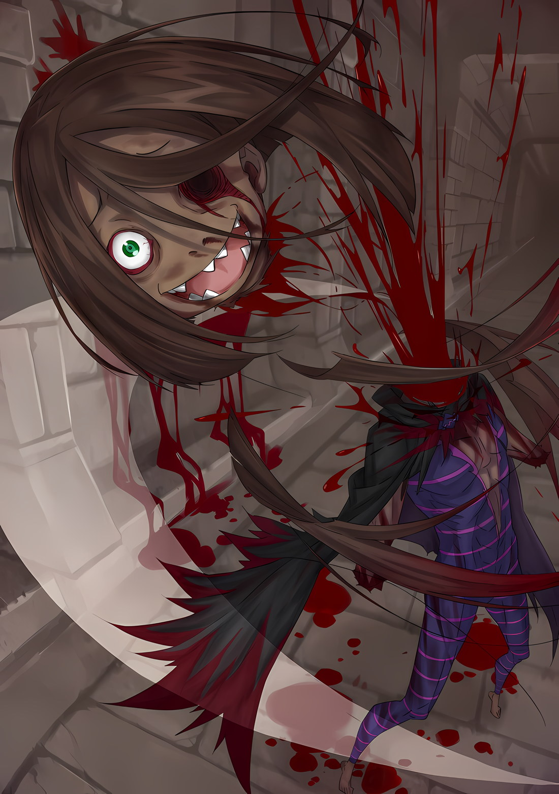

С давних пор она питала дурные предчувствия.

Ее господин, которому она посвятила свою преданность, Розвааль Л.

Мейзерс, для достижения его конечной цели было необходимо убить

«Дракона», охранявшего Королевство Лугуника.

Она была жизненно важной и незаменимой частью плана Розвааля, поскольку Рам это слышала, ни от кого другого, кроме как от неё самой; это произошло почти десять лет назад.

Деревня клана Демонов Они пылала багровым светом, спасши Рам и ■■■ оттуда, Розвааль пожелал компенсации.

И в обмен на возмездие за клан Демонов Они, Рам решила выплатить эту компенсацию.

Что она будет таким образом сотрудничать, пусть это будет для плана убийства «Дракона» или что-то еще.

Но просто по одному особому поводу Рам не смогла найти ответ внутри себя, поскольку основной причиной было убить «Дракона».

Это было нелегко. Даже если бы пришлось вмешиваться в планы и принимать меры, это было нелегко. А если бы этот момент наступил, что бы смогла сделать Рам? “Вы узнаете, когда придет врееемя. ……Ваша роль, которую можете выполнить только вы двое, старшая сестра и её ■■■■■■■■■.” Ей казалось, что она когда-то слышала такие слова, которые как будто были отколоты.

Любопытно, что до сегодняшнего дня она никогда не задумывалась, что это значит, но…… “Это, наконец, понято. К чему стремился Розвааль-сама.” Все действия Розвааля были направлены на достижение конечной цели, которую он преследовал на протяжении всей своей долгой жизни.

Для этой цели он спрятался глубоко в Королевстве Лугуника, для этой цели он спас Рам и ■■■, для этой цели он обозначил «Святилище» как пробный камень, для этой цели он протестировал Нацуки Субару.

Даже если бы ему неизбежно пришлось изменить свой первоначальный план, вся подготовка до этого момента не была бесполезной. ……Нет, он не допустит, чтобы она стала бесполезной, вот кем он был.

Следовательно, ответ пришел и к Рам.

Причина, по которой Розвааль взял под опеку пару младших Демонов Они, старшую сестру и ■■■■■■■. ■■■ была принята вместо утерянного рога Рам.

Рам и ■■■, старшая сестра со ■■■■■■■■, действовали как один Демон Они, он взял их в свои руки для убийства «Дракона».

Естественно что даже Розвааль не мог избежать воздействия Полномочия «Чревоугодия».

Как следствие, он тоже, должно быть, забыл, почему ■■■ взяли в его особняк. Однако, даже если он забыл, он, должно быть, сразу же определил свою цель.

И, наблюдая, как Рам и другие прилагают огромные усилия, чтобы спасти ■■■ от «Чревоугодия», он не раскрыл эту правду. Честно говоря, он такой…… “Его скрупулезная натура не изменится, не так ли.” Хотя его планы однажды потерпели неудачу из-за действий Субару, он все же возобновил свою работу для достижения своей цели за кулисами и, оставаясь бдительным в ожидании шанса нанести удар.

Досадная помеха его натуры. Интересно, что он, должно быть, делал сейчас, когда Рам не было рядом, чтобы наблюдать за ним.

Впрочем, она тоже так думала. ……Что в этом путешествии, позволив Рам сопровождать Субару и других, когда они пытались спасти ■■■, Розвааль мог случайно предвидеть возможность такого поворота событий.

Возможно, она слишком много думает.

Начнем с того, что появление Архиепископа Греха «Чревоугодия» в Сторожевой Башне Плеяд было непредвиденным обстоятельством, и он никак не мог иметь уверенность в том, что Рам и ■■■ окажутся в опасной ситуации.

Возможно, это было чрезмерное заблуждение со стороны Рам, переоценка человека, которого она очень любила.

Однако…… “……Я чувствую себя намного лучше, когда верю, что мужчина, которого ты любишь, все равно тебе доверяет”.

Он думал, что если Рам будет там, ■■■ и другие участники останутся в безопасности и защищены.

Он думал, что в случае необходимости Рам обратит внимание на предположение, которое скрыл Розвааль, и по ее воле передаст козырную карту с целью убийства «Дракона», что он так верит.

То, что мужчина по имени Розвааль Л. Мейзерс признал десять лет девушки по имени Рам, поверить в это было намного, намного лучше.

Вот почему……

Рам: ……Прямо сейчас Рам действительно чувствует себя лучше, чем когда-либо. Чтоб тебя прокляли.

Достижения, полученные «Королем Кулаков» Нэйдзи Рокхартом, являются примечательным повествованием на «Острове Гладиаторов» Гинунхайв Священной Империи Волакия. ……Нет, когдато это был рассказ.

Столкнувшись с трагедией Полномочия «Чревоугодия», теперь с украденным «Именем» и «Воспоминаниями», не было никого нигде, кто знал бы о достижениях, установленных им как гладиатором.

На Острове Гладиаторов, где сила использовалась для демонстрации, Нэйдзи, в одиночку, используя свои пустые руки в качестве оружия, пережил сотни смертельных дуэлей и, наконец, получил право на освобождение от рабства.

Понимая утонченный боевой дух в своих кулаках, перехватывающий мечи и кинжалы, перед его кулаками, разбивающими сталь, любое препятствие было эквивалентно нежной коже девушки, его, вероятно, можно было бы назвать тем, кто забил до смерти большинство людей в истории.

«Хищный зверь» Бели Хайнельга с его необычайно жестокими гнусными приемами — редкий серийный убийца, заставивший содрогнуться Святое Королевство Густеко. ……Нет, однажды заставил его вздрогнуть.

Столкнувшись с трагедией Полномочия «Чревоугодия», теперь с украденным «Именем» и «Воспоминаниями», огромное количество несчастий и заповедей, которые создал как убийца, не осталось ни у кого в памяти.

При рождении Бели демонстрировал ненормальный рост и приобрел силу физического тела, которую невозможно реализовать обычным людям. И, обнимая до смерти людей, которые ему нравились, он накапливал множество ужасных преступлений.

Сверхчеловеческая сила, воплощенная в его огромном теле, и прочная кожа, не выдержавшая ни единой царапины от мечей и кинжалов. Этот убийца, искавший прикосновения и тепла, был одним из самых ужасных преступников, которых боялись наряду с

«Охотницей за потрохами».

Карьерная история «Прыгуна» Доркела эксцентрична. В прошлом торговец, живущий в Городе-государстве Карараги, Доркель извращенец, который сошел со своего пути, услышав голос чего-то нечеловеческого ……таким он когда-то был.

Столкнувшись с трагедией Полномочия «Чревоугодия», теперь с украденным «Именем» и «Воспоминаниями», правда о том, что он стал посмешищем для многих как девиант, исчезла, и больше никто не помнил об этом.

В один прекрасный день Доркель отказался от своей жизни, включая жену и детей. И, выбрав путь, поддерживающий то, чего не существовало, он стал уродом, который решил вступить в контакт с Культом Ведьмы.

Хотя Доркель проявил высшую силу, отличную от магии, он отклонился от философии культа ведьм, ересь внутри ереси, изгнанная даже из культа ведьмы.

Другими словами, они были трансцендентными существами из разряда загадочных, эксцентричных и ненормальных.

Более того, с ними невозможно было соперничать обычным людям, они остались незавершенными лишь в силу того, что они были самими собой, и, смешанные вместе со всеми возможными видами

«Воспоминаний» внутри «Чревоугодия», превратились в предметы большей превосходности.

Каковы были бы последствия, если бы Нэйдзи Рокхарт обрел выносливость Бели Хейнельга и способность Доркела к фантомной телепортации?

Это будет плод необычайно жестокого, дьявольского, ужасного существования, которое редко можно увидеть на протяжении долгого времени.

До сих пор и среди всего того, что было вчера, Архиепископ Греха

«Чревоугодия» Лей Батенкайтос этого не достиг.

Ибо в великом горячем котле, названном его «я», смешивая все возможные виды «Воспоминаний» вместе, он боялся, что само существование, названное им самим, попадет в горячий котел.

Однако, даже если бы он выпил содержимое смешанной горячего котла, его, по крайней мере, его не застанут врас…… таково было представление Батенкайтоса.

И с тех пор, как это стало так, он экспериментировал с тем, на что никогда не отваживался до сих пор, не испытывая ни малейших угрызений совести или колебаний, чтобы прорваться через установленные границы своего собственного «я».

Для «Гурмана», который полностью ел всевозможные выдающиеся, превосходящие таланты, историю, возможности в этом мире…… все до самых горизонтов «Деликатесов Гурмана», и упорно собирал все это внутри себя, именно таким был Лей Батенкайтос.

Таким образом, в этот день то, что родилось в башне, расположенной на восточном краю мира, было колдуном, обладающим всеми навыками и необычными талантами, независимо от наследственности и собирательства опыта.

Колдун обладал оружием, которое уничтожало все, обладал телом из плоти, которое не принимало никаких атак, обладал магическими искусствами, которые отвергали и противодействовали любой возможной технике был наделен даже мудростью, гениальностью и интеллектом, постигающим все, что существовало.

Независимо от того, насколько обширным должен быть обзор истории, никогда еще не существовало существа, которое преуспело бы во всех видах способностей до такой степени, и ни одно другое не родится в будущем, в течение тысяч лет.

Это был набор возможностей мира, вызванный ужасным бедствием, именуемым Ведьминским Фактором.

Рожденный из грандиозного горячего котла, в котором собраны исключительно превосходные изделия, сами по себе высший

«Деликатес Гурмана»……

Рам: ……Тебе будет дано три шанса.

С этим редким существованием перед ней молодая девушка с волосами персикового цвета произнесла, подняв три пальца.

Молодая девушка, истекающая кровью со лба, с ледяным блеском в светлых алых глазах. Она находилась в таком состоянии, когда все ее тело покрывали раны, а множественные пятна ее стройного телосложения получили серьезные травмы, затрудняющие движение.

Даже помимо этого, существовала целая гора причин, по которым она не могла встать. Он знал об этом.

Основной причиной были не раны или потеря крови, а то, что ее маленькое тело не могло функционировать как сосуд для принятия существования, названного ею самой. ……С искренним отчаянием, он размышлял так.

Рам: Трижды тебе будет разрешено нанести удар первым. Рам хочет кое-что протестировать. Исключительно, не правда ли?

Однако таких глубоких эмоций по отношению к ней нет ни в малейшей степени, так утверждала молодая девушка, в то время как три ее пальца оставались поднятыми, как будто чтобы спровоцировать эту сторону.

Трижды — смертный приговор. Начнем с того, что даже один раз для нее было бы неправдоподобно терпеть.

И у него также не было никаких особых причин игнорировать это признание. н совершенно не думал, была ли это ловушка.

Ибо молодая девушка не была из тех, кто бессмысленно предлагал такие переговоры. Он просто думал, что должен искренне передать ей эту необузданную уверенность, которая в некоторых случаях также приводила к разрушению самого себя.

Что после попадания в ту же самую великую горячую кастрюлю, также будут поняты некоторые вещи……

Лей: Сестра, приготовься.

Яростно, заставляя свои задние лапы набирать силу, он нанес удар в соответствии с желанием.

Это был удар, наполненный техникой Короля Кулаков и его разрушительной силой, обладающий слишком чрезмерной мощью для уничтожения одинокой молодой девушки, и он был поглощен хорошо выраженным лицом молодой девушки……

Рам: Так, первый.

Лей: ……~кх!?

В тот момент, когда он понял, что зафиксировал ее с уверенностью, лицо молодой девушки уклонилось от кулака с расстояния, казалось бы, достаточно близкого, чтобы пушинка могла пролететь мимо. И положив руку на вытянутую им руку, она нанесла удар коленом, размозжив правую руку от локтя.

Невероятное событие. В цепкое тело из плоти не могли проникнуть даже удары небесного меча, его вытянутая рука и локтевой сустав…… были уничтожены молодой девушкой ударом колена в фиксированной точке.

Однако……

После удара сломанной правой руки он ударил левой ногой в лицо молодой девушки.

Хотя это и не возмездие за руку, летевшее колено с этой стороны тоже было нацелено на ее лицо. Длинная стройная нога, прекрасное колено разбило и раздавило нежную мордочку молодой девушки, испортив ее великолепный облик……

Рам: Второй.

Услышав фразу, произнесенную этими тонкими губами, он усомнился в своих ушах.

Ведь он ударил таким образом, чтобы ее рот был не в состоянии просто существовать. Однако, отвечая на приближающийся сбоку удар коленом, молодая девушка пошевелила рукой, как бы ловко следя за ней, и осторожно отклонила ее траекторию вверх.

Выпущенное колено плавно пролетело над головой молодой девушки, как будто оно было выпущено, чтобы проследить за пустым небом с самого начала.

И……

Рам: Третий.

Увернувшись от удара правой рукой и левым коленом, используя импульс своего вращающегося тела, он дал отпор левому локтю, резкий и твердый, при прямом попадании он раздавит череп молодой девушки, как ягоду, и выбросит его содержимое на пол башни.

Так…… должно было быть сделано.

Отпор, направленный в висок молодой девушки, был остановлен всего лишь несколькими поворотами ее тела.

И молодая девушка, увернувшись от локтя, как будто она знала о его прибытии, снова схватила лицо другой стороны своими вытянутыми руками Рам: Поистине туп.

И, высказавшись с максимальной хладнокровностью, энергично повалила череп этой стороны на пол.

Извиваясь, поворачиваясь и извиваясь, Батенкайтос изменил свою форму на ее глазах и бросился, и, сбив его с ног, Рам указала тремя пальцами ему в лицо.

Рам: Тот, кто проводит спарринг, думая, что у него есть три шанса, терпит поражение во всех трех из этих шансов. Если ты будешь сражаться без серьезного намерения победить, то тебя покинет даже удача.

Лей: Бху, гах…… ~кх.

Рам: Спасибо. Это было доказано. ……Даже время, теперь не враг Рам.

Для Рам самым страшным врагом была сама абсурдная удача.

Однако Рам изгнала это своей собственной рукой и даже это заставила пасть ниц перед собой.

Больше не было ничего, чего можно было бы бояться.

Лей: ……~цу.

Растянувшись на земле, Батенкайтос поднял обе ноги вверх и встал с такой силой, что опустил их вниз. И навстречу приближающемуся врагу, стремящемуся забить его сломанную руку, Рам шагнула вперед, не колеблясь.

Кровь стекала у нее со лба. Однако эта боль и чувство потери вскипятили кровь Рам из самых сокровенных глубин.

Ах, как же это действительно раздражает. Это ощущение, это очарование всегда казалось ей неприятным.

Отвратительные инстинкты Демона Они, горячо приветствующие сражения, возвышающие размах силы, жажда, от которой кипела кровь с целью убийства врагов, которых следовало убить, всегда вызывали у Рам отвращение.

Вот почему в ту ночь, когда рог, торчащий у нее изо лба, был отломан, она думала, что освободилась, и все же.

Рам: Как же иронично.

Проворчав, Рам поймала руку, и плечом отбросила противника с такой же скоростью. Бросив его на пол, она ударила его ногой по голове, толкая его дальше в сторону прохода.

Она не могла позволить ему приблизиться к ней сзади, где находился изуродованный наземный дракон вместе с молодой девушкой, прислонившейся к стене.

Рем: …………

Молодая девушка, которая все также была погружена в сон без изменений, с рогом, мимолетно мерцающим на ее лбу, подтверждала свое существование.

Первоначально молодая девушка, которая спала, не имея собственной воли, не могла заставить свой рог работать, независимо от того, была ли она членом клана Демонов Они.

Однако, даже с фактическим чувством того, что оставшееся исчезло, Рам была сестрой-близнецом с молодой девушкой…… то, что было упомянуто как «Синтезия», было бессодержательной связью, часто связанной между кровными существами.

Заботясь о постоянно дремлющей Рем за последний год, Рам тоже почувствовал это существование.

Не только по внешнему виду, но именно благодаря присутствию этого ощущения, Рам удалось объективно принять правду о том, что эта девушка — ее младшая сестра, без возражений.

Однако в отношениях между ней и Рем даже «Синестезия» оставалась неясной.

Если бы Рем приснился хотя бы один кошмар, ее испуг, возможно, передался бы Рам, однако за этот год ей ни разу не передалось ничего похожего.

Другими словами, вечно дремлющая Рем не видела снов. ……Она постоянно смотрела в темноту за пределами ее век, просто дыша в пустынном, пустом мире.

Таким образом, для нее было не чем иным, как совпадением, что она заметила здесь такой способ злоупотребления указанной

«Синестезией».

Хотя это и раздражало, но это была идея Субару. Поскольку он взял на себя бремя Рам с помощью странной силы и наделил ее силой сражаться, она задумала осуществить то же самое.

Те, кто был связан с «Синестезией», разделяли могущественные чувства, а иногда даже раны и агонию.

Хотя она не знала его принципа, эта гипотеза была в книге в запретной библиотеке Беатрис, которую она когда-то читала в прошлом. ……То, что называлось «Синестезией», действовало со связью Од между двумя разными людьми.

То, что называлось Од, было источником силы, существующей в глубинах человека…… это также могло быть синонимом души.

Хотя в некоторых случаях он также использовался вместо маны в качестве силы для использования магии, изначально Од был чистым свойством, которое делало человека человеком.

Следствие наличия территории, на которую никто не может вторгаться, которая взаимно связывает тех, кто рожден в одной утробе, возможно, привело к «Синестезии», так утверждала теория.

В конце концов, это стало общепринятым убеждением, а не доказательством.

Однако, поскольку эта теория присутствовала в запретной библиотеке, означало, что это не было фальшивой выдумкой. Больше всего Рам лично понравилась эта теория.

Иметь свое собственное «я» и кого-то другого, связанных друг с другом рождением, было прекрасной вещью.

Рам: В конце концов, из-за надоедливого рога возникло множество проблем.

Рам ненавидела импульс разрушения, передаваемый этим белым рогом.

Она была возмущена тем, что ее окружение также восхваляло Рам как реинкарнацию Бога Демонов Они. Между этим темным, устаревшим существом и Рам не существовало ни единого фрагмента связи.

Рам не будет ценить именно такую сущность.

Отныне иметь свое собственное «я» и кого-то другого, связанных друг с другом рождением, независимо от такой сущности, было прекрасной вещью.

И, если такая связь с кем-то действительно существовала……

Рам: ……Конечно, с рождения Рам не могла удержаться от любви к ней.

Даже будучи младенцем, она не будет обращать внимания на средства ради защиты этой связи.

Ради того, чтобы защитить ее, ради того, чтобы восхищаться ею, ради того, чтобы обожать ее, ради того, чтобы любить ее, она, несомненно, посвятит ей все.

Таким образом……

Рам: Пожалуйста, прости. Твоя плохая сестра, которая и сейчас заставляет тебя нести бремя.

Посредством «Синестезии» Рам разделила бремя, возложенное на ее собственное плотское тело, на свою спящую младшую сестру.

Это было следствием того, что однажды она сама испытала на себе Полномочие Субару. Однажды став свидетелем чего-то, Рам могла в значительной степени материализовать это в одинаковой степени.

То, что сделал Субару, было идентичным изобретением — возможно, оно принудительно соединяло Од других с собственным Од, вызывая довольно произвольную «Синестезию». Кто-то со стороны Субару, возможно, мог бы переложить на себя его ношу, если бы он тоже захотел это сделать, но, поскольку Субару был дураком, он бы этого не сделал.

Напротив, взяв это на себя, он попытался облегчить бремя своих союзников.

Рам: Поистине туп.

Слова, которые она недавно произнесла в адрес Батенкайтоса.

Однако, несмотря на то, что это были одни и те же слова, они не означали одно и то же.

То, чего Субару достиг благодаря Полномочию, Рам могла восстановить с помощью Рем, с которой она была связана через

«Синестезию».

Она не знала, что происходило у Субару. Тем не менее, это наверняка поможет ему облегчить жизнь. Рам также смогла избежать отталкивающую ситуацию, а именно ту, что она была связана с Субару на продолжительное время.

Вместо этого бремя Рам текло на Рем, хотя……

Рем: …………

Рем, вечно дремлющая, ничего не говорила.

Просто галантно, великолепно, с белым рогом, который она должна была сжимать в своих сложенных руках…… сломанный рог Рам, который был вставлен в ее палочку, с этим в качестве катализатора, она передавала ману, текущую в ее собственный рог, Рам.

Было непостижимо, насколько огромное бремя ляжет на тело Рем за посредничество в обширной мане, необходимой Рам. ……Таким образом, это была решающая битва недолгой продолжительности.

Лей: Сес — тра~а~а~а~а~а~ ~цу!!

Рев во времени, Батенкайтос, отброшенный ее ногой, отскочил к Рам, улыбаясь.

Используя мощь кажущегося «Прыгуна», магическая техника стерла существующее расстояние между ними в мгновение ока…… однако даже эта техника фантомной телепортации оказалась бесполезной, если противник увидит ее полностью.

Рам: Ты определенно медлителен, тюфяк. Такими темпами Рам превратится в старуху.

Она завладела полем зрения противника с помощью «Ясновидения».

Сосредоточенность оппонента, движения глаз, та часть, в которую вливалась сила, синтезируя их, она могла читать цель с большей легкостью, чем читать мысли.

Увернувшись от ладони, она перевернула все пять пальцев, когда он проскользнул.

Вонзив отпор ему в горло, стремясь вызвать скрип, она ударила противника в стену резким вращающимся ударом.

Лей: Га…. ~кх.

Рам: Хотя, Рам будет мила даже когда она состарится.

Произнося это, она схватила противника за затылок сквозь одежду и опустила его, снова уронив его на пол за голову. Ударив по этому лицу каблуком, она размазала его морду в пыль.

Отступив назад и уклонившись от обеих рук, пытавшихся схватить ее, она обрушила на него бесчисленные порывы ветра.

Лей: ……Гхи, а~а~а~а~!!

Рам: Какой уродливый крик, исходящий от такого очаровательного лица.

Все его тело, изрезанное лопастями ветра, Батенкайтос исчез, хлынув кровью.

Как всегда, его плотское тело неустанно повторяло преображение, однако только то, что было у него на шее, то, с чем она была знакома в лицо, не будет пытаться трансформироваться.

Ее чуть не стошнило. Хотя Рам этого не сделает, потому что это было бы неэлегантно.

Лей: …………

Проливая безмерную кровь, Батенкайтос бесхитростно налетел на нее.

Заявляя безошибочно, он, несомненно, свободно использовал чудесные сверхчеловеческие техники. Объединяя мощь разнообразных трансцендентальных существ, он с самого начала должен формулировать методы, которые никто не сможет реконструировать.

Этот превосходный блиц, специализирующийся на всех возможных направлениях, был остановлен Рам из-за опережающего насилия.

Она казнила эти монументальные техники сотен, тысяч, используя, возможно, миллионы. Это было то, чем теперь должна была стать битва.

Она старалась даже не вступать в контакт с Батенкайтосом. Она чувствовала себя хорошо.

В конце концов, она привыкла к этому в отсутствие Субару. Она расстегнула еще примерно две кандалы.

Скорее всего, пятьдесят процентов ее расцвета…… нет, поскольку Рам была очень молода в те дни, ее аспекты, которые повзрослели, сейчас были намного сильнее, чем у Рам тогда.

И не купаться в этой мощи было сильной стороной Рам.

Рам: В конце концов, потерять рог — было правильным решением.

Если бы не та ночь, она, возможно, в конце концов уступила бы соблазну рога.

Хотя ей хотелось объявить это маловероятно, она не могла убедиться, действительно ли это было маловероятно. Таким образом, Рам подтвердила правильность настоящего и похвасталась бодрящей природой пройденного ею пути.

Из-за потери рога Рам выжила, не становясь Демоном «О́ни», которых она ненавидела.

Рам: Начнем с того, что если бы не та ночь, Розвааль-сама мог бы быть не встречен, так что даже не стоило сравнивать.

Нет большего вывода, имея это в качестве ответа, Рам выставила ладонь вперед.

На поверхности ее ладони появился Батенкайтос, прыгнувший сквозь пространство. Его лицо, удивленное тем, что смысл его появления был прочитан до конца, она крепко сжала его Рам: Ты не можешь летать непрерывно, не так ли? Устала смотреть на твои фокусы. И это лицо тоже.

Лей: Подо……

Рам: Никаких ожиданий.

Ледяным заявлением Рам материализовала в ладони лезвия ветра, которой схватила лицо противника.

В этот момент, его глаза, его нос, его губы, его уши, с порезанными всеми возможными частями лица, Батенкайтос визжал, рвав кровью.

С той же скоростью она проткнула ему лицо ветром, пока оно не превратилось в ничто.

И с ладони Рам, фигура Батенкайтоса который стремился к ней, исчезла в одно мгновение.

Однако, хотя он и сбежал, он не сможет убежать от ран, от агонии, от реальности.

Лей: Ах, а~а~х, а~а~а~а~х ……~цу!!

Во время вопля Батенкаитос корчился, проливая обильную кровь вместо слез.

Наблюдая за этим, Рам неуклонно приближала свои ноги к нему.

Услышав приближающиеся шаги Рам, форма Батенкайтоса изменилась.

Обладатель гигантского плотного тела. ……Сбив неизбежный кулак, она сломала ему колено.

Сбитый с ног, фигура Батенкайтоса изменилась, чтобы убежать от Рам.

Гигант с бородатым лицом, приняв сферическую стойку, укрепил свою защиту. ……Пинком подняв его тело вверх, она пригвоздила его к потолку градом кулаков, постепенно превращая то, что было под его кожей, что было предметом хвастовства, в куски плоти.

Чтобы убить Рам, которая подвергла его бесконечным пыткам, фигура Батенкайтоса изменилась.

Лысый старик, магическая техника фантомной телепортации. ……

Сожалея о магическом трюке, хитрость которого уже раскрылась, она поймала его, прижала лицом к стене и побежала, как будто собиралась выточить все его тело.

Лей: Ах, абабабабабабаба~а~а~…… ~хк!!

Подавленный чудовищной мощью Рам, все тело Батенкайтоса было порезано, ему некуда было сбежать.

Извиваясь и извиваясь, его форма преобразилась в пределах досягаемости Рам, как будто он искал оптимальное решение.

Подавляя это в себе, Рам скорбела о сотнях, тысячах, десятках тысяч жертв изо всех сил.

Мемориал, посвященный тем мужчинам и женщинам, которые были захвачены «Чревоугодием», и у которых было искусство, которое они ковали, пути, по которым они шли, эмоции, которые они любили, попирали, пренебрегали и унижали.

Больше не будут использоваться искусства, пути, эмоции.

Ибо ничто не было действенно против Рам.

Рам: Пожалуйста, возьми на себя ответственность за самого себя.

Взмахнув своей рукой, Рам оттолкнула богохульника, у которого было лихорадочно порезано все его тело.

Падая на пол сторожевой башни, Батенкайтос вздрагивал и дрожал.

Медленно, неуклонно, постепенно его облик начал меняться.

Опираясь на множество «Воспоминаний», его форма изменилась……

Рам: Ах, давно не виделись. Рам хотела встретиться с этим лицом.

Хотя это было бы примерно в третий раз.

Лей: ……Ах, каах, ах.

Когда она вытерла кровь со лба и разжала губы, перед взглядом Рам был Батенкайтос.

В самом прямом смысле это был Батенкайтос. Не хитрое и коварное существо, которое до сих пор заимствовало лица и приемы других, а Батенкайтос, который вернулся к своему собственному лицу и форме.

Независимо от того, кем человек должен стать, от кого он должен зависеть, к кому он должен прибегнуть, невозможно убежать от самого себя.

Точно так же, как даже после потери рога, действительность того, что Рам была Демоном Они, не изменилась.

Точно так же, как даже после того, как ее «Воспоминания» были украдены, действительность того, что Рам была старшей сестрой Рем, не изменилась.

Рам: По крайней мере, в самом конце ты хотел бы попробовать сопротивляться, используя свою собственную силу?

Лей: …………

Рам: Кстати, ты сказал кое-что любопытное на винтовой лестнице, не так ли……Кажется, у тебя есть младший брат или младшая сестра, не так ли. Ради своих младших братьев и сестер, как насчет того, чтобы показать свою силу воли?

Упал, болезненное дыхание Батенкайтоса резко уменьшилось.

Он не потерял свою жизнь. Он отреагировал на замечание Рам.

Младший брат и младшая сестра, как только он услышал эхо этих слов, дыхание Батенкайтоса слегка успокоилось. И, неуклонно, Батенкайтос оживил свое тело в своем локусе……

Лей: На…ша…… на…ша…… младшая сестра… не……

Рам: Не тронь ее и пальцем, говоришь? Извини, но ты думаешь, что находишься в таком положении, когда можешь так настаивать? Ты когда-нибудь хоть раз прислушивался к чьей-то мольбе?

Лей: И… все же….

Рам: …………

Искажая свое окровавленное, сморщенное лицо, Батенкайтос умолял со слезами в голосе.

При звонке этого пронзительного, но удивительно искреннего эха Рам слегка прищурила глаза. Потом, вздохнув, закрыла глаза.

Рам: Я поду……

Лей: ……Сестра, слишком добрая.

В этот момент, как только ее взгляд сбился с пути, Батенкайтос завещал эти слова и стер свою форму.

Пространственный прыжок «Прыгуна» Доркела…… не оставил ни единого следа, и богохульник исчез из поля ее зрения. ……Он сбежал.

Лей: Хаха ~цу! Ахахахаха ~цу! Акхахакхаха~!

Используя странный талант «Прыгуна» Доркела ради свободы, Батенкайтос сбежал с территории Рам.

Больше он не должен считать безрассудство подобное поеданию Рам.

Не обращая внимания на внешний вид, он выбрал бегство.

Не победить. Не победить. Эту не победить.

Как он и думал, эта была чудовищем. Как обычно для нее было выиграть время и вернуться после того, как она тоже стала более могущественной.

Это было существо, которому не место ни на тарелке с изысканными блюдами, ни на тарелке с причудливой едой.

Лей: Луис и Рой, очень жаль вас двоих, но знае~те! Предварительная подготовка ингредиентов имеет решающее значение для гурманов.

Сжимая раны всего своего тела, Батенкайтос меланхолично смеялся над своими младшими братом и сестрой, которые нацеливались на ту же добычу.

Луис быстро удалилась с фронта в безопасное место, и Рой тоже сейчас будет буйствовать в отдельном месте. Если бы эта Они просто нацелилась на этих двоих, он также смог бы уйти на досуге.

Поскольку Рой «Причудливое Поедание» не знал, когда отступать, он может наконец умереть, но с этим ничего не поделать.

Скорее всего, ему надоело «Причудливое Поедание» Роя.

Поскольку этот парень опустошал охотничьи угодья в свое удовольствие, должны были быть случаи, когда деликатесы для гурманов, которые должны были появиться на этой стороне, были украдены. ……Нет, то, чем он питался до сих пор, действительно было

«Деликатесами Гурманов».

Лей: Все до единого, бесполезные…… а~х, дерьмо! Вот дерьмо, дерьмо!

Что-то в этом роде, думать, что что-то подобное существует. Хотя все было бы хорошо, если бы мы не знали об этом!!

Это было не чувство, вызванное чувствами младшей сестры, любящими свою старшую.

Это было чувство тоски по чему-то неоценимому, непостижимому, необъятному…… рожденному изнутри Батенкайтоса, в прямом смысле слова, сильная эмоция, желающая этого желания из глубины своего сердца.

Хотев полностью съесть это. Всем телом и душой хотев полностью насладиться этим.

Выступая «Гурманом», он намеревался съесть все возможные эмоции и превзойти выдающиеся таланты. Однако теперь, когда он осознал присутствие «Истинного» в этом мире, все исчезло.

Все, что существо по имени Лей Батенкайтос, Архиепископ Греха

«Чревоугодия», считало ценным и накопленным, рухнуло в руины и превратилось в мусор.

Те роскошные обеденные столы, которые были видны с таким блеском, превратились в песочные ямы с клецками наверху.

Лей: Хочу.

Хочу, хочу, хочу, хочу, хочу, хочу, хочу, хочу, хочу, хочу, хочу, хочу, хочу, хочу, хочу, хочу, хочу, хочу, хочу, хочу, хочу, хочу, хочу, хочу, хочу, хочу, хочу, хочу, хочу, хочу, хочу, хочу, хочу, хочу, хочу, хочу, хочу, хочу, хочу, хочу, хочу, хочу, хочу, хочу, хочу, хочу, хочу, хочу, хочу, хочу, хочу, хочу, хочу, хочу, хочу, хочу, хочу, хочу, хочу, хочу, хочу, хочу, хочу, хочу, хочу, хочу, хочу, хочу, хочу, хочу, хочу, хочу, хочу, хочу, хочу, хочу, хочу, хочу, хочу, хочу, хочу, хочу, хочу, хочу, хочу, хочу, хочу, хочу, хочу……

Если ради того, чтобы съесть это, было бы совершенно нормально выбросить все и вся.

Если для того, чтобы съесть это, не было бы никаких сожалений в потере всего, что было накоплено до сих пор.

Не хотя смаковать ничего, кроме этого. Не хотя реализовывать себя ничем, кроме этого.

Лей: Обуэгх, гхуээ.

Во время бега из края рта Батенкайтоса потекла рвота.

Причиной были не боль или тоска. Это было просто невыносимо.

Предметы, которые он считал лучшими, были не такими, и из-за того, что он осознал, что было высшим, все, что удовлетворяло его «я», было грязным.

Да разве он считал что-нибудь, кроме этого, великолепным?

Похвалите все, что угодно, кроме этого. Переизбыток чего угодно, кроме этого.

Просто то, что с его стороны было бы «Гурманом», если бы он любил что-нибудь, кроме поистине великолепного……

Лей: Ах, да, это правильно, не так ли, конечно, это правильно, конечно, это правильно, действительно правильно, потому что это правильно, потому что мы хотим, чтобы это было правильно!

Ненасытное питьё ~цу! Обжорство ~цу!

Пульсирующий аппетит, голод, приближающийся к исполнению, и вопль из его сердца, жаждущий и умоляющий желание.

Желание стать одним, желание слиться воедино, если аппетит заключался в поглощении внешних сущностей, тогда «Чревоугодие», побуждающее его «я», было превосходной любовью.

Лей: Люблю тебя, люблю тебя… да! Люблю тебя ~цу! Сестра…… Нет, Рам! Мы любим тебя……

Максимальная эмоция расцвела внутри него, когда он попытался громко закричать, его слова были внезапно прерваны.

Причиной была боль, и что это было проявлением новой муки.

Лей: ……А?

Проверив его щеку, Батенкайтос убедился, что его ладонь залита густой кровью.

Свежий порез, рана, разорвавшая щеку Батенкайтоса, который направлялся к внешней стороне башни, чтобы спастись, его причина

— пустое пространство.

Лей: …………

Безмолвно протянув палец к этой точке, Батенкайтос наблюдал, как его палец порезался.

В пустом пространстве было невидимое лезвие.

Лей: Ха.

Это была та же техника, которую Батенкайтос показал Рам на винтовой лестнице.

Искусство установки невидимых лезвий в пространстве было легендарной техникой шиноби, но не имело значения, в чьих

«Воспоминаниях» они находились, поскольку он уже выбросил их.

Проблема заключалась в наличии здесь лезвия, который Батенкайтос не помнил, чтобы ставил ранее.

Лей: Этого не может быть……

Избегая лезвия, которое слегка порезало его палец, Батенкайтос попытался продвинуть ноги дальше в сторону внутренней части… ему оторвало кончики пальцев, и он наклонился назад, крича «Ахии ~кх».

И, также слегка наклонив голову назад, он напряг свое лицо и замер. ……Он был окружен невидимыми лезвиями.

Лей: ……Хаха, серьезно?

Он показал ей это всего один раз.

Однажды в разгар битвы это тоже была невидимая техника, так что она, должно быть, тоже ее не видела.

Более того, она практически никогда даже ногой не ступала в это место. Тем не менее, несмотря ни на что, она захватила путь к отступлению с этой стороны и заранее расставила невидимые лезвия.

Лей: …………

Батенкайтос положил руку не на левый глаз, который был рассечен ветром и перестал функционировать, а на правый глаз, который был почти здоров. ……Сквозь «Ясновидение» Рам совместно использовала этот глаз. Она не дала Батенкайтосу сбежать. Перекрывая этот взгляд, она не позволит ему сбежать.

Лей: Хихах.

Батенкайтос засмеялся. Он больше ничего не мог делать, кроме как смеяться.

Он полюбил. Впервые сильно, сильно по чему-то тосковал. Он был очарован этой необычной сущностью.

И……

Лей: Ах! Подожди, пожалуйста, подожди! Подожди, подожди, еще немного! Еще немного! Еще немного, так ~цу!

Сколько бы он ни умолял «Ясновидение», голос не достигнет, это было знание.

Таким образом, противник не мог услышать его яростные призывы.

Они были для побуждения.

В большом волнении и спешке Батенкайтос держался за стену рядом с ним.

Он сделал что-то необдуманное, выбросив то, что съел. Если бы только замечательный гений «Король Кулаков» остался, он мог бы преодолеть это без каких-либо трудностей.

Отложив и эти эмоции, Батенкайтос ударил руками по невидимым лезвиям. Запястья обеих его рук лопнули, кровь каскадом хлынула из устьев этих ран.

Больно, больно, больно, больно, но боль сейчас не имеет значения.

Лей: Пожалуйста, прими наши чувства ~цу! Пожалуйста, следи за нашими пожеланиями ~цу!

Просто прижимая руки к стене, брызгая кровью, он изо всех сил рисовал буквы.

Темной кровью, используя свое маленькое миниатюрное тело изо всех сил, он нарисовал огромные, гигантские буквы на стене песчаной башни.

Лей: Бха~ ~кх.

И, заставив себя отстраниться, он смотрел на эти буквы расширенным правым глазом.

Чтобы эти кровавые буквы, изображенные на стене, достигли той, кого он вечно желал от всего сердца.

Она обязательно будет присматривать за ним до самого конца.

Лей: Ах, люблю теб…… ……Прежде чем он смог закончить свои слова, Архиепископ Греха

«Чревоугодия» был обезглавлен лезвием ветра.

Иллюстрация к Том 25 | Разукрасил Ранобэ DdukaE

Рам: ……Фура.

Размахивая пальцами, метнув лезвие ветра, Рам прошептала всегонавсего одно слово.

Даже если доля магии оказывала влияние в пределах ее диапазона действия, сама эта сила не претерпела серьезных изменений. Не говоря уже о том, что если бы только тонкую шею можно было сорвать с помощью режущей способности лезвия ветра, то даже минимальной мощности было бы достаточно.

Преследуя спину сбежавшего «Чревоугодия», Рам выстрелила одиноким лезвием ветра.

Она ловко уловила след отчаянно сбежавшего «Чревоугодия» с помощью «Ясновидения».

Она использовала определенные уловки в качестве препятствия на его пути, чтобы точнее прицелиться, но, похоже, они работали хорошо, учитывая, как быстро они создавались.

И на пороге появления последнего лезвия «Чревоугодие» совершило ненормальное поведение.

Отрубив себе руки, этой кровью, он нарисовал кровавые буквы на стене.

Хотя то, что было убогим и ужасно произвольным, было злокачественным недугом, не заслуживающим даже внимания……

Рам: …………

В самом конце концов, понаблюдав за взлетом вверх, когда эти кровавые буквы кружились и кружились, она закрыла глаза.

Она сделала это исключительно потому, что иначе не смогла бы получить облегчение. У нее не было ни малейшего обязательства, за которым она должна была бы присматривать.

Богохульник ошибся в своем окончательном выборе.

Если бы он поставил свою жизнь на карту ради своих младших братьев и сестер, Рам также не отказала бы ему в милосердии.

Однако, если отбросить бесспорную искренность своих слов, он также использовал это как приманку и обманул Рам, сделав это также инструментом для собственного выживания.Скорее всего, он не знал и метода восстановления съеденного. Если бы он знал, он должен был бы умолять сохранить свою жизнь, используя это как материал для переговоров. ……Он не сделал. Таким образом, он должен был страдать от Немезиды*. *в древнегреческой мифологии крылатая богиня возмездия Рам: Те, кто владеет мечом, падают от меча, те, кто цепляется за зло, падают от зла, те, кто поддается огню, падают от огня. ……И те, кто желает Они, падают к Они, уничтоженные тем, на что полагаются. ……Это было божественное провидение возмездия, в которое Рам верила.

Опустив руку, она глубоко вздохнула.

После этого Рам повернула назад, возвращаясь в сильно разрушенный проход. Она не могла сражаться в непосредственной близости, поэтому решила держаться подальше.

Досадное чувство расстояния, поэтому походка Рам спонтанно стала беспокойной. “……▓▓” Как только она вернулась, пробравшись сквозь рухнувшую стену, то, что встретило Рам, был крик высокого Наземного Дракона.

Этот угольно-черный Наземный Дракон ловко маневрировал своим телом и скрыл фигуру Рем сзади. В худшем случае, если бы тот, кто должен был вернуться, не была Рам, то, возможно, он намеревался действовать как щит или что-то в этом роде.

Несмотря на то, что он был в таком изодранном состоянии, чтобы он смело подчинялся приказам Субару, он был действительно наземным драконом, слишком хорошим для Субару……

Рам: ……Нет, это неправильно. Ты тоже хотела защитить Рем?

Патраш: ………

Рам: Да … ты действительно хорошая девочка, Патраш.

Она нежно погладила шею Наземного Дракона.

Также необходимо немедленно отнести ее раненую в «Зеленую комнату». Даже Наземного Дракона, который олицетворял подобающую верность, нельзя было заставить напрячься из-за этих травм.

Рам также не хотела делать ничего абсурдного по отношению к благодетелю…… благодетельному дракону ее младшей сестры.

Впоследствии, выразив свою благодарность Наземному Дракону, Рам направилась к Рем, которую защищали за ее спиной.

Разделение мощи рога с использованием «Синестезии» уже было отменено, поэтому на ее лбу не было рога. Однако отдача от того, что она взвалила на свои плечи силу Рам, соизмеримую с силой Бога Они, крепко въелась в ее тело.

Такое, что сама Рам почувствовала тяжесть при мысли о отдаче, которая, несомненно, скоро нанесет ей визит.

Но……

Рам: Прямо сейчас, в это время, нельзя думать ни о чем хамском.

Осторожно опустившись на колени, Рам положила руку на щеку ее вечно дремлющей младшей сестры.

Связь сестер, лишенных настоящих чувств, теперь сопровождаемая гораздо большей уверенностью в настоящих чувствах, чем раньше, она чувствовала переполнение любви и заботы.

С отломанным рогом, потеряв свою силу реинкарнации Бога Они, она жила до сегодняшнего дня.

С какой целью случилась та огненная ночь, до сих пор Рам предполагала, что это произошло с целью сделать ее самой, и она не считала это ошибкой.

Однако с сегодняшнего дня все изменилось.

Причина, по которой в тот день был отломан рог Рам……

Рам: ……Сегодня я поняла, что Рам — сестра Рем.

Потому что она смогла действительно почувствовать, благодаря контакту между душой и душой через «Синестезию», что они близнецы, живущие в одном мире, что они незаменимые старшая и младшая сестры.

Рам: Больше, чем когда-либо прежде, Рам хочет поговорить с тобой.

Сколько времени ты провела вместе с Рам? Давай вместе пополним пустые воспоминания, что у нас были вчера.

Поскольку время текло без остановки, сколько бы воспоминаний о будущем ни скрывалось.

Таким образом, чтобы все не исчезало, оставаясь неизвестным, оставаясь забытым, день за днем, давай заставим цветы цвести в воспоминаниях столько раз, сколько потребуется.

Рам: Давай побеседуем о том, что было вчера.

«Спящая красавица» не ответит.

Хотя, не позволяя груди застыть от ее молчания и вместо этого наполняя его чем-то теплым, Рам улыбнулась.

Улыбаясь, больше не испытывая никаких угрызений совести из-за собственных эмоций, она пошевелила губами.

Рам: ……Люблю тебя, Рем.

Конечно, независимо от того, сколько времени они провели вдвоем, одни только эти эмоции не станут предательством.

Загадочно, когда прозвучало то, что было идентично последним словам искаженного Архиепископа Греха, хоть и в конечном итоге это была та же самая нота, она не повторилась.

Те, кто не знает любви, и те, кто живет в любви, никогда не смогут повторить то же самое.

Никогда, они не могут повторить то же самое.

