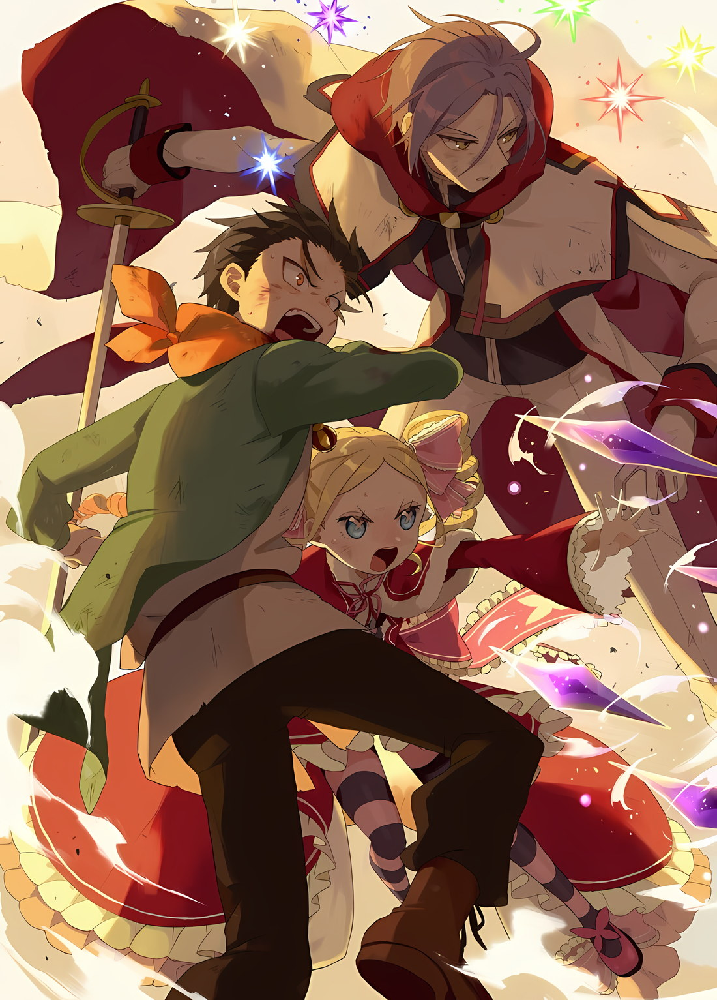
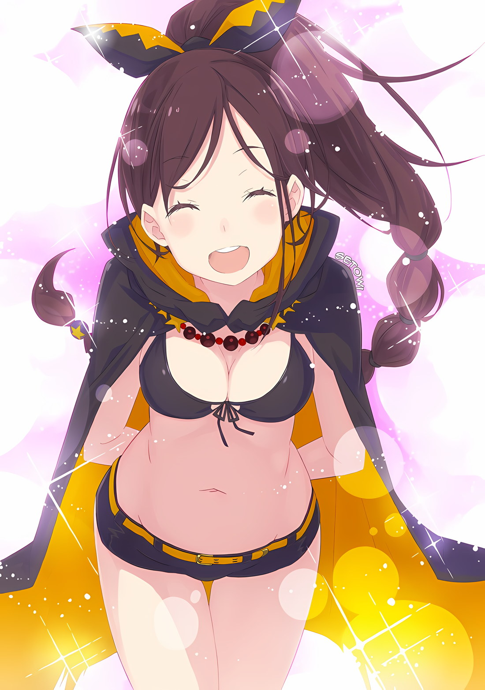

Рвется, разрывается, разлетается.

Крошится, рассыпается, отслаивается.

Усталость, изнеможение, угасание.

Обрывается, крошится и устает, все на расстоянии мерцало.

……За пределами башни панический набег Зверодемонов остановился благодаря усилиям Мейли. ……На втором этаже произошло поражение Роя Альфарда, захватившего тело Рейда Астреи. ……На четвертом этаже был побежден Архиепископ Греха Чревоугодия Лей Батенкайтос. ……На нулевом этаже еще неизвестное «Испытание» было прорвано волей Эмилии.

Чтобы вернуть себе Сторожевую башню Плеяд, команде нужно было пройти все испытания, которые были подготовлены для них.

Эти результаты выросли из тесных связей, которые все они разделяли, благодаря вере друг в друга и развитию их отношений.

Или, как сказала бы Эмилия, это было результатом «пребывания в ладах друг с другом».

Только благодаря этому они смогли добраться до этой точки.

И если это было правдой, единственное, что оставалось сделать……

Эмилия: Мы вернем то, что потеряли!

Так сказала Эмилия, когда они только прибыли в башню.

Она поклялась, что потерь больше не будет; скорее, они вернут то, что было забыто.

Поскольку все они согласились с ее клятвой при входе, все они должны благополучно вернуться из Песчаных Дюн Аугрии. Даже если количество вернувшихся будет больше, чем когда они прибыли.

Субару, Эмилия, Беатрис, Рам, Рем, Мейли, Анастасия, Ехидна, Юлиус, Патраш, и они, возможно, даже смогли бы добавить Шаулу в свою группу.

Неважно насколько она была шумна или раздражающей.

Субару: ……Поехали!

Когда оба Духовных Рыцаря собрались, естественно именно Юлиус, вышел вперед.

Юлиус, который временно отступил, чтобы помочь в исцелении Мейли, используя одного из своих духов, Куа, вернул синего духа назад и, таким образом, снова вышел на сцену битвы, облаченный в яркий свет, созданный его шестью духами.

Используя эффекты «Кор Леонис», Субару смог увидеть, что в обмен на использование огромного количества света, Юлиус и его дух подвергались значительному напряжению.

Более того, радужный свет по всему телу — это больше, чем просто яркий образ.

Юлиус рванулся вперед, оставив после себя облако пыли, одновременно создавая радужный световой след.

Мгновенно сократив дистанцию, Юлиус полоснул перед ним чудовищного скорпиона.

В тот момент, когда лезвие коснулось хвоста, началась интенсивная реакция, от удара поднялся белый дым и……

Ее оболочка растаяла.

Удар мечом, покрытый оригинальным заклинанием Юлиуса «Ал Клариста», ярко сиял сквозь панцирь Скорпиона, который был неспособен защитить себя от атаки.

Следует помнить, что световое шоу, окутывающее Юлиуса, не просто для взглядов, но……

Багровый Скорпион: ……

Хвост Скорпиона выстрелил в упор, луч света, который стал причиной «Смерти» Субару более десяти раз, а также становился причиной смерти Эмилии и Юлиуса — Дьявольский Снайперский Выстрел Вместо того, чтобы отклонить его своим мечом, Юлиус игнорирует луч и пытается продолжить атаку.

Ослепительный свет, тонко обволакивающий тело Юлиуса, — это другое применение «Аль Клаузерии», которое создает вокруг него силовое поле.

Грубо говоря, Юлиус, отточив свои наступательные и оборонительные способности, породил самого совершенного рыцаря

— «Радужный Духовный Рыцарь».

Багровый скорпион: ~~▓▓!

Багровый Скорпион, чьи атаки были отвергнуты, а защита нарушена, в настоящее время находился в весьма затруднительном положении.

Однако зверь не провел четыреста лет в качестве стража башни, просто бездельничая. Панцирь Багрового Скорпиона начал нагреваться, отчего он стал более ярким оттенком красного. Когда Юлиус опустил свой меч, скорпион собрал всю накопившуюся силу в клешни и ударил ими Юлиуса.

Клешни сильно раскалились, искажая атмосферу от чудовищного жара.

Если бы Субару дал имя смертоносным клешням, оно бы называлось:

«Ножницы Иисуса в Адском Пламени».

Ошеломленный способностью своего противника приспосабливаться, Субару только что осознал истинную опасность боя, в котором он участвовал. Способность скорпиона читать противника в середине боя и соответствующим образом приспосабливаться могла бы стать отличным для союзников, но для противника? Он предпочел бы, чтобы у его оппонентов не было такого большого потенциала роста.

Вражеские персонажи, которые продолжают расти, в настоящее время нежелательны.

Беатрис: Минья!!

Фиолетовый кристалл блокировал атаку Скорпиона, спасая Юлиуса от повторного полета по песку.

Поскольку Субару знал, что он недостаточно силен, чтобы вмешаться в битву между Юлиусом и Багровым Скорпионом, Беатрис будет отвечать за прикрытие Юлиуса, пока Субару будет анализировать его варианты.

Субару: …………

Пытаясь расположиться так, чтобы не умереть в результате, он оглядел песок, который был унесен вихрем, и рой Зверодемонов, которые избегали боя.

Оглядываясь на Песчаные Дюны Аугрии, Субару мог видеть степень ущерба, нанесенного их путешествием.

Возможность смотреть на вершину башни все еще не считалась нормой в мозгу Субару.

Поскольку облака, окружавшие сторожевую башню, рассеялись, теперь они могли видеть Нулевой Этаж — «Меропа», где Субару надеялся, что Эмилия переписала правила башни.

Продолжая этот ход мыслей, Субару должен был задуматься, был ли у сторожевой башни какой-то механизм, который отгонял Зверодемонов. Первоначально казалось, что строитель сторожевой башни проектировал с учетом этой проблемы, что делало нынешнее затруднительное положение Зверодемонов еще более странным для Субару.

Несмотря на это, Субару подумал, как было бы полезно, если бы Зверодемоны перестали беспокоить их, так как в настоящее время они были заняты попытками привести Шаулу в чувства.

Беатрис: ……Субару!

Субару: Ах…

Голос пронзил внутренний диалог Субару, предупредив его о внезапном объекте, который только что отправил его в полет через песчаные дюны.

Когда он поднял глаза, чтобы посмотреть, что его ударило, Багровый Скорпион, промелькнувший мимо удара Юлиуса, собирался приземлиться прямо рядом с Субару.

Беатрис протянула руку с серьезной мольбой, и Субару быстро согласился. Субару поднял глаза после того, как схватил своего сжатого духа за очаровательную руку, только чтобы увидеть, как хвост Багрового Скорпиона виляет, подозрительно похожий на мухобойку, которую он имел раньше в своей комнате. Хвост внезапно прыгнул, приземлив Субару и напомнив ему о последствиях

«Смерти».

Субару: Хлыст Гилтилоу……~кх!

Беатрис: Мурак!

Их мыслительные процессы синхронизировались, Субару и Беатрис одновременно приняли решения.

Уменьшая действие силы тяжести на свои тела, Субару и Беатрис вошли в состояние невесомости. В то же время Субару ударил хлыстом, запутав его у основания хвоста Скорпиона.

Как только хлыст вошел в плотный контакт, Скорпион взмахнул хвостом, отправив Субару и Беатрис в воздух со смертельной скоростью.

Субару: Ва……

Беатрис: Буаа!?

Вместо того, чтобы развернуть, они были мгновенно сброшены.

Субару и Беатрис врезались прямо в песок от инерции.

Даже если бы они были легкими, как воздух, сила удара разрушила бы все их тела, если бы они приземлились на что-нибудь, кроме песка. ???: Давай заставим тебя отказаться от погони…!

Багровый Скорпион: ……….

Багровый Скорпион целится в Субару и Беатрис, которые зарыты в песок. Однако прежде чем Скорпион сможет выстрелить, на его пути появляется яркий свет, и разворачивается битва обжигающего жара и экстремальной яркости.

Искры летят с каждым ударом, и последовательные удары посылают ударные волны через песчаные дюны, из-за чего песчинки взлетают вверх в ясное небо.

Разрушительная сила олицетворяет их обоих. Юлиус олицетворяет скорость, в то время как Багровый Скорпион олицетворяет выносливость, без решающего удара эта битва, скорее всего, подтолкнет Юлиуса и остальных к поражению.

Субару: ……Пфу, пфу! Черт, мы должны что-то делать!

Беатрис: ……Пфу, пфу! Нам нужно найти способ победить, я полагаю!

Субару и Беатрис вместе поднялись из песка, выплевывая песок во рту одним и тем же жестом.

Со слезами на глазах они ищут способ дотянуться до радуги Юлиуса и найти способ достучаться голосами Субару и других до Шаулы.

Три возможности, на которые хотелось бы надеяться…… · Юлиус пробуждает новую силу и надирает Скорпиону задницу для конечной победы. · Субару и Беатрис завершают новое заклинание, которое выводит Скорпиона из строя, позволяя их команде победить. · Или внезапно Эмилия падает с неба, даря миру мир, используя свою привлекательность.

Субару: Лично я надеюсь на третий вариант, но……

Субару не думает, что он сможет пробудиться к новой силе, и, к сожалению, Субару не ожидает, что Эмилия будет достаточно прагматичной, чтобы появиться здесь в идеальный момент.

Если это так, то последним вариантом для Юлиуса было бы повысить уровень и разблокировать совершенно новую силу, но……

Субару: Юлиус уже сделал это однажды, поэтому было бы несправедливо ожидать, что он сделает это снова.

Битва между Юлиусом и Скорпионом продолжается со скоростью, за которой глаза Субару не могут проследить.

Глядя на разрушения, происходящие перед ним, Субару думает о своем следующем шаге.

В конце концов, у него не было выбора, кроме как сражаться со всеми имеющимися у него картами.

Тогда, по крайней мере, не упускай из виду карты, которые у тебя есть, Нацуки Субару.

Субару: Думайдумайдумай…

С головой на полном газу он искал ответ, больше не полагаясь на надежды или мечты.

И вот, пока он искал решение, Субару понял, что ему еще предстоит использовать свою самую надежную карту.

Субару: Беако!

Беатрис: Честно говоря, ты должен был спросить меня с самого начала, я полагаю!

Беатрис откликается на призыв Субару, как будто она ожидала просьбы Субару.

Довольный тем, что его партнерша была готова помочь, он протянул руку, чтобы взять ее маленькую ручку в свою.

Он собирается потратить на это все, что у него осталось.

Рвется, разрывается, разлетается.

Крошится, рассыпается, отслаивается.

Усталость, изнеможение, угасание.

Обрывается, крошится и устает, все на расстоянии мерцало.

Перед глазами Шаулы проходит радуга, и она инстинктивно отталкивает ее клешнями.

Ее раскаленные клешни обладают достаточной силой, чтобы прожечь все и вся. Будь то камень или сталь, его гарантированно прорежет насквозь, как масло.

Шаула: Ноооо если я не знаю, что такое масло.

Говоря о неизвестных вещах, которые ей рассказали давным-давно, она выслеживает свою мерцающую цель.

Однако это место представляет собой широкое песчаное море, поэтому здесь нет никаких препятствий, из-за которых ее цель не может сбежать. Будь то рукопашный бой без надежды на побег или дуэль на расстоянии, она всегда одна……

Шаула: В конце концов, снайперы всегда одни, верно?

Шауле сказали, что снайперы — это люди, которые ждут и ждут, чтобы убить свою жертву.

Так она ждала. Она гордилась тем, что была снайпером, поэтому продолжала ждать.

День за днем она смотрела на горизонт, на своих противников, которые подходили к башне, и продолжала ждать. Существовали правила, которые связывали Шаулу с башней.

Были времена, когда Шаула находила их раздражающими, но она также знала, что без них она бы многое забыла, поскольку Шаула всегда такая забывчивая.

Время, когда они гуляли вместе, о чем они говорили, о днях, которые они проводили, о мыслях, которыми они обменивались, обо всем.

Шаула: Ааах… как я это ненавииижу.

Все бросали ее.

Если попросить Шаулу подождать, она будет ждать вечно, но если заставить Шаулу ждать, она захочет возвращения. Пока к Шауле не вернутся, она может ждать вечно.

Поэтому….

Шаула: Я была счаааааастлива, что мой мастер вернулся.

Потому что все остальные ушли.

Когда Мастер вернулся, она не знала, сможет ли поверить своим словам.

Шаула не знала, ждала ли она, потому что верила в это, или она ждала, потому что просто двигалась по инерции, и она даже не знала ответа на этот вопрос. Шаула даже не подумала об этом. Шауле даже не пришлось об этом думать. Потому что прежде, чем она обратилась в пыль, обещание было выполнено.

Шаула: Это делает меня такооой счастливой, Мастер.

Итак, Шаула больше не хочет, чтобы Мастер уходил. Мастер может остаться здесь навсегда.

Шаула больше не хочет быть одна, она перестала быть снайпером.

Шаула считает, что заслуживает награды за то, что так долго была одним из них.

Шаула: Я не хочу чтобы меня бросили опяяять, Мастер. …Ааах, я хочу, чтобы меня любииили.

Потому что все оставили меня позади.

На этот раз я хочу быть с тобой навсегда-навсегда.

Вот почему……

Шаула: Я хочу, чтобы ты любил меня, Мастер.

Багровый Скорпион задергался, сияние его багровой оболочки становилось все ярче.

Возможно, это была повышенная реакция его «Предупреждающего Цвета», но в глазах Субару это не так.

Как будто этот багровый оттенок появился из-за плача Шаулы.

Это было выражение истинных мыслей существа по имени Шаула, которое запирало свои чувства на протяжении последних 400 лет и сдержало свое обещание остаться в башне.

Красный был цветом страсти, страсти, безудержной Любви. Багровый оттенок Багрового Скорпиона, должно быть, был вызван его сильным желанием любить и быть любимым человеком, которого он любил. «……А ВЕДЬ, ВСЕ ГОВОРЯТ, ЧТО ЖЕНЩИНЫ-СКОРПИОНЫ ЧРЕЗВЫЧАЙНО ЛЮБВЕОБИЛЬНЫ!!» Поднимая много песка своими ногами, Субару выкрикнул это с взрывом энтузиазма и поднял руку, чтобы взмахнуть хлыстом своими широкими плечами.

Багровый Скорпион: …………

Он нацелился на того, кто повернулся к нему спиной и дрался и дурачился с Юлиусом, Багровым Скорпионом. Он использовал свой хлыст, чтобы объявить о своем присутствии, видя, что она так занята, но Мастер, которого она так долго ждала, стоял прямо там. Поскольку она заигрывала с другим мужчиной, у него не было выбора, кроме как сказать ей несколько гадостей……

Субару: ВИДЕТЬ, КАК ТЫ ВОТ ТАК ОХОТИШЬСЯ ЗА ДРУГИМ МУЖЧИНОЙ, ДЕЙСТВИТЕЛЬНО ПЕЧАЛИТ МЕНЯ И РАНИТ МОЕ МУЖЕСТВЕННОЕ СЕРДЦЕ, ТЫ ЗНАЕШЬ…!!

Беатрис: Субару, это худшее, что можно было сказать!

Субару спустил кнут и нанес идеальный удар, будучи подтолкнутым резкими словами Беатрис из-за его головы ……он был красиво обернут вокруг основания хвоста Багрового Скорпиона.

Однако уже одно это все равно привело бы к тому, что произошло не так давно, когда они были зарыты в песок взмахом хвоста скорпиона.

Багровый Скорпион, возможно, потому, что он не придавал большого значения их игре в перетягивание каната, вместо этого сосредоточился на борьбе с Юлиусом, полностью игнорируя Субару и компанию в целом.

Субару и все остальные были слабыми. …Он бы воспользовался этой идеей.

Беатрис: Эль Вита…!!

Субару: Гуооо!!

Беатрис произнесла магическое заклинание, отчего его действие разлилось по всему телу Субару, его ноги погрузились в песок из-за огромного веса.

В отличие от Мурака, который смягчал эффекты гравитации, Вита усиливал эффекты гравитации ……весовая категория Субару была поднята до уровня Ёкодзуна из подразделения борьбы сумо Макуучи, что позволило ему соревноваться с хвостом Багрового Скорпиона.

Естественно, одного этого было бы недостаточно. Он мог усилить действие гравитации, но только до ста килограммов. Этого было далеко не достаточно, чтобы конкурировать с чудовищной силой Шаулы, которая могла легко поднять и нести повозку дракона.

Следовательно……

Субару: ……Время кульминации! СДЕЛАЙ ЭТО!!

С силой дернув обеими руками за хлыст и твердо упираясь ногами в песок, Субару громко вскрикнул. В следующее мгновение тело Субару, которое подняла грубая сила хвоста Багрового Скорпиона, вернулось на землю.

Очевидная причина заключалась в том, что сила Багрового Скорпиона и Субару ……нет, Субару и других ……была одинакова.

Багровый Скорпион: ……▓▓.

Теперь перед Субару, все еще твердо стоящим на месте, стоял Голодный Король, который вторгся в их игру в перетягивание каната своим огромным, странно выглядящим телом. Более того, не только Голодный Король присоединился к этой беспрецедентной игре в перетягивание каната.

Медведь с цветами по всему телу, крот с крыльями и подозрительная змея…… все вступили в битву.

Все Зверодемоны, которые должны были быть врагами Субару, протягивали ему руку помощи в этой битве.

Причиной этой сцены была не кто иная, как…… ???: ……В самом деле, ты такой рабовладельческий!

Это был голос девушки, окутанной усталой и несчастной атмосферой.

Обладательницей этого голоса была молодая девушка, на щеках которой не было крови, и ей было трудно дышать…… Мейли.

Сжав красивое лицо, она тяжело вздохнула. Затем крикнула: «Хоора!» и громко похлопала……

Мейли: Хорошо! Идите сюда, все. Наблюдать со стороны ведь будет бесполезно.

С одним хлопком, и после одного удара море песка начало грохотать.

В эту область непрерывно вливались Зверодемоны, чьи шаги и рев были слышны. Эта среда хорошо подходила для Зверодемонов, и та, кто взяла ее под контроль, была «Мастером Зверодемонов»…… нет, ее больше нельзя было так называть.

Произошедшее массовое явление не было вызвано простым

«Мастерством Зверодемонов». Используя «Божественную Защиту Магического Манипулирования», она руководила и взяла под контроль Зверодемонов Песчаных дюн Аугрии, поэтому титул

«Мастера Зверодемонов» больше не подходил ей.

Как будто вернулась «Мать Зверодемонов», оставившая след разрушения в южной империи. Она снова использовала свои навыки, чтобы вызвать панику в этой битве, превратив ее в тотальную войну.

Мейли: …………

Хотя лицо Мейли было болезненным, ей все же удалось остаться в сознании и достаточно поправиться, чтобы участвовать в финальной битве. Естественно, за этим стояла небольшая хитрость.

Субару, естественно, использовал «Кор Леонис», чтобы передать ущерб, нанесенный Мейли, себе и другим. ……Это была последняя карта в его руке.

Ни с Эмилией, ни с Беатрис, ни с Рам тоже. И не делился им ни с Юлиусом, ни с Ехидой, ни с Патраш, ни с Мейли, ни со спящей Рем.

Это был тот, кто пришел с ними покорять Песчаные дюны Аугрии, их последний союзник……

Субару: ……Извини, что втянул тебя в это, Гиан! Пожалуйста, помоги мне!!

Наземной Дракон Гиан, которого оставили на шестом этаже далекой сторожевой башни, также находился в пределах досягаемости «Кор Леониса», поэтому в результате Субару принял решение разделить это бремя с Наземным Драконом.

Решение сделать это было душераздирающим для Субару, но еще более душераздирающим для него было то, что Гиан выполнил условия «Кор Леониса» для тех, кто хотел разделить его бремя.

Это означало, что, как и Беатрис и другие его друзья, Гиан хотел поддержать действия Субару.

Он был благодарен духу театральной версии Гина, переложившего через себя большую часть бремени Мейли на Наземного Дракона. Это был трюк, который позволил Мейли вернуться в игру.

Это также была основная причина, по которой Багровый Скорпион проиграл в соревновании сил.

И это……

Субару: ……Это будет причиной твоего поражения, Шаула.

Субару принял командование битвой и даже использовал силу Зверодемонов и Наземного Дракона, и, пока он говорил, Багровый Скорпион поднял ноги вверх.

«Величайший Рыцарь» не упустил эту возможность.

Обрушив радужный удар, Юлиус начисто срезал хвост Багрового Скорпиона, который сражался с ними в битве за силу.

Багровый Скорпион: …………

Отрезанный хвост, как и раньше, произвел взрыв, распространив массу разрушений по всей области, но он не смог пройти сквозь радужный свет. Когда его козырная карта была заблокирована, он яростно ударил своими большими клешнями в спину Юлиуса.

Однако его атака, похоже, была вызвана чувством волнения и нетерпения из-за проигрыша в битве за силу и отрезанного хвоста. В результате он не смог одолеть рыцаря, который победил первого

«Святого Меча» и преодолел его пределы.

Багровый Скорпион: Шии……!

Удар прочертил дугу в воздухе, красиво рассекая уязвимое место на левой клешне. Все еще пытаясь восстановить равновесие после того, как его левая клешня была отрезана, он попытался разрубить Юлиуса пополам оставшейся правой клешней.

Как раз в тот момент, когда клешни сомкнулись, угрожая рассечь его стройное тело пополам от талии……

Юлиус: ……Ал Кранвел.

За мгновение до того, как клешни щелкнули, сияние света окутало все тело Юлиуса в одно дыхание. Как только он деактивировал свою радужную броню, это сияние света вызвало взрыв внутри клешни, которая вот-вот должна была сомкнуться, разорвав его в клочья.

Багровый Скорпион: ……▓▓.

Подвергнутое ударной волной взрыва, массивное тело Багрового Скорпиона взлетело в воздух. Зверодемон летал по воздуху, вращаясь, прежде чем, наконец, упасть в песок, его хвост и руки были потеряны и покрыты травмами.

Остальные Зверодемоны быстро окружили его и прижали восьминогого Багрового Скорпиона.

Все еще сопротивляясь своей судьбе, он повернул большую голову, скрыв свои острые зубы.

Принимая во внимание стойкость Багрового Скорпиона, было бы неудивительно, если бы он внезапно сделал новый шаг в этот самый момент, побуждаемый к достижению нового роста из-за своего нынешнего затруднительного положения, однако……

Субару: Это конец, Шаула.

Субару стоял прямо перед извивающимся, борющимся, Багровым Скорпионом, так что его сетчатые глаза могли видеть его полностью.

Без оружия и придавленных ног он находился в довольно печальном состоянии. Теперь было бы легко нанести последний удар, но он не этого хотел.

Субару не был уверен, какой ответ был правильным, несмотря на то, что его довели до этого момента……

Субару: Мейли.

Мейли: ……Братик, если бы меня здесь не было, интересно, что бы сделали ты и все осталь~ные?

Когда ее окликнули по имени, Мейли вздохнула и подошла к Багровому Скорпиону. Она встала рядом с Субару и со вздохом щелкнула пальцами. Затем она заставила его сетчатые глаза сфокусироваться на себе.

Мейли: Кто ты? Багровый, страшный Скорпион-сан? Или ты……

Багровый Скорпион: …………

Мейли: Или ты кто-то другой, интересно?

Когда ему задали такой вопрос, сетчатые глаза Багрового Скорпиона постепенно замедлились. Пристально глядя на Мейли, его сетчатые глаза показали признаки колебания, прежде чем он перевел взгляд на Субару. Эти агрессивные, сетчатые красные глаза медленно меняли цвет.

Субару: Шаула.

Багровый оттенок его панциря начал медленно исчезать. Его глаза снова стали зелеными, его панцирь снова стал черным, и он начал медленно успокаиваться, и, наконец……

Субару: ……Шаула!

Наконец……

Рвется, разрывается, разлетается.

Крошится, рассыпается, отслаивается.

Усталость, изнеможение, угасание.

Обрывается, крошится и устает, все на расстоянии мерцало.

Обрывается, рушится и устает, все мерцало вдали.

Даже несмотря на то, что она осталась позади, даже несмотря на то, что ее воспоминания несколько померкли, они все еще сияли так ярко.

Поскольку они были так дороги ей, она отчаянно пыталась их сохранить.

Субару: …………

Шаула: Мастер, ты еще помнишь? Ты сказал мне: «Я обязательно вернусь, так что жди меня здесь», а затем исчеззз.

В сидячем положении Шаула обхватила колени, наклонила голову и спросила вот так.

Субару покачал головой, глядя на нее, которая, казалось, думала о ностальгических воспоминаниях о ее прошлом.

Субару: Я не помню. И я уже сказал тебе, что не знаю, верно? Не заставляй меня повторяться!

Шаула: Чтоооож, тут ничего не поделаешь. В конце концов, Мастер намноооого лучше умеет забывать вещи, чем я. Мы с Мастером действииительно похожи.

Субару: Это меня пугает! Хотя нет, я признаю, что у нас похожая манера разговора.

Тем не менее, это был только факт, что она использовала слова из мира Субару, что он подсознательно чувствовал чувство близости с ней. Он не был таким очаровательным, милым или энергичным, как она. Он не хотел ждать 400 лет того, кто его бросил.

Субару: В конце концов, я нетерпеливый парень, который хочет немедленных результатов. Что ж, если бы я мог, по крайней мере, быть с другим человеком, я, возможно, смог бы это вынести……

Шаула: Аааах, Мастер, ты такой нехороший! Ты ведь знаешь? Об этом говорится в поговорке: «Ключ к любви — терпение!» Субару: Не путаешь ли ты это с «Ключ к моде — терпение»!? Разве это не похоже на лозунг женщины-дани, а не преданной женщины!?

Шаула: Все дело в осознании любви, кружащейся в глубине моего сердца. Ты даже можешь посмеяться над этой грустной, жалкой женщиной. Такое улыбающееся лицо тоже ооочень привлекательно… ммм.

Субару: Нет, я совсем не смеюсь. Слушай, я начинаю плакать.

Шаула: Дай мне посмотреть, дай мне посмотрееееть.

Когда Субару указал на его лицо и сказал это, Шаула встала и подошла к нему. Шаула, которая с энтузиазмом вскочила, подошла достаточно близко, чтобы он мог чувствовать ее дыхание, поэтому он еще раз внимательно осмотрел ее лицо с тонкими чертами.

Ее блестящие глаза были большими и длинными, а между ними был изящной формы нос. У нее были длинные тонкие ресницы, а кожа была такой мягкой и упругой, что трудно было представить, что она так долго жила в море песка. Несмотря на то, что ее энергичное и разнообразное выражение лица было скрыто, ее тело в целом было скорее красивым, чем милым.

Учитывая имя звезды, ей суждено было ждать в этом месте возвращения того, кого она любила.

Шаула: Хм? Мастер, у тебя глаза блестят или ты немного плачешь?

Субару: Твой Мастер…… кусок дерьма. Я дам ему по лицу, если когданибудь представится возможность.

Шаула: Тогда мне придется стать свидетелем этого с суперрр-суперрр смешанными чувствами! Какая была бы ужасная ситуация, если бы Мастер нокнул¹ Мастера! ……Боооже.

Подрагивая губами, Субару зажмурился. Его горячие эмоции поднялись, оттолкнулись от век и спустились по щекам. Увидев эти слезы, Шаула нежно прошептала: «Боооже»……

Субару: …………

В то время как глаза Субару были закрыты, его щеку внезапно охватило ощущение влажности. Когда он открыл глаза, он увидел, как лицо Шаулы отделяется от его. Прижав кончики пальцев к губам, она озорно улыбнулась, слегка высунув красный язык.

Шаула: ……Телесные жидкости Мастера… соленые и сладкие.

Субару: Сказать это вот так……

Шаула: То, как я это говорю…… ничего не меняет. Знаешь, я всегда выражаю свои чувства всем телом и душой. ……Мастер, я люблююю тебя.

Я люблю тебя. Она часто ему это говорила. Как только он понял контекст, Субару уже не мог сказать, что это бессмысленное заявление.

Шаула говорила «Я люблю тебя» так часто, как только могла, потому что ее сердце было переполнено любовью.

Всегда, всегда слова, которые она хотела передать, переполняли ее изнутри. В течение 400 лет она ждала, желая любить его, желая быть любимой им.

Шаула: Я люблююю тебя, Мастер.

Субару: …Я …не скажу, что люблю тебя Шаула: Я знаю, я знаююю. Потому что Мастер — плохой парень, тонкокожий и застенчивый, но это то, что мне в тебе нравится. Я без ума от тебя. Только от тебя.

Субару: …………

Время покинуло ее, и роль, которую ей поручили, сковала ее, как цепи. Когда она почти причинила боль тому, кого любила, она плакала и молила о «Смерти». Вместо того чтобы причинять ему боль собственными руками, она предпочла бы потерять все это.

Что он сказал ей, которая была в слезах?

Он сказал, что никогда не позволит ей так плакать.

Субару: Я… не скажу тебе этого… Я люблю тебя… такие слова.

Шаула: ……Все нормально. Я буду повторять слова, которые Мастер не скажет. Мастер определенно захочет сказать их мне когда-нибудь в будущем.

Субару: Когда-нибудь в будущем, говоришь…Это очень доооолгое время. 400 лет ожидания… ты действительно можешь это сделать?

Шаула: Это? 400 лет пролетели оооочень быстроо.

Ожидая так долго, однажды она вскрикнула от боли.

Оставшись позади с течением времени, ее любовь держала ее в заложниках, она кричала, что ей одиноко.

Теперь она понятия не имела, что когда-то существовал мир, в котором она излила свое сердце. Следовательно, сколько эмоций закружилось в ее собственном сердце, скрытое за ее энергичным поведением?

Субару поклялся никогда не заставлять ее плакать. И даже сейчас он не собирался нарушать эту клятву.

Вот почему…. он надеялся, что она сможет кричать. Он хотел, чтобы она плакала. Но теперь этого было недостаточно.

Пока она плакала, выплакивала все глаза, кричала и выла, Нацуки Субару, который не был ее Мастером или кем-то в этом роде, бежал всем сердцем и душой к ней, чтобы остановить ее слезы.

И все еще……

Шаула: Всего 400 лет…… это почти как послезааавтра.

Багрового Скорпиона нигде не было видно, а на его месте стояла красивая девушка, улыбающаяся.

Она была так красива, что он не мог не потерять дар речи. Настолько эфемерно, что казалось, будто она упадет от прикосновения его руки.

Мягкие щеки Шаулы покраснели, когда она сказала «потому что» с видом влюбленной девушки.

Продолжая, влюбленная девушка сказала «потому что»……

Шаула: ……Мне также нравилось ждать тебя.

Субару: …………

Шаула: Хей, Мастер. Вот почему… однажды.. снова……

Рвется, разрывается, разлетается.

Крошится, рассыпается, отслаивается.

Усталость, изнеможение, угасание.

Обрывается, крошится и устает, все на расстоянии мерцало.

Обрывается, рушится и устает, все мерцало вдали.

Субару: ……Шаула.

Часть ее панциря отвалилась, рассыпалась и отслаивалась, и превратилась в пыль. На этом он не остановился, а распространился повсюду, все ее тело отслоилось и превратилось в пыль.

Отрезанные хвост и клешни, восемь ног, удерживаемых Зверодемонами, и голова, которую Нацуки Субару держал в руках, все……

Беатрис: ……Выполнила ли она свое предназначение, я полагаю?

Пока Субару пытался собрать все части ее существования, которые уменьшались вместе в его руках, Беатрис произнесла это ему приглушенным голосом.

Восхитительный дух вяло смотрел на бессильно рушащегося Зверодемона…. нет, это был кто-то точно такой же, как она, кто отдал свою жизнь той роли, которую предоставила им судьба.

Его мозг отказывался понять то, что только что сказала Беатрис. Но он инстинктивно понял. ……Это была не «Смерть».

Это был неизбежный конец, с которым она встретилась сегодня после того, как ей доверили роль Хранителя Звезд Сторожевой Башни Плеяд.

Субару: Если бы… мы…

Если бы они не пришли сюда, она могла бы существовать здесь вечно.

Вечно, в этой песчаной башне, ожидая человека, который никогда не вернется……

Юлиус: ……Субару, ты должен понимать, что это предположение… оскорбительно для нее.

Субару: …………

Юлиус: Итак, то, что ты должен делать…… жить не в сожалении.

Убрав свой рыцарский меч обратно в ножны, рыцарь привел в порядок свой облик, испачканный кровью и песком, и произнес такие слова.

Сказать это было безжалостно, но, тем не менее, он был прав. При этом Субару стиснул зубы и глубоко вздохнул, чтобы скрыть свою ненависть к этой правоте.

Затем он крепче обнял того, кто так долго был один. Она осталась позади и так долго провела в этом месте. Медленно, не будучи одинокой, она уходила от своего единственного и неповторимого.

Субару, Беатрис, Джулиус и Мейли были все там.

Вдалеке можно было видеть людей, бегущих сюда с башни. Должно быть, это были их другие товарищи. Все собрались вместе ради нее, которая так долго была одна.

«Но, даже если бы Мастер был здесь один, этого было бы достаточно.»

Образ того, как она произносит такие слова, совсем не будучи требовательной, возник перед его глазами, которые медленно начали наполняться слезами. Клыки Зверодемона нежно коснулись слез, которые текли по щекам Субару.

Острые клыки, которые, казалось, могли уничтожить что угодно, тесно, нежно и спокойно ласкали Субару, который был самым хрупким из всех.

И затем……

Субару: ……Ах.

Руки, которые обнимали ее, внезапно перестали ее ощущать.

Рассыпавшаяся оболочка потерявшего свой вес Багрового Скорпиона рассыпалась в пыль. Наблюдая, как черные частицы разлетаются по морю песка, Субару широко открыл рот. «Шаула.»

«Да, Мастер.» «Шаула… Шаула… Шаула.»

«Ты звал меня? Мастер.» «Шаула… Шаула…»

«Боооже, аааах, быть так сильно любимой Мастером, заставляет меня чувствовать себя так постыыыдно!»

Закрыв глаза, он услышал, как ее голос, откликнувшийся на его зов, зазвенел у него в ушах. И все же теперь ее нигде больше не существовало. «……Ах.» Субару присел на корточки, царапая море песка перед собой. Звук чьего-то голоса достиг его ушей. Он не знал, чей это был голос. У него не было времени, чтобы подтвердить, кто это был, он просто посмотрел вверх, откуда он пришел, и широко раскрыл глаза.

Все еще покрытый черными частицами, холмик песка слегка вздрогнул, и из него что-то выползло. Он был довольно маленьким, размером с ладонь. Маленькое существо с багровым панцирем взмахнуло двумя клешнями, чтобы пробиться сквозь песок, а затем умело вытащило свое тело из песка хвостом…… «…………» Он поднесся к Субару, который стоял на коленях, и задел его песчаную руку. Простое прикосновение к нему, казалось, оставило после нее след ее очарования.

Рвется, разрывается, разлетается.

Крошится, рассыпается, отслаивается.

Усталость, изнеможение, угасание.

Обрывается, крошится и устает, все на расстоянии мерцало.

Обрывается, рушится и устает, все мерцало вдали. ……Все мерцало, потому что ты был там.

«Всего 400 лет…… это почти как послезааавтра.»

«Потому что мне также нравилось ждать тебя.»

«Хей, Мастер. Вот почему… однажды… снова……»

«Я надеюсь, что ты когда-нибудь снова встретишься со мной.»

«На этот раз… моя очередь ждать тебя? Вместо женщины, преследующей погоню, преследуется женщина.»

«……Мастер, это обещание… очень, очень важно.»

«На этот раз… пожалуйста, не забывай о нём.»

«……Я люблююю тебя, Мастер»

Иллюстрация к Том 25 | Разукрасил Ранобэ Setowi

«Ты — идиот.» Дрожащим голосом Субару пробормотал это, словно говоря, что никогда не сможет этого забыть.

Затем он взял существо, щекочущее тыльную сторону ладони, и обхватил его обеими руками.

Словно немного смутившись, крошечный скорпион задрожал, принимая его действие.

Его панцирь был ярко-красного цвета, настолько ярким, что казалось, что он может обжечь глаза…… ох, такой красный. ……Это было то, что не могло исчезнуть даже за 400 лет, цвет «Любви».

¹ — в оригинале было написано KO'd —«нокаутировать», но «нокнуть» звучит более современно, учитывая что Шаула знает некий сленг настоящего мира🤔.

