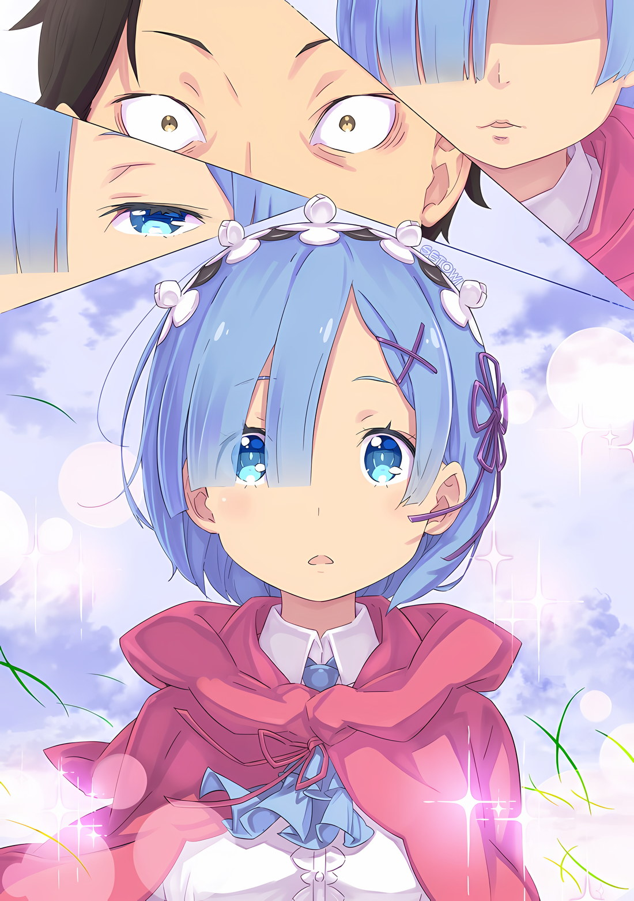

……В полной тишине плечи Субару задрожали, крошечный скорпион, появился из-под пыли в его руках.

Он хотел спасти ее.

Он хотел забрать ее из этой одинокой песчаной башни.

Он обещал помочь ей.

Но даже в этом случае он не смог сдержать своего обещания.

Нацуки Субару всегда давал обещания, которые не мог сдержать.

Субару: ………

Ни одна душа не могла сказать ни слова Субару, сидящему на песке в тишине.

Беатрис, стоявшая рядом с ним, а также Юлиус и Мейли, стоявшие за ним, не могли найти нужных слов, чтобы что-либо сказать.

Скорпион, который был в его сложенных ладонях, взобрался по руке Субару и уселся ему на плечо, задевая его шею, как будто пытаясь утешить его, который даже забыл пролить слезы и заплакать.

Субару понятия не имел, что такое крошечный скорпион. Какое отношение имеет этот скорпион, появившийся из останков

«Багрового Скорпиона», к Шауле? Или она была этим скорпионом?

Субару: ……Это невозможно.

Субару обменялся словами с Шаулой в ее последние минуты.

Однако было неясно, произошел ли разговор на самом деле, или он просто воображал все это, когда она пропадала.

Однако Субару питал печальное убеждение, что это действительно так.

Шаула исчезла.

Ее существование было связано с самими правилами Сторожевой башни Плеяд и, в конечном счете, так же, как Рейд или Монолит третьего этажа, они были созданы лишь для декорации……

«Испытаний».

В результате, как только сторожевая башня выполнила свою роль, ей также пришлось бы исчезнуть.

До самой последней минуты она была мученицей роли «Декорации».

Её пребывание «Декорацией» открыло дыру в сердце Субару.

Субару: …………

Эта искренняя улыбка, раздражение, которое он испытывал из-за ее желания общаться с ним, и ее незнакомый голос, называющий его «Мастер, Мастер» с глубокой любовью, — все это исчезло.

Если бы Шаула кричала, что она не хочет исчезать, тогда Субару делал бы все, что в его силах, чтобы этого не произошло, и снова и снова жертвовал бы собой, чтобы спасти ее.

Однако она хотела не этого.

Улыбаясь, она сказала ему, что хочет когда-нибудь снова встретиться с ним, но вскоре исчезла. Он не был уверен, но……

Субару: Я знаю… однажды я снова встречусь с тобой. Ведь……

С веселой улыбкой она исполнила свое желание сказать ему, что любит его.

По этой причине……

Субару: ……Так что, ещё увидимся, Шаула.

Ее мечты, превратившиеся в багровую пыль, были унесены песчаным ветром вместе с ее останками.

Субару вздохнул, наблюдая за происходящим. И, словно для того, чтобы поднять настроение, скорпион, который подполз к его шее, играл с его ушами своими клешнями.

Субару: Ай!

Почувствовав резкую боль, он почувствовал, как будто его просят не расстраиваться из-за этого.

Со слезами на глазах из-за боли Субару кивнул со словами «Знаю, знаю», схватил скорпиона на его шее и попытался высвободить его от ушей.

Однако……

Субару: АЙ! Нет, я уже все понял, так что можешь отпустить меня сейчас…ОЙ! Эй…это… заставляет мое ухо кровоточить… этот парень!

Этот парень… не отпускает…!

Мейли: ……Что ты делаешь, бра~тик?

Субару ухватился за ухо, ведь он запаниковал, так как не смог оторвать от него миниатюрного багрового скорпиона.

Когда он уже почти потерял часть уха, на помощь пришла Мейли.

Пораженная происходящим, она быстро подошла к Субару и схватила маленького багрового скорпиона своей маленькой ручкой.

Мейли: Даже если он малень~кий, он все еще Зверодемон, знаешь ли, так что, если ты позволишь ему приблизиться к своему лицу, он может начать кусать твои глаза или нос, прежде чем ты поймешь, что тебя уда~рило.

Субару: Глаза и нос!? Но…. этот маленький парень не такой.

Мейли: Братик, это Зверодемон. ……Это больше не голая сестренка.

Субару: …………

Сказав это, Мейли водрузила мини-багрового скорпиона себе на макушку.

Эта маленькая штучка не сделала ничего плохого с ее головой, в отличии от того, что она сделала с Субару ранее. Казалось, что он находился под влиянием ее «Божественной Защиты Магического Манипулирования», таким образом скрывая свою агрессию.

Излишне говорить, что это было доказательством того, что минибагровый скорпион был Зверодемоном, которого могла приручить Мейли…. а также доказательством того, что эта маленькая штучка не содержала эго Шаулы.

Беатрис: Субару, тогда позволь мне залечить твои раны, я полагаю.

Затем, все еще глядя вниз, Беатрис потянула его за рукав и нежно оглядела его тело.

Подумав о ней, он прикусил губу и решительно кивнул. Он знал, что не сможет вечно оставаться в море песка. ???: ……Субару! Все!

Вдалеке распахнулась большая дверь сторожевой башни, и Эмилия бросилась к ним.

Было ясно, что ей пришлось нелегко, ведь её одежда выглядела беспорядочно. Все они смогут поговорить вместе, в том числе и об этом.

У них было слишком много вещей, о которых нужно было поговорить, и слишком много прощаний.

Эмилия: ……Шаула была той, кто всегда действительно много работал.

После того, как она услышала подробности и выяснила причину, по которой Шаулы больше не было, Эмилия уставилась в море песка, где были разбросаны ее останки, оплакивая свою потерю по-женски.

А затем она нежно погладила мини-багрового скорпиона на голове Мейли своими белыми пальцами. Он довольно спокойно принял пальцы Эмилии, несмотря на то, что Мейли приказала ему вести себя хорошо, и, казалось, нашел это довольно приятным, хотя она не могла видеть изменения в выражении его лица.

Юлиус: Эмилия-сама, что произошло на первом этаже? Смогли ли вы благополучно завершить «Испытание»?

Услышав о том, что случилось с Шаулой, Эмилия посмотрела на Субару, чье лицо было осунувшимся, с выражением горя на лице.

Однако именно Юлиус сделал первый шаг, чтобы сменить тему. И, услышав его вопрос, она ответила ему: “Я так думаю”.

Эмилия: Мм, это было действительно сложно, потому что я его не понимала, но я более или менее завершила его, я думаю…… О! Ты полностью меня помнишь, Юлиус?

Юлиус: …… Верно. Я точно могу вспомнить, кто вы сейчас.

Эмилия нервно задала этот вопрос, и Юлиус ответил с удивлением на лице. Закрыв рот рукой, Юлиус еще раз сказал: «Эмилия-сама», подтверждая, что пропавшая ранее Эмилия вернулась, а затем кивнул.

Эмилия: Беатрис! Ты помнишь меня? Как насчет тебя, Мейли?

Беатрис: ……Я тебя помню, так что не волнуйся, я полагаю. Как будто я полностью забыла тебя, пока кто-то не сказал мне, что я действительно забыла тебя. Это такое пугающее чувство, я полагаю.

Мейли: Я также полностью помню тебя. Как насчет тебя, сестренка?

Ты помнишь меня и все наши обещания?

Эмилия: Абсолютно все. Я их никогда не забуду. Какое облегчение. У меня было чувство, что все будет хорошо, потому что Рам и Патрашчан тоже меня помнили……

Выслушав ответы Беатрис и Мейли, Эмилия вздохнула с облегчением.

Субару окликнул их в ответ “Подождите”.

И, обратив все внимание на себя, Субару сказал……

Субару: Это супер классные новости, но я хочу как следует разобраться в них. Короче говоря? Каждый… может теперь как следует вспомнить все об Эмилии-тан? Это означает… эээ…

Юлиус: ……Мисс Рам убила Лея Батенкайтоса.

Субару: …………

Субару расширил глаза после того, как Юлиус прервал его и сделал это заявление.

Лей Батенкайтос — один из трех Архиепископов Греха «Чревоугодия», а также один из смертельных врагов Субару и Рам.

Он также был их врагом в этой башне, который причинил им много трудностей своей крайней жестокостью в дополнение к поеданию

«Имени» Эмилии.

После того, как ему сказали, что его убили, у Субару пересохло в горле.

Если Лей Батенкайтос был убит, это означало……

Субару: Означает ли это, что вещи, которые он украл, будут возвращены…? Если это правда……

Если имя Эмилии вернулось, это означает, что другие эффекты Полномочия «Чревоугодия» также исчезнут.

Батенкайтос, который притворялся «Гурманом», должно быть, наелся досыта. Если бы все, что было украдено, было возвращено, это также повлияло бы на людей в городе Водных Врат, Пристелле……

Субару: …………

Думая о таких вещах, Субару покачал головой.

Он знал, что не должен так себя обманывать. Он знал, что не должен сдерживать свои чувства и продолжать гадить себе.

Нацуки Субару в этот самый момент питал чрезмерно эгоистичную надежду. Если бы Лей Батенкайтос был убит, и влияние его Полномочия было бы уничтожено, то……

Субару: ……Рем, кто-нибудь может ее вспомнить?

Она была девушкой, о которой мир забыл, оставив дыру в сердце Субару из-за своего отсутствия.

Они отправились в это путешествие, чтобы вернуть то, что было украдено, и для Субару целью этого путешествия было просто спасти Рем.

Для сторожевой башни, куда они отправились, чтобы обрести мудрость с этой целью, подвергнуться нападению «Чревоугодия», было довольно иронично, но это не имело значения, пока они получали то, за чем шли туда.

Субару смотрел на всех, питаемый такими надеждами.

Однако в ответ на его вопрос……

Эмилия: ……Мне о~очень жаль, Субару. Но я до сих пор не могу вспомнить, кто такая Рем.

Субару: ……! Почему!

Беатрис: Бетти тоже не может, я полагаю. Я до сих пор не могу вспомнить, кто сестра Рам. Кроме того……

Субару: Кроме того? Более того, что? Что же еще?

Эмилия отрицала это, и Беатрис последовала за ней, оставив Субару в состоянии шока.

Его многообещающие надежды рухнули, поэтому Субару бросился к Беатрис, которая еще не смогла продолжить свои слова. Отчаяние в его глазах, она указала на Юлиуса позади нее своим белым подбородком.

Беатрис: Я до сих пор не могу вспомнить Юлиуса. Возможно, что не весь вред, причиненный «Чревоугодием», был устранен, я полагаю.

Субару: Юлиус……

Эмилия кивком головы согласилась с мнением Беатрис.

Мейли, с другой стороны, пожала плечами, так как она даже не знала Юлиуса до того, как его «Имя» было украдено, и у Эмилии тоже не было причин лгать.

Было ясно, что «Имена» Рем и Юлиуса не были возвращены……

Юлиус: Что касается этого, у меня есть идея, почему мое «Имя» не было возвращено.

Хотя Субару все еще был в замешательстве, это произнес не кто иной, как Юлиус.

А затем, посмотрев на Субару сузившимися глазами, он продолжил.

Ведь……

Юлиус: ……Архиепископ Греха «Чревоугодия» Рой Альфард был схвачен живым. Если быть точным, он был тем, кто лишил меня моего «Имени». Полагаю, именно поэтому мое имя еще не вернулось.

Через главный вход в Сторожевую башню Плеяд проезжала карета дракона, которая доставила Субару и остальных в песчаную башню и оставила на пятом этаже. Рядом с ним стоял человек, махавший им рукой. ???: Давно не виделись, Эмилия-сан и Нацуки-кун.

Субару: Анастасия-сан, это ты?

Широко раскрыв глаза, Субару пристально уставился на улыбающуюся, медленно машущую фигуру.

Он подтвердил, что ее движения, отношение и даже выражение лица были естественными. Был ли это искусственный дух, Ехидна, который мог воспроизводить природу человека и действовать точно так же, как оригинал? ……Нет, это не было воспроизведением.

Таков был ее первоначальный характер. Сейчас он не мог назвать это воспроизведением.

То есть……

Эмилия: Анастасия-сан! Ты проснулась?

Анастасия: Да. Похоже, я очень долго спала и заставила вас волноваться. Ехидна тоже рассказала мне о том, что произошло за последние несколько месяцев.

Эмилия: Ехидна тоже в порядке?

Анастасия: Как я могу это выразить? На данный момент, она, можно сказать, умирает от своего чувства виновности.

Когда Анастасия ответила на вопрос Эмилии, шарф на ее шее зашевелился, и белая лисица склонила голову, как бы извиняясь.

Поглаживая Ехидну по голове, Анастасия отругала ее.

Анастасия: Винить себя вот так. Я уже говорила тебе раньше. Это был наш выбор, так что тебе незачем впадать в депрессию, Ехидна. Ты тоже так думаешь, не так ли, Юлиус?

Юлиус: Я? Если честно, то решение, которое вы приняли, меня очень встревожило, поэтому, боюсь, я не могу дать вам на это ответ, Анастасия-сама.

Анастасия: Я немного смущена, но все же хочу спросить, что ты имеешь в виду?

Юлиус: Услышать причину, по которой вы закрылись внутри себя, — это…… все, о чем я мог бы просить как ваш рыцарь.

Разжав губы, Юлиус изящно ответил; услышав его ответ, Анастасия прикрыла рот рукой и с улыбкой сказала: “Ну, я не могу этого сказать".

Это был очень гармоничный разговор. Если бы кто-нибудь сказал, что эти двое были похожи на хозяина и слугу, то не было бы никого, кто мог бы сказать иначе.

Эмилия: Неужели Анастасия забыла про Юлиуса? Потому что они, кажется, неплохо ладят……

Анастасия: Я действительно забыла о наших прежних отношениях…

Это само по себе, уже полностью выводит меня из себя и невыносимо…! Но…!

Ехидна: Она действительно контролирует свои чувства, поэтому и ведет себя так. К счастью, проведя с Юлиусом последние два месяца, я могу кое-что сказать о нем. Похоже, что я была рождена именно для этой цели.

Беатрис: ……Ты, кажется, тоже движешься в странном направлении, полагаю.

Беатрис немного мягко заговорила с Анастасией, у которой дрожали губы, и, как следствие, Ехидной, которая обвилась вокруг ее шеи.

Услышав это, Ехидна фыркнула своим лисьим носом и кивнула означая “да”.

Ехидна, искусственный дух без всякой истории, пришедшая к сторожевой башне вместо Анастасии, тоже имела свои мысли и, похоже, смогла прийти к положительному выводу.

Казалось, что Анастасия благополучно вернула собственное тело.

Забота о ее многочисленных проблемах, а также ее сожаление, которое она чувствовала из-за того, что она закрылась в своем собственном Од, и так далее, еще не были решены……

Анастасия: С нашей стороны было бы бесчувственно совать их нос в наши дела, хах.

Проблемы между Анастасией и Ехидной должны обсуждаться ими наедине.

Конечно, если бы они попросили его о помощи, Субару с радостью приложил бы усилия ради них и помог бы им в решении их проблем.

Можно с уверенностью сказать, что время, которое они провели в этом двухмесячном путешествии, способствовало такой связи.

Эмилия: ……Гм, Анастасия-сан. Я о~очень рада, что ты благополучно вернулась, и что ты супер-разговорчивая, но……

Анастасия: Я знаю. Вы хотите знать, что случилось с Архиепископом Греха, которого победил Юлиус? Он сделал то и это*, а затем бросил его в карету дракона.

Эмилия: Юлиус сделал то и это*…… *«This and that», отсылка на разговор Субару и Юлиуса в 58 главе.

Анастасия пожала плечами, а затем указала на карету дракона позади нее.

Субару молча смотрела на карету дракона рядом с Эмилией, которая обдумывала ее слова. В нем был Рой Альфард, Архиепископ Греха

«Чревоугодия».

Субару: …………

Прежде чем войти в карету дракона, он погладил шею земного дракона — Гиана, который был привязан к карете.

Обладая толстыми ногами, земной дракон из расы Агарес сыграл решающую роль в финальной битве с Шаулой и неожиданно привел Субару и остальных к победе.

Это был не лучший результат. Тем не менее, это не подорвало его уважение к Гиану. Не говоря уже о том, что Мейли смогла выжить благодаря духу Гиана.

Субару: Я был полностью спасен благодаря тебе…… В будущем, что бы ни случилось, продолжай помогать мне.

Гиан: …………

Гиан, которого гладили по толстой шее, раздул ноздри, как бы говоря, что это будет тяжелая ноша.

Субару горько улыбнулся, сделал серьезное лицо, а затем сел в карету дракона. Затем, кивнув Эмилии и остальным, он заглянул внутрь.

Внутри, был Архиепископ Греха «Чревоугодия»……

Субару: ……Это Атмосфера была полна напряжения, Субару вглядывался в карету дракона и, увидев, что было внутри, был шокирован увиденным.

Альфард действительно находился внутри драконьей повозки.

Однако метод, с помощью которого он был задержан, немного отличался от того, что представлял себе Субару.

Рой Альфард с закатанными глазами, обнажающими белки глаз, был покрыт черным кристаллическим материалом, эффективно задерживая…… нет, запечатывая его.

Юлиус: Это Архиепископ Греха…… так что просто помешать ему передвигаться будет недостаточно, верно? Вот почему я тщательно затвердил его в меру своих возможностей.

Субару: Это затвердевание…… какой принцип, стоит за ним?

Беатрис: Принцип…… в том, что это усилие магии Тени, я полагаю.

Используя Шамак, чтобы отделить их от их сознания, а затем он затвердевает вот так……Это очень безжалостный способ сделать это.

Субару: Значит, эта черная штука это кусок Шамака……

После того, как Субару услышал объяснение Беатрис, он был немного шокирован, а затем еще раз посмотрел на печать.

Шамак, возможно, был самой надежной магией Субару до того, как он заключил контракт с Беатрис, но ее эффекты и то, как Юлиус использовал ее как средство запечатывания кого-то, можно было назвать только удивительными.

Увидев, как отреагировал Субару, Юлиус сказал: “Пожалуйста, не пойми меня неправильно”.

Юлиус: Ничего подобного… это не техника, которую я изобрел или что-то в этом роде. Именно эта техника используется для изготовления самой известной печати в мире. Хотя разница в масштабах огромная.

Субару: Самая известная в мире…… Ты имеешь в виду?

Эмилия: ……«Ведьма Зависти», верно?

Эмилия сказала это, глядя на запечатанного Альфарда, Юлиус глубоко кивнул и ответил «верно».

Печать, использованная на Альфарде, использовала ту же технику, которая запечатывала «Ведьму Зависти» в течение последних 400 лет неподалеку, к востоку от сторожевой башни.

Другими словами, слова Юлиуса, который создал печать испытанным и верным методом, можно было бы назвать более чем достаточно надежными. Но это был не тот вопрос, который нужно было задавать.

Субару: Вопрос в том…… почему ты хочешь сохранить этому парню жизнь?

Эмилия: Субару……

Эмилия, глядя на запечатанного Альфарда, сказала это Субару, опустив брови. Его сердце болело из-за ее взгляда, Субару повернул голову и сказал: “Но ведь, так надо, верно?”.

Субару: Когда один из «Чревоугодия»… когда Батенкайтос умер, все снова вспомнили Эмилию. Итак, если этот парень умрет, то остальные «Воспоминания» будут……

Юлиус: Нет убедительных доказательств того, что они вернутся. Это самая большая причина, по которой я не покончил с его жизнью.

Субару: …………

Юлиус: Нет никаких сомнений в том, что Мисс Рам убила Батенкайтоса. Однако неужели «Имя» Эмилии-самы было возвращено только из-за этого? Что-то еще… возможно, он отдал его добровольно… эту возможность исключать нельзя. Если принять поспешное решение, все может быть потеряно.

Юлиус приводил один веский аргумент за другим, как бы упрекая Субару за его нетерпение.

И его аргумент был настолько убедительным, что Субару не смог даже предложить опровержение.

Тем не менее……

Субару: В таком случае…… в таком случае, что насчет его «Книги Мертвых»?

Субару предложил в качестве альтернативы использовать метод, который существовал только в сторожевой башне.

Когда дело дошло до раскрытия истинных мыслей человека, возможно, не было ничего более подходящего, чем «Книга Мертвых».

Как бы то ни было, это было то, что позволяло испытать жизнь другого человека.

Субару: Даже если вы его допросите, нет никакой гарантии, что он скажет правду. Если это так, то было бы лучше просто использовать его «Книгу Мертвых», чтобы раскрыть самые сокровенные мысли этого парня.

Эмилия: Субару, это…… я не думаю, что это хорошая идея. Такой подход……

Субару: Но я уверен, что это сработает. Если мы сделаем это так……

Анастасия: Прости, могу я прервать тебя на секунду?

Мнение Эмилии отличалось от мнения Субару, который предложил использовать его «Книгу Мертвых». Более того, Субару как раз собирался изложить свой аргумент, но Анастасия вмешалась, подняв руку.

Анастасия посмотрела на Субару, которая выглядел смущенным, и сложила руки на груди……

Анастасия: Я слышала от Ехидны, что в них могут быть некоторые опущения…… в тех «Книгах Мертвых», не будет ли опасно слишком полагаться на нее?

Субару: Опасно? ……Почему ты так говоришь?

Анастасия: В любом случае, это то, что ты ощутил на собственном опыте, верно, Нацуки-кун? Я слышала, что ты потерял себя, пока я спала.

Субару: …………

О скольких вещах она могла бы поговорить с Ехидной за такой короткий промежуток времени? Он задумался. Анастасия ударила его в самое больное место.

Однако опасность, которую таила «Книга Мертвых», не обязательно совпадала с амнезией Субару. Его память исчезла не из-за «Книги Мертвых».

Однако это не полностью отрицало риск, связанный с «Книгами Мертвых».

Фактически, когда он прочитал «Книгу Мертвых» Мейли, некоторые части разума и эмоций Субару были почти закрашены ее личностью.

Что бы стало с Субару, который не считал себя особенно сильным или психически сильным, если бы он был более впечатлительным человеком?

Кто мог сказать, что в результате не родится новый Рой Альфард, унаследовавший душу бывшего Роя Альфарда?

Субару: Тогда…… Значит, ты хочешь сказать, что правильно оставлять этого парня в живых, Анастасия-сан? Даже после всего, что он сделал?!

Анастасия: Если ты говоришь о том, что правильно или неправильно, то я не думаю, что правильно оставлять в живых Архиепископа Греха. Если бы я могла просто убить этого парня и вернуть

«Воспоминания» о Юлиусе, я думаю, это было бы хорошо. Но у меня есть теория насчет этого.

Субару: Теория……?

Анастасия: Независимо от того, должен ли кто-то быть жив или нет, похищать и грабить его следует только в крайнем случае. ……У человека, который легко может убить другого человека, не будет хорошего конца. Это не одно из высказываний Хошина, а мое собственное.

Глаза Субару расширились после слов Анастасии.

В этом фантастическом мире мечей и магии был такой бунтарский, наивный образ мышления. Но в то же время моральная сторона Субару казалась ей правой.

Субару также верил, что чем меньше людей умрет, тем лучше.

Не говоря уже о его друзьях, было бы даже лучше, если бы его враги умирали меньше.

Однако такой образ мышления ограничивался только случаями, когда другой человек заслуживал милосердия.

Анастасия: Когда пришло время кого-то убить, убей его. Когда мне нужно принять решение, а ситуация критическая, я запачкаю руки.

Но нельзя оставлять это импульсом. ……Я думаю, ты такой парень, Нацуки-кун.

Субару: Такого рода, вещи……

Анастасия: Из-за этого ты можешь проливать слезы по кому-то другому, кто был потерян…… Вместо бессердечного Нацуки-куна, который не проливает ни крови, ни слез, я бы предпочла ладить с такими, как ты, вечно.

Анастасия провела пальцами по щеке и указала на слезы Субару.

Мгновенно Субару опустил взгляд, рана в его сердце из-за потери Шаулы болела. Заявление Анастасии было подлым.Но это было, без сомнения, весьма эффективно.

Эмилия: ……Субару, я тоже того же мнения, что и Анастасия.

Принимая во внимание спящую Рем и Юлиуса, я действительно хочу поторопиться и решить все, но……

Юлиус: По крайней мере, обо мне не нужно беспокоиться. Дойдя до этого момента, делать то, что правильно, гораздо важнее, чем принимать поспешные решения. ……В конце концов, это также касается моего младшего брата.

Они были на грани восстановления памяти Джошуа, оставленного в Пристелле, и Юлиус был чрезвычайно осторожен, но, как уже упоминалось выше, это был правильный выбор.

Чтобы компенсировать их боль и чувство потери, он стремился добиться результатов. Вероятно, именно так Субару чувствовал себя прямо сейчас.

Ехидна: Тогда давайте подведем итоги. По мнению Аны и Юлиуса, мы должны переместить Роя Альфарда… Архиепископа Греха

«Чревоугодия» в королевскую столицу, чтобы найти способ спасти жертв своего Полномочия. После этого его тоже не помилуют. Он не сможет избежать смертной казни Анастасия: Существует также ограничение на смягчение наказания в связи с возрастом. В конце концов, так оно и будет.Вот как это может закончиться в итоге.

Увидев, как Субару разжимает кулак, Ехидна и Анастасия привели историю в порядок.

Эмилия не возражала против обращения с Альфардом. Его доставят в королевскую столицу в запечатанном состоянии, так что, в некотором смысле, он окажется в том же положении, что и Сириус, которую доставили туда не так давно.

Анастасия: Ты тоже думаешь, что все будет хорошо, Эмилия?

Эмилия: Угу. Я также о~очень хочу вспомнить о людях, о которых забыли.

На вопрос Анастасии, подтверждающий ее намерения, Эмилия подняла голову и достойно ответила.

Субару не смог опровергнуть ее слова, чувствуя себя несколько обнадеживающим и горьким одновременно, а затем отвернулся от Архиепископа Греха в карете дракона и внезапно упал на колени.

Субару: Это……

Беатрис: Субару! Ах, боже, я так и знала, что ты заходишь слишком далеко! Для тебя вполне естественно становиться таким, когда ты так долго был в плохом настроении, я полагаю!

Голова Субару казалась тяжелой, его зрение было неясным, и она поддерживала его за плечи, сердито крича на него.

Ее восхитительный голос зазвенел у него в голове, и он понял, что потратил больше энергии, чем думал.

Разве не было бы естественно для нее сказать: “Это естественный результат”?

Он много раз умирал, когда у него была амнезия, много раз умирал впоследствии, встречался лицом к лицу с самим собой, чтобы восстановить свою память, боролся с пятью препятствиями, которые преследовали башню, когда только очнулся, использовал своё Полномочие, чтобы взять на себя бремя его друзей в битве, и потерял Шаулу в конце всего этого……

Он истощил свой разум и тело, превзойдя их пределы.

Он пробыл там всего несколько дней, но чувствовал, что провел в башне больше пяти лет.

Субару: ……Ах, я…

Эмилия: Субару, расслабься, все будет хорошо. Ты можешь сейчас вести себя хорошо и немного отдохнуть? Давай поговорим об этом, когда ты проснешься. У меня тоже есть кое-что, что я хочу тебе сказать.

Эмилия обнимала Субару, который был измучен и не мог двинуться ни на дюйм. Ее мягкое прикосновение и сладкий запах, которые обычно заставляли бы его тело застыть, были для него теперь столь же эффективны, как мощное лекарство, заставляя его сознание быстро погрузиться в темноту.

Если я умру сейчас в темноте, вернусь ли я к более раннему моменту, когда я бегал вокруг башни, пытаясь найти способ спасти Шаулу? Он задумался. Но это было невозможно. Он наполовину понимал, что это невозможно, но не мог не надеяться на это.

Медленно, сознание Субару поглотила тьма.

«И два!» Подняв бесчувственное тело Субару, Эмилия вздохнула.

Глаза Субару были плотно закрыты, и он тяжело дышал, свидетельствуя о том, как усердно он работал, чтобы решить проблемы в сторожевой башне.

Это показало, насколько Субару отчаянно пытался спасти Эмилию и остальных. Когда он бросился к ней, когда Батенкайтос украл ее

«Имя» и она была забыта всеми, но она была так счастлива.

Она хотела ему это сказать.

Она надеялась, что Субару не будет слишком винить себя.

Он не несет ответственности за то, что случилось с Шаулой.

Это была ответственность Эмилии и всех остальных, но если быть более точным……

Эмилия: ………Я думаю, что ее Мастер, Флюгель, был действительно о~очень плохим человеком.

Он был тем, кто подтолкнул Шаулу к достижениям «Мудреца» и, привязав ее к Сторожевой Башне Плеяд, был ответственен за ее усыпление.

Даже если он был одним из трех героев, спасших мир, с тех пор, как он заставил Субару плакать, а Шаулу — грустить, он был просто злодеем в сознании Эмилии. Конечно, поскольку у нее никогда не будет возможности поговорить с ним, не было никого, кто мог бы избавить ее от этого чувства разочарования.

Анастасия: Похоже, он действительно устал…… но это не большая проблема. Он поправится, если отдохнет. Вот и все, почему бы нам не пойти в эту «Зеленую Комнату»?

Эмилия: Ага. Рам и другие тоже там…… Разве ты не присматривала за Рем, когда Рам пришла мне на помощь, Анастасия?

Анастасия: Это преувеличенная история, верно? Как только я пришла в себя, я просто проводила Юлиуса, который собирался помочь Нацуки-куну, и Рам-сан, которая собиралась помочь Эмилии-сан…… Я боюсь сказать, что Рем-сан вообще не показала никаких изменений.

Эмилия: Я понимаю……

Думая о Рам, Рем и Патраш, ждущих в «Зеленой Комнате», Эмилия нахмурила изящные брови.

Убийство Батенкайтоса было, в некотором смысле, местью за Рем, лишившейся своего «Имени» и «Воспоминаний». Однако единственное, что имело значение, это то, что она проснулась, и, поскольку она этого не сделала, неважно, удалось ли им отомстить или нет.

Это было, по крайней мере, то, что Рам сказала бы без каких-либо колебаний. Единственное, что имело для нее значение, — это вернуть Рем.

Эмилия: Я надеюсь, что Рой Альфард тоже может нам что-нибудь рассказать об этом. Слишком много вопросов без ответов об этой сторожевой башне…… нет, о Великой библиотеке Плеяд Беатрис: Всезнающая Великая Библиотека…… это утверждение Шаулы. Она была беззаботной девушкой, но из-за этого не играла словами, я полагаю. Она сказала, что это Великая библиотека, так что нет причин сомневаться в этом.

Была ли функция Великой библиотеки просто «Книгами Мертвых»?

Или были другие функции? Это то, что им нужно было выяснить.

Исходя из этого, Эмилии было что сказать Беатрис и остальным.

Эмилия: Ну, после того, как мы отнесем Субару в «Зеленую Комнату», чтобы он отдохнул, есть место, куда я хочу пойти со всеми… Есть коекто, с кем я хотела бы всех познакомить.

Беатрис: Это связано с первым этажом, я полагаю?

На первом этаже Эмилия прорвалась через последнее «Испытание».

Об этом Беатрис и остальные уже знали. Проблема заключалась в том, что она еще не все раскрыла.

В частности, что было на первом этаже? С кем она познакомилась?

Что Эмилия там делала?

Так как это было странно, не от мира сего и трудно выразить словами……

Эмилия: Это не займет много времени, чтобы рассказать вам об этом, но это сложный вопрос, так что как насчет того, чтобы мы просто встретились с ним лично и поговорили об этом?

— сказала Эмилия, указывая далеко над собой на вершину сторожевой башни.

Волканика: «……Ты, достигшая вершины башни. Сделай ещё шаг, всемогущий проситель». «…………» После того, как Эмилия направила их на самый верхний этаж Сторожевой башни Плеяд…… на первый этаж , все были ошеломлены и потеряли дар речи от приветствия массивного дракона.

Увидев выражение на лицах всех присутствующих, Эмилия сказала: “Удиви~ительно, правда?” и продолжила, вытягивая шею……

Эмилия: Когда я добралась до первого этажа и увидела ждущего здесь Волканику, я была о~очень удивлена…

Беатрис: Нет-нет, подожди, подожди секунду, я полагаю. Эй, это проблема, которую нельзя решить, просто удивившись!

Перед «Божественным Драконом», покрытым лазурной чешуей, Беатрис испустила панический голос, не подобающий ее внешности.

Она размахивала руками вверх и вниз, как будто она была совершенно обеспокоена. Однако она была не единственной, кто находился в шоковом состоянии.

Юлиус: Это……

Анастасия: Ваааау, появилось нечто такое, чего даже я не могла ожидать. Что здесь происходит? Разве ты не говорил, что

«Божественный Дракон»-сан был за Великим Водопадом?

Ехидна: Так должно быть. Согласно пророчеству «Драконьего Камня Истории», в тот же год, когда закончится королевские выборы, он возобновит завет с Аной, которая станет правителем Лугуники.

Рядом с Юлиусом, который потерял дар речи, спокойная Анастасия едва могла скрыть свой холодный пот. Вокруг ее шеи звучал голос Ехидны, тоже слегка хрипловатый.

Однако, запоздав с реакцией на реакцию дам, Юлиус выпрямился и сказал: “Прошу прощения… ” Юлиус: О Великий «Божественный Дракон», защищающий наше Королевство. Мы глубоко извиняемся за нашу грубость в присутствии вашего уважаемого я, Великий Волканика, носитель завета, который так долго сдерживал его и оказывал нам большую помощь.

Волканика: «…………»

Юлиус: Хотя это так, для меня большая честь встретиться с вами. Я Юлиус Юклиус, член королевской гвардии Королевства Лугуника. Я позаботился о том, чтобы помнить многие из твоих ценных историй.

Юлиус, который преклонил колени и поклонился, снял свой меч с пояса и положил его на землю рядом с собой в знак величайшего уважения.

Итак, как рыцарь, служивший Королевству Дракона, он проявил величайшую любезность к нему. Затем, сузив свои золотые глаза, Волканика сказал: Волканика: «……Я — Волканика. В соответствии с древним заветом, я прошу воли у тебя, достигшей вершины».

Юлиус: Моя жизнь, моя вера были посвящены госпоже Анастасии Хошин. Та, кто станет следующим правителем… и заключит следующий завет, наверняка будет Анастасия-сама…. Кхуу.

Анастасия: Ю-Юлиус, ты плачешь?

Юлиус, беспомощно стоявший на коленях и проливавший слезы, встревожил Анастасию. Вытирая слезы тыльной стороной ладони, он сказал: “Мои извинения…” Юлиус: Я не только познакомился с одним из «Трех Героев» — Рейдом, я также смог встретиться с «Божественным Драконом», Волканикой.

Как рыцарь Королевства Лугуника, меня больше не могли почитать…

Эта… башня, что это вообще такое?

Голос Юлиуса дрожал из-за чего-то внушающего трепет.

С оттенком раскаяния, как будто она разрушала его особый момент, Эмилия начала говорить “Слушай.…” Эмилия: Юлиус, я действительно не решаюсь сказать тебе это, потому что ты о~очень счастлив, но……

Юлиус: …… Мои извинения, Эмилия-сама. Не обращая внимания на вас и Анастасию-саму, я попытался поговорить с «Божественным Драконом» без разрешения…

Эмилия: Ммм, не беспокойся об этом. Просто… Волканика…

Пытаясь объяснить что-то Юлиусу, не причинив ему вреда, Эмилия изо всех сил пыталась подобрать правильные слова, чтобы сказать.

Затем, раздавшись над ее головой…

Волканика: «……Ты, достигшая вершины башни. Сделай ещё шаг, всемогущий проситель».

Анастасия: ……Подождите секунду. Эта фраза… Мне кажется, я только что слышала ее раньше.

Услышав, как он повторил эти слова, Анастасия первой заподозрила неладное. Однако то же самое чувство распространилось и на других.

Сказать это было естественно, и все сразу заметили перемену в Волканике, который продолжал повторять одни и те же слова снова и снова.

И затем……

Эмилия: Хотя это и Волканика, он ждал здесь так долго, что стал немного дряхлым. Поскольку его тело все еще полно энергии, он немного шумный, хотя……

Волканика, у которого был довольно тяжелый случай слабоумия, все еще обладал истинной силой дракона, но в течение длительного периода его времени его разум был поврежден.

Возможно, из-за «Испытания» первого этажа «Божественный Дракон» приложил огромное количество энергии, чтобы помешать Эмилии подняться на колонну, но как только Эмилия достигла Монолита, он решил, что она прошла «Испытание» и вернулся в исходное положение.

Более того, хотя «Испытание» закончилось, он все еще продолжал говорить о «Испытании».

Юлиус: Великий «Божественный Дракон» впал в маразм…?

Эмилия: Ю-Юлиус, успокойся. Да ладно, ты немного устал, правда?

Почему бы тебе не присесть?

Юлиус был чрезвычайно шокирован словами Эмилии.

После Рейда вторая легенда, с которой он столкнулся, также отличалась от рассказов, которые он слышал о них, из-за чего у него дрожали колени.

Эмилия также не хотела разочаровывать Юлиуса, глаза которого блестели, и почему-то почувствовала тупую боль в груди.

Однако……

Беатрис: Эмилия, это не тот случай, я полагаю. Это не какое-то слабоумие.

Эмилия: Э?

Беатрис: Ехидна, я уверена, ты тоже это чувствуешь, я полагаю. Это не слабоумие……

Ехидна: Ах, да. Сначала я не была уверена, но теперь чувствую. Это не истощение ума, а пустота духа.

Эмилия: Пустота… духа…?

Эмилию озадачил взаимно понятный разговор между искусственными духами Ехидной и Беатрис.

С удивлением на лицах Юлиуса и Анастасии Беатрис протянула палец и сказала: «Это просто, полагаю».

Беатрис: Его дух пуст… То есть, его дух не в нем, я полагаю. В результате он ограничен в том, что он может сказать и ответить.

Просто представьте, что он спит на 90 процентов, я полагаю.

Эмилия: 90 процентов… И он был о~очень сильным?

Ехидна: Если бы его дух был там, он был бы несравненным.

Тон Ехидны подразумевал, что ей повезло выжить, и Эмилия вздрогнула в ответ.

Эмилия едва выжила в отчаянном сражении с помощью своих ледяных солдат. Удивительно, но это было похоже на схватку с полусонным Волканикой.

Хотя полусонное и старческое состояние были похожи, они были совершенно разными по своей природе.

Беатрис: Но даже если его духа нет, у него все еще есть тело

«Божественного Дракона», я полагаю. Если это так, то, возможно, есть способ помочь жителям Пристеллы.

Эмилия: ……! Способ помочь всем? Как мы можем сделать это?

Анастасия: Я поняла. Мы можем получить кровь дракона от……

«Божественного Дракона».

Анастасия щелкнула пальцами, и Беатрис кивнула в ответ на ее слова. Также услышав это, Эмилия расширила глаза и издала “Ах”.

Источником всех сказок, переданных в королевстве Лугуника, была не что иное, как кровь «Божественного Дракона», Волканики.

Было сказано, что кровь дракона — это чудодейственный эликсир, способный оживить бесплодную землю, обеспечить обильный урожай и исцелить все болезни и травмы. Проще говоря, было зарегистрировано множество замечательных эффектов.

И, не говоря уже ни о чем другом. Кровь Дракона была элементом, который Эмилия не могла игнорировать……

Эмилия: Если я получу кровь из Волканики…

Причина, по которой Эмилия участвовала в королевском отборе, заключалась в том, чтобы получить «Кровь Дракона», хранившуюся в Королевстве Лугуника, и использовать ее для размораживания мерзлой почвы Великого Леса Элиор.

Эмилия была полна решимости принять участие в королевском отборе, чтобы освободить свой народ, который застыл в этом лесу изза того, что ее сила вышла из-под контроля.

Эмилия: …………

Осознание того, что ее главная цель участия в нем может быть достигнута, внезапно поразило ее.

Эмилия напряглась и затаила дыхание.

Если бы здесь можно было добыть кровь Волканики, у Эмилии больше не было бы причин взойти на трон……

Эмилия: Я……

Беатрис: Эмилия, мне жаль, что я запутала тебя, я полагаю. Кровь, о которой ты думаешь, не та же самая кровь этого Волканики. Вот почему, тебе не удастся этого добиться, я полагаю.

— сказала Беатрис Эмилии, которая вот-вот должна была потерять причину для участия в королевском отборе.

Затем Эмилия посмотрела на нее округлившимися глазами и сказала: “А?”.

Эмилия: Что ты имеешь в виду, говоря, что я не смогу этого достичь Я… о~очень усердно училась, знаешь ли. Чтобы растопить лед в лесу, мне нужна «Кровь Дракона» в королевском замке. Так что…

Беатрис: В этой идее нет ничего плохого, я полагаю. Однако, как я уже говорила ранее, «Кровь Дракона» в королевском замке Лугуники и кровь этого Волканики, строго говоря, не одно и то же… «Кровь Дракона» в королевском замке — это кровь, которая пролилась из последнего удара сердца умирающего дракона, я полагаю.

Эмилия: Последняя капля крови из… сердца?

Услышав то, чего она никогда раньше не слышала, Эмилия нахмурилась, нахмурив свои изящные брови.

Беатрис мягко кивнула, а затем Юлиус поднял руку и сказал: “Могу я задать вопрос?”.

Юлиус, который, казалось, только что оправился от шока, услышав о существовании или несуществовании духа, взглянул на

«Божественного Дракона», чьи ответы остались неизменными……

Юлиус: Простите меня, Беатрис-сама, но что вы имеете в виду под тем, что только что сказали? Я также рыцарь королевской гвардии Королевства Лугуника. Многие важные вещи в королевстве доходят до моих ушей. Однако то, что вы только что сказали……

Беатрис: Когда его сердце забилось в последний раз, кровь из его сердца вылилась в сосуд. Эта кровь, как настоящая кровь дракона, была вверена королевскому замку, чтобы служить доказательством завета между человеком и драконом Юлиус: …………

Беатрис: Неудивительно, что ты этого не знаешь. Слова, которые я только что произнесла, взяты из книги, которая была запечатана в Запретной Библиотеке ….Больше нет никаких следов ее существования во внешнем мире, поскольку это был отчет, оставленный «Ведьмой Жадности», Ехидной, я полагаю.

Услышав ответ Беатрис, Юлиус ахнул, его глаза расширились.

Как рыцарь Королевства, он даже не знал об этом, но если это исходило от Беатрис, он не мог сосчитать это ложью. И если это была правда……

Юлиус: Тогда, кровь какого дракона хранится в королевской столице Лугунике как «Кровь Дракона»? Последнее биение сердца означает……

Анастасия: Было бы странно, если бы дракон, оставивший кровь, не умер…… В таком случае это не имело бы смысла, потому что это произошло от пустоголового «Божественного Дракон»-сана.

Юлиус и Анастасия высказали свои сомнения, но они также были оправданы в этом. Если бы «Кровь Дракона» вытекла из последнего удара его сердца, то она не принадлежала бы Волканике. Кроме того, если бы это все еще была кровь великой державы……

Беатрис: К сожалению, об этом не упоминалось в книге, полагаю.

Ехидна: …Этот человек всегда делает что-то нерешительно. Из того, что я могу сказать, эта «Ведьма Жадности»— самая большая причина, по которой Нацуки-кун так холоден ко мне, верно? Из-за этого у него не сложилось обо мне хорошего впечатления, и теперь это впечатление только усиливается.

Беатрис: Не говори плохо о Маме, я полагаю. Следи за своими словами.

Эмилия: Не ссорьтесь так, вы двое! Но да, верно……

Отругав их двоих, которые горячились друг с другом из-за разногласий во мнениях относительно Ехидны, Эмилия молча опустила голову.

Когда Эмилия впервые услышала, что кровь Волканики отличается от

«Крови Дракона» в королевском замке, она была удивлена. И все же в то же время она почувствовала облегчение.

Эмилия: ……Такая вещь, о~очень странная.

Основная цель Эмилии — помочь всем в лесу. Эта цель осталась неизменной и сегодня. Следовательно, если бы она смогла получить здесь кровь Волканики и использовать ее в качестве раствора, с ее помощью можно было бы освободить всех в Великом лесу Элиор.

Однако, хотя она и хотела это сделать, она колебалась. ……Если бы она использовала другие средства, чтобы растопить вечную мерзлоту, терзающую Великий лес Элиор, сошла бы она со сцены и прекратила бы участие в королевских выборах?

Эмилия: …………

Анастасия: Помимо опасений Эмилии-сан, если слова Беатрис-сан верны, можно ли что-нибудь сделать с кровью Волканики-сана?

Велика вероятность разочарования, правда?

Беатрис: Независимо от того, стал ли он бесполезным, старческим или потерял свой дух, он все еще остается «Божественным Драконом», я полагаю. Так что его кровь тоже должна быть очень сильной.

Просто……

Эмилия: Этого не хватит, чтобы растопить весь лёд, верно?

В ответ на вопрос Эмилии Беатрис виновато посмотрела на нее и кивнула.

Глядя на Беатрис, которая выглядела более грустной, чем она сама, Эмилия расслабила губы, подняла глаза и сказала: «Все в порядке».

Эмилия: Этот факт довольно разочаровывает, но поскольку это произошло так внезапно, я была о~очень удивлена, что не осознала этого…… Так что это не имеет большого значения.

Беатрис: ……Мне очень жаль, я полагаю. Я должна была сказать тебе об этом… Я не ожидала, что «Божественный Дракон» окажется в таком месте, я полагаю. Это действительно прискорбно.

Эмилия: Ммм, все верно, он такой смутьян.

Лицо Беатрис скривилось, что ей не подходило, и Эмилия надула грудь.

Если честно, она действительно была разочарована. Однако то, что она сказала Беатрис, было правдой. Скорее, ей казалось, что ей сказали, что она не может срезать путь или жульничать.

Ехидна: Тогда давайте вернемся к вопросу. Если используется кровь

«Божественного Дракона», есть возможность восстановить тех в Пристелле, чей внешний вид был изменен из-за Полномочия

«Похоти». Как заявила Беатрис, даже если у него нет духа, сама кровь все равно должна содержать большую силу.

Анастасия: Говорят, что одна капля «Крови Дракона» смогла оживить пустошь в замке. Это мощное лекарство, не так ли.

Юлиус: Следовательно, необходимо разбавить её в тысячи раз.

Эмилия: Но это довольно большое улучшение по сравнению с тем, чтобы вообще ничего не иметь. Если истории о том, что это чудодейственное лекарство, правдивы, то стоит попробовать.

Услышав разговор между Ехидной, Анастасией и Юлиусом, Эмилия снова почувствовала надежду. Они пересекли Песчаные Дюны Аугрии, чтобы помочь тем, кто потерпел неудачу Если бы они могли найти способ решить проблемы, вызванные

«Похотью» и «Чревоугодием», это было бы лучше всего.

В противном случае не было бы возможности вознаградить Субару за весь нанесенный ущерб.

Эмилия: Какая же я о~очень эгоистичная.

С ее стороны было очень эгоистично хотеть, чтобы жертва Шаулы имела смысл. Она провела много времени в этой башне, следуя своим собственным мыслям и желаниям. Это была сама Шаула, которая придала этому смысл, а не Эмилия.

Эмилия: Мм, поняла. Я пойду и спрошу об этом Волканику. Но он может совсем не понять меня и прийти в ярость, если я попытаюсь взять у него кровь.

Беатрис: Меня уже тошнит от того что я слышу, я полагаю. Эмилия, как новый администратор Сторожевой Башни Плеяд, ты теперь имеешь полномочие над ней. Ты можешь что-нибудь с этим сделать, я полагаю?

Эмилия: Полномочия администратора…… Я все еще не осознаю этого, как бы вообще……

Тайна третьего этажа была раскрыта, она прорвалась через Рейда на втором этаже и выразила волю Волканике на первом этаже.

Исходя только из этих условий, Эмилия действительно захватила сторожевую башню. Однако, если бы она сказала, видит ли она какиелибо очевидные изменения, ответ был бы отрицательным.

То, что она могла смутно воспринимать сейчас, было……

Эмилия: Песчаные дюны, ведущие к сторожевой башне, больше никого не будут отвергать…… я думаю?

Анастасия: Это… тот выбор, который ты сделала, Эмилия-сан? Разве такое утверждение не довольно рискованно, поскольку «Книги мертвых» — это неприятные вещи?

Эмилия: Иногда мы можем сталкиваться с опасными ситуациями, но я думаю, что мы справимся с ними, если будем осторожны и правильно их используем. Я думаю, что есть еще много вещей, которые мы не можем решить самостоятельно.

Для Эмилии и остальных было бы слишком трудно сделать какиелибо выводы о башне, так как их было слишком мало.

Хорошо это или плохо, но у нее и других не было сил что-либо с этим поделать. Поэтому было бы лучше позволить более способным людям разобраться в этом.

Эмилия: Вот что я думаю. Вы с этим не согласны?

Ехидна: ……Мне кажется, что ты возлагаешь слишком много надежд на других, но к такому выводу ты пришла. Если Ана и Юлиус не будут возражать против этого, то и я не буду.

Эмилия: Спасибо, Ехидна.

Эмилия поблагодарила Ехидну, которая первой согласилась с ней.

Анастасия также сказала: «Ладно, ладно».

Анастасия: Я тоже не возражаю против этого. На самом деле, даже если бы мы попытались скрыть это, было бы трудно извлечь из этого максимальную пользу…… Если это так, то было бы лучше поделиться тем, что мы нашли после того, как проделали весь этот путь сюда.

Есть проблема «Чревоугодия», и мы тоже могли бы вернуть драконью кровь.

Юлиус: Мы не должны быть подлыми и не должны ожидать слишком многого. Самое главное, что именно Эмилия-сама добралась до вершины башни. Мы должны уважать ее желания.

Эмилия: Анастасия-сан, Юлиус, спасибо!

Получив согласие обоих, Эмилия поблагодарила их с улыбкой. Затем она, наконец, снова посмотрела на Беатрис, которая еще не высказала своего мнения по этому поводу.

Эмилия: Как насчет тебя, Беатрис? Ты думаешь, что это слишком безответственно?

Беатрис: Если ты говоришь об ответственности или безответственности, то покинуть это место без расследования — это самая безответственная вещь, которую мы могли бы сделать, я полагаю. Бетти не возражает. Я тоже лично в этом заинтересована.

Эмилия: Отлично!

Эмилия положила руку себе на грудь, радуясь тому, что один из ее ближайших товарищей не стал с ней спорить.

Эмилия: Хорошо, следующая проблема — кровь … Самый простой способ решить эту проблему — взять с собой Волканику.

Анастасия: Я думаю, это вызовет массу проблем.

Это правда, что Волканика был довольно большой, и если бы они взяли его с собой, была вероятность, что он столкнется со многими вещами. Однако, поскольку он мог летать, он мог просто летать по воздуху, когда они выйдут на улицу, и не беспокоиться о том, что он во что-нибудь врежется.

Эмилия: Эмм, Волканика. Ты можешь пойти с нами? Или, если тебе придется остаться здесь, я хочу, чтобы ты поделился со мной частью своей крови……

Волканика: «…………»

Эмилия: Волканика?

Наполовину ожидая, что что-то произойдет, наполовину сдаваясь, думая, что Волканика только повторит строки из «Испытания», Эмилия нахмурилась, увидев его нынешнюю реакцию.

Волканика, «Божественный Дракон», который вернулся в свое первоначальное положение на первом этаже и опирался на центральную колонну, медленно поднял голову и обратил свой взор за пределы башни.

Он не ответил Эмилии и остальным и не проявил никакой агрессии.

Эмилия, по крайней мере, чувствовала, что его поведение было довольно необычным.

И в то же время……

Эмилия: ……Чего?

Чувствуя, будто холодный палец провел по всей ее спине, Эмилия быстро перевела взгляд в сторону причины этого ощущения холода…… в направлении взгляда Волканики, к востоку от башни.

К востоку от башни, за песчаным морем, находился Великий Водопад на краю света…… нет, там был Великий Водопад, а также особое место.

Это было……

Субару: Уууммф.

Почувствовав, как что-то грубое мягко коснулось его лица, Субару со стоном открыл глаза.

Его зрение было затуманено, и после того, как он несколько раз моргнул, появился четкий контур, и то, что появилось в поле зрения, было причиной этого грубого ощущения. Патраш лизала его лицо своим красным языком.

Субару: ……Это ты, Патраш?

Патраш: …………

Субару: Извини, что заставил тебя волноваться ……Ты снова рискнула своей жизнью, не так ли? Извини, что всегда усложняю тебе жизнь.

Расслабив губы, Субару нежно положил руку на встревоженное лицо своего любимого Наземного Дракона и начал поглаживать его.

Этот черный как смоль Наземный Дракон всегда спасал его, когда он оказывался в трудных ситуациях. Не говоря уже о ее доброте за то, что она спасла его, когда у него была амнезия, но то, что Патраш сделала на прошлой неделе, также имело большое значение. Проще говоря……

Рам: Если бы Патраш не было здесь, Рем могла бы умереть. Вернуть эту девушку домой — наверное, величайшее достижение в жизни Барусу.

Субару: Даже если это правда, не обижай меня так! Я вытащил Беако и тоже вернул инсигнию Эмилии-тан. Хотя Розвааль был связан с обоими из них, ьы знаешь.

На самом деле, Розвааль не имел никакого отношения к проблеме Беатрис, но он осмелился сказать это, так как это могло бы задеть ее.

И, как и ожидалось, он с отвращением услышал, как у Рам сорвалось с языка её “Тч” .

Рам прислонилась к стене «Зеленой Комнаты», обхватив себя руками.

Субару болезненно сузил глаза и посмотрел на ее измученное тело.

Было ясно, что битва против Лея Батенкайтоса была напряженной.

С тех пор как Мейли была ранена в середине их битвы, количество бремени, которое Субару мог взвалить на свои плечи, было уменьшено, что было одной из причин, по которой ей в первую очередь пришлось сражаться в такой тяжелой битве.

Не зная, что сказать, Субару открыл рот, чтобы извиниться……

Субару: Хей, Рам. Это была моя вина, что ты так пострадала…Бргкх тьфу!

Рам: Не говори таких глупых слов. Барусу несет ответственность за травмы Рам? В жизни Рам нет места, где Барусу играл бы такую роль.

Как отвратительно.

Субару: Что отвратительно, так это так говорить! Запихивать траву человеку в рот еще хуже!

Субару запротестовал, когда он вытащил комок плюща, который был засунут ему в рот, его глаза слезились из — за травянистого запаха.

Услышав это, Рам ответила непримиримым “Ха”.

Во время спора, происходящего между Рам и Субару, было слышно хихиканье.

Мейли: Братик и сестренка…… выглядят такими близкими друзьями.

Это как смотреть на двух братьев и сестер.

Сказала Мейли, которая раскинула ноги на травяном матрасе, покрывающем пол, с мини-багровым скорпионом, сидящим у нее на голове.

Лицо Рам нахмурилось, когда она хихикнула с легким для понимания выражением лица……

Рам: Барусу мой младший брат……? В качестве аргумента давайте предположим, что это правда, но даже если бы мы не были связаны кровью, Деревня Они отбраковала бы такого бесполезного младшего брата, как он.

Субару: Неужели Деревня Они действительно такая суровая? Я рад, что я не родился Демоном Они……

Рам: Это была просто шутка. Просто Рам была слишком напугана перспективой того, что Барусу станет моим братом.

Субару: Не усложняй ситуацию, удваивая свои предположения!

Плюнув, Субару крикнул это Рам, которая вела себя так, как обычно.

Сказав это, он теперь мог видеть, что это был просто ее окольный способ проявить к нему уважение. Она сказала, что причина ее травм, в конце концов, не в его решении.

Ему было трудно полагаться на это соображение. Но если бы он был упрям и настаивал на том, что ответственность лежит на нем, то вместо этого навлек бы на себя гнев Рам.

Мейли: Ты… такая проблемная девочка, сестренка.

Рам: После самонадеянного замечания Мейли, пожалуйста, перестань называть Рам сестренкой. Было бы неприятно, если бы у кого-то, с кем мы встретились впервые, возникло недопонимание.

Получив обычный холодный ответ и опыт Рам, Субару оглядел комнату…… на всех в «Зеленой Комнате». Там были Субару и Патраш, Рам и Мейли вместе с мини-багровым скорпионом. А в дальнем конце комнаты на кровати лежала «Спящая Красавица»……

Субару: ……Рем… она не проснулась?

Рам: Мне жаль это говорить, но… Я обезглавила этого ненавистного, грубого человека. Вещи о Эмилии-саме, похоже, вернулись из-за этого……

Субару: Вещи о Юлиусе не вернулись, как и вещи Рем… Что-то нам не хватает?

Крепко прижав кулак к ладони, Субару пережевал свои горькие чувства.

Он еще раз подтвердил то, о чем говорил с Эмилией и остальными, прежде чем потерять сознание. ……В конце концов, им нужно было бы поговорить с этими парнями напрямую и выжать из них информацию, чтобы полностью устранить ущерб, причиненный

«Чревоугодием».

Субару: Все, кто здесь… из-за тяжести травм? Где Эмилия-тан и остальные?

Мейли: Если ты про сестренку и Беатрис, они сказали, что идут туда, чтобы встретиться с кем-то. Высоко~о на первом этаже, высоко~о, высоко~о там…… Кто может быть там, наверху? Сестренка Рам должна знать, верно?

Рам: Не о чем беспокоиться. Однако там есть крупный дряхлый старик.

Субару: Дряхлый старик на вершине сторожевой башни. Определенно важный ключевой персонаж……

Услышав, что появился новый персонаж, Субару нахмурил брови.

Кто был тот дряхлый старик, о котором говорила Рам? Или, если бы он был надзирателем, как Рейд на втором этаже, то……

Субару: ……Это же не может быть Флюгель, верно?

Рам: Барусу.

Субару: Если Флюгель — тот, кто там, наверху, я никогда ему этого не прощу. У меня достаточно слов, чтобы сказать этому парню, чтобы заполнить целую гору. Если его там нет, то Шаула….

Рам: Барусу, пожалуйста, успокойся.

Субару: Успокоиться? Рам… ты, ведь понимаешь, Шаула, она…

По щеке энергичного и опрометчивого Субару ударили, когда он пытался определить истинную личность старика на верхнем этаже башни, отчего у него подкосились колени. Причиной…была ладонь Рам, которая подлетела к нему.

Получив пощечину, Субару широко раскрыл глаза и ошарашенно посмотрел на Рам.

Рам: Не используй Шаулу как опору из-за своего собственного бессилия.

Субару: …………

Рам: Я слышала о Шауле. Она была несносной и невоспитанной, а глаза, которые восхищались Барусу, были гнилыми…. Но она была не настолько плоха, чтобы заслуживать исчезновения.

Пока она говорила, Рам нежно положила руку на пораженную щеку Субару. Было жарко, но ладонь остыла. Поглощая жар, Рам продолжала говорить безмолвному Субару.

Рам: Если ты не можешь принять это, то вместо того, чтобы злиться, просто плачь. Шаула была бы счастливее, если бы ты закричал “Я скучаю по тебе”, а не использовал ее в качестве причины для своего гнева. Ведь, с Рам то же самое.

Субару: Рам……

Рам: Я все еще верю, что ты путаешь кого-то, о ком тебе следует сильно заботиться, с кем-то другим.

Произнеся последнее слово, Рам щелкнула Субару пальцем по лбу. Эта безболезненная сила заставила Субару упасть на задницу, и, когда он положил руку на лоб, сказал: “Моя вина……”.

Если бы Субару успокоился, то пребывание Флюгеля на первом этаже можно было бы назвать просто его собственным желанием или даже чем-то вроде паранойи.

Но ради спора, если бы Флюгель действительно был там……

Рам: Прежде чем Барусу что-либо сделал бы, мы с Эмилией-сама избили бы его, пока он не оказался на пороге смерти.

Субару: Я могу представить, как ты это делаешь, но не Эмилия-тан.

Когда он думал о Шауле, количество гнева, направленного на Флюгеля, было отнюдь не маленьким, и все в башне, естественно, разделяли это чувство.

После утверждения Рам Субару глубоко вздохнул.

В этом случае ему было любопытно, кто был этот дряхлый старик на первом этаже.

Рам: Давайте пока отложим это в сторону. Если мы предположим, что дряхлый старик может быть чем-то полезен, то нам следует спросить его о жертвах Архиепископа Греха «Похоти», а не «Чревоугодия».

Субару: Это довольно серьезная тема для разговора… так что… эээ…

На данный момент у Рам явно были четкие приоритеты. Способность отстаивать такие вещи без колебаний была одним из прекрасных качеств Рам. Субару также мог в определенной степени резонировать с ее идеями. Перспектива быть в состоянии спасти жертв «Похоти» была привлекательной, но.

Мейли: Но имела ли сестренка Рам в виду что-то еще, когда ты это сказала?

Однако Мейли сказала это прямо перед лицом Субару, который был настороже. Она ткнула пальцем в мини-багрового скорпиона на голове и сказала……

Мейли: Разве ты не говорила этого раньше? Последствия

«Чревоугодия» как-то связаны со временем или чем-то в этом роде.

Рам: …… Какая девушка с распущенными губами. В таком случае, когда мы вернемся домой, необходимо будет вас дисциплинировать должным образом Мейли: Ааа, так стра~ашно.

Мейли подняла голову и высунула свой крошечный язычок. Над ее головой мини-багровый скорпион нацелил свои клешни и жало на Рам, как будто пытаясь защитить ее. Однако под ледяным взглядом Рам он быстро сжался в маленький комочек.

Она могла почувствовать часть ее прежней «я» в этом взволнованном поведении……

Субару: Рам, что это за гипотеза? О чем это?

Рам: Она не так уж много значит. Однако говорят, что «Чревоугодие» пожирает воспоминания других людей, верно? Если с ними действительно обращаться как с едой, я верю, что время повлияет на скорость пищеварения.

Субару: Пищеварение……

Рам: Эмилия-сама вернулась через несколько часов после того, как ее забрали. Если да, то как насчет других жертв, таких как Рыцарь Юлиус, жители Пристеллы и Рем?

Субару: ……Ах.

Услышав гипотетическое заявление Рам, чей палец был поднят, глаза Субару расширились из-за того, насколько это было несложно.

Как она и сказала, Архиепископ Греха «Чревоугодия» приравнял кражу «Имен» и «Воспоминаний» к еде. Если бы это было больше, чем просто поверхностное выражение, тогда он мог бы счесть ее гипотезу удовлетворительной.

Требовалось время, чтобы «Имена» и «Воспоминания», которые были украдены, были переварены. Тогда причина, по которой «Имя»

Эмилии вернулось, но больше ничего не произошло, заключалась в том, что……

Субару: ……Не может быть. Неужели все уже переварено?

Рам: Я не уверена. Есть вероятность, что им просто потребуется время, чтобы вернуться. Если это так, то есть надежда. «Воспоминания» о Юлиусе, других жертвах… и Рем, надеюсь, тоже вернутся.

Субару: …………

Не зная, хорошо это или плохо, Рам сделала вышеприведенное объяснение. Субару тоже знал, о чем она думает. На этот вопрос нельзя было ответить сразу.

Однако теперь, когда Батенкайтос был убит, а Альфард схвачен, у Субару появилась еще одна серьезная причина для беспокойства…… нет, это было то, что снова всплыло.

Субару: Луис Арнеб.

Он случайно наткнулся на нее, последнее «Чревоугодие», в «Коридоре Воспоминаний», а затем оставил ее там.

Была ли эта молодая девушка, которая не обладала собственным телом и владела телами двух своих братьев, а также Нацуки Субару, чтобы совершать злые поступки, действительно объектом Ведьминского Фактора?

Ее способности не уступали способностям «Чревоугодия».

Однако, если жизнь Архиепископа Греха «Чревоугодия» была необходима, чтобы возместить ущерб, причиненный их Полномочием, как он мог победить Луис, которая была в том месте?

В первую очередь……

Субару: Существует ли в том месте концепция смерти или нет?

В том месте духовное тело заменяло место физического.

Он может подражать идее из манги и игр и применять ее, чтобы убить духа, но будет ли этого достаточно, чтобы высвободить Ведьминский Фактор?

Было ли то место или Луис осталась там, ничего о них не было ясно.

Более того, даже если бы можно было получить ответ……

Субару: Когда Юлиус победил Рейда, роль Рейда в «Испытании» была прекращена. Если это так, то разве Рейд не вернулся бы в свою чистую «Книгу Мертвых»?

Субару удалось добраться до места, известного как «Коридор Воспоминаний» в колыбели Од Лагуна. И причина, по которой ему удалось это сделать, заключалась в пустой «Книге Мертвых», которая просто случайно привела к этому месту.

С тех пор как душа Рейда Астреи была использована в «Испытании», в его «Книге Мертвых» был пробел, который был связан с «Коридором Воспоминаний». Если этого больше не было.

Нацуки Субару, возможно, упустил возможность победить Луис Арнеб.

Субару: …………

Субару много думал об этом, и ему нужно было подтвердить возможность того, что «Книга Мертвых» Рейда все еще была пустой.

Не только это, но у него также был способ бросить вызов своей собственной «Книге Мертвых». Это был козырь, который связывал его с «Коридором Воспоминаний».

Хотя ему придется пройти через ад, наблюдая, как он снова испытывает «Смерть», это было лучше, чем закрываться от других возможностей. Он подумал, что для него было бы гораздо лучше сделать это.

Вместо того, чтобы сдаваться, потому что он совершил необратимые ошибки.

Рам: ……Поистине туп.

Субару: Сестра?

Рам: Если у тебя есть свободное время, чтобы беспокоиться о таких легкомысленных вещах, то для тебя было бы гораздо лучше отдохнуть умом и телом, чтобы ты мог нормально мыслить. ……Барусу был не единственным, кто не смог выбрать самый отличный ответ в этой башне.

Покачав головой, Рам нежно коснулась своего лба.

Там, где раньше был ее рог, остался тонкий шрам. Сделав это, она протянула тот же самый палец в сторону Рем, которая лежала на кровати. Затем она с любовью погладила сестру по лбу и сказала: Рам: Чтобы победить Архиепископа Греха «Чревоугодия», я позаимствовала силу Рем. Хотя в конце концов я добилась победы, за это пришлось заплатить… Этой девушке, должно быть, это стоило тяжелого бремени, верно?

Субару: Тяжелого бремени……

Рам: Если бы это был Барусу, и я сделала то, что активировала свой рог, тело Барусу, вероятно, взорвалось бы изнутри.

Субару, который и раньше брал на себя обычную ношу Рам, очень хорошо знал, что это не преувеличенные слова. Простые действия, связанные с дыханием и осторожными движениями, заставили Рам ощутить вкус ада.

Такая она была настоящей. ……Какую отдачу он от этого получит?

Не будет преувеличением сказать, что, если бы Субару взял это на себя, часть его тела пострадала бы от такого сильного повреждения, что никогда не смогла бы восстановиться.

После того, как Рам сказала ему, что она заставила Рем взять на себя ее бремя, она закрыла глаза, обнажив свои длинные ресницы. Тем не менее, она сказала: “Имеет ли смысл?”, а затем продолжила……

Рам: Из-за этого Рем может почувствовать обиду на меня, когда проснется. Однако я не пожалею об этом. Рам — сестра Рем. Этот факт никогда не изменится, даже если эта девушка обижается или ненавидит Рам…… Тогда, чтобы все могло наладиться, мы можем полагаться только друг на друга.

Субару: …… Рем…не ненавидела бы тебя.

Рам: Да, я уверена, что ты прав. ……Она очень умная девочка и моя удивительная младшая сестренка.

Вот так, Рам улыбнулась, преисполненная уверенности, и посмотрела на Субару своими бледно-малиновыми глазами.

Хотя у нее не было никаких воспоминаний о своей младшей сестре, кроме как через Субару, с тех пор как она полюбила ее, она больше не сомневалась в своих чувствах.

Вместо того чтобы сокрушаться о прошлом, лучше было создать лучшее будущее.

Субару: …Произнося эти слова мне… мне действительно становится больно, ты знаешь.

Без ведома Рам Субару прошел через несколько циклов, чтобы изменить прошлое.

Для Рам, которая была чрезвычайно позитивным мыслителем, было бы не слишком сложно описать использование Субару «Посмертного Возвращения» как крайне регрессивную форму мышления.

«Посмертное Возращение», которое изменило то, что уже произошло, всегда использовалось из-за сожаления о прошлом.

Субару: В конце концов, лучше им не пользоваться, хах……

Субару снова разжал крепко сжатый кулак, горько улыбаясь.

Он признался, что использовал «Посмертное Возвращение», чтобы построить лучшее будущее, в котором все могли бы смеяться вместе.

Исходя из этого, он также знал, что не должен слишком потакать себе в использовании «Посмертного Возвращения».

В этой башне Субару видел, как пролилось так много слез и слышал множество голосов, полных сожаления.

Мейли: Хотя я не уве~ерена, но братик выглядит немного лучше~е.

Увидев изменение в выражении лица Субару, Мейли прошептала это, сидя на полу. Удобно расположившись, и, поглаживая свою трехпрядную косу, она сказала: Мейли: Сестренка и сестренка Рам могут это делать, но у меня будут проблемы, если ты расстро~оишься, так как я не могу тебя развеселить, поэтому, пожалуйста, не расстраивайся. Ты обе~ещал мне, что покажешь мне, как сильно я могу на тебя положиться, чтобы добиться своего, ве~ерно?

Субару: О, это обещание тоже было. Ну, что ж, я определенно сохраню его…… на этот раз.

Пристально глядя на Мейли и мини-багрового скорпиона на ее голове, Субару энергично кивнул головой.

В стороне Патраш прижалась головой к его щеке, словно поддерживая его решимость. Хотя ее чешуйчатое тело было жестким, с тех пор как он привык к нему, он мог потереться о него щеками, не чувствуя дискомфорта.

Субару ответил на это проявление привязанности собственной нежностью и затем встал.

Хотя он и израсходовал так много энергии до того, как рухнул раньше, он, казалось, более или менее восстановил свои утраченные силы. В распоряжении Духа «Зеленой Комнаты» было множество методов исцеления.

Субару: Если я подумаю об этом, будь то Гиан, который присоединился к большой битве, или Дух в этой комнате, я не знаю, как отблагодарить их за все, что они сделали.

Шаула объяснила, что, хотя «Зеленая Комната» использовалась как послеоперационная, изначально здесь был Дух, который любил лечить травмы тех, кто входил в комнату.

У него не было физической формы, и он не мог разговаривать с Духом, но его намерение исцелять других было кристально ясным. Субару и другие время от времени исцелялись этой комнатой, поскольку они постоянно пытались захватить башню.

Именно по этой причине Рем осталась в этой комнате по прибытии на сторожевую башню.

Субару: Ну~у, я бы не позволил ему остаться здесь только потому, что хотел, чтобы он болтался поблизости.

Рам: Этот Дух… Барусу, нет, было бы напрасной тратой сказать это.

Почему бы нам не заставить его проявиться, используя

«Божественную Защиту Сбора Духов» Юлиуса?

Субару: Я знаю, что ты пытаешься сказать, но на меня это не подействует, так как моя сильная сторона в том, что я могу рискнуть своей жизнью ради Беако. В любом случае, мне интересно, сможем ли мы поговорить с ним с дополнительным эффектом защиты Юлиуса……

«Божественная Защита Сбора Духов» была просто Божественной Защитой, которая облегчала ему нравиться духам. Под этим влиянием он заключил контракт со своими шестью квази-духами…… нет, Иа и другими, которые были возведены в духов. Если бы он мог использовать этот эффект для общения с Духом «Зеленой Комнаты», это открыло бы целый мир возможностей.

Дух находится в башне так же долго, как и Шаула, если не дольше. Это безымянное существо могло бы помочь разгадать тайны сторожевой башни……

Рам: ……?

Пока Субару был погружен в свои мысли, в комнату внезапно ворвался легкий вдох.

Субару: Рам? Что такое?

Рам: …Я …почувствовала что-то странное. Это… ……В этот момент у Рам возникло необычное предчувствие. ???: ……!?

Субару: Что!?

Внезапно посреди «Зеленой Комнаты» произошло явление…… вспыхнул свет, шокировав Субару и остальных.

В ответ на это их тела внезапно напряглись, и Субару и Рам устремились туда, где была Рем. Мейли и Патраш тоже, казалось, насторожились и медленно отошли от света.

Мейли: Что-что-что-что, что происходит!?

Субару: Я не знаю! Ни в коем случае не покидайте друга друга! Что бы ни случилось… О, а!?

Субару заслонил собой взволнованную Мейли, его предупреждающие слова были прерваны.

Причина была в том, что свет в комнате внезапно стал ярче, что привлекло его внимание. Затем, прикрыв глаза руками, он внимательно посмотрел в направлении света.

Он видел, что свет, который в настоящее время был сильным, постепенно становился слабее, а затем исчез. Когда он не был уверен, следует ли ему испытывать облегчение или осторожность, «Это» появилось перед глазами Субару.

Субару: ……А?

Субару не был уверен, что это значит, когда «Это» появилось прямо перед его глазами в том месте, где исчез свет. Он потерял дар речи, затем был ошеломлен, а затем снова потерял дар речи.

Рам: ……Девушка?

Рядом с Субару, видя то же самое, что и он, была Рам, которая пробормотала это в удивлении.

Это наблюдение было правильным. Однако, между ним и ней, у нее не было таких же знаний о «Девушке», как у Субару.

Субару знал имя этой «Девочки».

Имя той, лежащей на полу «Зеленой Комнаты», было……

Субару: ……Луис Арнеб.

Луис Арнеб, девушка, которая появилась посреди « Зеленой Комнаты» вместе со светом.

Субару лишился дара речи, когда младшая сестра Архиепископа Греха из трио «Чревоугодия», известного как «Насыщение»……и не должна была иметь физической формы…… появилась в реальности именно так.

Однако находившаяся поблизости Рам не преминула уловить его слова.

Рам: Луис Арнеб… имя последнего «Чревоугодия», не так ли?

Субару еще не рассказал Раму подробности о своей встрече с Луис через «Книгу Мертвых» во время этого цикла. Он только упомянул, что общался с ней. У Рам действительно была очень хорошая память.

Теперь, столкнувшись с этим вопросом, Субару немного встревожился.

Субару: Ах, ах, верно, она последняя из «Чревоугодия»… Луис Арнеб.

Младшая сестра Батенкайтоса и Альфарда…

Рам: ……Похоже, она без сознания.

Основываясь на том, что сказала Рам, Субару спокойно наблюдал за Луис и решил, что она действительно спит. Ну, он мог бы сказать это, но он не был точно уверен, так ли это на самом деле.

Как, черт возьми, Луис, у которой даже не было физического тела, могла появиться здесь вот так? ….То, что известно как «Смерть», оставляет глубокую рану в сердце человека.

Субару: Я не могу добиться никакого прогресса, даже подумав об этом… Мейли! Иди позови Эмилию-тан и остальных! Рам и я…будем следить за ней!

Мейли: Бо~же, ты такой рабовладе~елец… Не позволяй себе легко умереть, ладненько?

Постепенно пятясь назад, Мейли двинулась ко входу в «Зеленую Комнату». Субару выслушал ее увещевания и показал ей большой палец, прежде чем она ушла.

Он увидел, как мини-багровый скорпион над ее головой поднял свои клешни, словно подражая ей, прежде чем она быстро развернулась и пошла за Эмилией и остальными.

А потом, в комнате, где остались Субару и Рам……

Субару: Не думаю, что что-нибудь случится, но в любом случае, стоит ли связать ее плющом?

Рам: Я бы предпочел не провоцировать их…Барусу, ты уже заметил это?

Субару: ……? Что?

Когда он пытался обсудить с ней обращение с Луис, Рам схватила его за плечо и спросила об этом. Казалось, не понимая цели ее вопроса, он склонил голову набок.

Итак, Рам указала подбородком на потолок «Зеленой Комнаты»…… нет, на всю комнату.

Рам: ……Целебные эффекты комнаты исчезли. Дух исчез.

Субару: А… Это шутка, да?

Рам: Это не шутка. Барусу, даже ты сможешь это почувствовать, если сосредоточишься. В этом месте пустота.

Субару оглядел комнату, воодушевленный заявлением Рам.

Даже если бы ему сказали сосредоточиться, Субару чувствовал присутствие духа, когда поднимал их, целовал их, спал вместе и так далее. Он не уверен, как это сделать.

Однако, как и сказала Рам, он больше не мог чувствовать нежную силу, которая раньше обволакивала все его тело.

Казалось, что-то действительно произошло, потому что Духа в

«Зеленой Комнате» больше не было……

Рам: Если это так, то, возможно, это как-то связано с Архиепископом Греха Субару: …………

Субару не мог отрицать догадку Рам.

У него тоже была похожая мысль. Дух в «Зеленой Комнате» исчез, и его место заняла Луис Арнеб. Тогда, возможно……

Рам: …… В любом случае, лучше не делать поспешных выводов. Мы должны дождаться возвращения Эмилии-самы и Беатрис-самы. Как только Эмилия-сама и остальные вернутся…… «……Мы можем продолжить нашу дискуссию о том, что делать с Луис».

Он подумал, что именно это хотела сказать Рам. Однако она не стала продолжать свои слова. На шаг впереди нее…… тьма, которая привела к гибели всего… напала на Сторожевую башню Плеяд. «…………!?» Огромный взрыв прогремел у их ног, издав грохот, в результате чего Субару и остальных подбросило в воздух.

Через несколько секунд все его тело врезалось в потолок и стену, заставив его издать “Ух!”. Затем он повернул голову, чтобы понять, что произошло. ……По мере приближения этого мерзкого присутствия страх охватил все его тело.

Субару: Не-не может быть……

В состоянии недоверия Субару встал, отрицая это дурное предчувствие в своем нутре.

Но этот ужасный холод становился все сильнее и сильнее, делая его подозрения все более и более реальными.

Субару: Патраш! Забери Рам!

Патраш: ………▓▓!!

Ползая по полу, он схватил тело Рам и бросил ее к Патраш.

Хотя она все еще была покрыта ранами, Патраш поняла его намерения и полетела ко входу в комнату.

Рам: Барусу, этот тупица…!

Рам возмутилась этим решительным действием, но слушать ее было некогда. Субару оттолкнулся от земли и помчалась к Рем на кровати, сделанной из плюща. Затем он понес ее к двери……

Субару: ………… ……Как раз перед этим краем его зрения промелькнула фигура Луис, кувыркающаяся в траве.

Субару: ……Тц! Ааа, черт! Чееерт!

Сердито изрыгая проклятия, Субару приложил для этого маневра как можно больше сил своим изношенным телом. Держа тело Рем в правой руке, он использовал левую руку, чтобы силой схватить Луис за руку. ……Оба они были довольно легкими. В экстраординарных обстоятельствах, подобных этому, он мог не обращать внимания на вес. Вот так, неся их обоих, он был на грани того, чтобы выскочить из

«Зеленой Комнаты».

Субару: …………

Черная тень появилась из под пола «Зеленой Комнаты», как будто пытаясь отрезать Субару от входа…… действительно, это была черная тень.

Последнее из пяти препятствий…… черная тень «Ведьмы», одержимой Субару, появилась в башне в такое время.

Субару: Рам……!

Субару, маниакально крикнул, пытаясь вырвать Рем из лап тени.

Однако черная тень поглотила его зрение, не оставив даже просвета.

Более того, черная тень не переставала вливаться, поглощая его спереди, слева, справа и сзади.

Субару: Черт возьми… Даже не смотря на то… что я зашел так далеко…!

Глядя на тень, медленно приближающуюся все ближе и ближе, сердце Субару наполнилось сожалением, когда он попытался найти способ сбежать.

Если его поглотит черная тень, он потеряет свою жизнь и должен будет «Посмертно Возвратиться». Если он «Посмертно Возвратится» и его точка возрождения не окажется обновлена, тогда ему придется начинать все сначала в тот момент, когда Луис все еще была в его сознании.

Если бы это случилось, он был бы во власти Архиепископа Греха в облике белой девушки. Этот страх был тем, что заставляло его делать все возможное, полагая, что эта петля — его последний шанс…… «БАРУСУ! ОЧНИСЬ! ВСПОМНИ О РЕМ!!!» «………▓▓!!» Из-за черной тени доносились отчаянные крики Рам и Патраш.

В ответ Субару глубоко вздохнул, но не смог произнести ни слова. ……Задолго до этого Нацуки Субару был полностью поглощен черной тенью.

……Поглощенное огромной черной тенью, сознание Субару медленно закружилось в темноте. «…………» Он чувствовал себя так, словно его руки, ноги, кровь, плоть и само его существование были разорваны на части и превращены в понятия.

Поглощенный бесконечно сильными и необъятными эмоциями, само его существование было перезаписано.

«……Люблю тебя.»

Он услышал шепот в этом безмолвном и темном ничто.

Этот звук действительно был для него очень ностальгическим, заставляя сознание Нацуки Субару улыбнуться про себя.

Привыкнуть к тому, что кто-то говорит ему “Люблю тебя”, было сродни тому, чтобы быть Рыцарем, которого любили его шесть духов. «По-моему это перебор……»

«……Люблю тебя. Люблю тебя. Люблю тебя. Люблю тебя. Люблю тебя.» «Извини, не могу дать тебе ответ на этот вопрос… Эта фраза сейчас для меня как мина. Я никогда не мог схватить за руку человека, который говорил мне это….»

«……Люблю тебя. Люблю тебя. Люблю тебя. Люблю тебя. Люблю тебя.

Люблю тебя. Люблю тебя. Люблю тебя. Люблю тебя. Люблю тебя.

Люблю тебя. Люблю тебя. Люблю тебя. Люблю тебя.» «…Неужели у нас нет возможности услышать друг друга? Тогда… поторопись и поглоти меня.» В этом ничто не было никакой надежды вырваться из него и выжить.

Итак, Нацуки Субару умрет безжалостной смертью в темноте.

Он не горевал бы об этом, но принял бы это и превратил это чувство в гнев, подталкивая себя вперед. «Когда я вернусь, меня может ждать самое худшее. Луис, у которой все еще была бы ясная голова на плечах, могла бы снова сразиться со мной за мою способность к «Посмертному Возвращению».»

«……Люблю тебя. Люблю тебя. Люблю тебя. Люблю тебя. Люблю тебя.

Люблю тебя. Люблю тебя. Люблю тебя. Люблю тебя. Люблю тебя.

Люблю тебя. Люблю тебя. Люблю тебя. Люблю тебя.» «Но я не собираюсь проигрывать. Я не проиграю. Неважно, сколько раз это займет, я буду продолжать бороться. На этот раз я сдержу свое обещание.»

«……Люблю тебя. Люблю тебя. Люблю тебя. Люблю тебя. Люблю тебя.

Люблю тебя. Люблю тебя. Люблю тебя. Люблю тебя. Люблю тебя.

Люблю тебя. Люблю тебя. Люблю тебя. Люблю тебя.» «……Я буду бороться за завтрашний день, сколько бы раз это ни потребовалось.» Он больше не будет подавлен повторяющимся “Люблю тебя”.

Ему было жаль, но сердце, которое могли ранить такие слова, давно измучилось. Такого рода любовь больше не могла приковать Нацуки Субару к земле.

И все же слова любви, которые постоянно произносились, не обращали никакого внимания на отказ Субару.

Действительно, слова любви сами полились потоком, окутывая ими весь мир, когда Нацуки Субару поглотила тьма……

«……Люблю тебя. Люблю тебя. Люблю тебя. Люблю тебя. Люблю тебя.

Люблю тебя. Люблю тебя. Люблю тебя. Люблю тебя. Люблю тебя.

Люблю тебя. Люблю тебя. Люблю тебя. Люблю тебя. Люблю тебя.

Люблю тебя. Люблю тебя. Люблю тебя. Люблю тебя. Люблю тебя.

Люблю тебя. Люблю тебя. Люблю тебя. Люблю тебя. Люблю тебя.

Люблю тебя. Люблю тебя. Люблю тебя.»

«……Я — Волканика. В соответствии с древним заветом, я прошу воли у тебя, достигшей вершины».

В следующее мгновение сверху полился бледно-голубой свет, поразив тьму, поглотившую мир.

Затем этот яростный свет поглотил тьму, и цвет мира изменился……

Изменился……

Из…менился……

«Ммм……» Субару застонал, почувствовав, как что-то грубое коснулось его лица, и открыл глаза.

Сознание медленно возвращалось к нему. И в то же время, по другую сторону его открытых век, его расплывчатое зрение постепенно возвращалось к норме, открывая очертания.

Все это время Субару продолжал ощущать шершавое ощущение на своей щеке.

Субару: Пат.. раш… Ладно… ладно. Я встал. Я уже проснулся……

Он не был уверен, насколько устал, звук, исходящий из его горла, был невероятно тонким, и он не был уверен, правильно ли были переданы его намерения.

Другой человек не выказывал никаких признаков того, чтобы остановить свой тактильный контакт.

Субару: Ты такая милая… Держу пари, ты могла бы выиграть следующий конкурс героинь с такой симпатичностью…… ???: Аау?

Субару: Аа…у??

Проглотив немного слюны во рту, он сумел произнести слово и получил ответ.

Однако ответ, полученный Субару, отличался от того, что он ожидал, заставив его лицо напрячься.

Его щеку лизали как сумасшедшего, и, постепенно возвращая зрение, то, что появилось перед ним, было……

Субару: Уу… ~аа?? ……Луис Арнеб, сидя верхом на Субару, облизала его лицо.

Луис: У, оооуа……!?

Субару: Вууа!

Субару был поражен этим невероятным зрелищем, а затем немедленно оттолкнул Луис, которая был перед ним, прочь. Из-за этого действия она издала мучительный крик и покатилась по траве.

Глядя на это зрелище, Субару отчаянно заскользил задом назад.

Субару: Чт… чт… чт.. что черт возьми… Я умер……?

Субару уставился на Луис в полном шоке, его голос дрожал от отчаяния.

Прямо перед Субару была Луис, лежащая на спине в траве, тряся руками и ногами, как ребенок, и скуля.

Он не понимал, что она делает. В чем был смысл…… нет, перед этим Субару: Где… что… это за место?

Не сводя глаз с Луис, Субару наблюдал за окружающим, оставаясь бдительным. Затем в поле его зрения попала пышная, зеленая прерия…… как будто это была обширная равнина, цветы колыхались на ветру здесь и там.

Субару: …………

Такое зрелище было бы невозможно увидеть в Песчаных Дюнах Аугрии.

Ну, если быть точным, там также были такие вещи, как цветочные сады, где жили цветочные-медведи, но это не было искусственным местом, и растительность определенно была настоящей.

Чуть дальше Субару увидел лес, повергший его разум в замешательство. Это явно были не Песчаные Дюны Аугрии.

Похоже, это был не тот «Коридор Воспоминаний», где он встречал Луис раньше.

Субару: Трава кажется вполне реальной. И на вкус это похоже…Пхе, пхуэ! Трава!

Сорвав немного травы и проверив ее запах и вкус, Субару убедился, что она настоящая.

Затем, основываясь на полученных им травмах и состоянии его порванной одежды, он подтвердил, что следы последней битвы…… битва вокруг Сторожевой башни Плеяд…… осталась.

То есть, битва состоялась, и Субару еще предстояло умереть.

Его поглотила огромная черная тень, которая напала на «Зеленую Комнату» и выжила.

Субару: ……Верно! Рем! Рем…

Если Луис была прямо здесь перед ним, это означало, что Рем, которую он тоже держал в руках в то время, тоже была бы где-то здесь.

Основываясь на этой идее, Субару проигнорировал Луис и поискал Рем на лугу. Ему не потребовалось много времени, чтобы найти ее беззвучную фигуру, лежащую в низко подстриженной траве.

Субару: Рем! Ах, здорово…… Какое облегчение, что ты цела и невредима……

Подбежав к Рем, Субару подтвердил, что она действительно в безопасности, а затем с облегчением упал на землю.

Кроме того, у нее, по-видимому, не было никаких внешних повреждений. Температура ее тела и медленное дыхание были такими же, как и раньше. Это заставило Субару вздохнуть с облегчением и вытереть пот со лба.

Субару: Ах, не о чем беспокоиться. Сестра убьет меня, если что-нибудь случится с Рем, в любом случае……

Даже если бы Рам ничего не сделала, Субару пошел бы дальше и покончил с собой, так как он не смог бы простить себя.

Размышляя об этом, Субару произнес “Тогда еще раз…”, а затем поднял глаза.

Субару: Что это за место…… где башня? Где Эмилия-тан, Беако и другие……

Оглядевшись, он все еще не мог найти сторожевую башню, которая должна была быть видна вдалеке. Куда бы он ни посмотрел, результат был один и тот же.

Субару: ЭМИЛИЯ……!! БЕАКО! РАМ……!!

Луис: Ууу, ааах!

Даже если он не мог их видеть, была вероятность, что они ответят, поэтому Субару позвал Эмилию и остальных.

Однако его голос прозвучал глухо, и единственной, кто ответил, была Луис, лежащая в траве. Хотя этот факт раздражал его, было также верно и то, что он не мог игнорировать ее присутствие.

Не имея возможности узнать, что она пытается сделать, и не имея способа справиться с тем, что бы это ни было, единственным, кто мог защитить Рем, был он сам, поэтому он встал, чтобы разобраться с Луис и……

Субару: ……… ……Когда он уже собирался встать на ноги, кто-то осторожно схватил его за руку.

Субару: ……Э?

Субару, в данный момент стоявший на одном колене и собирающийся встать, хрипло выдохнул.

Хотя сила руки, тянувшей его за рукав, была невелика, он не мог сдвинуться ни на дюйм.

Субару: …………

Колени Субару начали скрипеть и дрожать, а все его тело покрылось потом.

Это действительно было непостижимое желание. Существо, известное как Нацуки Субару , внезапно начало трястись, и это явление заставило его сойти с ума.

Это был…… шок, который невозможно описать словами.

Это были…… сильные эмоции, которые нельзя было сравнить ни с чем другим.

Это было…… из всех великих сюрпризов, которыми он наслаждался в этом мире, это было так же велико, как огромная волна.

Субару: ……Ах.

Иллюстрация к Том 25 | Разукрасил Ранобэ Setowi Медленно ее веки задрожали и слегка приоткрылись.

Под этими веками были ее бледно-голубые глаза, ясные, как поверхность озера.

Он любил…… ее счастливые и веселые глаза.

Он любил…… блеск в ее глазах, когда она иногда вела себя озорно.

Он любил…… глаза, которые сжимали его сердце, когда она умоляла его. ……Он всегда, всегда, всегда жаждал этого сияния.

Субару: Ре……

Его сердце бешено колотилось, горло дрожало, как будто он чем-то подавился, не в силах издать ни звука.

Он поперхнулся. Это было действительно так. Сколько мыслей крутилось в его сердце в этот момент?

Слова, которые он хотел передать ей, вещи, о которых он хотел поговорить с ней, мечты, которыми он хотел поделиться с ней, — все это накапливалось.

В погоне за этими самыми вещами Нацуки Субару……

Субару: ……Рем.

Его губы дрожали, он позвал ее по имени.

К сожалению, он бесчисленное количество раз терпел неудачу, пытаясь сделать именно это.

Он задавался вопросом, говорил ли он когда-нибудь ей что-нибудь ясно. Возможно, это было сделано только в его собственных фантазиях, и самое главное никогда не было передано.

Из-за страха Субару неоднократно выдыхал её имя.

Субару: Рем, Рем……Реем, Реем….Ре…м… РЕМ……!

Каждый раз, когда он звал ее по имени, он не мог сдержать слез, которые лились потоком.

Каждый раз, когда слезы текли из его глаз, она становилась расплывчатой. Всякий раз, когда она становилась скрытой, он боялся, что она снова ускользнет у него из рук.

И вот, с соплями, падающими дождем, и отчаянно вытирая лицо рукавом, Субару отчаянно пытался держать её лицо в поле его зрения.

Рем: ……….

Рем молча моргнула, в ее глазах блеснул огонек.

Дойдя до этого момента, Субару понял, что это не просто иллюзия, показанная из-за его желания.

Он не сомневался, что это была она…… Рем, и, она была здесь.

Рем: ……Ах.

Рем, казалось, пыталась что-то сказать, ее губы слабо шевелились.

Услышав только этот слабый звук, сердце Субару было на грани разрыва.

Он всегда разговаривал с ее спящим лицом и, чтобы убедиться, что она все еще жива, проверял ее дыхание, пока она спала.

Возглавляя бесчисленные утра и ночи, Субару поклялся вернуть ее.

Однако за все это время он ни разу не слышал ее голоса.

Закрыв глаза, он вспомнил, как она выкрикивала его имя, и всевозможные другие сцены. ……Но все это принадлежало прошлому.

Сегодня, завтра он хотел услышать голос новой неё.

Теперь это желание наконец-то сбылось. Субару получил то, о чем мечтал.

Субару: Ре…м. Все хорошо. Все в порядке, так что не торопись….

Рем: ……~Уу.

Она беспокойно пошевелила губами, ее рот все еще был закрыт.

Честно говоря, он подумал, что сейчас должен принести ей стакан воды или что-нибудь в этом роде. Однако рядом с ними, похоже, не было источника воды, и он не мог оторвать от нее глаз.

Всего одно слово. Если она еще раз окликнет Субару. Когда он услышал это слово, он бы……

Субару: ……Что такое?

Рем: ……Рем?

В тишине Рем ускорила движения губ, выискивая хоть каплю влаги во рту. Смочив язык выделившейся слюной, Рем наконец набралась достаточно сил, чтобы открыть рот.

Затем, когда Субару отразился в ее светло-голубых глазах, она открыла рот и сказала……

Рем: ……Кто ты… такой?

Субару: ……….

Звук, который сорвался с ее губ, связанный со значением, пронзил разум Субару. ……Ктотытакой?

Субару: …………

Субару опустился на колени, глядя на выражение лица Рем, затаив дыхание.

Затем, болезненно выдохнув скопившееся в легких дыхание, он ударил себя в грудь.

Все сильнее и сильнее, дважды, трижды, разговаривая сам с собой. ……Он должен был ожидать такой возможности.

Он обдумывал возможность того, что Рем может не вспомнить его, когда проснется.

Было бы естественно подумать об этом, если бы он принял во внимание Полномочие «Чревоугодия». Была высокая вероятность того, что она проснется без «Имени» и «Воспоминаний».

Действительно, это было вполне вероятно. Так что не похоже, чтобы Субару никогда не задумывался о том, что у нее не будет воспоминаний.

И, конечно, шок и боль, которые он сейчас испытывал, тоже не могли быть устранены только из-за этого.

Даже если бы это было так, Субару больше не проклинал бы судьбу и не жил бы в отчаянии, больше не жил бы в ярости, больше не притворялся бы трагическим героем и не жалел бы себя.

Самое главное, что Нацуки Субару уже кое-что сказал.

«Пожалуйста, покажи мне, каким потрясающим ты можешь быть, Субару-кун.» «……Меня зовут Нацуки Субару!» Крепко стиснув зубы, Субару отбросил страдальческое выражение лица и подтянул щеки вверх.

Сильно потирая лицо, он сделал все возможное, чтобы притвориться и улыбнуться Рем.

Субару: Возможно, сейчас ты не сможешь это вспомнить. Но… я……

Рем: Ты……

Перед лицом вопроса Рем Субару сделал паузу и крепко зажмурился.

Затем, его черные глаза отразились в ее светло-голубых глазах, он продолжил: Субару: Я… твой герой. Я скучал по тебе, Рем.

Сказав это, ради девушки, которой он дал клятву, Нацуки Субару снова взял на себя роль героя. Неся на себе образ сломленного героя, юноша еще раз назвал свое имя ради юной девушки. ……Еще раз, здесь, и сейчас, он поклялся . Чтобы начать историю с ней, с нуля.

Заметки автора (переведено напрямую с японского): Да. Это конец шестой арки «Ｒｅ：ゼロから始める異世界生活», на которую ушло много времени. «Чтоо? Ты собираешься все испортить?*» Вы можете так подумать, но это правильный путь, поскольку главы определенно изменятся отсюда.

Что будет со сторожевой башней, оставившей после себя разные загадки, куда сдуло Субару, и что будет дальше?

Пожалуйста, с нетерпением ждите новую 7 арку.

Закончив 25 том ранобэ, я начну свободно писать. Также спасибо за вашу постоянную поддержку!

Так же Таппей объяснил что Беатрис забыла о Рем после покидания Запретной Библиотеки.

