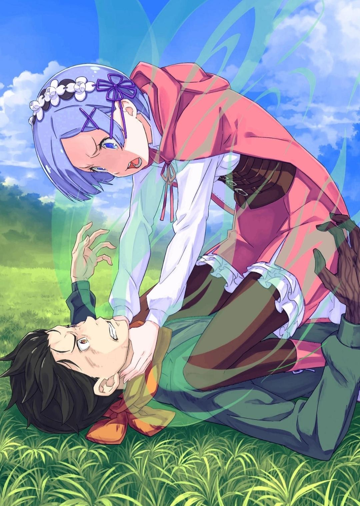
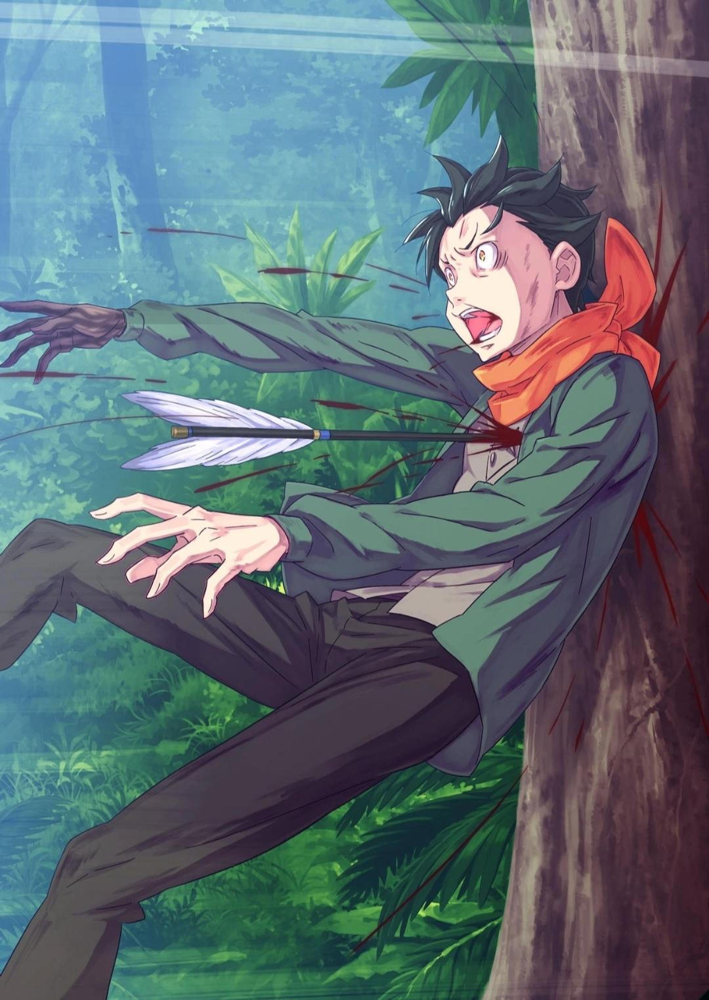

※ ※ ※ ※ ※ ※ ※ ※ ※ ※ ※ ※

……Как только клубы дыма рассеялись, Рам почувствовала редкое чувство беспомощности.

Рам: …………

Она открыла свои бледно-малиновые глаза, напрягая их, вглядываясь в комнату, над которой все еще висел дым. Однако, даже когда она сделала это, ища что-то среди пустоты, тех, кого она искала, нигде не было видно.

Она искала тех людей в комнате, где появилась большая дыра, кого-то движущегося или кого-то в черном, а также очаровательную в синем; однако их нигде не было видно……

???: ……Рам!

Рам схватили за плечо сзади, когда она попыталась сделать шаг вперед. Вернувшись в чувства. Она поняла, что собиралась шагнуть через треснувший пол. Если бы ее не остановили, она могла упасть.

Как неуклюже с ее стороны было буквально даже не видеть, что у нее под ногами.

???: Я рада, что ты в порядке, Рам… Также, Патраш-чан, ты в порядке?

Рам: Эмилия… сама…

Рам прикусила губу. Между тем, той, кто схватил ее за плечо, была Эмилия, которая должна была быть на верхних этажах. Слегка задыхаясь, Эмилия проверила, все ли в порядке с Рам, а также как поживает Черный Наземный Дракон Патраш, которая сидела позади них.

Наконец, глядя на них, Рам обрела достаточно самообладания, чтобы оценить обстановку.

Четыре этажа Сторожевой башни Плеяд были в ужасном состоянии.

Коридор крепкой каменной башни, рухнул, её пол и потолок разлетелись вдребезги. Она могла видеть небо и песок песчаного моря через дыру в стене, из которой дул сухой ветерок.

Однако больше всего пострадала комната, в которой до недавнего времени останавливались Рам, Патраш и компания…… то есть комната, которую они называли «Зеленая Комната».

Рам: …………

Комната была битком набита травой и плющом, покрывавшими стены, от пола до самого потолка. Тем не менее, комната теперь была неузнаваема по сравнению с ее первоначальным состоянием, с ее естественной эрозией многих, многих лет, вырванной с корнем и ветвями.

Сюда входили кровати, которые были сплетены из травы и плюща, а также слабый свет, который излучал присутствие Духа.

Все это, а также их самой большой проблемой было……

Эмилия: Рам…… Субару и Рем, куда они делись? Они ведь в безопасности, правда?

Стоя рядом с Рам, Эмилия заглянула в место, где раньше находилась «Зеленая Комната».

Рам не смогла сразу ответить на ее вопрос, хотя она знала, что ее болезненное молчание само по себе служило ответом.

△ ▼ △ ▼ △ ▼ △

???: ….Прежде всего, давайте попробуем разобраться в том, что произошло. Мы не сможем спокойно говорить о вещах, пока не сделаем этого.

Оглядев всех, кто собрался в комнате, Анастасия взяла ситуацию в свои руки сказав это.

Белый лисий шарф Анастасии…… Ехидна, все еще была обернута вокруг нее. Она провела пальцами по своему слегка пыльному меху, когда говорила.

Анастасия: Итак, о той черной тени, которая атаковала башню незадолго до этого……

Юлиус: Её больше нет, по крайней мере, сейчас. Я бы сказал, что это благодаря силе «Божественного Дракона», Волканики.

Ехидна: И Дракон, и тень были такими внезапными, что это заставило нас задуматься, что, черт возьми, происходит, хах.

Внутри башни те, кто вернулся целым и невредимым, начали делиться случившимся, начав сначала с Анастасии, а затем Юлиус и Ехидна последовали ее примеру.

Как и у Анастасии и Ехидны, белая рыцарская одежда Юлиуса тоже была покрыта грязью. Однако это было не только из-за жаркой битвы, которая произошла в башне, но и в значительной степени из-за последствий вышеупомянутого события.

Тем не менее, ни один из этих троих не получил дополнительных травм; в этом вопросе можно было сказать, что это было облегчением.

Само по себе это произошло благодаря достижению «Божественного Дракона», Волканики, на самом верхнем этаже башни.

Беатрис: Волканика своим дыханием рассек надвигающуюся тень, я полагаю. Если бы не это, мы, вероятно, оказались бы в мире страданий.

Анастасия кивнула Беатрис в ответ на то, что она сказала, когда та скрестила короткие руки вместе.

Честно говоря, когда Волканика так внезапно вздохнул, Анастасия необычно смирилась со смертью. Все произошло так быстро, что не было никакого способа справиться с этим.

Хотя, конечно, она не могла сказать, что полностью расслабилась из-за этого единственного вдоха.

Юлиус: Реакция «Божественного Дракона» на надвигающийся кризис был просто великолепен, но даже в этом случае состояние, в котором он находится, невелико, оно остается неизменным…… Однако в настоящее время он, кажется, остается довольно послушным и следует инструкциям Эмилии-самы.

Анастасия: Из уважения к Юлиусу я постараюсь не называть его старым… Но это то, чего «Божественный Дракон»-сан не побоялся. В любом случае, что касается того, что произошло, все в точности так, как говорит Беатрис-чан.

Беатрис: Я полагаю.

Единственным, кто мог бы справиться с такой неожиданной ситуацией, был Волканика. Что бы с ними стало сейчас, если бы Дракон не сдул нависшую над ними тень.

Но они не могли начать прыгать от радости……

???: Её там было мно~го. Но она вся следовала за братиком и другими……

Анастасия: Мейли-чан.

Мейли: Ах, мои изви~нения.

Анастасия: …………

Мейли не позаботилась о своем выборе слов, как будто она была расстроена, и за это Анастасия упрекнула ее. Мейли принесла ей искренние извинения, глядя на Рам и Эмилию, которые хранили молчание.

Оглядываясь назад, можно сказать, что те, кто получил урон от этой тени, были двое из лагеря Эмилии…… Субару и Рем. Таким образом, ущерб, нанесенный лагерю Анастасии, оказался практически нулевым.

Анастасия: Хотя я не могу этого сказать, но в конце концов, мы путешествуем все вместе.

Анастасия пробормотала это про себя, прежде чем мельком увидеть Юлиуса и Ехидну. Они работали вместе с группой Эмилии в то время, пока она спала в глубинах собственного сознания, а Ехидна была на её месте.

Это само собой разумеется для Ехидны, которую она знала около десяти лет, но даже практически новый безупречный Юлиус в ее воспоминаниях, мог легко сказать, что она была потрясена.

В этот момент Анастасию весьма удивило, что Беатрис, которая должна была быть совсем рядом с ними, пришла на эту встречу.

Анастасия: Беатрис-чан, ты в порядке? Ах, подожди, нет, с моей стороны нехорошо использовать такое слово, как “В порядке”. Но все же, ты не довела себя до паники, не так ли?

Беатрис: ……Паника Бетти не означала бы, что это вернет Субару и Рем. Прямо сейчас главная проблема, о которой идет речь, — это испортить наш первый ход паникой, я полагаю. Я бы специально хотела этого избежать.

Анастасия: Первый ход? Под этим ты подразумеваешь……

Эмилия: ……Возвращение Субару и Рем. Принимать меры для этого, да?

Анастасия вопросительно подняла брови, пытаясь расспросить Беатрис. Однако Эмилия прервала ее, все еще поддерживая Рам за плечо.

Аметистовые глаза Эмилии пронзили Анастасию насквозь, ее глаза слегка расширились от удивления из-за интенсивности ее взгляда. Она облизнула губы языком.

Анастасия: Черт, я думала, что ты будешь сильно подавлена, но у тебя очень странный взгляд. Что ты имеешь в виду?

Эмилия: На самом деле ничего сложного. Субару и Рем в итоге были поглощены этой тенью и унесены от нас…… Волканика действительно прогнал ее, но он немного промедлил. Несмотря на это……

Рам: Они не умерли. Я в этом уверена.

Все еще поддерживаемая Эмилией, Рам открыла глаза и ответила. Затем она осторожно коснулась той части своего лба…… где, по-видимому, был ее Рог Клана Они, и испустила измученный вздох. Это было то, что послужило основой ее слов, которые были полны убежденности.

Анастасия: Племя Они…… Ах, разве это не синестезия сестер? Так ты говоришь, что связана с Рем-сан?

Рам: Да, это так. Рем жива…… Насчет Барусу, ни малейшего понятия.

Беатрис: Субару тоже в порядке, я полагаю! Бетти может это гарантировать!

Беатрис закричала в гневе, почти покраснев, в ответ на слова Рам, очень похожие на интонацию Рам. В конце концов, она — Беатрис, Дух, заключивший контракт с Субару. Ее слова действительно внушали им доверие.

Другими словами, это означало, что двое из них, которые исчезли, были живыми.

Юлиус: Что касается Субару, у нас есть его связь с контрактом Беатрис-сама, а в отношении мисс Рем, у нас есть синестезия мисс Рам…… И в то и в другое стоит верить. Кроме того, я тоже хотел бы надеяться.

Анастасия: Довольно откровенно…… Ну, в любом случае, я бы тоже предпочла, чтобы Нацуки-кун и Рем-сан были в целости и сохранности.

Анастасия погладила свой шарф после того, как Юлиус ответил, как бы говоря, что подойти к ним слишком близко будет проблемой.

В настоящее время они работали с группой Эмилии в качестве соучастников…… Но тот факт, что они соревновались друг с другом в Королевских Выборах, не изменился. Она не хотела, чтобы они неправильно поняли это и усугубили свои проблемы.

Тем не менее, именно потому, что они сражались друг с другом, они должны были в обязательном порядке вернуть свои долги.

Мейли: Ну ч~то? Типа, это супер-пупер хорошо, что братик и ещё кто-то там жив, н~о где они?

Не сумев уловить настроение положительно, Мейли спросила их, играя с Маленьким Багровым Скорпионом, который балансировал на ее голове. Юлиус открыл рот в ответ на ее вопрос и начал говорить:

Юлиус: Ну, хотя я не смог бы объяснить это очень подробно, но эта субстанция была продуктом Магии Тени… Или, по крайней мере, атрибутом Тени. Это должно быть то же самое, что запечатывает таких, как «Ведьма Зависти» в ее святилище, и Рой Альфард в Карете Дракона. Если мы предполагаем, что это так, то что касается нашего постоянного эксперта……

Беатрис: ……Это Бетти, я полагаю. Мой прогноз не сильно отличается от прогноза Юлиуса. Это был комок Магии Тени, я полагаю. Это похоже на Шамак, который направили.

Ехидна: Шамак? Разве это не основная магия атрибута Тени? Как же она тогда была такой мощной?

Беатрис: ……Я знала, что будет довольно много людей, которые неправильно поймут, поскольку вряд ли кто-то его использует. Однако меня беспокоит, что даже ты так думаешь об этом, когда ты такой же Дух, как я.

Ехидна, принявшая облик белой лисы, укоризненно посмотрела на Беатрис, заставив ее опустить голову. Вздохнув от ее реакции, Беатрис подняла один из пальцев и сказала: “Могу ли я, я полагаю?”

Беатрис: Особое качество Шамака в «Разделении». Низкосортный шамак отделяет чье-то тело от их осознания, в то время как высокосортный Шамак отделяет пространство от самого себя, я полагаю. Пересечение дверей Бетти — одно из таких приложений, связывающее две комнаты вместе и достигающее чего-то близкого к телепортации.

Рам: Это было хитрое приспособление, которое Беатрис-сама установила в предыдущем особняке. Мне было очень больно звать её во время еды, так что, честно говоря, я была сыта этим по горло.

Беатрис: Бетти действительно расстраивает то, что ты так честно сказала это прямо здесь, прямо сейчас, я полагаю. Я действительно сожалею об этом, но извинения можно отложить на потом…… В любом случае, Шамак, по сути, может отделить пространство от пространства, если он того пожелает; кроме того, он может разделять объекты, независимо от их прочности. Это специальность «Ведьмы Зависти».

Анастасия: Из твоего объяснения не следует ли, что Нацуки-кун и Рем-сан были разделены на части?

Беатрис, однако, покачала головой на вопрос Анастасии.

Беатрис: То, что я сейчас упомянула, было аллегорией, я полагаю. По крайней мере, эта тень не была чем-то, что должно было разрубить Субару и Рем на куски. Но, она собиралась захватить их внутрь и унести куда-нибудь, я полагаю.

Ехидна: Откуда-то… Через пространство… Она пришла к нам?

Рам: …В конце концов, есть проблема с миазмами Барусу.

Ехидна разбила изложение Беатрис на более простые термины, и в конце этого Рам объяснила причину.

Миазмы, окутавшие Субару, которые сильно взволновали Зверодемонов на пути к Сторожевой Башне…… теперь этот факт был хорошо известен среди Кандидатов на Королевские Выборы.

Рам: Все, что я знаю о миазмах, это то, что они привлекают к себе Зверодемонов, и что люди, связанные с культом ведьм, часто излучают их в больших количествах… Это почти все.

Эмилия: Хм, хотя Субару довольно много раз преследовали Зверодемоны, он не имеет никакого отношения к Культу Ведьмы. Я понимаю, что это очень подозрительно, но……

Анастасия: Не волнуйся, не волнуйся, сейчас я не сомневаюсь в этом, Эмилия-сан.

Эмилия: О? Слава Богу. Субару — хороший мальчик, так что……

Эмилия с облегчением похлопала себя по груди, однако проблема все еще оставалась актуальной.

Как и сказала Анастасия, нити мыслей о том, что Субару связан с Культом Ведьмы, больше не было внутри нее. Тем не менее, тот факт, что они не знали происхождения Субару, все еще вызывал у нее сомнения.

Она не думала, что Субару был человеком с плохими намерениями. Однако злой умысел, которого никто не осознавал, тоже имел место.

……Был шанс, что за всеми его благими намерениями существование Субару само по себе было бомбой замедленного действия.

Анастасия: Да, да, так что твое беспокойство излишне, я поняла это из того, как ты начала предложение. Тень, поглотившая Нацуки-куна и Рем-сан унесла их куда-то. Настоящий вопрос в том, куда?

Ехидна: А также то, что произошло из-за того, что дыхание Волканики вмешалось в это.

Беатрис и Рам, которые были связаны с Субару и Рем соответственно, вероятно, имели приблизительное представление об их местонахождении.

Искать их будет непросто, если все, что они знали, это то, что они живы, не зная точно, куда их забросило. ……По крайней мере, возможность не искать их была недоступна никому в этом месте.

Эмилия: Пожалуйста, вы двое, где Субару и Рем? Скажите мне, пожалуйста.

Беатрис и Рам обменялись взглядами, обратившись к искреннему призыву Эмилии.

Затем, после нескольких секунд молчания их обоих……

Беатрис: ……Он на юге, полагаю.

Рам: Рам тоже чувствует, что она находится в том же направлении. Я не уверена в ее точном положении, но думаю, что она довольно далеко.

Эмилия: Юг? К югу отсюда у нас эээ…

Эмилия нахмурила свои четко очерченные брови сразу после того, как Беатрис и Рам оба упомянули, что те на юге. Хотя она, должно быть, отдавала все силы, чтобы мысленно представить карту мира, Анастасия подняла руку вместо нее.

В настоящее время они находились в Песчаных дюнах Аугрии, расположенных в самой восточной части карты мира. На юге отсюда наиболее вероятными были Пиктат или Фландрия из пяти великих городов, однако……

Юлиус: Что касается только этого, то состояние этих двоих непостижимо.

По-видимому, придя к той же мысли, Юлиус высказал мнение Анастасии за нее.

Судя по тому, как он синхронизировался со скоростью ее мыслей, Анастасия еще больше ценила его как идеального рыцаря, все это время закрыв один глаз и говоря: “Действительно”.

Анастасия: Это довольно большое расстояние, но если они окажутся в этих местах, то мы можем сказать, что нанесенный ущерб будет незначительным. И все же, несмотря на это, ваши лица выглядят бледными… Вы оба хотите сказать, что они намного южнее?

Эмилия: Еще южнее… ты не можешь иметь в виду……

Мейли: ……Они в конечном итоге дошли до Империи Волакии на юге?

Удивление Мейли было минимальным по сравнению с тем, как была потрясена Эмилия. Но можно было с уверенностью сказать, что реакция Мейли была вызвана тем фактом, что она не понимала масштабов происходящего. Учитывая это, реакция Беатрис и остальных была вполне понятна.

Если бы Субару и Рем пересекли страну. И если они проникли в Южную Империю…… то у них была реальная проблема.

Анастасия: Если я не ошибаюсь… Королевство Лугуника и Империя Волакия на юге подписали пакт о ненападении, который будет действовать в течение всех Королевских Выборов. Не так ли, Юлиус?

Юлиус: Совершенно верно. Я предполагаю, что вы об этом не знаете, но я также отправился туда, чтобы скрепить соглашение. Я, Райнхард, Феррис и другие лично встречались с Императором.

Эмилия: Насколько я слышала, у нас были действительно плохие отношения с Империей; но если вы это сделали, то теперь мы с ними в ладах? Так что, если бы мы отправились на поиски Субару и Рем…

Юлиус: ……Нет, так не получится.

Юлиус приподнял брови и покачал головой в ответ на робкий вопрос Эмилии. Он мягко опустил свои желтые глаза, которые сверкали, как драгоценные камни, украшая его красивые черты

Юлиус: Империя на данный момент запретила путешествия между собой и Королевством несколько месяцев назад. Из-за Королевских Выборов то же самое произошло со Священным Королевством Густеко на севере, однако они уже отменили свой запрет……

Ехидна: Я полагаю, это означает, что установки Империи, не были отменены. Хотя наше путешествие в Сторожевую башню заняло много времени, так что из-за этого у нас нет последней информации… Так что, если ситуация там не изменилась……

Эмилия: Поехать туда, чтобы помочь Субару и Рем, будет непросто?

Юлиус: К сожалению, да.

Хотя они обменялись различными мыслями по этому поводу, Юлиус закончил этими простыми словами сожаления.

Анастасия тоже могла прийти только к тому же выводу, что и Юлиус. Было бы невозможно прорваться с фронта, если бы речь шла о проникновении в Империю Волакия.

У них не было иного выбора, кроме как искать секретный путь внутрь, и в дополнение к этому им также нужно было найти для этого время и контакты.

Здесь не было быстрого и легкого пути. Несомненно, Эмилия будет очень торопиться, думая о двух людях, состояние которых остается неизвестным……

Эмилия: …Нам нужно действовать быстро. Мы получим кровь Волканики и привезем ее в Пристеллу… Затем надо отвезти «Чревоугодие», которого мы схватили, в Королевскую столицу, да?

Беатрис: Эмилия…?

Эмилия: Я знаю Беатрис. Я ничего не могу поделать, но чувствую себя о~очень, о~очень нетерпеливой. Но мы не сможем помочь Субару и Рем, даже если будем торопить события здесь… Мы должны сохранять спокойствие.

Однако спокойное решение Эмилии удивило Анастасию, как будто она бы впала в панику. Она решительно кивнула Беатрис, тоже удивленной. Ее глаза дрожали, голос немного дрожал, но она делала все возможное, чтобы держать себя в руках.

Это было так, будто она говорила, что если это означает вернуть Субару и Рем, то она не собирается опускать руки или сидеть сложа руки ни секунды.

Эмилия: Вы двое, Субару и Рем, должно быть, вместе, верно?

Рам: ….Мы только что перепроверили с Беатрис-сама, и думаем, что они, вероятно, вместе.

Эмилия: Хорошо…… Тогда, если это так, я уверена, что Субару сделает все возможное, чтобы защитить Рем. Вот почему нам не нужно беспокоиться о Рем. Но даже так, мне страшно за Субару.

Хотя ее вера в Субару была сильной, Анастасия тоже согласилась с ее беспокойством.

Нацуки Субару на время потерял воспоминания в башне из-за того, что был предоставлен самому себе. Этот мальчик со склонностью к самонаказанию имел дурную привычку относиться к себе с легкостью, чтобы защитить дорогих для него людей.

Подобно тому, как это иногда воодушевляло других, оно также служило поводом для беспокойства.

Анастасия: Тем не менее, думаю, все, что мы действительно можем сделать, так это рассчитывать на сообразительность Нацуки-куна. Эмилия-сан права, мы не можем оставаться здесь, ворчать и стонать внутри башни. Мы должны двигаться дальше.

Юлиус: Понял четко и ясно. ……Беатрис-сама, пожалуйста, сообщите нам, если возникнут какие-либо проблемы.

Беатрис: ……Тело Субару, я полагаю. Врата Субару сами по себе не могут вытеснить ману, так как они сломаны. Если мы оставим его одного надолго, то он лопнет из-за блокировки маны, я полагаю.

Анастасия: Понятно. Получается я нахожусь в одной лодке, как и Нацуки-кун.

Врата Анастасии были дефектными от рождения.

Она не могла должным образом воспринимать ману; например, это было бы критическим недостатком для мага. Тем не менее, это никак не повлияло на удачу и деловую хватку, необходимые торговцу, так что это ее не очень беспокоило.

Ехидна: Ана……

Анастасия: Знаю, знаю. Что касается наших проблем, поговорим о них отдельно чуть позже…… Кроме того, не похоже, что у нас есть время расслабиться.

Анастасия хлопнула в ладоши, а все остальные кивнули в ответ на ее сигнал.

Их целью было найти местонахождение исчезнувших Субару и Рем. Для этого им нужно будет как можно скорее вернуться из Сторожевой башни Плеяд, чтобы собрать поисковый отряд.

Вдобавок ко всему, им нужно было выполнить одну из основных задач, ради которой они пришли в башню.

Мейли: Все так суматошно, до такой степени, что я почти чувствую, что сейчас упаду в обмо~рок….

Эмилия: Угу, я понимаю. Тем не менее, Субару и Рем, должно быть, приходится гораздо труднее.

Эмилия крепко сжала кулак, думая о Субару, которую унесло куда-то далеко. Увидев ее лицо в профиль, Мейли, с Маленьким Багровым Скорпионом на голове, прищурилась и сказала “Да, да”, пожав плечами.

И вот так группа начала заниматься своими приготовлениями ….По крайней мере, они собирались это сделать.

Мейли: Если поду~мать, сестренка Рам, ты рассказала им о той шту~ке?

Рам: ……Ещё нет.

Другие: ……? Той штуке?

Лицо Рам скривилось от довольно резкого вопроса Мейли. Все взгляды обратились на Рам, явно ничего не слышав об этом.

Пока все смотрели на нее, Рам ненадолго остановилась, а затем сказала:

Рам: Эмилия-сама, хотя я все еще не уверена в этом на сто процентов… Те, кого поглотила тень и унесла в Империю, возможно, были не только Барусу и Рем.

Эмилия: Не только их двоих… Но ты, Патраш-чан и Мейли все на месте, так что разве это не должны быть все, кто был в Зеленой Комнате?

Мейли: Ну, девушка появилась внезапно, прежде чем эта тень как бы ворвалась внутрь. И более того, по словам братика, это было третье «Чревоугодие» или что-то в этом роде.

Другие: Третье «Чревоугодие»?

Анастасия и другие были полностью ошеломлены, когда им рассказали об этом лакомом кусочке, который они действительно не могли оставить без внимания.

Итак, дискуссия становилась все интенсивнее, по поводу того, следует ли им изменить свои действия в будущем и получить от нее детали, которые Рам скрывала по этому поводу.

По мере того, как это продолжалось, в теперь уже перевернувшемся суматохе Сторожевой башни Плеяды Эмилия сложила руки в молитве перед грудью, все время глядя в огромную дыру, где когда-то стояла Зеленая Комната.

Эмилия: Пожалуйста, Субару…… Я очень надеюсь, что у тебя и Рем все будет хорошо.

△▼△▼△▼△

……Когда маленькая молитва Эмилии утонула в иссушенном небе над морем песка, в то же время далеко-далеко,

Субару: …………

На вершине открытого луга, нежно ласкаемый блуждающим ветерком, сидел мальчик, а в его объятиях была девочка.

У мальчика были черные волосы, а его глаза были острыми, как лезвие кинжала, с ярко выраженными белками, аля очень известный санпаку; глаза, из-за которых его лицо постоянно хмурилось, и, по слухам, это все, что нужно, чтобы убить человека.

Однако в этот момент его губы слегка приподнялись, а уголки глаз увлажнились. Ему потребовалось все, что у него было, чтобы не разрыдаться в полный голос.

Конечно, это был естественный результат.

Он так долго ждал этого момента. Воспоминания о каждом дне, который он проводил в ожидании, в горе, не позволяли ему даже на самое короткое мгновение отвести взгляд от девушки перед ним.

Девушка, так нежно обнявшись, смотрела на него сквозь пряди своих ярких синих волос.

Ее глаза расширились, хотя на ее очаровательном лице почти не было силы сопротивляться. Как будто она проснулась ото сна и все еще была захвачена своей сонливостью.

Честно говоря, это действительно было правдой. Она наконец-то очнулась от долгого-долгого сна, так что совершенно очевидно почувствовала отрыв от реальности.

Рем: ……А… мм…

Ее губы шевелились, словно обдумывая то, о чем он говорил несколько минут назад.

Пока он смотрел, мальчик Нацуки Субару энергично кивнул.

Субару: Да, именно так, Рем. Я твой герой. Я так долго ждал……

Рем: …………

Субару: Рем?

Пытаясь подавить дрожь собственного голоса, он отчаянно пытался уловить голос Рем.

Возможно, из-за жажды или чего-то в этом роде, хотя, когда ее губы двигались и язык щелкал, ее горло не издавало ни звука. Тем не менее, он приложил ухо к ее рту, пытаясь уловить хотя бы крупицу того, что Рем пыталась ему сообщить.

Ее скудные попытки передать что-либо наполнили его безмерной радостью.

Рем: ………м.

Субару: Я слушаю, не нужно торопиться, хорошо? Рем, что ты пытаешься…

…сказать, так он хотел договорить, но в конечном счете был перебит.

Как только он прижал уши достаточно близко, чтобы услышать ее, его мысли остановились, когда чья-то рука коснулась его головы и подбородка.

Следуя этому потоку, он почувствовал, как его перевернуло и он упал на землю.

И потом……

Субару: ……Ре… Рем?

Иллюстрация к **Ранобэ** Том 26 | Разукрасил norvakkk

Субару обнаружил, что лежит спиной на траве, а Рем оседлала его сверху.

Сбитый с толку, он застыл на месте. Пристально глядя на него сверху вниз, Рем оглядела его сверху донизу.

Затем она тихо вздохнула и

Рем: Какова твоя цель? Скажи мне, что ты собирался сделать со мной прямо сейчас!

Субару: …………

Рем: Называет себя каким-то героем на ровном месте и…… Кто такая Рем? Отвечай сейчас же!

Колени прижались к плечам Субару, ее руки метнулись к его шее. С ее весом, навалившимся на него, Субару изо всех сил пытался двигаться, его ноги беспокойно подергивались.

Однако умение, с которым Рем сдерживала его, вызывало некоторый трепет. Она не оставила ему места, чтобы обрести свободу.

Субару: Гху… а… гкх…

Рем: Если ты откажешься говорить, я просто буду продолжать, пока ты не захочешь это сделать. Пожалуйста, не продлевай свои собственные страдания. Говори. Что именно ты….

Субару: ……Гха.

Он не знал, было ли это намеренно или непроизвольно, но сила, с которой Рем прижимала его к шее, не оставляла ему возможности, чтобы ответить ей.

Когда его разум затуманился из-за недостатка кислорода, он понял, что если позволить этому продолжаться, это приведет к его смерти.

Это было так давно, и даже если бы это было одностороннее воссоединение, Субару мог бы позволить этому закончиться тем, что Рем задушит его. Не так, как сейчас.

Даже если в ее памяти ничего не осталось от Субару.

Субару: Оа…ах……

Рем: Хочется ли тебе говорить сейчас? Если да, то я сделаю это по доброй воле……

Именно тогда, когда Рем нахмурилась, глядя на признаки напряженной борьбы на его лице,

Луис: Аа…! Оох…!

Рем: ……Киаа!?

Внезапно маленькая тень врезалась в тело Рем сбоку…… Вернее, она прыгнула на Рем и запуталась с ней в траве.

Когда тяжесть улетучилась, он перевернулся и закашлялся, затем посмотрел на Рем затуманенными влажными глазами. Там он увидел фигуру маленькой девочки, борющейся с Рем.

Луис: Ууу…! Уууу…!!

Рем: Ч-что ты делаешь … Прекрати, пожалуйста! Сейчас не время…

Ее светлые волосы покрывали всю Рем, маленькая девочка обнажила зубы на раскрасневшемся красном лице и завыла. Субару остановился, не в силах сформировать какие-либо мысли, став свидетелем этого зрелища.

Субару вздохнул и бросился к двоим.

И потом……

Субару: Эй! Убирайся от Рем, прямо сейчас!

Луис: А… Уу…!!

Субару оттолкнул маленькую девочку, которая пыталась дернуть Рем за волосы ……Архиепископа Луис Арнеб, и удержал ее, заложив руки за спину.

Легкое тело «Чревоугодия» пыталось сопротивляться, но тщетно. Лучшее, что она могла сейчас сделать, это пинаться. Послышались крики и стоны, но больше ничего.

Луис: Ау…! У…! Ууууу…!

Субару: Черт побери, ты……! Перестань бороться… Просто не двигайся! Рем, ты в порядке!? Она что-нибудь с тобой сделала!?

Рем: Н-нет, я в порядке. Более того, я спрашиваю тебя снова и снова……

Субару закричал ей, удерживая Луис, на что Рем ответила, изогнув брови. Не сводя с него глаз, она попыталась встать на ноги……

Рем: ……А?

И рухнула обратно на землю, ее колени подогнулись.

Ее странный способ падения вызвал вопросы в голове Субару. Все еще не подозревая, что за ней наблюдают, она встала на колени и снова попыталась встать.

Однако……

Рем: ……Мои ноги не…

Субару: Подожди, ты не можешь встать?

Рем: Н..нет, это не… Неправда… Совсем неправда…

Ее голос дрожал, когда она попыталась опровергнуть его сильное утверждение. Однако никакая сила воли не позволила ей встать.

Она была далека от того, чтобы сохранять равновесие, она даже не могла приложить никакой силы к своим ногам.

Субару: Ты чувствуешь слабость, потому что так долго спала? Подожди, этого не может быть. Я бы не назвал силу, которую ты использовала, чтобы толкнуть меня сейчас, силой того, кто был прикован к постели так же долго, как и ты.

Часто ходили разговоры о том, как человек в конце концов ослабеет за время длительного пребывания в больнице, вероятно, из-за недостатка физических упражнений.

Было довольно хорошо известно, что этим людям требуется реабилитация, чтобы снова встать и ходить, но действительно ли это закончится на ногах?

Это было не так, как если бы Рем двигала верхней частью тела во время своего «периода госпитализации». Она спала больше года, так что для нее было бы разумно чувствовать слабость в целом, а не только в ногах.

И все же эта разобщенность существовала в ней, в теле Рем.

Вероятно, это было связано с тем……

Субару: ….Подожди, может быть, это из-за отдачи, которую она получила от драки сестры?

Пока его разум перебирал возможные причины, по которым тело Рем могло вести себя подобным образом, он пришел к такому выводу.

Он слышал от Рам в «Зеленой Комнате» о том, как закончилась ее смертельная битва против «Чревоугодия». Из-за ухудшения состояния Субару Рам пришлось что-то изменить, чтобы не попасть в угол. Поэтому она решила разделить свое бремя с Рем как козырную карту.

В результате большая часть бремени боли Рам, которая, как говорили, была самой сильной из клана Они, перетекла в Рем. Субару вспомнил этот разговор.

Если бы это было так, то……

Субару: ……Это моя вина.

Он произнес фразу, за которую Рам наверняка упрекнула бы его.

Однако, как бы то ни было, Субару не смог выполнить долг, который он сам на себя взял, в результате чего Рам пришлось двигаться дальше, что повлияло на Рем. Все пришло к тому, что во всем виноват Субару.

Погруженный в эту ситуацию, когда рядом не было никого из его друзей, на кого он мог бы положиться, где только он, Рем и Луис, которая продолжала вести себя странно по бог знает какой причине, и ответственность, которую он нес, была еще более тяжелой.

Рем: Ты говоришь твоя вина…… Ты что-то со мной сделал!?

Субару: Вовсе нет, это была просто фигура речи, однако……

Рем: Обо всем по порядку! Кто ты!? И кто я!?

Субару: …………

Сильно ударив по ногам, которые не слушались ее воли должным образом, Рем уставилась на Субару с бурей ярости в глазах. Субару почувствовал что-то довольно горькое, что его неприятная догадка стала реальностью, услышав душераздирающую жалобу Рем, которая, казалось, вот-вот выйдет из себя.

……Рем сказала: “Кто я?”.

Вопрос “Кто ты?” был еще удовлетворительным. Однако ее вопрос о том, кто она такая, все еще был для Субару чем-то крайне мучительным, учитывая, что он так долго ждал, чтобы снова увидеть Рем.

Он подозревал, что так и будет, исходя из того факта, что она говорила о себе, используя «Я» вместо «Рем».

Субару: Думаю, она в том же состоянии, что и Круш-сан……

У Рем отняли «Имя» и «Воспоминания», в результате чего она продолжала спать.

У жертв «Чревоугодия» были обнаружены еще два типа, а именно, один из которых был обнаружен у Юлиуса, у которого отняли его «Имя», и поэтому его забыли окружающие, а также у Круш, у которой отняли «Воспоминания», потерявшую себя.

Рем проснулась в состоянии потерянных собственных «Воспоминаний»; в состоянии амнезии.

Ее замешательство было совершенно естественным, если учесть, что она застряла в такой непонятной ситуации, вместе с мальчиком со злобными глазами, и девушкой, которая ничего не могла сделать, кроме как стонать, а ее собственные ноги не работали так, как она хотела.

Луис: У~аау!

Даже не осознавая, что Луис притихла, будто она устала от борьбы, она выпала из рук измученного Субару и упала на спину, издав визг.

Она начала кататься, потирая зад. Субару не удосужился уделить ей внимание, вместо этого он медленно подошел к Рем.

По мере того как Субару приближался к ней, Рем не спускала с него глаз, при этом не теряя бдительности.

Увидев этот взгляд в ее глазах, он вспомнил, как Рем впервые обратила на него эту враждебность.

Это было легко забыть, потому что они стали довольно близки после того, как потеплели друг к другу, но Рем изначально была довольно сдержанной, и с ней было довольно трудно сблизиться.

На самом деле пугающим было то, что, согласно одной теории, существовала даже вероятность того, что они не поладят.

Субару: В любом случае, не говоря уже о сестре…… Эй, ты знаешь…

Рем: Ч-что это? Просто чтобы ты знал, если ты собираешься что-нибудь со мной сделать, я……

Субару: ……Рем.

Рем: А?

Напряженное выражение лица Рем превратилось в выражение удивления. Субару остановился как вкопанный, когда подошел ближе, соблюдая достаточное расстояние между ними, так что он был бы больше, чем в шаге от ее досягаемости,

Субару: Рем. Это твое имя.

Он снова позвал ее по имени.

Рем: …………

Рем погрузилась в молчание, не в силах скрыть свое недоумение из-за того, что оно мягко излилось на нее. Тем не менее, она пошевелила своим красным языком, который еле виднелся за ее губами, и повторила “Рем”, как бы удостоверившись в этом.

Как будто она заново знакомилась со своим именем.

Субару: Честно говоря, я тоже толком не знаю, что произошло. Только то, что мы расстались с нашими друзьями, и мы здесь, в этом месте, которое бог знает где. Ты должна понимать, что это полный бардак, верно?

Рем: Ну, я……

Все еще пребывая в замешательстве, Рем осмотрела окрестности, а не Субару.

Легкий ветерок шелестел по лугу, солнце стояло высоко в небе, и он чувствовал влагу на своей коже. Душное ощущение, которое отличалось от иссушенного воздуха Песчаных дюн Аугрии.

Он находился в месте, которое было настолько другим, что ощущение, которое он испытывал с воздуха, изменилось.

Другими словами……

Субару: Мы не можем рассчитывать на немедленную помощь. Нам нужно будет предпринять необходимые действия, чтобы помочь себе здесь, так или иначе. Вот почему……

Рем: Вот почему что? Что ты собираешься мне сказать, чтобы я сделала? Я, и мои ноги, которые едва могут двигаться, и все остальное.

Субару: ……Я представляю, что у тебя опять возникнут подозрения, как только я скажу такие вещи, но я был бы просто доволен тем, что ты здесь со мной. Дыши, разговаривай со мной, оглядывай окрестности своими глазами; я был бы доволен только этим.

Рем: ……? Ты имеешь в виду осмотреться глазами и сказать, чиста ли дорога?

Субару: Не совсем так, но это тоже было бы хорошо.

Он был очень доволен тем, что Рем проснулась, дышала и разговаривала с ним.

Несмотря на то, что это было что-то довольно бескорыстное, Субару умолял о том, чтобы Рем проснулась, только о том, чтобы она была в добром здравии, поэтому это были, без преувеличения, его истинные намерения.

Конечно, ему нужно было решить проблему с ее недостающими «Воспоминаниями». Это, а также Эмилия, Беатрис, Рам и все, кто остался в башне из-за того, что Субару и его группа отделились от них, должны сильно волноваться.

Он хотел присоединиться к ним как можно быстрее. ……Он хотел, чтобы Рам познакомилась с Рем, так как она испытывала такую любовь к своей младшей сестре, которую она не помнила.

Субару: Пожалуйста, ты мне не доверяешь? Даже если бы я отдал свою жизнь взамен…… Нет, это значит, что, если бы я отказался от своей жизни, я бы защитил тебя любой ценой. Я клянусь. Вот почему……

Рем: …… И скажи, что я если приму твое предложение, тогда что ты будешь делать?

Субару: А, верно. Было бы бессмысленно действовать без плана, поэтому когда дело доходит до этого……

Получив благоразумный вопрос Рем, Субару запросил информацию, необходимую для составления плана.

Как уже упоминалось, Субару и другие находились на обширном лугу, однако они могли видеть большие деревья, растущие близко друг к другу, окружая луг.

Видя, что их перехватили кроны деревьев еще до того, как они достигли горизонта, деревья окружали их под углом 360 градусов, казалось, что они находятся на открытом лугу, в таком месте, как внутри леса.

По правде говоря, опасно заходить в лес на земле, с которой он был совершенно незнаком, но……

Субару: Во-первых, нерушимое правило, когда человек заблудился в лесу, — это сообщать своим союзникам о его местонахождении с помощью GPS, но……

Рем: Джи-Пи-Эс?

Субару: Я знаю. Ничего подобного здесь не существует…… Просто у Беако есть связь со мной, так что есть вероятность, что она сможет определить мое местонахождение с помощью чего-то подобного. В некотором смысле, можно сказать, что само мое существование — это GPS.

В зависимости от ситуации существовала также вероятность того, что синестезия Рам определит местоположение Рем. В этом смысле и Субару, и Рем выполняли свои роли в качестве GPS, который связывал их со своими союзниками.

Субару: Что осталось, так это обеспечить источник воды… Важно заполучить воду, несмотря ни на что. Вероятно, будет лучше, если мы выберем наш базовый лагерь и начнем расширять поле поиска оттуда. Съедобной травой и фруктами являются…… ах, я был прав, узнавая это от Клинд-сана. Надо будет поблагодарить моего наставника……

В процессе обучения паркуру и обращению с хлыстом, Клинд вбил в его голову различные техники и знания. Были времена, когда он почти скулил о том, чтобы отказаться от учения универсального учителя, но благодаря тому, что это было полезно для него, Субару мог сохранить свой руководящий принцип при себе, несмотря на то, что находился в такой ситуации.

В любом случае……

Субару: Есть много и других вещей, но это не значит, что я пытаюсь действовать без плана. Теперь ты в состоянии понять?

Рем: ……В некоторой степени. Даже если бы я хотела сопротивляться, я нахожусь в таком состоянии, так что…

Субару: ……Это замечание, по которому я могу получить представление о твоих честных мыслях.

Субару попробовал улыбнуться, пытаясь успокоить ее, но ее реакция была не такой хорошей, как он думал.

Потеряв свои «Воспоминания», у Рем не было оснований, на которых она могла бы укрепить свое доверие к Субару. Если бы она могла свободно двигать ногами, то, возможно, она уже давно сбежала от него.

Хотя он не хотел думать о несчастье, случившемся с ней, как о чем-то счастливом.

Субару: Твои ноги. Я надеюсь, что ты скоро сможешь начать передвигаться по ним.

Рем: ……кх, даже если ты так говоришь, я сама этого не знаю. Чем ты планируешь заняться?

Субару: Я же сказал тебе. Во-первых, я собираюсь поискать воду. Дело в твоих ногах, так что я благодарен, если бы ты не стала действовать против меня, если бы могла……

Сказав это, Субару сделал последний шаг между ним и Рем, присел на корточки и повернулся к ней спиной.

Если она взглянет на его позу, даже Рем поймет, что он пытается сделать.

Рем: Ты собираешься взять меня с собой на спине?

Субару: Есть также возможность взять тебя на руки как принцессу, но я не продержусь долго, если сделаю это. Если бы иы позволила мне нести тебя на спине, я думаю, это было бы очень полезно лично для тебя.

Рем: …………

На какое-то время она замолчала, глядя на жалкое выражение лица Субару. После этого она медленно вздохнула и осторожно потянулась к его спине.

Тонкие руки Рем скользнули ему за плечи, сцепившись перед грудью. Чувствуя нежную тяжесть на спине, Субару не торопясь встал, убедившись, что не стряхнет Рем, которая цеплялась за него.

Он почувствовал ее вес. Однако, неся ее на спине, он думал, что она легкая.

В течение этого года у него было много возможностей нести дремлющую Рем, но каждый раз, когда он это делал, он на собственном опыте ощущал, как трудно было нести человека, находящегося без сознания.

Этого ощущения не было с Рем, которая держалась за него по собственной воле.

Рем: ……? Что-то случилось?

Субару: Нет, просто у меня было странное чувство. Итак, идем искать воду.

Рем: Перед этим…… что мы будем делать с этой девушкой?

Субару: ……Аа.

Глядя вперед на то место, куда указала Рем, дернув подбородком через плечо, Субару вспомнил о проблеме.

На лугу, распластавшись на траве и похлопывая себя по заду, в том месте, где она ударилась о землю, лежала Луис, запутавшаяся в её собственных длинных светлых волосах. ……Что ему делать с Архиепископом Греха, который вёл себя странно?

Субару: …………

Даже Субару знал, что нынешнее состояние Луис неестественно.

Она была противником с ментальной структурой, которую нельзя было назвать достойной, но это было из-за ее коварства, а не потому, что он мог видеть ее ранее скрытую сторону инфантильной регрессии.

На самом деле, она была довольно умна для своего возраста, и у нее также было место для размышлений над своими дьявольскими мыслями, что было похоже на то, как провести языком по осколкам в сердце.

Но что насчет поведения нынешнего Луис?

Луис: Аа… аа… уу…

Она облизала лицо Субару, когда тот проснулся, рычала, как малыш, который не знал как говорить, и в результате закатила истерику, как младенец.

Не было никакой ошибки в том, что в ее сознании произошло нечто неизмеримое.

Однако……

Субару: Будет ли это поводом для меня чтобы пожалеть ее?

Она была отвратительно злой. Эта истина всегда будет непоколебимой.

Луис, с которой он столкнулся в «Зале Воспоминаний», была травмирована переживанием «Посмертного Возвращения», испугавшись не только Субару, но и всего, что существовало в этом мире.

К тому моменту она уже достаточно превратилась в бедную, несчастную девушку.

Однако Субару не спас ее. Он даже не думал о желании спасти ее.

Несмотря на то, что перед ними было множество различных вариантов, они постоянно выбирали варианты, которые шли против человечества, в конечном итоге теряя возможность исправить их и отрезая себе путь от этого, такими людьми были Архиепископы Греха.

Два ее старших брата, а также сама Луис тоже не были исключением.

Совершив непростительное зло, Луис Арнеб превратилась в дегенерата, заслуживающего того, чтобы быть проклятым в аду.

……Зачем Субару понадобилось спасать такого человека?

Рем: Ты ей не поможешь?

Субару: …Это сложно. Я был в том же месте, что и она, но на самом деле она не мой союзник. Дело в том, что она на противоположной стороне моих союзников. Мое сердце не будет болеть, даже если я оставлю ее здесь.

Рем: …………

Позади себя он услышал, как у Рем перехватило дыхание, но это была реакция, с которой ничего нельзя было поделать.

От Рем, которая не знала об обстоятельствах Субару, Луис, вероятно, казалась ей только молодой, беспомощной девушкой, такой, какой она выглядела. Даже если ее истинной личностью была одна из осквернительниц, которая играла с огромным количеством жизней.

Вот почему у Субару был один выбор.

Субару: Мы оставляем ее там…… Мы не можем взять с собой опасную личность.

Выхватить Луис из надвигающихся теней было ошибкой, которую он допустил в башне. Возможно, если бы Субару бросил ее тогда и там, была бы вероятность, что этого не произошло бы между ним и Рем.

Это определенно было тем, что люди называли причиной сотен проблем и не приносящей ни единой прибыли.

Рем: Вот… как.

Субару: Да, это так. Не скажу что мне было приятно так просыпаться, но…

С этим намерением Субару проигнорировал Луис, которая лежала на траве, и направился к лесу на противоположной стороне, чтобы……

Рем: ……Как я и думала, даже если бы я была пуста, я была права, веря в себя.

Это было сказано ужасно ледяным, резким тоном.

Услышав, как этот голос прошептал ему на ухо, Субару выдохнул со словами: “А?”. Однако, запретив ему реагировать дальше, пара тонких рук обвилась вокруг его шеи.

……Рем, которую несли на спине Субару, душила его сзади.

Субару: ……Гакх.

Рем: Говоришь вещи, которые кажутся приятными для моих ушей, прежде чем пригласить меня пойти с тобой, а затем бросить другую девушку. Как я могла поверить такому человеку, который говорил мне доверять ему? Перестань морочить мне голову.

Сила в руках, обвившихся вокруг его шеи, определенно была силой Они, в отличие от ее физически неполноценных ног.

Не в силах оторвать руки, Субару полностью перестал дышать. Откинувшись назад, он не собирался этого делать, но упал спиной на траву.

Однако, несмотря на то, что она была раздавлена под ним, Рем отказалась убрать руки с его шеи. Поскольку она была у него за спиной, он не мог размахивать руками, чтобы освободиться от нее.

Почему? Сомнения и вопросы заполнили его голову.

Он не должен был спрашивать “Почему?”, потому что Рем уже дала ответ на этот вопрос. Перед ней, которая ничего не знала, Субару слишком поспешил из-за своих панических чувств.

Он получал за это возмездие, таким образом……

Рем: Позволять такой зловонной вони распространяться вокруг себя и говорить, что ты ничего не замышляешь, — само по себе неприкрытая ложь!

Субару: …………

Зловоние. Субару вспомнил свои воспоминания, когда услышал это.

В то время, когда он только познакомился с Рем, самой большой причиной, по которой она сомневалась в нем и считала его опасным, было отнюдь не плохое впечатление, которое он произвел во время их первой встречи, и не форма глаз, с которыми он родился.

……Миазмы Ведьмы.

Потеряв свои «Воспоминания», даже если у Рем не осталось ничего, кроме нее самой, она все еще могла их воспринимать.

Это было самым большим фактором, который вызвал у него подозрения Рем.

Он слишком поздно это вспомнил, а тем более заметил, и……

Субару: ……ах.

Извиваясь и изгибаясь всем телом, Субару пытался оправдаться за свои действия, но это было невозможно.

Так сознание Субару медленно и постепенно погрузилось в глубокую бездну тьмы.

Меньше всего он хотел, чтобы Рем убила его вот так. Он выкрикнул это с отчаянием.

Его голос был беззвучным, его нельзя было услышать.

△ ▼ △ ▼ △ ▼ △

Субару: ……~кх, Рем!?

Резкое пробуждение его сознания разбудило верхнюю часть тела Субару, как будто врезавшись в него.

В этот момент, яростно закашлявшись из-за сильной боли в горле, и выплюнув застрявшую там слизь, Субару каким-то образом приподнялся и огляделся.

Место было лугом, на который был брошен Субару; таковы были его обстоятельства.

Хотя он был в состоянии пробуждения, о котором он помнил, он сразу же понял, что это зрелище не было тем, которое дает «Посмертное Возвращение».

……Потому что ни Рем, ни Луис нигде в его окрестностях не было.

Субару: Это место…… несомненно, то место, куда меня бросили. Я…

Вспоминая предыдущие моменты, в тот момент, когда он коснулся своей шеи, боль вызвала отталкивающие воспоминания.

Его горло сдавила Рем, которую он нес, и вот так просто у него отняли жизнь. ……Нет, этого не произошло.

Субару: Моё горло… болит… это значит, что Рем не убивала меня.

Она действительно задушила его, но не зашла так далеко, чтобы убить.

Пораженный суждением Рем, который говорил таким ледяным голосом, Субару облегченно выдохнул, а затем сразу же предупредил себя, что сейчас не время для облегчения.

Он не умер. Другими словами, мир возвращался к прежнему наихудшему из возможных поворотов событий. Он заставил Рем сомневаться в его человечности из-за запаха Ведьмы, и она исчезла, сохранив о нем самое худшее впечатление. ……Причина, по которой этих двоих здесь не было, должно быть, в том, что они пытались сбежать от Субару.

В конце концов, Рем была возмущена решением Субару оставить Луис позади.

Бросив маленького ребенка на незнакомом лугу, он, должно быть, казался по-настоящему бессердечным человеком.

Субару: Я же сказал что это недоразумение, хотя она, вероятно, не поверит мне, даже если я скажу ей……!

Оплакивая свои последовательные неверные суждения, Субару выпрямил щеки и встал.

Взглянув на небо, он по положению солнца понял, что прошло не так уж много времени. Он не хотел называть это удачей, но ноги Рем тоже были не в том состоянии, чтобы находиться на полной свободе.

С ее ногами в таком состоянии она не сможет убежать слишком далеко. Доказывает все это……

Субару: Следы от волочения на траве……! Значит я могу побежать за ними!

Если бы он преследовал тех двоих, которые побежали в лес, раскинувшись на 360 градусов вокруг него без каких-либо подсказок, то это ознаменовало бы начало игры в пятнашки с невозможным уровнем сложности.

Однако, если он пойдет по следам, оставленным на траве, то сможет понять, откуда эти двое вошли в лес. Хотя возможность продолжать преследовать их оттуда была азартной игрой

Субару: Когда дело доходит до плохих ставок, я проходил это бесчисленное количество раз!

Выкрикивая то, что не заслуживало похвалы, Субару яростно преследовал следы на траве. Благодаря своим способностям, Субару смог сразу определить позицию, с которой эти двое вошли в лес.

С буйной листвой и деревьями, это несколько соответствовало впечатлению Субару о тропических лесах.

На мгновение он вспомнил, как смотрел по телевизору информацию о том, что лес Амазонки означает точку смерти для людей……

Субару: Если Рем вошла в такое место, то это еще одна причина, по которой я не должен упускать это из виду.

И Субару, и Рем были здесь в совершенно неподготовленном состоянии для входа в лес.

Когда он подумал о Рем, которая в отчаянии убежала в лес с поврежденными ногами, он пожалел, что сделал такую глупость, и проклял каждую частичку своих суждений.

Субару: Рем! Публично заявляю! Пожалуйста! Я был виноват!

В лесу, прогуливаясь по мягкой земле и высокой траве, Субару громко крикнул. Конечно, вполне возможно, что его голос, в свою очередь, купит беспокойство Рем и других и заставит их держаться на расстоянии.

Но все же это было намного лучше, чем бесцельно бродить по лесу, не имея никаких подсказок, не имея ничего, на что можно было бы положиться.

Прежде всего, он должен предпринять действия, которые он считал поисками Рем, иначе ему казалось, что его грудь разорвется из-за вины и ненависти к себе.

Несмотря на то, что так много людей приложили столько усилий ради Рем, если с ней что-то случится, что он сможет сделать, чтобы извиниться?

Хотя он даже не мог извиниться, отказавшись от своей жизни.

Субару: Рем……! Где ты! Пожалуйста, ответь! Пожалуйста, не оставляй меня!!

Подумав, что он не будет возражать, даже если его голос иссякнет, в зарослях деревьев густых джунглей, он повысил голос.

Когда он проходил через лес, его конечности казались тяжелыми, сопровождаемыми огромным изнеможением. Если подумать, тело Субару прошло жестокие стычки, которые произошли в Сторожевой башне Плеяд, и проспало всего несколько часов.

Даже если его выздоровление было усилено исцелением духа «Зеленой Комнаты», оно в конечном итоге должно было его подвести.

Если он будет нетактичен, то может упасть в обморок от облегчения, обнаружив Рем.

Остерегаясь этой абсурдной возможности, Субару бесцельно брел по лесу……

Субару: Рем……! Пожалуйста, отве~еть! Прошу, извини!

Приложив руки ко рту, Субару продолжил громким голосом.

Зов из глубины его сердца, но отсутствие какого-либо ответа от нее заставило его сердце стоять в шаге от того, чтобы рухнуть.

Когда все осталось как есть, преследуя исчезнувшую Рем, он отчаянно обвел взглядом густые деревья леса……

Субару: …………

Когда он снова широко открыл рот, пытаясь позвать Рем, что-то попало в его поле зрения.

Это было небольшое изменение, проглядывающее сквозь просветы густых деревьев за опавшими листьями. Видеть, как он движется иначе, чем трава, колышущаяся на ветру……

Субару: Ре……

В это мгновение он с надеждой повернулся в ту сторону.

……Удар, нанесенный с огромной скоростью, пришелся в грудь Субару.

Субару: Гхо… ха, чт… о… кх!?

Его мысли были отброшены в хаос из-за удара из просветов в деревьях прямо впереди, которые он видел, он быстро огляделся.

Однако, подумав о полученном ударе, он сразу понял, что это было нападение. Таким образом, прежде чем он смог хотя бы разобраться в своих мыслях, Субару попытался отскочить от этого места.

Однако прыгнуть ему не удалось. Ведь……

Субару: ……А?

Иллюстрация к **Ранобэ** Том 26 | Разукрасил norvakkk

Потому что толстая стрела, пронзившая грудь Субару, прижала его к гигантскому дереву позади него.

Субару: Гхо… бху…… кх.

В тот момент, когда он обратил на это внимание, его сразу же вырвало кровью, захлестнувшей его горло.

Пронзенный насквозь, огромное количество крови из разорванных органов или иным образом вытекало без остановки. Извергая кровь вместо того, чтобы выдыхать воздух, Субару страдал, снова дыша.

Страдая, он схватил стрелу в груди и попытался вытащить ее.

Он не мог, ни в малейшей степени. Стрела прочно пронзила и Субару, и дерево, отключив всё движение.

Что это была за стрела?

Безнадежный, ненормальный, удар толстой, могучей стрелы. По-настоящему туго натянутый лук, пронзенное им тело сшили и сделали неподвижным как жука, только чтобы неприглядно барахтаться.

Субару: Ргх… эуе… мм……

Сквозь щели переливающейся крови он назвал имя той, которая еще была в этом лесу. То, чем был заряжен призыв, неспособный произнести слова, было пробуждением осторожности по отношению к угрозе, скрывающейся в лесу.

Кто-то, затаившийся в лесу, нацелился на него, вооружившись луком и стрелами.

И таким неподобающим образом, неспособный связаться с Рем, неспособный ничего сделать, Субару……

Субару: ……ем-м.

Что, черт возьми, происходит. Что это за место, что ему делать.

Повышенная температура и боль, которые он заметил после задержки, распространились по всему телу, а кровь хлынула из глаз, носа и ушей Субару.

Испытывая ощущение исчезновения самого себя и опустошения, чувствуя, как ледяная «Смерть» приближается к нему, Субару напряг глаза, заставил горло задрожать и до конца звал ее по имени.

……Называл ее имя до конца.

Весь в крови. До самого конца звал, и звал, все звал ее по имени.

Продолжая звать ее по имени……

※※ ※ ※ ※ ※ ※ ※ ※ ※ ※ ※ ※
