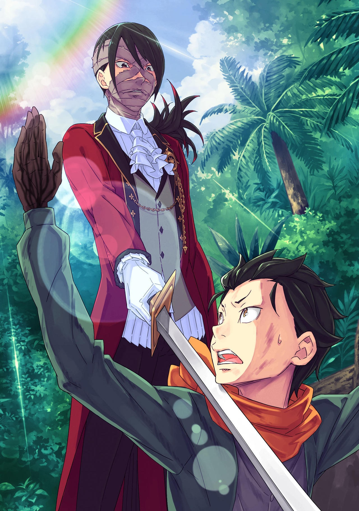

※ ※ ※ ※ ※ ※ ※ ※ ※ ※ ※ ※

Беатрис: ……Слушай внимательно, Субару, я полагаю. С этого момента ты должен понять, что ты всегда на грани смерти.

Субару: Эй, эй, эта маленькая девочка-сама шутит совсем не забавно.

Беатрис: Бетти не маленькая девочка, и это не шутка, я полагаю! Ты должен относиться к Бетти серьезно!

Когда Беатрис сказала это с покрасневшим лицом, Субару кивнул со словами “Понял, понял".

Он сидел на пятнистом ковре, поджав под себя ноги, в середине лекции от Беатрис-сенсея, которая скрестила свои короткие руки, но это просто никуда не вело.

В основном это было из-за того, что Субару вмешивался в лекцию между короткими паузами, но……

Субару: Это все из-за привлекательности Беако. Это нехорошо……

Беатрис: Бетти думала, что ты наконец-то сделал серьезное лицо, но о чем ты говоришь!? ……Ну, общеизвестно, что Бетти симпатичная, так что сейчас с этим ничего не поделаешь, я полагаю……

Субару: Твой индекс -дере возрос сразу после того, как мы закончили мероприятие……

Беатрис: Ты заходишь слишком далеко, вытаскивая ковер из-под Бетти!

Беатрис топнула ногой по земле, давая ему понять, что она злится. Ее нынешнее отношение выглядело так, как будто оно не изменилось с прежнего, но, с другой стороны, чувства Субару были в значительной степени другими.

До сих пор они часто конфликтовали из-за своих идей и мнений, и у нее сложилось впечатление котенка, живущего по соседству, которому нелегко к нему привыкнуть. Однако для Субару нынешней Беатрис была……

Субару: Как очаровательная домашняя кошка, с которой я хочу провести время, уткнувшись лицом в ее живот.

Беатрис: Отнесись! К Бетти! Серьезно! Я полагаю!

Субару: Вааваргхт!

Пробормотав это с глубоким волнением, он был затем отправлен в полет Беатрис, которая протянула к нему руку. Когда он прислонился к стене, прежде чем рухнуть на пол, Беатрис раздраженно пожала плечами.

Беатрис: Не заставляй Бетти повторяться. Важно об этом поговорить, я полагаю. Это действительно что-то очень опасное, чтобы пропускать это мимо ушей. ……Проблема с твоими Вратами, я полагаю.

Субару: ……С моими Вратами.

Он резко приподнялся и уселся, скрестив ноги, прямо на том месте, где упал.

Нежно прижав руку к груди, он подумал об органе, который находился внутри…… о чем-то, чего он не мог видеть своими глазами, но и не мог к нему прикоснуться.

Врата были важным органом, который существовал внутри живых существ и использовался для использования магии в мире, идеи которого отличались от здравого смысла Субару. Независимо от того, было ли это приличного качества или нет, очевидно, это было связано со способностью человека быть пользователем магии, и в случае Субару качество его Врат было не очень хорошим.

“Было”, потому что его Врата уже были потеряны и исчезли.

Беатрис: Если быть точным, ты не потерял их. Ты их сломал, полагаю.

Субару: Все потому, что я использовал их безрассудно, даже после того, как мне сказали не использовать магию. Ну что ж, в следующий раз, когда я увижу Ферриса, я получу гораздо больше, чем просто огромный нагоняй. Я зашел дальше и испортил все лечение, которое он мне обеспечил.

Беатрис: Поздравляю с твоими новообретенными заботами, я полагаю…… “Следующий раз” не гарантирован.

Это было результатом полного игнорирования совета Ферриса, который отвечал за восстановление Врат Субару, которые были напряжены от чрезмерного использования. Он съежился от страха, будучи уверенным, что Феррис рассердится на него со свирепостью Демона Они, но взгляд Беатрис означал, что ситуация серьезнее, чем казалось.

Беатрис: В результате твоих сломанных Врат ты не сможешь должным образом высвобождать свою ману, я полагаю. Даже при этом мана будет продолжать вырабатываться или поглощаться до тех пор, пока ты жив, продолжая накапливаться в твоем теле. Но, потому что у тебя нет способа вытащить её наружу……

Субару: Ты же ведь не скажешь, что я наполнюсь маной и разорвусь на части?

Беатрис: …………

Субару: Чего, Беатрис-сан!? Мне страшно когда ты так замолкаешь!

Субару повысил голос, когда она отвела глаза, замолчав с беспокойным выражением на лице. Видя, что он выглядит так, как будто наконец-то обратил серьезное внимание на то, что она должна была сказать, Беатрис подняла палец со словами “Послушай”

Беатрис: Без шуток, твое восприятие этого верно. Если так пойдет и дальше, твое физическое состояние ухудшится из-за маны, которая постепенно будет накапливаться в твоем теле, и ты в конечном итоге сделаешь “бум” от мутной маны, я полагаю.

Субару: Так страшно! Есть ли способ что-то с этим поделать!?

Беатрис: Вот тут и появляется Бетти. К счастью, Бетти заключила с тобой контракт…… Субару и я связали друг с другом наши души, я полагаю. Как и сказала Бетти, Бетти немного отличается от других Духов и требует получения маны от других людей. Это означает……

Субару: ……Ты будешь делать что-нибудь с маной, которая накапливается в моем теле, для меня!

Услышав идею Беатрис, похожую на хоумран, который изменил ход бейсбольного матча, Субару энергично встал и поднял ее маленькое тело на руки.

Он продолжал держать ее в воздухе, когда она закричала “Ниа, ниа!?”, начав кружиться на месте

Субару: Ты потрясающая, Беако! На самом деле, я так многим обязан твоему существованию, что чувствую, что не могу стоять с тобой на равных! С этим мы находимся в одной лодке как в названии, так и в реальности!

Беатрис: Это не может быть решено так просто, я полагаю! С этого момента ты должен помнить, что каждый раз, когда ты испортишь настроение Бетти, твоя жизнь будет такой же хрупкой, как пучок пены. Если ты не хочешь умирать, продолжай вкладывать свое сердце и душу в то, чтобы быть на хорошей стороне Бетти, я полагаю.

Субару: Хех, так ты говоришь мне, чтобы я продолжал отдавать все силы, чтобы быть нежным с тобой. Во всяком случае, это зависит от того, как долго ты сможешь оставаться такой впечатляющей и ослепительной. Это большая ответственность на твоих плечах, Беако.

Беатрис: Почему Бетти должна была говорить такое! Я не могу в это поверить, я полагаю!

Субару продолжал кружиться, слушая крики раскрасневшейся Беатрис, все еще держа ее на руках.

Кружились вокруг, круг за кругом.

Круг за кругом, за кругом и за кругом……

△ ▼ △ ▼ △ ▼ △

И вот, ощущение того, что его поле зрения кружилось, внезапно прекратилось, а его сознание пробудилось.

Агония, которую он испытывал незадолго до этого, нечто похожее на чувство утопления, исчезло без предупреждения, и Субару охватила боль от несбалансированного ритма его дыхания, а также от земли, которую он чувствовал на спине.

Субару: ……Кх, аагх, хгх

Он сел, потирая горло, вспоминая, что с ним случилось.

В то же время, когда он взглянул в центр своей груди, он не увидел стрелу, которая должна была торчать оттуда. Кроме того, царапины, которые он получил царапая свое тело о деревья, также исчезли.

Вполне естественно, что все так обернулось. Его грудь была пронзена этим единственным, страшным ударом.

Субару: Я… умер…

Испытывая смутное ощущение, будто земля уходит у него из-под ног, кровь Субару похолодела, когда он вздрогнул.

Что касается событий, которые привели к этому, он был поглощен черной тенью в Сторожевой башне Плеяд, и всего через несколько десятков минут после того, как его увело оттуда…… это все, что потребовалось Субару, чтобы потерять свою жизнь.

Он снова осознал серьезность своего положения и встал. Каким-то образом ему удалось поддержать свое неустойчивое тело, Субару огляделся вокруг.

Затем……

Субару: Черт… как же это херово……

Убедившись, что он находится посреди зеленой, поросшей травой равнины, которая простиралась далеко и широко, а также увидев, что фигуры, которую он хотел бы оставить с ним, нигде не было, Субару проклял свое несчастье.

Без сомнения, это были луга, куда он и двое других были отброшены с башни.

Проблема заключалась в том, что он не мог найти Рем, которая была отправлена сюда вместе с ним, и Луис которую тоже не было видно. Подводя итог, можно сказать, что момент времени, когда он «Посмертно Возвратился», был……

Субару: После того, как Рем задушила меня и я потерял сознание ……!

Его точкой перезапуска было время после того, как он потерял сознание, задушенный Рем, которую он нес на спине.

Это не вернуло его достаточно далеко, чтобы сделать так, чтобы пробуждение Рем никогда не произошло, и это также не привело к тому, что его последний цикл в Сторожевой башне Плеяд не перестал существовать. Это само по себе было тем, что Субару считал хорошей новостью.

Или, если бы он смог вернуться к последнему циклу в башне, то он смог бы обменяться словами с пропавшей Рем, хотя эта надежда, была такой мимолетной……

Субару: Я что дурак? Нет, я дурак.

Если он до такой степени испытывал чувство сожаления, ему следовало уделять ей больше времени, пока он еще мог позволить себе вступить с ней в контакт, пока у него еще было время поговорить с ней, и пока он все еще был удостоен возможности выслушать ее о том, что она чувствовала.

Нацуки Субару, который этого не сделал, не имел права так причитать.

Во всяком случае, прямо сейчас……

Субару: ……Надо найти Рем.

Он должен был преследовать Рем, и прояснить ее недоразумения.

Если причиной побега Рем была окружавшие его миазмы Ведьмы, то, поскольку он только что «Посмертно Возвратился», то интенсивность запаха, вероятно, стала ещё сильнее.

Весьма вероятно, что она будет прислушиваться к его словам еще меньше, чем раньше. Однако один год, проведенный Нацуки Субару, не был таким уж бессмысленным, до такой степени, что он отказался бы от нее из-за чего-то подобного.

Субару: Кроме того, тот, кто убил меня…… Навряд ли этот выстрел стрелой был атакой Рем.

В худшем случае Рем нападет на него, и такая возможность существовала, но он не мог представить, что она сможет собрать материалы, необходимые для этого, за такое короткое время.

Более того, лук и стрелы были чем-то, что нельзя было приготовить так легко и быстро.

Субару: У стрелы, которая вонзилась в меня, был наконечник, и к ней также были прикреплены перья…… Я не почувствовал сильной боли, вероятно, потому что мне попали прямо в сердце……

Если бы Рем была поражена мощной стрелой, выпущенной из лука, у нее не было бы ни единого шанса противостоять ей, даже с ее силой.

Поскольку она не могла свободно передвигаться на ногах, ей было бы трудно сбежать. При любом риске Субару должен был спасти ее из этого места, прежде чем она станет жертвой стрелы.

Даже если страдающая амнезией Рем не считала его своим союзником.

Субару: Пора идти, Нацуки Субару. ……Покажи им, каким великим ты можешь быть.

Похлопывая себя по щекам, он временно выбросил из головы потрясение от «Смерти», которое он испытал только что, и печаль, которую он испытывал из-за того, что он не нравился важной для него девушке. Было неизвестно, сможет ли он присоединиться к ней, даже если найдет ее, но найти ее было важнее всего остального.

Скорбь и гнев — то, что можно и надо делать при жизни.

Субару: …………

Глубоко вздохнув, точно так же, как он делал это раньше, Субару последовал за следами, по которым, как он решил, следовала Рем, судя по траве, которая клонилась вниз, и прыгнул в лес.

Однако он не определился с решением, должен ли он повышать голос, ища ее, или нет.

Инициирование стрелы, вероятно произошло потому, что враг столкнулся с Субару, когда он был беззащитен.

Кем бы они ни были, но было трудно думать о них как о дружелюбных людях, поскольку они стремились убить его одним ударом. Если они найдут его, то это обойдется «Смертью» для него. Поэтому он должен рассматривать их врагов.

Субару: Но, так как они используют инструменты…… лук и стрелы, это не Зверодемоны, а человек.

Если его противник был человеком, то был шанс, что он может выйти из этой ситуации, не пытаясь убить друг друга, а просто провести с ним переговоры. Хотя он не знал, сядет ли он за стол переговоров для начала.

По большей части, из общего количества раз, когда Субару «Посмертно Возвращался» до сих пор, процент его смертей, вызванных людьми и Зверодемонами, казался слегка склонным к людям.

То, что его противник был человеком, который мог понять, что он говорит, не означало, что он думал, что сможет слепо установить дружеские отношения между ними.

Он действительно думал, что вероятность найти Рем увеличится, если будет больше людей, которые ищут ее, но……

Субару: ……Кор Леонис.

Закрыв глаза, Субару отогнал свои бессвязные мысли, активизируя Полномочие, покоящуюся в нем самом.

Совершенно новая сила, продемонстрировавшая свою жестокость в Сторожевой башне Плеяд, «Кор Леонис» был навыком исследования, который позволял ему определять местонахождение своих товарищей, тех, кто будет поддерживать «Маленького Короля».

Используя это, Субару отчаянно цеплялся за надежду, что сможет определить, где находится Рем.

Однако……

Субару: ……Ничего хорошего, нет никакой реакции. Она могла уйти далеко от меня, или, если это…. потому, что она не считает меня своим союзником?

Мало что было известно о точном радиусе действия «Кор Леонис», но Субару не видел бледного света, который указывал на его союзников в области, где сработала способность.

Размышляя о причине невозможности определить их местоположение, Субару придумал расстояние между ними и свои отношения с ними.

Эмилия и другие когда-то были мишенями его воздействия, но в настоящее время он вообще не мог их воспринять. Даже если он лично знал и Рейда, и «Чревоугодие», он также не мог знать их местонахождения.

Он, безусловно, смог убедиться в активации «Кор Леониса».

Если бы он сказал это, его союзный радар был включен, хотя и находился в неактивном состоянии. Причина, по которой это стало так, заключалась в том, что Эмилия и другие находились за пределами его действия, а Рем, которая должна была находиться в пределах его действия, не относила Субару к своей категории союзников.

……Тот факт, что он также не знал, где находится Луис, которая действовала с Рем, подтверждал его теорию.

Субару: Я ни за что не буду относиться к ней как к союзнику. Вот почему она не появится на моем радаре несмотря на мою одностороннюю любовь к Рем.

Подойдя к этому моменту, Субару пожалел о плохом общении, которое произошло, когда он вошел в контакт с Рем.

Поскольку он был окутан миазмами Ведьмы, он не был уверен, какие слова, которые он мог бы сказать, могли бы завоевать ее доверие. Несмотря на это, даже если бы он был лживым, он не мог сказать ничего, касающегося защиты Луис или того, чтобы привести ее с собой.

Субару: Чёрт, ну почему…… !? Рем наконец-то… наконец-то проснулась, так почему я должен……

Играть с ней в такого рода прятки?

Он с нетерпением ждал того дня, когда Рем сможет встать и свободно передвигаться на своих двух ногах, но когда она действительно пришла в движение вот так, Субару не мог не возмущаться.

Если подумать о том, кого он должен ненавидеть в результате всего этого, того кто все это натворил, то это заставило его гнев вспыхнуть на Архиепископов Греха «Чревоугодия», в том числе и Луис.

Субару: …………

Держа в голове мысли, которые ходили по кругу, Субару осторожно шел через лес.

Он держал свое тело опущенным во время ходьбы из-за человека, который однажды убил его…… он назвал бы его «Охотником», поскольку это было более удобно, но это была отчаянная мера, которую он предпринял, чтобы избежать контакта с охотником.

Субару подумал, что ему следует сделать что-то большее, например, растереть лицо грязью, замаскировать одежду листьями и наложить на себя камуфляж, но, к сожалению, он не мог тратить свое время на эти вещи.

Если бы он, по крайней мере, точно знал, сколько времени прошло после того, как он расстался с Рем, его поиски хоть к чему-то привели бы.

Субару: Думай, думай… Только в такое время я могу использовать свою умную голову. Рем все забыла и не помнит. Но у нее все еще есть способность удерживать меня и чувствовать миазмы Ведьмы. Значит, у нее отсутствуют эпизодические воспоминания.

«Амнезия» часто появлялась в манге и играх, но в большинстве случаев амнезия, описанная в этих произведениях, соответствовала отсутствию так называемых эпизодических воспоминаний.

Это было то же самое состояние, что и Субару, который однажды потерял свои воспоминания в башне в результате столкновения с «Чревоугодием»…… нет, Субару потерял только свои воспоминания, которые появились после прибытия в другой мир, так что Рем точно не была в том же состоянии, что и он, но было что-то похожее на это.

Другими словами, она была в состоянии, когда знала названия вещей, и она также помнила рефлекторные действия, впитанные в ее тело, но потеряла воспоминания о своем собственном имени и именах других людей, а также любые детали, которые были связаны с ее воспоминаниями о времени, проведенном с ними.

Доказательство того, что Рем назвала себя «Я»* и инстинктивно насторожилась от Субару из-за запаха, было доказательством этого.

*Рем никогда не звала себя «я», а говорила о себе своим именем.

Субару: Она, должно быть, в замешательстве. Она не может вечно убегать. Если она в какой-то степени отделилась от меня, то у нее будет время успокоиться и поразмыслить о себе. Тем более, если она взяла с собой Луис.

С его стороны было глупо молить о таком, но он просто хотел пожелать, чтобы Луис была большим препятствием и помешала Рем сбежать.

Закидывая истерики, иногда отказываясь ходить и продолжая доставлять Рем много неприятностей, у него в конечном итоге появился шанс догнать Рем, если бы это произошло.

Или, если бы Рем бросила ее.

Если Луис станет слишком неподконтрольной для Рем, это было бы тоже……

Субару: ……Хотя я не знаю.

Он не знал, бросит ли Рем Луис, видя, что она, по крайней мере, выглядела как беспомощный младенец.

Потеряв свои эпизодические воспоминания и став в некотором смысле никем, можно сказать, что Рем не имела комплекса неполноценности, который у нее был от взаимодействия с Рам, или установления своей собственной личности.

Несмотря на потерю существования Рем, было ненормально, как Рам могла оставаться стабильной без каких-либо изменений. Он задавался вопросом, случится ли то же самое с Рем.

Она не была сестрой Рам, ее комплекс неполноценности и гордость как члена Клана Они не имели к ней никакого отношения, и она ничего не думала о Нацуки Субару. Эта Рем.…

Субару: ……кх!

Как только он вообразил это, Субару почувствовал жжение в груди и сделал большой, мощный шаг вперед.

Ветки, на которых он выплеснул свои эмоции, наступив на них, заскрипели, прежде чем сломаться, и он наклонился вперед, обходя высокую траву, которая стояла перед ним, чуть не поскользнувшись на грязной земле

Субару: ……А?

Неожиданно лес открылся в другую местность, и Субару обнаружил, что вышел из него на другую травянистую равнину.

Думая, что он мог бы ходить по лесу кругами, только чтобы оказаться в том же месте, краска сошла с лица Субару. Однако, когда он внимательно осмотрел местность, он понял, что это не так.

Это было похоже на первые луга, но высота травы под его ногами была другой.

По сравнению с травянистой равниной вначале трава здесь была немного выше. Вдобавок это место было полностью окружено лесом под углом в 360 градусов, но в этом месте был только лес, из которого выбежал Субару.

Перед собой с лесом за спиной он мог видеть большой горизонт между перекатами луга. Небо выглядело ужасно далеким и высоко в воздухе, и иллюзия таинственного ощущения, будто его втягивает в себя, делала землю под ним неустойчивой.

Однако его внимание привлекло не только далекое небо.

Вблизи к нему находилась небольшая открытая площадка, образованная путем разрезания луга, и размещенные там инструменты для кемпинга…… короче говоря, это было признаком того, что кто-то ранее был здесь.

Субару: …………

Мгновенно осторожность расплылась по всему телу Субару, и его поле зрения резко сузилось.

К счастью, на месте, которое он должен был бы назвать простым кемпингом, не было никаких силуэтов. Остались только возможные следы того, что здесь кто-то разбил лагерь, и трудно было думать об этом как о ловушке.

Проблема заключалась в том, кто именно создал этот кемпинг.

Субару: Вероятнее всего, это тот, кто убил меня.… верно?

Он подумал об охотнике, который выловил его. После того, как он отправился на охоту в лес, вероятность того, что он сделает это место своим базовым лагерем, была высока.

Если до этого дойдет, то Субару должен немедленно уехать отсюда и обеспечить свою собственную безопасность.

Встречался ли он с ним в лесу или на равнине, не было сомнений, что охотник был опасным человеком.

Часто говорили, что матаги стреляли в людей случайно, потому что принимали их за оленей, но ошибочно застреливали кого-то, кто искал своих знакомых, громко крича, было просто невозможно, когда Субару принял их навыки во внимание.

Охотник был опасным противником. Ему нужно было заключить это как таковое, прежде чем действовать.

Однако……

Субару: ……Если бы я мог украсть хотя бы один нож.

Для того, чтобы пройти через сплоченные деревья того, что он должен был бы назвать густым лесом, Субару понадобилась помощь инструмента. К сожалению, единственным предметом, который в настоящее время находился в его распоряжении, был кнут, которым он регулярно пользовался…… Хлыст Гилтилоу, изготовленный из материалов могущественного врага.

Его наряд, предназначенный для покорения песчаного моря, вроде как пригодился для покорения густого леса. Тем не менее, его ситуация резко изменилась бы, будь у него хотя бы один инструмент с лезвием, чтобы прорезать себе путь для передвижения.

Следовательно, все могло бы пойти по-другому, если бы он мог получить единственный инструмент, который был бы чем-то вроде этого.

Субару закончил свой короткий период размышлений и направился к территории кемпинга

У него также был выбор немедленно сделать быстрый поворот и вернуться в лес, но, учитывая, что ему было нужно, он не хотел возвращаться туда с пустыми руками.

Обращая внимание на его шаги и окружение, Субару вошел на территорию лагеря.

Субару: Там остались следы от того, что они развели костер, но…… это что, кровать?

Он знал, что в центре лагеря остались следы горящего костра, а также что рядом с ним было что-то похожее на кровать, выложенную скошенной травой. Не было никаких сомнений, что здесь кто-то жил.

Кровать тоже была пуста, и казалось, что в этом районе больше ничего не было, но……

Субару: Если бы я только мог найти нож или что-то такое……

???: ……Хм, значит, тебе нужно лезвие. Что ж, ты появился в нужном месте.

В тот момент, когда Субару бегло осматривал лагерь в поисках инструмента, который он мог бы использовать, он остановился, услышав голос позади себя и почувствовав, как что-то холодное прижимается к его шее.

У него перехватило дыхание, и когда он медленно опустил взгляд, Субару увидел, что объект, поднесенный к правой стороне его шеи, был лезвием меча, прекрасно отполированным и утонченным.

Субару: …………

Затаив дыхание, Субару понял, что дал своему противнику право решать, убить его или оставить в живых.

Однако его голова была в состоянии замешательства из-за того, что с ним разговаривали сзади. …Он был осторожен. Он был осторожен, с расчетами, выброшенными из окна, потому что он был в ситуации, когда его жизнь была на кону.

Конечно, среди сверхлюдей, которые жили в этом другом мире, он знал, что есть люди, которые могут двигаться со скоростью, за которой его глаза не могут догнать, а также есть люди, которые могут даже телепортироваться.

Несмотря на это

Субару: Неужели мне действительно удалось сделать одно из немногих исключений тут, именно в этот момент? ……Насколько я могу быть невезучим?

???: Глупец. Кто сказал, что ты можешь говорить? Ты должен выбирать каждое свое слово с особой тщательностью. Не забывай, что твоя жизнь находится в наших…… моей руке.

Даже когда Субару проклинал свое несчастье, в голосе человека позади него не было милосердия.

Как он и сказали, он, вероятно, немедленно отправил бы его голову в полет, если бы он попытался сделать что-нибудь смешное. Чувствуя несомненное, непреодолимое давление, утверждающее, что все обязательно обернется именно так, Субару отчаянно пытался придумать любые способы, которыми он мог бы совершить прорыв.

Судя по голосу, это был мужчина.

Поскольку он казался довольно молодым, он мог быть примерно того же возраста, что и Субару, или немного старше. То, как мужчина подбирал слова, было странным, но, как ни странно, ему это не показалось странным.

И, больше всего на свете……

Мужчина: Я вижу, ты ломаешь голову в глубоких раздумьях, а рот остается закрытым. Однако ты не думаешь бросить свою жизнь и попытаться нанести ответный удар. ……Хм.

Этот мужчина обладал проницательностью, которая позволяла ему различать внутренние мысли безмолвного Субару.

Казалось, что он что-то задумал, глядя в спину Субару, и его выдох, который звучал так, будто он обдумывал свои мысли, и

Мужчина: Ты одет в том стиле, которого я не замечал в этих местах. Я также не верю, что он подходит для климата Будхейма. Бледные руки и ноги…… ты не из здешних мест.

Субару: Я……у~о

Мужчина: Заткнись. Кто сказал, что ты можешь открыть рот? Если в следующий раз ты вызовешь мое недовольство, я буду смотреть, как ты пытаешься говорить с отрубленной головой.

Мужчина не собирался вступать в разговор. Субару был вынужден осознать это, когда ему на шею нанесли неглубокий порез.

Наряду с болью от покалывания, кровь постепенно пролилась на рану и стекала по его шее, но мужчина еще не закончил осмотр Субару.

Мужчина: Хлыстом на твоем поясе тоже крайне неудобно пользоваться в лесу. Твои руки и ноги тоже немного натренированы, но это не настолько, чтобы поставить тебя в шеренгу волков ……Похоже, ты пришел сюда не в погоне за мной.

Субару: …………

Мужчина: Почему ты замолчал? Если ты не стал объясняться, ты бы предпочел умереть здесь?

Субару: Эээ!? На этот раз мне разрешено говорить!? Разве это не неразумно!?

Когда Субару протестовал против несправедливости этого мужчины, суровый взгляд, сверлящий его затылок, стал более острым.

Субару напрягся, понимая, что сказал что-то ненужное, но жесткость его тела, наконец, ослабла, когда меч на его шее был отведен назад.

Однако

Мужчина: ……Медленно повернись. Если попробуешь сделать что-нибудь подозрительное

Субару: Ты отрубишь мне голову?

Мужчина: Нет. Я отрублю тебе конечности, вырежу твое сердце и сожгу его на твоих глазах.

Субару: Слишком уж злая угроза!

Субару понял угрозу по ее интенсивности, подняв обе руки, и начал понемногу разворачиваться, доказывая, что у него не было намерения контратаковать.

А затем он не торопился, чтобы взглянуть на мужчину, который сумел встать у него за спиной……

Субару: ……Ты серьезно?

……Он столкнулся лицом к лицу с мужчиной перед ним, лицо которого было скрыто за обернутой вокруг него тряпкой.

Иллюстрация к **Ранобэ*** Том 26 | Разукрасил norvakkk

***Судя по всему в ранобэ обёрнутую тряпку заменили на бинто-подобную маску.**

△▼△▼△▼△

Он действительно был странно выглядящим мужчиной.

Его рост был лишь немного выше Субару, а телосложение выглядело слегка стройным. Показывая свои тонкие конечности, когда он стоял, он держал в руке что-то похожее на саблю или рапиру, меч с тонким лезвием, который оставил неглубокий порез на шее Субару.

Его одежда состояла из благородной одежды превосходного качества, и можно сказать, что его стиль был более неуместным, чем внешний вид Субару. Если бы он присмотрелся, то увидел, что тряпка, обернутая вокруг его лица, могла быть и плащом.

Получил ли он травму на лице или просто не хотел показывать свое лицо, было непонятно, почему он носил тряпку на лице……

Мужчина в маске: Что? Что за идиотский взгляд?

Субару: Отложив это в сторону, если ты имел в виду “идиотский вид”, то я родился с этим лицом, так что разве это не считается оскорблением меня…? Есть то и это, но с моей реакцией ничего не поделаешь, особенно после того, как я посмотрел на твою внешность.

Мужчина: в маске: Ты делаешь предположения. Я также смотрю на твое лицо, в настоящее время снова с подозрением, убийца ты или нет.

Субару: Людей не назначают на работу из-за того, как выглядят их глаза! Моя роль — полная противоположность убийце. Я предпочитаю защищаться, а не атаковать.

Не ослабляя бдительности, мужчина…… нет, мужчина в маске продолжал направлять свой меч на Субару.

Отвечая на его голос, который был пронизан сомнением, Субару посмотрел на снаряжение мужчины в маске, а затем на его багаж, который лежал позади него, прежде чем нахмуриться.

Одежда мужчины, плохо подходящая для любого кемпинга или деятельности в лесу, привлекла внимание Субару, но то, что привлекло его внимание больше, чем мешок, лежащий позади него… Субару мог видеть это только как нечто материализовавшееся на поляне без всякого предупреждения, такое же, как мужчина, появившийся за его спиной.

Вдобавок речь шла о снаряжении мужчины в маске. ……У не было ни лука, ни стрел.

Субару: ……Похоже, ты не охотник.

Мужчина в маске: Охотник?

Субару: Это личное дело. Между прочим…… способен ли ты делать такие вещи, как мгновенно преодолевать расстояние или становиться невидимым… что-то в этом роде?

Мужчина в маске: …………

В тот момент, когда он задал вопрос, черные глаза мужчины, которые можно было видеть из щели в его маске, сузились.

Однако реакция мужчины в маске не была ни гневом, ни мыслью о том, чтобы выгнать его, это была реакция, показывающая, что он проявляет интерес к Субару.

На самом деле, когда мужчина тихо вздохнул со словами “Ха”

Мужчина в маске: Почему у тебя возникла такая идея? Изложи свою аргументацию.

Субару: ……Я был осторожен в своем окружении, прежде чем подойти ближе к этому месту, на всякий случай. Конечно, я знаю, что есть масса людей, которые могут пробиться сквозь что-то столь же слабое, как моя осторожность, но ты не один из них.

Мужчина в маске: Почему же?

Субару: Я хочу, чтобы ты послушал не сердясь на меня, но у меня было много возможностей случайно встретить кучу опытных людей, или того, кого ты бы назвал сверхлюдьми. Сравнивая тебя с этими сумасшедшими парнями, я чувствую, что ты…эээ, обычный.

Если бы он разговаривал с воином, то, что он сказал, определенно оскорбило бы его.

Тем не менее, именно это почувствовал Субару после разговора с мужчиной в маске. Он заметил, что мужчина перед ним, несомненно, мог использовать меч, но его навыки были средними, так как он достиг этого уровня после определенного количества тренировок.

Глядя на него глазами Субару, который знал таких людей, как Райнхард, Гарфиэль, Вильгельм и Юлиус, он мог сказать, что мужчина в маске был хуже, когда он сравнивал их наравне.

Субару: Если это так, то теория о том, что ты попал сюда за пределами моего восприятия, будет недействительной. Что остается, так это возможность того, что ты мгновенно сократил дистанцию и появился позади меня, или если это не так……

Мужчина в маске: Либо я исчез из поля твоего зрения, применив «Маскировку».

Субару: ……кх!?

Вскоре после этого Субару вздрогнул от удивления, когда мужчина исчез из его поля зрения, несмотря на то, что стоял перед ним.

Однако его удивление на этом не закончилось.

Субару: Ты исчез… но ты прямо передо мной?

Мужчина в маске: ……Ты прав. «Маскировка» не может устранить даже моего присутствия.

Как он и думал, этот мужчина исчез не в том смысле, что исчез, а только в том смысле, что стал невидимым. И тот факт, что он вернулся из этого состояния в тот момент, когда ответил на вопрос Субару, означал……

Субару: Она прерывается, если ты касаешься кого-то, или они узнают о тебе?

Мужчина в маске: Это идеальный инструмент, чтобы задержать дыхание и спрятаться.

Сказав это, мужчина в маске опустил меч, которым он указывал на Субару, и направил его на край кемпинга. Он нацеливал его туда, где лежал его мешок.

Мужчина в маске: Кровать — приманка. Я затаил дыхание там, совсем немного подальше от неё. Я видел, как ты пробрался сюда с самого начала. Каким ты был нелепым.

Субару: Глядя со стороны, люди выглядят очень глупо, когда они настороже…… подожди, сейчас это не важно! Ты опустил свой меч, так что это означает……

Мужчина в маске: Ты не мой преследователь. Я понятия не имею ни о том, как, ни о твоих мотивах, но ты, должно быть, заблудился. Если так, то у меня нет причин сурово осуждать тебя за это. И мне не нужно преподавать тебе урок этим клинком.

Как будто показывая, что он не собирался сражаться, мужчина в маске убрал обнаженный меч обратно в ножны на поясе. Увидев это, напряжение в теле Субару наконец смягчилось.

В тот момент, когда он расслабился, он вспомнил о своей первоначальной цели.

Субару: Ах, не время успокаиваться. Эй, извини за все эти вопросы, но ты видел девушку с синими волосами? Она заблудилась где-то здесь.

Мужчина в маске: Синими волосами? Нет, не видел. Скорее, направляясь в это место, первое, что я увидел, было твое лицо. Что ты собираешься делать?

Субару: Что я собираюсь делать!? Что я собираюсь делать…… черт, и здесь тоже не повезло. Эй, может быть, ты сможешь мне помочь найти……

Мужчина в маске: …………

Субару: Да, как я и думал……

Ему не удалось получить свидетельские показания, и его последнее средство, полагающееся на веревку человеческих отношений, также было обрублено у него на глазах.

Субару получил ледяной взгляд мужчины в маске, похожий на нож до такой степени, что он мог порезать все, что касалось его, в качестве ответа на его просьбу. Так, чтобы вернуть потерянное время, он попытался вернуться в лес

Мужчина в маске: Стой. Если бы вы были разделены в этом лесу, то воссоединение не было бы таким легким делом. Хотя, я считаю, что лучший курс действий для тебя — расставить приоритеты в своем выживании?

Субару: …… Извини, но у меня нет ни малейшего шанса. Просто она важнее моей жизни. Я воссоединюсь с ней, чего бы это ни стоило. Нет, мне нужно отвезти ее домой.

Мужчина в маске: Важнее твоей жизни, хах. Если отбросить бардовскую поэзию певиц, я могу представить это как пустые слова, только если слышу их на самом деле. Но мне это не интересно, но что интересно, так это твои глаза.

Когда интенсивность взгляда Субару обострилась из-за того, что мужчина высмеивал его безрассудство, мужчина точно указал пальцем на его глаза.

Когда Субару отступил, думая, что он собирается выколоть его глаза, мужчина в маске усмехнулся ему

Мужчина в маске: Это глаза, которые не лгут и не клевещут. Я не знаю, останется ли это прежним, когда на кону будет стоять твоя жизнь, но в данный момент кажется, что ты, по-видимому, не выстраивал никаких слов обмана.

Субару: Ну да.… и что? Если то, что я сказал, было правдой, тогда

Мужчина в маске: ……Это более или менее заинтересует меня. И я позволю тебе позаимствовать мой интеллект.

Мужчина в маске постучал пальцем по области вокруг своего виска.

Слушая его ответ, Субару подумал, что ему следует просто крикнуть мужчине: “Хватит валять дурака!”, но любые резкие замечания, подобные этому, не вырвались у него из горла.

Было странно, но он не мог найти никаких подозрений, в которых он мог бы обвинить этого мужчину. ……Нет, этот мужчина был подозрительным. Однако у него была убедительность, которая пересилила ее.

Скорее всего, это было следствием прирожденной харизмы, которой он обладал.

Мужчина в маске: Опиши подробности того, что именно произошло. Я придумаю способ ее найти.

Субару: ……Меня и ее внезапно перебросило сюда.

Прежде чем он осознал это, Субару начал медленно и неуклонно отвечать на вопрос мужчины.

Не то чтобы он действительно верил в этого парня или доверял ему. ……Просто он был в таком отчаянии, что хватался за соломинку. Когда он чувствовал себя так, ему хотелось на кого-то положиться, даже если они были менее надежны, чем куча соломы.

Может быть, дело было именно в этом.

△▼△▼△▼△

Мужчина в маске: Ты был небрежен.

Таким образом, после того, как Субару закончил объяснение своих обстоятельств, первые слова мужчины в маске в ответ были резкими.

Как и просил его этот мужчина, Субару дал четкое описание того, что произошло между ним и Рем…… опустив сложную ситуацию, которая также окружала их.

Он сказал ему, что воспоминания Рем были перемешаны, и что она сбежала после того, как вырубила его. И он также включил роль, в которой она играла вместе с опасной маленькой девочкой.

Субару: Знаю. Я знаю, я был большим идиотом. Но ты не остановишься на этом… верно? Разоблачение моего недавно приобретенного темного прошлого, и высмеивание меня под самый конец……

Мужчина в маске: Глупец. Как бы я мог потратить свое драгоценное время на то, чтобы высмеивать такого шута, как ты? ……Эта девушка, она в какой-то степени способна думать на ходу, да?

Субару: А… аа… может быть.

Напуганный воздухом, исходящим от мужчины в маске, Субару правдиво кивнул.

Как разносторонняя горничная, Рем играла активную роль в различных моментах повседневной жизни, но такую оценку нельзя было получить, просто обладая умением выполнять домашнюю работу.

Определение способностей разных людей и размещение их там, где это было бы уместно для них, прежде чем позволить им действовать.

……Даже во время драки она предсказывала его движения и двигалась синхронно с ним, несмотря на то, что он ничего не говорил, чтобы вызвать это.

Рем была умна. Даже если бы ее воспоминания были потеряны……

Мужчина в маске: Если это так, вполне вероятно, что против тебя составили заговор.

Субару: З-заговор против меня? Ты хочешь сказать, что меня обманули? Это… Я не……

Мужчина в маске: В этом случае проблема не в том, есть ли у нее воспоминания или нет. Важно то, что девушка осознает, что ее преследуют, и у нее есть возможность придумать то и это против своего преследователя. Например……

Прервав здесь свои слова, мужчина в маске уставился на Субару с головы до пят своими черными глазами.

Почувствовав, что его бездумность подвергается критике, Субару притянул к себе плечи.

Глядя на Субару, мужчина в маске сузил глаза

Мужчина в маске: Например, что-то вроде того, что она намеренно оставляет следы на лугах, чтобы скрыть направление, в котором она убежала.

Субару: …………

Мужчина в маске: Ты, должно быть, был очень встревожен после того, как очнулся от потери сознания. Когда ты почувствовал, что тебе нужно найти ее как можно скорее, что бы ты сделал, если бы там были шаги, которые потенциально указывают на направление её побега?

Пылкий и нетерпеливый, Субару бежал по следам, как дворняга.

Это было тем, что произошло на самом деле, и это было ответом на насмешливый взгляд мужчины в маске. Конечно, он мог возразить, сказав, что это не так, но……

Субару: …… Разумеется, я не смог найти больше следов в лесу, идущих от входа. Но я подумал, что это потому, что тропа была неустойчивой и по ней тяжело идти……

Мужчина в маске: Ты не отводишь глаз от неудобной для себя правды.

Субару: Я давно знал, что я глуп и идиот. Просто у меня есть талант к адаптации и сила воли, что-то я нахожусь на одной волне с другим мной.

Даже если это не можно было передать словами, Субару все равно ответил мужчине в маске таким образом.

По правде говоря, предположения этого мужчины имели большой смысл. Оглядываясь назад, он понял, что следы, оставленные на траве, казались слишком “очевидными”.

Среди диких животных, таких как лисы и кролики, были такие, которые преднамеренно оставляли следы и прыгали в пучок травы на полпути, используя приемы, сбивающие с толку их хищников.

Следы, оставленные Рем на траве, были такими же, что, если это была хитрая ловушка, чтобы обмануть его?

Субару: Она заставила меня пойти в другом направлении, а вместо этого пошла другим путем……?

Мужчина в маске: В этом случае направление, которое ты выберешь, часто будет прямо противоположным. Разумно выбрать метод, при котором она могла бы держаться как можно дальше, учитывая ее душевное состояние. ……Ты понял?

Субару: ……Это расстраивает, но я понял. Проклятье! Эта Рем!

Как и сказал мужчина в маске, если Рем намеренно оставила видимые следы в качестве приманки, была высокая вероятность, что она сбежала в противоположном направлении.

Однако, если Субару удастся хорошо угадать ее действия и отправиться в лес с другой стороны, он мог бы придумать что-нибудь, чтобы поймать ее. Он чувствовал себя злодеем, но……

Субару: Я привык производить на других плохое первое впечатление из-за таких вещей, как запах моего лица и тела. Я обязательно ее догоню!

Мужчина в маске: Какое резвое настроение. ……Вот, возьми это с собой.

Субару: Уэ!?

Встав, когда Субару попытался броситься прочь в поиски, не в силах больше стоять на месте, мужчина в маске бросил в него что-то после того, как сунул в руку мешок с его вещами.

Когда Субару посмотрел на то, что только что поймал руками, он увидел, что это был небольшой нож, вложенный в кожаные ножны.

Когда он широко раскрыл глаза, мужчина в маске пожал плечами

Мужчина в маске: Это не тот лес, с которым можно столкнуться с одним хлыстом. Используй его в меру своих возможностей.

Субару: Я очень благодарен за это, но…… ты уверен? Я не могу сейчас ничего сделать взамен.

Мужчина в маске: Я не возражаю. Иногда мне хотелось бы быть тем, кто дарит что-то другому. Или ты попытаешься лишить меня всех моих вещей с помощью ножа?

Это звучало так, как будто он шутил, но это было правдой, что он дал Субару возможность осуществить это.

Мужчина в маске обладал определенными навыками, но нельзя было сказать, что у Субару не было шансов против него, каким бы тонким нож ни был. В этом смысле действия этого мужчины были сродни азартной игре.

Однако……

Субару: ……Меня зовут Нацуки Субару. Это, несомненно, мой долг перед тобой. Я обязательно отвечу за оказанную мне услугу. Я не собираюсь делать ничего неблагодарного.

Крепко закрепив нож, который он получил на поясе, Субару низко поклонился. Глядя на это, мужчина в маске издал небольшой смешок со словами: “Хм”

Мужчина в маске: Я уже указал тебе путь. Заканчивай с этим и уходи. Любыми способами ты должен приложить все усилия, чтобы завоевать доверие сбежавшей девушки.

Субару: Полностью согласен. Спасибо за помощь! Ой, подожди, вот и всё, но…

Мужчина в маске: Что такое?

Помахав рукой, чтобы выразить свою благодарность, Субару остановился прямо перед тем, как броситься в лес. В голосе мужчины в маске был намек на раздражение из-за того, насколько он был занят, но Субару указал пальцем на лес перед ним

Субару: Я прохожу здесь, чтобы вернуться к лугам, где я был, но тебе не следует идти по этому пути. Здесь есть устрашающий охотник. Они будут пытаться убить тебя издалека из лука, поэтому, сколько бы у тебя ни было жизней, этого будет недостаточно против них. Если ты куда-то собираешься, рекомендую тебе обойти лес.

Мужчина в маске: …… Понятно. Я понял. Буду иметь ввиду.

Субару: Да, пожалуйста, имей ввиду. ……Увидимся!

Услышав ответ мужчины в маске, Субару удалось предотвратить немедленное убийство своего благодетеля охотником, избежав потенциальной ситуации, которая оставила неприятный привкус во рту.

А затем, мчась в лес так быстро, как только мог, он изо всех сил побежал к первому лугу.

Субару: Он отлично режет!

К счастью, Субару без труда вернулся на первые луга.

Это произошло потому, что нож, который он получил от мужчины в маске, имел острый край, что давало ему огромный стимул срезать ветки и листья, преграждающие ему путь.

Обычно, когда дело дошло до такого ножа, казалось, что его лезвие будет сильно повреждено, если им придется злоупотреблять, но он не чувствовал подобных неудобств. Возможно, это может быть отличный клинок высочайшего качества.

Субару: Его одежда тоже выглядела довольно дорогой. Кем именно был этот парень……?

Раздумывая над этим, Субару с большой поспешностью вернулся на прежние луга. После этого, когда он обыскал местность, где его вели в противоположную сторону……

Субару: ……Нашел. Это должно быть они.

Только что, по другую сторону следов, выставленных напоказ, Субару обнаружил несколько неровных следов, оставленных на траве. Похоже, Рем изо всех сил старалась стереть следы, но очень вероятно, что она могла стереть только свои собственные и не могла полностью стереть следы Луис.

Поскольку следы усилий, которые были приложены для удаления следов, были там, было неправдоподобно думать об этом как о дополнительной ловушке.

Что означало……

Субару: Наконец-то я кое-что узнал о тебе, Рем……!

Хотя раньше он стеснялся этого, он произнес слова, которые заставили его прямо звучать, как злодей, бегая так быстро, как только мог, преследуя метки, которые стали его недавно обнаруженным признаком местонахождения Рем.

Следы, ведущие к входу в лес, были такими же, как и в прошлый раз. Однако замаскировать сломанные ветки у входа и следы в грязи не удалось.

Субару: Нашел! Если я использую это……

«Я могу догнать Рем», — подумал Субару, с нетерпением пытаясь отследить следы в грязи.

Это было в следующий момент.

Субару: ……кх!

Когда Субару обратил внимание на следы, под его ногами разорвалась привязанная лоза. Отдача заставила ветку, которую она поддерживала, вылететь в его сторону, и мощный удар поразил его сбоку.

Субару: Гха, ооф

Получив горизонтальный удар от ветки толщиной с его руку, Субару был отправлен в полет на большое расстояние. Из него вырвался крик боли, когда он покатился по грязи, не в силах встать от удара.

Его видение вспыхивало и металось между светом и тьмой, и после неожиданной атаки, которой он не ожидал, сознание Субару закружилось, как вращающийся свет полицейской машины от боли и шока.

Субару: П-прямо сейчас, может ли это быть……

Когда через некоторое время боль утихла, Субару наконец встал на месте. Хотя он знал, что это повлияло на его колени, и он также знал, что огромное количество внутренних повреждений было нанесено на стороне его тела.

Однако его шок расширился.

Субару: ……Ловушка?

Хотя она и убегала, она не закончила бы это простым побегом.

Несмотря на то, что она потеряла память, она могла напрячься в полной мере. Вот какой страшной была эта девушка……Рем может быть.

Нацуки Субару, наконец, осознал это.

……Что это было началом его второй настоящей битвы с Рем с тех пор, как он прибыл в этот мир.

※※ ※ ※ ※ ※ ※ ※ ※ ※ ※ ※ ※
