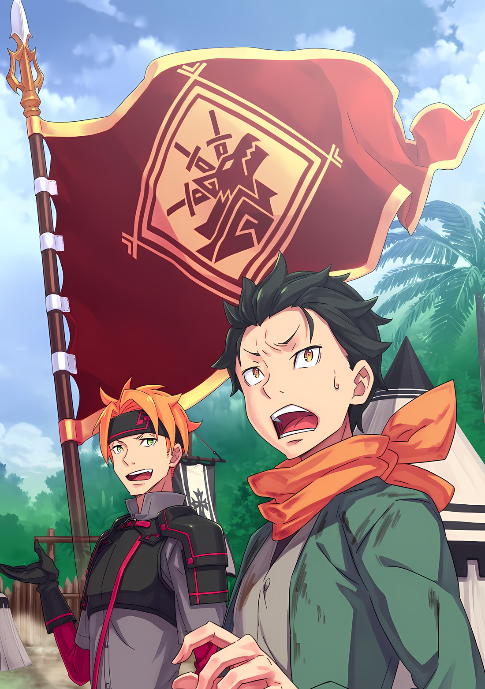

???: Эй, какая у тебя была самая худшая ситуация, как странствующего торговца?

???: И вот он. Еще один неприятный вопрос……

Пока Отто в своей комнате разглядывал документы, Субару задал у него этот вопрос, заставив его нахмуриться.

К тому моменту морщины уже были меж его бровей, но благодаря вопросу Субару они проявились на все сто.

Субару: Понимаешь, мы с Гарфиэлем немного болтали о путешествиях в одиночку. Я предполагаю, что в твоем случае это немного другое, но ты был странствующим торговцем, так что ты знаком с подобными вещами, верно?

Отто: Я бы не сказал, что ты не прав, но, по крайней мере, у меня был с собой Фуруфу. Благодаря моей Божественной Защите у меня всегда был кто-то, с кем я мог поговорить, так что на самом деле мне не казалось, что я путешествую один.

Говоря это, Отто потер глаза и положил документы на стол. Затем, стоя перед столом, на котором лежала гора бумаг, он перевел взгляд на двух гостей, которые сидели на диване с разложенной между ними доской Шатранджа*… …Субару и Гарфиэля.

*Шатрандж — предшественник шахмат.

Отто: …Гарфиэль, передвинь торговца на две клетки вперед.

Субару: Ээ! Отто, ты!

Гарфиэль: Хм? Оооо! Так вот оно что! Ты действительно выручил меня, Отто-бро!

Одним быстрым взглядом Отто определил наиболее выгодный ход, получив две разные реакции от Субару и Гарфиэля соответственно. Игнорируя то, как Субару боролся в ситуации, в которую он мгновенно попал, “Однако”, — пробормотал Отто

Отто: Гарфиэль, ты заинтересован в путешествии в одиночку?

Гарфиэль: Заинтересован, говоришь? ……Конечно, так и есть. Но знаешь, я провел много времени, застряв в этом «Святилище», так что мне не нужно было путешествовать или что-то в этом роде.

Отто: А, понятно. Тебе действительно интересно, не так ли? Что ж, с твоей самодостаточностью и навыками самообороны, какими бы высокими они ни были, я думаю, ты справишься просто отлично. В отличие от Нацуки-сана.

Субару: Эй, эй, не стоит так меня недооценивать. Мой наставник в последнее время много хвалит мой прогресс, просто на заметку вам.

Отто: Похоже, он решил использовать похвалу, чтобы мотивировать тебя. В конце концов, трудно быть уверенным, что похвала или ругань работают с тобой лучше.

Комментарии Отто были такими мягкими по отношению к Гарфиэлю, но в то же время такими жесткими по отношению к Субару.

Однако, учитывая, насколько строг был Гарфиэль с самим собой и насколько Субару был склонен увлекаться, это, вероятно, был правильный подход.

Однако……

Субару: В любом случае, какой самый худший момент у тебя был, пока ты являлся странствующим торговцем?

Отто: Почему ты так настаиваешь на том, чтобы узнать об этом?

Гарфиэль: Капитан может просто спрашивать из любопытства, но меня это серьезно интересует, Отто-бро. Зная, что ты такой крутой парень, я полагаю, с тобой все будет в порядке, если ты не встретишь огромного дракона или что-то в этом роде.

Отто: Гарфиэль, тебе не кажется, что твои ожидания от меня слишком высоки?!

Потребовалась бы чрезвычайная ситуация такого масштаба, чтобы по-настоящему поставить Отто в затруднительное положение.

Сильное доверие Гарфиэля к Отто привело его к такой концепции, которая, хотя и была слегка преувеличена, не сильно отличалась от оценки Субару возможностей Отто по реагированию на кризисы.

Если бы кто-то спросил членов фракции, кто был самым опасным человеком, то, несомненно, все они единодушно ответили бы, назвав имя Отто.

Субару: Ну, в любом случае я не могу представить себе что-то подобное……

Отто: О чем ты ворчишь? ……Действительно, за свою жизнь я побывал в нескольких рискованных ситуациях, но я бы сказал, что худшей из них было то, что однажды меня держала в плену некая опасная группа.

Гарфиэль: Что ты имеешь в виду, опасные парни? На тебя напали бандиты или что-то в этом роде?

Отто: ……Ну, что-то в этом роде. Они отделили меня от Фуруфу и моей кареты, а затем оставили завернутым в циновку, без какого-либо оружия или инструментов под рукой; и тогда я уже приготовился умирать.

— пробормотал Отто с отстраненным выражением в глазах. Пока они слушали, Субару и Гарфиэль повернулись, чтобы посмотреть друг на друга.

Страх, который он испытал, несомненно, был немалым. Слова Отто несли в себе вес, который был нехарактерен для него.

Гарфиэль: Тупик, ха. Наверное, вот каково это — быть «Брошенным на высокогорье Деку», не так ли?

Отто: Это действительно было так. Если бы не некоторые добрые люди, которые случайно наткнулись на меня, я бы в тот день расстался с жизнью. ……И это я никогда не забуду.

Субару: Понятно. В конце концов, у каждого своя история.

Скрестив руки на груди, Субару кивнул, размышляя о невзгодах Отто.

Связанный бандитами, лишенный своего имущества, его право жить или умереть полностью зависело от чьей-то прихоти: такие обстоятельства не были чем-то, с чем Субару сталкивался часто, но также и не тем, с чем он был незнаком.

Субару: Тем не менее, именно благодаря их помощи наш Отто сейчас здесь, с нами. Те парни, которые нашли тебя, заслуживают должной благодарности, тебе не кажется?

Отто: …Да, ты прав.

Субару: ……? Что за теплый ответ? Ты заставляешь меня чувствовать себя неловко, друг.

Субару нахмурился от неожиданной реакции Отто. Несмотря на ответ Субару, Отто оставался странно спокойным и собранным, его поза напоминала позу божества.

В то время как Субару почувствовал, как по спине пробежали мурашки, Гарфиэль сжал кулак со словами “Но эй”

Гарфиэль: Теперь я знаю все, через что ты прошел, Отто-бро. Но будь уверен. Тебе лучше поверить, что я больше никогда не позволю этому случиться с тобой, хорошо?

Отто: О, правда? Что ж, я знаю, что могу положиться на тебя, Гарфиэль. Нацуки-сан, с другой стороны……

Субару: Ты не можешь просто сравнивать меня с Гарфиэлем с точки зрения боевой мощи! Ты заставишь меня почувствовать, что вся тяжелая работа, которую я проделал до сих пор, не стоит и ломаного гроша!

Субару пошевелил пустой рукой, как будто размахивал хлыстом. Своим собственным жестом Гарфиэль сделал вид, что раздавливает его своими клыками, давая понять своему противнику о своем бессилии.

“Агх…!” — простонал Субару, когда победа Гарфиэля заставила его открыто выразить радость; наблюдая за этими двумя, унылое “Хах” вырвалось изо рта Отто

Отто: Гарфиэль, перемести торговца по диагонали вправо. Давайте покажем ему, из чего мы, торговцы, сделаны.

Субару: Да ты чё! Черт возьми, Отто, ты ублюдок!

Гарфиэль: Хм? Оооо! Смотри, это шах и мат! Капитан, какой же ты слабак!!

Субару: Но ты сделал это не в одиночку!!

Окружив доску Шатранджа, Субару закричал вместе со своей загнанной в угол армией. С того момента, как был заключен союз между Гарфиэлем и Отто, у него была только одна возможность…… отступить, когда он ныл, как обиженный неудачник, которым он был.

△▼△▼△▼△

……Военнопленный.

Как только он услышал эти слова, в голове Субару пронеслась болтовня о подобных ночах. У него отобрали оружие и инструменты, вместе с его свободой, его держал в плену кто-то, кого он не знал. Все было почти так, как сказал Отто, это была естественная ситуация, чтобы смириться со «Смертью».

Субару: …………

Место, где Субару держали в плену, выглядело совсем как лагеря, построенные для войны, которые он видел в таких вещах, как продолжительные телесериалы.

Он мог видеть множество выстроенных в ряд палаток, а также ряды доспехов и оружия, ожидающих снаряжения. Люди с тяжелой атмосферой проходили мимо, и казалось, что в их силах были как люди, так и полулюди.

Субару сидел на какой-то твердой земле, и в этом месте не было ничего, кроме занавеса из голых костей, закрепленного на этом месте, чтобы защититься от ветра. Его ноги были связаны, как и руки за спиной, что не позволяло ему двигаться.

Однако для Субару гораздо большее значение имело……

Субару: Рем… Со мной должна была быть девушка. Что с ней случилось?

???: О, значит, мы говорим тебе, что ты наш военнопленный, и первое, что приходит тебе в голову, так это девушки? Правильно ли я думаю, что это означает, что эти девушки важны для тебя?

Человек, который только что присел на корточки… А именно, юноша, который, казалось, остановил жестокого мужчину, который засунул свой ботинок в рот Субару…… в ответ на его приглушенный вопрос он закрыл один глаз.

У юноши были ярко-оранжевые волосы, и он выглядел чуть старше Субару. Он довольно дружелюбно улыбался, но это не успокаивало его, учитывая, что ситуация была как таковая.

Сам по себе он не был облачен в полный доспех, но, поскольку на нем была легкая одежда в качестве доспехов, он, вероятно, тоже был одним из воинов в лагере. ……Воин, но не рыцарь.

Субару: …………

Ему каким-то образом удалось провести больше года в этом другом мире, и несколько раз он был благословлен возможностью увидеть различия между воинами и рыцарями. Конечно, у них были различия в их положении или влиянии, но между ними были заметные различия, и не только практические.

Рыцари были блестящими, в то время как воины были грубыми…… не в плохом смысле. Они просто отличались тем, чем требовалось.

Конечно, рыцари изобиловали мастерством, но все же им нужно было уметь вселять уверенность в сердца людей. В этот момент им было необходимо иметь благородную внешность. Такие люди, как Юлиус или Райнхард, были свидетельством этого.

С другой стороны, от воина требовалась только сила, чтобы сражаться.

Таким образом, мужчины, собравшиеся в этом лагере, были воинами, и юноша перед ним тоже не был исключением.

Субару: …Я собираюсь спросить тебя еще раз. Где девушка, с которой я был?

Рыжеволосый юноша: Такой чертовски упрямый. Хотя, не то чтобы мне это не нравилось…… Она в целости и сохранности. Оба они полны сил и энергии. Немного чересчур, если ты спросишь меня.

Субару: ……! Серьезно!?

Субару ухватился за ответ юноши, когда тот натянуто улыбнулся ему. Он наклонился вперед, чтобы услышать ответ, который хотел, однако юноша оттолкнул его за лоб, издав “Эй, там”, не давая ему наклониться ближе.

Рыжеволосый юноша: У тебя связаны руки и ноги. Разве ты не упадешь и не прикусишь язык, если будешь так сильно напрягаться? Ох, не смотри на меня так. Они обе целы и невредимы, я не лгу.

Субару: Перестань давать мне вялые ответы. Я счастлив, пока синеволосая девушка в целости и сохранности.

Рыжеволосый юноша: Это ужасно жестокий ответ, не находишь??

Ни слова преувеличения, таковы были его истинные чувства, однако, вероятно, не было бы смысла говорить об этом юноше.

В любом случае, на данный момент он поверит тому, что сказал юноша. Следующим вопросом на повестке дня была позиция Субару и Рем. Ранее он сказал, что взял Субару в плен……

Субару: Мне трудно смириться с тем, что я военнопленный, но, скажем так, я согласен… почему меня держат подальше от них?

Рыжеволосый юноша: Если ты хочешь их увидеть, я позволю тебе сделать это позже. Если ты честно ответишь на наши вопросы…… Прямо сейчас эти девушки находятся в тюрьме.

Субару: В тюрьме!? Зачем вы это сделали?!

Суровые условия, связанные с этим, промелькнули у него в голове сразу после того, как он услышал слово «тюрьма». Однако, когда он попытался узнать об этом подробнее, три его сломанных пальца на левой руке закричали от боли.

«Ггха…!» — Субару увидел звезды в его глазах, заставив его стиснуть зубы. Позади него мужчина с повязкой на одном глазу наступил ботинком на поврежденные пальцы, в результате чего его руки были связаны за спиной.

Мужчина грубо растоптал сломанные пальцы Субару и сказал:

Мужчина с повязкой на глазу: Если ты раньше обращал внимание, то ты парень, которому, блять, не хватает самосознания заключенного. Тебе просто нужно ответить на вопросы, которые тебе задают, или я здесь ошибаюсь? А?

Рыжеволосый юноша: Джамал, прекрати! Ты снова доведешь его до обморока!

Джамал: У меня, блять, кровь закипает от того, что он не понимает, в каком положении находится. Пока его шея и выше в порядке, он может говорить. В любом случае, если три из них сломаны, какой вред будет в том, чтобы сломать ещё два….

Рыжеволосый юноша: ……Джамал

Человек, который пнул Субару по руке…… Джамал, злобно посмотрел на него, когда он это заявил. Но как только он это сделал, юноша внезапно позвал его по имени приглушенным голосом.

Услышав это, у Джамала перехватило дыхание, и поэтому он неохотно убрал ногу со словами “Тогда ладно”.

Субару: Гха, гху….

Джамал: Тц. Ты должен поблагодарить Тодда. Меня от этого тошнит.

Сняв тяжесть со сломанных пальцев, Субару снова смог дышать, на что Джамал плюнул в него. Сказав и сделав это, Джамал отвернулся и в гневе вышел из палатки.

Когда звук его шагов затих вдали, юноша…… Тодд, почесал в затылке.

Тодд: Я сожалею об этом. Этот чувак Джамал довольно колючий. В конце концов, это его подразделение нашло вас, людей, на берегу реки, но….

Субару: Но……?

Тодд: Ну, по-видимому, девушка, сопровождавшая тебя, устроила настоящую драку. Люди в его подразделении были наполовину разбиты, и он, будучи командиром, потерял лицо.

Субару: Ох……

Получив теперь приблизительное представление о том, что произошло, Субару тоже захотелось в отчаянии схватиться за голову.

Вероятно, это произошло после того, как Субару выполз на берег реки и потерял сознание. Проснувшись раньше него, Рем избила Джамала вместе с его людьми, когда они появились. Вот почему Джамал был в отвратительном настроении.

Рем выглядела бы как милая девушка, которая с первого взгляда не могла шевелить ногами, так что не было причин винить Джамала и его людей за то, что они позволили ей нанести первый удар. И хотя не было никакой причины……

Субару: Я… ненавижу… этого парня…

Тодд: Ха-ха, какое совпадение! Он мне тоже не очень нравится. Тем не менее, мы уходим от темы. Как твои пальцы?

Субару: Они сломаны… Хотя боли стало меньше.

Тем не менее, постоянная пульсирующая боль была безжалостной. Однако, Субару крепко стиснул зубы и на время отбросил слабость стонать от боли. Он, если позволит время, столкнется с болью-долгом, который накопился бы позже. Прямо сейчас перед ним стояло то, с чем ему предстояло столкнуться……

Субару: Тодд, верно?

Тодд: О? Значит, ты уделил этому должное внимание. Да, меня зовут Тодд. И вот вопрос от твоего местного Тодда-сана. Я уже говорил это раньше, но….

Субару: То, что я должен отвечать честно, я думаю… Что ты хочешь услышать?

В конце концов, он был не более чем Нацуки Субару из Другого Мира.

Он понятия не имел ни о каком подобном способе, с помощью которого он пересекал миры, и, к сожалению, у него не было опыта использования читов на знание, которые были так обычны для вещей Исекая. Это заставляло его плакать, когда он действительно думал об этом.

Субару: На что я должен ответить?

Тодд: Что это за подобострастное проявление? В любом случае, у меня мало надежд, но есть только одна вещь, о которой я хотел бы тебя спросить. ……Ты один из «Племени Судрак»?

Субару: ……Судурак?

Это был вопрос властного юноши…… Тодда, но Субару никогда раньше не слышал этого слова.

Тем не менее, как только Тодд услышал, как Субару ответил, возвратив ему вопрос, он поднес одну руку ко лбу и сказал:

Тодд: Понял, я так и знал. По твоей реакции я могу сказать, что ты не имеешь к ним никакого отношения.

Субару: Стойстой, подожди. Я все еще ничего не ответил. Не слишком ли ты торопишься….

Тодд: Вовсе нет. Никто не будет лгать, когда их спрашивают об их собственном воинском клане. Даже те, кто никогда о них раньше не слышал. Так что, даже если ты скажешь нам, что ты из «Племени Судрак», тебе никто не поверит.

Субару: …………

Хотя его слова казались убедительными, они не звучали как блеф.

Даже Субару не мог им отказать; то, как выразился Тодд, полный убежденности, было настолько убедительно. Но в таком случае……

Субару: «Племя Судрак»…… кто это такие?

Тодд: Это те люди, которых мы ищем. Они где-то в этом огромном лесу…… В Джунглях Будхейма.

Субару: ……Джунгли Будхейма.

Тодд: Все место отсюда — лес. Потребуется много лет, чтобы обыскать его как следует.

Хотя Тодд пробормотал эти слова неэнергично, то, что он говорил, было понятно. Это был довольно обширный лес.

Зелень простиралась до самого края горизонта как слева, так и справа от него, как видно из лагеря, где Субару держали в плену. Если бы его глубина была такой же, то, отбросив метафоры, он мог бы находиться на том же уровне, что и Амазонка.

И они должны были найти это « Племя Судрак» в таком огромном лесу.

Субару: ……Разве это не будет практически невозможно? Мягко говоря.

Тодд: Ты тоже так считаешь? Ну, нет, я действительно сдался. Если мне понадобятся годы, чтобы вернуться домой, моя невеста в конце концов отвернется от меня, понимаешь.

Скорби солдата, которого отняли у возлюбленной и отправили на поле битвы.

Слова Тодда заставили Субару почувствовать нечто подобное, вызвав у него небольшое сочувствие. Однако и его сочувствие длилось недолго, так как в настоящее время он был разлучен с человеком, которым дорожил. И кроме этого, проблема, с которой он столкнулся, была гораздо более серьезной.

Субару: Хей, Тодд-сан. На твой взгляд, я думаю, что ответил честно. Так что мне бы очень хотелось, чтобы ты тоже сдержал свое обещание.

Тодд: Ты просишь меня позволить тебе увидеться с девушкой, даже если есть человек, который сожалеет о том, что не может увидеть свою невесту? Какое у тебя каменное сердце.

Субару: Ни в коем случае я не хочу слышать это от напарника того парня, который наступает на сломанные пальцы раненого человека.

Тодд: Ха-ха, это точно.

Хотя ответ Субару был довольно смелым, Тодд разразился смехом, а не гневом. Затем он присел на корточки рядом с ним и ослабил веревки, которые крепко связывали ноги Субару, достаточно, чтобы он мог ходить.

Тодд: Ты должен быть в состоянии, по крайней мере, ходить, делая короткие шаги. Я отведу тебя к тюрьме.

Тодд просунул руки Субару под мышки и одним движением поднял его. Как только он встал, его ноги смогли свободно двигаться, хотя и примерно на половину его обычного шага.

Он мог ходить только так. Как хорошо иметь короткие ноги. Если бы его ноги были такими же длинными, как у модели, то он бы совсем немного потерял равновесие.

Субару: Тогда, пожалуйста, проводи меня туда.

Тодд: Как это дерзко с твоей стороны… Ты, должно быть, дворянин, верно?

С кривой улыбкой на лице Тодд хлопнул Субару по спине, когда тот начал ходить небольшими шагами.

Он чувствовал на себе любопытные взгляды окружающих их мужчин, смотревших, как Субару шаг за шагом выводят из палатки, в которой размещались военнопленные. Он видел, что некоторые из них выглядели так, будто они насмехались, но Субару на них было наплевать. Скорее, с другой стороны, именно он наблюдал за ними.

Все было именно так, как он и думал. Он мог видеть лагерь, приготовленный к войне.

Они покрыли периметры лагеря импровизированным деревянным ограждением и прочим. Здесь, по-видимому, было больше сотни человек. Тем не менее, обыскать весь лес с сотней человек было практически невозможно. Субару мог понять, почему Тодд оплакивал это дело.

Сказав это, Субару выразил свои соболезнования как Тодду, который находился в таком состоянии, так и его невесте. Тем не менее, обращенный к нему взгляд был……

Тодд: О, кстати о дворянах, я только что вспомнил… Откуда у тебя этот нож, который выскочил, когда мы рылись в твоих вещах?

Субару: …………

Брови Субару на мгновение нахмурились, когда он услышал внезапно вспомнившийся вопрос Тодда, затем он мгновенно вспомнил о ноже, о котором шла речь.

Он получил нож от мужчины в маске в лесу. Это действительно помогло ему преодолеть множество препятствий, создаваемых лесом, а также расставленные Рем ловушки. ……Теперь было уже слишком поздно для этого, но, возможно, тот мужчина в маске был одним из «Племени Судрак», которых они искали.

Если бы это было так, то рассказать им о нем было бы равносильно предательству своего благодетеля.

Тодд: Что случилось?

Субару: Нет, ничего…

Хотя Тодд с подозрением относился к его молчанию, Субару тоже внутренне застрял между молотом и наковальней.

Учитывая, что он был взят в плен, Тодд обращался с ним относительно разумно. Но он все еще воспринимался как военнопленный. Он был тем, кого Субару смог бы с трудом назвать дружелюбным.

С другой стороны, вполне вероятно, что он больше никогда не увидит мужчину в маске. Однако он не только дал ему несколько эффективных советов по поводу поиска Рем, но и дал ему этот нож в придачу. Он был кем-то на высоком уровне благодетеля.

Что значит……

Тодд: Эй, в чем дело?

Субару: …Этот нож принадлежит моей семье. Это семейная реликвия.

Тодд: Это так? Хей-хей, тогда ты, должно быть, нечто особенное, верно?

Субару: А?

Поразмыслив, он решил защитить своего благодетеля в уме.

Голос Тодда в ответ немного повысился от удивления, так как Субару солгал, имея в виду эти мысли. Субару не знал, почему это произошло, но, тем не менее, Тодд продолжил

Тодд: В конце концов, твой нож с нашей национальной эмблемой, волком-мечом на нем. Из того, что я слышал, такого рода вещи передаются лично императором своим слугам. То есть ты, должно быть, тоже из благородной семьи?

Субару: ……Подожди секунду.

Голос Тодда стал взволнованным. Тем временем у Субару перехватило дыхание после того, как он услышал, что сказал.

Предыстория ножа, который он получил, в целом была достаточно хороша. На данный момент он отложил бы этот вопрос в сторону, хотя, похоже, там был анекдот, достойный его удивления.

Его проблема заключалась совсем в другом. ……Волк-Меч и Император.

Субару: …………

Субару остановился как вкопанный, его губы все еще были сжаты, когда он еще раз оглядел окрестности.

Там он мог видеть множество палаток, костров, насмешливых людей, огромный лес…… И голубой флаг, развевающийся на ветру, прямо рядом с большой палаткой.

……Прямо посередине этого голубого* флага был нарисован черный волк, пронзенный мечами.

Иллюстрация к ***Ранобэ** Том 26 | Разукрасил NorvakKK

Для Субару тоже прошло больше года с тех пор, как он попал в этот другой мир. Возможности, в которых его представят как единственного и неповторимого рыцаря Эмилии, увеличивались, поэтому он был в середине изучения таких вещей, как то, что считалось общеизвестным в этом мире, так что он не будет вечно сидеть, скрестив ноги, как житель другого мира.

Плоды его исследований вместе с этим флагом с пронзенным волком… Мечами Волка… совпали.

А именно……

Субару: ……Священная Империя Волакия

Национальная эмблема Империи, которая граничила с южной частью Королевства Драконов Лугуника.

Именно сейчас Субару впервые осознал, что они пересекли границу между Королевством и Империей, будучи выброшенными в чужую страну.

△▼△▼△▼△

……Священная Империя Волакия.

Это было название земли…… Нет, название страны, где Субару держали в плену.

Впечатление, которое образовалось у Субару о Волакии, в результате его исследований исекая, было примерно таким: “Это похоже на то, что в играх или чем-то еще Империи, как правило, похожи на логова зла”.

Как и Королевство Лугуника, Империя Волакия была одной из четырех великих стран, которые сохраняли баланс сил в мире. Это те, которые владеют наибольшим количеством земли, удерживая свое господство на юге карты мира.

Многие племена и расы смешались вместе, причем сильные получили всё, а слабые расстались со своими владениями, причем последние были подавлены первыми.

Такая жестокость осталась безнаказанной в Империи Волакия…… Другими словами, это была земля с людьми, которые имели наихудшую совместимость, возможную для Нацуки Субару.

Субару: ……Священная Империя Волакия

Эти слова вырвались у него, даже не осознавая, в тот самый момент, когда он обратил свой взгляд на флаг, развевающийся рядом с палаткой. Услышав потрясенное бормотание Субару, Тодд слегка приподнял брови, а затем

Тодд: ……Да здравствует Волакия!

Субару: Уааа?

Внезапно прямо у него за спиной раздался голос, заставший Субару врасплох. Он удивленно отпрянул, заставив Тодда рассмеяться над его реакцией.

Тодд: Хахаха. Что это за реакция? Ты тот, кто поднял этот вопрос.

Субару: Да здравствует Волакия?

Тодд: Да здравствует Волакия.

Хотя это были обвинения, о которых он не подозревал, он вроде как понимал их.

Всякий раз, когда кто-то произнесёт вслух Священная Империя Волакия, они ответят: “Да здравствует Волакия”. Это было то, к чему они привыкли, часть их национального кредо.

Итак, была еще одна вещь, которую Субару теперь знал.

Субару: …Я не могу небрежно раскрыть, что я из Лугуники.

Это был действительно огромный удар для него.

Сейчас Субару занимал должность единственного рыцаря Эмилии, она была одним из кандидатов на Королевских Выборах, которые проходили в Королевстве Лугуника. Субару был официально посвящен в рыцари под покровительством Розвааля и, таким образом, фактически в течение ограниченного периода времени был частью знати Лугуники.

Несмотря на это, в Королевстве Лугуника не должно быть никого, кто не знал бы о Королевских Выборах.

Таким образом, если бы он раскрыл свое положение, он был бы в состоянии попросить об одолжении. ……По крайней мере, он предполагал, что поговорит об этом с Тоддом, как только безопасность Рем будет обеспечена.

Но это было совсем другое дело, при условии, что в настоящее время они находились в Империи Волакии.

Субару: …………

Прочитав книги по истории этого мира, Субару слишком хорошо знал о плохих отношениях между Королевством Лугуника и Империей Волакия.

Более четырехсот лет назад обе страны вели между собой много великих войн за территорию. С тех пор как Королевство Лугуника заключило завет с «Божественным Драконом» четыреста лет назад, две страны отошли от любых серьезных конфликтов.

Однако с тех пор вспыхнуло несколько небольших, спорадических сражений, и даже сейчас не было ни тени сомнения в том, что две страны находятся в состоянии холодной войны. Он слышал, что до того, как было объявлено о начале Королевских Выборов, были приняты меры, чтобы Империя не воспользовалась преимуществом и не развязала с ними войну.

Что бы с ним стало, если бы он сказал им, что принадлежит к знати Лугуники, прямо здесь, в Империи Волакия?

Вероятно, это было бы возможно, если бы это был имперский дворянин с некоторым здравым смыслом, но место, в котором они находились, было лагерем на краю поля боя. ……Если оставить в стороне Тодда, мог ли он действительно надеяться, что так много таких импульсивных людей, как Джамал, будут относиться к нему как к гостю нации?

Субару: Это определенно невозможно.

Это означало, что Субару не мог небрежно разглашать свою позицию.

Теперь, когда все было так, тот факт, что он был здесь с Рем, которая забыла даже положение Субару, был скрытым благословением ……действительно небольшим благословением среди моря несчастий.

Тодд: Хей, в чем, собственно, дело? Неужели твои ноги не в состоянии работать, как и твои пальцы?

Субару: Нет, дело не в этом. Просто когда я услышал, как ты сказал “Да здравствует Волакия”, я не смог сдержать дрожь благоговения, поднимающуюся из глубины моей груди…

Тодд: Ох, я понимаю. Ничего не поделаешь. Вполне естественно, что ты был бы поражен до глубины души тем, как устроена Империя, учитывая, что ты связан с имперской знатью. Не сразу догадался.

Субару: Хахах, нуу хахах.

Он бы почесал в затылке, если бы мог, но все же смог лишь принужденно рассмеяться над ответом Тодда.

Это действительно была «Империя», хотя его мировоззрение о ней пришло только из литературы.

Мантра Империи проникла до самых заурядных солдат, таких как Тодд. Понимая, что это проявляется в его поведении прямо сейчас, Субару стиснул зубы.

Можно с уверенностью предположить, что его своего рода козырная карта, например, раскрытие его социального положения и возвращение обратно во владения Мейзерсов, была заблокирована.

Или, может быть, разумный гражданин Империи уважал бы его положение, но……

Субару: ……Шансы были бы слишком велики против меня, если бы я поставил на эти два варианта.

Тодд: О чем ты ворчишь? Смотри сюда, твоя долгожданная встреча.

Субару: ……А

Субару, который шаркал рядом, толкнули в спину, а затем хлопнули по плечу.

Он поднял голову сразу после того, как Тодд сказал ему это. И когда он это сделал, его отвели в какие-то железные камеры, расположенные на одном краю лагеря. В одной из этих железных камер, выстроенных аккуратными рядами, сидела девушка.

Субару: Рем!

Рем: ……кх, это ты.

Найдя фигуру девушки, которую он искал, Субару подлетел к камере. Рем заметила его и нахмурилась, все время глядя на него с той же враждебностью.

И все же ему было все равно. До тех пор, пока, во-первых, он мог убедиться, что с ней все в порядке……

Субару: О, слава богу. Они тебе что-нибудь сделали? У тебя ничего не бол… убваах!

Тодд: Похоже, было больно.

Поскольку Субару быстро передвигался, его ноги запутались, заставив его упасть вперед. Конечно, он не мог опереться на руки, чтобы удержаться на ногах, поэтому врезался лицом в железную клетку.

И точно так же Субару издал стон, когда упал навзничь.

Рем: Подожди…… что это вдруг?!

Субару: Ах, ничего, моя вина… Я… я не хотел тебя напугать…

Рем: Как будто я была бы! Перестань смотреть на меня свысока, пожалуйста… С твоим носом, зубами и прочим все в порядке?

Субару: Ха!? Ты беспокоишься обо мне?

Рем: Чего? Нет?

Субару сумел приподнять свое тело, как это сделала бы гусеница, и шмыгнул носом. Ответ, который он получил от Рем, был ледяным.

Тем не менее, когда на него посмотрели эти светло-голубые глаза, Субару вздохнул с облегчением. Однако это заставило лицо Рем напрячься еще больше, все еще находясь в своей камере.

Тодд: Хорошо, тогда я понимаю, что это довольно эмоциональная встреча, но вы двое не совсем на одной волне, нет? Дай-ка я посмотрю, значит, ты, должно быть, Рем, верно?

Рем: …… Кто знает.

Тодд: Хей-хей, какая боль. Типа, должен быть предел тому, насколько упрямой ты можешь стать.

Тодд встал между неожиданной встречей Субару и Рем, с угрюмым выражением лица.

Рем отвернулась, однако, казалось, что ее холодное отношение не ограничивалось только Субару. Казалось, он также последовательно указывал на лагерь…… против народа Империи, включая Тодда.

Несмотря на все сказанное, можно сказать, что это было действительно типично для Рем и ее властного дома, но робкого на улице темперамента.

Субару: Если ты собираешься огрызаться на любого, кто проходит мимо, они будут называть тебя чем-то вроде бешеной собаки.

Рем: И теперь у него есть абсолютная наглость называть меня собакой. От тебя не только воняет, но ты еще и довольно грубый человек, не так ли?

Субару: Ты считаешь что говорить что кто-то воняет это не нагло? То есть, ты имеешь в виду, что мне не хватает чистоты? Тем не менее, чистота — это то, что я никогда по-настоящему не понимал.

Была поговорка, которая звучала примерно так: когда ты кого-то ненавидишь, ты начинаешь ненавидеть все, что связано с этим человеком. Манера Рем взаимодействовать с Субару соответствовала такого рода вещам.

Тот факт, что он оказался в таком месте, как это, все еще не в состоянии избавиться от того плохого первого впечатления, которое он произвел, был настоящим обломком.

Субару: В любом случае, ее действительно зовут Рем. Спасибо, что помог мне…… Хотя, тем не менее, мне трудно выразить свою благодарность, когда я вижу, как ее поместили в эту камеру.

Тодд: Разве я тебе не говорил? Люди в подразделении Джамала были избиты. Если бы я не позволил себе сделать хотя бы это, то даже я потерял бы лицо. В любом случае, мы не собираемся причинять ей вред.

Субару: …Могу ли я действительно доверять тебе в этом?

Тодд: В конце концов, у нас здесь есть доверие Имперской знати. Даже Джамал не сможет пожаловаться на это.

Говоря это, Тодд порылся у себя за пазухой и вытащил нож. Глаза Субару широко распахнулись, когда Тодд вытащил его из ножен и перерезал веревку вокруг его рук и ног.

Почувствовав, что освободился от своих оков, Субару выдохнул с “Ох”.

Субару: Ты просто отпустишь меня?

Тодд: Я хочу сказать: “Да, и веди свою девушку куда угодно”……Но я не могу.

Субару: …………

Тодд: Не смотри на меня таким страшным взглядом. Это не значит, что я оказываю тебе плохую услугу. Как вы уже поняли, мы подготовили наши ряды для борьбы с «Племенем Судрак» в лесу. Но не только мы были задействованы. Если ты будешь волей-неволей бродить вокруг, то тебя схватят парни из какого-нибудь другого лагеря.

Другими словами, по всей земле было разбросано несколько лагерей, ожидающих набега на обширный лес.

Если бы Субару и его группа неосторожно вторглись в другой лагерь, их, скорее всего, схватили бы и допросили, как это произошло здесь.

Но еще хуже……

Субару: С таким количеством Джамалов в этих лагерях я, возможно, даже буду вынужден съесть еще один чертов ботинок.

Тодд: Я не хочу хвастаться, но в Имперской армии вам было бы трудно найти много таких, как я. Я действительно не люблю насилие, поэтому, если есть возможность для диалога, в первую очередь я всегда буду идти на него, понимаешь.

Рем: Значит, мы должны ожидать, что большинство из них будут такими же оскорбительными, как этот грубый джентльмен, ты это хочешь сказать?

Тодд: Ну, он действительно обидел тебя, так что, я думаю, он вроде как этого заслуживает.

В голосе Рем, когда она твердо заговорила, слышалась сильная ненависть.

Она тоже не могла заставить себя полюбить Субару, но ее первая встреча с Джамалом была просто ужасной. Судя по тому факту, что Тодд, несмотря на знание ситуации, тоже не был на стороне Джамала, можно было сделать вывод, что даже его союзники не могли защитить его действия.

Субару: Тодд-сан, я понимаю, что ты беспокоишься о нашей безопасности. Но что нам делать? Как и ты, я действительно не хочу оставаться на месте, пока они не закончат набеги на лес.

Тодд: Я знаю, плюс на нас будут кричать, если мы позволим посторонним оставаться в нашем лагере слишком долго. Но что бы мы ни делали, через несколько дней в соседний город отправится конвой снабжения. Если вы все покинете лагерь вместе с ними, вы, вероятно, сможете выбраться, не вызвав ненужного шума.

Субару: Понял, конвой снабжения….

Это было несложно, им нужно было соответствующее количество пищи и воды, чтобы накормить всех этих людей. Они никак не могли обеспечить себя, используя окружающую их землю, и поэтому подразделения, доставлявшие припасы, были так же важны, как и войска, отправлявшиеся в бой.

Вот почему Тодд рекомендовал им пойти с людьми, которым поручено обеспечивать такие вещи для лагерей.

Субару: Тогда ничего, если мы еще немного будем зависеть от тебя……?

Тодд: Думаю да? Битва не должна продолжаться в ближайшее время… Так что просто не приближайся к Джамалу. Если, конечно, ты не хочешь, чтобы тебя заставили съесть еще один ботинок.

Субару: Я сыт этим по горло…… Рем, ты согласна с его планом?

Рем: …………

Рем не ответила ему, когда тот повернулся к ней.

Тем не менее, она не отвергла план ему в лицо, так что, вероятно, у нее не было никаких возражений или альтернатив на уме. Он просто воспримет это как милый акт неповиновения с ее стороны.

Тодд: Хотя у вас двоих странные отношения. Что вы за люди такие?

Субару: Хм, ты можешь думать о нас как о странниках или путешественниках. Рем — моя любимая девушка, а другая девушка, с которой мы были, — это кто-то, кого я не знаю.

Рем: Ты все еще говоришь эту чушь….

Услышав вопрос Тодда, недоверие Рем усилилось. Субару тоже думал, что он все испортил, но, с другой стороны, он абсолютно не хотел признавать Луис одной из своих товарищей.

Честно говоря, он был бы всем за то, чтобы Империя забрала ее у них.

Субару: Это напомнило мне, что ее не бросили в камеру вместе с Рем. Куда она делась?

Рем: …… Ее увезли на лечение. Кажется, она где-то порезала лоб, когда мы опрометчиво прыгнули в реку.

Субару: Лечение…… Лечение?

Субару отреагировал с удивлением, когда услышал ответ Рем, которая отвела взгляд. Затем выражение его лица стало серьезным, и он прыгнул к камере.

Субару: Ты сказала лечение!?

Рем: Ч-что? Естественно, я так и сказала. Или ты хочешь сказать, что не хочешь, чтобы эта девушка, которую ты ненавидишь, даже лечилась от своих травм?

Субару: Здесь ты тоже не ошибаешься, но дело не в этом. Эй, Тодд-сан! Где лечат эту проклятую Луис? В какой палатке?!

Субару обернулся, заставив Тодда отреагировать удивленным “Что?” в ответ на его угрожающее отношение. Однако он нисколько не понимал серьезности ситуации. Субару схватил его за плечи и еще раз спросил: “Где она?”

Тодд: Если она проходит лечение, она будет в той палатке с красным флагом. Но что с тобой произошло так внезапно?

Субару: Как бы то ни было, все умрут!

Субару оттолкнул плечо Тодда, глаза последнего широко распахнулись, когда первый поспешил к палатке с красным флагом. Рем и Тодд бессознательно обменялись взглядами друг с другом, видя энергию, которая вела Субару.

Тодд: Какого…? Ну, как бы то ни было, я пойду за ним, но….

Рем: Пожалуйста, иди. Он, вероятно, сделает что-нибудь опрометчивое, если ты его не остановишь.

Тодд: Хотя, почему ты должна быть той, кто говорит мне, что…

Тодд почесал в затылке и поспешно пошел за Субару, когда тот бросился вперед.

И, как только она больше не могла видеть Субару

Рем: Какого черта? Этот парень все это время вел себя со мной так, как ему заблагорассудится.

Рем пробормотала это себе под нос.

Субару: …………

С другой стороны, услышав, что Тодд сказал ранее, Субару оглядывался по сторонам в поисках красной палатки. Услышав, что Луис проходит курс лечения, Субару подумал о наихудшей возможности.

А именно, возможность того, что Луис, которая, казалось, каким-то образом сошла с ума, вернется к нормальной жизни после лечения и будет восстановлена в качестве одной из Архиепископов Греха «Чревоугодия».

В этом случае и Субару, и, конечно, страдающая амнезией Рем не смогли бы с ней бороться. Даже если бы Тодд, Джамал и люди Империи в этом лагере собрались вместе, вероятно, было бы много, много жертв.

Он не собирался этого допустить. Нетерпение заполнило разум Субару, как будто говоря, что этого никогда не должно случиться.

Затем он повернулся к красной палатке, которая привлекла его внимание, и быстро направился к ней……

Субару: Извините! Есть ли здесь мерзкий золотоволосый реб……

???: Ааууаа!!

Золотая пуля вылетела изнутри с ужасающей скоростью в тот момент, когда он попытался открыть клапан палатки.

Верная своей цели, она нанесла прямой удар ему под нос…… прямо в центр его тела, заставив его сознание и верхнюю часть тела неустойчиво дернуться. И вот так просто он упал плашмя на задницу.

В результате он в одно мгновение опустил левую руку на землю. ……Его левая рука, на которой были сломаны три пальца.

Субару: ГХАААААААА!!

???: Аа! Аа! Уааа!

Сознание Субару дрогнуло от сильной боли. Присутствовал демон, веселящийся, радостно визжащий, сидя верхом на Субару, который кричал в агонии. ……Луис.

Она была все такой же, как в тот раз, когда она разбудила Субару на той травянистой равнине. На ее лице была приклеена улыбка, улыбка, которая выглядела как само проявление невинного зла, когда она прижалась к его груди.

Он действительно хотел отмахнуться от нее, но его сознание, обжигающее болью, не позволяло ему этого сделать.

Субару: Гх, хкх, аа-ах……!

Тодд: Хей, там, ты использовал левую руку? Ну, это, черт возьми, довольно грубо…… Но из того, что я вижу, эта девушка возвращается к своему обычному состоянию. Например, рану у нее на лбу тоже залатали.

Тодд догнал Субару, который корчился в агонии, и осторожно поднял счастливую Луис с груди. Луис замахала руками и ногами, издавая “Аауу”, однако Тодд не обратил на нее внимания.

Как и сказал Тодд, на голове Луис была повязка. Похоже, они как-то обработали ей порез на лбу. Но не с помощью магии, а с помощью простых приемов оказания первой помощи.

Субару: Кх, ах… В-вот так? Так вот что вы имели в виду, когда лечили ее голову….

Он был так уверен, что они залечат ее рану с помощью магии, что запаниковал. Однако с помощью метода, к которому они прибегли, не было бы никакого способа, чтобы его исцеление лечило какие-либо аспекты, которые он не хотел бы лечить.

Похоже, на данный момент опасения Субару оказались напрасными.

Тодд: Ты относишься к этой девушке, которая так привязана к тебе, как к кому-то, кого ты не знаешь, но девушка, которую ты считаешь такой драгоценной, относится к тебе так холодно…… Я действительно не понимаю, но это звучит как чертов беспорядок.

Субару: …Не могу этого отрицать. Вряд ли найдется кто-нибудь вокруг, кто оказался бы в таком количестве неприятностей, как я.

Если бы существовал предел количеству трудностей, через которые человек прошел в своей жизни, то неужели это была просто жизнь, полная трудностей, надвигающихся на него? Или счет сбрасывался с каждым «Посмертным Возвращением»? Неужели никогда не наступит время, когда он сможет чувствовать себя спокойно?

Одна только мысль об этом приводила в ужас. И хотя это было ужасно……

Субару: Я пока жив. Вот что важно.

Тодд: Конечно, кажется, что ты ставишь свои цели низко…… Итак, что ты будешь делать? Мы можем пойти с вами, ребята, сопровождать конвой снабжения через несколько дней?

Субару: О, конечно, да, пожалуйста. Однако приношу свои извинения за то, что вынужден оставаться на вашем попечении.

Тодд: Ммм? Тогда не нужно беспокоиться, так как я не собираюсь оставлять вас всех бездельничать у нас.

Субару, который сидел, скрестив ноги, поднял лицо на слова Тодда и сказал: “А?” После этого Тодд опустил Луис на землю, когда она закинула ноги, и положил одну из его рук себе на бедра.

После этого он указал на лагерь Империи, который простирался позади него, и сказал

Тодд: Это настоящий лагерь. Независимо от того, сколько рук у нас на палубе, этого никогда не бывает достаточно. Там куча работы, так что мне придется попросить тебя помочь кое с чем.

Субару: …Тот, кто не работает, не должен есть, я полагаю, ты это имеешь в виду?

Субару тихо пробормотал эти слова, заставив Тодда повторить их, как только он их услышал.

Тодд: Тот, кто не работает…… Да, действительно. В точку. Ты точно знаешь несколько хороших фраз.

Тодд кивнул головой, и Луис, сидевшая рядом с ним, тоже кивнула, как будто повторяя за ним.

Субару громко хрустнул шейными костями, глядя на них двоих.

Субару: ……Я думаю, это намного лучше, чем когда тебе говорят “ничего не делай” или вообще заставляют есть ботинки, ха.

※ ※ ※ ※ ※ ※ ※ ※ ※ ※ ※
