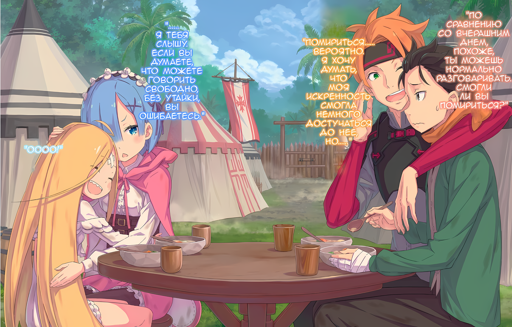
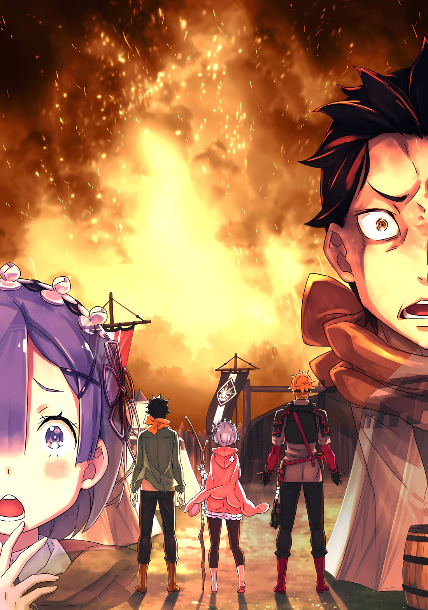
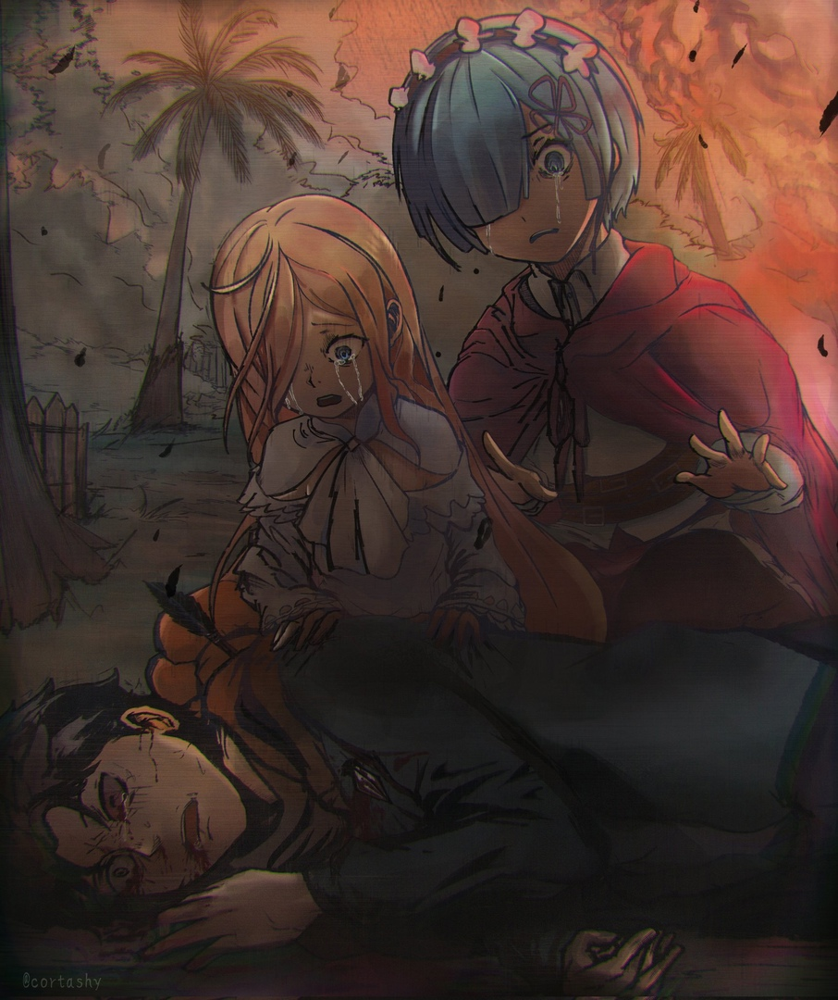

???: Субару, ты и вправду ооочень занятая пчела, не так ли?

Субару: Хах, серьезно?

Ноздри Субару раздулись, когда его похвалил голос, похожий на серебряный колокольчик.

Он только что закончил выжимать тряпку, которую вытащил из ведра с водой, с энтузиазмом вытирая ею пол, занятый уборкой гостевой комнаты, когда в комнату вошла Эмилия, та, кому принадлежал голос.

Она небрежно кивнула ему, проводя пальцами по своим длинным серебристым волосам

Эмилия: Ага. Ведь как только ты выздоровел, тут же сразу начал работать. Даже несмотря на то, что все это после всей суматохи с этими Зверодемонами. Это о~очень застало меня врасплох.

Субару: Хехе, на самом деле ничего особенного…… Подожди, что?! Может быть, ты читаешь мне лекцию, говоря, что те, кто выздоравливает, не должны этого делать!?

Эмилия: А? Это не входило в мои намерения…… Но теперь, когда ты упомянул об этом, я думаю, что да. Мы не можем этого допустить, Субару. Тебе нужно еще немного отдохнуть.

Субару: Гхаа, я подставил сам себя.

Субару пожалел, что придал этому слишком большое значение, подумав, что было бы лучше, если бы он просто спокойно воспринял ее комплимент.

Однако с плеча Эмилии раздался третий голос, прежде чем Субару успел подумать об этом. И там из серебристых волос Эмилии вылез серый кот.

Пак: Хихихи, это заняло у тебя достаточно много времени, Субару. Вот я и подумал, что если бы позволил Лие честно похвалить тебя, ты бы попытался читать между строк и увяз слишком глубоко. Как я и предполагал.

Субару: Пак, ты маленький…… Что это за хитрые уловки! Какого черта ты хочешь!?

Пак: Хех, это очевидно, не так ли? Я непостоянный кошачий дух, вот в чем причина. Моя натура озорная, сбивающая с пути сердца людей с помощью моей миловидности и пушистости…… Мяумяумяу

Эмилия: Бооже, да ладно, Пак, ты опять говоришь странные вещи. Перестань ставить Субару в неловкое положение.

У маленького кошачьего духа было довольно подлое выражение лица, но все же он был побежден, когда Эмилия ущипнула его за ухо на полпути к признанию в его злодеяниях. Она извинилась перед Субару, Пак все еще болтался у нее в руке за ухом.

Эмилия: Прости, я только что сделала перерыв в учебе и прогуливалась по особняку, когда Пак сказал, что нашел тебя, так что я……

Субару: О, нет, все в полном порядке. Что касается меня, то я хочу проводить с тобой как можно больше секунд в день, Эмилия-тан. Я должен поблагодарить Пака за то, что он это придумал.

Эмилия: Вот как? Я не совсем понимаю тебя, но я рада, что ты не сердишься, какое облегчение.

Субару: Значит, она меня не поняла! Даже несмотря на то, что я сказал ей это прямо, до такой степени, что это было неловко!?

Оставив улыбку на лице, Эмилия нахмурила свои красивые брови, слушая жалобы Субару, а затем в замешательстве наклонила голову.

Хотя то, что он выразил, было вызвано относительной нежностью, к сожалению, не похоже, что это должным образом дошло до Эмилии. Так что у него не было другого выбора, кроме как стать еще более прямым, если он хотел пойти дальше.

Субару: Желание выбрать ситуацию, настроение и подходящий день, чтобы сказать ей, все это часть характера молодого человека….

Пак: Я бы рекомендовал ночное время, иначе, если я появлюсь, то определенно буду мешать.

Субару: Ты, конечно, все больше и больше проявляешь свою честную отцовскую сторону, не так ли?

Отцы этого поколения довольно часто запрещали своим дочерям вступать в отношения, однако он мог ясно сказать, что Пак был таким же, просто взглянув на него, пушистый шарик из другого мира или нет.

Когда он укоризненно посмотрел на Пака, кошачий дух выпятил грудь, все еще сидя на плече Эмилии.

Пак: Конечно, учитывая, насколько симпатична Лия, огромное количество мух, парящих над ней, становится слишком все больше. Им не будет конца, если я не буду усердно работать, чтобы избавиться от них, нет?

Субару: О нет, я просто подумал, что было бы удобно заранее отловить одну из этих мух.

Пак: Я откажусь от любых мух с такими уродливыми глазами. Кроме того, было бы странно, если бы я позволил мухам приблизиться к Лие. Я буду искать подходящего жениха для Лии, даже если на это уйдет почти тысяча лет.

Субару: Этот масштаб на мифическом уровне!

Хотя концепция любящего отца зашла слишком далеко, проблема оставалась в том, что, учитывая, что они были дуэтом полуэльфа и духа, существовала вероятность, что они серьезно подождут почти тысячу лет.

К сожалению, Субару был человеком, поэтому он не мог сравниться с такой величиной.

Субару: Я думаю, что я мог бы достичь максимум 120, если бы действительно очень старался….

Эмилия: …? Что ты имеешь в виду?

Субару: О, я говорил о своей продолжительности жизни.

Эмилия: Твоя продолжительность жизни…… Прекрати, Субару, это странно. Ты еще мальчик, еще слишком рано беспокоиться о таких вещах.

Субару: Ну, зависит от того, как ты на это смотришь….

Эмилия прикрыла рот рукой, подавляя смешок, а затем рассмеялась, как будто услышала шутку высочайшего качества.

Он ответил на ее улыбку натянутой улыбкой, однако мужчина в нем был счастлив видеть улыбающуюся девушку, которая всегда была у него на уме. Все было сложно, но прежде всего ему нужно, чтобы она осознала это.

Субару: По крайней мере, мне не нужно будет выходить на ринг, пока они продолжают обращаться со мной как с ребенком.

Пак: Довольно хорошая позиция, хах, Субару. Верно, первое, что тебе нужно сделать, это встать на свои собственные ноги, как взрослый. Если ты не сможешь этого сделать, я не позволю тебе переступить порог моего дома.

Эмилия: Разве это не особняк Розвааля? Что это за история с тем, чтобы не позволить ему ступить туда?

Эмилия задала свои вопросы Паку, который слушал спокойную решимость Субару, скрестив короткие руки на груди.

После всего сказанного и сделанного Субару не был обескуражен, даже услышав, что сказал Пак. Если то, что нужно было сделать, было решено, то все, что ему оставалось, — это направиться прямиком к своей цели.

Субару: Хех, посмотри на меня, Пак. Видишь ли, я из тех, кто без колебаний делает одно и то же снова и снова изо дня в день. Как будто повышаешь уровень для игры!

Пак: Пхахаа, глупый человек. В таком случае докажи мне, что ты не просто новичок, который только и делает, что болтает. Я буду ждать вместе с принцессой в самой дальней части замка. Пошли, принцесса!

Эмилия: Ты имеешь в виду меня? Хмм, но я стремлюсь быть королевой, а не принцессой.

Когда Субару и Пак завелись, не заботясь ни о ком вокруг, Эмилия одарила Субару улыбкой, когда тот был занят тем, что выжимал свою тряпку насухо. Все это, имея дело с противоположными взглядами пары.

Эмилия: Тем не менее, делай все возможное в своей работе. Если ты придашь этому все свои силы, то наверняка кто-нибудь будет там, чтобы увидеть это.

Субару: Но я бы хотел, чтобы это была Эмилия-тан, а не кто-нибудь другой….

Эмилия: Да, да, я понимаю это. Я не могу присматривать за тобой все время, но я буду заглядывать время от времени. Кроме того……

Эмилия слегка нахмурила брови и остановилась на полуслове. Затем она повернулась к Субару, пока он ждал, когда она продолжит, на ее лице появилась очаровательная улыбка

Эмилия: Ты тот, кто больше всего видит свою тяжелую работу, не так ли? Вот почему ты должен выложиться полностью, чтобы не подвести себя.

И вот, попав прямо в точку в том, что означало приложить усилия, она заставила Субару снова влюбиться в нее.

△▼△▼△▼△

Субару: Тц, я только что вспомнил тот раз, когда снова влюбился в Эмилию…… И все же это болезненная вещь.

Субару оглядел грязную палатку, почесав затылок.

Он обнаружил, что попал в лагерь солдат из Империи Волакия; там его заставили выполнять случайную работу, ожидая прибытия конвоя с припасами, направлявшегося в деревню.

Субару посвятил себя своей мантре “Тот, кто не работает, не должен есть” ради Рем, которая не могла двигаться, а также нахлебницы Луис. Таким образом, он без малейших колебаний помог Тодду и другим Имперцам, поскольку они предоставили ему еду и кров, а также вылечили их раны.

Однако……

Субару: Я должен привести себя в порядок, что бы ни происходило.

Субару пробормотал эти слова, укладывая содержимое их запасов, теперь разбросанных по всей земле, обратно в мешки.

Конечно, независимо от того, насколько беспорядочными и жестокими были эти Имперцы, они никоим образом не могли хранить предметы, которые поддерживали бы их линию фронта таким “все, что работает”, неорганизованным образом.

В конце концов, Субару с большим трудом убрал запасы в этой палатке накануне. Причина, по которой все было в таком беспорядке, была только одна.

Субару: Меня преследует некий подлый человек….

Луис: Ааа.

Субару: О, я думаю, есть также шанс, что ты улизнула и устроила этот беспорядок ночью. Ты чувствуешь желание раскрыть свою мерзкую, истинную природу, Архиепископ Греха?

Луис: Уууу?

Он пристально посмотрел на Луис, когда тот убирал разбросанные вещи, а она тем временем смотрела на его руку.

Однако Луис просто дала неопределенный ответ на вопрос Субару, укусив свой собственный палец. Похоже, она все еще не собиралась раскрывать свою истинную природу.

Это наверняка пригодилось бы ему, если бы она просто спрятала её навсегда.

Субару: ……Я понятия не имею, что думать о том, что Рем сказала мне вчера.

Этим утром Луис тоже ковыляла вместе с Субару с того момента, как проснулся.

Мрачный взгляд, который он получил от Рем, когда они расстались для реабилитации ее ног, промелькнул у него в голове. Однако это было неразумно, учитывая, что Субару был тем, кто находил слежку такой надоедливой.

В любом случае, была добавлена еще одна причина, по которой Субару едва справлялся с ней, по сравнению с предыдущим днем. И это было из-за информации, которую рассказала ему Рем…… свидетельства того, что она не могла почувствовать затяжной запах Ведьмы, исходящий от Луис.

Субару: …………

Хотя Субару до сих пор не придавал этому особого значения, было довольно маловероятно, что затяжной запах Ведьмы был чем-то, что было только у него.

На самом деле, он чувствовал, что Рем уже использовала эти слова раньше, когда сталкивалась с Культом Ведьмы. Должно быть, она так отреагировала на Петельгейзе вместе с Культом Ведьмы, которых возглавлял этот человек.

В этом отношении тот факт, что миазмы Субару усиливались каждый раз, когда он «Посмертно Возвращался», казался чем-то странным даже с точки зрения Рем, когда она была с ним в хороших отношениях.

Субару: Сила моих миазмов время от времени пригождалась…… Как против Вольгарма и Белого Кита. Но, в конце концов, это в основном просто то, что приносит мне слишком много несчастий.

Даже если и были времена, когда его миазмы были полезны, в настоящее время это служило лишь поводом для того, чтобы вызвать гнев Рем. Таким образом, его впечатление об этом было на самом низком уровне.

И, как бы он ни старался думать об этом……

Субару: Не может быть, чтобы люди в Культе Ведьмы…… И Архиепископы Греха не имели никакого отношения к миазмам.

К такому выводу пришел Субару.

Учитывая, что он ничего не знал о причинах возникновения миазмов или о более мелких деталях, он мог описать это только как теорию на столе. Несмотря на это, ему было трудно говорить об этом.

Связь между Архиепископами Греха и «Ведьмой» была ясна и очевидна. Культ Ведьмы были, по сути, воплощением зла.

Тем не менее……

Субару: Как бы парадоксально это ни казалось, можем ли мы действительно думать, что те, кто не испускает миазмы, не связаны с Культом Ведьмы? Например, эта девушка прямо передо мной, по-настоящему такая?

Луис: Аууу?

Стоя рядом с Субару, пока он размышлял над этой проблемой, Луис просто застонала с пустым выражением на лице.

Вздохнув, Субару поднялся и начал приводить в порядок палатку.

Инструменты, которые он поставил в стойку, были опрокинуты, а пакеты, которые он разложил в ряд, были открыты, вещи внутри разбросаны повсюду.

Это было в точности похоже на то, что сделал бы ребенок.

Субару: Ну, я думаю, что это преследование должно быть чем-то необычным……

Причина, по которой палатки, которые он прибрал, были в беспорядке, заключалась не в том, что Луис улизнула. Более вероятно, что кто-то другой в лагере был тем, кто преследовал его и вмешивался.

Очевидно, поскольку он был в Имперском лагере, он вступал в контакт с другими людьми, кроме Тодда. И в большинстве случаев он вряд ли мог назвать их отношение к нему дружелюбным.

В этом отношении все пошло так, как сказал Тодд; он был странным.

Субару: Тем не менее, это все равно намного лучше, чем внезапно получить удар или быть вынужденным поедать ботинок.

Он действительно не мог отрицать, что его стандарты в отношении счастья и нормальности пострадали, если бы он сказал это вслух. Но факт оставался фактом: можно было с уверенностью сказать, что все было проще из-за того, что к нему не относились с таким болезненным приемом.

Хотя Субару не хотелось это признавать, он хорошо привык к тому, что его избегали или не любили.

Как будто это было не так, как если бы он так ярко провалил битву за свой дебют в старшей школе и был отрезан от всех почти на два года и все такое. Над ним никогда не издевались как таковым, но он был профессионалом в том, чтобы справляться с тем, что настроение вокруг него было едким.

Если подумать, его одноклассники в старших классах, должно быть, были довольно хорошими людьми.

Даже если бы они обращались с Субару так, как будто его там не было, ему не казалось, что они домогались его, и они не находили удовольствия в том, чтобы заставлять его страдать.

Субару: Я надеюсь, что жизнь сложилась хорошо для всех вас, добросердечных людей, там, на другой стороне. Было бы здорово, если бы такие люди, как Инахата-кун, который изо всех сил старался дать мне эти листовки, добились успеха.

Субару закончил убирать палатку быстрее, чем накануне, и с таким же качеством, вспоминая смутные воспоминания об этом однокласснике, его лицо было размытым.

Тем не менее, это было похоже на то, что яма была заполнена, и ему пришлось снова ее копать. Итак, сеть работы, которую он проделал сегодня, качнулась в отрицательную сторону.

Субару хотел использовать те слова, которые Эмилия говорила ему раньше, что кто-то заметит его тяжелую работу, или, по крайней мере, он сам её увидит. Он тоже хотел использовать их в качестве опоры, однако.

Субару: Не то чтобы я мог привести себя в порядок, если ты единственная, кто наблюдает за мной прямо сейчас. Мое настроение было бы совсем другим, если бы Рем была той, кто наблюдает, но….

Луис: Ооу, уааа

Сегодня Луис пока не мешала Субару работать, как будто она научилась на его гневе. Благодарный за это, Субару направился на улицу, к следующей палатке……

Субару: ……Уа!?

Он зацепился ногой за что-то, как раз когда выходил из палатки, и свалился кучей.

Он рефлекторно уперся руками в землю, однако, его правая рука была отведена в сторону, левая все еще немного болела. Несмотря на то, что она заживала, последствия, которые оставила Рем, еще не полностью зажили.

Поэтому, застонав от боли, Субару оглянулся назад

???: Хэй, ссыкло. Чё ты делаешь на земле?

Субару: Ты……

Субару удивленно округлил глаза. Перед ним, прямо у входа в палатку, стоял вульгарно выглядевший мужчина.

Он носил повязку на правом глазу, у него было заросшее щетиной лицо, и его внешность была воплощением грубости. И вдобавок, он был тем парнем, который заставил Субару съесть его ботинок в этом лагере.

Если он правильно помнил, Тодд сказал, что его зовут……

Субару: Он сказал, что это был Джамал, верн… гхоо!?

Джамал: Для тебя Джамал-сан. Ты и те бабы, которые составляют тебе компанию, совсем без манер, эй.

В тот момент, когда он решил, что Субару не обращался к нему, используя “сан”, мужчина, Джамал, немедленно начал действовать.

Джамал наступил на пальцы левой руки Субару, которые все еще были обмотаны бинтами и закреплены скобой, и толкнул его пяткой вниз, когда он лежал на полу.

Боль в пальцах снова вернулась к нему, когда он терся ими взад и вперед. Тем не менее, Субару вытерпел это, подавляя крик, который нарастал в его горле.

Луис: Аауу!

Джамал: Аа?

Когда она закричала, Луис вцепилась в ногу Джамала, когда тот наступил на руку Субару. Она весила немного, и при том, как был сложен Джамал, он не сдвинулся ни на дюйм.

И вот так просто он схватил Луис за ее длинные волосы и силой оторвал ее от себя.

Субару: Эй, она же просто ребенок!

Увидев, что происходит, Субару пришел в ярость и выпалил это, не подумав.

Джамал неприятно нахмурился, услышав его жалобу. Он крепко схватил Луис за волосы, заставив ее вскрикнуть.

Джамал: Кому не срать, что она всего лишь ребенок? Из того, что я более или менее слышал, разве не ты обращался с этим ребенком ужасно холодно? Схерали ты вдруг передумал?

Субару: Это не так…… Просто ты будешь тем, кто в конечном итоге пожалеет об этом, если будешь слишком сильно ее провоцировать.

Джамал: Какого хера, у тебя хватает наглости так говорить? Выдумай какое-нибудь оправдание получше.

Джамал фыркнул, взмахнул рукой и швырнул Луис на землю. Упавшая Луис потянула себя за волосы, которые ранее были схвачены, схватилась за голову и уставился на Джамала со слезами на глазах, издав “Уууу”.

Честно говоря, всегда существовал шанс, что акт насилия Джамала может послужить спусковым крючком, который вернет Луис к тому, какой она была раньше. Это не было похоже на то, что отчаянные слова, которые выпалил Субару, были совершенно случайными.

К счастью, было не похоже, что боль и гнев Луис помогут вновь пробудить ее первоначальную личность. Хотя трудно было судить, для кого это было благословением.

Джамал: Какая невоспитанная соплячка. Нет, не просто сранная соплячка. Мне не нравишься ни ты, ни другая девушка, никто из вас!

Субару: Гхуо!

Пока он говорил, Джамал разозлился и ударил Субару ногой в лицо. Неожиданный удар заставил Субару открыть рот, от неистовой силы хрустнул зуб. Изо рта у него начала капать кровь. В тот момент, когда запах и вкус железа распространились по его языку, Субару поднял глаза на Джамала.

Субару: Нггхх…… Я думаю, мы можем сказать, что Тодд-сан проверяет мою личность, или, скорее, ты получил разрешение проводить здесь время……

Джамал: Пф, “Тодд-сан", ха. Он очень привязался к тебе, не так ли? Это твой последний луч надежды?

Субару: …………

Джамал: Извини, но я выше этого парня по званию. Я выслушал его просьбу в качестве одолжения, но у меня нет причин подчиняться.

Говоря грубым голосом, Джамал снова наступил на Субару. Субару сразу же свернулся калачиком, чтобы защитить голову, но на этот раз удар пришелся ему в живот. От удара носком ботинка Джамала у Субару скрутило живот, и он застонал от удара, но безжалостные удары продолжались.

Джамал: Во-первых, эта твоя сучка причинила боль двум моим людям. Тех, кто больше не может быть полезен, нужно отправить обратно. Такое невезение. И вместо того, чтобы получить что-то взамен…… этот ублюдок Тодд нашел что-то ещё.

Субару: ……кх.

Джамал: Если бы не тот твой нож, я бы разорвал тебя на части на месте. Трудно быть солдатом, не так ли?

Его настойчивые пинки и замечания задели за живое. Даже не поднимая глаз, чтобы встретиться с одноглазым взглядом Джамала, цель его противника была ясна.

Целью Джамала не было причинить вред Субару. Это было за пределами этого.

В основном, его целью было разозлить Субару и спровоцировать его на контратаку, и он, вероятно, тоже был груб с этой целью.

Джамал сказал, что ему не нужно было слушать слова Тодда, но тот факт, что он не мог полностью игнорировать их, можно было сделать из их взаимодействия, когда Джамал в первый раз нанес ему удар ногой. Вот почему Джамалу нужна была причина. Причина убить Субару.

Не только это, но и причина отомстить Рем. Из-за этого Субару не позволил бы себя спровоцировать. До тех пор, пока Джамал не обратит свою мелочную злобу на Рем, будут ли снова сломаны пальцы левой руки Субару или его оставшиеся пальцы, это будет победой Субару. По этой причине он будет терпеть, терпеть, терпеть……

???: ……Эй, что ты там делаешь?

Джамал: Тц.

И вот так, в разгар продолжающегося терпения Субару, к Джамалу донесся особый голос. В этот момент Джамал прищелкнул языком, отвел ногу и медленно попятился. Вслед за этим шумными шагами появился юноша с оранжевыми волосами.

Тодд: Хотя здесь никому нет дела, когда я услышал, что что-то доносится отсюда, я ожидал, что это будешь ты.

Джамал: Это ли не Тодд? Не кажется что ты меня слишком опекаешь? Тебе действительно так понравился этот Имперский кинжал? Поэтому ты будешь лебезить перед этим трусом, пока он не продаст его, ха.

Тодд: ……Джамал.

Прищурившись, Джамал хмуро посмотрел на Тодда. Между ними двумя повисла опасная атмосфера, но это напряжение было снято Джамалом, сказавшим: “Я прекращу”.

Тем, кто в одиночку очистил воздух, был Джамал, который до этого момента пинал Субару и смотрел на него сверху вниз

Джамал: Если ты усвоил свой урок, будь осторожен, не путайся под ногами вне поля моего зрения. Если ты снова упадешь, как только что, кто знает, что произойдет? Хахахахаха!

Вот так, нисколько не заботясь о проявлении необычайной жестокости по отношению к Субару, он прошел мимо Тодда и ушел. У Субару также не было слов, чтобы остановить его. Если бы он привлек внимание к своим травмам здесь, это только спровоцировало бы Джамала таким же образом.

Как только спина Джамала скрылась из виду, Субару оторвал свое тело от земли.

Субару: Ах, черт…… ой… Этот ублюдок, такой женственный парень, не имеет права быть таким настойчивым. То, что он сделал, было совершенно злонамеренным……

Он делал вид, что полон негодования по отношению к Рем, но в основном у него просто был отвратительный характер. Во-первых, он сказал, что Рем напала на него с самого начала, но не потому ли это, что он спровоцировал Рем, которая уже находился в стрессовой ситуации?

Конечно, существовала вероятность, что из-за того, что у нее не было воспоминаний, Рем сделала неверный вывод, когда к ней протянулась рука.

Субару: Ну, Рем ничего не знает, так что ничего не поделаешь.

Вынося доброе суждение о Рем, Субару выплюнул немного крови, смешанной со слюной во рту, и медленно встал на месте.

Тодд: Ты в порядке? Связываться с Джамалом было неудачей, не так ли?

Обращаясь к Субару, который был в шатком состоянии, Тодд нахмурился, приветствуя его. Если бы он не прибыл, нападение Джамала все еще продолжалось бы.

Субару был благодарен за это вмешательство. Но, оставляя это в стороне……

Субару: Я в порядке. Что еще более важно, Рем….

Тодд: Если ты говоришь об этой молодой девушке, то она помогает готовить. Это задача, которую вы можете выполнить, сидя. Джамал тоже ничего не будет делать на виду у публики…… конечно же.

Словам Тодда не хватало убедительных доказательств, поэтому Субару нельзя было успокоить. Вытирая кровь со рта, Субару посмотрел на свою левую руку. Скоба соскользнула, и бинты развязались. Его пальцы, которые следовало оставить на некоторое время заживать, снова начали приобретать неприятный цвет.

Тодд: Ааах…… Если это так как есть, то, наверное, мне снова придется позаботиться о тебе. Серьезно, этот Джамал.

Субару: ……Этот парень, что он за человек?

Тодд: Джамал? Он стал солдатом в то же время, что и я, и он самый успешный. Он из низшей дворянской семьи, так что повышение до Генерала Третьего класса — это тоже не просто мечта…… Ах, ты знаешь, что значит Генерал Третьего класса?

Субару: Нет, конечно нет. Это звание?

Когда Субару покачал головой, Тодд кивнул и сказал “понятно”, и поднял пальцы.Согласно его объяснению, в Имперской армии Волакии звание «Генерал», по-видимому, было частью их системы ранжирования. Солдат, Солдат Первого класса, Генерал Третьего класса, Генерал Второго класса и выше……

Тодд: Когда дело доходит до первоклассных Генералов, в Империи всего девять выдающихся людей. Военнослужащие, которые служат непосредственно Императору, называются «Девятью Божественными Генералами». Что ж, если ты зайдешь так далеко, это уже не вопрос происхождения или достижений.

Субару: Это талант?

Тодд: Да, так оно и есть. Вот почему Генерал Третьего класса — это самое высокое, к чему могут стремиться обычные люди, такие как мы.

Слушая историю не несчастного Тодда, Субару вспоминал поведение Джамала из прошлого.

«Генерал», казалось, был должностью, которая выполняла ту же функцию, что и офицер в армии, но Джамал вряд ли обладал такой способностью. Он был эгоцентричен, и его эмпатия была низкой по своей природе. Было легко понять, что он был бы некомпетентным типом вышестоящего офицера.

Субару: На поле боя, говорят, довольно много солдат умирает, потому что в них сзади попала шальная стрела. Скажи этому парню из своих собственных уст, не мог бы ты?

Тодд: Это преувеличение. В любом случае, мы должны пройти твое медицинское лечение?

Субару: Могу я попросить об одолжении? ……Перед этим я хотел бы увидеть лицо Рем.

Тодд: Боже мой, разве ты не влюблен по уши…… Эта бедная молодая девушка.

Несмотря на боль в пальцах, подтверждение безопасности Рем было главным приоритетом. Тодд пожал плечами в ответ на поведение Субару и обратил свое внимание на Луис, которая свернулась калачиком перед палаткой.

Она намотала волосы, которые Джамал намотал ей на пальцы, и тихо зарычала, как зверь.

Тодд: Твое обманчивое лицо не соответствует твоей натуре. Мне нравятся сильные дети с боевым духом.

Луис: Ааа…! Ооо… ааа…!

Повернувшись на смех Тодда, Луис завыла, будто в ответ.

Субару хотел предложить ему забрать её, если она ему понравилась, но он не хотел, чтобы это дошло до ушей Рем и снова разозлило ее, поэтому он держал рот на замке.

△▼△▼△▼△

Рем: ……Какая вонь, ты снова получил травму?

Субару: О…… ты знала?

Рем: Я знаю. Поскольку ребенок наблюдает, пожалуйста, имей в виду поведение, о котором мы говорили.

Сказав это, когда они собрались за одним столом на обед, Рем предупредила его.

Хотя была часть этого вопроса, с которой он не мог согласиться, не было смысла идти против нее, поэтому он кивнул в знак согласия. Стоявшая рядом с Субару Луис передразнила его и кивнул.

Субару подвергся жестоким издевательствам Джамала и любезному предложению Тодда о помощи после этого. Как только безопасность Рем была подтверждена, Субару согласился на лечение в медицинской палатке. ……Человек, отвечающий за медицинскую палатку, был потрясен, увидев, что Субару снова пришел, но после того, как об этом позаботились, он закончил уборку другой палатки, и они собрались вместе на обед.

Поскольку обед в лагере был нормирован, из того, что было приготовлено людьми на распределительной станции, было собрано подходящее количество, и система очистки была назначена последовательно.

Рем помогала готовить и подавать еду, и, поскольку они считались аутсайдерами, группа Субару держалась до конца и в основном ела то, что выглядело как остатки.

Субару: Ну, это нельзя назвать жизнью в роскоши. Есть столько, сколько ты можешь, было бы наиболее удовлетворительно.

Сказал Субару, когда принес свою порцию и порцию Рем и поставил их на маленький столик. Луис тоже нахально положила свою порцию точно так же, как Субару.

Таким образом, каждый из троих неохотно сел за стол, чтобы съесть несколько поздний обед.

Субару: Как прошел день? У тебя не было никаких неприятностей?

Рем: Ничего особенного. Я должна была заботиться о своих ногах, так что… Единственное, в чем я помогала, — это немного готовить. Кроме того, я помогаю, пока меня учат.

Субару: Во время обучения…… Твое тело помнит, как делать такие вещи?

Рем: …………

В ответ на срочный вопрос Субару бледно-голубые глаза Рем сузились, а губы поджались.

Субару запаниковал, не вложил ли он слишком много силы в эту реакцию, но Рем тут же вздохнула и сказала

Рем: …Если бы я сказала, что не надеялась на это, я бы солгала.

Субару: Рем….

Рем: Я думала, что если я попробую сделать и то и другое, может быть, найдутся вещи, с которыми знакомы мои руки. Но это было бы слишком удобно, не так ли?

Спокойно глядя на свои руки, Рем пробормотала, словно стыдясь собственной глупости.

Но кто стал бы высмеивать надежды Рем как глупые? В ситуации, когда Рем не может вспомнить составляющие себя части, как цеплялась за решение, кто мог ей это сказать?

Рем: ……Почему ты делаешь такое горькое лицо?

Субару: Почему ты спрашиваешь, это же……

Рем: ……Ты знал меня раньше. Я это понимаю. Нет причин сомневаться в этом.

Устремив свой пристальный взгляд на Субару, который опустил глаза, Рем удивила его, сказав это.

До сих пор Рем высказывала только негативное мнение о Субару, но впервые она сделала что-то вроде уступки.

Поняв это, в груди Субару зародилась надежда.

Однако……

Рем: Но сколько бы раз ты ни называл меня «Рем», я не могу смириться с тем, что это мое имя. Интересно, что оно вообще значит.

Луис: Ааа….

Рем: Если бы, по какой-то случайности, этот ребенок заговорил со мной, возможно, все было бы по-другому, но…

Говоря это, Рем выглядела счастливой, когда гладила Луис по волосам. Когда ее нежно погладили, Луис была поглощена тем, что доедала свою порцию, которая лежала у нее под носом.

Несмотря на ее беззаботное отношение, и, к сожалению, даже если бы у нее была хоть капля самосознания, она не смогла бы говорить о Рем своими собственными устами. Даже если бы она могла говорить, Субару не позволил бы ей. Несмотря ни на что, бесконечная враждебность Субару сделает это так.

Тодд: Ты чего хмуришься? Тебе не следует быть таким мрачным за обеденным столом.

Заняв место за обеденным столом этих трех человек, Тодд вмешался дружелюбным тоном.

В результате его вторжения воцарилась неловкая тишина. Испытав облегчение от внезапной перемены в атмосфере, Субару посмотрел на мужчину, сидящего рядом с ним, и выдохнул “Тодд-сан, ха". После вышеупомянутого инцидента с Джамалом Субару считал что он хороший парень из-за того, что спас его.

Субару: Спасибо, что присмотрел за мной раньше, но разве ты не должен поесть со своими друзьями?

Тодд: Хмм? Ну, после такого долгого общения с одними и теми же парнями, если мы не будем есть вместе день или два, наши отношения не сильно изменятся. Я бы предпочел получить большое влияние на вас.

Субару: Даже если бы ты это сделал, нам нечего тебе предложить.

Тодд: Это идея доходности, или погашения долга после достижения успеха. Думайте об этом как о первоначальных инвестициях.

Хотя Тодд говорил легко, он изменил атмосферу, хотел он этого или нет. А потом Тодд сказал “Во всяком случае” и внезапно обнял Субару за плечо.

Когда Субару немедленно отстранился от удивления, он наклонился к уху Субару

Тодд: По сравнению со вчерашним днем, похоже, ты можешь нормально разговаривать. Смогли ли вы помириться?

Субару: Помириться…… вероятно. Я хочу думать, что моя искренность смогла немного достучаться до нее, но….

Рем: …Я тебя слышу. Если вы думаете, что можете говорить свободно, без утайки, вы ошибаетесь.

Луис: Оооо!

Цветная иллюстрация к **Ранобэ** Том 26 | Перевод неофициальный и выполнен под контекст перевода группой rezero7arc

Острым взглядом Рем выразила свое недовольство разговором двух мужчин. Похоже, Луис сотрудничала с ней, когда она притворялась невинной, возможно, потому, что намеревалась сделать Рем своим союзником. Синергетический эффект холодного ответа Рем и ее принятия Луис сделал грудь Субару тяжелее.

Казалось, это передалось Тодду, пока он обнимал Субару за плечи, “Что ж", — сказал он, все еще обнимая его за плечи и похлопывая по плечу……

Тодд: Угнетает малёк. По крайней мере, вы двое находитесь в таком месте и на таком расстоянии, где можете поговорить. Одно это намного лучше, чем моя ситуация.

Субару: Ах, если подумать, ты упоминал, что расстался со своей невестой.

Тодд: Верно, моя невеста живет в столице Империи. Это правда, что я должен завершить эту миссию, но время, которое мы провели в разлуке, слишком долгое, чтобы начинать с этого. Почему, ох почему, я должен быть таким одиноким и страдать? Понимаешь?

Субару: Это одиночество — причина, по которой ты составляешь нам компанию?

Тодд: Правильно. Так что позвольте мне делать это как можно чаще. Это того стоит.

Возможно, это потому, что он не позволил ситуации выйти из-под контроля, но в глубине души Субару был благодарен Тодду за заботу. Однако было бы бестактно благодарить его напрямую. Он также извлек выгоду из положения дел. Таким образом, все четверо продолжили трапезу, но……

Субару: На самом деле, нам сказали, что наша группа может прокатиться на повозке группы снабжения, но как долго группа Тодда, вероятно, останется на этой миссии?

Тодд: Разве я не говорил? Пока мы не найдем «Племя Судрак», спрятанных в лесу…… Если мы их не найдем, то можем застрять здесь на долгие годы. Нелегко служить дворцу.

Субару: «Племя Судрак»….

Взяв свою деревянную ложку с горьким выражением лица, Тодд ответил на размышления Субару.

«Племя Судрак»…… Сначала, когда Тодд рассказал ему в лагере, Субару догадался, что так звали человека в маске, которого он встретил в лесу. Благодаря тому, что он отдал Субару нож, он был в долгу перед ним. Поэтому он не рассказал Тодду о своем существовании, но теперь это казалось неблагодарным.

С точки зрения благодарности, Тодд помог не меньше, чем человек в маске.

Тогда в чем была причина того, что он отдал свой долг человеку в маске, а не Тодду?

Субару: Если группа Тодда-сана найдет это «Племя Судрак», что ты будешь делать? Вы разбили такой лагерь, как этот, так вы намерены…… сражаться с ними?

Рем: …………

Как мог, Субару попытался задать свой вопрос беззаботным тоном. Однако в его голосе чувствовалась настойчивость, которую он не мог скрыть.

На самом деле, хотя она и не вдавалась в эту тему, лицо Рем выразило ее реакцию на то, что он сказал. Даже если она не обращала внимания, есть реакция на то, чтобы избегать слова «сражение».

И когда его спросили, Тодд закрыл глаза на слова Субару

Тодд: Нет, похоже, «Генералы» не хотят сражаться, если это вообще возможно. Я не знаю подробностей, но, похоже, «Племя Судрак» — очень могущественное племя. Несомненно, что у нас была бы очень тяжелая битва, если бы мы сражались, поэтому цель на этот раз — переговоры.

Субару: Переговоры? О чем бы вы стали договариваться с лесным племенем?

Тодд: Не задавай такому подчиненному, как я, так много вопросов, хорошо!? ……Я не совсем в курсе, но, вероятно, столица или даже сам Император хотят, чтобы они были своего рода вассальным племенем.

Субару: Разве «Племя Судрак» не подчиняется Императору Волакии?

Тодд: Есть те, кто этого не делает. Это просто волакий способ.

Смеясь, как стереотипный солдат, Субару мог только удивленно поднять брови от ответа Тодда. Он тихо пробормотал себе под нос “Да здравствует Волакия” и решил на этом закончить разговор. Если верить словам Тодда, Имперская армия тоже хотела избежать конфликта с «Племенем Судрак». Если бы это было так, Субару мог бы избежать ненужного кровопролития и конфликта между двумя группами, если бы он предоставил информацию.

Тем не менее, у Субару не было ценной информации, и если бы он объяснил, почему он скрыл эту информацию в первую очередь, ему пришлось бы объяснить, почему он солгал о своем прошлом.

Субару: Уфф, какая дилемма. Либо одно, либо другое….

Рем: ……Знаешь, твои брови всегда нахмурены, когда я смотрю на тебя. Я не могу сказать, что у тебя очень дружелюбное лицо, так что не стоит ли тебе хотя бы попытаться улыбнуться, чтобы противостоять этому?

Субару: Это какой-то суровый совет!…… Если бы я разговаривал с тобой с веселым лицом, ты бы тоже разговаривала со мной в более доброй и веселой манере?

Рем: Хааа?

Искренне озадаченный ответ Рем ранил Субару до глубины души. Видя, как Субару пытается скрыть свое смятение дрожащей улыбкой, Тодд рассмеялся.

Тодд: Ну, путешествие не начнется, если ты не сделаешь первый шаг. Я буду наблюдать за твоими такими благородными усилиями, так что не беспокойся об этом.

Субару: Спасибо, Тодд… Так в чем же настоящая причина, по которой ты не можешь встретиться со своей невестой?

Тодд: Хахаха, верно, страдай, страдай.

Субару: Черт тебя подери!

Его утешали или дразнили?

В любом случае, это не изменило того факта, что именно такое отношение Тодда спасло Субару. Не было никаких сомнений в том, что этот кризис был бы еще хуже, если бы не он. Вот почему самое меньшее, что Субару мог сделать, это пожелать им скорейшего завершения их миссии.

Субару: Сколько времени на самом деле потребуется, чтобы расчистить лес?

Тодд: Как только будут созданы другие лагеря, план состоит в том, чтобы пойти ва-банк. Хотя джунгли большие и густые, так что земля, которую мы можем покрыть за день, не так уж велика…

Субару: Понял. Ну, я думаю, ты не можешь просто ускорить свой путь через лес. Никогда не знаешь, что там внутри, а внутри скрываются огромные Зверодемоны и все такое.

Мужчина в маске, которого Субару подозревал в принадлежности к «Племени Судрак»; охотник, у которого также был шанс быть членом «Племени Судрак»; область, в которой появился массивный змеиный Зверодемон, когда Субару сражался с охотником, также была полна ловушек Рем.

Субару легко мог догадаться, сколько проблем у группы Тодда будет, если они пройдут через эти джунгли. Даже если он не сможет объяснить окружающий их контекст, он должен, по крайней мере, рассказать Тодду о ловушках Рем. Он не хотел никаких ненужных неудач, чтобы……

Тодд: ……Зверодемоны?

Тодд, который пил воду, пока Субару был погружен в свои мысли, удивленно расширил глаза. Вытирая рот рукавом, он уставился на Субару с испуганным выражением лица.

Не понимая, почему Тодд был так удивлен, Субару мог только смотреть в ответ с озадаченным выражением лица.

Тодд: Только что ты сказал «Зверодемоны», верно? Ты хочешь сказать, что в этом лесу есть Зверодемоны?

Субару: Ээ, ну, да, я действительно так сказал, но…… Я сказал что-то странное?

Тодд: Конечно. Ты же не каждый день сталкиваешься со Зверодемонами, не так ли? Теперь это другая история, если ты говоришь о Королевстве Зверодемонов Лугунике, но они нигде не появляются в пределах границ Волакии.

Субару: …………

Тодд: Это ведь не шутка, верно? Эй, мисс?

Субару потерял дар речи и мог только оставаться озадаченным все более серьезным тоном Тодда. Тодд быстро переключился на Рем.

Обнаружив, что стала объектом допроса, Рем ответила Тодду простым “Да”.

Тодд: Ответь мне, мисс. Ты тоже видела Зверодемона? В джунглях Будхейма?

Рем: Зверодемон, хотя я не совсем уверена, что это было…… Я могу сказать, что определенно видела большое зеленое существо.

Тодд: Был ли у него рог на голове?

Рем: Рог? ……Там точно было что-то белое и кривое.

Услышав этот ответ, гримасничающий Тодд вскочил. Он снова посмотрел на Субару

Тодд: Что это был за Зверодемон? Как он выглядел?

Субару: З-змея. Гигантская змея. Около 10 метров. Один супер-гигантский.

Тодд: Один, только один…… Черт, откуда мы должны знать точно ли он один скрывается в этих огромных джунглях? Но, похоже, ты не лжешь. Ситуация изменилась!

Яростно почесав в затылке, Тодд отвернулся от них, его поведение полностью изменилось. Он начал уходить, прежде чем остановился на полпути с громким “Ах”, придя к какому-то осознанию. Он развернулся и вернулся к Субару и остальным

Тодд: Это была важная информация. Все могло бы обернуться плохо, если бы мы не знали. Ты спас нас.

Субару: ……оо

Тодд продолжил энергично похлопывать по все еще сидящим головам Субару и Рем. Не сумев вовремя отреагировать на внезапное похлопывание, дуэт мог только смотреть на него в шоке. Не обращая внимания на их замешательство, Тодд снова отвернулся.

Затем он начал двигаться к людям, которые все еще были в середине своего обеда.

Тодд: Капитаны лагеря, собирайтесь! Мы едем к «Генералу»! Это важная новость!

Он хлопнул в ладоши и начал собирать людей. Звуки множества шагов были слышны, когда лагерь пришел в неистовство. Тодд направился к палатке в задней части дома, где, вероятно, проходили военные совещания и другие подобные важные дискуссии.

Эти двое могли только рассеянно наблюдать за интенсивной энергией, которая теперь охватила лагерь.

Рем: ……Это была та еще реакция. Это существо…… Неужели Зверодемон так важен? Конечно, я знаю, что это опасное существо, но….

Субару: …… На самом деле, я, возможно, не осознавал должным образом, насколько это было опасно.

Рем: Понятно……

Рем это, мягко говоря, не убедило, но самому Субару еще предстояло полностью привести свои мысли в порядок.

Вот насколько шокирующим было это откровение для Субару.

Субару: Зверодемоны здесь… редкость.

Это было, мягко говоря, неожиданно, но более того, это даже не приходило ему в голову.

Для Субару жизнь в другом мире и существование Зверодемонов были понятиями, неотделимыми друг от друга. Никто не мог разорвать эту связь, как бы сильно они ни старались. За исключением его первого дня в столице, Зверодемоны всегда были главным фактором в многочисленных событиях, которые развернулись после того, как его перенесли сюда.

Бунт Зверодемонов, который устроила Мейли, привел к появлению Вольгармов, Белого Кита, который был необходим для исполнения самого сокровенного желания Вильгельма, и Великого Кролика, который пытался поглотить «Святилище».

Хотя Зверодемонов нигде не было в Пристелле, место, куда он отправился после…… Песчаные Дюны Аугрии и Сторожевая башня Плеяд, можно было без преувеличения назвать штаб-квартирой Зверодемонов.

Излишне говорить, что самым запоминающимся Зверодемоном для Субару был «Багровый Скорпион».

Субару: …Я немного расстроился, но, в любом случае… Я прибыл сюда со своими собственными предположениями, поэтому никогда бы не подумал, что Зверодемоны — редкость.

Он был уверен, что Зверодемоны появятся в любой точке мира, как монстр из RPG. Однако, похоже, это было не так.

Если бы он подумал об этом, даже вернувшись в свой родной мир, это было бы не похоже на то, что вы могли бы найти львов или жирафов где-либо в мире. Так что в каком-то смысле это должно было быть очевидно.

Субару: Я также впервые узнал, что Лугуника называется Королевством Зверодемонов.

Даже если это была большая угроза, все поведение Тодда было полным на сто восемьдесят в ответ на одного Зверодемона. Если вы сравнили эту “нормальную реакцию” в Волакии с кем-то в Лугунике, неудивительно, что Лугунику называли Королевством Зверодемонов.

Кто-то вроде Мейли, должно быть, звучит как сказка.

Субару: Значит ли это, что если бы она поехала в страну или место, где не так много Зверодемонов, она могла бы жить как нормальный ребенок…?

Рем: Эй, слушай.

Рем окликнула его, пока Субару держал его голову под углом, размышляя о будущем Мейли, с которой он теперь был разлучен.

Задаваясь вопросом, в чем дело, Субару посмотрел и увидел, что Рем указывает на столешницу. Там он нашел Луис спящей с пустой тарелкой.

Рем: Кажется, она наелась досыта и заснула. Хотя я презираю это, не мог бы ты, пожалуйста, помочь мне нести ее.

Субару: Ты зашла так далеко, чтобы сказать, что презираешь это….

Горько рассмеявшись над словами Рем, Субару смиренно склонил голову набок. Убрав четыре тарелки, четвертая была забытым обедом Тодда, — Субару неохотно поднял Луис.

Он знал это, потому что Луис иногда цеплялась за него, но она была легкой. Ее внешность делала ее похожей на обычную молодую девушку. Честно говоря, только ее внешность делала ее похожей на обычную молодую девушку.

Субару: Ты готова идти, Рем? Моя спина свободна…

Рем: Какое неприятное предложение. В твоей помощи нет необходимости. Я могу, по крайней мере, позаботиться о себе….

Сказав это, Рем взялась за деревянную трость, прислоненную к столу, хотя это была “деревянная трость” только по названию, так как она больше походила на случайную толстую ветку, которую где-то подобрали.

Ручка была обернута тканью, вероятно, чтобы предотвратить попадание осколков. Это была простая импровизированная трость. Положив трость, Рем встала.

Ее осанка и походка все еще оставляли желать лучшего.

Рем: ……Я в порядке.

Субару: ……Ты уверена? Знаешь, не нужно быть такой упрямой. Если у тебя неприятности, можешь положиться на меня.

Рем: Я не буду полагаться на тебя. Это ничего не значит. Убедись, что не уронишь ее.

Субару: Ладно, хорошо. Но ты должна это знать. Единственная причина, по которой я ношу этого человека, не потому, что я этого хочу, а потому, что это для тебя.

Рем: Что в мире заставляет тебя говорить такие вещи……

Просто Субару не хотел, чтобы Рем узнала, что его мнение о Луис становится позитивным по собственной воле. Устав от его комментариев, Рем последовала за Субару со своей тростью, хотя и с некоторым трудом.

Субару вернул Рем и Луис в палатку, которую они позаимствовали. Он, вероятно, вернется, чтобы снова навести порядок в палатках. ……Хотя ему было любопытно, что собирается делать группа Тодда.

Рем: …… Ты беспокоишься о них?

Субару: ……м? Ээ, да, можно и так сказать. Просто… даже у меня есть самосознание, что я веду себя нечестно по отношению к нашим спасителям. Разговор о Зверодемонах, возможно, тоже был неосторожен с моей стороны.

Рем: ……Наши… спасители.

Размышляя об этом, Субару мог видеть себя только негодяем, который продолжал лгать. При этой мысли он мог чувствовать себя только опустошенным и подавленным.

Однако, слушая Субару, Рем задумчиво пробормотала “Спаситель”, слово, которое она взяла из речи Субару, было произнесено тоном, который было трудно расшифровать. Хотя, похоже, с этим определенно не было связано никаких положительных эмоций.

Субару: Рем?

Рем: …… Нет, ничего особенного. Забудь.

Субару: Ну, теперь об этом невозможно забыть. Судя по тому, как идет этот разговор, тебе придется рассказать мне.

Рем: Вот как. Тогда, пожалуйста, перестань со мной разговаривать.

Субару: Разве расстояние между нами не увеличивается! Не оставляй меня в подвешенном состоянии, закончи то, что собиралась сказать! Мне действительно любопытно!

Субару подбирал скорость своей ходьбы к Рем, поэтому они шли довольно медленным шагом. Возможно, это было ее разочарование из-за того, что Субару шел с ней, но по той или иной причине Рем тихонько вздохнула.

Чувствуя, что Субару не собирается отступать, она медленно повернулась к нему лицом

Рем: Эм, Тодд, верно? ……У меня не сложилось о нем такого хорошего впечатления.

Субару: А? Почему? Он позволил таким бесполезным людям, как мы, остаться в лагере. Он даже защищает нас от плохого парня, который заставляет людей есть обувь. Я не понимаю, как ты можешь не чувствовать благодарности.

Рем: Это не значит, что я не чувствую благодарности. Я, конечно, благодарна. Просто….

Субару: Просто?

Оборвав на этом фразу, Рем выказала легкое колебание, когда Субару подтолкнул ее продолжить. Тишина, воцарившаяся во время паузы, длилась всего две секунды, когда Рем с глубоким выдохом сказала

Рем: ……Людям, которые не спрашивают чужих имен, трудно доверять, на мой взгляд.

Субару: …………

Услышав это, Субару бессознательно затаил дыхание.

Желая опровергнуть ее утверждение, он обдумал последние несколько дней.

……Люди, которые не спрашивают чужих имен, — вот что сказала Рем.

Имея это в виду, размышляя об этом; технически это было правильно.

Тодд до сих пор не называл Субару по имени. Он всегда говорил “ты” или что-то в этом роде. Если бы он не знал своего имени, это был бы очевидный ход действий.

Однако……

Субару: Разве это не просто совпадение? Даже ты, Рем, ты не называешь меня по имени, не….

Рем: ……Нацуки Субару, верно? Знание имени и решение не называть его и даже не утруждать себя изучением имен других имеют два разных значения. Вот и все.

Субару: …………

Рем: Это всего лишь мое мнение. В любом случае у нас нет другого выбора, кроме как полагаться на них.

Сказав это, Рем обогнала остановившегося Субару и продолжила движение вперед.

Наблюдая, как Рем медленно продвигается вперед, Субару обнаружил, что не может ничего сказать.

К сожалению, у Субару не было решения проблемы жестокосердия Рем.

Как было ясно из этого обмена мнениями относительно Зверодемона, Субару все еще ничего не знал о многих вещах в этом мире. Он не был полностью удовлетворен Королевством, и все же неизвестные земли Империи были хороши по-своему.

Может быть, здесь, спрашивая имя или нет, придавали этому особое значение. Возможно, спрашивать имя, прежде чем предлагать свое, считалось грубым.

Даже если бы существовало такое правило, Субару не мог бы рассказать об этом Рем. Его недостаток знаний, его недостаточная культурная осведомленность — он ненавидел их без конца.

Рем: …Как долго ты планируешь там стоять?

Субару: Ах……

Подняв глаза на голос, он увидел Рем чуть впереди, повернувшегося к нему спиной.

С оттенком нетерпения на лице она оперлась обеими руками на трость, свирепо глядя на Субару. Увидев, что она ждет его, Субару почувствовал, как у него сжалось в груди.

Его колени почти подогнулись.

Субару: Гх….

Рем: Ты… Ч-что случилось?! Не говори мне, что твой палец…

Субару: Нет, я просто подумал о том, как ты ждала меня, и я….

Рем: Я зря потратила свое время.

Она сказала это бесстрастным голосом и лицом. На этот раз она повернулась спиной к Субару, чтобы по-настоящему уйти от него.

Отчаянно преследуя ее, Субару пошел извиняться перед Рем. Он вспомнил их предыдущий разговор и мягко улыбнулся.

«Рем, наверное, просто слишком много думает», — подумал он про себя.

△▼△▼△▼△

……Таким образом, глубоко укоренившееся сомнение, которое таилось в глубине его сердца, было снято на следующий день.

После того, как Субару и его группа расстались с Тоддом, этот человек присутствовал на встрече с «Генералами» лагеря, и военный совет, по-видимому, затянулся до поздней ночи.

В конце концов Субару привел Рем и Луис обратно в их палатку, и ему пришлось выполнять возложенные на него задачи, все время испытывая беспокойство. Вдобавок ко всему, Рем холодно обошлась с ним еще более откровенно, чем накануне, заставив его почувствовать, что ему нигде не место.

Однако……

???: ……Эй, просыпайся, просыпайся. До каких пор ты планируешь дальше спать?

Субару: Нхн… А?

Когда Субару трясли за плечо, кто-то рывком разбудил его.

Быть легко разбуженным было одним из немногих достоинств Субару, но когда он сравнил свое пробуждение с пробуждением от кого-то другого, он мог подтвердить, что это отличается от того, к чему он привык. Как только он моргнул, открывая глаза, приводя в движение свои вялые мысли, лежа на земле, в поле его зрения появилось лицо Тодда.

Субару: ……Тодд-сан?

Тодд: Да, ты выглядишь усталым. Я думаю, это разумно, потому что мы заставляли тебя выполнять работу, к которой ты не привык. В любом случае, благодаря тебе….

Субару: ……Нацуки Субару.

Тодд: М?

Тодд быстро заговорил с Субару, который медленно сел, и он также расширил глаза, когда Субару представился ему.

На мгновение показалось, что он не понял смысла представления Субару, но

Субару: Нацуки Субару, так меня зовут

Тодд: Нн…… Ах, тебя, случайно, не беспокоило, что я продолжал называть тебя просто “ты”?

Субару: А, нет, не до такой степени, чтобы это беспокоило меня, но…… Я не представился тебе, поэтому подумал, что, возможно, был очень груб или что-то в этом роде.

Тодд: Хаха, ты слишком много думаешь об этом. Но, Нацуки Субару, верно? Я понял, я понял.

Посмеиваясь, Тодд хлопнул по плечу Субару, который от смущения опустил глаза. Видя, что он ведет себя так же, как всегда, Субару почувствовал некоторое облегчение.

По-видимому, вчерашние опасения Рем были просто ее чрезмерным обдумыванием ситуации, и беспокойство Субару также было беспочвенным.

Тодд на самом деле казался просто беспечным человеком. Бормоча: “Моя ошибка, моя ошибка"

Тодд: Хотя это важная тема, но я здесь, чтобы поговорить о чем-то еще более важном. Благодаря тому, что вы рассказали мне вчера, планы «Генералов» изменились.

Субару: Изменились…… ты имеешь в виду покорение леса?

Тодд: Да да. В любом случае, если в этом районе действительно обитают Зверодемоны, добавляя это к восстановлению неизвестного леса, тогда это становится совсем другой историей. Даже потери с нашей стороны ни в коем случае не будут незначительными. Так что….

Сделав паузу в своих словах, он широко улыбнулся. А затем он взял полусонное лицо Субару в свои руки и

Тодд: Наши военные операции были немедленно прекращены.

Субару: Немедленно? Тогда, Тодд-сан, значит ли это, что ты можешь вернуться к своей невесте?

Тодд: Хаха, верно!

“Ооо!” — воскликнул Субару, разделяя свою радость с Тоддом, который энергично кивнул.

Если бы операция по отправке солдат, которая длилась бы годами, была изменена, и Тодд мог бы вернуться в свой родной город, то он, должно быть, испытывал бы особый восторг. Субару сложил руки вместе с ликующим мужчиной, танцуя с ним внутри палатки.

Тогда же……

???: ……Эм, вы можете быть немного потише?

Субару: Ах, прости, Рем.

Сев на кровати, Рем с хмурым видом посмотрела на двух мужчин.

Он догадался, что ее испорченное настроение было вызвано не тем, что она только что проснулась. Причина была не в чем ином, как в том, что ее мечты были нарушены танцевальными шагами двух мужчин.

Затем она слегка покачала головой, пробормотав: “Ну что ж…”

Рем: ……? Разве не пахнет ли чем-то…… странным?

Субару: Пахнет?

Рем: Да. Но он не похож на твое тело.

Принюхиваясь к воздуху, Рем помахала Субару, как будто отмахивалась от вонючего предмета. Ее жест в определенной степени ранил его, но Тодд немедленно извинился: “Виноват, виноват.”

Тодд: Я думал, что все в порядке, потому что есть небольшое расстояние, но я думаю, ты бы понял, если бы у тебя было хорошее обоняние. Но разве не кажется неправильным не торопиться и не делать то, что уже решено?

Субару: Тодд-сан?

Сказав это, Тодд открыл полог палатки и жестом пригласил их выйти.

Итак, Субару обменялся взглядами с Рем, прежде чем передать ей свою деревянную трость, направляясь ко входу.

После этого они выстроились рядом с Тоддом и увидели.

Иллюстрация к **Ранобэ** Том 26 | Разукрасил norvakkk

Субару: ……А?

Густой столб черного дыма вырывался с огромной скоростью, и в воздухе висел сильный запах чего-то горящего.

Огромные джунгли, которые заполняли каждый дюйм его поля зрения слева и справа, независимо от расстояния или того, куда он смотрел, ……Субару был встречен видом Джунглей Будхейма, охваченных алым пламенем, горящим и яростно пылающим.

Рем: Это….

Рядом с Субару, который стоял там в шоке, Рем потеряла дар речи, увидев то же самое, что и он.

И Субару, и Рем стояли неподвижно, как камень, уставившись на лес, который вспыхнул красным, как будто это был кошмар, уставившись на сожженные джунгли и уставившись на мир, который приближался к концу.

Тодд: Если дело дойдет до того, что вокруг рыщут Зверодемоны, невозможно сказать, сколько может быть жертв с нашей стороны. Когда я настоял на этом, Генерал Второго Класса Зикр, который командует нами, согласился на это.

Субару: …………

Тодд: Благодаря информации, которую вы нам предоставили, мы обошлись без жертв. Вы мне очень помогли.

Закончив говорить, он рассмеялся, хлопнув Субару ладонью по спине. Пораженный дружеским воздействием удара, губы Субару задрожали. Его легкие дрожали, горло дрожало, и голос тоже дрожал.

Вопреки неизменному, дружелюбному отношению Тодда, дрожащий голос Субару сформировал следующие слова……

Субару: По… почему…?

Тодд: Почему? Что вы имеешь в виду под этим?

Субару: Но, ты сказал… ты не хотел сражаться с «Племенем Судрак»…… верно?

Трудная битва была неизбежна, если должна была разразиться битва, и переговоры были наиболее желательными, чтобы заставить «Племя Судрак» присягнуть на верность Императору.

Это было то, что Тодд сказал Субару вчера, когда они ели.

Если бы это было так, то битвы бы не было. Тогда в сердце Субару просочилось облегчение.

Субару: Но, это…… больше, чем сражение, это……!

Тодд: Да, мы не хотели с ними сражаться. Мы не знаем, сколько жертв эта битва унесет с нашей стороны. Я тоже мог умереть. Но, поскольку я смог получить все необходимое, чтобы убедить «Генерала», этот вопрос был решен. «Племя Судрак» тоже не смогут противостоять Его Превосходительству Императору.

Субару: ……~кх.

Тодд: Я также могу прибыть домой пораньше, вернуться к своей невесте. Правда, правда, ты был отличной находкой. Я рассказал «Генералам» о тебе, так что ты обязательно получишь медаль.

“Может быть, тебе дадут второй кинжал”, — пошутил Тодд, еще раз хлопнув Субару по спине.

А затем, как будто он только что что-то вспомнил, пробормотал: “О”

Тодд: Мне сказали вернуться после того, как я покажу вам наши военные достижения от этого. Извините, но я могу немного опоздать к завтраку. Но тебе больше не нужно убирать палатки. Через некоторое время мы закончим тем, что снимем лагерь.

Субару: ……А, э?

Тодд: Хорошо, хорошо, возьми себя в руки. ……Не заставляй маленькую мисси чувствовать себя неловко.

Прошептав свою последнюю фразу на ухо Субару, Тодд одарил его искренней, благонамеренной улыбкой, прежде чем покинуть этот район.

В конце концов, Субару не мог произнести ни единого слова за спиной человека, который уходил далеко в поле его зрения, не в силах ничего сделать, кроме как молчать.

Субару: …………

Однако, независимо от того, будет ли он молчать или его будет мучить смятение, бушующее в его сердце, сцена пылающего леса как далеко, так и перед ним никогда не изменится.

Извергающееся пламя поглотит все, и в конечном итоге оно сожжет каждый клочок жизни на здешней земле.

Гигантский змеиный Зверодемон, или Мужчина в Маске, который жил в лесу, и охотник, который искал жизнь Субару, тоже не были исключением. ……Все превратилось бы в пепел.

Рем: ……х

Рядом с Субару, который стиснул зубы от шокирующего осознания, Рем внезапно пошатнулась.

Когда он инстинктивно поддержал ее стройное тело рукой, Рем напряглась в тот момент, когда он коснулся ее. А затем, когда она посмотрела на него, страх и чувство отверженности начали появляться на ее лице.

Субару: Ах…

Рем: Не похоже, что это твоя вина…… Я знаю это. Но,

Субару: …………

Рем: Не…… трогай меня.

Она подавила страх, который на мгновение угрожал захлестнуть ее, медленно отталкивая руку Субару. Она не стряхнула его и не сломала, а просто оттолкнула.

Ее слова были ее честными мыслями. Рем действительно понимала, что эта ситуация была не тем, что Субару намеревался вызвать. Однако это принесло ему лишь скудное утешение.

Вот так, перед лицом инцидента, который действительно произошел, комфорт был слишком мал……

Рем: ……Похоже, она проснулась.

— сказала Рем, отводя взгляд от Субару, отводя глаза от горящего леса, и, словно отводя взгляд от того, что она не хотела видеть, она повернулась лицом к Луис, которая была внутри палатки.

Уставившись ей в спину, Субару не мог сразу позвать ее.

Даже ему было трудно осознать то, что произошло. На данный момент ему приходили в голову только варианты диалога, которые были бы неправильными, что бы он ни сказал.

Таким образом, он не мог остановить Рем, которая с трудом покидала его со скоростью ползущего младенца.

Он не мог остановить ее……

Субару: ……о?

Субару прикусил губу, глядя на миниатюрную спину Рем после того, как она его отвергла. Затем он заметил крошечное ощущение, которое внезапно ударило его в спину, испустив при этом вздох.

Он обернулся, гадая, что случилось, но не увидел ничего или никого, кто мог бы прикоснуться к нему сзади. Однако в тот момент, когда он повернулся, краем глаза он заметил, как что-то промелькнуло.

Это было почти так, как если бы она повернулась вокруг него, как только он обернулся……

Луис: Ууууу!!

В следующую секунду, как взрывной припадок детской истерики, Луис повысила голос внутри палатки.

Архиепископ Греха был раздражающе громким с того момента, как она проснулась, но перед ним была ситуация, в которой он должен был расставить приоритеты, в большей степени, чем Архиепископ Греха, который ничем не отличался от малыша. Хотя, похоже, он ничего не мог с этим поделать.

Луис: Уууу, Ааа! Ааааа!!

Субару: ……кх, помолчи! Мы сейчас в ужасном положении! Нет времени на то, чтобы сходить с ума,

«Ты», — попытался он крикнуть плачущей Луис и нахмурил брови.

Он отреагировал так, потому что у Рем, сидевшей на полу и обнимавшей руками бьющегося ребенка, тоже внезапно изменилось выражение лица.

В отличие от прежнего страха и чувства отверженности, она проявила удивление, которое просто спросило: “Почему?”. Ее широко раскрытые голубые глаза остановились на Субару…… нет, точнее, не на нем, но

Субару: ……Моя спина?

Судя по слегка неровному углу ее взгляда, Субару определил цель фокуса ее взгляда. Он проследил за ее взглядом и повернул голову, вглядываясь в свою спину.

А потом он понял это слишком поздно. ……Истинная сущность того, что вращалось вокруг него совсем недавно.

Субару: ……Перо… стрела

Это было именно то, что промелькнуло у него перед глазами.

Тогда это было вполне естественно, но сама стрела была прикреплена к перу, и если перо раскачивалось у него на спине, то это означало……

Субару: ……Ах.

Просто выпущенная стрела попала прямо в спину Субару.

Субару: …………

Почувствовав головокружение, Субару рухнул на месте, не в силах больше стоять. Его рука тут же метнулась вперед, схватившись за вход в палатку, и палатка накренилась вбок с инерцией опрокидывания.

Однако он не мог позволить себе беспокоиться об этом, так как его тело уже упало набок.

Рем: Аааааааа!

Став свидетелем этого испытания, Рем издала пронзительный крик.

Его мысли кружились в голове, Субару рассеянно отметил, что это был первый раз, когда он услышал нормальный крик Рем. Бесполезный комментарий затопил его изнутри, переполняя и выливаясь из ушей.

Луис: Ааа, Уууааа!

Поднявшись на четвереньки, Луис подошла к упавшему Субару. Она яростно встряхнула его, но он не мог сделать ей выговор, и у него не было сил сопротивляться.

Как могла одна стрела привести его в такое жалкое состояние?

Рем: Кто-нибудь! Кто-нибудь, пожалуйста, кто-нибудь…! …Это… Что-то подобное не должно быть ничем! Такая… неглубокая рана от стрелы не может…!

Рем отбросила трость и бросилась к нему, когда она упала, отчаянно окликнула его, глядя на рану у него на спине.

«Ах, Рем действительно добра», — подумал Субару. Даже если бы Рем не смогла заставить себя поверить ему из-за миазмов, даже если бы он создал мир, подожженный неосторожным словом, если бы Субару рухнул у нее на глазах, несмотря на все это, она повысила голос в попытке спасти его.

Субару подумал, что он не хочет показывать свою слабую сторону перед этой Рем.

Если это просто рана, нанесенная стрелой, то почему бы тебе не показать им, стоя спиной, как будто это ничего не значит, Нацуки Субару.

Когда он смотрел длительные телешоу или исторические драмы, он часто верил, что людям, которые умерли или были обездвижены от ударов таких тонких стрел, не хватало силы воли.

Ну, даже если бы он исключил случай, когда в его грудь попала большая стрела, стрела в его спине была не очень мощной, как и сказала Рем. На самом деле она влетела в него так мягко, что ему показалось, будто его похлопали по спине.

Почему такая стрела должна быть……

Субару: ……Гха, бк, уэх

Рем: ……Кх, может она… ядовитая?

Когда Субару вырвало от жгучего ощущения, поднимающегося в горле, Рем пришла к тому же выводу, что и он.

Он не собирался погибать от удара стрелы. Яд, нанесенный на стрелу, разъедал его изнутри.

Его конечности больше не двигались, а разум был вялым, как будто его поразила сильная лихорадка. Что-то потекло у него из глаз, носа и ушей, и все его тело начало биться в конвульсиях.

В ушах у него громко зазвенело, и он не мог расслышать голос встревоженной Рем. Он не слышал криков Луис, от которых у него болели уши. Он больше не мог их слышать.

Яд, яд, яд, кто, почему, стрела, охотник, лес, горящий, опаляющий и пылающий, небрежность Субару, Зверодемон, Тодд, горящий, Рем, Рем, Рем….

Его сознание то появлялось, то исчезало, стон вырвался из его горла, когда кровь пузырилась и пенилась на его губах. А затем, широко открыв налитые кровью глаза, он попытался взглянуть Рем в лицо, чего бы это ни стоило, и заметил.

……Примерно в тридцати метрах от палатки на него сердито смотрел крошечный-крошечный силуэт в месте, до которого можно было легко добраться менее чем за десять секунд, если побежать.

Субару: …………

Ребенок. Маленький ребенок, который не слишком отличался от Луис.

Она была маленьким ребенком со злыми глазами. ……Нет, дело было не в этом. У нее не было злых глаз. Она пристально смотрела на Субару. С глазами, затуманенными ненавистью, ее взгляд пронзал Субару насквозь с намерением убить.

Ее волосы и лицо были испачканы сажей, это была девушка с маленьким луком в руках и глазами, полными ненависти.

Этими пальцами, этой рукой и желанием сделать это она выстрелила в Субару отравленной стрелой.

Субару: …………

Вполне естественно, что она его ненавидела.

Для нее также было естественно хотеть убить его.

Результаты, которых добился Субару, заставили девушку преследовать свою ненависть, такую судьбу.

Если это так, то это… возмездие, которое пришло до него……

???: ……Нет! Подожди! Пожалуйста, подожди. Подожди…

Рядом с ухом он услышал отчаянный голос.

Он хотел дождаться ее. Он хотел остановиться ради нее. Ему хотелось вести ее за руку и улыбаться ей.

Он не мог сделать ничего из этого.

Он по-прежнему не мог сделать ничего из этого.

Пузырясь и пенясь, он булькал кроваво-красной пеной, его тело содрогалось, глаза закатывались на затылке, моча просачивалась на пол, и он выплевывал свои жадные, плавящиеся органы, падая в темноту.

???: Подожди…!

Неприглядный, грязный и бездумный дурак все глубже погружался в темноту.

Снизошё……
