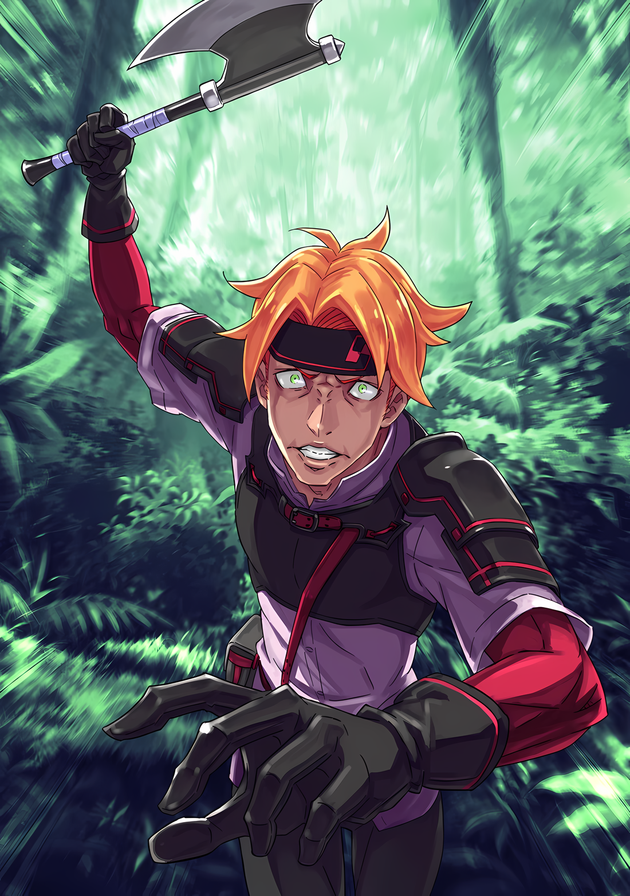

Угроза, которая поглощала его постепенно. Страдание, которое, казалось, превращало саму его кровь в магму. Вместе они разрушили существование Нацуки Субару, пытаясь обнажить его неприкрашенную сущность.

Сверхурочное время такой жестокости, как сдирание струпа, который еще не полностью зажил, и обнажение сырой раны под холодным воздухом. ……Его душа столкнулась с реальностью, которую невозможно было защитить.

Будет ли это боль, горе или печаль?

Или, возможно, это было бы что-то совершенно другое; Субару понятия не имел.

Если и было что-то, что он действительно понимал, если было что-то, что служило спасением, то это было только одно.

А именно, что безнадежность, которую он чувствовал, исчезнет прежде, чем он сможет найти ответ, и что ложное чувство свободы исчезнет.

???: ……Заткни свои хрипы и вздохи, ты.

Субару: Мгха

Освободившись от своих прежних страданий, Субару широко открыл рот, который должен был покрыться пеной крови.

Его тело было пустым, как будто кто-то пробил дыру в его легких, когда он задыхался от нехватки кислорода. И как раз в тот момент, когда он попытался вдоволь насладиться его безвкусной добротой, что-то было засунуто ему в рот против его воли.

Субару осыпали словесными оскорблениями, когда он отшатнулся от непредвиденного удара, кашляя и отплевываясь.

И все же он не мог сказать, что происходит. Он не мог как следует видеть. Напряжение, которое он почувствовал на своем лице, служило доказательством того, что что-то было обернуто вокруг его глаз. Его лицо было связано.

……На самом деле, нет, его лицо было не единственным, что было связано. Его руки и ноги также были связаны.

И пока он был в таком состоянии, кто-то засунул ему что-то в рот.

Субару: Угх! Бхве! П-почему я связан… гвуэ!?

???: Какого черта ты бросаешь мне вызов? Неужели ты не понимаешь, в каком положении находишься?

Субару: Гха, гхк……!

Эта жестокая фигура пнула Субару в живот сразу после того, как он выплюнул то, что было засунуто ему в рот. От удара у него перехватило дыхание, когда он упал, а его противник плюнул ему вслед.

Даже унижение от того, что его окатили их слюной, побледнело перед болью, которую он почувствовал, пронзив грудь. Тем не менее, разум Субару был охвачен морем замешательства, когда его лишенное зрения мерцало красным от боли.

……То, что произошло несколько десятков секунд назад, крутилось у него в голове.

Субару: …………

Субару разбудил Тодд, вывел за пределы палатки, и там огромный лес был подожжен. И сразу после того, как он узнал, что это произошло из-за его собственной оплошности, он был поражен стрелой в спину и упал. Это была молодая девушка. В тот момент, когда он посмотрел на нее, силы покинули его, все его тело сотрясалось в конвульсиях.

Он страдал, пока пенилась кровь, он слышал голос Рем, когда она бросилась к нему, он пытался удержать свое угасающее сознание……

Субару: Это место……

???: Аа? Как долго ты собираешься дурачить……

????: ……Эй, эй, расслабься! Он совершенно невежественен! Ничего не поделаешь! Вместо этого! Давай снимем с него повязку!

Субару: ……Ах

Его мысли, охваченные водоворотом хаоса, были возвращены к реальности разговором, происходившим наверху.

Разговор между двумя мужчинами. Один из голосов был хриплым, принадлежал мужчине, который был похож на само воплощение хамства и грубости. Другой звучал как бархат и производил хорошее впечатление человека, который мог все сгладить.

……Лица, которые сопровождали эти голоса, как само собой разумеющееся всплыли в голове Субару.

???: Тц.

Со звуком щелчка и шагов человек, который пнул Субару, отодвинулся от него. И сразу после этого Субару услышал вздох, в котором смешались потрясенное раздражение и ирония.

????: Прости, что с тобой так поступили сразу после того, как ты проснулся. Я думаю, ты, наверное, чувствуешь себя сбитым с толку и все такое, но я просто сниму с твоих глаз повязку, хорошо? Хотя я не могу снять веревку с твоих рук и ног, так что тебе придется потерпеть.

Субару: …………

Сказав это, когда он подошел к Субару, он снял повязку с глаз, которая была обернута вокруг головы Субару.

Субару глубоко вздохнул, прежде чем насладиться ощущением свободы вместе с сопровождавшей его легкой болью. Затем он сделал еще один глоток, и еще один, прежде чем, наконец, слегка задержал дыхание.

После этого он открыл веки и медленно подождал, пока к нему вернется зрение.

И……

Субару: ……Я так и знал.

То, что развернулось перед глазами Субару, как только его затуманенное зрение постепенно обострилось, были палатки, костры и суетящиеся фигуры Имперских солдат.

Субару находился в знакомом, хотя и не очень знакомом Имперском Лагере… месте, которое они экспроприировали, где он сновал туда-сюда, выполняя случайную работу.

Субару: …………

В самой сцене не было ничего странного.

В конце концов, именно здесь, в этом лагере, он был ранен стрелой. Тогда что было такого странного в том, чтобы проснуться здесь, после его лечения после того, как он пришел в сознание?

Тем не менее, он все еще не мог объяснить такие вещи, как первый удар……тот факт, что ему в рот засунули ботинок, и тот факт, что его руки и ноги все еще были связаны, чтобы убедиться в своей гипотезе.

Даже учитывая, насколько Субару был далек от того, как действовала Империя, если бы никто не обратил внимания на такой здравый смысл, когда люди связывали бы руки и ноги каждый раз, когда с последним обращались, тогда он пожелал бы разорения страны.

Другими словами, если это было не так, то это означало, что……

Субару: Наверное, я, должно быть, умер.…?

……Самым естественным было думать, что он «Посмертно Возвратился».

Как ни странно, ему с готовностью пришла в голову идея подтвердить это. Ему просто нужно было бы повернуть голову и устремить взгляд на зеленый лес за лагерем.

Результатом собственной оплошности Субару стало то, что джунгли сгорели дотла, позволив Имперским солдатам уйти с этим безрассудством.

Черный дым должен был подниматься из леса, окутанный адским пламенем. И все же он все еще стоял там. Слева от него, справа, зеленые джунгли простирались до самого горизонта, в идеальном состоянии.

Субару: …………

Сцены живо всплыли в его памяти сразу после подтверждения этого.

Субару упал из-за ранения стрелой, изо рта у него шла пена. Рем подползла к нему, и там он услышал ее голос, ее присутствие, ее мольбу, умоляющую его не умирать.

И все же Субару предал ее в тот момент. В конце концов он умер мучительной смертью у нее на глазах.

Человек, который знал ее, даже если она ненавидела его, в конце концов умер в этой богом забытой стране. Одно только представление о том, сколько страха и беспокойства испытала бы страдающая амнезией Рем, разрывало его сердце на части.

В то же время, он поразмыслил. ……То что больше не хочет, чтобы она это когда-либо чувствовала.

????: Мы нашли тебя как раз тогда, когда вышли за водой, да. Извини, но тебя схватили. Ты наш пленник.

И вот, мужчина присел перед ним на корточки, так как его сердце было переполнено сильными эмоциями.

Индивидуум одарил его бархатной улыбкой, его глаза сияли. Субару знал, кто он такой ……Тодд.

Единственный человек, который вел себя дружелюбно по отношению к Субару и Рем, в этом лагере, полном Имперских солдат.

Он был человеком, который терпеливо проводил время с Субару, последний так мало знал об Империи; Субару даже считал тот факт, что он был подобран им поначалу, удачей.

Так было до тех пор, пока он не сжег лес дотла, используя слова Субару в качестве предлога.

Субару: …………

Физически прошло едва ли десять минут, но от его беззаботного отчета по спине Субару пробежали мурашки.

Имперские солдаты безжалостно сожгли лес дотла, сразу после того, как они решили, что войти в лес, чтобы вторгнуться в «Племя Судрак», цель, для которой были посланы войска, окажется проблематичной. И вдобавок к этому они похвалили Субару за его вклад, поскольку он предоставил им информацию, которая в конечном итоге стала решающим фактором для их выбора.

В Священной Империи Волакия сильных почитали, а слабых угнетали.

Это была великая нация, которая придерживалась вероучения, что только в «Волке-Мече», символе волка, пронзенного мечами, были качества, необходимые для жизни.

Такой менталитет, как у Тодда, вероятно, не был чем-то необычным в Империи.

Он даже мог понять, почему они решили поджечь лес, как только услышали, что внутри находится Зверодемон.

Тем не менее, они не очень хорошо сочетались бы с жителями Королевства Лугуника, не говоря уже о Субару. Может быть, в лучшем случае Розвааль, так как он был сгустком рационализма.

В любом случае, на этот раз он не должен позволить им сжечь лес дотла.

Субару: …………

Субару судорожно сглотнул, восприняв случившееся в прошлый раз как свою неудачу.

Тот факт, что Субару в конечном итоге погиб, был чем угодно, но тот факт, что они сожгли лес, зашел слишком далеко, даже если Имперские солдаты сделали это в качестве меры безопасности.

Если бы не оплошность Субару, оставался шанс, что Тодд и «Племя Судрак» нашли бы место, где можно было бы дружелюбно обсудить ситуацию, и их переговоры увенчались успехом без пролития крови.

Он отнял эту возможность и навлек опасность на людей в лесу. ……Нет, он не должен уклоняться от ответственности, которую нес здесь. Не было абсолютно никакой возможности, чтобы в этом аду не было жертв.

Из-за своей собственной оплошности Нацуки Субару пожал жизни людей, которые жили в лесу.

Даже если бы он не мог вмешиваться в то, что произошло в той мировой линии, из-за «Посмертного Возвращения», факт все равно оставался фактом. ……Субару никогда этого не забудет.

Субару: …………

Таким образом, Субару решил для себя, что он не повторит одну и ту же ошибку дважды.

«Смерть» была тяжелой вещью, и независимо от того, был ли это он или другие, он никогда не позволил бы этому повториться снова. С этими мыслями, затуманившими его разум, было небольшой милостью, что он повторил свою первую встречу с Тоддом и Джамалом здесь.

Точка перезапуска его «Посмертного Возвращения» была обновлена. Он вернулся на эту точку после того, как Рем сбила его с ног на лугу, после того, как он убежал от Охотника в лесу и яростного нападения Зверодемона, туда, где его подобрал Имперский Лагерь.

С этого момента он установит дружеские связи с Тоддом, а также с Джамалом, если это возможно, и заставит их начать переговоры таким образом, чтобы они не разорвали на части «Племя Судрак» в лесу.

Итак, для этого он……

Тодд: Хей, ты, ты слушаешь? Я понимаю, что тебя смущает, что тебя ни с того ни с сего называют пленником, но….

Субару: …… Ну, да, я думаю. Я в замешательстве. Но даже если это так, ну, понимаешь….

Присев на корточки перед молчаливым Субару, Тодд немного поразмыслил над своими чувствами. Субару погрузился в раздумья, решая, что сказать дальше, когда он принял позицию Тодда.

В прошлый раз его отношения с Тоддом были хорошими. Субару действительно нужно было поддерживать его, и они с Рем получили бы максимальную отдачу от этой темы.

Более того, Субару нужно было тщательно выбирать то, что он знал, чтобы сдерживать свое экстремальное поведение.

Субару: Ты напугал меня, но я знаю, что меня взяли в плен. Я также помню, как нырял в реку. Если вы все спасли меня оттуда, тогда вы должны быть нашими спасителями….

Тодд: Подожди секунду.

Субару: А?

Приняв все сначала, Субару тщательно изучил ситуацию, в которой он оказался. Затем он попытался изобразить что-то естественное, похожее на человека, которого только что вытащили из реки.

Однако Тодд протянул руку к лицу Субару, прерывая то, что тот говорил.

Ладонь его руки вместе с пятью растопыренными пальцами закрыла Субару обзор, заставив Субару замолчать в ответ.

Затем……

Тодд: ……Почему ты только что так на меня смотрел?

И сразу после того, как Субару уловил холодный, жесткий голос Тодда, он почувствовал, как что-то острое вонзилось ему в правое плечо.

Из-за того, что его поле зрения было закрыто, реакция Субару на действия Тодда была медленной. Он перевел взгляд туда, где болело его правое плечо, и только тогда понял, что произошло.

……Острие кинжала было воткнуто в правое плечо Субару.

△▼△▼△▼△

Субару: ……Кхх!?

В тот момент, когда он понял, что произошло, в горле Субару зародился беззвучный крик.

Ощущение, очень похожее на жжение, взорвалось в правом плече Субару, и вместе с острой болью пришло ощущение, что его пронзили булавки и иглы, которые пронзили все его тело. Если бы он инстинктивно не растянул и не рассеял боль во всем теле, максимальный уровень терпимости был бы превышен, и он не смог бы удержать свой разум от достижения критической точки.

Шок от неожиданной колотой раны был просто огромен.

Субару: Гха… ааааааААА……!!

Мгновение спустя, вслед за беззвучным криком, раздался запоздалый крик, вызванный болью.

Ему хотелось скорчиться, пошевелить плечом и потереть его, надавить на него или предпринять какие-либо действия, чтобы уменьшить боль. Но руки и ноги Субару были связаны, и он ничего не мог сделать, чтобы вытащить нож, воткнутый ему в плечо. Больно, больно, больно, больно.

???: Э-эй! Что это был за крик только что!

От боли и агонии Субару кричал снова и снова. Это был Джамал, грубоватый мужчина с повязкой на глазу, который поспешно вбежал, услышав тревожный звук.

Джамал, который только что пинал Субару в яростной демонстрации силы, широко открыл глаза, увидев изображение Субару с ножом в правом плече, кричащего с кровью.

И затем……

Джамал: Тодд, это не то, о чем мы договаривались! Разве не ты сказал, что протянешь им руку, раз у них был этот аристократический нож!?

Тодд: Ах, таков был план, потому что я не знал происхождения этих парней. Я должен был знать, что ты разозлишься из-за этого только потому, что это отличается от того, что я сказал. Виноват, виноват.

Джамал: ……Если ты так говоришь, значит ли это, что ты знаешь, кто этот парень?

Хотя он говорил грубым голосом, он восстановил самообладание, услышав ответ Тодда. Однако в ответ на вопрос Джамала Тодд просто сказал: “Кто знает?” и наклонил голову.

Не останавливаясь, Тодд сбил Субару, который вскрикнул от боли, и наступил на него.

Тодд: Я не слышал, откуда он и кто он такой, так что понятия не имею. Но есть большая вероятность, что он наш враг. Итак, это был упреждающий удар.

Субару: Гх, гхаа…… ~кх

Тодд: О, выглядит болезненно. Мы не можем избежать того, чтобы ты немного пострадал, но, похоже, у тебя есть некоторая терпимость к боли, знаешь. Где твое самоуважение?

Сильно вдавив ногу в тело Субару, Тодд спокойно спросил.

Однако, когда вес Тодда вдавил упавшего Субару в землю, нож в его плече еще глубже вошел в рану, и возвращение невыносимой агонии не оставило ему возможности ответить Тодду.

Его зрение затуманилось, горло горело, кровавые крики раздавались снова и снова. Независимо от того, сколько раз это повторялось, боль не проявляла никаких признаков ослабления. Не теряя ни секунды, это стало новым отчаянием и продолжало атаковать Субару, как волны, разбивающиеся о берег.

Тодд: Он не отвечает. Как вызывающе. Похоже, он все-таки враг.

Джамал: …Если его так катают, он не сможет ответить, даже если бы мог, знаешь.

Тодд: Хм? Это так? Ой. Когда я вялый от боли, я всегда путаюсь в подобных ситуациях. Виноват, виноват.

Сказав это, Тодд наконец убрал ногу с тела Субару.

Дополнительная боль исчезла, но прерывистая боль продолжала жалить Субару, и невыносимая агония заставила его прикусить губу, и изо рта потекла кровь.

Из уголков его глаз тоже текли слезы, и, к несчастью, он даже не мог их вытереть.

Джамал: Ты… После такого я не знаю, как ты можешь предупреждать меня о моем плохом поведении….

Тодд: ……? Разве не ты бьешь военнопленных и своих подчиненных, чтобы снять стресс? Так что не шути, изображая из себя высокомерного и могущественного. Я делаю только то, что необходимо.

С другой стороны, игнорируя позорное зрелище Субару, двое мужчин продолжали разговаривать над его головой.

Когда Джамал успокаивал Тодда и указывал на кровопролитие Субару, развернулась сцена, немыслимая совсем недавно.

Что за бред происходит?

Хотя большая часть его умственных ресурсов была направлена на то, чтобы переносить боль, эта точка зрения была слишком бессвязной.

Почему Тодд, который так хорошо относился к Субару и его группе, предпринял такие действия……

Джамал: Итак, почему ты ударил его ножом?

Странно, но Джамал задал Тодду тот же вопрос, что и Субару.

Когда его спросили, Тодд закрыл один глаз и посмотрел в сторону Субару, который корчился в агонии.

Тодд: Когда я снял с его глаз повязку, и он посмотрел на меня, его глаза были полны решимости манипулировать мной. Я мог понять нервозность или неловкость. Плакать от страха тоже было бы неплохо…… Но попытка манипулировать мной подозрительна, не так ли?

Джамал: Манипулировать, ха.

Тодд: Этот парень был без сознания, его разбудили пинками, с его глаз сняли повязку, и первое, что он пытается сделать, это использовать первое лицо, которое он увидел? Может быть, он такой и есть, но этот парень пугающий, и с ним просто невозможно справиться. Мы должны немедленно его убить.

Тодд настойчиво высказывал свое собственное аргументированное мнение в отличие от вдумчивого Джамала.

Причина, по которой Субару получил нож в плечо, заключалась в том, что Тодд посчитал Субару опасным. И лучший способ справиться с опасными противниками — это нейтрализовать их.

Вот почему Тодд ударил Субару ножом в правое плечо. ……Потому что Тодд знал, что пальцы левой руки Субару были сломаны и, следовательно, бесполезны.

С ранением в правое плечо и сломанными пальцами левой руки функция обеих рук Субару была значительно снижена.

Чтобы обеспечить собственную безопасность, Тодд немедленно принял решение и просто действовал в соответствии с ним.

……Просто.

Джамал: Я не знаю, как ты можешь думать об этом сразу после того, как проснешься. Возможно, я все еще в середине пробуждения, напрягаю слух, стоя здесь и пытаясь услышать это….

Тодд: Нет, дело не в этом. Должно быть, он притворялся спящим все то время, пока я наблюдал за ним. Если бы он пришел в сознание где-то по дороге, у него должна была быть какая-то физическая реакция. Предположим, я не заметил, как он притворялся спящим, тогда….

Джамал: Тогда?

Тодд: Тогда он планировал попытаться манипулировать мной, обманывая меня и притворяясь спящим, не так ли? Этот метод еще более пугающий. Как я и думал, убить его, похоже, было бы правильным ответом.

Услышав это, Субару ахнул и задрожал, борясь с болью.

Слушая объяснения Тодда, тон Джамала постепенно ослабевал. Сначала он, должно быть, был шокирован и зол из-за того, что Тодд подрезал Субару, но мало-помалу его ярость утихла.

Тон голоса и манера говорить Тодда обладали очарованием, которое смягчало эмоции другого человека.

Наблюдая с позиции третьей стороны, он наконец-то смог это увидеть.

Тодд сближался с другим человеком, демонстрировал свое понимание, а затем предлагал привлекательные предложения, которые были выгодны им вдобавок ко всему. Сначала был подавлен импульс, затем, когда другой человек стал более непредубежденным, предложенное предложение было бы тщательно рассмотрено, и, вопреки здравому смыслу, стало бы желательно довести его до конца.

Именно это и происходило с Джамалом прямо сейчас, на его глазах.

И то же самое случилось с Субару как раз перед тем, как он использовал «Посмертное Возвращение».

Тодд: Молодые леди, которые с ним, тоже подозрительны, но эти двое прямолинейны и с ними легко общаться. Давай избавимся от этого, пока не возникло никаких проблем.

Джамал: Ну, я думаю, будет норм, но….

Тодд: Или ты хочешь быть тем, кто это сделает? Чтобы твой гнев не вышел из-под контроля из-за той синеволосой девушки, которая ранила твоих парней, тебе нужен кто-то, кто снимет твой стресс, верно?

Джамал: ……Это тоже правда.

В ответ на спокойное предложение Тодда на лице Джамала появилась вульгарная улыбка.

Вот так просто Джамал прошел мимо Тодда, хрустя костяшками пальцев. Признаки насилия, проявленные Джамалом, заставили Субару съежиться, но замечание Тодда заставило его задрожать еще больше.

Во многом похожий на то, как он предложил Субару Джамалу для снятия стресса, Тодд был готов исследовать его намерения по-другому, если он в конечном итоге устранит Субару здесь.

Для этой цели он использует Рем, а также Луис.

Но что бы ни спросили, они оба не смогли бы ответить. Какой бы жестокой ни была пытка, у Рем не было никакой информации, которую она могла бы раскрыть.

Другими словами……

Субару: ……тч

Резко прикусив зубами, он почувствовал во рту привкус крови, пока Субару искал способ не дать Рем попробовать то же самое. Через несколько секунд насилие Джамала возобновится, и Субару либо погибнет, либо останется полумертвым от его жестокого нападения. Даже если бы у Джамала была совесть, Тодд не оставил бы Субару в живых.

Тодд, который мог бы поджечь лес, также не моргнул бы глазом, когда дело дошло бы до тушения жизни Субару.

Шаг за шагом Джамал приближался.

В это время мозг Субару пришел в овердрайв, ища внутри себя ответ. Чтобы выйти из тупика нынешнего положения дел, какой-то план, возможность, ему нужно было чудо……

Джамал: Чтобы снять мой стресс, тебе лучше кричать как можно громче, сукин ты сын. А что касается твоей девушки, я заставлю твое тело заплатить….

Субару: «Племя Судрак».

Джамал: …………

Джамал выплюнул свои стереотипные жестокие угрозы прямо на грани того, чтобы ударить Субару…… но губы Субару сложили эти слова вместе.

В этот момент движение Джамала остановилось, и выражение лица Тодда на заднем плане тоже изменилось. На лице Джамала отразилось явное удивление, в то время как Тодд приподнял одну бровь: “О?”, и ухмыльнулся.

Тодд: «Племя Судрак»…… Ты решил разыграть эту карту сейчас? Похоже, ты хорошо знаешь, как играть в азартные игры.

Джамал: Тодд, что говорит этот сопляк….

Тодд: Подожди-подожди, Джамал. Ты можешь ударить и пнуть его после. Но трудно понять голос человека с раздавленным языком и горлом. Будет лучше, если мы послушаем здесь.

Джамал: Блять!

Не имея возможности направить свой гнев, Джамал грубо пнул ближайшие деревянные перила.

Тодд покосился на буквальное рассеивание гнева и повернулся к Субару. Улыбка на его лице, к ужасу, ничем не отличалась от той, которую знал Субару.

Точно так же, как он делал, когда лечил пальцы Субару, приглашал Субару поесть и хвалил Субару за его вклад в сжигание леса, Тодд ухмыльнулся ему, когда тот стоял на краю пропасти между жизнью и смертью.

Тодд: Итак, всплыло название «Племя Судрак». Интересно, могу ли я ожидать услышать от тебя что-то такое, что сделает меня счастливым?

Субару: …Ах. Вы знаете, где находится «Племя Судрак» в лесу?

Тодд: ……！О, это здорово!

Улыбаясь, Тодд хлопнул в ладоши перед грудью в знак радости.

Видя его реакцию, Субару был уверен, что чудо, которое он вытащил из себя, помогло избежать надвигающегося затруднительного положения. Однако в то же время для Субару это был обоюдоострый меч.

В конце концов, Субару не знал, где находится «Племя Судрак».

Мужчина в маске, который вручил ему нож, охотник, который стрелял в него из лука…… Возможно, один из них или оба были связаны с «Племенем Судрак», но у него не было возможности связаться с ними или узнать конкретно, где они находятся.

……Другими словами, Субару поставил свою жизнь на эту большую авантюру.

Тодд: Откуда ты знаешь местонахождение «Племени Судрак»?

Субару: ……Потому что я один из «Племени Судрак».

Тодд: Понял, в конце концов, так оно и есть. Если не считать цвета кожи, то это черные волосы, понимаешь? Поэтому мне было интересно, так ли это. Так как это известный слух, что у судракийцев черные волосы.

Субару: …………

Субару испытал огромное облегчение, когда фортуна улыбнулась ему, и он получил эту информацию, которая была ему совершенно неизвестна.

Все его тело было покрыто жирным потом, и напряжение разговора заставило Субару вдобавок покрыться холодным потом. Боль в плече усиливалась, и боль в пальцах левой руки тоже начинала беспокоить его.

Вдобавок ко всему, его телу еще предстояло оправиться от суматохи на Сторожевой башне Плеяд, или от неприятностей с Рем в лесу, или от бремени побега к реке сразу после этого.

Едва держась за свое мимолетное сознание и сломленный дух, он продолжил допрос. Один неправильный ответ приведет к его смерти. ……Все было для того, чтобы выжить и спасти Рем.

Вернуться к Эмилии, Беатрис и всем остальным и воссоединить Рам и Рем.

Тодд: Итак, по сути, ты разведчик. И твоя одежда и нож были готовы слиться с нами.

Субару: …… Я украл нож у путешественника. То же самое касается и одежды. И….

Тодд: Ты пытался получить о нас какую-то информацию. Должен сказать, довольно смелый план. Похоже, ты действительно тонул, и был шанс, что мы не заметим нож….

Субару: Но так было более реалистично, не так ли?

Даже когда его предполагаемый план был назван небрежным и ошибочным, Субару отшутился, сказав, что все это было нарочно.

Изобразив на лице наглую улыбку, он оскалил зубы и придал своим злобным глазам более угрожающий вид. Это был его поступок, чтобы сделать свой блеф более правдоподобным.

Тодд прищурился на Субару, пытаясь понять его истинный мотив.

Тодд: …………

Тишина была оглушительной, и петля на шее Субару затягивалась с каждой секундой.

По правде говоря, он понятия не имел, были ли его слова вообще убедительными. Он также не мог сказать, был ли его поступок убедительным. Боль и стресс, которые он испытывал, были слишком сильны, чтобы даже задуматься о своем выступлении.

Ему казалось, что он придумывает смешные оправдания, и было бы неудивительно, если бы в следующий момент он раскроил себе голову, отмахнувшись от него как от нелепого, фыркнув.

Не в силах прочесть выражение лица Тодда, напряжение в комнате усилилось.

И через некоторое время……

Тодд: ……Ты, ты бы продал свое племя за свою жизнь?

— спросил Тодд, закрыв один глаз. Субару сглотнул.

Он произнесет те слова, которые ему нужно было произнести. Все, что ему нужно было сделать, это не отвечать неправильно.

Он бы продал свое племя за свою жизнь.

Заявив, что он является членом «Племени Судрак», он предаст «Племя Судрак».

Он не мог позволить им обнаружить, что это был фарс. Чтобы помочь ему, он должен был принять необходимое выражение и голос.

……Выражение лица и голос жалкого подхалима, который продал бы свое собственное племя за свою жизнь.

Субару: …Да, да, это так. Я их продам.

Тодд: …………

Субару: Пожалуйста, я сделаю все, что угодно. Я даже выманю их, если хочешь. Все, что угодно, я сделаю все, что угодно!

Заикаясь, подергивая щеками, измазанный холодным потом, Субару умолял сохранить ему жизнь.

Цепляясь за свою жизнь, пренебрегая жизнями других, не позволяя другим видеть себя в каком-либо положительном свете, он должен был превратиться в воплощенный эгоизм.

Но ему оставалось только действовать.

За время своего пребывания в этом мире Субару повидал много людей с таким мышлением.

Он не думал, что настанет день, когда он будет подражать самым бесчеловечным из нелюдей, Архиепископам Греха.

Джамал: Знаешь, ты отвратительный парень. Ненавижу этот нехороший взгляд в твоих глазах.

Джамал выплюнул свои истинные чувства, услышав, как Субару умоляет сохранить ему жизнь. Его презрение и гнев были очевидны.

Казалось, что выступление Субару заставило Джамала составить о нем негативное мнение. Но, если быть до конца честным, хотя он и чувствовал себя плохо, у него не было времени разбираться с проделками Джамала.

Прямо сейчас право решать судьбу Субару принадлежало Тодду.

Ранг или положение человека здесь не имели значения. Сильные едят слабых. Он будет следовать девизу Империи до конца.

Тодд: …… Эта серьезность, ты, кажется, не лжешь.

Тодд наконец ответил Субару, который с большим усилием сохранил послушное выражение лица.

Услышав это, Субару чуть не подпрыгнул от радости от своей крошечной победы. Хотя он молился, чтобы это не было преждевременным празднованием. В то же время Джамал заговорил, недовольный этим.

Джамал: Эй, Тодд! Ты веришь тому, что говорит этот парень? Этот кусок дерьма, который продал бы своих людей за свою собственную жизнь, был бы….

Тодд: Подожди-подожди. О чем ты говоришь, Джамал? Это слова подхалима, который предал бы свой народ ради самого себя. Конечно, он показал бы, как много у него есть. Иначе он не смог бы спасти свою собственную драгоценную жизнь.

Джамал: ……~тц

Вспышка Джамала была заглушена рассуждениями Тодда.

Конечно, этот “раболепный и раболепный подхалим” был именно тем образом, который Субару хотел, чтобы Тодд имел о нем. Тип человека, который обманул бы своих товарищей только для того, чтобы спасти свою собственную шею. Чтобы сделать его историю правдоподобной, Субару пришлось бы опустить свою репутацию на самое дно.

В этом отношении большая сцена, которую он устроил после того, как получил удар ножом в плечо, тоже должна была помочь в этом отношении.

Хотя боль, которую ему пришлось испытать в результате, была слишком велика для утешения.

Джамал: Не вини меня, если что-нибудь случится!

В конце концов, в точности по плану Субару, Тодд убедил Джамала.

Предостерегая его, Тодд похлопал Джамала по плечу, говоря: “Доверься-доверься”.

Тодд: Нет никакой ошибки в том, что он привязан к жизни. ……Независимо от того, его она или нет.

— сказал Тодд, глядя на кроткого, подавленного Субару.

△▼△▼△▼△

Рем: ……! Подождите минутку! Что вы планируете делать с этим человеком!?

Сердито закричала Рем, хватаясь за прутья металлической клетки, в которой она была заключена.

В настоящее время они находились в лагере Имперской армии. Тодд и Джамал, выслушав заявления Субару, сразу же вытащили его и теперь были на пути из лагеря.

Рем, которую посадили в клетку после ее бурного пленения, начала кричать, когда трио просто случайно проходило мимо.

Субару: …………

Рем уставилась на потрепанного и изношенного Субару.

Его вытащили из реки, и его наполовину высохшая одежда все еще была тяжелой. Кроме того, колотая рана на его правом плече получила минимальное лечение, а сломанные пальцы на левой руке не получили никакого лечения. Даже если бы оковы на его ногах исчезли, наручники на руках лишили его свободы.

Внешне ничем не отличающийся от раба-рабочего, человека, которого вели за пределы лагеря, Нацуки Субару.

Увидев этого Субару, эмоции Рем были повсюду. Шок и удивление, все это в смятении. Конечно, Субару не смог объяснить ей ситуацию.

«Посмертно Возвратившись», тот небольшой прогресс, который был достигнут в отношениях между Субару и Рем, был сброшен, и его нужно было снова переделать с нуля.

Рем видела в Субару врага, основываясь на запахе ведьмы, который цеплялся за него. Субару не дали ни времени, ни возможности разрешить это недоразумение. Также……

Рем: ……ц!? Запах стал хуже с прошлого раза… Что это такое на самом деле?

Миазмы, которые будут сгущаться с каждым последующим «Посмертным Возвращением». Почуяв это, осторожность Рем поднялась на новый уровень.

Для нее Нацуки Субару с таким же успехом мог быть дитем тьмы.

Это причиняло боль сердцу Субару, но он не мог позволить себе совершить какое-либо действие, которое могло бы исправить это заблуждение, чтобы его не разоблачили.

Тодд: ……У вас двоих довольно запутанные отношения, не так ли? То, как она себя ведет. Разве ты не привел с собой ту девушку?

Субару: Эта девушка…… Нет, те двое были вместе.

Тодд: Те двое?

Субару: … Я купил их как инструменты, которые помогут при встрече с вами, ребята.

На мгновение он растерялся, не зная, как ответить. Но он надел свою бесчеловечную маску и ответил откровенно.

Субару, прямо сейчас, был хладнокровным человеком, который продал бы жизни своих товарищей, чтобы спасти свою собственную. Естественно, он ничего не чувствовал к Рем и Луис. Ему нужно было быть на сто процентов наполненным своей эгоистичной любовью к своей жизни.

Он не мог допустить, чтобы произошел сценарий, в котором они двое…… ну, по крайней мере, Рем была взята в заложники.

Субару: Так что я ничего о них не знаю. Нет смысла спрашивать их об этом и том…… Хотя ты, кажется, уже понял суть этого.

Тодд: Ну, я полагаю, это не было похоже на притворство? Маленькая мисси, похоже, на самом деле чокнутая, и эта мисси здесь не врет. Тем не менее, причина ее неистовства, столь расплывчатая, немного беспокоит.

Джамал: тц

Тодд с горькой улыбкой почесал щеку, в то время как Джамал раздраженно прищелкнул языком.

С ними двумя во главе группа из двадцати или около того Имперских солдат покинет лагерь вместе с Субару. Субару должен был привести эту группу в джунгли и показать им, где живет «Племя Судрак».

Он покажет им их поселение и приблизит Империю на один шаг к победе. И в награду за это его жизнь будет спасена. В конце концов, ужасные люди живут долго, таков был план.

План, который получил бы средние отзывы как история успеха новичка.

Хотя это произошло бы только в том случае, если бы кто-то игнорировал, насколько это было невозможно.

Субару: Не лучше ли было бы, если бы ты их выбросил? Я и в правду купил их. Если они вам не нужны, я буду рад получить их после того, как они выполнят свою работу….

Тодд: Ты слишком торопишься, нет? Хорошо думать о будущем, но не забывай, что твоя жизнь зависит от того, сможешь ли ты правильно выполнить свою работу или нет. Вместо того, чтобы думать о том, что с ними случится, тебе следует в первую очередь беспокоиться о себе.

Субару: Хехе, о да, именно так. Мое желание того, что будет после, ускользнуло.

Если бы он поднял шум из-за этого, его привязанность к Рем была бы обнаружена мгновенно, и столы были бы перевернуты на Субару.

Он не мог потереть руки из-за своих оков, но в глубине души именно так он общался с Тоддом. К счастью, Тодд не стал углубляться в свои слова. Махнув рукой в сторону запертой в клетке Рем

Тодд: Веди себя прилично, мисси. Если ничего не случится, с тобой тоже ничего не случится.

Рем: Как ты думаешь, твои слова имеют какой-то вес?

Тодд: Я не знаю насчет веса, но верить мне или нет — это твоя проблема, не так ли, мисси?

Когда Тодд сказал об этом, у Рем не было другого выбора, кроме как успокоиться, раздраженной.

Разочарованный тем, что он не мог поддержать Рем или даже поговорить с ней больше, чем сейчас, Субару запечатлел ее фигуру и голос в своем сознании. Он использовал бы их как топливо для своего духа.

……Так или иначе, он должен был вывести Рем из лагеря и сбежать.

Налаживание дружеских отношений с группой Тодда и привлечение их к защите его и Рем больше не было мыслью, которую развлекала Субару. ……Они представляли угрозу и как враг, и как союзник.

Их нельзя было контролировать, даже когда они были союзниками, и ему не нужно было указывать, насколько опасными они будут как враги.

Для начала, он должен избегать объединения с народом Волакии, насколько это возможно.

Положение Субару в Волакии было чрезвычайно сложным, и если бы он допустил ошибку, это не было бы проблемой, которая затронула бы только его самого. Это был еще один секрет, который он хранил.

Тодд: Хорошо, поехали. Будьте все начеку.

Джамал: Это я отдаю приказы!

Тодд окликнул свою команду, приведя с собой сверхсознательного Субару.

Среди ответов Имперского солдата на звонок Тодда ответ Джамала был очень откровенно сердитым.

△▼△▼△▼△

……После этого группа вторглась в джунгли Будхейма с Субару.

Их целью была деревня «Племени Судрак», которые жили в лесу, и их целью было точно определить их местоположение. ……Однако навигатор Субару блефовал, так как не знал, где находится деревня.

Далекий от этого, он делал ставку, лишь смутно зная о личности людей «Племени Судрак».

Субару: …………

Прогуливаясь по густому лесу, Субару ждал возможности как-нибудь улизнуть от группы.

Он был против большого количества людей, и даже если они были одеты в легкую броню, указанное снаряжение не позволяло им передвигаться быстрее, чем он мог. Если бы он мог воспользоваться их беспечностью и убежать, то, возможно, смог бы вернуться в лагерь быстрее, чем они, и взять Рем с собой во время побега. На самом деле, это был его единственный план на данный момент.

К счастью, клетку, в которую поместили Рем, можно было легко отпереть снаружи.

Важными вещами были получение Субару права на это от Рем и надежда, что она поверит в него и последует за ним, как только он откроет клетку. И, кроме того, существовал вопрос о существовании Луис.

Субару: Если я скажу, что оставляю Луис позади, Рем никогда не пойдет со мной….

В дополнение к нынешней ситуации, он лишил значительную часть доверия Рем добавленными миазмами через «Посмертное Возвращение».

Даже если бы Субару отчаянно помчался обратно в лагерь в таком состоянии, Рем не приветствовала бы его решение оставить Луис позади. Отнюдь нет, она тут же втопчет его в землю, сама спасет Луис от него, а также существовала вероятность того, что она бросит его в лагере Империи.

Субару: ……Я думаю, этого не произойдет, даже если Рем будет враждебна ко мне. В конце концов, ее ноги не могут свободно передвигаться.

Она не могла пройти через эти события, которые он себе представлял, исключительно из-за состояния ее ног, поэтому, если бы она была в хорошей физической форме, Субару не стал бы упускать возможность осуществить это на самом деле. Это было то, что он думал, но это доставило бы ему неприятности, если бы она так поступила.

Так что, если Субару собирался забрать ее из этого места, то он должен был взять с собой и Луис. Таким образом, это вынудило Субару столкнуться с трудностями, связанными с невозможностью отказаться от этого негативного фактора, который следует называть оковами, независимо от того, куда он пошел или что сделал.

И затем……

Тодд: Итак, сколько времени пройдет, пока мы не прибудем в деревню?

Субару: ……Около двух-трех часов.

Тодд: От двух до трех часов! Это довольно быстро. Если это все, что нужно, то я не мог бы желать ничего большего. С нашей точки зрения, это должна была быть миссия, на выполнение которой ушли бы годы.

Получив ответ на свой вопрос, Тодд расплылся в улыбке, по-видимому, считая свое положение удачным.

Услышав его слова и увидев его одетым в легкую броню с топором, висящим на поясе, Субару вспомнил, что Тодд присоединился к миссии, оставив свою невесту.

Это должно быть совершенно очевидно, но даже если бы он принял решение, которое нанесло раны Субару, не похоже, что история, стоящая за его обстоятельствами, полностью изменилась бы.

Тодда отправили в джунгли в качестве Имперского солдата, следуя его приказам, и для этого его неизбежно разлучили со своей невестой.

То же самое можно сказать и о некоторых сослуживцах Тодда, таких как Джамал. У них тоже были свои собственные обстоятельства, стоящие за их действиями, и поэтому у каждого из них должна быть причина участвовать в подобной миссии.

В этом смысле у Субару и группы Тодда не было причин враждовать друг с другом.

Субару просто не повезло. Его несчастье навалилось само на себя. Ситуация оборачивалась против него. Вот чем было бы все это дело, если бы он выстроил набор слов таким образом.

Однако……

Субару: …Я не думаю, что мне следует это говорить, но разве это не опасно? Только с таким количеством людей, хотя мы направляемся в деревню «Племени Судрак»……

Идя впереди очереди в качестве лидера, Субару окликнул Тодда, который шел прямо за ним.

В группе было около двадцати Имперских солдат. Несмотря на то, что с ними был проводник, нельзя было сказать, что там было достаточно людей, чтобы исследовать обширный лес.

Тодд пожал плечами в ответ на сомнения Субару

Тодд: Ничего не поделаешь. Ты великолепный источник информации, но начальство не ожидает многого от твоей истории. Информация становится ценной только тогда, когда мы выходим и подтверждаем ее. Также….

Субару: Также?

Тодд: Если это окажется вашей ловушкой, и моя группа не вернется, наше отсутствие сообщит нашим союзникам в лагере, что входить в лес опасно. Ха-ха, да здравствует Волакия.

Имперские солдаты: ……Да здравствует Волакия!

Жертвоприношения ради достижения победы были неизбежны. Тодд, казалось, демонстрировал это своим непринужденным отношением, Имперские солдаты следовали за его песнопением своими собственными.

Да здравствует Волакия! Их голоса заставляли дрожать атмосферу леса, звуча как свидетельство того, насколько они были преданы стране, которая превыше всего ценила силу.

В любом случае……

???: Сейчас самое время беспокоиться о нас, а? После того, как это будет сделано, нет никакой гарантии, что твоя голова и тело останутся на месте. По крайней мере, сделай все возможное, чтобы ублажить нас.

Субару: Джамал-сан….

Джамал: Не называй меня по имени, ты, ебучий предатель. Тебя разрежут на куски и выбросят куда-нибудь, а женщина и ребенок будут… хм… может быть, я предложу их распутному Генералу Второго Класса Зикру. Он определенно будет вне себя от радости.

Тодд: Джамал…… не говори ничего слишком глупого. Это меня утомляет.

Действуя так, как будто он абсолютно ненавидел Субару, взгляд и голос Джамала были полны злого умысла.

Добавляя к этому, Субару и Рем также не ладили друг с другом, поэтому, если он заставит Джамала провести решающий голос за ситуацию, то результаты вполне могут оказаться худшими для Субару.

Как и ожидалось, именно Тодд попытался подавить гнев Джамала, сказав: “Успокойся”.

Тодд: Скорее, не забывай, что это мы должны ублажать этого парня. Он предоставит нам необходимую информацию, чтобы спасти свою шкуру. Мы спасем его в обмен на это. Если нет, то на нас нападут судракийцы, как только мы прибудем в деревню.

Джамал: Давай же. Если они собираются выкинуть что-то подобное, мы можем уничтожить……

Тодд: ……Ты серьезно? Я не могу вступить в бой, в котором не вижу шансов на победу. Ты тоже не хочешь превращать свою младшую сестру во вдову до того, как она выйдет замуж. Верно? Зятёк?

Джамал: Гх….

Тодд убедил Джамала, который часто говорил, игнорируя все мысли.

Субару мельком увидел неизвестные отношения между ними, но это, к сожалению, не тронуло его чувств. Он уже укрепил свою решимость против Тодда и его группы.

……Их встреча, ситуация, его удача. Все это было ужасно

Субару: ……Но Рем для меня важнее.

Вот почему Субару решил подвергнуть их опасности.

Имперский солдат: ……?

Внезапно, в конце поисковой группы, которая была организована в линию, один из Имперских солдат издал тихий горловой звук. Он склонил голову набок, как будто что-то заметил, ища причину этого в своем поле зрения.

Малейшее ощущение, что что-то не так. Он искал его, не в силах просто игнорировать, его взгляд метался по джунглям кругами, а затем……

Имперский солдат: ……А?

Среди темноты леса его глаза встретились с красным мерцанием, которое поднялось на поверхность.

Имперский солдат: Это Зверодемон…!!

Другие Имперские солдаты: ……!?

Сразу же после зрительного контакта Имперский Солдат, обнаруживший “это”, мгновенно предупредил своих союзников об осторожности.

До этого момента его реакция была безупречной, и можно было сказать, что со стороны солдата вины не было. То же самое можно было сказать и о его союзниках, которые приготовились к бою, прислушавшись к первому призыву солдата.

Однако они, не теряя времени, атаковали Зверодемона в тот момент, когда обнажили свои мечи.

……Это можно было бы точно отметить как опрометчивость.

Имперский солдат: Ууоооо!!

Имперский солдат выхватил меч, пробежал через лес и бросился на своего противника, огромную змею, которая обвила свое гигантское тело…… это был змееподобный Зверодемон, покрытый зеленой чешуей, и его полный рост около десяти метров в длину.

Будучи того же вида, что и Зверодемон, с которым Субару столкнулся в лесу, его существование было как гром среди ясного неба для Имперских солдат, которые не знали о существовании Зверодемонов в лесу.

Однако их попытка немедленно разобраться со Зверодемоном, прекрасно понимая, насколько это может быть опасно, была ошибкой именно потому, что это было правильное решение. ……Зверодемон не гнался за ними.

Его целью был не кто иной, как Нацуки Субару, который был окутан гигантским количеством миазмов.

Змея Зверодемон: ………▓▓!!

Поймав выпущенный удар меча своей чешуей, большая змея взревела, отправляя Имперского солдата в полет своим огромным хвостом. Красный блеск в его глазах свирепо сверкнул, и на группу обрушился оглушительный рев.

За год, прошедший с тех пор, как он начал действовать как приманка против Зверодемонов, Субару знал, в чем дело, будучи профессионалом, который пошел по этому пути.

Большую часть времени обеспокоенный Зверодемон активно преследовал Субару, окруженный миазмами, как и он, но это была другая история, если бы самому Зверодемону был причинен вред. Такова была их неизменная природа, независимо от того, был ли Зверодемон Белым Китом или этой змеей.

Белый кит целился в Вильгельма, который его рубил, а гигантская змея нацелила свои клыки на охотника, который ее подстрелил.

Это правило вступило в силу даже в нынешней ситуации. Цель змеи переместилась с Субару на Имперских солдат, которые были покрыты соответствующим снаряжением, их враждебность была направлена на Зверодемона.

Джамал: ……, Зверодемон!? Мне об этом нихера не говорили!!

Направив злобу ревущей змеи против себя, Джамал вытащил пару мечей, его голос дрожал от ярости. Неожиданно он бесстрашно бросился на Зверодемона с удивительной быстротой, демонстрируя свои боевые способности.

Тем не менее, Субару не мог поддержать неожиданную, мужественную борьбу Джамала.

Субару рассчитывал на то, что это произойдет, прогуливаясь с Тоддом по лесу в течение нескольких часов с этой целью.

Солдаты, которые не знали о существовании Зверодемона, и Зверодемон, которого притянули к ним миазмы Субару. Он всегда использовал Зверодемонов со своим запахом тела каждый раз, но Субару также был гордым «Пользователем Зверодемонов».

Однако сейчас было не время суетиться по этому поводу.

Субару: Я должен….

Воспользовавшись этой возможностью, он вернется в лагерь и освободит Рем.

Он попытался вырваться, чтобы сделать это, но почувствовал, как страх покалывает в затылке. Подчиняясь пугающему ощущению, Субару опустил голову, независимо от того, насколько нелепо он будет выглядеть в глазах окружающих.

В следующее мгновение топор пронзил то место, где раньше была его голова, вонзившись в большое дерево прямо рядом с ним.

Субару: ……ц

Он был бы мертв, если бы только что не опустил голову.

Потрясенный этим фактом, Субару только отвел взгляд назад, глядя на человека, который совершил это покушение на его жизнь.

Субару: …………

Его взгляд встретился с взглядом Тодда, который пристально смотрел на него пронзительным взглядом.

Иллюстрация к **Ранобэ** Том 26 | Разукрасил NorvakKK

Субару: ……кх

Отказываясь попадаться ему на глаза, Субару изо всех сил побежал в глубь леса.

Тодд поймал бы его, если бы он остановился на полпути. Если бы его поймали, Тодд, не сомневаясь, забрал бы его жизнь. В этих глазах была такая твердая, сильная воля. Они были затемнены угольно-черным намерением.

Субару почувствовал другой страх по сравнению с тем, что он испытал с Архиепископами Греха, Зверодемонами и даже Рейдом Астреей.

Эти глаза были полны мстительности…… черного, как смоль, намерения убить.

Субару: Гах!?

Сильный удар пронзил спину Субару, когда он бежал, не в силах развернуться.

То, что ударило в область его лопатки, было брошенным в него ножом…… как ни странно, он был возвращен ему ужасным образом.

Оставив нож висеть у него на плече, Субару прерывисто выдохнул, продолжая свой отчаянный побег.

Позади него он чувствовал, что битва между Зверодемоном и Имперскими солдатами все еще продолжается, но Субару также отчаянно надеялся, что его не перехватят другие Зверодемоны, и что за ним не погонится Тодд.

Отчаянно, настойчиво и неистово Субару продолжал бежать, и бежать, и бежать, и бежать.

Запыхавшийся, выплевывающий кровь, несколько раз чуть не споткнувшийся, фактически падающий и все еще бегущий, даже несмотря на то, что все его тело было покрыто грязью, он все больше и больше стремился вернуться в лагерь Империи.

Субару: Рем… Рем… Ре…м

Становясь медленнее до такой степени, что ходящий ребенок стал бы быстрее, задыхаясь от пересохшего горла, и в состоянии, когда его кислород, выносливость и умственная стойкость были на грани истощения, Субару цеплялся за единственную привязанность, которая у него была.

Он доберется до Рем, выведет Рем из этого места, спасет Рем и вернется домой, туда, где все были.

Он вернется туда, где были Эмилия и Беатрис, Рам, Петра и Фредерика, Гарфиэль и Отто, и даже Розвааль, и тогда он вернет Рем ее мирное, спокойное время.

Время, которое она должна была провести, ее дорогое время, вот так……

Субару: ……Ах

Протянув руку, словно в поисках такого мимолетного сна, ноги Субару пнули пустой воздух.

Внезапно потеряв равновесие и не имея возможности использовать руки, чтобы поддержать свою неуравновешенную позу, он рухнул вниз головой вперед.

Куда-то в сторону он падал вниз головой. Он не мог кричать. Его горло не открывалось.

Падал. Чисто, совершенно, просто падал.

Опускаясь, стремительно падая вниз. Как будто его мечты лопались, как мыльный пузырь, слабые и разбитые.

Субару: ……Рем.

Звуча пусто и бессмысленно, он издал хриплый голос, и в этот момент сознание Субару отключилось.

△▼△▼△▼△

???: ……До каких пор ты планируешь спать, дурак?

Субару: Гах?!

Сознание Субару было вытащено из глубин бездны внезапным ударом.

Удар в висок ощущался почти так, как будто ему наступили на голову сбоку…… нет, не так, как если бы, скорее, это было именно то, что произошло.

Насколько он мог судить, правую сторону его головы вдавливали в землю, в то время как на левую наступали. В результате чего его разбудил резкий приступ боли.

Субару: ……Че…го? Я…… гхуа

Ощутив вкус крови в горле, Субару сел в оцепенении.

Внезапно Субару остро ощутил сильную боль, которая исходила от его правого плеча, спины, левой руки, ног и различных других мест на его теле.

Ужасная агония заставила его поле зрения покраснеть, его тело упало на пол, и он задрожал, как рыба на суше.

Адреналин позволил ему некоторое время не обращать внимания на боль, но это было результатом того, что он потерял сознание и пришел в сознание. Однако каждая часть его тела, болевшая так, как это означало……

Субару: Я не…… мертв.

???: Очевидно. Говорят ли мертвые? Я скажу, что твоя реакция развлекает меня больше, чем наполовину испеченные действия какого-то второсортного шута. Я сделаю тебе за это комплимент.

Субару: Ха?

Это слово вырвалось у ошарашенного Субару, который осматривал себя, пока его осыпали высокомерной речью.

Когда его понимание дошло до того, что было сказано, Субару медленно поднялся снова, опасаясь боли, которая вернется.

Оглядевшись по сторонам, Субару увидел толстые ветви, торчащие из земли там, где он лежал…… Нет, это была деревянная решетка.

Вспомнив Рем в сотый раз, Субару понял, что он заключен в деревянную клетку. В его голове царил еще больший хаос.

Ни в коем случае, неужели ему не удалось сбежать и он снова был схвачен Тоддом и его группой? Он начал волноваться……

???: Не паникуй. Твоих преследователей здесь нет. Хотя сказать, что все в порядке, было бы довольно смелой ложью по сравнению с нынешним затруднительным положением, в котором мы находимся.

Субару: Ты….

???: Серьезно, я никогда не думал, что снова увижу твое лицо, Нацуки Субару.

Так его спутник ухмыльнулся и засмеялся, назвав по имени Субару с широко открытыми глазами.

Поскольку он был в маске, и поэтому можно было видеть только форму его глаз, нельзя было с уверенностью сказать, что он улыбался, но Субару мог сказать.

……Запертый в той же деревянной клетке и в той же ситуации, что и Субару, этот высокомерный мужчина в маске рассмеялся.

※※ ※ ※ ※ ※ ※ ※ ※ ※ ※ ※ ※
