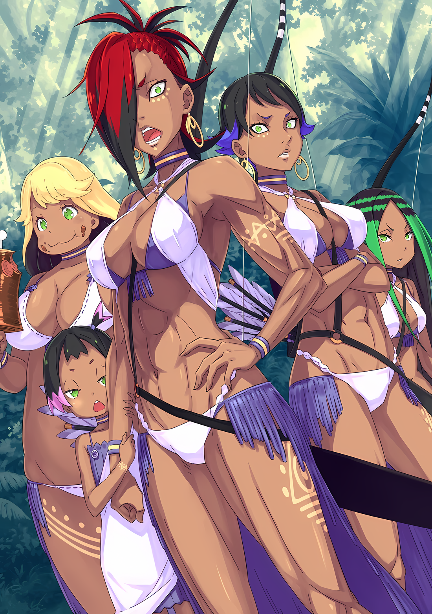
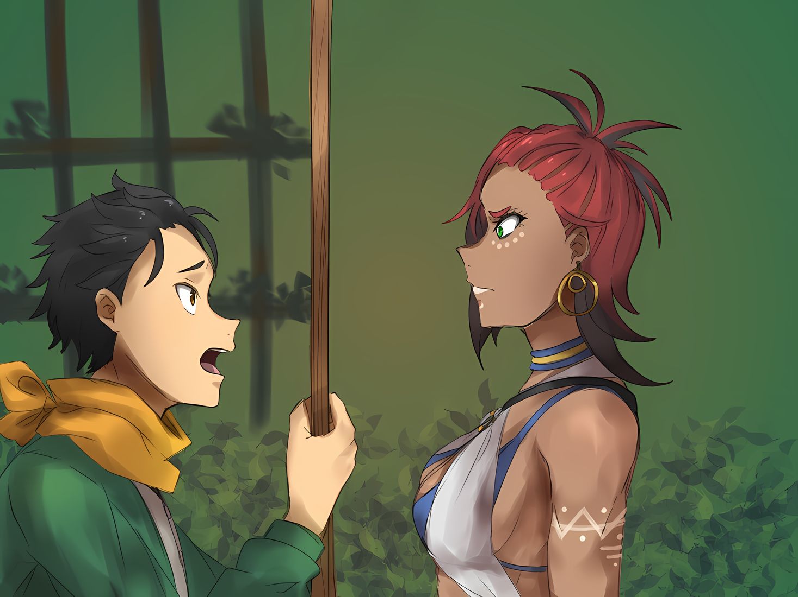

Столкнувшись с этой тщеславной и гордой улыбкой, мелькнувшей сквозь его маску, Субару затаил дыхание.

Не было никакой разницы между этим высокомерным мужчиной и тем мужчиной, который показал Субару дорогу и дал ему нож, когда он разошёлся с Рем на лугу. Субару не мог сказать наверняка из-за его внешности в маске, но он помнил его голос, а также его отношение. Тот факт, что мужчина знал его имя, также доказывал это.

Субару: …………

Лежа на голой земле внутри деревянной клетки, судьба Субару, казалось, продолжалась, а не была отрезана, хотя все его тело было изношено, вместо одних рук и ног.

Он вошел в лес, приведя с собой Тодда и Имперских солдат, призвал Зверодемона, заманив его своими миазмами, попытался сбежать, воспользовавшись возможностью, которая возникла после того, как Зверодемон напал на солдат, и……

Субару: И потом, я….

Мужчина в маске: Из того, что я слышал, похоже, что вы попали в ловушку, когда слонялись по лесу. Жители деревни подняли большой шум из-за человека, попавшего в ловушку, предназначенную для поимки зверей.

Субару: Ловушка и деревня……?

Получив объяснение от мужчины в маске, Субару покачал раскалывающейся головой, направляя свое внимание за пределы клетки.

Деревянная клетка, в которой он был заключен, была плохой конструкции по сравнению с теми, которые он видел в лагере Имперских солдат, которые, в свою очередь, были сделаны из железа. Она выглядела простой или, скорее, был построена в спешке.

А затем, за пределами клетки, он увидел группы высоких деревьев и землю, которые были созданы путем расчистки части леса…… впечатление Субару было чем-то близким к деревне в «Святилище».

«Святилище» также было деревней, построенной в глубине леса, называемого Лесом Кремальди. Однако, в отличие от «Святилища», в котором были такие здания, как дома и церковь, несмотря на то, что они находились в лесу, в деревне здесь были только бревенчатые хижины, что было красиво, и примитивные жилища, если их поставить плохо.

Субару подумал, что было бы лучше обойти вокруг да около, сказав, что они предпочитают быть натуралистичными.

Кроме того, для Субару важнее была не убогая деревня, а то, кто здесь жил.

Это означало……

Субару: ……«Племя Судрак»?

Мужчина в маске: Ха, так ты все-таки знал. Что ж, глядя на твое неприглядное состояние, я полагаю, что ты был обременен трудностями всего за один день. Ты нашел женщину, с которой тебя разлучили?

Субару: ……Да, спасибо тебе.

Когда мужчина спросил его, услышав, что он пробормотал, Субару глубоко вздохнул.

Мужчина в маске не смягчил своего уверенного отношения. Однако он тоже был внутри клетки, как и Субару. Если бы он не был важным членом деревни и не имел похвального предпочтения входить в клетку вместе со своим пленником, они были бы в точно таком же положении.

Субару уже держали в плену в лагере Империи, но его схватили и здесь.

Однако было несколько моментов, которые подсказывали ему, что это еще не все.

Субару: ……Раны на моем плече и спине… Они обработали мои раны?

Дотронувшись до его плеча и спины, Субару понял, что кровотечение остановлено, судя по ощущению, как что-то плотно прижимается к его ранам. Резкий запах, который щипал его ноздри, был похож на какое-то жидкое лекарство, например, дезинфицирующее средство.

Мужчина в маске обнюхал сомнения Субару, сказав: “Хмм”

Мужчина в маске: Ты бы точно умер, если бы твои раны не были обработаны. Жители деревни, должно быть, были сбиты с толку тем, как с тобой обращаться. Задаваясь вопросом, каков правильный выбор, точно так же, как и со мной.

Субару: Откуда у тебя такое самообладание….

Мужчина в маске: Если я должен сказать, то это от моей души. Скорее, когда ты перестанешь демонстрировать такое позорное поведение? Нацуки Субару.

Субару: Это не твое….

«…дело», попытался возразить он, прежде чем стиснуть зубы от боли, вызванной его ранами.

Его раны были перевязаны лишь до минимума, чтобы не дать Субару умереть, не закрыть его раны быстро и не избавиться от боли. В отличие от того, что он получил в лагере Империи, он находился в низшей среде.

Когда он думал о лагере Империи, Субару осознал.

У него была причина прибыть в лагерь как можно скорее.

Субару: Черт…… сколько времени прошло с тех пор, как меня сюда притащили!?

Мужчина в маске: …… Хм, возможно, около двух часов. Я скажу тебе заранее, но я уже достаточно снисходителен к тебе. Если бы я не придавал этому большого значения, то разбудил бы тебя….

Субару: Почему ты не разбудил меня раньше!?

Мужчина в маске: …………

Когда Субару опустился на дрожащие колени, жалуясь, мужчина прищурился.

Для него это выглядело бы так, будто Субару затеял с ним конфликт, что было неуместно. Что касается того, почему он позволил Субару проспать целых два часа, который был на грани смерти, покрытый порезами и синяками, когда его привезли, то, вероятно, потому, что он счел отдых необходимым.

После этого, если бы его поступок, наступивший на голову Субару, был преступлением, совершенным из-за его нетерпения, тогда можно было бы сказать, что он также был обладателем природы, подобной Волакии. Однако, если это так……

Субару: Тебе следовало раньше исчерпать свое терпение.

Мужчина в маске: Что за странные вещи ты говоришь. Ты понимаешь, что ты говоришь? Ты говоришь мне, что хотел бы, чтобы я наступил тебе на голову раньше.

Субару: Да, именно это я и говорю! Что еще… тьфу, кх…!

Пока он продолжал выпаливать неразумную, иррациональную логику, его зрение вспыхнуло красным.

Все его тело болело, но больше всего боли ему причиняла спина, недавно полученная колотая рана в районе лопатки…… удар Тодда ножом, который нацелился на убегающего Субару в последний раз, когда они пересекались.

Оглядываясь назад, он понимает, что нож, которым его ударили, был тем же самым, который дал ему мужчина в маске, стоявший перед ним. Воссоединение с ним в раненом состоянии из-за раны, нанесенной ему ножом, казалось неудачной цепочкой событий.

В любом случае……

Субару: Я оставил Рем в лагере Империи…… Прежде чем Имперские солдаты, которых я натравил на Зверодемонов, вернутся туда, если я не вернусь, то Рем…

Не было времени, пока группа Тодда не покинула лес, не вернулась в свой лагерь и не закончила докладывать обо всем вышестоящим.

Когда гигантская змея привела строй солдат в беспорядок, Джамал и остальные, естественно, в первую очередь разобрались со Зверодемоном. Однако среди них только Тодд сделал убийство Субару своей первой заботой.

Тодд мог бы заподозрить, что именно Субару притянул к ним Зверодемона. А затем, чтобы убедиться, что это не привлечет внимания другого, Тодд попытался избавиться от него немедленно на месте. Его рассудительность и способность доводить дело до конца…… то, что он продемонстрировал в этот единственный момент, нельзя и не следует недооценивать.

По крайней мере, Субару сделал акцент на том, что он даже ни в малейшей степени не был связан с Рем и Луис, намереваясь создать впечатление, что от них невозможно получить какую-либо информацию о нем, но……

Субару: В таком то месте……!

Мужчина в маске: …… Я понимаю. Судя по твоим словам, эта “Рем” и есть та женщина, которую ты искал. Похоже, ты прошел через значительный опыт после того, как расстался со мной. Это из-за Имперских солдат за пределами леса?

Субару: Да, именно так! Они держали меня в плену! А потом я подшутил над ними, чтобы убежать… но я не мог взять Рем с собой. Так что….

Мужчина в маске: Так вот в чем причина твоего отчаяния. Неудивительно, что ты, похоже, привык быть пленником.

Субару: Кто, похоже, привык быть пленником!? Во первых….

Мужчина в маске был в таком же затруднительном положении, как и он, не так ли?

Хотя Субару был в долгу перед ним, он чуть не закричал от гнева, так как в данный момент у него не было умственных способностей думать о чем-либо другом. Однако внезапное осознание остановило его опрометчивое поведение.

Субару: …………

Посреди этого обмена резкими словами, сосредоточившись на своем споре с мужчиной в маске, Субару почувствовал, как новая пара глаз впилась в его лицо.

Когда он обернулся, то увидел два пятнышка света снаружи клетки, заглядывающие внутрь сквозь прутья решетки. Построив изображение человека, Субару увидел, что это были глаза зеленого цвета.

Владелец пары глаз моргнул, когда взгляд Субару повернулся к ним

???: ……Ах, он заметил Уу.

Субару: Чт….

???: Нужно сказать Мии.

Сказав это, человек быстро отдалился от деревянной решетки. Субару попытался остановить их, крикнув: “Подождите!”, но его слова не успели прозвучать вовремя.

К тому времени, когда он бросился на прутья клетки, человек уже покинул это место, бросившись прочь, не обращая на него никакого внимания.

Субару: Только что это было….

Мужчина в маске: Девочка из «Племени Судрак». Она, должно быть, очень любознательна. Даже когда я был один, она нанесла несколько визитов и даже заглянула внутрь. “Покажи мне свое лицо!”, “Сними маску!” — говорила она. Ее раздражительность не знает границ….

Субару: …………

Мужчина в маске проворчал, скрестив руки на груди, по-видимому, недовольный поведением подлого человека.

К сожалению, у Субару не хватило ума ответить на его жалобы. Это было потому, что его внимание было украдено человеком, который только что ушел — молодой девушкой.

Это была молодая девушка с коричневой кожей, где-то около десяти лет.

Она была одета в легкий наряд, который обнажал ее кожу, белая одежда была обернута вокруг ее тела. Вероятно, это был выбор одежды, который был сделан, чтобы приспособиться к этой земле, которая создавала ощущение субтропической зоны.

Причина розовых кончиков ее уникально окрашенных, подстриженных в стиле боба волос заключалась, скорее всего, в том, что они были окрашены. Корни ее волос были черными, что соответствовало объяснению Тодда о том, что у «Племени Судрак» черные волосы.

Однако больше всего Субару во внешности девочки шокировало не то, насколько необычно она выглядела, а то, что он видел ее не в первый раз.

Субару: Она……

«……Та, кто убила меня», всплыло в памяти Субару.

Она была той девочкой, которая использовала отравленную стрелу, чтобы выстрелить Субару в спину, что привело к его смерти.

Поскольку джунгли были подожжены из-за неосторожного замечания Субару, девочка сбежала с земли, где полыхало это распространяющееся пламя, глядя на Субару глазами, полными ненависти….

Субару соединил все точки воедино.

Тогда девочка сердито смотрела на Субару с выражением чистого отвращения только по одной причине. ……Возмездие за дело, которое превратило в пепел и ее землю, и союзников.

Мужчина в маске: Почему ты вдруг стал таким кротким, как будто тебя только что облили водой?

Субару: ……ах.

Когда Субару прикусил губу, прислонившись головой к деревянной решетке, из-за его плеча раздался голос.

Мужчина в маске с самого начала сидел в одной и той же позе и пристально наблюдал за Субару и его бурно меняющимися эмоциями.

Мужчина в маске: Тебя трудно понять. В любом случае, хорошо, если ты разглагольствуешь и бредишь. Будет неприятно, если здесь станет тихо. Безделье — это тоже пустая трата энергии. Без всякого крика….

Субару: Без крика…?

Мужчина в маске: ……Оттуда они придут послушать наш разговор. Смотри.

В том направлении, куда мужчина дернул подбородком, Субару обернулся и широко открыл глаза.

Пламя медленно освещало мрачный вид… Это был свет факела. Появились фигуры нескольких человек с факелами в руках, направлявшихся к клетке, в которой находились Субару и мужчина.

Их вела женщина высокого роста с сильным, хорошо тренированным телом. У женщины, казалось, были волосы изначально черного цвета, но они были выкрашены в красный цвет, а ее темно-коричневое лицо и тело были покрыты узорами белой краски. Ее зеленые глаза излучали сильное чувство цели, которое оставляло сильное впечатление.

Прячась за такой женщиной, случайно оказалась та самая маленькая девочка из прошлого. Группа примерно из десяти человек подошла к ним, и все они, похоже, были женщинами.

Иллюстрация к** Ранобэ** Том 26 | Разукрасил norvakkk

Субару: …………

Однако Субару невольно охватило это чувство подавленности.

Дикий дух этой группы был непохож на рыцарский орден рыцарей Лугуники или даже на то, что он видел в войсках Волакии; в нем была красота, подобная красоте отряда зверей, которыми командовал инстинкт.

Создавалось впечатление, что в основе группы лежит инстинкт, а не логика.

Субару произвел такое впечатление на их развитие, и когда они стояли перед клеткой, в которую они заточили Субару, женщины…… «Племя Судрак» пристально смотрело на двух людей внутри клетки.

И затем……

???: Похоже, ты проснулся да. ……Кто, черт возьми, вы вообще такие?

Вопрос был задан Субару и мужчине в маске.

△▼△▼△▼△

……Кто ты такой?

Это было относительно распространено в историях, но на практике это был вопрос, который не часто задавали.

Ситуация, когда кто-то с подозрением относился к вашей личности и задавал вам вопросы, была не совсем нормальным событием в реальной жизни. Будь то на стороне спрашивающего или слушателя, за исключением предприятий, которые необходимо было задать, вы потенциально могли бы прожить всю свою жизнь, не сказав этих слов.

В этом смысле это был вопрос, с которым Субару не был знаком.

Тем не менее, он все еще отчетливо помнил, как впервые в своей жизни услышал этот вопрос.

Кто такой Субару и какова его цель?

В первый раз, когда Субару спросили об этом, вопрос исходил не от кого иного, как от Рем, которая сомневалась в его личности в особняке.

Субару: Не ты, но вы…?

Пытаясь избавиться от этих воспоминаний, он задался вопросом.

Хотя их посадили в одну тюрьму, связь между Субару и мужчиной в маске была слабой. Или, скорее, для удобства их посадили в одну тюрьму, и уровень участия Субару был равен нулю.

Не было ли это довольно небрежным способом мышления — относиться к ним так, как будто они были одинаковыми из-за этого?

Мужчина в маске: Не увлекайся пустяками. Я сообщил им, что мы с тобой знакомы друг с другом. Это единственная причина для расследования.

Субару: Ты….гх! Говоря, что мы знаем друг друга…… Это заходит немного далеко, нет?!

Мужчина в маске: Я не лгал. Если бы мы посмотрели друг на друга, мы с тобой оба узнали бы, кто другой. Что еще требуется, чтобы считать кого-то другого человеком, с которым вы знакомы?

Субару: К-какой неразумный тон….

Это была чрезмерно властная манера говорить, но Субару помнил этот властный тон.

Был один человек, которого он знал, в частности, персонаж, который обладал бы такой логикой, чтобы разговаривать свысока с Субару и другими людьми.

Такие беспокойные люди, от мысли о том, много ли еще таких, как они, у Субару закружилась голова, но……

???: Эй, о чем ты говоришь, весь такой подлый. Отвечай на вопрос.

Субару: Ах, ах, меня зовут Нацуки Субару. Как видите, жалкий, измученный и несчастный потерянный ребенок! И следующий, тот, что позади меня, это… ммм?

Мужчина в маске: ……Абел.

Субару: Правильно, Абел! Он носит маску, чтобы скрыть свое лицо, и обладает высокомерным и неприятным характером, но он также вручает ножи людям, которые потерялись. Он плейбой, который заставил многих девушек плакать из-за разрыва, вызванного этим элементом непредсказуемости, поэтому в это время, пожалуйста, продолжайте и представьтесь!

???: О, о…? Я Мизельда, но….

Ошеломленная энергией, с которой Субару настаивала на ответе, ведущая женщина…… Мизельда назвала свое имя.

Когда Субару потратил время, чтобы как следует рассмотреть противоположную сторону, начиная с Мизельды, на ум пришло чрезвычайно подходящее слово для описания ауры женщин. «Амазонки».

Они принадлежали к небольшому племени, состоящему в основном из женщин, с сильными, дисциплинированными телами и раскраской тела, которая, казалось, соответствовала образу, а некоторые даже носили луки.

Субару определенно признал «Племя Судрак» амазонками.

Субару: Честно говоря, я действительно был удивлен, что мужчину в маске звали Абел, но….

Абел: …………

Субару: Давайте пока отложим это! Послушайте меня, Мизельда-сан, и все «Племя Судрак»!

Отложив намек на мужчину в маске…… Абела, Субару повысил голос на собравшихся женщин.

Судя по внешнему виду, спорить с женщинами было бесполезно, так как они, похоже, не собирались убивать Субару. Об этом можно было догадаться по тому, как они с ним обращались, и по тому факту, что они проявили готовность выслушать то, что он хотел сказать.

В таком случае, если бы он поговорил с ними искренне и серьезно, они могли бы понять.

Субару: Возможно, вы уже знаете об этом, но за пределами этого леса создается лагерь Имперских солдат. Девушка, которая очень важна для меня, находится там в плену, и если я немедленно не вернусь, это может быть опасно! Так что, пожалуйста, отпустите меня!

Мизельда: ………

Арт от Negi

Субару: После этого солдаты нацелятся на «Племя Судрак». Они сказали, что было бы прекрасно, если бы они могли поговорить, но, в худшем случае, они также готовы к бою. Если это случится, я….

«Помогу все уладить», — хотел сказать он, но закрыл рот.

Если бы это могло быть достигнуто, возможно, не было бы битвы между Имперскими солдатами и Племенем Судрак, но, скорее всего, Субару не смог бы помочь в этом.

Тодд и его группа признали Субару главным виновником, который устроил на них ловушку из Зверодемона. Поскольку ему нельзя было доверять, это было бы слишком большой просьбой.

Субару точно взвесил варианты Рем и Тодда.

И он решил причинить им вред, чтобы помочь Рем. Он не мог избежать ответственности за этот выбор.

Субару: Извините, позвольте мне поправиться. Правда в том, что солдаты нацелились на всех Судракийцев. В лагере довольно много людей, так что даже если вы будете драться……

Мизельда: ……Ты хочешь сказать, что мы проиграем?

Субару: Ах….

Из-за несоответствия ресурсов и стратегий, которые можно было бы предпринять, нельзя отрицать, что они находятся в невыгодном положении.

Прервав Субару, когда он попытался передать это, Мизельда прямо сказала тихим голосом.

Услышав эту реакцию, Субару понял, что выбрал неправильные слова.

«Племя Судрак», скорее всего, были племенем охотников.

Те, кто оттачивали свои навыки и постоянно совершенствовали свои способности. Метод убеждения их в том, что они проиграют бой, может легко вывести их из себя. Это был аргумент, который не следовало приводить.

Мизельда: О приближении Волакийских солдат мы знаем. Но между этими парнями и нами есть старое обещание. Не должно быть конфликта.

Субару: ……хк, нет, подожди! Я ничего не знаю об этом обещании, но, несмотря на это, эти парни серьезно относятся к вам….

Мизельда: Достаточно!

Субару: ……гх!

Субару попытался подойти ближе, но был пробит деревянной решеткой и упал от удара. Мизельда стукнула кулаком по решетке, но негодование отразилось в ее глазах.

И снова Субару выбрал неправильные слова.

Точно так же, как гордость в бою, старые обещания и тому подобное были важны для них.

Субару растоптал это, грубо и неосознанно. Опять.

Мизельда: Солдаты Волакии вывели свои войска за пределы леса, чтобы тренироваться. Они делали это много раз.

Субару: Перевод войск на тренировку…… Ты имеешь ввиду военные учения?

Казалось, этот термин был ему незнаком, и Мизельда нахмурилась, услышав слова Субару. Тем не менее, Субару постепенно начинал видеть общую картину ловушки, которую устроила сторона Волакии.

Для солдат Волакии было обычным делом разбивать лагеря вокруг джунглей Будхейма во имя военных учений. Племя Судрак привыкло к этому. Воспользовавшись их невниманием к этим учениям, военные Волакии собирались окружить джунгли Будхейма и захватить все Племя Судрак одним махом.

Если бы это было их заботой……

Субару: Зачем заходить так далеко, чтобы стремиться к этим людям?

Конечно, как и Мизельда, которая стояла перед его глазами, Племя Судрак было, несомненно, могущественным племенем.

Однако Субару понятия не имел, зачем Волакии понадобилось посылать армию, чтобы осадить джунгли и захватить их.

При нынешнем положении дел они выглядели так, словно не хотели бы покидать лес. Они жили, дышали и трудились здесь.

И все же……

Мизельда: Ни Нацуки Субару, ни Абел не говорят правды. В таком случае они нам не подходят.

Субару: ……гх, ты серьезно?

Мизельда: …………

Мизельда покачала головой взад-вперед, давая понять, что разговор окончен.

Никто из Племени Судрак не привел никаких контраргументов против ее бесстрастного отказа. Казалось, что она была лидером нынешней группы судракийцев, если не всего поселения.

Повинуясь ее приказам, Племя Судрак отвернулись от обвинений Субару и решили оставить его и Абела в покое.

Все еще неся свои факелы, группа начала уходить.

Субару: Подождите! Это не ложь! Это не ложь! Все в опасности! Обещание…

……Обещание будет нарушено! Все внутри, Рем тоже в опасности!

Наблюдая, как они расходятся, Субару отчаянно пытался предупредить их.

Однако, уже получив решение своего лидера, Племя Судрак не собирался останавливаться. Единственной, кто хоть немного признал его, была маленькая девочка, которая периодически поглядывала на него. Даже тогда она сделала это, уходя.

Субару хрипло закричал, выплевывая кровавую мокроту. И все же его никто не слушал.

Субару: Гха…… Черт возьми. Почему, все всегда так.…!

Опустившись на землю, Субару пожаловался на свое положение, ударившись лбом о решетку.

Он даже не мог выплеснуть свой гнев на клетку. Его правая рука была непригодна для использования из-за травмы плеча, а на левой руке все еще были сломаны пальцы. Субару был бесполезным человеком, израненным, и его речь даже не могла быть убедительной.

Если это было так, то какая ценность осталась у Нацуки Субару?

Субару: …Неужели, настолько я плох в обычной сдаче и моем уме?

Его глаза затуманились, когда он почувствовал вкус отчаяния. Однако Субару решительно отказался признать поражение. Он стиснет зубы и поднимется выше.

Если бы это был Субару прошлого, он бы установил свои ограничения по прихоти.

Оглядываясь назад на события, произошедшие до этого момента, он понял, что путь, по которому он шел, чтобы попасть сюда, был нелегким. Субару того времени был немного другой.

Он стал немного хуже сдаваться. Это был свет, который вел его по его черному, как смоль, пути.

Абел: Это была довольно бессмысленная дискуссия, которую ты провел.

Субару: …………

Эти слова, смешанные с презрением и насмешеой, достигли Субару, который в настоящее время вцепился в решетку, обдумывая способ создать брешь, через которую он мог бы проскользнуть.

Хотя это и раздражало, он не мог возразить. Субару на самом деле великолепно наступил на запретную мину и провалил переговоры. Он, несомненно, был на пике легкомыслия.

Однако……

Субару: Если бы это было бессмысленно, разве это не означало бы, что для тебя тоже не было смысла? В любом случае, разве я тебе не говорил? В джунглях есть опасные люди, так что не заходи внутрь.

Абел: Да, это верно. Эти инструкции стали моим руководством. Я буду благодарен тебе за это.

Субару: Но тебя все равно поймали, даже после того, как тебе это сказали. Я чувствую себя таким беспомощным…… Черт возьми, неужели он нигде не болтается?

Даже после того, как он ударился о деревянную клетку своим телом, нигде не было никаких признаков поломки. Бревенчатые бруски были вставлены глубоко в землю по отдельности и были достаточно прочными, чтобы поверить, что при их строительстве использовалась тяжелая техника.

Конечно, поскольку в этом мире не существовало такого оборудования, оно должно было быть продуктом ручного труда. Либо они сделали это с большим количеством людей, либо в их рядах был кто-то со сверхчеловеческой силой где-то на уровне Эмилии и Гарфиэля.

Субару: Что за штуку они построили, учитывая, что здесь полно девушек….

Абел: Не стоит недооценивать Племя Судрак. Это матриархальное племя, в котором рождаются только женщины, и они жили в этих джунглях сотни лет как потомки богов войны. Им не нужны мужчины, кроме как для рождения своих детей. Даже принято похищать этих мужчин из других мест.

Субару: Они прям настоящие амазонки…… Подожди, только не говори мне, что причина, по которой нас поймали, в том….

Захват самцов, использование их в качестве инструментов для создания потомства.

Это понятие и образ мышления существовали только в таких местах, как бедные горные деревни в древности. Тем не менее, учитывая, что он находился в чужой стране, в другом мире, где норма Субару неприменима, это может быть очень реальным убеждением, которого придерживаются люди.

Однако Абел насмешливо рассмеялся над словами Субару

Абел: Успокойся. Они выбирают своих детей. ……Любой ребенок человека, который говорит неправду, пытаясь обмануть их, закончит только позором. Я полагаю, что такое потомство нежелательно.

Субару: …Неправду

Приняв заявление Абела, Субару проклял свою некомпетентную попытку объяснения.

Причина, по которой Мизельда и другие судракийцы не поверили ему, хотя отчасти из-за его нетерпения, заключалась в том, что он плохо аргументировал.

Если бы кто-то не понимал, каковы характеристики оппонента и в чем заключается его гордость, даже спор, полный искренности и серьезности, ничем не отличался бы от оскорбления или физического оскорбления. Это было бы совсем не по-другому.

Субару: Но это не ложь. Солдаты Империи нацелились на судракийцев. И….

Абел: И……?

Субару: В качестве последнего средства…… На самом деле, нет. В качестве первого средства они подожгут все это место.

Услышав заявление Субару, Абел впервые спокойно затаил дыхание.

Пылающие джунгли были событием, произошедшим после того, как Тодд узнал о Зверодемоне, скрывающемся в лесу. В прошлый раз Имперская армия решила сжечь джунгли Будхейма, основываясь только на показаниях Субару.

Если бы они сами подтвердили существование Зверодемона, то было бы трудно избежать сожжения леса.

Субару: …Хотя, если Тодда и остальных уничтожили, это была бы совсем другая история.

Он уже серьезно обдумал эту возможность после того, как решил подстрекнуть Зверодемона.

Призыв к потенциально смертельному врагу был равнозначен косвенному убийству. Зная это, Субару, тем не менее, продолжил свой план приманки. На самом деле, люди могли бы действительно умереть.

При мысли об этом у него в груди образовался тяжелый комок. Его сердце болело так, словно его набивали чучелом.

Тем не менее, отбросив в сторону чувства отвращения и вины за эти убийства, которые он будет нести всю жизнь, он сосредоточился на другом, более важном моменте…… Тодд и другие, скорее всего, не были полностью уничтожены.

Субару: ……….

Группа Тодда состояла примерно из двадцати человек, все они практически не имели опыта борьбы со Зверодемонами

Тем не менее, если сложить воедино принятие решений Тоддом и удивительную напористость Джамала, было невозможно надеяться, что один этот Змеиный Зверодемон уничтожит всю группу.

Естественно, лучше было поверить, что группа Тодда выжила и отступает обратно в лагерь из джунглей.

После возвращения в лагерь группа Тодда сообщит о предательстве Субару и существовании Зверодемона. В зависимости от ситуации они все еще могли верить, что Субару был одним из Племени Судрак, и пришли к выводу, что судракийцы предприняли против них наступательные действия.

Если бы это случилось, все было бы так же, как в прошлый раз. Желая свести к минимуму потери, Имперские солдаты без колебаний подожгли бы джунгли. …… Племя Судрак, без сомнения, сгорело бы дотла.

Абел: ……Что это, этот взгляд в твоих глазах.

Субару: Ничего….

Абел прокомментировал пристальный взгляд Субару. Субару тут же отвел взгляд, но все еще был занят мыслями о конце Абела в последнем цикле.

Скорее всего, Абел был захвачен Племенем Судрак, аналогично нынешней ситуации. В тех обстоятельствах, учитывая, что джунгли были подожжены, он, вероятно, погиб в огне вместе с ними.

С большой натяжкой можно было подумать, что Племя Судрак помогут кому-то вроде заключенного сбежать из этого ада. В худшем случае он не смог вовремя выбраться из клетки и сгорел заживо.

Если бы это было так……

Субару: ……Племя Судрак, Абел. Я практически убил их всех.

Его собственная жизнь, жизнь Рем, жизнь Абела и жизни Племени Судрак. Он не хотел терять никого из них.

Вот почему Субару встанет и придумает способ выбраться из своего нынешнего затруднительного положения.

Абел: Разве ты не понимаешь, что это бесполезно? Они не являются группой, которой так не хватает, чтобы оставить место для кого-то с твоей силой. Тем более такой раненый, как ты. Почему ты так напрягаешься ради одной женщины?

— раздраженно сказал Абел Субару, который продолжал цепляться за дерево, все еще отчаянно сопротивляясь.

Эти слова зажгли огонь в Субару.

Субару: Это потому, что эта девушка для меня не просто одна женщина. Этого недостаточно, чтобы описать ее. Замены нет. Рем — это единственная и неповторимая Рем.

Абел: …………

Субару: И ты. У тебя есть время постоянно придираться ко мне? Я не знаю, почему ты здесь, но, конечно же, ты не скажешь “Да, я попался, с меня хватит”, после того, как тебя поймали, не так ли?

При первой встрече с ним Абел был одет в свой маскировочный плащ и выглядел так, как будто пришел в джунгли, чтобы выполнить какое-то задание. Даже если бы это было не так, он был из тех людей, которые с готовностью отдают нож. Который, по словам Тодда, был из тех ножей, которые мог подарить только Император.

Сказать, что он был здесь без всякой причины, было бы фактом, который трудно себе представить и, откровенно говоря, невероятным.

Субару: Сидя там на холодной земле, что ты хочешь сделать?

Абел:* ……Я просто ждал возможности.*

Абел смертельно тихо ответил на вопрос Субару.

Его ответ был непохож на подстрекательские и насмешливые комментарии, ранее сделанные в адрес Субару. В нем звучал другой тон, больше похожий на истинные чувства Абела, вылившиеся в слова.

Субару: Ждал возможности? Возможность, то есть **шанса***? Какого **шанса** ты ждал…

*(П/П: здесь Субару использует иностранное слово которого нет на обычном японском; チャンス — chance)*

Абел: Я не знаю о каком «**чансе**» ты говоришь, но я ждал, когда все будет готово. Пока они не были организованы, любое ненужное действие с моей стороны замутило бы воду. Вот почему я был вынужден наблюдать. На самом деле, я полагал, что то, что группа за пределами джунглей сделает свой ход первой, было правильным шагом, однако….

Субару: …………

Абел: Если они готовы сжечь эти джунгли дотла, я не могу вечно сидеть здесь, скрестив ноги.

Сказав это, Абел развел руки и медленно встал.

Глядя на его длинную и стройную осанку, Субару застыл от удивления при его словах.

Абел: В чем дело? Это твое ошеломленное лицо. Это довольно неуважительное лицо, которое ты мне представляешь.

Субару: Дун-не знаю насчет неуважения, но… Ты, веришь в то, что я сказал? Потому что Племя Судрак…

Абел: Я тебе не поверил. Оскверняя их гордость, отвергая вековое обещание, к которому относятся с большим уважением, говоря, что это ничего не значит. Действительно, это были провальные переговоры на протяжении веков.

Субару: Агх……

Он знал, что у него не было оправдания своему выбору слов, поэтому у него не оставалось другого выбора, кроме как быть избитым оценкой Абела.

Когда Субару нахмурился, Абел продолжил свою речь словами: “Но…”. А затем, сквозь свою маскировку, он пристально посмотрел на Субару, который поднял голову……

Абел: Я не принадлежу к судракийцам. Их гордость и значимые контракты так же хороши, как пыль. Что необходимо, так это истина, которую ты принес, свободная от какой-либо лжи.

Субару: …Что ты будешь делать, если окажется что я лгу?

Абел: Это очевидно. *……Ты заплатишь своей жизнью.*

Его слова были тяжелыми, несущими в себе явное отличие от тех, кто говорил о «Смерти» в шутку.

Абел искренне советовал Субару искупить свою вину своей смертью, если он сделает неправильный шаг. Это не было ни игрой, ни сказано было по прихоти, но это была сцена, которая подвергла бы испытанию его настоящую решимость.

Получив это чувство от Абела, Субару подсознательно выпрямился.

Он перестал бороться с прутьями клетки, прежде чем осознал это, повернувшись лицом к Абелу, который был прямо перед ним. Глядя в черные глаза Субару, угрожающий взгляд внутри пронзительного света в глазах Абела усилился.

Абел: Ты должен выбирать каждое свое слово с предельной осторожностью, Нацуки Субару. ……Есть ли у тебя решимость пожертвовать всем, чтобы спасти то, что ты хочешь спасти?

Субару: …………

Его вопрос был прямым, не прощающим никаких колебаний с ответом, а также любой лжи, которая была высказана.

Если бы Субару ответил на это переплетением правды и вымысла, он был бы покойником. Да, человек по имени Абел обладал определенной силой в голосе, достаточной, чтобы заставить Субару довериться ему.

Субару принял вопрос Абела в свое сердце.

Была ли у него необходимая решимость спасти все, спасти то, что он хотел спасти, ценой того, чтобы пожертвовать всем остальным?

Его ответ на этот вопрос был бы……

Субару: ……У меня нет решимости сделать это.

Абел: …………

Субару: Все, что я могу предложить, — это я сам. ……Если дело только в этом, то я могу поставить все это на кон.

Вместо правой руки, в которую был нанесен удар ножом, Субару положил руку со сломанными пальцами себе на грудь, отвечая на запрос.

Это был ответ Субару на вопрос Абела, не содержащий ни капли нечестности.

Даже если бы ему сказали отказаться от всего и всех, он ни за что не смог бы с этим смириться.

Для этого в этом мире было слишком много вещей, важных для Субару, и слишком много сияющих вещей, которых он еще не видел.

Вот почему……

Абел: Ты дал мне самонадеянный ответ, ты, досадный шут.

Субару: ………

Абел: Однако ты не утверждал никакой лжи. В этом случае ты не будешь сожжен.

Субару понял, что его жизнь была спасена, после того как Абел заявил об этом, услышав ответ на свой вопрос.

Холодный пот внезапно потек по его телу, и он понял, что его жизнь была в ладони Абела.

Как Субару оценил Абела ранее, когда они впервые столкнулись друг с другом на лугу, он не был необычайно силен.

Сравнивая мужчину в маске с могущественными людьми, которых Субару либо видел, либо общался с ними в прошлом и по сей день, его сила не выходила за рамки обычного человека. Однако, даже учитывая это, Субару чувствовал себя так, словно только что чудом избежал смерти.

Сила, не похожая на чистую физическую силу и навыки владения мечом, обитала в Абеле. Так думал Субару.

Абел: Тогда это сэкономит нам время. ……Хей, ты. Девочка что там стоит.

???: Укьян!?

Не обращая внимания на Субару, который сильно вспотел оттого, что ему сохранили жизнь, Абел внезапно кого-то окликнул. Сразу же из тени послышался тихий крик, реагирующий на тон его голоса.

Когда Субару удивленно обернулся, он увидел девушку, застенчиво смотревшую на них в тени дерева впереди, в поле зрения Абел.

Девушка с выкрашенными в розовый цвет кончиками волос поспешно попыталась скрыться от пристальных взглядов Субару и Абела, но……

Абел: Ты упустишь свою возможность, если убежишь, девочка. Конечно, это не должно быть тем, что ты намереваешься сделать.

Девочка: Оо….

Попавшая под гнет слов Абела, девушка тихо застонала. После этого, со смущенным выражением на лице, она удрученными шагами направилась к ним.

А затем ее губы задрожали, когда она сказала: “Ууу, Ууу…”

Девочка: Мии сказала не слушать мужчин. Но, Уу любопытна. Любопытно узнать о тебе.

Субару: ……Я?

Сказав это, девушка, которая называла себя “Уу”, указала пальцем в сторону Субару. Получив неожиданный признак того, что ей было любопытно о нем, Субару расширил глаза, в то время как девушка кивнула ему.

Девочка: Ты делал все, что мог. Мы в опасности. Но Мии не хочет слушать.

Субару: Ах….

Девочка: Почему ты так старался? Ты не имеешь к нам никакого отношения.

Почему ты вмешивался, хотя не имеешь к нам никакого отношения?

У Субару на мгновение перехватило дыхание, он подумал, не указывают ли на его любопытство. Однако слова девочки, похоже, не имели такой цели. Она была искренне любопытна.

Почему Субару был в отчаянии не только из-за себя, но и из-за Племени Судрак?

Ответ на этот вопрос был чем-то, чего даже сам Субару не знал, но……

Субару: ……Я думаю, что не хочу, чтобы у тебя было такое выражение лица.

Девочка: ……?

Субару: Я не хочу, чтобы у тебя это было…… чувство необходимости ненавидеть своих врагов, затуманенное ненавистью.

Девочка, которая выстрелила в своего противника отравленной стрелой, наблюдая за его смертью до конца глазами, полными ненависти.

По сей день чувство отвращения девочки и его вина за экстремальные события, которые привели ее к этому, все еще оставались в его глазах. Они поднимались и кружились вокруг. Они превратились в шипы, причиняя ему боль.

Это не должно быть навалено одно на другое. Это никогда не должно повториться.

Не было ничего лучше, чем не «Посмертно Возвратиться».

Однако, потеряв свою жизнь в мире, где ему пришлось начинать все сначала, если бы был способ вывести людей, связанных с ним, на лучший путь……

Субару: Я думаю…… цель того, чтобы я старался изо всех сил, лежит именно в этом.

Девочка: …Уу не понимает.

Несмотря на то, что она услышал его ответ, то, что он на самом деле имел в виду, не было передано девочке. Это было вполне естественно. Поговорите об этом с кем-то, кто не знал о «Посмертном Возвращении», и они ничего не поймут.

И Субару тоже не думал о том, чтобы она это поняла. Знание того, что такая реальность существовала, было ненужным дополнением к жизни девушки.

Абел: ……Ты доволен? Это должно быть то же самое для меня и для тебя, чтобы не иметь времени для долгой беседы.

Субару: Да… да, извини.

Не заинтересованный разговором между Субару и девочкой, Абел без колебаний оборвал его.

Когда он повернулся лицом к девушке, она напряглась и пристально посмотрела на него, возможно, почувствовав то же давление, которое Субару испытывала ранее.

Абел: Я не планирую болтать с тобой, девочка. Женщина из прошлого… Мизельда, не так ли? Позови ее сюда. Это вождь, не так ли?

Девочка: Мии? О чем вы будете говорить с Мии?

Абел: Это тривиально. У меня просто есть предложение.

Девочка: Предложение?

Пристально глядя на Субару и девочку, которые склонили головы, Абел глубоко кивнул.

А затем он улыбнулся, как и ожидал Субару, хотя этого не было видно под его маской,

Абел: ……Скажи ей, что мы будем проходить «Ритуал Крови». Это самый быстрый способ убедить их.

Таким образом, он просто сказал это.
