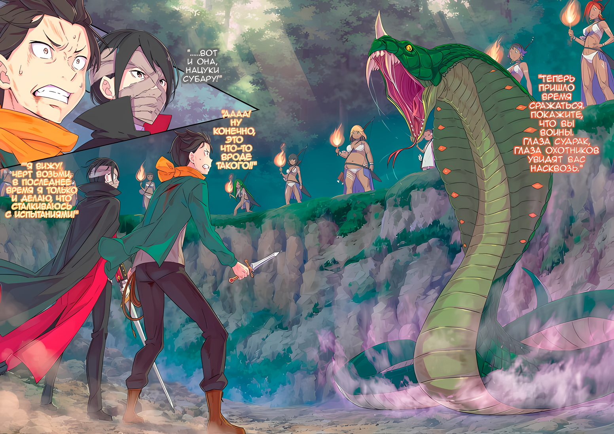
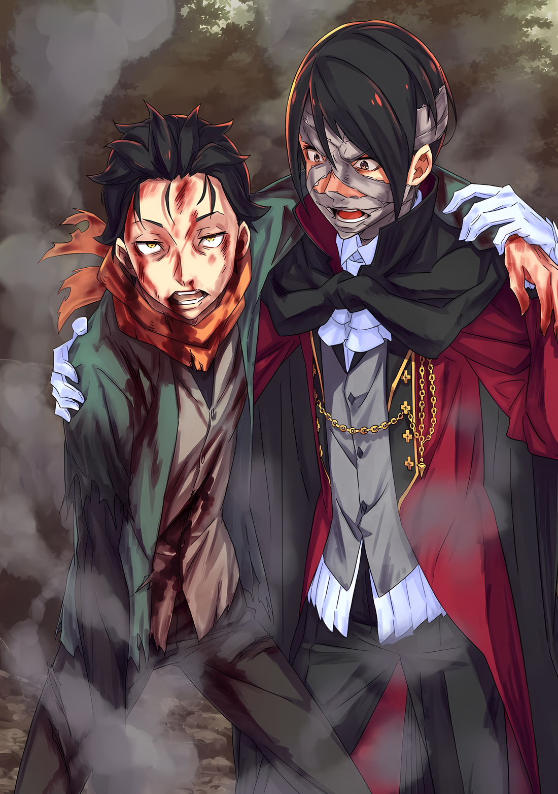

Субару: ……И все же, что за «Ритуал Крови»?

Абел: Абсолютно недостойный обычай, принадлежащий Племени Судрак, который придает большое значение гордости и приверженности. Мы услышим больше от их самих. Что больше важно……

Абел уставился на Субару, давая ему лишь приблизительный ответ на его вопрос.

Девочка-судракийка отправилась передать предыдущее сообщение Абела шефу, Мизельде, оставив позади только Субару и Абела.

Это означало, что время, которое у них оставалось для приватной беседы, было ограничено.

Абел: Введи меня в курс дела, ты сказал, что попал в плен в лагере за пределами леса, верно. Как они к тебе относились?

Субару: ……Я должен поблагодарить их за травмы моего плеча и моей спины. Это, и еще они заставляли меня выполнять какую-нибудь случайную работу.

Если быть точным, случайная работа и жестокое обращение происходили в разных циклах, однако, под давлением пугающей атмосферы Абела, Субару выпалил все это.

Абел прищурился, издав “Хммм”, услышав его, прежде чем посмотреть на левую руку Субару,

Абел: Видя, что ты не затронул вопрос о своих пальцах, я думаю, что это должно быть другой проблемой. Должно быть, это сделала с тобой женщина, за которой ты охотился.

Субару: Угф…… Какое это имеет отношение к этому?!

Абел: Это служит доказательством того, что ты дурак, если тоскуешь по женщине, которая сбегает и ломает тебе пальцы.

Трудно было сказать, что заявление Абела было таким, которое соответствующим образом описывало отношения Субару и Рем. Однако у Субару не было ни времени, ни обязанности обсуждать это с ним и посвящать его в детали.

Затем Абел быстро переключил свое внимание с состояния левой руки Субару.

Абел: Итак, говоря, что ты выполнял “случайную работу”, ты подразумеваешь, что видел внутри лагеря. На что похожа планировка? Напряги свои пустые мозги, извлеки это из своей памяти.

Субару: Там была куча палаток, и когда дело доходит до количества людей в лагере…… Эй, что не так?

Абел: Ты что, не понимаешь? Само собой разумеется, что люди, которых ты видел, были….

Абел фыркнул на Субару после того, как задал ему один вопрос за другим, лицо последнего нахмурилось.

Однако Абел не смог ответить на вопрос Субару из-за звука нескольких шагов, снова приближающихся к клетке.

Они принадлежали Мизельде и ее группе, которых тащила за собой девушка.

Мизельда: Я слышала от Утакаты, что вы оба собираетесь пройти «Ритуал Крови».

Мизельда с выкрашенными в рыжий цвет волосами положила руку на голову девушки, вцепившейся в ее ногу…… девушки по имени Утаката. Затем она бросила пронзительный взгляд на Субару и Абела.

Ее взгляд был полон остроты, которая соперничала с прежней, когда Субару растоптала их гордость как воинов.

Мизельда: Где, черт возьми, ты узнал о «Ритуале Крови»? Предполагается, что это обряд, который передается только нам, Племени Судрак.

Абел: Не смеши меня, молодая вождь судраков. Ты серьезно думаешь, что в наши дни никто не знает о ваших традициях? Два человека — это все, что нужно, чтобы тайна просочилась наружу. Откажись от своей несбыточной мечты думать, что вы все как один.

Мизельда: ……….

Абел: Твой драгоценный «Ритуал Крови» тоже не исключение. На самом деле, я знаю и то, что это за ритуал, и то, что происходило в прошлом.

Взгляд Мизельды стал суровым, когда ответ Абела стал более пылким.

Субару мог сказать, что выражения лиц судракийцев поблизости, и не только Мизельды, становились все более и более напряженными, столкнувшись с возвышенными словами Абела. Субару и сам сделал большой глоток.

Прямо сейчас Субару был единственным, кто остался позади, ничего не зная о деталях этого «Ритуала Крови», о котором упоминал Абел. Тем не менее, факт оставался фактом: ритуал был важен для Мизельды и остальных, и Абел не приветствовал бы, если бы он легкомысленно отнесся к их чувствам по этому поводу.

И поэтому, чтобы предотвратить дальнейшее замешательство в ситуации, Субару заговорил, вставив: “Гхм!”.

Субару: Извини, что прерываю, когда ваша дискуссия начала становиться более оживленной, но не могли бы вы рассказать мне больше об этом «Ритуале Крови»? Я, наверное, не имею к этому никакого отношения, верно?

Мизельда: …Почему ты так думаешь?

Субару: Ах, мне только что угрожал этот придурок в маске некоторое время назад. Такие вещи, как вопрос, могу ли я пожертвовать всем или нет. “Черт возьми, нет”, — был мой ответ.

Мизельда: Тогда….

Субару: Все, что я могу поставить на кон, — это я сам. Этот парень слишком сильно переоценивает свое влияние.

Жертвуя всем. Такого рода замечания позволялось делать только людям, которые были достаточно могущественны.

К несчастью для Субару и Абела, оба они были беспомощны, так как попали в плен к Племени Судрак, поэтому они не были готовы к такому грандиозному выбору.

Таким образом, все, что он мог поставить, была только его визитная карточка — “Нацуки Субару”.

Субару: Но, как и сказал Абел, нам будет трудно, если ты не будешь слушать. Это будет повторение того, что я говорил ранее, но я буду повторять одно и то же столько раз, сколько мне нужно. В худшем случае, мне нужно, чтобы ты, по крайней мере, выпустила меня, чтобы я мог защитить то, что мне дорого, иначе я буду в тупике, что делать.

Мизельда: …Я понимаю. Похоже, ты достаточно квалифицирован, чтобы пройти «Ритуал Крови».

Когда Субару обратился к ней с просьбой, желая продолжить их разговор, Мизельда тихо пробормотала.

Субару расширил глаза от ее ответа, и Абел издал небольшой горловой звук. Однако был один человек, который слишком остро отреагировал, услышав слова своего шефа.

Среди группы, окружавшей Мизельду, человек, женщина с выкрашенными в синий цвет волосами, стояла прямо рядом с ней.

???: Сестра! Ты уверена? Веря словам этих людей….

Мизельда: Не то чтобы я им верила, Таритта. Я просто подумала, что было бы напрасной тратой времени игнорировать их слова.

Таритта: Сестра…

Женщина по имени Таритта опустила голову, слушая ответ Мизельды, которую она называла “Сестрой”.

Казалось, они были сестрами, связанными кровным родством. Как только Субару указали на их связь, он понял, что на самом деле они были очень похожи, особенно свирепое впечатление, создаваемое их глазами.

Затем, после того как Мизельда отвергла слова своей младшей сестры, она еще раз посмотрела на Субару и

Мизельда: По поводу «Ритуала Крови». Это ритуал, чтобы заставить племя признать себя, переданный нам, судракийцам, с древних времен. Вы можете назвать это ритуалом совершеннолетия.

Субару: Совершеннолетие…… ах, это что-то в этом роде. Но на самом деле мы не….

Абел: Племя Судрак. Излишне говорить об этом, поскольку все об этом знают. Не тратьте время на свои глупые выходки. Что важнее всего, так это истинная природа этого ритуала.

Субару заставил Абела казаться раздраженным, первый был озадачен своим новообретенным знанием ритуала, что он существует для того, чтобы с теми, кто его выполнил, обращались как со взрослыми. Щеки Субару напряглись от бессердечных слов Абела, но он понял, что хотел сказать человек в маске.

Истинная природа ритуала достижения совершеннолетия заключалась в том, чтобы заставить группу признать претендента взрослым. Это означало, что истинная природа «Ритуала Крови» была……

Субару: Обряд посвящения…… Чтобы убедиться, что судракийцы будут слушать нас как равных себе……

Абел: Точно.

Подтверждая убеждение Субару, Абел скрестил руки на груди и взглянул на Мизельду. Вскоре после того, как Мизельда встретила его пристальный взгляд, она вздернула подбородок, а затем

Мизельда: Если вы бросаете вызов «Ритуалу Крови», то вы должны подготовиться.

Абел: Что произойдет, если вызов будет отозван? Будете ли вы утверждать, что освободите нас прямо здесь и сейчас? К сожалению, я не обладаю таким бесхитростным умом, чтобы надеяться на что-то слишком хорошее, чтобы быть правдой. Это относится и ко мне, а также к этому Субару Нацуки.

Субару: Уэх!?

Поскольку дискуссия между Мизельдой и Абелом внезапно накалилась, Субару был удивлен, услышав, что его включили в число людей, которые были полны решимости завершить ритуал. Однако Абела, похоже, не волновало, что он думает.

Под влиянием нынешнего импульса Абела Мизельда спросила его: “Что ты будешь делать?”, на что он ответил:

Субару: ……Я сделаю это. Если нет другого выхода, тогда я пройду через этот ритуал и удостоверюсь, что вы выслушаете то, что я должен сказать. Но, это будет проблемой, если ритуал займет несколько дней….

Мизельда: Это правда. Мы тоже этого не хотим. Если это все……

Таритта: Сестра, тогда разве Эльгины будет недостаточно?

Когда Субару собрался с духом, чтобы пройти ритуал, Таритта предложила полезное предложение Мизельде, которая была занята своими собственными мыслями. Услышав мнение своей сестры, Мизельда глубоко кивнула, а затем

Мизельда: Хорошая идея. Когда будет проведен «Ритуал Крови», будет выбрано самое большое препятствие.

Субару: Большое препятствие…… Это…

Мизельда: ……Эльгина.

Мизельда повторила это слово, когда Субару громко сглотнул.

Утаката отпрянула, ее плечи вздрогнули при упоминании этого слова, и воздух вокруг судракийских женщин наполнился напряжением.

Поскольку они гордились тем, что были воинами, их реакции было более чем достаточно, чтобы вызвать у Субару чувство неловкости.

Однако……

Абел: Мы с тобой оба не можем отказаться от этого. Укрепил ли ты свою решимость?

Субару: Ты ведешь себя так высокомерно, хотя довел разговор до этого момента, ни о чем меня не спрашивая. Не слишком ли часто ты поступаешь так, как тебе заблагорассудится, только потому, что я у тебя в долгу……?

Это правда, что Субару был в долгу у Абела за нож, который ему дали, но любые позитивные, спокойные чувства, которые он испытывал по отношению к этому, были унесены их взаимодействием внутри клетки. Хотя, конечно, он также оценил тот факт, что Абел исправил ошибку Субару и дал возможность судракийцам прислушаться к нему.

Субару: Насколько я знаю, те, кто прячет свои лица, никогда не бывают хорошими людьми!

Абел: Однако есть причина, по которой я прячу свое лицо. ……Ты ведешь себя дерзко, но я не буду этого отрицать.

Если персонаж, который скрывает свое лицо, случайно появлялся в истории, то у них была большая вероятность быть так или иначе связанными с главным героем. В этом случае Субару оказался бы в положении главного героя, но……

Субару: Ты тоньше моего отца, и твой голос тоже другой. Более того, я бы ни за что не принял своего отца за другого человека.

Абел: ……Похоже, ты несешь какую-то чушь.

Субару: Это не чушь, это о моем отце. Он самый раздражающий и одновременно самый крутой в мире.

Абел: …………

Возможно, эта тема не вызвала интереса Абела, так как то немногое тепло, которое было в его взгляде, заметно уменьшилось.

На самом деле Субару упомянул об этом только с тех пор, как он был в Империи, и появился человек в маске, сравнивая его ситуацию с фильмом о войне в космическом пространстве давным-давно. Субару, вероятно, мог бы счесть Абела незнакомцем, который спрятал свое лицо… возможно.

Игнорируя его бессмысленные мысли, Мизельда продолжила отдавать приказы своим сосестрам-судракийцам, а затем

Мизельда: Абел и Нацуки Субару, мы доставим вас обоих в Эльгину. Докажите нам, сможете ли вы превосходно завершить «Ритуал Ритуал» или же нет!

Как только она сделала свое заявление, клетку открыли, и Субару и Абела вывели наружу.

△▼△▼△▼

Субару и Абела выпустили из клетки без повязок на глазах или ограничений, и судракийцы окружили их и вывели за пределы деревни.

В глубоких, густых джунглях Субару шел так, как будто он шел на ощупь в темноте, из-за чего он много раз чуть не спотыкался и не падал. Но каждый раз его спасала одна из окружающих судракийцев.

Субару: Упс, виноват. Тебе снова пришлось мне помочь……

Блондинка: Нет проблем~. Что касается меня, то я сильная женщина, так что все слишком хорошо~.

Сказав это, женщина, выкрасившая волосы в желтый цвет, поддержала Субару, когда он упал.

У говорившей женщины была пухлая фигура и мягкие черты лица. Она была редким типом в Судраке, где у многих женщин были крепкие и мускулистые тела, но в ней было что-то такое, что делало ее очень легкой в общении.

Блондинка: С твоими травмами все в порядке? Я та, кто проводила твое медицинское лечение.

Субару: О, это было благодаря тебе? Ах, я в порядке. Это все еще немного, ну, я имею в виду, что это немного больно, но так лучше.

Блондинка: Ахахаха, а ты честный парень, не так ли~?

Сказав это, женщина беззаботно рассмеялась, и ее отношение также помогло Субару. Практически говоря, она обработала его раны, так что он должен сказать, что ему помогли двумя способами.

Субару, естественно, расслабился в присутствии такой великодушной и доброй женщины. Но его больше беспокоила мясная кость, которую она всегда носила в другой руке.

Блондинка: А? Ты голоден~? Хочешь немного мяса~?

Субару: Ах, нет, я в порядке. Не то чтобы я не голоден, но если я поем, то не смогу нормально двигаться.

Блондинка: Ахаха, вот как это бывает~. Кроме того, если твой желудок полон, ты будешь страдать, когда умрешь~.

Субару: Хаха…

Даже когда она грызла свою ветчинную кость, несмотря на ее нежную внешность, она была судракийкой насквозь.

В любом случае, они повели Субару и Абела куда-то таким образом, не чувствуя от них никакой враждебности.

Мизельда была такой поначалу, но как только Субару и Абел решили встретиться с «Ритуалом Крови», оказалось, что эффект провала первоначальных переговоров был сведен на нет.

Другими словами, каким бы ни был исход судебного разбирательства, восстановление их имиджа в глазах женщин прошло успешно.

Если бы это было так, даже если бы исход разбирательства не был благоприятным, возможно, можно было бы снова вернуться за стол переговоров.

Абел: ……Твое лицо выглядит так, как будто ты думаешь о чем-то удобном.

Субару: …Не считывай, думает ли человек о том или ином только по цвету его лица и выражению глаз. Я понимаю, что ты такой, но всегда ли люди в Империи такие?

Абел: Я не знаю причины твоего замешательства. Более того, мне совершенно не интересно, с кем ты меня сравниваешь. Просто для того, чтобы жить, люди в Империи учатся внимательно присматриваться к своим противникам. Это отличается от Королевства.

Субару: Присматриваться к своим противникам, ха…

Абел, которого уводили с собой, впечатлил Субару своими словами.

Это был урок, о котором должны знать многие люди, не обладающие выдающейся военной мощью, а не только жители Империи. Ибо Субару тоже, без тщательного наблюдения за своими противниками, не смог бы ухватиться за шанс на успех даже при обычных обстоятельствах.

Это был сложный, сложный вопрос, о котором ему нужно было знать с этого момента.

Абел: Кстати, ты не думаешь сбежать, когда у тебя будет такая возможность?

Пока Субару развлекали эти мысли, Абел прошептал ему на ухо новую.

Субару прищурился, удивленный бесстрастием Абела к этому вопросу.

Субару: Не мог бы ты перестать придумывать такие странные соблазны? Я уверен, что ты не можешь не думать об этом, но это невозможно сделать.

Абел: Ого, почему бы и нет? Сейчас у тебя больше шансов сбежать, чем когда ты был в той клетке. Если ты создашь хорошую возможность, ты сможешь ускользнуть из поля зрения Судраков.

Субару: Ну, я и раньше начинал бегать в такой безрассудной манере, когда становился слишком вспыльчивым, но….

Слова Абела были похожи на слова беззаботного преступника, и Субару еще раз огляделся по сторонам.

В глубине леса было так темно, что Субару мог видеть только на несколько метров вперед. В конце концов, направление и расстояние до лагеря, в который должен был вернуться Субару, были неясны, так что бежать не было смысла.

Вдобавок ко всему, все окружающие судракийцы были гораздо более способными, чем Субару с его двумя ранеными руками.

Блондинка: ……? В чем дело?

Утаката: Определенно влюбился в Хол. Хол — самая красивая девушка в деревне.

Блондинка: Вахаа~, я… это так неловко~

Заглянув в поле зрения Субару, Утаката заговорила с женщиной, стоявшей рядом с ней.

Женщина отрицательно покачала головой из стороны в сторону, покраснев. Это было ужасно мило, но выхода не было. Если бы Субару попытался сбежать, она, несомненно, прижала бы его в одно мгновение.

Превыше всего……

Субару: Если бы я сбежал, что случилось бы с тобой?

Абел: ……Я понял. Когда дело доходит до этого, ты такой парень, а? Отвратительный, идиотский, подражающий герою.

Субару: И?

Отведя взгляд, Абел выплюнул эти слова.

Раздраженный этим заявлением, Субару щелкнул по профилю человека в маске. Однако, прежде чем он успел спросить об истинном значении своих слов, ноги Мизельды, стоявшей в авангарде, остановились.

Мизельда: Мы пришли.

Субару: Ты говоришь, что мы пришли, но я ничего не вижу…

Даже с поднятым факелом, чтобы осветить окрестности, можно было видеть в лучшем случае на расстоянии нескольких метров. Субару казалось, что вид на раскинувшийся перед ним лес не изменился.

Что, черт возьми, здесь происходит……

Мизельда: Продолжай, и ты увидишь.

Субару: Ваа-уаа!?

Напрягая зрение в темноте, Субару накренился вперед. Его спину толкнула Таритта, которая была позади него, и, сделав один или два шага вперед, его ноги ступили в разреженный воздух.

Это было доказательством того, что не хватало опоры, не хватало фундамента, на котором можно было бы стоять.

Субару: Это чувство…… О нет, только не снова!?

Не раздумывая, Субару закричал, глядя в земляную пустоту…… точнее, на крутой склон. Он поставил ноги на склон и соскользнул вниз, чтобы не начать кувыркаться.

Он спустился по крутому склону и, так или иначе, сумел отдышаться у подножия.

Субару: Ах, это было опасно…… Даже при том, что я невредим, что это вдруг было?!

Абел: Двигайся.

Он почувствовал сильный удар в спину, который едва успел остановиться, заставив его в конце концов споткнуться и упасть вперед. Когда он укоризненно оглянулся через плечо, Субару увидел, что тот, кто столкнулся с его спиной, был Абел.

Казалось, его столкнули с крутого склона, совсем как Субару.

Субару: Судя по всему, это просто похоже на дно ямы, но…… это здесь происходит ритуал?

Абел: Действительно, это так. Итак, что же тогда появится? Они называли это Эльгиной.

Субару: Ты хоть представляешь, что это может быть?

Абел: “Эль” означает большой, но… хм.

Пока Субару и Абел разговаривали у подножия склона, куда их сбросили, что-то было брошено. У ног Абела остановился сверток ткани.

И выглядывавший изнутри пакет был……

Абел: Это мой багаж и твой мусор.

Субару: Мой багаж тоже!

Субару и Абел подобрали свое оборудование, которое было брошено вниз.

Внутри, естественно, был Кнут Гилтилоу и нож, воткнутый в плечо Субару. Он получил его от Абела, но после того, как его перебросили с одного места на другое, он вернулся сюда.

Абел также взял свои собственные вещи, меч и мантию, и быстро надел их.

Субару: Но, черт возьми, что это значит…?

Утаката: Уу тоже смотрит! Удачи!

Следуя за Абелом, высокий голос ответил на вопрос Субару, когда он забирал свое оборудование. Он оглянулся и увидел Утакату, машущую обеими руками на вершине склона. Это выглядело так, как будто та девушка бросила оборудование.

Мизельда и Таритта тоже не поднимали голоса против ее действий. Казалось, что такой уровень помощи не помешает ритуалу.

И затем, в то же самое время……

Блондинка: Я хочу, чтобы ты сделал все возможное, хорошо~!?

Субару: Серьезно…?

Он увидел женщину из прошлого, с выкрашенными в желтый цвет волосами, со спокойным голосом и беззаботными манерами, беспечно улыбающуюся, загораживая вход на склон большим валуном.

Ошибки быть не могло, судя по грохоту земли, это не могло быть ничем иным.

Невероятная сверхчеловеческая сила. ……Было ясно, чьи руки сделали эту прочную импровизированную клетку.

Когда вход был закрыт, Субару и Абел оказались заключены в пустую долину шириной около двадцати метров слева направо.

Напротив входа перед парой расстилалась тьма. Казалось, что они могли бы убежать, если бы побежали прямо вперед, но от такой наивной идеи следовало отказаться.

Абел: Нацуки Субару, насколько ты можешь двигать руками?

Субару: А? Мои руки… они так же плохи, как и выглядят. Я не могу поднять правую руку, и моя левая рука тоже не может сильно сжиматься. Естественно, я также не могу делать тонкие движения…Уоо!?

Абел: Надень это на палец в лучшем состоянии! У нас нет времени.

Затем Абел бросил кольцо из своих вещей Субару. Не говоря ни да, ни нет, Субару немедленно принял его и надел на средний палец левой руки.

Кольцо было инкрустировано черным драгоценным камнем, что придавало ему вид роскоши, а также странное чувство устрашения.

Субару: Это?

Абел: Кольцо с запечатанной в нем магией. Поцелуй его, прежде чем использовать. Он извергает огонь, но он ограничен.

Субару: А? Магия? Поцеловать? Что ты….

Абел: ……А вот и оно.

Не в силах угнаться за потоком оперативной информации, Субару был вывешен на просушку Абелом, который приготовил свой меч. Подхваченный в этот момент решительным Абелом, Субару поспешно вытащил свой хлыст.

И так, как только подготовка их оборудования была более или менее завершена……

Субару: …Эй, эй, ты, должно быть, шутишь.

Повернувшись спиной к наклонной поверхности, которая блокировала их выход, Субару встал рядом с Абелом, когда он в шоке уставился на открывшееся перед ним зрелище.

Фигура, появившаяся, когда она медленно скользила по земле из темноты, была скоплением чешуи. Весь зеленый, блестящий и истекающий водой…… Это был Змеиный Зверодемон.

Зверодемон, с которым Субару уже дважды сталкивался в этих Джунглях Будхейма.

Субару: Не говори мне, Эльгина…?

Змея-Зверодемон: ………▓▓!!

Испуганно спросил Субару, затаив дыхание.

Змея-Зверодемон открыла свою гигантскую пасть и, словно соглашаясь с Субару, громко зарычала. Окутанный яростным напором рева ветра, Субару замер.

Эльгина — Змея-Зверодемон, и проведение «Ритуала Крови» означало решение самой сложной из доступных задач.

Если бы это было так, стена, которую Субару и Абел должны были пробить, была……

Мизельда: Теперь пришло время сражаться. Покажите, что вы воины. Глаза Судрак, глаза охотников увидят вас насквозь.

Субару: Дааа! Ну конечно, это что-то вроде такого!!

Гулкий голос Мизельды эхом разнесся по арене вместе с другими громкими радостными голосами других судракийцев. Они стояли на окружающих скалах, наблюдая за матчем Субару и Абела против Зверодемона.

Субару принял близко к сердцу вопросительно веселые и ободряющие крики. Тем временем Змея-Зверодемон приняла стойку……

Абел: ……Вот и она, Нацуки Субару!

Субару: Я вижу! Черт возьми, в последнее время я только и делаю, что сталкиваюсь с испытаниями!

Цветная иллюстрация к **Ранобэ** Том 26 | Перевод неофициальный и выполнен под контекст перевода rezero7arc | Клин djoenfoej

Змея-Зверодемон свирепо рванулась вперед, словно пытаясь заглушить скулеж Субару. Итак, «Ритуал Крови» начался.

△▼△▼△▼△

……Зверодемон, населявший джунгли Будхейма, «Эльгина».

По словам Абела, Эль означало «Большой». Поэтому Гина, вероятно, было словом, обозначающим Змею.

Или, возможно, это был уникальный способ Племени Судрак дать имя Зверодемону.

Тем не менее, проверка этого утверждения и внесение вклада в историю культурной антропологии должны были бы произойти позже.

Субару: Враг передо мной на первом месте!

Открыв пасть, Змея-Зверодемон бросилась в атаку, обнажив свои острые клыки. Ее тело было по меньшей мере десяти метров в длину, и оно напоминало большое разумное дерево, мечущееся в лесу.

Ее туловище было толщиной с вязанку бревен, а размахивающий хвост обладал достаточной силой, чтобы нанести серьезные травмы одной лишь царапиной.

Как всегда, Зверодемоны пытаются убить своей физической силой.

Субару: Беа

……ко. Окликая своего отсутствующего партнера, Субару стиснул зубы.

Образ действий, который Субару обычно предпринимал, когда оказывался в неожиданной ситуации, состоял в том, чтобы, прежде чем даже подумать об этом, позволить своему доверенному партнеру Беатрис справиться с этим с ее рассудительностью и приспособляемостью. Это было то, чем он решил быть к лучшему.

В этой ситуации, однако, такое мышление высветило бы недостаточную адаптивность Субару……

Субару: Первый….~кх

Абел: Дурак! Сейчас не время бездельничать!

Напрягшись от осознания своей ошибки, раздался сердитый крик, когда Субару схватили за голову вместе с волосами. Согнувшись назад и падая, Субару взвизгнул, прежде чем его потащили вниз.

Над головой упавшего тела Субару безжалостно сомкнулись клыки Змеи Зверодемона. Сильный звук пронесся над головой, наполняя атмосферу жаждой крови. В то же время образовавшийся дым и ветер яростно подняли почву.

Субару: Ууооооооооооо!

Подгоняемый сильными порывами ветра, Субару, не выдержав, покатился по земле. И все же он не мог кататься вечно. Только дурак стал бы цепляться за свою жизнь зубами и терять ее сразу же после этого.

Используя инерцию, чтобы встать, он попытался увеличить расстояние между собой и Змеей Зверодемоном.

Абел: Не заставляй меня повторяться, дурак. Задержи дыхание.

Субару: Угх.

Голова Субару была с силой опущена вниз, прижимая его тело к земле. Подняв глаза, он увидел покрытого пылью Абела, укутывающего их обоих своим плащом.

Однако плащ был не таким уж большим. Он был слишком мал, чтобы полностью обернуть их двоих, и в настоящее время Абел сидел верхом на спине Субару.

Субару: Что, что ты…… Ах да, «Маскировка»!

Абел: Правильно. Если мы будем сдерживать свое дыхание, оно не найдет нас сразу… И все же, как жаль. Если бы «Ритуал Крови» был чем-то иным, кроме испытания на прочность, у нас был бы шанс.

Высматривая любые признаки Змеи Зверодемона в непосредственной близости, глаза Абела были полны гнева и разочарования.

Слушая мысли Абела, Субару мог болезненно соприкасаться с его мыслями.

Содержание «Ритуала Крови», казалось, менялось с каждой попыткой.

Должно быть, были и другие испытания, которые не включали в себя борьбу со Зверодемоном. Однако борьба со Змеей Зверодемоном была путем, проложенным Субару и Абелу, чтобы доказать их статус воинов.

Субару: Обе мои руки повреждены, а мастерство Абела в фехтовании второсортное…… В какой дерьмовой ситуации мы оказались.

Абел: Ты говоришь, что мое мастерство владения мечом второсортно? Учитывая твое нынешнее состояние, твои руки даже не могут быть использованы, чтобы стащить меня вниз.

Субару: У меня все еще есть рот, чтобы ответить тебе… Ах да, насчет того, что было раньше.

В густом дыму Субару поднял левую руку, чтобы показать кольцо на среднем пальце.

Кольцо, которое бросил ему Абел. Кольцо с таким необходимым объяснением. Нужно было поцеловать его, он извергал огонь, были сказаны различные необъяснимые факты, но……

Субару: Как мне его использовать?

Абел: Я уже говорил тебе раньше. Поцелуй драгоценный камень, и пусть он признает тебя своим владельцем. Остальное сродни использованию магии.

Субару: Что это, черт возьми, такое. Кольцо, похожее на оружие из легкого романа…!

Уставившись на кольцо наполовину с верой, наполовину с сомнением, Субару нахмурился, услышав объяснение. Игнорируя реакцию Субару, Абел искал движения Змеи Зверодемона сквозь клубы пыли.

Хотя он выглядел расслабленным, когда был заперт в клетке, он не мог скрыть своего напряжения, столкнувшись с реальной угрозой. Тяжело дыша, Абел крепко сжал свой меч

Абел: Даже если мы подойдем ближе, сомнительно, что мы сможем пробить его чешую. Места без чешуи… Глаза или рот. Я полагаю, что если мы не пробьем эти места или те места, где чешуя тонкая, наши атаки будут неэффективны.

Субару: Это в некотором роде невозможно, если мы не сделаем дебют. Если бы мы могли просто сделать это как-нибудь…

Абел: Ты сделаешь этот дебют. Как ты думаешь, почему мы с тобой работаем вместе?

Субару: Я думал сказать это, но, когда мне сказали быть приманкой, у меня действительно голова идет кругом…!

Сказав это, однако, глядя на экипировку и физическое состояние дуэта, это были единственные роли, которые они могли реально принять.

Субару в поддержке, а Абел в нападении. Знакомая роль для Субару, так как быть в роли помощника всегда было работой Нацуки Субару.

Абел: В настоящее время Зверодемон потерял нас из виду. Привлеки его внимание огнем. Это будет дебютом.

Субару: Да, я понял……

Вкладывать свои ресурсы с самого начала, чтобы получить максимально возможную награду, было основополагающим принципом битвы.

Используя дымовую завесу, которую случайно создал Зверодемон, они использовали бы свое окружение в своих интересах, чтобы победить врага.

Как только Субару закончил эту мысль, он почувствовал что-то неправильное.

Источником этой неправильности был Зверодемон «Эльгина».

Зверодемон, который казался большой змеей. Его большие размеры делали его сравнимым с анакондами и тому подобными. Однако, поскольку он активно охотился на людей, его уровень угрозы был выше, чем у анаконды.

И, если бы Зверодемон был похож на змею, если бы его биология была похожа на биологию змеи….

Субару: ……Уф

Дрожа от страха, Субару бессознательно прижался губами к кольцу. Затем он поднял кольцо над собой и повернул его лицом к столбам пыли, за которыми наблюдал Абел.

Быстрее, чем Абел успел усомниться в его действиях, Субару открыл рот и……

Субару: ……Гоа.

Сразу же после этого Змея-Зверодемон, целящаяся в Субару и Абела, прорвалась сквозь дым. И прямо перед ее носом вспыхнуло пламя.

△▼△▼△▼△

……Змеи обладают органом, специализирующимся на обнаружении тепла, называемым «инфракрасным зрением».

Как ночные существа, обитающие в густых лесах и расщелинах валунов, они нуждаются в способности выслеживать свою добычу в темноте. Вот почему они с рождения оснащены инфракрасным зрением, который позволяет им выслеживать и ловить свою добычу, ощущая ее тепло в полной темноте.

На практике этот принцип известен как термография. Но у змей эта способность появляется с рождения и, таким образом, они заслужили свое прозвище убийцы, скрытого во тьме.

Так что, в свою очередь, эта гигантская змея также была оснащена тем же инфракрасным зрением.

Абел: …………!!

Она скользнула ближе, но была встречена ударом прямо в тот момент, когда пыталась нанести удар. Когда ее морда была опалена взрывом тепла, она поднял шею вверх. И Абел немедленно воспользовался своим шансом.

Его мастерство фехтовальщика заключалось в том, чтобы не упускать ни одного шанса. Он нанес удар с огромной силой, острие его острого клинка было готово проскользнуть сквозь нижнюю часть шеи гигантской змеи. Удар пришелся по его чешуе, холодная сталь зашипела…… Но безрезультатно.

Абел: Гх…!

Абел застонал, когда удар был отражен.

Кончик его меча едва пробил чешую змеи. Хотя его поза, возможно, была не самой лучшей, весь его костяк определенно был вложен в этот удар.

Но даже в этом случае ему не разрешили войти.

Субару: Еще раз!!

Свирепо глядя на Абела, когда он сделал шаг назад, она попыталась ударить еще раз, но только для того, чтобы огненный шар врезался в ее лицо сбоку.

Несмотря на то, что густой лес загорелся красным, а влажный воздух зашипел, огромная змея, похоже, почти не пострадала. Ее длинный язык скользнул по обожженному боку, затем перевела взгляд на Субару, и из ее зияющей пасти вырвался громкий рев.

Субару: Черт….тц

С начала этой схватки прошло всего тридцать секунд.

Только за это время он определил, что у них нет шансов выиграть этот бой. Меч Абела не мог пробить ее чешую, и, как бы ему ни было больно, мелким и дешевым трюкам Субару не было места в этой битве.

В конце концов, у Субару не было средств противостоять непреодолимому насилию. Это всегда было его худшим препятствием.

Субару: Гоа! Гоа! И еще раз, Гоа!!

Коротким взмахом руки Субару беспорядочно выстрелил несколькими зарядами магии в гигантскую змею, как раз в тот момент, когда она бросилась на него.

Каждый выстрел расцветал яркой вспышкой света, когда огонь из его кольца пролетал мимо Зверодемона, огни врезались в пропасть оврага, в котором они сражались, и вызвали обвал обломков, отделив Субару и Абела от Зверодемона, хотя и временно.

Субару: Эй, Мизельда-сан! Все это……

«С каждой минутой становится все хуже», — хотел сказать он, но проглотил свои слова.

Судракийки, которые должны были защищать их во время их трудной битвы…… Вместо этого они натянули стрелы на свои луки, нацелив их на Субару и компанию.

Субару: …………

Холодными, жесткими взглядами судракийки оценивали свою добычу.

Мизельда, Таритта, дама со светлыми волосами и даже Утаката; Все без исключения уставились на вечеринку Субару.

Субару: ……Ох.

Абел: Мы запустили это в действие. Нет никакого способа убежать от «Ритуала Крови». Если мы не убьем его, забудь о своем маленьком желании, у нас даже не останется собственной жизни.

Абел сообщил об этом Субару, который застыл под холодным взглядом судракиек.

Он понимал это. Это была разница в ценностях, в морали. Он чувствовал это с того момента, как его забросило в Волакию, и на протяжении всего пути, который он проделал от военного лагеря до этого места. ……Племя Судрак были из тех, кто мог в один момент петь и смеяться со своими товарищами, а в другой обратить на них свои клинки.

Один взгляд на Утакату сказал ему все. Это было результатом воспитания с этими ценностями. Это была разница в их воспитательной среде.

Размышлять или спрашивать, были ли эти ценности правильными или неправильными, было бессмысленно.

Здесь было не место для споров об этике.

Что было необходимо в этот момент, так это следовать их правилам, участвовать в «Ритуале Крови» и победить.

Абел: Я не могу пробить ее чешуйчатую шкуру. Если вырезать ее сердце через грудь невозможно, должен ли я вместо этого целиться в ее мозг через глаза или рот?

Субару: Это особенность всех живых существ, мозг — слабое место, но…… Это может быть слишком сложно осуществить. То, к чему мы действительно должны стремиться, — это область прямо над ее инфракрасным зрением. Это наш билет к победе.

Абел: ……Прямо над.

Победа смертельным ударом была слишком высоким препятствием, чтобы его преодолеть.

Тогда все, что оставалось, — это победы, одержанные другими способами. Если бы это было его гнездо, возможно, взять в заложники ее яйца, чтобы заставить ее сдаться, возможно, было бы лучшим, хотя и самым подлым, способом действий. Конечно, это было не так.

Таким образом, оставалось только воспользоваться той единственной слабостью, которой обладали все Зверодемоны.

Субару: Мы сломаем ее рог. Зверь подчинится тому, кто его сломает. ……Это единственный способ.

Абел: И твой план….

Субару: Как я уже говорил раньше. Я буду приманкой, а ты, мой подозрительный незнакомец в капюшоне, будешь нападающим.

Абел: Прошу прощения? Здесь нет никого, кроме знати в капюшонах.

Как только их короткий разговор закончился одним из обычных возвращений Абела, Субару сделал глубокий вдох, затем выдохнул.

Они обменялись своими целями. Это было высечено в камне.

Позади и над головой судракийки наблюдали за ними застывшим взглядом. С мишенями, нарисованными на их спинах, эти двое встали, демонстрируя свою решимость как воинов, а затем отправились обратно в бой против гигантской змеи, которая объявила великий лес своим.

Не то чтобы они желали этого, и решимость воина не подходила им, но, несмотря ни на что……

Субару: Но если это то, что нужно, тогда это именно то, что я сделаю.

……Когда его мысли вернулись к Рем, которую он оставил в лагере Имперской армии, Субару вложил силы в свой шаг вперед.

Змея-Зверодемон: ………▓▓!!

Разинув огромную пасть, гигантская змея прорвалась сквозь дым.

Субару выставил вперед левую руку. Желтые глаза Зверодемона заметили это, она тут же закрыла пасть и отвернулась в сторону.

В то время как самый низкий уровень пламени не нанес бы существенного ущерба, казалось, что Субару удалось заставить ее отказаться от нападения.

Однако это оказалось его гибелью. На самом деле в тот момент у Субару не было кольца на левой руке.

Субару: Моя левая рука целится не в твою щеку, а прямо над ней!

Когда он закричал, кончик кнута вылетел из его левой руки.

Способный с легкостью использовать хлыст любой рукой благодаря учениям Клинда, Субару решил напрячь левую руку, которую можно было легко использовать для управления оружием всего двумя пальцами в качестве костыля, в отличие от правой, которую он едва мог поднять выше плеч.

Кончик его хлыста был нацелен не на чешую змеи, а скорее на толстые ветви над головой. Крепко обмотав хлыст вокруг ветки, Субару подпрыгнул в воздух.

Субару: ……тц!

Внизу открылась пасть змеи, преследующей его.

Если бы он не согнул колени в воздухе, все, что было ниже его бедер, только что было бы оторвано челюстями гигантской змеи.

Таритта: ……Тч, сестра! Этот человек, он убегает!!

Мизельда: Нет….

Таритта крикнула Мизельде, затем натянула тетиву, ее прицел и стрела были нацелены в спину Субару, когда он поднялся из ущелья, отведенного им в качестве поля битвы. Мизельда, однако, положила руку на лук и опустила его.

Зеленые глаза Мизельды сияли, как драгоценные камни, устремленные на Субару

Мизельда: Он не убегает, он собирается драться!!

Она радостно закричала, когда Субару закружился в воздухе, используя свой хлыст.

Его траектория, описывающая круги в небе, очень похожа на аттракцион в парке развлечений, Субару направил кольцо правой рукой на края скалы.

Субару: Гоооооооо……!!

Это был скорее боевой клич, чем песнопение.

Огонь вырвался из его правой руки, когда он повысил голос, заливая края оврага пламенем…… Виноградные лозы и ветви загорелись, превратив ущелье в море адского огня.

Утаката: Укяааа……!?

Блондинка: Вававава! Утаката, берегись~!

Таритта: Аааа, сестра! Сестра! Должна ли я? Должна ли я?!

Наблюдая, как горит ущелье, жители Судрак начали паниковать.

Утаката и светловолосая судракийка обнялись, в то время как Таритта продолжала настаивать на разрешении пустить стрелу в Субару. Однако Мизельда не обратила на нее внимания, ее глаза блестели от возбуждения.

Она только сжала кулак, ее глаза были прикованы к Субару.

Мизельда: Потрясающе! Замечательно! Это становится захватывающим!

Субару: ААААааааааааа……!!

Радостные возгласы Мизельды и крик Субару, продолжавшиеся до тех пор, пока он не запыхался, перекрывались.

Свет кольца померк, но с последним ревом огненный шар вырвался вперед и выстрелил прямо в обрыв скалы, вызвав оползень камней, заставив гигантскую змею отступить, чтобы избежать падающих обломков.

Однако………

Змея-Зверодемон: …………

Змея, медленно пятясь назад, поняла, что у нее нет возможности убежать, ее окружение заблокировано.

Огонь распространился по поваленным деревьям, долина осветилась мерцающим пламенем до такой степени, что свет факела показался бы ненужным.

Более того, великолепно рассеянное пламя……

Абел: Возможно, у нее есть техника, которая позволяет ей видеть тепло. ……Это больше не будет эффективным.

Гигантская змея потеряла из виду Абела, который спрятался под плащом «Маскировки» и прыгнул навстречу зверю.

Змея-Зверодемон: ………▓▓!!

Чувствуя опасное присутствие, змея внимательно следила за окружающим. Однако над ее головой был Субару с миазмами, исходящими от его тела, ее способность улавливать тепло была бесполезна из-за пламени, и фигура Абела была невообразима.

Двигаться по тропинке с более слабым пламенем — это все, что мог сделать Зверодемон.

И это был ложный путь к отступлению, который создал Субару, намеренно распространяя пламя……

Абел: Хаааа……!!

Мгновенно Абел спрыгнул со скалы, атаковав голову змеи, когда она попыталась отступить.

Меч описал дугу при взмахе, серебряная вспышка метнулась к голове змеи, где находился ее искривленный рог. Лезвие по диагонали вошло в центр рога с достаточной силой, чтобы рассечь его пополам одним чистым ударом……

Змея-Зверодемон: ………▓▓!!

Это было правильно, так как рог змеи вот-вот должен был быть отрезан, что означало бы, что битва приближается к концу из-за того, что змея теряет чувство собственного «я».

Гигантская змея взревела, поворачивая голову в последнем акте отчаяния, пытаясь избежать удара меча. Однако бесплодная борьба все равно оставалась бесплодной. Действовать от отчаяния подобным образом было бы неэффективно.

……Но это было бы только в том случае, если бы единственная атака была атакой воина.

Абел: Гх……!

Его удар был отбит извивающейся головой змеи, атака Абела остановилась на полпути через ее рог. Таким образом, прежде чем он смог вложить дополнительную силу в свои руки, чтобы возобновить атаку, хвост хлестнул и столкнулся с его телом.

От этого удара стройное тело Абела отбросило в сторону. Он покатился по горящей долине, не в силах удержаться от падения, выплевывая кровь из горла и кашляя.

Абел: Кфах…кх , как неосторожно с моей стороны…! Я полагаю, что все получится не так, как получилось с дураком…

Большая змея повернула морду к Абелу, который все еще кашлял кровью, стоя на четвереньках.

Мельком увидев свою золотую возможность, шанс всей жизни поменяться ролями, змеиные глаза злобно сверкнули, когда она скользнула к Абелу. Получив ранее удар хвостом, Абел не смог встать, и у него также не было времени свернуться калачиком в своей «Маскировке».

Широко разинув пасть, змея бросилась на Абела, чтобы проглотить его целиком.

Увидев это, Субару не стал тратить время на раздумья.

Субару: Я могу… возвращаться с того св…

Казалось, прошло довольно много времени с тех пор, как он в последний раз заявлял об этом вслух.

Однако для Субару, который проследил свои собственные шаги по «Книгам Мертвых» внутри Сторожевой башни Плеяд, его опыт попыток заманить к себе Зверодемонов был свеж в его памяти, как будто он только что сделал это накануне.

Вот почему он придумал это под влиянием момента.

Субару: Гха, черт…!

Как только цвет исчез из мира, все звуки исчезли, и Субару больше не мог чувствовать поток воздуха, вместо этого его посетила черная тень, струящаяся в этот статичный мир.

Это было идентично той огромной массе теней, которая нахлынула на Субару тогда, когда он справился с «Испытаниями», потерял Шаулу и был потрясен всем, что произошло……

*«……Люблю тебя»*

Субару: ……Дада, мне надоело слышать это так много раз.

Он ответил на короткую фразу просто так.

Сразу же после этого ладонь скользнула в него, схватив за сердце. Неконтролируемая боль поглотила его, заставляя чувствовать себя так, словно все его тело превратилось в пыль, начиная с кончиков пальцев. Вместо того, чтобы его зрение было окрашено красным, сила, которая, казалось, взорвала его глазные яблоки, сорвала его вниз.

Боль, к которой он так и не смог привыкнуть, и привязанность и безнадежность, которые не могли предсказать, когда это закончится.

Однако, как только они в конечном итоге были отозваны……

Субару: Глаза… на… меня…!!

Змея-Зверодемон: ………▓▓!!

Сразу после того, как цвет, звук, запах и ощущения вернулись в мир, Субару издал яростный крик.

Вместе с появлением Субару змея развернулась, обнаружив увеличенное количество миазмов. Он не столкнулся лицом к лицу со слабым человеком в маске, несмотря на то, что мог убить его в любую секунду, но он столкнулся с Субару, который был над его головой, весь вонючий и полный энергии.

Субару: Все зависит от тебя……!

В тот момент, когда его глаза встретились со взглядом змеи, когда она повернулась, Субару поднес кольцо на правой руке к губам.

Сразу же отпустив хлыст, тело Субару нарисовало параболу, когда он полетел к гигантской змее. ……Чтобы дотянуться до головы змеи, ему нужно было, чтобы она повернулась к нему лицом.

Признание в «Посмертном Возвращении» было для этого. И очень маленькая часть причины заключалась в том, чтобы не дать Абелу тоже умереть.

И затем……

Субару: Ааааахххх……!!

Поставив ноги на верхнюю челюсть змеи, Субару прыгнул вперед, хотя выглядел так, будто падал не очень грациозно.

Перед его глазами был белый рог, наполовину пронзенный лезвием меча. Субару повернул свое тело так, чтобы оказаться лицом к рукояти меча, предполагая, что оружие сможет отсечь рог после последнего толчка, и изо всех сил ударил в него правым кулаком.

Конечно, он не думал, что сможет разрубить толстый рог одним лишь кулаком.

Однако его удар не был простым взмахом кулака. ……Это был сокрушительный удар, соединенный с магическим камнем и заряженный магией

Субару: …………

Драгоценный камень, вставленный в кольцо, треснул, когда он соприкоснулся с рукоятью меча, и из него полился алый свет.

В следующее мгновение просачивающийся свет усилился, взорвавшись правой рукой Субару и змеиным рогом в центре взрыва, и все в его поле зрения, а также все звуки в ушах исчезли.

Субару: Тх

Субару развернулся, когда он упал на землю, перекатившись по ней два или три раза.

Все его тело с огромной силой ударилось о землю, но он не мог осознать, какой урон оно получило. Правая половина его тела была обжигающе горячей, почти как в огне, и он даже не мог осознать свое физическое состояние.

Субару: …………

Его тело начало биться в конвульсиях, когда он лежал на спине, и когда желтоватая жидкость из желудка потекла из уголка его рта, Субару почувствовал, как земля загрохотала.

Поскольку он был на грани смерти, его тело было изрешечено критическими ранами, которые невозможно было не заметить, он не понимал, что источником этого звука была гигантская змея, которая рухнула на землю рядом с ним, потеряв голову.

Однако………

*???: ……Нацуки Субару! Эй, Нацуки Субару! Вставай! Немедленно встань!*

Хотя он едва сохранял сознание на единственной нити, которая вот-вот должна была оборваться, кто-то бросился к нему, окликая и тряся его тело.

Субару не знал, за какую часть своего тела хватался человек, когда его трясло, но его дергало из стороны в сторону. Ощущение жжения усилилось, и он издал беззвучный голос, из каждой дырочки на его лице потекла жидкость.

Он больше ничего не мог осмыслить.

Он хотел, чтобы этот человек позволил ему потерять контроль над своим сознанием. Боль, жар, жгучая жажда и страдание — все отрицательно звучащие слова, которые существовали в мире, крутились в его голове……

*???: Есть что-то, что ты должен встать и произнести, нет!? Женщина…… Что станет с этой женщиной по имени Рем!?*

Субару: ……ах

*???: Говори своими собственными устами! Твои желания не могут быть выражены мной!*

Сильная, страстная мольба была втиснута в его уши, и его тело было вынуждено сесть поверх этого. Даже если бы он был в состоянии, когда не мог понять, была ли это его голова или ноги сверху, он был приподнят.

Он не мог поднять свое тело. Возможно, только верхняя половина его тела была приподнята.

*???: Послушайте, Племя Судрак! Произошло именно то, что вы видели! Мы завершили «Ритуал Крови», доказав, что мы воины! Если так, то, как наши товарищи по оружию, разве вы все ничего не должны выполнять?*

*???: ……Да, Я, Мизельда, вождь Судрак, видела ваши усилия собственными глазами! Дорогой воин, наш товарищ по оружию! Чего ты желаешь? Что ты будешь кричать нам, чтобы мы сделали?*

Голоса раздавались сбоку и прямо над ним, резонируя в его голове.

Как будто его мозг потерял свой источник защиты, голоса проникали прямо в его голову. Даже когда он не мог понять, что означали их слова, его плечо тряслось, голова раскачивалась взад-вперед, и его душа была взволнована.

*???: Ответь мне, Нацуки Субару. Говори о том, чего ты желаешь. Выжми и выжми все, что у тебя есть.*

Субару: ………о

???: Представь, чего ты хочешь за своими закрытыми веками. Ничто не может быть даровано тем, кто не может раскрыть то, что они ищут. ……Нет никакой еды, которую можно было бы дать ленивой свинье!

Подумай и представь, чего ты хочешь за этими закрытыми веками.

Он мог видеть седовласую девушку. Молодая девушка с волосами кремового цвета, девушка с розовыми волосами, седовласый юноша и золотоволосый мальчик. Он также мог видеть множество лиц, лиц других людей, и

……Он был рад увидеть среди них синеволосую девушку.

Субару: Спа…сите…

*???: Кого!?*

Субару: Рем…

*???: …………*

Иллюстрация к ***Ранобэ** Том 26 | Разукрасил NorvakKK

Чувствуя, как будто его самого медленно снимают, Субару разобрал его слова губами. В тот момент, когда он это сказал, сила, стоявшая за рукой, которая сжимала его плечо, или то, что, скорее всего, было его плечом, усилилась.

А затем обладатель голоса тихо кивнул, сказав: “Понятно".

*???: Вы слышали его, Племя Судрак. Таково желание вашего нового товарища. Должно быть, он подтвердил это, рискнув собственной жизнью. Чего он желает… Если вы видели его выступление, то…!*

*???: Больше ни слова. ……У нас есть достоинство, а также храбрость.*

Субару: ………

Его тело обмякло, потеряв свою силу, и сознание начало исчезать вдали.

Голос, который ранее пытался силой разбудить его, больше не пытался. Медленно, постепенно и понемногу его сознание угасало……

*???: ……Ты выполнил свой долг. Оставь женщину нам.*

В самом конце, хотя он и не понял смысла, он услышал заслуживающий доверия голос. Ему показалось, что он это услышал.

Ему показалось, что он это услышал.
