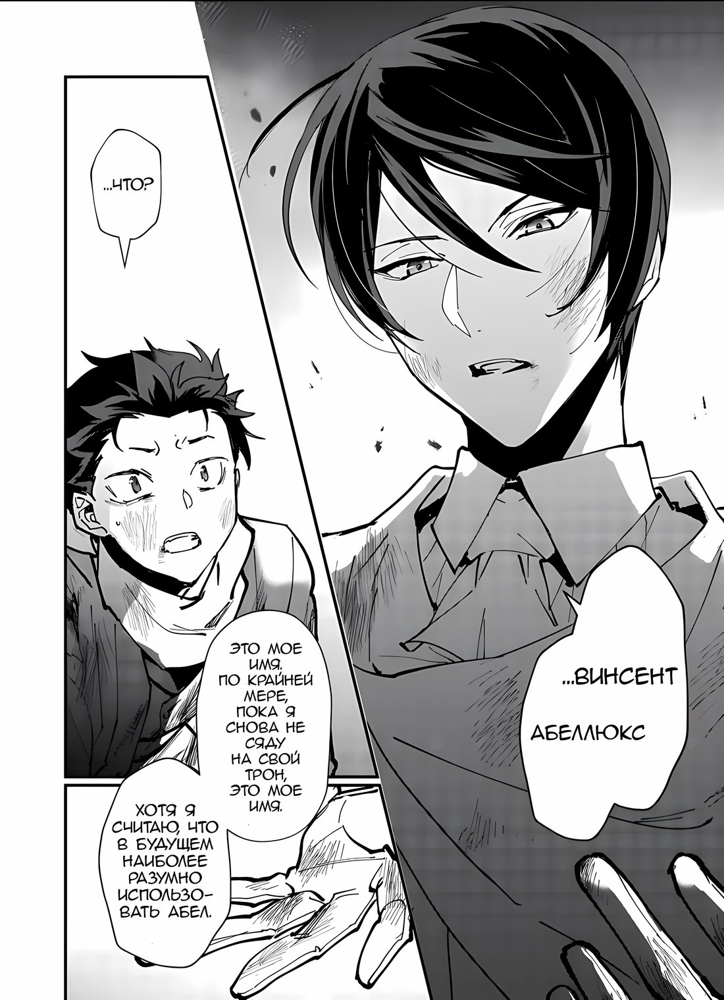
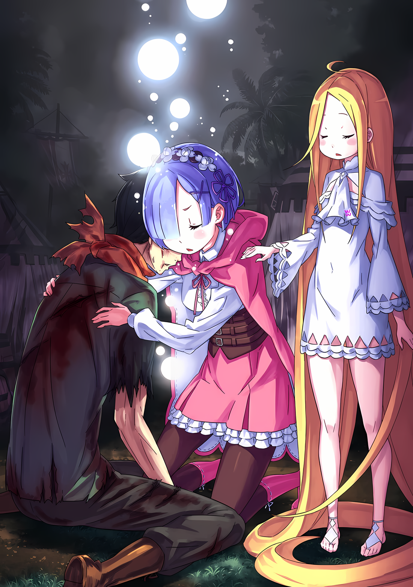
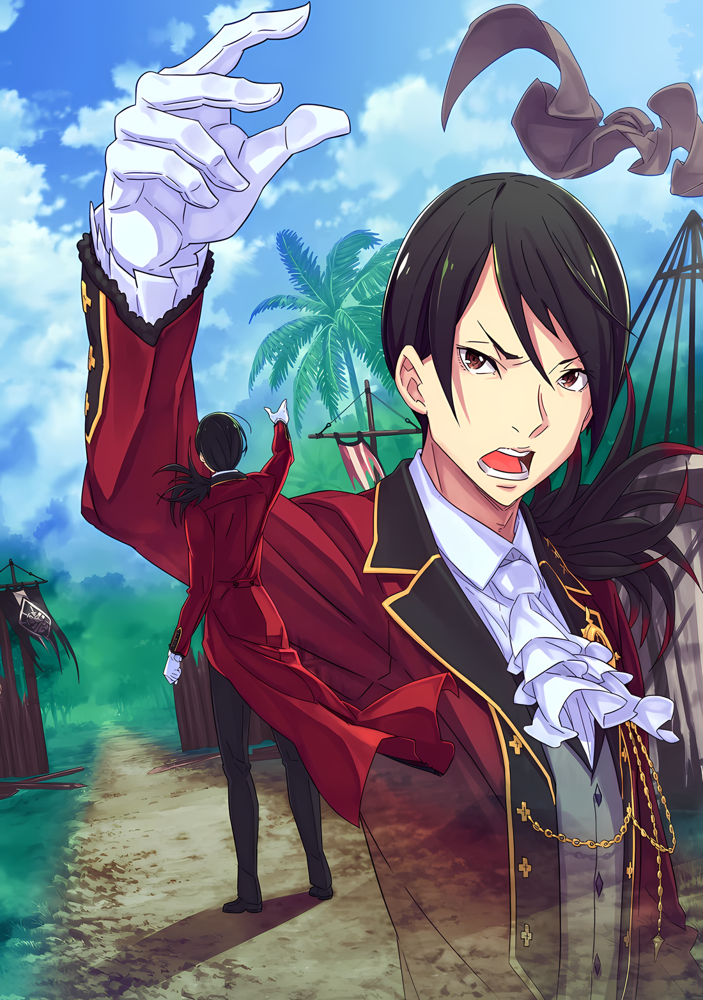
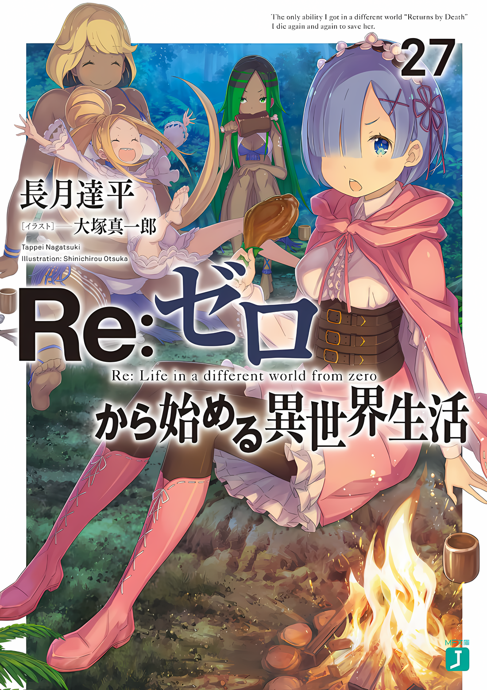

……Он чувствовал, что что-то ужасное кружится вокруг него.

Вихрь, действительно, это был вихрь.

Вихрь кружился и кружился, быстро вращаясь, поглощая все вокруг.

Кружась вокруг и вокруг, кто знает где, на самом деле, нет, это кружилось вокруг его ядра.

Этот ужасный черный вихрь, свирепый, как шторм, резкий, как вспышка молнии, обжигающий, как магма, должен был в конечном итоге поглотить все на своем пути, когда он закружился вокруг.

Возможно, это было ужасное проклятие, которое так долго спало глубоко внутри его тела.

Проклятие «Смерти», которое никогда не снималось, всегда переплеталось, связывалось воедино, связывалось навсегда.

Проклятие, приличествующее жадности, которая никому не продаст свою жизнь, как бы говоря: “она уже заложена".

Проклятия хотели бы, чтобы они не позволили этому судну погибнуть.

Вихрь кружился и кружился, быстро вращаясь, поглощая все вокруг.

Удар в сердцевину этого сосуда, неизбежное проклятье Зверя и Дракона, кружащегося вокруг и вокруг……

△▼△▼△▼△

Палатки с красным флагом предназначались для лечения. Всего в лагере их было пять.

Палатки с черным флагом предназначались для их запасов. Всего в лагере их было двадцать пять.

Палатки с белым флагом предназначались для высшего руководства. Всего в лагере их было три.

Палатка с золотым флагом предназначалась для командира. В лагере была такая только одна.

Ему была предоставлена свобода суетиться по дому, действуя как мастер на все руки. Так что, несмотря на то, что время, которое он провел там, было коротким, ему, как ни удивительно, удалось уделить внимание различным областям.

Империя ознаменовала второй раз, когда Субару увидел настоящий военный лагерь.

Первый раз это произошло примерно во время битвы с Белым Китом в Королевстве Лугуника.

Раньше, когда они расположились вокруг Дерева Флюгеля, чтобы подготовиться к прибытию Белого Кита, они подготовили что-то вроде лагеря. Хотя у того не было такого масштаба, как у этого.

После этого у него было еще несколько шансов разбить лагерь, хотя и в гораздо меньшем масштабе. Тем не менее, все они были намного проще; вряд ли кто-то из них был полноценным лагерем, подобным лагерю в Империи.

Таким образом, он подумал, что будет отмечать кое-что здесь и там, а любопытство будет вспомогательным фактором.

Естественно, Имперские солдаты, за исключением одного, не производили благоприятных впечатлений о нем, поэтому, если бы он предпринял какую-либо попытку войти куда-нибудь, имея что-то важное, они, вероятно, отделили бы голову Субару от его тела, и это было просто, если бы ему повезло.

Однако даже обладание таким большим количеством знаний было……

*???: …бы очень полезно. Есть огромная разница между наличием некоторой информации и отсутствием ничего … И, прежде всего, знание их строения должно дать нам приблизительное представление о силе врага. Все, что осталось, это…*

*???: Чтобы показать нашу храбрость и силу. Я знаю это, собратья мои.*

*???: Действительно, тогда покажи это. Покажите гордость и доблесть Племени Судрак, отважных воинов, которые когда-то сметали врага за врагом, стоя рядом с Императором, прославленным как Военный Император.*

Он чувствовал себя измученным, как будто он устало плывет по теплой воде.

Посреди этого ему стали слышны голоса мужчины и женщины, полные честолюбия.

*???: …………*

И было слышно много других звуков дыхания, кроме дыхания мужчины и женщины, которым принадлежали голоса.

Он чувствовал присутствие огромного количества людей.

Он мог чувствовать что-то похожее на горячее, горячее рвение огромного числа людей.

Он чувствовал, как эти штуковины довольно странно набухают, а он прямо посередине……

*???: ……Тогда давайте начнем, Судрак! С этого момента мы будем проявлять знаки нашей контратаки!!*

*???: Оооооооооо……!!*

……Повсюду разносилась какофония боевых кличей, как будто весь мир раскалывался на куски.

*???: ……Ваа!?*

Почувствовав, как что-то холодное и мокрое коснулось его лица, Субару подпрыгнул всем телом от удивления. Пока он гадал, что произошло, его осознание быстро возросло, и его зрение было покрыто белым, когда он моргнул от удивления. ……На самом деле, нет, это был ответ на влажность, которую он почувствовал.

Мокрая ткань, которую едва отжали, закрывала лицо Субару.

Однажды он прочитал в книге, что существует своего рода пытка, когда кто-то закрывал лицо полотенцем и поливал его водой. Все, что было нужно, — это полотенце и немного воды, и тогда было бы легко заставить кого-то почувствовать, что он тонет, как в адской технике катания на воде.

Субару: М-мне нечего тебе рассказывать!

???: О, Суу, ты встал. Уу тоже рада, что у тебя хорошее настроение.

Субару: А… Ах…?

Субару мог слышать голос, который для мучителя был довольно молодым. Он удивленно покачал лицом. После этого ткань, закрывавшая его лицо, соскользнула, что позволило ему восстановить нормальное зрение.

Казалось, это не было пыткой, и в его свободном поле зрения он мог видеть небо, а листья некоторых больших деревьев слегка закрывали ему обзор. А потом, внезапно повернув лицо, как будто скрывая небо, была…

Субару: Т… Ты…

Утаката: Утаката! Уу — твой охранник, Суу! И медсестра! И няня! Слава богу, ты проснулся!

Субару: …Я все еще не понимаю, о чем ты.

Черноволосая девушка с выкрашенными в розовый цвет концами издала пронзительный смешок и заявила о себе…… Верно, это была Утаката.

Эта девушка была одной из Племени Судрак, кого-то, кого он встретил в их деревне. ……Та, кто однажды убила Субару отравленной стрелой.

Однако, судя по улыбке на ее лице, в настоящее время они установили дружеские отношения, так что ему, вероятно, не нужно было беспокоиться о том, что его жизнь оборвется от такой отравленной стрелы, как эта.

Субару: Конечно, нет никаких признаков того, что меня пытали водой… Или есть? Ммм…

Утаката: Суу, «Ритуал Крови», ты закончил его. Эльгина, ты победил ее. Уу, Мии и Ху, все и все удивлены!

Субару: …Я начинаю вспоминать. Верно, меня заставили участвовать в «Ритуале Крови».

Чтобы заставить Племя Судрака признать Субару и Абела, они бросили вызов «Ритуалу Крови».

Это был традиционный судракийский обряд посвящения, и он использовался для признания совершеннолетия человека. Пойманный тогда Субару и Абел вместе бросили ему вызов.

Противником в ритуале была гигантская змея, обитавшая в джунглях Будхейма, Зверодемон Эльгина.

Субару и Абел рисковали своими жизнями, пытаясь сломать рог Змеи Зверодемона……

Субару: …Это бесполезно. Не знаю, потому ли это, что я был очень поглощен боем или нет, но я ничего не могу вспомнить из последней половины. Если я жив, значит ли это, что Абелу удалось провернуть это…?

Утаката: ……? Суу, ты не помнишь? Мии, была в швах.

Субару: В швах, как в смехе над моим жалким «я»? Дай мне передохнуть… Подожди.

Нахмурившись, глядя на Утакату, которая в недоумении склонила голову, Субару попытался сесть прямо. В процессе этого Субару почувствовал странное ощущение, когда его правая рука коснулась земли.

Это не было обычным странным ощущением, вроде прикосновения к мокрому полу или ходьбы по чему-то каменному. Нет, источник этого странного ощущения был гораздо ближе к дому, чем обычно.

Откровенно говоря, источником ощущения была не земля, а, скорее, рука Субару.

Субару: ….Эм, Утаката-сан? Что-то происходит с моей правой рукой?

Утаката: Правая рука Суу? О да, это было круто! Все это звучало как гуджу-гуджу и бваххх.

Субару: Гуджу-гуджу и бваххх!?

Только получив неприятные ощущения от этих звукоподражаний, Субару удивленно расширил глаза.

Несколько раз глубоко вздохнув, он успокоил свое сердце, прежде чем приготовиться к следующим действиям. Сначала он повернул шею к своей левой руке. Три его пальца были сломаны. Они причиняли боль, но он чувствовал облегчение от этого.

Затем он медленно перевел взгляд на свою правую руку и……

Субару: ……Что это за хрень.

На мгновение он спросил, на что он смотрит. Вот какими неестественными были обстоятельства.

Первоначально правая рука Субару была покрыта пугающим пятнистым черным узором. Это было результатом битвы с Архиепископом Греха «Похоти» в Городе Водных Врат в Пристелле.

Архиепископом Греха «Похоти» Капелла объявила свою собственную кровь кровью дракона и капнула ею на Субару и Круш. В результате Круш получила травму, которую невозможно было залечить, а у Субару на правой руке был выгравирован черный узор, когда он впитывал отвратительную кровь, которая текла по ее телу.

Несмотря на все это, у него, похоже, не было никаких негативных побочных эффектов. Субару носил длинные рукава, чтобы скрыть черный узор, поскольку они не проявляли никаких признаков особого поведения.

Но теперь этот черный узор……

Субару: …………

Собственно, сейчас не время говорить о закономерностях.

Правая рука Субару, от кончиков пальцев до запястья и запястья до локтя, дистальная половина его руки была одета в черное, как будто на нем была черная перчатка.

Сглотнув слюну, Субару осторожно коснулся своей черной правой руки левой рукой.

Его левая рука коснулась чего-то мягкой и дряблой упругости. С другой стороны, он почти не чувствовал прикосновения к своей правой руке. Было такое ощущение, что на нем была резиновая перчатка, поэтому ее движения тоже были вялыми, и……

Субару: ……Подожди, серьезно, что это?

Он почувствовал что-то знакомое в этом странном ощущении. Чтобы помочь этому чувству оформиться, Субару сильно вонзил ногти своей левой руки в черную руку. Засунув пальцы внутрь, он сделал движение, похожее на царапанье.

В этот момент черные части его правой руки отслоились, как краска.

Вскрикнув от удивления, Субару запустил пальцы в очищенные кусочки. Затем он продолжил счищать оставшиеся черные участки с достаточным рвением, чтобы заставить других думать, что он одержим. В конце концов, он очистил все черные пятна от кончиков пальцев до передней половины правой руки, и получилась чистая, свежая новая правая рука для Нацуки Субару.

Субару: О, О БОЖЕ!?

Утаката: Укьян!?

Став свидетелем шокирующего события, разворачивающегося прямо перед его собственными глазами, не меньше, чем на его собственной плоти, Субару закричал. Удивленная его криком, Утаката упала на задницу.

Однако у Субару не было свободного времени, чтобы даже протянуть руку помощи упавшей девушке.

Субару: ЧТ, ЧТ, ЧТ… ЧТО ПРОИСХОДИТ С МОЕЙ ЛЕВОЙ РУКОЙ! ЭТО МОЯ РУКА… ВЕРНО?

Все еще находясь в состоянии шока, Субару открыл и закрыл новую правую руку. Он также нерешительно коснулся собственного лица и ткнул им в землю.

С точки зрения его осязания и движения проблем не было. Это было совершенно нормально.

Черный узор, первоначально имевшийся на его правой руке, тоже исчез. Чистая правая рука Субару была безошибочно такой же, как та, которую бросали и били в течение года, проведенного им в другом мире. Это была правая рука «Лолимансера».

Субару: Подождите, кто кого называет «Лолимансером»!?

???: ……Мне показалось, я слышал, как ты говоришь, что за чушь ты несешь?

Сбитый с толку, Субару подтвердил, что его правая рука в добром здравии, и кто-то подошел. ……Нет, это был не просто кто-то. Он знал только двух людей с такой надменной и высокомерной манерой говорить, и их было легко отличить друг от друга, так как они были разделены по полу.

Это был голос мужчины, а именно……

Субару: Абел, да? Думаю, ты выжил.

Абел: Естественно. Я гораздо более уравновешен, чем ты.

Фыркнув, это был Абел, одетый в свою неизменную маскировку. Субару начинал привыкать к этому зрелищу.

Он бросил вызов «Ритуалу Крови» с Субару, но каким-то образом выжил в битве с Эльгиной. Скорее, следует сказать, что именно благодаря ему Субару выжил.

Потому что, скорее всего, именно он сбил «Эльгину».

Абел: ……Мм. Ты, как твоя правая рука? Ты закончил выглядеть отталкивающе?

Субару: Не мог бы ты, пожалуйста, перестать говорить так, как будто я могу изменить цвет своей правой руки по желанию? Знаешь, это не экран для создания персонажей видеоигр в западном стиле, у меня нет такой свободы… Черная часть оторвалась чисто, когда я ее поковырял. Верно, Утаката?

Утаката: Да. Правая рука Суу отслаивалась, сухая и рассыпчатая! Отвратительно!

Субару: Я понимаю, но боже!

Его щеки напряглись от прямолинейной реакции Утакаты, Субару протянул правую руку Абелу. Абел внимательно осмотрел его и пробормотал: “Понятно”.

Абел: В любом случае, мне все равно, вернется ли он в прежнее состояние. Я, конечно, не ожидал удара, используя все магическое кольцо из запечатывающего камня. Все, что было ниже запястья, исчезло, и я поверил, что тебя уже не спасти.

Субару: Подожди, подожди, подожди, ты пытаешься напугать меня? Все, что ниже чьего запястья пропало?

Абел: Твоего.

Утаката: Суу!

Абел ответил, скрестив руки на груди, и Утаката весело подняла правую руку в воздух.

Субару вздрогнул от их ответа и уставился на свою прекрасную правую руку. Мало того, что ее оторвало, так еще и правая рука теперь была в совершенно новом состоянии.

Субару: В-вот ты опять говоришь такие вещи. Если она исчезла, то что с этой правой рукой?

Абел: Это было отвратительное и любопытное явление. Твоей руки не было, и на пороге смерти я заставил тебя произнести свои последние слова. Я думал, ты умираешь, но… из твоей руки хлынула черная жижа.

Субару: Жи-жижа…?

Абел: В мгновение ока оно приняло форму и превратилось в черную руку. Если ты хочешь спросить меня, что произошло, мне придется расспросить тебя о значении того, что ты делал с собой.

Пронзенный его острым взглядом, у Субару перехватило дыхание.

Его взгляд сразу же вернулся к правой руке, но что бы ни говорил Абел, даже Субару не понимал, что произошло, что привело к такому результату. Тем не менее, черный узор, который был выгравирован на его руке в течение некоторого времени…… его исчезновение не было связано, это было очевидно.

Возможно, это действительно был эффект действующей крови дракона, но……

Субару: Тем не менее, возникает вопрос, почему это не сработало до сих пор…

Тем не менее, с момента инцидента, когда Субару был залит кровью дракона, прошло почти три месяца.

Впоследствии, во время путешествия по Песчаным Дюнам Аугрии и в разгар смертельной борьбы у Сторожевой башни Плеяд, Субару проходил грань между жизнью и смертью больше раз, чем когда-либо прежде, и в конце концов попал в Империю.

……За это время произошло множество буквально смертельных ситуаций, однако ничего подходящего не произошло, чтобы залечить его раны.

Так почему здесь, почему сейчас……

Субару: ……Нет смысла думать о том, чего я не понимаю. К тому же, кроме правой руки, мои раны совсем не зажили.

Субару проворчал, осматривая все свое тело. Сломанные пальцы его левой руки, рана на спине от лопатки, странные ожоги на затылке, а также множество других синяков — все они не зажили.

Честно говоря, поскольку была исцелена только его правая рука, это увеличивало вероятность того, что, к его несчастью, она была исцелена только из-за черных отметин.

Субару: И то, что было на моей правой руке, тоже исчезло, так что, вероятно, оно больше не заживет ……Если бы ты попросил меня еще раз оторвать руку, чтобы проверить это, я бы не смог этого сделать.

Абел: В конце концов, ты говоришь, что это ситуация, о которой ты не можешь говорить. Кажется, у тебя много секретов.

Субару: Я не хочу, чтобы это говорил парень, который прячет свое лицо…

Субару ответил, сделав горькое выражение лица, и выдохнул с “ах”.

Он неторопливо размышлял о странности своей правой руки и проверял безопасность Абела, но вспомнил, что ему нужно было кое-что сделать важнее этого.

Он участвовал в «Ритуале Крови», и если в конце ритуала он не умер, это означало, что время продолжало течь, даже когда Субару был без сознания.

То есть с тех пор прошло уже несколько часов……

Субару: …Рем. Точно, Рем! Я не могу сидеть здесь вот так, мне нужно…

Его целью с самого начала было вернуть Рем, которую он оставил позади.

По этой причине он бросил вызов «Ритуалу Крови», но если бы прошло слишком много времени для ее спасения, смысл рисковать своей жизнью в бою был бы просто потерян.

Утаката: Ах! Суу, не говори глупостей! Ты умрешь!

Субару: К черту! Даже если я не умру, если Рем умрет, то не будет… Ггкх

Побуждаемый тревогой в сердце, Субару изменил позу, чтобы встать с кровати.

Именно в этот момент Субару заметил очевидную странность кровати. ……Он спал в переносном похожем на святыню ящике из скрещенных бревен, который, по-видимому, вынесен из здания.

Оттуда Субару упал с огромной силой, застонав от боли, пронзившей все его тело.

Субару: Гаах, гхаа…хх

Абел: Какая глупость. Ты действительно думал, что твое тело оправится после смерти просто потому, что у тебя снова выросла правая рука? Я говорил тебе. Я видел тебя умирающим человеком. Ты думаешь, я ошибся в своих суждениях?

Субару: Это……

Глядя вниз на Субару, скорчившегося от боли, холодный голос Абела полился, как дождь.

Как бы подтверждая слова Абела, Субару заметил ощущение глубоко внутри своего собственного тела, как будто что-то медленно, но неуклонно вытекало наружу.

Испытав много раз смертельные травмы, Субару знал, что это плохой знак.

Как воздушный шар или ведро с отверстием там, где его не должно быть, с водой, воздухом или чем-то еще внутри, было такое чувство, как будто то, что держало его надутым, выливалось наружу……

Субару: Но Рем нуждается……

Абел: ……В этой ситуации ты все еще больше, чем о себе, беспокоишься об этой женщине? Что ж, прекрасно. Я так и знал. Поскольку это было то, чего ты желал, даже ценой своей правой руки.

Субару: …Аааа?

Абел: Сюда.

Субару больше заботился о безопасности Рем, которого здесь не было, чем о своей собственной жизни.

Абел раздраженно вздохнул от слов Субару и дернул подбородком. Он сразу же ушел, даже не взглянув на Субару. Как бы говоря: “Следуй за мной”.

Утаката: Суу, ты можешь идти? Тебе нужно мое плечо?

Субару: Нет, я могу ходить… Если бы я использовал твое плечо, разница в росте только усложнила бы задачу.

Увидев выражение ее лица, увидев, что Утаката беспокоится за него, Субару заставил себя улыбнуться ради нее.

А затем Субару глубоко вздохнул и каким-то образом сумел встать. Прихрамывая, он догнал идущего впереди Абела.

Абел: …………

Абел был немного впереди, ожидая, когда Субару догонит его.

Используя камни, покрытые зеленой травой, в качестве опоры для ног, он имел хороший обзор, глядя на край утеса. С огромным усилием Субару тоже перелез через большие камни и встал рядом с ним.

И наконец……

Абел: ……Смотри.

Еще раз, в соответствии с легким движением его подбородка, Субару поднял глаза.

Таким образом, его поле зрения расширилось, с высоты Субару окинул взглядом непрерывный обзор и открыл рот.

Как в изумлении с открытым ртом. Потому что там……

Субару: ……А?

Поднялся черный дым, лагерь был охвачен пламенем. ……Палаточный лагерь имперских солдат был поглощен пламенем.

△▼△▼△▼△

……Он слышал боевые кличи. Они разносились в воздухе вместе с победными песнями.

Субару: …мх!!

Люди, которые выкрикивали боевые кличи или иным образом громко пели песню, о которой Субару никогда не слышал, были группой женщин-воинов с оливковой кожей. Они свободно бегали по полю боя, неся луки за спиной.

Из-за внезапного нападения Племени Судрак лагерь Имперской армии пришел в запустение. Имперские солдаты потеряли способность контратаковать и могли только надеяться убежать, но их расстреливали одного за другим.

Субару: Это…

Абел: Идите в наступление, украдите их оружие, сожгите их лекарства и пробейте брешь в их командовании. Потеряв пальцы и голову, все, что они могут сделать, это свернуть хвостом и бежать, не задумываясь о том, как они выглядят. ……Как некрасиво для так называемых Волков-Мечей.

Субару: …………

Внизу можно было увидеть суетливые фигуры Имперских солдат, вытесненных черным дымом и натянутыми луками.

Однако убежать от судракийцев, которые добывали средства к существованию, охотясь на зверей в джунглях, было невозможно. Их стрелы, которые могли лететь далеко и далеко, попали в спину убегающего солдата, пронзив их сердца со смертельной точностью.

Скольким удалось бежать? Скольким удалось выжить?

Сколько людей умерло?

Субару: Это…

Абел: Почему ты выглядишь озадаченным, Нацуки Субару? Это то, чего ты желал. Информация, которую ты предоставил, помогла твоим братьям достичь этих результатов в бою. Когда ты посмеешься, если не сейчас?

Глядя вниз на лагерь, превращенный в поле битвы, Субару почувствовал слабость. Вдобавок ко всему, Абел решительно столкнул реальность ситуации с лицом Субару, заявив, что это были действия, которых хотел Субару.

Не в силах вынести этих слов, Субару с огромной силой встал и схватил Абела за воротник.

Схватив Абела своей недавно исцеленной правой рукой, он пристально посмотрел Абелу в глаза.

Субару: Я желал этого? Это, такого рода сцена!? Не будь идиотом…

Абел: ……То есть ты думал, что сможешь исполнить свое желание, не пролив ни капли крови?

Субару: ……кх

Однако, несмотря на вспышку гнева Субару, Абел огрызнулся. Глубоко порезанный своим острым языком, Субару не мог возразить.

Субару: …………

На вопрос, думал ли он, что сможет исполнить свое желание без кровопролития, Субару ничего не ответил.

Он думал, что сможет добиться этого без кровопролития. Он думал, что это возможно.

Так как……

Абел: Позволь мне перефразировать, Нацуки Субару. ……Ты думал, что сможешь осуществить свое желание без пролития крови, кроме твоей собственной.

Субару: ……а

Абел: Этот мыслительный процесс идиотский. Глупое и неисправимое предположение. Неужели ты всерьез думал, что, пролив свою кровь, воюющая третья сторона остановится? Тот героический менталитет, который ты стремишься поддерживать, — не что иное, как нелепое и негативное качество. Это мания героизма.

Субару: …………

Абел: Ты человек, Нацуки Субару. Ты не Герой и не Мудрец. Поэтому такие люди, как ты, будут постоянно истекать кровью, умирать, брать и быть взятыми.

Все еще держа его за воротник, Абел осыпал Субару метафорическими ударами, когда хватка Субару медленно ослабла.

Пораженный этими словами, у Субару задрожала челюсть. Он нерешительно покачал головой.

Вероятно, это было правдой.

Это была реальность, которую он не мог отрицать. Он понимал это. Но даже в этом случае Субару не мог с этим смириться.

До сих пор он не жил в этом мире, принимая подобные вещи.

Даже после прихода в другой мир мораль Нацуки Субару все еще оставалась моралью японского старшеклассника.

Он не мог признать принципы и здравый смысл поля боя очевидными, повседневными фактами.

Абел: Я не хочу быть Героем. Я также не цепляюсь за них, не полагаюсь на них и не доверяю им. Решать различные вопросы и продвигаться к богатому будущему. ……Герой не может этого сделать.

Субару: Что, что… Ты, чего ты хочешь…

Теряя силы, Субару снова упал на колени, не в силах понять Абела.

Бросив вызов «Ритуалу Крови» вместе, он был тем человеком, с которым Субару вырвал победу. Они неожиданно совпали по длине волны друг с другом, и Субару подумал, что между ними установилась хорошая химия. Но теперь он не мог понять, о чем думал.

Конечно, он не мог этого сделать. ……Против того, кто отказался показать свое лицо, как один мог понять другого.

Субару: От кого-то, кто даже не показывает своего лица, что ты…

Абел: Моего лица, значит? ……Тогда позволь мне показать тебе.

Ему даже не дали времени закончить формулировку своего вопроса.

Услышав тонкую, отчаянную реплику Субару, Абел закрыл лицо руками. Когда он пальцами развязал потрепанные узлы на своей обернутой маске, подул ветер.

Обдуваемая сильным ветром, маска энергично расстегнулась и улетела далеко-далеко.

Улетая, и летя мимо лагеря, превращенного в поле битвы. Оседлав исходящий ветер, она отправилась бы в другое место, куда угодно, улетев далеко и далеко……

Абел: Мы пойдем в Имперскую столицу. В столицу, где находится трон, на котором я должен сидеть.

Субару: …………

Наблюдая за летящими лохмотьями, Абел провозгласил эти слова преувеличением.

Глядя на этого мужчину с открытым лицом, Субару тихо затаил дыхание, не в силах отвести взгляд.

Он увидел привлекательного черноволосого молодого человека с запоминающимися глазами-щелочками.

На вид ему было от двадцати до двадцати пяти лет, возраст старше, чем у Субару. Черты его лица были достаточно очаровательны, чтобы завладеть вашим взглядом. И хотя его волосы были растрепаны, а щеки испачканы, вероятно, из-за времени, проведенного в джунглях и поселении, они только подчеркивали его естественную красоту.

Его руки и ноги были длинными и стройными. И поверх этого стройного тела покоилось это лицо, так что можно было сказать, что его существование было создано для того, чтобы быть совершенно привлекательным.

Тем не менее, его самая характерная черта заключалась в его черных глазах.

Глаза, которые, казалось, заставляли все падать ниц перед ним. Их пристальный взгляд излучал атмосферу всепоглощающего превосходства и устрашения.

Почувствовав полную лобовую атаку этих глаз, Субару, уже опустившийся на колени, осознал, что была еще одна причина, по которой он не мог двигаться, помимо травмы и усталости.

Он понимал это. Что его душа знала, что он должен подчиниться человеку, стоящему перед ним.

Причиной его подавляющего присутствия было то, что……

Абел: ……Винсент Абеллюкс

Субару: …Что?

Винсент Абеллюкс: Это мое имя. По крайней мере, пока я снова не сяду на свой трон, это мое имя. Хотя я считаю, что в будущем наиболее разумно использовать Абел.

Перевод фрагмента из фанатской-манги от @roikumama

Сказав это, Абел скривил губы в ответ на Субару, пораженный его ошеломлением.

Субару слишком поздно понял, что его улыбка была ужасно злодейской и дикой.

Неспособный понять значение этого имени.

Мизельда: Абел! Субару!

Субару: ……кх

То, что вывело Субару из оцепенения, был резкий голос.

Повернув голову на голос, он увидел фигуру, размахивающую руками, когда они шли к ним. Фигура была амазонкой с выкрашенными в рыжий цвет волосами, лидером Судрак, Мизельдой.

Мизельда расслабила свое воинственное лицо, превратив его в дружелюбное.

Мизельда: Захват лагеря завершен. Потери с нашей стороны минимальны и… О? Абел, я впервые вижу твое лицо, но ты настоящий убийца женщин, не так ли…

Субару: Мизельда…

Мизельда: Гм… Субару, я рада, что ты встал. Умирать тогда, даже будучи братьями, это не приходило в голову.

Избавившись от своего мимолетного очарования истинным лицом Абела, она посмотрела на Субару добрыми глазами.

Ее улыбка была теплой, адресованной тем, кто еще жив, но уже на пороге смерти. Увидев эту улыбку, сердце и тело Субару сжались. Как и Абел, она пришла к выводу, что Субару осталось жить недолго.

Кроме того, она могла вести себя счастливо, даже когда он умирал, потому что их взгляды на жизнь и смерть были разными.

Однако ее взгляды на жизнь и смерть были не единственной причиной, по которой она могла оставаться жизнерадостной. Ее следующее действие подтвердило это для Субару.

Мизельда: Холли, приведи их сюда.

Холли: Да, да, я так и сделаю~!

Когда Мизельда поманила ее, она получила в ответ веселый ответ.

Навстречу неуклюже приближалась молодая женщина со светлыми волосами, та, что без особых усилий подняла огромный валун —ее звали Холли.

Она шагнула вперед с улыбкой на лице, в ее руках была……

Холли: Давай, перестань быть такой суетливой~. Бедная маленькая Куна, она еще даже не проснулась после того, как ты отправила ее в полет~

???: Как будто я перестану сопротивляться…! Отпусти меня! Что ты хочешь со мной сделать?!

Холли: Ой, да ладно, ты совсем не слушаешь~

Хотя Холли только надулась, девушка, зажатая в ее объятиях, не подавала никаких признаков прекращения борьбы.

Он хотел воссоединиться с ней, услышать ее голос, посмотреть на ее голубые волосы и прекрасное лицо, которое в данный момент было надуто от гнева. Это была не кто иная, как……

Субару: ……Рем!

В этот момент Субару забыл обо всем: о благоговении, которое он испытывал к Абелу, о жалком состоянии, в котором он находился, и даже о море пламени, в которое превратилось это поле битвы. Он отбросил все это и бросился бежать.

Он был мучительно медлителен. Не имея возможности просто спрыгнуть с валуна, он волочил ноги за собой, бегая едва ли быстрее малыша.

Он потащился к Холли, которая несла Рем и……

Рем: Ты……

Субару: Рем! Слава богу, ты в порядке…

Рем: Ты, ты стоял за этим? Подонок!

В тот момент, когда он протянул ей руку, она ударила его по лицу.

Внезапный резкий звук поразил Холли, Мизельду и даже Утакату. Этот удар был достаточно сильным, чтобы сбить его с ног.

Но он не сдался и даже не издал ни звука жалобы.

В конце концов, в чем можно было быть недовольным.

Рем была здесь. Она была жива, бодрствовала, говорила. Это все, что он хотел.

Субару: Рем……

Рем: ……тч, ты, ты и твой…

Несмотря на то, что он получил довольно сильную пощечину, Субару все же заключил Рем в объятия. Он забрал ее у Холли, как будто схватив ее в грудь, к ее первоначальному удивлению, но сразу после того, как ее лицо покраснело от ярости.

И чтобы ударить его спиной, она сжала руку в кулак и…

Рем: ……Ты

Она остановилась, казалось бы, заметив, все его раны.

Рем: …………

Облегчение лишило его силы колен, поэтому Субару тут же рухнул на землю, а Рем все еще была у него в груди. И находясь в его груди, Рем посмотрела… и потеряла дар речи из-за травм на плечах, туловище, ногах, левой руке и многих других местах.

Субару: ……Ты сломала мне левую руку, помнишь?

Рем: Я знаю! Но все остальное… Ты же ведь умрешь! Мы должны вылечить тебя немедленно……

Мизельда: Это бесполезно.

Рем беспокоился о его ранах, когда Субару слабо улыбнулся ей. Однако ее просьба была немедленно отклонена кратким ответом Мизельды.

У Рем перехватило дыхание, пораженная тем, насколько резким было отрицание Мизельды.

И когда она подняла лицо, чтобы посмотреть, Мизельда встретилась с ней взглядом, затем медленно покачала головой.

Мизельда: Его раны глубоки. Слишком глубоки. Даже если мы будем ухаживать за ними, они не заживут. Только его воля удерживает его с нами здесь прямо сейчас, но даже это, похоже, исчезает.

Рем: Исчезает… Но почему! Почему сейчас, почему вдруг…!

Мизельда: ……? Потому что он вернул женщину, за которую боролся. Зачем еще?

Она склонила голову набок, слегка озадаченная, затем изложила это по буквам, как будто это был самый естественный вывод.

Услышав это, у Рем перехватило дыхание, а Субару, не в силах даже поднять голову, горько улыбнулся.

Субару: Мизельда-сан, эта фраза вроде как…

Мизельда: Я неправильно выразилась? Это последнее желание товарища. Конечно, мы сделаем все возможное, чтобы подчиниться. Ты заслужил это, Субару.

Субару: Хаха, премного благодарен…

Половина его находила откровенное проявление доверия Мизельды освежающим, в то время как другая половина находила это отвратительным.

Он слишком хорошо знал, что в их внешности и словах не было лжи; их следовало принимать за чистую монету. Таким образом, он заставил Рем взвалить на себя все остальное, включая его тяжелые ноги.

Хотя, в конце концов, он сделал свои собственные тяжелые ноги еще тяжелее……

Рем: Почему, почему, почему, почему…

Не в силах даже поднять лицо, он молча слушал голос Рем.

Он заметил, что ее голос дрогнул, и в какой-то момент их позиции поменялись местами. Он понял, что она приподнимает его за плечо.

Ее голубые глаза устремляются к нему, внимательно наблюдая за ним. В них поднялись подозрение, недоверие и печаль.

Рем: Почему, почему тебе нужно заходить так далеко? Почему ты…

Субару: …………

Рем: Почему? Скажи мне.

— спросила она. Она искала его причину. Его цель.

Он вспомнил воспоминание об этом, о том, как однажды ему задавали тот же вопрос.

Что он ответил, когда она впервые спросила его об этом? Этот важный человек снова спрашивал его об этом.

Но, будучи так близок к потере сознания, он не мог вспомнить остальную часть этого воспоминания.

Итак, подумал он, он даст этой девушке, этой девушке, которая была на грани того, чтобы разрыдаться, ответ, который был в его сердце в этот момент.

Рем: Почему?

Его спросили.

Субару: ……Потому что я хочу, чтобы ты была счастлива.

Рем: …………

Субару: Я хочу, чтобы ты смеялась, улыбалась… Это все, чего я действительно хочу. Это все, что мне нужно.

Я хочу, чтобы ты была окружена своими близкими, в месте, где тебя примут. Вот так я хочу, чтобы ты была счастлива.

Я хочу, чтобы ты улыбалась, как всегда, этой улыбкой, похожей на распускающийся цветок, на звезды, мерцающие в ясном ночном небе, далеко-далеко.

Я просто хочу, чтобы ты была счастлива. Это все, о чем я прошу.

Субару: …………

Рем: ……А? Чт… Подожди! Подожди…!

Тело Субару медленно обмякло.

Его голова низко опустилась, шея не выдержала, и верхняя часть тела вот-вот упадет. Рем немедленно притянула его ближе к себе крепкой хваткой, окликая его, когда его голова опустилась рядом с ней.

Ответа не последовало.

Мизельда: ……Дорогие товарищи, давайте принесем мир духу этого воина.

Мизельда выпрямилась, выражая уважение и подкрепляя его мелодией, которая начала слетать с ее губ.

После ее песни Холли и Утаката, а также другие из Племени Судрак, женщины, которые ранее пели песню победы, все начали петь в унисон.

Это был реквием, чтобы попрощаться с воином, который сражался до последнего вздоха, который до самого конца сохранял свое достоинство……

Рем: Подожди… Это, но… для меня он…!

Отосланный этим реквиемом, Субару был на грани того, чтобы расстаться со своей жизнью. Рем покачала головой, глядя на его умиротворенное лицо, не в силах принять это.

Рем: …………

Она не знала почему. Она тоже этого не понимала.

В конце концов, то, что он ей сказал, не ответило на ее сомнения.

Но она знала, что при такой скорости ответ будет потерян навсегда, так что……

Рем: Пожалуйста, не умирай в таком месте… Не умирай, не умирай, не умирай…!

Мужчина, который смотрел на нее так нежно и сострадательно, несмотря на то, что от него исходил такой невыносимый, отталкивающий запах, которого она инстинктивно хотела избежать. «Ты не должна потерять его здесь», умоляла и умоляла ее душа.

Вот так Рем прикусила губу, страстно желая спасения……

???: Аа, уу?

Внезапно, одновременно со стонущим голосом ребенка, Рем почувствовала руку на своем плече.

Рем: ……ах,

Обернувшись с полными слез глазами, Рем увидела, что золотоволосая девушка положила руку ей на плечо. Все еще выглядя так, как будто она отключилась, девушка уставилась на лежащего без сознания Субару.

Когда девочка пробормотала "Уауу”,

Рем: ……Это?

Мало-помалу теплое ощущение просочилось в Рем от ее плеча, где девочка коснулась ее.

Это было мягкое чувство, которое медленно щекотало в глубине ее сердца. Рем стало трудно дышать, она не могла сдержать слез, которые текли по ее щекам.

Что бы это ни было, что просочилось в нее из ладони девушки, это стимулировало странное ощущение, которое лежало внутри нее.

Оно набухало, и она не должна была вот так держать его в себе. Она должна была где-то освободить его. Повинуясь своим инстинктам, Рем выпустила его из всего своего тела.

Оно струилось по ладоням девочки, переливаясь в Рем, таким образом……

Субару: ……………

Вливаясь в тело Субару, которого она держала на руках, когда его жизнь была на волоске.

????: ……Целительная Магия, я понял. Даже я не ожидал этого.

Рем: Э…?

Мужской голос достиг ушей Рем, оставив ее ошеломленной, неспособной понять, что именно произошло. Подняв голову, она увидела черноволосого мужчину, который смотрел на нее прищуренными глазами, сложив руки вместе.

Рем уже собиралась открыть рот, чтобы задать ему вопрос, и……

????: Закрой свой рот, женщина. Хотя ты делаешь это подсознательно, это своего рода чудо, которое было активировано благодаря выполненным условиям. Если твой разум будет блуждать, он будет прерван и потеряет свою эффективность.

Рем: …………

????: Оставь свои сомнения и гнев до тех пор, пока вы не закончишь то, что лежит перед тобой. Не упускай эту возможность впустую.

В словах этого мужчины был вес, который Рем не могла отрицать, поэтому она закрыла рот как раз в тот момент, когда собиралась возразить ему.

А затем, как и сказал ей мужчина, она сосредоточилась на том, чтобы направить тепло в тело Субару, находящееся в ее объятиях.

Она понятия не имела, какой эффект произведет жара. Однако дыхание Субару, которое становилось все слабее, когда он лежал в ее объятиях, немного восстановило свою стабильность.

Одного этого было достаточно для нынешней Рем.

Рем: …Я все еще не знаю, кто ты такой, на данный момент. Но…

Но тут же она сделала паузу, не решаясь продолжить то, что собиралась сказать, и закрыла глаза.

«Я хочу, чтобы ты была счастлива». Те слова, которые она услышала, не казались ложью.

Рем: Если ты не останешься в живых, то не сможешь увидеть мою улыбку.

Словно прошептав.

Илюстрация к **Ранобэ** Том 26 | Разукрасил NorvakKK

△▼△▼△▼△

……Исцеляющий свет был активирован, и смертельные травмы Нацуки Субару были обработаны.

???: ………

Скрестив руки на груди, человек, который смотрел вниз на сцену… человек, который назвал себя Винсентом Абеллюксом, вздохнул, так как жизнь Субару едва поддерживалась.

Мужчина считал Субару ужасно невезучим, но в то же время и чрезвычайно удачливым. Он покорил сердца судракианцев, находясь на грани смерти, вернул себе то, что хотел вернуть вдобавок ко всему, и он также чудом избежал собственной смерти.

Он также мог предположить, что Субару может быть проницательным, рассчитав, что он выживет, если вернет ту голубоволосую девушку… Рем, хотя шансы были невелики.

Винсент: Если бы он действительно был таким умным, то для начала залечил бы сломанные пальцы на левой руке.

Несмотря на то, что Рем сломала ему пальцы и оставила их без какого-либо лечения, Субару был человеком, который хотел забрать ее обратно, будучи покрытым кровью и грязью.

Если он сделал все это, чтобы осуществить свои амбиции, то следует признать, что уловка Субару была непостижимой и потусторонней. Однако в нем не чувствовалось блеска мудрого человека, да он и не казался таковым.

В этом человеке не было видно ни малейшего, даже намека на «Героя», о котором упоминалось в различных слухах.

Винсент: Предполагалось, что это будет подношение человеку, который был бы убит в бою, однако… Если он выживет, то, я полагаю, это и так прекрасно.

Потеряв ощущение, охватившее его лицо, мужчина прищурил глаза, прикасаясь к своему лицу, ветер впервые за долгое время ласкал его кожу.

Нацуки Субару чудом избежал смерти, и с Племенем Судрак была заключена клятва крови. Казалось, что группа имперских солдат ни о чем не была уведомлена, но это также соответствовало ожиданиям этого человека.

Люди на этой земле…… нет, большинство людей в Империи еще не осознали этого.

Они не осознавали серьезного кризиса, беспрецедентного политического переворота, охватившего великую державу, известную как Священная Империя Волакия.

Однако……

Винсент: Премьер-министр Беллстетз, вы, Девять Божественных Генералов-предателей, и вы, глупые Имперские солдаты, не ведающие о вершине.

Стоя на холме, где дул пронизанный жарой ветер, человек… Абел повернулся в сторону Имперской столицы, расположенной далеко на западе.

Сердце Священной Империи Волакия, имперская столица Рапгана, земля, на которой находился трон, должна быть возвращена……

Винсент: ……Дрожите и трепещите, ожидая моего возвращения.

И затем……

Винсент: Так как ты выжил, в конце концов… Я попрошу тебя сопровождать меня, Нацуки Субару. ……Чтобы вернуть Империю Волакию в мои руки.

Иллюстрация к **Ранобэ** Том 26 | Разукрасил NorvakKK

※※※※※※※※※※※

**Re:Zero. Жизнь с нуля в альтернативном мире**

Арка 7: Страна волков

Том 27 (ранобэ)

Файл оформлен telegram-каналом: https://t.me/rezeroranobeandwebnovel

Дополнительная редактура: djoenfoej

**Описание**

*Нацуки Субару непреднамеренно переносится в Империю Волакия, где он наконец-то воссоединяется с пробужденной Рем. Однако их радость недолговечна, поскольку оба они оказываются втянуты в огромную гражданскую войну, охватившую всю Империю. Субару сталкивается с Винсентом Абеллюксом, императором, свергнутым со своего трона, и клянется вернуться в королевство Лугуника вместе с Рем. Однако в Городе-крепости Субару сталкивается с непредсказуемой спиралью «смерти» и жестокими последствиями выбора, который он вынужден сделать.*
