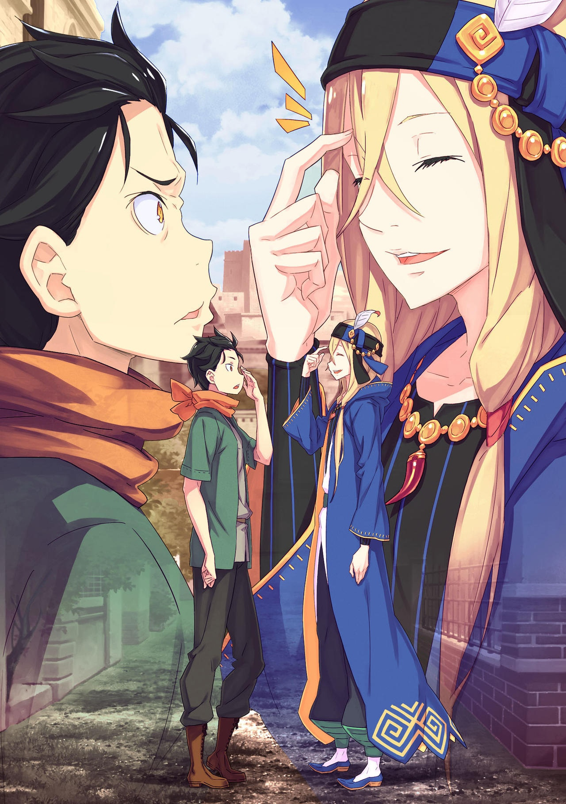

……Город-крепость «Гуарал».

Так назывался первый цивилизованный город в Империи, до которого добралась группа Субару.

Поскольку до сих пор они постоянно спали под звездами в лагере Имперских солдат и деревне судракиек, увидеть цивилизацию было особенно радостно.

Тем не менее, они не могли просто отпустить себя и наслаждаться чудесами цивилизации.

Причина в том, что……

???: ……Проверка.

На их глазах, у входа в город, проходила проверка, и Субару смочил губы языком.

Гуарал был окружен со всех четырех сторон защитной стеной, а въезд и выезд на восток и запад ограничивался по одному с помощью больших ворот. У ворот стояли постоянные посты досмотра, и даже издалека можно было увидеть мрачные лица стражников, которые бдительно следили за происходящим.

«Куна: Они смогут определить с одного взгляда, что мы судракийки. Так что мы не можем пойти с вами, друзья, но если вы не несете ничего подозрительного, то все будет в порядке.»

«Хоули: Все получится, если вы не будете робеть и смело войдете~. Позаботься о Рем и Луис-чан, хорошо~?»

Перед тем, как они прибыли в город, это были напутственные слова Куны и Хоули.

Обе посоветовали ему не волноваться больше, чем нужно, но так просто забыть о своей нервозности и тревоге — предложение, которому невозможно последовать.

Во всяком случае, в Империи они были иностранцами с неизвестной принадлежностью и без документов.

Субару: Во всяком случае, даже такой чужеземец без здравого смысла, как я, может сказать, что лугуникийцам нежелательно бродить по Волакии в наши дни.

Казалось, если он по глупости раскроет свою истинную личность, то, без сомнения, навлечет на себя неудовольствие стражников.

Дело было не только в том, что их могли буквально выставить за ворота, быть случайно арестованным или что-то в этом роде было бы ужасным событием, если бы оно произошло. Он уже прошел через это в Имперском лагере.

……Субару совершенно не мог допустить повторения подобного конца, когда многие сгорели бы в результате его собственных ошибок.

Субару: …………

??? …Окружающие начнут подозревать, если ты будешь выглядеть слишком мрачно.

Субару нахмурил брови в знак того, как он разрывается внутри; услышав ее голос, его глаза расширились от удивления.

Голос доносился со спины… И принадлежал он Рем, которая ехала в деревянном рюкзаке.

Из-за того, как был устроен рюкзак, Рем не должна была видеть лицо Субару, так как их спины были прижаты друг к другу.

Субару: И все же, как ты узнала, что я морщу брови?

Рем: Даже если я не вижу, я слышу твое дыхание. И биение твоего сердца тоже, поскольку наши спины соприкасаются, хотя и через рюкзак… Я чувствую напряжение отсюда.

Субару: Уф… Извини за это. За мой наморщенный лоб, и за громкое сердцебиение тоже.

Рем: Да. Позволь мне немного тишины, пожалуйста.

Субару: Под этим ты подразумеваешь «успокоиться», а не «перестать дышать», верно?

В ответ на то, что Субару на всякий случай попросил подтверждения, Рем промолчала, вздохнув.

Длинный вздох Рем был похож на нечто среднее между тем, что Субару ему надоел, и безразличием к нему. Поскольку он не был вызван явным отвращением или враждебностью, Субару почувствовал некоторое облегчение.

Если бы кто-нибудь сказал ему, что его стремления низки, он бы ничего не смог ответить.

Луис: Ооо, Ооо?

Субару: …Я понял, так что поторопись. Ты тоже одна из причин моего беспокойства, знаешь ли!

Потянув за рукав Субару, длинноволосая Луис указала на линию.

Рог Зверодемона, завещанный им Куной, Луис несла в белом свертке, недоумевая, почему Субару не встает в очередь.

Однако он не мог поступить бездумно, как Луис, и опрометчиво встать в очередь.

Субару: Сейчас у нас нет возможности предъявить удостоверение личности или дать взятку охранникам ворот. Поэтому невозможно подойти спереди.

Рем: А разве нельзя встать в очередь и поговорить с охранниками?

Субару: Быть честным и все обсудить — это вариант, но ситуация, когда он провалится и мы не сможем оправиться, пугает… Потому что у нас сейчас нет никого, на кого мы могли бы положиться.

Выслушав опасения Субару, Рем издала небольшой звук и замолчала.

Возможно, для страдающей Рем без «Воспоминаний» это было трудно представить, но для каждого места и культуры осторожность не была чрезмерной.

……Удивительно, но с того момента, как троицу унесло в Империю со сторожевой башни Плеяд, прошло десять дней.

Первоначальный хаос немного улегся, а разгоревшиеся отношения между Субару, Рем и Луис отложились до поры до времени. Тем не менее, все еще трудно было сказать, что все налаживается.

В любом случае, единственный раз, когда Субару и Рем… а также Луис… действовали вместе и сами по себе, произошел, когда они убегали от Охотника и Эльгины. Это длилось всего лишь мгновение после того, как их сдуло сюда.

В любое другое время, будь то в лагере Имперских солдат, в поселении судракиек или во время путешествия в Гуарал, рядом с ними всегда находился кто-то, знакомый с Империей.

Они не были в дружеских отношениях со всеми, но, по крайней мере, не были одиноки.

Субару: Но теперь все по-другому.

Против Тодда и его команды, отделившись от пути Абела и даже отделившись от «Племени Судрак».

С этого момента троице придется пересекать нетронутые земли Империи без всяких костылей. Нравится им это или нет, но осторожность в принятии решений станет главным условием игры.

Рем: Итак, что же нам делать? Неважно, насколько мы обеспокоены или нерешительны, наша цель все равно одна, верно? Мы никак не можем просто пройти мимо этого города, я думаю….

Субару: Даже если мы закончим здесь из-за этой проверки, они могут делать то же самое в других городах. Если бы это была Лугуника, они бы не были в такой тревоге…… нет.

Субару покачал головой, принимая во внимание ситуацию в Империи.

Хотя они уже расстались с ним, Абел рассказал им о своей ситуации и о том, как его сместили с поста императора. Если это правда, то в настоящее время в Империи, можно сказать, разразилась внутренняя борьба.

Хотя Абел и сказал, что вопрос об отсутствии императора скрывается от населения, затыкать людям рты было довольно трудно, а настроение тайно заразительно.

Даже Тодд выглядел так, как будто у него были сомнения по поводу их отправки еще в лагере.

Субару: Если это так, то, наверное, из-за Абела инспекция такая строгая…? Тч, да пошел он к черту.

Хотя Абел и помог им, он скорее отнес бы его к отрицательным качествам, учитывая проблемы, когда выравниваешь все, и проблемы, связанные с настроением.

Учитывая его характер и отношение, можно было легко представить причину, по которой люди под ним взбунтовались, в стиле Нобунаги*.

Субару: Он казался парнем, который мог бы исполнить фразу «Король не понимает человеческих чувств»* по-настоящему.

Рем: ……Возможно, ты тратишь время, думая о бесполезных вещах, вместо того, чтобы всерьез беспокоиться?

Голос Рем стал ледяным, когда Субару пробормотал это, потирая подбородок.

В ее тоне слышался неподдельный гнев, выходящий за рамки раздражения или безразличия, что заставило Субару поспешно попытаться объяснить свое предыдущее замечание.

Субару: Нетнетнет, подожди минутку, успокойся. Мой комментарий в стиле Круглого стола* был определенно хуже, чем пустая болтовня, но это не значит, что я просто рассеянно смотрю на линию без плана. У меня есть идея.

**Отсылка на Fate/stay night.*

Рем: Ты не чувствуешь себя неловко, когда лжешь с такой беспечностью?

Субару: По крайней мере, пожалуйста, покажи, что ты готова мне доверять, несмотря на перспективность! Ты слишком торопишься, решив, что я солгал!

Впечатление Рем о нем продолжало падать, так и не достигнув дна, и Субару отчаянно пытался вернуть ее доверие.

По правде говоря, он не придумывал ложь за ложью, поскольку у него был альтернативный план прохождения проверки. Если бы Субару и Рем были вдвоем, обойти проверку стражей ворот надлежащим образом было бы невозможно.

А раз так, то это должны быть не только Субару и Рем.

Рем: Это значит…

Субару: Пришло время продемонстрировать сто восьмой* особый навык Нацуки Субару — «Опираться на других людей».

Субару ответил улыбкой, показав свои сверкающие зубы, и поднял большой палец вверх.

По какой-то причине ему показалось, что Рем нахмурилась на его ответ, хотя он не должен был видеть ее лица.

△▼△▼△▼△

Пройдя через проверку, которая была наполнена уникальным напряжением, они прошли через возвышающиеся главные ворота.

И тут поле зрения Субару открылось. Когда перед ним предстал высеченный из камня городской пейзаж, переполненный экзотикой, он поднял обе руки в воздух от чувства выполненного долга.

Субару: Мы прошлиии!

Луис: Ауу!

Слушая пикантный голос Субару, Луис тоже подняла руки вверх прямо рядом с ним.

У Субару было несколько личных мнений относительно нее, они вели себя так, словно были компаньонами; но сейчас радость, которую он испытывал от преодоления первого препятствия на пути в город, вытеснила их.

Хотя он был очень огорчен этим, существовала правда, что существование Луис было полезным для прохождения проверки.

Субару: Кстати говоря, это место действительно полностью отличается от Лугуники. Хотя между столицей и Пристеллой тоже были крошечные различия…

Впитывая атмосферу улиц, Субару мысленно сравнивал их с городскими пейзажами Королевства Лугуника.

Больше всего Субару поразили улицы Костуула рядом с новым особняком Розвааля, но, как и ожидалось, разница была велика, если сравнивать с другой страной.

У каждой из них были свои особенности, у королевской столицы, Костуула и Пристеллы тоже, но у них было что-то общее в атмосфере, что-то характерное для Королевства. Этого он не мог почувствовать в Гуарале.

Так сказать, по сравнению с благородной атмосферой Королевства в параллельном фантастическом мире, магазины и дома на улицах Империи казались более деревенскими и лишенными красок. Создавалось впечатление, что полезность важнее показухи.

Все улицы были в некотором смысле едины, поскольку они вызывали ощущение силы и утонченности, а не великолепия, и чувствовалось, что ровная земля способствует этому впечатлению.

Субару: Если бы это была Лугуника, то здесь была бы каменная мостовая, но здесь все как-то просто, да?

Учитывая размер улиц и численность населения, Гуарал можно было считать городом Империи выше среднего уровня.

В целом, это была довольно хорошая мерка для сравнения различных мест в Империи.

Субару: Ну, мы не хотим оставаться здесь слишком долго, так что лучше не тратить время на измерительные палочки.

Рем: ……Мм, не мог бы ты уже наконец спустить меня?

Субару: Ах, виноват.

Позади Субару, вызывая в нем сильные чувства, Рем попросила спустить ее с деревянной стойки, и Субару извинился, медленно опустившись на колени.

Расстегнув застежку на плечах, Рем выбралась из переноски и, сжимая в руках трость, встала на землю.

Во время долгого путешествия ее везли в деревянной тележке, но если они собирались идти по улице, ей хотелось идти на своих ногах. Торопиться тоже не было смысла, поэтому не было причин не удовлетворить просьбу Рем.

Рем: Это….

Опираясь на трость, Рем повернулась и, наконец, увидела тот же вид, что и Субару с Луис.

Бледно-голубые глаза Рем слегка приподнялись, в них отразилось неясное чувство удивления и восторга, и, видя положительную реакцию Рем, лицо Субару немного расслабилось.

Субару: Ну как, удивлена?

Рем: Это… Да, удивлена. Очередь тоже, но… Это потому, что я впервые вижу таких людей, да еще и на нормальной улице.

Субару: Ах, так и есть, не так ли? Это твой первый раз в нормальном человеческом городе, хах.

Как уже упоминалось выше, до сих пор опыт Рем был ограничен исключительными местами и лечением.

И до тех пор, пока она оставалась без «Воспоминаний», Рем также не будет помнить, что жила с кем-то. Жизнь с Субару, Луис и «Племенем Судрак» составила весь опыт Рем.

Субару: …………

Рем выглядела глубоко тронутой, улыбаясь всем лицом, и Субару закрыл один глаз.

Пока что он сложил деревянный стеллаж, из которого выбралась Рем, и ждал, пока утихнет ее волнение.

……Гуарал трудно было назвать оживленным городом.

Очереди на контрольно-пропускных пунктах и хамские темные цвета улиц выделялись на общем фоне. В общем, впечатление от места было далеко не великолепным. Размер города тоже, казалось, исчислялся тысячами.

И все же это не умаляло значения волнения в глазах Рем.

Субару: Тогда, может, осмотримся немного?

Рем: ……Нет, все в порядке. Я не хочу отнимать слишком много времени.

Субару: Если это делается для тебя, я бы не сказал, что это слишком много…

Рем покачала головой, и Субару почесал щеку в ответ.

Действительно, если это послужит многообещающим знаком относительно внутренних чувств Рем, то осмотр достопримечательностей города не будет проблемой. Если возникнет неотложный вопрос, он хотел бы, чтобы она сдержалась, но пока перспективы были позитивными.

В конце концов, именно благодаря смекалке Рем им так повезло.

Субару: Если бы не Рем, я бы не справился с господином Флопом и его сестрой. Для тебя нормально быть немного эгоистом, знаешь ли.

Рем: … Я говорю о том, что нехорошо заставлять их ждать. Даже если ты уже полагаешься на их доброту, разве ты собираешься брать на себя еще больше долгов?

Субару: О… Когда ты так говоришь, да, извини…

Отвернувшись от зданий, острый взгляд Рем прижался к сердцу Субару.

Позади группы Субару медленно, со стуком тяжелых колес, ехала телега… фало-телега, которую тянул храбрый олень «Фало».

«Фало», как и наземные драконы и крупные клыкастые «Лигры», были одним из видов животных, используемых для труда.

Как и наземные драконы и лигры, многие из них тянули телеги, и многие использовались для перевозки грузов. Они передвигались медленно, и у них не было «Божественной Защиты Уклонения от Ветра», как у наземных драконов, и он слышал, что их обычно использовали в городах.

А затем……

???: Эй-эй-эй, заставил ждать, да? Они не торопились проверять груз. Честно говоря, работа этих чиновников — сплошное мучение.

С места кучера фало-телеги, пожимая плечами, говорил молодой человек с длинной челкой.

Человек с ослепительными золотистыми волосами и светлым цветом лица, его стройная фигура была обтянута одеждой с широкими рукавами, это был человек, который помог группе Субару войти в город.

При появлении молодого человека на фало-телеге Субару сказал «Рад, что вы добрались» и склонил голову.

Субару: Простите, Флоп-сан. В следующий раз я попрошу их пропустить вас вперед нас.

Флоп: Не, я не против. Такие вещи, как досмотр груза — утомительная работа. Так что, надо сказать, это не особенно стоит того, чтобы на это смотреть.

В ответ на извинительные слова Субару, юноша на месте кучера…… Флоп осторожно покачал головой.

От его плавного жеста его длинная челка колыхнулась, как грива льва, и Субару показалось, что он мог бы представить себе искрящийся эффект. Он был причудливым парнем, но так как его ответы были относительно откровенными, разрыв был велик.

От такого мысленного образа Субару еще раз пригладил свою челку

Флоп: Да, это скучная задача. В будущем, такие путешественники, как ты, должны оставлять такие вещи мне… Вообще-то, я уверен, что моя сестра справится с этим.

???: Братуха, братуха, я тебя слышу!

Флоп: Хахаха, не похоже, что ты не должна была слышать, что я сказал, дорогая сестра. Не стоит недооценивать громкость старшего брата.

Рядом с медленно движущейся тележкой шла женщина, которой Флоп позволил подслушать свой слегка расфокусированный ответ.

Это была женщина высокого роста с волосами того же цвета, что и у Флопа, и чертами лица очень похожая на него. Ее плечи и ноги были открыты смелым нарядом, а объемные волосы были разделены на множество сегментов в авангардном стиле.

Но даже при таком необычном внешнем виде больше всего выделялись два варварских меча, прикрепленные к противоположным сторонам ее талии.

Было ясно, что это оружие не для показухи или пустых угроз, так как его состояние свидетельствовало о том, что им хорошо пользовались.

Эту женщину звали Медиум, и вместе со своим старшим братом Флопом они путешествовали как дружные брат и сестра О'Коннелл.

Они познакомились в очереди на досмотр и помогли пройти досмотр группе Субару, для которых предъявление документов или взятки было бы затруднительно. Таким образом, они были партнерами, которых следовало бы назвать благодетелями.

Конечно, они сотрудничали с группой Субару не только по доброте душевной. Прежде всего, именно Субару положил глаз на О'Коннеллов с целью пройти инспекцию.

Поскольку у них не было ни денег, ни связей, сотрудничество с другой стороной было обязательным условием для прохождения проверки.

Поэтому, когда Субару увидел их, он решил, что можно провести переговоры.

Причина, по которой он так подумал, была..,

Медиум: Ух ты, братух! Значит, ты понял все, о чем я думала!

Флоп: Конечно, естественно. Невозможно выиграть в бизнесе, если не можешь предугадать чьи-то мысли. Наша компания О'Коннелов жизнеспособна благодаря моим мозгам и твоим мускулам, знаешь ли!

Медиум: Это мой братуха! Хотя я не совсем понимаю, о чем ты говоришь!

Флоп: Хахахаха, здорово, что ты, кажется, наслаждаешься жизнью, дорогая сестра!

Оба надули груди от гордости, и оба О'Коннеллов вместе весело рассмеялись. Их ремеслом была торговля.

Точнее, Флоп отвечал за торговлю, а Медиум — за охрану брата и их товаров в дороге и в городах.

……Торговцы.

Ну, вообще-то, чтобы Субару прошел проверку, это и был критерий отбора компаньонов, от которого зависело.

Субару: Опыт разговоров о том и о сем с Отто и Анастасией-сан пригодился…

Его близкий друг Отто и Анастасия, с которой он отправился в долгое путешествие. ……Последняя на самом деле была не сама личность, а Ехидна, которая исполняла ее роль, хотя знания, которые она демонстрировала, должны были быть такими же, как и у данной личности.

В основном он получал наставления от этих двоих, и это было семенем веры Субару в торговцев.

Даже за пределами государственных границ, если кто-то был торговцем, он был готов выслушать партнера, представившего выгоду.

Буквально готовые рискнуть на сильную наступательную операцию, после того как они разгромили четыре группы торговцев, группа Субару столкнулась с братом и сестрой О'Коннелл.

И тогда они одержали победу над этой несколько причудливой парой и успешно заручились их сотрудничеством в прохождении контрольно-пропускного пункта.

В качестве рычага для переговоров, предметом, который привлек их интерес, был……

Субару: Кстати, этого деревянного стеллажа действительно достаточно в качестве компенсации? Хотя я и приложил усилия, чтобы сделать его, но грубость его изготовления все равно делает очевидным, что он ручной работы?

Флоп: Я не могу отрицать, что он очень минималистичен. Однако меня заинтересовал тот факт, что его можно собрать из частей, а также то, как он спроектирован и сделан для переноски. Это было бы полезно даже для перевозки тяжелого багажа, нет?

Субару: ……Ну, если Флоп-сан не против.

Чувствуя некоторую неуверенность, Субару передал сложенную деревянную стойку Медиум.

Получив его, Медиум издала «Вау~», осмотрев его, затем повернулась и засунула его в грузовой отсек фало-телеги. Похоже, что она не видела особой ценности в этом стеллаже.

По правде говоря, даже сам Субару не знал, что именно Флоп в нем нашел.

Передача деревянной стойки, сделанной Субару, была условием помощи О'Коннеллов.

Увидев, как Рем переносят с помощью деревянной стойки, Флоп счел ее уникальным и увлекательным творением и пообещал в обмен на это помочь прорваться через досмотр с этим предметом.

Честно говоря, что касается Субару, который был готов к тому, что на стол переговоров попадет что-то вроде рога Зверодемона, то он мог сказать, что это было довольно неожиданное предложение.

Субару: Я думал переделать его из более качественных материалов после прибытия в город, в худшем случае, возможно, Рем не захочет больше на нем ездить.

Рем: Это правда, что я хочу ходить своими ногами, когда это станет возможно. Потому что если я поеду на деревянной стойке, твоя вонь будет разноситься ветром.

Субару: *Сорри….*

Опираясь на трость, Рем негромко пошутила по поводу запаха ведьмы.

Тем не менее, то, что он терпел все это время во время их путешествия и сказал об этом только после того, как они достигли места назначения, было тактично с ее стороны, или так сказал себе Субару.

Наблюдая за этой перепалкой между Субару и Рем, Флоп пожал плечами, как бы говоря: «Так не пойдет». Несмотря на то, что его реакция была совершенно печальной, за этим поведением скрывалась какая-то причина.

Флоп: Постарайтесь лучше ладить друг с другом, ребята. Быть мужем и женой означает быть опорой друг для друга. То, как вы полагались друг на друга раньше, было просто прекрасно.

Медиум: Ну, тот, кто отобрал у них деревянную стойку, был братухой.

Флоп: Вот именно! Какое право я имею так говорить, глупый я!

Один прижал ладонь ко лбу, а другая держалась за живот, Флоп и Медиум разразились хохотом.

Под влиянием смеха братьев и сестер, напряженное лицо Субару разгладилось, когда он бросил быстрый взгляд на Рем. На ее лице не было и намека на смех, Рем, за которую Луис держалась одной рукой.

Посмотрев на профиль девушки, Субару робко произнес «Умм~».

Субару: Знаешь, Рем-сан? Возможно, ты сейчас расстроена?

Рем: А? С чего бы мне расстраиваться? У тебя есть ключ к разгадке, почему или что-то в этом роде?

Субару: О нет, я просто хотел спросить, не противоречит ли твоим желаниям играть со мной в мужа и жену, даже если это просто выдумка для маскировки……

Тыкая друг в друга указательными пальцами, Субару с трепетом пытается справиться с настроением Рем.

С точки зрения Флопа и Медиум, отношения между Субару и Рем были отношениями мужа и жены.

Это было результатом внезапного безмолвия Субару на резкое требование ответа об их отношениях, которое брат и сестра выдвинули, обсуждая прохождение проверки. ……Нет, это было не из-за отсутствия речи.

У них был заранее подготовлен ответ, но достоверность этого ответа вызывала сомнения, поэтому с этим ничего нельзя было поделать.

Субару: Думать, что история путешествующих братьев и сестер была недостаточно правдоподобной…

Рем: Флоп-сан и Медиум-сан не только находятся в одинаковой ситуации, но и очень похожи внешне, вот почему. Для меня, тебя и этого ребенка это невозможный подвиг.

Что касается обмана их, то, как торговцы, живущие в мире, полном обмана и честности, не было другого выбора, кроме как сказать, что Субару был просто слишком неопытен, чтобы преуспеть.

В первую очередь, единственным, кто раскусил их ложь, была Медиум, которая громко воскликнула «они совсем не похожи, верно, братух?».

Так или иначе, после поражения от этих зорких глаз захватывающая история (взятая из заранее подготовленного Субару сценария брата и сестры) о том, как они отправились далеко от родного города с целью выбросить проклятое кольцо в далеких горах, оказалась бесполезной.

Шок, полученный от этого, стал еще одной причиной, почему Субару впал в состояние оцепенения, когда пришло время якобы отвечать на их вопрос. Из этого затруднительного положения его спасла Рем, которая воспользовалась своей сообразительностью и объяснила: «Я его жена».

Субару: Итак, история такова: мы с Рем — муж и жена, а этот ребенок — ребенок старшей сестры Рем, которая оставила ее на наше попечение…

Рем: Разве не ты сказал мне, что у меня есть старшая сестра? Хотя, поскольку мы должны быть близнецами, я не думаю, что у нее будет такой взрослый ребенок… но я закрою на это глаза.

Луис: Уу~?

Получив от Рем поглаживание по голове, Луис издала крошечный стон с довольным видом.

Безобидное присутствие и манера поведения Луис были одной из причин, почему Флоп и Медиум не стали осторожничать в группе Субару.

Если оставить в стороне Субару и его неприятные глаза, то оставались еще ослабленная Рем и ранимая Луис. Эта троица не казалась Флопу и Медиум плохими людьми, которые могли бы совершать преступления в городе.

Рем: Почему….

Субару: Хм?

Рем: Почему ты путаешься в словах в этой ситуации? Не то чтобы ты был неспособен, учитывая, как ты обычно болтаешь без умолку.

Субару: Это похоже на жалобу, замаскированную под похвалу…

Тем не менее, это было правдой, что некомпетентность Субару чуть не стала причиной неприятностей для Рем.

Если бы не быстрая реакция Рем, они бы, скорее всего, так и застряли за воротами, беспомощно глядя на очередь.

Субару: ………

Был предел тому, как далеко он мог зайти, просто дурачась.

Субару, желая не портить доверие к Рем еще больше, издал слабое «Ах», когда Рем бросила взгляд в его сторону.

Субару: Я и сам был удивлен, но в тот момент, когда они раскусили ложь, мое тело напряглось как сумасшедшее. Может быть, это потому, что я был травмирован тем местом в лагере.

Рем: А….

Субару: Я подумал, что если мы ответим небрежно, Флоп и Медиум могли бы изменить свое отношение или что-то в этом роде. Мне стыдно признаться, но именно поэтому мой ход мыслей внезапно прервался. Виноват.

Передав самоанализ своей некомпетентности, Субару искренне опустил голову в сторону Рем.

Мозг, полный умных маленьких хитростей, в сочетании с внятным языком —

это было одно из немногих оружий, которым обладал Нацуки Субару. Именно поэтому, как только оба этих инструмента перестанут работать, Субару превратится в простую помеху.

Он был ответственен за благополучие Рем. ……Безрассудные неудачи недопустимы.

Рем: ……Теперь я понимаю. Думаю, это то, что есть.

Субару: …Правда? Даже если я так облажался?

Рем: Любой человек замерзнет, пережив что-то неприятное. По крайней мере, я так думаю.

Субару, который думал, что на него будут безжалостно кричать, был удивлен ответом Рем.

Конечно, это было связано с тем, что сама суть Рем была доброй, поэтому он уже знал, что она не пожалеет своего внимания для других людей. Однако то, что Субару оказался в числе тех, на кого она обратила свое внимание, было неожиданностью.

Субару: …Так ты не сердишься?

Рем: Я не сержусь. Но в следующий раз обсудите это со мной заранее. Потому что я не думаю, что смогу каждый раз придумывать правдоподобные оправдания.

Субару: Ааа, ладно, понял. Ты ведь точно не злишься?

Рем: Я не злюсь.

Субару: Точно не злишься?

Рем: Разве я не сказала, что не злюсь…!

Из-за излишнего беспокойства Субару разжег гнев Рем.

Спрятав голову от острого взгляда Рем, Субару струсил и в конце концов попросил прощения.

После этой паузы группа Субару, наконец, вышла на сцену под названием Гуарал.

△▼△▼△▼△

Субару: ……Наконец-то я могу расслабиться!

Сказал Субару, который бросился на кровать в гостинице, вытянув руки и ноги, наслаждаясь свободой.

Кровать и простыни были приличного качества, а обстановка в комнате создавала впечатление чистоты; оба эти аспекта указывали на то, что качество гостиницы было выше среднего.

Учитывая их положение, хотя им и не стоило предаваться излишней роскоши, это были необходимые расходы для обеспечения безопасности.

«Отто: Если мы должны где-то остановиться, я считаю, что лучше исключить варианты дешевых трактиров и кемпингов. Если оставить в стороне людей, способных защитить себя, таких как Эмилия-сама и Гарфиэль, то люди вроде меня или Нацуки-сана станут легкой добычей для тех, кто вынашивает злые намерения.»

Такова была одна из тем, поднимаемых в разговорах за алкоголем, которые обычно происходили в комнате Отто.

Если хорошенько подумать, то такая осторожность была необходима, но в случае, когда бюджет путешествия был не очень большим, безопасность была бы чем-то, что легко вылетело бы из головы.

Однако, учитывая ситуацию, в которой Субару и остальные находились в данный момент, это были необходимые расходы.

Хотя, говоря об этом….

Субару: Мы, конечно, потратили много времени на споры о том, кому какая комната достанется…

Говоря это, Субару перевернулся на кровати и уставился на стену.

За стеной, в соседней комнате сидели Рем и Луис… Они решили снять гостиницу в Гуарале и разделить комнаты по половому признаку, но Субару был разочарован результатом.

Несмотря на то, что прошло уже немало времени, Субару все еще не избавился от своих подозрений в ее адрес. Он по-прежнему был против того, чтобы они были вместе вне его личного контроля.

При этом Рем отказалась от его предложения поселить их в одной комнате. Поэтому в настоящее время у него не было выбора, кроме как смириться с текущим положением дел, но…

???: О боже, мистер, сегодня мы чувствуем себя довольно угрюмо, не так ли. Замечательно, просто замечательно!

Так говорил Флоп, заходя в комнату с большим опозданием.

Внутри он бросил свой багаж на кровать, на которой нежился Субару, а затем подмигнул ему, поглаживая свою длинную челку.

Хотя Флоп действительно был Флопом, у него была реальная причина присутствовать здесь.

Эта комната была снята с таким расчетом, чтобы Субару и Флоп заняли ее, а сестра Флопа, Медиум, заняла бы другую комнату вместе с Рем.

Субару: Аххх, прости, что оставил все на тебя…

Флоп: Все хорошо и прекрасно. Ты защитил себя с помощью смекалки. Поговорка «Граждане Священной Империи должны быть самыми сильными» не относится исключительно к военному искусству.

Субару: ……Теперь мне стало немного легче, спасибо.

Сидя со скрещенными ногами на кровати, Субару горько улыбнулся.

Даже после преодоления контрольно-пропускного пункта у ворот брат и сестра Флоп и Медиум продолжали помогать Субару и его друзьям разными способами.

Они помогли найти постоялый двор, где они могли бы обеспечить себе безопасность, но самой большой помощью, которую получил Субару, был рог Зверодемона.

Субару: Кто знает, как бы нами воспользовались, если бы мы были сами по себе.

Рог Зверодемона, который несла Луис, уже не был у них в руках.

Это произошло потому, что, следуя совету Куны и многих других, они продали рог за валюту. По какой-то причине Флоп оказался рядом и помог в переговорах о цене продажи.

Они могли лишь наблюдать за разворачивающейся ожесточенной схваткой между Флопом и владельцем магазина, как люди, наблюдающие за ходом судебного процесса, не зная закона.

Тем не менее, им удалось превратить рог Зверодемона в Имперские золотые монеты.

Этот довольно увесистый мешок монет должен был обеспечить средства для «кампании» Субару в Империи. Он должен был покрыть их будущие расходы на путешествия, поэтому они должны были быть осторожны с этим.

Субару: Я не могу позволить себе, чтобы меня снова проглотили целиком, как раньше, в конце концов.

Флоп: Хахаха! Первый шаг всегда должен быть попыткой быть внушительным. Выпрями спину и встань во весь рост, и ты увидишь, что твоя оппозиция не будет так легко делать свой ход. Ваша безосновательная уверенность может стать единственной правдой. Разве не только прибыль существует за пределами этого!

Субару: Да, когда ты так говоришь, это звучит очень убедительно…

К лучшему или худшему, Флоп был полон уверенности.

Субару мог представить себе обстоятельства, при которых его безоговорочная манера говорить привела бы к ненужным спорам, но, учитывая, что он пробил себе дорогу в этом мире, его образ жизни, очевидно, был правильным.

На самом деле, Субару был спасен именно такими его манерами, поэтому он был искренне впечатлен.

Флоп: Тем не менее, это была довольно долгая поездка с миссис, верно? Не хочешь ли ты продолжить наш разговор завтра?

Субару: Это… Это довольно заманчивое предложение, но я в порядке. Нам нужно добраться до места назначения как можно скорее. Мы не можем позволить себе потерять ни одного дня.

Соблазнившись мягкостью кровати, Субару все же смог оторваться от нее.

Когда Субару поднялся с кровати, Флоп воскликнул «Поистине фантастично», вскинув руки,

Флоп: Бывают времена, когда тащить за собой ноги ради своих близких, даже если они тяжелы как железо, — это действительно необходимость. Для меня это моя сестра. Для вас, мистер, это миссис.

Субару: Не говори так, я чувствую себя неловко! ……Итак, могу я попросить тебя показать нам дорогу?

Флоп: Конечно. Я был тем, кто предложил эту идею в первую очередь!

Он стукнул себя кулаком в грудь, с готовностью соглашаясь.

Получив ответ, Субару с новой силой втянул в себя желание лечь и отправился в соседнюю комнату с Флопом на буксире.

Он постучал в дверь и позвал Рем.

Субару: У вас все в порядке, Рем?

Рем: Да, все в порядке. Мы с Медиум-сан как раз обсуждали, на чьей кровати должна спать Луис-сан…

Субару: …Понятно.

Рем: Ты думал, что мы должны положить ее спать на полу, не так ли?

Субару: Я ничего не сказал, потому что ты бы на меня рассердилась…

Учитывая, насколько Луис была опасна, он не мог предложить ей спать на одной кровати с Медиум.

Если бы ему позволили высказать свое мнение, Субару решил бы не спать всю ночь, чтобы присматривать за ней, но, учитывая его нынешнее физическое состояние, он заснул бы в течение первых нескольких часов после начала работы.

У него не было другого выбора, кроме как довериться ей, поскольку за последние десять дней она не сделала ничего такого, за что стоило бы быть начеку.

……Доверять Архиепископу Греха было бы просто глупой идеей.

Субару: Помнишь наш разговор? Да, я собираюсь немного прогуляться с Флоп-саном. Я куплю ужин на обратном пути, так что давайте поедим вместе.

Рем: Я понимаю… Ну, теперь, когда я думаю об этом, здесь много людей, так что мне больше не нужно полагаться только на тебя.

Субару: Почему, как никогда, ты должна была сказать что-то подобное именно сейчас! Это только усложняет мне задачу!

Рем: …Действительно, зачем. Я просто сказала все, что пришло в голову.

Несмотря на то, что Рем только что наполнила его невероятным нежеланием, Субару постарался сделать приоритетной свою первоначальную цель.

Он махнул рукой в сторону Медиум, которая играла с Луис, позволяя ей дергать себя за волосы,

Субару: Медиум-сан, пожалуйста, присмотрите за этими двумя за меня. Если она будет сильно беспокоить тебя, просто ударь ее всем, что у тебя есть.

Медиум: Правда? Мои удары очень и очень болезненны, понимаешь?

Субару: Точно. Иногда боль — отличный учитель.

Тем не менее, Рем обязательно вмешается, если что-то пойдет не так.

Как бы это ни было неприятно, Луис помогала Рем обрести душевную стабильность. Он был благодарен за это. Если бы она присутствовала здесь без всякой цели, он бы не смог найти ни малейшего оправдания, чтобы таскать ее с собой.

Флоп: Какое бурное путешествие, должно быть, было, мистер.

Как только он оставил Рем и Луис в гостинице и вышел на улицу, Флоп похлопал его по плечу.

То, что его так утешили, вызвало в Субару желание начать выплескивать жалобы, но даже если бы он поддался ему, это только поставило бы Флопа в затруднительное положение.

Особенно с учетом того, что он был в долгу перед ним и Медиум.

Он хотел не нагружать их еще чем-то.

Субару: Возможно, «Полагаться на других» — один из ста восьми моих особых приемов, но даже у него есть предел.

Флоп: Конечно, пока ты не наваливаешься на них всем своим весом, полагаться на других совсем не плохо. Мы с сестрой путешествуем вместе, поэтому компенсируем недостатки друг друга. В противном случае мы бы оба давно погибли. Это тоже Путь Империи.

Субару: Путь Империи….

Пока Флоп размахивал руками, поглаживая свою челку, Субару думал о словах, которые он произнес. «Путь Империи», они лежали тяжелым грузом на его груди.

Возможно, это и было источником неосязаемого страха Субару ……разница в жизненных ценностях.

В этом смысле мысли Флопа было легко переварить, так как они были ближе к дому. Однако его манера поведения определенно отличалась от того, с чем Субару сталкивался до сих пор в Империи Волакия.

Флоп: Не каждый может принять боевой образ жизни. Важно примириться с самим собой в наших собственных очертаниях жизни.

Субару: Примириться с собой, ага.

Флоп: Как я сказал минуту назад, если бы мы рассматривали Медиум и меня как отдельных личностей, наши многочисленные слабости были бы весьма очевидны. Однако, если мы соберемся вместе, мы сможем скрыть недостатки друг друга, и они станут совсем незначительными. На самом деле, можно сказать, что мы с сестрой дожили до наших дней благодаря этому, и это было бы правдой.

Субару: …………

Флоп: Всегда помни об этом, мистер. Мы, моя сестра и я, ты и твоя миссис, мы все победили все жизненные трудности только потому, что мы шли на них с головой… Теперь я больше похож на человека Империи?

Его щеки раскраснелись, Флоп ждал похвалы.

Субару пристально смотрел на него, когда на него снизошло озарение. Восполнять свои недостатки с помощью других; это не отличалось от его собственных ценностей.

Он думал, что в Империи нет никого, с кем можно было бы разделить его идеалы.

Субару: Не все так безнадежно, хах.

Флоп: При этом, когда большинство жителей Империи говорят о Пути Империи, они действительно имеют в виду грубую силу! Над моими идеалами смеются. Они называют это хлопаньем крыльев курицы! Мой образ мышления отнюдь не является общепринятым.

Когда Субару пришел к собственным выводам, Флоп еще раз напомнил ему, что не стоит быть слишком доверчивым.

После он сказал почему,

Флоп: Именно поэтому, назначение цены за это умение также верно. Как, например, то, что я тебя к кому-то направил.

Субару: Да, спасибо большое.

Кивнув, Субару подтвердил свою благодарность за рекомендацию Флопа.

Помимо помощи Флопа в прохождении контроля безопасности и поиске гостиницы, он был благодарен Флопу за причину этой прогулки ……Встречу с рекомендателем, который мог бы помочь облегчить путешествие группы Субару, обеспечив им транспорт и сопровождение.

Так же, как Куна и Хоули сопровождали их на пути в Гуарал, им требовался опытный телохранитель, чтобы защитить их от опасностей на дороге. Иначе путешествие будет трудным.

Существовал предел того, сколько Субару мог пройти пешком, неся Рем на спине. В идеале ему следовало бы приобрести земного дракона, но если это окажется сложной задачей, подойдет храбрый окс или крупный клык. В любом случае, для транспортировки требовался ездовой зверь.

И в обоих случаях им приходилось обходиться своими ограниченными средствами.

Субару: Вот почему мы серьезно спаслись, потому что у Флопа есть кое-кто на примете.

Флоп: Ты говоришь «кое-кто на примете», но я просто знаю о баре, куда регулярно заходит человек с такой профессией. Если ты говоришь о ездовых зверях, то нам есть о чем поговорить. ……Точно, как Фало-телега!

Субару: Ты действительно пропихиваешь Фало, не так ли?

Флоп: Я не шучу, когда говорю, что вырос на молоке Фало, потому что я фанат Фало.

Громко смеясь, Флоп страстным тоном настоятельно рекомендовал Фало.

Субару не знал, как обстоят дела у тех, у кого много груза, но, по крайней мере, для группы Субару, которая хотела путешествовать на большие расстояния, Фало не подходил. Их скорость была довольно низкой, и поэтому Фало был их последним средством.

Флоп: Как бы то ни было, в дороге нужно принимать все возможные меры предосторожности… Между нами говоря, в столице Империи сейчас довольно неспокойно. Нет гарантии, что эти искры не разлетятся.

Субару: ……В столице Империи неспокойно.

Брови Субару дернулись. Однако Флоп, казалось, не заметил его реакции и скрестил руки, ответив: «Верно».

Флоп: Известно, что в Империи круглый год где-то постоянно есть очаги тлеющих углей, но сейчас опасаются возможности того, что уголь вспыхнет и разгорится. Я не хотел волновать твою миссис, поэтому говорю это только тебе.

Субару: Спасибо за внимание… Кстати, это как-то связано с Императором или чем-то еще?

Флоп: С Императором, Винсентом Волакией?

Флоп удивленно расширил глаза, как будто услышал нечто такое, о чем никто и не мечтал. Затем он тут же покачал головой, сказав «Нетнетнет,»

Флоп: Что-то случилось с его превосходительством — это неслыханно. Кроме того, Император прекрасно справился с делами страны до сих пор.

Субару: Но ты сказал, что эти угли все еще тлеют, не так ли?

Флоп: Причина, по которой они остаются углями, заключается в доблести Императора. Нынешний Император взошел на трон примерно семь или восемь лет назад. До этого Империя находилась в гораздо более хаотичном состоянии.

Субару: …………

Флоп: Император сам берет под контроль ситуацию с этими текущими ссорами. Я уверен, что наша родина очень скоро вернется к своему тлеющему состоянию.

Субару: Э?

Их родина тлеет угольками, — похвастался Флоп.

Однако кое-что из того, что утверждал Флоп, привлекло внимание Субару. ……Как он сказал, что сам Император взял ситуацию под свой прямой контроль.

Субару: Император пытается что-то сделать с проблемами столицы Империи?

Флоп: На своей территории… Ну, я думаю, если что-то происходит очень близко к дому, даже Император начнет принимать меры. Он сделал заявление,что любому, кто воспользуется ситуацией, не будет пощады.

Субару: Заявление Императора…

В объяснении Флопа не было никаких признаков лжи.

В любом случае, у Флопа не было никаких причин пытаться обмануть Субару относительно проблем, происходящих в столице Империи. Поэтому, по крайней мере, он говорил то, что было для него правдой.

Тем не менее, именно поэтому у Субару заложило уши.

Субару: Если Абел действительно Император, то это он сделал такое заявление?

……Нет, это было странно, учитывая время.

Конечно, для официального заявления не обязательно присутствие самого Императора. Министр мог легко написать его, как призрак, и отвести вину, сказав: «Это сделал секретарь». Прежде всего, если верить словам Абела, люди, оставшиеся в Императорском дворце, были не кто иные, как те, кто прогнал его.

Они растоптали свое уважение к Императору и использовали его имя и все остальное для своей подлой тактики.

За исключением……

Субару: Абел может быть просто сумасшедшим. Я буду иметь это в виду, на всякий случай.

Видеть и верить в то, что было представлено, — верный путь к быстрой смерти в бурных океанах.

Даже если бы это место было океаном, это не означало, что он всегда будет бурным. Субару просто хотел подтвердить свою убежденность в том, что ему нужен по крайней мере такой настрой, чтобы противостоять Империи.

Более того, как человек, который сталкивался и разговаривал с самим Абелом, какая-то часть его считала, что его интенсивность — это не то, что может выдать самопровозглашенный Император, но……

Флоп: ……Мистер, нехорошо хмуриться.

Флоп говорил, кружась перед Субару, размышляя над его выражением лица.

Указывая на свой лоб, Флоп направил слова на Субару, который бессознательно перестал двигаться,

Флоп: Удача не придет к тому, у кого нет времени улыбнуться. Теперь ты собираешься найти попутчиков для своего путешествия, не так ли? Тогда тебе нужно найти кого-нибудь хорошего.

Субару: Это….

Флоп: Если это так, то сотри морщины на лбу и согрей щеки. Вот что мы называем достоинствами успешного человека.

Флоп потер пальцами меж бровей, а затем продолжил разминать лицо руками.

Наблюдая за действиями Флопа, Субару перевел дыхание. Затем он медленно разгладил пальцами брови и щеки, как ему было велено.

Иллюстрация к **Ранобэ** Том 27 | Разукрасил NorvakKK

Субару: Да, я забыл. Выражение моего лица уже неприятное, так что я должен хотя бы нести с собой легкую и нежную атмосферу, не так ли?

Флоп: Прости! Моя способность ничего не может сделать с твоей внешностью!

Субару: Ты не должен воспринимать это так серьезно! Это то, что досталось мне от родителей, так что я не так уж и против, как говорю!

Причитания Флопа были слишком драматичными, и поэтому он ответил также слишком драматично. Возможно, это была часть заботы Флопа о нем, и он просто пытался расслабить напряженную нервозность Субару.

Обмениваясь такими репликами, Субару и Флоп подошли к улице, ведущей к месту назначения.

То, на что указал Флоп, был бар, похожий на притон, в конце переулка.

Флоп: Если бы здесь было много людей, ты бы нанял кучу охранников, но поскольку мистер, миссис и племяшка — всего три человека, нельзя сказать, что вы большая семья. В конце концов, мы с сестрой не можем последовать за вами из Гуарала!

Субару: Но у меня такое чувство, что госпожа Медиум будет с нами, если мы правильно разыграем карты…

Флоп: Если мою сестру заберут, я не смогу прикрыть свои слабости, так что, думаю, я умру!

Если взвесить на весах надежность и безопасность, то Флоп и Медиум были действительно неплохим вариантом. Однако Субару не мог нагружать их больше, чем уже нагрузил.

Субару: Погоди, в худшем случае мы сбежим из страны в Лугунику с ними двумя на буксире. И тогда мы сможем подарить им успешную купеческую жизнь, которой не смог достичь Отто. Это тоже вариант…

Флоп: Эй, мистер? Ты в порядке?

Флоп помахал рукой перед глубоко задумавшимся Субару, проверяя его самочувствие.

Субару почесал голову, ответив Флопу: «Виноват». Это была всего лишь мысль, но он чувствовал, что это было неплохое предложение.

Ему было неприятно, что Флоп из кожи вон лез, чтобы показать ему дорогу сюда, но……

Субару: Эй, Флоп-сан? Медиум-сан и ты, есть услуга, которую я…

В этот момент он попытался сказать «хочу попросить вас двоих».

???: …………

……Где-то раздался слабый жесткий звук.

△▼△▼△▼△

Флоп: ……Мистер, нехорошо хмуриться.

Субару: …А?

Внезапно его поле зрения сместилось в мгновение ока, и разум Субару помутился.

Перед Субару, Флоп указывал на свой собственный лоб. Он разглаживал пространство между бровями, потирая его пальцами, и как будто читал лекцию замершему Субару.

Флоп: Удача не придет к тому, у кого нет времени улыбнуться. Теперь ты собираешься найти попутчиков для своего путешествия, не так ли? Тогда тебе нужно найти кого-нибудь хорошего.

Субару: ………

Флоп: Если это так, то сотри морщины на бровях и согрей щеки. Вот что мы называем достоинствами успешного человека.

Продолжая, Флоп начал разогревать щеки руками.

В этом действии Субару узнал то, что видел раньше. Конечно, он узнал его. Ведь это произошло всего несколько минут назад.

Это был обмен мнениями, произошедший всего несколько минут назад, и тот же самый разговор повторялся.

Субару: Эй, подожди, подождите секунду…

Субару внезапно покрылся холодным потом и закрыл лицо руками.

Увидев это, Флоп громко воскликнул «Не прячься, расслабься!». Однако способность Субару ответить на его слова исчезла.

Оглядевшись вокруг, он узнал и окружающую улицу.

Это была его первая вылазка на улицы этого города, и он не был хорошо знаком с Гуаралом. Тем не менее, его память была не настолько плоха, чтобы забыть пейзаж, который он только что наблюдал.

Что означало……

Субару: ……Я «Посмертно Возвратился»?

В неприметной ситуации, в которой он не знал, что именно с ним произошло, Субару затвердел щеками по совершенно иной причине, чем раньше, и с его губ сорвалось бормотание.
