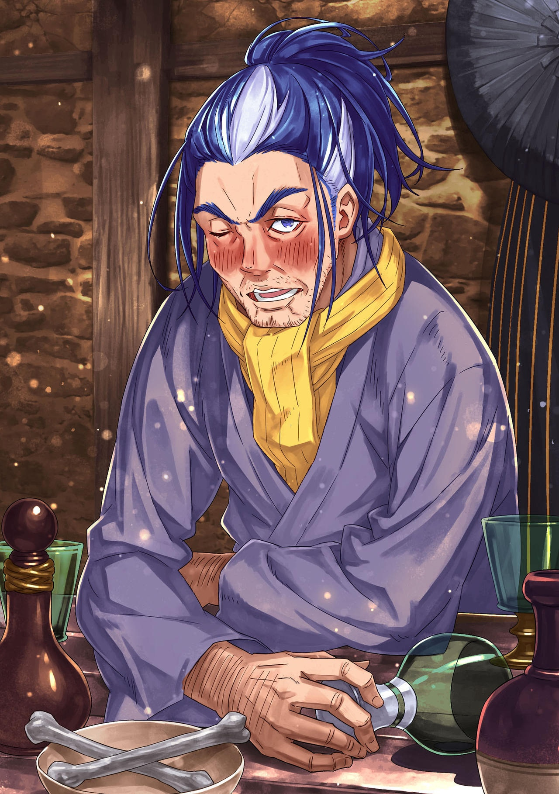
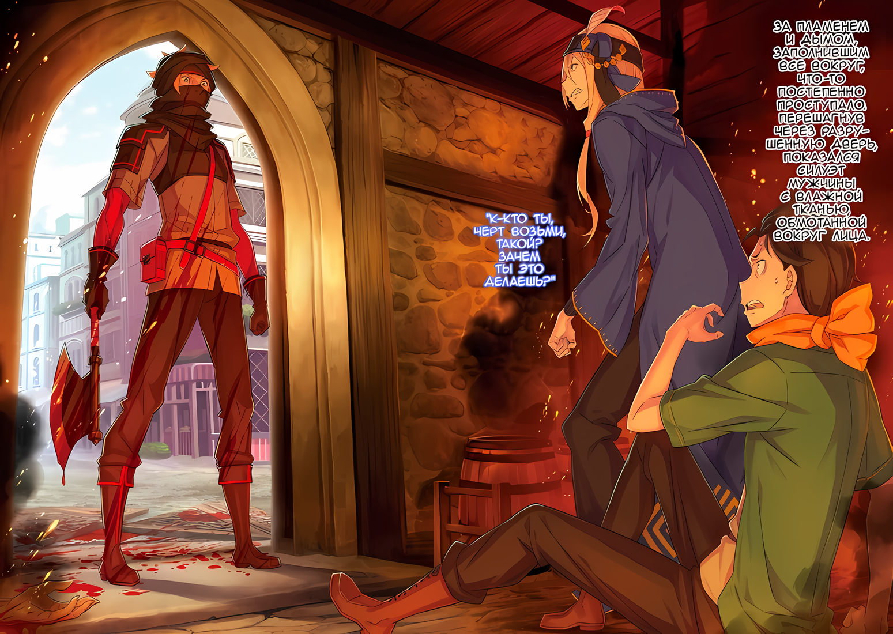

Субару: …………

Размышляя над невероятной правдой, Субару чувствовал, как все его тело покрывается холодным потом.

Насколько Субару знал, это была одна из самых страшных ситуаций, в которых он мог оказаться.

Пейзаж, который он помнил, разговор, который он уже слышал раньше. Это не было чем-то вроде дежавю.

Это не было событием, которое, как он думал, произошло раньше, это было событие, которое он переживал заново. Причина этого была только одна…… он «Посмертно Возвратился».

Субару: Но, почему……?

Не было абсолютно никаких обстоятельств.

Особенно для Субару это было похоже на то, как будто мир изменился в мгновение ока.

Это было настолько нереально, что можно было усомниться в том, что Полномочие, которое он нес, сработало неправильно. И что по какой-то причине часть «Смерти» в «Посмертном Возвращении» не сработала, и активировалась только часть «Возвращение».

Субару: Я идиот? Нет, я идиот.

Субару дисциплинировал себя, пытаясь взглянуть на ситуацию оптимистично.

Это было глупое заявление, но он должен был доверять «Посмертному Возвращению». Способность обращать время вспять, которой обладал Субару, еще ни разу не активировалась без «Смерти» в качестве спускового крючка.

Потеряв свою жизнь, Субару вернется в прошлое. В этом можно было не сомневаться.

Субару: ……Окей, я принимаю это. Я принял это. Чтож, Субару, что мне делать?

Ударив кулаком в лоб, Субару приказал себе успокоиться.

Теперь, когда он признал, что «Посмертно Возвратился», нужно было сосредоточиться на причине его смерти. Он вспомнил события, произошедшие всего несколько десятков секунд назад.

Субару: ……Я ничего не могу вспомнить.

Однако, даже размышляя о том времени, когда он встретил свою смерть, он не мог ничего вспомнить.

Он искал малейшие подсказки в своей памяти, но ничего не нашел.

Бар, куда они направлялись; говорящий Флоп; шум и суета на главной дороге, становившиеся все тише; легкий, неповторимый запах тени в переулке; слабый, жесткий звук…… вот и все, что он смог вспомнить.

Ни один из них не был связан с причиной, по которой жизнь Субару была в опасности.

Субару: Черт, почему я всегда такой…!

Если бы Субару был внимателен к изменениям в своем окружении, он не подвергся бы этим страданиям. Он ненавидел и проклинал свою беспечность.

Однако логическая часть его души понимала, что это невыполнимое требование, и невесело посмотрела на себя.

Он не был камерой наблюдения. Невозможно быть бдительным двадцать четыре часа в сутки. Он не был гением, способным уловить небольшие изменения в окружающей обстановке и немедленно разработать план действий.

Нацуки Субару, несомненно, был обычным человеком.

Такова была неизменная оценка, которую он дал себе, даже после того, как пережил свои «Воспоминания» виртуально глазами постороннего человека и увидел себя в новом свете….

Именно поэтому он не мог перестать думать и двигаться вперед.

Субару: ……Ситуация похожа на ту, когда Шаула впервые убила меня.

На пути к Сторожевой башне Плеяд группа Субару, бросившая вызов «Песчаному Ветру» в Песчаных дюнах Аугрии, была уничтожена Шаулой, охранявшей территорию от Сторожевой башни до Песчаного моря.

Ритуал перехода песчаного моря начался с белого света, на который невозможно было среагировать. Именно этот первый удар снес Субару и после этого началась адская битва.

Что произошло, какова причина смерти. Ситуацию, когда было неясно, умер он или нет, можно назвать милостью, дарованной его первой смертью в песчаном море.

Однако, в отличие от того времени, сейчас он находился в центре города.

Окружающая обстановка в корне отличалась от песчаного моря, где у него была уверенность в том, что ему придется столкнуться с различными опасностями для своей жизни.

Субару: Что заберет мою жизнь в этой ситуации……?

«Смерть» без всякого предвидения. Единственное, что он мог придумать, что подходило под эту ситуацию, был выстрел Шаулы, так как он оставил сильное впечатление.

Именно поэтому его могли подстрелить и на этот раз. Субару погиб в переулке…… хотя они и не были высокими, окружающие здания скрещивались между собой и создавали пространство с плохой видимостью.

Если бы здесь стреляли, то только спереди или сзади, но это было не самое идеальное место для стрельбы, так он думал. Конечно, поскольку Субару не знал, насколько точна его память, вероятность того, что эта позиция действительно позволяла идеальную линию видимости, была……

Флоп: ……Мистер? Почему твой лоб более морщинистый, чем раньше?

Субару: А….

Флоп: Разве ты не слышал мой совет? Твоя удача убежит, если ты не сотрешь эти морщины! Преследовать то, что убежало, — тяжелая задача! Потому что я обычно на телеге с волами!

Ударив рукой по груди, Флоп преувеличенно жестикулировал перед Субару.

Чувствуя, что эта его чрезмерная активность имеет целью развеселить гримасничающего Субару, Субару не мог не замереть от его действий.

Чтобы найти причину его смерти, ему пришлось бы исследовать и подозреваемого, который ехал с ним в то время.

В случае, если причиной смерти Субару был не выстрел, наиболее вероятным виновником был Флоп…… человек, который ехал с ним, и человек, который был ближе всего к нему.

Однако в момент смерти Субару Флоп находился в поле его зрения, и не было никаких признаков того, что Флоп предпринял действия, чтобы напасть на него.

Само собой разумеется, Субару знал, что в этом мире существует множество атак, которые могут оборвать его жизнь одним ударом, а он и не заметит этого. Тем не менее, Флоп не выглядел человеком, способным на такое.

Прежде всего……

Субару: Есть ли у Флоп-сана причина убить меня?

Наиболее вероятным вариантом было то, что он притворялся доброжелательным и пытался ограбить Субару. Однако Субару считал, что делать это намеренно, посреди города, было плохим решением.

Они впервые встретили брата и сестру О'Коннелл в очереди у ворот.

Если они хотели совершить свой поступок незамеченными, все, что им нужно было сделать, это обмануть и пригласить их куда-нибудь за ворота. Все это можно было сделать до въезда в Гуарал…… место, где есть охрана. Даже если их целью были деньги, которые они могли получить, продав «Рог Зверодемона», в конце концов, причина, по которой Субару не был обманут при продаже, заключалась не в чем ином, как в помощи Флопа. ……Нет никакой причины заманивать Субару в ловушку.

Все, что им было нужно, это обмануть Субару снаружи, украсть рог и продать его, как только они попадут в город.

Их мотиву не было логического объяснения.

Довольно много людей убивали Субару до сих пор, но все они имели рациональное объяснение, почему они это сделали. Исключая Зверодемонов, где связь отсутствовала, это было надежным правилом.

Вот почему……

Субару: Флоп-сан? Почему ты так добр к нам?

Флоп: М? Неожиданный вопрос.

Субару: Да, прости. Просто я немного волновался.

Флоп удивленно поднял свои брови красивой формы в ответ на резкий вопрос Субару.

Притворно усмехнувшись такой реакции, Субару затаил дыхание, ожидая ответа Флопа.

……С точки зрения логики, он не сомневался в Флопе. Оставалось только понять, верит он ему или нет.

Флоп, который вел себя сердечно и совершал различные поступки, чтобы помочь им.

Субару хотел успокоиться, поверить, что Флоп и его сестра Медиум не двуличные и что им можно доверять.

Флоп: ……Хмм

Субару не знал, выдают ли его глаза его истинные чувства, но Флоп сузил свои красивые глаза, как будто он мог видеть эти эмоции.

Выражение, которое он велел Субару принять раньше, взгляд, переполненный уверенностью и беззаботностью, но не имеющий для этого никаких оснований, исчезло с его лица, и вместо него появилось лицо интеллигентного джентльмена.

Затем он покачал головой в сторону застывшего Субару,

Флоп: Это не сложная вещь. Все просто. То, что мы с сестрой делаем, будучи добрыми к мистеру, миссис и племяшке……

Субару: Это?

Флоп: ……Это месть!

Субару: …Э?

Подняв руки, Флоп провозгласил это вслух.

Сильный и веселый тон и тревожное содержание провозглашения настолько противоречили друг другу, что на мгновение Субару не смог воспринять это. От шока его глаза расширились.

Перед застывшим Субару, Флоп расчесал его челку и сказал: «Слушай, ладно?»,

Флоп: Давным-давно мы с сестрой жили на грани жизни и смерти! Брошенные родителями, мы выросли в доме, где усыновляют сирот…… То было ужасное место!

Субару: Дом для сирот….

На задворках сознания Субару всплыл образ дома, смутно напоминающего детский дом.

Однако нетрудно было представить, что помещения и оборудование детских домов этого мира значительно отличались от современных зданий, о которых думал Субару.

Эта ужасная обстановка, вероятно, была гораздо хуже, чем он мог себе представить.

Рассказывая Субару о том, в какой обстановке он вырос, Флоп жестикулировал.

Флоп: Каждый вечер, сидя с другими детьми в одной лодке с нами, я в душе решал, что выберусь из этой ситуации. И вот у нас с сестрой появился шанс, и мы смогли сбежать оттуда. Впервые в жизни, пережив ночь без побоев, я поклялся ……отомстить.

Субару: Отомстить в смысле…… людям из дома для сирот?

Флоп: Нет, не им. ……Миру.

С тем же выражением лица, что и раньше, когда он провозглашал месть, Флоп крепко сжал кулаки.

Навстречу запуганному Субару, Флоп выставил вперед свое страстное лицо и…

Флоп: Мы с сестрой выросли, когда нас били взрослые в том месте. Но были ли взрослые, которые били нас, счастливы, когда били меня? Нет, не были. Они тоже были несчастны. Несчастные взрослые били несчастных детей. Неужели такая безнадежная ситуация существует на самом деле?

Субару: …………

Флоп: Даже взрослые, которые выбирают насилие, несчастны. Поэтому я стал торговцем, чтобы вытащить себя и свою сестру из беды. И по мере сил мы вытаскивали из несчастья и других. Так же, как в ту ночь те люди избавили нас от несчастья.

Субару: Это твоя месть миру?

Флоп: Именно так. Я и моя сестра сопротивляемся миру, который толкает на нас несчастья, чтобы отомстить. Помощь тебе и твоей миссис…… тоже часть этого.

Заявив это, Флоп почесал нос в легком смущении.

Получив огонь в его словах и действиях, Субару потерял способность говорить. Тепло от этого огня медленно просочилось в его мозг, и там он пришел к мгновенному решению.

Субару: Спасибо, Флоп-сан. Я рад, что встретил вас, брата и сестру, Флоп-сан и Медиум-сан.

Верил он им или нет, но он желал получить ответ, который бы указал на ответ на этот вопрос.

И ответ, который он получил, превзошел все его ожидания. И поэтому было решено.

Субару не стал сомневаться в доброй воле Флопа О'Коннела.

Он решил, что будет до конца доверять ему, своему благородному, мстительному сердцу, которое решило воспротивиться несправедливости мира.

Значит, оставалось только……

Субару: Флоп-сан, эта улица не приносит хорошего Ке по Фэн-Шуй. Может быть, мы пойдем другим путем?

Флоп: Ке? Что такое Ке? Это причина морщин на бровях и у глаз?

Субару: Это скорее гадательный предмет для хороших предзнаменований. Это не имеет никакого отношения к моим глазам! Мне кажется! Но да, эта улица никуда не годится. Я не возражаю, если мы пойдем длинным путем, так что, пожалуйста?

Зависимо от доброй воли Флопа, Субару решительно продолжил разговор.

Решив, что Флоп не виноват, следующим делом было избежать приближающейся «Смерти». Независимо от того, был ли это дальний выстрел или нет, было ясно, что это была атака.

Если бы он смог избежать условия возникновения атаки, это позволило бы ему избежать этой «Смерти».

Для этого, во-первых, было очень важно, чтобы он не действовал так же, как и раньше.

Изменяя пути, откладывая время, он мог бы избежать катастрофы, которая произойдет с ним до того, как она случится.

Если он сможет это сделать, то ему удастся избежать нежелательной «Смерти».

Субару: Ну, во-первых, я никогда не хотел «Смерти»…… Ну, только один или два раза.

К тому же, это был неизбежный вариант из-за неизбежного положения дел.

Когда Субару оказывался в ситуации, когда единственным способом спасти кого-то была смерть, он выбирал «Смерть». Да, Субару также желал отомстить всему миру.

Флоп: Я не знаю, как там Ке, но мне нравится твое искреннее выражение лица. Это будет немного нестандартно, но почему бы нам не пойти другим путем?

Субару: Это была бы отличная помощь! Давай пойдем на главную улицу, где как можно больше людей.

Флоп: Конечно.

К счастью, Флоп выслушал неестественное предложение Субару без возражений.

Следуя его примеру, план того, каким путем идти к бару, был изменен. Они свернули с пути, по которому должны были идти дальше, и выбрали маршрут к таверне, который проходил по главной улице, с минимальным количеством переулков.

В конце концов, если бы они прошли через линию огня перед таверной, возможно, это все равно не изменило бы того факта, что за Субару кто-то охотится. Однако, если бы он знал, что нападение произойдет в переулках перед таверной, было бы много способов справиться с этим.

В худшем случае, была вероятность, что его противник отступит, увидев бдительный взгляд Субару.…

Флоп: Ну тогда, мистер, сюда….

Пройдя мимо Субару, Флоп начал вести его по другой дороге.

В этот момент. ……По случайности Флоп посмотрел через плечо Субару, и его глаза расширились, как будто он только что что-то заметил.

Субару: ……Ох

Что именно, он попытался выяснить по реакции Флопа, но это не удалось.

Причина в том, что вместо вопроса из уст Субару вырвался вопрос, его рот полностью открылся, чтобы выплюнуть кровь, которой он кишел.

Субару: Ах, кха!?

Это был подвиг одного мгновения.

Субару почувствовал, как что-то схватило его за затылок, заставив посмотреть вверх. Затем, горячее ощущение прошло по его обнаженному горлу, и кровь хлынула наружу.

Захлебываясь кровью и болью, Субару понял, что ему перерезали горло.

Субару: Гбху…ух.

Прижав обе руки к ране на шее, среди сильной боли и потери крови Субару искал выход из положения.

Рана была глубокой и широкой, рассекая крупные кровеносные сосуды, кровь хлынула наружу. Он мог бы снять верхнюю одежду и обернуть ее вокруг шеи, чтобы остановить кровотечение…… Нет, первоочередной задачей здесь должно было стать уйти от врага, стоящего позади него.

Тем более, что Флоп был совсем рядом. Он был неправ, что сомневался в нем. Потом он будет верить в него, возможно, его не простят, но Флоп был здесь.

Субару: Ре… е…

Рем была в гостинице. Так или иначе, даже с кровью, текущей из шеи, он должен был вернуться к ней.

Вернись, уведи ее, здесь небезопасно, уходи. Даже если она ненавидит тебя, утащи ее. Чтобы Рем жила. Она должна жить. Ради нее останови кровь.

Кровь, кровь, кровькровькровькровькровь, кровь, останови, останови ее, остановиостановиостановиии……

Субару: …ее

м.

△▼△▼△▼△

Флоп: ……Мистер, нехорошо хмуриться.

Субару: …………

Флоп: Удача не придет к тому, у кого нет времени улыбнуться. Теперь ты собираешься найти попутчиков для своего путешествия, не так ли? Тогда тебе нужно найти кого-нибудь хорошего.

Флоп подчеркнул свою точку зрения, потирая пальцем свой лоб.

Наблюдая за жестом этого человека, Субару быстро приложил обе руки к своей шее. Он не почувствовал ни горячего ощущения, ни жара вытекающей жизни. Ощущения крови, вытекающей с каждым ударом сердца.

Его собственная жизнь вытекает, пульсация отчаяния приближается к «Смерти».

Флоп: Если это так, то сотри эти морщины на лбу… В чем дело, мистер, твое лицо побледнело.

Увидев, что Субару молчит, Флоп удивился и забеспокоился.

Несмотря на его серьезный взгляд, прямо перед Субару, ему вспомнился момент, когда ему перерезали горло.

Точно, ему перерезали горло.

Ему перерезали горло, хлынула кровь, инстинкты забили тревогу, что нужно уходить, но даже если он не слышал этих тревожных звонков, он вернулся в тот момент.

Другими словами, он умер. Он снова «Посмертно Возвратился».

Кроме того, на этот раз все было иначе: мгновенная смерть наступила с самого начала. Более явная, в форме враждебности.

Субару: ……Бхааах.

С руками на горле Субару забыл дышать, о чем вспомнил в спешке. Субару поднял плечи вверх и вниз с глубокими вдохами, Флоп коснулся его плеча и спросил, все ли в порядке, но Субару не успел ответить.

Однако и оставаться здесь он не мог.

Субару: Хаа, Флоп-сан, сегодня, это, ужасный день для Фэн-шуя. Давай вернемся немедленно…!

Флоп: Фенсуя? Хотя, учитывая эту бледность, немного отдохнуть было бы….

Субару: Нет, отдых был бы пустой тратой времени! Это приступ, который не прекратится, пока Рем не возьмет меня за руку!

Флоп: Это точно… Вот это приступ!

С чувством тревоги и срочности, пылающим в его сердце, он проговорился, но добродушный Флоп придал большее значение атмосфере, чем содержанию слов.

Рука, схватившая его за плечо, была схвачена в свою очередь, и Флоп удивленно кивнул. Потянув за руку Флопа, Субару засомневался, идти ли ему вперед или назад.

Если бы они пошли вперед, то оказались бы на маршруте, но если бы они пошли назад, то прошли бы мимо того места, где ему перерезали горло.

Он чувствовал, что находится в тупике, когда в любом случае, куда бы они ни пошли, его жизнь будет в опасности, поэтому вместо того, чтобы идти вперед или назад, он решил вернуться на главную улицу через какой-нибудь другой переулок.

Он и раньше терпел неудачу, но его противник постарается не убить их… Нет, убить Субару, где-нибудь на виду у всех. Если он собирался предупредить своего противника, выход на главную дорогу был крайне необходим.

Флоп: Мистер! Твоя рука очень холодная! Мы должны попросить твою миссис поскорее согреть их!

Субару: Ахх, как можно скорее, я хочу увидеть лицо Рем.

В результате, его не волновало то, как его будут ругать за то, что он вернулся, не выполнив свою цель.

Во всяком случае, в место где Рем…

Субару: ……Нет.

Могу ли я вернуться? Этот вопрос вертелся в голове Субару.

В ситуации, когда он еще не понял истинной природы своего врага, он думал об опасности возвращения к Рем. Он не знал, когда его противник начал нацеливаться на него, но если они вернутся в гостиницу, он может любезно раскрыть местоположение своему врагу.

Субару: …………

Проклиная свою тугодумность, Субару прикусил губу, и в то же время его поле зрения открылось.

Выйдя из переулка, Субару и Флоп добрались до главных улиц города. Справа и слева количество людей, приходящих и уходящих, не могло сравниться с мегаполисом, но это было гораздо лучше, чем переулки с их тавернами, похожими на укрытия.

Тем не менее, чтобы нырнуть в толпу людей, нужно было набраться наглости. Чтобы избежать этого, ему нужно было определиться с дальнейшими действиями.

Флоп: Если мы находимся на этой улице, значит, трактир должен быть там. Значит, сюда…

Субару: Не годится, Флоп-сан! Мы не можем вернуться в гостиницу. Видя Рем, такое было бы непростительно!

Флоп: Разве это не отличается от того, что ты только что сказал?!

Его поведение в итоге оказалось поведением эмоционально неуравновешенного человека, но из-за пережитого волнения он был не в состоянии вернуться к Рем. С учетом этого, продолжать манипулировать Флопом, не давая ему никакой информации, было неблагородно.

Но что он мог сказать, чтобы тот понял?

Он не был сотрудником лагеря Эмилии, не был давним попутчиком, как Анастасия или Юлиус. У него не было ни силы убеждения, ни оснований, чтобы заставить его серьезно отнестись к мнению Субару.

Даже для этого было бы слишком многого просить, возлагая свои надежды на врожденную доброту Флопа.

Субару: Проклятье……!

Чтобы выйти из тупиковой ситуации, в данный момент у Субару не хватало рук.

Он был разлучен со своей драгоценной Рем, и за ним охотились в незнакомом городе. С ним был добродетельный Флоп, но ему не хватало боевой силы. У самого Субару не было сильных сторон, которые он мог бы показать.

Не зная, кто напал на него, он не знал, кого следует опасаться.

Субару: Не может быть, охотник…!?

Когда он определил своего противника как невидимого убийцу, первой возможностью, которая пришла Субару в голову, был «Охотник».

Это был опасный человек, который однажды убил Субару в джунглях Будхейма, а после этого они также целились в него, когда он был с Рем. В конце концов, с тех пор он ни разу не сталкивался с ними, но что, если они все еще тщательно продолжают охотиться на Субару?

В джунглях Будхейма, в военном лагере и в «Племени Судрак» всегда был кто-то, кто действовал вместе с Субару. Чтобы избежать подставы с боеспособными противниками, они могли изменить время, пока Субару не оказался рядом с бессильным Флопом.

Субару: Если все так, то у тебя упорство медведя, лишенного добычи. Зачем заходить так далеко, чтобы целиться в меня? Что во мне является причиной….

Флоп: Мистер? Ты в порядке? Что тебя так беспокоит? Если есть что-то, с чем я могу тебе помочь, ты можешь попробовать сначала поговорить со мной. Ты странно себя ведешь.

Субару: Флоп-сан….

Пока Субару смотрел налево и направо по улице и терял самообладание, Флоп окликнул его таким голосом.

Прямо напротив него Флоп схватил его за плечи, его серьезный взгляд и предложение заставили Субару захотеть положиться на него, и Субару всерьез задумался, стоит ли ему попытаться сыграть на своей врожденной доброте.

Если это Флоп, то у него может хватить веры поверить в Субару и протянуть ему руку помощи.

Субару: Флоп-сан, извини, что продолжаю полагаться на тебя, но могу я спросить тебя кое о чем?

Флоп: Ах, конечно, конечно! Что бы это ни было, даже если я не смогу помочь, моя сестра, возможно, сможет. В конце концов, у нас с сестрой такие отношения, что мы можем прикрыть слабые места друг друга.

Субару: По правде говоря, между вами двумя это может быть вопросом для Медиум-сан, хотя….

Если его противник будет наносить удары без пощады, у него не останется другого выбора, кроме как ответить с большей силой. Сила Медиум была намного больше, чем у Субару или Флопа.

Учитывая это, Субару попытается объяснить Флопу ситуацию. Во-первых, ему придется скрыть вопрос о «Посмертном Возвращении», и объяснить, что кто-то неустанно преследует его.

Субару: На самом деле, кто-то в настоящее время…

Флоп: ……Что?

Субару: А?

Приняв решение, Субару собирался попытаться объяснить Флопу обстоятельства, стараясь не навлечь на себя наказание в виде упоминания о возвращении через смерть.

Однако, как раз когда он собирался заговорить, взгляд Флопа обратился не в ту сторону. Он поднял свои брови и прищурился в направлении улицы.

По его реакции было видно, что он что-то заметил, и Субару запоздало понял то же самое.

Субару: ……кх

Вдалеке кто-то кричал.

И это был не один человек, несколько человек кричали, издавая вопли и гневные рыки. Затем голоса постепенно усиливались, а звуки, отличающиеся от криков, множились……

Флоп: Что?!?

Глаза Флопа расширились, горло закрылось, и Субару тоже повернулся в том же направлении.

И тут же, увидев то же, что и Флоп, та же сцена перед его глазами заставила Субару растеряться.

……Гигантское колесо направлялось прямо на Флопа и Субару.

Флоп: Мистер, осторож……

Голос Флопа оборвался слишком рано, удар поглотил все тело Субару своей силой. Его тело полностью разлетелось, он ударился о твердую землю и кувыркнулся много раз.

Движение не прекращалось, и он врезался в стену. Но это был еще не конец. ……Сзади еще один удар за ударом обрушился на рухнувшего Субару, и снова его тело разлетелось на куски.

Субару: …Аа, гах

После кувырка и падения, поле зрения Субару окрасилось в черный цвет, когда его тело упало на землю.

Это не было похоже на то, что небо внезапно затянуло тучами. Дело было в другом, его поле зрения было разрушено по другой причине. Причина была ему неизвестна, и даже если бы он узнал, что это было, ничего хорошего из этого не вышло бы.

Однако, если бы он мог что-то сказать….

Субару: У-уми…

Умираю, это было то, что каждая клеточка его тела провозглашала в сторону инстинкта Субару.

До этого момента Субару, как человек, переживший «Смерть» более тридцати раз, в какой-то степени осознавал, сколько повреждений может выдержать его тело, прежде чем он лишится жизни.

В этот раз он явно превысил предел, который мог выдержать.

Субару: ………

Гнойная боль.

Но это было нечто совсем иное, чем просто локальная боль. Эта боль пронизывала все его тело. Существование по имени Субару было синхронизировано с явлением, называемым «Болью».

Это была не просто локализованная боль. Нацуки Субару был самой «Болью». «Боль» была тем, чем он был, и поэтому было вполне естественно испытывать боль. Везде и всюду было больно. Боль не исчезала.

Издалека доносился звук, похожий на звон в ушах или свисток поезда, отдаваясь в голове.

Среди этих звуков слышались радости и печали людей, брошенных в водоворот…… но радости не было. Правильнее было бы назвать это пандемониумом. Пандемониум, хах. Что за странное слово?

Вопреки эху звуков, события, которые разворачивались, были в высшей степени серьезными.

Субару: Аан, дээ, иум…

Он не мог произнести ни одного слога.

Рот, который пытался произносить слова, был разбит в клочья. Без каких-либо оставшихся зубов, он имел хорошую вентиляцию. Кое-где он был разорван, и воздух просачивался через него. Там были кровь, звук и боль.

Что-то, что-то, что-то……

Субару: А, ээ

Что-то снова убило Нацуки Субару.

△▼△▼△▼△

Флоп: ……Мистер, нехорошо хмуриться.

Субару: …………

Флоп: Удача не придет к тому, у кого нет времени улыбнуться. Теперь ты собираешься найти попутчиков для своего путешествия, не так ли? Тогда тебе нужно найти кого-нибудь хорошего.

Положив палец между бровями, Флоп потер кожу и плоть, чтобы расслабить их.

Наблюдая за тем, как представление мужчины разворачивается перед его глазами, Субару обнял себя за два плеча. Затем он вспомнил свой рот, из которого больше не выходил воздух, а также боль, которая исчезла.

……Не может быть, основа умер.

Субару: Более того… на этот раз это была… драконья повозка, не так ли?

Разбитая ударом, разлетевшаяся и обездвиженная, свеча жизни истончилась и исчезла.

В то время как «Боль» отдавалась в каждом сантиметре его тела, Субару был убит. Он потерял свою жизнь.

Субару: …………

Плечи в его собственном захвате задрожали, а колени начали дрожать.

Даже если его тело не помнило постигшей его катастрофы, его душа помнила. Удар и боль, нанесенные всему телу, словно разрывая его на куски, даже если их больше не осталось, все равно грызли его душу.

Наконец Субару не смог скрыть своего страха перед надвигающимся на него злом.

Первый раз — мгновенная смерть, второй — обезглавливание, третий — наезд драконьей повозки… ..это уже не могло быть простым совпадением. Несомненно, целью было убить Нацуки Субару.

Он убивал Субару безжалостно. Самым страшным было то, что, несмотря на трижды срабатывавшее «Посмертное Возвращение», Субару не получил никакой другой информации, кроме факта «Существования противника».

Противник не оставил бы никакой информации для безжизненного Субару.

Флоп: Если это так, то сотри эти морщины на лбу… Что случилось, мистер? Ты неважно выглядишь.

Субару: Флоп… сан…

Флоп снова проявил заботу о Субару, выражение лица последнего изменилось.

Ранее хаос на главной улице, скорее всего, был результатом того, что драконья повозка взбесилась. Тогда, за мгновение до столкновения, Флоп протянул руку, пытаясь спасти Субару.

Не успев вовремя, Субару получил смертельный удар в лоб, и было немыслимо, чтобы Флоп, находившийся рядом, отделался бы без потерь. ……Его бы тоже затянуло в сопутствующие разрушения.

Субару: В первую очередь, до сих пор….

Враг не обязательно отступит, убив Субару.

Флоп присутствовал на месте преступления и был свидетелем происходящего и в первый, и во второй раз. Если бы противник был осторожным человеком, для него было бы естественно запечатать рот Флопу, так как он был свидетелем.

Не означает ли это, что до сих пор смерть Субару сопровождалась убийством Флопа?

Не означает ли это, что Флоп уже был втянут в ситуацию, в которую попал Субару?

«Я этого не допущу», — подумал Субару, стиснув зубы.

Субару: ……Кх! Флоп-сан!

Флоп: Ч-что!?

Убив в себе всякую трусость, Субару, стиснув зубы, смело пошел вперед.

Далее, с таким энтузиазмом Субару схватил Флопа за руку, застав его врасплох. Однако у него не было времени обратить внимание на недоумение Флопа.

Учитывая то, что произошло до сих пор, обратный отсчет до смерти уже начался.

Ситуация тупика, помноженная на три, где движение вперед означало ад, возвращение назад — ад, а движение в обход — все еще ад.

Но даже тогда он должен искать путь к выживанию. ……Не только Субару и Рем, но и добрый старший брат, который помог им и вернул его к сестре.

Вот почему……

Субару: Флоп-сан, бежим!

Флоп: Так внезапно!? Что случилось!??

Субару: Нет никаких «так» или «что», жизнь конечна! Мы не можем терять ни секунды, верно?!

Было бы плохо остановиться здесь и искренне пытаться убедить другого.

Субару принял такое решение, как и в прошлые разы, он будет использовать силовые аргументы, чтобы уничтожить сопротивление Флопа. Конечно, поглощенный импульсом, Флоп просто кивнул в знак согласия и сказал: «Это правда!».

Флоп: Жизнь коротка. Ради достижения нашей с сестрой цели, хотя время действительно должно быть ценным….

Субару: Давай бежать! Немедленно беги в бар! Мелочи можно обсудить позже!

Флоп: П-понятно! Я уже понял, так что хватит меня тащить! У меня челка испортится!

С силой таща его за руку, Флоп закричал, спотыкаясь о свои ноги.

Слушая вопли Флопа, Субару направился к дороге, по которой он когда-то шел…… с той же целью получить телохранителя, он поспешил к бару.

Однако цель была не в том, чтобы найти телохранителя ради их путешествий.

Ради спасения от этой череды неизбежных «Смертей», ради того, чтобы как можно скорее получить необходимую помощь, они бежали.

△▼△▼△▼△

???: ……Вы хотите нанять самого сильного здесь?

Бармен, которого они наконец-то нашли, поднял брови в ответ на вопрос Субару о прерывистом дыхании.

Бармен средних лет, чьи волосы начали седеть, смотрел на запыхавшегося Субару сверху вниз несколько скептическим взглядом.

По его поведению и возрасту Субару тоже понял, что ему не хватает убедительности. Тем более, что он ворвался в бар и неожиданно задал такой вопрос.

Можно даже сказать, что он был достаточно великодушен, чтобы сразу не прийти к выводу, что Субару его разыгрывает.

В настоящее время Субару и Флоп находятся в баре, который был их первоначальным местом назначения.

Сначала Субару был мгновенно убит неизвестным способом в переулке в непосредственной близости от бара. Это само по себе было тревожно, но, возможно, потому что спешка оказалась эффективной, лапы дьявола, которые остановили бы Субару и Флопа, которые вместо этого поспешили к бару, не появились.

Однако на основании этого аргумента было бы преждевременно считать, что они избежали опасности.

Субару: Поэтому я должен позаимствовать силу самого сильного здесь.

Бармен: ……Если мы говорим о самом сильном здесь, то это, вероятно, Лоуэн.

Бармен пожал плечами на вопрос Субару, который переспросил, собираясь с духом. Затем он перевел взгляд на другого человека, кроме Субару, Флопа, который тоже запыхался.

Бармен: Флоп, я думал, что ты давно не показывался на глаза, а тут ты снова кому-то помогаешь. Хотя ты все равно не получишь от этого ни пенни.

Флоп: Эй, я просто заключаю любые сделки, в которых хочу участвовать. Те, с кем я заключаю сделки, не ограничиваются одними людьми. Иногда я заключаю невыгодные сделки против самого мира.

Бармен: Я говорю, что в этом нет никакой выгоды, мягкотелый.

Возможно, потому что бармен был с ним довольно хорошо знаком, он прокомментировал действия Флопа ничего не выражающим тоном.

Несмотря на то, что Флоп непосредственно узнал от него, почему он помог группе Субару, похоже, его добрый характер был хорошо известен тем, кто знал его заранее.

Пока бармен полировал стеклянный стакан, он бросил острый взгляд в сторону Субару

Бармен: Он действительно мягкий, как вы слышали. Но не пойми меня неправильно. Этот тупица и его сестра…… мягкотелые люди, которые помогут любому, кем бы он ни был, в свою очередь, есть много людей, которые в долгу перед ними.

Субару: ……Я тоже не собираюсь быть неблагодарным ублюдком, я буду баловать его в ответ так же, как баловали меня.

Флоп: Хахаха, я буду с нетерпением ждать этого! День, когда меня будут баловать!

Поправляя свою челку расческой, которую он достал из кармана, Флоп ответил откровенно.

Чувствуя себя спасенным добротой и великодушием Флопа, Субару повернулся к внутренней части бара и спросил «Кто из них Лоуэн?».

Бармен: Ааа, Лоуэн потерял сознание вон там, в углу.

Субару: Потерял сознание на углу…? Это не похоже на хорошую новость.

Сказав это, Субару нервно посмотрел в ту сторону, куда указал бармен. В тусклом баре, среди нескольких мужчин, которые пьяно болтали, он обнаружил мужчину, который скорчился за столиком в углу.

Это был мужчина лет пятидесяти, его длинные и взъерошенные волосы были небрежно уложены, а его оружие… катана… было пристегнуто к поясу.

На столе, на который он опустился, стояло несколько пустых стаканов; видно, что он выпил во всех смыслах этого слова еще до захода солнца.

Иллюстрация к **Ранобэ** Том 27 | Разукрасил NorvakKK

Субару: …Это самый сильный, говорите?

Бармен: Несомненно, он ужасно пьет, но он мастер своего дела. Хотя у него ужасная привычка пить.

Субару: То, что вы дважды упомянули это о нем, только заставляет меня волноваться еще больше.

Субару получил предупреждение бармена о том, что у него плохая привычка пить, два раза подряд.

Хотя он и считался изрядным пьяницей, но нищих не выбирают. Сейчас важнее всего было не его личное поведение или крепость его печени, а его мастерство в бою.

Человек, способный спасти отчаявшегося Субару от неминуемой гибели.

Субару: Эй, Лоуэн-сан, не могли бы вы меня немного выслушать?

Лоуэн: Нга?

Субару набрался решимости и направился вместе с Флопом к столу, на котором Лоуэн потерял сознание. Когда он заговорил с потерявшим сознание мужчиной, тряся его за плечи, Лоуэн ответил ошеломленным голосом и поднял голову.

Лицо его раскраснелось, взгляд был сонным, а черты лица были бы вполне различимы, если бы их не портил покрасневший нос.

Лоуэн: Как дела, брат. Что ты хочешь от меня…?

Субару: Этот чувак пьян… Короче, послушай меня. У меня есть работа для… тебя алкаша!!!

Лоуэн: Ойой, ну ты и грубиян…

Шатаясь, Лоуэн выдохнул тягучий воздух, от которого Субару пришлось отвернуть лицо.

Из-за ужасного запаха алкоголя создавалась иллюзия, что его зрение каким-то образом исказилось. Это не было чем-то простым, как пить в течение дня. Должен же быть предел тому, насколько тяжелым алкоголиком является человек.

Субару: Если подумать, поскольку среди моих знакомых нет сильно пьющих людей, я впервые сталкиваюсь с таким типом… Розвааль и Отто хотя бы пили в меру….

В лагере Эмилии люди, которые обычно употребляли алкоголь, были Розвааль и Отто. Рам и Фредерика тоже пили, но только если их приглашали. Кроме них, больше никто не пил.

Субару в этом мире тоже, видимо, достиг питьевого возраста, но до сих пор у него не было желания выпить.

Субару: Честно говоря, у меня не очень хорошее впечатление о пьяницах, но… Эй, этот парень действительно лучший здесь, верно? Я здесь не шутки шучу.

Бармен: Какое совпадение. У меня это место тоже открыто не для того, чтобы здесь шутить. Ошибки быть не может, это он.

Субару: Черт, ты серьезно…

Получив заверения бармена, Субару с горьким взглядом обернулся к Лоуэну.

Лоуэн небрежно сидел на своем стуле и тряс над головой пустым стаканом, отчаянно пытаясь почувствовать языком вкус оставшихся капель алкоголя.

Лоуэн: Цк, не хватает выпивки. Эй, братва, угостите меня выпивкой, почему бы и нет.

Флоп: Хм, хочешь выпить? Хорошо. Бармен, выпивки для него……

Субару: Подожди, подожди, Флоп-сан! Я не должен этого говорить, так как меня спасла твоя доброта, но только на время, держи свою добрую волю в кошельке!

Отстранив Флопа, который собирался угостить кого-то только потому, что тот попросил, Субару расположился перед недовольно выглядящим Лоуэном. Затем он с силой положил руки на стол,

Субару: Лоуэн-сан, давай сразу перейдем к делу. Мы не будем угощать тебя выпивкой. Но я могу заплатить тебе деньги, необходимые для покупки напитков. Я хочу, чтобы ты взялся за одну работу.

Лоуэн: Аан, работа…?

Субару: Верно. Я хочу, чтобы ты работал в эскорте. Начиная с этой самой секунды.

Почувствовав запах алкоголя, Субару смело выдвинул условия.

Услышав его слова, Лоуэн сонно уставился на Субару.

Лоуэн: ……Твой тон довольно панический. Вы, братцы, попали в довольно опасную ситуацию, не так ли?

Субару: Да, это не повод для смеха. Что скажешь? Сумма, которую я могу заплатить, это мой предел.

Флоп: Мистер, это…

Расширив глаза от удивления, Флоп попытался остановить действия Субару. Однако Субару остановил Флопа, который пытался удержать его, и напористо положил на стол сумку…… сумку, в которой были все деньги, полученные после продажи «Рога Зверодемона».

Из предосторожности он не стал делить и передал некоторую сумму Рем.

Это было действительно все, что было у группы Субару под рукой. Больше никаких денег, кроме этих, он заплатить не мог.

Лоуэн: Воу-воу, это…

Субару: Это все, чем я могу заплатить. Что скажешь? Возьмешь?

Лоуэн: …………

Открыв горлышко сумки, Лоуэн замолчал и быстрым взглядом подтвердил содержимое. Его лицо все еще было красным, но прежнее пьяное выражение в глазах исчезло, на смену ему пришел серьезный взгляд.

Конечно, эскорт, который можно было нанять в баре…… чтобы показать кому-то вроде Лоуэна, работавшего подставным наемником, все средства, с которыми ходил Субару, был довольно большой авантюрой.

Пересекая государственные границы, Субару не был хорошо осведомлен о стоимости товаров в Империи. Однако он чувствовал, что стоимость валюты не сильно отличается от Королевства Лугуники.

С деньгами, которые предложил Субару, можно было легко прожить год, просто проказничая.

Лоуэн: Мои навыки первоклассны… Я думал сказать это, но такая сумма авансом…

Субару: Я скажу это сейчас, но я не могу договориться о повышении оплаты.

Лоуэн: Я не сомневаюсь в тебе. Ты сказал, что не шутишь, похоже, ты настроен серьезно.

Почесав пальцем свой побагровевший нос, Лоуэн медленно встал на месте. Он поднял протянутый Субару мешочек с деньгами и бережно убрал его в карман.

Лоуэн: Я не отдам это, даже если ты скажешь мне отдать это.

Субару: Жаль, но я не скажу тебе вернуть его. Если ты будешь делать свою работу правильно.

Лоуэн: Пхахах

Задыхаясь от смеха, Лоуэн согласился на работу Субару.

Услышав его ответ, напряжение в плечах Субару, присутствовавшее все это время, исчезло. Его нервозность не проходила, а неуверенность бесконечно кружила внутри, но……

Флоп: Мистер, все в порядке? Эти деньги были…

Субару: Все в порядке. Ничего страшного, если это означает, что мы теперь в безопасности. Прости, что так напугал Флопа, а также спасибо, что познакомил меня с этим местом.

Флоп: ……Если ты говоришь, что все в порядке, то все нормально. К счастью, мы заплатили за гостиницу заранее!

Что касается счета за проживание, Субару уже оплатил его, включая часть Флопа и Медиум, с которыми они жили в одной комнате, под именем группы Субару.

Похоже, он избежал позора, переложив оплату на них, не подумав заранее, когда нанимал Лоуэна.

Лоуэн: Итак, работодатель. Как мне к вам обращаться?

Субару: О, точно. Виноват. Я торопился. Меня зовут…

Лоуэн: ……Погоди.

Когда Субару спросили о его имени, он запаниковал, так как подумал, что проявил неуважение к Лоуэну. И когда он уже собирался назвать себя, Лоуэн остановил его.

Он провел рукой перед лицом Субару и устремил свой острый взгляд за спину Субару — на окна бара.

Субару: Лоу…эн?

Лоуэн: ……Это странное чувство. Скажи, брат, за тобой ведь следили?

Субару: ……кх

Низкий и тихий голос Лоуэна заставил Субару сглотнуть.

Рядом с ним Флоп в замешательстве спросил «Что это значит?», но Субару имел общее представление о присутствии, которое обнаружил Лоуэн.

Это не было сценарием «что-если», это было точно. Странное чувство, возникшее у Лоуэна, было тем существом, которое преследовало Субару; тем врагом, который напал на Субару в переулке.

Враг, трижды убивавший Субару, не отказался от него и на этот раз.

Флоп: Кто тебя преследует?

Субару: …Без шуток, я не знаю. Я просто подумал, что если мы останемся снаружи, они придут за нами. Поэтому я и нанял тебя.

Лоуэн: Понятно. Они должны были выбрать бой получше.

Это была ситуация, когда им не с чем было работать, но Лоуэн сказал это в шутливой манере.

Однако, несмотря на то, что в тоне Лоуэна был намек на нервозность и серьезность, в его голосе не было беспокойства. Это, вероятно, означало, что он вполне уверен в своем мастерстве.

В действительности, пьянство исчезло из глаз Лоуэна, и от него исходила атмосфера сильного человека.

Лоуэн: ………

Специализированным оружием Лоуэна была единственная катана, носившаяся на левой стороне пояса.

Сейчас уже поздно говорить об этом, но в этом другом мире катана была редкостью. Оружие Лоуэна заметно выделялось на фоне мечей западного образца, которые были нормой.

Если присмотреться, то вместе с атмосферой, исходящей от его взъерошенных волос, внешность Лоуэна несколько напоминала самурая. Однако ему не хватало некоторой интенсивности, так что, возможно, ронин был бы лучшим описанием для него.

Субару: Лоуэн-сан, они…

Лоуэн: Не пугайся. Неважно, кто они, если они собираются стоять передо мной, все, что нужно, это разрезать их на две части. В моем животе есть алкоголь, а мой меч в отличной форме.

Субару: Так это не пьяный кулак, а пьяный меч? Не могу сказать, что я слышал о таком.

Тем не менее, это не было похоже на ложь, и Субару поверил в уверенность Лоуэна в себе.

Отойдя в противоположную сторону от того места, где Лоуэн смотрел в окно, Субару потянул за рукав Флопа, который все еще не до конца осознал ситуацию.

Субару: Флоп-сан, давай попросим Лоуэн-сана разобраться с этим.

Флоп: Разбираясь с делами и прочим, я все еще не совсем понимаю ситуацию! С чем именно сражаются Мистер и Телохранитель-кун?

Субару: Это то, чего я до сих пор….

«не знаю». Не успел Субару ответить заявлением, которое только вызвало бы беспокойство Флопа, как ситуация изменилась.

Однако ситуация развивалась не так, как если бы противник наступал с фронта, а Лоуэн вырвался для контратаки.

???: Бхх…

Издав крик боли, мужчина крупного телосложения упал у входа в бар.

От такого неожиданного появления Субару буквально подпрыгнул от удивления. Однако остальные посетители бара, увидевшие мужчину, отреагировали на него спокойно, как будто привыкли к этому зрелищу.

Пьяные посетители, кроме Лоуэна… Они, вероятно, тоже занимались деятельностью, похожей на наемничество. Эти люди просто смотрели на упавшего человека, не проявляя никакой реакции.

Единственными, кто бросился на помощь упавшему, были Флоп и бармен.

Только Флоп действительно беспокоился о человеке, а по лицу бармена было видно, что он просто не хочет, чтобы его пол был запачкан.

Флоп: Эй, ты! Ты в порядке? Возьми себя в руки!

Большой человек: Фу, фга, фуга…

Флоп: Фугафуга!? Это твое имя? Держи себя в руках Фугафуга-кун!

Субару: Э, нет, Флоп-сан, этот человек…

Флоп попытался поднять упавшего человека, но тот ответил стоном. Это не было похоже на то, что мужчина вежливо представился человеку, которого он встретил впервые.

Кроме того, мужчина, вошедший в этот бар в такой ситуации, означал, что……

Крупный мужчина: Фуга…

Субару: ……кх! Флоп-сан! Уйди!

Флоп наклонился, пытаясь поднять лежащего лицом вниз мужчину, потянув его за руку.

……В следующее мгновение.

Большой человек: ……!!!

Тело человека, который стонал и говорил «Фугафуга», расширилось, и на короткое мгновение засветилось ярко-алым.

Затем, расширенное тело мужчины разорвалось, и сильный взрыв поверг бар в хаос.

Клиенты: Гуааааа!?

В баре раздались крики, и красные пятна света разлетелись по всему помещению. Сразу после этого они превратились в пламя, которое горело и распространялось. Субару понял, что взорвавшийся мужчина был использован в качестве человеческой бомбы.

Субару: Флоп-сан!

Флоп: Я в порядке, мистер! Но, это…

Субару и Флоп, которых жонглировала взрывная волна, в шоке смотрели на столпотворение внутри бара.

Причина, по которой тело мужчины взорвалось, скорее всего, заключалась в том, что он был вынужден держать Огненные магические камни. ……Судя по его измученному лицу, магические камни, возможно, находились внутри его тела.

Они взорвались, и огонь разлетелся во все стороны. Кроме того, это было еще не все……

Клиент: Кашель! Что за черт!? Мои глаза, мои глаза!

Внутри переполненного ада один из пьяных клиентов, попавших в эту неразбериху, закрыл лицо руками и закричал. Оглядевшись вокруг, оказалось, что кричал не только он, другие мужчины тоже кричали.

Оказавшись в центре бара, мужчины, которых затянуло дымом от взрыва, закрыли глаза и нос, крича от боли.

А потом……

???: Нехорошо, если мы останемся в баре! Все, скорее выходите!

Субару: Подож….

Мужчина крикнул , по лицу которого текли слезы, и несколько мужчин с закрытыми лицами одновременно бросились к выходу. Глядя на толкающихся друг с другом мужчин, Субару попытался повысить голос, чтобы сказать им остановиться.

Человек, который взорвался, и дым, сопровождаемый болью после этого. Субару чувствовал, что оба они способствовали беспорядку в баре и пытались направить людей к выходу на улицу.

Однако даже если бы Субару от отчаяния повысил голос, это не остановило бы шаги этих людей, движимых болью.

В результате……

Субару: ……кх!?

Прогремел второй взрыв, разнеся людей, запрудивших вход.

Второй взрыв был больше первого, и люди, попавшие в его радиус, не могли даже защитить друг друга, так как были обуглены, опалены спереди вырвавшимся пламенем.

Взрывной жар и взрывная волна неслись к ним, и Субару окаменел от ужасающей картины.

Кошмарные зрелища происходили одно за другим — все это казалось нереальным.

Субару: Это… это…

Лоуэн: Возьми себя в руки, клиент! Мне будет неприятно, если ты рухнешь прямо здесь!

Субару: ……ах

Пока Субару оставался окаменевшим и ошарашенным, его схватили за воротник и силой потащили к ногам. Ответственным за это был Лоуэн, лицо которого было закрыто рукавом его одежды.

Он жестом велел Субару держаться в низкой позе, чтобы тот не вдыхал тот же дым, который мучил других мужчин,

Лоуэн: Бармен! Мы выйдем с тыла! Передняя часть под присмотром!

Бармен: Понял! Сюда…

Слушая указания Лоуэна, управляющий послушно кивнул, и кровь потекла по его лбу.

Вот так, Лоуэн сделал знак рукой позади бармена, который двигался так, словно полз по полу, и ударил Субару по спине, крикнув: «Вперед!».

Лоуэн: Клиент, и молодой человек вон там! Двигайтесь прямо сейчас, если не хотите умереть!

Флоп: Конечно, я не могу позволить себе умереть! И я, и моя младшая сестра все еще в середине нашего пути…!

Субару: Черт…!

Получив ободрение Лоуэна, Субару и Флоп погнались за менеджером. Пока они гнались за ним, в голове Субару царили смятение и ярость, направленные как на себя, так и на противника.

Конечно, он был зол на врага, совершившего такие зверские поступки. Однако он был зол и на себя, поскольку не смог распознать уровень угрозы врага, хотя и знал о его присутствии.

Начнем с того, что враг сделал что-то такое, что заставило драконью повозку выйти из-под контроля на главной улице.

Значительное количество людей должно было попасть под это. Если это так, Субару следовало быть более серьезным в своих мыслях. Он должен был признать того, кто не обратил внимания на ущерб, нанесенный окружающим.

Из-за этого мужчины, которые были только в баре, оказались втянуты в…,

Бармен: ……! Черный ход не открывается!

Придя первым к задней двери, менеджер закричал перед самобичеванием Субару.

Он отчаянно пытался открыть дверь, но она не отвечала на его панические призывы. Возможно, из-за повреждений от взрыва дверь заклинило, или……

Флоп: Это плохо! Парадный вход уже снесен! Если так пойдет дальше….

Лоуэн: Аргх, прочь с дороги! Такая дверь…

Пламя в баре разгоралось все сильнее, и в ситуации, когда черный дым вот-вот должен был поглотить их, Лоуэн вскочил на ноги, почти отбиваясь от крика Флопа. А затем, положив руку на катану у пояса, он с огромной силой ударил ею в открывающуюся дверь, при этом ни разу не сверкнув лезвием..

Субару: ……о

Серебряный блеск устремился вперед, рассекая закрытую дверь.

Это был навык владения мечом, похожий на Иайджутсу, который Субару знал. Несмотря на косой удар, который невольно заворожил Субару, Лоуэн не показал своей гордости за него, а выбил оставшуюся часть двери.

Лоуэн: Отлично! Открылось! Всем не высовываться!

Освободив запечатанный ранее черный ход, Лоуэн позвал Субару и остальных за собой.

Огромное количество беспорядка распространялось далеко и широко, но, похоже, им, по крайней мере, удастся выбраться из неизбежной ситуации, которой был охваченный пламенем бар.

Субару также понял, что суждения Лоуэна в бою, как и его навыки, заслуживают доверия. Все, что им нужно было сделать, это отдалиться от этого места, а для их злобного противника….

Субару: …………

Внезапно Субару затаил дыхание.

Что-то заныло в глубине его сознания. ……Он попытался предугадать мысли своего скрупулезного, безжалостного врага.

Они бросили в бар человека, превращенного в человеческую бомбу, выманили находящихся внутри людей с помощью дыма, содержащего стимуляторы, и сразу же взорвали их с помощью камней маны, установленных у входа.

Затем они загородили вход и заблокировали черный ход. Субару и его группа прорвали эту блокаду и смогли выбраться через черный ход, но……

Субару: Лоуэн-са…

Что-то не так, — Субару попытался выразить словами свое мизерное чувство дискомфорта.

Если бы его противник был основательным, то невозможно было бы подумать, что он ослабит свое наступление. Чтобы передать эту жуть, Субару позвал Лоуэна. Ответа не последовало.

Лоуэн: ………

Наклонившись вперед от задней двери, тело Лоуэна покачнулось назад, а затем упало.

Субару, Флоп и бармен потрясенно смотрели на упавшего Лоуэна. Его голова, а именно область от лба и выше, была разрушена, а глаза болтались, будучи выдавленными.

Кто бы ни смотрел на него, Лоуэн умер, его голова была раздроблена.

Бармен: А

Глядя на ужасающее состояние смерти Лоуэна, бармен расширил глаза, пытаясь закричать.

Однако он не смог сделать даже этого. С другой стороны пламени был нанесен один удар, пронзивший грудь глубоко вздохнувшего бармена и жестоко разорвавший верхнюю половину его тела. Разбрасывая кости и органы изнутри своего тела, бармен покатился прямо в огонь.

Запах горящей плоти сразу же достиг носа Субару, но бармен не закричал. Он был убит мгновенно.

???: …………

За пламенем и дымом, заполнившим все вокруг, что-то постепенно проступало.

Перешагнув через разрушенную дверь, показался силуэт мужчины с влажной тканью, обмотанной вокруг лица.

Он крепко сжимал в руках длинноручный топор, и Субару понял, что именно это оружие размозжило голову Лоуэна и дало бармену мгновенную смерть. Однако на этом его понимание закончилось.

Флоп: К-кто ты, черт возьми, такой? Зачем ты это делаешь?

Цветная иллюстрация к **Ранобэ** Том 27 | Перевод неофициальный и выполнен под контекст перевода rezero7arc | Клин djoenfoej

Наблюдая за смертью Лоуэна и бармена, как и Субару, который не мог пошевелиться от ужаса, Флоп заговорил дрожащим голосом рядом с ним. Хотя его охватил страх, он смотрел на силуэт среди пламени торжественным взглядом.

Как будто он направлял свою неприязнь на злодея, который с такой жестокостью убивал людей в баре одного за другим.

Однако……

Флоп: Не думай, что тебе это сойдет с ру…. кх

???: ………

Флоп, пытаясь решительно осудить проступки мужчины, получил прямой удар топором по голове.

Мужчина не стал делать ничего бессмысленного, например, бить его тыльной стороной топора, не выровняв край лезвия. Он выровнял угол лезвия, вонзил его в лоб Флопа, где была длинная челка, и выплеснул содержимое наружу.

Мозг разлетелся, и Флоп умер, когда багровый оттенок его крови смешался с красным пламенем.

Его тело смялось в кучу, издав громкий всплеск. Кровь медленно вытекала, окрашивая нижнюю часть Субару, когда он опустился на пол. ….Нет, штаны Субару уже были испачканы чем-то совсем другим. От страха он не мог контролировать свой мочевой пузырь.

Субару был напуган ужасающим видом человека, который держал окровавленный топор среди ада.

Его душа трепетала от его мстительности, упорства и ужаса.

Субару: П… почему…

Это был ужасно глупый вопрос.

Флоп был безжалостно убит после того, как задал подобный вопрос. Конечно, не было причин, чтобы этот человек был милосерден только к Субару. Он тоже погибнет. Его убьют.

У Субару не было ни сил, чтобы отступить, ни смелости, чтобы уползти. Сейчас он не мог оторвать взгляд от мужчины.

Даже если взгляд на него наполнял его ужасом, он не мог отвернуться, потому что это было не менее ужасно.

Субару: Почему… Почему!

Подобно идиоту, который повторяет только то, что знает, Субару кричал с отчаянием.

Мужчина не ответил, несмотря на то, что услышал его крик. Он медленно поднял свой топор, его лицо оставалось скрытым, и расположил его прямо над головой сидящего Субару.

А затем……

Субару: ПОЧЕМУ!?

???: ……Я ничего тебе не скажу. Разве не будет неприятно, если ты снова сбежишь?

Пока Субару кричал с обливающимся кровью сердцем, мужчина наконец-то ответил.

Слушая тон и голос мужчины, который звучал так, словно он просто констатировал очевидное, у Субару перехватило дыхание.

Он попытался сопоставить голос с голосом, который он где-то слышал, и……

Субару: Бха

Топор взметнулся вниз быстрее, чем он успел это сделать, одним ударом расколов ему череп.

Раздался тонкий, жесткий звук.

Раздался.
