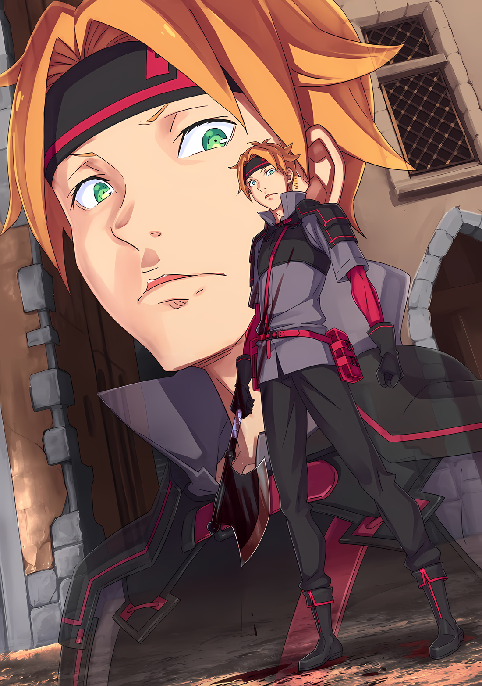
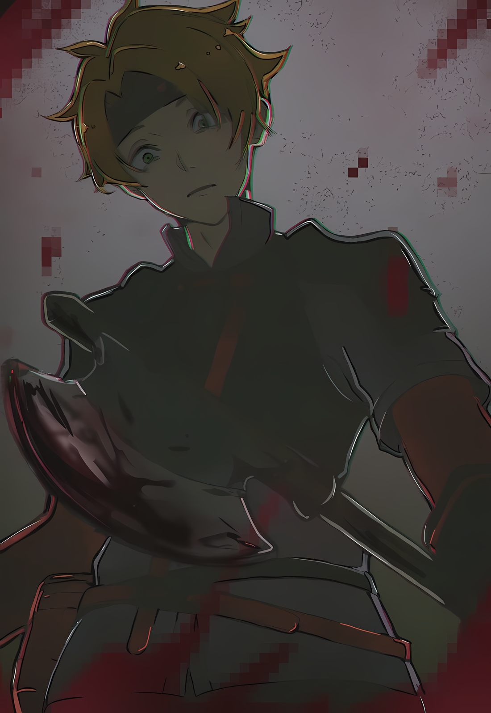
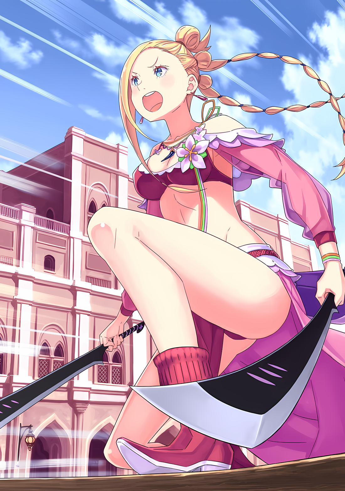

……Если бы он закрыл глаза, Субару мог бы вспомнить эту сцену в своем воображении.

Середина густых джунглей, где в изобилии росли деревья, грязная почва и атмосфера внушительных мужиков.

Рев Зверодемона, который раздавался по всей округе, словно раскалывая эту атмосферу на части. Боевой дух, который поднимался и возбуждался вместе с началом битвы. И сильная злоба, направленная на Нацуки Субару из-за его участия в зове Зверодемона…

Это было действие, которое Субару сам признал и сознательно решил осуществить, и воплотил его в жизнь.

Он действовал после того, как установил внутри себя весы, взвешивая, что для него важно, а что нет.

Это было действие, совершенное с полной решимостью и намерением причинить вред.

Что случится с людьми, не имеющими опыта борьбы со Зверодемонами, если они действительно сразятся с одним из них? Он не знал.

Они могли усмирить его мгновенно. Также существовала вероятность, что они могли получить серьезные ранения.

Он не хотел думать об этом, но вместо того, чтобы закончить на этом, могли быть и те, кто потерял свои жизни.

……Нет, он должен был предположить, что они были.

После оправдания своего поступка, он должен хотя бы признать этот факт. В конце концов, он был тем, кто принял решение и совершил такой поступок.

Нацуки Субару выбрал ту сторону весов, которую хотел, и воплотил в жизнь план, при котором другие могут погибнуть.

Эти люди не были Культом Ведьмы или Архиепископами Греха, не были они и злыми людьми, которые могли бы причинить вред другим из дурных побуждений.

Он нападал на тех, кто решил взяться за оружие, чтобы свести концы с концами. Они просто выполняли приказы своих начальников. Это были люди, с которыми, при благоприятных обстоятельствах, он мог бы установить положительные отношения.

Поэтому такое развитие событий было оправданным, неизбежным и естественным.

За последствия действий Нацуки Субару должен заплатить сам Нацуки Субару.

△▼△▼△▼△

Флоп: ……Мистер, нехорошо хмуриться.

Субару: …………

Флоп: Удача не придет к тому, у кого нет времени улыб…… Мистер!?

В тот момент, когда лезвие топора вонзилось в его череп, поле зрения Субару прояснилось от звона тяжелого звука.

В его незамутненном зрении возникла фигура Флопа, ткнувшего пальцем себе в лоб.

Красавец с длинной челкой и тонким лицом. Вспомнив событие, произошедшее несколько десятков секунд назад: его голова была расколота; Субару быстро прикрыл рот и упал на колени.

Возникшая потребность в рвоте. Связь между всеми злонамеренными действиями, произошедшими с ним…. Его сердце билось так, будто вот-вот взорвется, его органы чувствовали себя так, будто их душили. Это, а также оглушительный звон в ушах, мучили Субару.

Голос Флопа, беспокоившегося за Субару, звучал далеко. Ни один звук не воспринимался в его мозгу должным образом.

Субару: ……Тодд.

Слушая сильный звон в ушах и крик своих органов, губы Субару издали короткий звук.

Этот звук был именем человека, с которым он познакомился в Империи Волакия. Это был человек, по отношению к которому Нацуки Субару впервые действовал с чисто антагонистическими намерениями и….

И именно он был тем злонамеренным нападающим, который стал причиной большой трагедии, произошедшей несколько минут назад.

Субару: …………

Пылающий бар и удушливый черный дым.

Причина, по которой пьяные клиенты один за другим падали жертвой топора, заключалась в раздражающем веществе в дыму. Вероятно, это был упрощенный слезоточивый газ с примесями сильных раздражающих специй. Однако, несмотря на то, что это был псевдо-слезоточивый газ, его действие было мгновенным.

Используя магические камни, чтобы вызвать пожар и запечатать вход, чтобы привести выживших к запасному выходу. Заблокировав черный ход и воспользовавшись моментом облегчения после того, как они прорвались, устроили засаду на самого сильного из выживших и казнили его.

Затем, используя промокшую ткань, чтобы защититься от дыма, он прямо, с уверенностью, убил Субару.

Его последние слова и голос, а главное, глаза, которые он увидел у человека в маске, указали на его истинную личность.

Это был Тодд. ……Тот человек, который должен был погибнуть в джунглях Будхейма.

Субару: Нет….

Это была просто неподтвержденная информация.

Лагерь Имперской армии пришел в упадок после нападения «Племени Судрак» под командованием Абела. Услышав, что жертв было много, более сотни, и опасаясь, что дальнейшие слова причинят ему еще большую боль, он отбросил любую другую информацию, кроме этой.

После этого он быстро взял с собой Рем и решил оставить Абела и остальных.

Именно поэтому он даже не пытался думать о том, что кто-то выжил после нападения на лагерь.

В том числе и о нападении Субару на группу Тодда, которое не было связано с нападением «Племени Судрак»……

Субару: Если это ближайший к Джунглям город, то, конечно, все выжившие бежали бы сюда.

После нападения на их лагерь, все Имперские солдаты, которым удалось спастись, неизбежно направились бы в Гуарал.

Однако эта мысль не приходила Субару в голову, и поэтому он беспечно ступил в город, где его поджидали враги. К тому же, с Рем на буксире.

Субару: ……Враг.

Это слово, всплывшее у него в голове, он снова ощутил на языке горечь этого слова.

Когда он жил в своем родном мире, термин «враг» встречался только в манге или играх. Даже после переноса в другой мир, цель этого термина распространялась только на таких противников, как Культ Ведьмы и Зверодемоны.

То есть, он впервые назвал «Врагом» того, кто таковым не являлся.

Этот «Враг» превратился во «Врага», лишь действиями самого Нацуки Субару.

Субару: ……Гкх

Издав резкий звук, Субару сильно стиснул зубы.

Прикусив мясо на щеке, используя жгучую боль и вкус крови, он схватил свое сознание за воротник и силой вернул себя к реальности. Если бы этого было недостаточно, он не отказался бы откусить все мясо во рту.

Ему не нужны были ни зажатые органы, ни звенящие уши, ни дрожащие руки и ноги, ни парализованный мозг.

Сейчас его не могли одолеть злоба и страх.

Даже если он просто напускал на себя дерзость, пока ситуация не изменится, он не мог ее снять.

Флоп: Мистер, возьми себя в руки! Мистер! Хочешь попить воды?

Субару: ……Хм, я в порядке. Виноват, я побеспокоил Флоп-сана……

Цвет его лица и тон голоса, вероятно, не говорили о том, что он в порядке, но Субару сказал себе, что он в порядке, медленно вставая.

Дрожь в коленях и дискомфорт от парализованных органов все еще оставались. Однако он не мог вечно оставаться в скрюченном состоянии. Пока Субару баловала слабость, время все еще шло вперед.

Выжидая подходящего момента для удара, план атаки Тодда должен был быть в действии уже сейчас.

Субару: Эй, Флоп-сан, могу я попросить тебя сделать мне одолжение? Не мог бы ты вернуться в гостиницу и взять у Рем лекарство от моей хронической болезни?

Флоп: Лекарство? У тебя какая-то болезнь, мистер?

Субару: Да, моя болезнь блестящих лодыжек* становится довольно серьезной.

*отсылка на одно из многих поддельных хронических заболеваний Брокины в серии манги Драгон Квест: Приключения Дая

Флоп: О боже! Не слышал о таком раньше!

Получив случайное название болезни, Флоп удивленно расширил глаза.

Пользование доброй волей Флопа оставило неприятный привкус во рту Субару, но он закрыл на это глаза, убеждая себя, что у него нет выбора. На данный момент Субару должен был сделать приоритет на том, чтобы как можно скорее убрать Флопа как можно дальше от себя.

Если целью Тодда была месть, и если Флоп с Субару разделятся, у него не останется другого выбора, кроме как пойти за Субару.

Как только безопасность Флопа будет гарантирована, Субару сможет сосредоточиться на защите самого себя.

Однако он все еще не решил, какой вариант выбрать……

Субару: Я могу встретиться с Лоуэном в баре и покинуть его, чтобы избежать внезапного нападения. Тогда….

У него не было другого выбора, кроме как выполнить довольно бессистемный план.

Учитывая, что у него не было времени, чтобы остановить свои ноги и медленно все обдумать, он мог лишь воплотить в жизнь лучшее действие, которое мог придумать в данный момент, и надеяться на чудо по ходу дела.

Субару: Рем должна….

Когда Флоп вернется в гостиницу за лекарством от неслыханной болезни, Рем должна понять, что с Субару случилось что-то ненормальное. Он надеялся, что так и будет.

Как только она поймет это, она остановит Флопа от возвращения в эту область, верил он.

Все это было лишь желанием, но на этом мысли Субару в данный момент не ограничивались.

Субару: Флоп-сан, пожалуйста!

Флоп: Хо-хорошо! Подожди здесь! Не падай духом, мистер!

Пораженный искренней серьезностью Субару, Флоп пошел по тропинке обратно к гостинице. Прогнав Флопа, Субару решил поспешить в гостиницу.

Быстро протрезвив пьяного Лоуэна, он дал бы ему денег и нанял бы его еще раз. Лоуэн стал жертвой засады, но в честном бою у него хватит сил победить. Субару тоже надеялся на это.

Он во многом зависел от удачи, но все свои надежды возлагал на Лоуэна. Молясь, чтобы он стал сильнейшим в Волакии……

???: ……А?

Собираясь начать бежать с молящимся сердцем, Субару внезапно услышал хриплый голос сзади себя.

Поскольку это был непопулярный переулок, голос, который он услышал, мог принадлежать только одному человеку. Проблема заключалась в том, какие эмоции испытывал обладатель этого голоса, чтобы издавать такие звуки, и что это, соответственно, означало.

Он быстро понял, что эти звуки ни в коем случае не приведут к хорошему выводу.

Флоп: Ууу, уууааааааааааааааа!!!

Вслед за хриплым голосом раздался крик Флопа, который пошел в другую сторону.

Немедленно повернув голову, Субару обнаружил, что Флоп перевернулся вверх ногами на улице впереди. Упав лицом вверх, Флоп держался за правую ногу. Маленький нож пронзил его пятку.

Нож, глубоко вошедший в пятку, лишил Флопа возможности бежать.

Субару: Флоп-сан!

Поспешно развернувшись с места, Субару закусил губу, когда его ноги заскользили по земле. Затем, без паузы, он оттолкнулся от земли и подбежал к Флопу, его нога была ранена.

И снова его ожидания были неожиданно обмануты.

Он думал, что, если они разделятся, Тодд, безусловно, отдаст предпочтение Субару и побежит за ним. Однако, вопреки его расчетам, на Флопа внезапно напали.

Более того, нападение в этом месте и в этот самый момент превзошло все его ожидания.

Субару: Флоп-сан! Я сейчас же отведу тебя куда-нибудь, чтобы вылечить рану!

С сожалением и раскаянием Субару бросился к Флопу. Флоп корчился в агонии от боли в ноге, но у Субару не было времени лечить его прямо сейчас.

Он должен был подставить ему плечо и отнести его в какое-нибудь место, где есть люди…… Нет, он не мог позволить ситуации развиваться так, как она развивалась раньше, когда он погиб, будучи сбитым на главной дороге. Даже если придется применить силу, он должен был дотащить его до бара. Это был лучший вариант.

То, что нож попал ему в ногу, было положительным моментом. Поскольку, пока не была пробита крупная артерия, реальной опасности для его жизни не было……

Субару: …………

Мыслительный процесс привел его сюда, и в голове Субару внезапно возник вопрос.

Это была хорошая новость, что жизни Флопа ничего не угрожает. Однако, как так получилось? Судя по тому, как происходила бойня в баре, враг умел убивать на высшем уровне.

Несмотря на это, атака на Флопа закончилась на его ногах. Почему?

Это было знание из манги, но эта информация касалась техники, используемой снайперами в бою.

Снайперы, которые прятались, чтобы совершать односторонние атаки на дальних противников, при столкновении с группой врагов намеренно не убивали противника, а замирали после серьезного ранения. Затем они выманивали тех, кто пытался спасти раненых товарищей, и стремились протянуть к ним свои руки смерти.

Это был кошмарный метод, который использовал в своих интересах тех, у кого было чувство товарищества, тех, кто не мог оставить никого позади.

Почему он вспомнил что-то подобное в этот момент? Это было потому что……

Субару: Вот дерьм……

В тот момент, когда он почувствовал, что что-то не так, в переулке рядом с упавшим Флопом вспыхнул темный свет.

Сразу же после этого резкий лобовой удар ударил и снес Субару, который упреждающе вскинул руки вверх, пытаясь защитить голову.

Субару: Гаах!?

Приняв полностью сильный удар, отлетевший Субару ударился затылком о землю. Его зрение помутнело, а звон в ушах снова стал громким. В то время как это происходило, он был отброшен назад с помощью импульса, перекатившись один раз.

Субару пытался разглядеть истинную форму удара и расстояние, с которого он был нанесен. Не сумев полностью блокировать удар, он протянул руку ко лбу, где почувствовал тепло. Вероятно, лоб был рассечен от сильного удара и……

Субару: ……А?

Его правая рука, которой он пытался дотронуться до лба, была оторвана в предплечье, между запястьем и локтем.

Субару: Гха… гыааааааааа!

Его правая рука, на которой виднелся неровный поперечный разрез с белой костью и розовыми мышечными волокнами, энергично откачивала кровь синхронно с сердцебиением. В панике он попытался остановить кровь, надавив на рану, но ладонь его левой руки также была рассечена посередине, а раздробленные пальцы были направлены в разные стороны.

Это было доказательством того, что он неудачно подвергся атаке противника.

Прежде всего, если уж на то пошло, то бежать на сторону Флопа без всякой предосторожности было ошибкой.

Ошибкой, ошибкой, ошибкой, ошибкойошибкойошибкойошибкойошибкойошибкойошибкойошибкойошибкойошибкойошибкойошибкойпромахомпромахомпромахом……

???: ……Кхм

Держа переливающуюся кровь, Субару впал в панику, вызванную болью и чувством потери.

Мужчина, держащий в одной руке топор, прочистил горло перед Субару…… это была фигура, появившаяся из переулка. Молодой человек, повязавший свои оранжевые волосы банданой. Это был Тодд.

На этот раз он не скрывал своего лица.

Злобные глаза, которые Субару лично видел в баре. Субару не ошибся, что за ними скрывается кто-то другой.

Как и ожидалось, Тодд предпринял атаку с полным намерением убить Субару.

Субару: Ыг-гыыыыыыыыыы……!

Моляры, которые он кусал, треснули, и Субару уставился на Тодда налитыми кровью глазами.

Он и сам не знал, что скрывается за этим взглядом…… гнев, ненависть или, как ни стыдно, мольба о жизни. Тем не менее, реакция Тодда была холодной.

Он, с лицом, на котором не было заметно особых эмоций, проследил за лезвием топора, разрушившего руки Субару.

Тодд: Мне нужно убедиться, что я правильно наточил его, иначе он не годится, виноват, виноват.

Он сказал это легкомысленно, размышляя над своими действиями.

Субару: Ках….

Тодд: Хорошо.

Широко открыв глаза, Субару попытался сформировать слова своим дрожащим языком. Однако Тодд был равнодушен к словам Субару и бесстрастно взмахнул своим топором вверх.

Казалось, его не интересовали ни слова Субару, ни его личность……

???: Уаааааааааааааааааа!!!

Тодд: Ого

Однако, прежде чем Тодд успел взмахнуть топором, который он поднял вверх, кто-то прыгнул на его тело.

Это был не Субару, стонущий от боли из-за разрушенных рук. В этой ситуации, когда Субару был выведен из строя одним ударом, чтобы защитить его, человек прыгнул на Тодда, Флоп.

Получив нож в правую ногу, добродушный торговец, который должен был бороться с сильной болью, вцепился в спину Тодда, словно собираясь впиться в него зубами. Он посмотрел на Субару через плечо Тодда.

Флоп: Мистер! Убегай! Убегай прямо сейчас….

На его тонком лице появилось выражение срочности, волевое выражение Флопа дернулось вверх, когда его ударили по подбородку.

Схваченный Тодд использовал свой локоть, чтобы с силой ударить Флопа. Молодой взрослый человек, далекий от насилия, был легко отброшен.

Затем, обратившись лицом к упавшему Флопу, Тодд поднял свой топор.

Субару: Сто….

Тодд: Раз, два и три!

У Субару не было возможности остановить его. Тодд облегченно воскликнул, а затем раздался интенсивный, резкий звук плеска воды.

От удара локтя Тодда, Флоп, стоящий лицом вверх, получил удар лезвием топора по лицу. Молодой человек, у которого все лицо и голова были разделены надвое, быстро превратился в труп. Кровь текла, мозговое вещество вытекало, руки и ноги дергались.

Наблюдая за тем, как переулок неуклонно пропитывается кровью, Субару в недоумении разинул рот.

Боль, растерянность и омоложенный страх. Нормальный ход мыслей Субару был нарушен только этими эмоциями.

Вот только, что это был за человек перед ним?

Субару: Я понял….

Тодд: Хм?

Субару: Я понял, я понял, что ты обижен на меня. Я понял….

Избегая крови мертвого Флопа, Тодд повернулся лицом к Субару, разговаривая с ним.

Слезы и слизь Субару активно вытекали густыми каплями. Кровь текла из его сломанных коренных зубов, и, кроме того, он был весь в крови, хлещущей из его правой руки. Субару находился в довольно ужасном состоянии.

На этот раз он не обмочился, но это его ничуть не утешало.

Он снова позволил Флопу умереть.

Он придумал метод, с помощью которого, как он думал, мог бы спасти его, но из-за неадекватности Субару Флоп умер. Он позволил ему умереть с лицом, непрезентабельным для его сестры, Медиум.

Субару: Но остальные…. остальные! Не надо… впутывать их в… это!

У обиды была причина.

Трудно было признать, что она была обоснованной, но она была естественной из того, что произошло между Субару и Тоддом.

Поэтому было неизбежно, что он придет за Субару. Но привлекать для этого других людей было против правил. Это был трусливый поступок. Это было далеко не справедливо и не честно. Это было зло. Разве это не зло?

Субару наконец-то даже начал терять способность к вербальному нападению на своего оппонента.

Выслушав его заявление, Тодд тихонько хмыкнул

Тодд: Ты… что ты имеешь в виду под обидой?

Иллюстрация к **Ранобэ** Том 27 | Разукрасил NorvakKK

Он говорил, стоя в окровавленном переулке и вопросительно наклонив голову, вытирая кровь, попавшую на щеки.

Приняв это наивно звучащее отношение и ответ, Субару на мгновение затаил дыхание, но быстро бурные эмоции, которые он не мог контролировать, вырвались наружу. Брызгая слюной, он сказал: «Не смей прикидываться дураком!»

Субару: Засады, ловушки… неустанное преследование меня…!

Его неустанно преследовали и загоняли в угол.

Какие бы действия ни предпринимал Субару, он все предугадывал и был на шаг впереди, чтобы убить его со всей уверенностью. Тщательно готовил и расставлял ловушки.

Он приложил столько усилий, чтобы выбрать Субару мишенью. Теперь не было смысла притворяться невежественным. Это было бы просто неоправданным упрямством.

Это было осквернение смерти Флопа. Оскорбление Субару, это был его способ выплеснуть свой гнев?

Субару: Ты.… кх

Тодд: Я не знаю, что ты не так понял, но убиваю я тебя не из-за обиды или чего-то еще, очевидно. Я нашел опасного парня в городе. Конечно, я бы убил без вопросов.

Субару: …………

Тодд: Ты убиваешь ядовитую змею не потому, что обижен на нее, а потому, что боишься ее. Для этого ты используешь все, что в твоем распоряжении, чтобы убить ее.

Сказав, что это не более и не менее того, Тодд аккуратно снял кусочки волос и кожи, которые прилипли к его топору. Это были фрагменты разрубленной головы Флопа? Субару мог только застыть в шоке.

В реакции и поведении Тодда не было лжи. Он даже ответил с улыбкой.

С самого начала и до сих пор нападки Тодда на Субару доказывали, что он серьезно относился к своим словам.

Тодд считал Субару опасным и не мог не убить его.

Поэтому он не слушал его, не позволял ему ничего делать и не пытался допросить Субару для получения какой-либо информации.

Также он не испытывал к нему ненависти за поступок, совершенный в джунглях. Единственное впечатление, которое Тодд вынес из этого, было то, что Субару — опасное существо.

Как следствие, Тодд безэмоционально и беспристрастно пытался убить Субару.

Тодд: Ты такой же, как и я. ……Я не дам тебе времени.

Арт от kuromochisakura

Сказав это, Тодд поставил ногу на грудь Субару и ударил его ногой. Не в силах сопротивляться, Субару упал на спину, лицом вверх. Тодд навалился на упавшего Субару и поднял свой топор.

Субару расширил глаза. Он искал нужные слова.

«Посмертно Возвратившись», он нашел бы сквозную линию, стоящую за различными событиями. Так Субару одержал победу. Однако у этой стратегии, которая сработала даже на Архиепископах Греха, были моменты, когда она не срабатывала.

Это было……

Субару: ……Подож

Тодд: Я не буду ждать.

……Это было, когда противник был хладнокровным головорезом.

△▼△▼△▼△

Флоп: ……Мистер, нехорошо хмуриться.

Субару: ……кх

Флоп: Удача не придет к тому, у кого нет времени на… В чем дело? Твое лицо внезапно побледнело?

При виде топора, опускающегося прямо на их голову, лица большинства людей, несомненно, налились бы кровью.

Не думая, Субару поднес руки к своему лицу, холодному от недостатка крови. Облегчение и страх захлестнули его, так как руки, ощутившие холод, подтвердили, что он жив и здоров.

Субару: Проклятье, опять….

Что ему делать? Субару не имел ни малейшего представления.

С точки зрения времени, все события, произошедшие с Субару, произошли всего за двадцать минут. За эти двадцать минут Субару уже пять раз потерял свою жизнь.

Даже во время последнего раунда в Сторожевой башне Плеяд он накопил более пятнадцати опытов «Смертей» в поисках победы, но тогда была уверенность, что прогресс идет шаг за шагом.

Но на этот раз у него не было ничего.

Трупы Нацуки Субару накапливались, но он не чувствовал, что они действительно способствуют его победе.

Если и можно было что-то сказать, так это……

Субару: ……Даже сейчас за мной наблюдают.

Тодд уже наблюдал за Субару вместе с Флопом.

Следовательно, как только он отделится от Флопа, Тодд безжалостно использует Флопа в качестве приманки.

Все было бы иначе, если бы Субару был настолько безжалостен, чтобы использовать Флопа в качестве приманки, но поскольку он не мог этого сделать, если бы на Флопа напали, Субару приложил бы все усилия, чтобы спасти его.

Это отличалось от того случая, когда он взвешивал безопасность Рем против благополучия Тодда и компании.

Флоп был добр к совершенно незнакомым людям, точнее, к группе Субару. Субару не мог выбрать вариант, который оставил бы его в живых.

Таким образом, реализация стратегии в одиночку, отдельно от Флопа, была невозможна.

Одновременно с этим, вариант возвращения Субару в гостиницу также был отброшен.

Неясно, в какой момент Тодд заметил присутствие Субару, но если его обнаружили по дороге в таверну, то местонахождение трактира, местонахождение Рем, не было раскрыто.

Да, местонахождение Рем не было обнаружено. Это было вполне правдоподобно.

Если бы местонахождение Рем было обнаружено, Тодд непременно воспользовался бы Рем и использовал бы ее для более планомерного убийства Субару. Ирония судьбы заключалась в том, что его вера в хитрость Тодда, наоборот, стала доказательством того, что Рем не попала в его руки.

Субару: В любом случае….

Прикусив губу и закрыв лицо рукой, Субару отчаянно повернул голову.

Времени, почему-то не хватало.

Если бы он расстался с Флопом, Тодд начал бы наступление немедленно.

Напротив, ждать его наступления и контратаковать…. Ну, он был не из тех противников, которых можно победить, даже если избежать его первой атаки. Поскольку у Субару не было оружия, ему пришлось бы уничтожить боевую мощь противника одним ударом. Не выйдет.

Если бы они выбежали на главную улицу, Тодд безрассудно гнал бы драконью повозку и убил бы, переехав их.

Даже если им удастся избежать разъяренной драконьей повозки, вероятность того, что он воспользуется хаосом на улице, была высока. Кроме того, разбушевавшаяся драконья повозка затянула бы в себя и случайных прохожих. Ни в коем случае.

Если бы они выбрали другой маршрут, каждый переулок стал бы его охотничьим угодьем.

Север, восток, юг и запад — уследить за всеми направлениями было невозможно. Даже если бы они справились с его первой атакой, в конце концов, план контратаки был бы тем же самым, а впереди их ждал недостаток боевой мощи. Ни в коем случае.

Может, лучше всего было бы все-таки броситься в таверну вместе с Флопом и, прежде чем Тодд успеет подготовиться к нападению на таверну, подготовить боевые силы для его перехвата?

Препятствием будет то, насколько серьезно он сможет отнестись к пьяному Лоуэну, но сейчас это должен быть план с наибольшими шансами на победу, который он мог придумать. Никакой другой ход не приходил на ум.

Субару: Черт, черт….

Какой неприятный противник, наживший себе врага.

В случае с Архиепископами Греха, у них был хороший момент — их зависимость от своего Полномочия превращала их сильные стороны в слабые. Поскольку, отработав механизм их Полномочия, наоборот, слабые стороны этих парней становились очевидными.

Однако у Тодда этого не было. Он использовал все, что мог. Он сам об этом заявлял.

Он не полагался ни на что, и не принимал во внимание ущерб, нанесенный окружению.

После убийства Субару, как он собирался объяснить это окружающим, даже это было совершенно неизвестно. О том, что будет потом, он не думал вообще.

Чтобы убить то, что должно быть убито, он боялся, что лишние мысли помешают.

Флоп: Мистер? Ты в порядке? Если что-то не так, то вернуться в гостиницу было бы….

Субару: Н-нет! Черт возьми, нет! Это плохая идея.

Он ответил с большой силой, и Флоп с удивлением уставился на этот голос Субару.

Сделав это, Субару всерьез проклял собственную психическую хрупкость. Если он будет вести себя так странно, Тодд начнет подозревать его.

Если это произойдет, то ценное преимущество «Посмертного Возвращения» исчезнет.

Помимо того, что он уже понял, единственным способом, которым Субару мог воспользоваться Тодд, было его предубеждение, что его присутствие не было известно Субару.

Засада и ловушка, побег и контратака, какие бы средства он ни использовал, Тодд не мог быть осведомлен о том, что известно Субару.

Однако……

Субару: ……Погоди.

Внезапно, когда Субару отчаянно думал о контрмерах против Тодда, ему в голову пришла одна мысль.

Тодд не придерживался какого-то одного способа действий, и даже не принимал во внимание ущерб, наносимый окружающим. ……И все же он не обращал внимания на ущерб, нанесенный окружающим. Это не было ущербом для него самого.

Скорее, эта внезапная атака была вызвана тем, что он хотел резко уменьшить ущерб для «Себя».

Тодд сказал это сам, своими собственными устами.

«Ядовитую змею убивают не потому, что она тебе неприятна, а потому, что ты ее боишься», сказал он.

Так он сказал, а потом……

Субару: ……ТОДД! Я знаю, что ты здесь!

Флоп: ЧТО?

Повинуясь промелькнувшей в голове мысли, Субару закричал во всю мощь своих легких.

Испугавшись, Флоп подпрыгнул от неожиданности. Однако, более чем вероятно, что Флоп была не одна такая.

Тодд, который шел в хвосте и внимательно следил за Субару и Флоп, тоже должен был испугаться.

Рассчитывая на момент недоумения Тодда, Субару заострил взгляд, угрожающе исказив выражение лица. Сохраняя самое неприятное, самое злобное выражение лица, он обвел всех взглядом,

Субару: Какой настойчивый ублюдок! Я думал, что после всего произошедшего ты погиб навсегда, но, похоже, тебе удалось выжить благодаря дьявольскому везению! Однако не думай, что на этот раз я дам тебе уйти! Я убью тебя на хрен!

Используя самый угрожающий голос, Субару изрыгал проклятия, пропитанные злобой и враждебностью.

Таким образом, его голос, несомненно, достиг бы Тодда, в каком бы переулке он ни прятался, и передал бы сообщение: «Нацуки Субару обнаружил твое присутствие».

Субару: Ты серьезно думаешь, что сможешь победить в схватке со мной? Это просто смешно! Ты меня рассмешил, хахахахаха! Не могу дождаться, чтобы увидеть это снова, то жалкое зрелище, как ты убегаешь!

Раскрывая два своих козыря — провокацию и насмешку, Субару разразился хохотом посреди переулка.

«Слава богу, у меня нет страха сцены», — подумал Субару, ведь это был единственный раз, когда он искренне поблагодарил свою бесстыдную личность. Если бы не это, то дрожь в его голосе, страх на лице и ужас в глазах были бы открыты.

Только благодаря паршивой личности Нацуки Субару ему удалось скрыть эти эмоции.

Флоп: М-мистер?

Субару: Тише. Флоп-сан, помолчи.

Заткнув Флопа, который был совершенно ошарашен внезапной переменой Субару, Субару потянул его за руку и начал нагло идти.

Возвращаться тем путем, которым они пришли, было невозможно. Во-первых, было подтверждено, что Тодд прячется где-то там.

Поэтому он остановился на середине пути, повернув голову в глубь переулка,

Субару: О да, можешь приходить ко мне в любое время. Я разорву тебя на куски, как ты пожелаешь.

Он не был уверен, что Тодд получит его, но в качестве последней провокации добавил средний палец.

Так Субару смог скрыть биение своего сердца, направляясь к концу переулка с дерзкой улыбкой.

Субару: …………

Честно говоря, это была полная авантюра.

Был шанс, что Тодд разъярится на провокации Субару и выскочит в переулок, размахивая своим топором, что было бы совсем не таким уж маловероятным сценарием. ……Однако Субару верил, что этого не произойдет.

Тодд не впадет в ярость. Этот человек был из тех, кто постепенно и спокойно подыскивает наилучший ход и выполняет его.

Именно поэтому, отвесы, которые Субару делал, должны были подействовать на Тодда.

Заметив Субару на улице и вынашивая намерение убить, если бы Тодд проследил за ходом его мыслей, он, скорее всего, пришел бы к выводу, что Субару нужно уничтожить, потому что Субару казался ему бомбой замедленного действия. Выбор внезапной атаки в качестве метода, чтобы заманить Субару в ловушку и захватить победу в свои руки, был лишь средством достижения цели, и если это сработает, то все будет хорошо. Если же этот способ больше не годился для исполнения, он просто переходил к следующему наилучшему варианту.

Тодд не был разборчив в своих методах.

В этом заключалась разница между ним и Архиепископами Греха. Субару будет использовать эту приспособляемость Тодда в своих интересах.

Субару: Дальше……

Он осуществил стратегию, которая пришла ему в голову в самый разгар боя, но следующие шаги еще предстояло решить.

Если осторожность Тодда по отношению к Субару усилится, это будет означать запас времени до следующей волны атаки. Пока шанс был в его руках, Субару должен был принять решение: бой или бегство.

Выбрав бой, тогда нужно будет привлечь Лоуэна из бара. До тех пор, пока не появится лучшая альтернатива, заимствование его силы будет лучшим вариантом.

Выбрав бегство, Субару пришлось бы отправиться в трактир и схватить Рем, а затем бежать из города. Ему было не по себе, но он должен был попросить Флопа и Медиум пойти с ним, так как их безопасность, скорее всего, была под угрозой.

Тогда, в случае, если они решат бежать из города, место, куда Субару может пойти….

Субару: ……Так вот почему

Флоп: Мистер?

Хотя он оставался на страже переулка позади, но в это мгновение глаза Субару налились кровью.

Страх перед Тоддом, раскаяние перед Флопом, беспокойство перед Рем, привязанность к Эмилии, тоска по Беатрис — все это в тот миг было более или менее забыто.

Забыв, ухватившись за всплывшее чувство, Субару крепко зажмурил глаза.

Затем……

Субару: ……Мы должны как можно быстрее убраться из Гуарала, пока мои блефы не стали явными.

△▼△▼△▼△

Приняв решение о дальнейших действиях, Субару не терял времени даром.

Даже после того, как он вышел из переулка с готовым планом, Тодд не сделал ни одного движения. Должно быть, он стал очень осторожным из-за провокаций Субару, которые оказались эффективными.

Однако, эффект от этих провокаций мог длиться лишь очень долго.

Субару: Он точно скоро поймет. Мы должны убираться отсюда как можно быстрее….

Единственным выходом было бежать.

Приняв решение, Субару дал Флопу краткое объяснение и повел его за собой, в сторону места, которое они только что покинули…… вернувшись к гостинице, из которой они вышли, прежде чем он пять раз встретил свою смерть, они бросились вверх по лестнице.

Затем, постучав в дверь комнаты, которую занимали Рем и остальные, они поспешно ворвались внутрь.

Субару: Рем! Ты в поряя… ааой!?

Медиум: Ува! Что, так это были вы, ребята! Я чуть не убила вас там!

Дверь осталась широко открытой, шея Субару оказалась напротив ледяного лезвия остановленного мачете. Его владелица Медиум извиняюще произнесла «Прости-прости», убирая оружие.

Позади Медиум, дальше по комнате, стояла Рем, которая наблюдала за всем этим обменом, расширив глаза,

Рем: Ч-что это вдруг. Я думала, ты ушел, а ты так быстро вернулся….

Субару: Рем!

Рем: ……Кх

Удивленная его внезапным возвращением, Рем начала ругать Субару, так как цвет его лица изменился. Но вместо того, чтобы выслушать все, что она хотела сказать, он бросился к ней и обнял ее.

Дыхание перехватило в горле, а плечи сжались в кулаки, так неожиданно обхватив ее стройное тело.

А потом

Рем: ……Пожалуйста, отпусти меня

Субару: …Ах, да, это была моя ошибка. Я немного слишком увлекся…

Рем: Я-я понимаю. Судя по всему, произошло что-то серьезное.

Она спокойно отстранила его от себя, как только он убедился, что она действительно в безопасности.

Субару приготовился к упрекам, которые так и не последовали. Вместо этого Рем вздохнул, дал волю своему поведению, а затем продолжил,

Рем: Ну что ж. Что случилось?

Субару: ……Меня заметил очень плохой парень. Мне удалось отвести его, но это не поможет нам надолго. Мы больше не можем здесь оставаться. Я знаю, что мы только что приехали, так что мне очень жаль, но

Рем: Значит, нам нужно покинуть город, так? Я понимаю. Луис-чан, не могла бы ты взять наш багаж?

Она поняла, что времени на подробные объяснения нет. Поэтому она спокойно приняла текущее положение дел.

Из всего, что могло случиться, Луис действительно сделала то, что сказала Рем, и взвалила багаж ей на спину… Подождите, что-то здесь не так.

Субару: Почему… Почему ты не распаковала вещи? Ведь мы поселились в гостинице…

Рем: …………

Субару: Подожди, Рем, ты случаем……

Она молчала под его пытливым взглядом.

Однако ее молчание было равносильно тому, чтобы подтвердить его подозрения вслух.

Субару: Так вот почему… Неудивительно, что ты так легко приняла мое предложение приехать сюда…

Флоп: ……Уверен, вам есть над чем поразмыслить, мистер, но сейчас не время, не так ли?

Субару: Флоп-сан.

Переваривая непонятное чувство, вызванное отношением Рема, Субару прикрыл лоб, а Флоп потрепал его по плечу. Серьезный взгляд Флопа побудил Субару к действию.

Он не должен терять время, созданное драгоценной великой шарадой, которая бывает раз в жизни.

Флоп: Сестра моя, мы уезжаем из города с этими тремя. Мне сказали, что за Мистером охотится опасный любовник! Мы должны дать Миссис и Племяшке уйти!

Медиум: Ах, ладно, братух! Но…что если я уже сняла ботинки!?

Флоп: Так надень их обратно, сестра! Ботинки можно надевать хоть сколько раз! В этом их сила!

Медиум: Ооо! Потрясающе, братух! Ты обувной гений!

Услышав решительные уговоры Флопа, Медиум согласилась и поспешила надеть свои ботинки.

Поскольку это был обмен мнениями между братьями и сестрами, посторонние не вмешивались, но Субару счел этот обмен мнениями весьма сомнительным, поднял тело Рем и обнял ее.

Рем: Подожди! Хотя бы положи меня на спину….

Субару: Это экстренная эвакуация! И деревянный стеллаж находится в их тележке… Флоп-сан! Где тележка!?

Флоп: В конюшне гостиницы! И позвольте мне сказать вам, что без преувеличения, Ботеклифф — наш третий родственник! Милый младший брат, которого мы не можем оставить!

Медиум: Братух! Ботэ-чан — девочка!

Флоп: Милая маленькая сестренка!

Луис: Оо! Оо!

Несмотря на сложившуюся ситуацию, каждый пришедший был невероятно весел, и Субару поспешно сбежал по лестнице с Рем на руках.

Субару: Извините за шум! Пожалуйста, примите плату за комнату!

Пройдя мимо стойки администратора гостиницы, Субару и компания вылетели за дверь, не требуя возврата денег за отказ от проживания.

Они направились прямо к конюшне и нашли привязанную телегу с их вещами внутри.

Субару: Какова скорость Фало, если она работает на всю?

Флоп: Хахаха, я еще ни разу не давал ей бегать на полной скорости. Ну, моя сестра, как ты думаешь, насколько быстро?

Медиум: Не знаю, но, наверное, быстрее, чем братуха!

Услышав этот ненадежный ответ, Субару подтолкнул Рем к задней части телеги. Тут же примчалась Луис, он подбросил ее рядом с Рем и открыл вход в конюшню.

Флоп и Медиум сели на место кучера, и подготовка к побегу была завершена.

И тут……

Рем: Хм, что за любовник? Какое объяснение ты дал Флоп-сану?

Субару: Сейчас не время! Флоп-сан, запусти Ботеклифф на полную мощность!

Флоп: Ааа! Я знаю, что делаю! Беги, Ботеклифф!!!

Субару забрался на заднее сиденье тележки, Рем с укоризной потянула его за рукав, но, не ответив на ее вопрос, Субару позвал Флопа за спину.

Услышав это, Флоп взмахнул поводьями и ударил крепкого храброе животное… Ботеклиффа… по спине.

И вот, повозка перешла на бег. Медленно.

Субару: Слишком медленно! Она буквально ползет!

Флоп: Ботеклифф! Беги за мной! Слушай своего старшего брата, Ботеклифф!

Рем: Похоже, она не считает тебя своим братом….

Слова Рем были похожи на правду, но скорость бега Ботеклиффа… Нет, скорость ее ходьбы не изменилась. При такой скорости было бы гораздо лучше, если бы Субару нес Рем на спине, а все бежали за ним.

И, как раз в тот момент, когда чувство срочности у Субару усилилось……

Медиум: БОТЕ-ЧАН! БЕГИИИ! Иначе я приготовлю из тебя ужин!

Ботеклифф: ……Му!!!

Она вытащила свои варварские мечи и подняла их над головой, а Медиум кричала, потирая их друг о друга, чтобы создать звук.

Улыбка охватила все ее лицо, и, возможно, почувствовав правду в своих словах по поведению Медиум, в следующую секунду Ботеклифф издала громкий, глубокий звук и начала яростно бежать по улице.

Субару: УАААААААААХ!!!

Интенсивное ускорение и тряска вызвали раскачивание, и из задней части повозки Субару испустил крик.

Вылетев из конюшни, Ботеклифф выскочила на главную улицу, и от резкой смены направления Субару чуть не выкинуло с задней части телеги, но Рем успела схватить его за руку.

Субару: Ах, это было близко! Ты спасла меня, Рем! У тебя такая гладкая рука…

Рем: Хаа?

Субару: Не отпускай так быстро!

Естественно, лишняя мысль проскочила, и, отпустив руку, Субару ударился головой о тележку. Но, к счастью, он устоял на ногах, и все остались на борту бегущей тележки Фало.

Продолжая движение, повозка Фало быстро мчалась по дороге, направляясь к городским воротам. Она притягивала взгляды, двигаясь вправо и влево, уворачиваясь от других драконьих повозок, повозок с волами и повозок с собаками.

Субару: Как только мы проедем по главной дороге, мы должны добраться до главных ворот, где проходила проверка…

Рем: Не похоже, что все пройдет так гладко.

Субару: Что? Подождите… ой ой ой ой!

Субару расширил глаза, глядя на то, на что указывала Рем, впереди скоростной повозки Фало.

На их пути стояли люди, облаченные в доспехи, на которых была выгравирована национальная печать Меченого Волка. Они расположились таким образом, чтобы перекрыть главную дорогу. Имперские солдаты пытались преградить им путь.

Субару: Это Тодд, не так ли!? Он изменил планы и позвал своих друзей!

Среди Имперских солдат, ожидавших их, не было никаких признаков Тодда, но причина, по которой они мешали группе Субару, несомненно, заключалась во влиянии Тодда.

Получив насмешку Субару в переулке, Тодд решил, что в одиночку он будет в невыгодном положении, и поэтому собрал своих товарищей. Это, безусловно, было очень логичным и необходимым решением с его стороны. Субару ненавидел, насколько правильным и уместным было его решение……

???: ……Вы, куски дерьма! Не думайте, что сможете уйти!!!

На месте отсутствующего Тодда, во главе развернутых войск, стояло знакомое лицо.

Мужчина, чей правый глаз был закрыт повязкой. Его черты лица выглядели так, словно кто-то нарисовал на них грубость и дикость…… это был Джамал. Он сопровождал Тодда и, без сомнения, был тем человеком, на которого Субару устроил ловушку в Джунглях.

Видя, что Тодд жив, неудивительно, что он тоже жив, но..,

Джамал: У тебя хватило ума послать на нас Зверодемона! Ты, блять, покойник!

Субару: ……Он просто ненавидит меня. Это даже радует.

Наблюдая за тем, как Джамал кричит в гневе с налитыми кровью глазами, Субару почувствовал душевный покой, зная, что его отношение было более человечным.

Однако, сказанное не означало, что Джамал перестал быть угрозой. Имперские солдаты, включая Джамала, представляли собой настоящую угрозу.

Но как они собирались прорваться?

Медиум: Братух, держи вожжи крепче. Я рассчитываю на тебя.

Флоп: Не беспокойся, задай им сестренка!

За то ограниченное время, что было у Субару для принятия решения, прежде чем он смог выбрать свои дальнейшие действия, дуэт на водительском месте, брат и сестра О'Коннелл, Флоп и Медиум, дали свой ответ первыми.

У Субару не было возможности остановить ее. Медиум поставила ноги на кончик водительского сиденья и наклонилась вперед, падая……

Иллюстрация к **Ранобэ** Том 27 | Разукрасил NorvakKK

Медиум: …Хоп!

Оттолкнувшись ногами от сиденья, ее тело рванулось вперед со скоростью стрелы.

Выхватив мачете, она полетела по прямой и врезалась в строй противника лоб в лоб.

Медиум: Хиииияяяя!!!

Ковыряя землю каблуком, Медиум с силой остановилась перед строем противника. Затем она взмахнула руками.

Ее мачете взметнулось вперед, рассекая воздух, создавая интенсивную ударную волну. Бронированные Имперские солдаты были отброшены далеко назад, извергая кровь.

Субару: О-она такая сиииильная!!!

Рем: Так вот как ты делаешь комплименты девушкам?

Субару: А что еще я должен был сказать!? Это комплимент! Медиум-сама сильна как черт!

Несмотря на холодный комментарий Рем по поводу его честного мнения, Субару громко воскликнул о неожиданной боевой доблести Медиум.

Услышав голос Субару, Флоп, сидящий на водительском месте, гордо почесал нос.

Флоп: Как это? Вот истинная сила моей сестры! Я совершенно безнадежен в бою, поэтому мы с сестрой прикрываем друг друга и….

Субару: Сокрушить свои слабости, да? Теперь я понимаю!

Флоп: Ты понял!

Как будто ответ Субару пришелся ему по вкусу, глаза Флопа ярко заблестели, и он сверкнул своими белыми зубами.

Это была информация из вторых рук самого Флопа, но Субару теперь мог подтвердить ее собственными глазами.

Медиум неслась вперед, одолевая одного за другим Имперских солдат, преграждавших им путь, и с силой расчищая путь для повозки Фало.

Субару: В таком темпе….

???: ……Не будь такой самоуверенной, сучка.

Медиум: Укьян!?

Увидев свет в конце туннеля, Субару сжал кулаки. Именно в этот момент.

В этот момент на Медиум напал меч. Она заблокировала атаку своим мачете, но была отправлена в полет, как будто она была бумажной.

Медиум была шокирована этой атакой. Человек, который отправил ее в полет, также держал клинки в обеих руках…… это был Джамал.

Джамал: Мы уже сократили свою численность, я не собираюсь терять еще больше из-за этой потасовки! Поторопитесь и прогнитесь под моими ногами!

Медиум: Кьяа! Ваа! Братух, этот парень силен!

Субару: Серьезно!?

Гневно осыпая их словами оскорблений, Джамал взмахнул своими двойными клинками и атаковал Медиум. Она блокировала удары, но Субару даже со стороны мог сказать, что она уступает ему в силе.

Он впервые видел, как Джамал сражается как следует, но его мастерство было намного выше, чем то впечатление, чем то впечатление, которое сложилось у Субару ранее. ……Это заставило Субару подумать, что, возможно, Эльгина, которую он натравил на группу Тодда, чтобы победить их в джунглях, была отбита не кем иным, как самим Джамалом.

Субару: Дела плохи, не хватает расстояния!

Благодаря упорной борьбе Медиум, количество Имперских солдат, преграждающих им путь, уменьшилось.

Казалось, что можно прорваться, опираясь на импульс повозки Фало и наступая, но это было возможно только при условии, что Джамал, который внушительно стоял посреди улицы, не был там.

Пока Джамал был там, они не могли надеяться, что им удастся уйти.

Флоп: ……Сестренка!

В этот момент Флоп окликнул ее.

Загнанная в угол Медиум посмотрела в направлении громкого голоса своего брата. Возможно, он собирался выкрикнуть совет, который помог бы вывернуться из этой безвыходной ситуации. Субару надеялся, но увы……

Флоп: ……Ты сможешь!!!

Совет, который выкрикнул Флоп, безошибочно подсказал ей, что нужно больше верить в себя.

Услышав эти слова, разум Субару помутился. Даже Джамал был ошарашен.

Однако для Медиум О'Коннелл, человека, с которым он был связан кровными узами, реакция была иной.

Медиум: Я смогу сделать это!!!

Получив поддержку брата, Медиум зарычала. Ее мачете громко заскрипело рядом.

Из позиции, сосредоточенной исключительно на защите, она перешла в яростное наступление. Шквал лезвий обрушился на все тело Джамала.

Джамал: Думаешь, такая отчаянная атака подействует на Имперского солдата?!

Медиум: Угии!

Однако Джамал парировал ее яростные удары своими двойными мечами, нанося ей свои собственные контратаки.

Медиум гримасничала от боли, кровь струйками вытекала из рваных ран на руках и ногах. Несмотря на это, она продолжала наступать, прилагая усилия, которые могла бы потратить на самозащиту, и не давая Джамалу уйти.

Думая о том, что Медиум может остаться там, чтобы прижать Джамала к месту, Субару попытался испустить отчаянный крик «Нет, не надо!», а затем….

Рем: Возьми это.

Субару: Ого!? Рем, что ты… Веревка?

В тот момент, когда он собирался крикнуть, Рем пихнула веревку на платформе ему в грудь.

Она оказалась довольно длинной, а также толстой и прочной, достойной того, чтобы использовать ее для крепления груза к телеге. Однако на глазах у озадаченного Субару, который не знал, что делать с веревкой,

Рем: ……Мужик с повязкой!

Рем поднялась, неся ящик, сложенный на платформе, и метнула его в сторону Джамала.

Джамал обернулся и ответил на призыв: «А?». Как только он увидел, что ящик на его глазах направляется в его сторону, он легко разрезал деревянный ящик пополам раздраженным взмахом руки.

И тут же на все его тело посыпались специи, которые были упакованы в ящик.

Джамал: Гха, хуа!? Чт… за…

Джамал развел руками от дискомфорта, его зрение было заслонено рассыпающимся порошком. В этот момент Медиум попыталась воспользоваться образовавшимся отверстием, целясь своим мачете ему в спину, но……

Рем: Медиум-сан!

Повозка Фало подъехала к месту битвы Медиум и Джамала, и она успела сделать это быстрее. И тут Субару поднял над головой веревку, которую дала ему Рем, и бросила ее в сторону Медиум.

Глядя на него, Медиум предпочла схватить веревку, а не атаковать Джамала.

Медиум: Поняла!

Субару: Я тоже!

В тот момент, когда он услышал голос Медиум, Субару всем своим существом выдержал дополнительный вес каната. Он уперся ногами в погрузочную платформу, поддержал вес Медиум и помог ей вернуться.

Стремясь запрыгнуть обратно на тележку Фало, Медиум сделала шаг вперед, собираясь совершить прыжок с помощью веревки.

Субару и Рем подхватили ее, а затем они прорвались через парадные ворота, направляясь к выходу……

Джамал: Я же блять сказал, не думай, что сможешь просто сбежать!

В следующее мгновение разъяренный Джамал прорезал облако специй, вырвавшись из него.

Он нацелился на спину Медиум, когда она собралась отпрыгнуть в сторону, и попытался безжалостно обрушить на нее свои двойные мечи.

В мгновение ока Медиум была повержена в море крови от удара Джамала….

Джамал: Бхаа

Рем: Это расплата за то, что случилось у реки!

По лицу Джамала ударила деревянная стойка, которую Рем бросила с платформы.

Стойка, которую раздали брату и сестре О'Коннел, развалилась, столкнувшись с лицом Джамала, полностью выполнив свою роль.

Джамал перевернулся, а Медиум вернулась к тележке Фало. Она выбросила свои мачете на платформу, а затем легла, вытянув руки.

Медиум: О нет, нет, о нет! Это было близко! Братух, это было близко!

Флоп: О, действительно, дорогая сестра! Вы двое тоже очень хорошо справились, Мистер и Миссис! Вы спасли нас!

Медиум: Правда… правда! Спасибо! Вы спасли нас!

Субару: Нет… вовсе нет. Это мы спаслись.

Медиум, которая вернулась на грузовую платформу, и Флоп, который ликовал по этому поводу.

Однако благодарность братьев и сестер была неуместной. В этом городе эти двое продолжали спасать Субару и его группу с самого начала и до конца.

Кроме того, он втянул братьев и сестер в обстоятельства, в которых оказалась его группа. Как он мог загладить свою вину перед ними?

Страж ворот: Стоп…! Стоп! Стоп… уаа!?

Хотя страж ворот попытался встать на пути, чтобы остановить набирающую скорость повозку Фало, в итоге он отпрыгнул в сторону, чтобы избежать этого.

Повозка Фало не сбавила оборотов, проехав мимо охранника, и направилась к главным воротам с Субару и его спутниками на борту. Повозка молниеносно выехала из города, отбросив очередь на досмотр.

Какая возмутительная ситуация. Субару и компания пробыли в Гуарале всего менее трех часов.

Тем не менее, они успели проехать мимо зоны досмотра и пройти через парадные ворота. Субару хотел, чтобы Ботеклифф сделала все возможное, ведь ей придется бежать дальше, чтобы оторваться от преследователя группы.

А потом он должен будет рассказать Флопу и Медиум о….

Субару: …………

На фоне неконтролируемой тряски платформы, повозка пронеслась мимо передних ворот и выехала из города.

Поле зрения Субару открылось, и он смог разглядеть широкие равнины и горизонт. Как раз в тот момент, когда повозка должна была наконец выехать из города.

……Как вдруг прямо над воротами к Субару метнулся силуэт с высоко поднятым в воздух топором.

???: ОООоргххх!

Один удар был направлен вниз и обрушился на макушку головы Субару, словно разрезая пополам кусок бамбука.

Удар был таким, что ни Рем, ни Медиум, ни Флоп, ни Луис не смогли среагировать на него. Это был кошмарный удар, от которого невозможно было защититься, если бы он не был предсказан.

Однако……

Субару: ……Я знал это.

Субару принял удар топора, обрушившийся на него вместе с мачете, которое Медиум уронила на платформу.

Субару догадался, что в тот момент, когда ему и его спутникам удалось сбежать, в момент, когда они больше всего ослабили бдительность, будет нанесен единственный удар в цель — в голову Субару.

……Если бы на его месте был Тодд, он бы именно так и поступил. Ужасы, которые Субару пережил пять раз, убедили его в этом.

Тодд: Я должен убить тебя, в конце концов!

Субару: Гккх…!

Тодд с силой надавил на топор и со злобой в глазах попытался расколоть Субару.

Субару удачно принял топор вместе с мачете, но его руки онемели от удара, и это был лишь вопрос времени, когда он выронит оружие.

Ни Рем, ни Медиум не успели бы вовремя схватиться за оружие, от которого зависела жизнь Субару.

Несмотря на то, что ему удалось увернуться от смертельного удара, если дело пойдет так и дальше, он будет убит То….

???: Аа, уу!!!

Субару: Уаа!

Внезапно сила топора Тодда ослабла.

Когда Субару нахмурился, чтобы посмотреть, что происходит, он увидел, что Луис прижалась к Тодду, ее руки обхватили его тело. Она растрепала свои светлые волосы, отчаянно пытаясь положить конец акту насилия Тодда.

Тодд: Не мешайся под ногами, малыш!

Луис: Аауу!

Стряхнув вмешательство Луис, Тодд безжалостно ударил ее локтем в лицо. От удара локтем Луис издала пронзительный крик и упала.

Субару: ……Кх, ублюдок!

Наблюдая за развитием событий, Субару стиснул зубы, пытаясь изо всех сил оттолкнуть Тодда.

От неожиданности Тодд попятился назад, создавая расстояние между собой и Субару после краткого момента, когда их оружие сцепилось. Однако это было в пределах досягаемости Тодда. Он поднял длинную рукоятку своего топора. Вот-вот должен был последовать следующий удар.

Но перед этим……

Субару: ……Вы ведь наблюдаете, да!? Сделайте это, Куна! Хоули!

Субару закричал изо всех сил, прежде чем Тодд успел нанести удар топором.

Он не знал, как далеко его голос разнесся по равнине.

Он не был уверен, но……

«Куна: Пока, Субару. Не забывай, я буду следить.»

«Хоули: Да~!»

Голоса отозвались в его черепе, почти как ответ — через мгновение воздух пронзил звук чего-то несущегося по ветру.

А затем, что-то пролетело прямо через него, впившись в бок Тодда……

Тодд: Кха

С небольшим криком боли Тодд полетел с огромной скоростью, его тело дернулось в сторону.

Не сумев удержаться на платформе, он был сброшен с тележки Фало, когда его закрутило из стороны в сторону, и упал на твердую землю, не сумев остановить свое падение.

Он перекатился дважды, а затем трижды, его фигура становилась все более отдаленной.

Субару: Ха… ха…

Рем: Ч-что только что…?

Теперь Тодд отсутствовал на платформе тележки Фало, будучи сброшенным с нее. Субару упал на колени, так как мачете упало на место, а Рем поддерживала Луис, получившая удар локтем, на руках.

У Рем тоже было растерянное выражение лица от того, что только что произошло, но Субару чувствовал уверенность, которая говорила ему, что они получат помощь, если смогут пройти через ворота.

Источником его уверенности был……

Субару: Этот мерзкий Император… Я обязательно врежу тебе, когда вернусь…

Субару выплюнул этот яд, раскинувшись на платформе тележки Фало, представляя себе лицо злодея, который, должно быть, знал все.
