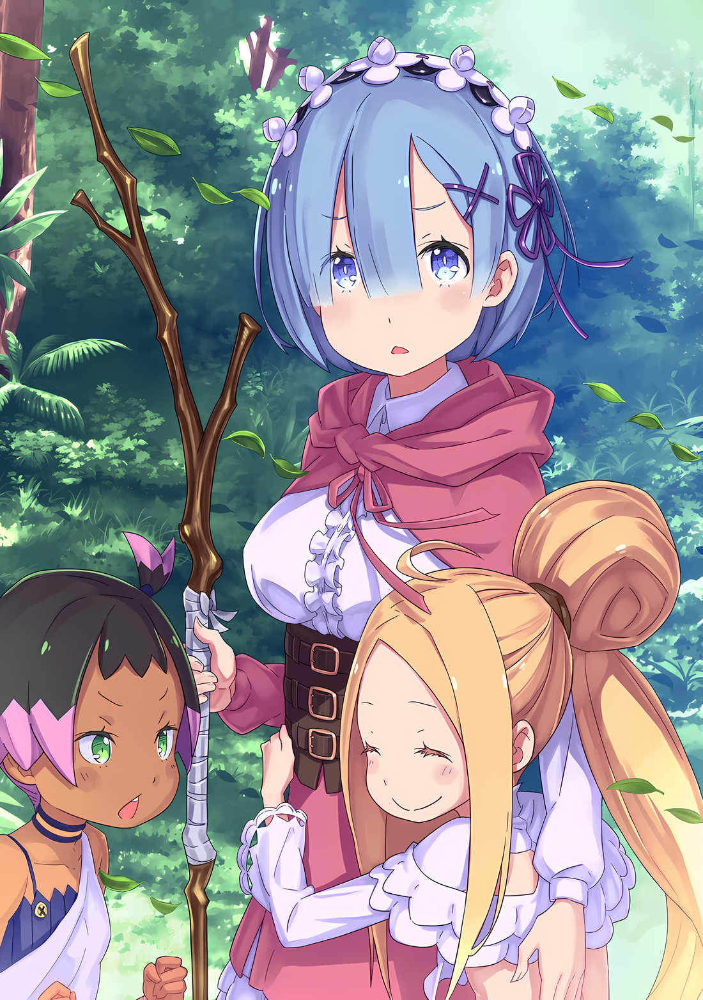

……Падение Города-крепости Гуарал — таков был следующий шаг в схеме Абела.

Пока его мозг переваривал содержание этого смелого заявления, Субару мгновенно пришел к выводу.

Это был абсурдный план.

Субару: Несмотря на несовершенство, это Город-крепость…… Он окружен стенами со всех сторон, а входы и выходы через ворота постоянно контролируются. Это не то место, где можно так просто сказать что-то вроде «сдаюсь».

Абел: Хоо, ты говоришь так, как будто видел это… О да, так и есть. Поскольку ничего особенно полезного из твоих уст не прозвучало, я почти забыл.

Субару: Этот острый ум очень хорош. Но эта острота применима только против противников, сидящих за такими разговорами. Против вооруженных противников она не сработает.

В центре места встречи, вокруг костра, Субару и Абел смотрели друг на друга.

Абел не выдавал никаких эмоций за маской Они, но это только мешало Субару догадаться, что творится у него в голове, и Субару был одновременно раздражен и озадачен.

В данный момент, когда Субару испытывал законное беспокойство, Абел никак не мог этого не понять.

И несмотря на это, он предложил что-то вроде падения Города-крепости….

Рем: ……Ты намереваешься использовать обходной путь для вторжения в город, ведь так?

Пока Субару задерживал дыхание, тихий голос прошептал эти слова рядом с ним; это был голос Рем.

Рем сидела, сложив ноги на одной стороне, ее светло-голубые глаза пристально смотрели на Абела. Это был не столько взгляд, сколько ощущение, что она вглядывается в него.

Получив такой взгляд, Абел пожал плечами: «Это само собой разумеется».

Абел: Как сказал Нацуки Субару, проверки, введенные на главных воротах города, — это первое препятствие. Нам необходимо найти способ обойти их, чтобы попасть в город.

Рем: Даже если предположить, что мы попадем внутрь, похоже, что в городе находится большое количество Имперских солдат. Даже не обращая внимания на проверку, я думаю, что врагов будет слишком много.

Абел: Фф.

Абел, который разбирал препятствия для падения Гуарала, Рем высказала аргументированное возражение. Абел фыркнул на такое отношение, но с другой стороны недоумение Субару усилилось.

Источником его, конечно же, была фигура Рем, напрямую спорившей с Абелом.

Что касается содержания ее аргументов, то можно сказать, что Рем была на той же стороне, что и Субару, выступая против нападения на Гуарал.

Однако ее позиция была слишком правильной. ……Как-никак за время своего недолгого пребывания в Гуарале она полностью убедилась в этом.

Абел: ……Нацуки Субару, что ты знаешь о разнице между наступательной и оборонительной военной силой в битве?

Субару: А? Разница между наступательной и оборонительной военной силой, ты говоришь…… Например, закон трехкратной атаки?

Абел: Закон трехкратной атаки… Действительно, это очень подходящая фраза.

На вопрос Субару рефлекторно ответил, а Абел кивнул, словно впечатленный.

«Закон трехкратной атаки» — это теория боя, касающаяся военной силы, которая гласила, что атакующая сторона должна иметь в три раза больше сил, чем обороняющаяся.

Это объяснялось разницей в целях нападения и защиты. Наступающая сторона должна победить своих противников, в то время как обороняющаяся сторона могла либо победить своих противников, либо отразить их, либо просто избежать нападения, что являлось значительным преимуществом.

Например, в данном случае, чтобы захватить Гуарал, Абел должен был приказать «Племени Судрак» занять город, но Имперские солдаты и гвардейцы могли уйти от атаки и забаррикадироваться в городе, чтобы достичь своей цели.

Чтобы покрыть разницу для достижения целей, по идее, нужно было такое количество войск, но….

Субару: В три раза больше сил, чем в городе, мы никак не сможем собрать столько. Мизельда-сан, сколько человек в этой деревне, плюс-минус?

Мизельда: Всего восемьдесят два человека. Включая Абела и того человека… Флопа, это не меньше сотни.

Субару: Я не уверен, как вы считаете мужчин с красивыми лицами, но это просто сотня. Хотя, по моим приблизительным подсчетам, в городе их в три раза больше.

Не обращая внимания на метод подсчета Мизельды, Субару оценил военную силу Гуарала именно так.

Масштабы города, вероятно, не достигали 10 000 человек, но в нем должно было быть соответствующее количество солдат, охраняющих закон и порядок в городе. Кроме того, к ним присоединятся Имперские солдаты, чей лагерь был сожжен.

……Это Имперские солдаты, включая Тодда.

Субару: …………

Абел: По крайней мере, похоже, что ты обладаешь фундаментальными знаниями в своей голове. Тем не менее, причина, по которой ты держал язык за зубами, похоже, заключается в каком-то другом страхе, кроме беспокойства о разнице в силе.

Субару: ……Это правда, что есть что-то, чего я боюсь, но также правда, что разница в силе опасна.

Субару щелкнул языком и почувствовал дискомфорт от того, что его внутренние чувства правильно угаданы.

На самом деле, когда Субару услышал о плане поимки Гуарала, первым препятствием, которое пришло ему на ум, был Тодд. Даже одной мысли о том, что он снова столкнется с ним, было достаточно, чтобы заставить его внутренности сжаться.

В любом случае, если они думали в соответствии с «Законом трехкратной атаки», это не стоило обсуждать.

Субару: Что касается способа преодолеть разницу в силе, то я не могу придумать ничего, кроме того, что к нам присоединится могучий воин или вражеский командир окажется смертельно некомпетентным.

Абел: К сожалению, я не думаю, что мы можем предвидеть что-либо из этого. Со способностями судракиек мы можем рассеять массы войск, но даже если они используют свою численность, чтобы окружить нас, мы будем побеждены. Кроме того, я слышал, что вражеский командир — Зикр Осман. Он твердый и скучный стратег, но у него нет слабых мест.

Субару: Зикр… Я слышал это имя.

Должно быть, он слышал это имя от Тодда, еще до того, как их отношения испортились.

Имперский лагерь уже превратился в пепел, но он помнил, что человека, командовавшего той военной операцией, звали Зикр.

Однако, поскольку лагерь был сожжен, он решил, что этот человек тоже потерпел поражение.

Абел: Те, кто был в лагере, были обычными солдатами. С самого начала, чтобы скрыть главную цель, они были наделены минимальным интеллектом…… Против небольшого племени Генерал Второго класса не пошел бы на передовую.

Субару: То есть ты хочешь сказать, что командир с самого начала оставался в городе?

Абел: По правде говоря, ничего не делая, он должен был добиться адекватного результата. Этот план провалился по моей команде…… И благодаря твоему присутствию, Нацуки Субару.

Субару: Гх….

Абел злобно пытался заставить Субару посмотреть в лицо ответственности, от которой он отводил глаза.

На это Субару оскалил зубы и прижал руку ко рту.

Во всяком случае, существовала большая вероятность того, что Генерал Второго класса Зикр был расквартирован в Гуарале.

Высшие чины Империи состояли из Генералов Первого класса, Генералов Второго класса, Генералов Третьего класса и так далее, поэтому он мог понять, что второй сверху ранг означал довольно влиятельного человека.

Субару: Так что ты хочешь сказать? Помимо того, что мы уступаем в военной силе, вражеский командир — большая шишка, причисленная к элите. Кроме того, раз уж мы разворошили улей, они тоже будут начеку, верно?

Абел: Именно. Ты можешь оценить тяжесть своей ответственности?

Субару: Я не это имел в виду!

Абел осудил Субару за легкомыслие, но проблема была в другом.

Проблема была в позиции Абела, который отказывался от борьбы даже при ничтожных шансах на успех. Субару же твердо решил, что бессмысленно даже пытаться.

В первую очередь……

Субару: Я категорически против борьбы как таковой. Это должно было быть ясно, когда я уходил отсюда. Я… я просто хочу вернуться домой с Рем.

Абел: Но это уже оказалось неосуществимым. Ты думаешь, что Имперские солдаты в Гуарале — твой единственный враг? Ты уверен, что другая деревня или город будут в безопасности?

Субару: …………

Абел: Неважно, куда вы пойдете, ваш покой больше не будет обеспечен. Я намеревался дать тебе время, чтобы ты полностью осознал это, и позволить этому просочиться в твою кровь. Или яда все еще недостаточно?

Насмешливый взгляд Абела начал подтачивать слабый дух Субару.

К тому же, чувствуя боль, словно ему пришлось пройти через большие трудности, Субару испустил долгий вздох; хотя это и раздражало его, он не мог отрицать правдивость слов Абела.

Страдания, через которые он прошел в Городе-крепости, создали внутри Субару ментальный барьер.

Отныне, даже если он попытается взять Рем и сбежать за границу, даже если он отправится куда-нибудь, кроме Гуарала, та же бдительность и страх не исчезнут.

Гордость Субару была потеряна в обмен на пять смертей.

Субару: ……Если это так, что если я продам тебя врагу?

Путь к отступлению был закрыт, и Субару, оскорбленный за легкомыслие, задал этот вопрос, его лицо исказилось.

В одно мгновение слова, произнесенные Субару, сделали воздух в зале напряженным. Краем зрения он ясно видел Рем рядом с собой, ее глаза расширились.

Однако тот, кого он угрожал продать, Абел, негромко рассмеялся.

Абел: Хм. Наконец-то твоя голова, похоже, начинает функционировать нормально. И все же….

Мизельда: Это не обсуждается, Субару.

В мгновение ока Мизельда выхватила свой кинжал и приставила острие к шее Субару.

Субару задохнулся от ее быстрого движения и посмотрел на лицо высокого вождя племени, которое мгновенно переместилось. Глаза Мизельды передавали упрямую убежденность на ее красивом лице, это были глаза безжалостной охотницы.

Мизельда: Мы уже решили сражаться вместе с Абелом. Это результат «Ритуала Крови», если это желание того, кого мы признали соотечественником, то ему ничего не будет.

Субару: ……Я понимаю, что для меня, позаимствовавшего вашу силу, чтобы вернуть Рем, это дерзко. Честно, вы все согласны с этим?

Мизельда казалась решительной, но вопрос Субару перепрыгнул через нее.

Как вождь, Мизельда должна олицетворять собой то, каким должно быть «Племя Судрак», и ее нельзя было переубедить. Но даже в этом случае у других судракиек могло быть свое мнение.

Различные мнения присутствующих, Таритты, Куны и Хоули.

Субару: Минуту назад этот парень тоже так говорил. Разрыв в военной силе очевиден, а противник — очень опытный мужественный генерал. С самого начала видно, что у тебя нет шансов сразиться с ним….

Хоули: Может быть, Субару неправильно понял~

Субару: Неправильная понял……?

Первой, кто ответил на этот вопрос, пока Субару искал другие мнения, была, на удивление, Хоули.

На краю места встречи, Хоули, которая прислушивалась к разговору, грызя немного сушеного мяса, устремила свой взгляд на Субару, препятствуя его движению.

Хоули: Если ты говоришь о победе или поражении, то отступление отсюда — это тоже наше поражение~. Если мы не сможем сражаться за нашего соотечественника, наш дух будет запятнан~

Субару: Пятно на духе, говоришь…… Что-то вроде гордости, или противостояния предкам, что-то в этом роде?

Хоули: Да-да, ты понял, Субару~

Улыбнувшись, Хоули подтвердила слова Субару.

Но вместо того, чтобы это было доказательством взаимопонимания, это было доказательством того, что они не могли понять друг друга.

Субару также понимал, что существуют такие точки зрения.

Такие вещи, как гордость и честь семьи, были, так сказать, невидимыми подтверждениями, которые напрямую не способствовали физическому телу…… Думать о них было делом серьезной важности, и, конечно, существовали взгляды, которые ценили такие вещи превыше всего.

Но, как бы там ни было, это был образ мышления, который не мог сосуществовать с верой Субару в то, что нет ничего важнее жизни.

Субару: Куна! Таритта-сан! Вы двое придерживаетесь одного мнения!?

Куна: ……Я не думаю об этом так глубоко, как Хоули или шеф.

Таритта: ……Я подчинюсь решению моей старшей сестры. Поскольку это мое желание.

Субару: Понятно….

Он спросил мнение и у двух других, но Субару не смог получить желаемого ответа.

Он думал, что, возможно, это сделает Куна, которая немного отстает от других судракиек, но, похоже, надежды Субару были напрасны. Таритта полностью подчинялась Мизельде.

Субару остался без союзников, с кинжалом у шеи, и, похоже, тупик затягивался, но……

Рем: ……Мизельда-сан, пожалуйста, убери оружие. Этот человек не намерен отдавать Абела врагу.

Той, кто попросил Мизельду убрать кинжал, была не кто иная, как сама Рем.

Встретившись с ней взглядом, Мизельда сузила глаза.

Мизельда: Ты отдаешь мне приказ, Рем? Ты не прошла «Ритуал Крови». Я разрешила тебе войти в деревню по просьбе Субару, но не думай, что это значит, что ты можешь мне перечить.

Рем: Так что, это тем более причина, по которой ты должна убрать оружие. Этот человек прошел ритуал… «Ритуал Крови», как вы его называете, и был принят как соотечественник. Ранить его было бы нехорошо.

Мизельда: ….Мнх

Мизельда попыталась одолеть Рем своей усиленной проницательностью, но его неустрашимый ответ заставил ее растеряться. В конце концов, она быстро вернула кинжал в ножны на поясе.

И вот так Субару был отпущен, и пристально уставилась на Рем.

Мизельда: То, что ты сейчас сказала, верно. Но если мнения Абела и Субару снова разделятся, я буду на стороне Абела. Не забывай об этом.

Рем: Это потому, что глаза у него как у гнусного злодея с подходящим запахом тела?

Мизельда: Немного остроты в глазах тоже имеет свой шарм. Но я люблю красивые лица.

Ситуация успокоилась, но завершающий обмен мнениями был слабым разговором.

В любом случае, Субару был избавлен от ситуации, когда ему чуть не перерезали горло, и он осторожно потер место, к которому прижималось острие ножа. Затем он пристально посмотрел на Рем.

Рем: ……Что такое?

Субару: ……Ничего, я просто не знаю, как мне реагировать на то, что ты за меня заступилась, или на то, что ты пренебрежительно отозвалась о моем лице.

Рем: Я ничего не говорила о твоем лице. Я говорила о твоих глазах. Потом о запахе твоего тела. Я морщу нос. Пожалуйста, сядь подальше.

Субару: Опять это……!?

Встретив ледяное отношение Рем, Субару был задет тем, что она заставила его сесть подальше.

Однако в глубине души Субару терзало еще большее смятение. В действительности, почему она выступила в защиту Субару? Он не понимал ее истинных мотивов.

Тем не менее, может быть, ей не нравилось закрывать глаза на что-то нелогичное, а может быть, это было что-то другое. Может быть, это было предубеждение Субару?

В конце концов, она не распаковала вещи в гостинице в Гуарале, так что……

Абел: Наш разговор был прерван. Однако, даже если предположить, что тебе удалось скрыться от глаз судракиек, идея продать меня врагу бесполезна.

Субару: …Молодец, что вернул нас на путь истинный. Раз уж мы здесь, я спрошу. Почему?

Абел: Вы также провели время в городе, хотя и недолго. В таком случае, неужели новости о том, как управляется нынешняя столица Империи, не достигли ваших ушей?

Субару: Столица Империи, говоришь…… А! Точно, точно! Ты…

Внезапно поняв, Субару, не задумываясь, встал на месте. Затем, сосредоточившись на видимом окружении, он крикнул «Флоп-сан!».

Не успев ничего понять, изумленный Флоп обернулся с вопросом «Да?».

Флоп: Что-что-что, Мистер? Честно говоря, я сейчас чувствую себя крайне растерянным и озадаченным, я становлюсь беспорядочным! Я нисколько не слежу за этим разговором, все, что я знаю, это то, что мне кажется, что мы подошли к кульминации вопроса!

Субару: Прости, что оставил тебя без внимания, но подтверди кое-что для меня. В Гуарале ты говорил об официальном уведомлении из столицы Империи… вернее, о провозглашении Императора.

Флоп: Провозглашении Императора… Ты имеешь в виду проблемы в столице Империи?

Флоп щелкнул пальцами, и Субару кивнул в знак понимания.

Сразу после этого напряженная схватка с Тоддом, повторившаяся шесть раз, сильно въелась в его мозг, но он также обменивался подобными разговорами с Флопом в Гуарале.

Размышляя над этим вопросом, Флоп пригладил свои длинные волосы,

Флоп: В нашей Империи тлеют угли, а в столице происходят какие-то беспорядки. Нынешний Император правит уже долгое время, и без признаков гражданской войны Имперские граждане наслаждались мирными днями. Но потом случилось это.

Субару: Разговоры о беспорядках в Столице распространились за ее пределы, и ты сказал, что сам Император взялся их разрешить, верно? Это было необычное заявление, но….

Флоп: Верно. На самом деле, это первый раз с тех пор, как нынешний Император взошел на трон. Тем не менее, он отлично управляет Империей до сих пор. Так что я не волнуюсь! Да здравствует Волакия!

Подняв обе руки, Флоп неосознанно погладил старую рану Субару.

Эти слова, восхваляющие Империю, он так часто слышал в Имперском лагере, но сейчас Субару не хватало присутствия духа, чтобы невинно согласиться с этим.

В любом случае, проблема была не в похвалах, а в движении Императора, о котором говорилось чуть раньше.

То, что Император непосредственно начал действовать, чтобы подавить беспорядки в столице, было беспрецедентной ситуацией. Не говоря уже о том, что в случае, если бы Император сделал что-то вроде отдачи приказа перед публикой….

Субару: Ты, который сейчас здесь, кто ты и какое положение занимаешь? Можешь ли ты доказать, что ты не какой-нибудь сумасшедший псих с открученным винтом?

Абел: Доказательства, говоришь? Где в этом необходимость?

Субару: Что?

Сидя с поднятым коленом, Абел фыркнул на скептицизм Субару. В то же время он положил руку на грудь и, словно пытаясь выставить напоказ собственное существование, заговорил,

Абел: Не обращай внимания на бездумных, которые ополчились на меня. Поскольку ты достиг точки невозврата, если ты будешь продолжать относиться ко мне как к наглецу, который говорит глупости, как ты объяснишь ситуацию, в которой оказался?

Субару: Это….

Абел: Перестань цепляться за легкомысленные идеи, которые не могут обмануть даже тебя самого, лишь бы обрести душевный покой. Если исключить все возможности, которые не совпадают в нужное время, то останется только правда.

Заявление Абела было резким, но Субару с горечью понял логику, стоящую за ним.

Стоящий перед ним человек в маске Они был фальшивым существом, маскирующимся под Императора, и Субару, а также «Племя Судрак» были обмануты его ложью. Подобное развитие событий привело бы к гибели за гранью спасения, и в это трудно было поверить.

На самом деле Абел использовал силу судракиек и информацию, полученную от Субару, чтобы сражаться и победить Имперскую армию. Это реальное событие было тем, что не может быть объяснено привычным лжецом.

Субару: Тогда, что насчет столицы Империи? Если говорят, что Император непосредственно принял командование, не может быть, чтобы Император не выступил перед людьми.

Абел: Наверное, так и будет. Подделка, удивительно похожая на меня…… Чтобы пресечь упоминания об отсутствии Императора, используется исключительно хорошо сделанный двойник. ……Чиша Голд.

Субару: Чиша…?

Это имя он раньше не слышал, но это был двойник Абела…… Нет, это был двойник Императора.

В стране, где царит империалистическая идеология «могущество делает право», легко представить, что для подготовки к убийствам Император организует себе двойника.

Однако использование этого двойника врагом для узурпации места Императора было совершенно неправильной расстановкой приоритетов.

Абел: Молчи, я в курсе.

Субару: Да, благодаря тебе мы влипли. Если бы только в Империи был мир….

Единственная проблема, которая была нужна Субару…… это соленое взаимодействие с амнезией Рем.

Чтобы воссоединиться с Эмилией и остальными, предстояло пройти путь борьбы и бегства из Империи Волакия. Это было все, что должно было быть. Но теперь, по воле судьбы, они оказались в этой переделке.

Флоп: Гм, хм, ах, вы знаете, Мистер.

Тот, кто обратился к Субару с кислым лицом, был Флоп.

Сморщив пространство между бровями на своем изящном лице, он наклонил голову под довольно крутым углом,

Флоп: Я думал об этом с тех пор, как услышал это раньше, но то, о чем вы говорите с Мистером Шефом, немного загадочно, не так ли? Честно говоря, я все еще в шоке от твоей шутки о том, что ты вызвал падение Гуарала, но….

Субару: Шутка… Нет, не обращай внимания. Эмм, Флоп-сан, я хотел объяснить, но…

Флоп: Да, пожалуйста, объясни, если можешь! Если нет, у меня нет выбора, кроме как согласиться принять то, что я слышу без вопросов.

Сказав это, Флоп ткнул пальцем в Абела и ткнул им в его сторону.

Затем….

Флоп: Я вынужден согласиться с абсурдной идеей, что вон тот Мистер Шеф — сам Император!

Субару: …………

Флоп: Хохохо? Я в замешательстве, если ты будешь молчать, Мистер. К счастью, у меня есть репутация человека, делающего поспешные выводы. Поэтому у меня есть гибкость, чтобы изменить и отказаться от своего мнения, знаете ли….

Абел: ……Ты, ты сделал что-то сродни притягиванию неуместности к искусству.

Если они пытались скрыть это, то в разговоре не хватало соображения, чтобы сделать это.

Вот почему, сидя рядом с Субару, Флоп смог естественным образом прийти к правильному выводу. И, будучи в состоянии сделать это самостоятельно, Абел выказал недовольство по этому поводу.

Вложив в свой взгляд презрение, он оскорбил «неуместным» Субару. Он указывал на то, что Субару не прояснил Флопу ситуацию, приведя его в поселение судракиек.

Однако принять пренебрежение Абела было сложно для Субару.

Субару: Я неуместный? Как будто ты можешь так говорить! Во-первых, даже я знаю, что это не то, что можно произносить вслух просто так.

Абел: Тогда закончи свои выяснения, прежде чем приводить их сюда. Похоже, ты все еще не понимаешь текущей ситуации. Пока тебя преследовали враги в Гуарале, времени на размышления должно было быть более чем достаточно.

Субару: …………

Абел: Положив рядом с собой что-то более важное, чем ты сам, почему ты поддался своим мыслям. Если у тебя не было намерения поставить их рядом с собой, возвращать их было ошибкой с самого начала.

Что-то более важное, чем ты сам. Сказав это, Субару подумал о Рем рядом с ним.

Последовавшие за этим слова также причинили Субару боль, словно его плоть разрезали. ……То, что Абел пытался сказать, было ясно как день. Он говорил о том, что Субару оставил себя незащищенным в то время, когда должен был защищать Рем.

Конечно, Субару не помнил, чтобы он ослаблял бдительность или вообще уступал.

Однако в глазах Абела, чей мыслительный процесс вращался гораздо глубже и дальше, чем у Субару, Субару было крайне недостаточно. Этого никогда не было достаточно, и никогда не стоило того, чтобы об этом задумываться.

Не возвращай того, кому нельзя доверить детали. Именно так его и критиковали.

Субару решил не впутывать в дела Флопа и Медиум. Абел раскрыл наивную мысль Субару и холодно отбросил ее, сказав, что это идиотизм и глупость.

Субару: Я……

Флоп: ……Мистер Шеф! Могу я прервать эту дискуссию на минутку?

Субару растерялся, но вместо него Флоп энергично поднял руку.

Шумно шагнув вперед, он с грохотом опустился на скрещенные ноги и лицом к лицу столкнулся с маской Они Абела.

Флоп: Или, может быть, ты не Шеф? Как мне к тебе обращаться?

Абел: Сейчас я не ношу никакого титула. Я взял себе имя Абел, но ты можешь называть меня как хочешь.

Флоп: Вот как! Тогда я буду называть тебя Мистером Шефом потому что мне так удобнее. Вон те женщины-солдаты не возражают?

Мизельда: Ахх, ты сексуальный мужчина. Я разрешаю все.

Таритта: Сестра….

Оставив в стороне почти обычное взаимодействие между сестрами, Флоп рассмеялся со словами «Спасибо!». При этом он сильно хлопнул ладонями по коленям

Флоп: Мне страшно, потому что ты не отрицал этого долгое время, но я хочу поговорить о том, что ты упоминал до этого. Мистер Шеф, ты хотел спросить о скрытых путях в город……?

Абел: Да, хотел. Есть идеи, торговец?

Флоп: Конечно! Так казалось, что я собирался ответить, но прошу прощения. Если это будет использовано для нападения на Гуарала, то я не могу ответить.

Выставив вперед ладонь, Флоп заявил об этом с веселым выражением лица.

Слушая его, Субару расширил глаза, услышав простые и решительные слова Флопа. Даже Абел сузил глаза на дюйм из-за своей маски Они.

Это говорило о том, сколько серьезности Флоп вложил в свои слова, даже если это и не проявилось в его тоне.

Абел: …………

Заявление Флопа было довольно диким и заставило его выделиться, но это не потому, что он был глуп.

Он также пришел к выводу, что истинная личность человека перед ним, Абела, была личностью высокого класса и уважения. Ему не сказали, прав он или нет, поэтому он решил, что его предположение близко к истине.

То есть, он, вопреки предполагаемому Императору, ответил большим «НЕТ».

Абел: … Понимаешь ли ты смысл сказанного тобой?

Флоп: Ты ведь всего лишь Шеф, верно, Мистер Шеф? Конечно, понимаю. Если бы мечи скрестились, я бы отверг это. Я хочу избежать причинения вреда кому-либо с помощью знаний, которыми я владею.

Абел: Это сказка. В реальности что-то вроде злобы нападет на тебя, не принимая во внимание твою личную историю. Ты бы поднял кулак против всего этого и попросил бы их отступить?

Флоп: Если понадобится!

Абел: Даже если ты это сделаешь, твои усилия не принесут плодов. ……Это Страна Волков.

Жуткая, леденящая аура, исходящая от тела Абела, пронзила воздух, когда он это сказал.

Ужасное чувство подавленности от этого не было вызвано разницей в их силе. Оно возникло из-за разницы в их присутствии. Даже Рем и судракийки, которые в случае схватки одолели бы Абела, затаили дыхание и замерли.

Конечно, Субару тоже был напуган до такой степени, что его дыхание стало неровным. Флоп тоже не был лишен этого чувства.

Однако, пока Флоп был поражен ужасающей аурой Императора……

Флоп: Даже в Стране Волков живут овцы. Если волки будут кусать меня за ягодицы, я оседлаю свою телегу с волами и убегу со своей сестрой. Я повторяю это снова и снова до сих пор, Мистер Шеф.

Абел: …………

Даже если бы его щеки были заморожены, улыбка Флопа не исчезла. Это был его протест.

Услышав это, демоническая аура, исходящая от Абела, внезапно разрядилась. Гнетущий воздух, охвативший зону встречи, внезапно исчез, и Субару вновь обрел возможность свободно дышать.

Тем не менее, даже если бы он получил некоторую свободу действий, чтобы перевести дух, сердце Субару было не в состоянии вернуться в нормальное состояние.

Субару: Ааа, Флоп-сан….

Субару обратился к Флопу хриплым голосом. Улыбка Флопа, которую он показал Субару, когда тот взглянул на него, была яркой.

Это была почти кривая улыбка, но боковой профиль Флопа не показывал никаких признаков сожаления. Впрочем, даже если бы он ни о чем не жалел, для Субару, который привел его сюда в первую очередь, его сожаление только увеличилось бы в геометрической прогрессии.

Ведь Флоп напрямую выступил против Императора Волакии.

Используя эту причину для того, чтобы вызвать недовольство Абела, Абел мог сделать с Флопом все, что угодно, ведь он командовал судракийками.

Однако, вопреки опасениям Субару……

Абел: ……Против моего ленивого аргумента, я вижу, что твоя вера не колеблется. Неприятный ты человек, не так ли, торговец?

Флоп: Это правда? Даже в этом случае я признаю, что моя внешность благоприятна для людей, которых ты знаешь!

Мизельда: Я согласна.

Собирая свою ауру, Абел не стал направлять копье гнева на Флопа.

Флоп отреагировал на это так, что было непонятно, осознает ли он, насколько опасный канат он выбирает. Замечание Мизельды не комментируется.

Абел: Я отзываю свою прежнюю благодарность, Нацуки Субару.

Субару: А?

Субару, не в силах восстановить прежнее чувство покоя в сердце, заговорил с Абелом.

Скрываясь за маской Они, человек с острым взглядом кивнул в сторону упрямого Флопа

Абел: Тебе не хватает самосознания, но если ты собирался привести кого-то, то тебе следовало бы привести кого-то более близкого к моим интересам. Тогда бы все обошлось без будущих осложнений.

Субару: ……Если бы это был кто-то подобный, сомневаюсь, что они были бы добры к нам с самого начала.

Абел: Хм, полагаю, это суждение верно. Как обидно.

Если ранее благодарность была выражена за то, что он взял Флопа с собой, то упрямство, проявленное Флопом, заставило Абела отказаться от похвалы.

Не может быть, чтобы Флоп прямо огрызался на власть Императора… Нет, лучше сказать, уклонялся от нее, как от ивы. Субару не думал, что есть люди, которые могут занять такую позицию.

Не говоря уже о том, что для Абела было неожиданностью, что Флоп будет терпеть такое отношение к себе.

Рем: Я ожидала, что Абел-сан будет более упрямым.

Субару: Подожди, Рем!?

Короткий комментарий Рем, казалось, отразил сердце Субару, и его глаза непроизвольно расширились.

По правде говоря, его это тоже удивило, но он промолчал, потому что решил, что от этого ничего не выиграет. Это исходило от Рем, и маска Они Абела повернулась к ней.

Демон Они и маска Они столкнулись лицом к лицу, и на мгновение в пространстве между ними воцарилась тишина.

Абел: ……Люди с убеждениями вызывают беспокойство. Сильные корни распространяются и наращивают силу в стволе.

Рем: ……Что это значит?

Абел: Ты не можешь сказать? Неважно, это мелочь.

Рем вскинула бровь, услышав тихий и несколько нехарактерный ответ Абела. Выразив некоторое разочарование ответом Рем, Абел рассеянно покачал головой.

Никто не знал причины его разочарования. Субару, однако, мог примерно догадаться, в чем дело.

Субару: ……Ты на что-то намекаешь?

Абел: Хох, это было неожиданно. Ты не похож на человека, получившего образование.

Субару: Я подумал, что это что-то в этом роде. Ты говорил так, будто цитировал кого-то другого.

Слышать, как Абел неожиданно заговорил как обычный человек, было удивительно.

Однако Абел не обратил внимания на то, что ему раскрыли его истинные мысли, и коротко ответил: «Понятно».

Абел: Что касается твоего вопроса, то, говоря, что это было неожиданно для меня, ты имеешь обо мне весьма превратное впечатление, не так ли? Во-первых, чего ты ожидала от меня?

Рем: ……Я думала, что ты, по крайней мере, будешь пытать их для получения информации

Ответ Абела произвел на Рем впечатление слишком честного ответа.

Тем не менее, это не был вариант, который Субару также не рассматривал. Если Абел хотел заставить Флопа подчиниться его воле, то было бы неудивительно, если бы он приказал судракийкам пытать его или делать другие подобные вещи.

Вот только Абел на эти слова пожал плечами и ответил: «Это бесполезно».

Абел: Конечно, бывают случаи, когда боль — лучшая тактика ведения переговоров. Однако достоверность информации, полученной таким способом, крайне низка. Люди будут лгать без колебаний, чтобы освободиться от боли, которая перед ними.

Рем: …………

Абел: И если бы ты оказалась в подобном сценарии, твои глаза говорят мне, что ты защитила бы их своей жизнью.

Так Абел оценил Рем, которая неподвижно смотрела на него.

Если посмотреть на боковой профиль Рем, ее челюсть была стиснута, а милые черты лица были на грани того, чтобы быть стертыми взглядом мрачной решимости. Ее боковой профиль ясно показал, что краткая оценка Абела была верной.

Абел: Я не стану рисковать глупым действием, которое может сократить мои войска, в обмен на информацию низкой точности. ……Так что, я буду вести переговоры.

Флоп: Переговоры?

Абел: Торговец, я куплю любое знание, которым ты обладаешь. Давай договоримся об этом.

— Сказал Абел, опуская поднятое колено и опускаясь на скрещенные ноги. Услышав это, Флоп расширил глаза и посмотрел на Абела с улыбкой на лице.

Затем……

Флоп: Когда я слышу слово «переговоры», я, как торговец, не могу не радоваться. Однако! Прежде чем мы начнем переговоры, позволь мне прояснить одну вещь. Я очень упрям. Даже если моя голова будет расколота и разбита, я не соглашусь ни с чем, о чем не могу договориться.

Таково было его заявление.

△▼△▼△▼△

Субару: Если твоя голова будет расколота, это будет совсем не смешно…… Совсем не смешно, Флоп-сан.

Вспомнив едкие слова Флопа, с которых началась переговорная битва, Субару сделал горькое лицо.

Флоп сделал это не специально, но, увидев в реальности, как его голову много раз раскалывали и разбивали, его слова произвели на Субару эффект неожиданной атаки.

Субару: …………

Субару, сузив глаза, смотрел на место встречи с холма, расположенного чуть поодаль.

Даже сейчас, в зоне встречи, шли переговоры Абела и Флопа, или «деловые переговоры».

Абел хотел получить плацдарм, необходимый для завоевания Гуарала. Флоп обладал знаниями, необходимыми для выполнения этой задачи, но не раскрывал их. Такова была ситуация внутри на данный момент.

Субару покинул место встречи потому, что было приказано исключить всех, кто не нужен для переговоров. По сути, Абел приказал ему уйти.

Да и сам Субару не мог придумать причину, по которой он должен был оставаться в этом месте.

Субару: Использование тайных ходов для проникновения в город, блицкриг-атака, чтобы пройти прямо по горлу вражеского генерала.

Выгнанный с собрания, Субару наслаждался пахнущим джунглями ветром, вспоминая все что произошло.

Судя по тому, что он слышал, план, который изложил Абел, был примерно таким.

Несмотря на простоту, трудно было придумать какой-либо другой план, который позволил бы преодолеть разницу в количестве людей. Если что и следовало изменить или добавить, так это привлечь внимание в городе с помощью отвлекающего маневра или устроить маленькие хитрости, чтобы ослабить охрану вражеского генерала.

Что касается каких-либо проблем с планом……

Субару: Простые планы легко предугадать. По крайней мере, я так думаю… Особенно если против нас Тодд.

Если бы не было других способов нападения, то, конечно, противник тоже принял бы меры предосторожности.

Поэтому план, против которого противник уже принял меры предосторожности, в бейсбольной терминологии был чем-то вроде броска прямо по центру мяча. С точки зрения ожидающего противника, это был бы аппетитный, легкий мяч для отбивания.

Чтобы Тодд пропустил этот удар, Субару не мог себе представить, что такое может случиться.

Субару: Или я слишком параноик? В крайнем случае Тодд…… Если среднестатистический солдат такой же, как и Тодд, то шансов на победу нет.

Он не знал. Было слишком много неизвестно. Но он не хотел, чтобы это было правдой.

Он не хотел думать о сценарии, в котором существовали бы враги, подобные Тодду, кроме Тодда. Его мнение о том, что «Посмертное Возвращение» — худший вариант, было подтверждено болью, которая принесла больше всего смертей за кратчайший промежуток времени.

Думать, что это было нормой для Империи Волакия, было……

???: ……Похоже, переговоры затягиваются.

Субару: …………

В какой-то момент Субару закрыл лицо руками и отгородился от окружающего мира.

Пока Субару смотрел в черную пустоту, до его барабанных перепонок донесся голос девушки, который он привык слышать. Он привык его слышать, но этот голос хотелось слушать всегда.

Однако это происходило только тогда, когда сердце и чувства Субару были спокойны.

Субару: Рем….

Опустив руки, закрывающие лицо, Субару нервно приоткрыл веки. Опираясь на трость, Рем спокойно стояла на пологом склоне холма. Ее взгляд пронзил Субару насквозь, заставив его напрячься.

То, что он сейчас стоял лицом к лицу с Рем, заставило его сердце заколотиться.

Во время возвращения в поселение «Племени Судрак» Субару сфокусировал свой гнев на Абеле, потому что его действия были равносильны тому, что он заманил их в ловушку.

Поступая так, можно сказать, что он избегал разговора с Рем. На самом деле, это было не так. Он боялся заговорить с ней и узнать о ее истинных намерениях.

Поэтому он отводил глаза от того, что ему не нравилось, и пытался найти импровизированное решение.

Тем не менее, существовал предел того, сколько он мог бегать от того, что ему не нравилось.

Есть предел, и отныне……

Субару: …………

Сейчас у него не было другого выбора, кроме как встретиться с ее серьезными глазами.

Рем: Абел-сан, кажется, добавляет различные условия и тому подобное, но Флоп-сан, кажется, не сдвигается с места.

Субару: ……Да, он хороший человек. Он не хочет помогать, предоставляя знания, из-за которых кто-то может пострадать. Будучи окруженным судракийками, он обладает серьезным мужеством, чтобы так говорить.

Субару некоторое время наблюдал за ходом переговоров, но упрямство Флопа было именно таким, как он заявлял.

Центральной темой обсуждения, как и ожидалось, стали потери в городе Гуарал. Люди и материальные ценности…… Флоп ясно дал понять, что не пойдет на компромисс ни в том, ни в другом.

Абел пообещал свести человеческие потери к минимуму, насколько это возможно, но этого было недостаточно, чтобы стать решающим фактором.

Как параллельные линии, они не могли встретиться и прийти к соглашению.

Учитывая упрямство Флопа, Субару также почувствовал облегчение.

Избегая войны, он с головой ушел в опровержение Абела.

Он почувствовал облегчение от того, что кроме него здесь есть еще один человек такого уровня.

Однако……

Рем: Не думаю, что это тот случай, когда можно просто сказать, что он хороший человек.

Субару: ……Что?

В противовес Субару, который подтвердил свое отношение к Флопу, Рем спокойно высказала свою резкую критику.

Удивленный ее словами, Субару бессознательно уставился на Рем. Хотя встретиться лицом к лицу с Рем было трудно, и, несмотря на желание избежать этого, в поле его зрения Рем смотрела прямо на Субару.

Не опуская взгляда, она продолжила.

Рем: Он не хочет навредить другим своими знаниями. Я понимаю эти чувства. Но…… если подумать о ситуации в целом, включая его самого, как он будет считать потери, которые возникнут из-за того, что он не поделился своими знаниями. Разве нельзя сказать, что в этом случае пострадают и другие люди, обладающие знаниями?

Субару: Это просто аргумент ради аргумента. Пытаться обвинить Флопа во всех потерях, которые возникнут из-за того, что он не говорит, это просто ложное обвинение.

Рем: Возможно, это и так. Но я не думаю, что это реалистично — постоянно убегать.

Абел заявил, что это Земля Волков. И против этого Флоп заявил, что овцы будут убегать.

Это была сказка, пессимистично подумала Рем…… Нет, реалистично подумала и сказала. Она была еще одним человеком, переступившим порог Гуарала. Упорство и неумолимость Имперских солдат глубоко въелись в ее кости.

Смогут ли они снова избавиться от этого гнетущего преследования?

Сможет ли Флоп с Медиум продолжать бежать на край света при решительном сопротивлении, а не при смутном злом умысле?

И сможет ли группа Субару, разделившая с ними одну и ту же судьбу….

Субару: Погоди, погоди Рем. То, что ты говоришь, просто безумие. Ты также говорила, что не хочешь, чтобы была битва. Но то, как ты говоришь это сейчас….

Рем: …………

Субару: Как будто ты признала, что нам придется сражаться.

Его горло дрожало. Субару не мог вымолвить и слова.

Но, как говорится, глаза могут сказать больше, чем рот, так и в этом непростом разговоре Субару и Рем не только слова выражали их чувства. Их взгляды тоже.

Мрачная решимость, окрасившая ее глаза, была такой же, как и тогда, когда она защищала Флопа от Абела. Так думал Субару.

Субару: ……Мне больно, что я не могу понять тебя.

Видя такое ее отношение, Субару выплеснул честные чувства, бурлящие в его сердце.

Она критиковала Флопа за следование убеждениям Субару, но смотрела на Субару теми же глазами, которыми защищала Флопа, когда тот излагал свои убеждения.

Она защищала Субару от Абела, но не распаковала вещи в гостинице в Гуарале.

Взаимодействие между пробудившейся Рем и Субару всегда было непоследовательным и односторонним.

В глубине души он был рад, что она проснулась.

Грусть, которая одолевала его из-за того, что ее воспоминания не возвращались, он верил, что они смогут найти способ решить эту проблему.

Тем не менее, в Империи, где не было никого, кому бы он мог доверять от всего сердца, где он должен был вернуть Рем Эмилии и остальным, ее нежелание сотрудничать было подобно ножу, пронзающему его ногу.

Каждый раз, когда это происходило, он был на грани того, чтобы сгорбиться от боли.

Субару: ……Ты не распаковывала вещи в гостинице в Гуарале, верно? Благодаря этому мы сократили время, необходимое для побега, но я всегда считал это странным.

Рем: Это было….

Субару: Обычный человек, добравшись до постоялого двора, расслабится и успокоится или начнет распаковывать свой багаж. По крайней мере, я так думаю. Конечно, всегда есть вероятность, что ты не такой человек. Но……

Он не хотел заканчивать фразу.

Если бы он мог продолжать отводить глаза, он бы так и сделал, но теперь, когда он почувствовал, что не может избежать вопроса Рем о ее необъяснимом отношении, он не мог продолжать отводить глаза.

Вот почему……

Субару: Но ты снова пыталась убежать от меня, не так ли?

Рем: …………

Молчание Рем было пронзительным. Субару почувствовал, как кровь прилила к его телу.

Однако от уже содранного струпья не было никакого толку. Позволяя крови течь, не обращая внимания на открытую рану, он мог только содрать ее. Терпя боль.

Субару: Если… если ты не можешь мне довериться, это нормально. От этого мне больно, но я понимаю. У тебя нет никаких воспоминаний, и для тебя мой запах — это запах кого-то непростительного. Кроме того, у меня нет ничего, чтобы доказать, что ты можешь мне доверять. Я понимаю, почему ты не можешь мне поверить и хочешь отдалиться от меня.

Рем: …………

Субару: Но люди, которые ждут тебя… Люди, которые хранят тебя в своих сердцах… реальны. Если я тебе не нравлюсь, можешь не общаться со мной. Я вытерплю, если ты будешь отбиваться от моих рук. Но, пожалуйста, не пытайся уйти.

Рем: …………

Субару: Я умоляю тебя, пожалуйста… Пожалуйста, не вычеркивай меня из своей жизни.

Его умоляющий голос дрожал, глаза были на грани слез.

Были ли эти капельки слез, которые постепенно появлялись, результатом его жалости к себе или его просьбы к Рем, было неизвестно даже ему самому.

Воистину, он вел себя крайне жалко. Это было настолько абсурдно, что вызывало смех.

Даже если бы от него не отказались, было бы неудивительно, если бы его бросили из-за его мольбы прямо сейчас.

……Он продолжал выставлять перед Рем свою безнадежную и жалкую сущность.

Это было зрелище, которое он точно не стал бы показывать Эмилии, Беатрис или другим своим друзьям.

По крайней мере, Субару намеренно старался не показывать его друзьям. Неважно, удалось ли ему добиться этого на самом деле, главное, что он сделал сейчас.

Потому что он решил показывать свою слабость только перед Рем.

Однако это не означало, что он хотел, чтобы Рем, страдающая амнезией, не имеющая никого, на кого можно было бы положиться, находясь в другой стране, взвалила на себя тяжелый груз, которым был Нацуки Субару. Это было совсем не то, чего он хотел.

Рем: …………

Услышав постыдную мольбу Субару, Рем не произнесла ни слова в ответ.

Тем не менее, Субару не отводил от нее своего мутного, наполненного слезами взгляда. Она тоже не отводила взгляда от Субару.

Недолгое молчание окутало пространство между ними.

Рем: ……Я

Субару: …………

Рем: Я не пыталась бросить тебя.

Рем говорила неловко, тщательно подбирая слова.

Это была эмоция, которую Рем еще не показывала Субару. Даже ни разу.

Она говорила с человеком, которого должна была опасаться, с вниманием и заботой. Она говорила без желания задеть его чувства.

Ее слова не звучали так, будто она говорила отчаянно и не подумав. Ее тон заставил его поверить в это. Или, возможно, это была надежда Субару, говорящая от его имени.

Субару: Ты….

Опираясь на этот тонкий лучик надежды, нить надежды, на которую он не должен был полагаться, Субару искал нужные слова.

О чем думала Рем? Чего она желала? Во что она верила, чтобы произнести эти слова?

Даже не зная, стоит ли ему знать ответы на эти вопросы, Субару просто хотел еще раз услышать ее голос и попытался продолжить свое предложение.

Однако……

???: Аа, уу!!!.

Субару: Вуа!?

Быстрее, чем он мог продолжать, сила набросилась на него вокруг его талии, и тело Субару расплылось, когда его отбросило в сторону.

Не имея возможности поддерживать свое тело, Субару отлетел в сторону, и его отбросило на вершину холма. Голова Субару закружилась, когда он широко раскрыл глаза, пытаясь разобраться в ситуации.

???: Луу! Не садись на вершину Суу! Это плохо! Уу пыталась остановить ее. Луу сама все сделала.

Субару: У-Утаката…? То есть, это…

Той, кто подбежала к ней с почти комичными шагами, была слегка румяная оливково-кожая Утаката. А та, кого Утаката дергала за рукав, сидя на груди Субару, была молодой девочкой, собравшей свои длинные золотистые волосы в пучок……

Рем: Луис-чан, пожалуйста, спустись. Этого человека сейчас раздавят.

Луис: Уу?

Зачеркнув свое радостное и улыбающееся лицо знаком вопроса, Луис повернула шею в сторону слов Рем.

Устроившись на груди Субару, Луис беззаботно похлопывала Субару по щекам. Впрочем, именно ее беззаботность в первую очередь и действовала Субару на нервы.

Субару: У нас важный разговор. Отстань сейчас же.

Луис: Аа?

Субару: Не надо. Утаката, пожалуйста?

Утаката: Я буду слушать, потому что Суу попросил. Суу — хорошая жена и хорошая мать.

Поняла ли она, что это значит? В любом случае, Утаката потянула Луис за руку, чтобы убрать ее с груди Субару. Давление на него исчезло, Субару приподнял свое тело на месте.

Но даже тогда в поле его зрения попала недовольная Луис, и Субару стал раздражаться.

Субару: В конце концов, так и не было получено ответа на вопрос, кто ты такая.

Архиепископ Греха, злое существо, «Чревоугодие», Луис Арнеб.

Если бы он выбирал слова, которыми можно было бы украсить стоящую перед ним блондинку, он мог бы придумать множество нецензурных и нелицеприятных высказываний. Однако, даже если все эти слова правильно описывали ее раньше, ее нынешняя сущность не соответствовала этому.

Эта злая девочка не спасала Субару, не слушала его и не смеялась над ним беззаботно.

Однако……

Луис: Уу?

Луис повернула шеей. В его голове промелькнули ее действия.

Она спасла его, когда Рем душила его. Она кричала и вместе с ним пережила множество трудностей, через которые пришлось пройти Субару. Даже в самой последней…… с Тоддом и его топором.

Воспоминание о том, как она получила удар локтем от Тодда и у нее пошла кровь из носа, все еще было свежо в его памяти.

На ее лице не было и следа от предыдущей травмы, и она вела себя так, словно это событие не имело для нее никакого негативного значения. Это в какой-то степени раздражало, но….

Рем: Луис-чан.

Луис: Уу!

Луис быстро сменила выражение лица на радостное и подбежала к Рем.

Как будто она научилась прыгать на опирающуюся на трость Рем, Луис прыгнула на Рем с не слишком большой силой. Рем поймала Луис и нежно погладила ее по голове.

Она поймала Архиепископа Греха, который был одной из причин ее нынешнего состояния. Она поймала одного из них, Луис Арнеб.

Иллюстрация к **Ранобэ** Том 27 | Разукрасил NorvakKK

Рем: Твои глаза….

Субару: А?

Рем: Глаза, которыми ты смотришь на этого ребенка. Меня это тоже озадачивает. Этот ребенок, она так привязана к тебе, и все же ты……

Субару: …………

Произнесла Рем, обнимая маленькое тело Луис. Субару замолчал.

Было ли это продолжением ее прерванных слов? Рем, которая не распаковала вещи в Гуарале, продолжение этих слов пролило бы свет на остальную часть правды.

Однако, несмотря на ожидание, Рем не произнесла больше ни слова. Она лишь прижала к груди сияющую Луис.

Субару: ……Что ты хочешь, чтобы я сделал?

Посмотрев на Рем, Субару, наконец, решил использовать убедительные слова.

Возможно, это был нечестный метод заставить Рем дать ему ответ. Однако, если Рем отбросит все слова и действия Субару, оставался только этот вариант.

Чего желала Рем, и что она хотела, чтобы он сделал? Он должен был спросить ее об этом напрямую.

Вдобавок ко всему, если бы ответ, который она дала, был чем-то, чего Субару не смог бы добиться для нее, тогда наверняка наступило бы то время, когда их отношения могли бы стать безнадежными. Зная это, Субару с опаской спросил ее.

Она на мгновение задержала дыхание, чтобы не ответить на вопрос Субару,

Рем: ……Я не хочу, чтобы это превратилось в битву.

Сказала она.

Субару тоже мог с этим согласиться. На самом деле, когда лагерь Имперской армии превратился в пепел, она подумала, что Субару возглавил эту атаку, и поэтому набросилась на него с сильным, угрожающим взглядом.

Рем не желала войны. Она не желала ее. Это не было ошибкой.

Поэтому он понимал, что ее мнение не изменилось.

Однако, как только Субару убедился в этом, она добавила еще и это.

Это было……

Рем: Но я не думаю, что мы сможем бежать вечно. Слова Флоп-сана не реалистичны. И….

Субару: Ты не можешь согласиться с мнением Абела.

Рем: ……Да.

Тихо кивнув, Рем согласилась с вопросом Субару.

Ее робкое согласие, это был знак того, что она осознавала, что слова, которые она произнесла, были возмутительными…… и, конечно же, так оно и было.

Она была согласна с мнением Флопа о том, что он не хочет драться, но она также была согласна с мнением Абела о том, что у них нет другого выбора, кроме как биться. Это была идеология, которую можно назвать воплощением оппортунизма.

По правде говоря, даже Субару подумал, как было бы хорошо, если бы такое мнение сторонников сработало.

Бой был нежелателен. Но битва была неизбежным результатом.

Они не хотели отнимать жизни. И все же, они были на переднем крае борьбы, где лишение жизни было неизбежно.

Они должны противостоять дихотомии, которая связана с жизнями.

Рем: Не мог бы ты….

Субару: А?

Скорчив горькую гримасу, Субару согласился с противоречивыми мыслями Рем. Однако, к этому мучительному удивлению, Рем перевела взгляд на него.

Прижав голову Луис к своей груди, она устремила свой беспомощный взгляд светло-голубых глаз на Субару.

Субару затаил дыхание. Словно затихая, она твердила свою решимость….

Рем: ……Не мог бы ты что-нибудь с этим сделать?

— спросила она, словно цепляясь за него в поисках ответа.

Субару: …………

В тот момент, когда он получил этот вопрос, Субару застыл, словно пораженный молнией.

Это был… Это был совершенно… Совершенно неразумный вопрос.

По сравнению с Субару, который считал себя нечестным и трусливым, этот вопрос был намного, намного хуже.

Желание не сражаться, знание того, что выбора нет, кроме как сражаться. Третий ответ, который не был ни одним из этих вариантов. ……Это было то, чего Рем желала от Субару.

Почему?

Забыв обо всем и обо всех, ее доверие и привязанность к Субару были потеряны. Она также испытывала осторожность и отвращение из-за дурного запаха, который окружал Субару. И все же, почему она спросила об этом Субару.

Почему Рем смотрела на Субару такими глазами, словно держалась за него.

Субару: …………

Этот крайне односторонний, даже эгоистичный вопрос разжег огонь в Нацуки Субару.

Даже если бы он сейчас разозлился, громко выругался и осудил ее наивность, его, несомненно, простили бы.

Настолько эгоистичным был выбранный Рем вариант.

Однако в тот момент в Субару проснулось чувство долга, возникшее из самой глубины его души.

Субару: Я……

Он должен бороться.

Он должен сопротивляться.

Он знал, что должен разорвать настоящее, каким оно было сейчас.

Уклоняясь от боя, человек останавливал себя, чтобы не раскрыть свою информацию, Флоп О'Коннелл.

Готовясь к неизбежной битве, человек, который должен был выиграть его выживание, Винсент Абеллюкс.

В ситуации, в которой они сейчас находились, неизбежные пути, которые держали эти двое.

Человек, который должен найти ответ; путь, который отличался от этих двух ответов, Нацуки Субару.

Почему? Потому что……

Субару: ……Я герой, в которого верила Рем.

А еще потому, что он был человеком, который продолжал бороться в этом другом мире, используя в качестве оружия только свое нежелание сдаваться.

Не только его философия, философия, которая не действует только потому, что он пересекает границы, позволила Нацуки Субару продолжать идти до сегодняшнего дня. Это было то, во что он верил.

Встреча с Эмилией, спасение ею, дни, проведенные в бегах ради ее спасения.

Сжать руку Беатрис, вывести ее из Запретной библиотеки, его обещание быть с ней вместе.

Спасти Рем, быть спасенным ею, любимым ею и решить, что он ответит на ее веру и любовь.

……Кровь Нацуки Субару закипала, когда он стремился изменить сложившуюся, стесненную ситуацию.

Что-то, что-либо, неужели совсем ничего?

Дни, проведенные в Королевстве Лугуника, дни, проведенные после того, как его закинуло в Империю Волакия, люди, которых он встретил, враги, с которыми он столкнулся, люди, которые стояли рядом с ним, люди, которые стояли напротив него. Все они стали топливом.

Думай, концентрируйся, представляй, ухватывайся за всевозможные варианты.

В этом мире, где любой и каждый был успешнее его, у Нацуки Субару оставался только один вариант…… его скаредный образ жизни и проницательность.

Тогда, тогда, тогда, тогда….

Субару: ……Ах.

Пораженный своей бесполезностью, охваченный чувством потери и не имея ничего другого, Субару покинул место встречи.

В голове Субару, в голове этого Субару, вспышкой появилась мысль.

Охваченный этой клоунской возможностью, Субару всерьез задумался о том, сможет ли он воплотить эту мысль в реальный план.

Рем: …………

Глаза Рем спокойно смотрели на молчаливого Субару.

Положив руку на Луис, которая выглядела так, словно собиралась устроить переполох, и удерживая Утакату, наклонив голову, чтобы не проронить ни слова, она уставилась на Субару.

Несмотря на то, что у нее не должно было быть никаких воспоминаний, она смотрела на него теми глазами, которые были у нее, когда она была.

Как будто она верила, что Нацуки Субару может найти ответ, который не могут найти другие.

И тогда……

Субару: ……Рем

Держа руку на подбородке, Рем выпрямилась на зов Субару.

Ответа не последовало. Она каким-то образом поняла, что он и не хотел этого.

Однако, не заметив ее реакции, Субару тихо затаил дыхание и продолжил.

Субару: Что бы я сделал, если бы это зависело от меня? Я нашел ответ.

△▼△▼△▼△

Двери в зал заседаний были распахнуты настежь.

Глядя на вновь появившегося Субару, человек в маске Они недовольно сморщил нос. Его поведение говорило о том, что к нему обратились не по делу.

Абел: В чем дело, Нацуки Субару? Такой человек, как ты, не способный высказать конструктивное мнение, не играет никакой роли для внешнего вида.

Ему действительно сказали, что к нему не обращались, и все же ноги Субару не остановились.

Даже если бы он простил неуважение Флопа, Абел, скорее всего, не простил бы Субару, поскольку Субару не испытывал к нему никакого почтения. Чувствуя на себе взгляды лиц, все еще остававшихся в зоне встречи, Субару поджал ноги.

Встав прямо рядом с Абелом, он пристально посмотрел на его маску Они

Субару: Есть какие-нибудь наработки? Ты, высокомерное дерьмо.

Абел: …………

Вытянув руку, Субару с силой сорвал маску Они с лица Абела.

Мизельда и другие судракийки удивленно расширили глаза от его неспешных действий. Само собой разумеется, Флоп тоже был шокирован, впервые увидев истинное лицо Абела.

Однако действия остальных не отразились на его глазах.

На вопрос Субару Абел скорчил демоническое лицо с жестоким выражением, от которого у любого пробежал бы холодок по позвоночнику. Он укоризненно покачал головой, сказав: «Нет».

Абел: Переговоры продвигаются успешно. Вопреки ожиданиям, этого торговца трудно расколоть.

Субару: Это так. Тогда, раз уж ты так плохо умеешь убеждать, я уговорю его за тебя.

Абел: Что?

Абел нахмурил свои брови красивой формы. Увидев его лицо, Субару удовлетворенно посмотрел на Абела.

Затем Субару повернулся лицом к Флопу.

Поскольку вывод еще не был сделан, Флоп как раз спорил с предполагаемым Императором. Ошеломленный разницей в выражении лица и отношении Субару, Флоп обратился к Субару: «Мистер?».

Затем, обращаясь к двоим, которые держали сомнения разной формы, Субару заявил.

Содержание этого заявления было следующим……

Субару: ……У меня есть план бескровного падения Гуарала. Если мы сможем сражаться без кровопролития, то вы двое сможете договориться о плане вместе, не так ли?
