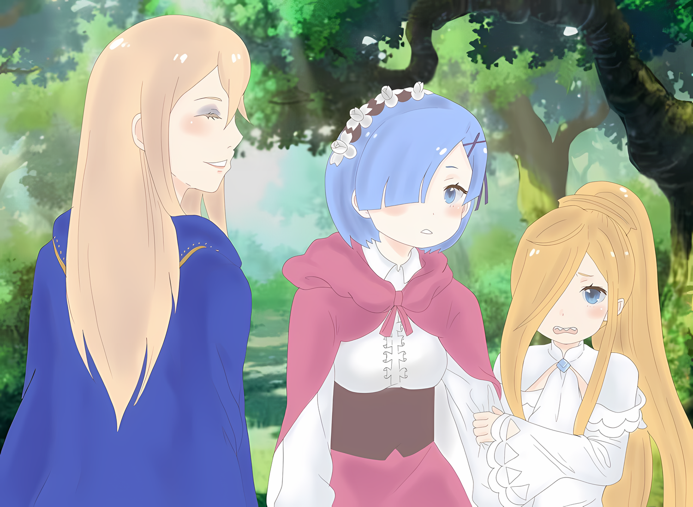

……Вернемся ко времени, до действий танцовщицы в мэрии Гуарала.

???: ……Бескровная осада, говоришь?

Войдя на место встречи, Нацуки Субару на глазах у всех собравшихся сделал мощное заявление.

С силой сорвав скрывающую его маску Они, Абел поднял глаза на Субару и ледяным голосом повторил «Несбыточную мечту», от которой вибрировали его барабанные перепонки.

Он усмехнулся…… Нет, в его голосе не было ни капли насмешки. В нем было чистое сомнение, некий вздох, который говорил о том, что человек, стоящий перед ним, не понимает, что он предлагает.

Намерение было понятно.

Субару: Возможно, ты разработал план, как пройти через это с минимальными жертвами, но ты бы не додумался до плана с нулевыми жертвами в первую очередь.

Абел: Естественно. Принимаешь ты это или нет, но то, чем мы сейчас занимаемся С его изящным телосложением требовалось лишь малейшее усилие, чтобы замаскировать его под «Нее».— это война. Как бы там ни было, жертв не избежать. Все, что можно сделать, это планировать, чтобы избежать потери людских ресурсов.

Субару: Ну, мне не нравится твой способ думать о людских ресурсах с самого начала.

Глядя на Абела, сидящего со скрещенными ногами прямо перед ним, Субару щелкнул языком.

Термин «Людские ресурсы» был сочетанием двух слов, «Люди» и «Ресурсы», которые, по мнению Субару, не должны быть объединены в такой отвратительный термин.

Такой взгляд на «Людей», со стороны, был на шаг дальше, нежели от взгляда на людей как численность.

Или, возможно, это было то чувство равновесия, которое должно быть у правителя, подобного Абелу, но……

Субару: Ну, я не согласен с этим. Флоп-сан такой же, верно?

Абел: ……И вместо этого, ты вмешиваешься с этой бескровной осадой? Это удивительно величественное заявление. От тебя, который еще мгновение назад был таким изможденным.

Субару: Я не буду спорить, что я был изможденным, жалким, позорным. Начнем с того, что с тех пор, как меня занесло в эту страну, я пережил ряд безостановочных катастроф.

В ответ на замечание Абела Субару про себя выругался, а затем уставился на собственную ладонь.

Его не слишком чистую правую руку, руку, которую заменили на новую, тоже можно было назвать частью этих «Безостановочных катастроф». Несмотря на то, что замена правой руки была нелегкой, она была одной из немногих его удач, не так ли?

Замена руки и то, что Рем проснулась. Это, а также встречу с Флопом и Медиум можно без преувеличения считать удачей.

За ее пределами удача и несчастье были двумя сторонами одной медали.

Так было с Абелом до него, так было с «Племенем Судрак», так было и с Имперскими солдатами, включая Тодда……

Субару: Эта серия трудностей истощила душу. Но

Абел: …………

Субару: ……Чем больше трения, тем сильнее разгорается огонь.

Уставившись на свой сжатый кулак, Субару отчетливо произнес это.

В этот момент Рем, отстававшая от Субару, подошла ко входу в место встречи. Опираясь на трость, она вошла вместе с Утакатой и Луис.

Скорее всего, она пришла, чтобы увидеть все своими глазами.

Ведь именно ее эгоистичная просьба зажгла душу Нацуки Субару.

Субару: Стратегия проникновения в город, после того как попросил Флоп-сана найти тайный проход…… Ты планируешь внезапную атаку? Не может быть, чтобы это сработало.

Абел: О, почему это? Это укрепленный город, защищенный бастионом. У тебя есть другой способ пройти?

Субару: Если есть стена, любой подумает, что нужно искать способ ее обойти. То есть, хотя сам проход может быть искусно скрыт….

Если бы существовал тайный путь для входа и выхода из Города-крепости, естественно, можно было бы предположить, что он предназначен для прохода людей с неопределенным происхождением и товаров сомнительного происхождения.

Конечно, он, скорее всего, был бы скрыт, чтобы его не обнаружили стражники. Но даже это позволило бы преодолеть лишь обычный уровень бдительности.

Кроме того, не представлялось возможным обойти сеть бдительности военного времени.

И прежде всего….

Субару: Тот ублюдок, который преследовал нас в городе, не из тех, кто упускает из виду что-то подобное.

Он был быстр, хитер и принимал решения без колебаний.

Учитывая, что Тодд знал об их выживании, любой проход был бы самым охраняемым «Отверстием». Враг не будет так добр, чтобы оставить все как есть.

Блокирование было бы очевидным, и, кроме того, существовал страх, что любой оставшийся не заблокированным проход мог быть превращен в «Ловушку».

Субару: Вот почему внезапная атака была бы абсурдной. Вполне вероятно, что противник, поджидающий тебя там, проломит тебе голову топором в тот момент, когда ты выскользнешь из прохода.

Флоп: П-почему ты смотришь на мое лицо, когда говоришь это, Мистер! Какая страшная мысль!

Он намеревался сообщить всем об опасности, но его взгляд подсознательно остановился на лице Флопа.

Субару помнил, сколько раз прямо перед ним клинок убийцы… нет, топор убийцы… убивал человека, стоявшего перед ним. Субару не хотел снова стать свидетелем этого; даже если бы это убило его, он не мог допустить, чтобы это случилось снова.

Абел: ….Если бы это было просто внезапное нападение, я придерживаюсь того же мнения относительно настороженности противника.

Субару: Что?

На его неожиданное согласие Субару уставился широко раскрытыми глазами. Причиной тому было то, что мнение Субару поддержал не кто иной, как сам Абел.

Абел поднял бровь на удивление Субару и продолжил

Абел: Что? Мое утверждение неожиданно?

Субару: Верно… Несмотря на то, что ты ведешь себя так, будто ты прав во всем в этом мире, ты делаешь такие вещи, как легко признаешь свои собственные ошибки….

Абел: Глупости, когда это я признавал, что ошибался? Я просто поддержал идею о том, что стратегия использования объездной дороги для внезапной атаки не будет успешной.

Субару: ……? Тогда как ты собирался использовать объездную дорогу?

Отрицание Абела имело совсем другое ощущение, чем у обиженного неудачника, который правильно угадал свои мысли.

Пока Субару допытывался у него оснований, Абел закрыл один глаз,

Абел: Нет никакой причины, по которой люди должны быть теми, кто входит и выходит. Если это только для того, чтобы парализовать работу солдат, заключенных в городе, достаточно просто пронести что-нибудь контрабандой.

Субару: Что-нибудь….

Абел: ……Яд.

Субару: Они вряд ли обратят на это внимание!

Беспристрастная речь Абела еще больше давала понять его непоколебимую решимость довести дело до конца, и Субару инстинктивно и громко раскритиковал его план.

Использование яда или чего-то подобного было бы непростительным. ……По правде говоря, с тех пор как Субару испытал на себе силу яда, применяемого «Племенем Судрак», он категорически возражал против его использования.

Эти адские страдания, они были более жалкими, чем смерть в бою.

Субару: В любом случае, разве мы не говорили о попытке минимизировать страдания или хотя бы уменьшить вред, чтобы убедить Флоп-сана? Как план, в котором используется яд….

Абел: О чем ты говоришь? Тактика внезапности с использованием тайного обходного пути также имеет возможность того, что в случае нападения наши собственные войска будут принесены в жертву. С ядом такая возможность исключена.

Субару: …………

Абел: Уменьшение потерь имеющихся сил. Вот что значит минимизировать ущерб.

Абел говорил определенно, и Субару затаил дыхание.

И снова Субару осознал, что между его собственным положением и положением Абела существует огромная разница в масштабах между полем зрения правителя и полем зрения других. Этот разрыв был непостижим для Субару.

Короче говоря, Абел не принял во внимание ущерб, нанесенный жителям Гуарала. ……Нет, даже если он не причинял вреда жителям, он не думал о вреде Имперским солдатам.

Это было ясно с тех пор, как лагерь Имперских солдат, на который он сам нацелился, был сожжен дотла.

Субару: Все-таки мои мысли были наивными. Ты….

Абел: Верно, твое мышление наивно. Следовательно, тебе здесь не место…

Когда они столкнулись друг с другом, между взглядами Субару и Абела пролетели искры.

Как только их взгляды столкнулись друг с другом, и дискуссия начала сходить на нет……

Флоп: ……Так-так-так, подождите минутку, вы двое! Не нужно так пялиться друг на друга и спорить!

Флоп встал между ними и создал некоторое расстояние.

На его лице появилась натянутая улыбка, когда он смотрел туда-сюда между оскаленными лицами Субару и Абела; «Давайте успокоимся и обсудим это!», сказал он, хлопая в ладоши перед грудью.

Флоп: Честно говоря, моя дискуссия с Мистером Шефом ни к чему не привела! И тут Мистер триумфально вернулся. Я определенно хочу услышать об этой «Бескровной осаде», о которой говорит Мистер! Если это правда, то это будет похоже на сбывшуюся мечту!

Субару: Флоп-сан….

В ответ на ожидание ухмыляющегося Флопа, Субару подавил свой прежний гнев. Так или иначе, ошеломленный поведением Флопа, Абел, похоже, сделал то же самое.

Абел выпустил «Хмф» с небольшим фырканьем,

Абел: ……Хорошо, мы его выслушаем. Если твоей идее удастся успешно обмануть этого торговца, если ты узнаешь местонахождение тайного пути, это будет то, что нужно.

Флоп: А!? Мистер!? Не говори мне, что ты….

Субару: Нетнетнет! Мы не планировали этого! То, что твоя идея не сработает, не значит, что ты пытаешься заставить меня участвовать в этом, придурок!

Его замечание без необходимости вызвало недоверие Флопа, но, кроме того, Абел не показал никакого стыда. Он держался с присущим ему высокомерием. «Вряд ли тебе нужна эта маска Они…», — прошипел на него Субару.

???: Итак……

В образовавшуюся в разговоре брешь проскользнул слабый голос.

Стоявшая неподвижно у входа в место встречи, не сводя глаз со спины Субару, голос подала Рем.

Не обманутая атмосферой этого места, Рем продолжала смотреть только на Субару.

Рем: Так что бы ты сделал? Можешь ли ты найти какой-нибудь другой способ, который не был бы мимолетным сном или пропитанной кровью реальностью?

Субару: ……Каждый кусочек того, как ты говоришь, заставляет мое сердце петь.

Рем: …………

Рем уставилась на него, поджав губы, а Субару ответил горькой улыбкой и еще раз укрепил свою решимость.

Затем он еще раз оглядел лица в месте встречи. Абел и Флопа, а также судракийцев, начиная с Мизельды, и он стал центром всеобщего внимания,

Субару: Мой план не требует ни обходных путей, ни кровопролития. Но он требует помощи Флоп-сана.

Флоп: Даже если он не нуждается в обходных путях, он требует моей помощи…? Но, Мистер, ты же знаешь, что я всего лишь беспомощный торговец с болтливым языком, не так ли?

Субару: Да, конечно. Но Флоп-сан не просто торговец, есть благословение, с которым ты родился. ……Красивое лицо.

Флоп: ……А? Мое лицо?

Широко раскрыв глаза, Флоп поднес обе руки к лицу.

Аналогично, все в зале заседаний наклонили головы, как бы говоря: «Его лицо?».

Мизельда: Понятно, это правда.

Таритта: ……! Сестра, ты что-то поняла?

Мизельда: Нет, я просто одобряю слова Субару о том, что у него красивое лицо.

Таритта: Сестра….

Мизельда кивнула и скрестила руки, а Таритта угрюмо опустила голову.

Но так как почти никто не догадался о намерениях Субару, среди них поселилось сомнение. То же самое касалось даже Флопа и Абела.

Однако упрямый интерес Мизельды к внешнему виду других людей был небезоснователен. Именно ее слабость и чувство прекрасного дали Субару подсказку в этой ситуации.

Именно то, что Мизельда придавала слишком большое значение внешности, и послужило толчком к разработке плана «Бескровной Осады».

Субару: Доказательства лучше, чем споры. …Флоп-сан, мы не сможем сказать, пока не попробуем, так что следуй за мной.

Флоп: За тобой? Это не проблема, но что же…

Субару настойчиво сказал сомневающемуся Флопу: «Не волнуйся».

А затем его взгляд обратился к Мизельде

Субару: Ты красишь волосы и рисуешь узоры на теле, значит, пользуешься косметикой? Не могла бы ты одолжить мне эти предметы на некоторое время?

△▼△▼△▼△

Все: ………

Вернувшись к месту встречи через некоторое время, все потеряли дар речи, увидев «Результаты».

Однако Субару знал, что это было не безмолвие, вызванное негативными чувствами, такими как недоумение или недовольство, а скорее искреннее благоговение и удивление, возможно, даже какие-то трогательные эмоции.

Он мог с уверенностью сказать, что вполне ожидал, что его работа произведет такое сильное впечатление.

Субару: Оказывается, если мне дать хороший материал, даже я смогу добиться неплохих результатов.

Все: …………

Потирая нос, Субару, заявивший это, был встречен той же не реагирующей толпой, что и раньше. В то время как тишина продолжалась, не выводя никого из состояния оцепенения, прозвучало тревожное «М-мистер».

Это прозвучало от единственного человека, который, кроме Субару, был невосприимчив к шоку, вызванному у присутствующих.

Флоп: Что-то не так, я еще не видел конечного результата, но каким он получился? Ощущения не очень приятные….

Субару: Да ладно, не стоит беспокоиться, Флоп-са… Нет, не волнуйся, Флора.

Флоп: Флора!?

Флоп с расширенными от удивления глазами…… да, Флора. Но даже когда выражение его лица было омрачено удивлением, оно все равно было очаровательным, подумал Субару, уверенно кивая, поглаживая его лицо.

Затем Субару снова схватил Флору за стройные плечи и повернул его лицом вперед.

За шелковистой завесой длинных золотистых волос скрывались глаза, которые были подчеркнуты сильнее, чем обычно, так как на них были нанесены тени для век. Ресницы были подкручены таким образом, чтобы подчеркнуть их длину, а щеки украшал оттенок красного, чтобы создать яркий контраст с его естественной светлой кожей. Наконец, губы были окрашены в красный цвет, и он был переодет в одежду, завершающую образ.

С его изящным телосложением требовалось лишь малейшее усилие, чтобы замаскировать его под «Неё».

Что означало……

Субару: ……Это ключ к бескровной осаде, лучшая стратегия, которую я смог придумать!

Подняв кулак вверх, Субару продемонстрировал Флоп=Флору всем собравшимся.

Несмотря на ограниченное время, Субару смог извлечь максимум пользы из драгоценного камня в его неполированном состоянии, чем он гордился. Однако удивление следовало оставить на потом, ведь это была лишь работа, рожденная в результате недостаточной подготовки, наименее восхитительная версия того, чем могла бы стать Флора.

Собрав все необходимые инструменты, если человек, о котором идет речь, будет помнить о надлежащей манере поведения, которую он должен поддерживать, это не просто добавит ему очарования, а увеличит его в геометрической прогрессии.

Субару: Красоту можно сделать.

Рем: Ты что, дурачишься?

Субару: Э!?

Холодный пронзительный голос уколол Субару, который совершил подвиг, не имеющий себе равных.

Присмотревшись, можно было увидеть, что обладатель этого голоса…… не кто иная, как Рем с фригидным взглядом. Глаз, которые до этого смотрели на Субару с ожиданием, не было нигде, вместо них были те, которые были у Рем с момента ее пробуждения.

Затаив дыхание от сурового взгляда, Субару сказал: «Держись!», протянув руку.

Субару: Я… я не дурачусь! Я действительно не дурачусь, так что не смотри на меня так!

Рем: Ты не дурачишься? Прекрати абсурд. Я была дурой… чтобы даже попытаться вложить в тебя хоть малейшую толику веры.

Субару: Ты делаешь поспешные выводы! Поздновато, конечно, но ты действительно похожа на Рам в этом смысле!

Рэм: Ха?

Несмотря на то, что нынешняя Рем не помнила этого, Рам тоже спешила с выводами.

Хотя его сердце согревала мысль о том, что они, в конце концов, сестры, его приоритетом номер один сейчас было вернуть утраченное доверие Рем.

На самом деле Субару не шутил. Он отнесся ко всему со всей серьезностью и хорошенько все обдумал.

Цель превращения Флопа в женщину по имени Флора была……

Абел: ……Цель — Зикр Осман, ха.

Первым пришел к ответу Абел, подбородок которого покоился на руке.

В отличие от остальных, которые не смогли скрыть своего удивления при превращении Флопа во Флору, Абел смог подавить его и промолчал, предположительно, чтобы узнать истинные намерения Субару.

И таким образом, он смог полностью понять, к чему клонит Субару.

……Целью будет Зикр Осман.

Генерал Второго класса Империи, командующий Имперскими солдатами, расквартированными в Городе-крепости Гуарал. Способный человек, предпочитающий надежную и безопасную тактику войны, и вдобавок……

Субару: Я слышал, что его называют «Бабником». Похоже, он был хорошо известен среди Имперских солдат.

Абел: То, что он известен тем, что он такой, и то, что он получил прозвище из-за этого, общеизвестно.

Рем: «Бабник» ……не производит на меня приятного впечатления.

Услышав разговор между Субару и Абелом, Рем скорчила гримасу.

Субару не мог не согласиться с впечатлением Рем о нем. Услышав, что военный офицер — бабник, можно было представить себе грязного извращенца с вульгарным характером. Тем не менее, это был шанс, который они могли использовать в своих интересах.

Субару: В лагере Имперских солдат даже поговаривали о том, чтобы представить захваченную женщину «Генералу» Зикру. В общем, пока женщина безобидна, есть все шансы, что она сможет подойти к нему.

Он не хотел бы вспоминать об этом, но в лагере Джамал прямо сказал Субару, что он сделает что-то вроде предложения Рем Зикру.

Рем была красивой девушкой, так что можно сказать, что чувство красоты у Зикра было нормальным.

Субару: Так и есть, с силой Флоры это должно быть выполнимо.

Флоп: М-мистер? Ты уже давно называешь меня Флорой с сильным нетерпением, но как я выгляжу сейчас? Я не знаю, что происходит, и мне страшно!

Субару: Не волнуйся, Флора. Я, конечно, не заставлю тебя делать это в одиночку. Я тоже собираюсь сражаться таким же образом.

Мизельда: Как ни посмотри на это, это абсурд, Субару!

Субару успокаивал растерянную Флору, а Мизельда встала на его замечание. Ее глаза потемнели от сильного, жесткого выражения, и она положила руки на плечи Субару, качая головой.

Затем она понизила тон своего голоса, как бы сообщая истину, которую трудно передать,

Мизельда: В твоих глазах тоже есть очарование. Но что касается того, с чем ты родился….

Субару: Эй-эй, перестаньте, Мизельда-сан. Разве ты не слышала, что я сказал?

Мизельда: Что это было?

Субару: ……Красоту можно сделать.

Субару ободряюще подтвердил, положив руку на плечо Мизельды.

Услышав это, Мизельда удивилась и широко раскрыла глаза. Затем, направив взгляд на Флору, она прищурилась, как будто макияж на ее лице был чем-то сияющим.

Мизельда: Ты меня обставил… Посмотрим на твой потенциал.

Субару: Да, просто посмотри.

Куна: О чем ты говоришь, я не понимаю.

Мизельда доверила это дело Субару, и он согласился. Куна с раздражением наблюдала за обменом мнениями между ними, но ничего не могла сказать.

В любом случае, проблема теперь заключалась в……

Абел: Что касается использования предпочтений Зикра Османа, каково ваше намерение? Даже он все еще волк. Если перед ним просто висит красивая вещица, он не собака, которая клюнет на такую приманку.

Субару: Ну, бесцельное болтание чего-то вряд ли стоит обсуждать. Значит, нужно придумать, как заставить его укусить. Например, заманить его на вечеринку.

Абел: Банкет? Увы, привлечь его будет нелегко. Естественно, ему незачем выходить из стен, пока не подоспеет подкрепление из столицы Империи. Он не должен соблазниться подозрительным приглашением.

Субару: Конечно. Я все еще сужаю круг вариантов, но….

Рем: Погодите, пожалуйста!

Вот так, пока Субару и Абел спорили, Рем повысила голос.

Она смотрела туда-сюда между ними, на ее лице застыло удивленное выражение,

Рем: Вы серьезно? Я не могу поверить, что вы собираетесь сделать это, чтобы подшутить над Флоп-саном.

Флоп: Что, они разыгрывают меня? Серьезно, как я сейчас выгляжу? Миссис говорит, что я выгляжу так, будто меня разыграли… Племяшка, что происходит?

Луис: Ауу? У! Уу!

Рядом с напряженной Рем, Флора, которая еще ни разу не смогла увидеть свое отражение, искала утешения в Луис. Но, не встретив Флору раньше, Луис запаниковала и спряталась за Рем.

Другими словами, с точки зрения Луис, казалось, что Флора и Флоп — разные люди.

Абел: Если не принимать во внимание, подходит ли реакция этой девочки в качестве лакмусовой бумажки, я не считаю это розыгрышем. Наконец-то ты предложил идею, заслуживающую обсуждения.

Субару: Значит, ты тоже это понимаешь. Красота Флоры.

Абел: ……Я понял, что твоя идея была такой, о которой я не думал. Не извращай ее сейчас.

Губы Субару скривились в выражении недовольства упрямым ответом Абела.

Однако Абел не обратил на него внимания и на короткое время поднес руку ко рту в тщательном раздумье. Затем он бросил неровный взгляд в сторону Субару

Абел: Нацуки Субару, у меня один вопрос…… Твоя косметика, может ли ею пользоваться только торговец?

Такой вопрос был ему задан.

Субару: …………

На мгновение вопрос Абела оставил его ошарашенным.

Но Субару прокрутил в голове смысл вопроса и покачал головой.

Субару: Я уже сказал тебе. Я сказал, что окажусь в одной лодке с тобой, если мы проведем эту операцию!

Абел: Глупости. Кто доверится тебе? Посмотри на себя в зеркало и только потом говори.

Субару: Следи за языком!

Нахмурив брови, Абел выплеснул свое презрение из глубины души. Не обращая внимания на обиду Субару от этого комментария, он прижал руку к груди,

Абел: Справиться с этим в одиночку не под силу простому торговцу… …Так что я последую его примеру.

Мизельда: А-Абел тоже!?

Услышав эту наглую саморекомендацию, воздух в месте встречи вокруг Мизельды начал гудеть.

Конечно, Субару тоже был удивлен предложением Абела. Воистину, он и представить себе не мог, что сам предложит такое.

Субару: ……Честно говоря, я думал, что главная проблема будет в том, как уговорить тебя на это.

Абел: В обычное время это было бы глупой затеей, о которой даже не стоит думать. Но сейчас у нас мало карт для игры, и наши потенциальные планы также ограничены. Если это действительно эффективно, это необходимая ситуация, до которой мы должны опуститься.

Субару: Тч, у тебя чертовски ужасная манера выражаться. Вот почему харизматичные ублюдки….

Неважно, что его прогнали с трона, не было никаких колебаний в том, что он — Император.

Это было кредо Абела, и он не отступал от него. Субару не оставалось ничего другого, кроме как искренне похвалить его.

Если бы он был примером неумелого человека, наделенного властью, он совершил бы ошибку, будучи слишком озабоченным собственной безопасностью.

Однако с тех пор, как Абел впервые столкнулся с Субару в джунглях, он продолжал выигрывать крупные азартные игры, используя себя в качестве фишки, включая «Ритуал Крови».

Этот раз тоже не станет исключением, и он, вероятно, не собирался отступать.

Абел: Гениальная схема — это то, что начинает приносить результаты только тогда, когда осуществляется за пределами ожиданий противника. Пользуясь предубеждениями «Генерала», она скрывает себя в их неизбежной небрежности. Есть смысл обсудить этот план.

Субару: Да, об этом также написано в книге под названием «Кодзики». Там говорится, что переодевание — лучший вариант, если целиться в шею вражеского генерала.

Рем: Ты не можешь всерьез просто принять содержание такой подозрительной книги….

Это была ссылка на старую книгу древнего и почтенного происхождения, но даже если бы он объяснил Рем достоверность «Кодзики» сейчас, он не получил бы от нее ответа. На данный момент он не мог придумать, как быстро вернуть доверие Рем к себе.

Он боялся отказа без возможности объясниться, поэтому был благодарен и в то же время удивлен, что Абел принял его предложение.

Субару: Когда ты сказал про яд, я действительно подумал, что ты из тех, кто казнит любого, кто выступает против тебя, но….

Абел: Если потребуется, я готов это сделать. Тем не менее, эмоции далеко не обязательны для будущих решений. В конце концов, то, что я должен получить, не ограничивается городом Гуарал.

Субару: …………

Абел: Если «Генерал» Зикр Осман будет обеспечен, мы сможем разработать средства, чтобы получить то, что я желаю, без кровопролития. Если удастся уменьшить опасения по поводу внутреннего восстания, это будет радостно.

Субару: ……Верно. В словах парня, который потерял свое место из-за внутреннего мятежа, определенно есть ценность.

Сдержанную колкость он произнес в порыве эмоций, но выражение лица Абела не вызвало ни малейшей дрожи.

Неужели такой уровень сарказма и неуважения не стоил того, чтобы из-за него раздражаться? ……Или, возможно, как сказал сам Абел, он не настолько свинья, чтобы не признавать собственные недостатки.

В любом случае……

Субару: Если ты готов сотрудничать, то я не могу просить ничего большего. Твое имя… Абел, Волакия… Бьянка сойдет?

Абел: Я не особенно забочусь о своем вымышленном имени, зови меня, как тебе больше нравится. Более того, вряд ли у нас хватит людей — только ты, я и торговец. Дай-ка подумать….

Скрестив руки, Абел оглядел лица в зале заседаний.

Затем, закрыв один глаз, произнес «Хм»,

Абел: Из тех, кого мы можем использовать, это Куна и Таритта, вот и все.

Субару: Что?

Абел: Нужна подготовка. Даже если мы успешно выманим Зикра Османа, для его подавления нужна необходимая рабочая сила. Говоря это, следует избегать любого, кто сразу же узнается как один из «Племени Судрак».

Сказал Абел, указывая подбородком. Услышав это, Субару тоже понял ход мыслей Абела.

Внезапно оказавшись в центре внимания, Таритта и Куна были озадачены. Хотя они и были членами «Племени Судрак», по сравнению с остальными, эти двое были теми, кто не создавал дикую атмосферу.

Мизельда, на первый взгляд, выглядела как вспыльчивый и агрессивный боец.

Точно так же и Хоули, на первый взгляд, производила на людей уникальное впечатление. Они не подходили для этой ситуации, которая требовала сокрытия их личности «Племени Судрак».

В итоге, чтобы не вызвать тревогу у противника, требовалось женское очарование….

Субару: Я думаю, это предел того, что могут сделать мои наряды и макияж. Я не могу придать им женский шарм с помощью этой косметики.

Рем: ……Я тоже.

Субару: Рем?

И тут Рем стремительно подняла руку.

Это была Рем, которая не скрывала своего недоверия к Субару после случая с Флорой. Однако, как будто она немного передумала, увидев, что они продолжают серьезное обсуждение этого плана, выражение ее лица стало таким же весомым.

А в ее светло-голубых глазах светились решимость и целеустремленность,

Рем: Пожалуйста, позвольте мне принять в этом участие. Я обязательно пригожусь.

Субару: Рем… Прости, но это невозможно.

Рем: ……Кх! Опять ты без необходимости пытаешься отдалить меня от опасности…

Ее решимость была на грани срыва, глаза Рем метали кинжалы в Субару.

Без сомнения, Субару обладал чувством чрезмерной заботы, которое, скорее всего, разозлило бы Рем. Его желание оградить ее от опасности и позволить ей спокойно провести время в колыбели не было ложью.

Однако это не было единственной причиной, по которой он не позволил ей участвовать в этой битве.

Субару: Это правда, что я беспокоюсь за твою безопасность. Но причина, по которой я отказываюсь от твоего участия, заключается в том, что процент успеха плана снизится. Рем, твое лицо уже видели Имперские солдаты.

Рем: ……А.

Субару: Был тот раз, когда тебя поймали в лагере, а также когда мы убегали из города. Мы не можем воспользоваться помощью Медиум по той же причине. Мы устроили слишком большую сцену.

После такого переполоха охранники на контрольно-пропускном пункте точно не забудут лица Рем и Медиум. Да и Луис тоже, если уж на то пошло.

На этот раз операция была битвой за то, смогут ли они овладеть мышлением противника и проскользнуть под его радаром. Если они не хотели подвергать опасности эту основную идею, они никак не могли взять с собой Рем.

Рем: Но… но, если условием является то, видели ли твое лицо или нет, то и для тебя должно быть то же самое!

Субару: Да, но нет. Потому что через главные ворота Гуарала пройду не я. Это будет Нацуми Шварц.

Рем: Хаа?

Как будто она подумала, что ее снова обманывают, в глазах решительной Рем вспыхнул гнев. Однако в данном случае ничего нельзя было объяснить словами.

Подобно тому, как Флоп превратился во Флору, Нацуки Субару пришлось просто замаскироваться под Нацуми Шварц. ……Он должен был не только говорить, но и ходить.

Субару: В общем, причина, по которой я не могу взять тебя с собой, та же, что я объяснил. Но, Таритта и Куна, вы, ребята, тоже, это будет опасная операция, поэтому я должен убедить вас двоих, прежде чем….

Мизельда: Нет, это интересно. Я разрешаю. Возьмите их обоих.

Как раз когда Субару пытался подтвердить мысли и намерения двух судракийцев, Мизельда прервала его этими словами.

Повернув голову от удивления, Субару увидел, что блестящие глаза Мизельды смотрят на него с пылающим любопытством. Она смотрела с интенсивностью охотника; казалось, что она сдирает с него кожу и пытается заглянуть под нее.

На мгновение Субару даже почувствовал, как его охватывает сильный страх.

Субару: Мизельда… сан?

Мизельда: Субару, вы с Абелом уже доказали свою доблесть. Судрак уважает тех, кто наделен доблестью. Но это не значит, что мы отбрасываем находчивость как ценность, не дарованную нам. Могущество и мудрость — те, кто преуспел в обоих, становятся высшими воинами… Идите и докажите свою доблесть.

Ее щеки потеплели от радости, как будто операция, направленная на слабое место врага, была выгодна и ей.

Основываясь на предположениях, Субару безоговорочно верил, что Мизельде и остальным в «Племени Судрак» не понравится подобная затея. Именно поэтому он планировал узнать у Таритты и Куны, хотят ли они участвовать в этой операции или нет.

Однако после того, как Мизельда дала свой ответ, Таритта и Куна кивнули, как будто это была самая естественная вещь в мире.

Куна: Если вождь так говорит, мне больше нечего сказать.

Таритта: Я буду следовать указаниям сестры… Меня тоже интересует этот… грим.

Сцепив руки за головой, Куна согласилась с тем, что ей все равно. Таритта придерживалась того же мнения, но то и дело бросала взгляд в сторону Флоры.

Казалось, что она заинтересовалась работой Субару над гримом. Ему показалось, что сцене немного не хватает напряжения, ожидаемого от подготовки операции, связанной с жизнью и смертью, но….

Абел: Если нет возражений, тогда давайте быстро приготовимся. Мы должны решить эту битву до того, как трусы из Города-крепости получат поощрение из столицы Империи.

Субару: ……Хорошо, я понял. Если все согласны и на это. Рем, ты не против?

Рем: ……Ты ведь не собираешься слушать, что бы я ни сказала, да?

Смутившись от своих слов, Рем пристально посмотрела на Субару. Ему было жаль, что он отверг ее решимость, но, учитывая ее безопасность и успех операции, не было пути, по которому она могла бы присоединиться к ним.

Поэтому Субару опустил глаза вниз и смирился с тем, что ему придется терпеть ярость Рем.

Однако……

Рем: Но, той, кто просила тебя сделать что-нибудь с этим, та, кто просила об этом, была я.

Субару: Рем?

Рем: И чтобы я подняла шум из-за этого… я никак не могу этого сделать. ……Пожалуйста, добейтесь успеха.

Ее разочарование не исчезло, и это не было похоже на то, что она простила Субару. Она будет уважать принятое решение, — вот что донеслось до него через ее отводящий взгляд.

Только благодаря этому, темные тучи внутри Субару рассеялись.

Субару: Только Рем может сделать такое, но, черт возьми, это успокаивает… Стоп, это же неправильно, не так ли?

От одного только легкого одобрения Субару развеселился до такой степени, что ему показалось, будто он может взлететь высоко в небо.

Но когда Эмилия улыбалась, ему казалось, что он может взлететь до небес от одной этой улыбки, а когда Беатрис объясняла что-то со своим самодовольным лицом, в груди у него становилось очень тепло и уютно.

Со словами «Ха» Субару только сейчас заметил, что с ним было легче иметь дело, чем он думал.

Абел: В чем дело? Ты уже струсил?

Субару: Нет, не то чтобы струсил… Просто я набрался сил.

Абел: Хоо? Тогда покажи это изо всех сил.

Набравшись храбрости от комментария Рем, Субару ответил, а Абел надул нос.

Нет нужды говорить, что именно это он и собирался сделать. ……После успеха этой «Бескровной осады», возможно, откроется путь к возвращению в Королевство Лугуника.

Но даже если этого не произойдет, Субару не допустит трагедии в пределах видимости. Он не позволит этому случиться.

???: ……Эй, братух! Боте-чин будет нехорошо, если мы не дадим ей отдохнуть, поэтому я хочу ее куда-нибудь пристроить….

Затем, на собрании, где царило оживление, Медиум без колебаний заглянула внутрь.

Даже по сравнению с мускулистыми судракийцами, Медиум была на голову выше, и поэтому ее рост был очень заметен. Затем эта заметная особа оглядела собравшихся круглыми глазами и сказала,

Медиум: Эх, а где же братуха?

Флоп: Ооо, дорогая сестра! Потерять из виду своего брата — это очень жестоко с твоей стороны. Я здесь, прямо здесь!

Медиум: ……?

Наклонив голову к Медиум, Флора встала и дала понять о своем существовании. На слова Флоры Медиум нахмурила брови и погрузилась в глубокую задумчивость.

Помолчав некоторое время, она затем вскрикнула, как будто до нее дошло.

Медиум: Братух, все это время ты был моей сеструхой!

Флоп: Мистер!? Что здесь происходит!? Это уже и впрямь пугает!

Если даже глаза родной сестры смогли быть обмануты, то это, несомненно, станет прочным плацдармом для этой операции.

※※※※※※※※※※※

**Комментарий Таппэя:**

*«Что касается пристрастия Субару к переодеваниям, они уже случались в Ранобэ Tappenshuu 3 и 6.*

*В веб-новелле не было подходящего времени, чтобы вставить их, поэтому их и не было, но, скажу как автор, это всегда было частью плана с самого начала. Введение этого заняло 8 лет с момента начала написания. Хахаха, отличная одержимость.»*
