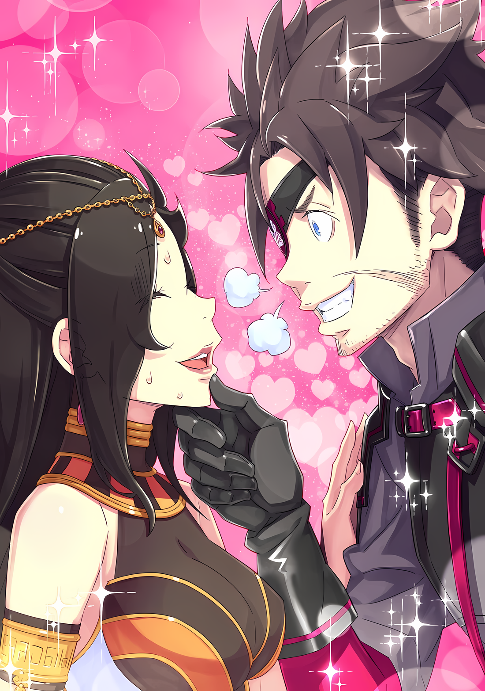

Субару: …………

Глядя на свое отражение в грубом зеркале, Нацуки Субару…… или, скорее, существо, которое называло себя так, — прищурив глаза, внимательно осматривал себя снова и снова.

Темные тени для век и тщательно завитые ресницы отражались в зеркале. Текстура их кожи… главное отличие мужчин от женщин…… была покрыта белой пудрой; губы были накрашены пурпурным цветом, что придавало им свежий вид.

Костюм оказался довольно сложным, но ему удалось замаскировать свое телосложение, надев много свободной одежды, несмотря на то, что ему с трудом удалось добиться стиля, соответствующего южному климату.

Во всяком случае, на этот раз ему придется вести себя не как дочь дворянина, а более свободно и непринужденно…… как странствующий артист. Поэтому, помимо жестов, внешний вид должен быть более «Женским», чтобы соответствовать дизайну.

Субару: Я собираюсь прижать как можно больше своего тела к груди и наполнить ее до предела….

Он использовал все техники, какие только мог придумать, мысленно представляя себе все встречи, которые у него были до сих пор.

Начиная с Эмилии, затем Фельт и отвратительной Эльзы, за ними Рам и Рем, еще Беатрис с Петрой, оставив в стороне только Мейли. Затем Присцилла, Круш, Анастасия, а также Феррис, на которого он должен равняться как на наставника, также не стоит забывать и Фредерику. Затем шли Ведьмы, хорошо одетые только внешне, что раздражало…… он собрал свое представление о «Красоте» из всех красивых девушек и женщин, а также красивых существ, похожих на девушек, которых он встречал в этом альтернативном мире до сих пор.

……Показываться самой красивой версией самого себя было его главной задачей.

Ему не нужно было думать ни о чем другом, кроме своего видения.

Он сделал лучшее, что мог, используя то, что у него было под рукой, и прибыл в то место, где ему нужно было быть.

Поэтому……

Субару: ……Это я.

Его взгляд покинул зеркало, затем он медленно сделал глубокий вдох и повернулся.

Один, после долгих часов борьбы в одиночестве, он, наконец, открыл дверь. За ней он увидел своих друзей, затаивших дыхание в ожидании успеха или провала этой миссии.

Женщины обратили свое внимание на Субару, когда он открыл дверь и вышел.

Субару: …………

Воцарилась тишина, и он чувствовал напряженную атмосферу.

Его непосредственная тревога не позволяла ему понять, какая эмоция вызвала тишину. Конечно, ему не хватало нескольких козырей для игры. Если бы у него было то и это, его сожалениям не было бы конца.

Однако, если подумать, не в том ли дело, чтобы проявить инициативу?

Нельзя всегда идти в бой в идеальном состоянии. В любом случае, в жизни нужно играть теми картами, которые выпали, не так ли?

И тут он обнаружил, что оправдывается, как будто уже проиграл битву.

???: ……Потрясающе.

Он услышал слабый звук вырывающегося воздуха и посмотрел вверх.

Там он увидел, что на самом деле это оказалось совсем не тем, что он себе представил. Это был всего лишь звук сближающихся рук. Это был звук аплодисментов. Это была смесь поздравлений, восхищения и уважения.

Субару: Ми….

Он посмотрел на хлопающего человека и уже собирался воскликнуть в манере, не подобающей даме, но вовремя остановился.

Он все еще был неполным. Он осторожно поднес руку к горлу и выпустил воздух небольшими струйками. Затем, когда в его голове защелкали шестеренки, он улыбнулся

Субару: Мизельда-сан.

Мизельда: ……Кх, не может быть, твой голос*? Какого… как… каким…!?

*Субару с момента переодежки начал использовать женственную и вежливую речь, а так же манеры.

Субару: Как только я решила что-то сделать, мой долг — сделать все возможное из этого «что-то». Есть жизни, которые могут быть спасены, если я не буду срезать углы. Если это так, то я должна сделать только одну вещь.

Мизельда: Ооо…!

Улыбка исчезла, и он поднял один палец к небу.

Из-за тесной чащи деревьев он не мог видеть солнце, но ему нужно было показать это не небесным существам, а многочисленным друзьям, собравшимся здесь.

Посмотрите на него, с головы до ног.

Неважно, спереди, сзади, справа, слева или в любом другом месте.

……Он должен постоянно представлять себя самой красивой.

Если он сумеет проследить этот образ, сумеет воссоздать идеал, тогда ему нечего будет бояться.

Здесь, с авторитетом……

Субару: ……Приход Нацуми Шварц.

Это то, что Нацуми Шварц героически…… вернее, провозгласила как леди.

Мизельда, женщина, которая перестала хлопать перед ним, глубоко кивнула. Затем она встала в ряд рядом с Нацуми, поддерживая его спину рукой

Мизельда: Мой мир был слишком тесен. Ты был прав, Субару… Нет, Нацуми.

Субару: Теперь ты понимаешь, не так ли, Мизельда-сан?

Мизельда: Ахх, это расстраивает, но теперь я понимаю… Красоту можно сделать.

Мизельда опустила уголки глаз и мягко улыбнулась, а Нацуми ей в ответ.

Собравшиеся там судракийки тоже переглянулись, став свидетелями этой прекрасной сцены. Затем посыпались аплодисменты, ставшие запоздалым благословением.

Аплодисменты продолжали литься, поздравляя Нацуми с ее открытием.

А затем……

???: Что это?

???: Ах~

Те, кто не мог прийти в себя, смотрели на эту сцену с нахмуренными щеками.

△▼△▼△▼△

Субару: И вот, рождение Нацуми Шварц. Я была немного растеряна, поскольку разные инструменты для макияжа и все такое, но мне удалось сделать так много.

Рем: Ты шутишь?

Субару: Э!?

После возвращения на место встречи и проведения очередного собрания, Нацуми… вернее, Субару ответил на слова Рем, ее взгляд был холодным, а тон — ледяным.

Холодное отношение Рем не изменилось даже после того, как он показал ей результаты. Субару указал на свое лицо и сказал:

Субару: Мне все-таки нужны накладные ресницы… Для парика. Мне удалось позаимствовать немного черных волос у судракиек…

Рем: Я не об этом. Я думаю, что макияж и парик сделаны хорошо. Но ты не должен вечно говорить как женщина.

Субару: Да, но… душевное состояние тоже важно, не так ли? Если я не буду осторожна на регулярной основе, я никогда не знаю, где я могу сорваться. Кроме того….

Рем: Кроме того?

Субару: Если я буду потакать тому, что я мужчина, богиня красоты отвернется от меня и… Ай-ай-ай!

Как раз в тот момент, когда Субару собирался говорить серьезно, Рем сильно дернула его за ухо.

Не удержавшись от слез, он быстро отошел в сторону. Субару решил проскользнуть поближе к Мизельде, которая наблюдала за происходящим.

Субару: Сестричка Мизельда-сама, я боюсь Рем-сан….

Мизельда: Умм, не плачь, Нацуми… Странно, но ты выглядишь так мило, хотя я знаю, что ты Субару. Таритте стоит поучиться у тебя.

Таритта: Сестра!?

Пока сестра гладила Субару по голове, Таритта закатила глаза на безжалостный комментарий Мизельды.

Однако лицо Таритты было гораздо мягче, чем обычно. Это было потому, что Субару изменил тяжелый грим, который она обычно носила, и который можно было назвать боевой раскраской «Племени Судрак», чтобы она выглядела более милой.

Судракийки были известны своей храбростью и силой, но на этот раз от них требовалось быть одновременно гламурными и опасными, с магическим и чувственным качеством, способным свести мужчин с ума.

Наносить макияж Таритте и Куне было очень весело, как только они решили направить свою косметику в это русло.

Субару: У тебя гораздо более молодое лицо, чем я ожидала, сестричка Таритта-сама. Твой макияж выглядит великолепно, приятно время от времени демонстрировать свою миловидность.

Таритта: Пожалуйста, не дразни меня! Во-первых, я не могу быть такой же красивой, как ты….

Субару: Ну, твоя неуверенность тоже мила! Правда, сестричка Мизельда-сама?

Мизельда: Да, дорогуша.

Щеки Мизельды расслабились, когда Субару наклонился к ней и тихо заговорил. Таритта вздрогнула при виде этих двоих и обернулась с легким румянцем на щеках.

Из-за смуглой кожи трудно было заметить, что ее щеки покраснели, но макияж на глазах и губах создавал впечатление легкого румянца, поэтому было легко заметить очаровательную перемену в ее внешности……

Рем: Когда же ты перестанешь дурачиться!?

Рем одним криком разрушила столь цветастую сцену.

Субару и Таритта сжались, как от порыва ветра. Рем посмотрела на них своими бледно-голубыми глазами, а затем взглянула на Куну, стоявшую на краю комнаты.

Куна, которая, как и Таритта, тоже была накрашена и причесана, отпрянула в сторону.

Куна: Ч-что такое, для протокола, я не имею к этому никакого отношения….

Рем: Куна-сан, я рассчитываю на тебя. Глядя на этих двоих, я вижу, что ты единственная, кто в здравом уме… Ты серьезно соглашаешься с этим планом?

Куна: Я знаю, что я единственная здравомыслящая, но….

Куна, собрав волосы в два хвоста, смотрела на Субару и Таритту с немотивированным выражением в глазах.

Это была неприятная оценка, но Субару мог только ждать, что будет дальше. Ее взгляд говорил ему, что он безумен, и этим отличался от Таритты, которая тряслась от шока.

Куна выдохнула, наблюдая за реакцией Субару и остальных.

Куна: Причина, по которой он не мог выполнить миссию, исчезла, ты ведь тоже это понимаешь, Рем? У Нацуми… У Субару нет проблем. Да, он больше женщина, чем вождь.

Рем: По-моему, это слишком грубо так говорить о Мизельде-сан….

Куна: Я не думаю, что это проблема. Проблемой будут наши результаты…

И как раз когда Куна почти закончила отвечать на вопросы Рем,

???: ……Похоже, все здесь.

Куна: Ох, легок на помине….

Напыщенный, не обманывающий тон голоса окутал зал собраний, и появилась новая фигура.

Когда взгляд Куны обратился в ту сторону, у Рем не было другого выбора, кроме как повернуться в том же направлении. Естественно, взгляд Субару, Мизельды и остальных тоже устремились туда.

Все: …………

В этот момент время остановилось для всех.

……Нет, если быть точным, время остановилось для всех, кроме появившейся фигуры и Субару, который наложил на них макияж.

Субару: Я оставил тонкую настройку на тебя, но… ты так хорош в этом, что это почти отвратительно.

Абел: Меня не радует, когда хвалят мои навыки нанесения макияжа. Тем не менее, твои навыки впечатляют. Так что даже готовый продукт может стать совершенно новым, хах. Это выглядит даже лучше, чем я себе представлял.

Субару: Кху, моя маржа для победы…!

Говоря это, Субару слегка покусывал мизинец в расстройстве.

Конечно, он не сомневался в том, что красоту можно сделать. Субару также с гордостью мог сказать, что доказал это на собственном теле, используя те несколько карт, которые были у него в руках.

Однако разница в материалах все же была.

Вот почему……

Рем: А… Абел-сан, верно?

Абел: Кто же еще? Не задавай такой глупый вопрос. Нет, если я так сильно изменился, то твое удивление вполне уместно для справки.

В ответ на дрожащие слова Рем, Абел…… или, скорее, Бьянка, существо, родившееся благодаря гриму, парику и смене костюма, — сжал пять тонких белых пальцев.

Его вороненые черные волосы были длинными и пышными, создавая идеальную гармонию с его красивым лицом и раскосыми глазами. Костюм танцора обтягивал его талию и расходился по ногам, показывая достаточно кожи, чтобы привлечь внимание.

Стоящий там прекрасный танцор, воссоздавший экстремальную красоту, — лучшая джокерная карта в руках, которая была необходима для этого плана.

Все: …………

Совершенство Бьянки было таким, что даже Мизельда и остальные потеряли дар речи.

Это отличалось от Нацуми Субару, где шок был от масштаба изменений. Это был чистый шок, вызванный совершенством красоты, которой Бьянка Абела обладала в избытке.

Судракийские драгоценности, украшавшие костюм и длинные волосы танцовщицы, служили лишь гарниром, подчеркивающим ее настоящую красоту.

Субару вспомнил улыбку на лице Мизельды, когда она одолжила их ему.

Почему-то при воспоминании об этой улыбке у Субару защемило сердце. Однако, заботясь о Мизельде и других людях, Субару не мог пойти на компромисс.

Как он мог сам разрушить это совершенство?

Эго Субару, как и Нацуми Шварц, не позволило бы ему такого.

Субару: Меня удивило, что ты не боишься краситься….

Абел: Что? Ты считаешь позором одеваться как женщина? К твоему сведению, я делаю это не в первый раз. В детстве я много раз проходил через такие вещи.

Субару: В детстве?

Абел: Да. Учитывая мое положение, я бы сказал, что неплохо владеть широким спектром способов защиты.

Губы Субару изогнулись при словах Абела, а не Бьянки, красивой женщины, которая очаровательно скрестила руки.

Возможно, его прошлый опыт относился к тайной вражде, которую он пережил, будучи кандидатом на пост следующего Императора, прежде чем занять это место.

В Волакии, где престолонаследие было гораздо более бурным, чем в Лугунике, легко представить себе возможность убийства в борьбе за то, кто станет следующим Императором.

Чтобы выжить в такой суровой жизни, ему иногда приходилось маскировать свою внешность и даже пол.

Готовность Абела идти на жертвы, в том числе и на свои собственные, похоже, была сформирована его детством, до того как он завоевал трон Императора.

Вот так и появилась в Абеле Бьянка, теперь переодетая в женщину.

Субару: Все-таки немного раздражает, что ты осознаешь как ты красива…!

Абел: Именно это и смешно. Как можно быть в положении, когда человек должен уметь смотреть на свою страну с широкой перспективы, и не уметь видеть себя объективно? Хотя ты, похоже, подмял под себя эту объективную оценку благодаря своим способностям, мне не нужны такие мелкие уловки.

Субару: Гах… кх.

Абел: Ты знаешь, почему тигры сильные? Тигры сильны, потому что они сильные.

Субару поразила концепция, которую он слышал от Гарфиэля.

Теория о том, что тигры сильны, потому что они тигры, стала приравниваться к тому, что Абел был красив, потому что он Абел. Это больше не было логикой насилия.

Это было то же самое, что сказать, что Райнхард был сильным, потому что он был Райнхардом.

Другими словами, это был тупой взгляд на мир.

Субару: Ну, в любом случае… Флора думает о том же, не так ли!?

Флоп: Не слишком ли вы торопитесь с выводами, Мистер?!

Позади Абела шел изумленный Флоп, теперь замаскированный под Флору.

Он тоже был одет, и обладал той красотой, которая, как знал Субару, сделает готовый продукт более совершенным, просто полностью используя потенциал его ресурсов. В отличие от Субару и Абела, его изначально длинные волосы были лишь слегка подправлены, так что можно было сказать, что именно он извлек из материалов наибольший шарм.

На самом деле, Субару был уверен, что если бы они стояли бок о бок, он бы не сильно уступал. Но……

Субару: Есть разница в количестве затраченного времени и усилий… Должно быть, это божественный фаворитизм…!

Флоп: Мне жаль слышать твои сетования, но ты отлично выглядишь, Мистер. Ты больше не Мистер, ты Мадам!

Субару: ……Меня больше не устраивает такой комплимент.

Флоп: Это был комплимент? Я не знал, что это комплимент.

Откровенность Флопа не изменилась, даже если он стал Флорой. Как ни крути, в его случае это было нормально. Хотя, чтобы следовать указаниям плана, ему потребовалось бы некоторое руководство.

Однако в данной ситуации Абел был наиболее важен.

Субару: Флора и я умеем играть на инструментах. Поэтому твоя роль….

Абел: Танцы, хм. Мне не нужно, чтобы мне говорили, у меня в голове есть план. Важность моей роли такая же. Кроме того…

Субару: Кроме того?

Абел: Я не так превосходен в танцах, как моя умершая сестра, но я довольно близок к этому.

Его щеки порозовели, и даже его торжествующая, высокомерная улыбка была прекрасна.

Уверенный настрой Абела обнадеживал, и в то же время заставлял сердце Субару гореть от предвкушения. На самом деле, Абел без сожаления продемонстрировал свою дьявольскую сущность, будучи полной Бьянкой.

Если самоанализ Абела был верным, Субару мог возлагать большие надежды и на танцы.

Субару: ……Хорошо. Если ты так уверен в себе, покажи мне, насколько ты хорош. В конце концов, ты не сможешь вернуть назад то, что выплюнул.

Абел: Что я выплюнул, а…? Хммм, ты имеешь в виду, когда на тебя плюют облака? Это довольно окольный способ сказать это, но он прекрасен. Я покажу его тебе.

Субару: …………

Абел: Это самое малое, что я могу сделать, чтобы вознаградить тебя за то, что ты предложил этот план.

Высокомерие Абела не уменьшилось, даже когда он переоделся в женщину, как будто он никогда не сомневался в себе.

Чувствуя одновременно успокоение и угрозу, Субару мягко посмотрел на Рем. К сожалению, он не мог позволить ей сопровождать его в его же плане.

Но все же……

Субару: Пожалуйста, молись за мою безопасность. Я сделаю все возможное для тебя.

Рем: ………………………………Да.

Субару: Тебе понадобилось достаточно времени, чтобы помолиться, не так ли!

Субару закричал на запоздалый ответ Рем, который выглядел искренне озадаченным.

Луис, сидевшая рядом с Рем, напряженно приподняла подбородок, услышав это. Казалось, даже она не могла признать Нацуми в Субару.

На данный момент, эта реакция убедила его в том, что он получил некоторый импульс для выполнения миссии.

△ ▼ △ ▼ △ ▼ △

……«Операция Кумасо Такеру».

Так называлась операция, направленная против Зикра Османа, «Бабника» и Генерала Второго класса Империи.

Название операции было предложено Субару по мотивам сказки из Кодзики, и, к счастью, никто не стал возражать.

Неизвестно, уважали ли они Субару, придумавшего этот план, или же всем вообще было наплевать на название операции, но хорошо, что не было никаких проблем из-за этого.

Во всяком случае, в плане, в котором неизбежно присутствовал элемент удачи, не было смысла.

Конечно, они приложили бы все усилия, чтобы повысить свои шансы на успех, но приумножить удачу было трудно. Однако получить благоприятное условие, пусть даже небольшое, было не так уж плохо.

……Покинув Джунгли Будхейм, группа взяла курс на Гуарал.

Пятью членами группы были Нацуми Субару, Бьянка Абела, Флора Флопа, Таритта и Куна. Остальное «Племя Судрак» возглавляла Мизельда в отдельной партии, среди них были Рем, Луис и Медиум.

Скрываясь вдали от города, они должны были атаковать стены города-крепости и действовать в качестве отвлекающего маневра, если возникнет необходимость. Однако это была лишь страховка.

Менее чем идеальная страховка на случай, если план провалится. Если бы план провалился, Субару и остальные оказались бы в очень опасной ситуации.

В любом случае……

Субару: Лично я думаю, что первая контрольная точка — самая важная.

Субару пробормотал это, глядя на главные ворота, которые смотрели на них с высоты.

Они собирались снова бросить вызов главным воротам, через которые они уже однажды пробивались, хотя это произошло несколько дней назад. Естественно, после того, что произошло на днях, уровень безопасности на контрольно-пропускном пункте был выше, чем раньше.

Готовясь к новому вторжению мятежников, особое внимание уделялось драконьим повозкам, телегам с волами и другим транспортным средствам, которые могли скрывать людей в своем грузе. Он слышал крики торговцев и путешественников, когда их орудия торговли калечили, телеги переворачивали, а солому тщательно протыкали мечами.

Честно говоря, ему было очень жаль их. Однако, учитывая хаос, который будет твориться в городе впереди, он подумал, что с их стороны было бы разумно повернуть назад.

Конечно, он никак не мог дать им такой совет, но……

???: ……Следующие, что насчет вас, ребята?

Суровый мужской голос ударил по барабанным перепонкам Субару, пока он размышлял.

Подняв глаза, он увидел лысоголового стражника с крепким телосложением, который манил его к себе. Мужчина позвал группу вперед, и Субару почтительно склонил голову во главе группы.

Субару: Мы — труппа странствующих артистов. Мы пришли в этот город с севера.

Стражник: Оо, странствующие артисты….

Подняв бровь в любопытстве, стражник также посмотрел на группу позади Субару.

Флора, неся на спине музыкальный инструмент, махала рукой; Таритта, неся на спине свой багаж, кланялась; Куна накрыла зонтиком человека рядом с собой, чье лицо было закрыто вуалью, не позволяя никому увидеть ее выражение.

Чувствовалось восхищение стражника такой довольно атмосферной группой.

Субару: …………

С другой стороны, сохраняя приветливую улыбку, Субару внутренне напрягся.

Он был знаком с этим стражником. Именно он отвечал за главные ворота, когда Субару впервые встретил Флопа и Медиум при входе в Гуарал.

Другими словами: он не мог быть самым лучшим выбором для их первого препятствия.

Стражник: Но приехать с севера, должно быть, было непросто. Ходят слухи, что на территории «Раскаленной Леди» кипит жизнь. Вокруг летают стаи драконов.

Субару: Да, да, это правда. Вот почему мы не могли оставаться там на слишком долго… С другой стороны, этот город защищен такой величественной стеной, так что я уверена, что здесь безопасно, верно?

Стражник: Ухх~, ну……

Когда Субару пофлиртовал, слабо улыбаясь, выражение лица стражника стало неуютным.

Причиной его реакции, вероятно, было то, что он знал, что Имперские солдаты, чей лагерь был сожжен дотла, бежали в город. Кроме того, переполох, вызванный Субару и его спутниками в тот день, вероятно, заставил Имперских солдат в городе быть более бдительными, а атмосферу — напряженной.

Это и стало причиной невнятной речи стражника.

В таком случае, не было причин не воспользоваться этим.

Субару: ……Вы, случайно, не обеспокоены чем-то в этом городе?

Стражник: ……Да, вроде того. Это то, что легко обнаружить, даже если попытаться скрыть. На самом деле, в этом городе сейчас расквартирована Имперская армия, и у них проблемы с племенами на востоке. Так что….

Субару: О божечки! В городе, должно быть, душновато.

Стражник: Верно.

Стражник наклонился вперед от слов Субару.

Несмотря на то, что их трудно различить, когда они не общаются друг с другом, стражники и солдаты в основном занимали разные должности. Стражники в городе принадлежали только этому городу. Солдаты, с другой стороны, принадлежали стране, в данном случае Империи. Субординация у них также была принципиально разной.

Стражник перед ним также принадлежал к этому городу и был обязан его защищать.

Однако текущая ситуация была такова, что Имперская армия захватила ратушу, и стражникам было приказано делать то, что в их силах. У Имперских солдат не было никаких причин использовать их в качестве игрушки.

Стражник: Кроме того, они сами захватили городские таверны, назвав это «ночным патрулированием». А поскольку они плохо платят, это не способствует бизнесу. Я больше не могу с этим справляться.

Субару: О божечки, о божечки, как ужасно! Мое сердце сочувствует вам. Между нами говоря, у меня была своя доля тяжелого опыта с высокомерием Имперских солдат.

Стражник: Неужели? Такая красивая женщина, как вы…?

После того, как он бросил несколько согласных реплик, ответ стражника сразу же смягчился от глубокого и громкого одобрения Субару. На самом деле, мужчина казался довольно дружелюбным, поэтому Субару слегка понизил голос, затем сказал: «Да», и повернул голову, чтобы посмотреть в сторону.

Увидев этот многозначительный жест, стражник сказал: «О, мисс?», после чего смутился.

Стражник: Вы в порядке? Если не хотите говорить, то не беспокойтесь….

Субару: Нет, я в порядке. Это старая-старая история. Просто раньше меня насильно схватили Имперские солдаты, посадили в клетку и обращались как с рабом.

Стражник: Это…

Субару: Они иногда делали такие вещи, как намеренно раздвигали ноги, чтобы я споткнулась и упала, а в другие времена они даже угрожали мне клинками….

Стражник: Это непростительно…!

Стражник сжал кулаки в праведном негодовании, пока Субару со слезами на глазах рассказывал о своем прошлом.

Видя, что уши мужчины покраснели от ярости, Субару тихо пробормотал: «Вы так добры».

Стражник: Нет-нет, я не пытаюсь быть добрым. Любой бы почувствовал то же самое, что и вы.

Субару: Тогда, хэй, Стражник-сама. Если вам жаль меня, пожалуйста, впустите меня. Если да….

Страж: Что тогда?

Субару: Тогда я изменю атмосферу этого города, которую Имперская армия сделала такой мрачной.

Его голос был тихим, но энтузиазм в нем был страстным.

Услышав это, суровое лицо стражника покраснело от удивления. Его взгляд обратился к труппе странствующих артистов, выстроившихся позади Субару.

Стражник: ……Дамы, какие именно искусства вы собираетесь нам показать?

Субару: Конечно, мы путешествовали по всему миру и научились многим различным искусствам. Я также люблю петь, играть на музыкальных инструментах и немного колдовать. Но….

Стражник: …Гк.

Субару: Лучшая часть шоу — танец цветка нашей труппы… великолепной танцовщицы.

С этими словами Субару указал на стоящую в центре группы фигуру, защищенную зонтиком. Ее лицо было скрыто вуалью, и она была главной достопримечательностью труппы.

Глаза стражника расширились и напряглись, когда он взглянул на нее из-за вуали.

Его горло замерло, хотя не все было открыто.

Стражник: …………

Это было естественно — быть ослепленным и не иметь возможности двигаться.

Это был шедевр, который разочаровал бы даже Субару. «Красоту можно сделать», — смело заявил он, но истинная красота была творением Бога.

В конце концов, красота Субару по сравнению с этим была не более чем штриховой работой.

Однако даже этого одного шага было достаточно, чтобы еще больше подчеркнуть его дьявольскую красоту.

Субару: В дополнение к танцовщице, мы также споем и сыграем для вас музыку. Мы надеемся, что вы позволите нам остаться в Гуарале.

Стражник: ……

Субару: Стражник-сама?

Стражник: …Ах, ах, точно. Я не вижу ничего подозрительного среди ваших вещей….

— пробормотал стражник, приходя в себя после того, как его слегка ущипнули за плечо. Затем он положил руку на грудь и оглядел группу, тихо дыша, чтобы проверить биение своего сердца.

И, насколько это было возможно, сознательно отводил взгляд, чтобы не быть завороженным этим дьявольским видом.

Стражник: Вы можете войти. Если вы собираетесь где-то выступать, лучше держаться подальше от главных ворот. Главная улица в центре города — хорошее место для начала. Ратуша слишком переполнена солдатами, чтобы быть подходящей кандидатурой.

Субару: Что ж, это очень любезно с вашей стороны… Когда стражник-сама будет свободен?

Стражник: О, я? Моя смена заканчивается перед ужином в сумерках, а потом я пойду поем…

Субару: Тогда, пожалуйста, сообщите мне, где находится этот ресторан. Я уверена, что если вы приведете с собой кого-нибудь из своих коллег, мы сможем отблагодарить их за гостеприимство по отношению к нам.

Он осторожно наклонился и прошептал это на ухо стражнику.

Когда стражник удивленно поднял глаза, Субару улыбнулся ему и отошел в сторону. Затем он повернулся к своим товарищам по труппе, нетерпеливо ожидающим на контрольно-пропускном пункте

Субару: Ладненько, поехали, ребята. Давайте в качестве подарка разрядим атмосферу в этом городе.

С этими словами Субару повел людей, которые остановились на месте, и прошел мимо стражника.

Зажав уши и изумленно глядя на стражника, Субару и остальные гордо и беспрепятственно прошли через главные ворота в город.

Наблюдая за ними, стражник тихо выдохнул……

Стражник: ……Стоит постараться закончить работу на сегодня как можно скорее.

Он проговорил это.

Флоп: Ну, это было великолепно, Мадам! Я начинаю думать, что, возможно, у тебя больше таланта торговца, чем у меня!

Через несколько мгновений после прохождения через главные ворота с багажом, Флоп, он же Флора, с блеском в глазах похвалил поведение Субару на контрольно-пропускном пункте.

В его откровенных словах не было лжи, и Субару радостно кивнул.

Субару: Да! Я польщена твоей похвалой. Но я отнюдь не торговец. У меня есть свои дела, которыми я должна заниматься.

Флоп: Дела, которыми ты должна заниматься? Например?

Субару: Конечно, дело не в том, чтобы быть леди… а в том, чтобы помогать важным для меня людям.

Флоп: …………

Глаза Флопа слегка расширились, когда он услышал слова Субару. Однако он быстро опустил взгляд и кивнул, «Ну, да».

Флоп: Тогда мы должны осуществить этот план и успокоить миссис как можно скорее.

Субару: И Флора, мы же не хотим, чтобы мисс Медиум чувствовала себя неловко?

Флоп: Хахахаха! Моя сестра никогда не будет волноваться. Моя сестра — очень сильная девушка, как физически, так и морально. Я не могу представить, чтобы она чувствовала себя подавленной!

Субару согласился с Флопом, который весело улыбался, хотя и не по-доброму.

Как и Флоп, он тоже не мог представить, чтобы Медиум чувствовала себя подавленной. Эти брат и сестра должны были помочь друг другу пережить тяжелые времена.

Поэтому Субару был обязан помочь этим двум людям.

Субару: Все труднее и труднее ошибиться, не так ли?

???: Подожди, пожалуйста, подожди, Субару… Нет, Нацуми.

Субару напрягся, когда услышал слабый голос сзади.

Обернувшись, он увидел, что это была Таритта, которая несла багаж группы. Она была не похожа на себя, так как после выхода из джунглей Таритта изменила свой макияж.

Вместо судракийского наряда амазонки она носила более трепетную одежду, и теперь ее образ напоминал экзотическую этническую танцовщицу.

Наряд был менее откровенным, чем обычно, но когда Таритта огляделась вокруг, ее щеки покраснели от смущения,

Таритта: Эй, разве это не привлекает внимание? Если есть что-то странное в нас с Куной….

Куна: Не втягивай меня в это, пожалуйста. Если вы говорите о чем-то странном, то нет никого более странной, чем Нацуми. Что это, черт возьми, было с тем контрольно-пропускным пунктом? Ты слишком хорошо разбираешься в мужчинах.

Рядом с взволнованной Тариттой, Куна трогала Субару со своей обычной низкой интенсивностью.

После этих слов Субару приложил руку к щеке со словами «О божечки»,

Субару: Это не первый раз, когда я имею дело с джентльменом. И не волнуйся, Таритта-сан. Дело не в том, что ты или Куна выделяетесь. Это все мы выделяемся… Потому что мы красивые.

Флоп: Потому что мы красивые!

Глубокомысленно кивнув, Флоп и Субару согласились.

В ответ Таритта недоверчиво произнесла: «Красивые… красивые…».

Таритта: Если ты собираешься использовать такие слова, то скажи их моей сестре….

Флоп: Что ты хочешь сказать, мисс Таритта? Твое обаяние и обаяние твоей сестры — это две совершенно разные вещи. Во-первых, я ни в коем случае не пренебрегаю своим восхищением мисс Мизельдой, когда говорю тебе комплименты. Она — совсем другое дело, и вы обе находитесь в совершенно разных категориях!

Таритта: ……Кх!

В одно мгновение Флоп взял Таритту за руку и сказал это с лучезарной улыбкой.

Глаза Таритты расширились от его энергичности, а рот медленно открылся и затем сразу же закрылся. Когда румянец на ее щеках усилился, Субару закрыл рот рукой и произнес «О божечки».

Куна: Дайте мне передохнуть. Таритта особенно привязана к вождю и почти никогда не покидала лес. Поэтому она не очень толерантна.

Субару: Ну, она улыбается. Но ты-то спокойна, верно?

Куна: Я чаще всего тайком выхожу из леса, и у меня никогда не было большой и грозной сестры…… У меня есть младшая сестра, которая весьма несносна.

В глубине закрытого сознания Куны, этим человеком, вероятно, была Хоули.

Они были как сестры, как лучшие подруги, как родитель и ребенок. Однако слова Таритты нельзя было игнорировать.

???: …………

Вокруг них внимание, конечно же, было приковано к переодевшемуся Субару, идущему по улицам мимо контрольно-пропускного пункта.

В дополнение к их необычному одеянию, весь город был в напряжении, так как Имперские солдаты были в состоянии повышенной готовности. Естественно, жители города должны были с большим подозрением относиться к незнакомцам.

Если это так, то……

Абел: ……Это возможность.

Субару: Только для любопытных глаз, не так ли?

Под зонтиком, из тени вуали, острый взгляд пронзил профиль Субару.

Подтолкнув его прекратить нести чушь, Субару ответил знойным «Да». Однако он согласился с танцовщицей, что это хорошая возможность.

Поэтому….

Субару: Давайте последуем совету стражников и дебютируем на главной улице!

Флоп: Хорошо, Мист… Нет, Мадам Нацуми!

Флоп последовал за Субару, решив начать выступление с шумихи прямо на месте.

Они сняли часть своих костюмов, обнажив плечи, животы и спины. Затем они вышли, держа в руках по инструменту, и встали по бокам главной улицы.

А затем……

Субару: Проходите, заходите и посмотрите! Сейчас я покажу вам песню и танец, которые передаются из поколения в поколение по всему миру, из-за Великого водопада на дальнем Востоке! Это выступление странствующей труппы, которая сегодня приехала в город!

Субару громко продекламировал рекламную строчку, а затем Флоп, получив зрительный контакт, начал играть на люлире…… струнном инструменте, который держал в руке.

Легкие звуки объединились в музыку, что привлекло еще больше внимания людей, которые услышали ее.

???: Оо, что происходит?

???: Они говорят, что это странствующие артисты! Музыка, музыка!

???: Ух ты, какая коллекция красавиц…

Люди, идущие по улице, привлеченные словами Субару и музыкой Флопа, останавливались или выглядывали изнутри зданий, привлекая внимание труппы.

Субару и Флоп играли на ведущих инструментах, а Таритта и Куна — на более простых ударных, таких как кастаньеты.

Субару был достаточно благодарен, так как Флоп оказался более искусным, чем ожидалось, поэтому у него не было никаких проблем с музыкой. Более того, шансы на победу составляли примерно пятьдесят процентов.

Субару: С этого момента мы будем петь и танцевать историю из другого мира, далекого-далекого! Это история о людях, драконах, демонах и странных существах, которые невозможно выразить словами. Пожалуйста, все расслабьтесь и наслаждайтесь от души!

С улыбкой на лице и взволнованным тоном голоса, предвкушение нарастало, пока выступление Флопа и Субару достигло своей первой кульминации.

Все были в восторге от их выступления и красоты музыкантов, но настоящий момент наступил сразу после этого.

И вот, когда музыка достигла своего апогея……

???: …………

Черноволосая танцовщица медленно сняла тонкий шелк, в который была одета, и вышла на улицу.

Подняв вуаль одной рукой и открыв свое лицо, люди, слушавшие музыку, обратили свои взоры в ее сторону, так как их охватило чувство шока, похожее на удар в живот.

Да, это было оно. Он хотел такой реакции, такого взгляда, и все же он был расстроен.

Субару: Это так обидно.

Играя на своем инструменте, Субару выразил свое внутреннее разочарование от того, что его побили.

В глубине души он чувствовал себя побежденным. Но это должно быть приятно — быть побежденным кем-то такого высокого уровня. Но это была ложь. Чувство поражения в конечном счете было чувством поражения, и это расстраивало.

Однако это спокойствие перед тем, как все превратилось в безумие, было ключом к плану.

Тогда, в полной мере, они смогут очаровать жителей Гуарала этим танцем.

Субару: Теперь твой черед, Бьянка!

Абел: …………

Посмотрев на Субару покрасневшим взглядом, Абел, он же Бьянка, медленно поднял руку.

Одно плавное движение, простое поднятие руки. Несмотря на это, в его жестах была элегантность, которая исходила из глубины его существа. Он растворился в воздухе и мгновенно стал доминировать на главной улице.

Начался плавный, красивый и торжественный танец.

Танец, сопровождавший музыку, был тем, что Абел освоил изначально, но с собственным поворотом Субару, вероятно, был новым для всех.

Тем не менее, он даже избавил от необходимости каких-либо манипуляций или мелких уловок.

С изменениями Субару, то, что раньше было прочным танцем, теперь стало намного лучше.

Все: …………

Зрители забывали дышать, так как их взгляды были поглощены прекрасным танцем. Это был крик красоты, который взывал к их инстинктам, он говорил им не отрывать глаз даже на мгновение. Говоря прямо, это было то, на что должны были смотреть глаза.

Танец Абела был высокомерным и напыщенным, он наталкивал зрителей на такие мысли.

……Он так и говорил: «Смотрите на меня».

Вид завороженной и ошеломленной толпы испугал Субару, хотя именно ему пришла в голову эта идея.

Если бы здесь был вор, стоящие вокруг люди открыто обыскали бы свои карманы и даже не заметили бы, если бы кто-то забрал их кошельки. ……Нет, это предположение не было верным, так как даже вор не смог бы оторвать глаз от танца Абела.

???: …………

Это была всего одна песня и танец, длившиеся менее пяти минут.

Исполнители сосредоточились на том, чтобы не допустить ошибок, но Субару задавался вопросом, заметил ли кто-нибудь, если бы они ошиблись. Честно говоря, он считал, что вряд ли.

Как только выступление закончилось, пятки и пальцы ног Абела встали на землю.

Увидев эту позу, зрители наконец поняли, что танец уже закончился, а Абел просто стоит на месте.

И тут же главная улица наполнилась аплодисментами и одобрительными возгласами.

Как Субару и надеялся, как он и рассчитывал, это был громкий отклик.

Однако, в отличие от Флопа, который держал свой инструмент и отвечал на аплодисменты, Субару улыбался толпе со смешанными чувствами.

Во всяком случае……

Абел: ……Хмм.

Он не знал, что сказать Абелу, который торжествующе улыбался ему.

△▼△▼△▼△

Репутация труппы в Городе-крепости Гуарал была определена большим успехом их первого представления.

Это была своего рода демонстрация на главном проспекте, но отклик оказался намного больше, чем они ожидали, и поэтому деятельность труппы после этого стала намного легче.

Однако……

Субару: Не забывайте, что мы оказались в центре внимания только из-за нашей новизны. Наше выступление — всего лишь поспешная попытка…… Наше выступление сейчас — всего лишь мимолетная причуда.

Флоп: Понятно! Другими словами, нам нужно постоянно работать над своими навыками, не так ли, Мистер?

Субару: Да. Вот почему мы должны работать без устали и быть начеку каждый день!

Субару крепко сжал кулаки, а Флоп, который сидел прямо, кивнул с улыбкой.

В отличие от своего громкого голоса, Флоп был очень хорошим слушателем и быстро отвечал. Потрясающе, но благодаря Флопу речь Субару набрала обороты.

В любом случае, Субару следовало говорить не с Флопом.

Субару: Вы двое! Не теряйте бдительности.

Таритта: О-о, теперь мы попали под перекрестный огонь.

Куна: Мы…?

Когда Субару указал на них, Таритта и Куна сразу же стали выглядеть недовольными.

В гостинице они сняли одежду, в которую переоделись, и вернулись к своему судракийскому стилю, который выглядел почти как нижнее белье. Пока они работали в труппе, они были прилично одеты, но как только они вошли в уединенный трактир, они выглядели именно так.

Субару: Ты слишком много бездельничаешь.

Таритта: Я не говорю, что мы не расслабляемся, но с другой стороны, как же она…?

Субару: Что ты имеешь в виду? Вообще, о чем ты вообще говоришь? Знаешь, меня раздражают эти разговоры без четкой темы.

Таритта: Нацуми, вот что. Зачем тебе притворяться тем, кем ты не являешься, даже когда никто не смотрит, мы с Куной не понимаем. Это действительно необходимо?

Субару: Притворяться тем, кем я не являюсь…?

Не имея ни малейшего представления, Субару ответил вопросительно, и Таритта с остальными опешили.

Естественно, «Это шутка», — сказал Субару, развеяв их удивление.

Субару: Тем не менее, я не могу принять эту мысль. Знаете, почему? «Дьявол кроется в деталях», как говорится, и именно бесполезные на первый взгляд детали создают реальность ситуации. Именно поэтому очень важно….

Флоп: Не срезать углы в местах, находящихся вне поля зрения общественности, вот что ты имеешь в виду. Хм-хм, как и ожидалось, Мистер…… Нет, Мадам Нацуми! Я многому учусь!

Флоп был поистине достойным учеником, ведь такой ответ стоил ста баллов.

Что касается замечания о том, что он не может избавить себя от использования мужского «Я» в качестве местоимения первого лица, как бы он ни старался; Куна в знак протеста посмотрела на Субару, но тот с улыбкой пропустил это мимо ушей.

……В тот момент Субару и его труппа странствующих артистов остановились в гостинице в Гуарале.

Прошло уже три дня с тех пор, как они начали свое проникновение, и за это время они выступили в общей сложности десять раз, получив более чем адекватный отклик.

Вначале он не нуждался в деньгах, так как у него была выручка от продажи рога Эльгины, но за каждое выступление продолжала капать хорошая сумма, так что Субару считал это очень выгодным предприятием.

Субару: Думаю, пора переходить к следующему этапу.

Нежно приложив палец к подбородку, Субару надеялся на изменения в их застойной ситуации.

На самом деле, их текущая ситуация складывалась настолько хорошо, что не верилось в происходящее. Каждое представление проходило с большим успехом, и горожане, включая стражников, проявляли большой интерес.

Это объяснялось совершенством танцев Бьянки, а также разговорными навыками Нацуми и Флоры.

Загадочность Бьянки также была привлекательной стороной, а поскольку она редко появлялась на публике, разве что танцевала, Нацуми и остальные, естественно, взяли на себя роль сборщиков информации.

Изначально планировалось, что Нацуми=Субару и Флоп=Флора возьмут на себя эту задачу, так как Абел, он же Бьянка, не мог говорить женским голосом.

Субару: Странно, но никто не подозревает Флору, верно? Она ведь даже не изменяла свой голос.

Флоп: Хаха, у меня нет никаких особых навыков, как у Мадам Нацуми. Но я долгое время путешествовал одина с сестрой. Может быть, я переняла некоторые привычки сестры или что-то еще, и это могло дать мне эту женственную ауру.

Субару: Значит, это от Медиум….

Флоп с радостью предложил свою новую теорию, но Медиум, появившаяся в мозгу Субару, была прекрасна внешне, а ее постоянно меняющееся выражение лица было очаровательным и милым. Однако теория о том, что ее присутствие повлияло на нынешнее совершенство Флоры, была спорной.

Абел: ……У тебя много времени, которое ты можешь потратить впустую, не так ли?

Субару: Хм.

Холодный, ледяной голос прервал разговор между Субару и остальными.

Это был Абел, танцор труппы, который сидел на стуле у окна без парика на голове и наконец решил присоединиться к разговору.

Абел день за днем танцевал в разных местах как звезда шоу, и хотя он старался этого не показывать, легкий намек на усталость был заметен.

Конечно, он никогда бы в этом не признался, но время, проведенное в Гуарале, давало тяжелую нагрузку на тело и разум. Находясь в тылу врага, они всегда были начеку. Субару, как и Нацуми, тоже постоянно напоминал себе, чтобы не терять спокойствия.

Никогда не знаешь, какая трагедия может их ожидать, если в тылу врага они впадут в уныние.

Поначалу эта стратегия была воспринята Рем и Мизельдой как шутка.

Однако Субару предложил этот план со всей серьезностью, и они вместе обсудили его, чтобы увеличить шансы на успех. Он не был настолько пессимистичен, чтобы сдаться и сокрушаться, что план провалился.

Поэтому……

Субару: Бьянка, почему бы тебе не отдохнуть? За все это время я ни разу не видела, чтобы ты спала.

Флоп: Я не понимаю, о чем ты говоришь, Мадам Нацуми. Это невозможно… а? А? Раз уж ты об этом заговорила, я тоже не помню, чтобы видела мисс Бьянку спящей.

Флоп попытался рассмеяться над замечанием Субару, но потом посерьезнел, заметив, что это правда. Не обращая внимания на Флопа, Абел фыркнул и проигнорировал его.

Сильное чувство осторожности не покидало Абела, и он не ослаблял бдительности с Субару и остальными.

Конечно, Субару понимал, что человеку в его положении нелегко открыться перед другими.

Но то, что он не мог показать никаких признаков расслабленности даже своим товарищам, которые вместе с ним выполняли это опасное для жизни задание, было более чем утомительно.

Как обычно, он даже не моргал обоими глазами одновременно, несмотря на то, что никто здесь ничего не сделает, если он закроет оба глаза.

Субару: Такой образ жизни утомляет, не так ли?

Абел: ……Неужели это ты мне это говоришь?

Абел нахмурился, глядя на Субару.

Услышав это, Субару был не в состоянии понять все это. Действительно, образ жизни Абела был удушающим, а Субару — нет.

Абел: Особенно жалко, что ты не осознаешь этого, но я прощаю тебя. Продолжай делать все, что в твоих силах.

Субару: Можешь не говорить мне, я буду продолжать жить. Что касается тебя….

Абел: Закрытие обоих глаз означает передачу права на жизнь и смерть другому. Я не отношусь к себе настолько легкомысленно, чтобы позволить этому случиться, даже на мгновение.

Субару: …………

Абел: Не теряй чувства напряжения, ты ведь сам это говорил.

После этой фразы, те слова, которыми Субару хотел ответить, были парированы.

Субару с горьким чувством уставился на профиль Абела, но его больше не воспринимали всерьез. Абел, снявший парик и украшения, носил в гостинице женские наряды, чтобы переодеться в Бьянку, как только что-то случится. Это было оправданием того, почему он так хорошо выглядит без парика, хотя без него он должен быть в неуравновешенном состоянии.

В этом и заключалась прелесть напряженной атмосферы, которая была результатом образа мыслей «Постоянно находящегося на поле боя», который Субару велел поддерживать остальным, включая Флопа.

И пока он думал о холодном профиле Абела……

Абел: ……Движение.

Субару: Что?

Пробормотав это, Абел встал со стула и пошел к своей койке. Субару был ошеломлен, увидев, как быстро он надел оставленный там парик. Однако смысл этого действия стал понятен сразу же.

Снизу донеслись громкие и несмелые шаги, и дверь в комнату Субару и остальных с силой захлопнулась.

???: Так вот где находится труппа путешественников. Открывайте. Это посыльный из мэрии.

Субару: Аах, минуточку, сэр!

???: Хаха, не смешите меня, я не жду, мы солдаты.

Хриплый голос насмешил запаниковавшего Субару, и дверь комнаты бесцеремонно распахнулась. Затем в комнату вошел человек, одетый в красно-черную форму солдата.

У мужчины на спине висели два меча, его лицо исказилось от радости, когда он скрывал свои жестокие порывы, один из которых Субару уже видел…… Джамал.

Субару: ….Хк

Джамал: Не пугайся так, я не собираюсь тебя есть.

Джамал щелкнул зубами на Субару, который непроизвольно вздохнул и напрягся. С повязкой на правом глазу, он окинул взглядом комнату одним левым, не пытаясь скрыть свое нерафинированное отношение и усмехаясь. Затем он посмотрел на Таритту и остальных в нижнем белье, которые не успели среагировать.

Позади него, кроме Джамала, стояли еще четыре солдата. Судя по всему, Джамал вел их за собой, и никто не осмеливался прерывать его грубый и жестокий стиль поведения.

Джамал кивнул головой в знак согласия, и его люди последовали за ним.

Джамал: Я вижу, у нас тут есть несколько прекрасных дам. Когда я слышал, как эти влюбленные бюрократы говорили об этом, я думал, что они преувеличивают….

Субару: Солдат-сама, что я могу для вас сделать…?

Джамал: ……Сейчас я говорю, женщина.

Напряжение в воздухе заставило Субару жевать внутреннюю часть рта. Джамал внезапно схватил Субару рукой за шею.

Не с намерением сломать ее, а мягко, чтобы помешать ему говорить… но все же ловкость его движения и сила захвата заставили Субару почувствовать, насколько велика разница в их способностях.

В конце концов, Джамал, несмотря на свою внешность и плохое отношение, был очень хорош в своем деле. До этого момента он был, вероятно, самым искусным человеком, на которого Субару положил глаз в Империи…… хотя страшный и сильный — это две разные вещи.

Джамал: У тебя хороший, вызывающий взгляд. Мне так нравятся эти острые глаза.

Субару: Аах, я польщена вашими комплиментами… Кх.

Джамал: Мне также нравится, что ты не слишком много говоришь. Как насчет того, чтобы пригласить тебя сегодня вечером в свою спальню и….

Иллюстрация к **Ранобэ** Том 27 | Разукрасил NorvakKK

Лицо Джамала было близко к лицу Субару, когда он смотрел на него соблазнительным взглядом.

Даже на таком близком расстоянии, он, казалось, не заметил истинной личности Субару. Это само по себе было приятно, но, похоже, это задело его сердечные струны в противоположном смысле.

Он и раньше получал подобные приглашения, но ему всегда удавалось избежать их с помощью улыбки и хорошей истории. Но когда речь шла об Имперских солдатах, отказываться было трудно.

……И тут подул сильный ветер.

Субару: ……Оох.

Неожиданно по комнате пронесся более сильный ветер, и черные волосы Субару взлетели вверх и пощекотали щеку Джамала. После мгновения раздражения Джамал перевел взгляд на окно и увидел стоящую там фигуру.

Это была та самая черноволосая танцовщица, которая вызвала переполох в Гуарале, она стояла там, откинув парик и расслабленно держась за локти. Поймав фигуру в лоб, Джамал удивленно присвистнул.

Это было великолепное проявление смелости, в то время как большинство людей застыли, восхищаясь ею.

Джамал: Хахаа, так это и есть танцовщица, о которой я так много слышал. Неудивительно, что ты смогла это сделать.

Абел: Хмф.

После того, как Джамал выпустил Субару со вздохом удивления и восхищения, он быстро подошел к Абелу. Он схватил его и заставил танцовщицу повернуться к нему лицом.

Даже не осознавая этого, он держал драгоценное лицо Императора в своей хватке, даря ему грубую улыбку.

Субару подумал, что именно это и имел в виду тот, кто говорил, что невежество — это блаженство.

Абел: …………

Джамал: Ты толстокожая женщина, в отличие от той. Но это тоже нормально.

Абел выпятил челюсть и спокойно смотрел на своего оппонента. Пока Субару был на взводе, Джамал фыркал, проявляя максимальное неуважение к Империи.

Затем Джамал развернулся, продолжая держать Абела за подбородок, и……

Джамал: Ликуйте, странствующие артисты! Я здесь, чтобы пригласить вас на пир в ратушу. Зикр Осман, Генерал Второго класса, который управляет этим городом, просит вашего присутствия.

Субару: Зикр Осман, Генерал Второго класса…!

Джамал: Ах, разве это не честь? Для странствующих артистов приглашение к Генералу Второго класса Империи.

……Субару подсознательно сжал кулаки.

Напыщенные слова Джамала превозмогли неучтивость сцены и вызвали у Субару шок от удивления и радости.

Зикр Осман, генерал второго класса! Казалось, что они поймали именно ту рыбу, которую пытались поймать.

Джамал: Не может быть, чтобы вы, странствующие артисты, отказали мне, верно?

Субару: Это…

Флоп: Конечно, нет! Мы надеялись подарить песни и танцы Имперским солдатам! Это был истинный смысл нашего путешествия!

Джамал: Хороший ответ! Мне это нравится.

Колебания Субару были омрачены более быстрым ответом Флопа.

Обаяние Флопа, которое позволяло ему открываться перед любым соперником, в полной мере проявилось здесь против Джамала.

Джамал, чувствуя удовлетворение от четкого ответа Флопа, быстро и грубо отпустил лицо Абела, а затем, пошатываясь, направился к выходу из комнаты.

А затем……

Джамал: Собирайтесь. Я отвезу вас всех в мэрию.

Субару: Чегоо? Если вы нас пригласили, мы бы хотели присоединиться к вам позж……

Джамал: Хахаха, не беспокойся об этом. Нам сказали доставить вас туда. Это и наша работа тоже. Ты можешь переодеться прямо сейчас. Я также попрошу своих людей сзади отнести ваши вещи.

Субару: …………

Джамал: Сегодня банкет только для «Генералов». Мы, ничтожные солдаты, можем надеяться только на большее после завтра. Так что….

Не собираясь отпускать их, вульгарный взгляд Джамала изводил всех в комнате.

Очевидно, они не могли позволить себе испортить его хорошее настроение. К счастью, Субару, Абел и Флоп были, по крайней мере, одеты как женщины.

Таритта и Куна, которым грозила наибольшая опасность, явно были женщинами, поэтому не стоило беспокоиться, что их неподготовленность сорвет миссию. Тем не менее……

Джамал: Не торопитесь.

Но от унижения, когда им пришлось убирать комнату, наблюдая, как они бесцеремонно переодеваются и собирают вещи, было трудно отделаться. Однако……

Флоп: Поняла! Давайте, все, давайте собираться! Мы не хотим заставлять солдат ждать! Давайте сделаем это правильно!

Субару: Флора…

Флоп: Это так не похоже на вас, Мадам Нацуми! Ни кровь, ни слезы вам не идут.

Субару: …………

Его кипящий гнев исчез в словах Флопа, который затем улыбнулся ему.

Слова, которые он потрудился добавить в конце, были восприняты как смелость напомнить Субару о цели «Бескровной Осады».

Субару: ……Да, ты права. Чтож, вы с Бьянкой готовьтесь! Тем более, что Бьянка — тупица, не умеющая ничего делать, кроме как танцевать!

Абел: …………

Воспользовавшись тем, что Абел не может говорить, Субару дал язвительную оценку Бьянке. Взгляд Абела уколол его, но Субару отмахнулся от него.

Он быстро убрал багаж в комнате, переоделся, чтобы подняться в мэрию, и заставил себя вести себя так, как хотел Джамал.

В лучшем случае, он мог только посвистывать и наслаждаться, наблюдая, как они переодеваются.

Субару был уверен, что самое большое потрясение и сожаление в жизни Джамала будет ждать его в тот момент, когда операция пройдет по плану.

Это была причина, по которой……

Флоп: Нет! Я не думаю, что нужно заходить так далеко, что нужно трясти задницей, Мадам Нацуми!

△ ▼ △ ▼ △ ▼ △

Даже на нетренированный взгляд в ратуше не было ничего похожего на военную технику.

Поскольку здание использовалось для управления городом в мирное время, было вполне естественно, что здесь не было подготовлено никакого военного оборудования. Тем не менее, в настоящее время в городе находилось более трехсот Имперских солдат, а с учетом стражников — более пятисот, так что оборонительных сил было достаточно.

Более того……

Субару: Нам удалось пробраться в их лоно, но….

Внутри здания Субару усмехнулся, взглянув на карту.

Операция «Кумасо Такеру» продвигалась неожиданно гладко.

Он надеялся, что если красивые странствующие артистки станут темой для разговоров в городе, генерал, известный как «Бабник», заинтересуется ими…… и в конце концов пригласит их на банкет, что позволит Субару и остальным захватить свою цель.

Получив приглашение прямо в мэрию, Субару увидел возможность осуществить свой план.

В то же время, однако, возникла другая проблема.

Субару: Нам придется провести операцию сегодня ночью….

Не было времени сказать об этом Мизельде и другим членам второго отряда.

Джамал, который приехал за Субару и остальными в гостиницу, не разрешил им вступать в контакт с внешним миром не из осторожности, а из-за своей испорченности.

Джамал был человеком хлопотным, поскольку обладал плохой интуицией, но компенсировал это хорошими навыками.

Даже в здании мэрии деятельность Субару и его команды была ограничена, и поскольку они не могли предпринимать самостоятельных действий по какой-либо причине во время собрания, им еще предстояло сообщить другой команде о планах на вечер.

Поэтому……

Субару: Нам нужно связаться с внешним миром из здания мэрии.

Существовала вероятность провала, но если операция Субару и остальных увенчается успехом, то необходимо будет разоружить остальных Имперских солдат в городе.

Естественно, для этого потребуется определенное количество сил, поэтому независимо от успеха или неудачи «Операции Кумасо Такэру», им нужно было быть в состоянии сотрудничать с внешним миром.

Вот почему ему пришлось пройти через множество проб и ошибок.

Субару: Не знаю, о чем она думает, но Бьянка ненадежна….

Звучало хорошо, когда он говорил, что сосредоточен на сегодняшнем банкете, но с тех пор, как их пригласили в мэрию и изолировали в зале ожидания, Абел молчал.

Конечно, он понимал, что сотрудничество с внешним миром определит успех или неудачу этого плана, но он не отреагировал на совет Субару.

Флоп тоже был чрезвычайно благосклонен, и, честно говоря, он очень помог, но он не представлялся подходящим человеком для обсуждения плана по разрушению мэрии. Прежде всего, Субару не хотел делать то, что могло бы причинить ему еще больше неприятностей.

Другими словами……

Субару: ……Я должен что-то с этим сделать.

Сжав кулаки, Субару зашел в туалет, куда его привели.

Субару и остальным было приказано не покидать зал ожидания, но, как и ожидалось, они никогда не запрещали им ходить в туалет. Тем не менее, они не могли вести себя безрассудно, так как ратушу немедленно наводнили бы Имперские солдаты, если бы они проявили хоть какое-то подозрительное поведение.

Субару взглянул на окна, но, к сожалению, не мог даже попытаться выйти наружу, поскольку они были снабжены железными решетками, а сам зал ожидания находился на третьем этаже здания.

Он не думал, что солдаты особенно опасаются Субару и остальных. Однако о том, чтобы оставить их совсем без охраны, не могло быть и речи. Это может быть проявлением империализма.

В худшем случае, Субару пришла в голову мысль пересмотреть решение о проведении операции сегодня на банкете.

Субару: ……Даже если бы мы могли пропустить банкет, мы бы не смогли избежать приглашения после него.

Это была труппа странствующих артистов с красивыми женщинами.

В первую очередь, когда речь шла о том, чтобы свалить так называемого «Бабника», легко было представить, что целью были танцы, исполнительское искусство и предстоящее ночное веселье.

Даже если бы ему удалось избежать ухаживаний горожан, ему было бы трудно отказаться от ухаживаний Имперского солдата, да еще и «Генерала». И он ничего не мог поделать, если бы они повели его в спальню.

В конце концов, это было всего лишь переодевание, и не существовало универсального руководства, что делать дальше.

Субару: То есть, если это случится, то игра закончится с плохой концовкой.

Поэтому ему нужно было во что бы то ни стало уладить все сегодня.

Кроме того, даже если каким-то чудом им удастся избежать сегодняшнего приглашения, если слова Джамала были правдой, завтра будет банкет, на котором будут присутствовать простые солдаты, а не генералы.

Простые солдаты…. это, конечно же, те, с кем Субару хотел встретиться меньше всего.

Субару: ………

Честно говоря, когда Джамал вошел в трактир, Субару подумал, что его сердце остановится.

Он почувствовал облегчение от того, что не узнал в Нацуми Субару, но это не отменяло всей опасности ……все еще оставался шанс, что он мог быть убит той стрелой.

Субару: Я не хочу называть это слишком большой надеждой, не так ли?

Это было тяжелое состояние души.

Он не хотел видеть его снова, но в то же время не хотел, чтобы он был мертв. Это было сложно.

Даже Субару знал, что в этом мире есть зло, которому нельзя позволять жить. Архиепископы Греха были одними из них, и все они означали непростительные грехи.

Поэтому, если бы это был Архиепископ Греха, Субару без колебаний позволил бы ему умереть. Но он не был одним из них; он был лишь объектом страха Субару, а не зла.

Прежде всего, если так рассуждать, то как быть с Луис, одной из Архиепископов Греха, которую он продолжал не замечать, не задумываясь?

Субару: ……Нехорошо. Сейчас мне нужно сосредоточиться на плане, лежащем передо мной.

Нелепо было беспокоиться о том, что его фундамент сейчас рухнет.

Вообще говоря, дело было не только в тональном креме. Хотя сейчас он был накрашен, его тело и разум все еще были в клочья.

Субару умел использовать то немногое, что было у него в руках, и именно это делало его особенным.

Субару: Я не могу оставаться здесь дольше, не так ли?

После тщательного обыска ванной комнаты он пришел к выводу, что, к сожалению, там нет ничего, что можно было бы использовать. Ему нужно было подумать о других способах связи с внешним миром.

Кроме того, перед туалетом его ждал стражник, который не давал им разгуливать внутри мэрии, и, кроме того, Субару очень не хотелось вызывать подозрения.

Возможно, им придется пересмотреть план. Если ситуация станет более острой, Абел может понять эту точку зрения.

Субару: Извините, что заставила вас ждать. Я немного нервничала.

Стражник: Хм, о, не волнуйтесь. Я просто нашел с кем поговорить.

Субару: С кем поговорить?

Когда Субару тихо вышел из туалета, солдат, поджидавший его в карауле, ответил. Казалось, он разговаривал с кем-то, кто проходил мимо, и тот, вздернув подбородок, оглянулся и сказал..,

???: ……О, так это вы танцовщица, приглашенная в качестве развлечения на этот вечер.

……Сердце Субару замерло, когда он увидел там лицо, которое он определенно не хотел видеть.

Субару: А, кх……

???: Хм? В чем дело? Ты выглядишь такой испуганной. Да ладно тебе, я не собираюсь тебя есть.

Видя, как дрожит горло Субару, другой человек рассмеялся и пошутил.

Это была шутка, которую он услышал от Джамала в гостинице совсем недавно. Но в отличие от Джамала, который произнес ее из-за своего грязного ума, на этот раз он не смог отмахнуться от нее.

Он хотел спросить, действительно ли тот не хочет его съесть.

Стражник: Что, ты что-то сделал, Тодд?

Тодд: Я? Не смеши меня, я ничего не мог сделать. Мои раны настолько серьезны, что я уже давно прикован к постели. Я едва могу ходить.

Стражник: Это тоже правда. Значит, она как будто физиологически недолюбливает твое лицо?

Тодд: Это довольно обидно….

Человек, почесывающий голову и дружелюбно беседующий с солдатом на страже…… Тодд.

Объект страха, который заставил Нацуки Субару больше всего опасаться, и тот, кто заставил его усомниться в моральности убийства тех, кто не принадлежит к Архиепископам Греха. Это было олицетворение кошмара, которое болтало перед ним.

Субару: ……Ах.

Ему нужно что-то сказать, подумал Субару, его мозг вращался на высокой скорости.

Молчать было нехорошо. Он не должен давать даже намека на подозрения. Тодд узнает и использует это как повод для нападения.

Ему не нужны были улики или доказательства. Если бы у него возникло подозрение, он бы постарался его подавить.

Поэтому……

Тодд: Эй, серьезно, что с тобой? Подожди, мы уже…

Субару: Аах, извини… просто…

Тодд: Просто?

Те же слова повторялись тихо, но его сердце, казалось, вот-вот перевернется.

Он хотел закончить разговор, сказав, что просто плохо себя чувствует. Но перед тем, как сказать это, он задумался, действительно ли все в порядке.

Болезнь была обычным оправданием, но это была бы ложь. Он чувствовал, что Тодд может видеть ложь насквозь.

Если бы Субару попытался использовать свои знания, полученные в «Посмертном Возвращении», Тодд понял бы его намерения и вонзил бы в него нож. Ложь была бы раскрыта. Определенно.

Лжи нужно избегать.

Ему было не просто плохо, Субару сейчас было трудно дышать….

Субару: Я немного, ну, боюсь……

Тодд: Боишься? Меня?

Субару: Не только тебя. Мне неприятно это говорить, но… меня привезли сюда слишком насильно.

Он отвел взгляд и старался не смотреть Тодду в глаза.

Каждое движение вызывало сомнения в голове Субару, когда он пытался понять, удалось ему это или нет. Он чувствовал, что если ему посмотреть в глаза, то его ложь будет раскрыта. Ему казалось, что если он солжет, то они увидят его насквозь.

Он не лгал. Он определенно боялся Тодда. Этот факт нельзя было исказить.

Услышав отчаянный ответ Субару, Тодд закрыл один глаз.

Тодд: То что она сказала… что их насильно привели сюда, кто это сделал?

Стражник: Я думал, это был солдат первого класса Орели.

Тодд: Ох, Джамал. Тогда понятно. Извини, если он тебя напугал.

Субару: Э……

Тодд, которого убедил обмен мнениями со стражником, сказал это и извинился перед Субару.

Когда Субару отвел глаза от его неожиданного отношения, Тодд почесал пальцами щеку.

Тодд: Я бы не сказал, что он плохой… парень. У Джамала плохой язык и характер, и он не очень умен. Но он не плохой парень. Он просто ведет себя как обычно.

Субару: Ха, ха….

Тодд: Если можешь, будь добра, откройся и прости его. Похоже, он будет моим зятем. Его ангельская сестра, которая совсем на него не похожа, — моя невеста.

Субару был озадачен словами Тодда, которые тот произнес с кривой улыбкой.

Судя по всему, Тодд не испытывал недоверия к словам или действиям Субару. Напротив, он, казалось, сочувствовал и был обеспокоен тем, что Субару связался с Джамалом.

Здесь Субару не смог скрыть своего удивления по поводу того, как он овладел искусством переодевания, и того, что его спас Джамал, который обычно был грубым и проблематичным.

Его дни, проведенные в погоне за красотой, когда он считал их напрасными, оказались не напрасными.

Даже сексуальные домогательства, которым он подвергался со стороны Джамала, оказались полезными.

???: ……А! Эй, Тодд, какого черта ты здесь делаешь!

Пока Субару размышлял об этом, по коридору разнесся гневный крик.

Это был Джамал, повышающий голос и делающий грубые шаги. Заметив приближение Джамала, Тодд приложил руку ко лбу.

Тодд: Упс. Ты нашел меня….

Джамал: Я тебя не находил! Парень с дыркой в животе должен отдыхать! Ты ведь думал, что нельзя доверять тому, чего не видишь глазами, не так ли?

Тодд: Нет-нет-нет, я доверяю тебе. Я доверяю тебе. Ты удивительно прилежен и хорошо делаешь свою работу. Но даже если они работают добросовестно, ошибки всегда будут ошибками, верно?

Джамал: Вот что я имею в виду, когда говорю, что ты доверяешь только своим глазам…!

Джамал щелкнул языком в ответ на слова Тодда, который поднял руки и пожал плечами.

Но когда Джамал, который приближался с фырканьем, заметил Субару рядом с Тоддом, выражение его лица сменилось с гнева на улыбку.

Джамал: О, ты та самая девушка из шоу, не так ли? Ты мне нравишься больше всех из них. Эй, если тебя не пригласят сегодня….

Тодд: Ах, да, да, достаточно.

Джамал, с задорным взглядом в глазах, протянул руку и попытался схватить Субару за плечо. Однако, из всех людей, именно Тодд остановил руку Джамала.

Тодд схватил запястье Джамала и сказал ему еще одно «Хватит», когда его щеки исказились.

Тодд: Ты пугаешь ее своим поведением. Эта девушка, которую я никогда раньше не встречал, вдруг испугалась, и это очень меня задело.

Джамал: Я вообще ничего не делал. Я не знаю, почему ты вообще меня перебиваешь… Не может быть, ты… с этой женщиной…!?

Тодд: Не шути так, Джамал. Твоя сестра — единственная для меня. Ты ведь знаешь это, верно?

Джамал: Это сложно для брата, когда ему говорят, что его сестра — чья-то единственная любовь….

Джамал пробормотал с ядовитым выражением лица, стряхивая руку Тодда.

Затем он взглянул на Субару, но то, как втянулись его щеки, казалось, отговорило его от дальнейших шуток.

Удивительно, но у Джамала тоже был здравый смысл. Или, может быть, у него хватило ума обидеться на то, что его напугал кто-то, кого он считал слишком милым.

В любом случае….

Тодд: Как бы то ни было, давай пойдем. Мы все равно не сможем присутствовать на сегодняшнем банкете.

Джамал: Я уже устал пытаться закрыть дыры в обороне города.

Тодд: Скучно не будет. Это гарантия, гарантия. ……Вот откуда придут враги, безусловно.

С усмешкой, резкие слова Тодда царапнули грудь Субару.

В душе он похвалил свой выбор, думая, что идея использовать тайный путь была продумана до мелочей. Затем, похвалив себя……

Тодд: Кстати, как тебя зовут?

Субару: …………

Субару не был уверен, что Тодд заметил его рассеянность.

Вопрос, заданный с прищуром, заставил Субару всерьез подумать, что он потеряет сознание.

Его спросили, как его зовут. Почему, почему, почему, почему, — бушевали вопросы.

Разве он не спросил бы хотя бы его имя? ……Нет, Тодд не стал бы спрашивать. Именно поэтому Рем с самого начала опасалась Тодда. Из-за плохих отношений с ним Субару не стал обмениваться с ним именами и в этот раз. Должен ли он назвать свое имя, или нет, что ему делать?

Тодд: Пожалуйста, просто скажи мне.

После повторения просьбы Субару ахнул.

Смирившись с тем, что не сможет вытянуть ответ, он улыбнулся как можно бесстрастнее и неохотно назвал свое имя.

Субару: ……Нацуми Шварц, так меня зовут.

Итак, он назвал свое имя.

Он не мог придумать другого выбора, кроме как сделать это. Он надеялся и молился, что это правильный ответ, и ждал ответа другого человека.

Когда он услышал ответ, Тодд кивнул головой, поглаживая подбородок со словами «Хм»,

Тодд: Ты слышал ее, Джамал. Разве ты не рад, что теперь узнал ее имя?

Джамал: Заткнись! Я убираюсь отсюда!

Тодд: Ладно, ладно… Можно я тоже выйду за тобой?

Джамал: Ты действительно ненадежный парень… Делай, что хочешь!

Тодд последовал за ним, пожав плечами, когда услышал сердитый голос Джамала, который лаял с красным лицом.

С этим двое мужчин исчезли из поля зрения Субару, ни разу не оглянувшись. Они свернули за угол коридора и исчезли. С глаз долой, из сердца вон.

Субару: …Неужели?

Стражник: Эй, ты в порядке? Ты выглядишь очень бледной.

Субару выдохнул, глядя вдаль и размышляя, вернется ли он когда-нибудь. Единственный оставшийся на страже солдат беспокоился о Субару, видя, как тот измучен.

Времени на ответ у Субару не оставалось.

Однако ему удалось загладить свою вину перед солдатом, стоявшим на страже, и проводить его обратно в зал ожидания, чтобы присоединиться к Флопу и остальным, которые стояли внутри.

Флоп: Тебе потребовалось достаточно времени, Мадам Нацуми! ……Ты в порядке? Ты выглядишь очень бледной.

Субару: Я уже слышала об этом… На данный момент буря прошла. Но проблема осталась.

Вернувшись в приемную и увидев обеспокоенное выражение лица Флопа, он наконец-то нашел время побеспокоиться о своем сердцебиении и дыхании.

Медленно Субару успокоил себя, делая глубокие вдохи, чтобы исправить свои грубые физиологические реакции.

Да, он избежал бури, с которой внезапно столкнулся. Возможно.

Они не могли ослабить бдительность до самого конца, но пока что буря должна быть позади.

Однако они все еще не преодолели большое препятствие, которое было их первоначальной проблемой.

Субару: Мы должны найти способ связаться с внешним миром. Если мы будем продолжать в том же духе, то даже если наш план удастся….

Таритта: А, не волнуйся, Нацуми. Мы с Куной оставили сигнал, который поймет моя сестра.

Субару: Что?

Глаза Субару расширились, когда ему сказали, что проблема, с которой он столкнулся, была решена вот так просто.

Таритта выглядела извиняющейся за свою реакцию, в то время как Куна казалась безразличной. Его взгляд, направленный на них, безмолвно спрашивал, что происходит.

Таритта: Ну…… Нацуми будет приманкой, а я подам сигнал остальным, так что работайте. Так сказала Бьянка.

Субару: Что, что, что…?

Глаза Субару расширились, и он посмотрел на Абела в углу комнаты.

Затем, заметив его взгляд, Абел сузил глаза, покачал головой и заявил…

Абел: Вместо того, чтобы говорить тебе и заставлять тебя двигаться неестественно, я использовал тебя как естественную приманку. К счастью, ты, похоже, выполнил свою задачу достаточно хорошо. Я похвалю тебя за это.

Субару: Заткнись! Ты знаешь, с чем мне пришлось столкнуться…?

Флоп: О, успокойся, Мадам Нацуми! Ты портишь свое красивое лицо!

Субару: Заткнись!

Он уже собирался разозлиться на отношение Абела, но Флоп остановил его сзади.

Ему очень хотелось ударить по этому высокомерному демоническому лицу, но у Субару не было другого выбора, кроме как сохранять спокойствие. Ведь эта стратегия была бы невозможна без этого лица.

Это было невероятно ужасно, что он использовал свое собственное лицо в качестве заложника.

Субару: Ты, я точно ударю тебя, когда все закончится…!

Абел: Если у тебя есть столько времени, чтобы подумать о том, что ты будешь делать после его окончания, то я уверен, что ты сможешь выполнить все без ошибок.

Субару: Флора! Мы будем репетировать до тех пор, пока не придет время!

Флоп: Хорошо, хорошо, хорошо.

Субару скрипнул зубами в гневе, как бы говоря: «Ты — воплощение того, что на все мои слова всегда найдется ответ».

Как бы там ни было, если они установили контакт с внешним миром, все, что им оставалось делать, это ждать положенного времени.

Максимум, да, максимум….

Субару: ……Будет ужасно, если план не сработает.

Он пробормотал в знак поражения, но за последние несколько дней Субару убедился, что план обязательно сработает.

Это было очень обидно, потому что казалось, что нет ничего, что не влюбилось бы в эту высокомерную танцовщицу, кроме, возможно, Архиепископа Греха.
