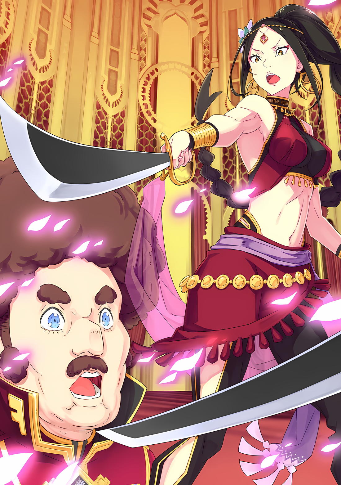
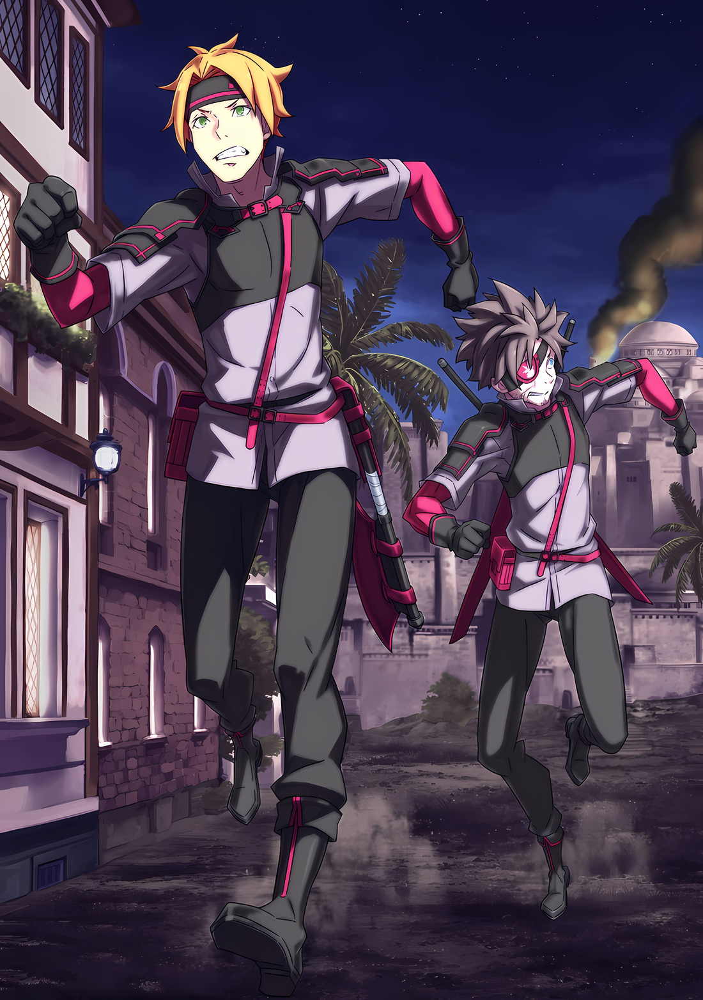
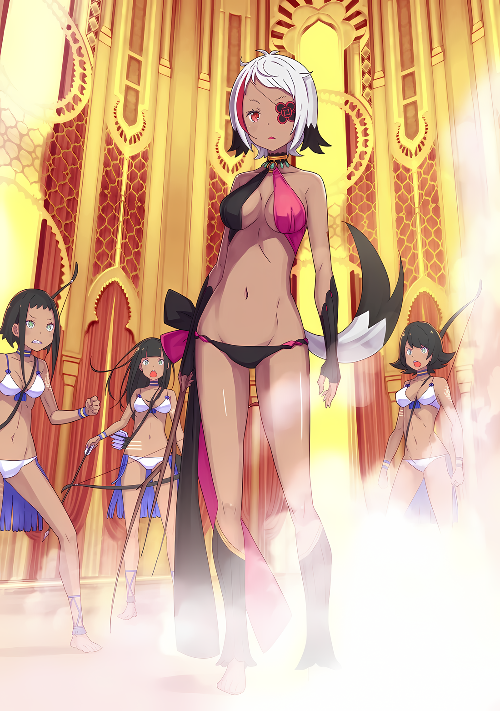
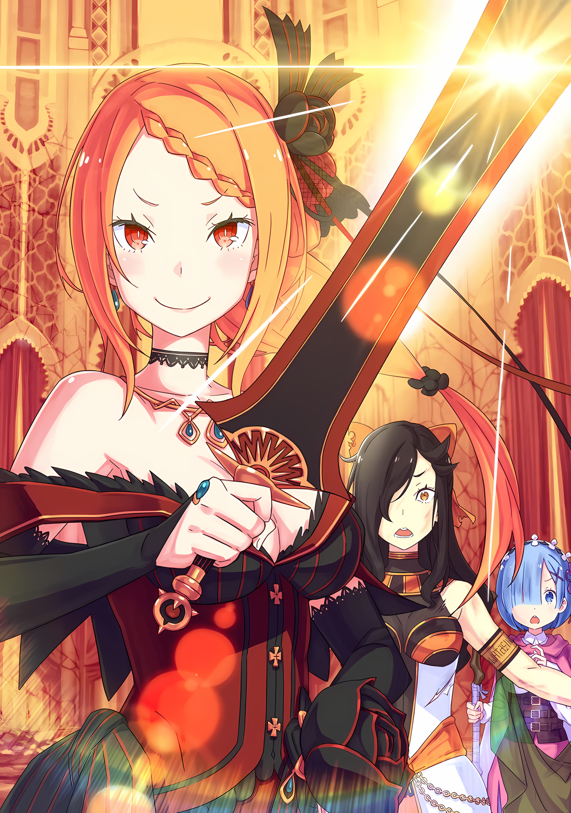
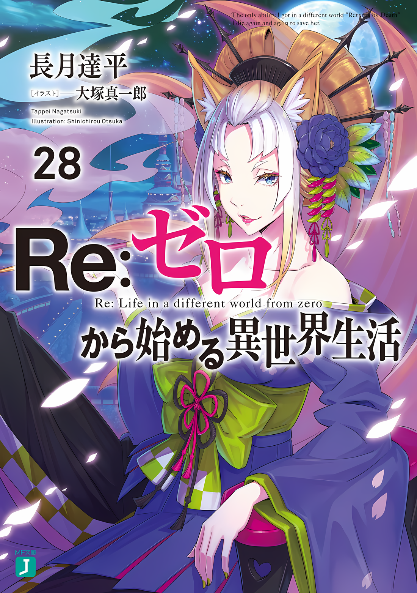

……По мере приближения начала банкета напряжение нарастало.

???: …………

В комнате ожидания, где они собрались впятером, не было никаких разговоров, и было тихо.

Никто не мог произнести ни слова, ни Абел, который был сосредоточен, ни Субару. Даже Флоп молчал, так что тяжесть атмосферы была подавляющей.

Они зашли так далеко, так что беспокоиться было не о чем.

Или, по крайней мере, они должны были так думать, но люди не так просты. Независимо от того, насколько хороша была переодежка, беспокойство нарастало по мере того, как приближалось главное событие.

Несмотря на то, как громко кричало его сердце, и как сильно холодный пот мочил его спину, течение времени нельзя было остановить, и обещанное время еще придет.

???: Банкет готов. Вам пора идти.

Раздался голос солдата, стоявшего на страже, и наступил момент разрядки напряжения.

Посмотрев друг на друга, Субару и остальные подняли свои инструменты и последовали за солдатом, ведущим их из зала ожидания. Они прошли быстрый медосмотр, но Субару и остальные, одетые только в легкую одежду, не имели возможности носить скрытое оружие.

Они прошли осмотр, получив любопытные и извращенные взгляды, и были препровождены в банкетный зал.

Только……

Таритта: ……Кх

Субару: Таритта-сан?

Субару поднял бровь на впалые щеки и тяжелую походку Таритты.

Хотя он прошептал так, чтобы солдаты, ведущие ее, не услышали его, его голос определенно достиг Таритты, но она не ответила. По выражению ее глаз можно было легко понять ее душевное состояние.

Крайнее напряжение в ее теле было сильным и непреодолимым.

Покинуть знакомую деревню, не иметь возможности положиться на сестру, вождя племени, и идти в тыл врага почти безоружной — все это могло вызвать у нее сильный стресс.

Ее дыхание было неровным, и казалось, что она вот-вот упадет. Субару попытался подбодрить ее, но не мог придумать, что сказать.

Легко было бы сказать утешительные слова вроде «не волнуйся» или «предоставь это мне».

Разве это могло бы успокоить дух Таритты в этот момент?

Поэтому, пока Субару не мог сделать шаг вперед из-за своей внутренней нерешительности……

Абел: ……Таритта.

Таритта: ………

Абел: Не о чем беспокоиться. Просто посмотри на меня.

Голос звучал ужасно высокомерно и напыщенно, но был полон абсолютной уверенности.

Слова были беспочвенными, ничем не отличались от утешительных слов, которые Субару подумал незадолго до этого. Однако эффект от этих легких слов утешения был огромным.

Выпустив слабый вздох, Таритта моргнула глазами.

Она забыла как дышать, и цвет ее лица почти исчез, но тут ее вернули в сознание. Это был голос, в котором звучали простые слова, но он обладал силой влиять на сердца других людей.

Имущие мгновенно превзошли бы трудолюбие неимущих.

Он много раз с болью осознавал это, но теперь он смог увидеть это воочию.

Субару: Похоже, я больше не сержусь.

Субару пробормотал это себе в утешение. Но вскоре он понял, что расслабились не только нервы Таритты, но и его собственные. Поэтому он изогнул губы.

Конечно, он не собирался говорить ему об этом, потому что, если бы он это сделал, то тот бы восторжествовал.

И затем……

???: ……Добро пожаловать. Я слышал, что вы, ребята, собираетесь исполнить замечательную песню и танец.

В зале, где был приготовлен банкет, Субару и остальных встретили около тридцати крепких мужчин. Им сказали, что сегодня в банкетный зал не пустят простых солдат, поэтому здесь должны быть так называемые офицеры и генералы. Среди всех этих генералов, человек, сидящий на стуле в дальнем конце, обратился к труппе.

Субару: ……Это Зикр Осман, Генерал Второго класса?

Пробормотав что-то себе под нос, Субару посмотрел в сторону Абела, танцовщицы группы, чье лицо было скрыто вуалью, которая слегка дернула подбородком в знак положительного ответа на вопрос Субару.

В ответ на утверждение, Субару снова посмотрел на собеседника и нахмурил накрашенные брови.

Зикр Осман, командир Имперских солдат, расквартированных в Городе-крепости Гуарал.

Как Генерал Второго класса Империи, он должен был быть сильным воином, но его внешность не раз подводила воображение Субару.

Во-первых, он был невысокого роста. Он выглядел примерно на полголовы ниже Субару, который отнюдь не был высоким человеком. Он был почти так же высок, как Куна, если бы она стояла прямо.

Конечно, был прецедент в лице Гарфиэля, который был невысоким, но сильным, так что телосложение не было причиной недооценивать его. Тем не менее, он не выглядел кем-то очень важным.

Больше всего в нем бросалась в глаза его характерная пышная прическа.

Если бы ему нужно было описать это словами, он бы сказал, что это афро, но сам факт того, что оно было на голове коротышки, придавал ему некий шарм талисмана.

Субару заранее сказали, что Зикр — военный стратег. Он определенно не был похож на того, кто делает военную карьеру на основе боевого мастерства.

Зикр: Сейчас у нас сложная проблема. Мы заперлись в городе и с каждым днем чувствуем себя все более подавленными. Поэтому мы и устроили этот праздник. Вы знаете свои роли, не так ли?

Субару: ……Да, господин. Для нас большая честь быть приглашенными.

Субару опустился на колени перед Зикром, который бросил преувеличенное замечание, положив подбородок на подлокотник.

Флоп, Таритта и Куна последовали за ним, а Абел, стоявший в конце очереди, нет. На мгновение взгляд Зикра сузился, и генералов охватило чувство тревоги.

В этот момент один из солдат с чашкой саке у ног встал, поставил чашку с алкоголем у своих ног и посмотрел на Абела.

Солдат: Почему бы тебе не встать на колени? Ты же знаешь, что находишься перед Генералом Второго класса….

Зикр: Подожди. Не будь таким заносчивым. Это место было открыто для питья и пиров. Мы хотим от тех, кто зарабатывает на жизнь искусством, не этикета, а неумолимого комфорта.

Солдат: Мх… Если вы так говорите, генерал….

Именно Зикр, как никто другой, упрекнул солдата, пристававшего к Абелу.

Солдат неохотно сел в ответ на его великодушное отношение. Все это время Абел прятал лицо под вуалью и не подавал никаких признаков недовольства.

Зикр: Ты даже не дрогнула перед духом воина? Похоже, ты очень уверена в своем танце. Но твое первое впечатление было не очень хорошим. Я ожидаю, что ты его изменишь.

Субару: Спасибо за вашу щедрость… Но, пожалуйста, не волнуйтесь.

Зикр, с любопытством наблюдавший за высокомерием Абела, ответил Субару «Хм?», когда тот опустился на колени, заинтересованно подняв брови.

Было больно думать об остальном, но это была возможность, которой Субару был одарен. Он собирался использовать ее по максимуму. Он даст Зикру почувствовать полное поражение.

Субару: ……Та, на кого вы сейчас положите глаз, — прекрасная танцовщица из-за Великого Водопада. Ее шелковистые черные волосы, впитывающие солнечный свет, а также ее небесно-светлая кожа, получившая благословение духов, ее величайшая красота сравнима с божественными существами, и сегодня вечером она роскошно выступит для всех вас.

Встав, Субару произнес вступительное слово.

Словно в подтверждение того, что его слишком преувеличенная преамбула не была блефом, вуаль, скрывающая лицо Абела, медленно приподнялась.

Как только завеса открыла этот очаровательный вид, все присутствующие в унисон еле переводили дыхание от надменности танцовщицы.

Зикр: …………

Особенно сильно был шокирован Зикр, потерявшийся во взгляде Абела.

Поскольку он с самого начала проявлял к ним терпимость, возможно, он уже был готов к великодушному разрешению ситуации, а возможно, он получил шок, равносильный тому, что его застали врасплох.

Казалось, что он буквально забыл, как дышать и говорить.

Субару: ……Пожалуйста, дайте нам возможность продемонстрировать выступление нашей танцовщицы.

Субару из вежливости опустил голову, обращаясь к Зикру с предложением. Флоп тоже склонил голову и поднял свой инструмент, прося разрешения начать пир.

В ответ Зикр кивнул головой, заставив Субару обменяться взглядом с Флопом.

Затем они кивнули друг другу, показывая, что готовы, и начали играть.

Субару: ……Сегодня вечером вы увидите танец из родного города нашей танцовщицы, танец из-за Великого Водопада. Пожалуйста, удовлетворите свое сердце, танец из пределов конца.

То, что это был танец из-за Великого Водопада, было преувеличенным выражением.

Однако это не было ложью в том смысле, что это был танец, неизвестный Имперским солдатам. И песня, и танец были принесены не из этого мира, а из мира Субару.

Конечно, они были соответствующим образом аранжированы, но поскольку основа танца была иной, одного танца было достаточно, чтобы привлечь внимание зрителей.

Однако……

Абел: …………

Он был танцором, который очаровывал других своей красотой и плавным танцем, поэтому ему, вероятно, даже не требовалась помощь экзотической песни и танца из другого мира.

Абел: …………

У вас есть понятие закуски с напитками, однако это не только еда, подаваемая на пирушке, если у вас был вид развлечения, способствующий употреблению алкоголя, то закуской могло называться все, что угодно.

Естественно, в число развлечений входило и сайдшоу, а танцы назывались аппетитными, так что они очень даже служили закуской к выпивке… Но вряд ли они произвели бы такой эффект.

Танец танцовщицы ослеплял солдат, обжигал их горло и вызывал в их душах жажду алкоголя.

Естественно, они чаще и быстрее опрокидывали свои стаканы, а их щеки приобрели оттенок пурпурного цвета. Генерал второго класса Зикр, пытаясь вылечить онемение мозжечка, выделялся тем, что потягивал выпивку в особенно быстром темпе.

Под влиянием алкоголя и танцев он совершал ошибки, которые обычно не совершал.

Например, беспрецедентная ошибка — поддаться своему желанию посмотреть танец с мечами, в результате чего он отдал свой собственный меч по просьбе танцовщицы.

Абел: ……Это твое поражение, Зикр Осман.

Иллюстрация к **Ранобэ** Том 27 | Разукрасил NorvakKK

Поэтому, даже когда кончик меча был направлен ему в шею, а из уст танцовщицы доносился непререкаемый мужской голос, глаза «Бабника», Зикр Осман не мог выйти из этой эйфории.

△▼△▼△▼△

……«Мы сделали это», — внутренне воскликнул Субару, когда победа была одержана.

Меч в руке Абела был в таком положении, что с легкостью бы пронзил горло Зикра.

У Зикра, который отклонился назад, обнажив шею, не было шансов отбиться. Без сомнения, вражеский командир был успешно захвачен.

И они даже сделали это раньше, чем планировали, в подходящий момент.

Первоначально Субару планировал сделать себе имя в городе в качестве странствующей труппы и проникнуть в лоно Зикра Османа. В идеале их должны были позвать в спальню Зикра, где они смогли бы застать его врасплох, взять под стражу и заставить Имперских солдат, расквартированных в Гуарале, сдаться.

Это предположение было опровергнуто проведением этого банкета.

Абел: ……На банкете мы нейтрализуем всех оставшихся в городе солдат.

Это были слова Абела, который объявил об изменении стратегии, когда их позвали на банкет.

Стратегия с высоким риском и высокой наградой, которая была бы плодотворной в случае успеха, но опасной…… Субару согласился изменить план при условии, что они вернутся к первоначальному в зависимости от ситуации.

Он не ожидал, что все сложится так удачно.

Зикр: …………

Абел: Я скажу это снова, Зикр Осман. Ты проиграл. Сдавайся сейчас же и прикажи своим людям разоружиться. Иначе твой кубок будет наполнен не алкоголем, а кровью.

Абел, приставив свой меч к неподвижному Зикру, еще раз посоветовал ему сдаться.

Но в глазах Зикра не было страха, несмотря на то, что его жизни угрожала опасность. Это не были глаза решительного Имперского солдата. Скорее, в его глазах была нерешительность.

Колебание, сомнение и другие подобные эмоции.

Зикр: Танцовщица, ты… Нет, ты…

Колебание проявилось в глазах Зикра так, словно он увидел нечто благоговейное. Это не было похоже на реакцию мужчины перед простым танцором.

Генерал: ……Хк! Вы бандиты! Вы не имеете права…!

Один из ошарашенных генералов пришел в себя и тут же попытался наброситься на Абела.

Но быстрее, чем они успели дотянуться до спины Абела, их руки и ноги были пронзены метательными ножами. ……Ножи, брошенные скрытой Куной.

Куна: Простите, но вождь велела мне защищать лицо Абела.

Она тайком пронесла ножи с банкета в инструменте, похожем на бубен, который был у нее в руке во время танца Абела.

Генералы заколебались при виде упавшего солдата, его конечности были пронзены лезвиями.

Однако была одна фигура, которая увернулась от клинка Куны и отпрыгнула в сторону.

???: Хватит шутить! Думаешь, ты сможешь остановить Имперских солдат с помощью чего-то подобного?

Воющий бородатый гигант поймал рукой дополнительный метательный нож и отмахнулся от него.

Затем, выхватив свой собственный меч, он полетел прямо на Абела, жаждая крови

Субару: Абел……!

Абел, схвативший Зикра, выставил свою палкообразную спину.

Субару выкрикнул имя Абела, но танцовщица даже не моргнула.

В этот момент большой меч обрушился на спину Абела……

Таритта: ……Кхк!

В тот же момент Таритта стиснула зубы и прицелилась в мужчину, взяв лук у одного из солдат.

Приготовив стрелу, она направила ее на бородатого колосса, приближающегося к Абелу. Зеленые глаза Таритты загорелись убийственным огнем.

Она была готова лишить этого человека жизни, чтобы спасти Абела и остановить нападение.

Флоп: Не убивай его!!!!

Таритта: ……Хк!

Но перед самым выпуском стрелы Флоп в панике закричал.

Услышав это, глаза Таритты заколебались, и прицел стрелы слегка размылся. И вот стрела вонзилась не в спину человека, а в его правое плечо.

Бородатый генерал: Гах!?

Мужчина закричал в агонии и перевернулся после сильного удара. Но импульс большого меча в его руке не мог быть убит, и он, вращаясь, направился к спине Абела.

Казалось, что меч разобьет голову Абела сзади. Однако кончик меча едва задел затылок и с сильным стуком упал на пол.

Абел едва не лишился жизни, но вовремя избежал катастрофы.

А потом….

???: ……А.

С треском распустились и разметались заплетенные в косу черные волосы Абела.

Кончик большого меча вонзился в заколку, развязывая узел. ……Нет, этим дело не ограничилось. Потрепанный парик потерял свою функцию, и фальшивые черные волосы упали на пол.

Длинные волосы танцовщицы были заменены соболиными волосами самого Абела.

……Безжалостный Император, который вместе с зажимом для волос содрал мягкое впечатление от танцовщицы.

???: Генерал Второго класса! Сейчас у нас есть возможность обезвредить этих парней…!

Зикр: ……Стоять! Не ослушиваться меня!

Пока солдат, чьи конечности были пронзены ножами, и тот, кому стрела попала в правое плечо, стонали, Зикр заглушил призывы генерала, который все еще пытался сопротивляться.

Если бы они безрассудно стояли на своем, независимо от количества павших, они были бы раздавлены силами Субару в один прием. А именно такой контратаки они больше всего хотели избежать.

Однако Зикр не позволил своим подчиненным сражаться дальше. Он понимал, что теперь, когда он сам оказался прижат к земле, а подчиненные ему генералы также подавляли их движения, исход уже предрешен.

Поэтому……

Зикр: Если я сделаю, как ты говоришь, ты можешь гарантировать жизнь моих людей?

Абел: Это также зависит от твоего отношения, «Трус».

Зикр: Гох… кх.

Зикр показал свою готовность принять рекомендацию сдаться, покраснев и прикусив губу, когда над ним издевался неумолимый Абел.

Это было лицо человека, который испытал унижение не только от того, что его поймали в заговоре против него, но и от того, что его самого схватили.

Абел фыркнул, глядя на унижение Зикра.

Абел: Я слышал о тебе, Зикр Осман. До того, как тебя прозвали «Бабником», тебя называли «Трусом».

Зикр: ……Неподходящий эпитет для Имперского солдата. Поэтому вы выбрали такую стратегию?

Абел: …………

Зикр: Если бы я был «Трусом», а не Бабником, я бы сдался женщине на острие меча….

Если так, то какое это было бы унижение.

Или, если бы это было так, Зикр умер бы от унижения. Но причина, по которой Абел счел это возможным, отличалась от той, которую слышали Субару и другие.

Это было потому……

Абел: Стратег, который благодаря умелому и постоянному использованию войск добился в бою мало заметных результатов, но при этом причинил мало потерь своим союзникам. Отличный командир, но лишенный агрессивности. Следовательно, «Трус».

Зикр: Да, это тоже верно, я такой, но….

Абел: Что тебя смущает?

Зикр: А?

Глаза Зикра расширились, когда Абел сузил глаза и задал этот вопрос.

Вот так, с замешательством на лице другой стороны, Абел продолжил, держа меч в руке.

Абел: Когда другие называют тебя трусом, они либо притворяются, что не видят результатов, либо это разглагольствования глупца, который не видит результатов. Я использовал эту природу для победы.

Зикр: …………

Абел: Ты ненавидишь бесполезные потери. Поэтому я решил, что ты, как «Трус» и военный стратег, не будешь сопротивляться в этой ситуации. ……Ты собираешься разочаровать меня?

Не отводя взгляда и прижимая клинок к шее, Абел спросил об этом Зикра.

Тому, кто не знал истинной личности Абела, этот вопрос показался бы пустой болтовней, которая заставила бы задуматься, о чем, черт возьми, он говорит.

Он поверил в трусость своего противника и включил ее в свой план победы.

Не было никакой уверенности в том, что он не расстроит своего противника, говоря такие вещи прямо. Скорее, он как будто специально пытался спровоцировать гнев своего оппонента; это было действительно заявление, которое могло ухудшить ситуацию.

Даже переодевшись женщиной, он был неспособен на какое-либо смирение.

Но перед Абелом Зикр Осман выдохнул от изумления.

То, что предстало его глазам, было чувством, которое трудно описать…… если бы он осмелился выразить его словами, то это было бы удивление, близкое к восторгу.

Казалось, это была свежая и новая реакция, как у девы, получающей что-то от любимого человека.

Зикр: ……Мы разоружимся. Я отдам строгий приказ своим подчиненным сделать это.

Абел: Это мудрое решение.

Абел молча кивнул в знак согласия с тихим, опустившим голову ответом Зикра.

Несмотря на то, что он был одет как танцовщица, никто не мог устоять перед его достойным кивком головы. Когда Зикр, их командир, сдался, Имперские солдаты один за другим опустили оружие.

И……

Абел: Что ты тут дурака валяешь? Иди и сожги флаг на крыше.

Субару: Уех? Что, я?

Абел: Да, ты. Только ты. Ты единственный, кто не совершил ни одного поступка с тех пор, как все начало развиваться.

Холодные глаза Абела пронзили Субару, который указал на себя и моргнул.

С этими словами Субару оглядел зал.

Куна, которая обезвредила врага метательным ножом, Таритта, которая подстрелила гиганта-человека, Флоп, который не допустил смерти гиганта-человека и поэтому отчаянно защищал материализацию «Бескровной Осады», и Абел, который обезоружил генерала.

Действительно, единственным, кто ничего не сделал, был Субару, который упал на задницу, когда этот гигант попытался напасть на них.

Абел: Пошевеливайся, я даже не смогу обезоружить их без Мизельды и остальных.

Субару: Хорошо, я понял! Да, да, извини!

Сказав это, Субару направился к балкону, осторожно вползая на крышу. Крыша мэрии с видом на ночной Гуарал была абсолютно захватывающей.

Окунувшись в холодный ветер, Субару взял со стены факел и поджег флаг Империи на крыше ратуши…… флаг Меченого Волка.

……Это было доказательством того, что падение Города-крепости Гуарал было достигнуто именно здесь.

△▼△▼△▼△

Первым, кто заметил что-то неладное, был Джамал, который внимательно наблюдал за ратушей.

Джамал огляделся, не забывая о людях, которых он оставил в здании. Тодд, которому надоело его наивное отношение, продолжил патрулирование города.

Поскольку город имел определенную историю, не было конца способам проникновения за стены, которые представляли собой мощный барьер. Существовали и контрабандные схемы, такие как подземные ходы в частных домах или лазы, через которые пробирались дети. Точно обнаружив их, Тодд был готов к любым возможным нападениям.

Тодд: Не похоже, что они собираются отступить. Если это так, то они определенно попытаются разрушить город. Они могут воспользоваться каким-нибудь тайным ходом и захватить мэрию сразу, или поджечь город… Хм, а есть ли другие способы?

Если бы речь шла только о том, чтобы заставить город пасть, он мог бы придумать множество способов уничтожить как солдат, так и горожан без разбора.

Если уж на то пошло, люди погибли бы, если бы их похоронили в огне, воде или земле. При наличии средств люди могли быть настолько жестокими, насколько им хотелось.

Какие жестокие методы использовал бы черноволосый мальчик?

На первый взгляд может показаться, что это не его сильная сторона, но тот факт, что он был так хорош в этом, делал его еще более пугающим.

Как бы он ни старался подавить их, все равно оставались какие-то неизведанные пути.

Так что даже если бы у него была дырка в животе, Тодд не смог бы спать в своей каюте.

Тодд: Они все такие грубые и неотесанные….

Не все они были калибра Джамала, но многие из них отличались неспособностью обращать внимание на детали.

Тодд не считал себя ни гениальным, ни умным, но если он осознавал собственную глупость и недостатки, то находилось множество способов восполнить пробелы.

Он не мог понять, как люди могут прожить жизнь, не задаваясь вопросом о своей глупости.

Каждый человек был идиотом, и поэтому он должен делать все возможное, чтобы компенсировать это.

Джамал: ……А?

Размышляя об этом, Тодд уже собирался войти в следующий частный дом, как вдруг остановился из-за удивленного голоса Джамала, раздавшегося позади него.

Он остановился и посмотрел на Джамала, который с выражением ошарашенности на лице смотрел на ратушу вдалеке.

Тодд нахмурился, недоумевая, что происходит.

Джамал: Да ладно, это что, шутка такая?

Тодд: В чем дело, Джамал? Что происходит в….

«В мэрии», — чуть не сказал он. Стоя рядом с Джамалом, Тодд тоже посмотрел в том же направлении.

Он был уверен, что в мэрии в данный момент идет банкет, на котором приглашенные танцовщицы развлекают и утешают генералов.

Поэтому неудивительно, что некоторые из них немного увлеклись и выставили себя на посмешище.

Это было бы не странно, но….

Тодд: ……Быть того не может.

Несмотря ни на что, сжигание флага Империи на вершине ратуши было неприемлемо.

Этот варварский поступок настолько выходил за рамки грубости, что даже Тодд был потрясен. Флаг, опаленный пламенем и трепещущий на горячем ветру, колыхался и горел, озаряя ночное небо красным заревом.

А прямо рядом с горящим флагом он увидел фигуру женщины, которую уже встречал в мэрии.

Музыкантша с богатыми черными волосами и острыми глазами. Он полагал, что ее зовут….

Тодд: ……Нацуми Шварц.

Так она сказала, когда ее имя спросили.

Слабая женщина, которая стала маленькой и испуганной, когда Джамал теснил ее. Однако он ясно видел, что она смело жжет Имперский флаг с факелом в руке.

В ней не было и следа той слабости, с которой он столкнулся в ратуше.

Конечно, это не могло быть чем-то очаровательным, вроде пьяного акта насилия.

Это, несомненно, было преднамеренное нападение на Империю. И если флаг базы был сожжен, это означало, что место попало в руки врага.

Как раз когда он думал об этом, в голове Тодда внезапно всплыла одна возможность.

Тодд: Не может быть, это ты?

Широко раскрытыми глазами Тодд изучал темноволосую женщину с факелом в руке, Нацуми Шварц, и был поражен той ничтожной возможностью, которая зародилась в нем.

Но чем больше он думал об этом, тем больше это совпадало, а чем больше он смотрел на нее, тем больше расходилось.

Но именно поэтому эффект был таким необычным.

Кому в мире могло прийти в голову сделать что-то подобное?

О таком способе прорваться через вражескую охрану с фронта и захватить их оперативную базу?

Тодд: Я думал, что это невозможно. Я не могу поверить, что они пытались пробраться через парадные ворота.

Кто мог бы использовать такой опасный для жизни подход?

Конечно, возможность спрятаться за грузом или внутри драконьих повозок была тщательно продумана, и контрольно-пропускные пункты были усилены. Однако вторжение пешком, да еще так, чтобы привлечь внимание, было неожиданным.

Несмотря на это, первое проникновение усилило их бдительность. Кроме того, естественной реакцией было бы выбрать более скрытный подход…

Джамал: Ты же не думаешь, что это была просто подстава? Они специально нашли нас и внушили нам предвзятое мнение, что лобовой прорыв невозможен?

И после этого ему удалось проникнуть в город, его пригласили в зал в качестве танцовщицы, он снес ратушу и зажег Имперский флаг… Все было именно так, как задумала Нацуми Шварц.

Тодд: ……Это плохо.

Какой тщательный план, подумал он, по позвоночнику пробежал холодок.

Он думал, что сделал все возможное, чтобы одержать верх, но с другой стороны ребенок войны легко превзошел и высмеял его.

Тодд с удивлением обнаружил, что вздрогнул.

Джамал: Блять! Какого хуя здесь происходит! Черт, нам пора вернуться в мэрию….

Тодд: Идиот, остановись. Ты ведь тоже умрешь.

Джамал: Аа?

В отличие от Тодда, Джамал не знал о личности человека, который поджег Имперский флаг.

Из-за расстояния его глаза не могли различить никаких деталей на крыше ратуши. Тодд мог видеть это только благодаря своим особым глазам. И именно потому, что он мог их видеть, он сдерживал Джамала.

Теперь, когда Имперский флаг на их базе был подожжен, падение города было предрешено.

К этому времени все «Генералы», участвовавшие в празднике, включая Зикра, были уже убиты. Даже если бы они вернулись обратно, то, скорее всего, сами потерпели бы поражение.

Джамал: Ты с ума сошел, не так ли? И ты все еще считаешь себя Имперским солдатом, да?

Тодд: Нельзя победить и остаться в живых, будучи гордым. Кроме того, ты знаешь, что мэрия взята; Генерал Второго класса мертв. Судракийки скоро будут в городе.

Джамал: …………

Тодд: Если мы не уберемся отсюда до того, как это случится, у нас не останется другого выбора, кроме как тоже умереть.

Джамал был не из тех людей, которые согласятся на унижение, если он тихо разоружится.

Альтернативой было бы прыгнуть в ряды противника с оружием в руках, набравшись храбрости, и умереть, уничтожив около десяти человек.

Можно было бы сказать, что именно так умирает Меченый Волк, но с точки зрения Тодда, это было не хуже собачьей смерти.

Жизнь была сродни конечной карте.

Использовать ее для победы было оправданно, но было бы расточительством использовать ее для сожаления о поражении.

Джамал и Тодд знали друг друга некоторое время. Не было бы странным предположить, что между ними сложились достаточно близкие отношения, чтобы советовать друг другу в этом вопросе. Возможно.

Тодд: Видишь ту дыру в стене, которую я только что заделал? Я собираюсь сбежать через нее. А ты?

Джамал: Гх, кх…… Хочешь, чтобы я снова почувствовал себя попущенным?

Тодд: Если ты жив, у тебя будет шанс смыть с себя позор. Но если ты умрешь, то это все. Так что я ухожу. Я не буду ввязываться в битву, которую, как мне кажется, я не смогу выиграть.

Ему очень хотелось не ввязываться в драку с малым шансом на победу, не говоря уже о том, чтобы проиграть со стопроцентной вероятностью. Но у него не было времени спорить с Джамалом о деталях.

Он быстро повернулся к нему спиной и пустился бежать. Джамал на мгновение замешкался, прежде чем выкрикнуть «Пиздец!», а затем последовал за Тоддом.

Иллюстрация к **Ранобэ** Том 27 | Разукрасил NorvakKK

Было бы хорошо, если бы все были такими же простыми, как он, но мир устроен иначе.

В любом случае….

Тодд: Думаю, теперь я буду помнить тебя как Нацуми. ……Ты дитя войны.

△ ▼ △ ▼ △ ▼ △

Как только они поняли, что Имперский флаг подожжен, а ратуша пала, Имперские солдаты неожиданно подчинились призыву сдаться.

То же самое произошло и со стражниками, защищавшими город, что очень помогло Субару, целью которого было захватить город без кровопролития, но и это было неожиданным событием.

Субару: Мне всегда казалось странным, что, когда я смотрел битвы периода Сэнгоку в исторических драмах, сражение заканчивалось, когда снимали голову генерала другой стороны……

Если генерал был убит, то следующий человек становился генералом, и битва возобновлялась.

Обыватель мог бы подумать, что битва не закончится, пока одна из сторон не будет уничтожена или разрушена, но в данном сражении это было не так.

Имперская армия, которая должна была иметь подавляющее превосходство в силе, согласилась разоружиться, как только узнала, что ее командир Зикр был задержан.

Мизельда: Ну, это был настоящий подвиг, Субару… Нет, Нацуми.

Субару: Мизельда-сан.

Пока Субару похлопывал себя по фальшивой груди, радуясь результатам битвы и успеху операции, к нему подошла Мизельда, радостно прихлебывая алкоголь прямо из бутылки.

Женщины, которые прятались за городом в качестве отряда, тоже вошли в город, когда поняли, что ратуша пала, о чем свидетельствовало сожжение Имперского флага. Стражники, узнав, что Имперские солдаты потерпели поражение, не пытались остановить их и гордо прошествовали в город.

Благодаря содействию судракиек им удалось захватить большую часть Имперских солдат.

В зале, где проходил пир, напитки и еда были убраны, а вместо них в ряд выстроились связанные Имперские солдаты.

Жаль было бы все выбрасывать, подумал Субару. Мизельда и остальные потягивали свои напитки, но это делало их еще более похожими на варваров, желающих пограбить.

Субару: Но с таким количеством людей… Было бы трудно идти лоб в лоб.

Мизельда: Неважно, сколько у нас врагов, гордость Племени Судрак не ослабнет. Нет такого понятия, как слишком много врагов… И да, простое число может быть непреодолимым. Но вы с Абелом победили их.

Субару: …………

Мизельда: Я горжусь тобой, Нацуми. Ты проявила храбрость через мудрость. Мы бы так не смогли.

Энергично похлопав Субару по плечу, Мизельда оставила его с красивой улыбкой.

Затем она встала и направилась поздравить Таритту и Куну за их вклад в падение ратуши.

Даже на расстоянии, вид глаз Таритты, сияющих от похвалы сестры, заставил Субару улыбнуться. Куна была обнята Хоули, подтвердившей, что она в безопасности, что делало ее похожей на свернутую макрель.

Субару: Продолжая в том же духе, было бы неплохо, если бы жизнь Куны не оборвалась, учитывая все те великие дела, которые она совершила….

???: …………

С чувством облегчения Субару выпустил небольшую улыбку. Затем, обернувшись, он чуть не столкнулся с человеком, стоявшим прямо за ним.

Этим человеком была….

Субару: Р-Рем…

Рем: …Да.

Субару смотрел на нее с близкого расстояния, и он не мог не отступить назад.

Рем, держа в руках свою деревянную трость, смотрела на Субару сверху вниз своими бледно-голубыми глазами. Чувствуя себя неуютно под ее взглядом, Субару прочистил горло и сказал,

Субару: В чем дело? Я в порядке.

Рем: Да, я слышала. Но у меня было чувство, что даже если бы ты был где-то ранен, ты бы скрыл это и сказал то же самое.

Субару: Ты действительно не доверяешь мне… Но я тоже не очень хорошо переношу боль, поэтому даже о малейшей травме я сразу же сообщу. Правда, я серьезно.

Рем: Это тоже звучит подозрительно.

Субару: Тч, хахаха…

Плечи Субару опустились под взглядом Рем, лишенным доверия.

Но затем он быстро повернул голову в осознании. «А?» произнес Субару. Возможно, она была немного кривовата, но она, вероятно, беспокоилась о том, ранен Субару или нет.

Субару: Ты беспокоишься обо мне, не так ли?

Рем: А?

Субару: О! Прости! Я увлекся! Конечно, нет! Не может быть, чтобы Рем беспокоился обо мне….

Рем: Да, я беспокоилась

Субару: Чего?

Размахивая руками в воздухе, Субару поспешно попытался исправить свое недоразумение. Но его прервали не кто иной, как слова Рем.

Выражение лица Рем не изменилось, но цвет ее глаз слегка дрогнул.

Рем: Я сказала, что беспокоилась. Конечно, беспокоилась. Неважно, насколько шуточным был план, я была той, кто заставила тебя сделать это. И все же, как я могу не беспокоиться? Как, по-твоему, я могу быть таким бессердечным человеком?

Субару: Нет, нет, нет, дело не в этом, я не думаю, что Рем бессердечная! Я правда не думаю! Рем ласковая, немного самонадеянная и немного сдержанная, пока она не узнает кого-то получше, но эта разница также очень привлекательна….

Рем: …………

Субару: Рем, только не говори мне, что ты впечатлена…?

Рем: Нет, я просто подумала, что это странно.

И с этим простым заявлением фальшивая грудь Субару была проткнута, что вызвало у него возглас «Ух!».

Рем раздраженно вздохнула, когда Субару отступил назад, держась за свою фальшивую грудь от боли. Затем она сделала шаг к Субару,

Рем: Просто чтобы ты знал, что бы ты ни сказал или сделал, тебе удалось это сделать. Действительно, тебе удалось разрушить этот город. И это без смертей.

Субару: ……Если бы мы только сохранили бескровную часть, я надеялся, что никто не пострадает, если это возможно. Но я думаю, не слишком ли многого я прошу?

Рем: Я думаю об этом. Однако, если это будешь ты и Абел-сан, то у вас может получиться… Почему ты так на меня смотришь?

Субару: ……Это ничего, ничего, ничего, ладно?

Рем подняла бровь, глядя на угрюмое лицо Субару.

На самом деле, она была права. Без помощи Абела этот план был бы невозможен, и это правда, что он был человеком ужасающей мудрости.

Тем не менее, услышав из уст Рем слова похвалы в адрес другого мужчины, его сердце сжалось.

Субару: Даже с этой фальшивой грудью все равно есть чем впечатлиться, не так ли……?

Рем: Мне кажется, что ты опять говоришь о каких-то глупостях….

Когда Рем начала пялиться на него, Субару замахал руками и сказал: «Нет, нет, нет», чтобы скрыть это.

Если бы он рассказал Рем о своей нынешней ревности, она, вероятно, просто почувствовала бы себя странно из-за этого. Это было неизбежно, но, тем не менее, больно. Односторонняя привязанность была болезненной.

Субару: Нет, в данном случае это просто рефлекс…? Хотя по сравнению с Эмилией-тан они проходные, тем не менее, они все еще чувствуются как настоящие, не так ли?

Медиум: О! Нацуми-чан, ты здесь! Я слышала, вы отлично справились, поздравляю!

Субару: А, Медиум-сан.

Медиум вбежала в комнату с громким голосом и вялыми шагами. Субару отшатнулся от внезапного приближения высокой женщины, но его шаг назад был бессмысленным, так как она заполнила расстояние между ними, наклонившись вперед.

Медиум широко улыбалась, радостно глядя на солдат в зале, а две девушки сидели на ее плечах — Утаката и Луис.

Медиум: Все эти люди были захвачены Нацуми-чан и остальными, не так ли? Я так удивлена! Так-так, а где сеструха? Она постаралась?

Субару: Сеструха? А, да. Флора…

Флоп: ……Я здесь, дорогая сестра!

Медиум: Оо!

Круглые глаза Медиум расширились еще больше, когда она увидела, как в зале появился Флоп, красивый мужчина, который сопровождал ее и которого она так долго привыкла видеть. Он быстро заявил о своем присутствии одним громким хлопком ботинок.

Медиум: Сеструха! Разве это не Сеструха! Я так и знала, Сеструха не моя сестра, а сестра, которую я считала своей сестрой…… Сеструха!?

Флоп: Хахаха, я понятия не имею, о чем ты говоришь, дорогая сестра! Но несмотря ни на что, я все еще здесь. Так что неважно, брат я тебе или сестра!

Медиум: Это тоже правда! Тогда, может быть, я не сестра, а брат! Я ведь такая большая!

Флоп: Младшая сестра или младший брат, старший брат или старшая сестра, мы все равно семья!

Разговор между братом и сестрой О'Коннелл был своеобразным, но он сохранил свой уникальный темп до самого конца.

Смеющийся Флоп обнял Медиум за талию, а Медиум, с девочками на обоих плечах, начала кружиться по кругу.

В результате обе ноги Флопа взлетели вверх, и началось грандиозное кружение, а счастливый смех брата и сестры и детей эхом отдавался в зале.

Субару: Сюрреалистично, не правда ли…?

Рем: Я уверена, что Медиум-сан тоже волновалась за Флоп-сана… И как долго ты собираешься оставаться в такой одежде? До конца жизни?

Субару: До конца жизни — это преувеличение!? Каким бы милым я ни был, это лишь временное явление…… И мне суждено вернуться к нормальной жизни.

Рем: Значит ли это, что пока ты будешь одеваться так?

Субару: У меня просто нет времени переодеться прямо сейчас!

Субару не был достаточно вынослив, чтобы выдержать такие подозрения, или, говоря иначе, выдержать то, что Рем смотрела на него, как на извращенца.

На самом деле, единственная причина, по которой он все еще был одет в женскую одежду, заключалась в том, что он был занят мелкими делами, такими как сжигание Имперского флага и приветствие «Племени Судрак», которые вошли в город после этого.

Ситуация просто не позволяла ему переодеться в одежду «Субару». Не то чтобы он собирался оставаться Нацуми Шварц.

Субару: Или нет?

Рем: Ах да. Если ты ищешь Абел-сана, то он в задней комнате с командиром.

Субару: Ты ведешь себя так, будто не веришь мне!

Указывая на Рем, которая смотрел на него пустым взглядом, Субару повернулся и пошел к нему.

Он хотел бы отпраздновать успех бескровной осады вместе с Рем и остальными, но он не мог просто сидеть с поднятыми вверх руками и радоваться.

В конце концов, падение Гуарала было лишь контрольной точкой. Они должны были думать о будущей гражданской войне, которая будет бушевать в Империи, и о том, какую позицию будет удерживать Субару.

Для этого……

Субару: С вашего позволения.

С этими словами Субару толкнул дверь в отдельную комнату в конце зала.

Изначально предполагалось, что это будет личная, похожая на кабинет, комната для городского управляющего, хозяина ратуши, но теперь хозяин был отослан, а на стуле сидел его заместитель.

Первоначально это был Зикр, Генерал Второго класса, но теперь это был более напыщенный человек.

Абел: ….Ты. Ты все еще так одет.

Так сказал Абел, подперев щеку рукой и фыркнув. Он уже сбросил свой костюм танцовщицы и закатал рукава, переодевшись в более мужское одеяние.

Перед ним лежала растрепанная голова стоящего на коленях Зикра, и больше в комнате никого не было.

Субару: Пожалуйста, не упоминай мой наряд. Более того, ты наедине с Генералом Второго класса без охраны? Ты хочешь выбросить свою жизнь на ветер?

Абел: Конечно, если бы он собирался сопротивляться, я бы его зарубил на носу. Но у него нет такого намерения. Разве я не прав, Зикр Осман?

Зикр: ……Да. Все верно, Ваше Превосходительство.

Подергивая подбородком, Зикр обратился к Абелу, когда его попросили ответить.

Уважительная манера, в которой он обратился к Его Превосходительству и своему явному начальнику, была знаком того, что он считал Абела чем-то большим, чем просто переодетый бандит.

Другими словами, Зикр понял истинную сущность Абела, и потому преклонил перед ним колени.

Субару: Ты сказал ему?

Абел: Мне это не нужно было. Видимо, этот парень понял все во время танца. Нет, я должен сказать, что после танца он понял, как правильно поступить.

Субару: ……?

Субару наклонил голову, не понимая смысла этих слов.

Однако, по замечанию Абела, Зикр опустил голову еще глубже, как бы в знак дальнейшего уважения.

В результате получился ценный человек, который твердо признал и выразил уважение к тому факту, что Абел — Император, что до сих пор не очень-то ощущалось.

Абел: Очень удобно, что ты догадался об этом без необходимости раскрывать это. Зикр Осман, следуй за мной. Тебя не обидят.

Зикр: Да! Если это ради вас, я, Зикр Осман, рискну жизнью!

Субару: Подожди, подожди, подожди, ты серьезно? Ты ведь еще ничего не слышал об этом?

Зикр сразу же посвятил Абела, который попросил вассалитета по отношению к нему, сидя на стуле.

Это было удобно, конечно, но слишком хорошо, чтобы быть правдой. Зикр, однако, покачал головой в ответ на вопрос Субару.

Зикр: Его превосходительство находится прямо передо мной, и ему нужна моя помощь. Если так, то мой долг как генерала Империи — откликнуться на его просьбу. Прежде всего, я клянусь быть еще более преданным вам, чем прежде.

Абел: О, почему? Тебя так очаровал мой танец?

Зикр: Это было очень, очень красиво. Но это еще не все.

Зикр вспылил, когда Абел издал холодный смешок, даже не улыбнувшись. Он прижал оба кулака к полу, с сильной и напряженной радостью на лице.

Зикр: Я удивлен, что Его Превосходительство вспомнил два моих прозвища…… Что я проклял, как ничто иное, как позор, и что вы все-таки поверили этому.

Абел: Конечно. Если кто-то хочет быть правителем Империи, он должен понимать эту землю. То же самое верно и для подданных, которым они служат. Я никогда не знаю, когда я буду использовать тебя, «Генерала», как свою собственную руку и ногу. Неужели ты всерьез полагаешь, что шаги Императора будут беспрепятственны без знания собственных рук и ног?

Зикр: Ни в коем случае! Вот почему для меня это большая честь!

Зикр задрожал от непередаваемой радости и поклялся в горячей верности Абелу.

Честно говоря, с точки зрения событий, это был слишком хороший, чтобы быть правдой, поворот событий, но профиль Зикра был настолько сверхъестественным, что даже Субару не мог найти места для сомнений в своих внутренних ощущениях.

В то же время Субару был потрясен харизмой слов Абела, а также его сильной гордостью и убежденностью Императора, которые его поддерживали.

Он не знал, сколько «Генералов» было в Империи, но даже если Зикр был выдающимся среди них, сможет ли он запомнить достаточно каждого из них, чтобы быть уверенным, что сможет разрушить город независимо от них?

Даже если бы во главе города стоял другой «Генерал», Абел был уверен, что он добился бы того же результата.

Император, противник, превосходящий даже заоблачные высоты, знал его, знал его сильные и слабые стороны, и на этом построил свою стратегию, удивительным образом запутал его в своих ожиданиях и победил его.

Возможно, это было похоже на то, как если бы школьный бейсбольный питчер получил свою подачу на хоум-ран от своего любимого профессионального бейсболиста.

Но настоящая война слишком тревожна, чтобы сравнивать ее с этим.

В любом случае……

Абел: Если Зикр Осман последует за ним, то и «Генералы» под его началом пойдут следом. Вместе с Городом-крепостью я могу сказать, что мы наконец-то собрали сильную боевую силу.

Зикр: Однако, если мы выступим против остальной страны, нам неизбежно не хватит сил. Прежде всего, я думаю, нам следует пригласить в город подкрепления, которые должны быть отправлены из столицы Империи, и потребовать их сдачи.

С добавлением союзников, знакомых с ситуацией в Империи и способных сформулировать стратегию, обсуждение быстро превратилось в полноценную военную дискуссию.

В отличие от Абела, который принял это без колебаний, Субару испытывал сильное сопротивление началу подготовки к полномасштабной войне. Поэтому он предпочел бы побеседовать с Абелом, прежде чем начинать обсуждение подобных вопросов.

Он хотел обсудить с Абелом, что делать с собой и Рем после захвата Города-крепости.

Однако, к сожалению, предложение, которое Субару хотел поднять, не было рассмотрено.

Потому что……

Абел: ……Подкрепление из столицы Империи.

Абел пробормотал в ответ на комментарий Зикра, и воздух в комнате задрожал.

Субару и остальные расширили глаза при виде Абела, который энергично встал со стула и пошел обратно в зал.

И тогда……

Абел: ……Немедленно закройте главные ворота города! Не позволяйте никому войти, будь то гонец или нет!

Все в зале были поражены криком Абела.

Конечно, Субару с Зикром, разговаривавшие с ним незадолго до этого, не могли понять его, у Мизельды и остальных тоже не получилось понять истинных намерений Абела.

Однако, одного взгляда Абела было достаточно, чтобы они поняли, что это не простое дело.

Мизельда: Таритта, иди скажи им, чтобы закрыли главные ворота.

Таритта: О, сестра, что за…?

Мизельда: ……Иди! Не позорь имя Племени Судрак!

Свирепый голос Мизельды поразил замешкавшуюся Таритту; глаза последней расширились при звуке ее голоса, который даже звучал убийственно, и она стремительно бросилась вон из зала. После этого Таритта приказала стражникам закрыть главные ворота.

Таким образом, указания Абела были выполнены, но..

Флоп: Мистер Шеф, что происходит? Редко увидишь, как ты меняешь выражение лица.

Абел: Сейчас не время для твоих глупостей, торговец. Зикр Осман, убеди «Генералов», Мизельда, ты….

???: Ууу…кх!

Абел быстро проинструктировал остальных, не обращая внимания на встревоженного Флопа.

Абел приказал Зикру и Мизельде, главам их соответствующих групп, собрать своих людей, но его инструкции были прерваны на полуслове громким детским криком.

Медиум: Эй, эй, эй, что происходит! Луис-чан, что случилось!?

Луис: Уу! Уу! Аауу!

Утаката: Лу! Успокойся! Уу здесь!

Глаза Медиум удивленно округлились, когда ее дернули за волосы, украшавшие ее внешний вид. Луис, которую несли на плечах, отчаянно кричала, пока Утаката пыталась успокоить ее.

Однако буйная Луис ничуть не успокоилась. Напротив, она проливала крупные слезы, выражение ее лица было напряженным, словно она чего-то боялась.

Рем: Луис-чан, пожалуйста, успокойся! Что случилось? Если что-то не так, я тебя выслушаю, так что не плачь.…

Луис: Уу!

Рем: А? Вон там, что происходит?

Не в силах смотреть на рыдающую Луис, Рем направилась к ней. Заметив приближение Рем, Луис указала на угол зала, по ее лицу текли слезы.

Субару и Абел тоже посмотрели в ту сторону. Но там ничего не было. ……Там не должно было быть ничего.

Абел: Мизельда!

Мизельда: О, ОООХ…!!!

Уставившись в пустоту, Абел первым выкрикнул имя Мизельды.

Словно в ответ, Мизельда быстро приготовила лук на спине, взяла в правую руку четыре стрелы, сразу прикрепила их к луку и натянула.

Сильное тело Мизельды высвободило мощный удар вождя судракиек.

Четыре стрелы дико полетели, вонзаясь в пустое пространство, на которое указывала Луис. Каждая из стрел напоминала удар «Охотника», убившего Субару в джунглях.

Они были настолько мощными, что разорвали бы форму Субару в клочья, если бы он попал под эти удары.

Пол и стены, которые должны были быть прочнее стрел, разлетелись вдребезги, а от удара в зал повалило облако дыма.

Пока солдаты прыгали в укрытия и задыхались, Субару и остальные внимательно смотрели на дым, чтобы понять, действительно ли Луис устроила такой переполох.

???: Что-то вроде этого не убьет меня.

Откуда-то в наполненном дымом зале раздался томный голос.

Он распознал голос женщины. Барабанные перепонки Субару определили, что это медленный, беззаботный голос, лишенный эмоций и скромной громкости.

Он казался ужасно неуместным в мгновенно возникшей напряженной ситуации.

Однако результат этого голоса был мощным.

Мизельда: …………

……В мгновение ока все тело Мизельды было охвачено огромным пламенем, когда ее подожгли.

△▼△▼△▼△

Мизельда: Аааа!!!

В мгновение ока все тело Мизельды окутало пламя, заставив ее испустить невнятный крик.

Вид Мизельды, превратившейся в человекоподобную массу пламени, не позволил всем предпринять какие-либо немедленные действия.

Куна: ……Тч, Хоули!!!

Хоули: П-поняла~!!!

Сразу же после того, как Куна позвала, Хоули поспешила к контейнеру, наполненному большим количеством воды. Она подняла его с чудовищной силой и со всей силы швырнула в горящую Мизельду.

Вода, хлынувшая из разбитой емкости, обволокла Мизельду, и та упала на пол.

Пламя опалило ее лишь на мгновение, но невозможно представить себе боль от испепеления всего тела.

Субару не мог уследить за тем, как быстро менялась ситуация, и недоумевал, что, черт возьми, произошло. Однако он заметил, что в центре хаотичного зала увеличилось количество незнакомых фигур.

Не только Субару, но и остальные члены группы постепенно обратили внимание на новую фигуру.

……Это была красивая девушка, у которой была открыта большая часть смуглой кожи.

У нее были серебристо-белые волосы, левый глаз закрывала повязка, сзади рос пышный пушистый хвост, а в руке она держала ветку, которую словно подобрали в глуши.

Иллюстрация к **Ранобэ** Том 27 | Разукрасил NorvakKK

Ее лишенное эмоций лицо производило несколько неуравновешенное впечатление по сравнению с ее пышным юношеским обликом и женственными пропорциями.

Однако не было никаких сомнений в том, что именно эта симпатичная девушка послужила толчком к предыдущему происшествию.

Что она сделала, чего желала, кто она такая — все было неизвестно….

???:……Это ты, Аракия.

Но пока все застыли на месте, нашелся один человек, который знал имя девушки и поэтому позвал ее.

Тот, кто стоял там со своими хорошо наточенными глазами… Смотрящий на Аракию, был Императором, который был свергнут с трона Священной Империи Волакия.

Устрашающий человек, которому Зикр сразу же поклялся подчиняться, стоял лицом к лицу с Аракией, но она без нервозности помахивала веткой в руке из стороны в сторону.

Аракия: Давно не виделись, Ваше Превосходительство.

Абел: Ты тоже, похоже, все еще в добром здравии… Как и Чиша, ты неумолима.

Аракия: Нет, я неумолима? Это было бы опасно.

Это не был напряженный разговор, с точки зрения Аракии.

Даже если бы они могли общаться, напряженное выражение лица Абела показывало, что она не из тех людей, с которыми можно разговаривать.

Прежде всего, кто была эта женщина, которая так непринужденно обращалась с Абелом после того, как признала в нем Императора?

Зикр: Генерал Первого класса, Аракия…

Субару: ……Что ты только что сказал?

Когда они выстроились вдвоем, щеки Субару напряглись при этих тихих словах Зикра.

Он надеялся, что ослышался, но глаза Зикра были серьезными, и Субару понял, что вероятность того, что он ослышался, исчезла.

Затем, словно в доказательство того, что это не иллюзия, Зикр продолжил.

Зикр: Генерал Первого класса Аракия… Один из сильнейших в Империи, одна из «Девяти Божественных Генералов»!

Абел: Она также занимает «Второе» место среди Девяти Божественных Генералов. Это значит, что она вторая по силе в Империи.

Субару: Вторая по силе в Империи…!?

Крик Зикра был дополнен словами Абела, и Субару воскликнул, не в силах скрыть своего удивления.

В центре изумленных взглядов в зале, собрав внимание, Аракия подняла ветку и….

Аракия: Действительно!

Она гордо выпятила грудь.

Субару: …………

Медленно, судракийки, собравшиеся в зале, начали формировать круг вокруг Аракии. Мизельда была поражена во время первой атаки, и осталось всего семнадцать судракиек, включая неспособную Утакату, так что трудно было сказать, достаточно ли они сильны.

Тем не менее……

Судракийка: Мы не можем позволить тебе помешать победе, которая наконец-то в наших руках!

Одна судракийка выплюнула проклятие и подняла один из мечей, который захватил Субару.

Оттолкнуть ее или сбить с ног и схватить. Если бы им удалось сделать одно из двух, они бы обеспечили себе победу в падении Гуарала.

Аракия: Как ни старайтесь, все бесполезно.

В следующее мгновение подул сильный ветер, перемешавший весь зал. Субару, судракийки и связанные Имперские солдаты были перемещены все вместе.

Аракия: …………

Небо и земля были перевернуты, Субару не мог видеть ни вверх, ни вниз, ни влево, ни вправо, ни перед собой, ни позади себя, а все его тело врезалось в пол, стену и потолок, едва не лишив его сознания от сильной боли.

Субару: Каах!

Все его тело было брошено на пол, и пока он смотрел на разбитый потолок, его мозг медленно анализировал и понимал, что произошло. ……Возможно, торнадо.

В одно мгновение в комнате возник торнадо огромных размеров, поглотив Субару…… вернее, Субару и всех остальных, и дико разбросав их по комнате.

Торнадо Аракии пронесся по комнате, не делая различий между людьми и предметами, друзьями и врагами.

Несмотря на это, Субару едва удалось сохранить сознание……

Зикр: Я не позволю тебе… причинить ей больше вреда, чем ты уже причинила….

Зикр, державший Субару, хрюкнул и вяло выбросил руки.

Как только торнадо вырвалось наружу, Зикр быстро притянул тело Субару ближе к своему, пытаясь защитить его от удара разрушения. Эффект был ограничен, но это смягчило тело Субару и не дало ему потерять сознание.

Однако….

Субару: Это шутка, да…?

Оглядев зал, Субару в отчаянии выплюнул эту фразу.

Посреди беспорядка людей и вещей, судракийки, которые только что подняли свою волю к борьбе, все упали на землю, не в силах сражаться.

Более того, больше всего пострадали те, кто проявил враждебные намерения.

Он задавался вопросом, выбрал ли вообще торнадо Аракии, каких людей атаковать, когда причинил столько разрушений.

Субару: ……Ре…м.

Терпя боль во всем теле, Субару искал Рем в коридоре.

Она, как судракийки и остальные, могла потерять сознание от нападения. Если бы она попала не туда, куда надо, могло бы произойти самое худшее.

Затем Субару обвел взглядом зал и заметил кого-то.

Но не Рем. Не Рем, но, несмотря на это, они привлекли внимание Субару.

Потому что даже после того, как их накрыло торнадо, они поднялись на ноги и побежали к полуразрушенному балкону, прислонившись спиной к перилам и глядя на Аракию.

Субару: Абел….

Он не знал, как Абел смог защитить себя во время торнадо. Повреждения Абела были минимальны, но все равно было больно видеть, как у него течет кровь изо лба, а одна рука безвольно опущена.

Однако Абел смотрел прямо на Аракию глазами, не утратившими своего превосходства.

Абел: Марионетка по моему приказу приходит сюда и устраивает этот беспорядок. Неужели ты забыла, для чего вступила в мои ряды?

Аракия: …Ваше превосходительство, вы солгали мне. Я была обманута. За это я вас никогда не прощу.

Абел: ……Значит, Чиша и тебя подговорил?

Абел выдохнул тяжелый, окровавленный вздох, его глаза были слегка опущены.

Лицо Аракии было лишено эмоций, но в ее глазах все еще читался гнев. Она медленно ступила на неровную землю и подошла к Абелу на балконе.

Мысль о том, что Абел может выбежать на балкон, чтобы хорошо выглядеть, никогда не приходила Субару в голову, но он не думал, что у него, раненого и ничего не держащего в руках, есть козырь в рукаве.

Шаги, которые делала Аракия, сокращая расстояние между ними, звучали как обратный отсчет времени до самой жизни Абела.

Один шаг, два шага, Аракия приблизилась к Абелу, а затем……

???: Ух, ААА…… КХ!!!

Раздался высокий голос, и сразу же после этого на том месте, где собиралась пройти Аракия, обрушился столб.

Раздался грохот раскалывающегося камня, и на Аракию обрушилось примитивное оружие, весившее не менее нескольких сотен килограммов.

Это была Рем, которая пряталась за колонной, выжидая подходящего момента для удара.

Рем, которая осталась в сознании и спряталась за колонной, несмотря на то, что была поглощена торнадо, была, вероятно, видна с позиции Абела. Скрывая свое присутствие, она приурочила свою атаку к взгляду Абела, когда Аракия продвинулась вперед, а затем толкнула столб вниз.

Это была последняя атака, которую он мог придумать в данной ситуации, используя силу Рем.

Она была хорошо нацелена, и поэтому сокрушила стройное тело Аракии….

Аракия: Хм?

Рем: …Не может быть.

Пол под ногами Аракии, на который она даже не смотрела, деформировался, как амэдзайку, и вытянулся вверх, поддерживая упавшую колонну.

Как будто они стали свидетелями завершения авангардного искусства от начала и до конца.

Вся мощь Рем не достигла Аракии и даже не отвлекла ее.

Когда Рем опустилась на колени у основания сломанного столба, Аракия посмотрела на нее исподлобья. Взглянув на Рем, ее глаза внезапно расширились.

Аракия: Оо, Демон Они. Это необычно.

Рем: Ты….

Аракия: ……Не вставай на моем пути. Я не хочу, чтобы мои люди пострадали.

Рем: Твои люди…?

Лицо Рем покраснело от гнева, она недоумевала, о чем она говорит.

Но, к сожалению, из-за большой разницы в силе между ней и ее противником, гнев был всего лишь эмоцией, а желание сопротивляться было бесполезным.

Рем потянулась за обломками, и на этот раз попыталась показать свое намерение атаковать, бросая камни.

Однако Аракия взмахнула веткой в своей руке, создав ветер, который сдул обломки вокруг Рем.

Буквально, они были сметены. Были сметены не только обломки пола, но и стены и потолок позади Рем, верхние уровни здания, один за другим.

Аракия: Я не очень хорошо контролирую свою силу. Ты тоже улетишь, такими темпами.

Рем: Если это так, то почему бы тебе не сделать это? После всего, что ты сделала, чего теперь сомневаться? Это не так….

Аракия: …Разочаровывает.

Ответ Рем со стиснутыми зубами заставил плечи Аракии опуститься в унынии.

Но, несмотря на милый жест, действия Аракии были язвительны и просты. Медленно ветка была поднята, и явление иного измерения разрушило существование Рем.

……Ни за что Нацуки Субару не смог бы вынести такого.

Субару: ЫАААА… КХ!

С воплем тело Субару вскочило на ноги, прогоняя боль во всем теле.

Только в этот момент страх, непредсказуемая тревога и все остальное встали на пути.

Отбросив свои страхи, он двинулся вперед, как подсказывали ему инстинкты, и встал перед Рем и Аракией.

Он надеялся хотя бы защитить Рем от разрушения, которое вот-вот должно было ее постигнуть.

Он был готов умереть, если бы это означало защитить Рем.

Он действительно не хотел умирать, и все было бы разрушено, если бы Нацуки Субару умер здесь, но он не возражал против смерти на этом моменте.

Одетый как женщина, с искусственной грудью, гримом на лице, париком на голове, и даже изобретательным способом сделать кожу белой, в таком нелепом облике, который искал красоты, Нацуки Субару встал на защиту девушки, которую он должен был защищать, с мыслью о том, что он будет плеваться кровью.

Рем: ……Кх.

Прижимая Рем к своей спине, он раскинул руки.

Он мог заметить, что Рем ахнула, когда до нее дошло, что Субару вмешался перед ней.

Но что она подумала или почувствовала по поводу поступка Субару, он никогда не узнает. Такой возможности больше не представится.

Она была упущена в мгновение ока перед разрушением, названным Аракия……

???: ……Какое комичное зрелище. Но все не так уж плохо.

Этот голос донесся до ушей Субару, когда он приготовился к тому, что все будет отнято, и ничего не останется.

Когда он закрыл глаза, пытаясь принять приближающийся конец, он задохнулся, обнаружив, что ни жара, ни потери, ни боли, ни страдания, ни жажды, ни каких-либо других факторов, ведущих к «Смерти», не постигли его тело.

Затем, медленно открыв глаза, он увидел это.

Перед Субару, раскинув верхние конечности, прикрывая Рем спиной……была чья-то спина.

Это была не Аракия. Аракия стояла по другую сторону этой спины. Он видел, как она стояла там, ошеломленная, с изумлением на лице.

Существо, вызвавшее оцепенение Аракии, развернулось, разрушая все разрушения, которые должны были прийти, держа в правой руке светящийся красный меч.

Напыщенные, высокомерные, багровые глаза убеждали, что все в этом мире преклонит колени у их ног.

Та, что слегка прижала свои пышные груди собственными руками, с презрительным взглядом, который был воплощением жестокой красоты, человек, которого он не должен был здесь видеть.

Субару: ……Ах.

Субару просто ахнул от вида существа, которое не должно было здесь находиться.

Глядя на него, обладатель прекрасного лица, воплощение слова «Багровый», фыркнуло.

А затем……

???: Нет необходимости называть свое имя, глупец. Однако я позволю тебе назвать мое имя.

Когда она это сказала, на ее лице появилась улыбка цвета крови…… Присцилла Бариэль.

Иллюстрация к **Ранобэ** Том 27 | Разукрасил NorvakKK

※※※※※※※※※※※

**Re:Zero. Жизнь с нуля в альтернативном мире**

Арка 7: Страна волков

Том 28 (ранобэ)

Файл оформлен telegram-каналом: https://t.me/rezeroranobeandwebnovel

Дополнительная редактура: djoenfoej

**Описание**

*Во время захвата Города-крепости Гуарал, Субару в полном отчаянии спасает Присцилла Бариэль, одетая в ярко-красный цвет в повторном столкновении с пламенем. Субару и остальные едва спаслись, однако Присцилла предложила в качестве условия для захвата столицы Империи получение Девяти Божественных Генералов, а для этого — захват Города Демонов. Незадолго до отъезда Субару сетует на свое бессилие, и единственные слова Рем для него — это просьба полностью отречься от слов, которые когда-то ободряли Нацуки Субару.*
