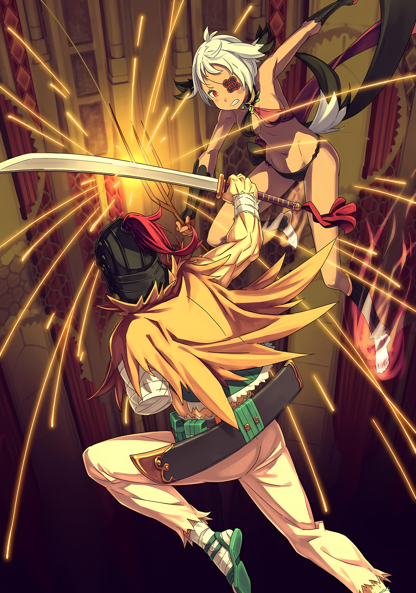

……Там стояла девушка багрового цвета, похожая на яркое, обжигающее пламя, богато пахнущее кровью.

На фоне внезапной битвы, на верхних уровнях ратуши, эта жестокая красавица доминировала над пустынной сценой, держа в руках сияющий сокровенный меч.

С ее ослепительными оранжевыми волосами, роскошным платьем цвета крови и женственной фигурой, эта особа, державшая меч, была той, чья спина излучала силу.

Субару: …………

Субару в замешательстве смотрел на нее, стоя с широко раскинутыми руками.

Мгновенно забыв о боли, пронизывающей все тело, и о необходимости дышать, в его пустой голове хаотично билось одно слово: «Почему».

Почему она была здесь?

Почему она спасла Субару.

Почему она смогла так спокойно встретить Аракию.

Почему, почему, почему, почему, почему, почему, почему, почему, почему, почему, почему, он не мог перестать задаваться вопросом почему.

Переполненный бесконечными вопросами, Субару чувствовал себя так, словно само время остановилось. Затем, словно в насмешку над неподвижным Субару, женщина «Багрового» цвета фыркнула и……

Присцилла: Что за идиотское выражение лица. Неужели мое благородство опалило твои глаза?

Субару: ……У тебя что, глаза на затылке?

Присцилла: Глупости. Разве похоже, что у меня такое уродство? Я могу определить выражение лица глупого простолюдина просто по его дыханию.

Все еще не оглядываясь, гордо ответила женщина…… Присцилла Бариэль.

Глядя на женщину, которые не должны были присутствовать, Субару не находил слов, чтобы опровергнуть абсурдное предположение, что она способна узнать выражение его лица по дыханию.

Ситуация медленно развивалась на глазах у Субару, который мог только ошеломленно и ошарашено смотреть на происходящее.

Присцилла: Что ж.

Сделав короткий вдох, Присцилла огляделась вокруг, продолжая решительно орудовать богато украшенным малиновым мечом.

Она поняла, что ратуша полностью изменилась в результате внезапного вторжения незваного гостя.

Даже если учесть раненое «Племя Судрак» и коматозного Зикра, единственными, кто мог двигаться, хотя и с трудом, были Субару, Рем прямо за ним, и Абел на балконе.

И та, кто была причиной всего этого…

Присцилла: ……Аракия.

Аракия: …………

Сузив свои багровые глаза, Присцилла спокойно смотрела на другую девушку.

Единственной, кто сохранял молчание в таких обстоятельствах, был смуглокожий, сереброволосый получеловек…… Генерал Первого класса Империи, занимающая «Второе» место, Аракия.

Считалось, что она была вторым по силе человеком в Империи Волакия. Ее способности хорошо это демонстрировали. Она встретила взгляд Присциллы, полный сильной воли, в упор, с ее красным правым глазом, который оставался незакрытым повязкой…… Нет, на самом деле, не встретила.

Аракия: Прин… цесса…?

До сих пор Аракия производила впечатление потустороннего присутствия, навязывая свой собственный мир. Однако под взглядом Присциллы этот мир рухнул в один миг.

Вместо него появилось сильное волнение и не менее сильная радость.

Аракия: Принцесса, принцесса, принцесса…… кх.

Опасная атмосфера угасла, а Аракия произносила эти слова снова и снова, как бы подтверждая их.

Почти как если бы она была потерянным ребенком, воссоединившимся со своими родителями, или маленькими братом и сестрой, пытающимися восстановить свою связь; можно было увидеть одержимость слабого, пытающегося ухватиться за сильного.

……Отношения между Присциллой и Аракией были неизвестны остальным.

Как ни странно, Субару не мог понять, зачем Присцилле понадобилось приходить в это место, и мог только догадываться, что между ними было необычное прошлое.

Возможно, эти прошлые отношения сломили боевой дух Аракии, который, безусловно, был самым опасным существом в этом месте.

Аракия: ……Кх

Опустив тонкую ветку дерева, Аракия, охваченная эмоциями, попыталась сделать шаг вперед. Казалось, что она вот-вот прыгнет прямо в грудь Присциллы.

Возможно, она хотела последовать страсти, разгоревшейся в ее сердце, и обнять Присциллу.

Однако……

Аракия: Принц…

Присцилла: Молчать.

Но этого не произошло.

Короткая, яростная команда сопровождалась вспышкой. Когда Аракия собиралась сделать шаг вперед, красное сияние пронеслось всего в нескольких сантиметрах от пальцев ее ног, и яркое пламя вспыхнуло, не давая ей продвинуться дальше.

Аракия: …………

В лучшем случае пламя имело силу костра, доходящего до голеней.

Они были не настолько велики, чтобы длинные ноги Аракии не могли перешагнуть через них. Для нее это было раз плюнуть…… но, несмотря на это, не могла сдвинуться с места, словно перед ней была непреодолимая стена.

Пока они стояли, Присцилла продолжала холодно смотреть на Аракию, глаза которой расширились от неожиданности.

Присцилла: Аракия, почему ты хочешь подойти ко мне именно сейчас?

Аракия: Чт……?

Присцилла: Неужели ты верила, что я буду так рада воссоединению с тобой, что приму тебя в свои объятия? Если это так, то я не могу не поразиться твоему оптимизму.

Слова Присциллы были окрашены презрением и отвращением, полностью преграждая Аракии путь.

Аракия должна была понять, что между ними существует расстояние. Ее взгляд дрожал от удивления, когда она отчаянно пыталась найти лучший ответ на слова Присциллы.

Однако……

Аракия: Приска-сама….

Присцилла: Приска мертва. ……Неужели ты не изменилась за все это время, даже после обретения новой должности?

Аракия: ……Кх

Присцилла: Как скучно. Прошло много времени с тех пор, как я в последний раз смотрела на землю моей родины, но трудно что-то почувствовать, когда она стала такой истощенной.

Присцилла не могла отмахнуться от того факта, что она глубоко разочарована.

Честно говоря, ей не хватало понимания ее положения в этой ситуации, чтобы хотя бы предположить, о чем думает Присцилла. Тем не менее, Субару знал, что ее бессердечные слова потрясли Аракию до глубины души, заставив ее пролить кровь.

Это была глубокая рана. Неуважение со стороны человека, с которым ее связывали важные узы.

Глаза Аракии дрогнули, когда ее назвали разочарованием. Она могла бы струсить от словесной раны, но вместо того, чтобы дрогнуть, она отразила яростный взгляд из своих открытых красных глаз.

Не гнев, но проблеск решимости и твердости.

Аракия: ……Мне все равно, что думает обо мне принцесса. Хоть это и болезненно. Но я приняла решение.

Присцилла: ……Хо, так ты приняла решение? Сможешь ли ты вернуть мой интерес? Попробуй рассказать мне, что ты решила.

В ответ на тихое обращение Аракии Присцилла сделала провокационное заявление, хотела она того или нет. В свою очередь, Аракия подняла голову и завопила: «Попробую!».

Завывая, Аракия сгибала свои стройные колени,

Аракия: Я верну принцессе ее законное место! В Империи! И для этого….

Цель этой вспышки Аракии была направлена не на Присциллу, которая слушала ее лишь наполовину.

Взгляд ее единственного глаза переместился с Присциллы на Абела, который все еще сидел на балконе, когда разворачивались эти события. Он стал объектом ее переменчивых эмоций.

Аракия: Вы лжец, ваше превосходительство, и за это я….

Ее глаза пылали страстной яростью, стройное тело Аракии подпрыгнуло высоко в воздух. Не обращая внимания на огненный барьер между ней и Присциллой, она бросилась вперед, и ее целью был Абел на балконе.

Ее прыгучесть была необыкновенной. Впрочем, это было не так уж удивительно, учитывая, что она носила титул второй по силе в Империи.

Главная проблема заключалась в том, что, кроме Присциллы, не было никого, кто мог бы ее остановить.

Субару: Черт, Абела собираются…! Присцилла!

Присцилла: Не поднимай такой шум. Почему ты ведешь себя так фамильярно, глупый простолюдин? С чьего разрешения ты назвал меня по имени?

Субару: Сейчас не время…

Присцилла: ……Я сказала, не поднимай шума.

Опустив свой богато украшенный меч в одну руку, Присцилла проигнорировала мольбы Субару.

После этой угрозы, которая сделала дальнейшие действия Присциллы неразборчивыми, форма Аракии пронеслась как стрела, приближаясь к Абелу в видении задыхающегося Субару.

Абел: …………

Абел опирался на перила полуразрушенного балкона, кровь текла у него изо лба.

Он не выказал никаких признаков испуга из-за внезапного вторжения Присциллы, и по-прежнему стоял неподвижно, глядя на Аракию своими напряженными черными глазами.

Известно, что он не был особенно искусным бойцом. Его единственная неповрежденная рука, конечно, не была достаточно сильной, чтобы противостоять одному из сильнейших в Империи. Поэтому Субару не знал, почему он отказывается впадать в отчаяние.

Не зная….

Субару: Абел……!!!

Он знал, что это бессмысленно, но все же попытался броситься к нему. Но его ноги потеряли силу на первом же шаге. Упав на колени, Субару смог только протянуть руку, когда Аракия приблизилась к Абелу……

……В следующий момент произошла цепь событий, которые Субару не мог понять.

Абел: …………

Абел сильно топнул ногой по полу балкона, не сводя глаз с закрывающей его Аракии. Сразу же после этого по полуразрушенному балкону поползли трещины, и место, которое он выбрал в качестве опоры, мгновенно рухнуло.

Естественно, Абел, находясь на вершине, беспомощно упал…… так он думал, но этого не произошло.

Вместо этого тело Абела осталось висеть в воздухе. Его вытянутая правая рука ухватилась за занавес, свисавший с верхнего этажа.

Абел спрятал под рукой спасательный круг, которым он уперся в перила, а затем намеренно обрушил то место, на котором стоял.

Возможно, если бы противник был мелким, стратегия могла бы заключаться в том, чтобы он был поглощен обвалом и, соответственно, упал вниз разом.

Однако противник был одним из «Девяти Божественных Генералов». Более того, она занимала среди них второе место.

Аракия: Как весело…кх!

Раскачиваясь, как маятник, Абел держался за занавеску, а Аракия обнажила клыки.

Хотя она потеряла точку опоры, необходимую для приземления после прыжка, сила Аракии исходила не только от ее улучшенных физических способностей, но и от ее сверхчеловеческих сил.

Ее ноги мерцали, как раскаленные угли, а от коленей вниз ее тело превратилось в пламя, ее осанка сгибалась в воздухе, как у ракеты, из ног которой вырывались струи.

Пламя, испепелившее Мизельду, свирепый смерч, снесший простых солдат, грубая поделка, поддержавшая рухнувший столб, шторм, обезоруживший Рем, и, наконец, превращение части ее собственного тела в пламя.

Из всех этих событий они с болью осознали бесконечную многогранность способностей Аракии.

Аракия: Ваше превосходительство, умрите!

В таком темпе ветка с неизвестной силой должна была поразить Абела. Повиснув на портьере, Абел не смог удержаться на месте и крутанулся на месте.

Было непонятно, собиралась ли ветка уколоть его, выпустить магию или создать какой-то другой сверхъестественный эффект. ……Неизвестно, но независимо от того, что она сделает, Абел будет разбит на куски.

От одной этой уверенности зрачки темных глаз Субару сузились от нетерпения и срочности.

И все же….

???: ……Проклятье, брат. Я даже не знал, что это ты, пока не услышал твой голос.

Мгновенно между демонической Аракией и отстраненным Абелом возникла фигура.

Сбив с ног Рем, он налетел на столб, за который зацепилась Аракия, и нанес удар сбоку, целясь в ветку, которую она держала. Удар широкого меча Голубого Дракона был заблокирован веткой, ее взмах был произведен щелчком запястья Аракии, но полученный импульс отправил ее в полет.

Иллюстрация к **Ранобэ** Том 28 | Разукрасил NorvakKK

После того, как неожиданная атака человека была парирована без труда, он издал «Дааах!» и сердито топнул ногой.

???: Черт, рука болит! Не парируй без усилий удар, в который кто-то вложил все свои силы, это вгонит его в депрессию.

Его хныканье и взмахивание больной рукой завершили хаотическую череду событий. Этот человек снова оказался за пределами воображения Субару.

Это был человек в черном шлеме, одетый в бандитскую одежду от пояса и ниже. Этот человек, похожий на разбойника или вора, отличался отсутствующей левой рукой, в то время как его толстая правая рука держала меч Синего Дракона.

Это был человек, которого он знал. На самом деле, это был первый человек, о котором он должен был подумать, если бы Присцилла была здесь.

Им был……

Субару: .…Ал?

Ал: Привет, брат! Не думал, что столкнусь с тобой по другую сторону границы. Я хотел бы поделиться своими мыслями о твоем наряде и об этом странном воссоединении….

Рыцарь Присциллы, вернее, слуга, Ал, наклонил голову и повысил голос в неуместном приветствии.

Он ответил Субару тем же отстраненным тоном, что и обычно, запретив при этом продвижение Аракии, все еще парящей в воздухе с ногами, превращенными в пламя.

В данном случае Субару не знал, что его должно больше впечатлить: способность Ала блокировать атаку Аракии одним ударом или прочность ветки дерева, которая столкнулась с мечом Синего Дракона и осталась невредимой.

Ал: Ты можешь удивляться. В конце концов, это не было похоже на то, что было сделано одним ударом.

Аракия: Уйди с дороги! Я не смогу убить Его Превосходительство!

Ал: Я проделал весь этот путь, чтобы вмешаться, как я могу теперь уйти с дороги? Я не могу просто стоять здесь и позволить своей голове упасть с моего тела. Но….

Аракия завыла в гневе, и Ал, не раздумывая, посмотрел на нее спереди.

Наряд Аракии был слишком откровенным, но Ал не смотрел на нее с непристойными намерениями. Его взгляд выражал лишь ностальгию и глубокие эмоции.

На самом деле, Ал издал восхищенный вздох.

Ал: Хаа~. Ты действительно выросла. Я всегда знал, что ты будешь красивой.

Аракия: ……Кто ты?

Ал: Мне больно от того, так ты это говоришь! Хоть мы и друзья, которые доверяли друг другу свои жизни!

Когда Ал обратился к ней, как к знакомому лицу, она недоверчиво подняла брови. Чтобы удержать ее на расстоянии, Ал пнул кусок разбитого пола в ее стройное тело.

Оглядев работу Ала, Присцилла окликнула его.

Присцилла: Ал. Ты знаешь, чего я хочу, я привела сюда тебя, а не Шульта. Делай свою работу.

Ал: Я делаю! Я выгляжу так, будто мне весело с этой милашкой? Если я не буду осторожен, меня разорвет на куски через десять секунд, ясно?

Присцилла: Глядя на ситуацию, ты, конечно, многого не добился.

Ал: Это лучше, чем быть разорванным в клочья, не так ли? Вау!

Ал, чья концентрация была нарушена нетерпеливыми замечаниями хозяина, едва не погиб от удара Аракии.

Летая в воздухе, Аракия кружила свободнее птицы, а Ал отчаянно парировал удары ее ветки, наносимые один за другим.

Аракия: Ты мешаешь…!

Ал: Это действительно ранит сердце старика, когда девушка твоего возраста говорит такое.

Абел продолжал висеть, а Ал продолжал его защищать.

Аракия смотрела на них обоих, ее глаза становились все злее, а каждый сантиметр ее тела был наполнен боевым духом. Тем не менее, причина, по которой она не стала применять страшную дальнюю атаку, которую она изначально показала, была….

Субару: Присцилла….

Принцесса, так Аракия называла Присциллу.

Отношение Присциллы было холодным и отстраненным, но только не к Аракии. Это была единственная причина, по которой она не создала еще больше разрушений.

Поэтому, если кто-то и мог изменить эту патовую ситуацию, то это была Присцилла, которая держала плавающую Аракию в узде.

Субару: …………

Присцилла: Не смотри на меня такими цепкими глазами, глупый простолюдин. Я могу похвалить тебя за твою притворную привлекательность, но желать использовать ее, чтобы возбудить меня, было бы непочтительно.

Субару: Га…… кх!

Субару, стоя на коленях, обернулся, но Присцилла была слишком высокомерна, чтобы воспринимать его всерьез.

Вместо него двинулась Рем, которая до сих пор укрывалась за спиной Субару. Она поджала губы, ступая перед Присциллой угрожающей походкой.

А потом……

Рем: Пожалуйста, я прошу тебя. Пожалуйста, одолжи нам свою силу.

Присцилла: ……Хм, как удачно сказано. Я бы посоветовала тебе быть более вежливой, чем этот глупый простолюдин.

Рем: Тогда…!

Присцилла: Не слишком увлекайся. Просто наблюдай. Уже готовятся меры по изменению положения дел.

Просьба Рем и возможность неодобрения Присциллы вызвали холодок по спине Субару.

Однако Присцилла не потеряла самообладания; вместо этого она легким поворотом головы указала на поле боя.

Рем проследила за ее взглядом с удивленным «А?», и Субару последовал ее примеру.

На поле боя на балконе, если бы это осталось незамеченным, Абел и Ал могли быть убиты Аракией за считанные секунды. И на самом деле, риск такого развития событий возрастал с каждой секундой.

Ал: Да! Га! Ао! Гуа! Убаа!

Аракия танцевала в небе с разгоряченными ногами, а Ал умудрялся блокировать ее атаки, хотя его движения были ужасно неуклюжими и не отточенными, в результате чего его раз за разом отбрасывало назад одним ударом за другим.

Но череда чудес не была вечной. Повреждения от накопившихся ударов начали проявляться на теле Ала, и как только его реакция стала заметно запаздывать, верхняя часть его тела сотряслась от сильного удара.

От этого Ал потерял стойку и оказался беззащитен перед следующей атакой, и в этот момент……

Аракия: ….Кх!?

Аракия попыталась ударить ногой по воздуху, но ее тело неестественно покачнулось, из-за чего она потеряла контроль над собой.

Даже для обычного обывателя это не было обычным наступательным движением, о чем свидетельствовали расширенные от удивления глаза и сдавленный крик страдания.

Аракия: …………

Все они были поражены переменой, произошедшей с Аракией.

Единственным, кто не был застигнут врасплох, была Присцилла, неспешно наблюдавшая за происходящим, и тот, кто это спровоцировал, который должен был находиться в центре ожесточенной битвы……

???: ……Атакуй!

Приказ прозвучал в воздухе со смесью запаха гари и пыли.

Он исходил от Абела, зависшего в воздухе, чей голос был скорее суровым, чем сердитым, скорее демонстративным, чем высокомерным. Этот человек, все еще висящий на занавесе, крикнул о возможности, возникшей в битве над головой.

Он как будто знал, что этот момент наступит.

Ал: Вам стоит рассказать мне, что произошло, но позже!

В ответ на команду Абела, Ал полетел.

В неловком прыжке и повороте Меч Синего Дракона прочертил параболическую линию и безжалостно врезался в стройное тело Аракии, лишенное пощады…… нет, пощада была.

Запястье, держащее меч Синего Дракона, повернулось, и тупая сторона, а не лезвие, направилась к Аракии.

Присцилла: Дубень.

Почувствовав этот несмертельный трюк, Присцилла отрывисто подметила.

Ее глаза, безгранично надменные, верно предвидели ситуацию.

Аракия: Не приближайся…!

В момент столкновения раздался глухой звук, от которого Субару захотелось отвести глаза.

Мощный удар Ала прилетел в Аракию, как он и предполагал, и она приняла его на голову, подняв левую руку. Ее локоть отлетел в противоположную сторону, сломанные кости пробили коричневую кожу, и брызнула кровь.

Это был болезненный удар, но не смертельный.

За черным шлемом раздался низкий рык Ала, и было видно, что его щеки удивительно напряжены.

Мгновение спустя тонкая нога Аракии ударила его сбоку по шее, отчего он с силой рухнул на пол. Его подпрыгнувшее тело отлетело в сторону и вылетело прямо с рухнувшего балкона.

Ал: ДОО, АА~АА~А…… КХ!?

Ужасный крик оборвался, и фигура Ала исчезла из виду.

Конечно, он был в безопасности, но теперь препятствие между Абелом и Аракией исчезло.

Она погасила пламя в ногах и опустила их на пол. На этот раз она собиралась вырвать жизнь из тела Абела.

……Вдруг, черная тень яростно прыгнула на спину Аракии.

???: ААААААААААА…!!!

Тень разнесла обломки и с яростным криком бросилась на Аракию. Это было существо, которое схватило большой нож в обратном хвате и начало наступление, используя свой охотничий инстинкт.

На мгновение дух внезапной атаки тени почти подавил понимание Субару ее истинной сущности.

Ее высокое, хорошо сложенное тело, израненное и обожженное, черные волосы, окрашенные в красный цвет, и белый узор на коже указывали на то, что она принадлежит к «Племени Судрак»…… Затем Субару закричал.

Субару: Мизельда-сан!!!

Мизельда: ЧААААААААА!!!

Не отвечая на призыв Субару, Мизельда продолжала реветь, словно выплевывая кровь.

Она стала жертвой первого удара от вторжения Аракии. И хотя все ее тело все еще находилось в жалком состоянии из-за полученных ожогов, она продолжала атаковать, словно сжигая свою собственную жизнь.

Безжалостный клинок, который она держала в руках, был нацелен на жизненно важные органы Аракии.

В отличие от Ала, Мизельда не проявляла к своей жертве ни милосердия, ни сострадания в последний момент. Видя, как она сражается, Субару запоздало понял, что она была целью приказа Абела.

Абел предвидел спад Аракии и вдохновил умирающую Мизельду на более упорный бой.

Субару не мог представить, сколько размышлений потребовалось для выполнения этого божественного расчета при таких внезапных и, казалось бы, неустранимых обстоятельствах.

Но все же этого дополнительного шага было недостаточно.

Мизельда: …………

Несмотря на борьбу Мизельды, она все еще оставалась в плохой форме, и экспертные способности Аракии легко справились бы с ней.

Нахмурившись от досады, Аракия легко блокировала многие атаки Мизельды несколькими грубыми взмахами ветки, в то время как та сжигала последние капли своей жизни.

Больше не было смысла упоминать о силе этой ветви.

Удар рассекающей ветки выбил нож Мизельды из ее руки, а мгновение спустя ветка вонзилась в небронированный торс Мизельды.

Ее хорошо развитый стальной пресс был пробит с тошнотворным звуком, не встретив особого сопротивления.

Она пронзила тело Мизельды, разрушая жизненно важные внутренние органы и заставляя могучее тело амазонки приближаться к смерти….

Аракия: Теперь, наконец….

Мизельда: ……Куда ты смотришь?

Это произошло в тот момент, когда внимание Аракии переключилось с вмешательства, которое, как она думала, она устранила.

Глаза Мизельды сверкнули, когда она застыла на месте, кровь запеклась в уголках ее рта. Она свирепо улыбнулась, красная кровь окрасила ее белые зубы, и схватила правую руку Аракии, державшую ветку, обеими своими.

Она сжимала ее все крепче и крепче, а затем сделала себя неподвижной.

Мизельда: …………

Создавшийся момент застоя был, или должен был стать, последней возможностью.

Но на их стороне не было никого, включая Субару, кто мог бы воспользоваться моментом, созданным мудростью Абела и преданностью Мизельды.

«Племя Судрак» во главе с борющимся вождем еще не оправился от последней бури, как и Субару, который едва мог оставаться в сознании.

Даже Рем, сорвавшаяся с опоры, не могла дойти до них двоих из-за слабых ног.

Если бы все не работали как единое целое, возможность, выпавшая раз в жизни, была бы упущена.

Однако……

Присцилла: .…Ты можешь поднять голову, девочка из Демонов Они. Именно твоя просьба привела к этому взмаху.

Однако, несмотря на то, что союзники Субару были неспособны дотянуться до него, это было не так для третьей силы на поле боя.

Присцилла: …………

Присцилла, которая наблюдала за битвой с высоты птичьего полета, одним шагом сократила расстояние и нацелилась на незащищенную спину Аракии.

На мгновение она осознала присутствие позади себя и двинулась на него. Она хотела бросить высокое тело Мизельды, схватившей ее за руку, и врезаться в противника позади нее.

Но она не могла этого сделать. ……Она не могла этого сделать, потому что видела, кому принадлежит это присутствие.

Аракия: Прин….

Аракия, которая от начала до конца не могла избавиться от одержимости Присциллой, была поражена вспышкой багрового меча.

Ее хлынувшая кровь была сожжена пламенем, а тело Аракии страшно задрожало.

Присцилла: Я ведь говорила тебе, Аракия. ……Что ты должна была подготовить свою решимость к следующей встрече со мной.

Обещание, данное в прошлом, истинное значение которого никто не имел права нарушать.

Единственное, что они знали, так это то, что безжалостный удар Присциллы был ответом на это обещание, а также ответом на нерушимую тоску Аракии.

Аракия: …………

Тело Аракии рухнуло на пол, когда заветный багровый меч столкнулся с ее спиной.

Мизельда, схватившая ее за руку и блокировавшая ее движение, тоже попала в него. Они вдвоем упали в клубок, раскинув руки и ноги, как неповоротливые куклы.

Мизельда: …………

Ситуация, развивавшаяся с головокружительной скоростью, как и воздух, который, казалось, бесконечно перемешивался мечами и пламенем, внезапно погрузилась в тишину. Субару показалось, что время остановилось.

Казалось, что одно движение, один вздох или один шаг — и все рухнет, как сон.

Рем: ……Мизельда-сан!

Напряженный голос Рем нарушил тишину этого момента.

На дрожащих руках она поползла по полу и поспешила к Мизельде, которая лежала, прижавшись к Аракии.

Все тело Мизельды было обожжено, обдуто порывом ветра и даже пробито в животе.

Рем, стоявшая на коленях рядом с ней, задыхалась и с отчаянным выражением лица положила руки на тело Мизельды, пытаясь удержать ее в сознании с помощью бледного света исцеляющей магии.

Абел: Разве это действительно та ситуация, когда нужно глазеть? Помоги мне.

Субару: ……Ах.

Голос Абела донесся до ушей Субару, ошеломленного неподвижностью после того, как он увидел Рем в действии.

Абел все еще не мог подняться из своего подвешенного положения. Покачав головой, Субару поспешил к бывшему балкону и посмотрел на пустое пространство под ними.

Абел, висящий на правой руке с занавеской, обернутой вокруг него, пронзил Субару взглядом.

Абел: Ты выжил. Тебе действительно повезло, как дьяволу, не так ли?

Субару: ……Похоже, в твоем ненавистном рту еще много коры.

Щеки Субару заалели от неспособности Абела замолчать, затем он схватил занавеску и потянул его вверх.

Честно говоря, если Субару был в замешательстве, то и Абел, будучи затянутым, тоже. Первый хотел бы прямо сейчас вытянуть конечности и отпустить свое сознание, но он не мог этого сделать.

Субару: И ведь не только Мизельда-сан….

Большое количество раненых людей стали жертвами буйства Аракии.

В условиях, когда люди, способные использовать магию исцеления, были редкостью, необходимо было оказать первую помощь без магии. Времени на то, чтобы потерять сознание, не было.

Упасть здесь означало бы позволить себе потерять себя.

Этого нельзя было допустить.

По этой причине……

Субару: Быстрее поднимайся сюда….

Сжав коренные зубы, он отдернул занавеску и схватил Абела за руку, как только тот оказался в пределах досягаемости. Опираясь на ощущение крепкой хватки Абела, ему удалось подтянуть мужчину, который был выше его ростом.

Вернувшись на твердую землю, Абел слегка задыхался, прежде чем Субару упал на задницу.

Абел: Это был великий поступок. Я хвалю тебя.

Субару: Заткнись….

Отвергнув похвалу, в которой не было ни капли искренности, Субару тихонько прищелкнул языком.

Он уже собирался встать, чтобы начать выносить других раненых……

Присцилла: ……Не двигайся сам, глупый простолюдин. Кого ты считаешь правителем этого места?

Субару: …………

Субару, стоявший на ягодицах, и Абел, стоявший на коленях, в унисон закрыли рты.

Их пугали глаза и голос багровой красавицы…… Присциллы, скрестившей руки, чтобы подчеркнуть свою пышную грудь.

Они были знакомыми, а не незнакомцами.

Но если бы кто-нибудь спросил его, хорошие ли у них отношения, он не решался бы кивнуть в знак согласия. Дело было не только в том, что они принадлежали к противоположным лагерям в Королевском отборе, но и в темпераменте Присциллы.

Напыщенная и бескомпромиссная, Присцилла могла быть могущественным союзником, если была готова сотрудничать, и непредсказуемой бомбой, если не была.

В битве за Город Водных Врат Присцилла была надежным союзником. С другой стороны, как насчет этого раза?

Можно ли считать ее союзником после того, как она оказала помощь в борьбе с Аракией?

В любом случае……

Абел: Хоть я и возмущен, но именно ты контролируешь ситуацию, Приска Бенедикт.

Вместо Субару, ставшего неподвижным и немым, Абел открыл рот вместо Субару.

Опустившись на одно колено, Абел назвал Присциллу другим именем, и оно звучало как то, которое Аракия произнесла перед тем, как упасть.

Присцилла фыркнула, когда ее так назвали,

Присцилла: К сожалению, Приска Бенедикт потерпела поражение в битве и умерла напрасно. Как может тот, кто находится под могилой, так говорить?

Абел: …Понятно. Тогда кто ты, и как ты себя называешь?

Присцилла: Присцилла Бариэль. Это мое имя. Тебе стоит запомнить его, Винсент Абеллюкс.

Взгляды Присциллы и Абела встретились, когда она с достоинством ответила на его вопрос.

Между ними пронеслась буря напряженных взглядов, похожих то ли на огонь, то ли на молнию. Субару, стоявший рядом с ними, оказался в центре событий и был вынужден слегка повернуть голову, чтобы его не сдуло.

Присцилла, которая знала имя Абела, и Абел, который называл Присциллу другим именем.

Субару тихо сглотнул, предвидя тревожные отношения между этими двумя.

Такая жестокая атмосфера……

Ал: ……Эй, кто-нибудь может мне помочь? Я почти на пределе своих сил.

Единственным звуком в воздухе была жалкая мольба Ала о помощи, когда он висел на хрустальном светильнике под краем балкона.
