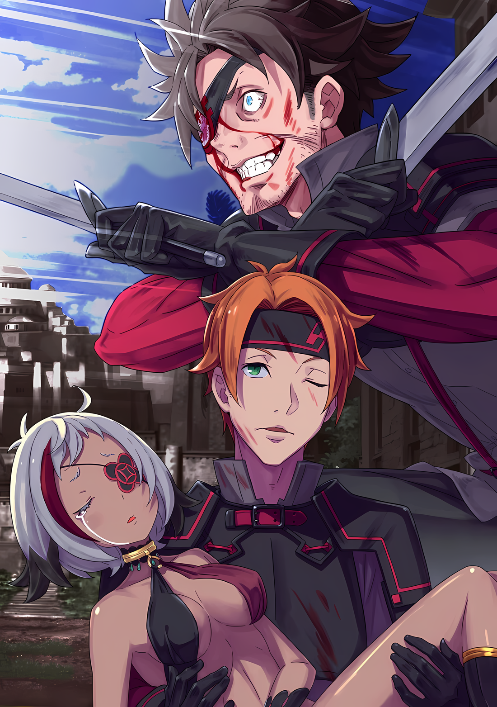

«???: Если ты жив, у тебя будет шанс смыть с себя позор. Но если ты умрешь, то это все. Так что я ухожу. Я не буду ввязываться в битву, которую, как мне кажется, я не смогу выиграть»

В этих словах не было лжи.

Бросаться в битву, имея мало шансов на победу, было глупостью, на которую решился бы только невероятный глупец.

Он не считал себя мудрым, ни в малейшей степени, но именно поэтому он знал, что должен подходить к своим решениям осторожно. Если мудрый человек может прийти к какому-то выводу мгновенно, то глупцу на это потребуется целая вечность.

Тодд знал, что именно так сражаются те, кто не обладает талантом.

Он не ввязывался в битвы, которые не мог выиграть.

Однако, как это ни парадоксально……

Тодд: Нет ничего плохого в том, чтобы ввязываться в битву, в которой у тебя есть шанс победить.

Он поднес сжатый кулак к правому глазу и с тоской посмотрел вдаль через созданное им маленькое отверстие.

Примитивный способ видеть дальше, достигаемый за счет сужения поля зрения. Если прищуриться, глаза Тодда могли видеть довольно далеко, но он не смог бы разобрать, что происходит внутри хаотичной ратуши, не говоря уже о горящих флагах.

И это даже в том случае, если бы ветер был в его пользу.

Джамал: Эй, крыша ратуши провалилась! Что происходит?

Рядом с ним свирепый спутник Тодда был поглощен своим собственным растущим чувством срочности, создавая шум.

Шум нарушил его концентрацию, поэтому он махнул рукой в сторону мужчины, приказывая ему замолчать. Что касается происходящего, он серьезно оценивал ситуацию.

Тодд: Почти уверен, что один из «Девяти Божественных Генералов» присоединился.

Если нет, то не было смысла оставаться в цитадели, попавшей в руки врага.

Как уже говорилось, Тодд подумывал покинуть город и бежать, как только ратуша падет из-за плана врага. Он не собирался вежливо подчиняться приказу о разоружении и сдаваться.

В первую очередь, до тех пор, пока командует дитя войны…… человек, называвший себя Нацуми Шварц, с такими опасными людьми, как Тодд и Джамал, будут расправляться в первую очередь.

Даже в Волакии казни сдавшихся военнопленных не одобрялись, но этот человек наверняка придумал бы вескую причину, чтобы оправдать подобные пародии.

По крайней мере, так поступил бы Тодд. Это было естественное соображение выживания.

Именно поэтому он решил покинуть город без колебаний. Несмотря на это, любопытство взяло верх, и он спрятался достаточно близко, чтобы убедиться в существовании подкрепления, направляющегося в город.

Джамал: Нет никаких сомнений. Это та самая женщина, которую я видел два года назад, когда служил во время разгрома варваров. ……Генерал Первого класса Аракия, «Второй» ранг.

Глядя на скудно одетую женщину, которая неторопливо вошла в город, перепрыгнув через закрытые главные ворота, Джамал произнес эти слова с ноткой волнения в своем фырканье.

Он был из тех людей, которые ходят с дикими инстинктами на рукаве. И с точки зрения его силы как живого существа, и с точки зрения его мужского нрава, позволяющего ему оценивать женщин, он был не из тех, кто забудет любого, кто затронет его сердечные струны.

Другими словами, один из сильнейших среди «Девяти Божественных Генералов» Империи явился, чтобы подавить восстание. ……Так это, должно быть, и есть тот самый «Шанс», который, по мнению Тодда, ранее был упущен.

Но даже так……

Тодд: Действовать или не действовать, это более чем стоит проблем.

Хотя хитрая тактика Нацуми была блестящей, он не обладал прямой боевой мощью, по крайней мере, не в пределах трети силы солдата. «Племя Судрак», последовавшие за ним, славились своей твердостью, но это было лишь относительно обычных людей.

Те, кто был по-настоящему силен, такие как «Девять Божественных Генералов», не были ограничены такими критериями.

Даже Джамал, чьей единственной славой было его потрясающее мастерство владения мечом и боевая доблесть, был лишь примерно так же хорош, как дюжина обычных Имперских солдат. Это и было мерилом того, насколько хорошо можно оценить обычного человека. Члены «Девяти Божественных Генералов» были яркими примерами тех, кто мог бы «позаботиться» о Джамале. ……Ратуша, попавшая в руки врага, будет возвращена.

Тодд: Тогда будет разумно поддержать победившего наземного дракона.

Не было необходимости работать с членом «Девяти Божественных Генералов».

Все, что от них требовалось, это быть более полезными для генерала, чем солдаты, которые были захвачены и не могли выполнять свою работу. Если бы они смогли задержать врага, допросить его и как следует отомстить, то Генерал Первого Класса хорошо запомнил бы их действия.

Если они сделают это, их повысят в должности, и, возможно, они смогут вернуться в столицу Империи раньше, чем должны.

Тодд: Хорошо, мы возвращаемся, Джамал. Мы собираемся помочь ей вернуть ратушу.

Джамал: О? О, да! Хаха, это хорошо. Я рад это слышать! У меня уже давно все чешется, так как убегать — не мой стиль. Я не позволю генералу первого класса присвоить себе все заслуги!

Тодд: Не глупи. Мы собираемся добиться благосклонности генерала.

Тодд со вздохом посмотрел на Джамала, кулаки которого напряглись в предвкушении возвращения в бой в ответ на изменение планов. Отправившись к зданию мэрии, они заняли позицию с оптимальным обзором для наблюдения за ситуацией, вместо того чтобы непосредственно войти в здание.

Следуя своим убеждениям до последнего, он был осторожен и предусмотрителен, и……

Тодд: ……Убей его, Аракия.

Верхний этаж ратуши снесло шквальным ветром, едва видимый Генерал Первого класса был в ярости.

Издалека сереброволосая смуглокожая женщина «Второго» ранга орудовала веткой дерева, похожей на импровизированное оружие, и бесчинствовала так, словно была высшим законом мира.

Среди всех тел, беспорядочно разбросанных по залу, не было различия между судракийками и Имперскими солдатами.

В этих обстоятельствах тот, кто стоял перед Аракией с синеволосой девушкой за спиной, был не кто иной, как Нацуми Шварц.

Тодд: …………

Как только он увидел его, в голове Тодда возникли не пренебрежительные мысли типа: «Как он мог быть настолько глуп, чтобы стоять перед генералом первого класса?» или «Как он еще жив?».

Скорее, с предельной бдительностью Тодд громко крикнул в своем сердце.

……Убей этого человека, Аракия!

Прежде всего, к лучшему или худшему, его не волновало, какие заслуги он получит. Его не волновало, что время, которое он потратил на обдумывание своего решения остаться здесь, в итоге оказалось бессмысленным.

Ему было наплевать на все остальное, пока он мог убедиться, что жизнь Нацуми Шварц, дитя войны, была прервана.

Это было бы……

Тодд: ……Эй-эй, ты, должно быть, шутишь.

В тот момент, когда Аракия собиралась убить Нацуми, искренняя надежда Тодда разбилась вдребезги, когда что-то промелькнуло над его туннельным зрением, в то время как он сосредоточился на том, чтобы не пропустить этот решающий момент.

Вспышка красного света разделила Нацуми и Аракию.

Она одновременно величественно бросала вызов Аракии и укрывала Нацуми за своей спиной, как будто казалась абсолютно сильнейшей вещью в мире. Как только он увидел это, равновесие в сознании Тодда значительно нарушилось.

Джамал: Что это было за существо, которое только что упало с неба!? Летающий дракон!? Где летающий дракон!??

Тодд: …………

Джамал: Ты слушаешь меня, Тодд! А как же мы? Разве мы не должны поддерживать генерала первого класса Аракию! Эй! Послушай меня…

Тодд: ……Заткнись, Джамал.

Джамал, чей голос огрубел от изменения ситуации, удивился от слов Тодда.

Не обращая внимания на Джамала, Тодд продолжал наблюдать за сценой в мэрии. Внезапно появившаяся женщина в малиновом платье стояла лицом к лицу с Аракией.

С первого взгляда он понял. ……Эта женщина тоже принадлежала к «Имущим», далеким от нормальных людей.

Нацуми, сумев выжить в, казалось бы, безвыходной ситуации, заставила Тодда остро осознать, что и ему есть что предложить. Что-то, что он «Имел», что отличалось от боевой мощи или удачи.

Тодд: …………

До вмешательства красной женщины, одной Аракии было бы достаточно, чтобы компенсировать разницу.

Однако ситуация изменилась, и решения не предвиделось. Хватит ли веса Тодда и Джамала, чтобы склонить чашу весов в свою сторону?

Джамал: Тодд……!

Тодд: Не двигайся, Джамал. ……Сейчас ты ничего не можешь сделать.

Шансы были против них, и чем дольше Тодд наблюдал, тем хуже становилось.

Тодд знал, что гнев Джамала берет верх над ним, но действовать сейчас было бы пустой тратой времени.

В конце концов……

Тодд: Потому что Генерал Первого класса Аракия только что потерпела поражение.

Клинок красной женщины ударил ее в спину, и Аракия беспомощно упала на землю.

Равновесие было нарушено, и больше оно никогда не склонится в другую сторону.

△▼△▼△▼△

Тодд: …………

Аракия рухнула, и ситуация в Ратуше подошла к своему завершению.

На этот раз Город-Крепость Гуарал полностью перешел в руки врага. Оправиться от этого не было никакой возможности.

«Второй» ранг «Девяти Божественных Генералов» только что был разгромлен, и не было никакой возможности, что другие подкрепления прибудут сюда.

«Девять Божественных Генералов» были могущественными воинами, вершиной военной мощи Империи Волакия.

Сила каждого из «Девяти Божественных Генералов» была эквивалентна огромной армии. Не было ни малейшего шанса, что Империя направит две или три большие армии для решения одной ситуации. Это был конец.

Равновесие было нарушено. Оставалось только найти способ справиться с последующим отступлением.

Тодд: Что же делать дальше?

В тени здания, из которого он наблюдал за событиями в мэрии, Тодд тихо размышлял.

По правде говоря, в нем кипела смесь гнева и разочарования, но выплеснув ее наружу, он ничего не решил.

Теперь, когда причина его возвращения исчезла, разумнее всего было бы убраться оттуда.

Однако……

Джамал: Эй, Тодд… ты, ублюдок, ты же не планируешь сбежать?

Поиски слов, которыми можно было бы убедить Джамала, оказались безрезультатными, и у последнего на лбу выступила синяя жилка.

Поначалу убедить Джамала было делом кропотливым, даже сразу после поражения, в тот момент, когда был сожжен флаг ратуши.

И все же тогда было легко управлять эмоциями Джамала…… Как бы он ни сопротивлялся, Тодду все же удалось заставить его подчиниться, и он неохотно убрал свои мечи.

Однако на этот раз все повторилось иначе: теперь он снова позволил Джамалу достать свои клинки из ножен. Даже если бы Тодд велел ему убрать клинки и снова тихо повернуться, он бы не послушался.

Более того, в зависимости от того, что будет сказано дальше, он может повернуть острие клинка, который он вытащил, против Тодда.

Если бы это произошло, не было бы причин не убивать Джамала. ……Его будущего шурина. Убить его было бы наименее предпочтительным путем.

Если бы и его не вернули в целости и сохранности, выполнить данное обещание было бы невозможно.

Тодд: Давай согласимся с этим.

Джамал: Аа?

Тодд: ……Я понимаю, что ты чувствуешь. Но тебе нужно успокоиться. Теперь, когда Генерал Первого класса Аракия побеждена, у нас нет шансов на победу, даже если мы войдем. Ты хочешь огорчить свою сестру напрасной смертью?

Джамал: …………

Попытка убедить его, используя любовь к семье как щит.

Как только он уставился на своего противника, надеясь, что это сработает, рука бесшумно протянулась и схватила его за шиворот рубашки. Затем, зарычав, одноглазый Джамал обнажил клыки, притягивая Тодда к своему лицу.

Джамал: Эй, если ты думаешь, что при упоминании Кати я отступлю, то ты сильно ошибаешься.

Тодд: Понятно…… Жаль.

Покачав головой, Тодд довольно искренне выразил свое разочарование.

Если бы Джамалу стало легче от того, что он нанес ему пару ударов, Тодд бы разрешил, но, похоже, Джамал не собирался этого делать, так как вместо этого он прищелкнул языком и оттолкнул Тодда.

Не было никакой необходимости в том, чтобы он так прямолинейно высказывался, но остановить его не было никакой возможности.

Тодд повернулся лицом к Джамалу и задумался о том, как бы ему самому перелезть через стену цитадели.

К счастью, он уже разобрался в географии города еще тогда, когда они пытались найти какие-нибудь тайные тропы. Хотя Аракия и не достигла своей цели, ей тоже удалось внести некоторую сумятицу. На самом деле, сбежать было бы легче, чем до появления Аракии.

Очевидно, Джамал собирался устроить еще одно буйство, чтобы его заметили.

Тодд: Джамал, мне жаль, но я ухожу. Я скажу это еще раз, но ты, наверное, не послушаешь: ты умрешь собачьей смертью. Даже если ты войдешь туда, ты не сможешь убить их всех….

Джамал: Ты тупица! Я не собираюсь заниматься таким бесполезным делом! Я иду спасать Генерала Первого класса Аракию.

Тодд: ……Что?

Он ожидал бессмысленной сентиментальности, но вместо этого другой произнес несколько неожиданных слов.

Тодд остановился на месте и уставился на лицо Джамала, из которого вырвалось невнятное «Что?»

Джамал: Ты действительно думал, что я собираюсь вступить в бой с решимостью умереть?

Тодд: Да, думал. Я думал, ты хочешь умереть как собака.

Джамал: Прекрати! Я пользуюсь твоими умными мыслями, но у меня тоже есть мозги, чтобы думать самостоятельно! Я могу отличить, что я могу делать, а что нет.

Джамал серьезно удивил Тодда своим неожиданным заявлением.

В его военном опыте можно было увидеть некоторые достижения, но в остальном он был настолько прям и безыскусен, что Тодд счел его человеком, не знающим, что такое мышление.

Джамал: Ничего не поделаешь, если ты трус, видимо, Катя плохо разбирается в людях. Я собираюсь спасти Генерала Первого класса. У нее хорошая задница.

Тодд: ……Подожди, я иду с тобой.

Джамал: О!? Только не говори мне, что тебя не устраивает задница Кати…?

Тодд: У меня не было намерения участвовать в твоей самоубийственной миссии, но если это не так, то это уже другая история.

Не выдержав позорных обвинений, Тодд запечатал рот Джамала ладонью. Заставив его замолчать, Тодд составил график действий, который следовал за изменением планов в его голове.

Не в характере Тодда было делать что-то впопыхах. Однако, к сожалению, чем больше времени он проводил с Джамалом, тем больше опыта приобретал в области импровизации.

Если бы Джамал собирался умереть достойной смертью в одиночку, чтобы вновь захватить мэрию, он бы оставил его в покое. Но если его целью было вернуть Аракию, это была совсем другая история.

Тодд: …………

Ситуация в Ратуше постепенно прояснялась.

Единственное, чего следовало опасаться — это Нацуми и красную женщину. В их присутствии предпринимать какие-либо действия было бы самоубийством. Однако это не означало, что их врагу удалось выйти из ситуации невредимым.

Если бы они забыли о бдительности, была бы возможность воспользоваться ситуацией.

Джамал: Я войду и устрою сцену. Если мы воспользуемся этой возможностью и спасем Генерала Первого класса….

Тодд: Я был впечатлен раньше, но теперь все прошло…… Есть два человека, которых нам нужно опасаться. Ты должен избегать любых действий рядом с ними. Не стоит беспокоиться.

Губы Тодда разжались, когда он посмотрел на Джамала из щели между пальцами, укоряя его за эту варварскую рассеянность. Он ткнул кончиком языка в свой белый клык и ухмыльнулся.

Уголком глаза он увидел, что Аракию уводят, хотя она была при смерти.

Если она не умерла, значит, был способ ее вытащить.

△▼△▼△▼△

……Проникнуть в ратушу было легко.

В конце концов, именно здесь находилась их штаб-квартира, пусть и недолго.

У Тодда обычно была привычка изучать географию и планировку любого места, куда он заезжал хотя бы раз. Он не чувствовал себя в безопасности, если не знал, куда бежать или прятаться.

Именно поэтому, после того как лагерь в Джунглях Будхейма был сожжен и он вошел в Гуарал, он посетил все части города, включая мэрию, и составил ментальную карту.

Он знал, где можно убить незаметно, а где спрятаться, чтобы избежать обнаружения.

Неважно, где и с какими угрозами они столкнутся, у него всегда был способ убить и способ сбежать.

Тодд: Пятеро.

Когда он пробрался внутрь ратуши, он разбил несколько часовых тут и там.

На страже стояли не Имперские солдаты и не «Племя Судрак», а стражники местного правительства, которые обеспечивали безопасность города. Они были призваны в качестве солдат теми тревожными элементами, из-за которых пал город…… Хотя теперь их уже нельзя было назвать прекрасной «Повстанческой армией».

Джамал: Я не собираюсь проявлять к тебе никакой пощады.

Джамал раздраженно сплюнул, когда двуручным захватом свернул шею часовому.

Джамал больше гордился тем, что он Имперский солдат, чем тем, что он Имперский дворянин. Его гнев на гвардейцев, сотрудничающих с повстанцами, сражающимися против Империи, был безмерен.

До падения города они сотрудничали с Имперскими солдатами, поэтому вполне понятно, что он был разгневан тем, как быстро они изменили свою точку зрения.

Тодд: Ну, это не мой образ мыслей.

Он убил их только потому, что был вынужден, и если бы это не было необходимо, он бы этого не сделал.

Их нельзя винить за то, что они так быстро перешли на другую сторону, если они просто следовали за более сильной стороной, чтобы выжить. Конечно, за свое неверное решение они должны были заплатить жизнью.

Итак, пара, состоящая из Джамала и его самого, направилась к своей цели, попутно уничтожая стражников на своем пути.

В подвале мэрии находилась тюрьма, куда обычно помещали преступников, ожидающих суда мэра города. Вполне вероятно, что и Аракия, попав в плен, будет содержаться там же.

Естественно, железная клетка была не лучше клетки из сахара против кого-то из Девяти Божественных Генералов, но даже в этом случае они не могли просто оказать гостеприимство в комнате для гостей.

Тодд мог сделать то же самое……

Джамал: ……Вот она, Генерал Первого класса.

В подземном помещении внизу, по обеим сторонам коридора было размещено несколько камер. Меньшие преступники располагались в порядке очереди спереди, а самые опасные — в дальнем конце.

Естественно, камера в дальнем конце, где содержалась Аракия, охранялась очень строго.

В отличие от предыдущих, перед ней стоял не стражник, а судракийская женщина. Это была крупная женщина с желто-русыми волосами, и с первого взгляда можно было понять, что она очень опытна.

Кроме того, из-за особенностей планировки, невозможно было попасть в камеру Аракии, не будучи обнаруженным этой женщиной.

Другими словами……

Джамал: Похоже, на этом наши маленькие проделки закончились.

Тодд: ……Ты, почему ты выглядишь таким счастливым?

Трудно было понять счастливое отношение Джамала, когда неизбежная битва была неизбежна.

Желанием Тодда было избежать убийства, и он не хотел сражаться, если мог помочь. Если бы и то, и другое было неизбежно, он выбрал бы более легкий и менее опасный путь.

Однако Джамал выглядел так, словно ему нравилось бросаться в опасность.

Возможно, он думал, что чем опаснее, тем больше крови он прольет и тем больше верности проявит по отношению к Империи.

Джамал: Это же очевидно, не так ли? Сражайся как Имперский солдат и выиграй войну! Только так я могу с гордостью сказать, что я Имперский солдат.

Тодд: …………

Джамал: Эй, чему ты удивляешься?

Тодд: Нет, все было почти в точности так, как я и предполагал.

Редко можно было встретить человека, чьи слова и дела были настолько последовательны.

Джамал выглядел неловко при ответе Тодда, но быстро покачал головой. Затем он провел пальцами по своей щетине и фыркнул.

Джамал: А. Ну, тогда это ты сомневаешься, не так ли?

Тодд: Я не могу согласиться на миссию самоубийцы. Если это не так, я еще могу подумать. Но в данной ситуации я даже не раздумываю.

Джамал: Ты пытался сбежать, но у тебя не получилось.

Тодд: Я решил привезти сувенир, пока был в бегах. План не изменился.

Джамал: Сперва ты говоришь одно, потом другое…… кх.

Джамал сердито стиснул зубы, его глаза налились кровью.

С таким выражением лица Тодд отвлекся от него и сосредоточился на цели.

Женщина, стоявшая на страже, была плотной, и ее конечности были защищены достаточным количеством плоти. Учитывая атлетические способности судракиек, даже топор Тодда не смог бы перерубить одну из ее конечностей.

Значит, неизбежно, что удар придется по шее.

Можно было размозжить ей голову, обезглавить или раздробить лицо, но……

Джамал: ……Вот тут-то я и вступаю в игру, не так ли?

С этими словами Джамал глупо шагнул вперед.

Тодд на мгновение задумался, не стоит ли ему отозвать его, но в итоге ничего не сказал. На самом деле, лучше всего было бы подтолкнуть Джамала к действию, привлечь ее внимание, а затем действовать дальше.

Это сэкономит много времени и проблем, и если он готов это сделать, то не стоит его отговаривать.

Холли: Мммм, кто ты~!?

Джамал: Я должен отвечать на такое? Вы, люди, осквернили Волка-Меча Империи Волакия. Не смейте думать, что вы победили в битве, в которой меня не было!

Хоули: Странный парень~!

Глядя на Джамала, который вошел в зал, судракийская женщина держала наготове большое копье. С другой стороны, Джамал, стоявший перед ней, достал свои двойные мечи и танцевал с маньячной улыбкой на лице.

У Джамала была своя доля проблем, но его способности были известны. По крайней мере, пока его противником был один член Судрака, он не уступал.

Джамал: Получай! И это! И это!

Хоули: ……Кх! Ты сильный парень~!

Разъяренные мечи-близнецы бесчисленное количество раз ударили по судракийской женщине, пока Джамал громко кричал. Женщина уклонялась от них с помощью копья, но она была в обороне.

Она должна быть человеком с определенным уровнем мастерства, чтобы следить за Аракией. Однако, похоже, она не ожидала, что кто-то явится, чтобы забрать пленницу, как только ее посадят в темницу.

Кроме того, отсутствие надежных войск также было критическим недостатком повстанцев.

Тодд: Тем не менее, на данный момент они не являются полезными активами.

Увлажнив губы языком, Тодд выскочил из-за спины Джамала и прыгнул прямо к камере, проходя мимо них двоих, когда они яростно сцепились оружием, разбрасывая искры.

Хоули: Ах! Его союзник… Кья!

Джамал: У тебя есть время осмотреться? А!

С помощью необычайно остроумного Джамала Тодд со всей силы ударил топором по замку камеры.

Времени на поиски ключа не было. Он не мог разрушить камеру, но мог хотя бы сломать замок.

Раздался тупой звук и жесткий ответ, когда острие топора громко треснуло. Но вместо этого замок камеры с грохотом сломался, и Тодд вскочил внутрь через скрипучую дверь.

Тодд: Генерал Первого класса Аракия!

Внутри камеры на простой кровати лицом вниз лежала девушка.

Даже если они принадлежали к одной Имперской армии, у простого солдата было не так много возможностей встретить «Генерала». Даже Генерал Третьего класса был командующим армией. Генерал Второго класса, не говоря уже о Генерале Первого класса, был чем-то заоблачным.

Поэтому Тодд впервые видел генерала первого класса, одного из «Девяти Божественных Генералов», вблизи.

Аракия: …………

Причина, по которой потерявшая сознание Аракия лежала на лице, заключалась в порезе, полученном ею на спине, покрытой болезненным шрамом, который к тому же был выжжен.

Рана была прижжена в тот же момент, когда была получена, превратившись в ужасный шрам. ……Если бы она не была ранена раскаленным клинком, то не получила бы такой раны.

Тодд: Та красная женщина, что она……?

Эта женщина не была обычным человеком, и сила того богато украшенного меча, который она держала, тоже была необычной.

Больше никаких подробностей не было, и Аракия не ответила, когда ее позвали. Поэтому Тодду не оставалось ничего другого, как поднять тело Аракии, а затем сразу же выбежать из камеры.

Тодд: Я поймал ее! Джамал, пошли!

Хоули: Я не позволю тебе…… Ай!

Джамал: Схерали ты смотришь в ту сторону! Не смей так делать! Ныыаа…… Кх!

Мысли судракийской женщины на мгновение отвлеклись, когда Аракию увели.

Через мгновение Джамал прыгнул на женщину, как вспышка, со своими двойными мечами. Она тут же подняла свое большое копье вертикально, чтобы предотвратить удар, но удар вырвал копье из рук женщины, а удар Джамала назад пронзил ее незащищенный торс, когда он вскочил на ноги.

Женщина издала слабый крик, когда ее тело врезалось в стену тюрьмы; ее голова с силой ударилась о землю, и она упала без движения.

Глядя на нее, Тодд собирался приказать Джамалу добить ее, но……

Тодд: ……Эй, наверху переполох. Они нашли тело стражника?

Джамал: Тч, мы не можем оставаться здесь. Генерал Первого класса….

Тодд: Она без сознания, но не мертва. Этого должно быть достаточно.

Прямо ответив на вопрос Джамала, Тодд выбежал из подземелья. Джамал, шедший впереди него, расчищал дорогу для Тодда, который легко обогнал его.

???: Кто в этом мире… Гуа!

Джамал: Прочь с дороги, тупоголовые ублюдки!

Стражник, заглянувший в подвал, был снесен косой, а Тодд побежал по ратуше вслед за Джамалом, поскольку все внутри становились все более настороженными.

К сожалению, у него не было возможности позаботиться о теле Аракии, пока он нес ее. Если бы она была одним из «Девяти Божественных Генералов», ее тело, вероятно, было бы достаточно сильным. Ему оставалось только довериться своей выносливости и бежать.

Джамал: Мы снаружи! Куда мы идем?

Тодд: Главные ворота закрыты. ……Следуй за мной.

Прокладывая себе путь через темную и бурную ночь города, Тодд вместе с Джамалом прыгал в глухие переулки. Он в полной мере использовал узкие улочки и боковые дороги, чтобы ввести в заблуждение врагов, отслеживающих их местонахождение.

Битва только что закончилась, хаос еще бушевал, а в городе было не менее трехсот одинаково одетых Имперских солдат. Отличить их было бы трудно.

Оставалось только……

Тодд: ……Кх!

Как только он услышал шум ветра, прямо позади Тодда взметнулся клинок.

Он обернулся, и тут прямо под его ногами застряла одна толстая большая стрела. Кто-то срубил ее. Стрела была нацелена на Тодда, несла безумный импульс, и Джамал был единственным, кто быстро справился с ней.

Это был точный выстрел, направленный на тех двоих, которые бежали и прятались в городе.

Без тени сомнения, это был тот же лучник, который несколько дней назад ранил Тодда в туловище.

……За ними наблюдали.

Если это так, то они не могли двигаться беспечно.

Если бы они покинули переулок, это сделало бы их легкой мишенью, а Тодду, с Аракией на буксире, было бы трудно двигаться проворно. Даже если бы они попытались убить лучника, враг находился в ратуше, и не было другого выхода, кроме как вернуться туда в третий раз.

Так стоит ли им бросить Аракию и бежать? Это был бы самый верный способ спастись, но в этом случае они не знали бы, ради чего рискуют жизнью.

В свете сложившейся ситуации он искал оптимальный способ действий, и тот, который принес бы наибольшие результаты, был……

Тодд: ……Джамал, ты знаешь, что мы являемся мишенью.

Джамал: Да, они заноза в заднице. Они слишком далеко, чтобы я мог их убить, но если мы этого не сделаем, они так или иначе будут стрелять в нас. Что нам делать?

Тодд: …Значит, есть только один выход.

Джамал сузил свой единственный глаз при этих словах Тодда.

На взгляд Джамала, который искал решение, Тодд глубоко выдохнул и закрыл один глаз,

Тодд: Как только мы выскочим, враг начнет стрелять по нам. Я попрошу тебя идти впереди меня и отсекать их стрелы, как и раньше. Не один выстрел, а два или три последуют за ним. Я побегу как можно быстрее, чтобы не стряхнуть с себя Генерала Первого класса.

Джамал: Хм, это на тебя не похоже. Это действительно твой ход? Попахивает отчаянием, нет?

Тодд: В конце концов, вот что происходит, когда у тебя заканчиваются карты. Но мне все равно повезло, не так ли?

Джамал: А? Что ты имеешь в виду?

Тодд: У тебя остались довольно сильные руки, знаешь ли.

Стратегия, которую он представил, почти полностью основывалась на мастерстве Джамала в фехтовании.

Если бы Джамал был не в состоянии отсечь летящие стрелы, они оба погибли бы. Учитывая убеждения Тодда, рисковать своей жизнью таким безрассудным образом было безумием.

Однако это было его предложение. Учитывая мастерство Джамала в фехтовании, шансы были не нулевые.

Джамал: ……Я знал, что Катя плохо разбирается в людях. Я думал, ты умнее.

Тодд: Не говори плохо о моей жене, братец-сама.

Тодд ответил Джамалу, почесывая голову, его щеки порозовели. Услышав это, Джамал издал короткое «Хаа», а затем снова схватился за рукояти своих двойных мечей.

Затем он снова повернулся к Тодду.

Джамал: Хорошо, я в деле. Иногда глупое пари не так уж плохо.

Тодд: Если бы меня здесь не было, ты бы, наверное, делал все эти ставки.

Джамал: Заткнись к черту. ……Заткнись и держись за моей спиной.

Настроение Джамала тихо поднималось, пока они обменивались ненавистными словами.

Наблюдая за его спиной, Тодд крепче прижался к телу Аракии.

Тодд: Джамал, когда выйдешь из переулка, беги прямо. После этого, когда дойдешь до конца, сверни на правую дорогу. Это даст тебе достаточно времени, чтобы перевести дух.

Услышав эти указания, Джамал задумался над ними, медленно закрыл глаз, затем снова открыл его, шагнув вперед.

Джамал: ……кх

Как только он вышел из переулка, одна стрела, одетая в штормовку, вонзилась в Джамала.

Джамал среагировал на нее с удивительной ловкостью и отсек ее ударом своих мечей-близнецов. Удар отскочил на запястье Джамала, и его стиснутые зубы зазвенели, когда он захохотал, как бешеная собака.

Ощущение горящей крови, прыгающего сердца и кипящей жизни переполняло Джамала.

Его предельная концентрация сделала мир заторможенным, и ему казалось, что он чувствует каждую каплю пота, стекающую по его коже, каждую песчинку, летающую вокруг, и даже существование воздуха, который должен был быть невидимым.

Джамал: ……Хахаа!

Одна за другой стрелы сыпались, как ливень.

Ступив на землю, он взмахнул мечом, словно танцуя, срезая стрелы и поражая их.

Все происходящее было танцем меча, танцем меча Джамала Орели.

Если бы все прошло хорошо, то на следующий день они смогли бы насладиться танцем танцовщицы, приглашенной в ратушу.

Джамал смеялся при мысли, что все было испорчено, и вместо нее танцевал он. Но это был танец всем сердцем, танец всем телом, бой на мечах со всей энергией.

Тодд тоже восхищался усилиями Джамала, который яростно отражал атаки.

Тодд, не повышая голоса, следил за тем, как на него обрушивается шквал смертоносных стрел. Это был знак того, что он знал: если Джамал отвлечется, это приведет к его смерти.

Поэтому Тодд вытеснил Джамала из своего сознания и сосредоточил всю свою энергию на том, чтобы избежать надвигающейся «Смерти».

Прямое движение, уклонение, удар, наступление, прыжок, рассеивание и рассечение.

Джамал: А вот и конец пут…… кх.

Чудесным образом они закончили прямой путь смерти и попали в конец указанного пути.

Время шло неясно, и танец мечей, должно быть, длился всего несколько секунд, хотя казалось, что он продолжался часами. Однако они преодолели только первый барьер. Не желая расслабляться, Джамал сделал то, что ему сказали, и повернул направо в конце дороги, где..,

……В конце разбитой дороги стояла группа судракиек с нацеленными на них копьями.

Джамал: ……Пиздец.

Было бы трудно справиться с таким количеством судракиек, когда в них целится лучник. Можно сказать, что это было невозможно.

Он был готов сражаться, пока не выдохнется, но даже если так, он не мог ничего оставить про запас. Он и представить себе не мог, что его так прекрасно предвидят, и казалось, что удача полностью покинула его.

Джамал: Даже если ты будешь строить из себя умника, в конце концов, удача от тебя уйдет, ха…… Хех, все напрасно. Но все было не так уж плохо.

Проверяя ощущение мечей-близнецов в своих окровавленных руках, Джамал выложил это Тодду позади него.

Все было совсем не плохо, сказал он, и он это имел в виду.

Во многих отношениях мысли и действия Тодда были ошеломляющими и разочаровывающими.

Однако в конце концов он решил проявить себя как Имперский солдат.

Джамал: Мне жаль Катю, но ничего не поделаешь. Она тоже принадлежит к Имперскому дворянству. Я уверен, что она была готова к тому, что это случится с тобой и со мной.

Подумав о сестре, которую он оставил в столице Империи, Джамал почувствовал слабое покалывание в груди. Однако вскоре его заглушило желание сражаться с врагом, стоящим перед ним, и запах крови, которым было пропитано все вокруг.

Он почувствовал облегчение. ……Он до мозга костей был Меченым Волком Империи Волакии.

Джамал: Давай сделаем это, Тодд. Давай хотя бы в последний раз покажем им, из чего мы сделаны.

Наклонившись вперед, Джамал слизал кровь, текущую из его правого глаза, закрытого повязкой.

Затем он яростно бросился на врага, чтобы продемонстрировать свой последний престиж Имперского солдата.

Смертоносные атаки обрушились на него как ураган, но он больше не жалел об этом.

Тот факт, что он смог остаться самим собой до самого конца, был для Джамала самой большой наградой.

△▼△▼△▼△

???: ……Ты был идиотом до самого конца, не так ли?

Услышав вдалеке яростный рев Джамала, Тодд пробормотал это, ныряя сквозь стену.

Отверстие, через которое он прошел, сразу же завалилось, и он тщательно стер все следы своего присутствия, чтобы его не могли преследовать. В городе Джамалом, скорее всего, займутся на некоторое время, так что время для побега должно быть.

Все было так, как и говорил Джамал.

Тодд никогда бы не доверил свою жизнь отчаянному плану, даже если бы был мертв. ……Нет, он никогда бы не сделал такого, именно для того, чтобы не умереть.

Тодд: Если я позволю им преследовать тебя в переулке, они отвлекутся. Что ж, мне жаль Катю….

Обещание вернуть зятя останется невыполненным, а его невеста будет убита горем.

Чтобы утешить ее, он пожелал как можно скорее вернуться в столицу Империи. К счастью, в обмен на потерю Джамала он смог найти другой способ вернуться в столицу.

Это была дикая возможность, которая могла привести к гораздо большему укреплению позиций, чем нынешнее положение Джамала…… он был на грани повышения до генерала третьего класса.

Аракия: ……Прин… цесса.

Тодд: О боже, ты выглядишь такой невинной. Даже если ты одна из «Девяти Божественных Генералов», то количество убитых тобой людей будет больше сотни или двух.

В объятиях Тодда слезы Аракии текли из ее закрытого глаза. Когда он смотрел, они катятся по ее щекам, в голове Тодда промелькнула смутная мысль, что его нынешняя спутница носит повязку на глазу, как и его предыдущий.

Подумав об этом, Тодд вдруг наклонил голову.

И……

Тодд: С какой стороны у Джамала была эта повязка…?

Иллюстрация к **Ранобэ** Том 28 | Разукрасил NorvakKK
