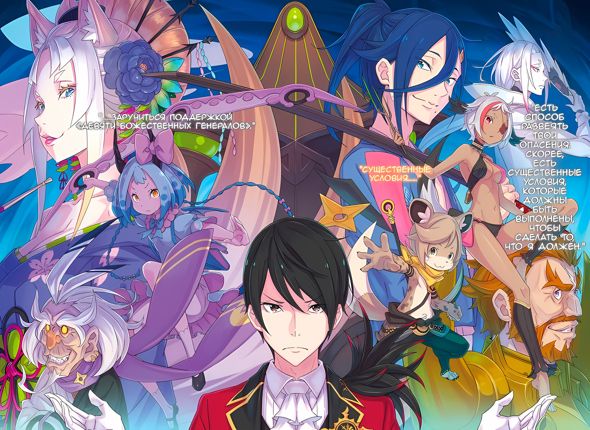

……Весть о том, что захваченная Аракия была украдена, вызвала дрожь в зале заседаний.

Куна: Какой позор. Даже лук Хоули не смог достигнуть их, они сбежали.

Хоули: Точно~

Два человека, которые повесили головы и извинились, были Хоули, которая держала лук в руке, и Куна.

Вместе с Хоули, принесшей плохие новости, Куна сразу же поднялась на верхний этаж, чтобы преследовать убегающую Аракию. Затем, используя силу рук Хоули и зоркость Куны, они открыли огонь по беглецам, как это было с Тоддом, когда Субару и остальные сбежали из Гуарала.

Однако беглецы смогли справиться с дальнобойной стрельбой двух человек и успешно перехитрили их обоих, забрав Аракию.

Куна: Один из них остался позади в качестве приманки, а другой забрал Божественного Генерала. Мы не можем позволить этому закончиться так, мы должны пойти за ними….

??? и ???: ……Это бессмысленно.

Слова расстроенной Куны, сморщившей нос от сожаления, прервали два голоса.

Одни и те же слова одновременно произнесли Абел и Присцилла, неподвижно сидевшие за круглым столом. Они посмотрели друг на друга, и Присцилла закрыла глаза.

Это был знак, что она хочет оставить слово Абелу.

Абел: ……Это был способ проникнуть за наши линии с небольшим количеством людей, достичь единственной цели и сбежать. У них обоих были четко определены роли на случай, если их разделят. Их смелость в решении сделать это, и суждение о побеге, достойны оценки. Они не будут пойманы, даже если кто-то отправится за ними в погоню.

Куна: ……Кх, но даже так…

Абел: Менее чем через полдня Аракия проснется. Если это произойдет, у преследователей, которых мы пошлем за ней, не будет ни единого шанса. А если они передумают и вернутся в город, это тоже будет бесполезно. Позволь мне сказать, что нам не повезет дважды. По крайней мере, я бы сказал, что с нашими нынешними силами было бы весьма безрассудно.

Куна: Гах…… кх.

Хоули: Куна… То, что говорит Абел, верно~.

Отрывистыми фразами Абел пытался сбить настойчивость Куны. Хоули, стоявшая рядом, легонько похлопала Куну по плечу, словно желая утешить.

Будучи представителем вождя на круглом столе и уверенная в своем умении стрелять из лука, Куна, должно быть, испытывала горькое разочарование. Однако, несмотря на его резкий тон, Субару кивнул в знак согласия с доводами Абела.

Имперские солдаты, вторгшиеся в тюрьму, не осмелились бы бросить им вызов, не имея шансов на победу. Они поставили перед собой цель, которая была достижима в их обстоятельствах, нашли способ победить и выполнили его.

Естественно, они не стали бы делать ничего полусерьезного, вроде путешествия в один конец, поэтому у них должен был быть соответствующий план побега.

Присцилла: Как ни крути, судьба этого существа на этом не закончилась. В таком случае, я уверена, что оно еще сыграет свою роль.

Субару: Присцилла….

Присцилла небрежно бросила эти слова в воздух, когда наступила тишина.

Для Субару, который незадолго до этого обсуждал обращение с Аракией, его чувства по поводу того, что ее не казнили и увезли, не дав возможности поговорить с ней, были сложными.

Но что думала о ее похищении Присцилла, которая придерживалась позиции не вмешиваться в жизнь и смерть Аракии? Этого нельзя было прочесть по ее пунцовым глазам.

Ал: Итак, в конце концов, что мы будем делать с этой девушкой, Аракией? Ты решил оставить ее в покое?

Субару: ……Если ее забрали, мы больше ничего не можем сделать.

Со страдальческим выражением лица Субару ответил на слова Ала, который не умел читать настроение.

Справившись со снайперской стрельбой Куны и Хоули, они не могли ожидать, что кто-то, обладающий лишь полуприличными навыками, возьмется преследовать беглецов. В таком случае это ограничивало круг тех, кого они могли выбрать для преследования, и нельзя было допустить, чтобы все, кто обладал хорошими навыками, отсутствовали в Гуарале в данный момент.

Несмотря на все его попытки найти решение, сила Субару заключалась во внезапных атаках, что делало его особенно неприспособленным к случаям, когда противник брал инициативу в свои руки. И такое положение дел наглядно это продемонстрировало.

Субару: Кстати, я не думаю, что это вероятно, но что если они все еще скрываются в городе, притворяясь, что сбежали?

Зикр: Я так не думаю. Хотя город, как утверждается, надежно укреплен, кроме двух больших ворот есть и другие тайные пути, но все они были тщательно перекрыты в последние несколько дней.

Субару: Тщательно….

Зикр: Да. Мы ожидали, что вы воспользуетесь тайными ходами, чтобы проникнуть в город. Мы, конечно, не думали, что вы предпримете безрассудный план прорыва с фронта.

Его поймали на слове, но Зикр ответил спокойно, без тени недовольства.

Как главнокомандующий города-крепости, он должен был опасаться любых тайных путей. Однако оборонительная позиция, занятая под руководством Зикра, послужила попутным ветром для солдат, захвативших Аракию и сбежавших.

Зикр: Возможно, солдаты, захватившие Генерала Первого класса, были частью поисковой группы, ищущей тайные тропы. Как сказал Абел-доно, они не из тех, кто принимает вызов без перспективы победы. В таком случае, интересно, смогли ли они сделать это, потому что знали, что выход есть?

Субару: Разве нельзя найти на карте расположение путей, которые вы устранили?

Зикр: ……Можно было бы сделать карту, но не сейчас. Город пал, и солдаты очень потрясены. Этот хаос не скоро уляжется.

Субару: ……Если бы это была игра, все было бы так просто.

Если бы это было действие в видеоигре, то стоило бы заставить командира поверженного врага перейти на свою сторону, и подчиненные ему подразделения тоже вступили бы в союз. Однако реальность не была игрой. В игре солдаты были представлены цифрами, а здесь у каждого из них была своя жизнь.

Поразмыслив над этим некоторое время……

Субару: Хоули-сан, ты ранена?

Хоули: Хм? Ты беспокоишься обо мне~? Нацуми так добра~.

На вопрос Субару, Хоули вскинула руки вверх, широко улыбаясь. Она показала свои большие бицепсы, чтобы подчеркнуть, что она жива и здорова.

Хоули: Я немного ушиблась, но не сильно, так что скоро буду в порядке~.

Субару: Понятно. Я рад это слышать… Но.

Когда Субару замялся и опустил взгляд, Хоули изобразила на лице недоумение. Заметив внутренние мысли Субару, Куна почесала голову и сказала «Ах».

Затем……

Куна: Некоторые из стражников, которые стояли внутри здания, были убиты. Они все были мертвы, поэтому мы не могли ничего сделать.

Субару: ……Некоторые? Скажи мне, сколько их?

Куна: …Семь человек.

На вопрос о точном количестве жертв, Куна, хотя и с сомнением, ответила.

Семь. Число жертв глубоко врезалось в сердце Субару. ……На верхнем этаже Рем прилагала огромные усилия для лечения Имперских солдат и судракиек, получивших ранения во время атаки Аракии, и они не получали никаких сообщений о погибших. Они их не получали, но……

Субару: …Бескровная осада……

Расчесывая свой длинный черный парик, Субару издал душераздирающий вздох.

Бескровная осада, которую он предпринял с такой энергией, и которую, как он сказал, выполнит, должна была привести к падению Гуарала без человеческих жертв. Однако вместо этого она привела к многочисленным жертвам.

Его обещание было нарушено; даже если бы его обвинили в том, что он лжец, он не смог бы ответить. Даже если бы никто не обвинил Субару во лжи, Субару, несмотря на это, осудил бы себя как лжеца.

Потому что он был самым большим лжецом здесь……

???: ……Бескровная осада?

Услышав бормотание Субару, чей-то голос повторил его слова, словно размышляя над этими словами.

Это была Присцилла, облокотившаяся на круглый стол и прислонившаяся щекой к руке. С необычным выражением лица, она слегка приподняла бровь правильной формы и изучала Субару.

С таким выражением лица Присцилла предварила свое заявление одним словом: «Ты».

Присцилла: Мне показалось, что я услышала очень глупую вещь. Ты действительно верил, что сможешь разрушить целый город без пролития крови? Посреди этой войны, без подавляющей военной силы?

Субару: ……Да, верно, виноват. Нет, это действительно была моя вина, не так ли? В конце концов…… под конец дня, я совершил ошибку….

Присцилла: Это была просто глупая идея, вот что меня поразило. Я поражена тем, что ты даже пытаешься воплотить эту мечту в жизнь. ……Абел, ты с ума сошел?

Абел: ……Сам план был чистейшим безумием.

Вопрос был адресован Абелу, который скрестил руки и тихо ответил.

Предложенный Субару план был чистым безумием. На самом деле, любой, кто слышал его набросок, наверняка согласился бы с этим. И все же Абел принял его предложение.

Присцилла, которая, по-видимому, была с ним знакома, казалось, не понимала этого.

Присцилла: Взгляд на Империю с трона сделал тебя еще более расхлябанным. Не бывает войны без жертв. Не бывает гордости без кровопролития. Таков путь Империи, не так ли?

Абел: Я не намерен нарушать кодекс Волка-Меча. Я сказал, что это безумие, но шансы были в мою пользу. На самом деле, если бы не присутствие Аракии, осада была бы бескровной.

Присцилла: …………

Абел: Это не план пошел не так. Это было мое суждение. Присцилла, я не позволю даже тебе выставить на посмешище мое предложение военного стратега. Это было мое решение. Вина лежит на мне.

Субару: О….

Абел столкнулся с Присциллой лоб в лоб с заявлением, которое было слишком неожиданным.

Слова и действия Абела были явно в защиту Субару, хотя он и был назначен на неслыханную роль военного стратега. Он не мог вмешаться в опасное противостояние этих двоих.

Ал: В чем дело, брат? Ты ему очень нравишься, похоже, ты получишь большое повышение.

Субару: ……Мое положение рыцаря Эмилии-тан и опекуна Беако меня вполне устраивает. Я не хочу, чтобы мне давали еще какие-то должности, с которыми я не знаком.

Субару оттолкнул от себя Ала, а также оттолкнул от себя ответственность, которая давила на него.

Однако, благодаря защите Абела, внимание Присциллы, казалось, переключилось в этом направлении. Несмотря на это, рана на внутренних органах Субару не затянулась.

Ответственность за погибших должна быть возложена на Субару, того, кто придумал и осуществил этот план.

Ал: Ты не можешь спасти их всех, брат.

Пробормотал Ал, возившийся с металлическими креплениями своего шлема, глядя на профиль Субару. Когда Субару взглянул на него, Ал поднял взгляд к потолку и сказал:

Ал: Ты не можешь спасти всех людей, с которыми связался. Никто не мешает тебе спасти их, но при этом твое сердце будет разбито. Не рекомендую.

Субару: Ал….

Ал: Мы все живем и умираем… как хотим. Как ты и сказал, брат, это не игра. Они сами должны позаботиться о своей жизни.

Это было циничное отношение, которое Ал иногда демонстрировал.

С одной стороны, он читал проповедь Субару о том, как произошли трагические события и что он должен принять их как есть, хотя, казалось бы, там были хорошие советы и наставления. С другой стороны, это было похоже на наставление упрямого ребенка.

В какой-то степени это был здравый аргумент.

По сути, слова Ала были правильными. Спасти всех и вся было невозможно, а если бы он решил спасти всех, то этому не было бы конца. Именно поэтому Субару до сих пор не удавалось спасти все до единой вещи.

Масштабы войны были совсем другими. ……Может ли он действительно сказать, что его выбор был правильным?

Количество жизней, которые могли быть спасены одним действием Субару, не достигало и десяти, не говоря уже о сотне.

Присцилла: Это даже хуже, чем фарс, знаешь ли.

Пока Субару и Ал разговаривали, Присцилла и Абел продолжали свое противостояние.

Чтобы Абел взял вину на себя, Присцилла вытащила веер из своего декольте и направила его кончик на конференц-зал…… Нет, на весь город.

Присцилла: Даже в ситуации, где вам удалось успешно вторгнуться в город с помощью вашего военного стратега, вам не удастся повторить чудо с изгнанием Аракии во второй раз. Сработает ли этот метод хотя бы еще один раз?

Абел: Действительно, второго раза не будет.

Абел без колебаний кивнул в ответ на вопрос Присциллы.

При упоминании метода, который прогнал Аракию, хмурому Субару пришла в голову одна мысль. ……Во время схватки Ала и Аракии был момент, когда ее поведение стало странным.

Субару: Это было не то, что сделал Ал….

Ал: Что? Да, это был не я. В первую очередь, если бы это был я, я бы сделал это немного умнее. Знаешь, это ведь я был тем, кто отскочил и отбросился.

Субару: Верно.

Теперь, когда он упомянул об этом, все прошло не очень хорошо, даже с учетом навыков Ала.

Разговор между этими двумя привлек внимание конференц-зала к Абелу. Только он мог сказать, что каким-то образом произошло, и поэтому он фыркнул, раздражаясь на собирающееся внимание.

Абел: Аракия — «Пожирательница Духов». Она питается духами в воздухе и поглощает их силу.

Субару: Пожирательница… духов…?

Субару не помнил, слышал ли он это раньше, но тревожное название заставило его расширить глаза.

Он уже догадывался, что в Империи Волакия действуют другие правила и другая обстановка по сравнению с Королевством Лугуника, но идея «Пожирателя Духов» была для него в новинку.

Сам Субару был пользователем духовных искусств, который заимствовал силу духов, но это звучало совершенно иначе, проще говоря….

Субару: Я определенно не хочу впутывать в это дело Беако… Быть «Пожирателем Духов» — обычное дело?

Присцилла: Нет, это не так. «Пожиратели Духов» изначально были одним из секретов племен, живших на пограничных землях Волакии. Но оно было настолько мощным, что техника была изгнана, а способ обладания им утерян.

Абел: По крайней мере, насколько я знаю, помимо Аракии нет известных «Пожирателей Духов». Если бы они были, я бы вежливо защитил их. Это были Наблюдатели… Нет, сейчас это не имеет значения.

Не желая, чтобы разговор отклонился от темы, Абел покачал головой, призывая их вернуться к главному вопросу со словами «Возвращаемся к основной теме».

Субару, который с облегчением узнал, что «Пожиратели Духов» не самые частые гости, и что Беатрис больше не грозит опасность быть съеденной, спросил,

Субару: Так как же ты запутал «Пожирательницу Духов», Аракию?

Абел: Я не запутывал ее. Я просто использовал отравление маной.

Ал: Отравление маной… Хаха, я понял. Это очень умный поступок.

В ответе Абела был смысл, и Ал восхищенно кивнул, поглаживая подбородок.

Субару уже слышал о термине «отравление маной», и тут его осенило.

Субару: Насколько я помню, это было что-то вроде того, что люди с повышенной чувствительностью к мане заболевают, когда посещают места, где концентрация маны очень высока.

Присцилла: Аракия восприимчива к такому влиянию, благодаря своей характеристике «Пожирательницы Духов». Это необходимое условие — иметь разумный уровень сопротивления духам, чтобы поглощать их. Однако, если ты выйдешь за рамки этого принципа и попытаешься заставить Аракию отравиться маной, то в итоге….

Абел: Да, она заставила меня использовать одно из моих сокровищ. Кроме того, что он уже использовал раньше, у меня больше ничего не осталось.

Говоря «того», Абел кивнул в сторону Субару. Это заставило Субару спросить «Сокровище?», и он наклонил голову в сторону, приподняв брови.

Хотя Абел и сказал, что Субару использовал одно из его сокровищ, он, честно говоря, совершенно не понимал, что он имел в виду.

Субару: О каком сокровище ты говоришь? Когда я успел его получить…?

Абел: Во время ритуала «Жизненной Крови» ты сломал кольцо, чтобы отсечь рог Зверодемона. Вот оно.

Субару: А….

Он уже забыл об этом, но это навеяло воспоминания о позаимствованном им кольце, которое позволяло ему колдовать.

В муках битвы у него не было выбора, кроме как ударить этим кольцом по рогу Эльгины, разбив его и сломав рог ведьмы, оставив руку Субару и кольцо вдребезги.

И еще кое-что, что было упомянуто на том же дыхании, — это то, что Абел использовал в бою с Аракией?

Абел: Когда я падал с балкона, я разбил кольцо, которое спрятал. Потребовалось некоторое время, чтобы содержащаяся в нем мана залила все вокруг, но….

Ал: Значит, девушка Аракия стала такой, потому что отравилась маной. Да ладно, мне эта девчонка задницу надрала.

Субару: Ты провернул этот маленький трюк в тот момент…?

Несмотря на то, что все они были в избитом и израненном состоянии, Субару преклонялся перед нежеланием Абела сдаваться. То, что он все еще искал способ победить, даже если его загнал в угол второй по силе генерал в Империи, было достойно восхищения.

Стойкость Субару была довольно хорошей, но его интеллект был настолько далек от интеллекта Абела, что он не мог понять разницу между плохим ходом и отчаянной контратакой.

В любом случае……

Субару: Разве это не оригинальный план, подготовленный специально для Аракии? Очень смело с твоей стороны подготовить такой план, когда ты не знал, что она пойдет против тебя.

Абел: Чем больше людей, тем больше нужно готовиться к моменту их предательства…… В частности, по поводу Аракии… я никогда не знал, что она обернется против меня.

Присцилла: ……Однако, у тебя есть только один шанс использовать свои хитрости. Нелегко добыть достаточно волшебных камней, чтобы отравить человека маной. Необходимо собрать достойную боевую силу до следующего раза. Но.

Сказав это, Присцилла многозначительно оборвала свои слова.

Прикрыв рот веером, Присцилла сузила свои пунцовые глаза на Абела. С несколько испытующим, проверяющим взглядом в глазах, она выпустила небольшой вздох и….

Присцилла: Присоединение «Племени Судрак» к твоим рядам было ожидаемо…… Однако трудно понять, как ты мог быть настолько глуп, чтобы принять план наивного военного стратега о бескровной осаде города-крепости.

Абел: …………

Присцилла: При таком раскладе я никогда не смогу посоветовать своим соратникам поддержать тебя.

Субару: Соратники!?

Субару был поражен Присциллой, которая сказала это в естественной манере. Удивился не только Субару, но и все присутствующие в конференц-зале, кроме Абела и Ала.

Кроме спутника Присциллы, Ала, казалось неразумным, что Абел тоже не удивился, но Субару решил не упоминать об этом.

Субару: Подожди, подожди, подожди, это уже переходит все границы! Соратники… Во-первых, я не понимаю твоей позиции. Я слышал, что ты пришла помочь Абелу, но….

Присцилла: Я здесь не для того, чтобы оказывать помощь. Не слушайте всерьез бредни моего клоуна.

Субару: Я понял! Мне все равно, пришла ты помочь Абелу или нет. Дело не в этом. Что я хочу услышать, так это твою конечную цель.

Как они услышали, непосредственной подцелью был диалог с Абелом.

Однако Субару хотел знать, почему Присцилла…… почему она, Ал и, возможно, другие сообщники, которых они привели с собой, оказались в Империи Волакия.

Кроме того, лучше всего было бы узнать, готовы ли они встать на сторону Абела или нет.

Субару: Ответь мне. Честно говоря, я и все остальные здесь не знают, что о тебе думать.

Присцилла: Это высокомерие в лучшем виде. Меня не волнует, что вы, плебеи, думаете обо мне. Я буду делать то, что хочу. В конце концов….

Субару: ……Мир создан для тебя, не так ли?

Присцилла фыркнула, когда Субару проследил за ее философией, которая была хорошо знакома его ушам.

Затем, заметив возросшее количество взглядов, направленных на нее, и их остроту, Присцилла закрыла один глаз.

Присцилла: Моя цель — вернуть Императора на трон, с которого он был свергнут. Если я этого не сделаю, ко мне постоянно будут приходить назойливые посетители.

Абел: Само собой разумеется, что эти убийцы были отправлены не мной.

Присцилла: Я даже не подозревала об этом. Отныне я взяла на себя труд прибыть сюда. Точнее будет сказать, что меня принесли крылья.

Закрыв один глаз, Присцилла ответила Абелу и перевела взгляд вверх. Без потолка можно было наблюдать лишь ночное небо за окном.

Более того, это было не просто небо, а существование, которое сделало небо своим….

Субару: Не может быть, вы с Алом только что прилетели с неба?

Ал: О, это как экспресс-служба летающих драконов. Честно говоря, я думал, что это будет конец света, когда принцесса спрыгнула одна. Я, конечно, не мог последовать за ней, поэтому не мог спуститься, пока она не прыгнула.

Субару: Летающий дракон… Водяные драконы в Пристелле напугали меня до смерти.

В дополнение к водяному дракону, который был фантастическим существом, нежели наземный дракон, появились летающие драконы.

Из того, что он слышал, летающие драконы были чрезвычайно свирепыми и требовали специальных навыков, чтобы быть прирученными. Поскольку укротителей, способных на такое, было немного, возможность оседлать летающего дракона вообще была редкостью.

Субару: Другими словами, человек, который может обеспечить экспресс-доставку летающего дракона, является сотрудником Присциллы?

Присцилла: Не совершай низких поступков, таких как разбор чужих слов. В твоем случае твоя низость перевешивает твой ум. Приведи в порядок свое красивое лицо. Ты все еще можешь хорошо выглядеть, если подправишь макияж.

Субару: Если я сейчас подправлю макияж, то точно стану сумасшедшим, да?

Теперь, когда она упомянула об этом, тот факт, что он до сих пор не смог сбросить свой женский наряд, можно считать проблемой, но присутствующие здесь люди могли читать атмосферу, поэтому они не стали затрагивать этот вопрос.

В любом случае, он снова сбился с пути, однако….

Субару: Если цель — вернуть Абела на трон, значит ли это, что мы можем сотрудничать друг с другом?

Присцилла: По правде говоря, я не могу дать вам прямое согласие. ……Я не забыла свои предыдущие слова. Если он не обладает качествами Императора, нет смысла возвращать его обратно.

Абел: …………

Абел взглянул на Присциллу, его взгляд заострился, когда ему в лицо задали вопрос о его собственных качествах Императора.

Что Присцилла считала проблемой, так это «Бескровная Осада», предложенная Субару и одобренная Абелом…… не столько из-за того, что ее не удалось осуществить, сколько из-за самой идеи.

Как и положено в Волакии, наивность может оказаться фатальной. На самом деле, из-за наивности Субару погибли люди. Ее неодобрение было неопровержимым.

Однако……

Абел: Я верну себе трон. Что бы кто ни говорил, это несомненно. ……Присцилла, что бы ты ни говорила, это остается неоспоримым.

Когда Субару замолчал, Абел занял его место и решительно заявил.

Это было такое же, или, возможно, даже более страстное заявление, чем то, которое он сделал, раскрыв свою истинную личность и заявив, что он вернет эту страну перед Субару.

Присцилла: …………

Услышав решимость Абела, выражения лиц присутствующих в конференц-зале изменились.

Куна и Хоули были полны решимости продолжать борьбу как «Племя Судрак», а Зикр склонил голову, как будто находился в присутствии чего-то божественного. Ал повернулся к Присцилле, чтобы увидеть ее реакцию, в то время как ее глаза сузились, поскольку она продолжала утверждать себя, не дрогнув.

Присцилла: Твой дух не ослаблен, но реальность — да. На самом деле, ты был вынужден оставить свой трон.

Абел: …………

Присцилла: Обстоятельства уже очевидны. Вопрос в том, кто привел их в движение? Чей это был план?

Абел: ……Я уверен, что это был премьер-министр Беллстетз, который привел все это в исполнение.

Абел ответил на вопрос Присциллы с оттенком враждебности в темных глазах.

Должность премьер-министра занимала вершину государственного управления, поскольку он был тесно связан с Императором. Если вершиной вооруженных сил был генерал или глава рыцарского ордена, то премьер-министр, можно сказать, был вершиной государственной службы.

В любом случае, можно сказать, что быть вторым лицом в руководстве страны — значит легко совершить предательство.

Присцилла: Этот старый пень. Как он посмел растратить то, что получил от Ламии?

Абел: Конечно, я предвидел его мятежные намерения и подготовился соответствующим образом. Но….

Абел прервался и тихо выдохнул.

Такая реакция была очень на него не похожа, впервые он проявил что-то близкое к хрупкости. Будучи Императором, он никогда не колебался, даже когда его заставили покинуть свой пост, но это был первый раз, когда он проявил слабость.

Причиной этой слабости было не предательство премьер-министра….

Абел: Пока Чиша Голд присматривал за мной… я не смог разглядеть мятежные намерения «Четвертого» ранга Девяти Божественных Генералов.

Зикр: ……Нелепо, Генерал Первого класса Чиша!?

Когда Абел выплеснул свои постыдные мысли, Зикр не смог сдержаться и повысил голос.

Зикр, как Генерал Второго класса Империи, должен был знать имя этого конкретного члена «Девяти Божественных Генералов», имя, которое Субару не знал.

Привлекая взгляды собравшихся за круглым столом, Зикр погладил свои роскошные волосы и заговорил……

Зикр: Генерал Первого класса Чиша уникален среди Девяти Божественных Генералов с точки зрения его возможностей. Сам Генерал Первого класса больше известен своей мудростью, чем военным мастерством, и именно он больше всех поддерживал Его Превосходительство Винсента во время «Церемонии Императорского Отбора»……

Субару: Это значит, что он был его правой рукой? Вы хотите сказать, что этого парня предала не только его политическая правая рука, премьер-министр, но и его давняя правая рука, генерал?

Абел: Не произноси больше этих слов. Моя правая рука все еще прикреплена к моему правому плечу.

Субару: Когда ты говоришь это сейчас, это звучит так, будто ты просто пытаешься быть жестким….

Слушая объяснения Зикра, Субару был удивлен популярностью Абела, которой неожиданно не хватало.

Однако, учитывая радикальную идеологию Империи Волакия, Император, которого сочли недостаточно могущественным, немедленно восстал бы против него, так что, возможно, такие ситуации не так уж редки.

Субару: Часто ли в этой стране Императоры бегут в укрытие?

Абел: С тех пор, как я вступил на престол, было только два случая, когда меня преследовали, по крайней мере, формально.

Субару: Но у тебя есть послужной список!

Абел: Ерунда. Это Королевская гвардия Королевства таскала меня за собой в той предыдущей авантюре. Если хочешь пожаловаться, можешь обратиться к ним.

Он бросил на Субару серьезно разочарованный взгляд, тот понял намек и придержал язык.

Ему показалось, что Юлиус как-то упоминал, что он отправился в Империю в качестве эмиссара, но он не думал, что это как-то связано с этим. Если так, то мир был слишком тесен.

Ал: Ах, значит, Императора прогнали с трона его доверенные лица и помощники, а также та девушка Аракия…… Разве это не опасно? Разве у тебя нет союзника или чего-то подобного?

Абел: Еще один из «Девяти Божественных Генералов», Гоз Ральфон…… Он сыграл важную роль в моем побеге. Если бы он не тянул время, я бы не смог активировать механизм переноса.

Зикр: О, как и ожидалось от Генерала Первого класса Гоза…!

Абел: Однако, если «Девять Божественных Генералов», кроме Чиши и Аракии, тоже выступили против меня, я не знаю, как Гоз один смог выжить. Гораздо более вероятно, что он был убит.

Существование любого из «Девяти Божественных Генералов», которые рисковали своей жизнью, чтобы защитить Абела, было надеждой, хотя и очень мимолетной. Однако Зикр со словами «Нет» покачал головой,

Зикр: Если позволите, я не получал никаких известий о смерти Генерала Первого класса Гоза. Независимо от того, погиб ли он в бою или от болезни, смерть человека со статусом генерала первого класса Гоза невозможно долго скрывать.

Абел: Тогда остается вероятность того, что он находится в плену.

Зикр: Возможно. Нет, конечно! Для воина калибра Генерала Первого класса Гоза это вполне вероятно!

При словах Абела Зикр почтительно поклонился.

Если он заслужил такое уважение Зикра, то этот Гоз должен быть очень надежным человеком. А может, и женщина, вопреки суровому имени.

Присцилла: ……С премьер-министром и Девятью Божественными Генералами в качестве врагов, Империя очень похожа на место верной смерти.

Присцилла, которая закончила слушать разговор, прежде чем бесполезно вмешаться, пробормотала это. Соглашаясь с ее словами, Субару поднял руку,

Субару: Эй. Я знаю, что уже поздновато, но что если Абел выступит в качестве Императора? Тогда люди, спокойно управляющие правительством в столице Империи, будут заклеймены как мятежники и предатели……

Ал: К сожалению, невозможно ожидать, что разгневанное население и солдаты уничтожат административный переворот еще до начала битвы, брат.

Субару: Я не думал о чем-то настолько безумном, но почему бы и нет?

Абел: ……Потому что это Империя Волакия, где уважают сильнейших мира сего.

Предложение Субару было отвергнуто, и слова Ала были дополнены словами Абела.

Император, встав со своего трона, сложил руки, его изящные брови слегка нахмурились.

Абел: Если я выйду вперед и объявлю о своем намерении вернуть себе столицу Империи, меня примут. Но это означает, что они поддержат меня. То, что у тебя отняли, ты должен вернуть сам. Так оно и есть.

Субару: Не только товары и земли, но и трон Императора….

Абел: Исключений нет… Поэтому я знаю, что нужно сделать.

Субару, который пытался разобраться в ситуации, был удивлен словами Абела.

В тот момент, когда он думал, что находится в растерянности, ответ Абела был прямо противоположным. Он встал и медленно положил руки на круглый стол.

И……

Абел: Генерал Второго класса Зикр, карта.

Зикр: Да! Немедленно!

Получив приказ, Зикр послал указания Имперским солдатам, ожидавшим в углу комнаты.

Они немедленно сняли карту, висевшую на стене конференц-зала, и разложили ее на круглом столе.

Это была карта, на которой был изображен весь мир, включая Волакию.

Абел: Здесь мы находимся, на востоке, в городе-крепости Гуарал. А столица Империи Рапгана, которую нужно отвоевать, находится примерно в центре Империи.

Субару: ….Волакия довольно большая.

Карта показала Субару размеры страны, о которых он до сих пор не знал. Империя Волакия, занимавшая южную часть карты мира, была самой большой по сравнению с другими странами.

Джунгли Будхейма, через которые Субару и остальным было так трудно пробраться, были всего лишь небольшой географической зоной с точки зрения всей Волакии.

Абел: Каждый город в Империи управляется своим мэром или лордом. Как и в случае с Гуаралом, каждый из этих городов обладает собственными автономными военными силами и без колебаний вступает в бой в случае чрезвычайной ситуации. ……Мы добавим их к нашим силам и обеспечим необходимую мощь для захвата столицы Империи.

Субару: ……Я понял, что это модель царствования в типичном симуляторе завоевателя.

Абел: Кажется, ты недоволен.

Субару: Конечно. Эта огромная затея была только для захвата Гуарала. Я не думаю, что так будет продолжаться и дальше.

Указывая на карту, Субару не отставал от Абела, пока тот объяснял. Он мог бы идти с ним в ногу, но это был вопрос логики, а не эмоций.

Как было сказано ранее, это была не игра. Невозможно, чтобы метод, который работает в симуляторах ролевых игр и тому подобных вещах, можно было легко применить в реальности.

Мнение Абела казалось весьма оптимистичным.

Тем не менее……

Абел: Есть способ развеять твои опасения. Скорее, есть существенные условия, которые должны быть выполнены, чтобы сделать то, что я должен.

Субару: Существенные условия….

Абел: ……Заручиться поддержкой «Девяти Божественных Генералов»

Цветная иллюстрация к **Ранобэ** Том 28 | Перевод неофициальный и выполнен под контекст перевода rezero7arc | Клин Александр Дружинин

Услышав этот ответ, глаза Субару расширились.

Это было естественно. Ведь Абел только что сказал им, что он был изгнан с трона из-за предательства «Девяти Божественных Генералов».

Те из «Девяти Божественных Генералов», которые благоволили ему, пропали без вести, а два члена «Девяти Божественных Генералов», о которых они знали, уже были врагами.

Что касается остальных……

Субару: Что насчет остальных Божественных Генералов…?

Абел: Вот.

Абел указал пальцем на внезапный вопрос и кивнул в ответ на волнение Субару. Затем он оглядел лица всех, кроме Субару,

Абел: Народ Империи силен. «Девять Божественных Генералов» являются воплощением этого правила. Другими словами, если кто-то хочет стать верховным правителем Империи Волакия, нужно объединить «Девять Божественных Генералов».

Субару: Итак, другими словами….

После слов Абела глаза Субару расширились, когда он понял, что последует дальше. Щеки Абела порозовели от реакции Субару, и он воинственно улыбнулся.

А потом……

Абел: …… «Синяя Молния», Сесилус Сегмунт. «Пожирательница Духов», Аракия. «Порочный Старик», Ольбарт Дарккенн. «Белый Паук», Чиша Голд. «Рыцарь Лев», Гоз Ральфон. «Мастер Зачарованных Предметов», Груви Гамлет. «Чрезвычайно Яркая», Йорна Миссигр. «Стальной», Могуро Хагане. «Генерал Летающих Драконов», Мэделин Эшарт.

Субару: …………

Абел: Победителем в этой битве станет тот, кто наберет больше всего из «Девяти Божественных Генералов». Это путь к триумфу, и это абсолютное условие, которое я должен выполнить.
