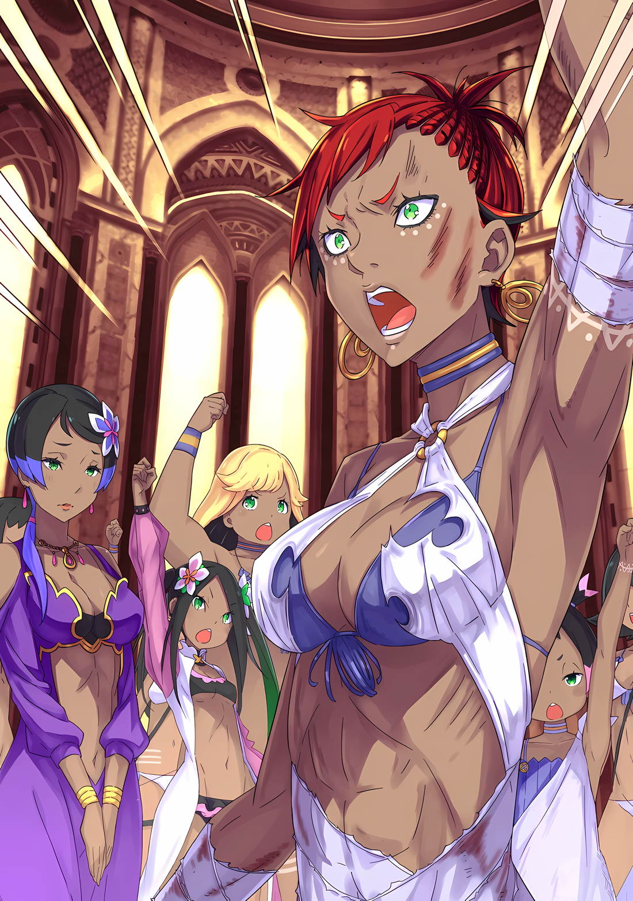
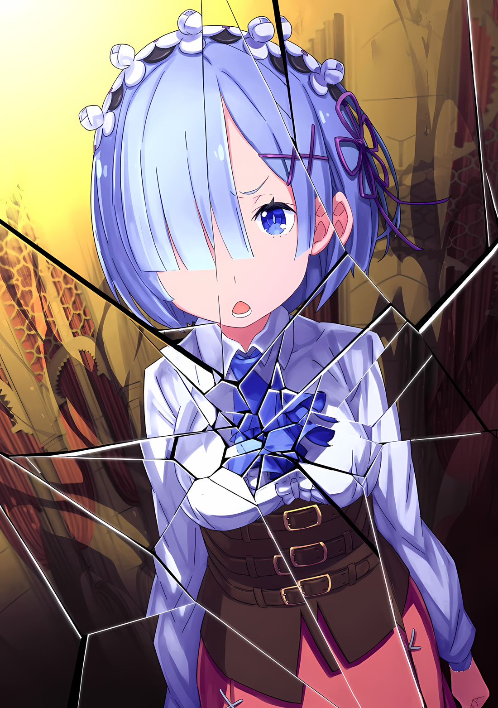
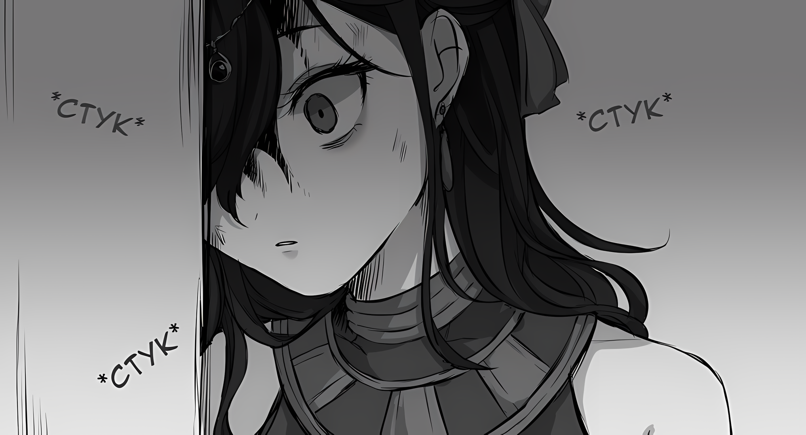

Выражение лица Мизельды было решительным, когда она заявила, что откажется от должности вождя.

Доминирование ее дикой, волевой красоты не уменьшилось, и она все еще была точно такой же, как и тогда, когда они впервые увидели ее. Сквозь толстые и тонкие слои, впечатление о ней как о сильной женщине оставалось неизменным.

И с этим впечатлением, потеряв правую ногу, Мизельда решила уйти с поста вождя.

Все: …………

Все, кто окружал Мизельду, испытывали глубокое чувство сожаления.

«Племя Судрак», те, кто видел силу Мизельды, их вождя, вблизи, не смогли бы так легко избавиться от горечи и чувства потери.

Отсутствие выражения лица Куны усиливалось ее обычной холодностью, рядом с Хоули, чье обычное расслабленное состояние сменилось мрачным выражением лица. Утаката со слезами на глазах закусила губу и опустила голову, а все остальные судракийки, точно так же как и Куна, изобразили на своих лицах мрачные выражения.

Однако больше всех была потрясена одна из них….

Таритта: О, сестра, это невозможно. Не может быть, чтобы кто-то вроде меня стал хорошим вождем….

Мизельда: ……Таритта.

Таритта: Именно потому, что это ты, сестра, ты смогла это сделать! У меня нет способности делать что-то подобное….

Качая головой в знак несогласия, Таритта неистово умоляла.

То, что она, младшая сестра Мизельды, которую лично выдвинули на пост следующего вождя, уважала и практически боготворила свою старшую сестру, можно было легко представить по всем ее ежедневным словам и поступкам.

Именно по этой причине Таритта отрицала и не могла принять тот факт, что Мизельда потеряла ногу. Она выглядела еще более расстроенной, чем сама Мизельда.

Рем: ……Это из-за моей слабости.

На горестную мольбу Таритты прозвучал слабый, самообвиняющий голос.

Он исходил из другого конца комнаты, заваленной ранеными телами, от Рем, которая была в изможденном состоянии и пользовалась тростью, чтобы стоять.

Она была единственным существом в этом месте, способным использовать целительную магию. Рем суетилась направо и налево, переходя от человека к человеку, пытаясь спасти многих раненых. По ее испачканной кровью одежде, взъерошенным волосам и усталому выражению лица можно было только догадываться, насколько это было утомительно.

Тем не менее, собеседнице было все равно, и даже благодарные слова Субару в самом начале были встречены простым «Я в порядке».

Тем не менее, никто не имел права осуждать Рем за недостаток сил.

Без нее они не смогли бы достичь результата, лишенного смертельных исходов от атаки Аракии. Это понимали все.

Поэтому……

Мизельда: Рем, тебе не стоит беспокоиться. Мне повезло, что я вышла из битвы с Имперским «Генералом», потеряв только одну ногу… Нет, это потому, что мне помогла ты.

Рем: Мизельда-сан… это может быть правдой, но….

Мизельда: Я благодарна тебе. Мне больше нечего сказать.

Рем была лишена возможности говорить дальше, так как Мизельда повторила свою благодарность.

Луис, чьи длинные светлые волосы были в беспорядке, прижалась к молчаливой Рем. Пока первая осторожно ковырялась в подоле платья второй, Рем тихо опустила взгляд и положила руку на плечо Луис.

Раскаяние и беспомощность, которые испытывала Рем, были до боли очевидны Субару. Но темноволосый красавец шагнул вперед быстрее, чем Субару успел что-либо сказать.

Абел: Мизельда, ты ведь не намерена менять свое решение?

Вопрос Абела, когда он шагнул вперед, был встречен кивком Мизельды, которая сидела на каком-то предмете.

Ощупывая пальцами поверхность своей ампутированной, забинтованной ноги, она сказала,

Мизельда: Ах, у меня нет намерения. Договор между Судрак и Императором Волакии будет соблюден. Однако впредь тебе следует обращаться к Таритте…… вернее, к вождю.

Абел: ……Я понял. Мизельда, ты оказала большую услугу.

Мизельда: Мф.

Мизельда твердо решила уйти в отставку, и Абел, сложив руки, продемонстрировал свое понимание ее ответа. После этого Мизельда выдохнула и широко улыбнулась.

Слабо улыбнувшись, она посмотрела на Абела.

Мизельда: Если это будет так, покажи мне свою улыбку. Это обязанность красивого мужчины.

Абел: ……Хм.

Мизельда: Достаточно хорошо.

Несмотря на то, что Мизельда совсем недавно потеряла ногу, она все еще была слишком свирепой.

Даже высокомерный Абел не стал критиковать ее за непочтительность и даже улыбнулся ее поведению.

Прежде всего, это было доказательством того, что Император, чей трон был узурпирован, проявил уважение к женщине-воину, живущей в джунглях.

И тогда……

Мизельда: ……Слушайте, сестры мои!

Улыбающееся лицо Мизельды ожесточилось, она подняла голову и заговорила громким голосом.

Услышав свирепый звук ее голоса, все судракийки выпрямились, чтобы внимательно слушать.

Мизельда: Как я уже говорила, я выполняю свой долг вождя! Теперь я передаю роль вождя моей сестре, Таритте! Отныне все подчиняются Таритте!

Судракийки: …………

Мизельда: Это мой последний приказ в качестве вождя. ……Благодарю вас за клятву и гордость предков.

Судракийки: ……Спасибо!

Иллюстрация к **Ранобэ** Том 28 | Разукрасил NorvakKK

Заключила Мизельда, а судракийки, казалось, что-то декламировали.

Он не знал их обычаев и давних практик. Но даже Субару, чужак и неспециалист, мог почувствовать, что это был ритуал преемственности.

Он был коротким, неформальным и представлял собой сочетание практического и концептуального наследования.

В этом месте должность вождя «Племени Судрак» передавалась по наследству, от Мизельды к Таритте.

Таритта: Сестра….

Мизельда: Не опускай голову, вождь. Твоя нерешительность — это наша нерешительность. Твои колебания — это наши колебания. Твоя смерть ведет к нашей смерти.

Таритта: …………

Подойдя к ней, Мизельда ободрила нового вождя, Таритту, выражение лица последней было мутным.

Это было не тем, что заставило бы Таритту расслабиться. Однако она, видимо, поняла, что привязанность к Мизельде не изменит ситуацию.

После нескольких мгновений молчания Таритта робко кивнула и замолчала.

Мизельда: …………

Сложные эмоции, промелькнувшие в глазах Мизельды при виде этого, остались незамеченными Тариттой, когда она опустила голову. ……И это было то, о чем никто, кроме нее, не упомянул бы.

△▼△▼△▼△

Субару: ……Честно говоря, это было неожиданно.

После того, как главком закончил свою речь и отчет о повреждениях, Субару окликнул Абела.

Абел нахмурил брови от того, что его остановили, не получив конкретного вопроса. Выразив недовольство, он поинтересовался истинными намерениями Субару, спросив «Что произошло?»,

Абел: Мне есть над чем поразмыслить. Ты, как никто другой, не должен меня беспокоить.

Субару: Ты, как всегда, суров… Просто я был удивлен. Ты так легко принял уход Мизельды-сан с фронта.

Абел: …………

Субару: Я думал, ты скажешь, что она потеряла только одну ногу. И чтобы она работала на тебя до смерти.

Несмотря на то, что он считал это слишком экстремальным, Субару честно признался Абелу в своих чувствах.

Это был Император, который присоединил к своим войскам «Племя Судрак» ради возвращения трона, и тот, кто подумывал загрязнить Город-Крепость Гуарал ядом, если бы случилось худшее.

Абел…… нет, Винсент Волакия — был очень готов к таким вещам.

Абел: Глупости. Какой смысл в такой силе?

Однако ответ Абела на слова Субару, который был готов бросить слова оскорбления и высказать свое истинное мнение, был спокойным и трезвым.

На глазах у разочарованного Субару Абел посмотрел на судракиек, беседующих вдалеке.

Абел: Ну, я не хочу, чтобы мои подчиненные делали больше того, на что они способны. Даже если я прикажу им сделать все возможное, было бы заблуждением ожидать, что они пойдут дальше своих пределов.

Субару: …………

Абел: Если они перевыполнят план по сравнению с тем, на что они были способны, он будет разрушен. Я просто прошу не больше и не меньше того, что я требую от своих людей. И Мизельда выполнила свой долг. В таком случае, единственное, что я могу ей вручить, это награду.

Словами мотивируй их. Наградами заставь их превзойти свои возможности. Похвалой заставь их пообещать, что в следующий раз они будут лучше.

Субару всегда с полной уверенностью думал, что именно так влиятельные люди подчиняют себе своих подчиненных. Поэтому ответ Абела прямо противоречил тому, что Субару имел в виду.

Он не стал бы требовать от своих подчиненных работы, превышающей их возможности.

Казалось, что это хорошая среда для работы подчиненных, хотя одновременно и одинокая.

Абел: Само собой разумеется, что если ты будешь стараться меньше, чем ожидается, это повлечет за собой наказание. Определенное наказание или награда, ты ведь понимаешь, что это значит?

Субару: ……Значит ли это, что я буду наказан?

Абел: Если бы ты был моим подчиненным, то это было бы верно. Но разве ты мой подчиненный?

Субару уставился прямо перед собой, его глаза расширились от слов Абела.

Конечно, Субару не помнил, чтобы когда-либо становился подчиненным Абела. В разговоре с Присциллой Абел рассматривал Субару как военного стратега, но у него не было намерения официально становиться им.

Субару: Не то чтобы меня не привлекало звание военного стратега, но я не хочу быть кем-то вроде твоего подчиненного.

Абел: Так оно и есть. Ты не мой подчиненный, и поэтому не попадаешь под категорию получения определенного наказания или награды.

Субару: На то пошло, кто ты для меня……?

Из-за своего положения они были вынуждены сопровождать друг друга. У них не было ни отношений хозяина и слуги, ни каких-либо личных отношений.

Они были двумя людьми, попавшими в поток препятствий, и как только эти препятствия были устранены, их пути разошлись. Таков был тип их отношений.

Назвать их друзьями, или союзниками, или товарищами было бы просто неправдой. Если их и можно было бы назвать кем-то, так это компаньонами по переодеванию.

Абел: Некоторые взяли на себя смелость назвать меня другом, но ты — нет.

Субару: Да. Я застенчивый парень, поэтому я не могу стать твоим другом так легко.

Учитывая текущую ситуацию, человек, который мог бы назвать его другом здесь, был бы либо очень хорошим человеком, либо мошенником, и Флоп был бы первым.

Как бы то ни было……

Абел: Я продолжу разговор с Присциллой. Иди и делай то, что тебе еще нужно сделать.

Субару: Что мне нужно сделать….

Абел: От меня не требуется говорить тебе об этом.

Под пристальным взглядом миндалевидных глаз, взгляд Субару покинул Абела и направился в угол комнаты.

Там он обнаружил фигуру Рем, сидящую на полу. На расстоянии он не мог разобрать ее угрюмое выражение лица, но не было сомнений, что оставлять ее одну нельзя.

Однако он был несколько раздосадован тем, что Абел велел ему сделать это первым.

Субару: Я не хочу, чтобы у тебя возникли проблемы с Присциллой и началась новая ссора. Просто будь осторожен в общении с ней.

Абел: Уверен, многие сказали бы, чтобы эти слова достались тебе, а не мне.

Вслед ненавистным словам последовали еще более ненавистные слова, и Субару расстался с Абелом, который вернулся в конференц-зал.

Нога Мизельды изменит положение «Племени Судрак», поэтому необходимо будет принять это во внимание, вступая в дискуссию с Присциллой.

Однако в разговоре между небесными существами, Абелом и Присциллой для Субару было мало места.

Приоритетной задачей для Субару было поговорить с единственным человеком, с которым у него была возможность поговорить.

Субару: ……Рем, сейчас подходящее время?

Он сделал глубокий вдох и успокоился, а затем направился к Рем.

Рем сидела, сложив колени и прислонившись спиной к стене, и слегка вздрогнула от слов Субару, его фигура тускло отразилась в ее бледно-голубых глазах.

Рем: ……Это ты? Когда ты собираешься переодеться?

Субару: Видимо у тебя на первом месте стоит мое переодевание. Как только закончится этот разговор, я обязательно переоденусь.

Рем: Вот как? Ну, тогда разговор окончен. Пожалуйста, иди переоденься.

Субару: Это так грубо!

Субару остался беспомощным и повысил голос после грубого ответа Рем. На его ответ ее глаза заострились, и она сказала: «Пожалуйста, помолчи».

Затем она дернула подбородком в сторону девушки, опирающейся на ее левое плечо.

Рем: Такими темпами ты разбудишь спящую Луис-чан. Пожалуйста, присмотри за ней.

Субару: Ну, я….

Рем: Или ты просто не хочешь уделять столько внимания этой девочке?

Субару: Не говори так. Виноват….

Луис, засыпая, делала крошечные вдохи, прижимаясь к Рем.

Луис помогала Рем лечить раненых; ее белая одежда то тут, то там была испачкана кровью. Судя по тому, что он узнал из поведения Рем и от Утакаты, она сделала именно то, что ей сказали, хотя и не очень-то хорошо.

Естественно, внутренние мысли Субару были смешанными.

Рем: Меня смущает, когда ты делаешь мрачное лицо в таком виде.

Субару: О, да, виноват. Мой макияж испортился, это довольно некрасиво.

Рем: Он выглядел некрасиво, даже когда ты накрасился как следует.

Субару: Тохохо….

Плечи Субару опустились в унынии от замечания Рем, которое было таким же суровым, как и всегда. Субару медленно сел бок о бок с Рем, справа от нее, напротив Луис.

Он посмотрел на протестующий взгляд Рем, но сознательно проигнорировал его.

Субару: Рем, ты молодец. Все выжили благодаря тебе.

Рем: ……Я прекрасно понимаю, что у меня нет сил. По правде говоря, я бесполезна.

Субару: Рем….

В ответ на слова благодарности Рем в разочаровании посмотрела на свои руки. Рассматривая бледные пальцы, Рем слабо прикусила губу.

Субару: Ты определенно не бесполезна. Несмотря на то, что твои воспоминания размыты, ты смогла великолепно использовать свою магию исцеления и спасла много людей. Но….

Рем: Я знаю. Если бы я был цела, эта магия не была бы такой.

Субару: Не такой?

Рем: Моя магия исцеления. Магия, которую я использую сейчас, основана на интуиции, другими словами, я самоучка. Хотя с помощью Луис-чан мне удалось придать ей форму. Но даже так….

Рем не стала продолжать дальше.

Причина, по которой она не стала продолжать, заключалась в том, что это было нечто само собой разумеющееся. Она знала, что если выразит это словами, то это станет лезвием, которым она поранит себя, и эта боль утешит ее, хотя и немного.

Жалобы, когда их произносят, причиняют боль себе и другим. Однако в качестве компенсации это лишь немного облегчит сердце. А Рем не нравилась идея облегчения сердца.

Это было доказательством того, что она действительно винила себя в том, что не может спасти других из-за недостатка силы.

Субару: …………

И снова Субару с болью понял чувства Рем.

Жалеть о том, что можно было сделать больше, было больнее, чем о недосягаемой стене. Еще хуже, когда это касалось чужого будущего, не своего собственного.

……Потеря ноги Мизельды оставила что-то тяжелое в глубине сердца Субару.

Это была не жизнь. Но нетрудно было представить, насколько тяжела потеря одной из четырех конечностей.

Самым близким примером был, конечно, Ал, однорукий человек, потерявший левую руку. Кроме того, в Городе Водяных Врат Пристелле; во время этой битвы Рикардо потерял одну из своих рук в противостоянии с «Чревоугодием».

Это было крайне шокирующее событие, но это не была трагедия настолько отдаленная, что она не могла произойти. На самом деле, для тех, кто подвергал себя опасности, это можно было бы назвать привычной трагедией.

Тем не менее……

Субару: Это жестоко.

Рем: ……Да.

Пересохшее бормотание Субару было встречено небольшим кивком Рем рядом с ним.

Это был первый раз, когда он получил прямой кивок без последствий, но, к сожалению, он был не в том состоянии духа, чтобы оценить это. Рем взглянула на Субару, и в груди у последнего сжался комок.

Рем: Прошлая я… Если бы это была прошлая я, интересно, как бы все прошло……

Субару: ……Если бы это была ты, когда у тебя еще были воспоминания?

Рем: Да. Если бы это была магия исцеления прошлой меня, нога Мизельды-сан могла бы быть….

«Могла бы быть спасена», — Субару закрыл глаза от последующих слов.

Не то чтобы он не мог понять, о чем думает Рем. Но Субару, находясь со стороны, было трудно судить о том, насколько наличие или отсутствие памяти повлияло на целительную магию Рем.

Даже если бы можно было определить количественно силу исцеления, Субару было бы трудно оценить ее.

Однако……

Рем: …………

Бледно-голубые глаза Рем, наполненные искренним чувством, были устремлены на Субару.

Если ответ, который она искала, мог дать Субару, он не знал, но перед ним было только два варианта: «Предыдущая Рем смогла бы» или «Предыдущая Рем не смогла бы».

Что из этих двух вариантов окажется спасением для Рем?

……Или, скорее, какой из двух вариантов спасет Рем от еще большей боли?

Субару: ……Даже с твоими воспоминаниями, я думаю, это было бы беспомощно.

Рем: …………

Субару: Даже исцеляющая магия не всесильна. В таком случае, Рем сделала бы все, что могла.

Он ответил после нескольких секунд мучительных раздумий, которые показались Субару гораздо более долгими.

Даже если бы у Рем были ее воспоминания, даже если бы ее магия исцеления была в идеальном состоянии, она не смогла бы спасти ногу Мизельды.

Правда заключалась в том, что дело было не в «если бы».

Если бы они начали говорить о «если бы», этому не было бы конца. Это была правда, что Рем не смогла спасти ногу Мизельды. Но помимо Мизельды, она спасла жизни многим другим раненым.

Ее следовало похвалить за ее достижения, и у нее не было причин винить себя.

На самом деле, если кого-то и следует винить, так это……

Субару: Я не был достаточно сильным.

Рем: Э….

Субару: Я недостаточно хорошо подумал. Надо было серьезнее подойти к делу.

Услышав этот ответ Субару, круглые глаза Рем расширились.

На глазах у Рем Субару с силой сжал коренные зубы и закрыл лицо обеими руками.

Если кто-то и проклинал недостаток силы, то вина должна была пасть на Субару.

Субару: Все. Это моя вина.

Несмотря на напыщенные заявления о «Бескровной осаде», реальность была далека от таких результатов.

Вторжение Аракии вызвало множество ранений, а ее восстановление привело к смерти нескольких стражников. В их собственных рядах потерь не было, но, учитывая отсутствие ноги у Мизельды, разве можно назвать это «Бескровной осадой»?

Он потерпел неудачу. Это была куча неудач, и шанс на восстановление был потерян.

Все, чего он хотел, — это наилучшего возможного счастливого конца, а то, чего добился Субару, было либо так себе счастливым концом, либо тем, что следовало бы назвать плохим концом.

Перефразируя слова Абела, сказанные ранее, можно сказать, что за наказанием или наградой должно следовать наказание.

Если бы Субару был одним из людей Абела, не было бы ничего странного в том, что ему отрубили голову.

……В худшем случае, он должен был бы «Посмертно Возвратиться»

Такие мысли приходили ему в голову.

В этом случае он, скорее всего, вернется в самую последнюю точку возвращения, к моменту кровавой битвы с Тоддом в Гуарале. ……Страх, вызванный воспоминаниями о том времени, заставил все его тело дрожать.

И все же, даже если он вернется в тот момент ужаса, если он сможет вернуть то, что они потеряли……

Рем: ……Почему?

Внезапно, это слово ударило по барабанным перепонкам задумчивого Субару.

Подняв лицо, он встретился взглядом с глазами Рем, смотрящими прямо на него.

Глаза Рем, которые еще недавно были влажными от раскаяния, теперь смотрели прямо на Субару, скрывая в себе еще более сильное раскаяние.

Рем: Почему это стало твоей виной?

Взволнованный взглядом Рем, на Субару посыпались новые слова, лишая его возможности двигаться.

Она протянула руку, ее глаза были влажными, и, указывая на разрушенную ратушу, она сказала,

Рем: Значит, нога Мизельды-сан, раны Луис-чан и Утакаты-чан, раны Медиум-сан и Флоп-сана — все это твоя вина?

Субару: Да, это так. Если бы я был более осторожен в своих приготовлениях, все бы так не обернулось.

Рем: Ты продумал план, и твой, казалось бы, безрассудный план оправдал себя. Ты смог удержать Генерала Второго класса на месте и провести их в город, не дав никому сражаться. Как мы и планировали.

Субару: Но после этого….

Рем: ……Кого волнует, что было после!?

На настойчивость Субару, Рем подняла брови и сделала свой голос громче. Она быстро повернула лицо, и из-за этого Луис, которая прислонилась к ней, упала к ней на колени.

Луис слегка покачнулась и тихо застонала, не просыпаясь. Поддерживая плечо Луис, Рем слегка отдулась и снова посмотрела на Субару.

Рем: Никто не мог предвидеть, что произойдет после этого. Появление той полуголой женщины и ее буйство были непредсказуемы. Так…

Субару: …………

Рем: Так почему же ты ответственен за все это?

Субару сглотнул, когда вопрос «почему» снова был задан ему.

Если бы вы спросили его, почему, он бы подумал, что это обязанность того, кто обладает силой.

Точно так же, как Рем сетовала на недостаток силы в своей собственной целительской магии, Субару иногда сожалел и сетовал на то, что его собственное Полномочие не может ее восполнить. Масштабы «Посмертного Возвращения» были более широкими.

Будущее могло улучшиться или ухудшиться, в зависимости от того, воспользуется ли Субару своим Полномочием.

Однако……

Субару: Это….

……Это была правда, которую нельзя было говорить другому, даже если этим человеком была Рем.

Это не ограничивалось только Рем.

Полномочие, которым обладал Субару, не могло распространяться ни перед кем, независимо от того, насколько открытой была другая сторона. ……Нет, он не мог говорить об этом даже с теми, с кем установил эмоциональную связь.

Если бы он рассказал им, он никак не смог бы открыть правду, не став, возможно, причиной смерти этого человека.

Он боялся боли. Боль, вызванная попыткой рассказать кому-то о «Посмертном Возвращении», была ужасающей.

Кто может привыкнуть к этой сильной боли, которая захватывает сердце, сколько бы раз ее ни испытывал?

Но по-настоящему пугала не боль, а потеря.

Разве есть в этом мире что-то более страшное, чем потеря?

Не из-за этого ли страха и было даровано Нацуки Субару это Полномочие?

Рем: ……Почему ты защитил меня?

Субару: А……?

Рем продолжала говорить так, как будто сдалась Субару, а тот молчал и не мог ответить.

На мгновение Субару моргнул, не понимая, о чем она говорит.

Рем: Когда та полуголая женщина напала на меня. Я сбила столб, а когда это не помогло…… Та женщина набросилась на меня, а ты встал передо мной.

В самоотверженной попытке спасти ее от нападения Аракии, Субару встал перед Рем.

Вытянув руки, он отчаянно пытался отвести от Рем любую угрозу. В тот момент Субару было все равно, заберет ли Аракия его жизнь.

Он хотел, чтобы Рем прожила дольше него хотя бы на секунду.

Это было……

Рем: В результате твоей бескровной осады, того, что ты прикрыл меня в тот момент, и даже того, что Мизельда-сан потеряла ногу, ты пытаешься взять все на себя….

Субару: …………

Рем: Ты недостаточно силен, чтобы делать все это… Сначала я опасалась тебя из-за этого ужасного запаха.

На этом Рем прервала свои слова и посмотрела на Луис, сидящую у нее на коленях.

Нежно погладив ее золотистые волосы, Рем поперхнулась и спокойно перевела взгляд обратно на Субару, сказав

Рем: Я, Луис-чан, Абел-сан, Мизельда-сан и другие, Медиум-сан и Флоп-сан — все мы люди с волей, и тебе не нужно напрягаться, чтобы защитить их.

Субару: О….

Рем: Пожалуйста, не пытайся сделать что-то подобное в одиночку. Ты не должен брать на себя ответственность за наши действия.

Рот Субару неоднократно открывался и закрывался, переполненный потоком слов.

Его мозг отказывался быстро осмыслить сказанное. Однако неопознанное чувство срочности опалило сердце Субару, заставив его слушать дальше.

С искренним чувством, направленным на Субару, проклинающего себя за недостаток силы, Рем не сдержалась.

Он должен был не дать ей сказать ничего лишнего……

Рем: Ты не особенный человек….

Он знал, что не должен был позволять ей говорить это.

Рем: ……Потому что ты не герой.

Иллюстрация к **Ранобэ** Том 28 | Разукрасил NorvakKK

△▼△▼△▼△

Пошатываясь, Субару шел по зданию мэрии, словно бродяга.

У него не было никакой цели. Даже не было понятно, когда он начал идти. Когда он пришел в себя, он шел, и если что и было, то его сознание все еще оставалось в состоянии неясности.

Субару: …………Кх

Внезапно он получил сильный удар головой вперед.

Если присмотреться, то казалось, что он ударился о стену. Он шел, глядя только на свои ноги, вот в чем причина. Ударившись лбом о голую стену, Субару схватился за больной лоб и выдохнул.

Затем, не думая, он снова ударился лбом о твердую стену.

Сильный удар и тупой звук, и Субару почувствовал жгучую боль в мозгу.

Когда он встряхнул мозг снаружи, ему показалось, что застой, пропитавший все его тело, медленно отступает.

Таким же образом Субару снова и снова ударялся лбом о стену.

Стук, стук, стук….

Арт от Re_taisho94

???: Эй-эй, прекрати, брат.

Когда он отступил назад, чтобы нанести новый удар, его схватили сзади за плечо. И окликнули.

Когда Субару обернулся, его взгляд встретился со взглядом из-за стального шлема, направленного в его сторону. Все еще держа Субару за плечо, другой участник поединка хрустнул костями в собственной шее и заговорил,

Ал: Я понимаю чувство желания умереть. Но сколько бы раз этого не было, конца не будет.
