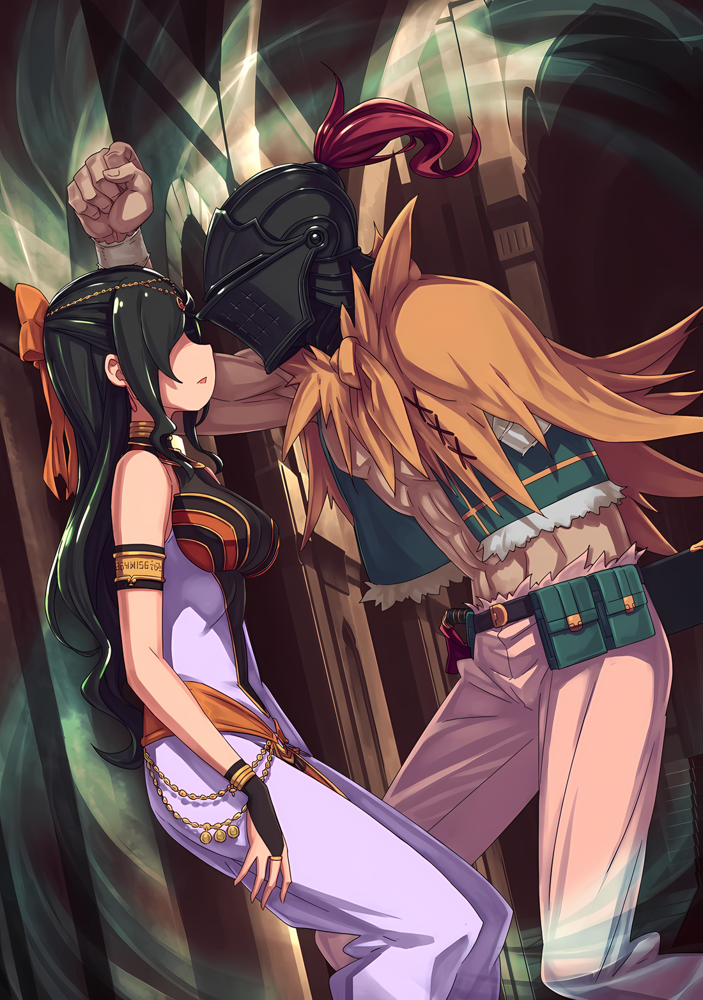

Глаза Субару расширились, когда сильная рука схватила его за плечи, заставляя обернуться.

Железный шлем, смотрящий в его сторону…… Или, скорее, отношение Ала, было довольно неожиданным.

Субару: …………

Игнорировать силу руки, схватившей его за плечо, было довольно сложно. Его намерение помешать Субару удариться головой о стену и причинить себе вред остро ощущалось.

Ал: Ты должен прекратить это.

Субару: ……А.

Их взгляды встретились, и при повторении слов сдержанности у Субару вырвался вздох.

И тут же Субару почувствовал, как внизу живота почувствовался укол, полный стыда, словно его обвинили в эксцентричном поведении. Как будто он был персонажем в игре, которого заставляли бежать к стене.

Похоже, все было именно так, включая ту часть, где он ни о чем не думал.

Ал: Не приходи ко мне плакаться, если после этого ты окажешься идиотом. Нет, скорее, это потому, что я не мог оставить тебя в таком состоянии и пришел остановить тебя.

Субару: ……Извини за неудобства.

Ал: Зачем так официально? Кроме того, твой голос такой хриплый, что пугает меня.

Когда Ал отметил, что голос Субару удивительно хриплый, он в очередной раз высмеял себя.

Тот, кто страдал от полного душевного расстройства, и тот, чье постыдное поведение заставило его впасть в это разбитое состояние, был не кто иной, как он сам.

Это было естественно. В конце концов, не кто иная, как Рем, рассказал Субару…

Ал: ……Тебе было так больно слышать то, что сказала та девушка?

Субару: ……Кх

Ал: О, ужас! Не смотри на меня так. Я начну нервничать, если ты будешь продолжать смотреть на меня в таком виде.

Субару посмотрел вверх, как будто в него попала пуля, в то время как Ал пожал плечами, как будто шутя.

Его взгляд заставил Ала отступить назад, но Субару сократил расстояние между ними и прямо ответил на предыдущее заявление Ала.

Субару: Ты, ты подслушивал…!

Ал: Я не пытался подслушивать. Просто ты случайно оказался в середине важного разговора, когда я хотел тебя позвать, брат. Я просто подумал, что было бы неправильно прерывать тебя.

Субару: ……….

Ал: Даже если ты смотришь на меня с недоверием, я не вру. Ну, после этого, брат, ты начал вести себя так, будто наступил конец света, поэтому я забеспокоился и пошел за тобой. И точно….

Говоря это, Ал указал на переднюю часть своего шлема.

Как он и ожидал, его опасения оказались верными. Не то чтобы Ал был особенно внимателен, скорее, отчаяние Субару было ясно как день.

Боль во лбу, которым он ударился как раз в то место, на которое указывал Ал, вернулась, заставив Субару неловко опустить глаза.

Субару: ……Рем.

Ал: Хм?

Субару: Точно, что случилось с Рем? Я имею в виду, после того, как она поговорила со мной…

Ал: Стоп-стоп, только не говори, что от шока, который ты получил из-за слов той девушки, ты потерял память? Пожалуйста, дай мне передохнуть. Если у тебя будет амнезия, брат, я потеряю своего единственного приятеля.

Ал ответил на вопрос Субару, пока возился с металлической застежкой своего шлема, обхватив голову руками.

К сожалению, то, чего Ал опасался, уже произошло. Тем не менее, для Субару это было не менее серьезным, чем амнезия, поэтому нарушение его душевного равновесия было неизбежно.

Возможно, заметив беспокойство Субару, Ал сказал: «Не волнуйся об этом»,

Ал: Даже после того, как ты побледнел, ты все еще давал достойные ответы, брат. Так что, думаю, девушка ничего не заподозрила, да?

Субару: А, понятно….

Получив гарантии Ала, Субару почувствовал слабейшее из всех возможных чувств облегчения.

Очевидно, что позорное поведение Субару началось только после того, как он покинул Рем. Если бы ему удалось сохранить видимость рядом с Рем, он бы ее не беспокоил.

В любом случае……

Субару: Ал, насчет того, что ты только что сказал…… Что ты имел в виду?

Ал: Только что сказал?

Субару: ……О понимании моего чувства желания умереть, или что-то в этом роде.

Приложив руку к больному лбу, Субару спросил, что на самом деле стоит за словами Ала.

«Я понимаю чувство желания умереть. Но сколько бы раз этого не было, конца не будет.»

Заявление о том, что он понимает чувство желания умереть, и что этому нет конца, что бы человек ни делал.

Честно говоря, он подумал, что это не то выражение, которое могло бы его сильно обеспокоить. Но в то же время, это было слишком значимое выражение, чтобы говорить его Субару в данной ситуации.

Скорее, это заявление выглядело так, как будто Ал также хотел заставить Субару поверить, что он, возможно, знает об особенности Субару, его Полномочии.

Ал: ……О, это.

Субару: Да, это. Это было… Это было очень значимое высказывание. Ты……

……Ты ведь что-то знаешь об этом?

Субару послал Алу взгляд, окутанный подозрением. Даже если бы он напряг свои глаза, он не смог бы заглянуть в его глаза и эмоции, скрытые за холодным стальным шлемом.

Однако, его выражение лица было скрыто, Ал фыркнул и заговорил,

Ал: Я не хочу этого говорить, но я уже давно смирился с этим, понимаешь? Я бывал в таких же переделках, как и ты, брат. ……Я даже вел себя отстойным образом перед красивой девушкой.

Субару: Ах……?

Ал: Что это за «ах»? Такие вещи, как выставить себя на посмешище, а потом захотеть умереть — это дорога, которую проходил любой мужчина. Если ты спросишь меня, то даже в моем возрасте я делаю это довольно часто. Когда я это делаю, принцесса смотрит на меня как на букашку.

Усмехнувшись, Ал похлопал Субару по плечу и дал ему урок, типичный для старшего.

Приняв это содержание и его поведение, Субару снова уставился на Ала, пытаясь определить, обманывает он его или говорит серьезно.

Ал: Хм? Что случилось, брат?

Субару: ……Нет, ничего.

Однако, даже если бы Субару попытался разгадать истинные намерения Ала, он не смог бы этого сделать, так как его зрение было заслонено черным железом.

До этого момента он всегда считал наряд Ала не более чем одной из его эксцентричностей. Но когда он столкнулся с ним, пытаясь выяснить его истинные намерения, он понял, что это была защита гораздо более мощная, чем ожидалось.

Но в то же время он подумал о том, что слишком нервничает.

Субару: Он никак не может знать, ха….

Это было просто совпадение, что комментарий Ала привлек внимание Субару.

Если бы Ал знал о «Посмертном Возвращении», он бы попытался показать это Субару в более понятной форме. ……Само существование этого Полномочия, «Посмертное Возвращение», было опасным делом.

Если бы он знал об этом, то не удержался бы от намека на это, подобно Розваалю.

В то же время….,

Субару: ……Полагаю, не все, кого призывают в другой мир, получают какую-то силу.

Он не был в курсе подробностей ситуации с Алом, но считал, что можно предположить это.

Потому что, если Ал обладал какой-то особой силой, живущей внутри него, ему казалось, что потерю левой руки можно было бы предотвратить.

Например, если бы Субару потерял одну из своих рук подобным образом, то он мог бы использовать свое Полномочие, чтобы предотвратить потерю левой руки до того, как это произойдет, путем…,

Субару: ……возвращения?

С этой мыслью Субару пристально посмотрел на свою левую руку.

Это было лишь гипотетически, но вполне возможно. Прежде всего, единственная причина, по которой Субару удалось выжить, сохранив все части тела в целости, заключалась в том, что он смог в полной мере использовать «Посмертное Возвращение».

Много раз, среди петель, в которых его лишали жизни, он страдал от потери руки или ноги.

Если бы ему удалось выжить без «Посмертного Возвращения», он вполне мог бы жить с отсутствующими частями тела.

……Субару решил, что никогда не будет полностью полагаться на «Посмертное Возвращение».

Но тогда в какой степени он должен полагаться на него?

Сколько рук, ног, пальцев и глаз ему придется отдать, прежде чем он решит положиться на него? И самое главное, что если это будут не его собственные конечности, а конечности Эмилии или Рем?

В Городе Водных Врат Пристелле Субару не «Посмертно Возвращался» ради потерянной руки Рикардо. Сегодня он также не «Посмертно Возвратился», потому что Мизельда потеряла ногу.

Хотя он знал, что, используя свое Полномочие, он мог бы добиться лучших результатов.

Хотя он знал, что число тех, кто потерял руки или ноги, с отрезанными до сих пор путями, может быть уменьшено.

Субару: Я….

Ал: …………

Субару: Я лицемер.

Осознавая, что Полномочие, которым он был наделен, было могущественно, он не смог сделать решительный шаг.

Нацуки Субару был слишком бессилен и эгоистичен.

Поэтому……

Субару: Рем слишком… Уаа?!

Ал: Ты попал в плохую петлю, брат.

В итоге он позволил Рем произнести эти решающие слова.

Прямо перед тем, как он собирался впасть в депрессию, лоб Субару был поражен мощным ударом пальца. От сильной боли на глаза навернулись слезы, и, произнося «Уа, уаа…», он посмотрел на Ала.

Ал: О, это был довольно хороший звук. Подожди, я ударил тебя прямо в то место, где ты ударился лбом? Прости-прости, я не хотел.

Субару: Все в порядке… Нет, что это было, черт возьми!

Ал: Это был щелчок пальцами. Итак, право задавать вопросы переходит ко мне, и теперь вопросы буду задавать я.

Ал направил палец на Субару, удивление которого пересилило боль. Когда палец уперся ему в нос, Субару непроизвольно отступил назад и замолчал.

Затем Ал продолжил: «Слушай»,

Ал: Насколько тебя расстроили слова этой девушки? Это позор, только потому, что она тебе что-то сказала. Разве ты сам так не думаешь?

Субару: Ну, я….

Ал: Я не хочу, чтобы у тебя голова шла кругом от такого. Мне неловко это говорить, но… Я возлагаю на тебя большие ожидания, брат.

Субару: ……Ожидания?

Субару был просто удивлен, когда ему сказали то, чего он никак не ожидал.

Видя реакцию Субару, Ал глубокомысленно кивнул и сказал: «Все верно»,

Ал: Ты помнишь ту речь, которую ты произнес в Пристелле, верно, брат?

Субару: О, да, помню, но…

Ал: Я почти уверен, что тогда я сказал тебе, что эта речь будет означать, что тебе придется нести «Героические Грезы», брат.

Это была напряженная ситуация, город штурмовали Архиепископы Греха, и многие люди находились в тяжелом положении.

Субару вспомнил слова, которые сказал ему Ал, когда его попросили сыграть роль в той ситуации, но он не смог сделать следующий шаг: это были «Героические Грезы».

На его существование возлагались надежды и ожидания многих людей. Ему нельзя было позволить проиграть.

Он нес в себе «Грезы» быть «Героем», которого все желали видеть.

И в то время Субару ответил слишком расслабленно.

……Это было так же, как и всегда.

Ал: Здесь то же самое. Один человек отказывает тебе, ну и что? Это не изменит того, что ты сделал, брат, и не вывернет твою решимость наизнанку.

Субару: ………

Ал: Не ломайся, брат. Иди и сделай это. ……Оправдай ожидания, брат.

Ал, который знал о достижениях Субару в Городе Водных Врат, похлопал его по спине.

Ни Рем, которая все забыла, ни Луис, которая превратилась в младенца, и, очевидно, ни Абел, ни Флоп, ни Медиум, ни «Племя Судрак» не знали о достижениях Субару.

Хоть о них знала Присцилла, он сомневался, что она вообще помнит об этом.

Ал: Я не забыл. И, прости, я этого не оставлю, брат.

Субару: Не оставишь, говоришь….

Ал: Ты сам начал. Говорю тебе, это репутация, которую ты должен поддерживать до самой смерти.

Субару: …………

У Субару снова перехватило дыхание из-за критических слов Ала.

Он знал, что трансляция в Городе Водных Врат распространилась не только на жителей этого города, почти поглощенных тревогой и страхом, но и на весь остальной мир.

Он должен был сохранить эту репутацию до самой смерти.

Но, к сожалению, «Смерть» никогда не придет к Субару.

Поэтому у него не было другого выбора, кроме как продолжать бороться.

Субару: ……Навсегда.

При словах Ала, голос вырвался изо рта Субару, когда он закрыл лицо и глаза обеими руками.

Все это время в его голове эхом звучали смертельные слова, сказанные Рем. Они разорвали сердце Субару на куски, заставив его утонуть в потоке собственной крови.

«Рем: ……Потому что ты не герой.»

Субару: Все это время я полагался только на слова Рем.

«Рем: ……Потому что ты не герой.»

Субару: Рем верила в меня, и поэтому я не дрогнул. То же самое было в «Святилище», в Пристелле, в Сторожевой Башне Плеяд….

«Рем: ……Потому что ты не герой.»

Субару: Рем проснулась без памяти, но я все еще был счастлив…… Я на шаг ближе к тому, чтобы вернуть все назад, и это время, когда мне нужно держаться сильнее всего.

«Рем: ……Потому что ты не герой.»

Субару: Это были волшебные слова, которые подняли мой дух.

Он был героем, так сказала ему Рем.

Они не дали Субару бросить все и сбежать; они не позволили его коленям подкоситься из-за того, что Рем впала в дремоту; они позволили ему бросить вызов препятствиям в «Святилище» и сложным проблемам в особняке; они сыграли роль в его попытках спасти попавший в руки врага Город Водных Врат Пристеллу; они потрясли душу потерявшего «Воспоминания» Нацуки Субару и позволили ему покорить Сторожевую Башню Плеяд.

Ими были……

«Рем: Потому что Субару-кун — герой Рем.»

Благодаря этим словам, благодаря этому доверию и поддержке, он смог дожить до сегодняшнего дня.

Отнять их, для Нацуки Субару, означало….

Ал: Тогда, ты просто должен вернуть их обратно.

Субару: ……А?

С закрытым лицом, Субару тонул в темноте, слишком глубокой, чтобы назвать ее задней частью его век, когда он ахнул от заявления Ала, подняв лицо.

Прямо перед ним было лицо Ала, заставившее его сделать шаг назад. Однако на этот раз Ал был единственным, кто двинулся вперед, в зеркальном отражении предыдущей сцены.

Спина Субару тут же соприкоснулась со стеной. Он не мог отойти дальше. Как бы подталкивая Субару, неспособного отступить, Ал вытянул руку и преградил ему путь.

И тогда……

Иллюстрация к **Ранобэ** Том 28 | Разукрасил NorvakKK

Ал: Мы вернем их обратно. И ожидания той девушки, и твою уверенность, брат.

Субару: Ожидания и уверенность….

Ал: Ты должен поддерживать свою репутацию. Ты должен бороться. И если ты не можешь позволить себе продолжать проигрывать, то у тебя нет другого выбора, кроме как продолжать побеждать, как ты и хотел. Вот как мы собираемся победить и вернуть их.

Субару: …………

Ал: Ожидания и репутацию, которые ты потерял, можно вернуть только с помощью лучших результатов. Это то, что ты тоже должен знать, потому что ты испытал это много раз.

Внезапно он приблизил свое лицо, и холодный железный шлем ударил его по лбу.

Однако Ал так сильно и искренне привязался к Субару, что тот даже не заметил, как их лбы соприкоснулись. Это произвело на Субару сильное впечатление. Самое главное, Ал, похоже, был прав.

Потерянные ожидания и репутация…… самым горьким из воспоминаний Субару был, конечно же, его промах в Королевском замке.

В то время Субару потерял доверие и надежды Эмилии, и его оценка среди королевских кандидатов упала. Причиной, по которой он смог вернуть их доверие после этого, были его действия.

Уж точно не потому, что он бился лбом о стену в полном опустошении.

Субару: ……Я идиот? Нет, я идиот.

Неужели ничего не изменилось с тех пор, как он совершил тот промах в Королевском замке?

Тогда Субару тоже попытался проигнорировать огромную дыру, под предлогом того, что попросил Вильгельма обучить его, чтобы убежать от огромной боли перед ним.

Но сейчас Субару не мог позволить себе быть таким слабым.

Он должен был защитить Рем и вернуть ее домой. В отличие от того времени, сейчас у него не было никого другого, к кому он мог бы обратиться с этой целью. ……Для Рем существовал только Субару.

И чтобы успокоить Рем, окруженную тревогой и лишенную воспоминаний, он не мог больше демонстрировать перед ней даже немного жалкий вид.

Даже если Рем, забывшая обо всем, заявила, что Субару не герой.

Даже если слова, которые так сильно поддерживали спину Субару, были отвергнуты тем же лицом и голосом.

Субару: ……Я герой Рем.

Да, разве истинная природа Нацуки Субару не в том, чтобы не терять голову?

Ал: ….Вернул немного энергии?

Услышав решимость Субару, суровость исчезла из голоса Ала. Ответив на его слова «Да», с близкого расстояния Субару устремил свой взгляд на него,

Субару: Стало намного лучше. Но подвинься, а лучше отойди! Во что перерос этот кабэ-дон?

Ал: Точно! Брат переодетый, а я — сорокалетний мужик без руки!

От души смеясь, Ал отдернул руку от стены и отступил назад.

Когда поле зрения Субару открылось, он почувствовал, что перед ним не только те возможности, что есть, а также те, которые могут расширить его горизонт гораздо сильнее.

……Честно говоря, слова Ала подействовали лишь как первая помощь, и смертельная рана не была закрыта полностью.

Он не был уверен, что его ноги не задрожат, если он встретит Рем, что он не испугается, что она повторит свои прежние слова, когда он снова встретится с ней взглядом.

До сих пор он не мог найти ответа на вопрос, насколько и с какой целью он будет использовать Полномочие, названное «Посмертным Возвращением».

Он был уверен, что даже если бы он обдумал это в своей голове, он не смог бы прийти к заключению, пока не наступит этот момент.

Но он мог сказать это четко.

Это гордое Полномочие, которым обладал Нацуки Субару, было необходимо для материализации «Героических Грез», которые он должен был нести на своей спине.

Отныне он был уверен, что и впредь будет в замешательстве относительно того, как с этим поступать в грядущие времена.

Ал: Ооо, точно, брат, я просто хотел спросить.

Когда Субару уставился на свои руки, пытаясь восстановить силы, Ал вдруг неловко заговорил, устремив взгляд на него.

Субару стало интересно, как он себя ведет, ведь до этого момента он не проявлял никаких признаков сдержанности.

Субару: Что такое? Если тебе есть о чем меня спросить, спрашивай.

Ал: Тогда я не стесняюсь спросить…… Какие у тебя отношения с той девушкой Рем?

Ал произнес этот вопрос, озадаченно наклонив голову. Вопрос казался странным, чтобы задавать его в данный момент.

Но только когда Ал задал его, Субару понял, что не дал никакого объяснения.

Ал: Она — твоя спутница, брат, которую ты привел с собой в Империю. Она не та полуэльфийка или та контрактная лоли. К тому же, ты относишься к ней как к жене, верно?

Субару: Я делаю это из соображений удобства, а ей самой это не нравится.

Ал: Но слова этой девушки разрывают тебя на куски, брат. ……Что за чертовщина?

Ал слегка понизил голос и спросил очень серьезно.

В ответ на его слова Субару нахмурился и порылся в своих воспоминаниях, чтобы убедиться, что между Алом и Рем не было никакого знакомства — по крайней мере, в этой временной линии.

Во-первых, он никогда не поднимал тему Рем в присутствии Ала. Вполне естественно, что он не знал о ней. Но все же в его вопросе было что-то необычное.

Возможно, причина заключалась в отношении Ала, когда он задал этот вопрос.

Ал: …………

Выражение его лица не было видно. Но в его взгляде чувствовался жар.

Субару почувствовал, что это был знак серьезности и срочности. Он был озадачен тем, какие незнакомые стороны Ала ему показали за столь короткий промежуток времени, включая предыдущий обмен мнениями.

Он был его единственным земляком, тем, кто выжил в этом другом мире благодаря своему отстраненному, беззаботному и несерьезному поведению.

Когда он почувствовал, что его впечатление об Але меняется внутри него,

Субару: Рем — моя…… одна из наших спутниц. Однако она стала жертвой Архиепископа «Чревоугодия». Из-за этого она исчезла из памяти всех. Она даже себя не помнит.

Ал: ……Так вот что произошло. Понятно-понятно, это имеет смысл.

Субару: Имеет смысл?

Поскольку Субару просто сказал правду, Ал положил руку на подбородок и многократно кивнул.

Субару наклонил голову из-за слов, прозвучавших из собственных уст, которые вызвали ответ в виде «имеет смысл» от Ала,

Ал: Было несколько вещей, которые меня беспокоили. Это должна была быть девушка, которую я…… не знаю, но она выглядела как девушка, которую я знаю. Она как бы утверждала себя, как маленькая косточка рыбы, застрявшая где-то.

Субару: Ты не знаешь ее, но ты знаешь ее…… Ты говоришь о Рам?

Ал: О, да, да.

Голос Ала дрогнул, когда Субару упомянул о неожиданно всплывшей связи.

Но этого было достаточно, чтобы убедить Субару в отношении Ала.

Благодаря всем в лагере Эмилии, он хорошо знал, как кто-то отреагирует, когда одна из двух, Рам и Рем, будут забыты.

Даже Розвааль и Фредерика, которые знали ее уже давно, совершенно забыли о ее существовании, пока не увидели настоящую Рам, а встретив ее лицом к лицу, они уже не сомневались в том, что они с Рам — сестры-близнецы.

Помимо личностных качеств, Рам и Рем были очень похожи. ……Нет, удивительно, но в последнее время он стал задумываться о том, что они могут быть похожи и по характеру.

В любом случае, теперь он понимал, что за странное чувство испытывал Ал.

Зная Рам, было бы странно увидеть Рем, которая выглядела бы точно так же, как она.

Субару: Но я никогда не слышал, чтобы вы с Рам были знакомы.

Ал: Мы не то чтобы знакомы. Мы не совсем знакомы, просто у нас есть какая-то связь. Не то чтобы мы знали друг друга. ……Сестры-близнецы, да? Значит, ты хочешь их воссоединить?

Субару: ……Ммм, точно.

Главным приоритетом было воссоединить Рем с Рам.

После этого главной целью Субару было вернуть Рем на ее место, и чтобы все в лагере Эмилии вместе с ним приняли ее. Для этого он не мог позволить себе потерять доверие Рем.

Он должен сделать все возможное, чтобы сделать это и заставить ее взять его руку.

Ал: ……Хорошо-хорошо. Я помогу тебе, брат.

Субару сжал кулаки, снова сосредоточившись на большой цели, когда Ал, все еще стоявший перед ним, обдумав сообщенные ему обстоятельства, кивнул и произнес эти слова.

Непроизвольно Субару издал немой звук «Эээ?»,

Ал: Брат, ты только что издал самый тупой визг в истории?

Субару: Отстань! Что ты сказал? Хочешь помочь? Кому помочь?

Ал: Я сделаю это для тебя, брат. И я уверен, что у принцессы будет много чего сказать по этому поводу, но она может делать с этим все, что захочет. В любом случае, я решил, что буду поддерживать тебя.

Субару: …………

Ал: Но у меня есть только одна рука, чтобы подставить плечо.

Субару: Это не смешно.

Он сказал это с раздражающим энтузиазмом, и Субару был озадачен, несмотря на быстрый ответ.

Вероятно, это было правдой. Он не знал, что именно затронуло сердце Ала.

Субару: ……Потому что ты знаешь Рам, поэтому ты собираешься мне помочь?

Ал: Это не так. Я болею за тебя, брат. ……В любом случае, если ты собираешься быть героем, девушка не может остаться в стороне. Вот о чем я говорю.

Субару: Не то чтобы я пытался быть героем….

Ал: ……Ты станешь. Нацуки Субару станет героем.

Это был способ прерывания, который не позволял ему сказать «нет».

Это было сильное, тихое заявление, и жар, который оно в себе таило, опалил сердце Субару.

Ал: ……Шутка.

Однако при звуке шутливого голоса Ала пыл рассеялся.

Когда Субару оказался во власти внезапно изменившейся ситуации, Ал махнул рукой и сказал: «Извини-извини»,

Ал: Но давай сохраним этот дух, брат. Для таких ленивых людей, как я и ты, брат, лучше немного блефовать.

Сказав это, Ал отвернулся и пошел прочь бойкой походкой.

Отставая от его величественных шагов, Субару поманил его за собой.

Субару: Ал. Это только что было….

Ал: Стоп, давай не будем уходить в сторону. В конце концов, насколько я помню, я пришел позвать тебя в конференц-зал, брат. Я почти уверен, что принцесса мне нагрубит.

Субару: …………

Ал: Давай поторопимся. Всегда будет возможность все обсудить.

С этими словами Ал повернул голову и пожал плечами, жестом показывая, чтобы он начал бежать. Субару, оторопевшему от его жеста, ничего не оставалось, как отступить.

Насколько серьезно следует воспринимать то, что только что сказал Ал, он не знал.

Но даже в этом случае, открытое заявление о готовности «помочь» дало Субару значительно больше энергии для оптимизма.

Даже если это было вынужденно, Субару должен был быть оптимистом.

Поэтому при ходьбе он должен держать грудь поднятой, спину прямой, а ноги широко расставленными.

Субару: Герой……

……Рем, ведь он потерял человека, который видел его таковым.

△▼△▼△▼△

???: ……«Героические Грезы», да?

Когда он мчался, рокот эхом отдавался только внутри его стального шлема.

Он закрыл глаза, произнося слова голосом, который не мог быть услышан снаружи, только для себя.

И так, с закрытыми глазами, он позволил этому эху отдаться во тьме за его веками.

Ал: Ты будешь героем, брат…… Нет, Нацуки Субару.
