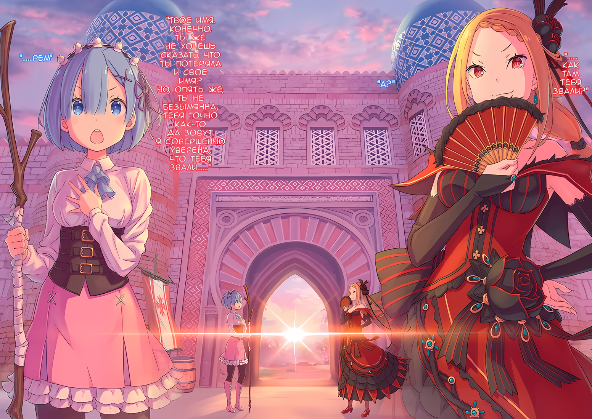

……Он использовал бы все, что мог, чтобы вернуть себе Императорский трон Волакии.

Он будет использовать не только Город-крепость Гуарал, но и «Племя Судрак», Генерала Второго класса Зикра Османа и, конечно же, Нацуки Субару.

Да, Абел просто кивнул головой в знак согласия с подтверждением Субару.

Присцилла: ……Дело, похоже, улажено.

Пробормотала Присцилла, увидев окончание встречи, прикрыв рот раскрытым веером.

Как она и заявила, собрание пришло к консенсусу. Условия победы были понятны всем, дальнейший курс действий был определен, а их следующий пункт назначения и цель были определены.

И тогда……

Субару: Если в Хаосфлейм отправятся только избранные, то что будет с остальными? В настоящее время это только я, Абел, Таритта-сан и Медиум-сан……

Ал: ……В связи с этим, могу я сказать одну вещь?

Субару: Ал?

Субару собирался выбрать последних членов для следующего пункта назначения, Города Демонов Хаосфлейм, когда в разговор вмешался Ал.

Он поднял кисть своей одинокой руки, а затем почесал затылок поднятой рукой.

Ал: Принцесса, могу я на минутку отступить от твоих поводьев? Я хочу остаться с группой брата.

Субару: Уэх?

Ал: Да ладно, у тебя голос ломается, брат. Неужели это так удивительно?

В ответ на это неожиданное предложение голос Субару надломился, что вызвало дрожь в горле у Ала.

Но даже несмотря на то, что он заявил об этом как о чем-то пустяковом, Субару не мог просто так выразить свое согласие.

Субару: Зачем……?

Ал: Я все тебе рассказал, не так ли? Я сказал, что помогу тебе, брат. Даже такой дряхлый старик, как я, может быть в чем-то полезен.

Субару: Ты… Ты был настолько серьезен?

Ал ответил, пожав своими мощными плечами, и Субару вспомнил разговор с ним перед тем, как присоединиться к собранию, и удивился тому, как он придерживался того разговора, который они вели.

Это правда, что он подбодрил его, правда, что он поднял его настроение, и правда, что он подтолкнул его к дальнейшим действиям.

Однако он не ожидал, что тот зайдет настолько далеко, что всерьез заявит о своем «сотрудничестве».

Ал: Хех, почему ты застыл на месте? Неужели мое предложение произвело на тебя такое сильное впечатление?

Субару: ……Нет, отбросив свое первоначальное удивление, я ничего не слышал о том, что ты сильный, Ал, а у нас с Абелом соотношение мужчин и женщин в нашей группе просто ужасное.

Ал: Прости, если я обнадежил тебя, но я намного слабее, чем вон та амазонка сестренка-чан!

Указывая на Таритту щелчком, Ал гордо заверил его, что он довольно жалок.

На самом деле, способности Таритты, вероятно, были одними из лучших в «Племени Судрак», но после битвы с членом «Девяти Божественных Генералов» она оказалась довольно ненадежным боевым подкреплением.

Как бы то ни было……

Субару: Тем не менее, мне приятно слышать это от тебя. Я приму твои чувства.

Ал: Ха, не волнуйся об этом, брат… А? Только чувства? Может быть, ты отказываешь мне в мягкой форме? Хочешь сказать, что на этот раз мы не связаны друг с другом?

У Ала было бесконечное множество вопросов по поводу ответа Субару, но нельзя было ошибиться в том, как он его воспринял.

Он действительно был рад предложению, но это была Империя Волакия. В первую очередь то, что Ал участвовал в битве больше, чем Флоп и Медиум, было чистой случайностью……

Присцилла: ……Ал.

Ал: ……Да, принцесса.

Пока Субару делал свои выводы, красивый голос рядом с ним неожиданно назвал имя Ала.

Обладательницей голоса была, конечно же, Присцилла Бариэль, которая гордо восседала за круглым столом. Она прищурила свои пунцовые глаза и обратила свой безэмоциональный взгляд к Алу.

На ее собственного последователя Ала, который только что объявил о своем следующем шаге,

Присцилла: Это ведь ты предложил сопровождать меня в Город-крепость, не так ли? А теперь ты хочешь покинуть меня и отправиться в увеселительное путешествие со своим клоунским другом?

Ал: Не думаю, что это будет беззаботное путешествие, но таков план. Или ты будешь скучать по мне, принцесса? Если ты хочешь обнять меня и прижать к себе, то давай….

Присцилла: Глупости.

Ал: Верно.

Легкомысленный комментарий Ала был прерван язвительным замечанием, и он попятился. Похоже, он все равно не ожидал многого.

Глядя на макушку Ала через его шлем, Присцилла выпустила небольшой вздох и сказала,

Присцилла: ……Танцуй настолько хорошо, как только сможешь.

Ал: О, я понял. Принцесса — та, кто не должна быть беспечной только потому, что нас с Шультом нет рядом. Красота принцессы — это красота всего мира.

Присцилла: Не требуется такого мне говорить. За кого ты меня принимаешь?

Ал: Конечно, ты — центр мира, моя принцесса, Присцилла Бариэль.

Ал произнес эти претенциозные слова шутливым тоном и легкомысленно поклонился Присцилле. Затем он повернулся и поднял руку к Субару, говоря: «Пойдем».

Субару: Что, этот обмен сделал все окончательным? А как же мое мнение?

Ал: Что за нежелание? Это очень угнетает. Или может просто от меня пахнет стариком, а просто я не замечаю? Типа, тебе трудно находиться рядом со мной?

Субару: Я не об этом. Я имею в виду, что дает тебе право решать……?

Ал: Нет, конечно, можно и отказаться. Но как я могу отказаться? ……Это же принцесса, да?

Ал вздернул подбородок, указывая на Присциллу, которая обмахивала лицо веером.

Это царственное поведение было подавляющим основанием для слов Ала. Отменить решение Присциллы — как же это было бы страшно.

Тем не менее, если это привело бы к неопределенности в будущем, отказ не был вариантом.

Субару: Присцилла, я….

Абел: ……Я не возражаю. Он может следовать за нами, если понадобится.

Субару: Абел, черт тебя дери, ты не относишься ко мне как к военному стратегу!

Однако, как раз когда Субару собирался высказать свое мнение Присцилле, ему снова выстрелили в спину.

Субару взглянул на перебившего его Абела, и тот тоже гордо скрестил руки, выступая против первого. Как и Присцилла, он и здесь намеревался упрямо осуществить свои намерения.

Однако Субару не оставалось ничего другого, как обратиться к нему с аргументом, что условия найма разные.

Субару: Какой смысл быть военным стратегом, если мое мнение даже не принимается во внимание?

Абел: Не будь самонадеянным. Если бы твое мнение стоило того, чтобы к нему прислушаться, я бы прислушался. Тем не менее, я тот, кто делает последние выстрелы. Я бы не доверил это тебе.

Субару: Гннн, ты — мерзкий начальник, который отбирает плоды труда своих работников…?

Абел: Не заставляй меня повторяться. ……Результаты твои. Они должны быть твоими.

Субару: …………

……У Императора, свергнутого со своего трона, был мудрый человек, которого нельзя было недооценивать.

Абелу нужен был Субару с такой репутацией. И он был готов дать Субару кредит доверия и немного преувеличить, чтобы получить его.

Но это ничем не отличалось от создания мифа.

Субару: Быть подделкой Императора недостаточно хорошо. Он должен быть настоящим, иначе я никогда не верну то, что потерял.

Абел: …… Если это так, то попытайся убедить меня и всех остальных своими действиями. Если ты не сможешь этого добиться, то это останется глупым и бредовым замечанием, таящим в себе большие амбиции.

Субару: К черту, я сделаю это. Я использую все бесполезные кредиты с пользой.

Сильно сжав зубы, Субару ответил, глядя в холодные черные глаза Абела.

Несмотря на то, что их отношения были обращены в одну сторону, у них не было такой ситуации, при которой они могли бы ослабить бдительность друг перед другом. Причиной такого разделения была не разница в почве, на которой они стояли, как в Королевстве и Империи, а нечто большее.

Пока это так, он мог не согласиться с Абелом в каком-то важном вопросе.

И как только это произойдет, Нацуки Субару……

Ал: ……Возможно, он имел в виду меня как бесполезный кредит, принцесса?

Присцилла: Дурак.

Присцилла лишь коротко ответила Алу, который ссутулил плечи и пробормотал.

△▼△▼△▼△

……Члены экспедиции в Город Демонов Хаосфлейм были определены, и план был приведен в действие.

Абел: Соберите солдат Города-крепости к моему возвращению. Я скоро отправлю весточку.

Зикр: Я сделаю это, даже если это будет стоить мне жизни.

Получив приказ Абела, Зикр опустился на одно колено и благоговейно повиновался.

Зикр, неожиданно оказавшийся в положении врага могущественной Империи, не сомневался в своей позиции, но, естественно, это не относилось ко всем городским войскам.

Для того чтобы объединить их намерения и собрать в единую армию, необходимы усилия генералов. В этом смысле присутствие Зикра было благом.

Субару: Зикр-сан, я знаю, что это большая работа, но….

Зикр: Нет, это роль, которую я, как «Генерал», должен играть. Это ничто по сравнению с «Бескровной Осадой».

Субару: …………

Субару опустил глаза на слова Зикра, который сильно и гордо улыбнулся.

В послужном списке Субару было то, что он организовал «Бескровную Осаду», утверждал, что сможет это сделать, и потерпел неудачу. В результате он не оправдал ожиданий Рем и вызвал ее разочарование.

Однако Зикр улыбнулся работе Субару.

Зикр: Не унывайте, вы предложили «Бескровную Осаду», и Его Превосходительство одобрил ее. И дело в том, что я и мои подчиненные вступили в ваши ряды, не пролив ни капли крови.

Субару: Не пролив ни капли крови, это….

Преувеличенное выражение, но Субару поперхнулся, увидев повязку, намотанную на рану Зикра. Но щеки Зикра расслабились, и тогда он с силой содрал свою собственную повязку.

Окровавленная повязка была снята, обнажив рану на руке.

Зикр: Для солдата это всего лишь царапина. Более того, вы должны гордиться. Ведь благодаря вашим усилиям число генералов и солдат, сражающихся за Его Превосходительство, не уменьшилось.

Субару: …………

Зикр: Вы должны исполнить свой долг. ……Мисс Нацуми.

Субару не знал, сможет ли он правильно ответить на эти слова Зикра.

Однако, даже если Субару не мог похвалить себя в открытую, он вновь полюбил характер Зикра за то, что тот нашел, за что похвалить, и то, что он не допустил его смерти, было достижением.

А затем……

???: ……Ты уверен, что хочешь идти?

Субару: …………

???: Нет, это было что-то нелепое. Забудь об этом.

И с этими словами Рем, глаза которой не могли скрыть усталости, покачала головой.

Рем стояла у входа в ратушу с тростью. Она была одета не в дорожное снаряжение, а в легкое одеяние целительницы, бегающей по городу, чтобы помочь раненым.

Рем оставалась в Гуарале.

Это была временная разлука с Субару, который направлялся в Хаосфлейм.

Перед расставанием Субару улыбнулся на замечание Рем, которая пришла проводить его. Хоть он и знал, что это была забота, но ничего не мог с собой поделать.

Субару: Ну, не все было хорошо, но мне тяжело, когда ты говоришь мне забыть что-то о тебе.

Рем: О, я не хотела……

Субару: Потому что все, что ты мне дала, будь то задушенная шея или сломанный палец, — это драгоценные воспоминания, без которых я не могу жить.

Рем: А?

Он не собирался смеяться над ней, но в итоге его пронзили оледеневшие глаза Рем.

Когда он вспоминал события, произошедшие с ним после отправки в Волакию, многие воспоминания, всплывавшие в его памяти, несли в себе боль и страдания.

Конечно, было много, очень много воспоминаний о надежде и радости, которые он хранил глубоко в сердце, например, то, что он смог примириться с Рем и что она заботилась о нем.

……Но самые болезненные воспоминания тоже хранились там же.

Рем: Ты не нервничаешь… Ты действительно в порядке?

Субару: Знаешь, это утомительно — быть все время в напряжении… Если ты спрашиваешь меня, все ли у меня в порядке, я бы сказал, что у меня много забот. Если бы я мог, я бы остался рядом с тобой навсегда.

Рем: Хаа.

Субару: Безразличный ответ! Нет, я просто рад, что ты не игнорируешь меня….

Его задело такое непринужденное отношение, но слова, сказанные Субару Рем, были его истинными чувствами.

Было много мучительных раздумий в последнюю минуту, чтобы оставить Рем в Гуарале. Честно говоря, даже в этот момент ему хотелось отказаться от своих слов, схватить ее за тонкие руки и увести.

Как хорошо было бы иметь Рем на расстоянии вытянутой руки Нацуки Субару, чтобы защитить ее от трудностей, пожаров и всех возможных бед, которые могут ее постигнуть.

Субару: На самом деле, я бы даже хотел связать нас с тобой неразрывной пуповиной на все времена.

Рем: Ты серьезно……?

Субару: В какой-то степени.

Рем: …………

В конце концов, он даже не смог заставить ее сказать «А?».

Конечно, он знал, что его отвергли бы, если он был настроен серьезно, так что он просто пошел на это. Было бы лучше, если бы он мог постоянно привязывать себя к Рем, чтобы всегда знать, что она в целости и сохранности.

В зависимости от ситуации, возможно, ему придется прибегнуть к силе, которую он пробудил в Сторожевой Башне Плеяд….

Субару: Я тоже не уверен, как использовать «Кор Леонис»….

Новая способность Субару, «Кор Леонис», проявившаяся в Сторожевой Башне Плеяд — это способность смутно осознавать местоположение и ситуацию своих союзников, в центре которой находился Субару. Кроме того, он позволял Субару брать на себя бремя своих друзей и поддерживать их здоровье.

Возможно, он мог бы использовать свою силу, чтобы взять на себя бремя искалеченных ног Рем и позволить ей бегать по полям и горам в приподнятом настроении.

Однако он не хотел, чтобы Рем стала недосягаемой, сделав это.

Субару: …………

Рем: Эй, почему ты вдруг выглядишь таким подавленным?

Субару: Ничего, просто у меня тут ненависть к себе.

Рем заметила странное, в то время как Субару вздохнул, держа свое опустившееся лицо в руках.

Ему пришло в голову, что хромота Рем удерживала ее в таком месте, где она не могла убежать от Субару. Тот факт, что она была неспособна сбежать, был одной из причин, которая удерживала Субару и Рем от прекращения их отношений.

Тот факт, что Рем была не в идеальной форме, заставлял его думать, что ему повезло.

Субару: Вот почему Рем не может мне доверять.

Субару всегда думал только о себе.

Он хотел быть более мягким. Он хотел быть добрым, умным и сильным. Он усердно трудился ради всех, но теперь, когда он еще раз внимательно посмотрел на себя в Башне, этого все равно было недостаточно.

……Он не смог вернуть Нацуки Субару, в которого верила Рем.

Рем: Хм……?

Субару: Прости. Я стал немного сентиментальным.

Рем: Сентчи, чего?

Субару: Не беспокойся об этом. Это выражение, которое поймет только Ал и… мой родной город.

Рем слегка нахмурилась, когда Субару пожал плечами и ответил. Однако она потерла глаза и стерла морщинки, как бы отгоняя растущие внутри нее чувства.

Должно быть, внутри Рем накопилось много конфликтов. Даже тот факт, что она пришла проводить его таким образом, должен был быть чем-то, над чем она долго размышляла.

Субару: Я не собираюсь уезжать надолго, потому что я не выдержу без тебя.

Рем: ……Опять ты за свое.

Субару: Фу, я серьезно… Если тебе от этого не по себе, я буду сдерживать себя, сколько смогу.

Рем: Ты ведь не собираешься пытаться остановиться?

Плечи Субару опустились в раскаянии, когда он встретился с ее пристальным взглядом.

Конечно, он не хотел обидеть Рем или поставить ее в неудобное положение. Но это не остановило бы его сильные чувства к Рем.

Неважно, что сказал Субару, который разочаровал Рем.

Субару: Удачи, а я скоро вернусь и принесу хорошие новости.

Рем: ……Да, я с нетерпением жду Абела-сан, Медиум-сан и Таритту-сан.

Субару: Ала пропустила, а что насчет меня?

Рем: …………

Субару спросил, просто чтобы убедиться, но температура взгляда Рем осталась неизменной.

Однако Субару, должно быть, выглядел очень несчастным, потому что Рем замолчала на некоторое время, затем выпустила небольшой вздох, как будто сдаваясь, и заявила

Рем: Было бы гораздо лучше, если бы я говорила о том, верить или не верить в тебя.

Субару: Ты не говоришь о том, верить или не верить……

Рем: Как обычно, дурной запах все еще не исчез, но проблема не в этом.

Субару: Проблема не в этом…?

Голубые глаза Рем продолжали смотреть на него с блеском неверия, который все никак не может исчезнуть.

Они собирались разлучиться друг с другом, пусть даже на время. Ее неверие… Хотя он и знал, что его причиной была ошибка Субару в Гуарале, он хотел избавиться от него, хотя бы на чуть-чуть.

Не столько ради самого Субару, сколько ради чувств Рем, пока она ждала в городе.

Субару: Вот что, Рем, я сделаю все, что смогу. Как я могу помочь тебе избавиться от тревоги, или что там у тебя?

Рем: ……Тогда почему ты до сих пор так одет?

Субару: Э!?

Субару с презрительным взглядом оглядел себя, когда Рем говорила это.

Парик с длинными соболиными волосами, белая пудра, чтобы скрыть недостатки, наряд, тщательно продуманный, чтобы скрыть контуры его тела, и украшения, которые не были слишком вычурными….

Субару: В этом есть что-то странное…?

Рем: Одна из странностей в том, что в этом нет ничего странного, а в том, что ты все еще одет так, даже когда покидаешь Город-крепость. Какая отмазка у тебя на этот раз?

Субару: Ее нет, поэтому я и объяснила тебе, что это именно то, что мне необходимо сделать!

Наблюдая за тем, как резко падает температура взгляда Рем, Субару издал звук, похожий на вопль, продолжая изображать Нацуми Шварц.

Было совершенно неожиданно, что этот наряд сыграл роль в ее неверии, но, как он уже сказал Рем, для этого была веская причина.

Субару: Рем, я уже говорил тебе вчера, мы люди из соседней страны. И если мое настоящее имя станет известно, я буду в опасности по всей стране. Вот почему мне это нужно. Я не могу быть настоящим, я должен быть Нацуми Шварц…!

Рем: Хм, понятно.

Субару: Ответ, который нисколько не развеивает неверие!

Температура взгляда Рем никак не изменилась, и на самом деле, она становилась все более недоверчивой.

Однако это была контрмера, придуманная на полном серьезе после взвешивания ситуации Субару и роли, которая ему была отведена.

……Нельзя было допустить, чтобы имя «Нацуки Субару» приобрело известность в Империи Волакия.

Нацуки Субару уже был рыцарем Эмилии, крупной фигурой в Королевстве Лугуника. Другими словами, то, что он делал сейчас, несомненно, считалось бы внушительным вмешательством во внутренние дела соседней страны.

Субару: Вмешательство во внутренние дела другой страны — это не значит быть впечатляющим или что-то в этом роде.

Как бы там ни было, важно то, что последствия действий Субару и ответственность за них лежат не только на Субару. ……Глубоко говоря, это может привести к неприятностям для Эмилии.

Как ее рыцарь, Субару, поклявшийся помочь ей на пути к монаршей власти, не мог допустить, чтобы ее так опустили.

Субару: Тут в дело вступает Нацуми Шварц. Неважно, насколько известной станет Нацуми. Нацуми будет просто красивой черноволосой девушкой, которая внезапно появилась в Империи Волакия.

Рем: Ты закончил?

Субару: Еще нет, нет! Кроме того, я готов поспорить, что…… имя Нацуми Шварц оставит шанс моим друзьям в Лугунике заметить меня.

Скорее, это была основная причина принятия псевдонима «Нацуми Шварц».

Этот случай в Империи Волакия был не первым, когда Субару переодевался в женскую одежду и называл себя Нацуми Шварц. Был случай, когда он переоделся в женщину не в качестве развлечения в особняке Розвааля, а по необходимости, и его истинная сущность была известна всем, кроме Эмилии.

Псевдоним, который он назвал тогда, был тем же самым. Другими словами, в будущем, если о существовании Субару станет известно в Империи, как надеялся Абел, и если имя, которое распространилось, будет именем «Нацуми Шварц», Эмилия и банда могут иметь возможность узнать, что Субару и остальные были отправлены в Империю.

Следовательно……

Субару: Я одет так по необходимости.

Рем: ……………………………Понятно.

Это заняло довольно много времени, но он почувствовал облегчение от того, что Рем поняла его подход.

В любом случае, это была причина, по которой переодежка Субару будет сохраняться еще некоторое время. Он не хотел подрывать доверие Рем, заставляя себя продолжать этим заниматься, но это будет зависеть от ситуации.

Субару: Рем, если у тебя проблемы, поговори с Флопом-сан или Зикром-сан. Если это слишком сложно для мужчины, Мизельда-сан и остальные рядом. Не держи все в себе.

Рем: Тебе не имеет смысла так говорить, но я подумаю…… Ты тоже, пожалуйста, постарайся не беспокоить Абела-сан и Медиум-сан.

Субару: Я просто буду следить за собой.

Субару не собирался отвлекать Абела от работы.

Время от времени Абел должен был нарушать свое спокойствие, бороться и потеть.

После того, как они попрощались и сказали несколько слов предостережения, настало время уходить.

Подавляя в себе трудность отъезда перед путешествием……

Субару: Рем, где та девочка?

Рем: Ты имеешь в виду Луис-чан? Думаю, она сейчас с Утакатой….

Субару: Понятно.

Рем: ……Ты же не хочешь, чтобы я пошла и забрала ее?

Тон ее голоса понизился, и Рем бросила на него вопросительный взгляд.

Ее голос не был приятным, хотя она знала о намерениях Субару. Скорее, это был тон глубоко запрятанного раздражения и горечи.

С момента сражения в мэрии подозрения Субару в отношении Луис оставались неизменными, несмотря на то, что они очень мало общались в своем суматошном графике. На самом деле, его подозрения так и не оправдались.

Несмотря на то, что она, похоже, неравнодушна к Рем и Утакате, хорошо ладит с судракийками и остальными, неизвестно, когда и где она может раскрыть свою истинную сущность.

В этом смысле он беспокоился о том, что оставит Луис позади.

Просто……

Рем: Ты и так не сводила с нее глаз на протяжении всей миссии по уничтожению Гуарала, верно?

Субару: …………

Рем: Спустя столько времени, все еще так.

Когда Рем сказала это, у Субару не нашлось слов, чтобы ответить.

Если Луис собиралась предпринять какие-либо действия, она уже имела несколько шансов сделать это. Так что, вероятно, было бесполезно продолжать опасаться Луис.

Субару: На данный момент я уже сказал Куне и остальным, что они должны сохранять бдительность.

Рем: Упрямый….

Минутный шепот слов, уловив который, Субару на мгновение задумался.

Причина, по которой он не раскрыл Рем истинную природу Луис и его опасные способности, заключалась в том, что у нее не было никаких оснований верить рассказам Субару. Терять доверие Рем и отталкивать ее, рассказывая о ситуации с Луис, было не в его силах.

Но что теперь?

Их отношения улучшились, и она слушала его, хотя и холодно. Может быть, теперь она не будет так пренебрежительно относиться к его словам об истинной природе Луис.

Субару: ……Нет, не делай глупостей.

Субару покачал головой и отбросил мысль, мелькнувшую у него в голове.

Она может поверить ему, но даже тогда это будет бессмысленно. До сих пор Луис не раскрыла своего истинного облика. Трудно было поверить, что она выдаст свою истинную сущность, как только он заговорит с Рем. Ситуация останется прежней.

Это не только заставило бы Субару чувствовать себя лучше, но, в свою очередь, усилило беспокойство Рем.

В этом не было никакой необходимости.

Рем: …Что это за лицо?

Субару: Да, я просто надеялся, что на жизнь Рем обрушится только удача.

Рем: А?

Линия взгляда Рем сузилась, так как Субару пытался сдержать тепло, поднимающееся внутри него.

Однако, если он пытался что-то сказать, разговор продолжался и продолжался, и продолжался.

???: ……Брат! Нам давно пора уезжать.

Так сказал Ал, прислонившись к карете и размахивая своей одинокой рукой.

Позади него стояла повозка и одно лошадиное существо, тело которого было таким же огромным, как и повозка…… существо под названием «Лошадь Галевинд», которое, как говорили, должно было тянуть их по дороге.

Рем: Я слышала, что это редкое животное в Волакии, кажется, его дают только «Генералам».…

Субару: Зикр-сан одолжил его мне. Она вообще-то женского пола, так что его прозвище соответствует….

Рем: Соответствует…?

Рем наклонила голову, похоже, не убежденная словами Субару.

Именно так Рем отреагировала на слова Субару, к лучшему или худшему. Такие счастливые обстоятельства придется отложить на время.

Ал: Оиии, брат?

Рем: Эм, тебя зовет Ал-сан.

Субару: Да, я знаю. Я в курсе….

Рем: ……?

Субару: Подошвы моих ботинок думают, что трудно уйти в сторону и оторваться от земли… Ай, ай, ай!

Кончик трости ткнул его в спину, и подошва ботинка, которая должна была быть прикреплена к земле, отошла от нее. Он был вынужден сделать еще два или три шага вперед, открывая расстояние между собой и Рем.

Дистанция между ними стала реальной.

Субару: Рем, я говорил тебе много раз….

Рем: Я буду осторожна. Я также буду бдительной. Если у меня будут проблемы, я обращусь к кому-нибудь другому. До свидания.

Субару: Ууу….

Плечи Субару опустились, и он поник, когда ему сурово сказали «до свидания». Посмотрев на него, Рем глубоко вздохнула и сказала

Рем: Береги себя и счастливого пути. Я буду ждать твоего возвращения.

Субару: О….

Рем: Я не собираюсь внезапно исчезнуть… Есть и другие люди, кроме тебя, которым я доверяю.

Она добавила это, и Субару внимательно обдумал это.

Затем он несколько раз покачал головой, даже когда Рем нахмурилась от отвращения,

Субару: ……Я поехал!

И, взмахнув рукой, Рем отправила его прочь.

△▼△▼△▼△

???: …………

Карета удалялась, проезжая через главные ворота Города-крепости и исчезая вдали.

Карета направлялась на юго-восток от города, в Город Демонов Хаосфлейм…… где находился один из самых могущественных людей в Империи, и все внимание было сосредоточено на том, смогут ли они убедить этого человека присоединиться к ним.

Честно говоря, если это означало завербовать кого-то, то выбор взять с собой Субару был сомнительным.

???: ……Я уверена, что любой согласится с тем, что ты прилагаешь усилия.

Опираясь на трость, Рем прищурилась на следы кареты, которых больше не было видно.

Субару был в шутливом настроении до самого момента их расставания. Он приводил всевозможные оправдания, но Рем могла думать только об его нежелании переодеваться в женскую одежду.

Конечно, это не означало, что она считала все его оправдания ложью.

???: Они уехали? Город станет более приятным из-за ухода шумных людей. Однако я не уверена, принесут ли они добрые вести или голову Абела.

Рем: .…Присцилла-сан.

Внезапно позади Рем раздался голос.

Не успев она обернуться, оттуда вышла красивая женщина, производившая яркое впечатление в красном…… Присцилла, одетая в роскошное платье и скупо демонстрирующая свою неистовую красоту.

Рем не разговаривала с ней с тех пор, как та спасла ей жизнь от буйства Аракии во время штурма ратуши.

Поэтому, когда она вдруг заговорила с Рем, ее растерянность и недоумение усилились.

Рем: …Большое спасибо.

Присцилла: Хм, в связи с чем эта благодарность?

Рем: За то, что произошло вчера, в мэрии. Я была спасена от той женщины, Аракии. Не только меня, но и всех остальных. Благодаря вам.

Присцилла: Я спасла много жизней, говоришь? На мой взгляд, заслуга в спасении их жизней принадлежит тебе. Ты использовала свой талант и навыки, чтобы спасти тех, кто умирал. В мои намерения не входило проявлять к ним милосердие. Не смей переиначивать мои действия.

Рем: Я не хотела….

Рем думала про себя, пытаясь сказать, что не хотела.

Это была плохая привычка — преждевременно судить о мыслях и поступках других людей и их намерениях и пытаться подогнать их под себя. Она помнила много случаев подобного рода, причем не только в отношении Присциллы.

Учитывая утраченные воспоминания, она прожила всего две недели.

Рем: …………

Присцилла: Значит, ты ничего не скажешь в ответ? Это тоже крайне скучное решение, не так ли?

Рем: ……Простите. Я думала, что вы правы. Но я думаю, вы не сможете извратить тот факт, что я благодарна вам?

Присцилла: …………

Говоря с интересом, Присцилла вытащила веер из своего декольте. Раскрыв его, она спрятала свои тонкие губы.

Однако в ее незаметных глазах светился огонек удовольствия и возможности, который невозможно было скрыть.

Присцилла: Я слышала, что ты потеряла себя, но… Как ты смеешь мне перечить?

Рем: Потеряла себя — не совсем верное выражение. Если я не могу вспомнить, это не значит, что все потеряно.

Положив руку на грудь, Рем защищалась от слов Присциллы.

Если бы она действительно потеряла себя, это не отличалось бы от недоступного никому сна. Но потерянные воспоминания Рем не исчезли. Они были не в Рем, а в Субару, который отчаянно пытался вернуть их обратно.

Если то, что он сказал, было правдой, то у нее была сестра-близнец.

Она задавалась вопросом, остался ли в этой сестре хоть какой-то след того человека, которым она была до того, как потеряла свои воспоминания, остался ли ее след в друзьях, о которых говорил Субару, в людях, которых она еще не видела.

Если Рем могла быть довольна тем, что все в ней исчезло, и что все зарождается там, где ничего не было, то……

Рем: ……Если бы я смогла это сделать, мое сердце не болело бы так сильно.

Присцилла: …………

Рем: Все время, каждую секунду, я вспоминаю об этом. Каждый раз, когда я смотрю в его глаза, я знаю, что обманываю его ожидания.

Конечно, Субару, вероятно, не хотел этого делать.

Вонь была настолько густой и сильной, что трудно было даже рассмотреть его…… и когда бы она ни взглянула на него, на его лице всегда было отчаяние.

И это отчаяние было направлено на ту версию себя, которая исчезла, а не на Рем, которая осталась.

Рем: Как эгоистично с моей стороны. Я сама себе противна….

Поэтому она не могла сказать ему, что испытывает облегчение от разлуки, ей было трудно сказать ему, который хотел не разлучаться с ней.

И она не только испытывала облегчение, но и чувствовала отвращение.

Присцилла: ……Как там тебя звали?

Рем: А?

Присцилла: Твое имя. Конечно, ты же не хочешь сказать, что ты потеряла и свое имя? Но, опять же, ты не безымянна, тебя точно как-то да зовут. Я совершенно уверена, что тебя звали….

Присцилла слегка подняла взгляд, ища в пустоте ответ на свой вопрос.

Возможно, она вспомнит имя Рем. Даже за то короткое время, что она находилась здесь, Рем могла почувствовать, что она очень умный человек.

В то же время она была и очень злым человеком.

Поэтому……

Рем: ……Рем.

Цветная иллюстрация к **Ранобэ** Том 28 | Перевод неофициальный и выполнен под контекст перевода rezero7arc | Клин djoenfoej

И прежде чем Присцилла успела нарочно произнести неправильное имя, Рем произнесла его сама.

Даже если ее воспоминания исчезли, и не было никаких признаков их возвращения, и даже если она была разлучена с людьми, которые знали ее в прошлом, по крайней мере, «Имя», которым ее называли и узнавали последние две недели, было настоящим.

Присцилла: Интересно.

Пробормотала Присцилла, услышав этот ответ.

Затем она с треском закрыла свой веер и кончиком закрытого веера осторожно приподняла подбородок Рем. От этого жаркого взгляда, пронзившего ее пунцовые глаза, у Рем перехватило горло.

Но, хотя она и не могла произнести ни слова, она смотрела в ответ с намерением в глазах.

Присцилла: Рем, я буду держать тебя рядом с собой некоторое время.

Рем: ……Рядом с собой?

Присцилла: У тебя есть опыт и амбиции, но не способности. Твоя уродливая магия исцеления должна быть восстановлена мной в умеренных количествах. Тогда она станет тем, на что ты сможешь взглянуть.

Рем: ……! Вы собираетесь научить меня исцелять?

Присцилла: Глупости. У меня нет опыта в целительном искусстве. У меня только глаз на красоту. Я пойму, чего тебе не хватает, когда увижу это.

Рем: …………

Ответ, который был дан Присциллой, был не таким, как ожидала Рем, но в каком-то смысле это было либо больше, чем она ожидала, либо очень далеко от того, что она ожидала.

Однако, если единственное умение Рем — магия исцеления, способная исцелять других…… ее надо было использовать, стоило положиться на слова Присциллы.

Если бы только у нее было больше силы, подумала она. Это было то, о чем она сожалела.

Рем: Но, Присцилла-сан, разве вы не возвращаетесь на свою базу?

Присцилла: Нет. Я также прилепила Ала к Абелу. Пройдет немного времени, и мы увидим, можно ли выполнить условия, которые я ему поставила. Я буду ждать здесь. Будут некоторые неудобства, но… я вызову Шульта, чтобы решить их.

Рем: Ха, хаа…

Рем не знала, что дергает ее за сердце, но Присцилла решила остаться в Гуарале. В любом случае, было бы полезно иметь ее в качестве наставника.

В этом городе было еще много людей, нуждающихся в слабых целительских навыках Рем. Она не могла покинуть город, не оказав им помощи.

Присцилла: Теперь, когда все решено, приготовь для меня комнату. Я позволю Шульту позаботиться о деталях, но нам нужно место, где мы сможем провести сегодняшний и завтрашний день.

Рем: Я поняла. Я сейчас же все подготовлю.

Присцилла отдавала приказы так, словно это место принадлежало ей, но Рем не хотелось ослушаться, и она подчинилась.

Присцилла умела заставлять других подчиняться ей, но Рем и сама не противилась, когда ей приказывали сделать то, что нужно.

Быстрыми шагами, с тростью в руках, она вернулась в ратушу и подумала, что ей следует посоветоваться с Зикром о пребывании Присциллы и о том, как обустроить ее комнату.

«Племя Судрак» не привыкли к городской жизни, и поэтому ей было неприятно, что во многих вопросах ей приходится полагаться на Зикра.

Однако он был человеком, который откажет или навесит ярлык чего-то невозможного, если к нему обратится женщина.

???: А, Рее, вот ты где.

Рем: Утаката-чан.

Внутри мэрии, по пути к офису, где должен был находиться Зикр, она столкнулась с девушкой, выглядывающей из окна коридора…… Утаката.

Заметив появление Рем, Утаката приветливо улыбнулась ей. Рем не могла не улыбнуться в ответ, поэтому ее щеки расслабились.

Рем: Прости, я была немного занята.

Утаката: С Ууу все в порядке, она в полном порядке. Я больше беспокоюсь о Таа. Она все время шатается.

Рем: Таритта-сан, точно…

Недавно назначенная вождем, Таритта сопровождала Субару и остальных в их путешествии.

Даже в глазах молодой Утакаты Таритта, должно быть, выглядела шаткой, почти раздавленной своим внезапным назначением. Тем не менее, то, что она сама ищет выход и делает первый шаг к обретению уверенности, было достойно восхищения.

Пока Рем стояла на месте и ныла, что у нее ничего нет, люди вокруг нее продолжали двигаться вперед, оставляя Рем позади.

Она определенно не хотела проклинать мир своим нытьем и тянуть всех вниз вместе с собой.

Рем: С Тариттой-сан все будет хорошо. Утаката-чан, остальные и я будем охранять место, куда вернется Таритта-сан.

Утаката: Ммм, поняла! Рее, на тебя можно положиться.

Рем: Интересно. Когда ты так говоришь, я чувствую себя немного увереннее.

Щеки Рем слегка порозовели от незатейливых слов Утакаты.

И вдруг Рем заметила что-то странное и оглянулась. Утаката, стоя в проходе и глядя в окно, была одна. И больше никого вокруг не было.

Это все еще казалось неподходящей обстановкой для одинокой прогулки ребенка, но Рем не пыталась обвинить ее в том, что она не была со взрослым. ……Скорее, это было что-то более фундаментальное.

Рем: Ты одна, Утаката-чан? Где Луис-чан?

Несмотря на то, что Луис долгое время была предоставлена сама себе, она очень полюбила Утакату.

Они были друзьями одного возраста и, казалось, поддерживали комфортные отношения, поэтому Утаката, оставшись одна, испытывала явный дискомфорт.

Конечно, возможно, она слишком много об этом думает, но……

Рем: Разве Луис-чан не с тобой?

Утаката: Да! Луу уже ушла.

Рем: ……Э?

Рем застыла, услышав слова Утакаты, а ее голова откинулась назад.

Остановив на мгновение свои мысли, Рем постаралась использовать свой мозг, чтобы выяснить истинность слов Утакаты.

Луис не было с ней, поэтому смысл слов Утакаты был…

Рем: Л-Луис-чан….

Утаката: Мм, она ушла! Ууу помогла ей сесть в карету.

И храбрая и мужественная девушка Судрак надула грудь от гордости, говоря эти слова Рем совершенно бесстрастным тоном.
