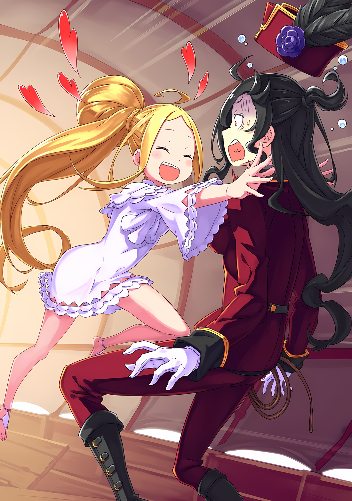

Карета медленно, но не до такой степени идиллически, двигалась по дороге.

Каштановолосая лошадь Галевинд, покачивая своим огромным телом с деликатностью, которая не соответствовала ее крепкой фигуре, осторожно сопровождала карету, в которой находились Субару и остальные.

Субару: Как предсказуемо, у нас есть Лейди, которая не совсем леди… Учитывая, что это любимая лошадь Зикра-сан.

Субару вспомнил об этом, глядя на мчащуюся лошадь Галевинд, и его хозяин был у него на первом плане.

Любимую лошадь Зикра, которую они одолжили, звали «Лейди»…… имя, очень близкое по значению к «леди», и удивительно роковое для человека, прозванного «Бабником».

В любом случае, благодаря усилиям Лейди, путешествие группы в Город Демонов Хаосфлейм проходило гладко. Если все будет продолжаться в том же темпе, то они рассчитывали прибыть примерно через четыре дня.

Субару: Но дело не только в прибытии, вы знаете. Не только репутация члена Девяти Божественных Генералов, с которым мы собираемся встретиться, но и само название «Город Демонов» пугает в первую очередь.

«Город Демонов», город, в названии которого есть слово «демон». Казалось, это вряд ли будет простым делом.

До него дошли слухи, что это плавильный котел с разнообразной смесью рас, но достаточно ли этого, чтобы увенчать город словами «хаос» и «демон»?

Учитывая тот факт, что во главе города стояла одна из «Девяти Божественных Генералов», та, кто часто вызывала восстания, создавалось впечатление, что они лишь пытались подстегнуть чувство опасности Субару. ……Это была одна из причин, почему он не взял с собой Рем.

Субару: Интересно, какой хаос нас ожидает….

Ал: Как бы хаотично это ни звучало, это все равно сбивает меня с толку. Этот наряд и брат, которого я знаю, как-то не очень сочетаются, и это начинает напоминать какой-нибудь баг.

Субару: А? Ты все еще говоришь такие вещи?

Субару, который сидел на переднем сиденье просторной кареты и смотрел в окно на проворную фигурку Лейди, обернулся, нежно поглаживая рукой свои длинные черные волосы, развевающиеся на ветру.

Подняв подбородок, словно в раздражении, Ал сидел в задней части кареты.

Ал занимал трехместное сиденье в ссутуленной позе. Затем он зацепил пальцами подбородок своего шлема, заставив поднятую голову смотреть вниз.

Ал: Ты определенно делаешь это нарочно.

С горьким тоном он сказал это из-за поведения Субару.

Субару пожал плечами, чувствуя разочарование от решительного отказа Ала. Удивительно, но Ал был вторым человеком после Рем, который раскритиковал переодевание Субару.

Абел, судракийки, брат и сестра О'Коннелл и Зикр, все они, естественно, снисходительно относились к нему, когда приняли его, но Ал продолжал настаивать на этом.

Субару: Тот же самый рот, который говорил, что будет поддерживать меня, теперь жалуется…… Значит, весь этот таинственный разговор был ложью?

Ал: Это была не ложь, и мое решение помочь тебе искренне, брат, но это не то же самое, что и это. Я уверен, что ты сможешь понять, почему я недоволен твоим переодеванием, брат.

Субару: Если ты на моей стороне, тебе придется принять меня таким, какой я есть.

Ал: Ты уверен, что хочешь, чтобы тебя продолжали называть братом, когда ты в этом переодевании? Серьезно?

Когда кто-то повторил ему это, даже Субару почувствовал, что это немного неразумно.

Нацуки Субару и Нацуми Шварц…… несмотря на то, что эти два имени могут иметь одно и то же тело, была явная разница в том, какими они были и как они стояли.

Другими словами, Нацуки Субару был его приземленным «я», а Нацуми Шварц — идеализированным образом его собственного непостоянного «я».

Субару: Конечно, я не хочу быть женщиной. Дело в уверенности в себе и все такое.

Ал: Я не спрашивал!

Несмотря на то, что Субару получил отпор вслух, он посмотрел вниз на свое тело и изменил свое восприятие.

Нацуми Шварц теперь была воссоздана с помощью парика и грима, но в отличие от того времени, когда он изображал танцовщицу, его роль в будущем будет более интеллектуальной.

Поэтому костюмы и грим были подобраны таким образом, чтобы отразить это впечатление.

Наряд красного цвета с воротником был единственным в своем роде, созданным по мотивам униформы офицеров Империи Волакия…… Зикр носил похожий костюм. Обычно он не носил плащ без необходимости, так как он сковывал движения, но он гордился тем, что этот блеф сработал.

Дальше шли штаны, на ногах были крепкие сапоги, а на голове лежала военная фуражка с птичьим пером.

Это был полный образ женщины-военного стратега Нацуми Шварц.

Субару: Ну, наверное, я скорее женщина-солдат, чем женщина-стратег. Когда ты думаешь о женщинах в военной одежде, ты ожидаешь, что они будут одеты как мужчины, верно?

Ал: Даже когда я буквально смотрю на то, как ты, брат, переодеваешься в женщину, которая переодевается в мужчину, мое замешательство только усиливается.

Субару: Я не хочу выделяться, поэтому одежда подобрана в стиле Империи. Это мужской образ, поэтому я немного вдохновился вкусом Круш-сан.

Ал: Не уверен, что герцогине понравится такое выражение, мол, ты черпал вдохновение из своих предыдущих встреч с ней…… Мне одному кажется, что это странно? Что вы думаете об этом, Император-сан?

Ал в отчаянии поднял правую руку к Субару, который объяснил ему концепцию. После этого Ал повернул эту руку вперед, указывая на фигуру перед собой.

На среднем сиденье кареты, или, другими словами, на том месте, где он бесконечно находился между их разговорами, сидел Абел и с мрачным выражением лица смотрел в окно.

Казалось, он о чем-то размышлял с серьезным выражением лица. Он поднял брови на неосторожное имя, которое использовал Ал, и, не оборачиваясь, холодно произнес «Клоун».

Абел: Я не помню, чтобы позволял тебе называть меня так. Знай, что одно неосторожное слово может поставить под угрозу само существование Империи. В противном случае ты потеряешь не только вторую руку.

Ал: Уф, дайте мне передохнуть. Я привык к этому, но неудобство есть неудобство. Если я потеряю еще одну, это будет больше, чем просто неудобство.

Абел: Тогда ты должен иметь это в виду.

Ал: Эй, хи-хи, этот Имперский способ не смешной. Такое тяжко для таких комиков, как мы. Правда, брат?

Субару: Я не хочу, чтобы меня спрашивали о моем согласии.

Атмосфера была напряженной, в ней не было места для шуток или легкомысленных разговоров, но Субару не собирался критиковать Империю, например, говорить, что это проблема характера страны.

В крайнем случае, как с человеком, с Абелом ему было трудно ужиться. Сам ответ был легкомысленным, так что это была жалоба, которую он никогда не чувствовал на поверхности.

Конечно, когда дело дошло до вопросов убеждений и ценностей, на этом все не остановилось.

Ал: Итак, что ты думаешь о наряде брата, Абел-чан?

Абел: …………

На мгновение Абел наморщил лоб, услышав новое имя.

Субару был удивлен смелым подходом Ала, но после нескольких мгновений молчания Абел грубо фыркнул на дерзость и проигнорировал его.

Разве это лучше, чем «Император-сан»? Не зная, что Абел думает по этому поводу, Субару со вздохом подавил внутренний холод.

Тем временем Абел снова посмотрел на Субару, чтобы ответить на вопрос Ала,

Абел: Да, это нелепый вид, но мне все равно, лишь бы он окупился. Ты должен отделять свои способности от своих увлечений.

Субару: Не бей меня в спину под видом поддержки. Сколько раз я должен повторять тебе, что это не хобби, а необходимость? Думаешь, я одеваюсь как женщина, потому что мне это нравится?

Абел: …………

Субару: Не молчи!

Из-за наводящего молчания подозрения Субару незаслуженно усилились.

Естественно, это было очень неприятным пониманием для Субару. Он вообще не хотел переодеваться в женскую одежду, если это не требовалось.

Однако, если бы существовала хоть малейшая возможность, что это поможет разрешить ситуацию, он не исключал бы переодевание в женскую одежду как вариант. Вот и все.

Субару: У каждого есть подходящий…… аргумент, подготовленный им, слушай.

Ал: Ты сказал, что вооружен аргументом. В любом случае, я уверен, что это клише. Император, изгнанный с трона, набирает союзников, чтобы вернуть его… В таком случае, вполне естественно, что его сопровождает таинственная женщина.

Субару: Да, верно. Как стратег или маг. И обычно в таких историях на такой должности оказывается героиня… Я не героиня!

Ал: Не злись, хотя ты сам это сказал. Ты удивишь всех, не говоря уже обо мне.

Субару был возмущен, но его намерения не были понятны никому, кроме его земляка Ала.

Во-первых, было много фраз, которые не поняли бы даже на их родине. Знания Ала были довольно близки к знаниям Субару, о чем свидетельствовал тот факт, что он даже мог их использовать.

Субару: ……Я никогда не спрашивал о том, из какого периода времени он родом, или о чем-то более глубоком.

До сих пор, несмотря на то, что Субару поделился информацией о том, что он и Ал были земляками, они никогда не обсуждали тот момент, из какого временного периода каждый из них прибыл.

Ал однажды рассказал Субару, что был призван в этот мир почти двадцать лет назад.

Более того, его переживания были настолько ужасны, что он даже потерял одну из рук.

Хотя само признание было сделано беззаботно, на самом деле все было не так легкомысленно.

Мучения и отчаяние, которые пережил Ал, должны были стать постоянной частью его повседневной жизни. Ал был человеком, которого суровость этого другого мира мучила гораздо больше, чем Субару.

Теперь, когда он говорил об этом, он понял, насколько он благословенен по сравнению с ним.

В то же время он задавался вопросом, в чем разница между ним и Алом.

Из-за этого страха Субару не пытался вести глубокие разговоры с Алом, и Ал тоже не пытался зайти дальше.

Однако, учитывая используемый язык и субкультурные темы, которые они могли понять, первоначальный мир, в котором жили Субару и Ал, должен был находиться в одном временном промежутке…… Если его вызвали двадцать лет назад, он должен был быть того же возраста и из той же эпохи.

Нынешняя разница в возрасте между Субару и Алом была всего лишь функцией времени в этом другом мире, куда они были вызваны. Отныне, несмотря на разницу в возрасте, они с Субару были на одной волне в своих разговорах.

……Это, похоже, и было причиной смутного покалывания, которое Субару ощущал, общаясь с ним.

Ал: ……Ненавижу клише.

Субару: А?

Ал: Подозрительный маг рядом с Императором… Разве это не клише? Что насчет этого?

Легкомысленный комментарий Ала вернул Субару, чьи мысли сбились с пути, к реальности.

Моргнув глазами, Субару кивнул головой в знак согласия с тем, что он назвал «Клише», сказав «Да».

Субару: Это действительно клише. Очаровательная женщина-маг соблазняет Императора и медленно превращает его в марионетку своей воли…… А затем процветающая страна рушится.

Абел: Я не позволю ей развалиться самой по себе. Я верну ее назад, несмотря ни на что. Просто….

Субару: Просто?

Абел: Это был не маг и не женщина, но правда, что был один, прозванный «Звездочетом».

Субару и Ал: ……«Звездочет»?

Слова Абела были встречены сомнением Субару и Ала.

Это было слово, которое они никогда раньше не слышали, но оно показалось им странным.

Субару никогда раньше не слышал этого слова, но, как ни странно, в его голове возникло представление о персонажах. И как только персонажи подошли, роль слова тоже пришла в голову, но смутно.

Субару: Может быть, это мастер фэн-шуй или что-то в этом роде… что-то вроде должности гадалки?

Ал: Это больше похоже на пророка, не так ли? Ведь именно это делает каменная скрижаль в Королевстве.

Субару: Да, «Драконья Скрижаль», вроде….

Убежденный словами Ала, Субару извлек из своей головы знания о пророческой скрижали, переданные в Королевстве.

Хотя Субару не видел артефакта, казалось, что скрижаль содержала информацию о будущих событиях, которые произойдут в Королевстве Лугуника, и считалась полезным артефактом, который также предлагал решение проблем.

Однако, предсказав, что королевская семья Лугуники заболеет, Скрижаль представила подход к выбору следующего монарха… Другими словами, Королевский отбор, в котором участвовали Эмилия и Присцилла.

Честно говоря, это был результат, который заставил его наклонить голову при мысли о благодарности скрижали пророчества.

Субару: Если бы он всерьез хотел дать совет, как спасти Королевство, он бы сказал им, как вылечить или остановить болезнь в первую очередь….

По мере углубления своих знаний в качестве рыцаря королевского кандидата, он узнал, что королевская семья Лугуники не отличалась тираническим поведением или имбецильностью, и, по крайней мере, была любима своим народом.

Многие подданные и граждане были опечалены их смертью, но никто из них не был этому рад. ……До сих пор остается загадкой, почему «Драконья Скрижаль» покинула их.

Субару: Если другая сторона для переговоров — каменная плита, получить какие-либо ответы будет несбыточной мечтой.

Ал: Если это каменная плита, то да, но «Звездочет» не такой, верно? Какую роль он играл в суде, Абел-чан?

Абел: …… Не слишком далеко от всех ваших представлений. Потому что власть «Звездочета» заключалась в том, чтобы заглядывать в будущее, дабы сохранить Империю.

Ответ Абела на вопрос примерно соответствовал тому впечатлению, которое Субару вынес из названия «Звездочет». Тем не менее, оставалась одна проблема.

Субару: ……Но он не смог предсказать ситуацию. Тебя же изгнали, в конце концов.

Абел: Как я уже говорил. Власть «Звездочета» направлена на сохранение Империи. ……Это не обязательно совпадает с моей безопасностью.

Субару: Это значит… что для Империи будет лучше, если тебя прогонят.

Абел: По крайней мере, я полагаю, что «Звездочет» решил именно так.

Абел спокойно скрестил руки, отвечая бесстрастно.

Можно утверждать, что Скрижаль и «Звездочет», два объекта с похожими функциями, оба упустили из виду бедственное положение того, что должно быть самой благородной должностью в их странах.

Подозревать связь между Королевством и Империей было заманчиво, однако……

Субару: До этого я начинаю чувствовать, что это проблема с тобой, ведь тебя бросили премьер-министр, а помимо него твоя правая рука и этот пророк. Ты уверен, что можно вернуть тебя на трон Императора?

Ал: Ойой, это слишком прямолинейный файрбол, брат.

Субару: Нет, разве ты не испытываешь беспокойства, когда слышишь ситуацию, связанную и с этим!?

Ал: Но на этом все. Генерал с афро одобрил Абела-чан, не так ли?

Субару: Да, верно. Тогда, думаю, все в порядке….

При упоминании Генерала с афро, Зикра, Субару был достаточно убежден.

Зикр был на стороне Абела, что радовало, хотя и заставляло его беспокоиться о многих других вещах. С другой стороны, если бы не Зикр, то он вряд ли смог пойти на сотрудничество с Абелом, учитывая его подозрения.

Независимо от того, насколько сильно он хотел вернуть себя и Рем в Королевство в целости и сохранности, это не означало, что ему было все равно, что случится с Империей.

Честно говоря, у Субару было больше плохих воспоминаний об Империи, чем хороших, но было много людей, которых он хотел бы видеть счастливыми, включая «Племя Судрак» и брата с сестрой О'Коннелл.

Субару: Я уже начинаю беспокоиться о том, чтобы включить тебя в это, но….

Абел: Что бы ты ни сказал, независимо от того, что видит «Звездочет» относительно будущего, у меня есть свой ответ.

Субару: …………

Абел: Если «Звездочет» решит, что я не могу оставаться на троне, я не подчинюсь. Если «Звездочет» заявит, что мое присутствие уничтожит Империю, то я опровергну это своими собственными руками.

Заявление Абела было слишком страстным, чтобы быть небрежным.

Пылкость Абела была равна той пылкости, с которой он неоднократно заявлял, что вернет себе трон. Это была непреклонная позиция Абела и его непоколебимое сердце.

Субару не сомневался в последней фразе Абела, потому что чувствовал, что это не просто месть или восстание, а более великая и чистая вера.

В остальном, он действительно хотел бы, чтобы больше окружающих деталей было приукрашено, чтобы сделать это правдоподобным.

???: ……Ах! Ребята! Посмотрите вперед, посмотрите вперед~!

Субару: Хм?

Как раз когда разговор подходил к концу, впереди кареты…… со скамейки кучера внезапно раздался громкий голос, и Субару с остальными обратили на него внимание.

Именно Медиум, которая держала поводья Лейди на скамейке кучера, подняла этот оживленный голос.

Похоже, во время путешествия с Флопом ей не разрешили взять в руки вожжи, поэтому она взяла инициативу в свои руки, заявив: «Я хочу!».

Медиум, ее высокая, стройная фигура, примостившаяся на платформе, взяла поводья в одну руку, а другой указала на дорогу впереди.

Медиум: Я вижу впереди много суеты и шума! Ты тоже видишь, Нацуми-чан?

Субару: Э-э…… Почти ничего не видно, я думаю.

Субару высунулся из окна вагона, но он не мог с уверенностью сказать, о чем говорила Медиум, говоря о «суете и шуме». Может быть, дело было в ракурсе, а может, просто в его зрении.

Субару считал, что у него хорошее зрение, но в этом другом мире это было не так.

У людей из этого другого мира зрение было на другом уровне. У Эмилии острота зрения, вероятно, была 5,0. У Субару сложилось впечатление, что он видел телепередачу в своем первоначальном мире, в которой говорилось, что у людей в Африке исключительно хорошее зрение.

В этом отношении зрение Таритты, как одной из амазонок этого другого мира, было весьма впечатляющим.

Субару: Ну, а ты, Таритта-сан, видишь?

Таритта: Подождите, это….

Она ответила на зов Субару, но Таритты не было ни внутри кареты, ни на платформе водителя.

Высунувшись из окна, Субару позвал ее; она находилась на вершине кареты.

Расположившись на крыше движущейся кареты, Таритта служила часовым, наблюдая за всеми направлениями.

Ал: Мне кажется, или это как-то неудобно, когда люди сидят на крыше?

Субару: Не знаю, как Абел, но я привык к этому с нашим Гарфиэлем.

Ал упомянул Таритту, чья задача заключалась в том, чтобы сидеть на вершине конной повозки, но Субару, знакомый с Гарфиэлем, который хотел играть ту же роль, не испытывал особого дискомфорта по этому поводу.

В самом деле, в этом другом мире было необходимо быть бдительным в пути, и тогда это будет иметь должный эффект, а не просто синдром восьмиклассника. Тот факт, что Абел не остановил ее, был тому подтверждением.

Таритта: ……Видимо Имперские солдаты собираются. Похоже, перед нами остановилась повозка с оленями или что-то в этом роде.

Субару: Это….

Абел: ……Контрольно-пропускной пункт.

Так пробормотал про себя Абел, получив отчет Таритты и поняв ситуацию.

Контрольно-пропускной пункт, который пришел на ум Субару, находился у главных ворот Гуарала. Однако его внимание привлек тот факт, что КПП находился не на въезде в город, а посреди дороги.

Проверять приезжающих и уезжающих в городе было естественно, но контрольно-пропускные пункты на дорогах производили другое впечатление, поскольку они реагировали на какую-то аномалию.

Короче говоря, скорее всего, они искали что-то конкретное.

Субару: Не может быть, мы? У нас стырили Аракию, и вот как все распространилось?

Абел: Конечно, неизбежно, что информация в конце концов просочится от Аракии. Но я не верю, что она может распространяться так быстро и точно, как сейчас. Кроме того, Город Демонов находится в противоположном направлении от столицы Империи.

Субару: Значит, с точки зрения местоположения, у них не должно быть никакой информации?

Абел: Да. ……Хотя есть вопрос о ее спутнике, не так ли?

Скрестив руки, Абел беспокоился не об Аракии, а о ее спутнике.

Спутником Аракии был человек, который вытащил ее из Гуарала.

Ал: Парень, который утащил мисс Аракию? Он из тех, кто бесстрашно скачет посреди вражеской территории в такой ситуации, он, вероятно, остряк.

Субару: Остряк….

Беспокойство Абела и точка зрения Ала заставили Субару представить себе нечто неприятное.

Что касается Имперских солдат в укрепленном городе, Субару имел представление о том, кто такие «Остряки». А среди Имперских солдат, сдавшихся после падения ратуши, объект страха Субару было не сосчитать.

Возможно, они смешались с солдатами, которые оставили город и бежали.

Субару: Не может быть.

Он не хотел думать, что именно этот человек увез Аракию, как бы ему этого ни хотелось.

Он желал, чтобы судьба их отношений не стала еще глубже.

Субару: … ..Сейчас нам нужно сосредоточиться на текущей проблеме. Что нам делать? Думаешь, мы сможем обойти его?

Таритта: Сейчас, я думаю, они еще даже не знают о нас….

Медиум и Таритта, два человека с отличным зрением, первыми заметили их.

Прежде чем солдаты впереди заметят их, они могли свернуть с дороги и избежать контрольно-пропускного пункта. Если в них не было обнаружено ничего предосудительного, они могли пройти нагло, но если у них была контрабанда или что-то еще, у них не было другого выбора, кроме как уклониться.

Однако….

Абел: ……Держитесь, не выбирайте обходные пути.

Субару: А?

И как раз перед тем, как Субару отдал приказ съехать с дороги, Абел, как никто другой, остановил его.

В ответ на его призыв к сдержанности, Субару перевел свой подозрительный взгляд на Абела.

Субару: Ты говоришь нам не ехать в объезд, что еще ты хочешь, чтобы мы сделали? Если они найдут тебя, у нас будут проблемы.

Абел: Я хочу знать их цель. Если речь идет о падении Гуарала, то события будут развиваться слишком быстро. Если же речь идет о моем местонахождении, я хотел бы узнать, что, по словам солдат, они ищут.

Субару: Итак, что произойдет, когда они найдут тебя? Ты будешь тыкать в улей, и в итоге у нас получится бешеная погоня.

Конечно, существовала возможность, что их поймают на месте.

Из пяти человек в конной повозке только трое, не считая Субару и Абела, были способны сражаться, но их общая сила не сильно отличалась от силы танцевальной труппы, приехавшей в Гуарал. В случае, если бы они сбежали на своей повозке, было бы очень трудно стряхнуть врага на открытой дороге.

Субару: Условия слишком плохие. Или у тебя есть хороший план?

Абел: Есть. ……Ты.

Субару: Хаа?

Субару был ошеломлен, он взвесил риски и награды и решил, что шансы не в его пользу.

Они должны были сейчас обсуждать шансы на опасное пари.

Субару: Что ты имеешь в виду, ты хочешь, чтобы я был тем, кто появится там?

Абел: В укрепленном городе уже был подобный прецедент. Карета замаскирована так, чтобы ее нельзя было распознать как армейскую. Все будет так, как мы договорились заранее.

Субару: Разве это не подготовка к светской беседе в дороге!?

Наглое заявление Абела было подготовкой к разговору с другими торговцами и путешественниками по дороге, а не предпосылкой для того, чтобы одурачить внимательно наблюдающих за ним Имперских солдат.

Тем не менее, Абел не обратил внимания на жалобы Субару, которые звучали как крики,

Абел: Я спрячусь на дне повозки, а ты заставь солдат говорить.

Субару: Подожди, подожди, подожди, ты серьезно?

Абел: Не позволяй солдатам заглядывать на дно повозки. Ты тоже можешь потерять свою жизнь.

Субару: Я понять не могу почему ты такой высокий и могущественный…!

С этими словами Абел встал со своего места и положил руки на пол. В полу под сиденьями была небольшая щель, и половицы откинулись вверх, позволяя ему спуститься в нижнюю часть кареты.

Повозка, запряженная лошадьми, изначально предназначалась для того, чтобы ее тянул конь Галевинд Генерала Второго класса Зикра.

Внешний вид повозки был заменен, чтобы скрыть тот факт, что она относится к Имперской армии, но это не означало, что ее функции были отключены. Карета, предназначенная для людей высокого ранга, имела механизм, который позволял опускать половицы, чтобы они могли спрятаться в случае необходимости.

Субару был уверен, что тот, кто создал эту конную повозку, и представить себе не мог, что в ней будет прятаться Император.

Как бы то ни было, Абел быстро поднял половицы и просунул свое худое тело в узкое пространство. Все остальное он доверил Субару.

Это была не столько смелость, сколько гордыня.

Ал: Боже правый, Абел-чан такой настырный. Тем не менее, у нас нет другого выбора, кроме как сделать это, брат.

Это был комментарий Ала об Абеле, который только высказал свою точку зрения и быстро ретировался. После этого его слова были основаны на реакции контрольно-пропускного пункта на пути следования кареты.

Казалось, об их присутствии стало известно и на их стороне.

Таритта: Нацуми, они знают о нашем присутствии.

Медиум: Тогда, похоже, у нас нет другого выбора, кроме как идти! Ладненько~, удачки~, Нацуми-чан!

Вежливые крики Таритты и Медиум исключили возможность обхода. Смена направления в этот момент была бы похожа на рекламу «Неудобно осматривать карету».

Поэтому у них не было другого выхода, кроме как действовать по желанию Его Величества, Императора, хотя это и раздражало.

Ал: Брат, ты готов?

Субару:……Да, да, я знаю! Приятно познакомиться!

Ал: ……Вот это переход.

Слегка похлопав себя по щекам обеими руками, Субару щелкнул переключателем внутри себя.

Если он сильно шлепнет себя по щекам, то макияж будет испорчен. Если он почешет голову, его волосы станут беспорядочными. Если бы он не сдерживал свое внутреннее раздражение, его слова стали бы грубыми. ……Он не мог обмануть этим Имперских солдат.

Он должен был играть ту роль, которая от него требовалась, и выполнять тот долг, который от него ожидали.

Это был первый шаг для Нацуки Субару, чтобы вернуть утраченное доверие.

Субару: О, спасибо за вашу службу, господа военные. Что я могу для вас сделать?

Субару высунулся из окна и, улыбаясь как можно изящнее и очаровательнее, весело помахал рукой Имперским солдатам, остановившим карету.

△▼△▼△▼△

……Имперские солдаты, остановившие карету, не приняли всерьез ее присутствие, в которой помимо трех «Женщин», Медиум, Таритты и Субару, находился только Ал.

Они потребовали сообщить о личности группы и цели поездки.

Как они договорились заранее, Ал и Медиум были наняты для охраны Субару, дочери графа низшего ранга, а Таритта должна была стать служанкой Субару.

Перед отъездом из Гуарала стиль Таритты, путем проб и ошибок, был изменен со стиля амазонки, который сразу же стал узнаваем, как стиль «Племени Судрак».

В настоящее время Таритта была одета в стиле мужчины-дворецкого, который предпочитал Субару. Ал дал восторженные отзывы, его слова: «Брат одет как женщина, которая одета как мужчина, а Таритта-чан одета как мужчина… Я больше ничего не понимаю».

В любом случае, Имперские солдаты на контрольно-пропускном пункте не вызвали подозрений в поведении Субару и остальных.

Только когда им сказали, что их пункт назначения — Хаосфлейм, они проявили осмысленное колебание, сказав: «Ну, это…». Даже среди них, впечатление о Городе Демонов, похоже, было плохим.

Солдат: Я бы не советовал посещать Город Демонов, юная леди.

Субару: Даже если вы так говорите, боюсь, мой отец рассердится на меня. Хоть я и благородная, это не та роскошь, которую может позволить себе семья низкого графа….

Солдат: Хм, понятно. Ну, похоже, у вас хорошая голова на плечах, так что, думаю, беспокоиться не о чем.

Субару: О боже, вы мне льстите.

Улыбаясь и прикрывая рот тыльной стороной ладони, Субару элегантно обошел подозрения солдата.

В целом, казалось, не было никаких проблем с прохождением контрольно-пропускного пункта. Оставалось только……

Субару: Ну, похоже, здесь довольно строгая охрана… Что-то случилось?

Солдат: О нет, ничего серьезного. Есть дезертиры из недавней стычки на севере возле Будхейма, вот мы их и ищем… А еще мы ищем преступника, находящегося в розыске.

Субару: Ого, в розыске, да?

Осторожно, чтобы не дрогнуть, Субару нахмурился при этих словах.

К счастью, солдат, похоже, не обратил внимания на бурные внутренние мысли Субару и кивнул: «Да».

Солдат: Говорят, что здесь видели человека, разыскиваемого в столице. Говорят, что ему около пятидесяти лет и у него синие волосы, есть ли у вас какие-нибудь сведения о нем?

Субару: …… Нет, боюсь, что нет. Но появление дезертиров из Имперских солдат, которые славятся своей силой, заставляет меня беспокоиться, что мантра Империи нарушается.

Медиум: Все в порядке, Нацуми-чан! Мы здесь ради тебя, так что не волнуйся, не волнуйся! Давайте крепко прижмемся друг к другу!

Субару: Ну, это обнадеживает, Медиум-сан. Охохохо.

Субару не хотел, чтобы это произошло, но резкие слова Медиум заставили Имперских солдат потерять самообладание.

Была вероятность того, что, выясняя это, они начнут подозревать, но, похоже, им удалось избежать этого беспокойства. Таритта тоже молчала и играла роль дворецкого, который не перебивает своего хозяина без необходимости.

Впрочем, она была склонна к застенчивости, так что молчание, возможно, было естественным.

И, если не считать женщин, самым тревожным человеком был Ал и его подозрительная внешность……

Ал: О боже, спасибо вам, солдаты, за всю вашу тяжелую работу. Это благодаря вашему труду такому полудурку, как я, позволено так лениво работать.

Солдат: ……Мы работаем только ради благополучия Империи. Определенно не для такого слабого и ленивого человека, как ты.

Ал: Я знаю, я знаю. Я понимаю где нахожусь.

Ал тоже прекрасно справился с неуважительным поведением Имперских солдат, встретив презрение.

Трудно было понять, действует он или нет, но он был прав. Неестественность найма однорукого Ала в качестве телохранителя была также заранее пресечена Субару.

Субару: Нехорошо будет выглядеть, если я не скажу, что наняла его в качестве телохранителя, не так ли? С такой рукой, как у него, я уверена, что он был солдатом, служившим этой стране.

Солдат: ……Если он ушел со своей должности из-за травмы, нам нечего сказать. Просто будьте очень осторожны, потому что это не значит, что у него нет злых намерений.

Отношение к руке Ала как к силе, а не как к слабости, подкрепляло обоснование его легкомысленного отношения.

Имперские солдаты, с их неприятием слабости и уважением к сильным, были также внимательны к тем, кто выбыл с передовой из-за незаживающих ран.

……Благодаря этому они смогли пройти через контрольно-пропускной пункт без особых проблем.

Медиум: Ну, Нацуми-чан была действительно хороша. Я так впечатлена тобой!

Похвалила его Медиум, махая рукой с платформы в сторону Имперских солдат вдалеке. На ее слова Субару покачал головой: «Нет, нет»,

Субару: Ничего страшного. Если бы контрольная точка была установлена по более срочной причине, нам пришлось бы применить много тонкостей, чтобы пройти…… В этом смысле, можно сказать, что нам повезло.

Медиум: Да? Тогда, наверное, да. Братуха мне тоже часто говорит, что мне повезло! Я тоже так считаю.

Субару: Хехе, и Медиум-сан, и Флоп-сан — прирожденные счастливчики, не так ли?

Субару улыбнулся приятному ответу Медиум, приложив руку к щеке.

Во время этого разговора между Субару и Медиум Таритта, сидевшая на переднем сиденье повозки с измученным выражением лица, обернулась. Субару наклонил голову под ее осмысленным взглядом, когда она сбросила напряжение и с облегчением похлопала себя по груди.

Субару: В чем дело, Таритта-сан. Какие-то проблемы?

Таритта: Нет, у меня нет проблем, но…… Нацуми, как ты можешь быть такой смелой? Я задавалась этим вопросом с тех пор, как ты решила переодеться в танцовщицу.

Субару: ……Ну, так получилось.

Таритте было трудно привыкнуть к превращению Субару в женщину.

Время, которое Таритта провела с ним в женской одежде, было таким же, как у Абела; с тех пор, как они вошли в Гуарал. И все же это казалось ей странным.

В каком-то смысле Абелу и Флопу это удавалось без особых усилий — Бьянка и Флора смогли преодолеть все проблемы благодаря своей естественной внешности.

Конечно, у героини Субару, Нацуми Шварц, не было такой основы.

У нее было качество, которое нельзя было замаскировать ни одеждой, ни макияжем, и это была проблема, которая неизбежно возникала у тех, кто ею не обладал. ……Чтобы компенсировать это, требовались усилия.

Субару: Так что я просто старался изо всех сил, вот и все.

Совершенство Нацуми Шварц было частью результатов накопленного человечеством стремления к красоте.

Если бы не эти первопроходцы, кроссдрессинг Субару не был бы принят даже на школьном фестивале. За его успехом стояли многочисленные желания и усилия праотцов.

Из-за этого он также чувствовал, что не может пренебречь тем, что было создано.

Таритта: Я завидую твоей уверенности… У меня ее нет.

Субару: Уверенность…… У меня есть доверие к Нацуми Шварц, но уверенность — это совсем другое.

Таритта: Э? Э? Э?

Ал: Ойой, брат, не делай этого. Ты запутаешь Таритту-чан. Такой уровень мышления для нас слишком высок, понимаешь?

Вместо Таритты, ее мелькание туда-сюда, Ал прервал самоутверждение Субару.

Он не знал, что говорит о чем-то настолько сложном, что это может сбить их обоих с толку. Он просто заявил, что хотя ему трудно поверить в себя, он может поверить в идеальный образ, который он создал в своем воображении…… в тот, в который он может поверить.

Субару: Я всегда представляю себя лучшей версией, которой я могу быть…… понимаете?

Таритта: Я считаю, что это сложная концепция для понимания….

Субару: Но я бы рекомендовал попробовать такой образ мыслей, понимаете? Сравнение себя с человеком, которым вы восхищаетесь, может быть болезненным, но… вы можете представить себе своего идеального «я».

Таритта: …………

Глаза Таритты слегка расширились, когда Субару положил руку на грудь и заговорил.

Что-то в этом, казалось, нашло отклик в ее душе.

Таритта: Представь себе свое идеальное «я»….

Резонировало так, что казалось, она тихо хранила это в своем сердце.

Ал: Дезертиры в стороне, не знаю, что сделал разыскиваемый парень. Даже если это большая помощь, что история Абела-чан не распространилась, это было довольно серьезное дело.

Субару: Ну…… Голубоволосый мужчина лет пятидесяти, я уверен, что есть много джентльменов, которые подходят под это описание, и я даже могу вспомнить одного из них, понимаете?

В его родном мире голубые волосы не встречались естественным образом, но в этом другом мире их можно было увидеть как не очень редкий цвет волос, Рем на первом месте.

Разыскиваемый на КПП ранее тоже подходил под это описание, как и сильно пьющий человек, который когда-то помогал ему в городе Гуарал…… наемник по имени Лоуэн тоже обладал этой характеристикой.

К сожалению, демонстрация Лоуэном своих способностей была сорвана внезапной атакой Тодда, но Субару считает, что он был бы неплох, если бы умел вести бой как положено.

Однако Субару не считал его человеком, находящимся в розыске, который потребовал бы мобилизации такого количества Имперских солдат. Так что, возможно, речь шла о ком-то другом, с похожим характером, кто был в розыске.

Субару: В любом случае, о ситуации с Абелом пока не сообщали обычным солдатам…… Пока в столице Империи нет беспорядков, можно предположить, что в роли Императора выступает его двойник.

Ал: Не знаю, хорошо это или плохо. Честно говоря, я думаю, что для нас было бы удобнее, если бы Император отсутствовал и была бы большая суматоха.

Субару: Я чувствую, что у этого есть свои преимущества и недостатки. Если отбросить в сторону решение проблем, если его обнаружат, серьезность поиска Абела остается неизменной.

Если отсутствие Императора станет достоянием общественности и в Империи начнутся беспорядки, неизвестно, смогут ли Субару и остальные эффективно справиться с ними. По крайней мере, по мнению Абела, им все еще не хватало сил, чтобы претендовать на трон, и Субару придерживался того же мнения.

Однако настойчивое требование пройти через контрольно-пропускной пункт заставило его сильно нервничать.

Ал: Во всяком случае, теперь, когда мы избежали контрольно-пропускного пункта, давайте вытащим Абела-чан оттуда.

Субару: Верно. Кроме того, я хочу кое на что пожаловаться.

Кивнув на предложение Ала, Субару скрестил руки над своим фальшивым декольте, чтобы выразить свое негодование.

Причиной возмущения Субару была, конечно же, необоснованная причина, указанная для того, чтобы они прошли через контрольно-пропускной пункт. Но помимо этого, причиной стало безрассудное махание Абела во время прохождения КПП.

Во время разговора с солдатами из глубины вагона несколько раз доносились звуки, которые с большим трудом удалось замаскировать.

В конце концов, было решено, что у Субару, выдававшего себя за женщину, болел живот, сказав: «Нелегко быть ничтожным графом…». Но это было возмущение, которое нанесло ущерб репутации элегантной Нацуми Шварц.

Субару: Похоже, что Его Превосходительство, Император, не до конца осознает свое положение.

Ал: О, брат, ты выглядишь рассерженным. Что ж, думаю, я тоже должен быть рассержен.

Ал согласился с Субару, которому не терпелось пожаловаться на Его Превосходительство, безрассудного Императора.

Затем Ал откинул половицу, и Субару заглянул на дно качающейся кареты, чтобы горько пожаловаться появившемуся лицу……

Субару: Эй, Абел, что происходит? Ты не представляешь, как тяжело нам было прикрывать тебя после того, как ты это сделал….

???: Уу……!

Субару: Уааах…… кх!?

«Или, по крайней мере, я так думаю» Субару, который собирался дать свой откровенный совет, был проглочен криком, заставившим его отпрыгнуть в сторону, приземлившись в объятия Таритты. Внезапно у Таритты в руках оказалась «невеста», но у него не было времени восхищаться ее силой.

Появился не Абел, разразившийся хохотом, а молодая девушка с золотыми волосами.

Девушка была ему более чем знакома, и у него было более чем достаточно плохих воспоминаний о ней.

Это была Луис, девочка, которая не должна была присутствовать здесь.

Луис Арнеб, нечастый гость в Империи, весело выпорхнула из-под пола.

Субару: Ч-ч-ч-что….

Луис: Аа, уу?

Субару: Почему! Почему ты в карете…?

???: ……Очевидно, она все это время пряталась под полом. Не могу поверить, что до сих пор никто этого не заметил. Возможно, это работа Утакаты.

Его глаза расширились, голос Субару дрожал. Вслед за Субару вопрос задал Абел, его фигура появилась из-под пола вслед за Луис.

Он смахнул пыль со своей грязной дорожной одежды и расчесал рукой свои растрепанные соболиные волосы. Затем, заметив, что Луис наклонилась к Субару, а последнего все еще удерживает Таритта, он сказал,

Абел: Хм. Похоже, она очень по тебе скучала. Так сильно, что вместо того, чтобы быть с Утакатой или твоей женщиной, она предпочла быть с тобой.

Субару: Ч-чего ты такой собранный…… ты был не против быть с ней под полом?

Абел: Как это может быть нормально? Она без нужды бушевала внизу, и даже меня это охладило. Я размышлял о том, как это можно объяснить, когда солдаты обнаружат меня из-за нее.

Захлопнув половицы и вернувшись на свое место, слова Абела обрели для Субару смысл.

Казалось, что причиной переполоха, который так отвлек внимание Субару во время осмотра кареты Имперскими солдатами, была не кто иная, как Луис.

Возможно, Луис, спрятавшись в нижней части кареты, столкнулась с Абелом, который спустился туда, чтобы спрятаться. Похоже, у него не было таланта заботиться о детях, хотя было непонятно, как Абел относится к Луис.

Субару: Тогда, черт возьми, что ты можешь ей сделать.…?

Абел: Ты без конца говоришь обо мне гадости, но что ты собираешься делать с этой штукой?

Субару: Что я собираюсь делать…?

Абел: Я говорю тебе сейчас, что мы больше не можем повернуть назад. Эта контрольная точка и время не позволит этого сделать.

Ал: Ну, Абел-чан прав, не так ли?

Коснувшись застежки своего шлема, Ал кивнул головой в знак согласия со словами Абела.

Тем временем страдающий Субару заставил Таритту опустить его на пол, затем прижал лоб Луис, когда она дала лыбу с фирменным “Ауу” и прижалась к нему.

Субару: Как это произошло…?

Смятение и недоумение вихрем пронеслись в его голове.

С другой стороны, какая-то его часть чувствовала облегчение от того, что Луис здесь, и что ему не придется иметь дело с этой неопределенностью, находясь рядом с Рем, которая была оставлена в Гуарале.

Однако тот факт, что за Субару следили, не делал его менее осторожным в отношении истинной природы Луис и того, что могло быть в ее планах.

Таритта: Субару, мы ничего не можем сделать, придется взять Луис с собой.

Субару: Таритта-сан… даже ты об этом говоришь?

Таритта: Абел прав, у нас нет другого выбора, кроме как идти дальше. Но мы также не можем оставить Луис. Я знаю, что у вас с ней сложные отношения….

Субару: …………

Поглядывая поочередно на Субару и Луис, Таритта робко высказала нейтральное мнение.

Помимо миссии по проникновению в Гуарал, они также провели время вместе в поселении «Племени Судрак». Большинство судракиек, хотя и не так сильно, как Рем, знали о настороженности и враждебности Субару по отношению к Луис и ее существованию.

Но даже с учетом этого Таритта заявила, что оставлять Луис без присмотра нельзя.

И, к своему огорчению, Субару согласился с ней.

Субару: Мы не можем просто оставить ее здесь и позволить ей создавать проблемы для людей, которые ничего о ней не знают….

Луис: Уу?

Наклонив шею, Луис смотрела на него с непониманием.

С тех пор, как их отправили в Волакию, Луис ни разу не показала свое истинное лицо злобного Архиепископа «Чревоугодия». Но это не значит, что этого не случится в будущем, и Субару будет нести ответственность за любой ущерб, который может произойти, когда ее истинная сущность проявится.

У Субару было достаточно убеждений в том, что она опасна, и так же было бесчисленное количество возможностей предотвратить большой ущерб.

Именно поэтому он считал, что должен задушить ее тонкую шею в этот самый момент и оборвать ее будущее.

Благодаря этому и только этому, многие семена беспокойства завянут и умрут, так и не прорастая.

И все же……

Субару: …………

Ал: О, Боже… Я не знаю, что здесь происходит, но эта девочка любит тебя, брат, верно? Я уверен, ты понимаешь, что она может замедлить нас в будущем, но мы должны подумать, как это использовать.

Субару: Ал.…

Говоря это, Ал пытался помочь страдающему Субару принять решение.

Подойдя к Луис, стоявшей рядом с Субару, он непринужденной походкой сделал несколько шагов по полу конного экипажа. Затем, пытаясь нежно погладить белокурую головку девочки….

Ал: Может быть, с ребенком будет легче заставить их пропустить нас на случай, если возникнет еще один подобный контрольно-пропускной пункт. В конце концов, путешествовать с ребенком не так уж плохо… Ай!

Луис: Гаук!

Как раз в тот момент, когда рука Ала собиралась погладить ее по голове, Луис внезапно обнажила клыки, в буквальном смысле.

Луис широко открыла рот и изо всех сил вцепилась в протянутую руку Ала. С криком Ал отдернул руку, а Луис спряталась за Субару, рыча, как животное.

Это был неблагодарный поступок, как если бы нежеланная бездомная кошка укусила человека, который пытался ее накормить.

Ал: Ух ты, как больно! Я пытался помочь тебе, но это было неправильно!

Субару: Т-ты сделала это, не так ли…! Я знал, что это в твоем стиле — так охотиться на других!

Луис: Уу! Аа! Аауу!

Субару: Я не могу понять тебя с твоими «уу» и «аа»!

Луис цеплялась за талию Субару, качая головой. Субару пытался оторвать ее, но давление было слишком сильным, и он не мог освободиться.

К счастью, Субару знал «Имя» Ала и кто он такой, а сам Ал, похоже, не потерял себя из-за того, что у него отобрали «Воспоминания». Но ущерб еще предстояло подтвердить……

Таритта: ……Пожалуйста, успокойтесь!

Субару: Хууаа!?

Луис: Уу!?

Как только Субару и Ал начали поднимать шум, Луис начала кричать, как ребенок, у которого истерика.

Чтобы прервать их, Таритта вмешалась, повысив голос.

Просунув свои руки под подмышки Луис, она подняла ребенка, окинув Субару и Ала мощным взглядом, ее глаза, как у ее сестры, производили сильное впечатление.

Таритта: Ты взрослый мужчина, а ведешь себя как ребенок! Более того, почему бы тебе не вести себя как спокойный взрослый? Малыши будут подражать тебе.

Субару: Э, ку… но, Таритта-сан, девочка…

Таритта: Никаких «но», Нацуми. Я знаю, что ваши отношения с этой девочкой сложные. Но даже если это так, чего ты добьешься, устраивая сцену?

Он получил прямой выговор, и простота выговора стала самым эффективным ответом для Субару.

Многие ли смогли бы выиграть в споре с аргументом, что они вели себя незрело по отношению к ребенку? Однако такая наивная теория была бы неприменима к Архиепископу Греха.

Если бы только она была осведомлена об опасностях, исходящих от Луис Арнеб, Таритта наверняка придерживалась бы другого мнения…

……Тогда, почему он просто не рассказал всем, кто такая Луис здесь и сейчас?

Субару: …………

От черных эмоций, эхом отозвавшихся в его собственном сердце, у него запершило в горле.

Щеки Субару напряглись, а Таритта и Ал недоуменно переглянулись.

В конце концов, вся ситуация возникла из-за неясных способностей Субару принимать решения.

Единственным способом заставить их понять настороженное отношение Субару к Луис, было раскрыть тот факт, что Луис была Архиепископом Греха «Чревоугодия». В отличие от Рем, которая потеряла свою настороженность к Культу Ведьмы вместе со своими «Воспоминаниями», люди в этом помещении смогли бы понять угрозу.

Осознав всю серьезность ситуации, они не стали бы относиться к Луис как к ребенку, которым она казалась. И чтобы избавиться от тревожной угрозы……

……Что можно сделать, чтобы избавиться от нее?

Субару: …………

Луис: Уу?

Луис наклонила голову, глядя на выражение лица Субару, которого держала Таритта.

Как только Субару и Ал перестали шуметь, Луис тоже успокоилась. Как они выяснили за прошедшее время, Луис активничала только тогда, когда в ее окружении было много постороннего шума.

Если же вокруг было тихо, Луис в одиночестве не издавала ни звука. Причина, по которой Утаката так хорошо относилась Луис, заключалась в том, что она была исключительно спокойным ребенком.

Возможно, такая форма поведения была для Луис Арнеб еще одним способом слиться с окружающей средой.

Та девочка, такая порочная и неисправимо злая, с которой Субару столкнулся на белом свете, когда прибыл в Сторожевую Башню Плеяд; была ли это та личина, которую она приняла?

Он понимал, что должен обдумать этот вариант и разобраться с ним. И все же……

Абел: ……Я скажу тебе так: наша цель здесь — не удовольствие и не развлечение.

Абел, оставшись один на сиденье, холодно сказал это Субару, все еще мучительно размышляющему над ситуацией.

На мгновение Субару не смог разобрать истинный смысл его слов, но быстро понял, что это было мнение Абела о том, как следует обращаться с Луис.

Это дорожное путешествие — не игра, — утверждал Абел. Как только он произнес это и посмотрел на Луис своими темными глазами, Субару вздрогнул от их холодности.

Глаза Абела, направленные на Луис, были лишены всякого тепла.

Это был знак того, что Абел не нашел смысла в том, чтобы одарить Луис вниманием или теплом, и что он не делает различия между Луис и камнем на обочине дороги или полевым цветком.

Холод его глаз заставил Субару понять последствия раскрытия истинной личности Луис.

Субару: ……Давайте возьмем ее.

Абел: …………

Сразу же после принятия решения, темные глаза, смотрящие на Луис, обратились к Субару. Острота его взгляда словно впилась в грудь Субару, но, сжав коренные зубы, он прогнал эту мысль из головы.

Субару: Раз уж это не прогулка, покажи им, что ты полезен…… Вот как это работает, не так ли?

Абел: Да, это не имеет никакого значения. ……Я предчувствовал, что ты так скажешь.

Субару: ……Такую оценку трудно интерпретировать.

Было ли это разочарование или какая-то другая эмоция, трудно сказать.

Естественно, Абел хотел, чтобы его истинные намерения остались нераскрытыми, а Субару боялся, что их повторное обсуждение приведет к другому выводу.

Медиум: Эй, эй, вы закончили? Луис-чан, иди сюда, когда они закончат разговор!

Таритта: ……Все в порядке?

Чувствуя напряженную атмосферу между Субару и Абелом, Таритта попросила разрешения ответить на голос Медиум, доносящийся с платформы для вождения.

Абел уже не волновался, и хотя он решил взять Субару с собой, он не хотел брать Луис, поэтому он решил воспользоваться их щедростью.

Медиум: Хорошо, Луис-чан, хочешь взять вожжи? Попробуй управлять Лейди-чин!

Луис: Уу!

Таритта: Давайте не будем этого делать!

Луис была принята двумя женщинами, хотя с водительского места внезапно раздался сильный шум.

Субару был единственным, кто изначально настороженно относился к Луис, поэтому в их реакции не было ничего удивительного. Однако, если и следовало что-то сказать, так это то, что исчезновение Луис могло заставить Рем, оставшуюся в Гуарале, панически искать ее.

Абел: Я не верю, что девушка могла сама забраться в карету. Если есть кто-то, кто помог ей, этот человек должен раскрыть ситуацию.

Субару: …Что ж, думаю, это правда.

Возможно, почувствовав по выражению лица Субару его беспокойство, Абел без эмоций развеял этот вид.

Если он прав, и Утаката помогла Луис скрыться, то эта информация должна была стать известна Рем и остальным в городе.

Субару подумал, что если он и Луис будут вместе, то это поможет справиться с беспокойством Рем.

Субару: Что лучше — не знать, где она, или знать, где она.…?

Ал: ……? Конечно, безопаснее, когда она с тобой, брат. То есть, судя по тому, что сказала Таритта-чан, это было довольно сложно.

Поскольку Ал подслушал его бормотание, чувства Субару были еще больше затуманены словами однорукого мужчины.

Отношения между Субару, Рем и Луис были не такими простыми, как казалось.

Субару: ……Но, это так.

Когда фигура Рем скрылась за веками, Субару нашел в себе оправдание.

Независимо от личности Луис, Рем будет беспокоиться за девочку. Даже если он расскажет ей правду при следующей возможности, без присутствия Луис она будет односторонней.

По этой причине Луис должна быть в безопасности.

Ал: Брат?

Субару: Нет, ничего, если только… Ал, сделай мне одолжение…… пожалуйста, уделяй Луис как можно больше внимания.

Ал: ……Что это за неожиданная просьба? Что с этой маленькой девочкой?

Ал, которому только что прокусили руку, казалось, испытывал некоторые трудности с Луис, и ответил на просьбу Субару неохотным голосом, сомневаясь в его намерениях.

Это был естественный вопрос, но на мгновение Субару замешкался с ответом.

Когда речь шла об Але, он поверил бы в личность Луис более искренне, чем другие.

Однако как бы повел себя Ал, узнав, что Луис — Архиепископ Греха? Поймет ли он опасность и станет ли он советником, которого беспокоит то же, что и Субару?

Субару: ……Если она пострадает, Рем будет плохо. Пожалуйста, я прошу тебя.

Ал: …………

Субару был встревожен, но мгновение спустя он оставил правду при себе, как и с остальными членами группы.

Услышав ответ Субару, Ал на мгновение замолчал и……

Ал: Да, конечно. Я боюсь, что она может съесть мою оставшуюся руку, но я справлюсь с этим.

С этим ответом Ал уселся на переднее сиденье кареты, как будто услышал просьбу Субару. Он лениво вытянул ноги, прислушиваясь к голосам трех девушек, суетившихся у платформы водителя.

Можно сказать, что это был его типичный способ принять просьбу.

Субару: ……? Что такое?

Направляя свой взгляд на затылок Ала, Субару заметил, что Абел сосредоточился на себе.

Он сложил руки и опустился на свое место, его нечитаемые черные глаза отражали Субару, хмурясь с намеком на недовольство.

Это заставило его почувствовать ужасную тревогу, поэтому вопрос Субару резко оборвался.

Абел, однако, произнес небольшое «Хм» и ничего не сказал.

Субару: ……Ты до сих пор не поблагодарил меня за то, что мы успешно прошли контрольную точку.

Выразив свое недовольство отношением Абела, Субару погладил свои длинные черные волосы и устроился на сиденье чуть дальше от Ала и Абела.

Путешествие в Город Демонов Хаосфлейм продолжалось с чувством неуверенности в будущем.

Однако, услышав шумные голоса с водительской платформы, особенно голос Луис….

Субару: Действительно, кто, по-твоему, причина моих страданий?

Звук конного экипажа полностью поглотил его жалобные слова, поэтому они ни до кого не дошли.
