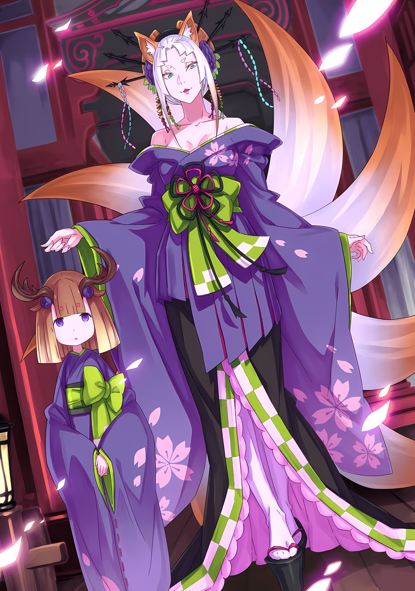
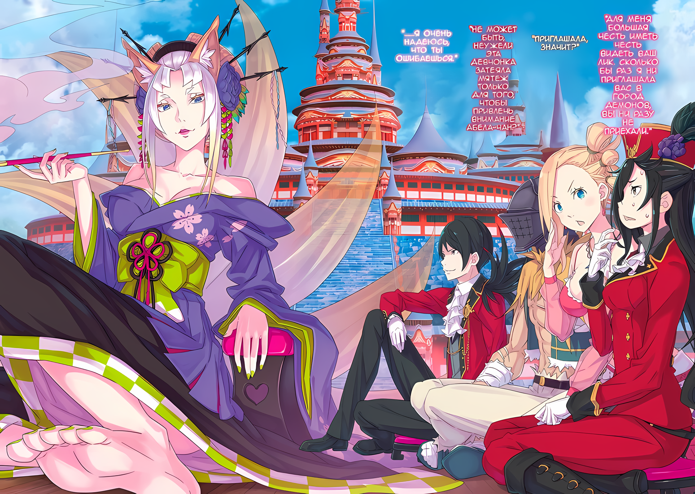

……В сердце Города Демонов Хаосфлейм возвышался Замок Красного Лазурита.

Город был похож на свадебный торт, лишенный единства, созданный путем наложения хаоса на беспорядок…… балки и строительные леса из различных материалов и стилей были нанизаны друг на друга, а замок, с его чередующимися мерцающими красными и синими оттенками, был единственным в своем роде среди Города Демонов. Города, который невозможно было понять без определенной художественной жилки.

Начнем с того, что слово «Лазурит» обозначало синий цвет, поэтому использование слова «красный» в сочетании с ним было бы противоречивым. Однако один взгляд на внешний вид Замка Красного Лазурита убеждает в правильности такого употребления.

Камень, который в изобилии использовался в фундаменте и каркасе замка, был, как и следовало из его названия, лазуритом.

Этот драгоценный камень излучал темно-синий блеск, а внутри него клубился красный цвет, словно капля крови, медленно падающая в воду. Поэтому иногда этот якобы голубой лазурит покрывался красным сиянием, как ихор.

Замок хаоса, одетый в постоянно меняющиеся цвета, отказывающийся оставаться одним оттенком.

Это был Замок Красного Лазурита Города Демонов, резиденция ее Леди, Йорны Миссигр.

Субару: …………

После того, как его вызвали на самый верхний этаж, где ему предстояло встретиться с Йорной, спина Субару покрылась холодным потом.

Причиной этого было то, что он увидел группу людей, ожидающих Йорну в том же хранилище, и в этой группе было лицо, которого там быть не должно.

В сопровождении трех мужчин, которые, судя по всему, были его эскортами, там сидела со всем самообладанием знакомая черноволосая дьявольская фигура…… То есть это был не кто иной, как лик того, кто должен был ждать его в трактире, Абела.

Но они никак не могли встретить его здесь. Именно по этой причине Субару и остальные отправились в Замок Красного Лазурита в качестве гонцов без него.

Другими словами, причина, по которой он оказался здесь, хотя это было невозможно……

Субару: ……Он фальшивка, замаскированная под Императора.

Пробормотав это про себя, лицо Субару стало совершенно белым.

Их заранее предупредили, что есть некто, кто выглядит как Абел и ведет себя как он. Точность и внезапность встречи поразили его, но именно поэтому он не сомневался в этом.

Он был одним из «Девяти Божественных Генералов», двойником тела Императора Винсента Волакии….

Медиум: Э, Абел-чин? Почему ты здесь…… Мгах.

Ал: Вау, все в порядке, Медиум-чан. Ал-чин здесь.

Позади застывшего в шоке Субару разыгралась опасная сцена.

Найдя в толпе знакомое лицо, Медиум дружелюбно подошла к нему. Ал быстро закрыл ей рот и оттащил назад. Хотя Медиум была выше его, она молча повиновалась, хотя и была удивлена вспышкой однорукого мужчины.

Близкий случай, но действия Медиум были сведены на нет.

???: ……?

Но эта перепалка, похоже, вызвала подозрения у другой стороны. Кроме человека с таким же лицом, как у Абела, на них смотрел человек с желто-зелеными волосами, который, вероятно, был его телохранителем.

При этом……

Субару: Отличная реакция, Ал.

Ал: Да, я бы тоже хотел похлопать себя по спине за свою благочестивую реакцию…… Но этот парень слишком удивляет, не так ли?

Субару: ……Да. Я согласен.

Когда Ал отступил от Медиум, Субару кивнул с серьезным лицом рядом с ним.

Сражение с непредвиденным противником…… и худшее столкновение, которое только можно себе представить. При таком повороте событий, к счастью, Абела в этот момент с ними не было.

Если бы он присутствовал, то это послужило бы толчком к началу битвы за определение истинного Императора Волакии.

Субару: Возможно, это тоже вариант……

Взглянув на трех охранников, сопровождавших человека с лицом Абела, Субару почувствовал искушение.

Обширность войск, скрывающихся внутри и снаружи города, была неясна, но, по крайней мере, здесь их было только трое…… Он был лжеимператором, охраняемым десятками тысяч Имперских солдат в столице Империи, но здесь и сейчас была бы прекрасная возможность разоблачить его.

Субару: ……Нет, еще слишком рано говорить об этом.

Если верить словам Абела, положение Императора не было колыбелью мира.

Абел даже на людях никогда не закрывал оба глаза одновременно, постоянно находясь в состоянии боевой готовности к тому, что люди попытаются убить его во сне. Учитывая, что положение Императора было таким, при котором подобное поведение было нормальным, даже если этот Император был имитацией, было немыслимо, чтобы он появился на публике без какой-либо защиты.

Другими словами, либо трое людей, которых он взял с собой в качестве охраны, были достаточно сильны, либо у него были другие меры.

Ал: Хочешь попробовать и посмотреть, сработает ли?

Субару: Если бы было легко продолжать, это могло бы быть вариантом. Однако я больше боюсь развития событий, которые мы не сможем перемотать вспять. Поэтому, пожалуйста, не делай ничего необдуманного.

Ал: Да, да.

Субару не знал, насколько серьезно он настроен, но Ал, похоже, не возражал против отклонения его предложения.

Мнения Ала отклонялись относительно часто, но это было только потому, что он имел тенденцию придумывать их быстрее, чем Субару, давая им время на спокойную оценку.

Это сокращало количество обходных путей в его поезде мысли и позволяло ему потратить больше времени на изучение подходящих вариантов.

По крайней мере, они должны найти способ пройти через это, не расстроив лжеимператора и его группу. Он также хотел выяснить цель визита другой стороны.

Почему он появился в Хаосфлейме именно в это время?

К тому же, хотя на самом деле все было иначе, казалось, что появился сам Император.

Медиум: Мм~! Мпфмм~!

В разгар своих мыслей Медиум, у которой был прикрыт рот рукой, что-то простонала.

Ее заставили отойти без объяснений, а рот держали закрытым, поэтому ее возмущение было понятно. Ал отпустил ее со словами «Прости, прости»,

Медиум: Пффхааа, это было жестко!

Ал: Прости, я не заметил. Я же не специально, просто из-за того, какие мягкие щеки у Медиум-чан.

Субару: Чем больше ты говоришь, тем больше становится обвинений в сексуальном *харассменте*.

Медиум: Я не очень понимаю, но дело в другом!

Оправдание Ала было встречено пустым взглядом Субару, а Медиум, со всей силы вдохнув, погрозила им пальцем обеими руками.

Субару и Ал оба отпрянули от ее силового воздействия, а затем

Медиум: Знаете, я все еще не совсем понимаю, но… этот Абел-чин отличается от того Абел-чина, которого мы знаем?

Ал: О да, ты не ошиблась. В конце концов, настоящий должен сидеть в гостинице в центре города и ждать нашего возвращения, верно? Вот почему мы в затруднительном положении….

Медиум: Разве это не плохо? Из-за плана Нацуми?

Субару: Я? Что я сделал…… Ах.

Медиум отметила, что, хотя она и не поняла деталей, она постигла суть проблемы. Субару, нахмурившись от того, что стала объектом ее внимания, сразу же понял, что ее беспокоит.

Смысл слов Медиум и то, что она намеревалась сделать, было очевидно.

И это было то, что Субару и Ал должны были понять еще до того, как она заговорила.

Конечно, времени на то, чтобы принять меры, не было. Но даже в этом случае они должны были быть достаточно подготовлены, чтобы обсудить, как действовать дальше….,

Девушка-олень: ……Прибыла Йорна Миссигр-сама.

Не оставив им ни единого шанса, девушка-олень, выполняющая роль проводника, объявила, что их время истекло.

Появившись вновь, девушка опустила свою большую рогатую голову и поклонилась Субару, лжеимператору и их группам. Затем, открыв дверь в передней части зала, она произнесла: «Входите».

В этот момент в зал медленно вошла фигура, и, увидев ее своими глазами, Субару сумел выразить словами впечатление, которое произвела на него девушка-олень.

В представлении Субару она была похожа на «Камуро».

Камуро были проститутками-ученицами, которые работали в японских кварталах красных фонарей в старые времена, изучая этикет и искусство, заботясь о других проститутках в этих гламурных кварталах удовольствий.

Неожиданно стильное кимоно и украшения для волос, скорее всего, и натолкнули Субару на такую мысль.

Но больше всего его занимал человек, который привел с собой девушку……

Субару: …………

Причина, по которой Субару удалось использовать слово «Камуро» в отношении девушки, заключалась именно в том человеке, который ее привел.

Забыв как дышать, он смотрел на нее широко раскрытыми глазами, как на инстинкт. Поскольку его разум был испорчен, в его сознании доминировало человеческое существо, столь прекрасное и ошеломляющее.

Йорна: ……Сегодня много гостей, не так ли?

Эти слова произнесла высокая женщина, сузив свои миндалевидные голубые глаза.

Ее высокое стройное тело было завернуто в яркое кимоно с цветочным узором, а волосы, которые постепенно переходили из белого в оранжевый цвет по мере того, как они достигали кончиков, были аккуратно и привлекательно уложены.

Ее волосы были украшены канзаши* из костей и рогов животных, а множество других украшений для волос из клыков и чешуи играли свою роль в услаждении взора тех, кто на нее смотрел.

*своеобразная заколка для волос.

Однако это были всего лишь украшения, формы красоты, созданные руками человека.

Для того чтобы они действительно демонстрировали свое очарование, важен был сам человек, выставляемый напоказ, и качество его внутренней природы.

И в этом отношении качество человека, носящего кимоно, было тем, в чем не стоило сомневаться.

Йорна: …………

Ее красота была потрясающей, когда она двигала своим стройным телом в гибкой и непринужденной манере.

Эти утонченные жесты и действия, которые, казалось, учитывали взгляд смотрящего, несмотря на несколько вялую атмосферу, были проблесками оптимального решения задачи привлечения внимания.

Еще большее впечатление от шаркающей походки производили лисьи хвосты, которые казались слишком большими для ее стройного тела…… девять штук, с богатым мехом.

Учитывая, что ее волосы были завязаны в пучок, канзаши, а между всеми украшениями в волосах торчали звериные уши, информация о том, что это красивая женщина-лиса, одетая в кимоно, просочилась в его мозг, как запах спиртного.

Йорна: Добро пожаловать в мой замок, вы проделали долгий путь.

Иллюстрация к **Ранобэ** Том 28 | Разукрасил NorvakKK

С этими словами она села на кресло в верхней части зала и вытянула свои длинные гибкие ноги, опираясь всем весом на подлокотник. Она протянула руку, и девушка-камуро, последовавшая за ней, держала в бледных пальцах изящную, изукрашенную золотом кисэру.

Красивая женщина зажгла конец кисэру в своей руке и завораживающе улыбнулась, позволяя поднимающемуся фиолетовому дыму заполнить ее легкие.

Она сидела на почетном месте и смотрела на своего гостя…… Императора Волакии, сидящего внизу.

Йорна: …………

Ее величественная и роскошная внешность, манера речи, манера носить кимоно, обнажая тонкие плечи, а также присутствие сопровождающую ее камуро напомнили Субару слова «Проститутка» и «Куртизанка».

Конечно, Субару никогда не видел борделя или проститутки вживую. Это были лишь знания, которые он почерпнул из старинных драм и других произведений, посвященных прошлым эпохам, но ничего другого на ум не приходило.

……Нет, сказать, что для ее описания не хватало слов, было бы преувеличением.

На данный момент, несомненно, существовало еще одно слово, чтобы описать ее. Это правда, что она была и красива, и правда, что она вела себя как проститутка; однако, превалируя над этим, она занимала «Седьмое» место среди «Девяти Божественных Генералов»….

???: ……Йорна Миссигр.

Появившаяся красивая женщина…… Йорна Миссигр — была названа по имени, а затем устремила свой взгляд на мужчину, который назвал ее.

На деревянном полу, их глаза сфокусировались на голубых глазах самой Йорны, стоял фальшивый Император…… для отличия от Абела его будут звать Винсентом, но это был он.

Субару: Естественно, тот же голос….

Было произнесено лишь небольшое количество слов, но голос был очень похож на голос Абела.

Очевидно, сходство было не только во внешности, но и в голосе. Однако, если его внешность копировалась, то и голос будет похожим, что вполне естественно. Отныне не было никакого шока.

Напротив, Субару ахнул при виде Винсента и Йорны, стоящих друг напротив друга.

Они спокойно смотрели друг на друга и обменивались взглядами; их внешность была великолепна, как картина.

Прекрасная и сияющая красавица и Император с волшебной внешностью, в которой чудесным образом сочетались достоинство и величие. Какое событие оставит встреча этих двоих в этот день в истории Империи?

Приведет ли этот роман к любви или к кровопролитию, будет зависеть от того, что будет дальше.

Субару: ……Какова цель их визита?

Почему группа Винсента прибыла в Город Демонов, в настоящее время не поддавалось прочтению.

Реакция на их встречу и появление Йорны были приоритетными, но что касается цели визита Винсента…… С какой целью он пришел к одному из «Девяти Божественных Генералов», которые продолжали бунтовать?

Если он играл роль истинного Императора, то должен был обладать определенной легитимностью. Однако зачем Йорне приветствовать Императора, если между ними была плохая кровь, в замке?

Если в конце концов он скажет, что из-за положения Йорны она не может ему отказать, то это будет все, что она написала.

Йорна: Боже мой, Ваше Превосходительство, сколько лет прошло.

Пока Субару тяжело переживал эти мысли, Йорна улыбнулась, опустив уголки глаз, и вставила кисэру в рот. Затем, выдохнув струйку фиолетового дыма, она грубо закрыла один глаз и сказала,

Йорна: Для меня большая честь иметь честь видеть ваш лик. Сколько бы раз я ни приглашала вас в Город Демонов, вы ни разу не приехали.

Винсент: Приглашала, значит?

Не обращая внимания на два случая неуважения, ее позу и дым, Винсент недовольно нахмурился.

Затем, скрестив свои тонкие руки и постукивая пальцами по локтям, он задумался,

Винсент: Поднимать против меня армию время от времени было твоим приглашением? Если так, то мой ответ был бы очевиден.

Йорна: Да, действительно. Это верно, но моя шея все еще соединена с грудью. Кроме того, похоже, что сегодня с вами нет этого хлопотливого мальчишки.

Винсент: …………

Йорна: Да, моя грудь пульсирует от волнения при мысли, что мои чувства могли дойти до вас. Пожалуйста, простите меня.

Йорна прочистила горло и издала смешок. Однако ее соблазнительный тон голоса и улыбка не заставили Винсента поколебаться в своем выражении.

Совершенство Винсента как лжеимператора было поразительным, но в то же время Субару беспокоило отношение Йорны…… страсть в ее глазах и словах по отношению к Винсенту.

Это был лишь короткий обмен мнениями, но в глазах Субару они оба..,

Ал: Не может быть, неужели эта девчонка затеяла мятеж только для того, чтобы привлечь внимание Абела-чан?

Субару: ……Я очень надеюсь, что ты ошибаешься.

Цветная иллюстрация к **Ранобэ** Том 31 | Перевод неофициальный и выполнен под контекст перевода rezero7arc

Ал, похоже, пришел к тому же выводу, что и Субару, и от этих слов Субару заскрипел зубами.

Он предпочитал, чтобы один из величайших воинов Империи не был кем-то, кто развернет свою армию из-за личной неприязни, и трудно было представить, что вокруг найдется кто-то, кто испытывает добрые чувства к Абелу, в то время как последний не считает его человеком.

Это была главная причина напряженного состояния щек Субару, но существовало и нечто более важное.

Именно под этим предлогом Субару и остальные попросили аудиенции у Йорны.

Это была попытка привлечь ее внимание лозунгом «Абел меня бесит», с расчетом на то, что он не дойдет до любого, кто благосклонен к Абелу.

Если бы неприятные фантазии Субару и других были правдой, то для Йорны это было бы не очень интересным делом. И все же, несмотря на это, она проводила группу Субару в замок.

Собственно, именно поэтому она заставила их сидеть рядом с группой Винсента.

???: Генерал Первого класса Йорна, разве такое поведение не является неуважительным? О чем ты думаешь?

Йорна: Хм?

Пока Субару и остальные были обеспокоены непонятной ситуацией, группа Императора продолжала свой разговор.

Вместо Винсента, который замолчал, фигура с желто-зелеными волосами, которая, похоже, была его телохранителем, заставила Йорну поднять брови.

Мужчина с короткими, вздернутыми вверх волосами, часть которых свисала вниз в виде длинных кос; на вид он был примерно одного возраста с Винсентом, возможно, чуть старше.

Одетый в плащ песочного цвета поверх легких доспехов черного цвета, его лицо и телосложение производили впечатление острого, как проволока, человека. Его пронзительные глаза смотрели на Йорну, словно обличая ее.

Йорна: Тот кто сопровождает Его Превосходительством, ты….

Кафма: Я Кафма Ирулюкс. Мне было приказано сопровождать Его Превосходительство. Я планировал быть только телохранителем, но…… твое поведение отвратительно.

Йорна: Мое поведение, значит? Что ты имеешь в виду?

Кафма: Все!

Слова Йорны прозвучали неторопливо, на что мужчина, назвавшийся Кафмой, пришел в ярость.

Он посмотрел на Йорну и указал рукой на Субару и остальных, молча наблюдавших за этой сценой

Кафма: Прежде всего, почему ты хочешь, чтобы здесь присутствовали другие! Это твой замок, но в то же время территория Империи…… Ты что, забыла об этом?

Йорна: Конечно, я не забыла. Я принадлежу Его Превосходительству.

Кафма: Я не об этом! Вы там, ребята, ребята!

Субару: Что!? Мы!?

Когда гнев Кафмы был направлен на них, плечи Субару вздрогнули от испуга. Он бы предпочел остаться один, вне их внимания, если бы это было возможно, но на это можно было надеяться.

Однако, когда кто-то спрашивает тебя о чем-то, есть способ воспользоваться этим.

Субару: Эм, мы не помешали? Если да, то мы вернемся в другой день….

Йорна: Это было бы проблемой. У меня ограниченное количество часов в сутках, и если вы пропустите сегодня, я не знаю, когда будет следующий раз.

Кафма: Не держи их здесь! Эти девушки, наверное, тоже чувствуют себя неловко!

Субару: Да, да, именно так.

По какой-то причине Йорна пыталась удержать группу Субару в присутствии, но Кафма почему-то согласился с Субару. Пока он был на стороне лжеимператора, они с Кафмой были врагами, но слова и действия последнего были настолько правильными, что он казался единственным союзником в этой ситуации.

Однако……

Винсент: Йорна Миссигр, о чем ты думаешь?

Внезапно напряжение нарушил Винсент Волакия…… сам лжеимператор.

После того, как он заговорил, Кафма, который был на взводе, тут же отступил. Несмотря на то, что голос и лицо были знакомы, Субару почувствовал, как его внутренности сжались.

Несмотря на то, что он осознавал, что он фальшивка, чувство страха было неподдельным.

Винсент: Ответь. О чем ты думаешь?

Заставив замолчать и слугу, и незваного гостя, Винсент снова обратился к Йорне.

В ответ на этот вопрос и приподнятое настроение Йорна слегка сузила глаза. Осторожно поднеся кисэру ко рту и впустив в легкие клубящийся фиолетовый дым, она сладко выдохнула, преувеличенно подчеркивая свой ответ.

Щеки Кафмы слегка порозовели от неуважения к тому, что она снова заставила Императора ждать,

Йорна: Конечно, я всегда думаю о Его Превосходительстве… Об Императоре Волакии.

Винсент: …………

Йорна: Хехе. Не смотрите на меня так холодно. Но я уверена, что Его Превосходительству будет приятнее, если вы сбиваете гостей с ног, верно?

С небольшим смешком и уверенным видом Йорна указала подбородком на Субару и остальных.

Тогда, впервые, сознание Винсента обратило свое внимание на группу Субару. Он должен был догадаться, что для предыдущей перепалки была какая-то причина, помимо капризов Йорны.

Чтобы остановить этот плохой поворот событий, Субару прочистил горло со словами «Кхм», готовясь к выговору,

Субару: Простите, но у меня есть новое предложение. Кажется, мы находимся не в том месте, и есть некоторые вещи, которые мы, скорее всего, не должны слышать. Мы бы хотели отступить и выйти в….

Йорна: Боже мой, это очень робкие слова.

Слова Субару были прерваны, так как он согнулся в талии и попытался вежливо покинуть сцену.

Заметив, что глаза Йорны лишь на мгновение скрылись под фиолетовой дымкой, и в них мелькнул отблеск ребячества, Субару понял, что совершил ошибку.

Если он собирался вернуться, то должен был принять решение, увидев лица людей впереди себя.

Он просчитался, и теперь сожалел об этом.

Потому что……

Йорна: Я слышала это от Танзы…… Вы пришли сюда, чтобы склонить меня стать врагом Его Превосходительства, Императора, не так ли?

И таким образом она раскрыла все их намерения.
