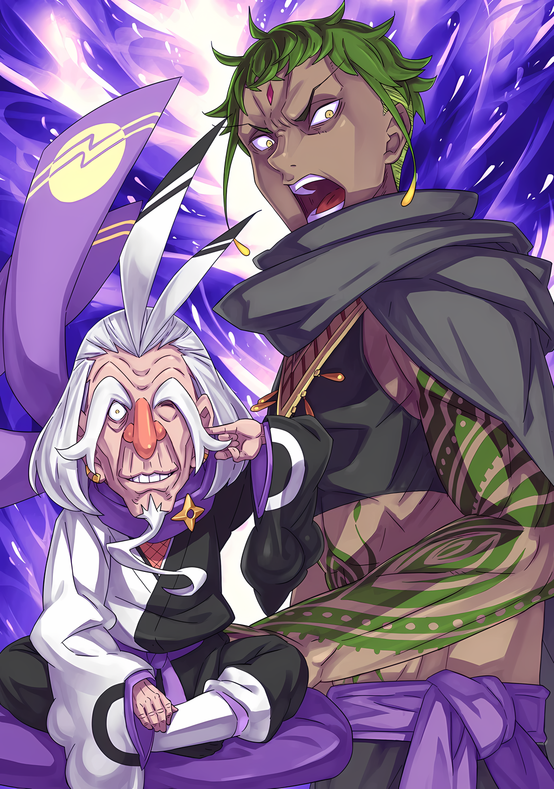
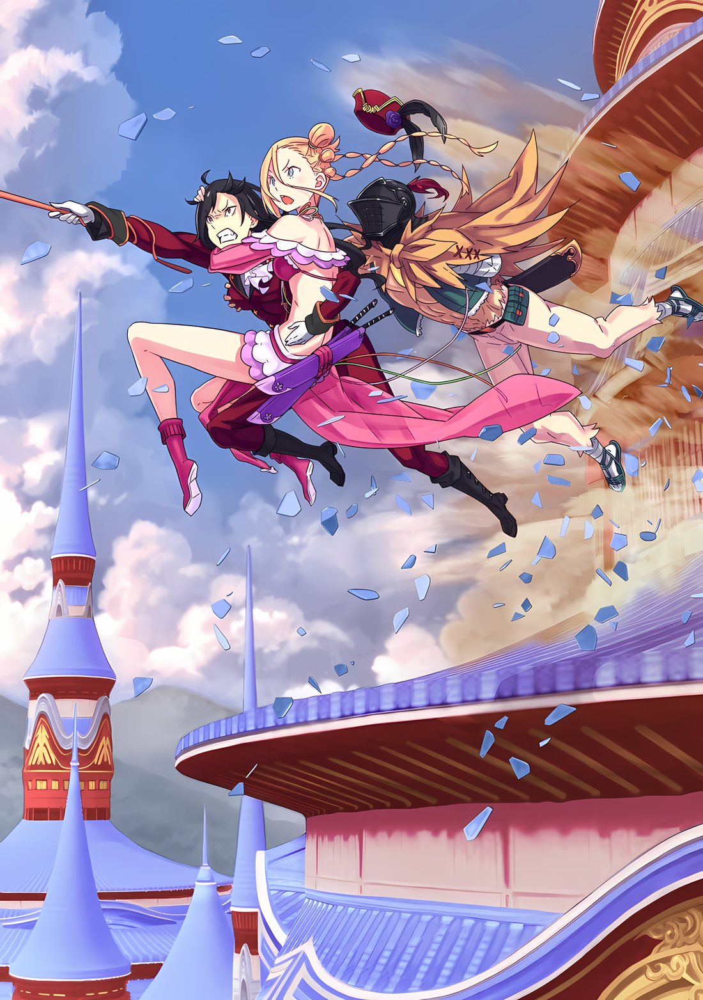

……«Абел меня бесит».

Субару считал этот лозунг хорошей стратегией для завоевания «Чрезвычайно Яркой», Йорны Миссигр.

В конце концов, Зикр, человек с выдающимся характером, заклеймил ее как обладательницу желания разрушения, ту, кто раз за разом поднимал мятеж.

Предлогом для просьбы Субару об аудиенции с ней было то, что «достаточно влиятельный человек желает поговорить с ней наедине, чтобы восстать против нынешнего Императора Волакии».

Группа Субару из трех человек посещала Замок Красного Лазурита с поручением от этого влиятельного человека.

По правде говоря, он не сказал ни слова лжи.

«Нынешний Bмператор Волакии» был не кто иной, как тот, кто сместил Абела, узурпировав его имя и должность. «Достаточно влиятельный человек», который хотел поговорить с глазу на глаз, оказался настоящим Императором, который должен был сидеть на троне, поэтому в его словах не было ни капли лжи.

Цель Субару заключалась в том, чтобы письмо от Абела было получено, несмотря ни на что. Если бы это было необходимо для достижения этой цели, они бы сказали как можно больше лжи.

«Субару: Вот в чем заключается план Нацуми Шварц…!»

В конце концов, Ал и Медиум поаплодировали ему за его изобретательность.

Однако……

Кафма: ……Повстанцы против Его Превосходительства, говорите?

После того, как все сказанное Йорной было обнажено, атмосфера в зале стала еще более гадкой.

Кафма Ирулюкс, телохранитель Винсента, который уже некоторое время был самым вспыльчивым человеком в зале, излучал враждебность, схожую на противный холодный воздух.

По суровости его взгляда Субару понял, что мирный уход из этого места уже невозможен.

……«Интриган утопает в собственных уловках», — эта фраза, которая никогда раньше не была для него столь правдивой.

Субару: Но разве время и отсутствие общей информации не являются виной Абела……?

Кафма: Держи язык за зубами. ……Генерал Первого класса Йорна.

Кафма заставил замолчать Субару, который проклинал Абела за то, что тот втянул его в эту абсурдную ситуацию. С этими словами он перевел свой жесткий взгляд на Йорну,

Кафма: Ты сознательно позволила Его Превосходительству и этим людям присутствовать одновременно?

Йорна: …………

Кафма: Я хочу, чтобы ты ответила!

Когда Кафма повысил голос, его гнев не был направлен ни на все больше волновавшегося Субару, ни на его группу, а скорее на Йорну за то, что она создала эту напряженную ситуацию.

Причина этого заключалась не в том, что вина лежала на Йорне.

Проще говоря, это был знак того, что они не рассматривали Субару и остальных как угрозу.

На самом деле, боевой дух, излучаемый Кафмой, который сейчас энергично стоял на ногах, вызвал у Субару ощущение, что он такой же сильный и грозный, как Аракия, с которой он столкнулся в мэрии Гуарала.

По крайней мере, не было сомнений, что он достаточно силен, чтобы его назначили сопровождать Императора.

С его точки зрения, вероятно, было неизбежно, что Субару, и помимо него Ал и Медиум будут оценены как недостойные осторожности.

Ал: Это касается только нас, но нас исключают? Это хорошо или плохо……?

Чувствуя то же самое по поводу тусклой жалобы Ала, напряженный обмен мнениями продолжился, причем Субару и остальные в него не включились. Кафма обратился к Йорне, которая приложила рот к своему кисэру и выпустила струйку фиолетового дыма.

Затем она наклонила голову со словами «Интересно……», покачивая своим ярким украшением для волос.

Йорна: Что ты имеешь в виду под «сознательно»?

Кафма: Как бесстыдно……! Как я уже неоднократно говорил Его Превосходительству, ты все еще опасна.

Йорна: Ты говоришь очевидное. Со всеми этими беспорядками, которые я совершила…… возможно,ты не знаешь, что я сделала?

Кафма: ……Кх.

Слова Йорны, которые нельзя было расценить иначе как провокацию, заставили вены на лбу Кафмы вздуться.

Хотя и странно, но из того, что он смог понять из их разговора, Субару понял, что согласен с Кафмой. Личность Йорны, честно говоря, была худшей, даже с точки зрения Субару.

Хотя, основываясь на ее репутации, они были готовы к определенной степени порочности, она превзошла их ожидания.

Однако, похоже, что она не собиралась просто отдать Субару и его группу, которые были явно мятежными элементами, Винсенту и его людям, случайно оказавшимся в гостях.

Воздух был слишком напряженным для сцены, в которой предатели представали перед Императором.

Больше всего на свете……

Винсент: ……Как обычно, твой вкус отвратителен.

И тут, не обращая внимания на намерения Йорны, голос Винсента ослаб.

На холодные слова Винсента, Йорна слегка приподняла свои изящные брови,

Йорна: О, это не соответствует вашему вкусу, Ваше Превосходительство?

Винсент: Нелепо. Если это будет слишком односторонним, то это все равно, что позволить кролику охотиться на собаку. Я не настолько устал от Империи, чтобы превращать простую жестокость в развлечение.

Заявление Винсента прозвучало равнодушно, но с определенным авторитетом.

Взяв себя в руки, сквозь прорехи связанных волос, лисьи уши Йорны затрепетали. Субару не мог понять, какие эмоции она выражает.

Впрочем, то же самое можно сказать и о чувствах Винсента.

Субару: …………

Какая буря разразится в его сердце, когда он столкнется с мятежниками лицом к лицу?

Понять внутренние мысли фальшивого Императора было еще сложнее, чем представить себе мысли настоящего, особенно когда он знал, что перед ним самозванец.

Фальшивый Император должен плохо думать об Абеле, ведь он прогнал другого, но….

Субару: Нельзя быть настолько глупым, чтобы позволить этому проявиться….

Винсент: ……Ты.

Субару: ……Кх!

Субару ахнул, когда черные глаза Винсента пронзили его насквозь. В одно мгновение Субару было запрещено даже отводить глаза, и, будучи еще не подготовленным, он встретился взглядом со своим величайшим врагом.

Его лицо было копией настоящего, хотя как оно было сделано, было непонятно.

И у настоящего, и у подделки были одинаковые острые черные глаза, которые пытались подсмотреть за каждым его действием.

От этого у Субару внутри все сжалось……

Винсент: Если тебе есть что сказать, говори сейчас.

Субару: ……Какие назойливые глаза.

Кафма: Что…!

Субару: Ах! Нет, нет, нет! Я не хотела так сказать! Это было непреднамеренно!

В самый неподходящий момент вопрос лжеимператора совпал с утечкой раздражения.

Кафма потерял дар речи, его лицо выражало абсолютное удивление, когда Субару обрушил словесные оскорбления прямо на Императора. Субару поспешно махнул рукой, на что Винсент закрыл один глаз и замолчал.

Он был удивлен, но в то же время смотрел на Субару, словно оценивая его.

Взгляд, которым настоящий Абел смотрел на Субару в Джунглях Будхейма, в деревне Племени Судрак и в мэрии Гуарала, был таким же, как и этот.

Субару: В общем, мы……

Сзади него Ал и Медиум тоже наблюдали за ситуацией, затаив дыхание.

Шокирующая тирада Субару, должно быть, оказала на них сильное давление. Атмосфера в зале была холодной и напряженной, и один дополнительный ляп мог разбить ее вдребезги.

Ситуация, в которую они попали, была слишком болезненной.

Не только Йорна, но и Кафма были не теми противниками, с которыми Субару и его группа могли соперничать.

В таком случае, не лучше ли было бы отказаться от своего мнения перед Йорной, подчеркнуть, что быть мятежниками — это возмутительно, склонить голову и уйти? Даже если это сделает сцену безвкусной?

Подумав об этом, Субару попытался ослабить уголки рта, пытаясь изобразить приветливую улыбку.

……Субару понял, что взгляд Йорны устремлен на него, и не сделал ни единого движения.

Йорна: …………

Молча, Йорна наблюдала за движениями Субару, затягиваясь своим кисэру.

Это был очень двусмысленный взгляд, ни незаинтересованный, ни безразличный. Неопределенный, как поднимающийся фиолетовый дым, он был похож на фантома, который исчезал, даже когда человек пытался его ухватить.

Он подумал, что было бы большой глупостью пытаться полагаться на него.

Однако Субару догадывался, что это был поворотный момент.

Этот взгляд, на грани потери интереса к группе Субару, был не настолько капризен, чтобы рассматривать возможность вернуть то, от чего когда-то отказались. Мнения, отброшенные здесь, уже никогда не могли быть подхвачены снова.

Другими словами, сотрудничество Йорны Миссигр больше не могло быть получено.

Это было синонимом преграждения пути к ненадежной победе в темноте.

Поэтому……

Винсент: ……Ответь мне досконально. Что ты собиралась мне сказать.

Субару: Ну….

На вопрос Винсента, Субару не сразу поднял взгляд.

Кафма, стоявший рядом с лжеимператором, сузил глаза и перевел взгляд на Субару. Позади него напряглись Ал и Медиум, а Йорна набрала в легкие полный рот фиолетового дыма.

Заметив эти изменения краем глаза, Субару посмотрел на Винсента и объявил,

Субару: Все так, как сказала Йорна-сама. Мы объявляем вам войну.

Да, как будто цепляясь за позицию, от которой не следует отступать, за кусок, от которого не следует отказываться.

Рем, ожидавшая его возвращения в Гуарале, Абел, который отсутствовал, и Ал и Медиум, которые держались позади него, доверили Субару это решение.

Чтобы Нацуки Субару не понял всей важности и значимости этого, и не бросил все на самотек……

Винсент: …………

Темные глаза Винсента слегка дрогнули, услышав враждебное заявление.

Проницательный Субару не смог расшифровать, какой эмоции это соответствует: радости, гневу, печали или удовольствию. Вместо этого он почувствовал, как у него быстро пересохло на языке от восторга, вызванного его собственными словами.

Естественно. В отличие от Абела, который был лишен реальной власти Императора Империи Волакия, обладавшей огромной территорией, лжеимператор перед ним был тем, кто определенно держал ее как рычаг давления.

Если бы Винсент не поднял руку, чтобы остановить Кафму, услышав о допущенном ранее ляпе, тот взорвался бы от ярости, и жизнь Субару оборвалась.

Но этого не произошло. Винсент не допустил бы этого.

Йорна: Куху….

Глядя на противостояние Субару и Винсента со своего высокого места, Йорна издала слабый звук, вырвавшийся из ее горла.

Из уголка ее рта вырвался смешок, а плечи задрожали от удовольствия. Казалось, что угрожающее жизни заявление Субару возымело действие, по крайней мере, развеяло ее скуку.

Винсент: Над чем ты смеешься, Йорна Миссигр?

Йорна: Прежде всего, эти гости не отказались от своих слов. Кроме того, они втроем могут поставить под угрозу жизнь Его Превосходительства…… Что скажешь?

Винсент: Не дразни меня, женщина. Даже ты, которая верит в то, что ослушается меня, понимаешь мои намерения.

Выражение лица Винсента не изменилось, когда он встретил провокационный взгляд Йорны.

Затем он снова перевел взгляд своих темных глаз на Субару, который заявил о своей враждебности.

Винсент: Это земля Волка-Меча. Только если у тебя хватит смелости прицелиться в мою голову, ты можешь называться гражданином Империи.

Субару: ……Это очень мило с твоей стороны, не так ли?

Винсент: Хмф.

Фыркнув, Винсент со смехом отверг сарказм Субару.

Поведение Винсента, включая то, как он отвечал, было идеальной имитацией настоящего. Если бы Абел был здесь, он бы отреагировал точно так же.

То, что Абел был вместе с Субару и остальными, заставило последних заподозрить, что он и есть лжеимператор.

Хотя в таком случае Субару и остальные люди оказались бы в полном тупике, поэтому он желал, чтобы этого не произошло.

Винсент: Но стоимость моей головы не настолько мала, чтобы я мог так просто отдать ее тебе.

Субару: ……Тогда, что ты собираешься с нами делать?

Винсент: Ну, это проблема.

Это заявление признало, что Субару и остальные проявили открытое неповиновение Императору, одержав верх над Кафмой, который был на грани вспышки ярости. Однако следующие слова показали, что в холодном взгляде Винсента, направленном на своих противников, не было никаких изменений.

Даже если он ценил их дух, у него не было причин давать поблажки тем, кто стремился причинить ему вред.

Черные глаза Субару и Винсента встретились, и атмосфера в комнате превратилась в адское пламя.

Йорна: О, я тоже грешная женщина. Когда я вижу, как мужчины вот так борются за меня, это меня очень возбуждает.

Кафма: Как будто это чья-то проблема…… Во-первых, женщин там больше, чем мужчин. Сказать «мужчин» — неточно.

Йорна: Куху.

Йорна высказала свои впечатления, которые действительно бросались в глаза, о конкурсе взглядов между Субару и Винсентом.

В ответ, лицо Кафмы становилось все более сердитым.

Кафма: Ваше Превосходительство! Прикажите мне! Эти люди….

???: ……Кафма, ты все это устроил…… Ты уже давно наводишь шороху.

Довольный безвыходной ситуацией, Кафма попытался обратиться напрямую к Винсенту. Однако его прервал не Винсент, не Йорна, а кто-то другой.

Субару: Ах….

Субару непроизвольно выдохнул, повернувшись в сторону голоса.

Голос был настолько далеко за пределами сознания Субару, что сам факт его произнесения испугал его.

Это был один из трех человек, которых Винсент привел с собой в качестве сопровождающих…… маленькая фигурка, сидящая со скрещенными ногами на деревянном полу, не кто иной, как Ольбарт.

???: Знаешь, большинство вещей решаются лучше, когда думать приходится Его Превосходительству, а не нам. Если мы будем продолжать тявкать, то будем очень мешать.

Эти слова произнес морщинистый старик, его волосы были выкрашены в белый цвет, а брови были длинными.

Это был старик, который тщательно создавал атмосферу раздражения как в тоне, так и в содержании своей речи. Его внешность была настолько поразительной, что трудно было понять, почему его не видели раньше.

……Нет, он был на виду. Просто его не было видно.

Возможно, именно это и означает быть вне поля зрения.

Когда старик указал на это, Кафма повернулся к нему и сказал: «Но»,

Кафма: Долг верного подданного — устранить неприятности Его Превосходительства, мастер Ольбарт!

Иллюстрация к **Ранобэ** Том 28 | Разукрасил NorvakKK

Ольбарт: Когда ты называешь себя верным подданным, разве это не звучит как прелюдия к тому, что кого-то очистят за самоуправство? Мне не нравится идея отрубить голову перспективному юноше.

Кафма: Гух…… Хк.

Лениво покачивая головой, старик…… тот, которого звали Ольбарт, —

ковырялся в ухе. Щеки Кафмы напряглись, заставляя задуматься, какое давление он почувствовал от этого жеста.

Однако Кафма был не единственным, кто вынудил свои щеки напрячься. Услышав это имя, щеки Субару тоже напряглись.

Субару: Мастер… Ольбарт…

Ольбарт: О? Ты меня знаешь? Я, в конце концов, довольно известен.

Субару: ……Если вы знаете, что вы знаменитость, то да, я уверена в этом.

Его губы дрогнули, когда он произнес имя, на которое отреагировал Ольбарт.

Если он так отреагировал, увидев потрясенный взгляд Субару, то в этом не было никаких сомнений. В Ратуше Гуарала, а затем во время их путешествия в Город Демонов, он слышал имя Ольбарта.

С этого момента «Девять Божественных Генералов» должны были стать неизбежной частью стратегии Субару по завоеванию Империи. Одним из них был Йорна, а другим….,

Субару: «Порочный старик», Ольбарт Дарккенн……!

Ольбарт: Мне не очень нравится это имя, знаешь ли. «Порочный Старик» звучит ужасно. Разве я похож на такого злобного старика? Ну, если бы кто-то спросил меня прямо, я бы сказал, что похож. Я бы не смог, какакка!

Старик улыбнулся, широко открыв рот и показав свои прекрасные белые зубы, которые выглядели великолепно для его возраста.

Однако Субару было не до смеха. ……Они столкнулись с Винсентом, лжеимператором, который работал над своей целью привлечь Йорну на свою сторону, и в конце концов он привел с собой Ольбарта.

Это означало, что на данный момент Ольбарт тоже был членом другой фракции.

Субару: Аракия и Чиша, а также Ольбарт….

Субару чувствовал, что его мучают сомнения: члены «Девяти Божественных Генералов», к которым они стремились, похоже, уже были захвачены врагом. Более того, они просто нацелились на тех, кого называли высокопоставленными.

Проблема заключалась в том, что не только будущее, но и ситуация перед ними становилась все хуже и хуже.

Даже если бы это был один Кафма, его было бы слишком много, а теперь к ним присоединился Ольбарт из «Девяти Божественных Генералов».

Не они могли устроить все эти ужасные условия, даже если бы они планировали……

Ал: ……Эй, старик, ты меня помнишь?

Ольбарт: Кто это?

Пот стекал по лбу Субару, стекал по его щекам и капал с кончика подбородка.

Среди всего этого напряжения неожиданный голос заставил Ольбарта поднять брови. Это был Ал, который окликнул Субару сзади.

Ал наклонился вперед, и глаза Субару расширились от удивления.

Субару: Ал? Что ты…… делаешь вдруг, когда каждый наш шаг сейчас подвергается сомнению?

Ал: Нацуми-чан в этой ситуации все еще говорит как женщина, но я не просто влез без раздумий. Нет, я не думал об этом, но…… Эй, старик! Это я, эй-эй-эй!

Субару: Звучит так, будто ты телефонный мошенник*……

*Обращение Ала очень напоминает японский телефонный скам пожилых людей.

Было бы опрометчиво думать, что только потому, что он старик, он сможет провернуть такую аферу. На самом деле, в ответ на звонок Ала, Ольбарт наклонился вперед и фыркнул: «Хм?».

Ольбарт: Ну и эксцентричный же у тебя взгляд, парень. Хоть я и старый человек, я бы не смог забыть кого-то, кто так выглядит. Мы действительно знаем друг друга?

Ал: Возможно, я не так хорошо тебя знаю, и когда я видел тебя в последний раз, на мне не было шлема. Но у меня не было руки, и мы немного поболтали.

Ольбарт: Ты тот безрукий, который говорил со мной в……?

Ал: О, точно. Аракия-чан тоже была со мной.

Чуть понизив голос, Ал упомянул имя Аракии, грозной девушки, которая доставила столько неприятностей Субару и остальным и, как и Ольбарт, была членом «Девяти Божественных Генералов».

Субару не мог понять смысла слов Ала, но как только Ольбарт услышал их, его брови вскинулись вверх, и он воскликнул «О!».

Ольбарт: Ты тот парень! Ты тот парень, который вернул остров вместе с Аракией! Теперь, когда ты об этом заговорил, ты похож на него. Какакакка, не могу поверить, что ты еще жив!

Ал: О, я жив, я жив. Каким-то образом, мои звезды встали в полный круг.

Ольбарт: Так, по какой-то случайности, ты стал врагом Его Превосходительства. Может, мне стоило поговорить с тобой раньше, чтобы улучшить репутацию Его Превосходительства. Моя вина-моя вина.

Ал и Ольбарт обменялись словами, первый говорил непринужденным тоном, второй широко улыбался.

Субару, не зная об отношениях между ними, мог только тупо смотреть. Что касается того, улучшаются ли отношения или нет, даже это было трудно определить.

Винсент: ……Ольбарт, ты знаешь этого человека?

Единственным человеком, который вмешался, чтобы положить конец таким сомнениям, был Винсент.

Ольбарт, скрестив руки, ответил «О, да!» на вопрос лжеимператора,

Ольбарт: Два или три года назад, когда вы только взошли на трон, повсюду были восстания, не так ли?

Кафма: Господин Ольбарт, Его Превосходительство взошел на трон восемь лет назад….

Ольбарт: А? Я думал, это было около трех лет назад. Вот так да, прошло около десяти лет, что для меня кажется недавним, наверное, я просто облажался.

Винсент: Не обращай внимания, просто продолжай. Восемь лет назад, что случилось?

Когда Ольбарт пошел по касательной, Винсент вернул его на путь истинный. В соответствии с этой поправкой, Ольбарт указал на Ала и сказал: «Итак».

Ольбарт: Тогда на Гинунхайве было восстание…… и те, кто его остановил, были этот парень в шлеме и Аракия.

Винсент: Хох.

Впервые услышав рассказ Ольбарта, Винсент заинтересовался Алом.

Трудно было определить, в какую сторону качнулся маятник, в хорошую или плохую, но, похоже, его усилия не сразу привели к тому, что он был наказан за свою грубость.

Вдобавок ко всему, Ал шагнул вперед, чтобы оказаться рядом с Субару,

АЛ: С уважением, Ваше Превосходительство, как известно старику Ольбарту… Вообще-то, восемь лет назад я служил Его Превосходительству, и до сих пор не получил вознаграждения.

Ольбарт: Хотя ты сказал, что вам ничего не нужно.

Винсент: Ольбарт, держи рот на замке. ……Можешь продолжать, клоун.

Ал: Я надеялся получить свою награду сегодня.

Субару представил себе звук, который, казалось, беззвучно заморозил воздух в зале.

Бесстрашие Ала, потребовавшего награду за свои собственные достижения восьмилетней давности, в сочетании с присутствием того, кто знал о его деяниях, несомненно, было авантюрой, на которую стоило пойти.

Фальшивый Император, который не решил казнить их сразу после того, как услышал объявление войны Субару…… Винсент обладал и причинами, и решимостью действовать в качестве Императора Волакии.

И, если слова Абела были правдой, то его убеждения включали в себя «Определенное наказание или награду».

Поэтому……

Винсент: Что ты требуешь? Мою голову?

Ал: Это будет огромной победой для меня, если я смогу заставить тебя отдать ее мне, но потребуется много мужества, чтобы попросить об этом. Так что….

Сказав это, Ал повернул голову и посмотрел на Субару. Поняв, о чем его просят, Субару достал из кармана конверт.

Все это время их целью было доставить послание Абела.

Субару: Наша цель — передать это послание Йорне-сама. Если вы хотите вознаградить моего спутника за его службу, пожалуйста, позвольте это сделать.

Винсент: Послание?

Субару: Любовное письмо от нашего… господина, госпоже Йорне.

Не решаясь назвать его «господином», Субару внутренне высунул язык и продолжил говорить.

Услышав выражение «любовное письмо», Йорна, сидевшая во главе комнаты, рассмеялась и прочистила горло, произнеся «Куху». Казалось, ее интерес разгорелся. И реакция Винсента тоже не была нежелательной.

Прищурив свои темные глаза, Винсент задумался на несколько секунд,

Винсент: Прошло более восьми лет, но инцидент на острове Гладиаторов не дает покоя.

Субару: О….

Винсент: Ты можешь получить свою награду, если пожелаешь. Вы можете передать послание Йорне Миссигр.

Жестом подбородка Винсент указал на Йорну.

Субару потребовалось мгновение, чтобы понять смысл слов Винсента. Но когда он понял, что это означает, что Ал выиграл свое пари, Субару и остальные посмотрели друг на друга.

Это была авантюра с высокими ставками, и решение Ала было правильным……

Винсент: ……Как бы то ни было.

Субару: А?

Как раз в тот момент, когда они собирались взорваться ликованием, Винсент поднял один палец и заговорил.

Когда Субару и остальные повернулись, чтобы посмотреть на него, лжеимператор закрыл свои черные глаза, которые казались самой тьмой, и сказал,

Винсент: Единственное, что я позволю вам сделать, это передать ей ваше послание. Ты знаешь, что это значит, не так ли?

И таким образом, произнесенные слова были обработаны.

Глаза Субару расширились при этом, и он быстро обернулся, скрежеща зубами, когда его взгляд упал на Йорну, с ухмылкой оглядывающую ситуацию.

Однако целью Субару было передать ей послание и добиться от нее ответа.

Субару: Если я передам вам послание, когда мне следует ожидать ответа от Йорны-сама?

Йорна: Да, вот как….

На этот вопрос Субару, Йорна бросила взгляд в пустоту.

Затем, перевернув кисэру вверх дном, опустила пепел в кувшин, приготовленный присутствующим камуро.

Йорна: Я женщина, в конце концов… Я не хочу, чтобы меня увидели открывающей любовное письмо, как только я его получу. Поэтому…… я внимательно прочту и отвечу гостям после того, как они покинут замок.

Субару: ……Значит, вы прочтете его, когда мы покинем замок, не так ли?

Йорна: Как Леди Города Демонов, я не буду говорить неправду в присутствии своих слуг.

Субару не мог сказать, был ли свет в ее голубых глазах искренним или наивным, так как он не был знаком с ней. Однако выбора у него больше не было.

Например, если бы он изменил награду Ала, сказав, что наградой будет безопасный выход из замка, Винсент, возможно, разрешил бы и это.

Однако, как и в предыдущем случае, этот план исключал возможность объединения сил с Йорной.

Смысл этого……

Субару: Ал, Медиум-сан.

Еще не приняв окончательного решения, Субару назвал имена двух своих спутников.

То, что должно было произойти и что нужно было сделать, требовало сотрудничества с ними обоими. Поэтому, прежде чем предпринимать какие-либо действия, имело смысл получить их одобрение.

Субару повернулся и встретился с ними взглядом, Ал и Медиум кивнули друг другу.

Ал: Ну, я же сказал тебе, брат, что я помогу тебе.

Медиум: Братуха попросил меня позаботиться о тебе тоже! Он сказал, чтобы я позаботилась о Нацуми-чан за него!

Ал наклонил голову, а Медиум воскликнула с силой.

Ободренный ответами этих двоих, Субару кивнул им в ответ.

Затем Субару медленно пошел к передней части зала…… к Йорне, опирающейся на подлокотник почетного кресла и попыхивающей своим кисэру.

Когда ее завораживающая красота оказалась рядом, Субару вручил ей послание в окружении сладкого аромата.

Субару: Вот, пожалуйста, послание от нашего господина.

Йорна: Спасибо за ваши труды. Но дальше будет намного труднее.

Субару: Да, я знаю.

Супружеские пальцы взяли послание, и слова, произнесенные с улыбкой, прокляли будущее Субару и его друзей.

Но Субару ответил на ее слова с достоинством и повернулся.

И тогда……

Субару: ……Ваше Превосходительство Император, боюсь, нам придется занять ваш трон.

И вот, прямо перед ним, он выговорил объявление войны еще более четко, чем ранее.

△▼△▼△▼△

События, произошедшие в тот момент, были драматичными.

Кафма: Как ты смеешь, ты, наглая…!!!

Сразу же после объявления войны глаза Кафмы широко раскрылись.

После провозглашения Субару, что было верхом грубости и неуважения, Кафма Ирулюкс захотел доказать свою преданность Императору собственной силой.

……В результате, одежда Кафмы разорвалась, когда он вытянул руки, и бесчисленные шипы устремились к Субару.

Шипы темно-зеленого цвета, словно ползучие змеи, устремились к Субару, их подавляющая масса закрыла ему обзор. Плющ из шипов, каждый из которых имел иглы толщиной с руку Субару, был смертоносным оружием, которое выжимало из своей жертвы все до последней капли жизни.

Это был удар, который не допускал никакой реакции Субару, и подобно змее, проглатывающей крысу, он поглотил тело Субару в колючках без всяких усилий.

Ал: ……Хорошо сказано, брат.

Шипы пронзили все его тело, и он приготовился к предстоящей жестокой боли.

Однако не боль поразила Субару, напрягшего свое тело, а скорее шок от того, что его потянуло назад и он упал на ягодицы. Перед Субару стоял Ал, чьи слова донеслись до него сбоку, отбивая шипы своим мечом Синего Дракона.

Ал, с Субару за спиной, вытащил толстый клинок и парировал атаки противника. Не в силах блокировать их полностью, его плечо и бок окрасились кровью.

Тем не менее, Ал смог защитить Субару от этой подавляющей массы.

Субару: А как же Медиум-сан!

Медиум: Уууааа! Это было так близко! Если бы я не сделала то, что сказал Ал-чин, я бы умерла!

Субару поспешно обернулся, и тут же рядом с ним оказалась Медиум, которая громким голосом отвечала, вытащив свои двойные мечи.

Оглянувшись, она взмахнула своими двойными клинками вверх и вниз, отсекая, или ловя, или наступая, предотвращая некоторые из шипов, приближающихся к ней со всех сторон.

Субару вздохнул с облегчением, убедившись в своих навыках и в том, что она в безопасности. Однако облегчение было слишком преждевременным. В конце концов, это была всего лишь первая волна……,

Йорна: Какой экстравагантный фокус.

Субару: ……Кх.

Сзади от группы Субару, стоявшей на страже, находилась Йорна, которая тоже должна была попасть в зону действия шипов. Она втянула камуро в руки и выдохнула фиолетовый дым, оставаясь в той же позе, в которой приняла послание.

Со всех сторон к ней приближались шипы, но они избегали ее, словно специально, шипы неестественно изгибались, как будто вокруг Йорны был только круг пространства.

Невозможно было предположить, был ли это Кафма, который намеренно искривил его, или Йорна, которая сделала что-то с этим, но……,

Субару: Я прошу прощения за беспокойство. Мы оставим вас наедине.

Йорна: Счастливого возвращения домой. Если вы втроем не сможете покинуть замок….

Субару: Вы не будете читать послание. Я понимаю.

Когда Йорна еще раз объяснила свои намерения простым языком, их можно было понять без сомнения, какими бы трудными они ни были. Винсент тоже дал понять, что игра продолжается……,

Субару: Игра идет, пока мы не покинем замок. ……Ал, Медиум-сан!

Ал: Да!

Медиум: Хорошо!

Субару: Направо!!!

Сразу же после сильных ответов Субару громко рявкнул.

Услышав это, двое его спутников в тот же миг поняли решение Субару, и три клинка взметнулись в воздух.

Однорукий меч Синего Дракона и пара гибких мечей яростно рассекли колючки, сдувая массу, преграждавшую им путь, и три фигуры вылетели из зелени.

Вот так они прижались к деревянному полу, набирая скорость и темп.

Кафма: Ты думаешь, я позволю тебе сбежать?

Однако, после одного шага вперед, игла толщиной с большой палец зацепила кончик носа Субару.

Когда она промелькнула перед его глазами, она показалась ему больше похожей на кусок белой кости, чем на шип. Это был не удар, призванный отпугнуть Субару, а удар, который должен был пронзить его висок.

Он бы умер, если бы Ал не подставил свой клинок на пути выпущенной иглы.

Субару: Шипы и иглы, да еще и шоу уродов!?

Ал: Это Клан Насекомых! Они нападают с помощью насекомых, которых носят в своих телах!

Субару: Это ли не клан Абурамэ*!

*отсылка к клану насекомых из Наруто.

Споря о пустяках, Субару сохранял спокойствие и двигался вперед, поддерживаемый Алом и Медиум. Они направлялись не к выходу из зала.

Даже если бы они направились в ту сторону, им пришлось бы проделать долгий путь обратно по башне замка. Они никак не могли оставаться под ударами Кафмы так долго.

Другими словами, Субару и остальным пришлось бы значительно сократить путь.

Поэтому……

Субару: Медиум-сан!

Медиум: Да!

Субару: Сделай все возможное!

Медиум: ……Я сделаю все возможное!

В тот момент, когда она получила эту поддержку, все тело Медиум без преувеличения подпрыгнуло, и ее импульс увеличился.

Разметав длинные волосы, она взмахнула мечами-близнецами в руках, яростно отбрасывая шипы, которые устремлялись вперед по сложным и причудливым траекториям.

Конечно, отчасти это было заслугой собственных навыков Медиум. Но в дополнение к этому,

Ал: Справа! Правое колено! Затылок! Секси бедра!

Медиум: Ух! Ха! Получи!

Пронзительные крики Ала подсказали Медиум цель приближающейся опасности, и Медиум мгновенно среагировала, успешно защитившись от шипов и справившись с ними за мгновение до того, как они ударили.

Субару удивился, как далеко он видит, но высокий уровень живучести Ала, который он продемонстрировал и против Аракии, очевидно, распространялся не только на него самого, но и на других.

Воспользовавшись этим, Медиум добралась до окна в зале. Одним взмахом она разрушила деревянные перила, а ее длинные прыгающие ноги снесли стену.

Под их взглядами открылся зал башни замка, который находился на высоте более тридцати метров над землей. Синее небо Города Демонов расстилалось перед ними, и дикий ветер приветствовал Субару и остальных.

Это не было вопросом «все или ничего», но……

Субару: ……Если мы выберемся из замка!

Йорна положила руку на письмо.

Поскольку они приняли эти условия, группа Винсента прекращала дальнейшие действия. Возможно, они не давали такого обещания прямо.

Но если больше не во что верить, это был единственный способ довести дело до конца……

Медиум: ……Нацуми-чан!

Медиум, пробившая стену, позвала его, и Субару побежал так быстро, как только мог.

Он был благодарен за то, что не надел юбку по неосторожности. Если бы причиной смерти стало переодевание, Субару не смог бы противостоять усилиям своих многочисленных предшественников.

В последний момент Субару, даже забыв о поддержании внешнего вида, изо всех сил ударил ногой по полу.

Затем он догнал Медиум и вместе с ней вышел через стену……,

Ольбарт: Извини, но у меня тоже есть работа, знаешь ли.

Субару: Ках…… Хк.

В тот же момент, перехватив Субару и Медиум, старик появился перед ними словно из ниоткуда, и его пронзительная рука ударила обоих прямо в грудь.

От удара дыхание перехватило в горле. Сознание Субару треснуло, казалось, все разлетелось вдребезги после удара одного из «Девяти Божественных Генералов».

Однако……,

Медиум: Нацуми-чан! Ничего страшного!

Субару: А!?

Громкий голос окликнул его, и Субару пришел в сознание, которое он почти потерял. В панике он посмотрел на свою грудь, но никаких повреждений от колющей руки Ольбарта не было видно.

Не было ни крови, ни признаков того, что его сердце было удалено без кровотечения.

Медиум: Пойдем, Нацуми-чан! Не прикуси язык, ладно?

Медиум схватила Субару за воротник, пока тот растерянно озирался по сторонам. Широким шагом она перемахнула через стену, которую проломила, и без колебаний выбросилась из Замка Красного Лазурита.

Субару и Медиум прыгнули в голубое небо, переплетаясь друг с другом; ощущение подъема по воздуху, вызванное прыжком, мгновенно исчезло, а через секунду их бросило в падение.

Субару: Ух, кяааа……!

С громким криком Субару притянул Медиум к себе, а затем нащупал его талию. После этого он вытащил знакомое ощущение из своей руки и поднял свое оружие…… хлыст, находясь в воздухе.

Если бы он просто прыгнул без всякой подготовки, это было бы равносильно самоубийству.

Несмотря на то, что подготовительных мероприятий, направленных на успех, было немного, провокация Йорны, объявление войны Винсенту, нападение и защита Кафмы и Ольбарта — все это были азартные игры.

Он едва успел подобрать все, что было, так что ему оставалось только верить, что он сможет подобрать и самое последнее.

Субару: Неее промахниииись!!!

Обнимая тонкую талию Медиум, Субару взмахнул рукой и выпустил хлыст. Кончик кнута устремился не в пустоту, а к одной из балок, протянувшихся по всем частям Города Демонов…… тянущихся, как паутина, по всему городу, достигая, похоже, одной из внешних стен Замка Красного Лазурита.

Зацепившись кнутом за это место, он использовал его как ступеньку, чтобы выбраться с территории замка. Это был лучший ход, который Субару смог придумать среди хаоса в зале.

Субару: ……Кх!

Почувствовав рывок за руку, Субару изо всех сил обхватил кнут вокруг запястья. Он думал, что это поддержит его тело, даже если хватка окажется недостаточно сильной; в худшем случае, повреждение раздробит кости запястья.

И тогда……,

Субару: Ал…… вс… Гяхк!

Ал: Виноват!

В тот момент, когда кнут натянулся, Ал обрушился на спину Субару. Очевидно, ему удалось выпрыгнуть из замка, как и Субару с Медиум.

В результате столкновения в воздухе они втроем вцепились друг в друга и повисли вниз головой, передав почти сто пятьдесят килограммов веса на одну руку Субару.

Субару: Гуыы-ааааа……!

Иллюстрация к **Ранобэ** Том 28 | Разукрасил NorvakKK

Тела Субару и остальных по дуге обогнули одну из балок снаружи Замка Красного Лазурита, используя ее как шарнир, а крики его руки и запястья, локтя и плеча, всей его правой руки, сменились настоящими криками.

Как бы то ни было, лучше всего было подождать, пока отдача утихнет, и попросить всех по очереди взобраться на плетень и вернуться на балку. Субару стиснул коренные зубы, сравнивая время, которое потребуется, чтобы добраться туда, со временем, которое потребуется его правой руке, чтобы омертветь……,

Ал и Медиум: ……Ах.

И как раз в тот момент, когда он собирался приложить все свои силы, голоса Ала и Медиум перекрыли друг друга.

Прежде чем он успел понять, в чем дело, бремя на правой руке Субару исчезло. ……Нет, точнее, не исчезла, а сломалась балка, к которой была прикреплена плеть.

Из проломов в стенах хранилища торчали шипы.

Субару: УА, АААА~АА……!

С воплями группа Субару из трех человек полетела по воздуху в спутанной куче. Их тела летели по параболе, отталкиваясь от хлыста на балке.

Хотя это было лучше, чем прыгать с башни замка, Субару и Ал, будучи обычными людьми, не смогли бы пережить падения с высоты более двадцати метров.

Пока он искал выход из ситуации, крича во все горло, в голове Субару одно за другим всплывали лица Эмилии, Беатрис и Рем……,

Все: …………

……Со свирепым треском они втроем провалились сквозь крышу в конюшню замка, запутавшись друг в друге на стогах сена.
