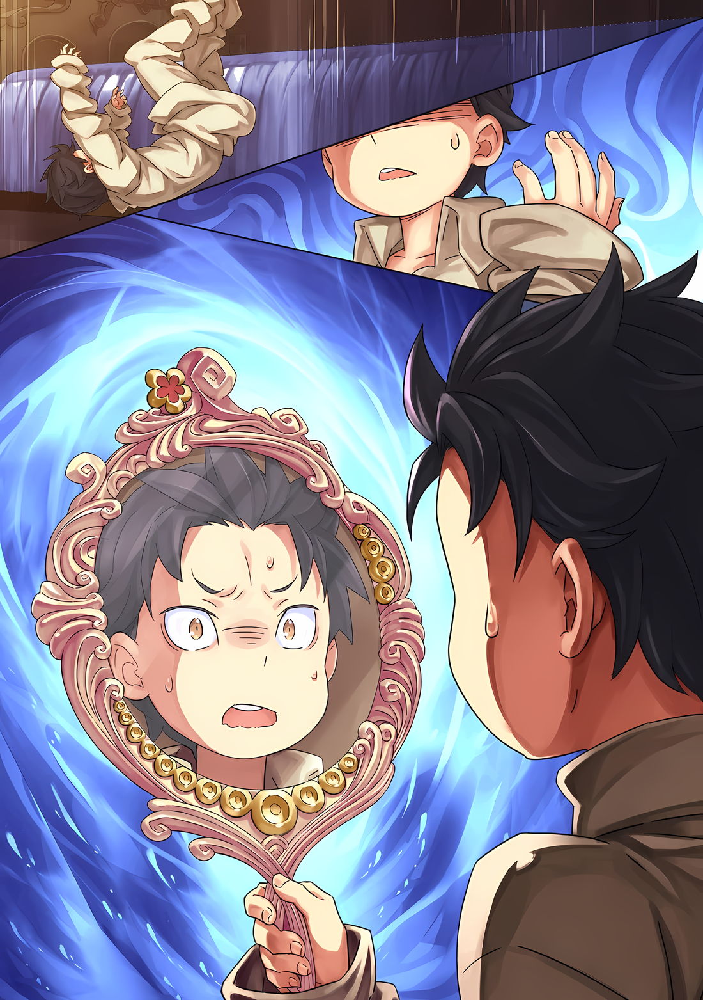
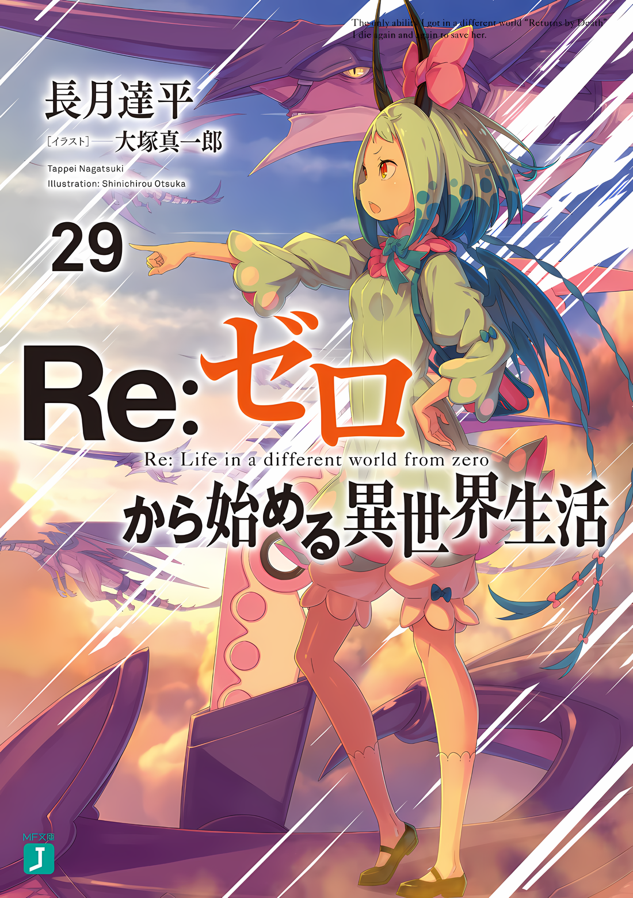

Выглянув наружу через большое отверстие в стене салуна, Кафма скривил губы в отвращении.

Под ним, под бушующим ветром, вился дым. Он устремил свой взгляд на здание, в котором они втроем скрылись, успешно выбравшись из зала. ……Он нигде не мог разглядеть беглецов.

Кафма: …………

Балка, в которой образовалась трещина, рассыпалась с громким звуком, но поскольку она была слишком далеко, надеяться, что ее обломки раздавят эту наглую группу, было бы глупо.

Но……

Кафма: Я не позволю вам сбежать. Я сделаю все, что потребуется, чтобы отомстить за ваше неуважение к Его Превосходительству….

Ольбарт: Нет-нет, мы не можем этого сделать. Они поставили все свои карты на эту возможность сбежать, не так ли? Если мы погонимся за ними сейчас, разве это не будет бессмысленно?

Кафма: Мастер Ольбарт!

Остановив преследование беглецов, Кафма обернулся, оскалив зубы. Получив этот взгляд, маленький старик произнес «О, страшно» и прикрыл голову руками.

Увидев его реакцию, глаза Кафмы стали еще острее и злее,

Кафма: Почему ты вообще отпустил этих девушек? Если это вы, Мастер, вы должны были схватить их в мгновение ока!

Ольбарт: О? Я могу сказать тебе то же самое. И я тоже не слишком уклонялся. Этот молодой парень в шлеме, у него есть несколько странных трюков в рукаве.

Кафма: …Молодой парень, у меня сложилось впечатление, что он действительно не так уж молод.

Ольбарт: Это не так уж важно. По мне, так большинство из вас выглядят как малолетки. Я был стариком с тех пор, как вы родились.

Искривив свое морщинистое лицо в улыбку, Ольбарт указал на себя. Кафма уже собирался снова обратить внимание на его легкомысленное отношение, но Ольбарт продолжил «И»,

Ольбарт: Возможно, ты забыл, но я должен присматривать вон за той лисичкой, не так ли? Никогда не знаешь, когда она может ополчиться на Его Превосходительство.

Кафма: Генерал Первого класса Йорна… Действительно, я был опрометчив.

Ольбарт: Какакка, вижу ты понимаешь.

Как только это было сказано, Кафма попятился, словно стыдясь того, что потерял самообладание. Во время обмена мнениями между молодым человеком и стариком Йорна, обозначенная как опасная личность, прикрыла глаза рукой и заговорила,

Йорна: Это очень грубо с твоей стороны. Как ты смеешь говорить о такой нежной женщине, как я, как об опасном животном…… Я никогда в жизни не была так унижена.

Кафма: Кем ты себя возомнила……!

Она насмехалась над ними настолько, что будто у неё пошли слезы от смеха, из-за чего гнев Кафмы был направлен на Йорну. Но Йорна прочистила горло, купаясь в его взгляде, затем осторожно опустила руку, чтобы коснуться своих глаз.

Поднеся кисэру ко рту, она наполнила легкие фиолетовым дымом и глубоко выдохнула, выпустив большой шлейф этого же дыма. ……Дым слегка колыхался, направляясь к большому отверстию в стене.

Как только трепещущий фиолетовый дым достиг стены, в ней родилось удивительное изменение.

В природе, очень похожей на галлюцинацию, разрушенная стена была заделана с помощью взгляда.

Дерево, использованное в местах, где были повреждены обрушившиеся стены Замка Красного Лазурита, извивалось и затягивалось подобно тому, как затягиваются раны существа. Это было ремонтируемое здание, но странное и неземное; оно производило впечатление скорее живого существа, чем чего-то неорганического.

Эта нереальная сцена заставила Кафму, стоявшего у стены с напряженными щеками, отступить и снова посмотреть на Йорну.

Йорна: Теперь все стало на свои места…… Так что, если можешь, пожалуйста, исправь свое настроение.

Кафма: Это, Генерал Йорна……

Винсент: Вот почему нельзя лезть в Город Демонов без должной осторожности…… Но это не единственная опасность, исходящая от этой женщины.

После того, как она закончила ремонт внешней стены, Кафма задыхаясь подошел к Йорне, которая изобразила упругую улыбку.

Его дрожь дополнил Винсент, который даже не дернулся во время предыдущей суматохи. Человек на вершине Империи посмотрел на стену, затем сосредоточился на Йорне,

Винсент: Они покинули замок. Условия, поставленные тобой и мной, были выполнены.

Йорна: Если это так, то с нашей стороны было бы несколько неприлично отказываться от их усилий. Надеюсь, вы это понимаете, Ваше Превосходительство.

Винсент: …………

Йорна: Конечно, у вас есть свои собственные идеи, Ваше Превосходительство. Я уважаю это. Но не забывайте.

Владыка Города Демонов, Йорна Миссигр, которая с самого начала и до конца не пыталась исправить свою позицию по отношению к Императору, улыбнулась, глядя на молчаливого Винсента.

Йорна: Это Город Демонов, мой город. ……Даже меч этого синего юнца не сможет меня достать.

Хотя это заявление было уместно для Владыки Города Демонов, было неуместно объявлять его Императору.

Для Императора Волакии, который управлял всей Империей, заявление Йорны о том, что ее власть над одним городом превосходит все остальные, было более чем неуважительным.

Однако слова Йорны Миссигр нельзя было отрицать.

Потому что все знали, что они правдивы, независимо от того, права она была или нет, произнося их.

В этом Городе Демонов Хаосфлейм Йорна Миссигр обладала абсолютной властью.

Поэтому……,

Винсент: Я дам тебе одну ночь.

Считать это поражением Императора Волакии означало бы пренебречь дальновидностью и глубоким мышлением этого самого Императора. Однако даже приближенным к Императору было нелегко разглядеть интриги, которые он хранил в глубине своих темных глаз.

Им оставалось только верить, что слова Винсента не были ни необоснованными, ни ошибочными.

Йорна: Спасибо. Тогда я не буду торопиться и изучу ответ на письмо.

Так ответила Йорна на разрешение Винсента, и хотя внешне ее слова были искренними, ее отношение и лицо не выражали никакой мягкости.

У обоих охранников Винсента, Кафмы и Ольбарта, были свои мнения относительно поведения Йорны. Но причина, по которой они допускали ее поведение Йорны, заключалась в их собственной вине за то, что они позволили тем троим сбежать.

С учетом признания Винсента, отступать было некуда.

Кафма: Но твое поведение непростительно. Я буду повторять это и дальше.

Йорна: Куху. Если ты будешь смотреть на меня такими страшными глазами, я не перестану дрожать. Мастер Ольбарт, не могли бы вы что-нибудь сделать для меня?

Ольбарт: Ты собираешься свалить это на меня? Я старый человек, у меня впереди короткая жизнь, долг молодых — быть добрыми к старшему поколению. Подожди, может быть, я нашел лучшую идею, чтобы добиться доброжелательности от большинства людей? Наступает ли моя эра?

Кафма: Мастер Ольбарт!

Кафма повысил голос в гневе на озорное замечание Ольбарта.

Йорна с улыбкой наблюдала за ним, стряхивая дым со своего кисэру. Прищурившись при виде этих «Генералов», Винсент слегка фыркнул.

Затем, повернувшись, Император посмотрел на последнего сопровождающего его человека…… того, кто, в отличие от Кафмы и Ольбарта, не сдвинулся с места больше Винсента.

Винсент: Ты очень мало говоришь. Это на тебя не похоже.

???: ….Это так, не так ли? Что ж, есть те, кто сбивает с толку, когда мы встречаемся лицом к лицу.

Ответил голос молодого человека с кривой улыбкой.

Молодой человек был одет в синюю мантию, которая не позволяла видеть его лицо. Само по себе это было для него обычным делом, но тот факт, что он затянул горловину халата еще туже, чем обычно, очевидно, имел отношение к присутствующим ранее гостям.

Мужчина вздохнул и пожал плечами, находясь в поле зрения молчаливого Императора,

???: Я думал, мне придется остаться в этом Городе Демонов. ……Звезды, похоже, тоже этого хотят.

Винсент: Это то, чего хотят звезды? Чепуха.

???: Я бы предпочел, чтобы ты не называл это чепухой.

Пожав плечами, мужчина усмехнулся на пренебрежительные слова Винсента.

С этой горькой улыбкой он продолжил.

???: Если бы Ваше Превосходительство был серьезен и прислушивался к желаниям звезд, ты бы не проделал весь этот путь сюда, не так ли?

Винсент: Глупец, ты полагаешь, что знаешь, что лежит в моем сердце?

???: Пожалуйста, не говори глупостей.

Плечи мужчины сжались, когда Винсент сложил руки и понизил голос на одну ноту.

Винсент отвел взгляд от человека, от…… «Звездочета», и сузил глаза на небо, в котором исчезли трое повстанцев, за стеной, которая уже закрылась.

А затем……,

Винсент: ……Желания звезд — бессмыслица.

Этот рокот, который никто не был способен услышать, остался шепотом для самого себя, а затем исчез.

△▼△▼△▼△

Субару: Кха! Уакха! Тчхи!

Кашляя в густом облаке пыли, он отчаянно работал легкими.

Спина болела от удара, Субару провел рукой по пострадавшему месту, чтобы проверить, нет ли повреждений. Он с ужасом отдернул руку и увидел, что на ней нет крови; похоже, это был всего лишь синяк. Это было чудо.

Вероятность того, что строительные материалы из разрушенного здания или куски рухнувших балок могли проткнуть его или разорвать жизненно важные органы, была высока. Насколько же ему повезло?

Субару: У нас нет времени на это… Медиум-сан! Ал!

???: Я-я тут…… Ой-ей-ей.

Покачав головой, он быстро назвал имена двух людей, с которыми он должен был быть. Услышав ответ из-под обломков на своей стороне, Субару поспешил отодвинуть обломки, чтобы найти их.

Погребенная Медиум кашлянула, затем моргнула глазами.

Медиум: Ува, я думала, что умру! Ты в порядке, Нацуми-чан?

Субару: Я как-то справился, благодаря защите Медиум-сан и Ала… Медиум-сан, тебе больно? Где-нибудь болит?

Медиум: Ухьяхьяхья, как щекотно~! Все хорошо, все хорошо! Я в порядке!

Осмотрев плечи и спину Медиум, она извивалась и прижималась к груди Субару.

Это был не блеф и не ложь; оказалось, что у нее нет никаких заметных травм. Похоже, им обоим выпала огромная удача.

Субару: Ал….

Ища взглядом Ала, который не отвечал, Субару просканировал окрестности.

Когда облака пыли окончательно рассеялись, Субару заметил, что он и остальные спрыгнули в пустую конюшню. Здание рядом с Замком Красного Лазурита, очевидно, было складом, где хранилось сено для лошадей Галевинда.

Причиной, по которой группа Субару была спасена от беспомощного падения с большой высоты, было сено, которое послужило подушкой. Если бы не сено, Субару, как минимум, умер бы ужасной смертью: его раздавило бы, как помидор.

В Волакии, где магия исцеления была редкостью, а Рем и вовсе отсутствовала, существовала большая вероятность того, что людей с серьезными травмами не удастся спасти. В этом смысле обстановка в Империи была гораздо более благоприятной для смерти, чем в Лугунике.

Конечно, можно сказать, что именно понятие Империи о выживании сильнейших и стало причиной такой опасности.

Медиум: Вот он! Ал-чин!

И тут, когда Субару оглядел тускло освещенную комнату, Медиум рядом с ним пошевелилась, словно собираясь спрыгнуть.

Она наклонилась рядом с телегой, перевернувшейся от удара при падении. Под тяжелой грудой сена, на которую упали трое, запутавшись друг в друге, что-то зашевелилось.

Субару поспешно бросился туда, и они вдвоем, он и Медиум, разгребали сено. В конце концов, из-под сена показалась вялая толстая рука, и они потянули ее вверх.

А потом……,

Ал: Йох! Моя правая рука сейчас тоже оторвется!

Субару: Это не смешно!

Медиум: Но Ал-чин тоже жив! Это удивительно!

Субару отругал Ала за его несмешную шутку, но слова Медиум принесли ему облегчение.

Ала вытащили из стога сена, его тело было в ужасном состоянии. В отличие от Субару и Медиум, которые чудом спаслись, отделавшись лишь несколькими синяками и царапинами, тело Ала было покрыто многочисленными рваными ранами и синяками.

Он отбился от шипов Кафмы и, хотя бы на время, от Ольбарта. Когда он прыгнул на Субару и Медиум в самом конце, он находился в таком положении, в котором его легко мог преследовать враг.

……Все раны, которые он получил, были ранами, которые изначально должны были получить Субару и Медиум.

Субару: …………

Ал: В чем дело, брат… У тебя унылое выражение лица.

Субару: Ну, это….

Ал: Это просто чудо, что мы все выжили после прыжка без каната. Но от такого взгляда мне не станет легче из-за шрамов на спине. Это позор для мечника, понимаешь?

Повернув плечи в вялой манере, Ал разинул рот, как бы подбадривая Субару.

От такого отношения Субару поперхнулся, но затем быстро кивнул: «Думаю, да».

Ал старался вести себя отстраненно, как будто это чужая проблема, но его усилия в нападении и защите до сих пор были вызваны искренностью его чувств к Субару.

Он сочувствовал целям Субару и обещал помочь ему.

Таким образом, человеком, который даже был готов бороться за жизнь Субару, был Ал.

Субару: Я ошибался на твой счет……

Ал: А?

Субару: Я думал, что ты всегда был замкнутым и безответственным, ненадежным и несерьезным во всем.

Ал: Эй-эй.

Субару: Но ты рисковал своей жизнью ради меня…… Я этого не забуду.

Положив руку на свою фальшивую грудь, он сказал о своем искреннем решении Алу.

Без него Нацуки Субару не был бы жив в этот момент. Поэтому отныне Нацуки Субару будет сражаться, не забывая об услуге, оказанной ему Алом.

Даже если его жизнь оборвется в следующий момент……,

Медиум: Нацуми-чан, Ал-чин, если вы двое будете слишком долго дурачиться….

Субару: Да, я знаю, знаю. Давайте уберемся отсюда как можно скорее. Иначе жертва Ала будет напрасной.

Ал: Это не жертва!?

По настоянию Медиум, Субару вытер лицо рукавом и решительно ответил.

Это была удача, что все трое выжили, но успокаиваться было еще рано. Условия, предложенные Йорной и Винсентом, были, по крайней мере, выполнены, но отступят ли Кафма и Ольбарт — неизвестно.

Пока он не знал этого наверняка, они должны были выжить.

Субару: Нам нужно уходить. Спрятаться и получить ответы там, в….

???: ……Не стоит беспокоиться об этом.

Субару: ……Кх!?

Он уже собирался уходить, опираясь на плечо Ала, когда его окликнул голос.

Удивленный этим, он резко убрал руки, и Ал, опиравшийся на его плечо, опрокинулся и закричал: «Гуох!». Но ему было недосуг беспокоиться о нем.

Началось противостояние между группой Субару и этой новой фигурой у входа в конюшню.

Субару: Ты….

???: Прошу прощения за задержку с приветствием. Я слуга леди Йорны Миссигр, зовут Танза.

Человек, произнесший эти слова с почтительным поклоном головы, был человеком в характерном кимоно и с оленьими рогами…… девушкой оленем, которая была рядом с Йорной.

Девушка, назвавшаяся Танзой, медленно подняла голову, и, повернувшись лицом к Медиум, которая стоял перед ней, словно защищая Субару и Ала, покачала головой.

Танза: Не волнуйтесь, все в порядке. Я не желаю вам зла.

Медиум: Правда? Но ведь мы разрушили стены и этого места, и замка твоего хозяина, не так ли?

Танза: Замок и конюшни починит Йорна-сама. ……Йорна-сама приняла вас как посланников. Никто больше не будет вам мешать.

Тревогу Медиум развеяли слова, которые Танза добавила в конце. Эта фраза заставила брови Медиум опуститься в облегчении, но впечатление Субару было совершенно противоположным.

Помимо того, что Йорна отправилась чинить стены и конюшни, вопрос был скорее в том, что произойдет потом?

Субару: Сказать, что нам никто не будет мешать, — это сильно. Мы знаем, что Его Превосходительство Император был там, понимаешь?

Субару стоял за спиной Медиум, под ее защитой, не заботясь о том, чтобы хорошо выглядеть. Серые глаза Танзы уставились на Субару, когда он шагнул вперед.

Несмотря на ее красивое лицо, она была девушкой, чьи эмоции не проявлялись. Приветливость должна была быть важной частью камуро, но ее поведение напоминало ему куклу.

Субару: По крайней мере, мы те, кто причинили вред Его Превосходительству Императору…… и ты все это пропустишь? Это то, что сказала Йорна-сама?

Танза: Да. Никто не может противостоять Йорне-сама здесь, в Городе Демонов. Думаю, Винсент-сама тоже знает об этом.

Субару: О….

Ответ Танзы был фактическим, но с абсолютной уверенностью. Услышав это, Субару опешил и проглотил слова, которые собирался продолжить.

После этого Субару и остальные посмотрели на потолок конюшни, через которую они только что прорвались, и убедились, что в Замке Красного Лазурита нет никакого движения. Судя по его короткому впечатлению, Кафма должен был сразу же последовать за ними.

Субару: Даже этого не происходит…… Видимо, тебе можно верить.

Танза: Винсент-сама тоже вернется. На ваше письмо ответят завтра.

Субару: ……Хорошо.

Танза: Тогда счастливого пути.

Танза поклонилась в ответ на вздох Субару и повернулась спиной к ним троим.

Она точно выполнила минимальный объем работы и теперь, похоже, возвращалась в компанию Йорны. Внезапно, когда она отошла, Субару окликнул ее, чтобы остановить: «Танза-сан».

Танза остановилась и обернулась, глядя на неподвижное, кукольное выражение ее лица,

Субару: Что за человек для тебя Йорна-сама?

Предлогом для этого вопроса послужило то, что у Субару было слишком много внутренних впечатлений о Йорне.

До тех пор, пока она не узнает, что Винсент — подделка, ее отношение к нему должно быть таким же, как к Абелу, Императору.

Он не считал справедливым не замечать ее неуважительного и грубого поведения только из-за притворства, что она могущественная женщина, но ему было непонятно, почему она ведет себя таким образом.

Что испытывала Йорна к Абелу — привязанность или враждебность?

В сочетании с тем, что она подстрекала Субару и остальных к борьбе, глубины ее сердца были почти неразличимы.

Поэтому……,

Субару: Я хотел бы услышать это от того, кто находится рядом с ней. Их впечатления о леди Йорне Миссигр.

Танза: Она любящая женщина. Любит своих союзников и ненавидит своих врагов. ……Любительница всего, что обитает в Городе Демонов.

Субару: …………

Танза ответила без колебаний, и впервые в ее глазах промелькнул намек на эмоции.

Он исчез в мгновение ока, но Субару показалось, что он полон слабой страсти, и он не смог больше ничего сказать.

Не имея возможности продолжить разговор, он мог только смотреть вслед уходящей девушке.

Если бы его спросили, получил ли он желаемые ответы, он должен был бы сказать, что нет.

Напротив, загадочное впечатление, которое сложилось у него о Йорне, только усугубилось. Он не мог уловить фальши в словах Танзы. Но трудно было поверить, что эта женщина была любящим человеком.

С тех пор, как они прибыли в Город Демонов, Субару и остальные стали игрушкой по ее милости.

Ал: Боже правый, она ушла…… Что же нам делать?

Субару: ……Мы ничего не можем сделать, кроме как вернуться назад. Пока что мы должны довериться слову Танзы-сан и ждать ответа завтра.

В конюшне, из которой исчезла Танза, Субару снова подставил плечо упавшему на задницу Алу.

Поддерживая его вес, Субару снова посмотрел на Замок Красного Лазурита.

Субару: Эффектный, привлекающий внимание замок…… Так вот что означали слова «Чрезвычайно Яркая»?

Пробормотав про себя, Субару понял, что слова Танзы были правдой.

Этот странный замок, граничащий между синим и красным, был лишен дыры, которую создали он и остальные. Сколько бы он ни напрягал глаза, ее нигде не было, даже тени не осталось.

△▼△▼△▼△

Абел: Понятно, значит, он пришел, ха.

Субару: Ты хочешь что-то сказать? Может быть, что-то вроде «прошу прощения», «извините» или «пожалуйста, простите меня»?

Вернувшись в трактир, Абел получил отчет об инциденте, связанном с доставкой письма. Сильно нахмурившись на его первые замечания, лицо Субару наполнилось ненавистью, так как он требовал ответа.

Несмотря на это, Абел, надев маску Они, с досадой надавил ладонью на лоб Субару,

Абел: Почему я должен извиняться? Вы, ребята, хорошо справились. Я как раз собирался похвалить вас за хорошо выполненную работу.

Субару: Похвалить!? Похвалить, говоришь!? Не надо так снисходительно ко мне относиться и так выражаться! Не надо меня хвалить, я просто делаю то, что должно быть сделано. Эй, вы двое!

Ал: Не впутывай меня.

Субару высунул язык в сторону недовольного Абела, яростно протестуя и призывая подкрепление. Ал, однако, спустил ноги на пол и махнул рукой, говоря: «Дай мне передохнуть».

По чистому содержанию, именно Ал продемонстрировал самую тяжелую работу. Оставив первую помощь своему телу с ранениями на Таритту, его тело стало напоминать мумию из-за всех бинтов.

В сочетании с черным шлемом и бинтами по всему телу, сюрреалистичность его внешнего вида была невероятной.

Таритта: Я рада, что Нацуми и Медиум в порядке. Я действительно должна была пойти с вами, я так волновалась.

Субару: Эй, слышал? Это правильный ответ. Как Император, почему бы тебе не последовать примеру Таритты-сан, которая становится вождем?

Таритта: Пожалуйста, прекрати, я умру….

Получив оценку Субару как хороший пример для подражания и объясняя, как должен вести себя человек, занимающий более высокое положение, Таритта покачала головой, ее лицо побледнело.

Несмотря на то, что ее отношение было испуганным, Субару не мог не почувствовать разочарования. Неужели никто не мог наказать Абела?

В такие моменты ему было стыдно, что у него не было выбора, кроме как воспользоваться чьей-то уязвимостью.

Луис: Уу! Ауу!

Медиум: Ах! Луис-чан, ты не можешь так поступить! Видишь ли, Нацуми-чан и остальные сейчас заняты важным разговором!

Луис: Уу! Уу!

И тут мысли Субару были нарушены высоким криком, донесшимся из соседней комнаты.

Взглянув на дверь в соседнюю комнату, он увидел, что Луис и Медиум ссорятся друг с другом. Конечно, Луис никак не могла противостоять Медиум, поэтому схватка напоминала борьбу сумо между взрослым и ребенком.

Вскоре после этого Луис увлеклась, и ее фигура снова исчезла в другой комнате.

Луис: Аауу!

Субару: ……Черт возьми, что произошло? С тех пор, как я вернулся, она пытается наброситься на меня.

Ал: Почему-то кажется, что она больше всего привязана к тебе, брат. Она даже не смотрит на меня. Не то чтобы я хотел, чтобы она была привязана ко мне.

Услышав вздохи Субару, Ал издал ворчание в своей последней форме, которая выглядела как дешевый костюм для Хэллоуина. Рядом с ним Таритта удовлетворенно вытерла лоб, ее эстетическое чувство было не так уж плохо.

Субару нашел кого-то, кто мог бы соперничать с Эмилией и Беатрис, заставляя его скучать по ним снова и снова. ……Нет, он скучал не только по ним двоим, но и по всем по ту сторону границы.

Скоро исполнится двадцать дней с тех пор, как Субару отправили в Волакию.

Пока Беатрис и Рам были рядом, они должны были знать о безопасности Субару и Рем, но это было все; то, что они не могли передать никакой информации сверх этого, еще больше расстраивало его.

Он хотел как можно скорее найти способ встретиться с Эмилией и остальными.

Субару: И все же, этот человек в маске продолжает упускать все важные детали….

Абел: Хм, ты можешь указать на меня и сказать, что я в маске? Если я в маске, то кто ты? Может быть, дурак и клоун?

Ал: Я бы сказал, что мы все одеты в дешевые костюмы для Хэллоуина, не так ли?

Слова Ала угадали сокровенные мысли Субару всего за мгновение до этого, и это выражение, в сочетании с замечанием Абела, заставило Субару скрежетать задними зубами с «Грр».

На самом деле, Субару, одетый как женщина, Абел, надевший маску Они, и Ал, в виде мужчины в бинтах и шлеме, выглядели как участники костюмированной вечеринки. Это в какой-то степени напоминало Хаосфлейм; в этом месте, где смешалось множество различных рас, казалось, что все они пытаются сохранить свою индивидуальность.

Конечно, Субару переоделся в практичный образ, но этого было не избежать.

Субару: Так или иначе! Я смог встретиться с Йорной-сама в замке, но я также столкнулся со свитой Императора…… Это был твой двойник, верно?

Хлопнув в ладоши, Субару силой изменил течение разговора.

Он старался говорить тихо, чтобы его не подслушали, но хотел, чтобы те, кто перед ним, услышали именно то, что нужно.

В ответ Абел кивнул головой, надев маску Они, и сказал «Да»,

Абел: Даже если есть много людей, похожих на меня внешне, есть только один человек, способный выдать себя за меня…… Чиша Голд.

Субару: Чиша Голд… Один из Девяти Божественных Генералов. Если я правильно помню, «Белый Паук», верно?

Абел: Верно. Весьма мудрый и отлично командует большой армией. И….

Ал: Первый человек, который предал Абел-чана.

После последнего замечания Ала, Абел, скрестив руки, сидя на кровати, молча подтвердил это.

Он был первым среди вероломных «Девяти Божественных Генералов», человеком, которому Абел, должно быть, очень доверял. Это была замена Абела…… нет, скорее не замена, а место Императора.

Субару: Чиша… Как ты думаешь, почему фальшивый Император пришел в Город Демонов?

Абел: Он понимает условия победы в битве против меня.

Субару: Побеждает тот, на чьей стороне большинство из Девяти Божественных Генералов.

Получение «Девяти Божественных Генералов», символа силы Империи Волакии, было решающим ключом к победе.

Чтобы получить этот ключ, Субару и остальные отправились в Хаосфлейм. Однако, судя по ответу Абела, существовала только одна возможная цель.

Субару: Значит, они также пытаются привлечь Йорну Миссигр на свою сторону?

Абел: Это трудно представить. Йорна Миссигр…… Он не настолько безрассуден, чтобы поверить, что она послушает уговоры или переговоры.

Субару: ……? Тогда что они здесь делают?

Абел: Это очевидно. ……Он знал, что я приду в Город Демонов.

Услышав ответ Абела и не сумев его осмыслить, над головой Субару появился знак вопроса.

Не менее озадаченный, Ал поднял руку, произнося «Абел-чан»,

Ал: Ты действительно хочешь сказать, что фальшивый Император смог предсказать, что Абел-чан придет в Хаосфлейм? Если это правда, то у нас проблемы?

Абел: Он может следить за моими мыслями с большой точностью. В конце концов, начиная с того, где я появлюсь после того, как покину трон и захвачу Город Крепость, плюс расположение Девяти Божественных Генералов…… Естественно, Город Демонов будет сужен как критическое место.

Субару: Зная это…… Нет, не может быть!

Субару расширил глаза, обдумывая беспечные слова Абела. Затем он дрожащим пальцем указал на Абела, который спокойно смотрел на него.

Субару: Ты ожидал, что мы столкнемся с фальшивым Императором, не так ли? Чтобы не столкнуться лично, ты остался в гостинице один….

Абел: Дурак. Какой смысл в таком поступке? Если количество контролируемых тобой фигур сократится без сопротивления, ты испортишь путь к победе даже в уже выигранном матче Шатранджа.

Субару: …Ну, наверное, это правда, но….

Единственный момент, который не имел смысла, заключался в том, что Абел сделает ход, вредный для себя.

Единственная проблема заключалась в том, что он не мог опровергнуть это; и пока это так, теория заговора Субару о том, что Абел был злонамеренным вдохновителем, в конечном итоге будет названа просто теорией заговора.

В любом случае……,

Субару: И все таки! Возвращаясь к сути, что ты имеешь в виду? Лжеимператор знал, что не сможет убедить Йорну-сама перейти на его сторону. Тем не менее, он все равно явился в Город Демонов, потому что ты собираешься….

Абел: Он возьмет инициативу в свои руки и разрушит отношения между Винсентом Волакия и Йорной Миссигр. Думаешь, после такого события мне будет так легко добраться до вершины башни Замка Красного Лазурита?

Ал: О, это…… Какой коварный парень, ой!

Как только Ал кивнул головой в знак согласия, Субару раздосадовался и тоже согласился.

Наконец, Субару понял, что хотел сказать Абел. Другими словами, целью Винсента было сделать Йорну не другом и не врагом, а отсечь ее как недействительный голос.

Для этого он лично отправился в замок и спланировал решительный срыв переговоров с Императором.

Субару: ……Итак, если бы мы прибыли на день позже.

Абел: Их план был бы в силе. Поэтому я и сказал об этом. Что это было хлопотно.

Субару: …………

Субару, не моргая, уставился на Абела.

Другими словами, предыдущий обмен был его способом выразить признательность. Если это так, то начальник может быть только настолько плох, чтобы хвалить своих подчиненных.

Даже похлопывание себя по спине было бы более эффективным, чем комплимент Абела.

Субару: Молодцы, я…… Ал и Медиум-сан тоже!

Ал: О? О, да, мы тоже молодцы.

Медиум: Даааа~. Режущие замечания Нацуми-чан были потрясающими!

Они втроем, вместе преодолевшие смерть и ставшие более сплоченными, хвалили друг друга. В отличие от Абела, Субару жалел Таритту, которая чувствовала себя одинокой из-за того, что осталась в стороне от группы.

Субару: Но есть много вещей, о которых я хотел бы, чтобы ты рассказал мне заранее. Например, о том, что Йорна-сама испытывает к тебе чувства.

Ал: О, это то, что я тоже хотел сказать. Я умоляю тебя, Абел-чан. Ничего не поделаешь, ты по натуре убийца женщин, но в этой касте ты должен платить налог на икемен*.

*красивый мужчина на японском сленге.

Абел: Я действительно не понимаю, о чем ты говоришь, клоун. Тем более, ты ошибаешься.

Ал: Что значит «ошибаешься»? Я просто смотрю на фактическое взаимодействие.

Несмотря на слово «фактическое», это было взаимодействие Йорны и Винсента, но то, что она бросала кокетливые взгляды на Абела, было правдой.

Однако Абел глубоко вздохнул, когда Субару и Ал продолжили упорствовать,

Абел: Я не тот, на кого направлены мысли Йорны Миссигр. Это Император Волакии.

Субару: ……Так это ты, да? Ты же не скажешь мне сейчас, что на самом деле ты — подделка, а другой Император — настоящий?

На мгновение в нем вновь вспыхнули подозрения, зародившиеся еще в Замке Красного Лазурита, и Субару уставился на него так, словно тот рассказывал анекдот. Однако Абел отмахнулся от него со словами «Нелепо»,

Абел: Не принимайте это за чистую монету. Это правда, что я Император Волакии, но «Император Волакии» относится не только ко мне. В прошлом были другие Императоры Волакии, и в будущем будут такие же Императоры Волакии.

Субару: Это….

Субару закатил глаза, переварив краткое объяснение Абела. Рядом с ним Ал издал тупое «Хуууу~?»,

Ал: То есть ты хочешь сказать, что цель Йорны-чан — богатство или статус Абела-чан?

Абел: Я не буду вдаваться в подробности, но я уверен, что дело именно в этом. Она хочет достичь вершины Империи…… стать самой любимой любовницей Императора Волакии. Это не обязательно означает меня.

Субару: ……Мне даже жаль тебя.

Абел: Не жалей меня, основываясь на своих собственных продвигающихся рассказах.

В некотором смысле, это была четко определенная предпосылка для любви.

Самая любимая любовница Императора…… Другими словами, цель Йорны, похоже, заключалась в том, чтобы стать женой Императора. Конечно, в таком положении она могла бы управлять Империей как с точки зрения власти, так и с точки зрения финансовой мощи, не становясь Императором.

Править Городом Демонов Хаосфлеймом было недостаточно, чтобы удовлетворить жадность этой прекрасной женщины-лисы.

Таритта: Раз уж вы заговорили об этом, что вы написали в своем письме?

Ал: Ну, может быть, что он возьмет ее в жены, если она придет к нам, или что-то в этом роде. Я думаю, это самый быстрый способ сделать это, и она такая красивая.

Субару: Интересно, хватит ли ее красоты, чтобы компенсировать тот факт, что с ней так трудно справиться….

Субару считал, что можно терпеть эгоизм и плохой характер, если это красивая женщина, но только до определенного момента.

Присцилла и Йорна, несомненно, были красивы, но Субару не взял бы ни одну из них в жены. Сколько бы жизней у него ни было, он не смог бы жить в состоянии постоянной тревоги, как эта.

Абел: Я не намерен раскрывать содержание письма. Однако оно не разочарует ваши ожидания. В этом я вас уверяю.

Субару: Гарантии могут быть установлены только тогда, когда есть доверие…… О нет, давайте не будем об этом. Нет смысла говорить об этом. Стоп, стоп!

Хлопнув в ладоши, Субару заставил тему на этом закончить.

Абел неодобрительно посмотрел на него, увидев такое неудовлетворительное заключение, но Субару, взглянув на Ала и предварив его словами «Кстати», продолжил разговор на новую тему,

Субару: Там был Божественный Генерал, ты назвал его Ольбарт. «Порочный Старик», да?

Ал: Да, он был там. Этот старик — плохая новость. Я встречал много парней в свое время, но он — в своем классе среди тех, с кем я сталкивался.

Субару: Думаешь, этот старик уже завербован нашим противником? Если это так, то Аракия, Чиша и третий человек уже завербованы.

Чтобы иметь большинство из «Девяти Божественных Генералов», необходимо удержать пятерых.

Но в то время как Субару и остальные все еще пытались набрать первого, на противоположной стороне уже было три «Девяти Божественных Генералов».

Ал: Кстати, из того, что я слышал раньше, этот старик занимает «Третье» место. У них также есть «Вторая», Аракия-чан, и «Четвертый», Чиша.

Субару: У них почти все самые большие номера!

Услышав мрачный отчет Ала, Субару громко воскликнул.

Если ранги были расставлены в порядке силы, то разница в силе уже казалась безнадежной. Поскольку Йорна занимала «Седьмой ранг», расстройство Субару было вполне ожидаемо.

Абел: Не реви…… Скорее всего, Ольбарт не вступил в союз с другой фракцией. В настоящее время он просто подчиняется приказам Императора как Божественный Генерал.

Субару: ……И на чем ты основываешься?

Абел: Ольбарт Дарккенн — тоже, человек, чьи следующие пьесы невозможно прочесть. Если ты хочешь изменить текущую ситуацию, путь к победе должен быть исправлен. Влияние на Аракию может быть тривиальным, но Ольбарта не так легко заманить в ловушку.

Субару: Значит, ты хочешь сказать, что Девять Божественных Генералов все-таки не могут быть полностью под контролем……?

Другими словами, раз он не смог удержать бразды правления, то и двойник, занявший его место.

Это был разговор, в котором, по его мнению, не было ничего радостного и который заставил его почувствовать беспокойство по поводу грядущего будущего.

Таритта: Значит, у старика по имени Ольбарт есть возможность быть на нашей стороне.

Абел: Естественно, за столом переговоров должны быть соответствующие рычаги. Это хитрый старик, у которого есть свои потребности и ожидания. Как только ситуация прояснится, мы сможем решить, что принести.

Субару: ……Кстати, ты ведь знал его, Ал, не так ли? Какие у вас с ним отношения?

Если они хотели вести переговоры с Ольбартом, Субару считал Ала лучшим выбором.

Разговор между Алом и Ольбартом в башне замка показал такую возможность.

Субару: Остров Гладиаторов, да? Значит, ты сыграл роль в разрешении дела, которое произошло там….

Ал: О, да. Но мне нечего добавить? Восемь лет назад, когда я еще был гладиатором в Волакии, я оказался втянут в восстание на острове. Гладиаторы с острова взяли в заложники верховную графиню во время смертельного поединка и выдвинули требования об освобождении.

Субару: По мне, так это серьезный инцидент…… И ты его разрешил, Ал?

Ал: Если быть точным, это были я и Аракия-чан, когда она была еще лоли. И еще верховная графиня, которую якобы держали в заложниках… Об этих деталях мы поговорим позже.

Остановившись на второй половине рассказа, Ал неловко почесал шею. Похоже, речь шла о чем-то сложном, но даже без скрытых деталей суть можно было понять.

Ал уладил инцидент в Империи и восемь лет спустя потребовал награду за свое достижение. Это позволило Субару и остальным выполнить свою цель и вернуться с жизнью.

Субару: Ты действительно хотел использовать это таким образом?

Ал: Я не думаю, что у меня будет шанс использовать его где-либо, кроме как там, так почему бы и нет? Честно говоря, я не думал, что это будет такое потрясающее предвестие. Хочу поблагодарить тогдашнего летаргического меня.

Ал весело хихикнул, очевидно, желая не заставлять Субару чувствовать себя еще более стесненным.

В то же время, когда Субару почувствовал благодарность за его заботу, Абел, произнеся «Неужели», кивнул головой в знак согласия.

Оттянув подбородок своей маски Они и аккуратно откинув ее вверх, Абел открыл Алу свое обнаженное лицо,

Абел: До меня дошли слухи, что гладиатор с Острова Гладиаторов трудился в суматохе сразу после моего воцарения. Я тоже слышал, что он не потребовал вознаграждения…… Это ты, клоун?

Ал: Похоже, что так. Меня больше удивляет, что это дошло до ушей Императора и что он смог это запомнить. Чувствую, он также вспомнит потом все те фривольные разговоры, которые мы вели во время наших путешествий.

Абел: Это был великий поступок. ……Я вознагражу тебя за твою службу. Что бы ни случилось.

Ал: О….

Слова Абела были серьезными и украшенными непоколебимой искренностью, когда он показал свое истинное лицо.

Кредо Абела «Определенное наказание или награда» снова придало ему вид Императора. Воспитание Абела как Императора не оставит без внимания тех, кто не ищет награды за свои достижения.

Ал и на этот раз не смог бы сбежать, не получив награды.

Абел: Как бы там ни было, теперь, когда письмо в ее руках, мы не можем не ждать завтрашнего ответа.

Субару: Это верно, не так ли? Мы больше ничего не можем сделать…… Тем временем, сопровождающая леди Йорну девушка сказала, что группа фальшивого Императора и пальцем нас не тронет.

Абел: Если Йорна Миссигр сказала именно так, то нет причин сомневаться в этом.

Абел без колебаний принял заверения Танзы в безопасности. Казалось, там было что-то скрыто, о чем Абел еще не рассказал, что-то, что не было передано Субару и остальным.

Однако……

Субару: Даже если я скажу тебе рассказать мне об этом….

Абел: Я тот, кто выбирает, какую информацию передать вам. Информация, которую ты получишь, это то, с чем ты способен справиться. ……По крайней мере, на данный момент.

Субару: По крайней мере, на данный момент…… Ха.

На мгновение манера говорить Субару вернулась к своей первоначальной форме, и он проклял себя за разлад, возникший в его сердце.

Было бы легко списать это на нежелание Абела сотрудничать. Но он сам не хотел быть побежденным. Так же, как Субару делал все возможное, Абел тоже делал все возможное.

Возможно, такой подход и был бы по душе Субару, но он все равно не шел в ногу с Абелом.

Ал: Ну вот и все на сегодня, да? К счастью, мы смогли сохранить наши жизни и соединить их с завтрашним днем. Кроме того, мы помешали целям нашего противника, так что я бы сказал, что мы хорошо поработали.

Ал заговорил громким голосом, нарушив нежную атмосферу между Субару и Абелом.

Приняв это во внимание, Субару кивнул и сказал: «Думаю, да».

Несмотря на необычные обстоятельства, первый шаг к победе над Йорной Миссигр был сделан, благодаря Алу и Медиум.

Оставалось только ждать ответа Йорны на следующий день.

Субару: ……Как и ожидалось, я очень устал.

Как только он пришел к выводу, что сегодня больше нечего делать, его тело стало тяжелым.

Должно быть, напряжение рассеялось, и поэтому его тело осознало свою усталость. От необходимости подниматься в замок сразу после их трудного путешествия, до встречи с Йорной и столкновения с лжеимператором — это было завершение важной схватки.

Правая рука болела от нагрузки, и ему пришлось позаботиться о своем кнуте, который он использовал довольно безрассудно.

После выполнения большого задания важно было поддерживать свое тело и инструменты.

Субару: Тем не менее, я хочу спать….

Держась за шатающуюся голову, Субару в оцепенении бормотал про себя.

Видя состояние Субару, Таритта поддержала его, сказав: «Нацуми»,

Таритта: Ты выполнила важную миссию. Я позабочусь о твоем снаряжении, поэтому, пожалуйста, отдохни сегодня пораньше. Я также позабочусь о ночном дозоре.

Субару: Опасаться ночных нападений в таком постапокалиптическом городе……

Слегка улыбнувшись заботе Таритты, Субару решил поверить ей на слово.

Глубоко выдохнув, он отправился в отведенную ему комнату. Однако, когда он это сделал……,

???: Уу!

Субару: Это снова ты….

Луис, которая должна была отделиться от него в соседней комнате, прыгнула на Субару, как будто ждала его. На поведение Луис, схватившая Субару за руку, он опустил руки на ее голову, совершенно сытый по горло.

Если бы не Луис, он бы не стал обращать внимания на эти детские просьбы о внимании. Однако было трудно ослабить бдительность, учитывая, что это Луис, особенно когда он устал.

Бесшумно положив палец на лоб Луис, Субару щелкнул ее по белому лбу, вызвав у нее «Уаа».

Субару: У меня нет на тебя времени. А теперь, пожалуйста, отойди.

Луис: Аа, уаа!

???: О, она снова встала с кровати! Прости, Нацуми-чан. Эй, Луис-чан, иди сюда! Ты со мной!

Тело Луис, когда она схватилась за лоб, несли руки Медиум, протянутые сзади нее. После этого Луис продолжала дрыгать ногами, пытаясь допрыгнуть до Субару.

Ее фигура снова исчезла за дверью, и на этот раз злоключения Луис подошли к определенному концу.

Субару: Боже, что это было….

Ал: Она еще больше привязалась к тебе, брат. Разве не так? Даже если она не следила за историей, она чувствует, что ты чуть не умер.

Субару: ……………

Если Ал прав, то отношение Луис было вызвано заботой о Субару.

Субару было трудно принять это, эмоционально. Луис вела себя как невинный ребенок, но в глубине души в нем таилась злая и непростительная злоба.

Упрямая вера в это была основной предпосылкой отношений между Субару и Луис.

Субару: Абел, я пойду в свою комнату отдохнуть. Ты можешь….

Абел: Не беспокойся. Твое присутствие не принесет нам особой пользы в кризисной ситуации.

Субару: Не оставляй все только на усмотрение Таритты-сан. Будьте начеку всю ночь, чтобы не допустить ночных налетов.

Получив ответ, лишенный всякого беспокойства, Субару ответил язвительным замечанием.

Ему было жаль, что Таритта, которой пришлось быть посредником во всем этом, в панике, но пока что он испытывал облегчение от того, что все, что нужно было сделать до того, как он отправится на покой, теперь позади.

Субару: Я собираюсь снять макияж, раздеться…… и спать как бревно.

Вернувшись в отведенную ему комнату, Субару, раздеваясь, покачал головой.

Теперь, когда он покинул деревню Племени Судрак, его парик нельзя было легко починить. С ним нужно было обращаться очень осторожно и внимательно, поэтому процесс был очень деликатным.

Сняв парик, он вымыл его, зажав в мелкоячеистой сетке, затем тщательно вымыл одежду и обувь.

После минимальной процедуры Субару погрузился в постель.

Закрыв глаза, он медленно погрузился в сон.

Субару: Значит, завтра….

Обстоятельства снова изменились.

Если ситуация изменится, то изменится и то, что он увидит. Если то, что он видел, изменится, то откроется путь. Если откроется путь, он сможет приблизиться к своей цели. Именно там находились все, с кем он был разлучен.

Субару: Рем, Беако…… Эмилия… тан….

С болью в сердце Субару выкрикивал имена своих близких в другой стране.

Пока он мечтал об именах своих любимых и о воссоединении с ними, его сознание затуманилось……,

△▼△▼△▼△

???: …………

В медленном темпе пришло пробуждение сознания, и Субару открыл веки на койке.

Обычно он не любил легко засыпать, но прошлой ночью он так устал, что спал очень крепко. Так крепко, что даже не помнил, что ему снилось.

Он думал, что этого будет достаточно, чтобы избавиться от усталости, но….,

Субару: Чего?

Однако пробуждение Субару было вызвано не достаточным отдыхом, а шумным присутствием.

В спальне, где спал Субару, с той стороны двери доносился какой-то живой голос и присутствие. Это послужило сигналом тревоги, вырвав Субару из сна.

……Шумная атмосфера после пробуждения никогда не была хорошим знаком.

За окном сквозь закрытые шторы просачивалось утреннее солнце, указывая на то, что сейчас слишком раннее утро.

Чувствуя уже шумную атмосферу Города Демонов, Субару посмотрел на парик, сохнущий в тени, и растерялся, что с ним делать.

Учитывая то, что он сделал до сих пор, ему следовало бы одеться как женщина с его персоной Нацуми Шварц.

Но если ситуация по ту сторону двери была ужасной, то времени на переодевание не было. Поразмыслив минуту, он решил, что первоочередная задача — выяснить, что происходит.

Существовала большая вероятность того, что он делает неправильные выводы. Если бы это было действительно важно, Ал, Медиум, Таритта или кто-то другой, кроме Абела, разбудили бы Субару.

Поэтому……

Субару: А!?

С этой мыслью Субару попытался встать с кровати и упал плечами на пол.

От удара перед глазами разлетелись искры, и Субару поразился тому, что с ним произошло. Дело было не в том, что он был болен или что он наступил на снятую одежду.

А в том, что его нога полностью промахнулась мимо пола, как будто он неправильно оценил высоту.

……Ноги Субару не смогли преодолеть расстояние от кровати до пола.

Субару: Что за бред……

Субару тоже беспокоил тот факт, что у него короткие ноги, но не настолько, чтобы это как-то мешало его повседневной жизни. Даже с короткими ногами он был в своем теле уже восемнадцать лет.

Он сел, только сейчас осознав, что не мог так сильно испортиться.

……Странно, но по сравнению с прошлой ночью, все в комнате казалось больше.

Субару: Эй-эй, что за шутка….

Его щеки напряглись, а голос задрожал, когда Субару коснулся его лица. Задыхаясь от громкого звука сердцебиения, он пополз, его руки и ноги были зажаты его громоздкой одеждой.

В этот момент Субару направился к зеркалу в своей сумке. Зеркало было необходимо для того, чтобы поправить макияж и одеться, поэтому он решил посмотреть на отражение в нем, чтобы увидеть, что произошло и……,

Субару: Что это, черт возьми…?

Глядя на то, что отражалось в зеркале, Субару в ужасе пробормотал.

Зеркало дрожало в его руке, в нем отражался не кто иной, как Нацуки Субару.

Однако……

Субару: …………

……Вот он, юный Нацуки Субару, которому было почти десять лет.

Иллюстрация к **Ранобэ** Том 28 | Разукрасил NorvakKK

※※※※※※※※※※※

**Re:Zero. Жизнь с нуля в альтернативном мире**

Арка 7: Страна волков

Том 29 (ранобэ)

Файл оформлен telegram-каналом: https://t.me/rezeroranobeandwebnovel

Дополнительная редактура: djoenfoej

**Описание**

*Нацуки Субару отправляется в магический город Хаосфлейм, чтобы взять под контроль Божественного Генерала Йорну Миссигр, когда на него обрушивается невиданная катастрофа. В ответ на кризис инфантилизации враг, спланировавший аномалию, предлагает устроить игру в «прятки» по всему городу. Субару продолжает бежать, таща за собой свои сжатые конечности и разочарование, когда начинается новая спираль «смерти», и он, наконец, узнает часть истинной личности девушки, которую он носит с собой — Луис. Это означает столкнуться с непростительным смертным грехом.*
