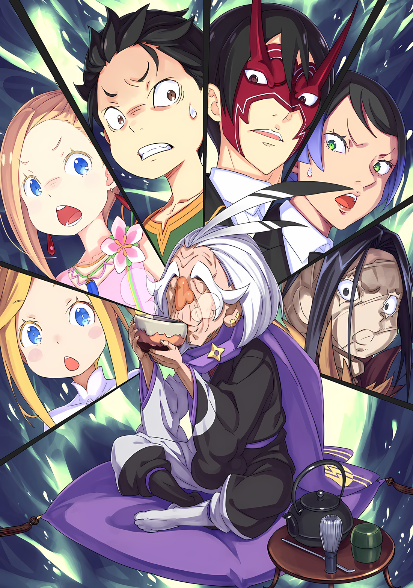

Субару: ……Стратегическое совещание!

В комнате, где было так тихо, что можно было услышать как падает булавка, Субару поднял свою короткую руку вместе с этим предложением.

Опровержения на это замечание не последовало. Все они чувствовали необходимость обсудить свою ситуацию.

Темой обсуждения, конечно же, был вопрос о появлении в Замке Красного Лазурита.

Субару: Абел, который написал письмо, и мы, которые вчера отправились в замок, незаменимы……

Глядя на свою одежду с помятыми рукавами и подолами, Субару размышлял о просьбе Йорны, оставленной Танзе, прибывшей в качестве посланницы; между его бровями образовалась хмурая складка.

Он был готов пойти на риск и отправить Абела прямо в замок, но больше всего его беспокоило условие, что его должны сопровождать посланники, прибывшие накануне.

Будет ли Йорна рада, если он возьмет с собой уменьшенного Субару, Ала и Медиум, размышлял он. В худшем случае, была большая вероятность, что это сочтут розыгрышем.

В качестве альтернативы можно было рассказать Йорне о своей ситуации и искренне взывать к ее сердцу, но……,

Абел: Совершенно бессмысленно показывать свою руку, когда ты не знаешь будущих действий своего противника.

Субару: Понятно… Я тоже не могу сказать, что Йорна меня послушает, учитывая вчерашний обмен…

Абел отказался раскрыть все свои карты, и Субару согласился с ним в этом вопросе.

Хотя он избегал говорить об этом вчера, если Субару захочет описать впечатление, которое произвела на него Йорна, то выражение «Злая женщина» будет правильным выбором. Из-за того, что она говорила и вела себя как куртизанка, Субару показалось, что она искусительница, обладающая прекрасными навыками ловли мужчин как на ладони.

Опасность, исходящая от Йорны, не вызывала сомнений, поскольку, помимо должности Госпожи Города Демонов, она обладала способностью носить титул одной из «Девяти Божественных Генералов».

Именно на нее они сначала положили глаз как на потенциального союзника среди всех «Девяти Божественных Генералов», однако, как предупреждал Абел, она была не из тех, кому можно было легко рассказать о своей ситуации.

Ал: Если мы выложим ей все свои обстоятельства, а она потом спросит о тебе, нам конец. Учитывая переодевание и все такое, что нам делать, если она спросит что-то вроде «Ты смеешь мне врать?».

Субару: Я не хочу думать, что меня будут так обвинять, но если это так, почему бы мне просто не притвориться Нацуми Шварц в форме лоли……?

Таритта: Подожди, пожалуйста, подожди. Боюсь, я все больше и больше путаюсь….

Дилемма выдумывания лжи, чтобы скрыть другую ложь, была обычной, но дилемма необходимости скрывать переодевание, продолжая переодеваться после «Инфантилизации», вероятно, была бы беспрецедентной.

В отличие от шлема Ала, размер парика можно было регулировать, так что переодевание как таковое было возможно, но нужно ли было заходить так далеко, зависело от того, как будет развиваться сюжет.

Медиум: Итак, что мы будем делать? Колокол Огненного Времени примерно через три часа, помнишь?

Субару: ……Я уверен, что мы должны отправиться в Замок Красного Лазурита.

Слушая и параллельно держа Луис в руках, Медиум наклонила голову и спросила его об этом.

Хотя они оба были одинакового размера, и Луис тоже наклонила голову в такт словам Медиум, Субару пришлось посоветоваться со своими внутренними весами.

Таритта: Во-первых, у нас нет возможности не принять приглашение Йорны, не так ли?

Ал: Ну, мы приложили немало усилий, чтобы письмо было прочитано. Если мы не примем его, смысл вчерашней тяжелой работы и нашего пребывания здесь в детском виде исчезнет.

Таритта: Во всяком случае, останется только нанесенный ущерб….

Кивнув на слова Ала и Таритты, Субару решил, что об отступлении не может быть и речи.

Не возвращаться домой, пока не будут возмещены потраченные деньги; такой образ мыслей был клише для людей, потерявших все из-за азартных игр. В некоторых случаях сократить свои потери было бы важно.

Однако при таком «Сокращении потерь» Субару и остальные потеряли свой рост.

Субару: Должны ли мы рассматривать это как что-то серьезное или тривиальное……?

???: Молодеть лучше, чем стареть. Разве это не секрет вечной жизни?

Субару: Да, конечно….

В некотором смысле, «Омоложение» означало увеличение шансов, как и «Посмертное Возвращение».

Если бы человек мог вернуться в детство, обладая знаниями и опытом взрослого человека, он был бы способен со временем тренировать свое телосложение наиболее подходящим образом, а значит, смог бы повторить попытку достижения целей, от которых когда-то отказался.

Учитывая эти обстоятельства, казалось, что они нашли несколько ситуаций, которые можно использовать как преимущество, однако….,

???: ……Это то, о чем ты подумал, верно? Но все не так просто, не так ли? Это не то, что ты можешь легко использовать, понимаешь?

В этот момент третья сторона прервала дискуссию, и дыхание Субару остановилось.

……Нет, не только Субару остановился. Все присутствующие в комнате застыли, не в силах пошевелиться в этот момент, и замерли в присутствии обладателя голоса.

Однако собеседника не волновало нарастающее напряжение в комнате,

???: Я взял на себя смелость приготовить себе чай, кто-нибудь еще хочет?

С этим вопросом, заданным непринужденным тоном, он поднял свою чашку с паром.

Иллюстрация к **Ранобэ** Том 29 | Разукрасил NorvakKK

Таритта: ……Тц!

Сразу же после этого Таритта, словно пружинящая кукла, двинулась с места небольшим прыжком.

Она мгновенно натянула лук и направила стрелу на только что появившегося человека…… Ольбарта Дарккенна.

Ее цель была очень близко, не было ни малейшего шанса, что она промахнется или что он сможет увернуться.

Но Ольбарт бесстрастно пожал плечами: «Ух ты ж».

Ольбарт: Не делай этого-не делай этого. Мне не нравится, когда в меня целятся острыми предметами. Знаешь, старики итак чаще всего ходят в туалет, так ты еще и хочешь напугать меня, чтобы я описался? Я уже в ужасе, понимаешь?

Таритта: Что за шутки…! Кто ты…

Абел: ……Ольбарт Дарккенн.

Таритта: …………

Враждебная, но безразличная поза старика заставила лицо Таритты вспыхнуть от гнева. Однако в ответ на ее вопрос человек в маске Они, тот, кто назвал имя Ольбарта, словно желая унять ее.

Единственный, кто сидел на диване, не шелохнувшись, человек в маске Они…Абел, обменялся с ним взглядом. На это Ольбарт сузил глаза, скрытые густыми бровями.

Ольбарт: Ну, я уже подтвердил вчера, что я знаменитость, так что я не удивлен, но у тебя довольно впечатляющее лицо, знаешь ли. Откуда этот сувенир?

Абел: Избавь меня от глупостей, старикан. Зачем ты здесь?

Ольбарт: В наше время одиноко, потому что молодые люди не хотят слушать пустую болтовню стариков. Люди в моей деревне с каждым днем все лучше и лучше умеют меня игнорировать…… Какакакка!

Рассказывая об одиноких обстоятельствах своей старости, Ольбарт открывал свой большой рот и весело смеялся.

Во время диалога между Абелом и Ольбартом замешательство Субару и остальных, стоявших в стороне, постепенно рассеялось. Однако полностью ослабить бдительность им не удалось.

Медиум: Но, дедушка, как ты сюда попал? Мы тебя даже не заметили….

Ольбарт: О, кроха, ты похожа на вчерашнюю танцовщицу, это ведь ты? Ладно, если дедушке придется отвечать, значит, так тому и быть. Вы позволили зайти той девушке-оленю, верно? И я вошел вместе с ней.

Медиум: Вместе? С Танзой-чан?

Ольбарт: Какакка! Как я сюда попал — секрет. Искусства шиноби — это как мой инструмент торговли.

Ольбарт посмеялся над простым вопросом Медиум с целью сбить их с толку.

Было неясно, насколько серьезно он к этому относится, но в любом случае, слово «Шиноби» было упомянуто им самим, и, похоже, он не собирался скрывать свою истинную сущность.

В таком случае, вместо допроса было бы быстрее спросить его напрямую о его истинных намерениях прийти к ним будучи одним.

Субару: Итак….

Ольбарт: Хм?

Субару: Так что же вы на самом деле здесь делаете?

Взгляд Ольбарта обратился к Субару после того, как тот спросил о цели его визита. При этих словах старик наморщил лоб, как бы раздумывая,

Ольбарт: Ах, да, это ты? Это ты вчерашняя девушка в красном? Я не мог перепутать девушку, похожую на танцовщицу, и однорукого мужчину, поэтому очень волновался.

Так он признался, что ему было трудно понять, кто такой Субару.

Услышав это, Субару оглянулся, а Ал, небрежно изменив позу, усмехнулся. Он прочистил горло через маску, его голос был более тихим, чем обычно,

Ал: ……Как и ожидалось от брата. Даже главный шиноби не знал, кто ты такой.

Ольбарт: О, как впечатляет, как впечатляет! Хотел бы я, чтобы люди в моей деревне научились такому превращению. Как насчет того, чтобы стать лектором? Тебе будут рады.

Субару: К сожалению, у Нацуми Шварц очень плотный график… Может быть, я смогу выкроить для вас немного времени.

Ольбарт: Хохо, что значит «может быть»?

Он причмокнул губами, вспомнив, что переодевание стало неожиданной добычей, а затем, заметив ощущение жажды в горле, Субару прищурился.

Независимо от того, насколько он верил в эту чушь, он должен был в полной мере воспользоваться возможностью поговорить напрямую с Ольбартом. О нынешней ненормальной ситуации, которая постигла Субару и остальных.

По предположению Абела, инициатором этого феномена был не кто иной, как старик, находящийся перед ними.

Субару: Причина, по которой мы в таком положении; если у вас есть идеи, скажите честно, кто это был….

Ольбарт: О, это. Им был я. Интересные они, эти искусства шиноби, не так ли?

Субару: …………

Не торгуясь, Ольбарт признал, что это его рук дело.

Его заявление заглушило остальные его слова, Субару проглотил слюну. И старик злобно рассмеялся, наблюдая, как напрягся Субару,

Ольбарт: Если бы я убил тебя случайно, я бы не смог услышать ничего из того, что ты скажешь, и остался бы с кучей проблем, понимаешь? В таком случае, есть много способов выжать из кого-то информацию, не убивая. ……Интересно, не правда ли?

Ольбарт резко произнес эти слова и отхлебнул теплого чая.

△▼△▼△▼△

……«Инфантилизация», поразившая Субару, Ала и Медиум.

Из показаний сходства из «Девяти Божественными Генералами» Абела следовало, что виновником был Ольбарт.

Однако то, что это подтвердил он сам, было сюрпризом иного рода. Тем более, если он ничуть не обиделся и гордился этим.

Все: …………

Ольбарт: Эйэй, мы не должны так страшно смотреть друг на друга. Разве вас не учили, что о старых людях нужно заботиться, а не мучить их?

Напряжение в комнате снова нарастало, и Субару, и Ал, и Медиум, и даже Таритта, которая с самого начала не опускала лук, постепенно меняли свои позиции.

В частности, Ал был готов заблокировать входную дверь и преградить Ольбарту путь к отступлению.

Однако Ал, с его уменьшенным телом, не мог свободно обращаться со своим мечом, и поэтому не мог рассчитывать далеко продвинуться, чтобы остановить главного шиноби, который всегда был начеку.

Луис: Уу…. кх

Ольбарт: Ты — девчонка, которая мне ничего не сделает, не так ли? Тогда почему ты смотришь на меня так? Мне становится больно. Разве тебе не нравится сладкий запах старых мужчин?

Абел: Не играй со мной в игры, Ольбарт. Я спрошу тебя еще раз. Что привело тебя сюда?

Абел бросил несколько слов в сторону Ольбарта, который пытался одержать верх над рычащей Луис. Бросив взгляд на Ольбарта, который смотрел на него через плечо, Абел выразил резкий дух, который мог быть передан даже через маску Они,

Абел: Ты слышал мысли Йорны Миссигр, Госпожи этого Города Демонов. Она признала их посланниками. Она ясно дала понять, что их нельзя трогать.

Субару: Т-точно! Не трогайте нас, в этом и заключалась вчерашняя игра! Мы тоже рисковали своими жизнями! И все же, это лечение отличается от того, что нам обещали!*

**Субару сказал это интонацией Нацуми.*

Ольбарт: Эйэй, ты, видимо, запутался, и начал прогонять.

Воспользовавшись агрессивным ходом Абела, Субару также повторил заявление Йорны, сделанное накануне. Как и говорил Ольбарт, Субару дошел до того, что даже вернулся к вчерашнему состоянию ума; однако это не меняло истины.

Йорна признала группу Субару посланниками, а Танза ясно дала понять, что не позволит никому вмешиваться в их дела.

Пренебречь этим, значит выразить враждебность по отношению к Йорне.

Абел: Конечно, если твое намерение — уничтожить Город Демонов, мы не оставим тебя без внимания.

Субару: ……Раз уж ты об этом заговорил.

После дополнительных слов Абела, горячая кровь Субару похолодела.

Фактически, фракция фальшивого Императора, к которой принадлежал Ольбарт, уступила право вести переговоры с Йорной Субару и его партии. Если они сочтут это плохим ходом, то просто перевернуть стол от злости тоже было в их силах.

В таком случае, неизбежно было бы столкновение с Йорной, которая считалась одной из «Девяти Божественных Генералов», в нескольких смыслах этого слова…,

Абел: Если ты собираешься бросить ей вызов с намерением уничтожить его, ты должен избежать краха. Конечно, ты выйдешь из него с некоторым ущербом.

Ольбарт: ……Ну, эта лисица может быть хитрой. Однако не так уж весело, когда этот юнец в маске видит тебя насквозь.

Субару: Юнец в маске….

Ольбарт почесал пальцами подбородок и притворился, что ему больно. Подслушав некоторые его слова, Субару краем глаза взглянул на Абела.

Отношение Абела не изменилось, но Субару напряженно следил за каждым шагом этой перепалки. ……В конце концов, Ольбарт был одним из «Девяти Божественных Генералов».

Конечно, они должны были видеть Винсента Волакию, Абела, много раз.

Несмотря на то, что он скрывал свое лицо маской, если бы Ольбарт обменялся словами с Абелом, который не изменил ни своей речи, ни тембра голоса, то не было бы ничего удивительного в том, что первый понял его истинную сущность.

Ольбарт: …………

Однако Абел, отвечавший с достоинством, не проявил никакого беспокойства.

Ольбарт тоже не проявил никаких признаков того, что осознал истинную сущность Абела. Учитывая это, Субару не смог опознать его, и ему ничего не оставалось, как действовать, скрывая свои внутренние страхи.

Так или иначе……,

Субару: Я все еще не получил вашего ответа, Ольбарт-сан.

Ольбарт: ——. Чувствую, что так ко мне относятся лучше, чем если бы меня называли просто стариком. Так что я пощажу тебя за то, что ты притворяешься девушкой.

Субару: Ольбарт-сан!

Взгляд Субару устремился на старика, который не выдержал и уклонился от вопроса. Видя это, Ольбарт поднял руки и сказал: «Ладно-ладно»,

Ольбарт: Награда за твои действия будет такой, как ты и сказал. Лисичка и Его Превосходительство сказали мне не вмешиваться.

Субару: Если это так….

Ольбарт: Это просто так, понимаете. Я подколол вас, ребята, до окончания вчерашней игры, так? Тогда знаете что? Если вы не можете жаловаться на смерть от раны, полученной мечом во время боя, то вы не можете жаловаться на уменьшающую технику, которую вы получили во время боя со мной.

Субару: Это уже перебор……!

Ольбарт: Ну, разве это действительно придирки? ……Но ты не можешь изменить это, не так ли?

Подняв бровь на Ольбарта, который смеялся над собственной хитростью, Субару растерялся.

Аргумент Ольбарта был зыбким, как он сам признал. Но, с другой стороны, он был верным.

Даже если кто-то погиб из-за раны, полученной во время сражения, то если бы она была получена до заключения перемирия, не было бы смысла возлагать ответственность за трагедию на кого-то после начала перемирия.

Однако у Субару сложилось впечатление, что между раной и «Инфантилизацией» есть большая разница.

Ольбарт: Вот почему я думаю, что вернуть тебя обратно и приказ лисички — это две разные вещи. Понимаешь меня?

Субару: …………

Ольбарт: Какакакка! Не смотри так строго. Твое милое личико испорчено…… Это милое личико было просто притворством, сделанным с помощью косметики! Ты поймал меня на крючок, на удочку и на крючок.

Ольбарт поиграл кончиками пальцев с чашкой и продемонстрировал несколько акробатических навыков, чтобы не расплескать содержимое. Его слова было нелегко отбить; они были подобраны с продуманной тщательностью, наработанной опытом.

Однако даже если Таритта, которая нервничала все больше и больше, и Ал с остальными, пытавшимися перекрыть путь к отступлению, будут бороться изо всех сил, подчинить Ольбарта силой не представлялось возможным.

Если бы здесь был кто-то, способный победить этого хитреца, то это был бы……,

Абел: Не увлекайся, Ольбарт.

И действительно, только человек в маске Они пытался прорваться сквозь кипящие амбиции и хитрость.

Абел, не меняя позы, окинул Ольбарта еще более острым и холодным взглядом, заставив его прекратить игру с чашкой.

Абел: Я уже спрашивал тебя о твоей цели. Сколько еще раз я должен спрашивать, пока ты не захочешь это сделать?

Ольбарт: Всякий раз, когда появляется молодой человек, выражение лица которого я не вижу, я не могу удержаться, но хочу увидеть морщинки между его глазами. Надеюсь, ты не возражаешь.

Прикрыв один глаз, Ольбарт озорно ответил на властный настрой Абела. Старик почесал голову и сказал: «Ты человек, у которого нет свободного времени»,

Ольбарт: Лисичка в стороне, Его Превосходительство также сказал мне не поднимать руку на вас, ребята, поэтому я пришел сюда не для того, чтобы разбираться с вами. Но если мы все равно будем вашими врагами, не помешает немного ослабить вас, не так ли?

Ал: ….Возможно, это и было причиной того, что ты нас уменьшил, но ты проделал весь этот путь не для того, чтобы пить чай.

Ольбарт: Похоже, тебе нелегко теперь, когда твой шлем больше не подходит, парень. В любом случае, думаю, ты прав. Что ж, я здесь только для того, чтобы послушать, что вы скажете, честно.

Субару: ……Что мы хотим сказать?

Поглаживая ухо рукой, не держащей чашку, Ольбарт кивнул Субару, пока тот размышлял над вопросом, а затем сказал: «Верно».

Затем он указал на окно тем же пальцем, которым ковырялся в ухе,

Ольбарт: То вчерашнее представление в замке, будь оно проклято, если у меня от него не закружилась голова. Но есть много людей, которые пытались подшутить над Его Превосходительством, и пока что все они потерпели неудачу. Поэтому я хотел бы спросить тебя, почему ты тоже решил перейти этот опасный мост.

Субару: ……Что ты собираешься делать, когда услышишь это?

Ольбарт: О? Конечно, я решу после того, как услышу это. И я сделаю кое-что, чтобы убедиться, что ты не сможешь солгать.

Рот Ольбарта широко открылся, когда он пустил слюну вместе со своим искренним смехом, Субару нахмурился.

Легко было списать его отношение, как это было слышно совсем недавно, на дурной вкус. Но было ясно, что разговор не может быть просто свернут на нем.

Он был одним из «Девяти Божественных Генералов», которые должны были помочь Абелу вернуть трон или развеять технику шиноби, которая сделала Субару и остальных «Инфантильными».

Скорее……,

Субару: ……Шанс, не так ли?

Положение «Девяти Божественных Генералов» было таково, что было трудно даже связаться с ними, даже чтобы привлечь их на свою сторону.

Но сейчас, по какой-то причине, в Хаосфлейме была не только его Госпожа, Йорна, но и Ольбарт перед ним, и Чиша, который, похоже, выдавал себя за лжеимператора.

Конечно, даже если бы удалось сломить сопротивление Чиши, который взял на себя инициативу, это было бы невозможно……,

Субару: Если вчерашние рассуждения Абела были верны, это не значит, что Ольбарт-сан считается врагом.

По мнению Абела, надежда оставалась на Ольбарта, который был одним из «Девяти Божественных Генералов», считавшихся уже пешками противника. На данный момент Субару должен был сказать, что суждение Абела было верным, поскольку ему удалось дойти до момента переговоров с Йорной.

Если верить его предположениям, то у Ольбарта должно быть место для переговоров.

Однако, чтобы привлечь Ольбарта на свою сторону……,

Субару: …………

В тишине Субару взглянул на профиль Абела.

Раскрывая личность человека в маске Они и сохраняя достойную осанку, Абел. ……Это была самая важная информация, которую они должны раскрыть, чтобы завоевать Ольбарта.

И, честно говоря, у Субару не было никакой другой информации, которая могла бы вызвать резонанс у Ольбарта.

Субару: …………

Абел в маске Они даже не поморщился, встретив взгляд Субару в свою сторону.

Его лицо было скрыто за маской, что делало невозможным наблюдение за его эмоциями. Однако этот умный человек никак не мог не догадаться о том, что придумал Субару.

На данном этапе, насколько сильно он мог обнажить свое сердце перед другой стороной, Ольбартом?

Субару решил, что это будет центральным моментом, но поскольку Абел не шевелился, не был ли он преждевременным в своих размышлениях? Или он ждал, что будет дальше?

В любом случае, если им удастся привлечь Ольбарта на свою сторону, они найдут способ решить проблему «Инфантилизации» Субару, недостатка сил и битвы за «Девять Божественных Генералов».

Тогда, это будет подходящее время для игры……,

Ольбарт: ……Знаете, забавно, что лица людей говорят больше, чем ожидаешь, не так ли?

Субару: Хмм…?

Ольбарт: Ваш взгляд, то, как напрягается лицо, как слегка сокращаются мышцы… На самом деле вам не нужно двигать ртом, чтобы много говорить.

Ударив двумя пальцами по вискам, Ольбарт заговорил. Старик кивнул, и его взгляд упал на Субару, у которого перехватило дыхание.

Ольбарт: Например, девушка, которая выглядит как танцовщица, полагается на девушку, использующую лук. Юноша с тканью вокруг головы и маленькая девочка полагаются на тебя. А что касается того, кто использует лук, и тебя…… Ну, оба вы полагаетесь на того молодого человека в маске.

Субару: ……Кх.

Ольбарт: Ты можешь видеть общее направление каждой пары глаз. ……Когда ты слаб, это еще более очевидно, не так ли?

Слова Ольбарта, сверкнувшего своими белыми зубами, пронзили разум Субару.

И Субару с запозданием понял, что сильно ошибся в оценке сущности Ольбарта, который даже с виду казался добродушным стариком.

Ольбарт ясно дал понять, что это он «Инфантилизировал» их, и что он сделал это для того, чтобы поговорить с Субару и остальными.

……Он никогда не говорил, что это было сделано для того, чтобы «Договориться» с Субару и остальными.

Субару: Разве вы не пришли сюда, чтобы поговорить….

Ольбарт: Прийти сюда, чтобы «Поговорить» и прийти сюда, чтобы «Послушать» — вещи похожие, но немного отличаются, не так ли? Я не против поболтать вот так, понимаешь? Но….

Субару: …………

Ольбарт: Видишь ли, я также глава шиноби хонко, и я провожу свое время, действуя как представитель народа моей деревни. Поэтому…… я не могу доверять словам того, кого я даже не пытал, потому что это слишком опасно.

Не теряя облика старика, понимающего, о чем он говорит, Ольбарт выразил свои мысли в соответствии с неписаными правилами шиноби.

Мрачность и суровость этого мира, безусловно, были схожи с миром «Ниндзя», известным Субару.

Однако ощущение от наслаждения им как вымыслом было совсем не похоже на то, что испытываешь, когда сталкиваешься с ним воочию.

И….,

Ольбарт: Итак, с его самоуверенным поведением, когда не на кого положиться, молодой человек в маске — лидер, верно? Позволь спросить, что заставило тебя соблазнить эту лисицу?

Абел: ……Если это не сработает, то что сработает?

Ольбарт: Тогда тебе придется искать другой способ, не так ли? Но поскольку я обязан не вмешиваться, я мало что могу с этим поделать.

Ольбарт пожал плечами, его взгляд и внимание были обращены на Абела. Конечно, вряд ли можно было поверить, что Ольбарт, глава шиноби, не обращает внимания на остальных.

Даже если он не повернул голову, его внимание не было отвлеченно ни от Ала, ни от Таритты.

Однако, несмотря на то, что в его сторону был направлен лук, демонстрировать намерение напасть на Ольбарта было бы неразумно для Субару и окружающих его людей.

Согласно приказу Йорны, их должны были принять в Хаосфлейме как посланников.

Будет ли это по-прежнему действовать после того, как они устроят беспорядки в Хаосфлейме, и как она поступит с плохо воспитанными гостями, было совершенно неизвестно.

Другими словами, ситуация здесь была патовой и для Субару, и для Ольбарта.

У обоих не было другого выбора, кроме как смотреть друг на друга, заявляя о своей готовности причинить вред.

И в таком крайнем безвыходном положении……,

Субару: ……Но, с другой стороны, в таких условиях, где я вообще мог подготовиться?

Размышляя над сложившейся ситуацией, Субару снова задал вопрос белому пространству, родившемуся в его голове.

И снова возникла мысль: «Разве это не возможность?».

Связанный Йорной и лжеимператором, Ольбарт не мог предпринять никаких дополнительных враждебных действий.

Субару оценивал, на чью сторону склоняется Ольбарт; если на сторону врага, то им придется действовать в это время, другой такой ситуации, как здесь, у них не будет.

Все: …………

В медленном темпе шло время.

Наряду с этой напряженной ситуацией, оставался еще вопрос о времени, когда зазвонит колокол Огненного Времени, как представила Йорна.

Время было драгоценно. ……Чем больше он тратил, тем больше уменьшалась его жизнь.

В тишине пальцы Таритты дрожали, когда она сжимала свой лук, а Ал и Медиум тоже приглушенно дышали. Даже Луис чудом издавала лишь рычание, возможно, инстинктивно чувствуя опасность, исходящую от Ольбарта.

Возможно, они не могли решиться на волнение. Если кто-то и мог, то это был бы….,

Субару: ……Абел.

Абел: …………

Субару тихо назвал имя Абела.

Было видно, что его сознание повернулось к нему сквозь маску Они, услышав это. Его глаза были невидимы, так как маска Они блокировала его взгляд, но его внимание было направлено на Субару.

Его чувства не были видны. ……Однако Субару мог догадаться о его намерении, так как чувствовал его.

Субару: Это Император, Винсент Волакия.

Ольбарт: ….Аахн?

В ответ на взгляд Абела Субару сделал это утверждение, заставив Ольбарта поднять бровь.

Его глаза, скрытые длинными, богатыми бровями, широко раскрылись, так как старик с подозрением отнесся к словам Субару. Это была естественная реакция, но это была далеко не та реакция, которую он искал.

Поэтому, чтобы вызвать желаемую реакцию, они пошли глубже.

Субару: Вы хотите знать, кто этот безликий молодой человек и для чего мы здесь. Зачем мы пришли к Йорне? Ответ….

Ольбарт: Эйэй, это не очень смешно, да?

Субару: Я не пытался быть смешным. ……Абел.

В голосе Ольбарта, потерявшего дар речи от неожиданности, прозвучал намек на удивление.

Поняв это, Субару окликнул Абела в глубине комнаты. Абел не пытался опровергнуть слова и действия Субару.

Просто неслыханно нежные пальцы потянулись к его лицу. А после……,

Ольбарт: ……Это чертова катастрофа.

Напротив Ольбарта открылся скрытый образ, и он издал голос удивления. Перед его глазами, на Ольбарта, который был с напряженным лицом, смотрел темноволосый красавец…… не кто иной, как Император Винсент Волакия.

Ольбарт: Ваше Превосходительство? Но это слишком странно, не так ли? Но тогда с кем я пришел….

Абел: Дай волю своей старой смекалке, Ольбарт Дарккенн. У тебя есть ответы. Остается только извлечь их.

Ольбарт: С лицом Вашего Превосходительства, говоря вещи, которые звучат как Ваше Превосходительство… А, так вот оно что.

Поначалу он опешил, но вскоре старый шиноби вновь обрел самообладание.

Открыв свое лицо, Абел отдал приказ как Император, и, выполнив его, Ольбарт, казалось, пришел к выводу о ситуации, в которой он оказался, с учетом имеющейся у него информации.

Ольбарт положил руку на подбородок и….,

Ольбарт: Значит, это был Чиша. У него все под контролем…… Однако есть еще один вопрос. Не похоже, чтобы вы, Ваше Превосходительство, позволили такому случиться с вами, не так ли?

Абел: Ты думаешь, что твои глаза могут заглянуть в глубины моего разума?

Ольбарт: Ох, очень страшно, очень страшно.

Размахивая обеими руками в воздухе, он издал пересохший звук при ответе Абела.

На самом деле, как заявил Ольбарт, Абел определенно находился в подавленном состоянии, но его ошеломляющий блеф никак этого не показал.

Однако, увидев, как изменилось выражение лица Ольбарта, напряжение покинуло и плечи Субару.

Ольбарт понял ситуацию.

Абел был смещен с поста Императора, а Винсент, которого он сопровождал, был лжеимператором.

Ольбарт: Многое, что ставило меня в тупик, прояснилось. Нет, я хотел узнать, почему ты вдруг пришел лично встретиться с лисичкой?

Субару: Все это…… было сделано, чтобы подавить действия нашей стороны.

Ольбарт: Хахаа, старым людям трудно угнаться за идеями умников, на самом деле. Молодые, умные, хорошо выглядящие, я думаю, это супер-жадность. Ты тоже так думаешь? А ты не думаешь? Раз уж вы тоже так молоды. О, это из-за того, что я сделал! Какакакка!

Ольбарт разразился хохотом, пытаясь рассмешить их своими словами, хотя это было совсем не смешно.

Щеки Субару заалели, и он выдохнул, внезапно посмотрев на Таритту.

Судракийская воительница по-прежнему настороженно смотрела на Ольбарта, нацелив лук. Он пытался заставить ее выйти из боевой стойки и вернуть контроль над ситуацией.

Субару: Таритта-сан, ты можешь опустить свой лук. Ольбарт-сан….

Ольбарт: О? Нет, ты не должна его опускать, не так ли? Я думаю, что эта девушка не может ослабить бдительность перед тем, в ком она не уверена, что он не враг.

Субару: А?

Сам Ольбарт, цель лука Таритты, был тем, кто остановил попытку Субару заставить ее ослабить бдительность и заговорить с ним.

Старик воспринял осторожность Таритты как нечто естественное, более того, он не сделал ничего, чтобы попытаться опровергнуть непонятную для Субару «Естественность». ……Иными словами, опасность, исходящая от него самого, не уменьшилась.

Однако, тогда это было бы похоже на….,

Субару: Давайте поговорим об этом….

Ольбарт: Разве ты не слышал меня? Я сказал, что приму решение после того, как выслушаю тебя. И я принял.

Субару: …………

Горло Субару забилось, но, несмотря на это, отношение Ольбарта не изменилось.

Лишь тихо щелкнул языком, и…,

Абел: Это была одна из тех карт, о которых я не знал, к какому варианту она склонится, но ты решил именно так, ха.

Ольбарт: Это не похоже на вас, Ваше Превосходительство. Нет, это фатально, что у вас не осталось карт для игры…… Более того, вам не повезло со жребием. Знаете, я всегда хотел попробовать.

Абел: Хо, что именно?

План Ольбарта был разработан, и глава шиноби рассмеялся над словами изгнанного Императора.

Смех, подходящий для человека, носящего титул «Порочный Старик»,

Ольбарт: Поскольку я старый человек, которому осталось жить недолго, я всегда от всей души хотел попытаться убить Императора, чтобы умереть славной смертью.

Все: ……Кх.

В тот момент, когда это порочное желание было произнесено, среди этой напряженной обстановки произошло движение.

В тот же миг Таритта, Ал и Медиум двинулись, чтобы помешать цели Ольбарта, преодолевая правило «Не драться», данное каждому из них.

Однако….,

Ольбарт: Вчера я не мог понять, какой трюк ты использовал, Однорукий. Но он перестал работать, когда ты стал маленьким, не так ли?

Ал: Ка…… кх.

Ольбарт: Навыки, которые ты приобретаешь в старости, ты не можешь использовать в молодости.

Произнеся эти слова, Ольбарт вывернул шею и взмахнул руками.

Кровь брызнула из кончиков его пальцев, и в поле зрения Субару развернулась трагедия, его глаза были открыты до предела.

У Медиум и Ала, которые вмешались и попытались усмирить Ольбарта, были вырваны шеи и хлынула кровь. Она разлетелась по комнате как фонтан, заставляя задуматься, откуда в теле маленького ребенка столько крови.

Ал: Тх, ах…… кх

Ольбарт: Судя по этому, похоже, что ты не можешь использовать свой последний луч надежды. Тем не менее, я прикончил тебя, прежде чем узнал, как работает твой трюк, вот как это было, ха. Я облажался, я облажался.

Ал скрючился, держась за рану. Глаза Медиум потухли, и она упала назад, не двигаясь.

Было очевидно, что то, что они пережили, было смертельной раной, от которой невозможно оправиться.

И Таритта, единственная, кто была готова сразиться с Ольбартом..,

Субару: ……Ах.

Субару недоумевал, почему не был произведен выстрел из лука.

Однако подозрение, что атака, которая должна была произойти, не состоялась, заставило Субару направить взгляд в ее сторону.

Таритта была прижата к стене.

Высокая для женщины, стройная фигура Таритты была прислонена к стене, все ее тело было плотно прижато к ней. Причиной ее обездвиживания было метательное оружие, торчащее из центра ее декольте — сюрикен.

Словно в шутку, звездообразный снаряд пронзил грудь Таритты, пропорол ей спину и пригвоздил к стене. Ее сердце было уничтожено, было ясно, что она погибла мгновенно.

Абел: ……Хоть тебе и сказали не вмешиваться, ты не смог удержаться.

Внезапно в комнате, кишащей смертью, раздался мужской голос.

Это был голос Абела, стоявшего в комнате, которая с ужасающей быстротой наполнилась трупами. Встав со своего места, мужчина посмотрел пронизывающим взглядом на Ольбарта, архитектора всех этих смертей.

Под этим взглядом Ольбарт вытер пальцем кровь, брызнувшую ему на щеку,

Ольбарт: Да. Я хочу устроить большой фейерверк перед смертью. Я буду полностью удовлетворен, если убью величайшего Императора всех времен и народов и буду казнен за это.

Абел: Я не смог прочесть твои разрушительные вкусы. Мое упущение.

Ольбарт: Какакка! Нет, нет, нет, если бы мои мечты о старости стали известны, мне было бы так стыдно, что я не смог бы жить.

Ал перестал двигаться, а Медиум и Таритта перестали дышать.

При таких обстоятельствах этот разговор между Императором и вассалом показался Субару чем-то из иного мира. Однако это был не он. Это была реальность. Настоящая, всепоглощающая реальность.

Это была реальность, к которой Субару пришел, сделав неправильный выбор.

Ольбарт: Как только я закончу с Вашим Превосходительством, я вернусь к Чише. Уверен, он прекрасно справится с моей смертью.

Субару: Ну…… кх.

Ольбарт: Ох? Оо, ты все еще там.

К Субару, который заговорил слишком поздно, Ольбарт повернулся, и тот погрузился в атмосферу, знаменующую конец.

Старик с треском вывернул шею, чтобы удержать Субару с застывшим лицом в узде. Затем, указывая на упавших, Ала, Медиум и Таритту по очереди,

Ольбарт: Вот так. Эти парни пытались убить меня, и я убил их в ответ, но у тебя нет причин умирать, верно? У меня нет намерения стать беглецом, так что нет причин заставлять тебя молчать.

Субару: Дха… ах……

Ольбарт: О, похоже, я опять много наговорил… Очевидно, что тебе есть что сказать, так что открывай рот. Я старый человек с короткой жизнью впереди, так что я не могу ждать так долго, понимаешь?

Пока Ольбарт продолжал неторопливо говорить в своем собственном темпе, мысли Субару побелели. ……Нет, они окрасились в ярко-красный цвет. Был ли это гнев или цвет крови, пролитой Алом и остальными, не мог сказать даже сам Субару.

Как бы то ни было, во всяком случае, здесь, ни за что….

Абел: ……Дурак.

И вот, эти презрительные слова прозвучали из уст Абела.

Сейчас его взгляд должен был пронзить затылок Субару. Чувствуя давление его острого взгляда, Субару остро осознал точность своих слов.

Не было смысла заступаться за Абела сейчас, при таком раскладе.

Если бы он мог действовать подобным образом до падения Ала, Медиум и Таритты, возможно, удалось бы что-то изменить,

Луис: Уу……!

Ольбарт: Эйэй, ты даже используешь маленькую девочку, которая никак не связана со мной? Метод Вашего Превосходительства, должно быть, был таким, который женщины и дети точно ненавидели.

Перед Ольбартом, положив руку на его переднюю часть, стояла Луис. ……Нет, Луис стояла не перед Ольбартом, а перед Субару.

Субару защищал Абела, а Луис защищала Субару, они стояли втроем на одной линии.

Это была просто какая-то абсурдная форма мясного щита.

Ольбарт: Я думал, что Ваше Превосходительство должен был умереть в одиночестве.

Абел: ……Не все идет по расчетам.

Ольбарт: Какакка!

Неспособность Абела держать язык за зубами в этот момент была встречена усмешкой и громким смехом Ольбарта.

В глазах пожилого шиноби не отразилось присутствие ни Субару, ни Луис. Но он не был настолько добр, чтобы не замечать тех, кто стоял перед ним с враждебностью.

Отныне……,

Субару: ……Я никогда тебя не прощу.

Молодое тело Нацуки Субару извергло кровь и погрузилось в холодную лужу крови, запечатлев в своем сознании лицо шиноби, когда тот злобно зарычал, пытаясь удовлетворить свои амбиции.

А затем……

△▼△▼△▼△

Кровь потекла, и из раны хлынул жар.

Однако жар, переливающийся через край, мгновенно выкачал тепло из его тела.

То, что вытекало, быстро поглотило его, утопило, сделало невидимым, а потом, когда он погрузился в глубины океана, он, он……,

Субару: …………

Мгновенно потерянная кровь потекла по телу Субару, вызывая громкий шум в ушах.

Вместе с ощущением того, что его слух обострился до предела, пришла какофония крови, текущей через него в тихом пространстве. Будучи пораженным им по всему телу, Субару испустил неровный выдох.

Он с силой стиснул свои зубы, его зрение мерцало то в одну, то в другую сторону из-за отдаленной боли и чувства потери.

Он хотел узнать, куда он вернулся……

??: Я взял на себя смелость приготовить себе чай, кто-нибудь еще хочет?

Мгновение спустя, злобный, незабываемый голос возвестил о начале новой битвы Нацуки Субару.
