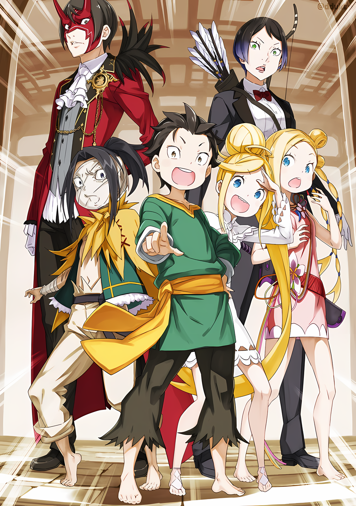

……Это предложение, озвученное хриплым голосом, сильно озадачило Субару и остальных.

Все: …………

«Инфантилизация», которая свалилась на группу Субару, и ее организатор, Ольбарт Дарккенн.

Субару и остальные, которые пытались договориться с Ольбартом, чтобы он снял с них «Инфантилизацию», получили условие, подобающее старику…… нет, подобающее чудовищному старику, который играл с их телами и умами; странное условие, услышав которое, можно сбить с толку сердце.

В конце концов..,

Субару: Д-догонялки……?

Субару, с ужасом ожидавший, что за неразумная просьба будет высказана, размышлял над только что сказанными словами.

При звучании голоса Субару, Ольбарт, подняв руки вверх, недоуменно нахмурился.

Ольбарт: Что за вопросительный взгляд? Ты же не собираешься сказать мне, что не знаешь, как играть в догонялки?

Субару: Конечно, я знаю, что это такое. Просто это не то слово, которое должно было появиться в данной ситуации.

Как бы это ни было обставлено, это была всего лишь детская игра в «Догонялки».

Трудно было представить, что в этом есть другой смысл. Хотя, поскольку в такую игру играют в деревне шиноби, то велика вероятность, что она будет иметь уникальный набор правил.

Например, что-то вроде……,

Субару: «Убийство не запрещено правилами во время игры», что-то вроде этого.

Ольбарт: Какакакка! Конечно, нет. Если бы такая ерунда была популярна, шиноби вымерли бы в мгновение ока. И это моими руками, с моим лидером. Это было бы ужасно, не так ли?

Хотя Ольбарт отрицал его опасения, Субару считал того человеком, готовым запятнать свои руки кровью собственного народа, если потребуется, учитывая его жестокое поведение и то, что он говорил и делал до сих пор.

Честно говоря, он бы не удивился, если бы деревня шиноби уже была уничтожена.

Абел: ……Эта штука с меткой, как она функционирует?

Вместо Субару, который горел подозрениями, Абел призвал его идти вперед.

Его щеки искривились в улыбке, и Ольбарт издал «О»,

Ольбарт: Похоже, ты проявил больше энтузиазма, чем я ожидал, юнец в маске.

Абел: Глупость. Мы уже прошли тот этап, когда не ввязывались в эту игру, как только разгласили, что обладаем информацией, которую ты жаждешь.

Ольбарт: Какакка! Что ж, похоже, ты прав.

Открыв рот так широко, что казалось, его челюсть вот-вот отвалится, Ольбарт от души рассмеялся без всяких оговорок.

На самом деле, Абел был прав. Идея Ольбарта была порочной. Независимо от того, выиграет он или проиграет в этой игре в «Догонялки», Ольбарт получит нужную ему информацию.

Цель этой игры заключалась в том, чтобы дать им возможность выбрать, как они хотят отдать эту информацию: после переговоров или после пыток.

Ольбарт: Итак, нет ничего особенного в том, как работает игра в догонялки. Одна сторона убегает, а другая ловит…… О, было бы лучше, если бы я был тем, кто убегает. Знаете, поскольку гоняться за большой группой людей слишком тяжело для выносливости старика.

Медиум: Значит, если мы поймаем убегающего дедушку, мы выиграем? Это легко понять.

Таритта: Это легко понять, но….

На объяснение Ольбартом правил Медиум отреагировала оптимистично, а Таритта — пессимистично.

Мнение Субару также больше склонялось к мнению Таритты. Действительно, правила были просты, и не было места для неопределенности, чтобы вмешаться. ……Другими словами, все зависело от способностей.

А если говорить о способностях, то общая сумма способностей группы Субару и близко не стояла со способностями Ольбарта.

Ольбарт: Ну, с маленькими детьми будет трудновато. Тогда мы можем немного ослабить условия.

Таритта: А тот, кто это сделал, даже не чувствует себя виноватым……!

Ольбарт: Не расстраивайся так. Если твой палец сорвется с тетивы, у меня будет веская причина защищаться, и все станет намного проще.

Таритта: …………

Когда Ольбарт оглядел присутствующих и пожал плечами, Таритта клацнула коренными зубами.

Как и говорил чудовищный старик, лук Таритты по-прежнему был нацелен на Ольбарта. Однако он с прямым лицом проигнорировал это, а точнее использовал как разменную монету.

Можно было только представить, какое душевное смятение испытывала Таритта. Но сейчас приоритетом было……,

Субару: Что значит «ослабить условия»?

Ольбарт: Речь идет о том, как мы будем играть в догонялки. Как насчет того, чтобы не ловить меня, а наоборот, если ты найдешь меня, ты выиграешь. Но тебе придется сделать это трижды.

Субару: Трижды….

Ольбарт: Я спрячусь трижды. Вам придется попытаться найти меня три раза. Если вы не сможете, вы проиграли. В этом случае это не игра в догонялки, а игра в поиск… что довольно странно.

«Это звучит не совсем правильно», — сказал Ольбарт, озадаченно покачивая головой.

Приняв предложение старика, слово, прозвучавшее изнутри Субару, было..,

Субару: ……Прятки?

Ольбарт: О да, это хорошее название. Мы будем использовать его.

Ольбарт щелкнул пальцами услышав «Прятки».

При этом он поднял по одному пальцу на каждой из своих вытянутых рук и показал ими влево и вправо на месте, чтобы все видели.

Ольбарт: В игре в догонялки меня нужно поймать только один раз. В прятки — трижды. ……Не думаю, что мне нужно говорить тебе, в какой из них у тебя больше шансов выиграть, не так ли?

Как только Ольбарт задал этот вопрос, закрыв один глаз, Субару издал вздох.

Ольбарт был прав, этот вопрос не требовал дальнейших размышлений. ….Учитывая способности Ольбарта как кого-то трансцендентного, о чем Субару уже знал, у них не было причин выбирать игру в догонялки.

Да и не должно быть, пока…,

Ал: Не правда ли, это так мило с твоей стороны. Не могу не задаться вопросом, есть ли в этом что-то еще, раз уж ты взялся предложить метод, который дал бы нам больше шансов на победу.

Когда Ольбарт попытался передать им шансы на победу, Ал огрызнулся.

Вместо шлема, который он снял, Ал теперь обмотал лицо тканью. Его голос, ставший с возрастом более высоким, был немного приглушен тканью, хотя и не настолько, чтобы его было трудно разобрать.

Ольбарт, выслушав слова Ала, пожал плечами.

Ольбарт: Эйэй, не делай ошибки, думая, что я старый человек, который хочет победить любой ценой, юноша. Насколько я понимаю, будет лучше, если вы, ребята, победите, ясно? Я делаю это, потому что хочу знать, стоит ли вас слушать.

Ал: …………

Ольбарт: Что касается меня, мне очень интересно, что вы скажете. Но разве это неправильно, что я беспокоюсь о своих пенсионных сбережениях, если меня поймают на какой-нибудь случайной лжи, а моя преданность Его Превосходительству окажется под вопросом? Чтобы этого не случилось, я использую свой вялый мозг, чтобы придумать этот план.

Размахивая указательными пальцами слева и справа, Ольбарт отстраненно ответил Алу.

Услышав его речь, Ал не развеял своих подозрений. Но это был разумный ответ, и он, похоже, не решался продолжать этот вопрос.

Субару не был настолько легковерен, чтобы поверить, что Ольбарт говорит правду.

Однако было слишком мало времени и недостаточно информации, чтобы выяснить, что на уме у этого опытного шиноби.

В то время как встреча, отведенное Йорне, стремительно приближалась, секунда за секундой.

С двумя неудобными вариантами Ольбарта, ни один из которых не был лучшим, шансы придумать способ оправиться от случившегося были близки к нулю.

Говоря иначе, Субару сделал все, что было в его силах, и все равно оказался в этой ситуации.

Абел: ……Если мы примем твое предложение, нам нужно прояснить некоторые вопросы.

Ольбарт: О, что ты имеешь в виду?

Абел: Ты сам это сказал. Если ты хочешь дать нам больше шансов на победу, не стоит оставлять слишком много места для бессмысленных усилий…… То, чего мы хотим друг от друга, должно быть четко определено.

Ольбарт: ……Какакка.

Похоже, что Абел пришел к тому же выводу раньше, и продолжил, не сводя глаз с Ольбарта.

Разъяснение правил игры — то, что стояло за требованием разъяснения, было ясно. Оно служило знаком того, что принято решение принять игру и ее содержание.

Абел кивнул, глядя на Ольбарта, который негромко захихикал, его глаза ярко пылали.

И вот, наконец……,

Абел: ……Прятки.

△▼△▼△▼△

……После этого между двумя сторонами было заключено три основных соглашения.

Первое соглашение гласило: «Не причинять друг другу вреда».

Ольбарт был способен убить всех, если бы захотел, с самого начала. От этого его удерживали лишь приказы лжеимператора и его настороженность по отношению к Йорне.

Но эта гарантия была необходима, потому что он нарушил бы этот запрет, если бы ситуация того требовала.

Второй пункт гласил: «Ограничить места укрытия границами города».

Если они верят в притворство, что шансы останутся в их пользу, ограничение территории также было необходимо для соблюдения справедливости. Конечно, даже если бы все ограничивалось городом, игровая зона была довольно большой.

Однако условия, которые Субару заставил его принять, должны были сделать свою работу в этом отношении.

Третьим пунктом было «Уточнить условия победы».

Они решили играть в прятки, потому что считали, что так больше шансов на победу. Тогда никто не смог бы сказать, что добиваться победы было бы неправильно.

Так что……,

Субару: Я знаю, что в игре в догонялки шансы другие, чем в прятки, но зачем три раза? Не будьте скупыми, разве нельзя сделать это только один раз?

Ольбарт: Какакакка! Это слишком жадно, юноша. Вот что я тебе скажу. Если это случится один раз, то это, скорее всего, случайность. Но если это случится трижды, то это мастерство.

Субару: Некоторые люди думают, что удача — это часть мастерства, знаете?

Ольбарт: Не хочу тебе говорить, но я не верю в удачу. То есть, в это верит большинство людей Империи. Ты говоришь какие-то чертовские вещи, не так ли?

Это была неизбежная школа мышления, типичная для Империи, основанной на превосходстве заслуг.

Здесь не существовало такого понятия, как удача или несчастье, и все было результатом собственных способностей. Такое отношение казалось удушающим для тех, кто не мог жить без убежища.

Например, Субару, прогуливавшему уроки, не было места в Империи.

Ольбарт: Кроме того, почему бы не сделать это трижды, ведь среди вас есть трое, которые уменьшились? Звучит разумно для формальности, которую я только что придумал на месте.

Абел: Тогда, каждый раз, когда мы тебя найдем, ты будешь отменять технику на одном человеке?

Ольбарт: О, и теперь ты пытаешься воспользоваться мной. Ну, давайте просто забудем об этой формальности.

Размахивая руками в воздухе, Ольбарт отказался подтвердить заявление Абела.

Как бы то ни было, с этим вопросом было покончено, и больше не оставалось ничего, что требовало бы более тщательного изучения.

Это означало……,

Ольбарт: Что ж, давайте играть.

Субару: Ольбарт-сан, я просто перепроверить одну маленькую деталь…… Не прячьтесь там, куда мы физически не можем добраться. Мы ничего не сможем сделать, если вы будете прятаться в глуши.

Ольбарт: Ты очень придирчив к деталям, ты знаешь это? ……Я бы так и сделал, если бы ты этого не сказал.

Субару: …………

Ольбарт: Вот что, я был серьезен, когда говорил, что мне не нужна победа любой ценой, понимаешь? Не забывай, это ваш тест.

Другими словами, он наблюдал за их ловкостью, проницательностью и умом.

Ольбарт казался щедрым и покладистым, но он был суров, когда нужно было оборвать чью-ту жизнь. Если он считал кого-то недостойным своего внимания, он без жалости вырывал у него жилы.

Даже сейчас, если бы Субару не вмешался, он бы сделал это всерьез.

Однако……,

Ольбарт: ……Я не думал, что юноша в маске упустит это из виду.

Указывая на Абела подбородком, Ольбарт продемонстрировал ему хитрую улыбку, которая не скрывала его преклонного возраста.

Несмотря на раздражение, Субару переметнулся взглядом с Абелом и Алом, и, убедившись в их согласии, приготовился бросить перчатку.

Субару: Если мы победим, я попрошу вас вернуть нас в нормальное состояние.

Ольбарт: Если я выиграю, вам придется ждать десять лет, чтобы вернуться к нормальной жизни. Ну, если Его Превосходительство и лисичка будут сомневаться, я пойду и выпрошу у вас секреты по-своему способу.

Это будет техника шиноби, переданная в его деревне шиноби… Субару ощутил прилив страха, глядя в темные глаза Ольбарта, чувствуя, что предложенный стариком способ может привести к пыткам.

Тогда, прежде чем старик направился к своему первому укрытию, он задал вопрос,

Субару: ……Итак, какова первая подсказка?

Этот вопрос был бы смешным, если бы речь шла о серьезной игре.

Однако Ольбарт не стал смеяться над этим. Потому что это было условие победы, которое Субару заставил принять Ольбарта в их игре в «Прятки».

Теперь, когда Субару был «Инфантилизирован», Ольбарт хотел оценить их не с точки зрения боевого мастерства или физических способностей, а с точки зрения мышления и креативности, как уже говорилось ранее.

Проще говоря, это было не что иное, как естественное чувство под названием «нежелание иметь дело с идиотами».

Ольбарт: Сначала будет пробный вариант…… Возле этого трактира я буду прятаться «Позади век».

Субару: ……Позади… век.

Ольбарт: Ну, держись, юноша. Позволь старику хоть немного развлечься в том, что осталось от его короткой жизни.

Взмахнув рукой, Ольбарт повернулся спиной к Субару и остальным. ……В этот момент Субару почувствовал, как напряжение в комнате нарастает, когда старик неторопливо пошел прочь.

Все: …………

Кто из них не мечтал наброситься на Ольбарта и решить проблемы пряток и «Инфантилизации» сразу, в этот самый момент?

Но никто не совершил этого безрассудного поступка. И это было правильно.

Ольбарт: Какакка.

Перед самым закрытием двери Ольбарт рассмеялся, потому что знал, в чем причина колебаний Субару.

Его поведение соответствовало титулу «Порочный старик», включая его пронзительный смех, до самого конца.

И вот, как только Ольбарт вышел из комнаты, и в ней снова остались только Субару и его союзники……,

Абел: Таритта, опусти свой лук. Больше не на кого наводить его.

Таритта: ……Есть.

После того, как враг покинул комнату, Абел заставил Таритту опустить лук.

Лицо Таритты, когда она выполняла указания, было наполнено стыдом. Естественно. Ольбарт сохранял невозмутимое лицо, когда она направила на него свой лук.

Как одна из судракиек…… Нет, как та, кому уже доверили роль следующего вождя, для Таритты отношение старика было насмешкой над силой их племени.

Субару позволил Ольбарту недооценить «Племя Судрак».

Это тоже было вызвано недостатком его собственной силы.

Изначально Таритта сопровождала Субару в Город Демонов, чтобы найти опору для своей решимости занять пост вождя.

……Это привело бы к обратному эффекту, а не к обретению ею необходимой уверенности.

Ал: Ты серьезно собираешься играть в игры этого старика, брат?

И вот, Ал обратился к Субару, который не мог найти слов, чтобы сказать их Таритте.

На лице Ала была надета не совсем подходящая по размеру маска, а его тон был наполнен разочарованием и неодобрением этого общения с Ольбартом. Он всегда производил впечатление человека, который легко все принимает и пускает на самотек, поэтому было удивительно видеть его такую реакцию.

Однако, поскольку Ольбарт продолжает обходить их, было понятно, почему он расстроен.

Субару: Мне тоже не очень приятно, когда меня так выжимают из себя. Но мы же оставили некоторые возможности открытыми в последнюю минуту, верно?

Ал: Возможности, ты имеешь в виду….

Медиум: Есть шанс, что наши первоначальные тела могут быть восстановлены, верно? Субару-чин.

Медиум сидела на полу, удерживая Луис, которая боролась с ней. Она удерживала ее, которая теперь была почти такого же размера, как и она, с помощью своих навыков, а не силы рук.

Возможно, этот навык она приобрела в детском доме, где выросла.

Успокоив Луис, Субару посмотрел в ее голубые глаза и кивнул: «Да»,

Субару: Если мы приведем его в плохое настроение, наши тела останутся маленькими…… А это не то, что мы можем себе позволить, учитывая планы на будущее и наш нынешний курс. Мы должны вернуться к нормальной жизни.

Ал: ……Ну, это именно то, что мы могли бы сделать, если бы мы окружили старика и победили его.

Субару: Не будь глупцом. Мы не умерли только потому, что Ольбарт-сан намеревался выполнить приказ Императора. Мы не смогли бы ничего сделать, если бы он сделал что захотел.

Ал: ……Ты говоришь так, как будто видел это раньше.

Глядя в сторону от Субару, Ал как будто хотел сказать, что это невозможно.

Замечание Ала не было ошибочным, поскольку Субару прозрел благодаря обману, выходящему за пределы миров. Он действительно видел это своими глазами.

События, которые он считал невозможными, произошли, даже если он не хотел этого признавать.

Тем не менее……,

Ал: …………

Отведя взгляд, Ал не стал спорить дальше.

После вчерашнего визита в крепость Ал уловил часть силы Ольбарта. Естественно, он знал, что старик тогда не был настроен серьезно, и шансы на победу были бы невелики, если бы он продемонстрировал свои истинные способности.

Именно поэтому Ал принял решение продолжать следить за спиной Ольбарта, когда тот уходил.

Субару: Неважно, у нас мало времени. Если мы собираемся встретиться с Йорной, мне потребуется его запас, чтобы сделать макияж. Мне нужно тридцать минут на все, так что…… льготный период — чуть больше двух часов.

Таритта: Действительно ли необходимо носить женскую одежду….

Субару: Да, потому что нас троих со вчерашнего дня тоже просят прийти. И….

Сказав это, Субару посмотрел на Абела, который молчал.

Пока он не вмешивался, Субару догадался, что у него та же основная политика, что и у него самого. Он не верил, что теряется в эмоциях от пережитой смертельной ситуации.

А может……,

Субару: Шокирован тем, что Ольбарт-сан пытается убить Императора, да?

Абел: Ерунда. Я знал, что у него есть амбиции, превышающие его размеры. Хотя я не думал, что это будет голова Императора. Я думал, что такая попытка ничего не даст. Но на самом деле он стремится к окончательному чувству выполненного долга и посмертной славе.

Абел пожал худыми плечами, как бы говоря, что не может до конца понять это.

Несмотря на то, что его даже вынудили покинуть пост Императора и загнали в самую неблагоприятную ситуацию, Абел никогда не знал, когда нужно сдаваться.

С его точки зрения, было непостижимо расстаться с жизнью и искать посмертной славы, так как для него было бы лучше вернуться на трон живым.

В этом вопросе Субару был с ним согласен, хотя чувства его были весьма смешанными. Он не хотел, чтобы его прославляли после смерти.

Субару желал, чтобы после смерти его оставшиеся близкие забыли о нем.

Это было в характере Субару: лучше пусть о нем вспомнят и забудут в момент его смерти, чем все будут горевать и страдать из-за него.

Однако он не собирался разделять это чувство с Абелом.

Субару: …Но ведь Ольбарт-сан немного изгой, не так ли? У него столько амбиций, но он даже не понимает, кто ты перед ним.

Поэтому Субару обманным путем сменил тему.

Но как только он это услышал, в глазах Абела появилось подозрение, которое было ясно видно даже сквозь маску Они.

Абел: ……О чем ты вообще говоришь?

Субару: А?

Абел: Я ношу эту маску. Поэтому реакция Ольбарта оправдана.

Проведя пальцем по щеке маски Они, Абел бесстрастно сделал это заявление.

Субару поднял бровь на его слова, выражение его лица показывало, что он не понимает. Тут же недоумение Абела переросло в разочарование, видное сквозь маску Они.

С таким выражением в глазах Абел глубоко вздохнул,

Абел: Эта маска имеет эффект искажения восприятия других людей. Это эффект, который скрывает истинную личность владельца.

Субару: ……! Это действительно «Преграда Опознавания»? Но эта маска изначально должна была быть из деревни Судрак….

Таритта: Да-да, именно так. Говорят, что в прошлом, когда Император и Племя Судрак установили дружеские связи, Император использовал ее, чтобы посетить Джунгли, будучи не узнанным.

Субару: Это была маска с какой-то историей……?

После раскрытия этого удивительного факта рот Субару остался открытым. Для потрясенного Субару разочарование Абела все еще длилось,

Абел: Ты… ты действительно верил, что я носил эту маску все это время для показухи или из-за сумасшествия?

Субару: …………

Абел: Наконец-то твоя глупость достигла своего апогея. Во-первых, есть много веских причин скрывать мое лицо. Я полагаю, мы прибыли в Город Демонов не ради туризма.

Субару: Тебе не обязательно было так говорить, ты мог бы просто объяснить это в самом начале……!

Конечно, Субару был виноват в том, что подумал об этом как часть странного поведения Абела и ничего не спросил, но Абел также был виноват в том, ведь тот думал, что его поймут, ничего не объясняя.

Из-за этого ему пришлось излишне смущаться и волноваться без необходимости.

Как бы то ни было, теперь ему был известен механизм, почему Ольбарт не понял истинной сущности Абела.

Он не собирался скрывать свою напыщенную речь и высокомерное отношение, поэтому опасения Субару, что он раскроет себя, были беспочвенны.

Медиум: Хейхей, Ал-чин, Ал-чин. Это причина Абел-чина, но есть ли причина, по которой Ал-чин прячет свое лицо?

Ал: В моем случае, у меня комплекс по поводу моих шрамов на лице…. Но не будем обо мне. Прятки уже начались. Нам нужно двигаться дальше.

Говоря это, Ал указал в окно на улицы Города Демонов.

Хаосфлейм был одним из крупнейших городов Империи, по размерам, наверное, в пять раз превышающим Город-крепость Гуарал.

Найти главного шиноби, спрятанного среди всего этого, было нелегкой задачей.

Найти его трижды, всего за два часа и всего с шестью людьми.

Ал: Я знаю, ведь он сказал, что сначала сделает пробную попытку, но вокруг гостиницы есть много возможных мест, где можно спрятаться. Брат, у тебя или Абела-чан есть какой-то план?

Субару: Это не очень похоже на план, но….

По крайней мере, у Субару были кое-какие идеи, которые он хотел попробовать.

Испытание «Пряток»…… неудивительно, что ему пришла в голову та же идея, что и Ольбарту. Идея, которую следовало попробовать хотя бы раз, чтобы оценить образ мыслей их противника, старика.

Как раз когда Субару подумал об этом, Абел скрестил руки и кивнул: «Конечно»,

Абел: Есть несколько возможных ходов. Хотя, возможно, моя идея отличается от идеи этого клоуна.

Субару: Ты превращаешь меня из военного стратега в клоуна, ты слишком зациклен на той истории с маской…… Нет, не то чтобы меня волновало быть твоим военным стратегом или что-то в этом роде.

Субару мог только скривить губы в усмешке при звуке холодного голоса Абела. Как будто тот факт, что Субару отнесся к маскировке маски Они как к странности, сильно расстроил последнего.

В любом случае, на протяжении всего этого обсуждения здесь время было потрачено впустую.

Субару: Мне пора двигаться, пока я не забыл, каково это — иметь длинные конечности.

Ал: Ну, не знаю, было ли когда-нибудь время, когда у нас с тобой были длинные ноги, брат….

Субару: Я имел в виду по сравнению с нынешней ситуацией.

Группа оттолкнула Ала, когда он подтрунивал над тем, что из-за их коротконогости они приготовили минимальное количество снаряжения.

Ал нес свой Меч Синего Дракона в ножнах на спине, Медиум несла только один из своих мечей-близнецов на бедре. На данный момент Субару также носил свой хлыст. Однако он не был уверен, что сможет с ним справиться.

Оставались только Абел и Таритта, которые были в отличном состоянии, плюс…,

???: Аа, уу!

Медиум: О, Луис-чан, ты так мотивирована! Хорошо, давайте потрудимся и найдем дедушку!

Луис: Уу!

Медиум подняла маленький кулачок при звуке голоса Луис, не желая оставлять ее позади.

В конце концов, Луис, скорее всего, замедлит всех. Ольбарту было запрещено менять место своего укрытия, поэтому им хотелось бы верить, что, даже если он почувствует приближение шумной Луис, он, скорее всего, не предпримет ничего подобного.

Ал: А не может ли он время от времени менять свои укрытия и утверждать, что все это время прятался в одном месте?

Абел: Тебя уже поправляли в этом, цель Ольбарта — не его собственная победа. Он действует таким обходным путем, чтобы оценить наши возможности в этой игре.

Ал: Оценить наши возможности? Это значит….

Абел: Он хочет знать, способен ли я предъявить такие большие намерения на трон Императора.

Абел ясно дал понять Алу, который сомневался в истинных намерениях Ольбарта.

Субару также не увидел в этом фальши. Трудно было поверить словам самого Ольбарта, но поскольку его целью была жизнь Императора, то поверить в цель группы Субару и в то, что информация в их руках является правдой, было бы легко.

Ольбарт хотел, чтобы его убедила демонстрация возможностей их группы.

И по этой причине……,

Субару: Я не спросил раньше, но что там было про Пламя «Меча Света»……?

Абел: Боюсь, у меня нет времени читать длинную лекцию об истории Императоров Волакии. Несмотря на твою неглубокую мудрость, мой план — это не то, что можно привести в действие в комнате гостиницы.

Субару: Тц… хорошо.

Субару прищелкнул языком на эту манеру говорить, что он не хочет ничего раскрывать.

Тем не менее, если обмен с Ольбартом действительно был правдой, ему казалось, что Император Волакии, а точнее Абел, имеет какую-то защиту. Пока это так, его не постигнет никакая беда.

Субару: Если подумать….

До сих пор Субару никогда не видел своими глазами, как Абел лишился жизни.

С момента прибытия в Империю Волакия, жизнь Субару довольно часто подвергалась угрозе, и ему приходилось терять жизнь и «Посмертно Возвращаться». Однако смерть Абела была событием, которое никогда не происходило. ……Хотя Субару бывал в ситуациях, которые, казалось бы, должны были привести к смерти Абела.

Когда Ольбарт раскрыл свою истинную природу в предыдущей петле, или когда Тодд приказал сжечь джунгли Будхейма, включая Племя Судрак, жизнь заключенного Абела должна была оборваться.

Но это было только из-за обстоятельств, а не потому, что Субару прямо подтвердил его смерть. ……Так что он хотел подтвердить одну вещь.

Субару: Та штука, называемая Пламенем «Меча Света», все еще защищает тебя?

Абел: Как настойчиво. Может быть, ты и против меня ополчишься, если не услышишь?

Субару: ……В этом нет никакой пользы для меня.

Его щеки порозовели от этого насмешливого замечания, и на этот раз Субару отказался от продолжения.

Затем Субару оглядел лица своих спутников, которые готовились покинуть трактир,

Субару: Неожиданно, мы должны сыграть в игру. Но если условие таково, что нам просто нужно найти человека, то мы должны быть в состоянии соревноваться даже в ситуации, когда половина нашей группы уменьшилась. На самом деле, поскольку это игра в прятки, то, что мы вернулись к нашему детскому разуму и телу, может быть даже лучше для нас в этой игре.

Таритта: В чем логика этого……?

Абел: Не обращай внимания, это чушь, бессмысленно слушать.

По сути, он был прав, так как это было не более чем подшучивание, но он просто выразил свое сожаление, наморщив брови.

Сделав это, Субару крикнул «И все же!», **громче**, чем следовало.

Субару: Я хочу, чтобы все обращали максимум внимания на свое окружение. ……Ну, тогда поехали!

Медиум: Оо!

Луис: Ауу!

Ал: ……Тебе это очень нравится, брат.

Восторженный Субару был одет в одежду, которая была у него под рукой, его фигура выглядела довольно неприглядно. Ал вздохнул, когда Медиум и Луис последовали его примеру, подняв кулак к верху.

С другой стороны, у Таритты, которая стала самым сильным бойцом, в глазах были нервозность и беспокойство, а Абел был как всегда непочтителен, без всякого выражения за маской Они и с пустыми руками.

Все вместе они покинули гостиницу.

Первым делом нужно было найти первое укрытие Ольбарта. Полный нетерпения, Субару с громким стуком захлопнул дверь и энергично вышел……,

Субару: ……Тогда, мы сразу же вернемся.

Ал: А?

Тяжелым шагом он пнул пол ногой, и тело Субару сделало полуоборот. Увидев по другую сторону двери, из которой он только что вышел, Ал издал немой голос.

Помня об этом, Субару с силой толкнул дверь в комнату.

Затем он указал на комнату, из которой он и остальные только что вышли……

Иллюстрация к **Ранобэ** Том 29 | Разукрасил DdukaE

Субару: ……Нашел тебя~, Ольбарт-сан.

???: Какакакка! Эйэй, да ладно, что же у тебя за ужасная деятельность, раз ты сразу это заметил? Я краснею, что меня так сразу заметили, это так неловко!

А Ольбарт, который пробрался в комнату вместо Субару и остальных, от души посмеялся над первым заявлением Субару, когда тот указывал пальцем на него.

△▼△▼△▼△

Ал: Серьезно, брат…!

Ал был удивлен, увидев в комнате Ольбарта, который собирался наполнить свою чашку холодным чаем.

К его удивлению, Медиум и Луис последовали его примеру, сказав «О, это же дедушка!» и «Аа!», соответственно. Таритта расширила глаза, также заглянув в комнату.

Осмотрев эти реакции, Абел сузил глаза, когда фигура Ольбарта наконец появилась в поле зрения.

Абел: «Позади век», понятно.

Он посмотрел вниз на юный профиль Субару и пробормотал.

Абел: Ты с самого начала знал, что это то самое место?

Субару: Выражение «Позади век» и окружение гостиницы заставили меня первым делом подумать об этом месте. Тип человека, который предлагает тебе такую игру, определенно попытается сделать это хотя бы раз.

Далекое, ностальгическое воспоминание пришло в голову Субару при этом ответе…… воспоминание о его первой встрече с Беатрис, в старом особняке Розвааля.

Она попыталась заставить Субару бесконечно ходить в одном и том же пространстве, создав с помощью своей магической способности бесконечный коридор. К несчастью для Беатрис, он с первого взгляда разгадал ее замысел и быстро понял, что начальная точка является и целью.

Теперь, когда Субару подумал об этом, он пожалел, что не поддался на уловку милой Беатрис. Но его противником сейчас была не озорная Беатрис, а чудовищный старик, и сейчас было не время сдерживаться.

Поэтому он исказил свое юное лицо в широкой ухмылке и безжалостно похвастался своей победой.

Субару: Честно говоря, я видел тебя насквозь, «Порочный Старик».

Ольбарт: Эйэй, не пинай меня, пока я не упал. Это позор, который я не могу позволить увидеть молодым людям моей деревни. Почему бы тебе не называть себя «Порочным Юнцом»?

Субару: Я откажусь. В конце концов, я не сделал ничего такого, за что меня можно было бы назвать порочным.

Ольбарт: Как скромно. ……Ты даже потрудился говорить громким голосом, чтобы я услышал, когда ты выходил из гостиницы. Это была отличная игра.

Субару почесал щеку, глядя на Ольбарта, который поднял одну бровь и усмехнулся.

Как и ожидалось, его намерения можно было разгадать после такого преувеличенного поступка. Однако, даже если бы он смог заметить истинные намерения Субару, у Ольбарта не было возможности изменить свое укрытие.

Это было потому, что в этой игре сначала определялось место, где они прячутся, а затем давались соответствующие подсказки.

Субару: Я знаю, что получилось очень рано найти вас для первого раунда, но вы собираетесь считать это за первый раз, верно? Вы же не будете в плохом настроении только потому, что я отказался взять порочное имя?

Он хотел избежать отказа из-за того, что тот был не в ладу.

На просьбу Субару о подтверждении, вызванную беспокойством, Ольбарт закрыл один глаз и ответил: «Конечно»,

Ольбарт: Моя вина, что результаты были получены так быстро. Немного неразумно ожидать, что вы, ребята, будете разгребать мой бардак. Еще два раза, как договаривались.

Медиум: Оо~! Ты сделал это, Субару-чин! Мы получили первую победу примерно за 10 секунд!

Субару: Да, это хорошая новость.

Субару с радостным видом похлопал себя по груди.

На этом первая загадка от Ольбарта была завершена.… действительно, это было своего рода испытание, позаимствовавшее название «Прятки». Можно сказать, что их попросили решить задачу на экзамене.

Их проверяли, достойны ли они внимания Ольбарта.

Субару: Это все благодаря Беако….

и её помощи, — только и успел сказать он, как Субару попытался мысленно представить себе очаровательную девушку.

Однако на мгновение эта мысль была обесцвечена белым цветом и оборвалась.

Субару: …………

Ощущение легкого дискомфорта и легкого потягивания вызвало пульсацию в его сердце.

Прежде чем он смог получить точный ответ на вопрос, что это было……,

Ольбарт: Что ж, я должен искупить свою вину, поэтому поспешу ко второму укрытию.

Субару: О, да, вы правы. Так, какая следующая подсказка?

Ольбарт: Хм… Следующее место для укрытия будет что-то вроде….

Сложив руки за спиной, Ольбарт склонил голову и тело в раздумье. Однако долго размышлять ему не пришлось, и старик скривил щеки.

Ольбарт: ……«Пропасть с прекрасным видом», можно сказать.

Ал: Пропасть….

Таритта: С прекрасным видом?

Слова Таритты и Ала дополняли друг друга, пока они размышляли над причудливой подсказкой, оставленной относительно следующего укрытия.

Но Ольбарт не собирался оставлять никаких дальнейших намеков.

Ольбарт: Вы отлично справились в первый раз, но настоящая игра вот-вот начнется.

Старик улыбнулся, обнажив белые зубы, а затем проворно и галантно отпрыгнул назад. С этими словами Ольбарт открыл окно в комнате и поставил ногу на подоконник, не заботясь ни о чем на свете.

Затем, прямо на глазах у Субару и остальных, смотревших на него широко раскрытыми глазами, он выпрыгнул наружу.

Ольбарт: В следующий раз я буду прятаться получше!

Ал: Стой, старик……! Черт, он ушел!

Поспешно вскрикнув, Ал бросился к окну и, держась за покрытую голову, огляделся снаружи.

На самом деле, было бы трудно поймать Ольбарта, когда он решил сбежать. Его непреодолимая способность убегать убедила Субару, что смена игры с «догонялок» на «прятки» была правильным решением.

В любом случае……,

Таритта: Субару, следующее укрытие этого человека….

Медиум: Хм-м-м, Субару-чин, ты понял? Ты знаешь, что это такое?

Субару: Э-э-э…… Это…

Таритта и Медиум повернулись и выжидающе посмотрели на него, но Субару не мог подобрать слов.

Что касается подсказки второго тайника, «Пропасть с прекрасным видом», Субару не нашел ни одной подсказки, которая могла бы привести к ответу.

Субару: Извините. Не могу ничего придумать сразу. Я не то чтобы читаю мысли или что-то в этом роде, я просто читаю ситуацию.

Медиум: Понятно~, прости! Мы не можем продолжать полагаться только на тебя! Мы разберемся с этим вместе!

Таритта: Да, ты права. Я не очень хорошо умею пользоваться своей головой, но я продолжу думать об этом.

Субару поклонился из-за своей бесполезности, на что Медиум и Таритта ответили.

Первоначальное укрытие можно было назвать отправной точкой, типичным развитием, которое было реализовано.

Даже если бы это было не совсем верно, они могли бы легко опробовать его, отчасти потому, что это место было так близко, что почти не было потери времени. Однако, начиная с этого момента……,

Субару: Это будет просто гонка со временем.

Ал: ……Брат также не имеет представления о том, где он будет прятаться дальше. Впрочем, в этом нет ничего удивительного.

Субару: Это верно…… Может быть, на меня нельзя положиться, но удручает, когда тебе говорят об этом в такой явной форме.

В начале настоящей игры в «Прятки» его союзники нанесли ему удар в спину.

Конечно, Субару воспринял это как справедливую оценку, но ему очень хотелось бы, чтобы он был менее прямолинеен. Даже у близких друзей есть чувство соображения.

Однако, в ответ на слова Субару, Ал махнул рукой и сказал: «О, это не то»,

Ал: Ну, это неразумно, что ты не понял, брат. В конце концов, я здесь, с тобой.

Субару: Хм? Я действительно не понимаю, о чем ты говоришь. Это что-то вроде того, что мой IQ падает, когда ты рядом, Ал? Что это за система?

Ал: Это не то, что я имел ввиду, это будет трудно донести…… верно?

Субару: Даже если ты попросишь меня согласиться, я все равно не пойму.

Когда он говорил, манера речи Ала, не выражавшая уверенности, была любопытной.

Он отложил мысли об Але в сторону, который наклонил голову, так как не видел, как эта тема может развиваться в конструктивном направлении. Сейчас первоочередной задачей было разобраться с «Пропастью с прекрасным видом», которую оставил им Ольбарт.

Субару: «Позади век» была комната, с которой мы начали. «Пропасть с прекрасным видом», по-другому это можно было бы назвать….

Таритта: «С прекрасным видом» означает, что это, вероятно, считается высоким местом, нет?

Медиум: Но ведь пропасть — это дыра, верно? Если это дыра, разве она не должна быть в земле?

В качестве альтернативы, возможно, в Хаосфлейме было место, описанное как такое.

В любом случае, маловероятно, что они смогут найти ответ на этот вопрос с тем количеством информации, которое они могли получить в своей комнате на постоялом дворе. В конце концов, им пришлось бы отправиться в город.

Ал: …Я опять не могу догнать. И мне сразу это кое-что напомнило… каков план Абела-чан?

Абел: Как я уже говорил, это не то, что можно сделать здесь. Было бы удобно распоряжаться как можно большим количеством людей…… К тому же, место, куда часто заходят и после небольшого времени выходят.

Ал: Место, куда заходят и потом выходят через, например, пару часов? Интересно, что и где в этом городе….

Реализация плана Абела заставила Ала наклонить голову.

Истинный смысл идеи поиска места, где входили и выходили посторонние, был неизвестен Субару, но была большая вероятность, что Абел не расскажет ему, даже если он попросит его об этом, пока они не дойдут до фазы исполнения. Это нельзя было назвать действием, выгодным их противнику, но с этим было трудно справиться.

Конечно, он был человеком, который ради победы даже не задумываясь выбросит карты из своей руки.

Субару: Если это место с большим количеством приходящих и уходящих людей, то это должно быть…… место для выпивки.

Таритта: Таверна?

Субару: Да, там. Думаю, нам стоит попробовать пойти туда или куда-нибудь подобное.

Можно было поспорить, что выгоднее — искать Ольбарта, не выбирая никаких обходных путей, или помочь плану Абела осуществиться, но пока что хорошей идеей казалось отдать предпочтение Абелу.

С этими мыслями Субару и остальные с новыми силами вышли из гостиницы.

Абел: Привлекать внимание публики с этой толпой детей — не идеальный вариант.

Субару: Не жалуйся, что четверо из шестерых — дети. Во-первых, ты не тот, кто говорит о восприятии публики из-за маски Они, которую ты носишь. Или, может быть, восприятие… Эффект маски заставляет его выглядеть так, будто у него другое лицо?

Абел: Маска не меняет внешность от лица Они, она просто скрывает мою личность.

Субару: Тогда ты точно будешь выделяться….

Пожав плечами, Субару вздохнул, отмахнувшись от неуместного недовольства Абела.

Поприветствовав лавочника у входа в трактир и расспросив его о расположении некоторых таверн, они вышли на улицу. С этими словами они направились к таверне, чтобы выполнить цель Абела.

И вдруг, в самый разгар всего этого,

Субару: Вместо того, чтобы всем идти в таверну, не лучше ли нам разделиться? Одна группа пойдет искать Ольбарта-сан, а другая отправится в таверну с Абелом….

Это произошло как раз в тот момент, когда он собирался предложить им разделиться.

Субару: ……А?

Внезапно, алый свет рассеялся на краю его поля зрения, ослепив глаза Субару.

А затем……,

△▼△▼△▼△

???: О да, это хорошее название. Мы будем использовать его.

Субару: Уэ?

Неожиданный голос ударил по барабанным перепонкам Субару, когда он моргнул, его глаза запылали от пурпурного света.

Из-за звука и его внезапности раздался глупый голос, и прямо перед Субару раздалось хихиканье. Это был низкий смешок, заставивший Субару расширить глаза от его звука.

???: Какакакка! Что за дурацкий писк? Я просто похвалил тебя за хорошее название.

Субару: ……Ольбарт… сан?

Перед ним стоял старик, прочищая горло и тряся худыми плечами от смеха.

Это произошло так неожиданно, что Субару пришлось несколько раз моргнуть глазами, не понимая происходящего. Затем он проглотил слюну и сказал то, что должен был объявить,

Субару: О, нашел вас, Ольбарт-сан.

Ольбарт: ……? Почему это? Ты уже чувствуешь, что играешь в игру?

Субару: А……?

Он заметил чувство неловкости, когда рискнул воспользоваться этим неожиданным вторым открытием.

Отношение Ольбарта, когда он наклонил голову и сказал это, в сочетании с дискомфортом, вызванным сценой вокруг него…… он должен был быть на улицах Города Демонов, но Субару был в комнате в другом месте.

……Нет, не в какой-то комнате.

Субару: ……Не может быть.

Субару был в комнате в гостинице. ……Того самого постоялого двора, из которого они только что вышли.

И, наконец, был тот факт, что Субару был там, лицом к лицу с Ольбартом и разговаривал с ним.

Субару: …………

У него не было выбора, кроме как признать, что он «Посмертно Возвратился» вопреки правилу, которое должно было предотвратить это.
