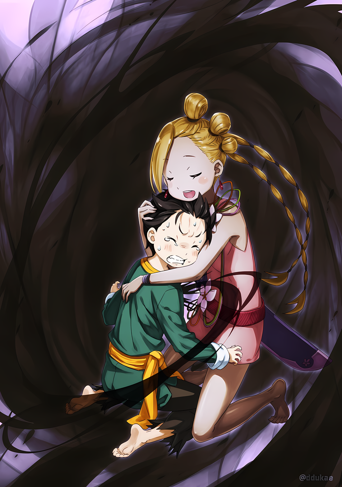

……Непонятная ситуация переполнила маленький мозг Нацуки Субару.

Ситуация была настолько шокирующей, что по-другому и не скажешь.

Не осознавая своей «Смерти», Субару вернулся в то время, когда правил балаган с Ольбартом…… даже если он не хотел этого признавать, он должен был это сделать.

Субару потерял свою жизнь и «Посмертно Возвратился» в этот момент.

Несмотря на это……,

Субару: ……Это произошло в середине игры в прятки, в которой меня не должны были убить.

Прикрыв рот маленькой ладошкой, Субару отчаянно пытался вспомнить, что произошло.

Игра в «Прятки» с Ольбартом началась, и, преодолев склонность чудовищного старика к злобе, в первой же комнате ему удалось найти шиноби, спрятавшемуся позади век.

Набравшись смелости, Субару и остальные вышли из гостиницы, чтобы определить следующее убежище таинственного старика. И вдруг мир погрузился во тьму.

Следующее, что он осознал, это то, что он снова оказался в этом месте.

Субару: ………

Абел: ……Если мы примем твое предложение, нам нужно прояснить некоторые вопросы.

Ольбарт: О, что ты имеешь в виду?

Абел: Ты сам это сказал. Если ты хочешь дать нам больше шансов на победу, не стоит оставлять слишком много места для бессмысленных усилий…… То, чего мы хотим друг от друга, должно быть четко определено.

Ольбарт: ……Какакка.

Пока Субару размышлял об этом, переговоры с Ольбартом продолжались, переходя к следующему шагу.

Следующим шагом в разговоре между Абелом и Ольбартом был выбор игры, а после этого — определение правил. Другими словами……,

Абел: ……Прятки.

Абел повторный раз сказал название их новой игры.

△▼△▼△▼△

……После этого с Ольбартом обменялись условиями игры в «Прятки».

В итоге все получилось именно так, как Субару и предполагал. Не было добавлено никаких новых условий, не было урезано никаких необходимых деталей. Неизбежно все оставалось неизменным.

Хотя……,

Субару: Чтобы быть полностью уверенным, вы только прячетесь, Ольбарт-сан. Вы не собираетесь подкрадываться и пытаться напасть на нас….

Ольбарт: Да ладно, ты слишком волнуешься, юнец. Позволь мне сказать тебе, что я хочу проверить вас на быстроту мышления и сообразительность. Если бы я хотел проверить вашу силу, я мог бы сделать это вчера в башне замка.

Субару: …………

Слова Ольбарта имели намерение успокоить его, но он не мог принять их за честные.

На самом деле, не было никаких сомнений в том, что Субару потерял свою жизнь и «Посмертно Возвратился». И самой непосредственной угрозой для группы Субару был не кто иной, как стоящий перед ними Ольбарт.

Возможно, он нарушил правило, запрещающее ему вмешиваться, и выбрал своей целью Субару и остальных?

Ольбарт: Боже правый, вы меня подозреваете, не так ли?

Ал: Ты не в том положении, чтобы тебе доверять, старик. Это довольно дерзко с твоей стороны.

Ольбарт: Какакка! Это хорошая мысль. Мы так хорошо ладили восемь лет назад, а теперь ты так холоден.

Почувствовав в молчании Субару сильное чувство осторожности, Ольбарт пожал плечами. После этого он оскалил зубастую ухмылку на замечание Ала, за которым последовала самодовольная отповедь.

Естественно, Ал, похоже, был недоволен тем, как Ольбарт с ним разговаривает, и замолчал.

Как бы то ни было……,

Абел: Ольбарт, это само собой разумеется, но твое укрытие бессмысленно, если мы не можем добраться до него физически. Не пытайся использовать свои мелкие уловки.

Ольбарт: Я понял, понял. Они ведь кучка маленьких детей, не так ли? Я бы не стал этого делать, даже если бы ты мне не сказал.

Абел отметил то же самое, что и Субару в предыдущем цикле. С согласия Ольбарта начало игры было объявлено снова.

Другими словами, будет представлена подсказка для первого места.

Ал: Итак, где ты собираешься спрятаться первый раз, старик?

Ольбарт: Сначала будет пробный вариант…… Возле этого трактира я буду прятаться «Позади век».

На мгновение Субару почувствовал неприятное напряжение в сердце, но оно оказалось ненужным.

Он опасался, что Ольбарт назначит место для укрытия, отличное от прошлого раза, но этого не произошло. Дальше все пошло по накатанной схеме, в том числе и то, что Таритта и Ал удержались от желания наброситься на Ольбарта, повернувшегося к ним достойной спиной. Они не могли сделать ничего другого, кроме как просто проводить его.

И вот……,

Ал: Что случилось, брат? Ты выглядишь немного бледным.

Таритта опустила лук по указанию Абела, и в промежутках между изучением ее профиля, Ал окликнул его. Эти высказывания шли несколько иным потоком по сравнению с предыдущим циклом.

Первоначально он бы пожаловался на разочарование от состязания с Ольбартом, но на этот раз его, похоже, беспокоил цвет лица Субару…… Или, скорее, казалось, что его беспокоило то, что Субару не разговаривает.

Это было вполне естественно. Сам Субару все еще был растерян и дезориентирован.

Поскольку он сам не мог оправиться от внезапного «Посмертного Возвращения» и его психологического шока.

Субару: Нет, виноват. Во время разговора я вдруг почувствовал…… сильную усталость.

Ал: Эйэй, возьми себя в руки, пожалуйста. Показатели моих способностей и способностей Медиум-чан понизились вдвое, потому что мы уменьшились, но в отличие от нас, твои сильные стороны должны оставаться нетронутыми, несмотря на то, что мы маленькие, верно, брат?

Субару: Мои сильные стороны….

Медиум: Конечно! Самое замечательное в Субару-чине то, что он умный! Братуха удивительный, но разве Субару-чин тоже не удивительный? Ты спокоен, хотя твоя грудь стала маленькой!

После поддержки Ала, Медиум тоже присоединилась к ним с хорошим настроением.

Держа Луис на руках, она похлопала себя по груди, ее собственная грудь теперь была меньше. Наблюдая за состоянием этих двоих, Субару испустил долгий вздох.

Эти два человека, которые подбадривали его, были правы.

Почти не было ситуаций, в которых Субару был бы полезен физически, независимо от того, стал ли он меньше. Поэтому Субару меньше всего пострадал от того, что его уменьшили.

Сейчас было не время для того, чтобы Субару затягивал свое умственное истощение.

Субару: ……Я уже говорил тебе, не смотри на меня так. Если ты собираешься продемонстрировать весь эффект маски Они, то одной только функции «Преграды Опознавания» должно быть достаточно.

Абел: Ты вернул себе часть здравого смысла. Но ты удивил меня больше, чем я ожидал. Я принял тебя за дурака, на котором эффект от этой маски остался незамеченным.

Субару: ……Я бы не удивился, если бы ты просто надел маску из-за своего эксцентричного поведения.

Подбадриваемый Алом и Медиум, Субару поднял свое лицо и послал ответный выпад прямо в Абела.

Абел, который относился к нему снисходительно и считал его бесполезным человеком, увидел, что Субару вновь обрел силы поднять голову, что, похоже, заставило его воздержаться от дальнейших сарказмов.

Тот факт, что он счел это уступкой, заставляет предположить, что коммуникативные навыки Абела не на высоте, но в данный момент не было времени обсуждать это.

Ал: Итак. Я знаю, что он сказал, что собирается сначала попробовать, но вокруг гостиницы много возможных укромных мест, чувак. Брат, у тебя или Абел-чан есть какой-то план?

С целью сдвинуть ситуацию с мертвой точки, Ал переключил свое внимание на Субару и Абела.

В качестве ответа на этот вопрос Субару мог представить первое укрытие Ольбарта…… та самая комната, в которой они разговаривали в данный момент, была тем самым местом, куда, собственно, и вернулся старик.

Учитывая, что подсказка, оставленная Ольбартом, осталась прежней, не стоило беспокоиться о том, что она изменилась.

Проблема заключалась в том, что после того, как они найдут Ольбарта, им придется выйти за пределы трактира.

Субару: Это не план как таковой, но я могу догадаться, к чему относится «Позади век».

Ал: О, серьезно? Это круто, брат.

Субару: ……Просто есть большая вероятность, что кроме этого «Позади век» появилась еще одна проблема.

Какая-то угроза настигла Субару…… Нет, не только Субару, она затронула всю их группу. И было необходимо поделиться этим с Алом, Абелом и остальными, кто не знал об этом.

Однако сам Субару получил так мало информации, что у него не было надежных идей, которыми он мог бы поделиться. Если бы можно было что-то сказать с уверенностью, то это было бы……,

Субару: Договор, который мы заключили с Ольбартом-сан… что он не будет вмешиваться, есть ли вероятность, что он его нарушит?

Абел: О? Ты хочешь сказать, что он планирует нарушить начальные условия с самого начала?

Субару: Да, я думаю, что это возможно….

Абел: ……Нет, это невозможно.

Из-за того, что на него напали, как только он вышел из гостиницы, Субару попытался привлечь внимание своих друзей к Ольбарту. Однако Абел был категорически против.

Как только глаза Субару расширились от его реакции, Абел сложил свои тонкие руки и….,

Абел: Ольбарт ничего не выиграет от такого поступка. Отныне это невозможно.

Субару: Но Ольбарт-сан даже думал об убийстве Императора! Даже ты сказал, что не думал об этом…… Если так!

Абел: Ты говоришь, о том, что понятие посмертной славы — это то, чем я не обладаю. Но я понимаю, что такая вещь существует. И что есть те, кто желает этого. Однако это и то — две разные истории.

Субару почувствовал, как его внутренние органы словно парализовало страхом.

Не было похоже, что Абел излучал особую энергию, более острую, чем раньше. Несмотря на это, ощущение, что он является мишенью, не исчезало, и дыхание Субару было нарушено.

Пока Субару боролся с этим чувством, Абел продолжил: «Ладно».

Абел: Как ты сам заметил, и согласно опровержению того клоуна в маске, у Ольбарта Дарккенна нет причин причинять нам вред. Если его цель — голова Императора, то он должен отчаянно желать ума, которым я обладаю. Для такой гипотезы нет никаких оснований.

Ал: Да, я с Абелом-чан, брат. Старик получил приказ Императора оставить нас в покое. Если он собирался нарушить это обещание, то неважно, где он это сделает — в трактире или за его пределами. Верно?

Субару: А разве……?

Ал: Брат?

Субару: О! Нет, ты прав! Да, я тоже так думаю. Это точно.

Продолжение разговора Абела и Ала привело к тому, что Субару на несколько секунд отстал в понимании.

Однако, после того, как они объяснили это в виде убедительных аргументов, Субару смог с ними согласиться.

Абел и остальные не знали об этом, но у Ольбарта была история убийства Субару и остальных.

Тем не менее, поступок Ольбарта был продиктован логическим ходом его мыслей, поэтому Субару смог согласиться с общим аргументом, представленным им. В том месте единственное, что пошло не так, — это время.

Если исходить из этого…… то, что Субару и остальных убили сразу после того, как они вышли из гостиницы, было, конечно, странным с точки зрения правил игры, на которые согласился Ольбарт.

Если Ал прав, и Ольбарт намеревался убить их, несмотря ни на что, то лучше было бы убить их еще до того, как они покинули постоялый двор, чтобы это не было заметно.

Возможно, у него было желание убить их в общественном месте, но это тоже не имело смысла.

Субару: Если бы это было так, то он хотя бы показался, верно?

Если Ольбарт хотел испортить настроение Субару и остальным из-за плохого характера, разве он не хотел бы увидеть их разочарование и отчаяние своими глазами?

Кроме этого, он не мог придумать ни одной причины, по которой Ольбарт мог бы убить всех за пределами гостиницы.

Что означает……,

Субару: Что же тогда случится…?

Медиум: Эй, эй, Субару-чин, о чем ты беспокоишься? Ты боишься выходить на улицу?

Субару: А?

Затем Медиум заглянула в лицо Субару, который замолчал, пытаясь разобраться в ситуации.

Прямо перед ним была пара круглых голубых глаз, и Субару непроизвольно отвернулся с возгласом «Вау!». В ответ на это Медиум выпустила «Вау!» и быстро схватила его за руку.

И вот….,

Медиум: Вот так, Субару-чин, успокойся, успокойся.

Субару: ……Ах.

Медиум потянула его за руку и прижала голову Субару к своей груди.

Когда она медленно гладила его спину, он чувствовал биение ее сердца на своем лбу и щеках. Ее сердце билось в ровном ритме, нежно разбивая застывшее сознание Субару.

Медиум: Когда у меня в голове полная неразбериха, я прошу братуху сделать это и для меня~. Раньше братуха тоже просил людей сделать это для него.

Субару: ……Это успокаивает меня, я чувствую это.

Медиум: Да, хорошо! Итак, мы можем остаться так, и ты расскажешь мне, что происходит, хорошо? О чем беспокоится Субару-чин снаружи?

Голос Медиум, доносившийся прямо над ним, не торопил Субару с ответом.

Субару желал быть избалованным щедростью и добротой Медиум, которые не изменились, даже если она помолодела. Но он знал, что нынешнее время этого не позволит.

Поэтому, в качестве компромисса, пока Медиум так держала его голову, он с трудом развил мысль.

Субару: Просто… Мне кажется, что за пределами гостиницы сложилась опасная ситуация…

Медиум: Там опасно?

Субару: Да, точно. Думаю, кто-то пытается нас убить….

Кивнув головой, Медиум выслушала слишком туманную мысль Субару. Честно говоря, даже он мог заметить, что заявление было слишком неубедительным и необоснованным.

Не умея лучше выразить свою мысль, он никогда не сможет убедить Абела и Ала. Например..,

Субару: На самом деле, если мы выйдем за пределы гостиницы, то там мы умр……

……В этот момент мир замер.

Субару: …………

Четкий, слышимый пульс Медиум растворился в вечности, а ее лицо и дыхание, которые были прямо перед ним, стали недосягаемыми.

Все и вся было далеко.

Цвет был потерян, звук был потерян, течение времени было потеряно, свобода двигаться была потеряна.

Он не мог двигаться. Он не мог двигаться. Он не мог двигаться. Ему не позволяли двигаться.

И тогда, когда его голос, дыхание и даже глаза лишились свободы воли, что-то отталкивающее, ужасающее, пугающее медленно вырисовывалось на краю сознания Субару.

Почему… он нарушает Табу; словно сокрушаясь об этом, соболиная тень подкрадывалась к нему все ближе.

Почему… он забыл об этом; тонкие темно-пигментированные пальцы без усилий впились в его грудь.

Почему… он повторяет это столько раз; голос «Ведьмы» донесся до него, затмевая все и вся.

«……Люблю тебя.»

Иллюстрация к **Ранобэ** Том 29 | Разукрасил DdukaE

Голос, которого не было слышно уже очень, очень давно, утащил Субару в ад.

Его сердце сжалось, и огромная боль разорвала неподвижное тело Субару в клочья. Она мучила его. Она издевалась над ним. Унизила его. ……Напомнила ему, чтобы он никогда больше этого не забыл.

А потом……,

Субару: ……Тц.

Медиум: Субару-чин?

Внезапно звук, цвет, течение времени вернулись, и он почувствовал неистовый поток крови во всем теле.

Его голова по-прежнему была прижата к груди Медиум, но он уловил не нежное биение ее сердца, а возобновление собственного кровотока и необычное, испуганное, учащенное сердцебиение.

Гнев «Ведьмы» за то, что он нарушил табу, был огромен, до такой степени, что он потерял дар речи, до такой степени, что нарушил его понимание, до такой степени, что нарушил его душу. Субару проклинал себя.

Зачем, спрашивается, он заставил себя пережить столько боли и страданий?

Он ни в коем случае не мог довериться другим о «Посмертном Возвращении».

Он не мог даже случайно заикнуться об этом в виде аналогии.

Если бы он попытался донести до кого-нибудь свои намерения, то злая рука…… «Ведьмы Зависти», окрашенная в темный цвет, преодолела бы любое препятствие и добралась бы до сердца Субару.

Не говоря уже о том……,

Субару: Это было близко….

Бормоча это, Субару проверил присутствие того, кто держал его, Медиум, и тех, кто его окружал, Абела, Ала, Таритты и Луис.

Чувство жара, поднимающееся в уголках его глаз, выражало облегчение от того, что они не пострадали. ……Признание «Посмертного Возвращения» несло в себе риск, которого больше всего боялся Субару.

Это была возможность того, что злая рука причинит вред кому-то, кроме Субару, и что, в отличие от угрозы, с которой столкнулся Субару, она не рассеет свою силу, пока не оборвет их нить жизни.

Если бы эта возможность не реализовалась и пострадает только Субару, то это был бы наилучший исход.

Конечно, несомненно, оптимальнее было бы, если бы Субару не подвергался никакой боли.

Субару: Медиум… сан… Спасибо, теперь я в порядке.

Медиум: Правда? Ты выглядишь еще более страдающим, чем раньше….

Субару: Если я один чувствую себя несчастным, это было бы лучше всего в данной ситуации.

Подняв лицо к ней, Субару высвободился из объятий Медиум. Хотя она выглядела несколько нерешительной, она не смогла больше ничего сказать по настоянию Субару.

Как бы ни ценилась ее забота, ситуация не позволяла этого сделать. И без преувеличения, факт оставался фактом: Медиум очень помогла.

Субару: Простите, если мои слова звучат странно и тревожно. Но я действительно чувствую, что на улице…… опасно. Так что

Ал: Не выходить на улицу, говоришь? Но тогда мы бы не играли в игру с Ольбартом. Конечно, всегда есть вариант не играть с ним в игру.

Субару: …………

Абел: В таком случае, у нас не будет выбора, кроме как отменить наши переговоры с Йорной Миссигр. Это путешествие было долгим, и в результате ты, клоун и Медиум уменьшились в размерах.

Ал: Ну, некоторые люди, возможно, хотели бы получить результат омоложения на всю оставшуюся жизнь, понимаешь?

В ответ на холодноватое заявление Абела он бессильно поддразнил его; однако слова Ала были полностью опровергнуты заявлением Ольбарта.

Хотя подробности были неизвестны, казалось, что «Инфантилизация», постигшая Субару и остальных, имела некоторые недостатки. Похоже, это было не простое омоложение.

Другими словами, эта «Инфантилизация», без сомнения, была бомбой.

Ал: В любом случае, я не могу оставаться маленьким. Раз уж мы решили не окружать старика и не бить его, мы должны победить в игре в прятки.

Субару: Я знаю. Я не собираюсь отказываться от игры. Просто там очень опасно. Так что….

Абел: Так что?

Субару: Ну, я хочу быть осторожным, если мы пойдем туда. И я хочу, чтобы ты верил мне, когда я говорю очень странные вещи.

Абел: …………

Субару запротестовал, глядя прямо вперед и вверх на стоящего перед ним человека.

Он видел, как сузились глаза Абела сквозь маску Они, когда тот сделал замечание. Он мог сказать, что Ал тоже был слегка озадачен.

Конечно, он не был убедителен, и ему не хватало проб и ошибок в попытках убедить их.

Таритта: Тем не менее, Субару говорит правду. Мы попали во вражескую ловушку, и это место следует считать вражеской территорией. Так что нет никакого вреда в том, чтобы повысить нашу бдительность.

Медиум: Да-да, я согласна с Тариттой-чан! Давайте будем осторожны! Если я останусь маленькой, я не смогу останавливать Луис-чан.

Луис: Ауу.

Однако Таритта и Медиум согласились с мнением Субару. Было неясно, каковы были намерения Луис, когда она крикнула в конце, но, похоже, что в этом не было никакой враждебности по отношению к Субару.

Таритта и другие, кто был с ним на одной волне, не говорили ни о чем сложном. Они просто пытались повысить собственную осведомленность о необходимости быть осторожными, потому что дополнительная осторожность не бывает лишней.

Субару не мог придумать никакой причины для нежелания Абела, кроме того, что он просто не нравился ему.

Субару: Если ты не принимаешь это, что ж, тогда я покажу тебе доказательства.

Абел: Доказательства, да?

Субару: Доказательство того, что мои идеи не стоит игнорировать. Я скажу тебе, где находится Ольбарт-сан. Я скажу тебе, где он прячется и что означает «Позади век».

Абел: Ты считаешь, что это достаточный козырь? Так или иначе, ты должен раскрыть его. Именно ты будешь страдать от того, что скрываешь это.

Субару: Уф….

Однако Абел, как ни упрямился, опроверг мнение Субару, что вызвало спонтанный стон последнего, потерявшего дар речи. Прежде чем он успел сказать что-то еще, Ал прервал его словами «Так-так»,

Ал: Абел-чан, брат сказал, что даст нам что-то, на основании чего мы сможем принять решение. На самом деле, то, что он сказал, было настолько ниоткуда, что я не могу избавиться от вопросительного знака над головой. Но это не первый раз, когда он говорит что-то возмутительное. Верно?

Абел: …………

Ал: Если ты не прислушиваешься к мнению брата, нет смысла брать его с собой. И если ты все еще собираешься сказать, что будешь его не уважать, что ж, тогда ты просто испортишь мне настроение.

Абел: Хо.

Пока Ал пытался прикрыть Субару своей спиной, они меняли позиции, и голос Ала, когда он противостоял Абелу, понизился в тоне.

Несмотря на то, что это был глубокий голос на уровне молодого парня, он был достаточно низким, чтобы изменить настроение. Взгляд Абела, смотрящего на него сверху вниз, тоже стал холодным, заставив Субару проглотить слюну.

Отношения Абела и Ала оказались гораздо более хрупкими, чем ожидал Субару, хотя до сих пор он не обращал на это особого внимания.

Изначально Ал сопровождал Субару в Город Демонов с намерением пойти вместе с ним. И, как и Субару, он был человеком, принадлежащим к Королевству Лугуника, поэтому его не слишком беспокоило возвращение Абела на трон.

Говоря прямо, это было желание госпожи Ала, Присциллы.

Поэтому у Ала лично не было причин поддерживать ни дело Абела, ни самого Абела.

Здесь это проявлялось как явная трещина в отношениях.

Физически Ал уменьшился до уровня десятилетнего ребенка, но мог ли Абел действительно победить Ала? Истинные возможности Ала в таком состоянии были ему неизвестны, и не было никакой выгоды в том, чтобы позволить этому противостоянию продолжаться долго.

Так что……,

Субару: Хватит ругаться! Ладно, я проиграл! Я сдаюсь!

Обхватив своего защитника, Ала, чтобы поставить себя впереди, Субару повысил голос.

В разногласиях между союзниками не было ничего хорошего. Для Субару было бы лучше стать плохим парнем, чем продолжать бесполезную борьбу.

Кроме того, в любом случае, он мог предупредить их.

Таритта, Медиум и даже Ал, должно быть, услышали мольбу Субару. Они будут очень осторожны, как только покинут постоялый двор.

Проблема возникнет, когда «Смерть» нависнет так, что осторожность станет недостаточной.

В этот момент Субару придется поставить свое тело на кон и что-то предпринять.

Субару: Мы не можем терять здесь время! Всем приготовиться!

Абел: ……Итак, где, по-твоему, находится «Позади век»?

Субару: Это….

В любом случае, Субару настаивал на том, чтобы они не тратили время в этом месте. Абел наконец-то положительно отреагировал на слова Субару.

Один только факт, что это привело к облегчению, многое говорил о том, что Его Превосходительство Император обладает неидеальными навыками работы с людьми.

В любом случае, Субару решил ответить честно.

Первое укрытие Ольбарта, это….

△▼△▼△▼△

Ольбарт: В следующий раз я буду прятаться получше!

Ал: Стой, старик……! Черт, он ушел!

Открыв окно в комнате, Ольбарт выскочил из трактира.

Ал поспешил за проворным стариком, но пока он добрался до окна, опытный шиноби уже давно скрылся в городской суете.

Скорость, с которой он скрылся, была просто несравненной, ей можно было только поразиться или разочароваться.

Таритта: Субару, следующее укрытие этого человека….

Медиум: Хм-м-м, Субару-чин, ты понял? Ты знаешь, что это такое?

Все развивалось так же, как и раньше; поскольку Субару без проблем нашел первый тайник Ольбарта, Таритта и Медиум оба смотрели на него с ожиданием.

Однако, к сожалению, второе укрытие…… ответ на «Пропасть с прекрасным видом» — был неизвестен.

Он не смог дать им подходящего ответа, и Медиум с остальными опустили плечи, хотя они снова собрались, следуя тому же потоку, что и в прошлый раз.

Ал: Ну, как дела, Абел-чан? Брат отлично поработал, угадав, где находится тот старик, не так ли?

Абел: Он заслуживает похвалы за свои достижения.

Ал: ……И это все?

Абел: Как обычно, у нас нет свободного времени. Мы должны выяснить местонахождение Ольбарта еще дважды. Что еще?

Ал: ……Это так.

Возможно, из-за предыдущего разговора Ал, подначивая Абела, опустил плечи в ответ.

Чувство Ала было приятным, но то, что Абел так отреагирует, было предсказуемо. Субару не помнил, чтобы в прошлый раз Абел комментировал результаты или что-то конкретное.

Да и вообще, трудно было представить, чтобы он хвалил других, а не только Субару.

В этот раз это был просто еще один поступок, не выдающий характер Абела.

Таритта: «С прекрасным видом» означает, что это, вероятно, считается высоким местом, нет?

Медиум: Но ведь пропасть — это дыра, верно? Если это дыра, разве она не должна быть в земле?

Субару: Думаю, вы оба на верном пути. Чтобы ответить на этот вопрос…… Абел, я полагаю, ты хотел пойти в место, где много людей?

Абел: …………

Таритта и Медиум предположили следующее место укрытия Ольбарта.

Чтобы продвинуть это обсуждение, Субару хотел осуществить план Абела, который не осуществился в предыдущем цикле. Согласно его воспоминаниям, Абел изначально планировал отправиться в переполненную таверну.

Как только они вышли из трактира, Субару и остальных на улице постигла внезапная «Смерть».

Говоря иначе, момент, о котором идет речь, быстро приближался.

Субару: Эй, Абел?

Абел: ――*. Твои мысли не ошибочны. Место, где много приходящих и уходящих людей…… Также было бы предпочтительно находиться в месте, где много людей.

**П.П.: обычно я заменяю эти черточки точками, но здесь даже точки не передадут его молчание.*

Ал: Место, куда люди приходят и уходят……

Субару: Место, где можно выпить…… Таверна, да?

Разговор шел в быстром темпе, и Абел кивнул в знак согласия, когда Субару использовал это слово.

И вот, как только они решили покинуть постоялый двор и направиться в таверну……,

Абел: Мы избежим передней части и выйдем через черный ход трактира.

И именно Абел, как никто другой, сказал это.

Субару ошарашенно воскликнул «Что?», когда мнения изменились. Ал и Таритта тоже подняли глаза.

Медиум: Аа? Абел-чин, значит ли это, что ты веришь в то, что сказал Субару-чин?

Абел: Нет ничего лучше, чем сохранять бдительность. Теперь, когда мы точно определили местонахождение Ольбарта, есть повод для размышлений. Но ведь это все, не так ли?

Субару: ……Ты, действительно, та еще штучка.

На эти слова Субару, пронизанные обидой, Абел лишь фыркнул в ответ.

Однако, несмотря на его надменное отношение, решение Абела было полезным для него. Субару точно так же надеялся каким-то образом привести всех к черному ходу.

Ал: Я думаю, это означает, что он намерен должным образом отдать тебе должное, брат.

Субару: ……Похоже на то. Скорее, так было всегда.

Почему-то он также сомневался в отношении Абела к «Определенному наказанию или вознаграждению».

Если он сможет понять этот аспект, это должно помочь ему получить приблизительное представление о том, как вести себя с Абелом; Субару уже должен был начать понимать его таким образом.

Это было похоже на то, как если бы он заново учился, как вести себя с Абелом.

Ал: Но я все еще ошеломлен тем, что ты смог угадать местоположение старика. Я не знаю, как ты это сделал. ……Похоже, ты читал стратегическое руководство для этого.

Субару: Стратегическое руководство, звучит чертовски ностальгически. Ну, было бы полезно иметь что-то подобное, но это не совсем то. Это был просто опыт, который пришел в игру.

Ал: Опыт? Игры в прятки?

Субару: Это похоже, знаешь. Как раньше…… Как раньше?

В то время как он отвечал на свое достижение, обнаружив, что Ольбарта пытаются разгадать, мысли Субару остановились.

Одна из причин, по которой Субару смог определить, что Ольбарт прячется в стартовой комнате, заключалась в том, что это было типичное развитие событий для поведения такого человека, как он.

Тем не менее, кто-то должен был сделать что-то похожее на это предсказуемое событие до Ольбарта.

Значит, Субару должен помнить это отчетливо.

Ал: Забылся? Забывчивость — это то, что свойственно старикам. Забавно, что, вопреки ожиданиям, хотя ты сейчас молод, ты тоже забывчив, брат.

Субару: Забывчив….

Ал: Разве не так ли? Если это был кто-то другой, то это точно кто-то близкий тебе, брат. Это не должна быть сереброволосая девушка, возможно, лоли, которая всегда была с тобой….

Субару: ……Беатрис!

Ал: Вау.

Плечи Ала вздрогнули, когда Субару поднял голову и издал мощный крик.

Но у Субару не было времени, чтобы справиться с удивлением Ала. Конечно, нет.

Субару: Хватит шутить….

Независимо от того, что он думал об этом, это было странно.

Это была Беатрис, Беатрис. Компаньон Субару, Великий Дух, одновременно красивый и милый. Подсказка к поиску Ольбарта была первой шуткой, которую она сыграла с Субару.

Если кто-то и мог поставить себе это в заслугу, то это должны были сделать Субару и Беатрис.

И все же, было невозможно, чтобы он просто позволил этому ускользнуть.

Это было то, чего не должно было случиться.

Таритта: ……Субару, Ал, пожалуйста, подойдите сюда!

Внезапно резкий голос Таритты позвал ошеломленного Субару.

Рефлекторно подняв глаза, он увидел Таритту у задней двери гостиницы, выглядывающую в щель слегка приоткрытой двери наружу. Ее лицо, увиденное со стороны, выражало сильную тревогу.

Причиной этой тревоги, вероятно, было не что иное, как «Смерть», постигшая Субару и остальных……

Таритта: ……Мы уже окружены. Их, наверное, около сотни.
