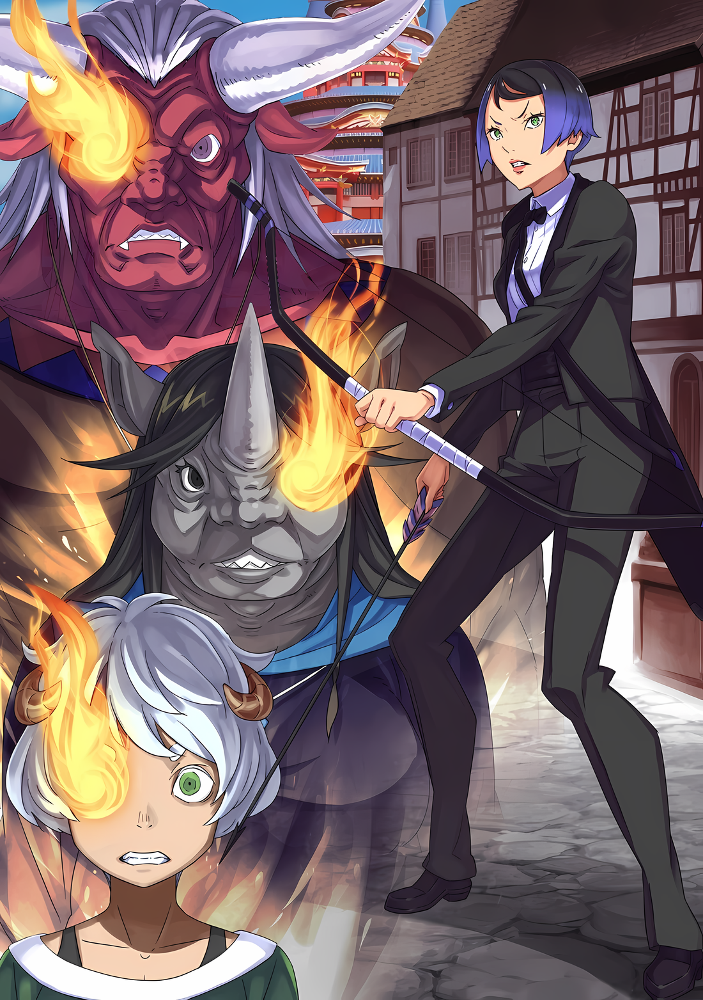

……Тигр у передних ворот, волк у задних*.

**Японский фразеологизм который гласит что за одной проблемой таится другая проблема.*

Строго говоря, его ситуация была иной, но эта поговорка пришла Субару в голову.

Тот факт, что ему потребовалось время, чтобы придумать даже это изречение, показал сложность обстоятельств Субару.

Ал: Почти сотня врагов!?

Голос Ала, выглядывающего из задней двери трактира, надломился, когда Таритта сообщила им поразительную новость.

В ответ Таритта молча кивнула,

Таритта: Да. Мы окружены. Скорее всего, из осторожности, чем из враждебности….

Абел: Конечно, один или два человека — это одно, но трудно игнорировать, когда их число приближается к сотне.

Сохраняя низкий голос, Абел обратился к Таритте, которая закрыла заднюю дверь.

Когда Таритта опустила подбородок в ответ на его слова, взгляд Абела переместился с нее на Субару. Его черные глаза сузились сквозь маску Они, его острый взгляд защемил сердце Субару.

И тогда….,

Абел: ……У тебя есть другие проблемы, помимо того, что ты окружен, не так ли?

Субару: ……А.

Абел: Вопреки всему, твои конечности уменьшились. Может случиться что угодно.

Со слабым вздохом Абел произнес это, догадавшись об аномалии Субару.

От этих слов Субару почувствовал, что его собственные щеки запылали от стыда. От осознания того, что Абел смог заметить его расстройство, а также от осознания того, что он их скрывает.

Он предпочел бы даже притвориться, что с ним все в порядке.

Однако……,

Медиум: Субару-чин, ты в порядке?

Голос Медиум, который незадолго до этого утешал обеспокоенного Субару, заставил его остановиться.

Упрямство в этой ситуации ничего не решит. Кроме того, не только Субару, но и его друзья, включая Медиум, пострадают от последствий его упрямства.

Так что……,

Субару: Вообще-то, я чувствую, что…… Моя память становится странной. Я с трудом вспоминаю вещи, которые должен помнить, и это, наверное, не очень хорошо.

Ал: ……Вот почему ты был таким странным минуту назад, а?

Субару проглотил свое разочарование и откровенно заговорил с Алом, который был поражен до глубины души.

Ал, должно быть, тоже почувствовал, что в поведении Субару есть что-то странное. Разговор о деталях заставил его тоже почувствовать беспокойство.

То, что произошло с Субару, не было чужим для Ала.

Абел: ……Что-нибудь конкретное?

Субару: ……Я не мог вспомнить имя важного члена семьи. Нет! Просто я долго не мог вспомнить.

Ал: Брат, сейчас не время притворяться, что ты в порядке….

Субару: Я не пытаюсь притворяться, что я….

Субару уже собирался рефлекторно ответить: «в порядке», но потом остановил себя, размышляя, так это или нет.

Он действительно не хотел говорить так открыто, что забыл имя кого-то столь важного. Субару вспомнил Беатрис, вспомнил Эмилию и вспомнил Рем.

Он также вспомнил друзей, которых оставил в особняке.

Субару: Так что это не то, что я пытался….

Абел: Скажи мне точно, в каком состоянии ты находишься.

Субару: А?

Абел: Ты забыл? Или тебе требуется много времени, чтобы вспомнить? Что именно?

Получив этот вопрос, Субару замялся.

Вопрос Абела, когда он приблизился к нему на шаг, был твердым и резким, не допускающим лжи.

В его мозгу возникло ощущение онемения, и он не мог отвлечься от человека, стоящего перед ним. Когда Субару замолчал, Абел снова спросил: «Что именно?».

Абел: Ты не можешь видеть, что происходит в твоем окружении, а теперь ты не можешь видеть, что происходит в своей собственной голове.

Субару: ……Н-нет! Дело не в том, что я забыл, просто мне трудно вспомнить! Правильно, если я не могу быстро вспомнить, это не значит, что я забыл!

Абел: ……Нужно время, чтобы вспомнить, ха?

Субару быстро ответил на жестокий вопрос, и Абел спокойно принял его слова.

Это было объяснение, которое Субару и сам не знал, как понимать. Поэтому было удивительно, что Абел не отверг его.

На самом деле, раздосадованный поведением Абела, Ал вмешался со словами «Эй»,

Ал: В чем разница? Почему для тебя это имеет большое значение в данной ситуации?

Абел: На самом деле есть большая разница. Она выражается в том, что можно забыть, и тем, что можно с трудом вспомнить.

Ал: А?

Ал недовольно скривился, но Абел не стал отвечать дальше.

Он оглянулся на Таритту, прислушивающуюся к тому, что происходит снаружи, оставив недоумевающих Субару и Ала наедине со своими мыслями.

Абел: Что происходит снаружи? Они еще не двигаются, верно?

Таритта: Пока что они просто затаили дыхание. Хотя нас наверняка уже окружили.

Абел: Тогда это означает, что мы не выполнили их требования.

Таритта: Требования, это……?

Абел задумчиво погладил подбородок, не отвечая на озадаченный взгляд Таритты, а затем снова посмотрел на Субару.

Не в силах угнаться за скоростью своих мыслей, Субару вздрогнул, когда Абел обернулся. Он приблизил свое лицо к лицу Субару и спросил:

Абел: ……Что нам делать с теми, кто хочет напасть на нас снаружи?

Субару: Ээ……

Абел: Отвечай. Условия, при которых те, кто снаружи нападут на нас….

Субару: Т-так, даже если ты спросишь меня….

Вопрос был повторен через маску Они, и Субару перевел дыхание, напрягшись.

«Я не знаю этого, даже если ты спросишь меня», — подумал он. Во всяком случае, даже если он и помнил, что произошло до его «Посмертного Возвращения», это была настолько внезапная и неожиданная «Смерть», что он не мог ее понять.

Если бы только у него было больше информации, он смог бы подсказать Абелу, что делать.….

Абел: Отвечай.

Однако Абел растоптал нерешительность и замешательство Субару, задав ему вопрос. Поскольку Субару не смог ответить, человек в маске Они схватил его за молодые плечи в порыве ярости.

Абел: Отвечай! Нацуки Субару!

Субару: Я не знаю! Как только мы выйдем на улицу, они нападут на нас! Это все, что я знаю!

Отвечая на угрозу, Субару открыл глаза и схватился за грудь.

Он снова импульсивно раскрыл информацию, которую получил через «Посмертное Возвращение». Он боялся, что наказание за нарушение табу может вернуться и преследовать его. Но ничего не произошло.

Ни остановка времени вокруг него, ни злая рука, заставившая его заплатить за свою глупость, не проявились.

Но вместо этого……,

Луис: Уу!

С рычанием встав между ними, Луис защитила Субару, повернувшись к нему спиной, и посмотрела прямо на Абела, который занял жесткую позицию.

Луис оттолкнула руку его от плеча Субару, послав ей неодобрительный взгляд. Однако вскоре к ней присоединилась обнадеживающая союзница, Медиум.

Медиум: Абел-чин! Не задирай Субару-чина! Я расскажу братухе!

Абел: ……Что я должен делать, когда мне так говорят? В первую очередь, он просто давал мне необходимую информацию. ……Выход на улицу — это спусковой крючок, да?

Абел пожал плечами в ответ на укоризненный взгляд Медиум, даже не почувствовав угрызений совести.

Его задумчивое выражение лица заставило Медиум сказать: «Ну и дела!», когда она положила руки на бедра, устремив свой взгляд на Субару, а не на Абела.

Медиум: Субару-чин, ты в порядке? Абел-чин был таким страшным, не так ли~?

Субару: Не то чтобы я испугался. Я просто был немного удивлен…… Да.

Медиум: Правда? Надеюсь. Ты сильный мальчик, сильный мальчик, Субару-чин.

Когда она говорила это, рука Медиум нежно поглаживала черные волосы Субару.

Доброта ее прикосновений и то, что его хвалили как «сильного мальчика», заставили его снова почувствовать стыд. Но на самом деле он не мог отрицать, что его колотящееся сердце постепенно успокаивается.

Ему казалось, что он действительно теряет контроль над собой.

Облегчение, которое он испытывал от того, что его утешала Медиум, осталось в стороне, более тревожными были невыразимые чувства нежелания и страха, которые он испытывал по отношению к Абелу.

Он не мог сопротивляться воле Абела, и поэтому его продолжали толкать.

Это было похоже на……,

Ал: Как будто один взрослый, а другой — ребенок. И я говорю не только о внешности.

Субару: У….

Голос Ала раздался рядом с опущенным лицом Субару, когда тот схватился за грудь.

Лицо Субару напряглось, так как он почувствовал, что его осуждает Ал, чей тон голоса был суровым, все еще не отошедшим от его предыдущего разговора с Абелом.

Благодаря его словам, «ребенок и взрослый», сомнения Субару рассеялись.

Да, Ал был прав, это был подходящий способ описать это. На самом деле, нынешнее взаимодействие между Субару и Абелом было похоже на динамику власти между ребенком и взрослым.

Не только внешне, но и мысленно, как будто второго тянет за собой первый.

Абел: ……Слушайте. Кажется, я знаю, против кого мы выступаем.

Таритта: В-вы серьезно……!?

Пока Субару испытывал непостижимое чувство ужаса, Абел заговорил низким голосом.

Слова Абела заставили глаза Таритты расшириться от удивления. Потрясены были и другие. Точнее, все, кроме Луис, которая не следила за разговором.

В любом случае, Абел привлек всеобщее внимание и кивнул головой, сказав «Да».

Абел: Исходя из условий, представленных Ольбартом, и сотни врагов, указанных Тариттой… Если мы исключим те возможности, которых не может быть, то, естественно, сузим круг вариантов.

Ал: Итак, что ты думаешь, о умный Абел-чан? Кто нас преследует?

Абел: ……Это Хаосфлейм

Ал и Медиум: Хаосфлейм…… этот город?

В ответ на вопрос Ала и Медиум, Абел мрачно кивнул.

Затем он посмотрел на Субару и остальных, по выражению лиц которых было видно, что они все еще не поняли его ответа, и продолжил,

Абел: Хаосфлейм…… То есть, жители Города Демонов. Те, кто стоит снаружи, готовые напасть, я уверен, что это те самые люди, живущие в этом городе.

△▼△▼△▼△

……Абел четко заявил, что жители Хаосфлейма — враги.

Субару: …………

На заявление Абела, Субару открыл и закрыл рот в недоумении. ……Нет, не только Субару, но и Ал, и остальные тоже проявили свое удивление.

Это было естественно. Учитывая, что им внезапно сообщили, что жители города ополчились против них.

Ал: Ты уверен, это не может быть правдой. Что натолкнуло тебя на эту мысль?

Абел: Это вполне естественная мысль. Во-первых, есть лишь ограниченное число людей, способных мобилизовать силы в сотню человек, чтобы окружить постоялый двор. На данный момент есть только два варианта…… Группа Императора и силы Города Демонов. Однако, Чиша замаскирован под меня. Более того, он не имеет права делать то, что я бы не сделал.

Ал: Чтобы другие не узнали, что он не Абел-чан. Так чего бы ты не сделал?

Абел: Нагло отправил бы свои войска в Город Демонов.

Субару почти кивнул на это убедительное заявление, но он не мог решить, была ли это окончательная информация или нет. Если сто воинов будут сопровождать Императора, это будет слишком много или слишком мало?

Он не считал это странным, если бы их было так много.

Медиум: Я не очень в этом разбираюсь, но сколько солдат в замке Абел-чина?

Абел: Ты спрашиваешь о численности войск в Имперском городе? Если да….

Когда Медиум подняла руку, чтобы задать вопрос, Абел взглянул на Субару. Тот не мог понять значение его взгляда; Абел коснулся лба своей маски Они, и после минутного раздумья сказал,

Абел: Какие-то ничтожные тридцать тысяч. Но этот разговор не о силах, находящихся под его командованием. Император позволит им сопровождать его или нет — вот тема этого разговора. И….

Таритта: Настоящий Император никогда бы так не поступил.

Абел: Именно это я и имел в виду.

Абел кивнул головой. Он отрицал возможность того, что лжеимператор принял такое необдуманное решение.

Субару чувствовал, что существует вероятность того, что другая сторона могла быть неосторожной, но он держал рот на замке. Его бы не послушали, даже если бы он это сказал.

В любом случае……,

Абел: Император объявил, что нас запрещено трогать, и Ольбарт проявил подход, соответствующий этому приказу. В этом случае посылать на нас войска не имеет смысла.

Ал: ……А как насчет теории типа: он не сам это сделал, или что-то в этом роде?

Абел: Теперь я спрошу тебя, веришь ли ты, что я когда-нибудь допущу такую линию рассуждений?

Таритта: Я так не думаю.

Синхронно с ответом Таритты, Ал так же опроверг его, покачав головой в маске.

Пока фальшивый Император маскируется под Абела, его образ мыслей должен быть таким же, как у Абела-Императора. Другими словами, то, чего Абел не мог допустить, так же не мог допустить и фальшивый Император.

И поэтому ему придется продолжать притворяться, что он очень узок в своих взглядах.

Абел: Кафма Ирулюкс не допустит этого, даже если попытаться его образумить. Он непреклонен. И поэтому он ценный сотрудник, но я уверен, что Генерал Второго класса Кафма не одобрил бы эту кривую интерпретацию.

Субару: Кафма…… Это тот самый прямодушный парень, которого мы видели вчера?

Абел: Он может быть кротким по отношению к Императору, но даже против Генерала Первого класса он выскажется без колебаний. Даже хитрость Ольбарта не сможет поколебать принципы Кафмы.

Ал: У этого маленького брата столько власти?

Абел: В свое время его прочили на повышение до одного «Девяти Божественных Генералов». По разным причинам он отказался от этого.

На его ответ, Ал издал разочарованное «Уф».

Если это правда, то вчера в замке присутствовали два человека класса «Девяти Божественных Генералов»…… Нет, три, поскольку фальшивый Император был одним из них.

Это действительно может быть более надежной рабочей силой по сравнению с привлечением неквалифицированных войск.

Субару: Но если фальшивый Император не враг, тогда….

Естественно, гипотеза, предложенная Абелом, становилась все более реалистичной.

Другими словами, жители Города Демонов Хаосфлейм были теми, кто ждал их снаружи, а лидер, который заставил их двигаться, был….

Медиум: Ты хочешь сказать, что Йорна-чан заставила их напасть на нас?

Ал: ……Трудно подумать о ком-то другом, не так ли? Нет никого другого, кто бы знал о нас и имел веские причины напасть с самого начала.

Субару: ……Что думает Абел?

Кто-то в Городе Демонов Хаосфлейм, кто мог бы использовать его жителей в качестве пешек; естественно, первым человеком, который пришел на ум, была Йорна Миссигр, правительница Города Демонов.

Однако, возможно ли, что именно она, будучи такой же непредсказуемой, как Ольбарт…… Нет, возможно, даже более трудно предсказуемой чем он, была организатором всей этой ситуации?

В ответ на подозрения Субару, Абел постучал пальцем по лбу своей маски Они,

Абел: Это нелепо.

И его ответ был краток.

Субару: Нелепо? Это значит, что ты не согласен? Почему?

Абел: Было бы гордыней верить, что если спросишь, то получишь ответ на все. ……Письмо.

Субару: Письмо?

Абел ответил на вопрос Субару, добавив ненужное предложение.

Письмо было посланием, которое они доставили Йорне в предыдущий день. Доставка этого письма была целью предыдущего визита и должна была стать причиной сегодняшнего вызова.

Однако Абел не рассказал им подробно, что именно он написал в письме.

Абел: В письме я написал, что вознагражу ее тем, чего она желает.

Ал: То, чего желает девушка…… Другими словами, должность Императрицы?

Медиум: Стать твоей женой?

Как только Абел назвал содержание послания, Ал и Медиум моментально высказались.

Как им и было сказано накануне, Йорна хотела «Императора». Не обязательно Абела, главное чтобы был «Статус Императора».

Так что если это правда, что он написал, что даст Йорне то, чего она жаждет, то так оно и должно быть.

Субару: Как, черт возьми, ты решил передать что-то подобное в письме?

Абел: Не приуменьшай проблему, используя свои собственные стандарты. Что бы там ни было, она добьется того, чего желает. Поэтому нас и вызвали в замок. Нелогично, что, несмотря на это, она направила свои силы против нас.

Ал: Ах~, что если она так ненавидит быть женой Абела-чан, что хочет убить его….

Или, возможно, письмо было настолько грубым, что она захотела убить их.

Субару подумал, что есть очень большая вероятность того, что он будет относиться к той, на ком собирается жениться, напыщенно, потому что лично он вел себя именно так.

Но Абел посмеялся над этой идеей Субару и остальных.

Абел: Что она должна делать, то и будет делать. Эмоции вторичны. Она не такая, как Присцилла.

Ал: А я-то думал, что эта девушка такая же проблемная, как и принцесса!

Субару согласился с этим. Присцилла и Йорна обе были устрашающими.

Он боялся и Присциллы, и Йорны, но он чувствовал, что Абел прав, потому что это было сказано с такой убежденностью. ……Также, он вспомнил свои воспоминания о Йорне с предыдущего дня.

«Йорна: Как Леди Города Демонов, я не буду говорить неправду в присутствии своих слуг.»

Так сказала Йорна, ее слова прозвучали с завораживающей улыбкой по поводу письма, которое Субару и остальные вручили ей, и обещанием, что она не выбросит его, не прочитав.

После этого Субару и остальные ввалились в конюшню, и тогда Танза, её слуга, заявила, что Йорна узнала Субару и его спутников.

По крайней мере, Субару не считал ее женщиной, которая по своему желанию может изменить свои прежние заявления.

Он так не считал, поэтому хотел верить словам Абела.

Таритта: В любом случае, те, кто снаружи, сейчас должны проявлять нетерпение. Что нам делать?

Наблюдая за происходящим снаружи, Таритта расспрашивала их о дальнейших действиях.

Абел говорил о спусковом крючке для нападения…… то есть об условиях, которые заставят другую сторону напасть на них, но пока они могли только догадываться, что это будет выход наружу. Но поскольку другая сторона была готова напасть на них, они не знали, когда у них получится прорваться внутрь.

Кроме того, Субару и остальные были заняты игрой в «Прятки».

Субару: Даже если мы знаем, что существа снаружи собираются ворваться, мы ведь не сможем просто не уйти, верно?

Ал: Ну, если только старик не переиграл нас и не спрятался в гостинице во второй раз… На всякий случай, может, нам стоит еще раз осмотреть комнату?

Абел: Я бы подумал об этом, если бы у нас не было подсказки: «Пропасть с прекрасным видом».

Абел отмахнулся от него, и Ал разочарованно повесил голову.

На самом деле, Субару пришла в голову мысль, что Ольбарт снова будет прятаться в первой комнате. Но сколько бы он ни думал об этом, он не мог связать это с «Пропастью с прекрасным видом». Поэтому он не стал затрагивать эту тему.

Тем временем, курс действий их группы был завершен.

Конечно, не было другого выбора, кроме как отправиться в путь. Вопрос был в том, какую стратегию они должны использовать, чтобы этот вариант сработал?

Абел: ……Таритта, привлеки их внимание.

Субару: Абел!?

Мгновение спустя Абел дал, казалось, самую жестокую инструкцию из всех.

Услышав это, щеки Таритты затвердели, а Субару пронзительным голосом окликнул Абела. Но тот проигнорировал голос черноволосого мальчика, не сводя взгляда с Таритты, и продолжил,

Абел: Подними шум и привлеки внимание тех, кто снаружи. А мы тем временем улизнем.

Ал: Абел-чан, лучшим, понятным планом было бы….

Абел: Его нет. Это лучшее, что мы можем придумать с имеющимися у нас картами. Если бы ты не уменьшился, мы могли бы найти другой способ.

Субару: Это заходит слишком далеко!

Луис: Ауу!

Абел отмахнулся от беспокойства Ала за безопасность Таритты.

Наряду с Субару, огрызающимся на него за его жестокость, Луис также высказала свое праведное негодование. Однако, не смотря на реакцию Субару и остальных……

Таритта: Да, понятно. Я привлеку внимание группы снаружи.

Субару: Таритта-сан! Неважно, что ты об этом думаешь……

Покачав головой, Таритта была готова принять безрассудные инструкции Абела.

Субару хотел найти лучший метод, который мог бы обеспечить ее безопасность. Однако в данный момент Субару приходили на ум только две вещи: осторожность и тревога перед очень опасными врагами снаружи.

Абел: Таритта, подай мне этот груз. Он нам понадобится позже.

Таритта: Вот он. Как только я полностью завладею их вниманием, воспользуйтесь случаем и сбегите. Однако, я не думаю, что у меня будет возможность подать вам сигнал….

Абел: Я позволю Медиум решить это.

Медиум: А, я?

Абел принял груз, который несла Таритта, его стройная фигура держала сумку на плечах. Когда он продолжил приготовления, Медиум, которую назвали по имени, расширила глаза.

Повернувшись к ней лицом, Абел кивнул, сказав «Да»,

Абел: Уменьшенная или нет, у тебя все еще есть глаза, чтобы следить за возможностью. Из всех ты самая компетентная.

Медиум: Хммм, понятно. Я буду внимательно следить! Так что будь осторожна, Таритта-чан.

Таритта: Да.

Обсуждение шло бешеными темпами, оставляя Субару позади.

Если отбросить Абела, у Медиум и Таритты были стальные нервы. Особенно у последней, которой доверили самую опасную роль.

Таритта: Итак, я пошла.

Сжимая лук, Таритта положила руку на заднюю дверь. Столкнувшись с ней спиной, Субару не мог не крикнуть: «Таритта-сан!»,

Субару: Эм, не умирай……!

Таритта: …………

Он был отвратителен сам себе за то, что сказал что-то настолько очевидное и обескураживающее. Если он не мог предложить никаких полезных мнений или стратегий победы, он должен был хотя бы сказать что-то, что подняло бы боевой дух Таритты.

Но все, что он мог предложить, — это дрожащая мольба. ……Но глаза Таритты слегка расслабились,

Таритта: Да, ребята, увидимся позже.

С тонкой улыбкой тело Таритты вылетело наружу, как пуля.

Прямо перед этим Абел бросил последние слова в спину Таритты, когда она направлялась на вражескую территорию.

Ими были……,

Абел: Таритта, не нужно сдерживаться. Не щади никого. ……Неважно, кто они, в этом городе нет людей, которых легко убить.

Это был зловещий совет, который нельзя было назвать ни ободрением, ни выигрышной стратегией.

△▼△▼△▼△

……Как только она вышла на улицу, враждебность стала нарастать с бешеной скоростью.

Ощутив ее на своей смуглой коже, Таритта сузившимися глазами просканировала все вокруг слева направо.

Для «Племени Судрак», которые жили в джунглях как охотники, умение мгновенно ориентироваться по местности и в ситуации было необходимым навыком. Таритта не была исключением.

……Ведь Мизельда, ее сестра, доверила Таритте роль вождя.

Поэтому Таритта должна была преуспеть в этих навыках больше, чем ее собратья-судракийцы. И действительно, она так и сделала.

Таритта: ……Ах.

С легким вздохом, зародившимся в глубине ее горла, Таритта оценила количество враждебных сил, направленных на нее.

Вокруг нее было около сотни людей, готовых сражаться, но менее двадцати из них направили свою враждебность на Таритту, которая поспешила выйти через заднюю дверь.

Кроме того, число способных быстро передвигаться среди них было еще меньше.

Первым делом следовало бы ухватить за ноги тех, кто повернулся, чтобы……,

Таритта: ……Ничего хорошего.

В ее голове промелькнул совет, данный Абелом незадолго до того, как она вышла, — не щадить никого.

Абел был гордым, симпатичным мужчиной. Он отвечал всем требованиям вкуса Мизельды к мужчинам, и Таритта не умела с ним обращаться. Она была слаба к давлению и без сопротивления плыла по течению. К тому же, столкнувшись с человеком с таким характером, как у ее сестры или Абела, она не смогла бы высказать ни одного своего мнения.

Поэтому Таритта предпочитала тех, кто ее слушал. В частности, потому, что ей требовалось время, чтобы прийти к какому-то мнению, и она не любила, когда ее торопили.

С этой точки зрения Флоп, оставшийся в Гуарале, был вполне……,

Таритта: ……Тц, о чем я думаю?

Покраснев от стыда, Таритта натянула тетиву, словно желая выпустить воздух.

Мгновение спустя из лука были выпущены стрелы…… три, одновременно. У Таритты проявились навыки стрельбы из лука: каждая стрела была нацелена на разную добычу.

Одна стрела летела прямо, а две — по кривой, рассекая ветер в переулке возле трактира, и пронзая свои цели.

Трое мужчин, повернувшихся лицом к мчащейся Таритте и попытавшихся шагнуть к ней, получили пули в шею и грудь соответственно, мгновенно лишив их боевой мощи.

Таритта: Охота — это хорошо.

Это устраивало Таритту, потому что ей не нужно было ни с кем разговаривать.

Добыча не ожидала, что Таритта заговорит, да она и не хотела с ними общаться. Единственный диалог, который произошел, был диалог ее стрел и их встречи с врагом.

Но даже в этом случае результат, названный жизнью и смертью, не обязательно должен быть получен в конце разговора.

???: ……ООО!

С ревом несколько теней бросились в переулок, сменив простреленных мужчин.

Первое, что попало в поле зрения Таритты, был человек-бык; его тело было настолько массивным, что, чтобы рассмотреть его, ей пришлось поднять голову. Человек с короткими, толстыми рогами на макушке головы яростно использовал свою раму для атаки, издавая при этом боевой клич.

Прямой лобовой удар раздробил бы каждую косточку в тонком теле Таритты.

Однако у нее не было возможности убежать ни назад, ни в сторону. Даже если она прыгнет вверх, велика вероятность, что ее схватят за ноги.

Помня об этом, Таритта пригнулась и бросилась вперед.

Человек-бык: Чт…!?

Возможно, потому что эти действия были неожиданными, глаза человека-быка расширились, а горло сжалось. Таритта протянула ноги к морде человека-быка и использовала их как опору, ударив его по рылу.

Согнув колени, чтобы подавить импульс, Таритта с легкостью вращалась в воздухе, используя в качестве опоры лицо человека-быка, из носа которого хлестала кровь. Затем, сделав полуоборот, она приняла перевернутое положение в воздухе.

Таритта: …………

Покрутившись, она получила обзор в три-шестьдесят градусов, включая область позади себя, которую она не могла видеть раньше. Она смогла оценить тени зданий, крыши и строительные леса, имеющиеся в городе, и даже тех, кто пытался атаковать ее с этих позиций.

Таритта: Этих стрел будет недостаточно.

Сказав это, она вытащила стрелы из колчана на спине, наложила их на лук в головокружительном темпе и трижды выстрелила в быстрой последовательности, чтобы уменьшить число врагов.

Количество стрел было непропорционально количеству врагов, которое она оценила. Не имея другого выбора, кроме как уничтожить врагов с наивысшим приоритетом, Таритта использовала свою многолетнюю интуицию, чтобы выбрать тех, кто обладает наибольшими способностями.

Не обращая внимания на неприятное чувство, которое она испытывала при виде тех, кто попадал в поле ее зрения……,

???: УУАААА……?!

Яростные стрелы пронеслись по воздуху подобно урагану, и те, кого пронзили насквозь, разлетелись от удара.

Следуя совету Абела, Таритта атаковала около тридцати врагов безжалостными ударами по жизненно важным органам, целясь в грудь и шею каждого, а также в глаза и рот тех, кого могла, надеясь нанести смертельную рану.

Однако уже после первого боя у нее закончились стрелы.

Единственное, что она могла сделать сейчас, это вернуть стрелы, которые были использованы, и продолжать служить приманкой как можно дольше……,

Таритта: ……Это немного неожиданно

Направившись за стрелой к поверженному врагу, Таритта остановилась.

Таритта, как воин Судрак, за свою жизнь убила бесчисленное множество зверей. Даже если форма зверя была несколько иной, реакцию существа на пробитую жизненно важную точку можно было наблюдать в момент выстрела из ее лука.

Основываясь на этом опыте, она была уверена, что посеяла жизни тех, в кого стреляла.

???: Гуаггхх

И все же, никто из тех, кто стонал и поднимался на ноги, не погиб.

Даже если они не погибли, они должны были быть на грани смерти. Однако те, кто встал, смотрели на Таритту глазами, в которых не было ни малейшего желания сражаться, не говоря уже о том, что они были на грани смерти.

В этих глазах, смотревших на Таритту, произошла перемена.

Таритта: Что это… такое?

Таритта нахмурилась и спросила человека-быка, когда тот встал. Мужчина не ответил, но перемена, произошедшая с ним, была настолько чуждой, что привлекла ее внимание.

……Алое пламя охватило его правый глаз.

Человек-бык: …………

Те, чьи зрачки пылали, не ограничивались только человеком-быком.

Все, кто упал после выстрела Таритты, смотрели на нее с алым пламенем в одном из глаз, будь то правый или левый.

Те, чьи глаза горели, не ограничивались только теми, в кого стреляла Таритта.

У тех, кто пришел на место происшествия позже и окружил Таритту, в глазах тоже было алое пламя. Мерцающее пламя, которое жгло, разбрасывая искры.

И что удивительно, пламя, подобное этому, сжигало и исцеляло раны человека-быка.

Иллюстрация к **Ранобэ** Том 29 | Разукрасил NorvakKK

Разбитый нос человека-быка и раны от стрел тех, кто был прострелен насквозь, были полностью исцелены.

Таритта: ……Нескольких слов было недостаточно, Абел.

Сцена и совет Абела сошлись воедино, и Таритта вздохнула.

Хотя она не знала наверняка, ей показалось, что Абел тщательно предвидел эту ситуацию. Если это так, то он должен был постараться сделать свои слова более понятными.

И так далее, желала ее голова, которая думала исключительно об удобных вещах, таких как «мне не подходит тот, кто торопит разговор».

Однако……,

Таритта: Моя роль — быть приманкой, а не уничтожать врага.

Таким образом, с точки зрения сосредоточения на своей роли, можно было сказать, что она работает хорошо.

И затем….

Таритта: ……Похоже, они ломают стрелы.

Стрелы, пробившие их насквозь, ломались одна за другой, выскальзывая из их тел. Наконечники стрел, которые она должна была достать, были потеряны, и Таритта не могла использовать свои навыки стрельбы из лука.

Однако было бы ошибкой думать, что это не оставит ей выбора.

Таритта: Для охоты можно использовать как кинжалы, так и метательные камни.

Сказав это, Таритта низко опустилась и взяла в руки кинжал, который она спрятала внутри своего официального платья, и лук, стрелы для которого, она потеряла.

Битва Таритты за исполнение своей роли началась только сейчас.

△▼△▼△▼△

Субару: ……Кх, Таритта-сан, потрясающе…!

Голос Субару дрожал, пока он бежал, при виде людей, чьи глаза и раны пылали.

Таритта была послана для ожесточенной борьбы, но ее мастерство было намного выше воображения Субару.

По правде говоря, можно сказать, что Субару недооценил способность Таритты быть эффективным членом Судрак, учитывая ее замкнутый и тихий характер, как у позднего цветка.

Незадолго до этого он также видел, насколько беспомощной она была против Ольбарта.

Конечно, поскольку Мизельда выдвинула ее на пост следующего вождя, он знал, что между ней и Куной или Хоули не будет разрыва в способностях.

Но точность ее прицела, скорость выстрелов и то, как она могла справиться с огромным количеством людей, заставляли думать, что она может быть не хуже, а то и лучше Мизельды.

Субару: Но все же….

Даже оценивая высокий уровень мастерства Таритты, трудно было отделаться от странности этих нападавших.

Прежде всего, странным был их внешний вид. Ведь никто из них не носил доспехов и не имел никакого оружия. Они были безоружны.

Судя по всему, они были почти такими же, как и многие люди, мимо которых они проходили с предыдущего дня в Хаосфлейме…… это были просто еще одни жители Города Демонов с внешностью, которая несколько выделялась.

Эти люди окружили Субару и остальных, и, оказавшись на другом конце трансцендентной техники Таритты с луком и стрелами, они выстояли, несмотря на смертельные ранения.

Издалека было видно, что среди нападавших были женщины и дети, и Таритту, должно быть, беспокоило, что они не были группой сильных воинов.

Ей удалось привлечь к себе внимание, и по сигналу Медиум Субару и остальные выбежали в город. Но должны ли они действительно бежать и не поддержать Таритту?

Не зная, как правильно поступить, эти варианты все время крутились в голове Субару.

Рядом с Субару, Абел, неся на спине сумку, наблюдал ту же сцену.

Абел: Значит, действительно, весь город охвачен «Техникой Брака Душ*».

**На японском «Техника Брака Душ» произносится как «Конкон».*

Ал: Конкон……? Эйэй, Абел-чан, что это такое?

Абел: Это механизм коллектива, который, не отступая, противостоит Таритте.

Ал, который бежал в оцепенении, задал вопрос, на который Абел дал неадекватный ответ.

Хотя Субару никак не мог взять в толк, что происходит, одно было ясно. ……Абел догадывался о связи между этими горящими глазами и нападавшими.

Субару: Абел! Не держи от нас секретов! Расскажи нам все!

Абел: ……Это одно из якобы утерянных тайных искусств, о которых говорится в древней литературе. Оно называется «Техника Брака Душ»; если поделиться частью своей души с другими, к ней добавляется ценность.

Ал: Я не понимаю! Что это значит?

Абел: Говоря иначе, души, объединенные с помощью «Техники Брака Душ», делятся частью своей силы. А в этом городе всего один обладатель «Техники Брака Душ»….

Подгоняемый с двух сторон Субару и Алом, Абел дал им максимально сокращенный ответ.

Несмотря на это, Субару было трудно понять его содержание, но, так или иначе, ему удалось уловить нюансы.

Другими словами……,

Абел: ……Это значит, что все окружение, что составляет этот Город Демонов, разделяет силу Йорны Миссигр. Поэтому этот город — земля, которая не падет так просто сколько бы армий вы ни направили против него.
