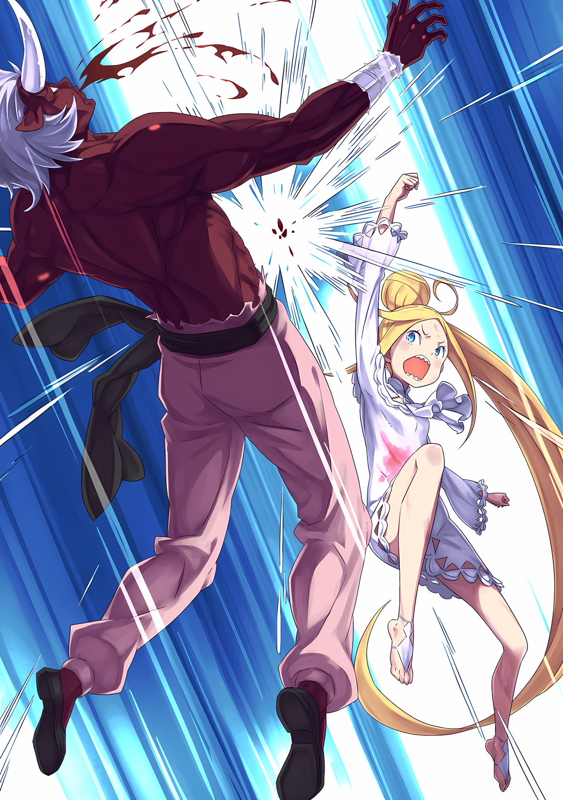

Луис: ……~кх.

Кружась и вертясь, маленькая фигурка взвилась в воздух со слабым криком.

Девочка медленно оттолкнулась от земли, ее импульс не ослабевал, и она несколько раз пролетела по направлению к краю улицы. Столкнувшись с каркасом палатки, ткань которой порвалась, она с пронзительным криком подмяла под себя тело девушки.

Субару безмолвно наблюдал за этим зрелищем.

Он не мог оправдываться тем, что не в состоянии понять, что произошло в считанные мгновения.

Даже если он и не успел протянуть руку, все, что произошло за несколько мгновений, было запечатлено в его черных зрачках.

Недолго думая, он бросился бежать по опасной улице.

Как обычно, он был замечен врагом и оказался в опасности, Ал и Медиум получили ранения, пытаясь спасти Субару, и в том же темпе……

Субару: …Луис.

Луис, которая стояла перед Субару и защищала его, раскинув обе руки, была смята, как шарик жвачки.

Ответственным за это был молодой человек-бык, среди его белых волос росли рога. Его руки были стройными, не слишком отличались от рук Субару, но подбросили Субару почти на десять метров в воздух.

Луис прямо перехватила один взмах руки юноши, после чего была отброшена в сторону. Он заметил, как разлетелась ее кровь, так что он не мог считать ее целой.

Человек-бык: Извини.

Субару посмотрел на Луис, которая была погребена под обломками палатки. Его барабанные перепонки дрожали от нечленораздельных извинений, а в поле зрения Субару отражалась фигура юноши, снова поднявшего руки вверх.

Он не мог сделать ничего настолько ловкого, чтобы уклониться.

Начнем с того, что конечности самого Субару были искалечены из-за падения с большой высоты, так что он даже не мог нормально двигать своим телом.

Поэтому, несмотря на то, что Луис защищала его и все остальное, это оказалось бесполезным…,

Медиум: ……Субару-чин!!!

Субару: А.

Медиум: Встань!!!

Тень прыгнула к нему с поразительной скоростью и впечатала свои длинные ноги в плечи юноши.

Когда юноша отступил назад, выражение его лица было удивленным, оказалось, что в это место врезалась Медиум, ее длинные золотистые волосы развевались. Ее лицо окрасилось в красный цвет, и она приказала Субару встать.

Субару, который упал на землю, дрожал.

Медиум: Позаботься о Луис-чан!

И все же, не получив ни ободрения, ни утешения, Медиум обратилась к Субару и пустилась в спринт.

Она попыталась преследовать юношу, орудуя единственным мечом, который у нее был, обеими руками, движениями, которые казались танцем, хоть и совершенно не похожими на крутые, в которых была вся ее жизнь.

Юноша тоже сделал решительное выражение лица, казалось, удивляясь скорее ее духу, чем силе.

Субару: Гхх, ууу…!

В то время как Медиум упорствовала, Субару использовал свои дрожащие конечности и сделал все возможное, чтобы встать. После этого он бросился к палатке, под которой была раздавлена Луис.

Убирая одну за другой части рухнувшей конструкции, он попытался извлечь Луис, оказавшейся под обломками.

Субару: Луис, Луис! Как ты! Эй, Луис!

Отчаянно зовя, Субару снова почувствовал тепло в глазах.

Это неприятное тепло, казалось, с самого начала с нетерпением ждало своего часа, чтобы появиться изнутри лица Субару. Не обращая на него внимания, торопливо и поспешно он убирал обломки.

И……,

Луис: …Уу.

Субару: Луис!

Раздался слабый стон, и Субару обнаружил форму Луис, измазанную пылью и обломками.

Оказавшись погребенной под сломанной палаткой, Луис свернулась в пространстве, образованном упавшей скобой, и едва сумела не оказаться под ней.

Это принесло облегчение. Но за облегчением мгновенно последовала огромная тревога.

Субару: Я не могу, двигайся сюда…

Упавшая скоба была толщиной с торс Субару и отказывалась двигаться, как бы ее ни толкали или тянули. Даже используя «Принцип рычага», он не смог найти подходящий вес для равновесия.

И пока он искал способ вытащить Луис, он наткнулся на кое-что еще.

……То, что сочилось на белые одежды Луис, было не пылью, а красными пятнами.

Субару: …Ах.

Пораженный ужасом, его конечности похолодели, а мысли замерли.

Вот что значит быть мертвым. Не то чтобы он пролил кровь, но он не знал, куда делась кровь, текущая в нем. Разве другое место, где течет кровь, не должно быть согрето?

Однако только удары его сердца были достаточно громкими, чтобы казалось, что сердце вот-вот лопнет.

Луис: Aa…

Все еще издавая слабые стоны, красные пятна на одежде Луис растекались.

Его холодные конечности не двигались, вместо того, чтобы приложить усилия для разбора обломков, он не мог даже утешить ее, делая все возможное, чтобы убрать их.

Субару: Луис, Луис…

Он продолжал дрожащим голосом звать Луис.

У него не получилось даже это сделать достойно, ведь его голос надломился. Его язык онемел…… нет, сердце Субару, бессердечно отказывалось называть ее имя.

Если подумать, то Субару даже имя Луис сводил к минимуму.

С тех пор, как его вместе с Рем сбросили с огромной башни, он всегда ставил Луис рядом с собой. Субару всегда был бдителен по отношению к ней, сторонился ее, плохо обращался с ней.

Но ни разу Луис не сделала ничего плохого или деспотичного по отношению к Субару.

Он не хотел, чтобы Рем презирала его. Он не хотел, чтобы его окружение боялось его.

Опасаясь этих вещей, Субару всегда отказывался вступать в контакт с Луис, и всегда в конечном итоге откладывал решение вопроса о том, что делать с Луис.

Почему он так сильно боялся Луис?

Его оцепеневший мозг, озябшие конечности, пересохший язык, сердце, готовое вот-вот разорваться, не давали ему понять.

Он не мог хорошо вспомнить, что Луис сделала с ним.

Казалось, его память была затуманена, в эти минуты он не мог открыть ящик с воспоминаниями.

Однако одно ему было ясно без необходимости открывать этот ящик.

Луис пролила кровь, пытаясь защитить Субару.

……Это была правда, которую он не мог забыть, не мог отвести от нее глаз.

Субару: Не… умирай…

Луис: ………

Субару: Не умирай, Луис! Ты не можешь, ты не можешь умереть…! Ты не можешь…!

Протиснув свое маленькое тело в щели скобы, Субару опустился на колени рядом с Луис.

Вместо того, чтобы вытащить Луис, он просто и безуспешно заголосил. Взяв руку Луис, крепко сжав ее обеими ладонями, он отчаянно заговорил, вложив в нее молитву.

Субару: Пожалуйста, не умирай…!

Забыв даже поискать, что он может сделать, чтобы предотвратить ее смерть, он озвучил абсурдное желание.

Под этот дрожащий голос Субару, веки Луис слабо приоткрылись, и……,

Луис: ……Уa… у.

Слабый голос вырвался из нее, когда зрачки молодой девушки вновь обрели слабую силу.

△▼△▼△▼△

Медиум: Хия~я~я~a~a ~тц!

Размахивая одним из своих двойных мечей, который она держала в обеих руках, Медиум противостояла молодому парню, стоящему перед ней.

Молодой мальчишка-бык, хотя и делал сильный вид, легко блокировал удар Медиум своей поднятой рукой. ……Буквально, перехватив клинок рукой, отразил его.

Медиум: А~гкх, слишком плотный! Я вообще не могу пробить! Так несправедливо!

С самого начала Медиум изо всех сил била мечом, но каждый раз ей мешало крепкое тело юноши.

Его кожа, его волосы, его пальцы, его голова, все его части были настолько твердыми, что она была полностью поставлена на колени.

То, что он не выдержал ни одной атаки, тоже было проблемой, но кроме этого..,

Человек-бык: ……~кх!

Медиум: Опасность!!!

Яростно взмахнувшая рука юноши пронеслась мимо Медиум и врезалась в землю, чувствуя толчки, исходящие от земли, в земле открылась дыра больше, чем вбитая рука.

От ошеломляющей силы атаки юноши у нее закружилась голова. Медиум удалось избежать полного поражения атакой благодаря паузе в движениях юноши.

Медиум: Очень крепкий, кажется очень сильным, но его техники так плохи!

Как будто он был новорожденным, который родился в большом теле, — так размышляла Медиум.

Она никогда не видела новорожденного, родившегося в большом теле, поэтому размышляла только о том, что чувствовала, но при этом считала, что аннотация вполне подходит.

Пока что ей оставалось только сразиться с этим новорожденным, но…,

Медиум: Мне нужно поторопиться, иначе другие тоже соберутся здесь…

Облизнув губы, Медиум почувствовала привкус грязи, и ее охватило нетерпение, чтобы не задерживаться.

Они случайно попали на улицу, где преследователей было немного, но если они продолжат буйствовать, то их сразу же заметят, и союзники юноши наверняка соберутся в этом месте.

Если же придут люди крупнее юноши или люди, хорошо владеющие техникой, то она, возможно, уже не сможет скрестить мечи.

Если бы она была не одна, то у нее, по крайней мере, был бы план действий, и все же.

Медиум: Ал-чин! Эй, Ал-чин!

Медиум повысила голос, одновременно подпрыгивая чтобы уловить внимание юноши поддавшегося эмоциональным качелям.

Медиум отчаянно звала завуалированного мальчика, присевшего на краю ее своего зрения…… нет, Ала. С одной стороны, он был ребенком, в таком состоянии, что обращение с оружием было для него гораздо хуже, чем для Медиум, но она хотела полагаться на то, что способы противостоять опасным ситуациям есть не только у нее.

Ал: …………

Однако он не ответил на просьбы Медиум.

Не было похоже, что он ударился головой и потерял сознание, когда его сдуло. Ал был в сознании и когда-то пытался искренне помочь в бою.

Сейчас же он резко остановился на ногах и опустился на колени, пошатнувшись.

Оставаясь в приседе, Ал упрямо смотрел на свою правую руку сквозь вуаль……,

Медиум: …По…чему?

— Прошептала она, вздрогнув.

Как будто он отпустил или потерял то, что должен был держать в своей руке.

Медиум: Ал-чин…!

Глядя боковым зрением на Ала, который не хотел вставать, Медиум почувствовала неуверенность.

В тот же миг сила ушла из ее рук, держащих оружие, и Медиум с силой стиснула зубы.

……Так было всегда.

Как только собственные чувства Медиум угасали, сила в ее теле тоже угасала. Поэтому она всегда вела себя позитивно, громко, уверенно.

Если ее чувства были яркими и живыми, то Медиум могла работать с максимальной отдачей. Причина, по которой ее старший брат Флоп всегда подбадривал ее словами «Постарайся!», заключалась в том, чтобы подтолкнуть и поддержать ее.

Однако Флопа здесь не было. И никого, кто сказал бы ей, что она должна стараться изо всех сил.

Все были заняты своими проблемами, а Медиум еще и стала маленькой, поэтому она не могла владеть ничем больше, чем одним мечом, и была на грани поражения морального спасения маленького мальчика.

???: ……Вот вы где!!!

Медиум: Ах.

— раздался голос, еще больше усиливая неуверенность Медиум.

Увернувшись от взмахнувшей руки юноши и сменив позицию, Медиум расширила глаза. То, что отразилось в ее поле зрения, с противоположной стороны улицы показалось вражеское подкрепление с пламенем в одном глазу.

Свирепо мчавшиеся люди приблизились к тылу Ала, стоявшего на коленях. Даже если бы она мгновенно бросилась в ту сторону, она должна была уклониться от стоящего между ними юноши.

……Я не успею. Они умрут. Ал-чин, Субару-чин, Луис-чан, они все умрут.

Все умрут.

Едва не выронив меч, за который она схватилась, Медиум отчаянно звала своего старшего брата.

Если бы только у нее снова был голос старшего брата, его поддержка, поддержка.

Однако новые войска, приближающиеся к Алу, были намного быстрее, чем иллюзорные призывы.

Маленькое тело Ала было изуродовано рукой, протянутой сзади….,

???: ……Какого ты застыл, клоун.

Прежде чем эти острые когти смогли достать Ала, нога, протянувшаяся сбоку, отбила его плечо. Его тело перевернулось набок, едва избежав атаки, направленной на то, чтобы вырвать ему позвоночник.

А в качестве ответного удара выступил человек, лицо которого было скрыто маской Они.

Медиум: Абел-чин?

Его имя вырвалось из ее уст, широко раскрытых от удивления, и Абел на краткий миг повернулся к ней.

Почувствовав жар от обмена взглядами, несмотря на маску, плечи Медиум слегка опустились. Абел, который оставил Медиум и остальных противостоять юноше, теперь сам вышел на поле боя.

Он не мог больше стоять в стороне, ведь за эти слова ее могут отругать.

Она не любила, когда ее ругали.

В прошлом ее неоднократно ругали и били. Тем более что, несмотря на свой маленький рост, Медиум много ела. Удары, ругань, повторение.

Поэтому, предвидя, что ее будут ругать, ее тело выгибалось……,

Абел: Медиум.

Когда ее назвали по имени, Медиум попятилась, страшась последующего выговора.

Однако Абел проигнорировал ее испуг и продолжил.

Сказав……

Абел: ……Держи себя в руках.

Медиум: …………

Грубый тон, расширив глаза от голоса, после которого затряслись барабанные перепонки, Медиум с силой стиснула свои теперь уже мелкие зубы. Они скрипели, искажая ее щеки и заставляя золотые волосы развеваться.

Медиум: Мм! Я сделаю все возможное……

Толкнув спиной силу, доведенную до почти мнимого предела, Медиум ударила юношу перед собой.

Юноша отступил назад, ошеломленный этой атакой, и она погналась за ним, ударив его подбородок гребнем своего меча снизу, и ударила ногой по его беззащитному телосложению, растоптав его вытянутые колени, и нанесла такой же удар ногой по его голове.

Когда Медиум внезапно перевела дух, юноша стал односторонне защищаться.

Расценив это как издевательство, Медиум подняла кулак и стала наносить удары снова и снова. В разгар ударов в ее сознании воскрес голос.

……Это верно. Отплатить им вдвое больше того, что они тебе дали, очень приятно, верно!

Это были слова благодетеля, который вызволил Медиум и Флопа из тяжелых обстоятельств.

Благодетель, который научил ее бороться и жить; вспомнив эти слова, Медиум улыбнулась.

Улыбаясь, она подумала: «Не очень-то приятно бить кого-то сильно~!».

Медиум: Хия~я~я~а~а!

Подумав так, она со всей силы ударила юношу по голове, и его маленькое тело отлетело вдаль.

Атака, которая обычно наносит удары сбоку, для крепкого юноши была не более чем ударом. Но даже так, прикончив его в одиночку, она должна была отправиться на помощь Алу и Абелу…,

???: Ты мелкая отважная…!

Медиум: Аух! О нет!

Чрезмерно сосредоточившись на борьбе с мальчиком, она пренебрегла осторожностью по отношению к противнику, который нарисовался сзади.

Ее волосы были жестоко схвачены, тело Медиум было стремительно поднято. Ноги зависли в воздухе, и она не смогла сразу контратаковать.

Медиум: Уф~! А~х, хватит!

Дергаясь на ногах, разрываясь от боли, вызванной тем, что ее дергали за волосы, Медиум оглянулась и увидела, что тот, кто нес ее, был человек-носорог…… гигантом, превосходящим по размерам ее неподъемное тело.

Кожа и плоть толще, чем у юноши, и удары Медиум для него ничего не значили.

Медиум: Извини! Я не могу убежать!

Морщась и сопротивляясь, Медиум наклонила голову и искренне закричала.

Приглядевшись, можно было заметить, что пинаемый Ал так и остался лежать на земле на улице, а виновный, Абел, был окружен прибывшим подкреплением и прижат к стене.

Медиум тоже понимала, что хрупкому Абелу не удастся прикончить их всех.

Таким образом……,

Медиум: Абел-чин! Бери Ал-чина и убегай!

Она хотела, чтобы они каким-то образом проделали окно и сбежали.

На отчаянный голос Медиум, мужчины, окружавшие Абела, заблокировали путь к отступлению, чтобы перекрыть ему обзор. С этими словами один из мужчин, бык средних лет, подошел к Абелу.

Человек-бык: Простите, но мы не можем позволить вам сбежать. Вот здесь, вы все будете…

Абел: ……Ты — вол, а тот, что был раньше, — баран.

Человек-бык: Что?

Абел: Те, кто окружили гостиницу, тоже были рогатыми…… любой поймет что это значит, предварительно проанализировав ситуацию. Рогатые расы нацелились на нас.

Никакого испуга не было в голосе Абела, который был окружен и якобы находился в затруднительном положении. Напротив, слова, переданные его властным поведением, несмотря на окружение, встревожили мужчин.

……Нет, их возмутило не только наглое поведение Абела, но и само его высказывание.

Медиум: Рога… тыми…

Артикулируя так, Медиум перевела взгляд на носорога, вцепившегося в ее волосы.

Внимание гигантского носорога тоже было сосредоточено на замечании Абела. Она заметила, что над большим носом носорога находится один-единственный приземистый рог.

Теперь, когда это было отмечено, она вспомнила молодого барано-мальчика, а также множество людей, которых Таритта заманила в трактир, — у всех у них тоже были рога.

Медиум: Но, как же это!

Абел: Так и есть. ……Разве не в этом главный корень этой ситуации.

Медиум: А?

Абел ответил, как будто услышав возмущение Медиум.

Однако Медиум не могла видеть его со своей стороны, и, несмотря на то, что ей сказали, что причина именно в этом, она не смогла понять ее значения. Вместо того чтобы объяснить все так, чтобы она поняла, она пожелала, чтобы он продолжал, не понимая ее. Если нет, то в таком темпе….,

Абел: ……Ты можешь попробовать.

Человек-бык: Э?

Это не было ответом на крик сердца Медиум.

Наверняка эти слова, произнесенные с такой торжественностью, были сказаны в тот момент, когда он смотрел на быка, стоявшего в авангарде окружавших его людей.

Человек-бык расширил глаза и неподвижно уставился на Абела. В ответ на реакцию быка он снова продолжил.

Абел: Можешь попробовать, получится ли убить меня.

Человек-бык: ……Разве сложно будет переломать твою тощую шею?

Левый глаз мужчины вспыхнул алым, когда он топтал землю.

Даже без эффекта «Техники Брака Душ» Йорны, для громоздкой руки мужчины не составило бы труда сломать шею Абела.

А решимость убить, необходимая для перелома шеи, уже была достигнута мужчиной.

Не обращая внимания, Абел бесстрашно скрестил руки и пронзил противника черными зрачками своей маски Они……,

Абел: На вопрос, легко ли это или трудно, ответят действия. Потому ты можешь попытаться. Если тебе достанет величия, пламя тебя превознесет. Однако……

Человек-бык: Однако?

Абел: Если у тебя нет этой способности, пламя опалит даже твою душу… …А теперь, как ты поступишь.

Человек-бык: …………

Так утверждал Абел, скрестив руки, в то время как человек-бык тонул в молчании.

Он проигрывал психологическую битву с беспечно стоящим перед его глазами стройным мужчиной. Конечно, когда дело дойдет до грубой силы, победа будет за мужчиной. Но в чем же дело с его спокойным поведением?

Не кроется ли ответ на этот вопрос в обманчивых словах, произнесенных только что.

Абел: Ты можешь попробовать. Сможешь ли ты превзойти пламя, названное суждением.

Человек-бык: Гх, укх, у~у~ГХА…!

Сдавленный человек стонал, дрожа своим громоздким горлом. Мужчина был покрыт обильным потом, напряжение сковывало все его тело, и даже его товарищи не тянулись к нему.

С того момента, как он увидел глаза Абела, они были убраны со сцены.

Право отвечать на речь Абела имел только стоящий перед ним человек, и никто другой.

Скрежет зубов раздался эхом, эхом, эхом..,

Человек-бык: ААГХ, А~А~А~ААА!!!

С нотой скрежета зубов, мужчина поднял обе руки, словно под давлением этой боли.

Атака, которая, вместо того чтобы сломать ему шею, стремилась сокрушить тело и жизнь Абела. Ударом толстых, как бревно, рук мужчины стройная фигура Абела была бы разбита вдребезги.

Медиум барахталась, пытаясь вырваться своих оков, но абсолютно безрезультатно.

Ал так и остался лежать, не обращая внимания на положение Абела.

А Субару и Луис были……,

Медиум: ……Э?

Луис была погребена под рухнувшей палаткой, и Субару впоследствии бросился ее спасать. Она видела, как Субару прополз под обломками и схватил Луис за руку.

Увидев это, погребенная Луис слабо пошевелилась, и……,

……В следующее мгновение оба резко исчезли из-под палатки.

Луис: Уу!

В этот момент, исчезнувшая Луис ударила прямо под подбородок быка, который поднял обе руки вверх.

Иллюстрация к **Ранобэ** Том 29 | Разукрасил NorvakKK

△▼△▼△▼△

Субару, казалось, не понимал, что произошло.

Он прижался к Луис, которая оказалась погребенной под тентом, медленно проливая кровь. И поразил ее произвольными словами, говоря ей не умирать, вместо того чтобы утешить или спасти ее.

Субару показалось, что при этих словах и в следующее мгновение она пошевелилась.

Поле зрения Субару изменилось, и он испытал ощущение, что мир перевернулся.

Субару: Ух, гхх.

Ничего похожего на чрезвычайную скорость или остановку времени.

Субару действительно был перемещен в отдельное место в мгновение ока.

Также…,

Абел: Ты…

Абел произнес это, его дыхание остановилось, когда Субару появился перед его глазами.

Абел неторопливо откинулся на стену, скрестив руки; от его присутствия и присутствия мужчин, окружавших их, Субару едва не упал на ноги от оцепенения.

Его слезы, которые навернулись из-за беспокойства за Луис, теперь отступили, закупоривая горло.

И когда дело дошло до Луис, которая ускользнула от его сознания из-за этого внезапного развития событий……,

Луис: Аа, уу!

Человек-бык: Гоаах!?

Крутя своим телом, Луис ворвалась в пространство между мужчинами с движением и ловкостью мячика для пинбола, нанося удары по жизненно важным точкам всех, таким как голова, торс и колени, заставляя их отступить.

Удивляясь ее способности и силе, все мужчины одновременно откинулись назад и застыли.

И во время паузы, образовавшейся из-за изумления и страдания мужчин, Луис мобилизовала себя на последующие действия.

Луис: Уау.

Пересекая расстояние между мужчинами, Луис вырвалась из их окружения. Опустив конечности на землю, как животное, она потянула землю обеими руками и разрыла ее поверхность.

Это было похоже на то, как если бы она с силой потянула ковер, расстеленный на полу…… конечно, ковер не мог быть расстелен на улице в центре города. Однако, казалось, что земля сдвинулась.

Соответственно, все мужчины потеряли равновесие и упали на месте.

???: Что!? Что это за ребенок!

Луис: Ау! Ауау!

???: Сволочь!

Среди сбитых с толку мужчин, только молодой человек-олень едва сумел устоять на ногах, чмокнул губами, а затем сорвался в спринт, пытаясь схватить Луис. Она швырнула в него поверхность земли, которую расчистила несколько мгновений назад. В тот момент, когда человек-олень мгновенно отбросил его рукой в сторону, земля без трения вернулась в прежнее состояние.

Другими словами, она превратилась в стену земли с соответствующей массой и текстурой.

Человек-олень: Буга!?

Столкнувшись лоб в лоб с земляной стеной, молодой человек отклонился назад, почувствовав вкус контратаки.

Вслед за этим, срывая прорванную стену земли, Луис вылетела наружу, и ее подошвы захватили лицо молодого человека, на этот раз юноша точно опрокинулся с кровоточащим носом.

???: Ты маленькая!

Луис: Уау!

С задержкой поднявшись на ноги, мужчины перешагнули через упавшее тело юноши и приблизились к Луис. Однако, как только их пальцы достигли ее, Луис снова стерла себя, как иллюзию.

В следующее мгновение девушка появилась на стене, высоте около двух метров, потянула за поверхность так же, как она сделала это с землей, и вернула ее обратно.

Поверхность стены оторвалась вместе со своей массой и твердостью и обрушилась на мужчин.

???: А~А~А~А~ААГХ……!!!

Крики и вопли разнеслись по улице, так как над людьми, наделенными огромной силой, издевалась одна лишь Луис.

Субару наблюдал за этим зрелищем, поникнув и оцепенев.

Субару: Л-Луис, это…

Подняв руку с дрожащим голосом, Субару в ужасе прижался к кошмарному зрелищу, происходившему на его глазах.

Кошмар, да, кошмар. Это был, без тени сомнения, тот кошмар, которого боялся Субару.

Отрываясь от земли и стен по своей воле, телепортируясь на короткие расстояния в мгновение ока, демонстрируя боевую мощь наравне с редкими мастерами боевых искусств, Луис крушила мужчин от одного к другому.

Было очевидно, что это не трансцендентная сила, которой девушка обладала от рождения…… нет, Нацуки Субару был в курсе всего, вплоть до происхождения этой силы.

Это была… это была… это была сила, которой не должно быть, ■■■■ которая должна погибнуть.…

Абел: Я думал, что она не простая девочка, теперь понимаю.

Субару: Э…?

Рядом с Субару, который в оцепенении наблюдал за происходящим, стоял Абел.

Когда он бормотал, наблюдая за той же сценой, глаза Субару дрогнули, не понимая его истинного намерения. Не сводя глаз с его состояния, Абел указал вперед, на Луис, которая односторонне била их преследователей,

Абел: Так вот почему ты заставил ту девочку сопровождать тебя.

Субару: Т-ты заблу…

Он тут же попытался огрызнуться в ответ.

Однако, если бы его спросили, почему он попросил Луис сопровождать его повсюду, он бы не смог дать никакого ответа. Так было до сих пор, так будет и теперь.

Человек-носорог: Хватит! Послушай, если ты не прекратишь, я убью эту девушк…… гуа!?

Луис: Ауау!

Увидев это, носорог повысил голос, пытаясь остановить падение своих товарищей.

Он попытался взять в заложники Медиум, которая была зажата в его гигантской руке, но атака Луис настигла его прежде, чем он успел передать свою угрозу.

Луис искривилась на несколько метров и со всей силы ударила мужчину по голове с двух сторон, используя обе руки. Его уши заложило от ударов ее ладоней, глаза помутнели и побелели, когда он рухнул.

Медиум: Ваа каа~х… Л-Луис-чан?

Луис: Аауу.

Внезапно освободившись, Медиум упала на землю, когда Луис подскочила к ней. Погладив Луис по голове, она ошеломленно оглядела окрестности.

В поле зрения Медиум все, кто собрался на улице, лежали на земле в обмороке.

Луис, в одиночку, одолела более десяти врагов.

Абел: Твоя истинная сущность, как и того клоуна раскрыта. Ну, это не беда.

Субару: Это не имеет смысла… Что, черт возьми, происходит!

Абел: Не создавай шума. Это привлечет других людей. Иди и подбери клоуна.

Абел дернул подбородком, лишенный эмоций по поводу того, что ему удалось выбраться из затруднительного положения, и отдал команду.

Впереди, где он указал, лежал неподвижный Ал, скрючившийся на земле. Опасаясь, не получил ли он страшную травму, пока они не смотрели, Субару поспешно бросился к нему.

Субару: А-Ал! Эй, ты в порядке? Неужели ты ранен…

Ал: … Не все в порядке.

Субару: ……! Ты ранен!? Где? Мы должны немедленно его вылечить…

Ал: Я не об этом!

Субару: ……~кх.

Подбежав к нему, Субару толкнул плечом Ала, на которого тот заорал сиплым голосом. Низко опустив голову, он поднял дрожащую руку и крепко сжал правую ладонь.

Ал: ……Бесполезно.

Субару: …Это не так

Ал: Я бесполезен. Мое настоящее «я» умрет.

Субару: ……? Что это значит?

Субару попытался спросить Ала, его голос дрожал.

Однако сомнения Субару прервал расстроенный голос, донесшийся сзади.

Медиум: Абел-чин! Ты не должен делать ничего жестокого!

Абел: Молчи. Есть вещи, которые нужно выяснить.

Медиум: Но все же…

Эмоциональный голос Медиум, которому ответил спокойный голос Абела. Повернувшись, они направились к краю улицы, где стоял молодой мальчик-баран…… тот самый мальчик, который со всей силы подбросил Субару в воздух, когда впервые оказался на этой улице.

Юноша очнулся, на его лице отразился явный ужас.

Его можно было понять. Он не стал меньше, но был ребенком в соответствии со своей физической формой. Если бы он был полностью подавлен взрослыми, которые окружали его со всех сторон, и вдобавок на него смотрел человек в маске с дьявольским лицом, он никак не мог бы не испытывать ужаса.

Абел не стал проявлять милосердие к испуганному мальчику.

Схватив за плечо Медиум, которая пыталась остановить его, и заставив ее отойти, Абел присел перед юношей. Расстояние между их лицами сократилось, пламя, пылавшее в глазах испуганного юноши, затуманило его силы.

И, не обращая внимания на испуг юноши, Абел задал вопрос.

Вопрос, лаконичный и прямой……,

Абел: Посредник рогатых рас, который придумал эту интригу…… та девушка, которая назвалась Танзой, где она прячется. Расскажи об этом, быстро.
