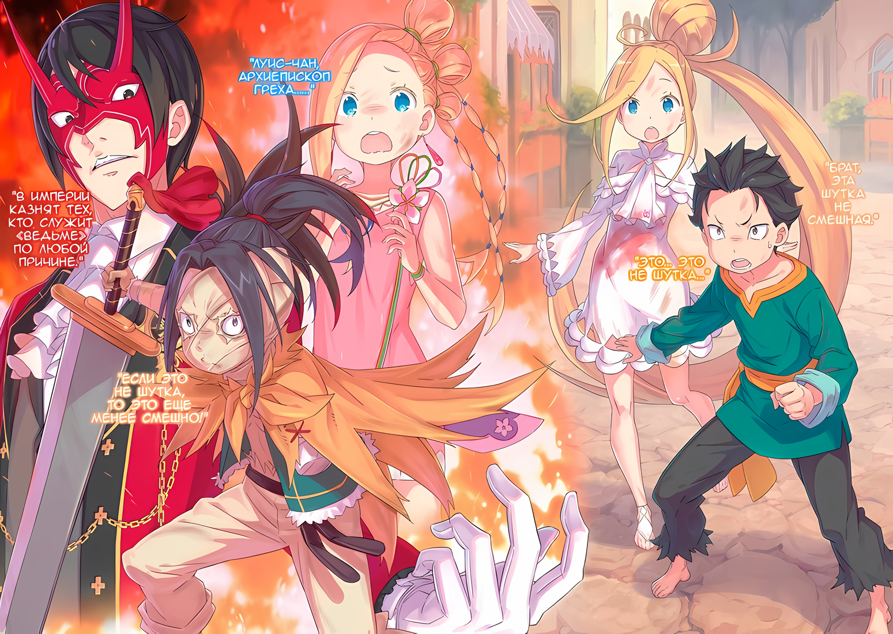

Сосредоточившись на мальчике-баране, Субару расширил глаза от настойчивых вопросов Абела.

Это было потому, что имя, прозвучавшее из его уст, было слишком неожиданным.

Субару: Та молодая девушка, Танза……?

В недоуменном сознании Субару всплыл образ девушки-оленихи в кимоно.

Что бросалось в глаза в сопровождающей Йорны, девочке, которая появилась в башне замка накануне, так это то, что она была очень сдержанной и необщительной, несмотря на то, что была еще ребенком.

Абел утверждал, что именно эта девочка все спланировала.

Субару: Это не имеет смысла! Почему она так поступила с нами…… Бха!

Луис: Уау!

Как только он повысил голос, чтобы услышать мысли Абела, Субару был потрясен ударом и перевернулся. Приглядевшись, Субару увидел на его спине улыбающуюся Луис.

В невероятной ярости Луис в мгновение ока сбила с ног почти десять противников. Невольно Субару ахнул от вида невинно выглядящей девочки.

……Сила Луис во время ее буйства была безошибочно похожа на ту, что он видел в Песчаной Башне.

Эта сила изначально принадлежала не Луис, а была украдена у кого-то другого, кто упорно трудился и оттачивал ее. Другими словами, она использовала силу «Чревоугодия»……

Субару: ……О-отстань от меня.

Луис: Ау?

Субару: Слезь с меня!

Толкнув плечом маленькую девочку в грудь, Субару с силой поднялся вверх. В результате его движения Луис упала на попу, а затем в поле его зрения попал ее белая ткань на животе, покрытая красными пятнами.

Увидев это, он вспомнил, что она ранена,

Субару: Ты ранена! Нам нужно тебя вылечить….

Луис: Ау! Аауу!

В спешке он свернул одежду девушки, чтобы осмотреть раненое место. Но, поскольку Луис показалось, что ей щекотно, она вырвалась, пытаясь сопротивляться, надавливая на лицо и шею Субару.

Не обращая внимания на ее сопротивление, ему каким-то образом удалось свернуть ее одежду и осмотреть рану. Он не обнаружил никаких явных ран, хотя был след сочащейся крови.

Субару: Зажило……?

Конечно, следы кровотечения были, но раны не было.

Это поставило его в тупик, и тогда Луис с силой надавила обеими руками на грудь ошарашенного Субару. Однако ответ на вопрос, что произойдет, если Луис ударит Субару по-настоящему, показывали многочисленные фигуры, лежащие на улице.

В любом случае….,

Абел: ……Ответь мне. Где Танза?

Пока Субару убеждался, что с Луис все в порядке, допрос Абела продолжался.

Ужасающий допрос с высоким давлением, казалось, работал не только благодаря взгляду Абела, но и благодаря клинку Медиум, так как она стояла позади него, как угроза. Даже не намереваясь ничего делать, просто стоять за спиной Абела — это уже имело эффект.

И действительно, когда мальчик посмотрел поочередно на Абела и Медиум, он издал звук из своего тонкого горла.

Мальчик-баран: А……

Абел: В третий раз говорю. Отвечай. Не думай, что будет четвертый.

Это был настолько жестокий тон голоса, что казался холодным и словно леденил Субару до глубины души. Услышав это, рот мальчика несколько раз дернулся, а затем огонь немного вернулся в его глаза,

Мальчик-баран: Как будто ты не знаешь! Если речь идет о том, где находится Танза, то вы, ребята, должны…!

Абел: …………

Мальчик-баран: Вы, ребята, что-то сделали с Танзой… Вот почему! Мы напали на вас из-за этого!

После этого язвительного замечания, руки мальчика потянулись к Абелу, стоящему перед ним.

С безрассудным пренебрежением к собственной безопасности, кончики его пальцев попытались схватить Абела за горло и сдавить его. Но прежде чем он смог дотянуться до него, маленькая ладонь надавила на лоб мальчика, и….,

Луис: Ау!

В этот момент затылок мальчика врезался в землю.

Из мальчика вырвался жалобный стон, и, перекатившись, он потерял сознание.

Субару: Л-Луис….

И снова, в мгновение ока, фигура Луис исчезла и снова появилась в другом месте.

Это было то, что она много раз демонстрировала в Песчаной Башне, — искривление на короткие расстояния, используемое «Чревоугодием»…… Наблюдая за ее мастерством, Субару почувствовал, что его сердце сейчас разорвется.

Тот факт, что она все еще обладала этой силой, означал, что она все еще Луис…… Луис Арнеб.

Девушка с того белого света, которая разлучила Субару с его сердцем и пыталась полностью забрать его душу.

Ошибочно посчитав его способность «Посмертного Возвращения» благословением, она назвала Субару монстром.

Абел: Нам нужно немедленно найти Ольбарта.

Не обращая внимания на предыдущий обмен мнениями, который чуть не лишил его жизни или, наоборот, спас, Абел пробормотал это, медленно вставая.

……Найти Ольбарта.

Субару, конечно, в целом согласился с таким подходом.

Только Субару не знал, почему он сказал это именно сейчас, в этот момент. К тому же, это прозвучало сразу после того, как мальчик рассказал им что-то о Танзе, что не имело никакого смысла.

Медиум: Ал-чин, ты можешь стоять?

Ал: ……Д-да.

Убрав оружие в ножны, Медиум протянула руку к павшему Алу.

Ал, лицо которого было скрыто тканью, ответил таким ужасно мрачным голосом, что, хотя Субару не мог разобрать его нынешнего выражения лица, он мог представить, что тот побледнел.

Отбросив беспокойство за Ала, Субару наконец смахнул грязь с задницы и встал. Затем он повернулся лицом к Абелу,

Субару: Что ты имел в виду под этими словами?

Абел: О чем ты спрашиваешь?

Субару: О том……! О том, что девушка Танза — это организатор, но что мы все равно должны попытаться найти Ольбарт-сана, и все такое прочее! Ты понял, о чем я!

Абел: Хмф.

Насмешливо фыркнув, Абел коснулся щеки своей маски Они.

Отчасти от нетерпения, а отчасти от разочарования, этот жест сильно нервировал Субару. Поэтому он впал в ярость и, сделав проворный прыжок, сорвал маску Они с лица Абела.

Затем, с лицом, которое давно не было видно, Абел снисходительно посмотрел на Субару с неодобрением.

Абел: Что ты делаешь?

Субару: Об этом я и хочу тебя спросить! Не разгадывай все сам, объясни мне все как следует! Мы же товарищи!

Абел: ……Товарищи, говоришь?

Субару: Эээ….

Интенсивность Субару быстро снизилась, когда на него уставилось истинное лицо Абела.

Хотя он и назвал его в лицо «Товарищем», это выражение могло обидеть Абела. Начнем с того, что у Субару были некоторые сомнения по поводу того, что он назвал Абела «Товарищем».

Он пожалел, что пошел на поводу у потока мыслей и сказал это. Но он не мог высказать это сожаление по этому поводу, потому что это было бы похоже на извинения.

Медиум: Правильно, Абел-чин. Мы товарищи, поэтому ты должен нам это объяснить.

Вместо Субару заговорила та, кто заставила Ала встать, Медиум.

Положив руки на бедра, все ее маленькое тело использовалось для протеста против Абела. В ответ на ее прямолинейные слова, темные глаза Абела сузились,

Абел: Убийцы в гостинице и здесь, все эти люди из рогатой расы.

Субару: Рогатые… Ты имеешь в виду людей с рогами. А что с ними не так?

Абел: ……Рогатые расы имеют историю преследования. Их рога похожи на рога Зверодемонов, потому в прошлом эту расу сторонились.

Субару: О….

Равнодушный рассказ Абела заставил Субару расширить глаза.

Наличие рогов и история преследования из-за этого. ……Такое предубеждение было очень близко к сердцу Субару, и поэтому непростительно.

Эмилия также подвергалась дискриминации в прошлом по схожим причинам; поскольку ее физические характеристики и происхождение были схожи с ведьмой, многие люди питали к ней ненависть.

И полукровки, и представители рогатых рас имели дело с похожим прошлым.

Субару: Но почему эти люди хотят напасть на нас? Я знаю, что люди боялись их рогов, но я этого не понимаю.

Абел: Может быть, ты и маленький ребенок, но от тебя все равно требуется немного пользоваться своей головой. Для тех, кого в прошлом преследовали за рога, этот город…… То, как обстоят дела в Хаосфлейме, — их спасение.

Субару: Спасение…… это значит «безопасное убежище», верно?

Абел: ……Йорна Миссигр никогда не отпускает то, что лежит в ее груди. Она даже подняла восстание ради одной мертвой девушки.

Сложив руки, Император, сам ставший целью восстания, рассказал об обстоятельствах, стоящих за ним.

Причина, по которой Йорна, та, кто много раз восставала в прошлом, обнажая клыки перед Императором, которому служила…… ради одного-единственного человека.

Что подумал Субару, когда ему сказали об этом, так это……,

Субару: Значит, она хороший человек……!

Абел: Дурак. Какой узкий и простой вывод. ……Йорна Миссигр — женщина, преданная тем, кто ее любит. И она не проявляет милосердия к тем, кто находится за пределами этого круга.

Медиум: Действительно~, но я думаю, что это нормально — быть добрым к тем, кто тебе нравится!

Субару: Я тоже так думаю.

Соглашаясь с мнением Медиум и Субару, Луис подняла руки и произнесла «Ау!». Абел посмотрел на них холодным взглядом и затем издал небольшой вздох,

Абел: Важнее всего то, что рогатые расы, в прошлом подвергавшиеся гонениям, обрели мир в этом городе. И существование Йорны Миссигр необходимо для поддержания этого мира. Другими словами….

Субару: Другими словами?

Наклонив голову, он ждал, что Абел продолжит.

Но на мгновение Абел посмотрел на Субару, наклонившего голову, собираясь с мыслями. Субару не понял смысла сказанного, но Абелу понадобилось несколько мгновений, чтобы продолжить.

Абел: Другими словами, для представителей рогатых рас наше присутствие — нестерпимый враг, который потрясет саму землю, на которой они стоят, поскольку мы ищем поддержки Йорны Миссигр для полномасштабного восстания против столицы Империи.

Субару: Ах….кх

После этих слов Субару, наконец, понял истинное значение слов и действий мальчика-барана.

В тот момент, когда он схватил Субару за руку, когда тот выбежал на улицу, и бросил его, мальчик выглядел страдающим — нет, не только мальчик, но и все те, кто нападал на них, выглядели страдающими.

Это было чувство вины за то, что они прогнали Субару и других, и страх, что они потеряют свое место в мире. Именно поэтому мальчик извинился в тот момент, когда бросился на Субару.

Субару: Значит, эти люди тоже приложили максимум усилий….

Абел: Это сочувствие или жалость? В любом случае, у тебя нет никакой свободы действий. Не забывай, что эти люди обратили свою враждебность против нас. Все, что пытается жить, и все живое, оба имеют свои собственные обстоятельства.

Медиум: Черт возьми, Абел-чин! То, как ты говоришь, просто ужасно! И еще, я так и не поняла, зачем ты спрашивал этих людей о Танзе-чан? К тому же, как насчет поисков дедушки?

Абел: ……Судя по тому, как они говорили раньше, должно быть, они не знают о местонахождении Танзы. По какой-то причине они подозревают, что мы скрыли от них ее местонахождение. Почему?

Субару: Почему… ты имеешь ввиду… По какой причине?

Глядя на потерявшего сознание мальчика, Субару ломал голову над вопросом Абела.

Перед тем, как Луис вырубила его, мальчик набросился на Абела за то, что тот спросил о местонахождении Танзы. Субару показалось, что в ярости мальчика не было лжи.

Так что мальчик, как и его группа, должно быть, думал, что группа Субару что-то сделала с Танзой.

Субару: Так вот почему они напали на нас?

Абел: Так оно и есть. Но факт, что мы не причинили вреда Танзе, остается фактом. Тогда куда исчезла та девушка? Более того, откуда появилось около сотни людей из рогатых рас?

Субару: Откуда? Они ждали снаружи, верно?

Абел: По чьему приказу?

Получив такой ответ, Субару растерялся.

Дав голове работать, он начал собирать столб ответов на вопросы Абела. Но прежде чем он смог собрать его должным образом,

Ал: ……Эта маленькая мисс, должно быть, проинструктировала их заранее.

И вот, подобравшись сзади, Ал украл ответ.

Некоторое время назад он был в состоянии, когда не мог говорить. Субару повернул голову в ту сторону, откуда доносился голос, и окликнул его: «Ал……». Настроение Ала, казалось, не вернулось к своему обычному состоянию.

Ал: Прости, брат, что беспокоил тебя… Ну, дела не стали лучше.

Абел: Твое настроение еще не улучшилось? Должно быть, это тоже эффект техники Ольбарта.

Ал: ……Я с этим не согласен. Я бы с удовольствием поговорил об этом, но сначала надо закончить то, о чем мы говорили. Итак, давайте поговорим о маленькой мисс Танзе.

Махнув своей теперь уже маленькой рукой, Ал ответил голосом, который сознательно подавлял свои эмоции.

Состояние Ала вызывало беспокойство, но он был прав, они находились в середине разговора. ……Было очевидно, что Танза заранее собрала всех людей снаружи.

Субару: А-а-а, ну, так ты говоришь, что Танза собрала своих рогатых товарищей вокруг гостиницы заранее и планировала, что они нападут на нас? Но, если это так….

Медиум: Куда делась Танза-чан?

Вопрос, которым Медиум завершила слова Субару, был ответом, который до сих пор не появился в его голове.

Танза появилась в гостинице, чтобы передать инструкции от Йорны, и должна была сразу же отправиться обратно. Хотя он мог понять, как она все устроила, реакция ее товарищей снаружи была странной.

По крайней мере, в то, что группа Субару что-то сделала с Танзой, мальчик-баран верил.

Ал: Значит, ее товарищи не должны были видеть ее целой и невредимой… Нет, скорее всего, они вообще не видели, как она вышла из гостиницы.

Абел: Это тоже разумно. Возможно, они не предпринимали никаких радикальных мер, пока мы не покинули постоялый двор, учитывая возможность того, что Танза была внутри и разговаривала с нами.

Медиум: Но! Где же тогда Танза-чан….

Медиум, с широко раскрытыми глазами и в смятении в голове, издала нечто похожее на крик.

Однако Субару смог понять мысли Абела, раз они были так тщательно упорядочены. Возможно, Абел думал именно об этом.

Это было……,

Субару: Эта девушка…… Если Танза не снаружи гостиницы, значит, она где-то прячется. ……А это значит, что Ольбарт-сан помогает ей!?

△▼△▼△▼△

……Чтобы вернуть Танзу, группа людей, принадлежащих к рогатым расам, напала на группу Субару.

Однако, поскольку они с самого начала ждали у постоялого двора, они должны были заранее посоветоваться о том, что им делать, если с Танзой что-то случится.

И в этом трактире единственным возможным заговорщиком Танзы был….,

Абел: Не кто иной, как Ольбарт Дарккенн.

Ал: ……Также возможно, что работники постоялого двора работали вместе, чтобы спрятать ее, понимаешь?

Абел: Естественно, я не слеп к такой возможности. Но у меня есть твердая уверенность.

Ал: Твердая уверенность?

В ответ на вопросительный голос Ала Абел глубокомысленно кивнул.

Почему он был убежден, что Ольбарт и Танза сговорились вместе? Потому что……,

Абел: Он взял на себя труд бросить нам вызов в детской игре в бегство и прятки. Именно такие порочные заговоры и нравятся старику.

Субару: «Найди меня, если сможешь~», вот так?

Абел: Верно.

Субару не смог не сделать отвратительное лицо на утверждение Абела, поправляя свою позу.

Догадка Абела, основанная на плохом характере Ольбарта, была верна. Да, Субару тоже интуитивно догадался о его причине отвращения.

Тот факт, что он предложил поиграть в прятки, сам по себе был метафорой пряток Танзы.

Субару: Но если на нас напали из-за этого, то это нарушение правил!

Абел: Ты имеешь в виду правило не вредить друг другу? Ему это сойдет с рук, если он скажет: «Я ничего не делал». Тем более, если Танза в сговоре с ним.

Субару: Гх… Такая несправедливая схема…!

Абел: Поэтому приоритетной задачей должно быть обнаружение Ольбарта. После этого, местонахождение Танзы должно быть раскрыто. Но если план будет раскрыт, предлог для игры в прятки может исчезнуть.

Теперь он понял, как был обнаружен тот факт, что Ольбарт и Танза могут быть вместе. Но он не понимал, как это может стать концом игры в прятки.

Его брови нахмурились, и на лице Субару появилась хмурая гримаса. Оказавшись лицом к лицу с ним, Абел с силой выхватил маску Они из рук Субару.

Субару испуганно воскликнул «Ах!», когда Абел на его глазах надел маску Они обратно,

Абел: Цель Ольбарта — выяснить, стоит ли с нами вести переговоры. Он больше заинтересован в этом, чем в детских уловках. Поэтому, если мы сможем разгадать его истинные намерения, нам не нужно будет идти на хитроумные уловки.

Субару: Ааа, хорошо, кажется, я понял….

Абел: ……Неужели степень твоего интеллекта всерьез становится низкой?

Абел проговорил это со вздохом Субару, который едва успевал за его объяснениями.

Он не мог ничего противопоставить Абелу. Субару тоже понимал, что его голова явно не в порядке. Однако он не знал, в какой степени.

Возможно, его мышление было некачественным, слова не доходили до него, или он просто был не очень умен.

Субару: Я не был умным парнем с самого начала….

Абел: Что касается твоего случая, то дело в том, что ты утратил способность к восприятию и творчеству. Детали техники Ольбарта неизвестны, но одна из теорий гласит, что тело отражает взлеты и падения своего собственного Од.

Субару: Взлеты и падения Од…?

Абел: Это значит, что существует связь между Од и телом, их ростом и упадком. Так сказать, мы можем предположить, что Ольбарт вмешался в твой…… вернее, во все ваши Од.

Абел посмотрел на Субару, Ала и Медиум, чьи тела оставались уменьшенными.

Субару это объяснение ничего не говорило. Как и в случае с его сломанными Вратами, которые использовались для магии, он ничего не понял из объяснений о мане и Од, о существовании которых он изначально не знал.

Это было верно только для Субару, но не для……,

Ал: ……Значит, это потому, что тот старик возился с нашими телами.

Субару был удивлен, услышав, что Ал так ненавистно ворчит.

Присмотревшись, Ал дрожащими пальцами потрогал свой лоб, покрытый маской. То, что он часто проявлял неконтролируемое раздражение, свидетельствовало о том, что он тоже испытывал психологическое воздействие.

Умственные способности, которые они могли иметь, будучи взрослыми, терялись по мере того, как они становились все более детскими.

Ал: Этот чертов урод, я его за это достану……!

Абел: Для этого нам нужно найти, где находится эта «Пропасть с прекрасным видом».

Субару: Да…… Кстати говоря, мы собирались отправиться в таверну.

Когда рядом с ним кипел от гнева Ал, Субару оборвал его слова на полуслове.

В результате того, что Таритта была вынуждена остаться на улице, она выступила в роли приманки, а остальные пошли в разные стороны. Однако истинная цель не была объяснена.

Почему Абел хотел поспешить в таверну?

Абел: В основе нашей охоты лежат цифры. В идеале, это должен быть кто-то, кто знает эти земли. Однако, возможно, что все жители этого города на стороне Танзы. Следовательно, лучше использовать чужаков.

Ал: Значит, ты нацелился на бар, где могут собираться незнакомцы. Похоже на идею брата.

Субару: Хм, это….

Он хотел продолжить «неправильно», но потом вспомнил, что искал телохранителя в Гуарале.

Это случилось, когда человек, Тодд, нацелился на него; одно воспоминание о нем заставило Субару содрогнуться. Среди множества идей, которые он рассматривал, чтобы спастись, он направился в таверну, планируя нанять сильный эскорт.

К сожалению, пьяный мечник, которого он нанял в тот раз, вскоре был убит.

Субару: Но ведь тебе нужны деньги, чтобы получить помощь, не так ли? Мы не можем найти такие деньги где попало.

Абел: Эта забота не имеет значения. У меня есть награда.

Сказав это, Абел встряхнул сумку, которую нес.

Поскольку он назвал ее необходимой, когда выносил из трактира, Субару было любопытно, что внутри.

В ответ на его взгляд, Абел не стал открывать горловину сумки, а сказал,

Абел: Покидая Гуарал, я попросил Зикра открыть сокровищницу мэрии. Это самый эффективный способ заполучить соратников. Не воспользоваться им не получится.

Ал: …Это был проницательный поступок.

Субару: Но разгуливать с кучей денег в маске Они опасно, и ты будешь выделяться…… Понятно.

Пока он это говорил, Абел постучал пальцем по маске Они, напомнив Субару о его неуместном беспокойстве.

Поскольку маска Они обладала эффектом «Преграды Опознавания», мысль о том, что он «выделяется», изначально была неправильным образом мышления. Поскольку на группу Субару это никак не повлияло, разница между их реальной ситуацией и реакцией окружающих сбила их с толку.

Ал: Значит, мы не изменим того, что будем делать? Мы все пойдем в таверну и будем искать кого-нибудь, кто поможет нам найти того старика?

Абел: ……Да, такова была первоначальная идея. Однако, все несколько изменилось.

Субару: Ситуация изменилась… как это?

Абел: Если Ольбарт и Танза стояли за этим с самого начала, они должны быть в состоянии найти способ быстро увеличить количество людей. Если Ольбарт сам по себе не имел бы влияния в Городе Демонов, то Танза — совсем другое дело. Эта девушка занимает должность прислуги Йорны Миссигр.

Поскольку Йорна занимала высшую должность в Хаосфлейме, быть ее сопровождающим означало быть кем-то вроде секретаря. Другими словами, Танза была вторым по важности человеком в городе после Йорны.

Вернее, это означало, что она могла вести себя так.

Субару: Если бы они действительно хотели держать нас в узде, они бы поставили людей вокруг таверн.

Абел: Нет необходимости попадаться в очевидную ловушку. Хотя, возможно, есть способы пробиться силой.

Во время этого разговора, который заставил изменить планы, взгляд Абела повернулся в сторону. Субару проследил за его взором, и его щеки напряглись.

Луис: Уау?

Это было потому, что Луис, наклонившая голову, стояла в том месте, куда была направлена линия взгляда маски Они.

Луис, которая переиграла нападавших и в конце концов безжалостно лишила сознания мальчика-барана, лихорадочно расчесывала пальцами свои светлые волосы рядом с Медиум, которая пристала к ней.

Несмотря на ее подавляющую боевую мощь, в ее невинном поведении не было никаких изменений.

Это, в свою очередь, послало холодную дрожь по позвоночнику Субару.

Медиум: О, Луис-чан была просто великолепна! Я потрясена, что ты так скрывала свои способности~

Луис: Ауау.

Медиум: Хе-хе, спасибо, что спасла меня.

Не обращая внимания на душевное состояние Субару, Медиум погладила по голове беззащитную Луис. Та спокойно приняла эту ладонь, от чего сердце Субару заколотилось.

Поэтому Субару немедленно выкрикнул «Подожди!» и даже схватил Медиум за запястье в предостережение.

Медиум: Вха, Субару-чин?

Субару: Эээ, Медиум-сан, тебе не следует приближаться к ней….

Медиум: ……? Почему? Она спасла меня, верно? Она даже спасла тебя, Субару-чин.

Субару: Ну, это может быть правдой, но… Однако…

Субару не смог ответить на невинный вопрос Медиум.

На самом деле, ее мнение было честным и правильным. Луис спасла Субару. Она без колебаний защитила Субару своим маленьким телом, даже ценой того, что ей пришлось пострадать.

Субару также отчаянно молил: «Не умирай».

Ал: Ну же, расскажи нам, в чем дело.

Видя, что Субару стиснул зубы, Ал заговорил низким голосом.

Субару вздохнул и посмотрел в мрачные глаза сквозь маску. ……Он вспомнил, что несколько дней назад, во время поездки в Хаосфлейм, он держал обстоятельства Луис в секрете от Ала.

В то время Субару не смог принять решение, как поступить с Луис, поэтому отложил ответ на потом.

Однако….,

Ал: Да ладно, это уже не та ситуация, которую можно пропустить с улыбкой. Это не только моя забота, но и всех нас.

Субару: …………

Ал: Какой секрет ты хранишь об этой девушке?

Его вопросительный взгляд был настолько интенсивным, что Субару рефлекторно укрыл Луис за собой.

Это было потому, что он не знал, как Луис отреагирует на этот взгляд, а не потому, что он пытался ее защитить…… нет, Субару не знал, так ли это.

Однако, если он и мог что-то сказать, так это то, что он больше не мог их обманывать.

А молодой, неполноценный мозг Субару не мог придумать правдоподобной лжи.

Вот почему……,

Субару: Она, Луис… Архиепископ Греха «Чревоугодия».

Поэтому все, что он мог сделать — четко раскрыть правду.

△▼△▼△▼△

……Истинная личность Луис Арнеб.

Это был секрет, который Субару хранил от Рем, потерявшей память, и от всех остальных, кого они встречали, с тех пор, как их отправили в Империю Волакия.

Субару ожидал, что будет много неприятностей в результате раскрытия истинной личности Луис как Архиепископа Греха, как в отношении его самого, так и в отношении других. ……Нет, это должно было быть гораздо хуже, чем он мог себе представить.

Именно поэтому Субару скрывал этот факт от всего мира до этого момента….,

???: …Архиепископ… Греха.

Сбивчивый голос размышлял над словами и фактами, которые раскрыл Субару.

Неудивительно, что Ал и Абел были поражены этим фактом. Вполне естественно было встревожиться, захотеть проверить факты, крикнуть, насколько все это нелепо.

Однако тот, чей голос дрогнул первым, не был ни Алом, ни Абелом.

???: Луис-чан, Архиепископ Греха……

Луис: Уу?

Действительно, Медиум была единственной, кто издала шокированный голос.

Голубые глаза Медиум расширились, когда она неподвижно смотрела на Луис. Взгляд Медиум заставил ее наклонить голову и издать глупый звук, как будто она не понимала, о чем идет речь.

И это была именно та реакция, которой Субару боялся больше всего.

Он оптимистично думал, что, возможно, Медиум… Нет, что, возможно, брат и сестра О'Коннелл примут это в штыки и посмеются над этим, как над пустяком.

Однако его оптимизм оказался неуместным, когда он понял, что это была всего лишь идеалистическая мечта.

Медиум: …………

Это был безошибочный и определенный «Страх», который промелькнул в глазах Медиум.

Ал: Брат, эта шутка не смешная.

Субару: Это… это не шутка…

Ал: Если это не шутка, то это еще менее смешно!

Субару, шокированный реакцией Медиум, не смог адекватно ответить на последующие слова Ала.

Повысив голос, Ал с силой вытащил Меч Синего Дракона, который он носил на спине. Конечно, это было не то, что могла бы с легкостью удержать одна маленькая детская рука, поэтому вытащенный меч уперся кончиком в землю.

Тем не менее, если он взмахнет им, используя весь свой вес, его все равно можно будет использовать. С этим острым намерением взгляд Ала обратился к Субару и Луис, стоявшей позади него.

Ал: Ты не можешь быть в здравом уме, таская с собой Архиепископа Греха. Ты ведь не забыл, что случилось в Пристелле?

Субару: Т-так это….

Ал: Я и Присцилла… Принцесса не пострадала, но это просто случайность. Твои люди и знакомые прошли через ад. Одна из причин — за тобой.

Невозможно было поспорить с гневом в голосе Ала, который прислонился к Мечу Синего Дракона, воткнутому в землю.

Ал был полностью прав. Именно Субару не был корректен по всем признакам. Он не должен был брать Луис с собой, не должен был позволять Луис беспредельничать.

Он должен был раскрыть ее истинную сущность, связать ее и держать в плену, лишив свободы.

Но Субару не сделал этого. Помимо этого……,

Субару: А-Абел…?

Он посмотрел на Абела, гадая, согласен ли тот с Алом в своем молчании.

Сейчас, когда Медиум боялась, а Ал злился, отношение Абела было последним бастионом…… и Субару даже не мог сказать, для кого именно.

Однако, если все в этом месте решили враждовать с Луис,

Субару: …………

Субару наверняка сможет покончить с этой нерешительностью и начать двигаться дальше.

Абел: Я не знаю, как поступают в других странах.

Прямо перед Субару, когда он проглотил слюну в ожидании, человек в маске Они, несущий сумку, встретился с ним взглядом.

Черные глаза встретились с черными глазами, и холодный взгляд пронзил грудь Субару. Его мозг начал отключаться, как бы отвергая слова, которые он должен был ждать, и содержание, которое должно было последовать.

Этот голос медленно проникал в его онемевший мозг.

Это был……,

Абел: В Империи казнят тех, кто служит «Ведьме» по любой причине.

Цветная иллюстрация к **Ранобэ** Том 29 | Перевод неофициальный и выполнен под контекст перевода rezero7arc | Клин Даниил Шабалин

Окончательное заявление от существа, стоявшего на вершине Империи, хотя он и был свергнут со своего трона.

Это был приговор о казни, который ясно утверждал, что они никогда не смогут увидеть друг друга.

Услышав это, Субару плотно закрыл глаза….,

Субару: ……Кх, Луис!

Медиум: Субару-чин!

В тот самый момент, когда он эмоционально выкрикнул ее имя, маленькая пара рук обхватила талию Субару.

Сразу после этого голос Медиум прозвучал как крик, и ноги Субару оторвались от земли и взлетели в воздух…… нет, Луис, которая была прикреплена к талии Субару, прыгнула высоко вверх вместе с Субару.

Почему он выкрикнул имя Луис, какой смысл был в этом; цокая молярами, Субару почему-то сдерживал подступающие к глазам слезы.

Это просто пришло ему в голову.

Луис: Уау.

Что он не должен сейчас бросать эту девушку, которая обнимала его за талию охая и ахая.

И дело было не в том, что он оказал ей ответную услугу и спас ей жизнь, а в том, что она спасла его. Не то чтобы Субару по ошибке почувствовал что-то вроде сострадания и потребности защитить ее. Это просто пришло ему в голову.

Превратив не только свои конечности в конечности ребенка, но и содержимое головы в, Субару пожалел, что дал ответ об этой девушке, о которой он не знал, что думать.

Это была проблема Субару, которая не имела никакого отношения ни к Рем, ни ко многим людям, которых они встречали до сих пор.

Это была проблема, которую Нацуки Субару должен был решить всеми силами.

Ал: Брат! Вернись! Черт тебя побери…!

Ал, подняв голову, крикнул ему, но ноги Луис не остановились, она оттолкнулась от стены и прыгнула в сторону.

Обнимая Субару за спину, Луис ударилась ногой о стену здания, выходящего на улицу, и поднялась на крышу, а затем без проблем перешла на следующую улицу, а за ней и на следующую.

В Хаосфлейме, городе, покрытом строительными лесами, в котором можно было свободно создавать сочлененные пути, безграничная несдержанность Луис была поистине непревзойденной.

Субару: Бва!

После еще нескольких прыжков Субару сошел на землю и встал на руки и колени, делая многократные глубокие вдохи. Это было больно, не только бросать вызов гравитации столько раз, но и то, что стройные руки Луис сжимали его торс, как тиски.

Луис, о которой шла речь, сбоку заглянула в лицо Субару. То, что она была так энергична, казалось отвратительным.

Но сейчас было не время для того, чтобы ненавидеть ее лицо.

Субару: Черт, Абел и остальные….

Это был результат его собственных действий. Сказать, что он просто отстал от остальных, было бы слишком очевидной ложью.

Но если бы он остался в том месте, кто знает, какие приказы отдал бы Абел; судя по реакции Ала, он бы не отпустил Луис мирно.

Он также мог сказать, что от способности Медиум разряжать обстановку можно было ничего не ожидать

Тем не менее, он винил свое сердце за то, что не послушался и не передал Луис им.

Луис: Уау?

Вытерев рукавом свой рот, Субару поднял голову и увидел голубые глаза Луис, невинно смотрящие на него.

Субару не обращал внимания на такие вещи, как враждебность и страх, направленные на него, и чувствовал себя идиотом, позволяя своему разуму ходить по кругу.

Субару: Я идиот. Нет, я точно идиот.

На самом деле, он был большим идиотом.

Абел в стороне, это было идиотизмом — оставить Медиум и Ала позади и убежать с Луис.

Он понятия не имел, о чем они думают и что могут сделать.

Субару: Все же, если я приму решение сейчас, то я могу пожалеть об этом. Это не то, что должен решать маленький ребенок.

Жизнь и смерть людей и, в конечном счете, будущее Империи были очень важными вопросами, так он думал.

Было странно, что такой важный вопрос должен решать ребенок, которому всего около десяти лет, под взглядом безжалостного взрослого. ……Это было неправильно.

Субару: Я уверен, что прежний я мог принять правильное решение. Так что….

Он должен избавиться от этой «Инфантилизации» как можно скорее, и вернуться из маленького мальчика Нацуки Субару в молодого мужчину Нацуки Субару.

Тогда он сможет решить, стоит ли иметь дело с Луис, и дать разумный ответ на решение, принятое его товарищами, и достичь удовлетворительного завершения.

С этой целью….,

Субару: ……Давай найдем Ольбарт-сана. Я сделаю все, что в моих силах, не полагаясь на Абела и остальных.

Луис: Аа, уу!

Луиc подняла голову в ответ на слова Субару, подняв обе руки вверх с веселым выражением лица.

Глядя на пейзаж Города Демонов с высоты строительных лесов, два маленьких ребенка стояли рядом друг с другом, стремясь найти главного шиноби, который обратился против жителей Хаосфлейма и свергнутого Императора.

……Неожиданно для всех Субару и Луис оказались Они в игре «Прятки» и Они* в игре «Догонялки».

※※※※※※※※※※※

*На японском, тот, кто занимается поиском или догоняет, называется ”鬼" (они). Это же слово “鬼”, используется для обозначения расы Рам и Рем.
