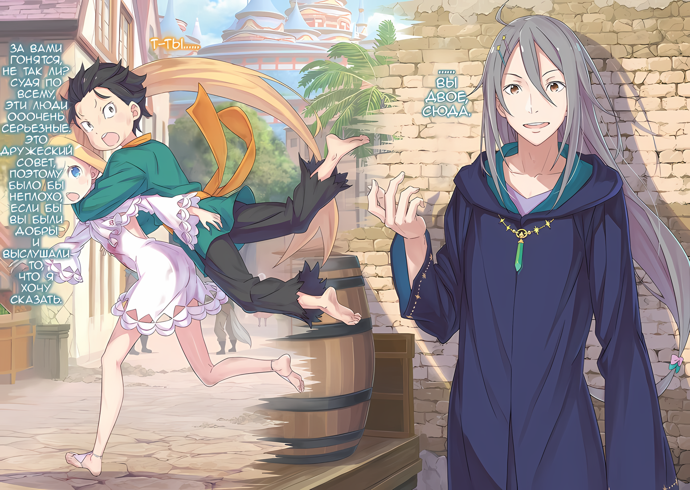

Ал: Черт! Я их нигде не вижу……!

Глядя на небо с улицы, когда его взгляд пронесся над многочисленными подмостками, фигура мальчика в маске…… нет, Ала, закричала, топчась на месте.

Невероятная ситуация, которая только что произошла, подстегнула его разочарование и заставила сердце кипеть от ярости.

Абсурд, вот и все, что он мог сказать о таком повороте событий.

Медиум: Субару-чин, Луис-чан…

С другой стороны, в отличие от Ала, гнев которого выплеснулся наружу, Медиум пробормотала эти слова, опустив лицо.

Девушка, одетая как танцовщица, свернулась в клубок, переживая за тех двоих, что скрылись с места происшествия.

Однако природа эмоций в ее бормотании была сложной и запутанной.

Трудно было сказать, что это вызвало только беспокойство. Несомненно, это было связано со словами, которые Субару произнес перед своим исчезновением.

Медиум: Луис-чан….

Абел: ……Архиепископ Греха, то что он сказал.

Медиум: ……Кх.

Глаза Медиум расширились, услышав продолжение слов, которые непроизвольно слетели с ее губ.

Не обращая внимания на Медиум, Абел смотрел в небо, как и Ал. Он снова надел маску и больше не показывал своего лица, поэтому другие не могли понять, о чем он думает.

Однако по его пальцам, постукивающим по скрещенным рукам, было ясно, что эта ситуация его не радует.

Медиум: Абел-чин, эти двое….

Абел: ….Наша первоочередная задача — взять ситуацию под контроль. Наш курс действий остается прежним. К сожалению, количество методов, которыми мы владеем, снова сократилось на один.

На слабый вопрос Медиум Абел ответил холодным тоном.

Он не стал прямо упоминать Субару и Луис. Но было очевидно, что Абел не собирался немедленно присоединяться к ним.

Услышав это, Медиум почувствовала в глубине души одновременно тревогу и облегчение.

Было и беспокойство за этих двоих, и облегчение от того, что не придется с ними сталкиваться.

Она также почувствовала ужас от того, что ей сказали то, что не следует говорить даже в шутку, в ситуации, когда это не может быть воспринято как шутка.

Ал: Ты хочешь оставить брата в покое? Особенно сейчас, когда у него разум ребенка?

Абел: Так что же нам делать? Ситуация, в которой мы находимся, не изменится. Предупреждаю, если вы с Медиум больше не будете полезны, мне придется вас оставить.

Ал: Гх……

Абел: Не думай, что ты один имеешь право выбирать, с кем нам вступать в союз, а с кем нет, клоун.

Не в силах говорить, Ал хотел присоединиться к сбежавшим Субару и Луис, но Абел холодно отверг его предложение. Между тем в центре внимания Ала был только Субару; существование Луис было второстепенным.

Отношение Ала к Луис, чья личность была раскрыта как бомба, было ясным.

Ал: Я не могу оставить брата и это отродье вместе….

Когда он бормотал это про себя, закрыв рот рукой, враждебность Ала по отношению к Луис была очевидна.

Медиум хотела пожаловаться на отношение Ала, но сама не могла принять решение о своем положении, относительно Луис; в этом молчании возникло нехарактерное для нее раздумье.

Абел: …………

Абел, бросив взгляд в сторону этих двоих, снова поднял голову вверх.

Их фигур больше не было видно, Субару и Луис ускакали куда-то в Город Демонов, так как от них не осталось и следа в этом нагромождении, на которое упал его взгляд.

Абел: Дурак.

Единственное слово, которое вырвалось из его рта, было бормотанием, обращенным конкретно ни к кому.

△▼△▼△▼△

……И вот, оказавшись в этой беспрецедентной ситуации, Субару пошел один, отдельно от своих друзей.

Это был спонтанный поступок, он не мог сказать, что это было решение, к которому он пришел после тщательного обдумывания своего будущего.

И даже если он примет решение в спешке, то определенно пожалеет о случившемся. Все, что он мог сказать с уверенностью, это то, что он предпринял это действие, чтобы избежать сожалений.

И сейчас Субару уже «Жалел» о принятом решении.

Потому что..,

Луис: Ау, уау!

Субару: Прекрати, Луис! Хватит!

Обхватив маленькое тело Луис сзади, Субару оттащил ее извивающееся тело в сторону. Тот, от кого он ее оттащил, был бессознательным мужчиной, который преследовал их до того, как Луис накинулась на него.

Расставшись с Абелом и остальными, они успели перепрыгнуть через строительные леса в городе, и пока искали Ольбарта, чтобы восстановить «Инфантилизированного» Субару, враг настиг их.

Очевидно, преследователи знали о появлении «Инфантилизированного» Субару и о цели, которая не посещала башню замка, Луис. Похоже, догадка Абела оказалась верной.

Другими словами, Ольбарт и Танза были сообщниками, и информация, которой они владели, также была передана их преследователям…… представителям рогатой расы.

В результате Субару, который путешествовал с Луис, был преследуем и почти пойман……

Луис: Уу!

Боевые навыки Луис, которые она продемонстрировала на улице, вырвались, и их преследователи были быстро нейтрализованы.

Это само по себе было благословением. Даже до того, как его конечности уменьшились, боевые способности Субару были разочарованием. Он не мог сравниться даже с теми, кто не умел сражаться, ведь Йорна передала им часть своей силы через «Технику Брака Душ».

Однако проблема заключалась в том, что Луис не прекращала атаковать, даже после того, как она нейтрализовала их преследователей.

Луис: Ауу….

Субару: Не ауукай на меня! Если ты это сделаешь, они умрут! Эти люди просто напуганы, вот и все. Это было бы совсем нехорошо!

Луис: Уу.

Луис успокоилась, услышав предупреждение Субару.

Он не знал, поняла ли она то, что он только что сказал, но, во всяком случае, она, похоже, поняла, что Субару сердится. Видя это, Субару стал оказывать помощь упавшему противнику.

Поскольку у него не было аптечки, все, что он мог сделать, это положить голову повыше и протереть кровоточащую рану.

Субару: ……Эти люди тоже.

Луис: Уау?

Субару: Они в отчаянии. Они не хотят, чтобы их место в мире было уничтожено.

Существа, такие как человек-баран и человек-олень, которых избила Луис, были в возрасте от десяти до двадцати лет, они мало чем отличались от Субару. Окружившие трактир полулюди и мальчик-баран, который подбросил Субару на улице, были разного возраста, и ничто не заставляло их казаться друзьями.

Но была определенная связь. Это были рога, которые росли на их головах.

В зависимости от человека, они могли отличаться наличием одного или двух рогов, но рог есть рог.

Влияние, которое он оказал на их жизни, не было тем, над чем Субару, знавший о случае с Эмилией, мог насмехаться.

Субару: Я рад, что Рем здесь нет.

Как член племени Демонов Они, Рем имела характерный рог, который рос у нее на лбу.

В отличие от тех зверолюдей, рога не росли постоянно, но как представительница рогатой расы, она, возможно, не так часто связывалась с ситуациями, с которыми те сталкивались в жизни.

Впрочем, он никогда не слышал ничего подобного от Рам или Рем.

Субару: Не думаю, что Рам было бы наплевать на то, что про нее говорят.

Поскольку Рам была из тех, кто идет своим путем, что бы ни говорил о ней внешний мир, она наверняка отмахнулась бы от их слов с ехидным «Ха!».

С ее силой, не связанной ни расой, ни титулом, она……

……Сможет ли она сохранить спокойствие, узнав о Луис?

Субару: …Я идиот, точно идиот.

Луис: Уау.

Ударив кулаком по лбу, Субару отогнал свои постыдные и эгоистичные мысли.

Увидев жест Субару, Луис, присевшая рядом с ним, наклонила голову.

Рам не было. Эмилии, и Беатрис тоже, всех не было.

Даже Рем, которая была ближе всех к нему, все еще была в Гуарале, далеко отсюда…… не было времени утешать себя, полагаясь на кого-то, кого нет рядом.

Субару: В любом случае, будет плохо, если мы будем торчать здесь и выделяться. Нам нужно быстро спрятаться.

Честно говоря, учитывая его первоначальный план, бежать и прятаться было бы пустой тратой времени. Обычно ему пришлось бы преследовать убегающего и прячущегося человека.

Но Субару стал тем, кого преследуют.

Субару: Может быть, Абел не будет нас искать… Я думаю. Возможно, он зол и считает, что найти Ольбарта-сан важнее, я полага..

Луис: Ау.

Субару: Может, нам присоединиться к Таритте-сан? За Тариттой-сан гонится куча людей в незнакомом городе…… Нет, это плохое решение.

Приложив руку к голове, Субару отложил идею объединиться с невежественной Тариттой.

Он не чувствовал, что сможет успешно объяснить Таритте, почему он не с Абелом и остальными. Ему пришлось бы солгать, но ложь не решила бы проблему.

О посредничестве не могло быть и речи. Как только Таритта узнает, что Луис — Архиепископ Греха, она сочтет ее опасной и отдалится от нее, как это сделали остальные.

Субару: Я беспокоюсь о Таритте-сан, но думаю, что Абел и остальные будут ее искать.

В данный момент он не хотел присоединяться к Абелу и остальным, от которых он только что отделился.

Не имея ответа на вопрос, как следует поступить с Луис, он подумал, что с Абелом и остальными будет то же самое. Кроме того, он не хотел, чтобы его снова все ненавидели за то, что он с ними спорил.

Прошлый он, который не смог убедить всех, тоже не хотел, чтобы его возненавидели.

Субару: Луис, пойдем. Нам нужно найти Ольбарта-сан в «Пропасти с прекрасным видом».

Луис: Уау.

Говоря это, Субару связал руки с Луис и потянул ее за собой, чтобы заставить идти по пятам.

Изначально он не знал, куда идти, но после того, как она открыла свою силу…… Полномочие «Чревоугодия», его беспокойство стало еще сильнее.

Поэтому…,

Субару: Если не хочешь умереть, держись рядом со мной. Я тоже не хочу, чтобы ты умерла…… по крайней мере, сейчас.

Луис: Аа, уу.

Поняла она или нет, Луис кивнула головой в знак согласия. С этими словами Субару глубоко вздохнул, глядя на улыбающееся лицо девочки.

Двое детей, бродящих по незнакомому городу и бесцельно пытающихся разгадать загадку…,

Субару: Это заставляет меня чувствовать, что я действительно пропавший ребенок.

Это слабое бормотание было всем, что он смог вымолвить.

△▼△▼△▼△

.…После этого последовательность погони Субару и Луис, а также их побег, были тяжкими.

Возможно, потому, что Субару плохо ориентировался в планировке города, а также потому, что общаться с его спутником было сложно, и, конечно же, из-за невезения Субару.

Как бы то ни было, его преследовали внутри Города Демонов. Не в силах найти «Пропасть с прекрасным видом», его время утекало с каждым мгновением.

Субару: Луис! Прекрати драться! Беги, беги, беги, беги!

Луис: Ау! У!

Когда Луис бросилась бежать, Субару остановил ее, буквально навалившись на нее всем своим весом.

Он запрыгнул на ее крошечную спину, заставив себя оказаться в положении, когда его несут на спине. Луис подперла тело Субару, чтобы не стряхнуть его, а затем высоко подпрыгнула, спасаясь от тех, кто их преследовал.

???: Не дайте им уйти!

И те, кто кричал это, преследуя их, были рогатыми зверолюдьми, патрулирующими Город Демонов.

Видимо, их преследователями действительно были только те, у кого есть рога. Что касается жителей Хаосфлейма, то Субару видел много полулюдей без рогов. Казалось, что они не получали приказа схватить Субару и Луис.

Субару: Похоже, что девушка Танза делает это по своей воле….

Танза была молодой девушкой-оленихой, хотя она занимала должность секретаря Йорны, Субару предполагал, что существует предел того, как далеко она может заставить двигаться тех, кто находится под ее командованием.

В результате, если бы все жители Хаосфлейма стали «этим», не было бы никакой возможности спастись. Казалось, что девушка также борется на грани того, насколько она может злоупотреблять своей силой.

Но даже на этой грани они были загнаны в угол. С точки зрения Субару, она могла бы даже немного сдержаться.

Субару: У…… Они идут за нами! Луис, не нападай! Мы должны выбраться отсюда!

Луис: Уу?

Субару: Просто потому! Так нельзя! Как бы то ни было, это не работает!

С Субару на спине, наступая на оконные рамы зданий и выступающие строительные леса, Луис не выглядела счастливой от этого побега, решенного одним человеком, так как она скакала по всему городу.

Она выглядела так, словно хотела сказать, что они победят, если она будет драться; Субару запротестовал, потрепав ее по щеке.

Действительно, если Луис будет драться, она сможет победить их преследователей.

Однако, если она это сделает, их преследователи могут погибнуть. Гипотетически, даже если она собьет их с ног, неизвестно, остановит ли Луис свое нападение.

На самом деле, совсем недавно, если бы Субару не остановил ее, Луис сбросила бы их преследователей с высоких лесов, повалив их на землю.

Луис, казалось, не утратила своей почти младенческой невинности.

Но, даже несмотря на эту невинность, сила «Чревоугодия» вернулась к Луис. Субару ужаснулся этому, так как казалось, что это ничем не отличается от буйства первоначальной «Луис Арнеб».

Если эта Луис когда-нибудь снова станет той «Луис Арнеб»….,

Субару: ……Это будет означать, что мнение Абела и остальных верно.

В таком случае, нет необходимости убегать с улицы и напрягать свои отношения с Абелом и остальными.

Существование девушки, известной как Луис, было тем, о чем Субару, как ни странно, должен был беспокоиться.

Вот почему это было нехорошо.

Субару: Я больше не позволю тебе никого убивать.

Пока глаза Нацуки Субару были черными, он не позволит этому случиться.

Луис: ……Ау.

Луис спокойно смотрела вперед, пока Субару крепче сжимал ее спину.

Казалось, она на время отказалась от своих жалоб, передумав делать то, что предложил Субару. Пока что Луис пыталась стряхнуть зверолюдей с хвоста; подпрыгивая и перескакивая, она продолжала убегать, взвивая свои золотистые волосы.

Однако……,

Субару: Такая упрямая…!

Возможно, это было естественно, так как единственное усилие, которое они предпринимали, чтобы избавиться от них, — это убегать, но было трудно ускользнуть от преследующих их зверолюдей. Помимо знания местности, из-за пламени в глазах одного из них…… из-за «Техники Брака Душ» Йорны — разрыв между ними не увеличивался, а сокращался.

Субару: Если так пойдет и дальше….

Их поймают; поэтому Субару прикусил зубы, которые не были ни молочными, ни коренными.

В этот момент.

???: ……Вы двое, сюда.

Субару: А?

Луис: Ау?

Луис с силой оттолкнулась от стены, пытаясь резкими движениями обмануть взгляды преследователей. Не успели они убедиться, что задуманное ими осуществилось, как до них донесся голос, когда они приземлились на улице.

Присмотревшись, юноша с худым лицом манил Субару и Луис подойти. На голове юноши при беглом взгляде не было видно рогов, но это не успокоило Субару.

Субару: Т-ты….

Юноша: За вами гонятся, не так ли? Судя по всему, эти люди ооочень серьезные. Это дружеский совет, поэтому было бы неплохо, если бы вы были добры и выслушали то, что я хочу сказать.

Цветная иллюстрация к **Ранобэ** Том 29 | Перевод неофициальный и выполнен под контекст перевода rezero7arc

В ответ на настороженный взгляд Субару, юноша приветливо улыбнулся ему. После этого, он указал рукой запыханным Субару и Луис на телегу на дороге.

Точнее, он указывал на зазор между несколькими бочками в задней части телеги,

Юноша: Поскольку у вас двоих маленькие тела, вы точно туда поместитесь.

Субару: Но даже если мы спрячемся там, это не значит….

Юноша: У нас больше нет времени. Расположение звезд меняется каждый миг. Конечно, тебе решать, избегать этого совета или принять его.

Субару: …………

Юноша: Однааако~, я думаю, в твоих интересах пойти со мной.

Размахивая пустыми руками в воздухе, юноша рассмеялся, чтобы показать, что он не хочет причинить им вреда

Субару долго колебался, стоит ли ему доверять этой улыбке или нет. Но он был прав, у него было не так много времени на колебания.

Поэтому….,

△▼△▼△▼△

???: Они, должно быть, пришли сюда!

Появилась группа кровожадных мужчин, которые искали любые признаки пропавших беглецов. Проходя мимо, они заметили юношу, который стоял возле телеги, прислонившись спиной к стене.

???: Эй, ты там! Здесь проходили двое детей?

Юноша: А? Ты бы не стал со мной разговаривать, не так ли? Извини, но я тут на секундочку отвлекся….

???: Как я уже и сказал, я хотел спросить, не видел ли ты их во время перерыва…… О, забудь!

Зверолюди, которые с шумом приближались к повозке, сдались из-за пренебрежительных слов юноши. Но это не означало, что человек-бык не обратил внимания на телегу рядом с юношей.

Он перестал расспрашивать юношу, а переключил свое внимание на телегу.

Человек-бык: Скажи, что за груз?

Юноша: Ну, как ты думаешь, что это? На какого купца я похож?

Человек-бык: Тц.

При этих словах неуловимого юноши человек-бык прищелкнул языком и уставился на телегу. Затем, с горящим правым глазом, схватив груду бочек, он без труда опрокинул груз.

С громким стуком разлетелся груз. Сложенные в штабель бочки раскачивались из стороны в сторону; если бы кто-нибудь прятался в задней части телеги, его бы завалило тяжестью бочек.

Видя это, человек-бык убрал руку с бочки,

Человек-бык: Извини, что побеспокоил тебя.

Оставив эти слова, он вместе со своими спутниками пошел прочь от места происшествия.

Позади него юноша крикнул: «Пожалуйста, почини бочки!». Однако, поскольку другая часть не ответила, юноша пожал худыми плечами.

Юноша: Вот это наааглость~, они были высокомерными людьми, не так ли? Я не знаю, что о них думать.

Разговаривая сам с собой, юноша подошел к телеге на пустынной улице. Он присел, чтобы посмотреть под телегу, а не на груз.

Там….,

Юноша: Ты был прав, что не спрятался в задней части телеги. Если бы ты скрылся там, каждая косточка в твоем теле была бы уже раздроблена. Это было бы очень больно, не так ли?

Субару: ……Не говори таких страшных вещей.

Луис: Уу.

Юноша произнес страшное замечание легкомысленным тоном, с улыбкой на лице, когда Субару и Луис выползли из телеги, под которой они спрятались.

Естественно было предположить, что так как телега была нагружена бочками, они будут прятаться там. Субару сначала сделал то, что ему сказали, и попытался спрятаться в задней части телеги, но поскольку у него было плохое предчувствие, он решил этого не делать.

Субару: Но, поскольку времени бежать не было, я спрятался под задней частью телеги.

Юноша: Я думаю, это было очень хорошее решение. Я не умею врать, и я бы сразу сказал ему, если бы он слишком грубо расспрашивал меня.

Субару: ……Нет проблем, я и не ожидал другого, ведь ты не один из нас.

Оказавшись под телегой, держась за ее колеса, Субару смахнул грязь со своих рук и одежды, а затем похлопал по такому же грязному телу Луис.

Судя по всему, преследователи потеряли Субару и Луис из виду, поэтому он должен быть благодарен юноше за помощь.

Субару: Но, почему ты помог нам?

Юноша: Почему я помог? Хм-м-м, почему, хм. О, как насчет того, что мне было невыносимо видеть, как гоняются за детьми?

Субару: Если ты говоришь это как «Как насчет», то ты определенно только что это придумал….

Юноша: Меня раскусили?

Столкнувшись с сомнительным взглядом Субару, юноша раздраженно погладил себя по голове.

Он горько улыбнулся, но, насколько Субару мог судить, он не был получеловеком. У него не было не только рогов, но и ушей, кожи и когтей, как у животных.

Но, несмотря на это, от этого человека исходила атмосфера, словно он был не из Хаосфлейма.

Субару: Ты….

Юноша: А, ой, я Убирк. Я могу понять, почему ты хочешь сомневаться во мне, но я мало что могу сказать.

Субару: Что значит «мало что можешь сказать»?

Убирк: Я помог вам двоим только потому, что подумал, что это хорошая идея.

Смеясь, юноша… Убирк… провел пальцами по своим пепельным волосам.

Его жесты и приятная внешность заставили Субару подумать, что Убирк —человек с достойной работой. Даже его дорожная одежда, на вид слегка поношенная, выглядела так, словно за нее заплатили изрядную сумму денег.

Субару подумал, что он наверняка торговец, потому что таскал с собой телегу.

Субару: Это то, что ты называешь интуицией торговца?

Убирк: Торговца… О, я? Хахаха, нет. Я не торговец или что-то в этом роде. И эта повозка тоже не моя.

Субару: А!? Но ты сказал тем людям….

Убирк: Я никогда не говорил, что я торговец. Конечно, я также никогда не говорил, что эта телега принадлежит мне. Это просто тележка, которая случайно оказалась здесь. Возможно, она принадлежит вон тому магазину, не так ли?

После этих слов Убирк указал на ближайший магазин и сказал: «Интересно, это тот? Или, может быть, это может быть тот?». Он пошутил, но, похоже, не совсем в шутку.

Другими словами, казалось, что он действительно просто блефовал, пытаясь выпутаться из этой погони.

Луис: Уау.

Субару: А, да, я понял.

Не отставая от Убирка, Луис неожиданно потянула его за рукав.

Субару, который уже начал сомневаться, можно ли стоять на месте, задумался о своем собственном беззаботном «я», которого торопила Луис.

Их положение не улучшилось, хотя они и оторвались от преследователей.

Субару: Что ж, спасибо за помощь, Убирк-сан. Но в следующий раз тебе следует думать и действовать более серьезно. Я уверен, что из-за этого у тебя будет много неприятностей….

Убирк: Чтооо~, ты беспокоишься обо мне? Я выгляжу таким несчастным? Я думаю, что я вполне мирской человек, но ты, кажется, не согласен.

Субару: Нет, не то чтобы я тебя подозревал или что-то в этом роде, но мы торопимся.

По правде говоря, он был подозрителен.

В данном случае подозрение было не в том, что Убирк обязательно был шпионом Танзы и Ольбарта, а скорее в том, что он мог быть опасным взрослым, который действительно не был связан с ними.

Поскольку они оба, Субару и Луис, были еще детьми, иметь дело с подозрительными взрослыми было довольно страшно.

Если бы другой стороной был опасный взрослый, Субару, возможно, не смог бы помешать Луис избить его до полусмерти. Иметь дело с опасными взрослыми было очень небезопасно для детей.

Субару: Ну, у нас есть дела, так что давайте оставим это. Спасибо, что помогли нам.

С этими словами Субару потянул Луис за руку и быстро пошел прочь, выражая свою благодарность.

Однако….,

Убирк: Пожалуйста, подождиии~ минутку. Не будь таким резким, давай поможем друг другу. Я думаю, что дух взаимопомощи — это замечательная вещь.

Как только он это сказал, Убирк использовал свои длинные, стройные ноги, чтобы пробежать вокруг Субару и перекрыть ему путь.

Сразу же индекс подозрительного и опасного взрослого у Субару повысился, а отношение Убирка к нему было поставлено под сомнение. Луис покрепче сжала его руку и произнесла «Уу?», так как почувствовала настороженность Субару по отношению к Убирку.

Такой случай, как прыжок Луис, при получении одобрения Субару, чтобы затем избить Убирка до полусмерти и запихнуть его в бочку, был возможен.

Субару: Убирк-сан, вы гибкий?

Убирк: Я? Ну, в моем старом опыте работы, чем более гибким было мое тело, тем больше я мог выдержать, так что я был гибким человеком. Но, о чем ты меня спрашиваешь?

Субару: Нет, нет, ничего…… Помогать друг другу… значит есть что-то, с чем вы хотите, чтобы мы вам помогли?

Убирк: О, нееет~, я не это имел в виду. Дух взаимопомощи был просто оговоркой, а не просьбой о помощи. Хахаха.

Субару: …………

Индекс подозрительных и опасных взрослых снова увеличился.

В этот раз, помимо опасности, он почувствовал, что только что был создан новый индекс взрослых, помимо индекса опасных…… индекс взрослых, с которыми он не хочет ничего делать.

В любом случае, это был не тот человек, с которым он хотел бы проводить много времени.

Убирк: Хахаха… Этооо~ настроение холоднее, чем я ожидал. Это то же самое чувство, которое я испытываю, когда меня окружают все. Они ненавидят меня. Ты ненавидишь меня?

Субару: Если возможно, я бы предпочел не….

Убирк: Ооо~, ты честный. Ну тогда, поскольку ты, кажется, спешишь, и поскольку ты честный, а я люблю честных людей, давай поболтаем по-серьезному.

Субару: ……Кх.

Как только Убирк сказал это, он согнулся в талии и приблизил свое лицо к нему. Субару опустил голову, непроизвольно проглотив слюну, и Луис, шагнув вперед, выставила перед собой руку в ответ.

Затем она надавила на щеку Убирка сбоку, угрожая ему «Уу!».

Убирк: Ууупс~, она ненавидит меня. Я думал, что у меня хорошая репутация с девушками, но, наверное, это другое дело, если у них уже есть спутник.

Субару: ……Убирк-сан, будет лучше, если ты не будешь злить Луис. Эта девочка, ну, она более сильная, чем кажется.

Убирк: Понятно, Луис-сан — это ее имя, не так ли.

Убирк кивнул головой, и Субару проглотил его ответ.

Не было никакой проблемы в том, что он знал ее имя, но он знал, что выдал информацию, которую не должен был. Он не хотел давать кому-то еще больше информации, не зная, что из себя представляет этот взрослый человек.

Субару: Убирк-сан! Ты сказал, что это будет серьезный разговор, да? Если больше ничего нет, мы должны идти!

Убирк: ……Я вообще не планировал сегодня гулять по улицам.

Субару: Что?

Убирк: Пооо~ какой-то причине я обнаружил, что бесцельно брожу по городу и думаю, не происходит ли что-то, основываясь на предчувствии. Так что я пришел сюда по прихоти, и убил некоторое время рядом с этой тележкой. А потом……

Положив пальцы на лоб, он скользнул ими к уголку глаза, к ясным, белым щекам, затем вниз к скульптурному подбородку. В конце Убирк щелкнул пальцами.

Субару был заметно ошеломлен, застыв на месте, а Убирк, чья улыбка стала еще глубже от его реакции, помахал своими щелкающими пальцами из стороны в сторону,

Убирк: Вы двое появились, ловко перепрыгнув через мою голову.

Субару: …………

Убирк: ……Этооо~, возможно, не вызвало у вас отклика?

Наклонив голову, Убирк посмотрел поочередно на Субару и Луис, оба никак не отреагировали.

Луис просто могла не понять, что было сказано, но не Субару. Услышав ответ Убирка, он просто не смог ничего сказать.

Он задавался вопросом, не скрывается ли там какая-то грандиозная, далеко идущая причина.

Субару: Значит, ты просто гулял, отдыхал, а потом появились мы?

Убирк: Хаааа~, можно сказать и так, наверное. Нооо~, думаю, я могу сказать и так. ……Я думаю, что все это просто подсказки звезд.

Субару: Звезды…… судьба, или что-то в этом роде…

Хотя это звучало очень романтично, плечи Субару опустились.

Это было бы романтично, если это было сказано в начале истории, только встретившихся мужчины и женщины, но здесь было сочетание уменьшившегося Субару и изначально маленькой Луис. И чудака Убирка.

Это было совсем не романтично.

Убирк: Может быть, я тебя удивляю?

Субару: Ну, все в порядке. Даже если серьезность Убирка-сан не так уж сильна, меня это не сильно беспокоит, потому что он человек, которого я не хочу больше никогда видеть.

Убирк: Ты сказал мне довольно резкие и обидные вещи. Такая резкость похожа на черту моего старого друга.

Субару: Убирк-сан, у тебя есть друг…?

Убирк: Ахаха, как больно!

Он не мог удержаться от грубой, честной мысли, но Убирк, казалось, не обиделся.

На мгновение ему показалось, что где-то в его сентиментальном, прямолинейном и несерьезном отношении к другу есть какое-то тонкое, сложное чувство, которое испытывает Убирк.

Убирк: В любом случае, это какая-то судьба, что мы встретились здесь. Хммм~, вот оно что! Я вообще-то занимаюсь тем, что даю небольшие консультации. Что скажешь, почему бы тебе не попросить меня о консультации?

Субару: Наконец-то, вот оно! Нет, спасибо…… Нет, я слышал по телевизору, что такой способ ответа удобен для мошенников. Я не хочу этого!

Убирк: Я не назойливый торговец, и я здесь не для того, чтобы обмануть тебя, ясно? Я просто хочу выполнить свою роль, тхууу~.

Субару: Свою роль?

Убирк: Действительно, должна быть причина, почему я здесь сегодня. Вероятно, для того, чтобы вы с Луис-сан могли посоветоваться со мной.

Убирк многократно кивнул, скрестив свои тонкие руки и делая вид, что только он один все понимает.

К сожалению, убежденность Убирка не понравилась Субару. Просто индекс подозрительных и опасных взрослых постепенно увеличивался.

Он предпочел бы просто оставить Убирка здесь и сбежать, если это возможно. Субару чувствовал, что хотя Убирк и дал отмашку их преследователям, теперь он связан с более проблемным противником.

Убирк: О, бесполезно пытаться убежать. Если~ ты попытаешься убежать….

Субару: И что тогда?

Убирк: Я закричу и скажу людям, которые только что прошли мимо, где вы двое. У вас будут неприятности, верно?

Субару: У нас будут большие неприятности….!

Однако если это случится, он был готов отпустить Луис.

Конечно, поскольку он не хотел допустить смерти Убирка, Субару сделает все возможное, чтобы остановить буйство Луис, но он был готов использовать ее в качестве последнего средства, если Убирк захочет позвать их преследователей.

Кроме того….,

Субару: Прости, но тебе не стоит знать, что с нами происходит. Если ты услышишь об этом, ты можешь быть вовлечен в это, и я не думаю, что ты сможешь что-то с этим сделать.

Даже если Субару и Луис ничего не сделают, Танза и ее товарищи могут навредить Убирку. Если это случится, то виноваты будут Субару и Луис.

Его мысли были о том, что он не может вовлечь Убирка в такую ситуацию.

Однако….,

Убирк: Оо, не беспокойся об этом, со мной все будет в порядке. Я сказал, что проконсультирую тебя, но я консультант, который прекрасно обходится без конкретики.

Субару: Есть что-то подобное!?

Убирк: Ну-ну, если ты считаешь, что тебя обманули, протяни мне руку.

Беспокойство Субару было омрачено беззаботной улыбкой Убирка, когда он осторожно взял Субару за руку.

Это была левая рука, потому что в правой Субару держал Луис. Удивившись прикосновению тонких женственных пальцев Убирка, Субару поспешно взглянул на Луис.

Луис: Уу.

К счастью, Луис не была настолько вспыльчива, чтобы внезапно наброситься на Убирка, хотя она и следила за его движениями.

Но это означало, что ему придется следить за ситуацией, которая напоминала воздушный шар, который может лопнуть в любой момент, и при этом постоянно наполнять его воздухом.

Субару: Умм, Убирк-сан, у меня мало времени, да и у вас тоже….

Убирк: Чтооо~, ты внезапно заставил меня тоже нервничать. ……Но я уже закончил.

Субару: А?

Пока он беспокоился о том, что взгляд Луис направлен на тонкую шею Убирка, рука Субару высвободилась из его хватки.

Убирая руку, Убирк осторожно повернул ладонь к лицу Субару,

Убирк: ……Ответ, который ты ищешь, уже внутри тебя.

Субару: …………

Глаза Субару расширились от этих неожиданных слов.

Не понимая Субару, Убирк произнес «Ооо~?» и наклонил голову.

Убирк: Может быть, это ничего не напоминает?

Субару: Дело не в том, что это ничего не напоминает, просто я не очень понимаю, что это значит….

Ответ, который он искал, тоже был неясным.

Он чувствовал, что это похоже на то, что говорили гадалки по телевизору в его родном мире. Это была обычная фраза, используемая для того, чтобы обмануть людей, говоря что-то, что относится к любому человеку.

Субару: Не думаю, что есть много людей, которые не ищут ответов….

Убирк: Хммм~, я не говорю о чем-то таком большом, как сама жизнь. Мне жаль говорить, что я не тот человек, который способен так хорошо видеть движение звезд.

Субару: Как гороскоп….

Убирк: Возможно, проблема перед тобой. Видишь, вас обоих преследовали, верно? Это тоже проблема, не так ли? Что ты об этом думаешь?

Субару: Но я знаю, почему эти люди преследовали меня….

Возможно, уверенный в своих способностях консультанта, Убирк пытался приблизиться к правильному ответу, углубляясь во внутренние мысли Субару.

Он не был уверен в этом; это было похоже на уловку мошенников, но когда он принял это всерьез, в сердце Субару появилось легкое раздражение.

Субару: …………

Это было очень важно.

Конечно, он не знал, насколько можно верить тому, что он чувствовал в своей маленькой голове Субару. Однако, даже если он не верил в «Мысли» маленького Субару, в «Интуиции» маленького Субару должно было остаться место, независимо от размера тела.

Проблема, с которой Субару столкнулся прямо сейчас, была….,

Субару: ……«Пропасть с прекрасным видом».

Убирк указал, что ответ уже был в Субару.

Он не пытался докопаться глубже, что это была за афера. Но он чувствовал это.

……Та тяга, которую он чувствовал, если он сможет зацепиться за нее, то сможет найти ответ, который искал.

Луис: Уау?

Субару: Кажется, я догадался.

Луис посмотрела в лицо Субару, когда он ответил ей, и его брови исказились в хмурую гримасу. При звуке голоса Субару, который немного восстановил свою силу, Луис расширила свои голубые глаза, а затем счастливо улыбнулась.

Увидев со стороны изменение выражения лица Луис, Субару выдохнул, а затем посмотрел на Убирка.

Субару: Консультация, возможно, сработала.

Убирк: Ооо~, я рад. Я тоже чувствую облегчение. Если я собираюсь что-то делать, то это должно быть сделано должным образом. Чтож?

Субару: Да, я поспешу. Спасибо за все, Убирк-сан. ……Идем, Луис!

Луис: Ауау!

В ответ на слова Убирка, который закрыл один глаз, Субару потянул Луис за руку и побежал.

Он начал бежать так быстро, как только мог, остановившись только один раз. Оглянувшись, он увидел, что глаза Убирка расширились, возможно, потому что он не ожидал действий Субару.

Субару помахал ему рукой,

Субару: Убирк-сан, я не скажу о тебе ничего плохого, так что просто возвращайся к своим родителям! А чтобы ты не казался таким опасным, веди себя хорошо и перестань обманывать людей!

С благодарностью, это был весь корыстный «Совет», который Субару мог дать ему.

△▼△▼△▼△

После этого он смотрел, как парень и девушка поспешно уходят.

Убирк: «Перестань обманывать людей», это немного грубовато.

Юноша, который остался один на улице.… Убирк, улыбнулся и почесал пальцем щеку.

Это было странное время, но, судя по тому, как мальчик выглядел в конце, он чувствовал, что в какой-то мере смог помочь, и это заставляло его сердце сжиматься.

А затем….

Убирк: Если я не вернусь в свою комнату как можно скорее, Кафма-доно будет очень недоволен мной, и если что-то случится, у меня будут неприятности, так что я должен вернуться. Но все же….

Снова посмотрев в ту сторону, куда ушли дети, Убирк закрыл один глаз.

И….,

Убирк: ……Я не знаю, чего желают звезды, хотя это и входит в обязанности «Звездочета».
