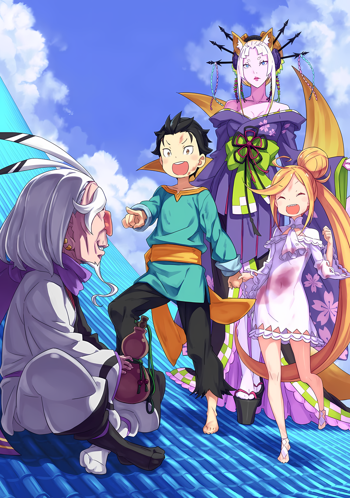

Расставшись с подозрительным Убирком, они остановились в паре небольших переулков.

Осмотрев окрестности, Субару убедился, что поблизости никого нет. Естественно, он также тщательно проверял, не следит ли Убирк за ними,

Субару: ……Ответ уже внутри меня.

Луис: Аууу.

Луис наклонила голову, пока Субару размышлял над тем, что сказал им Убирк.

Поскольку Убирк сказал им, что работает «Консультантом», в деталях работы которого он не разбирался, впечатление Субару о нем как о мошеннике не исчезло, но он чувствовал, что его замечание было довольно точным.

Субару действительно не знал, видит ли Убирк то, что хочет сам, или нет, но……,

Субару: ….«Пропасть с прекрасным видом», кажется, я догадался.

Слова Убирка о том, что ответ находится внутри Субару, дали ему подсказку.

Они не означали, что пропавший Ольбарт тайно прячется в теле Субару. Это была метафора, а подсказка Ольбарта была еще и загадкой.

Ответом на загадку «Позади век» была комната, в которой они начали.

Поэтому, естественно, «Пропасть с прекрасным видом» тоже была загадкой, и ответ должен быть где-то там.

И ответ, который дал Убирк, заключался в том, что он уже находится внутри Субару….,

Субару: Я думал, что это место, где я был, но это ведь не так.

Луис: Ауау?

Субару: В этом городе не так много мест, где я бывал. Если не брать в расчет постоялый двор, есть только Замок Йорны. Но это не похоже на пропасть. Это совсем не так.

Луис: Уу.

Субару: Что-то вроде пропасти, что это значит?

Ольбарт намекнул им на «Пропасть с прекрасным видом», но выражения «прекрасный вид» и «пропасть» были довольно противоположными.

Отличный вид означал, что здесь будет хорошая точка обзора. Пропасть — это глубокая дыра. Что-то вроде дыры с видом просто не сходилось.

Значит, одно из них было ложью. И поскольку не было никакой возможной лжи в том, что у него был хороший вид, единственная ложь, которая могла быть сказана, была о пропасти.

Субару: То, что похоже на пропасть, но не является пропастью….

В Хаосфлейме не было такого места, в котором побывал Субару.

Он был уверен, что то же самое относится к Абелу и остальным, кто не покинул постоялый двор. ……Субару не был уверен в том, что Ольбарт вообще знает о Городе Демонов.

Но он также не верил, что Ольбарт мог много ходить вокруг да около. Ведь его обязанностью было сопровождать лжеимператора Винсента и защищать его.

Так что, поскольку это был город, о котором он мало что знал, это было место, которое определенно не было запутанным.

«Пропасть с прекрасным видом», как ее называли, не была местом, которое существовало только в Хаосфлейме.

Это было……,

Субару: ……Луис, мы идем на возвышенность.

Луис: Уау?

Луис была удивлена Субару, который говорил так, закрыв глаза.

Он не думал, что то, что он имел в виду, было понято. Но до тех пор, пока он мог подтвердить, что Луис, держа его за руку, будет спокойно следовать за ним, он не просил ничего больше.

Времени оставалось не так уж много. И хотя он боялся, что все может оказаться не так, не оставалось иного выбора, кроме как попробовать.

Местом укрытия Ольбарта была «Пропасть с прекрасным видом», а ближайшим местом к ней…,

Субару: ……Мы должны добраться до ближайшего к небу места.

△▼△▼△▼△

«Консультация» Убирка, данная в одностороннем разговоре, привела Субару к его ответу.

«Пропасть с прекрасным видом» — это, говоря иначе, «Дыра с прекрасным видом».

Пропасть была не обычной дырой, это была глубокая дыра, в которую можно было падать до бесконечности. Проще говоря, это дыра без конца.

И, как сказал Убирк, Субару уже испытывал подобное.

И это случилось не так давно, в режиме реального времени.

Субару: На той улице, когда тот мальчик бросил меня.

Когда Субару выбежал на улицу, совершенно потеряв рассудок, его схватил за руку мальчик-баран. Когда Субару, извиняясь, швырнули к верху, у него снова и снова возникала мысль, пока он приближался к небу, с чувством вращения.

……Что он «падает» в голубое небу.

Конечно, если принять во внимание то, что произошло, это было неверно.

С точки зрения окружающих, настоящий Субару был просто подброшен высоко в небо. Но Субару, который в тот момент не знал, что такое верх, а что такое низ, думал так.

Он думал, что падает в голубое небо.

Падает в бесконечную, голубую, бездонную «дыру».

Субару: Вот что такое дыра с прекрасным видом…… Значит, это самое близкое к небу место в этом городе.

Субару полагал, что именно это место Ольбарт назвал «Пропастью с прекрасным видом».

Так что идея заключалась в том, чтобы нацелиться на самое высокое место, но…,

Луис: Аа… у!

Независимо от того, понимала ли она, что чувствует Субару или нет, Луис, широко улыбаясь, указала на конкретное место.

Когда Луис весело махала их соединенными руками и указывала вдаль свободной рукой, Субару закрыл лицо своей рукой.

Не потому, что Луис придуривалась, не понимая, что он сказал.

На самом деле, этот раз был единственным, когда Луис поняла идею Субару. Она указывала на здание, которое находилось ближе всего к небу в городе Хаосфлейм.

Однако именно это здание и стало причиной беспокойства Субару.

Луис: У!

Субару: Значит, ты тоже об этом думаешь….

Пока Луис энергично тянула его за руку, Субару посмотрел вверх на здание, на которое она указывала…… Замок Красного Лазурита.

Это был Замок Йорны Миccигр и самое высокое здание в Городе Демонов. И, для все еще смятенного Субару, это было место, из которого его непременно вышвырнут за ворота.

Прежде всего, целью игры в прятки с Ольбартом было ответить на просьбу Йорны подождать ее в Замке. ……Для этого порядок был изменен на противоположный.

Субару: Но если помнить о скверном характере Ольбарта, то велика вероятность, что он пойдет на такой трюк.

Ольбарт также знал, почему Субару и остальные хотят вернуться к прежнему состоянию.

То, что Ольбарт, известный как «Порочный Старик», должен был хотя бы раз спрятаться в Замке Красного Лазурита, было трюком, который тот, скорее всего использовал бы.

Субару: Как нам попасть в Замок……?

Он больше не мог называть себя Нацуми Шварц с его «Инфантилизированной» и уменьшенной внешностью. Если бы такая возможность существовала изначально, он бы скорее отложил игру в прятки с Ольбартом.

Он не мог рассказать Йорне о ситуации, в которой оказался. Тем более что Танза, сопровождающая Йорны, похоже, была в сговоре с Ольбартом.

В таком случае, приближаться к замку было довольно опасно.

Луис: Уау.

Субару: Да, я знаю… если Танза скрывает от Йорны-сама тот факт, что она сотрудничает с Ольбарт-саном, то она определенно действует по собственной воле.

Субару показалось, что в Замке Красного Лазурита было сравнительно немного рогатых полулюдей из числа собратьев Танзы.

Если бы в окрестностях замка возникла суматоха, Йорна выяснила бы, что происходит, несмотря ни на что. Это также не понравилось бы и Танзе.

Возможно, лучше было бы донести на Танзу за ее озорство.

Субару: Стопстоп, я слишком спешу. Всегда есть шанс, что Йорна-сама встанет на сторону Танзы. Вернее, гораздо вероятнее, что так и будет.

В ситуации с двумя детьми, один из которых был любимым, а другой — неизвестным, вопрос о том, кому из них поверят, не стоял.

Как бы он ни смотрел на это, план рассказать Йорне о том, что задумала Танза, был тем, что лучше не предпринимать.

Но Субару догадывался, что его ощущение, о количестве врагов возле Замка Красного Лазурита невелико, было верным.

Субару: Лучший вариант — пробраться в Замок… Теперь остается только молиться, чтобы Ольбарт-сан не спрятался там, наверху. Луис, есть минутка?

Луис: Аа?

Субару: Это твое искривление…… оно позволило мне лететь с тобой, верно?

Субару задал этот вопрос, глядя в голубые глаза Луис.

В первый раз, когда Луис устроила буйство на улице, она использовала Искривление, чтобы выбраться из-под рухнувшей палатки, а затем телепортировалась в другое место, пока Субару прикрывал ее.

В тот момент он почувствовал нечто похожее на то, как содержимое его желудка перемешивается, и это было не то, что он хотел бы испытать снова и снова, но, надо сказать, это было очень удобно.

Однако, похоже, существовал предел того, как далеко они могли улететь.

Субару: С этой силой мы можем попасть внутрь замка. Ты можешь использовать ее правильно?

Луис: Ау!

Субару: Ты уверена? Если просто «возможно», то у нас будут проблемы. Если ты не знаешь, как правильно ее использовать, ты и я будем в опасности. Итак.

Луис: Уу….

Луис надула щеки от разочарования, когда Субару продолжал толкать ее. При этом она крепче сжимала руку Субару, прилагая больше усилий,

Луис: Уау

Субару: ……Кх.

Пуф, в мгновение ока, пейзаж вокруг них изменился.

Так как он сосредоточился на Луис перед ним, ее внешний вид не изменился. Однако пейзаж вокруг нее быстро сменился с тускло освещенного переулка на ярко освещенную улицу, на комнату в каком-то здании, затем на крышу здания и так далее.

Как бы в доказательство того, что она контролирует его.

Субару: Я-Я понял! Я понял, хватит! Достаточно!

Луис: Ауу.

Субару: Твоя взяла! Клянусь, твоя взяла!

Луис выпустила воздух из своих пухлых щек и расслабила их, словно победила. Стоя на коленях рядом с ней, пережив этот ужасающий опыт, Субару почувствовал, как по его позвоночнику пробежал холодок.

Держась за руки с Субару, Луис в мгновение ока совершила не менее пяти искривлений на короткие расстояния. Каждый раз пейзаж вокруг них менялся. Какой нелепый опыт.

Это было сродни кошмару.

Субару: Ох, сейчас подойдет… ой.

Луис: Ууу?

Субару: УУОЭЭ!

Когда он попытался сжать кулаки, прилив желудочного сока тут же обжег его горло. Стоя на коленях, Субару изверг содержимое своего желудка на землю.

Искривление на короткой дистанции и ощущение того, что его внутренние органы разрываются на части, были неразделимы.

Однако……,

Субару: Это удобно. С этой……ОУУЭЭКХ.

Луис: Ууа.

Все еще борясь с кислотным желанием, поднимающимся внутри него, Субару уставился на Замок Красного Лазурита.

Рядом с ним Луис, сморщив нос, впервые убрала руку и ждала, пока Субару закончит тошнить.

△▼△▼△▼△

……Указывая направление, в котором они должны лететь, он сжал руку Луис.

Это был сигнал, которому Субару научил Луис, чтобы пробраться в Замок Красного Лазурита.

Это было похоже на обучение щенка трюкам, но на самом деле все было не так просто.

Он не собирался обращаться с Луис, как с собакой или щенком, что было бы гораздо милее. По крайней мере, ему не пришлось бы бояться, на кого она в любой момент может наброситься и сильно поранить.

В общении с ней нужно было быть очень осторожным.

Субару: Стой.

Тихо позвав и потянув ее за руку, он заставил Луис остановиться на месте.

Субару приложил палец к губам, дав ей команду «Ш-ш-ш». Луис сделала то же самое, приложив палец ко рту и имитируя «Уу», затем закрыла рот.

Осмотрев место происшествия, Субару придержал Луис за спиной и осторожно заглянул за угол в конце прохода. ……Приблизительно в десяти метрах от них стоял крепкий на вид привратник.

Привратник, с достоинством сидевший перед воротами со скрещенными руками, был получеловеком-ящерицей, его лицо напоминало лицо ящерицы. Все его тело было покрыто голубой чешуей, отчего он выглядел очень суровым и крутым.

Похоже, он не очень серьезно относился к своей работе привратника, потому что Субару издалека заметил, что он широко открывает рот, выпуская зевок. Но казалось маловероятным, что они смогут избежать его и пройти через ворота.

Так что……,

Субару: Луис.

Он назвал имя Луис, чтобы привлечь ее внимание к себе. Затем, перед ней, Субару указал пальцем на стену, чтобы она увидела…… каменную стену, окружавшую Замок Красного Лазурита.

И с этими словами он крепко сжал руку Луис.

Субару и Луис: …………

В следующее мгновение тела Субару и Луис перепрыгнули через стену замка и проникли на его территорию.

Это было проникновение, минуя процесс спора с привратниками и прорыва через них силой…… Ему было жаль стражников, поскольку даже его детское сознание понимало, что это обман.

Никакие меры безопасности и бдительности не помогли бы перед лицом телепорта Луис.

Возможно, камеры наблюдения могли бы помешать их попыткам, но в этом другом мире ничего подобного не существовало. В мире, где безопасность должна была зависеть от человеческих ресурсов, это мгновенное искривление было полным обманом.

Хотя….,

Субару: Мы не можем позволить себе быть замеченными, мы должны быть очень осторожны….

Он мог придумать оправдание для чего угодно, если дело происходило за пределами замка или на его территории, но если бы их обнаружили после того, как они вошли на территорию замка, он не смог бы ничего придумать.

Искривление ближнего радиуса действия Луис также было ограничено двумя использованиями подряд. Если его использовать три раза или больше, то пользователю станет плохо до рвоты, или, что еще хуже, он потеряет сознание.

А что, если их кто-нибудь найдет, а Субару, убегая, потеряет сознание?

Субару: Никто не сможет остановить эту штуку.

Луис: Уу?

Луис невинно наклонила голову и посмотрела на Субару, похоже, что она не понимала его беспокойства.

Он не позволит ей убить кого-либо еще. ……Такова была клятва Субару, после того как он забрал Луис и убежал.

Уменьшившийся, молодой Нацуки Субару не мог прийти к правильному решению относительно Луис. Поэтому, по крайней мере, он хотел прийти к лучшему выводу, на который был способен его нынешний «я».

Это был единственный способ удержать Луис от лишения жизни.

Субару: …Мы же не можем просто ухватиться за внешнюю стену и прыгать, делая перерывы?

Его целью была «Пропасть с прекрасным видом»; даже если это и была вершина замка, добраться до нее, полагаясь только на искривление Луис и карабкаясь наверх снаружи, может оказаться непросто.

В какой-то момент они наверняка поскользнутся и упадут вниз, и как бы скрытно и уединенно они ни вели себя, если они взбирались по стенам замка, кто-нибудь обязательно их заметит.

Не говоря уже о том, что это был Замок Йорны Миссигр.

Субару: Было бы хуже всего, если бы Йорна-сама нашла нас.

По пути сюда они не раз вступали в схватки с преследователями, которые завладели частью силы Йорны с помощью «Техники Брака Душ».

Несмотря на то, что Луис была сильной, но неумелым бойцом, они не могли сравниться с Йорной, членом «Девяти Божественных Генералов».

Что случится с Луис, если они будут сражаться?

Если бы им пришлось сражаться с Йорной, Субару и остальные не смогли бы выполнить то, ради чего они вообще пришли в город. Это был бы огромный промах. Он даже не смог бы противостоять Рем.

Субару: Нет другого выхода, кроме как проскочить через Замок, соблюдая осторожность.

Судя по тому, как я вошел в Замок в предыдущий день, там было очень мало людей.

Даже когда были посетители, их оставляли одних в зале ожидания. Когда никого не было рядом, охрана, вероятно, была бы еще более дырявой. Зевок привратника был тому доказательством.

Хотя Субару задавался вопросом, может ли он быть настолько беспечным в замке правителя города.

Субару: ……Бесполезно жаловаться на это, не так ли? Мы уже здесь, в конце концов.

Луис: Уу?

Субару: Да, пойдем…… Будем молиться, чтобы по ту сторону стены никого не было.

Поскольку это были крепостные стены, он никак не мог услышать, что находится по ту сторону, даже если бы приложил ухо к стене. Так что от удачи зависело, заметят ли их люди, впервые проходя через стены замка.

По своему опыту Субару не мог сказать, что ему повезло.

И все же……,

Субару: ……Я никого не вижу.

Они не имели несчастья внезапно оказаться в почти безлюдном замке.

Субару: …………

Посмотрев налево, а затем направо, Субару прикрыл Луис за своей спиной и заглянул в коридор замка Красного Лазурита, в который Луис и Субару благополучно проскользнули с помощью ее искривления малой дальности. Накануне он не придал этому значения, но, идя по деревянному полу, он должен был быть очень внимательным к звуку своих шагов.

Кроме того, если бы им пришлось столкнуться с кем-то в коридоре, вряд ли было бы где спрятаться с обеих сторон.

Если бы возникла необходимость, им пришлось бы без раздумий переместиться в другую комнату.

Субару: Пока мы не будем пользоваться этим так часто, все будет в порядке, я думаю.

Он сам не знал, какую обратную реакцию вызовет у Луис, но если Субару будет делать по одному телепорту за раз, с некоторым промежутком между ними, он, вероятно, сможет вытерпеть это без рвоты.

В некоторых случаях им следует рассмотреть возможность использования телепорта не только влево и вправо, но и вверх. ……Нет, возможно, им стоит активнее пытаться подняться вверх.

Субару: Получится ли так, что мы будем меньше времени бродить здесь, вместо того, чтобы тщательно искать лестницу? Но если мы будем подниматься слишком неторопливо, нас может кто-нибудь найти.

Конечно, если бы Йорна жила в замке Красного Лазурита, она бы всегда присутствовала здесь. А поскольку она была владычицей замка, то комната, в которой она жила, находилась на самом верху.

Попасть на вершину замка означало приблизиться к Йорне.

Субару не очень понимал это, но в мире были люди, которые умели чувствовать присутствие других.

Даже с телепортом Луис, как бы он ни старался подавить свое дыхание и шаги, все равно были вещи, которые он не мог устранить. Насколько это будет недостатком, покажет предстоящее испытание.

Субару: В любом случае, мы будем максимально осторожны. Если нас найдут….

???: ……Если вас найдут, что тогда?

В этот самый момент плечи Субару испуганно передернулись от леденящего душу голоса, раздавшегося у него за спиной.

Шок почувствовала и Луис, державшая его за руку, ее глаза расширились от удивления. Субару и Луис резко обернулись.

А там стояла……,

???: Так мило видеть детей, держащих друг друга за руки. Я не могу отделаться от ощущения, что мои щеки против моей воли превращаются в улыбку.

Единственный человек, с которым они не должны были столкнуться, прекрасная Йорна Миссигр, стояла там.

△▼△▼△▼△

Субару: ……А.

Там никого не должно было быть.

Еще мгновение назад в коридоре не было никого, кроме Субару и Луис.

Йорна появилась из ниоткуда, хотя еще совсем недавно ее здесь не было.

Эта женщина была из тех существ, которые обладали такой силой, которая высмеивала осторожность и осмотрительность обычных людей вроде Субару, отбрасывая всякую тщательную подготовку на задний план.

……Одно из трансцендентных существ этого другого мира.

Йорна: Оба ваших лица мне незнакомы.

Йорна посмотрела вниз, на лица Субару и Луис, и пробормотала это, дым поднимался от кисэру в ее руке.

Она была одета в то же гламурное кимоно, что и на вершине замка накануне. Однако, видя ее большую часть времени только сидящей, он почувствовал себя ошеломленным, когда увидел ее стоящей перед ним.

Йорна была выше его, отчасти потому, что Субару уменьшился в размерах. Хотя она была не так высока, как Медиум, благодаря обуви на высокой подошве, ее линия взгляда, вероятно, была выше, чем у Абела.

Когда он уставился в ее голубой взгляд с такой высоты, его горло замерло.

Йорна: Не стоит так пугаться. Что привело вас двоих в мой Замок?

Субару: Э-э….

Тон ее голоса был мягким и ровным, и тот, кого спрашивали, проклинал себя за свою глупость.

Хотя Субару и считал, что пробрался в Замок с достаточной осторожностью, он не подготовил ни единого оправдания на случай, если его обнаружат. Недальновидно, но именно так он и поступил.

Как и ожидалось, Субару заикался, не в силах что-либо сказать, а Йорна сузила свои миндалевидные глаза. Он выглядел бы подозрительно, если бы продолжал молчать, его сердце колотилось так сильно, что вот-вот могло взорваться…,

Йорна: Возможно, ты здесь из-за Танзы?

Субару: А……?

Йорна: Причина, которая привела тебя в Замок.

Замерзшее горло Субару издало треск, когда она указала на это.

Это было совершенно неожиданно, что она смогла так хорошо разглядеть его за те несколько секунд, которые он провел, не в силах ничего сказать. В то же время Субару понял, что его истинная сущность была раскрыта.

Всего один взгляд, и долгий путь в Город Демонов и все остальное было напрасно. Ему показалось, что он услышал голос Абела, холодно отозвавшегося о нем как о «дураке».

Безрассудная затея Субару закончилась здесь, с иллюзией, что его ноги потеряли опору, и что он с головой погружается в глубины сожаления……,

Луис: Уау.

Ощущение того, что его руку крепко сжимают, остановило его сознание от падения в полную темноту.

Не думая, Субару оглянулся вокруг и увидел Луис, которая стояла рядом с ним и смотрела ему в лицо. Голубые глаза Луис, слегка подрагивающие, говорили о том, что они…… что инструкции Субару были о том, что она может взлететь в любое время.

Напряженного взгляда в глазах Луис было достаточно, чтобы восстановить неустойчивый дух Субару.

Подняв глаза, он увидел, что Йорна спокойно ждет ответа на свой вопрос, даже не пытаясь торопить Субару. ……Возможно, еще слишком рано сдаваться.

Йорна спросила, является ли Танза причиной присутствия Субару и Луис в замке.

Это подходило. Но только наполовину. Чтобы восполнить вторую половину, ему придется пойти на авантюру.

Субару: Эм, Йорна-сан…… Йорна-сама.

Йорна: Что такое?

Субару: Где Танза-чан?

Йорна сузила глаза на вопрос Субару, который теперь обрел решимость.

На мгновение, длившееся менее нескольких секунд, Субару испытал состояние, подобное состоянию крысы, пойманной лисой. Скорее всего, реальная разница в силе между ним и его противником была больше, чем между крысой и лисой.

Столкнувшись с таким противником, несколько секунд, которые прошли, показались вечностью. Перед молчащими Субару и Луис, Йорна поднесла кисэру ко рту и выдохнула фиолетовый дым из легких,

Йорна: Простите, но Танза ушла по делам. Скоро она должна вернуться….

Субару: …………

После ответа Йорны, Субару сжал руку Луис чуть сильнее. Это заставило ее посмотреть на Субару, ее глаза блуждали, пытаясь понять, указывает ли он куда-нибудь.

Ему стало жаль, что Луис так отреагировала, ведь это не должно было быть ее сигналом к полету. Просто в тот момент, когда Субару понял, что выиграл в азартную игру, он усилил хватку.

Он выиграл, да, он выиграл.

Предыдущий вопрос Йорны был признаком того, что она не разгадала истинную природу цели Субару и Луис. Естественно, их истинная сущность также не была раскрыта.

Это был гораздо более простой и мягкий вопрос.

На самом деле, после такого ответа Субару, Йорна закрыла один глаз и сказала: «Действительно»,

Йорна: Я также беспокоюсь о Танзе. Хотя посвятить себя мне — это прекрасно, но забывать о своих обещаниях друзьям — не очень хорошо для подчиненного.

Субару: Д-друзья….

Йорна: Она верный ребенок, не так ли? Я всегда говорила ей, что она не может всегда ориентироваться на меня.

Заметив это, Йорна пожала плечами, прокомментировав отношение Танзы.

Из-за слов и жестов Йорны, Субару удивленно поднял бровь.

Накануне она была злобной и непостижимой госпожой Города Демонов, что появилась на вершине замка.

Это впечатление изменилось, ведь нынешнее отношение Йорны было совершенно иным. Это было более знакомое и понятное отношение, чувство взрослого человека, который заботится о детях.

Как бы подтверждая это впечатление, Йорна выпустила небольшой выдох, за которым последовало «Хм»,

Йорна: Танза действительно немного небрежна, но я не могу ждать ее возвращения. ……Давайте подождем возвращения Танзы в моей комнате.

С этими словами Йорна повернулась к ним спиной и медленно пошла прочь.

Несмотря на толстые подошвы ее туфель, ее грациозная походка оставалась бесшумной на деревянном полу, заставляя Субару не верить своим глазам от того, насколько она была утонченной до самых пальцев ног.

Затем, когда Субару был очарован одним лишь видом ее походки, Йорна внезапно остановилась перед ним,

Йорна: Пойдем. Я покажу тебе дорогу.

Субару: Уэх…!? Йорна-сама покажет!?

Луис: Ау?

Неожиданная доброта Йорны ошеломила Субару. Луис наклонила голову в удивлении от неожиданности Субару, а Йорна, наблюдая за ними, осторожно прикрыла рот рукой и улыбнулась.

Не злая, а просто нежная улыбка.

Йорна: Это мой Замок. Конечно, мой долг — развлекать гостей. А теперь, когда Танза ушла, вам двоим некому составить компанию.

Субару: А, ммм….

Йорна: Это первый раз когда друг этого ребенка пришел сюда. А теперь пойдемте со мной.

Взмахнув подбородком, Йорна приказала им следовать за ней. Проследив глазами за ее жестом, Субару на секунду задумался, что ему делать.

Он заподозрил, что это может быть ловушка, но быстро отбросил эту мысль.

Ведь у Йорны не было причин заманивать Субару и Луис в ловушку. Если бы она захотела, она могла бы подчинить Субару одним пальцем, а Луис — парой.

Однако в таком случае это означало, что она действительно вызвалась быть их проводником по доброте душевной. Это было бы совсем не похоже на то впечатление, которое Субару составил о вчерашней Йорне, хотя….

Луис: Уау.

Пока Субару пускал содержимое своей головы по кругу, Луис потянула его за руку. Очевидно, она не возражала против того, чтобы последовать за Йорной.

Реакция Луис стала последним толчком, заставившим Субару сдвинуться с места.

Способность Луис воспринимать опасность была, вероятно, лучше, чем у Субару. Если Луис не опасалась Йорны, то ему не нужно было беспокоиться о том, что она что-то сделает с ним в ближайшее время.

Йорна: Дети?

Субару: Иду!

В ответ на повторный призыв Йорны к Субару, он ответил дрогнувшим голосом и начал идти. Глаза Йорны сузились, когда она возобновила свои шаги, не отставая от коротких шагов Субару.

Он не был уверен, считать ли это удачей или нет, но это было гораздо лучше, чем подвергаться ее допросу.

Йорна: Вы, дети, не местные, не так ли?

Субару: Ээ……

Йорна: Лица, которых я не видела. Ты тоже не получал моего «любовного письма».

Незнакомые лица, лица, которых она раньше не видела, были словами, которые она произнесла. Последующее выражение «любовное письмо» было тем, о чем Субару не имел ни малейшего представления, поэтому он кивнул головой, сказав «да»,

Субару: Из другого города…… со страшным взрослым, то есть.

Йорна: Страшный взрослый… Звучит как большие проблемы. Почему ты со Страшным Взрослым-саном?

Субару: Я… это потому что…

Субару ответил на вопрос Йорны осторожно, но с определенной долей правдивости.

На самом деле, то, что он работает со страшным взрослым…… с Абелом, было делом случая. Возможно, это должно быть в прошедшем времени, как, например, «мы работали вместе».

Трудно было представить, что Абел с готовностью простит Субару за побег с Луис.

Для начала……,

Субару: Я не знаю, стоит ли меня прощать….

Он не считал справедливым обвинять его в том, что он не смог решить, как поступить с Луис.

Конечно, ему было жаль, что он скрыл от них истинную личность Луис. Но если это было результатом раскрытия правды, то он был прав, скрывая ее.

Если и было за что извиняться, так это за то, что он не смог скрыть правду до самого конца, а раскрыл ее на полпути.

Йорна: ――. Похоже, у тебя какие-то сложные чувства по этому поводу.

Затем Йорна внезапно замедлила шаг и оглянулась на него, постукивая пальцем по брови. С кожей, к которой прикасался белый палец, все было в порядке. Она указала не на свой лоб, а на лоб Субару.

На нем были глубокие морщины, вероятно, созданные неотвеченными мыслями.

Йорна: Ребенок не должен делать такое мрачное лицо. ……Я отшлепаю этого страшного взрослого за тебя.

Субару: Отшлепаю…… А, Йорна-сама отшлепает?

Йорна: Фуфу, я довольно сильная, несмотря на мою внешность.

Йорна подняла рукава и заставила их мягко развеваться; при ее словах Субару представил себе, как отшлепывают Абела, и тут же покачал головой в сторону.

В обычном впечатлении Субару от Йорны был пробел: он чувствовал, что наказание Йорны не будет таким милым, как кажется. Что стало особенно большим сюрпризом.

Субару: Я рад, что вы беспокоитесь обо мне, но я в порядке! Я имею в виду, что он, вероятно, кто-то, кто увидит интеллект, когда вы поговорите с ним….

Йорна: Это так? Если бы он был тем, кто вразумил бы тебя одними словами, это было бы лучше всего. Но в этом мире есть много людей, которым трудно найти интеллект в разговоре.

Субару: ――. Йорна-сама.

Йорна: Да?

Он на мгновение задумался, говорить или нет, и оборвал свои слова. Из-за этого Йорна остановилась на месте.

В его голове пронеслось множество мыслей. Чувство вины за то, что столько раз останавливал ее, беспокойство, что Йорна рассердится, если он скажет ей то, что хотел сказать, собственное безрассудство из-за того, что он проболтался, хотя знал, что это была ошибка.

Поскольку он стал меньше ростом, он чувствовал, что его способность думать и оценивать вещи действительно уменьшилась.

Однако самой большой проблемой казалось это нетерпение или отсутствие сдержанности, как в том, что он привел с собой Луис, так и в том, что он пробрался в Замок Красного Лазурита неподготовленным.

Хотя он не решался сказать это в тот импульсивный момент……,

Субару: Ну, Йорна-сама, вы действительно слушаете то, что мы говорим. Просто я был уверен, что люди с высоким статусом пугают….

Йорна: Хммм.…

Понимая, что сказал что-то очень грубое, Субару не мог смотреть Йорне в глаза во время разговора. Но услышав слова Субару, Йорна слегка хихикнула,

Йорна: Судя по всему, вы тоже не полулюди.

Субару: Мммм, да, это так.

Йорна: Как выглядит этот город, с твоей точки зрения?

Субару: Это место….

В ответ на этот резкий вопрос Субару перевел взгляд на окно в коридоре. Окно, расположенное высоко на стене, было слишком маленьким, чтобы Субару мог выглянуть через него наружу, учитывая его нынешний рост.

Но он мог сказать, что рядом было тусклое голубое небо.

Субару: Это удивительно, такой оживленный город. Здесь так много людей.

Тщательно подбирая слова, Субару выразил свои впечатления как можно честнее.

Впечатление оживленного города было с самого начала. Внешний вид города как мешанины нагроможденных вещей, а также разнообразие людей, живущих в нем, — все это создавало такое впечатление.

На его взгляд и слух, это производило сильное впечатление суматошного города.

Йорна: Ты очень честный ребенок. Приятно слышать от тебя такие слова.

Услышав мысли Субару, губы Йорны сложились в слабую улыбку.

Затем она направила свой взгляд на то же окно, в которое смотрел Субару…… вероятно, она смотрела на внешний вид по-другому.

Йорна: В этом городе полно людей, которым трудно жить в других местах. Те, кто стал незначительным за пределами города, дети, которым некуда идти…… дети, которые останутся незамеченными, даже если поднимут голос.

Субару: Даже если они поднимут голос….

Йорна: Если мы не прислушаемся к детям, которые добрались до последнего места, куда они могут пойти, то кто тогда?

Когда она говорила это с кисэру во рту, в глазах Йорны вспыхнул элегантный блеск.

Испытав ощущение, сродни тому, как если бы его сердце пронзили ножом, Субару стало ужасно стыдно за себя. ……Теперь, услышав слова Йорны, он понял, что его впечатление о ней резко изменилось.

«Танза: Она любящая женщина. Любит своих союзников и ненавидит своих врагов. ……Любительница всего, что обитает в Городе Демонов.»

Так ответила маленькая девушка-олениха Танза, когда он спросил ее о Йорне накануне.

Субару тогда не имел ни малейшего представления о том, что это значит. Когда Абел рассказал им о «Технике Брака Душ», он подумал, не имела ли девочка в виду ее силу.

Но, возможно, Танза имела в виду не это, а то, что она сказала.

……Это был ответ на вопрос, который Йорна Миссигр лелеяла в своем сердце.

Субару: Мне так жаль, Йорна-сан….

Как только Субару подумал об этом, он снова не сдержался и извинился.

Услышав неожиданные извинения Субару, Йорна улыбнулась, выдыхая фиолетовый дым,

Йорна: Не за что извиняться. Причина, по которой люди на высоких должностях всегда выглядят пугающе, в том, что если бы они не выглядели так, то тоже бы испугались. Есть также логика, что люди с высоким статусом хотят, чтобы их боялись.

Субару: Люди с высоким статусом хотят, чтобы их боялись….

Что это было? Он почувствовал, что ему только что сказали нечто такое, что лучше запомнить.

И, похоже, это был образ мышления, который, возможно, был не чужд и Йорне.

Йорна: Не волнуйся, я не из тех, кто сделает что-то настолько позорное, чтобы сердиться на ребенка из-за чего-то подобного. По счастливой случайности, у меня хорошее настроение.

Луис: Ау?

Йорна: Да, это так. ……Есть признаки того, что я вот-вот получу то, чего давно хотела.

Опустив уголки глаз, Йорна еще раз взмахнула рукавами.

В ее ответе не было и следа гнева. Как она сама сказала, возможно, это было потому, что она не из тех людей, которые ведут себя с детьми по-взрослому, а еще потому, что у нее было очень хорошее настроение.

Возможно, причиной ее хорошего настроения было содержание письма, которое ей прислал Абел……,

Субару: …………

Учитывая это, Субару на этот раз сдержался и тщательно все обдумал.

От положительного отношения Йорны к письму и от того, сдержит она свое слово или нет, зависело, смогут ли Абел, Субару и остальные безопасно присоединиться к ней в замке Красного Лазурита.

Но именно Танза, слуга Йорны, мешала Субару и остальным.

Из их предыдущего обмена мнениями ему стало ясно, что Йорна действительно заботится о Танзе.

Если ее собственные желания столкнутся с желаниями Танзы, что выберет Йорна? ……Йорна, которая в прошлом бросила вызов Императору ради кого-то другого.

Когда Йорна узнает правду о ситуации, что она сделает?

Йорна: ……Ты снова морщишь лоб, не так ли?

Постучав пальцем по лбу, Йорна поместила палец между бровями и указала на беду Субару. Следуя жесту Йорны, Луис тоже постучала пальцем по лбу.

Глядя на внешность Йорны и Луис, Субару испустил небольшой вздох.

Возможно, это тоже была поспешная идея.

Но поскольку у него не хватало мозгов, чтобы как следует подумать, правильно или неправильно он поступил……,

Субару: Эй, Йорна-сан, я бы хотел кое-что спросить…

△▼△▼△▼△

……На черепице крыши башни Замка Красного Лазурита, где смешались красный и синий блеск, он разложил свои ягодицы.

И вот, греясь на чистом ветру, характерном для этой высоты, он поднес ко рту тыкву, которую держал в нагрудном кармане. Утолив жажду алкоголем, он положил подбородок на руку, в то время как под его глазами разворачивалось зрелище.

???: Какакакка, какой великолепный вид.

Глядя вниз на неорганизованные улицы города, на которых смешивались различные стили, пожилой человек захрипел.

Его хриплый смех был потревожен ветром и исчез в небытии, не долетев ни до кого. Его поглотила суматоха Города Демонов, постепенно исчезая каждый раз, когда чудовищный старик забавлялся.

Он любил все хаотичное.

Хаотичный городской пейзаж, плавильный котел различных рас полулюдей, мотивы, дрейфующие влево и вправо.

Даже если что-то означало, что что-то другое впадет в хаос, ему хотелось поддержать это.

???: Это плохая привычка старых людей — хватать и есть все, что попадется им под руку. Как бы то ни было….

Сделав большой глоток из своей тыквы, старик вытер рукавом вытекший из уголка рта алкоголь и пожал плечами. И вот, по-прежнему сидя со скрещенными ногами, он сперва повернул бедра, а затем и туловище, подняв бровь.

Это было зрелище, от которого у старика, любящего хаос, потекли бы слюнки……,

???: Даже если они достигли того места, где я нахожусь, они слишком непредсказуемая кучка, воистину.

Перед чудовищным стариком, который так говорил, три фигуры ступили на черепицу крыши башни замка.

???: Нашел вас~, Ольбарт-сан!

Тот, кто указывал на Ольбарта, был юношей, державшим за руку девушку со светлыми волосами.

А позади них, как страж, стояла правительница, госпожа Города Демонов.

Иллюстрация к **Ранобэ** Том 29 | Разукрасил NorvakKK
