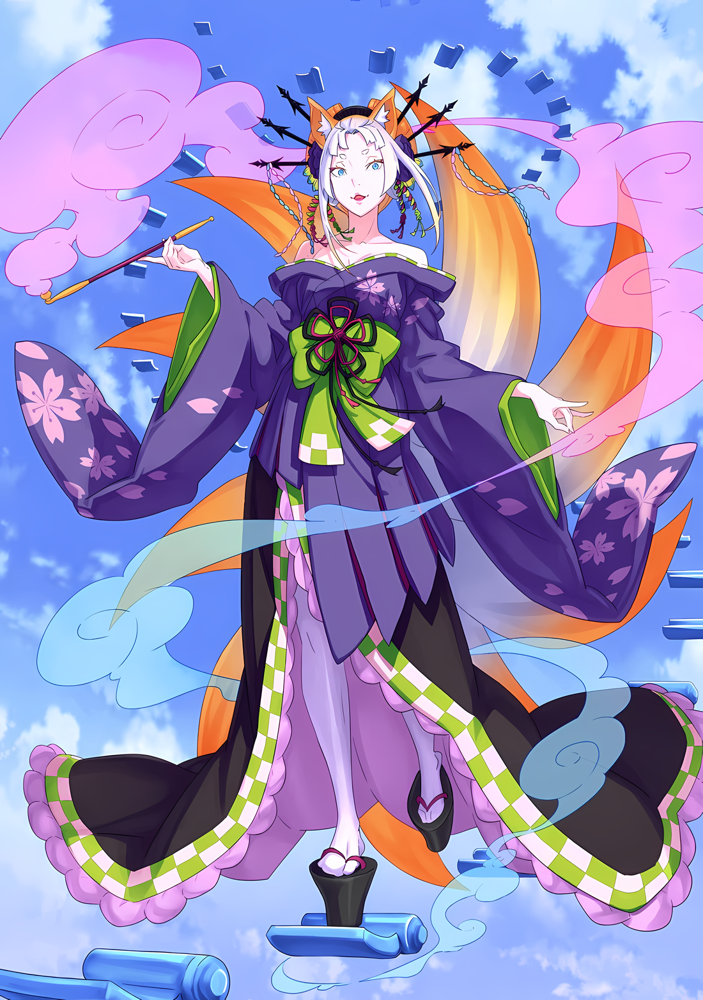
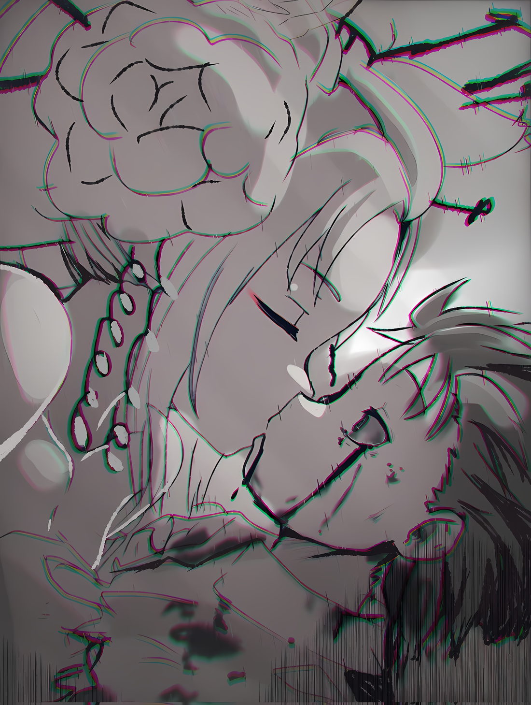

……Используя «Технику Брака Душ» на самом замке, ее Од вселялся даже в неорганические вещества.

Иллюстрация к **Ранобэ** Том 29 | Разукрасил NorvakKK

Такова была реальность необычного явления Йорны, которая использовала спиральную черепицу в качестве опоры.

Абел говорил о том, что ее «Техника Брака Душ» была применена к более чем сотне людей, преследующих группу Субару, как о чем-то необычном, но странным было даже не это.

Если он предположил, что она раздавала часть своего Од, даже своему собственному замку и кисэру.

Субару: По моему это вредит собственному телу……!

Во-первых, сам по себе акт передачи маны кому-то другому был довольно утомительным.

На самом деле Субару не понаслышке знал, насколько это сложно, поскольку регулярно обменивался маной с Беатрис, с которой у него были контрактные отношения.

Например, в Песчаном море, по пути к Сторожевой Башне, Беатрис забрала у него много маны, и, хотя это было только необходимое количество, он устал как собака.

Кроме того, риск возникновения проблем с его Од, связанным только с Беатрис, в случае Йорны, по простым подсчетам, возрастал более чем в сто раз.

Вдобавок ко всему, она сама обладала силой, способной развернуть нешуточную битву.

В действительности, тот факт, что она должна была устать, потому что делилась своей силой со всеми, был, учитывая, что она расколола замок резким ударом, совершенно невероятным.

Ольбарт: Хахаа, ты используешь какие-то странные навыки. Боже, сколько бы я не прожил, техники, которые я не знаю, появляются одна за другой, это настоящая головная боль.

Йорна: Это плодородная почва, на которой мы живем, так что тебе нет смысла сетовать на неё. С моей точки зрения, навыки старика Ольбарта тоже доставляют немало хлопот…… Было бы лучше заставить тебя исчезнуть.

Ольбарт: Какакакка! Меня так просто не выведешь из игры…… Вуоох!?

Ольбарт, смеясь с открытым ртом, попятился назад в ответ на враждебность, последовавшую за этим.

Мгновенно крыша под ногами Ольбарта лопнула, и черепица взлетела вверх от взмаха прямо под ним. Это было очень похоже на возмездие за предыдущую атаку, в которую попала Йорна.

И все же, в отличие от одиночного удара Ольбарта, атаки Йорны следовали одна за другой, словно по пятам.

Паф-паф-паф, с таким звуком ударные волны преследовали Ольбарта, когда он крутанулся назад и отпрыгнул в сторону. Для этого Йорна просто взмахнула своим гибким пальцем, используя черепицу, закрепленную в воздухе.

Ольбарт: Йо! Хо! Ха! И ещё!

Йорна: Старик Ольбарт, ты упрямый человек.

Ольбарт: Бросаясь словно мухами.. ты не знаешь как относиться к старшим, девчушка. Однако….

Прервав свои слова на этом, Ольбарт крутанул свое тело, отступая назад. Когда он повернулся спиной, находясь в перевернутом положении, крыша поднялась, как волна, чтобы поприветствовать его.

Его преследовали ударные волны спереди и волны черепицы со спины, его атаковали с двух сторон…… вид башни замка, вздымающейся, как океан, заставил Субару усомниться в своих глазах.

Но сомневаться в своих глазах — это то, что он хотел бы сделать и для того, что произошло непосредственно после этого.

Ольбарт: …………

Когда черепица надвигалась, как приливная волна, Ольбарт оттолкнулся от воздуха и по собственной воле врезался в черепицу головой вперед.

Несмотря на то, что по виду это было похоже на волну, черепица, составляющая большую волну, не потеряла своей твердости и веса.

Если бы он упал головой вперед, все его тело было бы искорежено, кости сломаны, и, в конце концов, его голова была бы трагически разбита. Не задумываясь, Субару закрыл лицо Луис, обнимая ее, и услышал ее протестующее «Уу!».

Но этот жестокий исход так и не наступил.

Ольбарт: Разве не удивительно, что я смог применить технику скрытия в земле без подготовки?

В момент столкновения Ольбарт беззвучно погрузился в волны черепицы, словно ныряя в воду, и выпрыгнул прямо на заднюю часть волны крыши. Соскребая оторванную каблуками черепицу, он хитро улыбнулся, показав свои белые зубы, и сделал вид, будто в этом нет ничего особенного.

На самом деле Ольбарту еще только предстояло показать всю глубину своих способностей.

С другой стороны, Йорна, вероятно, уже раскрыла все ужасы, что таит в себе «Техника Брака Душ», но……

Йорна: Сможешь ли ты достичь своей цели, поступая вот так, старик Ольбарт?

С хладнокровием она смотрела с неба на чудовищного старика, который до сих пор не получил ни одной раны.

Оба они показали лишь малую часть своей силы. Одного этого было достаточно, чтобы доказать, что «Девять Божественных Генералов», величайшие воины Империи, обладают огромной силой.

Однако, если бой продолжится в том же духе, можно предположить, что их поединок будет равным, так как обе стороны не сдадутся.

Видимо, не только у Субару и Луис, наблюдавших за происходящим со стороны, сложилось такое впечатление.

Ольбарт: Боже правый, как больно это слышать. Хотя, если «Третий» будет упрямо противостоять «Седьмой», что ж, ничего не поделаешь, Его Превосходительство будет разгневан.

Йорна: Тогда, что нам делать?

Ольбарт: Хороший вопрос. Ну, я ведь тоже не бегал бесцельно….

Подняв брови, Йорна спросила об этом Ольбарта, который погладил свой подбородок. Когда он потирал его, щеки чудовищного старика искривились, и его взгляд обратился в другую сторону.

Эти светящиеся желтые глаза обратились к двум детям, наблюдающим за битвой со стороны……

Субару: ……Кх.

Йорна: Старик!!!

Внезапно взгляд Ольбарта заострился, и Субару отпрянул назад.

Сразу же после этого Йорна, подняв брови, оттолкнулась ногой от черепицы крыши и яростно бросилась на Ольбарта. И снова Йорна обрушила на Ольбарта мощные удары, такие же, как и в начале.

Однако……

Ольбарт: Вот из-за таких-то вещей, несмотря на столько восстаний, ты не дошла до Его Превосходительства ни разу.

Ольбарт выплюнул это, и его нога, несравненно более короткая, чем у Йорны, поднялась. Но подошва его башмака столкнулась с толстой подошвой на каблуке Йорны, посылая ударную волну по длинным волосам обоих.

Йорна скрежетнула зубами, Ольбарт стиснул свои, и через секунду их тела разлетелись в разные стороны. Йорна и Ольбарт, одновременно.

Затем, как только он увидел, что между ними большое расстояние, Ольбарт сунул левую и правую руки в рукава и что-то вытащил. ……Среди его пальцев были круглые и черные комочки, по четыре в каждой руке.

Субару: Пайковые шарики!?

Ольбарт: Нгх, похоже на то, да? Но если ты их съешь, все пойдет наперекосяк. ……В них плотно набиты куски Огненных Магических Камней.

Услышав вопль Субару, Ольбарт рассмеялся и сделал большой взмах обеими руками.

Если верить его словам, эти черные шары были бомбами. От удара они полетели в сторону Йорны, которая показывала большой разрыв в силах…… или нет.

Ольбарт: Во время последнего восстания велось сражение именно против жителей этого города, верно? Я бы не стал использовать что-то подобное против них, так что это что-то новое, не так ли?

С перекошенными щеками Ольбарт бросил бомбы через крышу в открытое небо.

Судя по тому, как он бросал их, казалось, что у него не было особой цели, и потому не было никаких сомнений. ……Для Ольбарта бомба просто должна была упасть на место, где есть люди.

Только это……

Ольбарт: Я слышал, что люди этого города ужасно крутые, но…… Круче ли вы людей из моей деревни?

Йорна: ……Ты ничтожество!

Размер бомбы был невелик, но скрытая в ней сила была совершенно неизвестна.

Также оставался вопрос, сколько людей в городе в данный момент находятся под действием «Техники Брака Душ» Йорны. В итоге, оставлять эти бомбы в таком виде было бы слишком опрометчиво.

Йорна тоже пришла к такому выводу. Следовательно….

Йорна: ХаАААААаа!!!

Топнув ногой так сильно, что аж проломив крышу, Йорна широко развела руки. В одной из них было зажато кисэру, которым она атаковала Ольбарта.

В то же время дым, вырвавшийся из кончика трубки, прочертил ту же дугу, что и полный взмах ее руки, и масса фиолетового дыма пронеслась по небу Хаосфлейма, как горизонтальная полоса.

……Эта масса фиолетового дыма полностью скрыла разбросанные вокруг бомбы.

Сразу же после этого небо замка окрасилось огромным грохотом цепных взрывов, громовых раскатов и ударных волн. Один из взрывов произошел рядом с Субару и Луис, ослепив их и лишив возможности стоять.

Субару: Ка….

Он смутно помнил, что видел по телевизору или в книге, что при взрыве нужно затыкать уши и открывать рот.

В результате того, что он не сделал ни того, ни другого, тело Субару получило большой урон. Его голова раскачивалась из стороны в сторону, а зрение окрасилось в ярко-красный цвет. Насколько необычной была бомба Ольбарта.

Ольбарт был не в своем уме, раз носил с собой столько таких штук.

То, что он собирался без жалости разбросать их по всему городу, тоже было ясно….

Луис: Уау!

Раздался крик, и плечи Субару потрясла маленькая рука.

Взглянув, он увидел Луис в своем темно-красном, затуманенном зрении и заметил, что выражение ее лица изменилось. Ее рот дрожал от ужаса, а в голубых глазах Луис наворачивались слезы.

Видя это перед глазами, Субару ответил: «Я в порядке»,

Субару: ……Ах.

……На краю своего красного поля зрения он увидел Ольбарта, появившегося позади Йорны.

Субару: …………

Пока она занималась брошенными бомбами, ее поза оставалась прежней: она сделала полный взмах кисэру. Ольбарт, появившись прямо за ней, собирался втянуть руку и нанести удар, используя ее как меч.

Его целью был центр спины Йорны; если бы это была манга, то в такой ситуации ее сердце было бы пронзено одним ударом.

Будет ли это действительно так, как в манге, он не знал. Но в схватке было замечено достаточно, чтобы понять, что и Йорна, и Ольбарт были сверхлюдьми со способностями, как в манге.

Если все продолжится без изменений, Йорна погибнет. Так что….

Субару: Луис……!

Схватив руку Луис, лежавшую на его плече, Субару указал в сторону Йорны и Ольбарта.

Он подробно рассказал ей свой план перед тем, как войти в замок, и Луис, приведя ее в действие, открыла оба своих больших круглых глаза… В следующее мгновение зрение Субару замерцало, и телепорт состоялся.

И вот….

Субару: А

Не успев вдохнуть, Субару издал ошарашенный голос.

Причина была проста, ведь даже его размытое ярко-красное зрение было лишено внезапного теплого ощущения. По нему он понял, что причиной тому была какая-то жидкость, которую без предупреждения вылили ему на лицо.

Когда он попытался стереть это ощущение рукой, он почувствовал дискомфорт.

Хватка Луис была слишком легкой.

Ольбарт: Черт возьми, что это только что было? Вы, слабаки, должны оставаться на том месте.

Любопытный голос Ольбарта заставил Субару ошарашено посмотреть вверх. В поле его зрения находился чудовищный старик, его голова была слегка наклонена, он энергично тряс рукой.

В красном поле зрения Субару, еще более красная рука энергично размахивала рукой.

Субару: Луис……?

Наблюдая за происходящим, Субару позвал Луис по имени, крепче сжав ее руку.

Он подумал, что они должны выбраться из этого места сразу же. Им пришлось бы прыгать два раза, а может и больше. Возможно, его стошнит, но это будет терпимо.

Он перенесет это, поэтому они должны выбраться оттуда, прямо сейчас.

Из-за этого……

Субару: Луис! Мы должны спешить….

Ольбарт: Нет, не говори ничего, это выглядит слишком абсурдно. Ведь над ее шеей ничего не осталось, не так ли?

Субару: ……А?

Услышав эти слова, произнесенные так безразлично, Субару не смог понять их смысл.

Возможно, он был меньше ростом и его мозг был моложе, поэтому он и не понял их. Ему сказали что-то, чего он не понял, что-то, что его маленький мозг не хотел понимать, и поэтому….

И поэтому, даже если бы ему сказали, что от ее головы ничего не осталось, он бы их не понял.

Йорна: Как ты смеешь…… это делать!!!

Вскоре после этого, с гневным криком, что-то пронеслось над головой Субару, и Ольбарт прыгнул в сторону, чтобы избежать этого. Удар в форме прямой линии прошел через то место, где только что он был, и недавно отремонтированная башня замка снова была разрушена.

Но Ольбарт не обратил внимания на страшную силу этого удара,

Ольбарт: Оо, страшно, страшно. Но ты должна быть благодарна, лисичка.

Йорна: Что ты имеешь в виду!?

Ольбарт: Если бы не мальчик и девчонка, ты была бы мертва, понимаешь? Ну, с такими темпами, это лишь вопрос времени.

Йорна: …………

Покачивая поднятым вверх пальцем, Ольбарт продолжал говорить беззаботным тоном.

Йорна затаила дыхание, и Субару почувствовал, как ее внимание переключилось с чудовищного старика на него самого. Однако он упал на колени, и лучшее, что он смог сделать, это притянуть к себе безжизненную руку Луис.

Субару: Лу… ис…

Его зрение было красным, и он не мог нормально разглядеть фигуру Луис.

Было ли это из-за расстройства глаз Субару или потому, что фигура Луис стала ярко-красной, он даже не мог сказать.

Но одно можно было сказать точно. ……Луис умерла.

Несмотря на то, что Субару не нашел ответа на вопрос, что с ней делать.

Она поступила так, как ей велел Субару, и в результате умерла.

Субару позволил ей умереть.

Йорна: Дитя! Дитя, посмотри на меня!

Внезапно лицо Субару, опущенное вниз, подняли две руки, зажавшие обе его щеки.

Перед ним, в его красном видении, было прекрасное женское лицо. Причина, по которой он не смог с первого взгляда определить, что это Йорна, заключалась в том, что выражение ее лица было скорбным.

Оно отличалось от того уверенного лица, которое она показала накануне Субару и лжеимператору, а также их соответствующим свитам.

Оно отличалось от того доброго лица, которое пыталось вежливо обращаться с Субару и остальными в этот день.

Сейчас глаза Йорны дрожали, и она смотрела на Субару со страдальческим выражением.

Он наконец-то понял причину этого, благодаря отражению глаз Йорны перед ним.

Субару: ……Ах.

Субару упал на колени, его лицо было в ужасном состоянии.

Его левое глазное яблоко вспыхнуло ярко-красным, а правое выскочило из глазницы, удерживаемое струной. Его глазное яблоко было выбито из орбиты под воздействием мощного взрыва.

На это было странно смотреть, как на спецэффекты из дешевого фильма про зомби.

Субару: ХААа.

Осознав свое положение, Субару заметил, что зрение дрогнуло только в левом глазу, после чего выдохнул. Но руки Йорны не позволили ему упасть.

Йорна, шевеля губами и глядя в лицо Субару, проговорила: «Дитя…»,

Йорна: ……Полюби меня. Прямо сейчас.

Глядя прямо перед собой, она заявила нечто совершенно абсурдное.

Полюбить, и делать это в данный момент, было ужасно абсурдно. Во-первых, он не знал, что конкретно ему делать, а полюбить кого-то — дело не тривиальное.

Он считал Йорну хорошим человеком, и она была красива, но……

Йорна: Дитя! Если ты полюбишь меня, то и эти раны….

Ольбарт: Какакакка! Ойой, это чертовски хорошая просьба, девчушка, по-настоящему. Не то чтобы я много знал об этом, но любовь так просто не приходит, не так ли?

Йорна: Тишина!

Выкрикнув в гневе на Ольбарта, дразнившего ее, глаза Йорны окрасились в глубокий оттенок.

Наблюдая за происходящим рядом с ним, Субару повторял слабые вдохи, готовясь принять медленно надвигающиеся волны боли.

Даже если одно из его глазных яблок лопнуло, а другое выскочило, у него не было смертельных травм.

В отличие от Луис, у него все еще была голова. Он знал, что вскоре смертельная боль начнет нарастать. Он был уверен, что будет кричать, вопить и доставит Йорне массу неприятностей.

Он не хотел причинять еще больше неприятностей……

Йорна: Дитя.

Прозвучало одно слово, и сознание Субару померкло.

Затем, подобно атаке, использовавшей промежуток всего в одно мгновение, серьезное лицо Йорны приблизилось к его лицу.

Субару: …………

Губы Йорны окутали губы Субару.

Мягкое ощущение коснулось его лица, и он почувствовал, что ее дыхание слишком близко. Он не сразу понял, что его целуют.

Арт от ZeroBarto

Отчасти потому, что он был моложе, а отчасти потому, что у него не было большого опыта. Его скудные воспоминания были довольно далекими, и он считал их очень, очень трогательным опытом, но это…

Йорна: Мои губы не дешевые. Так что….

Поцелуй закончился, Йорна отстранила лицо и прервала свои слова, за которые цеплялась. Однако Субару смутно понимал, последует дальше.

Она хотела сказать: «Теперь у тебя получится полюбить меня?»

Если Субару полюбит Йорну, ситуация изменится.

Скорее всего, в этом и заключался корень силы Йорны, или что-то вроде истока ее силы.

Однако……

Субару: Есть девушка, которая мне нравится, так что….

На другой стороне его ярко-красного зрения появилось лицо девушки, которая ему нравилась и которая находилась очень далеко.

Когда он смотрел на ее улыбающееся лицо, его сердце замирало. Поэтому Субару не мог полюбить Йорну.

Он не мог полюбить ее, и поэтому, услышав это, лицо Йорны напряглось от сильной боли. На это было трудно смотреть.

Ольбарт: ……Ну, не всегда все складывается так хорошо у мужчин и женщин.

Через мгновение, вместе с голосом, наполненным чем-то похожим на разочарование, поле зрения Субару полностью изменилось.

Субару: …………

Лицо Йорны, которое было прямо перед ним, исчезло, и все, что он мог видеть — это небо, окрашенное в красный цвет.

Как и в случае с телепортом Луис, его поле зрения быстро изменилось…… Нет, это произошло не так, как с Луис.

Если бы это было похоже на телепорт Луис, то мир в одно мгновение отразил бы что-то другое, более яркое.

Но то, что происходило с Субару в данный момент, было намного грубее. Его зрение вращалось, и не было никаких прерываний, как это было бы при телепорте, и он видел все с земли, земли, которая была сплошной плоскостью.

Прямо над ним на коленях стояла Йорна, а перед ней — фигура Ольбарта. Около нее лежало тело упавшей девушки, возможно, Луис.

Между Йорной и Ольбартом стояла еще одна вещь, что-то или кто-то.

Это был……

Субару: ……Ах

……Это было тело юного Субару, ребенка без головы.

Ольбарт: Боже правый, как же тяжело убить ребенка. Ну, физически это легче, не так ли?

Йорна: Старик…… кх!

С леденящим кровь криком тело Йорны вонзилось в Ольбарта. Он встретил его лоб в лоб, и тела обоих столкнулись, заставив Замок Красного Лазурита сильно раскачиваться.

Он качался, трескался, рассыпался, и снова разрушение распространялось и распространялось, а потом что-то произошло.

С этого момента Субару не понимал, что происходит.

Он больше ничего не понимал. С этим непониманием, голова Субару отлетела с крыши……

Отлетела….

△▼△▼△▼△

Темнота, его затянуло в темное пространство.

???: …………

Это было пустое пространство; у него не было ни рук, ни ног, он парил; это было непостижимо, ни неба, ни земли не существовало, он дрейфовал, ничто не дрожало, ничто не сопротивлялось, ничто не переживалось, ничто не содрогалось.

Как будто он уже много раз был знаком с этим… как будто он впервые увидел это.

Казалось, что оно отдаляется, казалось, что оно бесконечно близко.

Среди кажущейся вечной тьмы, в пространстве, где полностью господствовала тьма, раздалось эхо.

Эхо рыданий, чей-то плачущий голос, заставивший биться его несуществующее сердце, голос.

«???: Люблю тебя.»

Это были слова любви.

Как призыв к любви, просьба о любви, мольба о любви, отсрочка любви, голос просил любви ради любви.

«???: Люблю тебя. Люблю тебя. Люблю тебя.»

Изначально предполагалось, что любовь — это слова, наполненные различными эмоциями.

Счастья, гнева, печали, удовольствия; водоворот эмоций был наполнен таким образом.

И все же, то, что наполняло любовь в этой вечной тьме, было не более чем одной эмоцией.

«???: Люблю тебя. Люблю тебя. Люблю тебя. Люблю тебя. Люблю тебя. Люблю тебя. Люблю тебя. Люблю тебя. Люблю тебя. Люблю тебя. Люблю тебя. Люблю тебя. Люблю тебя. Люблю тебя. Люблю тебя…»

Среди всей полноты этих эмоций, во всей полноте этой кружащейся любви, было только «Печаль».

Печаль, печаль, печаль, печаль…… Любовь рыдала, окутанная печалью.

Непрерывно раздавались рыдания.

Непрерывное рыдание заставляло его жаждать смерти только потому, что он слушал его.

Любовь была печалью, любовь состояла из печали, любовь состояла из грусти, любовь была печальной печалью.

Рыдая, исполняя любовь на любви, печалясь от печали, они соединились в конечной точке.

«???: ……Где же ты?»

△▼△▼△▼△

Ольбарт: Я слышал, что люди этого города ужасно крутые, но…… Круче ли вы людей из моей деревни?

Йорна: ……Ты ничтожество!

Кружащееся, вращающееся красное видение сделало оборот, и напряженные голоса ударили по его барабанным перепонкам.

Один из них принадлежал старику, а другой…… женщине: он понял, что это были Ольбарт и Йорна соответственно.

Он понял, но это было единственное, что он мог понять.

Субару: Ха….

Йорна: ХаАААААаа!!!

Сразу после ошеломленного голоса раздался сильный удар, и, сильно наступив на крышу замка, нога Йорны раздавила ее. В то же время, золотая кисэру в ее руке взметнулась.

Большой, горизонтальный, дугообразный удар кисэру, с огромной скоростью и разрушительной силой, распространил большой шлейф фиолетового дыма по небу Хаосфлейма.

Субару знал, для чего это было сделано и что произойдет дальше.

Он знал, но это произойдет прежде, чем осознанное им знание сможет догнать реальность.

……Бомба, пораженная фиолетовым дымом Йорны, взорвалась, и ударная волна охватила все вокруг.

Субару: Гха….

Все его тело омыл тот же удар, что и несколько мгновений назад, поле зрения Субару окрасилось в ярко-красный цвет.

Ему показалось, что он услышал небольшой звук, как будто что-то раскололось, и он сразу же связал его с покрасневшим зрением. Звук был разрывом глазного яблока. Следовательно, зрение Субару стало красным.

Если так, то скоро и другая сторона его поля зрения потемнеет……

Субару: А, ГХЫААААААААА……!!!

Закрыв лицо обеими руками, Субару закричал, так как его поразили две вещи: боль и «Понимание».

Он обрел «Понимание». Одно из его глазных яблок было разорвано, а другое выскочило наружу. Пока его мозг не хотел понимать, можно было не обращать внимания на боль.

Но если бы он знал, что произошло, он не смог бы игнорировать боль.

Субару: АААГХА! АХХ, ГХАААААААА!!!

Луис: Уау! Уауу!

Маленькое тело прижало к себе Субару, который рухнул на спину и громко застонал.

Его звали по имени. Он не понимал. Его уши горели, а его собственный голос был слишком громким. Боль, струи крови — он слышал их. Он не понимал, течет ли кровь внутри или снаружи его тела. Было больно, просто больно. Больно, больно, больнобольнобольно.

Кто-нибудь, помогите. Он не хочет боли. Он не любит боль. Он не любил боль.

Больно, больно, потому что больно, больно, больнобольнобольнобольнобольнобольно.…

Субару: Ва….

Ольбарт: Ойой, разве это не плохая идея?

Субару: ……Кх

Боль кружилась в его голове, его красное зрение остекленело.

Субару удерживала рука, но когда он пытался повернуться, она мешала ему. Он хотел закричать громче, еще больше вырываться и позволить боли вырваться из его тела.

Нет, болело его лицо. Его глаза и уши. Так что, если бы было больно где-то еще, если бы эта боль ушла куда-то еще.

Луис: Уау! Ауаа……

Тук-тук, он ударился головой о землю. Сильная сила потянула его вверх. Кто-то закрепил руки за его спиной, лишая его возможности двигаться. Это было больно, он боялся, что ему будет больно. Он ненавидел это, он боялся, он собирался умереть.

Субару: Гху……

Ольбарт: Ках, ты же не серьезно, лисичка. Что у тебя за тело, которое не умирает от такого? Так вот о чем говорил Сесилус, когда сказал, что не сможет отрубить тебе голову?

Йорна: ……Я ни за что не открою свои женские секреты паршивцу, который поднимает руку на детей.

Вдалеке кто-то спорил. Зажатый между собственным голосом и голосом, который пытался удержать его, он ничего не слышал. Он не мог понять. Было больно, все было неправильно.

Да, все было неправильно. Краснота и боль, все было их виной. Все было из-за них.

Субару: Это из-за них……! Это, это, это их вина! Не моя! Эт… эт.. о… это вс…е он… они!

Луис: Уу!!!

Корчась и сопротивляясь, Субару пытался затолкать все это куда-нибудь еще. А что, если он вытолкнет все в другое место и сможет убежать, что ему делать, если он сможет убежать?

Он подумает об этом после того, как сбежит. Он подумает об этом после того, как сбежит.

Ольбарт: Вахвах, я не выношу детского плача. ……Заткнись уже.

Йорна: Подожди……!

Женский отчаянный голос и незаинтересованный хриплый голос.

Услышав их, что-то приблизилось со звуком скрежета. Сзади его головы, скрепив руки за его спиной, кто-то крепко обнял Субару.

Но объятия не помогли.

Потому что ярко-красный, раскаленный свет снова взметнулся вверх, поглощая Субару и остальных.

Он был проглочен, и боль ушла, а затем……

Ольбарт: Я слышал, что люди этого города ужасно крутые, но…… Круче ли вы людей из моей деревни?

Йорна: ……Ты ничтожество!

Мгновение спустя он снова услышал голоса, которые слышал совсем недавно, и, услышав их снова, его сознание побелело.

Субару: А……?

Сразу же после того, как все внезапно и резко оборвалось, воспроизведение началось заново.

В его ярко-красное зрение вернулись другие цвета, он почувствовал шум ветра в своих глухих ушах, ощутил тепло мягкой девушки рядом с собой, и….

Йорна: ХаАААААаа!!!

Голос энергичной женщины стал громче, и мгновение спустя рука взметнулась с огромной силой.

Траектория движения взмахнувшей руки была ему уже известна.

……Серия взрывов раздалась, и шок окрасил его зрение в ярко-красный цвет.

Субару: ГЫААААХХ!!!

Прикрыв лицо и чувствуя боль от разорванных и выскочивших глазных яблок, Субару рухнул спиной вперед на крышу и закричал.

Луис: Уау! Уаау!

Чей-то голос, похоже, плачущий, подскочил к его упавшему телу.

Когда он почувствовал это, когда он слушал мир, заглушаемый резкими звуками, когда он оплакивал боль и страдания, голова Субару наполнилась слезами, страхом и «почему».

Возможно, он был мертв. Он был мертв.

Он знал смерть. Она была очень болезненной и жестокой, она держала его вдали от этого места. Но затем она немедленно вернула его в этот момент, и тогда он умер; однако это было болезненно, из-за красного взрыва.

Даже зная это, Субару мысленно повторял: «Почему?».

……Это ведь не так.

Смутно, в его голове прозвучало ощущение, почти отталкивающее его болью и краснотой. Но это было чувство абсолютной уверенности, которое он не мог отпустить.

Глазное яблоко лопнуло, глазное яблоко выскочило, его барабанные перепонки разорвались, он кричал от боли, вскоре после этого он снова умрет ужасным образом, несмотря на желание, чтобы боль была на расстоянии. Вместе со слезами, соплями, слюной и вытекающей мочой, его бешеная голова думала вот о чем.

Субару: Эт… не…

Луис: Уау! Аа, уу!

Субару: Это не мое….

Это не оно.

Это не оно, это не оно, это не оно.

Это не оно, это не оно, это не оно, это не оно, это не оно, это не оно, это не оно.

Это не оно, это не оно, это не оно, это не оно, это не оно, это не оно, это не оно, это не оно, это не оно, это не оно, это не оно, это не оно, это не оно, это не оно.

Это не оно, это не оно, это не оно, это не оно, это не оно, это не оно, это не оно, это не оно, это не оно, это не оно, это не оно, это не оно, это не оно, это не оно, это не оно, это не оно, это не оно, это не оно, это не оно, это не оно, это не оно, это не оно, это не оно, это не оно, это не оно, это не оно, это не оно, это не оно, это не оно, это не оно, это не оно, это не оно, это не оно, это не оно, это не оно, это не оно, это не оно, это не оно, это не оно, это не оно, это не оно, это не оно, это не оно, это не оно, это не оно, это не оно, это не……

Субару: Эт… не…… тц

Прежде чем боль заполнила его голову, он подумал о том, что никогда не должен забывать.

Снова и снова Субару бросали в этот мир красного цвета и боли, и это, это было….

Субару: Не… оно……!

……Это было не «Посмертное Возвращение» Нацуки Субару, а что-то другое.
