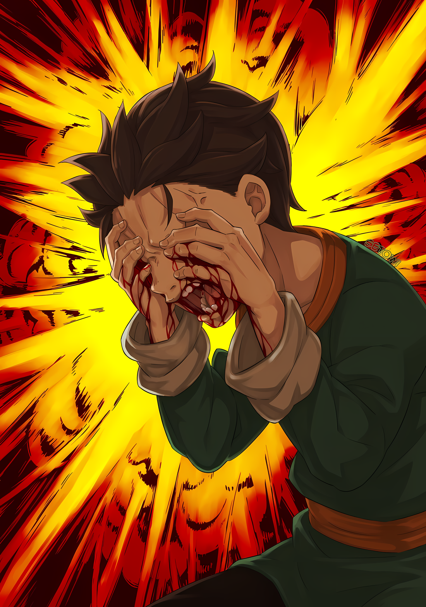
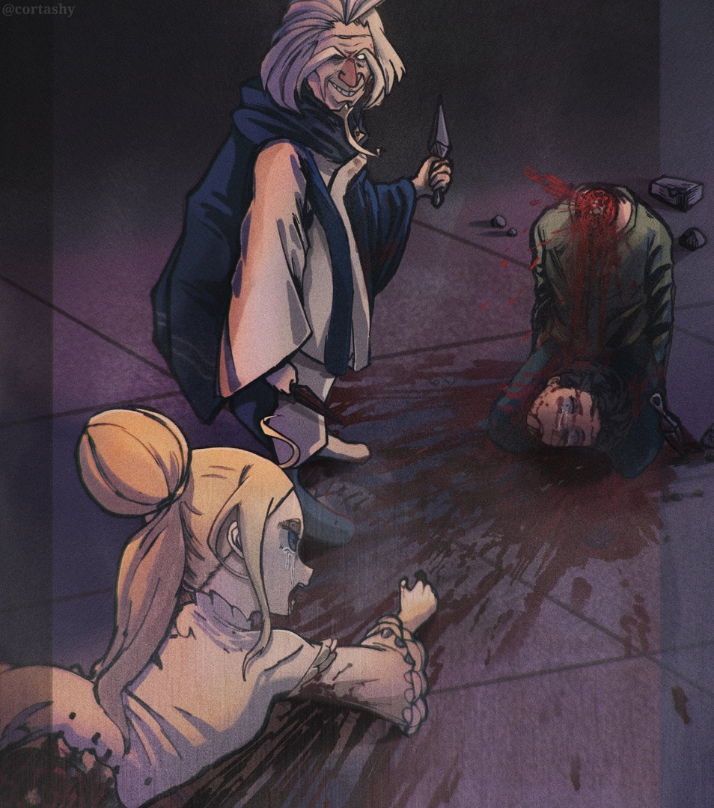
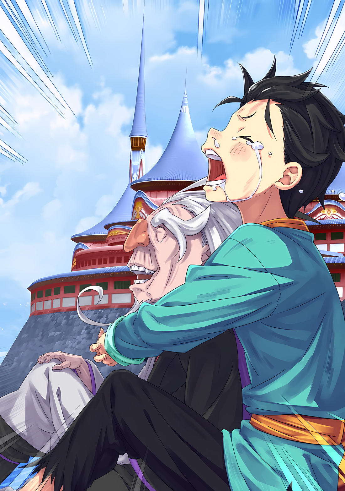

Ольбарт: Я слышал, что люди этого города ужасно крутые, но…… Круче ли вы людей из моей деревни?

Йорна: ……Ты ничтожество!

Он услышал голоса, которые слышал много раз прежде.

Хриплый голос старика и полный гнева голос женщины. А затем….

Йорна: ХаАААААаа!!!

Раздался удар, словно на черепицу крыши с силой наступили ногой, и кисэру с фиолетовым дымом яростно взметнулись. Небо Хаосфлейма было рассечено боковым взмахом, рассечено……

……И снова раздалась серия взрывов, и пришла красная, сильная боль.

Субару: Гегх, ГЫАААААХ!!!

Иллюстрация к **Ранобэ** Том 29 | Разукрасил Set0wi

Луис: Уау! Уаау!

От боли и шока от того, что одно глазное яблоко лопнуло, а другое выскочило, он рухнул на землю, схватившись за лицо. Легкое тело прыгнуло на него; он уже знал, что это произойдет.

Но хотя он и знал это, он не мог с этим справиться. Просто не хватило времени.

Субару: Гуххх! Агх, гхх, УГХХХХ!

Ярко-красное поле зрения, боль, похожая на ту, когда ему разбили голову, его душа кричала вопрос: «Почему?».

Все это заставляло Субару тратить те десять секунд отчаяния, которые приходили снова и снова.

Боль мешала ему думать, потеря, из-за которой мир стал красным, мешала видеть окружающее. Даже если она быстро исчезала, три секунды — это все, что ему было нужно, чтобы снова и снова смаковать ту же самую боль.

Боль, краснота, страх, вопрос, смерть. Боль, краснота, страх, вопрос, смерть. Боль, краснота, страх, вопрос, смерть. Боль, краснота, страх, вопрос, смерть. Боль, краснота, страх, вопрос, смерть. Боль, краснота, страх, вопрос, смерть. Боль, краснота, страх, вопрос, смерть. Боль, краснота, страх, вопрос, смерть. Боль, краснота, страх, вопрос, смерть. Боль, краснота, страх, вопрос, смерть. Боль, краснота, страх, вопрос, смерть. Боль, краснота, страх, вопрос, смерть. ……Это повторялось бесконечное количество раз.

Он сходил с ума.

Ольбарт: Я слышал, что люди этого города ужасно крутые, но…… Круче ли вы людей из моей деревни?

Йорна: ……Ты ничтожество!

Снова послышались те же голоса. Боль и краснота прекратились лишь на мгновение.

Но он снова был так напуган, что его душа разрывалась на куски, ведь ему предстояло испытать ту же боль.

Субару: АААААА……кх!!!

Он не хотел ничего слышать. Он не хотел чувствовать боль. Это было страшно.

Он широко открыл рот и закричал; закричал до того, как его горло разорвалось. Поскольку он не хотел ничего видеть, он закрыл глаза и скрючился, положив руки на голову.

И в следующий момент.

Субару: …………

Бум, раздался звук взрыва, и маленькое тело Субару оттолкнулось и покатилось прочь. Звук отдалился, и его душа сжалась от ужаса, когда боль и красный цвет снова пришли.

Однако……

Субару: ……Ха

Боль так и не пришла.

Боль от того, что одно глазное яблоко лопнуло, а другое выскочило, не наступила. Хотя его слух был разрушен, мир не покраснел. Больше всего ему было больно в горле из-за его громкого крика.

Субару: Поче… му….

Луис: Уау!

Вскоре после того, как прозвучал его оглушенный голос, на него набросилось маленькое тело.

Это была Луис. Она потянула его за руку, пытаясь заставить Субару встать. Но он не мог, его колени не имели силы, и он еще не получил ответа на свое «почему».

Его горло сжалось, а на глаза навернулись слезы, он был рад хоть на мгновение избавиться от этой боли, полной красного цвета. Не в силах больше этого выносить, он скрючился и заплакал.

Йорна: Расл….

Ольбарт: Ойой, разве это не плохая идея?

Йорна: ……Кх.

Вдали от присевшего и плачущего Субару продолжалась битва в совершенно другом измерении. ……Нет, чаша весов склонилась в огромную сторону; сквозь размытое зрение он увидел, что женщина упала на колени.

Йорна, согнувшая колени, и Ольбарт, стоящий к ней спиной.

Ольбарт взмахнул своей кроваво-красной правой рукой, удивленно подняв брови и глядя на Йорну, из уголка рта которой текла кровь.

Йорна: Гхукх……

Ольбарт: Ках, ты же не серьезно, лисичка. Что у тебя за тело, которое не умирает от такого? Так вот о чем говорил Сесилус, когда сказал, что не сможет отрубить тебе голову?

Йорна: ……Я ни за что не открою свои женские секреты паршивцу, который поднимает руку на детей.

Стуча молярами, Йорна ответила Ольбарту голосом, лишенным какой-либо потери интенсивности. Услышав это, Ольбарт разразился своим обычным громким смехом.

После этого он помахал своим пропитанным кровью рукавом,

Ольбарт: Ты говоришь забавные вещи. Я покажу тебе, что на самом деле значит поднять руку на ребенка.

Йорна: Стой……!

Из его рукава вырвался черный шар…… бомба была брошена и полетела в сторону Субару и Луис.

Луис быстро шагнула к Субару и попыталась отразить ее, но было слишком поздно.

Красный свет снова взорвался перед глазами Субару, и все тело Луис, рванувшееся вперед, вместе с телом Субару, было охвачено светом и снова разорвано на части.…

Ольбарт: Я слышал, что люди этого города ужасно крутые, но…… Круче ли вы людей из моей деревни?

Йорна: ……Ты ничтожество!

Снова послышались те же голоса.

△▼△▼△▼△

……Как только красный цвет и боль исчезли, он закрыл глаза и издал громкий крик.

Многократно испытав на себе красную боль, и лишь несколько раз сумев избежать ее, Субару вывел для себя непреложное правило.

Несмотря ни на что, как только красная и боль придут одновременно, Субару ничего не сможет с этим поделать. Он мог только плакать, кричать, а потом умереть.

И как только он думал, что умер, он снова слышал эти голоса и испытывал красную боль от взрыва.

Он хочет больше этого делать. Не хочет. Просто не хочет, молит о прекращении, он боится.

Ольбарт: Я слышал, что люди этого города ужасно крутые, но…… Круче ли вы людей из моей деревни?

Йорна: ……Ты ничтожество!

Снова послышались те же голоса.

В этот момент боль и краснота полностью отступили, и мгновенное облегчение, казалось, выжало все силы из его тела. Терпя это, он сделал то, что должен был сделать.

Субару: АААААА……кх!!!

Зажмурив глаза, он широко открыл рот и завыл.

Хотя он не мог слышать из-за собственного крика, Йорна, вероятно, широко размахивала своим кисэру, пытаясь взорвать бомбу, брошенную Ольбартом.

Итак, вскоре после этого……

Субару: ……Кх

Все тело Субару было отброшено грохотом и взрывной волной, и он приземлился на задницу. Угол черепицы впился в его задницу, боль была настолько острой, что ему показалось, что он вот-вот заплачет.

Но он не заплакал. Нет, он не хотел плакать и не хотел, чтобы его зрение помутнело. Потому что….

Субару: Я вижу….

Испуганно открыв глаза, он увидел, что они не лопнули и не выскочили.

Как обычно, уши не работали, только звенели, а горло горело, но он не чувствовал той красной боли. Все было в порядке. Все было хорошо.

Если бы он закрыл глаза и громко закричал, ему не пришлось бы испытывать эту красную боль.

Луис: Уау!

Луис бросилась к Субару, она, казалось, была на грани того, чтобы расплакаться от эмоций. Когда он наконец смог увидеть лицо Луис, ее голубые глаза были широко открыты, как будто она беспокоилась о Субару.

Не думая, он обнял тело Луис и крикнул: «Я в порядке!».

Луис: У.

Субару: Я в порядке! Было больно, и все было в красном… Да, но теперь, я в порядке….

Как бы то ни было, как только боль и краснота исчезали, он закрывал глаза и кричал.

Пока он помнил это правило, он никогда не должен был страдать. Когда Субару обнимал худое тело Луис, он был уверен в этом.

Ольбарт: Неа, ты совсем не в порядке, смотри. Вон туда, да-да.

Сразу же после этого Субару услышал ужасающий голос и рефлекторно посмотрел вверх.

Когда глаза Субару расширились, Ольбарт с довольной улыбкой бросил сюрикены, которые по кривой траектории полетели в сторону Субару и Луис.

Тупое оружие шиноби темного цвета, сверкающее блеском, было нацелено точно в жизненно важные точки.

Субару: Ик.

Йорна: Я не потерплю такого разврата.

Горло Субару сжалось, и перед ним появилась спина Йорны. Она перехватила траекторию встречных сюрикенов своим кисэру, сбивая их на пути полета.

Одновременно с этим черепица по обе стороны от Ольбарта поднялась, а затем врезалась в чудовищного старика с силой мышеловки или мухобойки.

Однако……

Ольбарт: Какакка! Какое яркое зрелище, не забавный ли прием!

Ольбарт в минуту скрутил свое тело, чтобы увернуться от удара черепицы.

Субару считал, что чем больше тот, кто трудится в бою, тем он сильнее и тем шире диапазон его атак. Однако ловкость и сообразительность Ольбарта опровергли это мнение.

Ольбарт: Ну, мне не нужны эти броские штучки. В конце концов, человека можно убить острой иглой в лоб.

Йорна: От твоих слов у меня чешутся лисьи уши. ……Как насчет этого?

Ольбарт: Ого.

Ольбарт уклонился от демонстративной атаки, но сразу после этого Йорна ударила каблуком по крыше. Затем, одна за другой, черепицы поднялись и начали парить, вращаясь в воздухе.

Прочертив огромную спираль по всей крыше, окружность водоворота сузилась и устремилась к Ольбарту в центре. ……Прямо как торнадо.

А затем……

Йорна: Почему бы тебе не показать мне некоторые из твоих приемов шиноби о том, как сбежать из места без выхода?

Не успела она договорить, как вытянутая рука Йорны крепко сжалась.

Сразу же после этого вихревой торнадо из плиток охватил Ольбарта и одним махом впечатал его в центр. Плитки безжалостно столкнулись друг с другом, и раздался звук яростного, все сокрушающего удара.

Даже довольно крепкое человеческое тело не смогло бы выдержать давления в узле этого яростного разрушения. Оно было бы раздавлено, без шансов на выживание.

Луис: Ау….

Увидев то же самое, Луис также удивилась от его огромной разрушительной силы.

В ответ на реакцию Луис, Йорна тихо ответила: «Мне жаль, что я напугала тебя»,

Йорна: Я начала все это по своей прихоти. Я чувствую себя ужасно из-за того, как ты выглядишь….

Ольбарт: Ойой, не думай, что мы закончили. Говорю тебе, тот факт, что я все еще жив, несмотря на то, что я старик, означает, что для того, чтобы убить меня, нужно очень многое, понимаешь?

Йорна: ……тц.

Как раз когда Йорна собиралась повернуться, она услышала это замечание, и ее лисьи уши навострились. Взглянув в его сторону, она увидела, что голос, который она слышала, исходил из водоворота черепиц, собравшихся в центре, раздавив его…… Нет, он исходил сзади.

Голос, доносившийся из-под обломков разбитой черепицы, сопровождаемый грохотом, принадлежал Ольбарту, невредимому, несмотря на то, что он находился в центре вихря разрушения.

Чудовищный старик махнул рукой, улыбаясь со злобным выражением лица,

Ольбарт: Йо. И это техника шиноби, позволяющая сбежать, когда нет выхода. Довольна?

Йорна: ――. Старый или дряхлый, но все еще один из «Девяти Божественных Генералов», похоже.

Ольбарт: Какакакка! Как ужасно! Во-первых, я был старым ещё тогда, когда меня выбрали одним из «Девяти Божественных Генералов», понимаешь? Несмотря на то, что я стар и дряхл, я все еще намного сильнее многих, и именно поэтому меня выбрали. А вот тебе, девчушка, действительно нужно разобраться в себе.

Йорна: Почему это?

Ольбарт заправил руку в рукава и наклонил голову, заставив Йорну нахмуриться.

В ответ на вопрос Йорны Ольбарт продолжил: «Вот видишь»,

Ольбарт: Если бы у тебя не было так много людей, которых нужно защищать, например, жители этого города и дети за спиной, ты бы лучше справилась со мной.

Йорна: ……тц

Ольбарт: Ты сражаешься, потому что хочешь защитить других, но ты стала слабее из-за этого. У тебя неправильные приоритеты. Вот почему ты не можешь добраться до Его Превосходительства, сколько бы ты ни пыталась, девчушка.

Желтые глаза Ольбарта, казалось, пронзали Субару и Луис, когда он говорил.

В этот момент Субару понял, что они снова станут мишенью. Поняв это, он сразу же сжал руку Луис

Субару: Йорна-сан, мы с Луис уходим! Постарайтесь!

Он чувствовал себя ужасно из-за того, что втянул Йорну в эту ситуацию, а потом сбежал.

Но если бы Субару и Луис были рядом, Йорне пришлось бы бороться, чтобы защитить и их, и себя. Ольбарт воспользовался бы этой возможностью, и, конечно, ее бы убили.

Это было бы нехорошо. Он должен был не допустить этого. Как-то так.

Субару: Луис!

Выкрикнув это, Субару крепко сжал руку Луис, указывая вниз, к ее ногам.

Уловив связь между его прикосновением и инструкциями, Луис ответила своим обычным звуком, и произошел телепорт.

Тела Субару и Луис телепортировались прямо под то место, где они находились, во внутреннюю часть замка, и они обнаружили свои ноги на деревянном полу.

Убедившись в этом, Субару стиснул зубы.

Субару: Ух….

Возникло ощущение, что содержимое его желудка бурлит внутри него, и его голова покачнулась. На мгновение его красное зрение и боль мелькнули, но уровень, до которого они мешали ему, был несравним с прежним.

Теперь, когда Субару и Луис не было, Йорна могла сражаться в полную силу……

Субару: ……Тц, что!?

Сразу же после этого над головой раздался звук взрыва, который привел в действие недавнюю травму Субару.

Затем последовала цепь огромных грохотов от взрывов, их удар пронесся по крыше и по всему замку, дойдя до Субару и Луис. Его колени были близки к тому, чтобы безвольно подогнуться; отчаянно сопротивляясь этому, Субару посмотрел на потолок.

Хотя он не мог его видеть, это, скорее всего, был Ольбарт.

После всех бомб, которые он использовал, он все еще носил с собой еще больше.

???: ……Ах. Воу-воу.

Субару: А?

В поле зрения Субару, когда он поднял глаза, морщинистое лицо просунулось сквозь потолок и заглянуло вниз.

От неожиданности у Субару перехватило дыхание, а затем Ольбарт упал прямо вниз, его лицо, как и все тело, проскользнуло сквозь потолок.

Старик многозначительно улыбался, падая с потолка,

Ольбарт: Ты меня так напугал. Я принял тебя за ребенка, но я облажался, я облажался.

Луис: Уу!

Мгновение спустя Луис ударила тонкой ногой по приближающемуся улыбающемуся лицу. Но чудовищный старик ответил коротким «Йо» и взмахнул рукой, отправив в полет все, что было ниже ее голени.

Вращаясь, белая нога Луис пролетела, разбрызгивая кровь, и заставила ее закричать.

Луис: А, УУУУУУ…!

Затем, широко раскрыв глаза при виде кричащей Луис, Субару попытался притянуть ее ближе к себе, надеясь, что, возможно, он сможет ей помочь.

Было ли это ради спасения или из беспокойства за девочку, которая кричала от боли из-за потери ноги, он не знал.

Но в любом случае, он даже не смог правильно выполнить это быстрое действие.

Субару: Гагхх

В тот момент, когда ему показалось, что он услышал звук, горло Субару обожгло еще сильнее, чем когда он кричал. Кровь, хлынувшая из его шеи, забила горло, лишив его возможности говорить и дышать.

Ольбарт: Не могу позволить тебе уйти от меня, это было бы слишком сложно. Я уверен, что твоей головы хватит, чтобы пробить эту лисичку.

Сказав это, палец Ольбарта надавил на лоб Субару. Как только он это сделал, его наклоненная голова упала вперед, и голова Субару приземлилась на его собственные обмякшие колени.

Его голова все еще была прикреплена небольшим лоскутом кожи с шеи; теперь его свисающая голова касалась его коленей.

Ольбарт: Прямо как кайсяку.

Арт от cortashy

Не в силах посмеяться с услышанной ужасной шутки, он перестал что-либо слышать.

После чего……

Ольбарт: Я слышал, что люди этого города ужасно крутые, но…… Круче ли вы людей из моей деревни?

Йорна: ……Ты ничтожество!

Снова послышались те же голоса.

Он сразу понял, что нужно делать, и притянул Луис поближе.

Пока он думал об этом, раздался грохот взрыва.

……Его зрение взорвалось ярко-красным оттенком, и снова боль охватила Нацуки Субару.

△▼△▼△▼△

……Когда он услышал те же голоса, он закрыл уши, зажмурил глаза и громко закричал.

Таков был принцип выживания, который Субару открыл для себя, повторив эти десять секунд отчаяния десятки раз.

Однако, кроме этого, он еще не нашел никакого решения этой загадки.

Ольбарт: Я слышал, что люди этого города ужасно крутые, но…… Круче ли вы людей из моей деревни?

Йорна: ……Ты ничтожество!

Ольбарт бросил бомбу, и Йорна взмахнула кисэру, чтобы отразить ее. Сильный удар, ощутимый ногами, заставил Субару вспомнить, что он вернулся и что он должен делать, следуя своим укоренившимся инстинктам.

Он заткнул уши, закрыл глаза, громко закричал, а затем принял на себя удар взрыва.

Уши он заткнул ради барабанных перепонок, глаза — ради глазных яблок; он не знал, какой смысл громко кричать, но он всегда кричал, когда ему не было больно или когда все вокруг было красным, поэтому он не мог представить, как можно больше не кричать.

Он не мог смириться с мыслью, что, сделав что-то немного по-другому, он снова испытает ту же боль.

Если бы он сбил время, ему пришлось бы повторить десять секунд отчаяния десять раз или больше, чтобы снова получить тот же шанс.

С него было покончено со всем этим. Боль, страх, он покончил с ними обоими.

Легче не становилось. Всегда было больно. Ему всегда было страшно. За болью, за страхом всегда была смерть.

Так что……

Луис: Уау!

С ушами и глазами все в порядке, он поймал тело Луис, когда она прыгнула на него.

Ему удалось пережить первый взрыв целым и невредимым, в который уже раз. Остальное было циклом событий, вспоминая, что произойдет дальше, так что сначала….

Субару: Сюрикены.

Ольбарт: Не думайте, что все кончено!

Одновременно с тем, как он услышал голос Ольбарта, он вспомнил.

В следующее мгновение со всех сторон на Субару и Луис обрушился шквал сюрикенов, ни один из которых не имел одинаковой траектории.

Если бы в них попал хоть один из более чем десяти сюрикенов, они бы потеряли способность двигаться.

Чтобы остановить их, Йорна попыталась поспешно прыгнуть……

Йорна: Я не потерплю такого….

Субару: Йорна-сан! Все в порядке!

Остановив Йорну от стремительного прыжка, Субару вытянутой рукой указал куда-то. Затем, он со всей силы сжал руку, которая была привязана к руке Луис,

Ольбарт: ……Что за… какого!?

Мгновение спустя их поле зрения изменилось из-за произошедшего телепорта, и сюрикен воткнулся в то место, где находились Субару и Луис.

Глаза Ольбарта расширились от удивления из-за того, что произошло, и отсутствия каких-либо предупреждающих знаков о телепорте Луис. Действительно, Ольбарт не знал о нем, Субару и Луис держали его в секрете.

Субару проник в Замок с его помощью. Но в тот раз он был убит Ольбартом, который преследовал его……

Субару: Даже если это сработает лишь раз….

Ольбарт может быть застигнут врасплох.

И тут, к удивлению Ольбарта,

Йорна: Тебе запрещено смотреть по сторонам……!

Ольбарт: Тск…… гах.

Удар словно рубок топора парящей Йорны пришелся в Ольбарта прямо сверху.

Его мгновенная реакция оказалась запоздалой, и нога, которую он поднял, чтобы перехватить удар, не дотянулась вовремя, в результате чего все тело Ольбарта приняло удар и сложилось пополам. При этом его затылок врезался в крышу, и с громким треском фигура Ольбарта исчезла в замке Красного Лазурита.

Даже Ольбарт должен был получить повреждения от этого мощного удара……,

Ольбарт: Какакакка! Ай, ай!

Субару: Быть не может!

Как раз после того, как Субару закричал от радости, что ей удалось нанести критический удар, появился Ольбарт.

Образовав дыру в крыше, отличимую от той, в которую он попал, Ольбарт выскочил наружу, оскалив зубы и окрасив правую руку в пурпурный цвет крови.

Рукой он зацепил каблук Йорны, поэтому рука была раздроблена, как мертвая ветка.

Ольбарт не обратил внимания на ужасное состояние своей руки, отчего Субару захотелось немедленно отвести взгляд. Оставшейся левой рукой он бросил сюрикены, одновременно целясь в Субару и Йорну, стоящих впереди и позади него.

Конечно, Субару не успел среагировать. Тогда Йорна стряхнула дым на приближающуюся к ней атаку своим кисэру и тут же ткнула пальцем, заставив плитку подняться, чтобы защитить Субару и Луис.

А затем……

Ольбарт: Эх, девяносто лет.

Сказав это, Ольбарт внезапно прибег к насилию.

Он вытянул свою окровавленную правую руку и отрубил ее ниже локтя кунаем в левой руке, отправив ее в полет в сторону Йорны, разбрызгивая кровь.

Йорна: …………

Столкнувшись с этим, Йорна была вынуждена принять решение в доли секунды.

Другими словами, она могла либо парировать летящую руку, либо уклониться от нее.

Однако……

Ольбарт: Ужасная ситуация, любой из вариантов отпадает.

Йорна: Гххх…!?

Прежде чем она успела сделать выбор в пользу летающей руки, под ногами Йорны раздался взрыв. Там было отверстие, ведущее на этаж ниже, в которое предыдущий удар выбил Ольбарта.

Оттуда буквально хлынул огромный поток ветра, разрывая кимоно Йорны.

Ольбарт: Это основной принцип шиноби. Если нужно выбирать между правым и левым, то нужно выбирать верх.

Йорна: Ты, наглый старик……!

Щеки Йорны заалели, когда ее кимоно было разорвано лезвиями ветра, охватившими все ее тело. Не обращая внимания на блеф летящей руки, она шагнула вперед и попыталась броситься на Ольбарта.

Когда Йорна двинулась к нему, Ольбарт перевел дыхание и сказал: «Ах да»,

Ольбарт: Когда я сказал, что оба варианта отпадают, я солгал.

……В следующее мгновение летающая рука Ольбарта раздулась изнутри и взорвалась.

Йорна: ……Тц.

Субару: Йорна-сан!!!

Тело Йорны было поглощено взрывом, который произошел прямо рядом с ней. При этом Субару расширил глаза и из его хриплого горла вырвался крик, когда ее фигура была отброшена и покатилась по крыше.

Яма, в которую он упал, рука, которую он отрубил…… все это были ловушки, которые нужно было использовать.

С тех пор как Субару впервые познакомился с идеей шиноби как ниндзя, он думал, что они будут крайне неприятными противниками. Но ему и в голову не приходило, что они окажутся настолько «Порочными».

Почти синхронно с тем, как Ольбарт повернулся, Субару вздрогнул.

Субару: ……Луис!

Ольбарт обернулся, и в тот момент, когда он увидел свирепость в его глазах, Субару закричал.

Крепко схватив Луис за руку, он надеялся, что во время второго телепорта не возникнет никаких помех. Он просто хотел сбежать как можно дальше от Ольбарта, чтобы немного от него отдалиться……

Луис: Ауау.

Телепорт Луис состоялся, и оба их тела переместились в мгновение ока.

Они переместились куда-то на большое расстояние от Ольбарта. Поскольку укрытие в замке не позволило бы им выжить, Субару ничего не мог сделать, избежав первоначального взрыва, кроме как держаться на расстоянии, выиграть немного времени и надеяться, что Йорна остановит Ольбарта.

И……

Субару: Э?

Пока Субару пытался сдержать тошноту, что-то ударило его по ноге.

Его глаза широко раскрылись, когда он увидел, что его ударило. Это был маленький, круглый, черный шар.

Черный шар, который он видел так много раз, повергая его в пучину отчаяния.

Ольбарт: Я наблюдал за тобой некоторое время. Ты полетишь в том направлении, куда укажешь. Я до сих пор не знаю, как ты это делаешь.

«Вот почему я бросил мяч в том направлении, куда ты указывал» — с этими словами Ольбарт пожал плечами.

Этот жест чудовищного старика был плохо сбалансирован, учитывая, что у него не хватало одной руки.

Луис: Уау.

Луис снова позвала Субару.

Сразу же после этого из черного шара, взорвавшегося под их ногами, хлынул свет, разбрасывая бесчисленные осколки похожих на стекло предметов, повреждая, разрушая и разрывая Субару и Луис в клочья.

Кровь брызнула ярко-красным оттенком, осколки влетели в глаза и рот Субару, изуродовав все его тело, когда острая боль охватила его, раздробив конечности на куски.

Ольбарт: Вот и обед. Разве не забавно?

Боль снова стала красной, заставив его усомниться в своем рассудке.

Ольбарт: Я слышал, что люди этого города ужасно крутые, но…… Круче ли вы людей из моей деревни?

Йорна: ……Ты ничтожество!

Снова послышались те же голоса.

Субару: ……Тц

Как только он это услышал, Субару заткнул уши, закрыл глаза и широко открыл рот. Громкого крика не вышло. Только хриплый голос. Тем не менее, грохот взрыва и сопровождающий его ветер устремились к нему.

Ударившись всем телом, он упал задницей на крышу. Он не мог следовать своим правилам. Он не мог кричать. Боялся боли и красного цвета, который мог бы наступить. Он просто……,

Луис: Уау.

Легкое прикосновение заставило его подпрыгнуть, заставив Субару выдохнуть.

И вот, он проверил, что его глаза, уши и все остальное тело в порядке. Его глазные яблоки и барабанные перепонки были в порядке, несмотря на то, что он не издал громкого голоса. Его голос не имел к этому никакого отношения. Может быть, причиной был его рот.

Он не знает. Он не знает, но….

Субару: Гхххыы….

Обнимая Луис, Субару всхлипывал сквозь стиснутые зубы, не в силах найти способ пережить взрыв.

И поскольку он был не в состоянии найти способ, он рыдал, он трусил, он не мог больше двигаться.

Ольбарт: Вахвах, я не могу выносить звук детского плача.

И снова неизбежная «Смерть» охватила Нацуки Субару.

△▼△▼△▼△

Снова и снова он повторял циклы красного цвета и боли, и в их конце, снова испытывая чувство беспомощности, боли и суровости, страдания и страха, он все еще не мог достичь ее, даже с этой аккрецией.

Йорна: ……Полюби меня. Прямо сейчас.

В его искалеченном состоянии, сколько раз он почти получал помощь таким образом?

Каждый раз, когда он не мог действовать так, как ему говорили, ему становилось грустно.

Луис: Уау! Уаау!

Отчаянно дергая Субару за руку, Луис пыталась хоть как-то сохранить ему жизнь, не дать умереть.

Вот почему было так больно каждый раз, когда они умирали раньше Субару.

Снова и снова, и снова, и снова, десять секунд смерти и отчаяния.

В красном мире единственным чувством, которое преобладало, была боль; чувство беспомощности от того, что, как бы он ни старался, он не мог дойти до конца, сколько бы раз он ни повторял это без конца.

Его разум, казалось, вот-вот сломается. Его сердце, казалось, вот-вот умрет.

Это не было «Посмертным Возвращением».

То, что окружало Нацуки Субару, было чем-то отличным от «Посмертного Возвращения».

Он не хотел верить, что «Посмертное Возвращение» было милосердием, ни в малейшей степени.

Но по сравнению с этими десятью секундами и бесконечным нарастанием потерь, это было именно так.

……Это был поступок без любви, настолько, что казалось, будто в «Посмертном Возвращении» была любовь.

△▼△▼△▼△

Ольбарт: Я слышал, что люди этого города ужасно крутые, но…… Круче ли вы людей из моей деревни?

Йорна: ……Ты ничтожество!

И мнова послышались те же голоса.

Отстраненный голос Ольбарта и напряженный голос Йорны.

Мгновенная боль и потеря исчезли, и Субару на короткий миг, всего на несколько секунд, вернулся к голубому небу и телу, свободному от боли.

Мозг онемел, горло издало продолжение предсмертного крика, колени подкосились.

Тем не менее, условные рефлексы, уже запечатленные в его душе, заставили Субару закрыть глаза, заткнуть уши и оставить рот открытым, продолжая кричать.

Йорна: ХаАААААаа!!!

Йорна, завывая, взмахнула своим кисэру, и в небе над Хаосфлеймом возникло несколько вспышек пламени.

Горячий воздух, ударные волны и звук взрыва омыли Субару и Луис, но в этот момент, сколько бы он ни пытался, он не смог удержаться от падения на задницу.

Луис: Уау!

Субару упал на задницу, и легкое тело Луис прыгнуло на него.

Приняв его, он крепко обнял ее. Это тоже было уже условным рефлексом. Поскольку он умирал бог знает сколько раз, ему очень не хватало тепла людей. Это было все.

Других причин у него не было. Он не хотел, и поэтому сжал коренные зубы.

Субару: После этого….

Времени на облегчение не будет, потому что следующая атака, которая убьет Субару, будет стремительно приближаться.

Ольбарт: Не думайте, что все кончено!

Одновременно с этими словами Ольбарт бросил сюрикены в Субару и Луис. То, что лезвий, летящих со всех сторон, было больше десяти, и что их острота могла легко прорезать нежную кожу ребенка, он уже знал.

Он уже много раз переживал, как его убивали сюрикенами. Но какой боли они соответствовали, он не мог вспомнить. Не было ни одной безболезненной смерти, поэтому он не знал.

Йорна: Я не потерплю такого разврата.

Во время его замешательства, Йорна вмешалась, повернувшись спиной к Субару.

Она отбила все сюрикены с помощью кисэру в руке, а затем, в отместку Ольбарту, заставила черепицу крыши колебаться и ударила его Замком с двух сторон, прижав его к земле.

Ольбарт: Какакакка! Какое яркое зрелище, разве это не забавный прием!

Ольбарт использовал свою ловкость, чтобы уклониться от атаки.

Из-за запоздалой реакции Субару ситуация развивалась по тому же сценарию. Но Субару ничего не мог сделать в этой ситуации, которую он уже наблюдал бесчисленное количество раз.

Когда на Йорну собирались напасть, а он пытался защитить ее, когда ему удалось сбежать в замок, когда он бросился на Ольбарта, потому что у него помутилось в голове, он все равно погиб.

Что, если все пути, все действия ведут к смерти?

Ольбарт: Ну, мне не нужны эти броские штучки. В конце концов, человека можно убить острой иглой в лоб.

Йорна: От твоих слов у меня чешутся лисьи уши. ……Как насчет этого?

Ольбарт: Ого.

Йорна ответила на провокацию противного Ольбарта, ударив каблуком по крыше.

Одна за другой черепицы отлетали, и образовался торнадо разрушения, закрутившийся вокруг всего замка. Он знал, что оно тоже было ужасно мощным. Но он не мог победить Ольбарта.

Субару: Что же……?

Мне делать? Он не мог понять. Он предчувствовал, что скоро произойдут болезненные, страшные вещи, и снова.

Неудача. Как ее можно избежать? Красный мир, хор боли.

Даже если бы он хотел помочь Йорне, он стал бы для нее обузой.

Даже если бы Субару попытался сбежать с Луис, их бы поймали.

Если бы он только вернулся в более ранний момент времени, он бы никогда не пошел на крышу с Йорной. Если бы только он оставил Йорну одну, если бы только он не расстался с Абелом и остальными, если бы только он не рассказал о Луис, Алу, Медиум, Таритте, если бы только он не был меньше, если бы только это был прежний Субару, Зикр, Флоп, Мизельда, Куна, Хоули, Утаката, Присцилла, Рем, Рем, Рем, Рем, Рем, Рем.….

Рем, он должен вернуть ее домой, и все же он здесь, умирает.

Если Субару остался в мире, где смерть неизбежна, что он может сделать, кроме как продолжать умирать вечно и вечно, что вообще может сделать Нацуки Субару?

Снова и снова смерть, боль и чувство беспомощности одолевали Нацуки Субару.

Казалось, что оно вот-вот раздавит его сердце и тело, и тогда……,

Луис: Уау.

Мягкое тепло девушки, держащей его за руку, передалось ему, это заставило Субару проглотить слюну.

Это тепло внезапно дало Субару понять.

Для Нацуки Субару это было невозможно, но….

Субару: ……Если бы все остальные были здесь, что бы они сделали?

△▼△▼△▼△

Боль, краснота, страх, почему, смерть.

Боль, краснота, страх, почему, смерть. Боль, краснота, страх, почему, смерть.

Боль, краснота, страх, почему, смерть. Боль, краснота, страх, почему, смерть. Боль, краснота, страх, почему, смерть. Боль, краснота, страх, почему, смерть.

Десять секунд отчаяния, повторяющиеся раз за разом.

Бесконечный ад боли и беспомощности нагромождался друг на друга, пытаясь снова и снова сломать разум Субару.

Но после стольких повторений этих десяти секунд отчаяния, он понял, что находится дальше.

Боль, краснота, страх, почему, смерть. ……За кулисами всего этого.

После этих десяти секунд отчаяния появилось множество других возможностей, но ответа на вопрос, как избавиться от боли, по-прежнему не было.

И снова Субару умирал, снова и снова. Много раз, повторяя боль и страдания, он умирал.

Ничего не работало.

Субару всегда огорчал Йорну, позволял Луис сначала умереть, а потом и сам умирал.

……Но было время, которое лежало за пределами десяти секунд отчаяния.

Он бы использовал все это время.

И даже если бы он использовал все это время и в конце концов умер, он снова вышел бы за пределы десяти секунд отчаяния, на одиннадцатую секунду, и думал бы о жизни.

……Если бы все остальные были здесь, что бы они сделали?

Ольбарт: Я слышал, что люди этого города ужасно крутые, но…… Круче ли вы людей из моей деревни?

Йорна: ……Ты ничтожество!

И снова послышались те же голоса.

В этот момент Субару заткнул уши, закрыл глаза и открыл рот, чтобы выдержать взрыв. Грохот и удар взрыва атаковали все его тело; не выдержав, он упал на землю.

Тут же к нему подскочило маленькое тело с криком: «Уау!». Поймав его, он обнял его в ответ, как бы успокаивая, и при этом размышлял.

……Если бы все остальные были здесь, что бы они сделали?

Субару: …………

Субару стал меньше.

Его руки и ноги стали короче, а содержимое головы, скорее всего, стало таким же, как у ребенка.

Если бы он был прежним Субару, он мог бы сделать много вещей и придумать еще много идей. Но прежнего Субару здесь не было. Поэтому он не мог придумать, как исправить ситуацию.

Таким образом, эта проблема не могла быть решена Нацуки Субару в его нынешнем виде.

Поэтому……

Субару: Если бы все остальные были здесь….

До сих пор они сталкивались с множеством проблем и совершали множество ошибок, но вместе они преодолели их в полном объеме и зашли так далеко.

Теперь Субару был совершенно один. Он находился в Империи, где почти никого не знал.

Однако в Субару было что-то, что он получил от всех.

Субару: Если бы все остальные были здесь….

Что бы они сделали?

Отто, Гарфиэль, Розвааль, Фредерика, Петра, Клинд, Аннерозе, Мейли, Пак, Рам, Беатрис, Эмилия, что бы они сделали?

Субару: Если бы все остальные были здесь….

Что бы они сделали?

Юлиус, Анастасия, Шарфидна, Рикардо, Мими, Хетаро, Тиви, Райнхард, Фельт, старик Ром, Че-Пу-Ха, Ал, Присцилла, Вильгельм, Феликс, Круш, Лилиана, Шаула, что бы они делали?

Субару: Все они очень сильны.

Он хотел, чтобы все, кто мог сражаться с Ольбартом, поддерживали Субару позади него.

Все они, казалось, смогли бы справиться с хитростью Ольбарта и его маленькими абсурдными трюками, но эта участь выпала ему. *Простите. Спасибо. Я люблю вас всех.*

Субару: Они могут использовать магию.

Нынешний Субару не мог подражать всем, кто способен помочь Йорне.

Он хотел что-то сделать, чтобы не стать обузой для Йорны… доброго человека. Но в данный момент очередь исцеляющей магии не наступила. *Простите. Спасибо. Я люблю вас всех.*

Субару: Если так….

Как насчет подражания всем, кто никогда не сдавался и делал все возможное до самого конца?

Почему бы не подражать всем, кто смог использовать все, что у него есть, чтобы попытаться выйти за пределы этих десяти секунд отчаяния, выйти за пределы одиннадцатой секунды и выйти еще дальше?

Йорна: Я не потерплю такого разврата.

Взмах кисэру, и сюрикены, приближавшиеся к Субару и Луис, с пронзительным ревом отлетели в сторону.

Когда это произошло, плитки по обе стороны от Ольбарта поднялись и прижали чудовищного старика, пытаясь раздавить его.

Субару: …………

Наблюдая за схваткой между Йорной и Ольбартом, он думал о том, как бы не погибнуть.

Разве он не умирал уже много раз, снова и снова? Разве он не был свидетелем этой сцены много раз? Даже если это стало трудно вспомнить, он мог вспомнить боль, не так ли?

От одной мысли об этом его тело застыло от ужаса. Его сердце сжалось, душа испугалась.

Казалось, что само существование Нацуки Субару остановилось. Но……

Луис: Уау.

Тепло, исходившее от руки, державшей Субару, не позволило ему замерзнуть до смерти.

А раз он не замерзнет, то сможет вспомнить всех.

Не было никакого способа прервать бой Йорны и Ольбарта.

Даже если бы он хотел, чтобы Йорна победила, Субару и Луис, будучи целями Ольбарта, помешали бы. Битва уже началась, и этот роман не будет развиваться дальше без победы одного из них.

Возможно, все всегда заканчивалось тем, что Ольбарт побеждал, а Субару и остальные погибали.

Так будет ли достаточно того, что Субару и Луис просто выживут?

*Эмилия: Это, наверное, о~очень неправильно. Ведь Йорну тоже нужно уберечь.*

*Отто: Должен быть лучший способ.*

*Гарфиэль: Не переставай думать.*

*Рам: Воистину глуп.*

*Розвааль: Сдаться сейчас было бы просто глууупо~.*

*Фредерика: Уверена, все будет хорошо.*

*Петра: Все здесь ради тебя.*

*Мейли: Ты же не хочешь, чтобы тебе было больно, правда?*

*Аннерозе: Должен быть выход.*

*Беатрис: Мы найдем эту брешь. Это ключ к победе, я полагаю.*

Субару: Ключ к победе.

Для кого? Конечно, для того, кто сражается.

Тогда, кто из них сражался, Йорна или Ольбарт?

Субару: Нет.

Луис: Уу?

Субару: Нетнетнетнет, НЕТ……!

На глазах у Луис, Субару, напрягший шею, громко крикнул.

Нет, я был не прав. Я люблю вас всех. Так вот почему……

Субару: Тот, кто победит……

Снова красный свет и боль распространились перед его глазами, и затем……

Ольбарт: Я слышал, что люди этого города ужасно крутые, но…… Круче ли вы людей из моей деревни?

Йорна: ……Ты ничтожество!

Снова послышались те же голоса.

Как только он услышал их, Субару закрыл уши, зажмурил глаза и присел с открытым ртом. Сразу же после этого раздался звук взрыва и ударная волна ударила по всему его телу, но на этот раз он не упал на землю.

Мгновенным движением он убрал руки от ушей и поднял голову. И оттуда……

Луис: Уау.

Заботясь о Субару, Луис бросилась к нему с обеспокоенным выражением лица.

Поймав Луис в объятия, Субару тут же начал действовать. И…

Субару: Спасибо.

Луис: У?

Когда он посмотрел перед собой, слова, произнесенные Субару, пролетели мимо головы удивленной Луис.

Боль от того, что все его тело было сожжено, что его кости были обнажены, что его внутренние органы были искалечены, все еще не утихала. Ему казалось, что он будет кричать, плакать и кататься по земле, если не возьмет себя в руки.

Однако……

Ольбарт: Не думайте, что все……

Сказав это, Ольбарт как раз собирался бросить сюрикены, которые он вытащил из рукавов.

Глаза Ольбарта встретились с глазами Субару.

Очи злобного старика, человека, лишенного милосердия даже в пожинании жизни детей. И слезящиеся глаза ребенка, много раз пережившего отчаяние, который все еще пытается сдержать слезы. Словно увидев что-то в этих глазах, блеск в глазах Ольбарта стал еще более интенсивным.

Он нацелился на Субару не просто как на средство привлечения внимания Йорны.

Чтобы убить Нацуки Субару, «Порочный Старик» выпустил из рук сюрикены.

Сюрикены летели без всякой хитрости.

Глаза Субару не воспринимали угрозу, но он чувствовал, как они приближаются к нему; и поэтому он направил поднятый палец прямо туда…… к Ольбарту.

Если бы все остальные были здесь, что бы они сделали?

Задумавшись о том, что бы почувствовали остальные, он понял.

Неважно, насколько он был измотан, мучимый ощущением бессилия, полного провала, все верили в Субару.

Независимо от того, насколько бесстыдной, насколько неприглядной была его смерть, от боли, от жестокости, от страха, от плача, от крика, от мочи, все верили в Субару.

*Я люблю всех вас.*

На вершине Замка Красного Лазурита происходила игра — пройти через десять секунд отчаяния, и наконец дойти до одиннадцатой секунды; умирая снова и снова; а тот, кто всегда в этом побеждает……

*……Тот, кто побеждает — это всегда ты, Мастер!*

Субару: Лууииииссс…!!!

Указывая на Ольбарта, он назвал имя девочки, которая замыкала эту цепочку связи тепла.

Затем он крепко и с силой сжал руку Луис…… мгновенно мир изменился.

Ольбарт: …Какого!?

Противник, которого он должен был убить своими сюрикенами, исчез, заставив Ольбарта изумленно вскрикнуть.

Это была запрещенная техника, выходящая за рамки понимания Ольбарта, которая осталась совершенно незамеченной осторожным шиноби. Единственным способом перехитрить Ольбарта было первое использование этого телепорта, так как во второй раз он смог бы ответить.

А Субару, который был телепортирован способностью Луис и полетел……

Субару: ААААААААААААААА…!

Ольбарт: Хоо?

Решительно, Субару ухватился за затылок Ольбарта, который был прямо перед ним.

Он зацепился за маленького старика в отчаянной попытке выжить, не отпуская его, изо всех сил вцепившись в его седые волосы. Момент телепортации был неожиданным настолько, что даже Ольбарт не успел среагировать на то, что его схватили.

Маленький Субару изо всех сил старался ухватиться за старика, который был не намного выше его.

Естественно, Ольбарт попытался оторвать его от себя, а Йорна, внезапно потрясенная, попыталась подбежать к ним.

Ольбарт: Кх, ты! Что за чертовщина! Мальчик!?

Йорна: Дитё! Отойди от него! Старик Ольбарт….

Рука Ольбарта схватила Субару за волосы и попыталась силой потянуть его вниз. Хотя она и хотела остановить это, Йорна опасалась вмешиваться в эту попытку, задерживая свой ход.

Не обращая внимания на реакцию пары, отчаянно цепляясь за него, Субару повысил голос……

Субару: ……Победил!

И закричал.

Ольбарт: ……Что?

В этот момент рука Ольбарта ослабла, когда он пытался оттащить Субару, а глаза Йорны расширились, и она посмотрела на него, недоумевая, что он только что сказал.

Не обращая внимания на реакцию окружающих его взрослых, Субару крепко вцепился в Ольбарта, не желая его отпускать.

Субару: Победил…… Я победил! Ольбарт-сан проиграл! Не так ли!?

Ольбарт: О чем ты говоришь….

Субару: Вы сказали, что нам нужно сделать это только один раз!

Ольбарт: А?

Когда энергия, которую он тратил на то, чтобы держать его, иссякла, Субару наконец поднял свое лицо и заговорил с седой головой Ольбарта, что была перед ним. От волнения и колотящегося сердца, а так же рыдания и соплей, у Субару перехватило горло.

Субару: И-игра в прятки! В прятках мы должны были найти вас три раза… А в догонялках мы должны были поймать вас один раз….

Ольбарт: …………

Субару: Так что поэтому! Я победил! Я поймал вас! В этой игре — победа моя! Ольбарт-сан, Йорна-сан, вы оба проиграли! Вот почему, я попедил….

Он подумал про себя, что говорит какие-то абсурдные вещи.

В первую очередь, Субару и остальные решили играть в прятки, а не в догонялки. Делать что-то вроде внезапного изменения правил игры в прятки было несправедливо.

Это было несправедливо, но он все равно не мог придумать другого способа.

Кроме того……

Субару: Это все Ольбарт-сан, вы начали мухлевать первым….

Ольбарт: ………

Субару: Так что поэтому, я победил……

Постепенно слезы и насморк, которые текли из его глаз, стали невыносимыми, а голос стал хриплым.

Несмотря на это, Субару наливался силой в своих цепких руках, не отпуская свою хитрую победу. Он поймал Ольбарта и выиграл игру в догонялки. Он победил.

Йорна: ……Что ты теперь будешь делать, старик Ольбарт?

— внезапно спросила Йорна у замолчавшего Ольбарта.

Оглядевшись, Йорна вновь зажгла кончик своего кисэру и выпустила струйку свежего фиолетового дыма. Ее вид, когда она набрала его в легкие, был таким же прекрасным, как и до начала боя.

И все же, в зависимости от ответа Ольбарта, она была готова сражаться и защищать Субару и Луис, с которыми ее практически ничего не связывало.

И это была не последняя из проблем Ольбарта.

Луис: Уау! Аа… уу!

Ольбарт: Аййй, больно

Пока Субару все еще цеплялся за Ольбарта, Луис, которая путешествовала с ним, топнула ногой по ноге Ольбарта. Луис уставилась на него, ее круглые глаза сузились до предела.

В ответ на жалобу Субару, вопрос Йорны и взгляд Луис, Ольбарт на мгновение замолчал, яростно почесав голову.

А затем……

Ольбарт: Вот что скажу, мне не нравится идея бросить игру, которую затеяли на половине пути. Не ожидал, что этим так злоупотребят.

Йорна: ……Это твой ответ, старик?

Йорна говорила тихо, ее глаза опустились, чтобы встретиться с глазами Ольбарта.

Ничего не произошло. Потому что Ольбарт опустился на место, сев со скрещенными ногами. Вместе с Субару, вцепившимся ему в спину, Ольбарт сверкнул зубастой улыбкой и сказал:

Ольбарт: Какакакка! Любой может лицезреть, что я проиграл. Если бы я сказал что-то вроде того, что победа или поражение не имеют значения, то я был бы не шиноби, а животным.

Сказав это, Ольбарт хлопнул себя по колену рукой со словами «Я проиграл, я проиграл!», глядя на небо.

Под голубым небом, на вершине прекрасного, медленно разрушающегося замка, через секунду, через две секунды, через десять секунд отчаяния, с одиннадцатой секунды и далее, будущее тихо, уверенно, вытравливалось…

Субару: Я победиииииииил……!

Иллюстрация к **Ранобэ** Том 29 | Разукрасил NorvakKK

Субару шмыгнул носом, и, всхлипывая, продолжил высказывать претензии.

Слушая Субару прижимавшегося к его спине, Ольбарт выпустил «Какакакка!», и улыбнулся,

Ольбарт: Если ты и дальше будешь так говорить, я рассержусь.

И вот, он постучал по лбу Субару.
