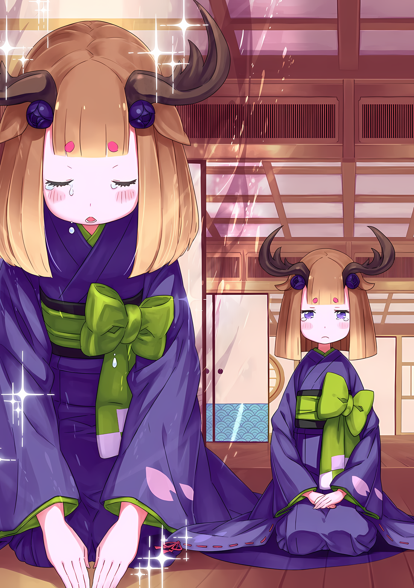
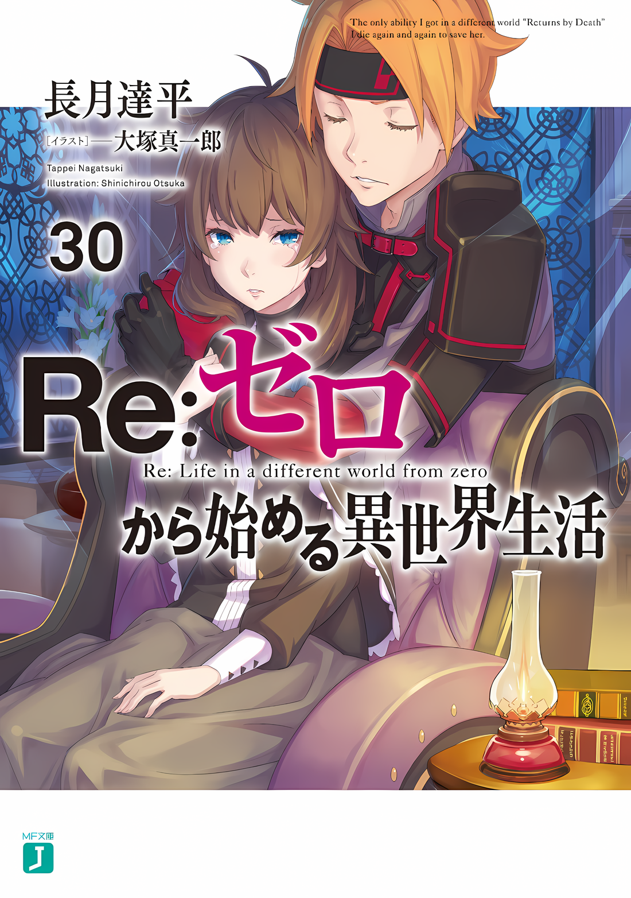

Субару: Кх, уу, ух…… Кх.

Ольбарт: Да, да, как всегда сопливое отродье плачет… ты такой противный, знаешь ли.

Шмыгая носом, Субару не мог остановить свой приступ плача. С мальчиком что к нему прижался, Ольбарт пожал плечами, и ему ничего не оставалось, как почесать пальцем щеку.

……Это был ужасный, ужаснейший опыт.

Те десять секунд отчаяния, что случились с Субару, и одиннадцатая секунда, последовавшая за преодолением этого отчаяния…… чтобы попасть сюда, — сколько же «Смертей» он пережил?

Через отчаяние и душевную боль было чудом, что его измученный дух, казалось, не исчез полностью.

Но после такого адского опыта он, наконец, достиг конца.

Луис: Уауу.

Цепляясь за руку Субару, который без конца плакал, Луис промычала.

Не то чтобы у нее был тот же опыт, что и у Субару, опыт проб и ошибок, пережитый больше раз, чем он мог сосчитать, но Луис постигла та же участь, что и Субару, много раз потеряв свою жизнь.

Запрыгнуть на спину Ольбарта, чтобы одержать такую хрупкую победу, было бы невозможно без ее присутствия.

Субару: Я…… честно, я тебя не понимаю.

Луис: Уу.

Субару: Но без тебя это было бы невозможно…… Спасибо.

Таковы были чувства в сердце Субару, хотя и в полном хаотическом беспорядке.

Он знал, что Луис была виновна в различных вещах, он знал, каким образом он и она были связаны. Он знал это, но все равно его переполняло чувство благодарности.

И благодарность переполняла не только Субару.

Луис: Уау, у…

Субару: Луис?

Прорыв плотины оказался внезапным.

Услышав сбивчивые слова благодарности Субару, слезы медленно наворачивались на большие круглые глаза Луис, а затем в мгновение ока потекли по ее щекам.

По щекам Луис посыпались слезы с такой скоростью, что она не знала, как остановить их поток.

Субару: Луис, ты плачешь, ты действительно плачешь….

Луис: Уу, уу!

Луис сама понимала, что плачет, но не пыталась остановить или вытереть слезы, которые текли по ее лицу. Все это время она продолжала цепляться за руку Субару с отчаянным видом; можно было ожидать, что она остановится, чтобы вытереть слезы.

Субару: Твое лицо, вытри его, дурочка, дурочка……

Видя, что Луис так плачет, Субару, который пытался успокоить свои эмоциональные колебания, и сам был на грани этого. Пролитые слезы, видимые рыдания, были уже бесчисленны.

Казалось, что пара, состоящая из него и Луис, так и будет плакать до бесконечности, не в силах остановиться….,

Йорна: ……Молодцы, вы двое постарались.

Субару: А….

Йорна: Сколько бы вы ни плакали, это не проблема. Я позволю вам сделать это, как Госпожа этого Города Демонов.

Длинные руки протянулись сзади Субару и Луис и нежно обняли их.

Тепло и мягкость этих слов заставили глаза Субару расшириться от удивления, он залюбовался прекрасным профилем рядом с ним. С длинными ресницами, пурпурными губами и мерцающими лазурными глазами, которые успокаивали, независимо от бед и страданий; она была настолько возвышенной, что завораживала всех, кто на нее смотрел.

Он уже знал, что за человек обладательница этих глаз.

Поэтому он знал, что и в ее словах, и в ее теплоте кроется доброта, лишенная чего-либо неприличного.

Потому что он знал, что даже если он доверит все им, его простят.

Субару: Ух, гух… ах, ух, ааааа!

Луис: Уау…… Уаукх, уа, у, уау…!

Йорна: Все хорошо…… У детей есть привилегия плакать, привилегия прижиматься к груди взрослого. Ничего страшного, если вы воспользуетесь моей грудью, вы можете выплакать столько слез, сколько вам нужно.

Посмотрев вверх, слезы снова потекли по лицу Субару. Луис обняла плачущего Субару.

Держа их обоих вместе в своих объятиях, Йорна нежно погладила их маленькие спинки. И все это произошло в тот момент, когда битва развернувшаяся на башне Замка Красного Лазурита закончилась….

Ольбарт: Я не знаю, какое лицо мне здесь корчить, потому что весь этот цирк происходит у меня на спине.

Йорна: Тишина.

С этим хамское вмешательство чудовищного старика было пресечено Госпожой Города Демонов.

△▼△▼△▼△

Йорна: Как ты теперь объяснишься, старик Ольбарт?

Ольбарт: Объяснюсь? Разве я оправдывался? Это ты напала на меня из-за своего настроения, верно, лисичка?

Йорна: …………

Вскоре после того, как Субару выплакал все слезы, на этот раз у них будет спокойный разговор…… так он думал, когда башню замка внезапно охватила неспокойная атмосфера.

Нет нужды говорить, что причиной тому был отстраненный и не терпящий возражений Ольбарт.

Сидя на крыше, он ковырялся в ушном канале кончиком мизинца,

Ольбарт: Я вроде как делал то, что мне говорили, мм? Ну, я пытался использовать несколько лазеек, однако, тот мальчишка назвал нас квитами, ясно?

Субару: Фф… Н-но, это….

Ольбарт: Теперь ты должен слушать меня, мальчишка. ……Потому что, что бы ты ни сказал, я тот, кто больше всех выиграет. Какакакка!

Субару заикнулся, когда Ольбарт широко раскрыл рот и засмеялся.

На самом деле, Ольбарт был прав. Если бы Субару стал возражать против того, что Ольбарт злоупотребляет правилами, это превратилось бы в бескомпромиссную ситуацию, в которой правила игнорировались бы, что, вероятно, сделало бы их неспособными победить шиноби Ольбарта каким-либо способом.

У Ольбарта было множество скрытых техник, и он без колебаний втягивал в них других. С тех пор, как Субару прибыл в Империю, у него было более чем достаточно опыта, чтобы понять, что такие противники — номер один по стойкости.

Субару: Ольбарт-сан, вы похожи на одного из самых страшных ублюдков, которых я знаю….

Ольбарт: Правда? В таком случае, ты должен убить меня. Я не порядочный парень, и буду серьезной занозой в заднице.

Йорна: В таком случае, старик Ольбарт, ты должен согласиться со мной, что я должна лишить тебя возможности дышать.

Ольбарт: Ой, как много ненависти в мою сторону. Ну, это естественно.

В воздухе витало напряжение, но это было вызвано односторонней враждебностью, которую развязала Йорна.

Ольбарт, против которого она была направлена, больше не был в боевой позиции. Конечно, это было лишь показухой, и он мог в одно мгновение щелкнуть переключатель обратно.

Тем не менее, для Йорны было естественно злиться, так как Субару тоже испытывал сильный гнев к Ольбарту. Однако была серьезная причина, по которой он не мог проявить свой гнев.

Это было из-за его уменьшенных конечностей и головы, которая не функционировали должным образом.

Субару: Ольбарт-сан, насчет техники, которую использовали против нас….

Ольбарт: О да, это так. Конечно, вы не можете исправить это, если я мертв. Нет, возможно, есть другой способ, но я никогда не видел, чтобы кто-то делал это.

Субару: Я так и знал…!

Ольбарт: Ну, это как страховой полис. Это секретная техника в моей деревне, так что, по сути, мы расправляемся с трупами, не оставляя следов, чтобы они не всплыли.

Довольно равнодушно Ольбарт произнес несколько тревожных слов.

В то же время Субару поздравил себя с тем, что ему удалось пройти по очень опасному канату.

Даже если бы Йорна победила Ольбарта, и старик умер, «Инфантилизация», постигшая Субару и его друзей, осталась бы неразрешенной. Его состояние всегда будет оставаться состоянием Насуки Субалу.

Одна мысль об этом заставила Субару содрогнуться.

Йорна: Я не знаю подробностей, но я слышала, что ты жестоко поступил с этими детьми.

Йорна смотрела на Ольбарта, пока та клала кисэру в рот и наполняла легкие фиолетовым дымом.

Когда Субару попросил ее о помощи, он дал ей столько честной информации, сколько мог, но он опустил мелкие детали их ситуации. В том числе и то, что Субару уменьшился в размерах под воздействием техники Ольбарта.

Как только Ольбарт растворит «Инфантилизацию», Субару вернется к своему первоначальному телу.

Как только это произойдет, он сделает все возможное, чтобы извиниться и попросить прощения у Йорны. ……Конечно, он не думал, что этого будет достаточно, чтобы полностью изменить ее впечатление от ситуации.

Ему хотелось бы думать, что Йорна была из тех людей, которые могут найти разум в одних лишь словах.

Йорна: Старик Ольбарт, ты признал свое поражение в предыдущем поединке, верно?

Ольбарт: Да, я признаю это, признаю. Конечно, это тотальное поражение. По крайней мере, мне повезло, что я не умер, проиграв. Но я не думал, что проиграю.

Йорна: Это было неожиданно, что ты проиграешь?

Ольбарт: Я думал, что это будет босс мальчика, который бросит мне хороший вызов.

Не обращая внимания на беспокойство Субару, Йорна и Ольбарт продолжили свой разговор. Йорна прошептала «Босс», цитируя Ольбарта, и осторожно просунула руку в свое кимоно,

Йорна: Отправитель послания, верно? Я с нетерпением ждала встречи с ним, но….

Внезапно Йорна оборвала свои слова и сузила глаза на Ольбарта.

Ольбарт наклонил голову от остроты ее взгляда и произнес «Что такое?»,

Ольбарт: Нет ничего страшнее, чем быть под пристальным взглядом красивой женщины. Что стряслось?

Йорна: Ради всего святого! Я велела Танзе передать послание всем гонцам, чтобы они пришли в замок. ……Куда подевалась Танза?

Воздух быстро остыл до такой степени, что Субару почувствовал, что вот-вот задохнется.

Гнев Йорны всегда разгорался, когда вред причинялся жителю города или ребенку. В случае с Танзой это было так, что она отвечала обоим требованиям, будучи жительницей города и ребенком.

Тем не менее, Субару подозревал, что Танза вступила в сговор с Ольбартом, чтобы помешать его собственной партии встретиться с Йорной. Ему придется быть осторожным в этом вопросе.

Однако……

Субару: Я тоже думал, что Танза была с Ольбартом-сан. Но это не так… верно? Она прячется под черепицей или что-то в этом роде….

Йорна: Внутренности замка очень похожи на мои собственные. Нет никаких шансов, что я пропущу кого-то, кто входит или прячется внутри него.

Субару: Верно. Техника Йорны-сан удивительна….

Услышав самоуверенный ответ Йорны, Субару вздрогнул от ее необычности.

Поморщившись, Субару понял, что они с Луис проникли в Замок Красного Лазурита через телепорт, и сразу после этого их обнаружила Йорна.

В тот момент Йорна заявила, что гуляла по замку и случайно нашла их, но он догадался, что это была лишь уловка. На самом деле, она заметила, что Субару и Луис внезапно появились в замке, и отправилась ловить нарушителей.

Возможно, причина, по которой она не схватила их сразу, а отнеслась к Субару и Луис как к друзьям Танзы, заключалась в том, что она не могла решить, как относиться к этим двоим, Субару и Луис, которые были так молоды.

Ведь с тех пор, как они впервые встретились, Йорна защищала их.

Субару: …………

Чем больше он соприкасался с личностью Йорны, тем сильнее становились сомнения Субару в том, стоит ли ему вовлекать ее в великую битву Империи Волакия.

То же самое касалось и его отношения к людям, живущим в Хаосфлейме, так называемым «рогатым расам», которые препятствовали группе Субару на пути.

Они хотели защитить безопасное убежище, которое наконец нашли после стольких страданий и остракизма.

Могла ли группа Субару винить их за желание вернуться к мирной жизни? Особенно если учесть, что Госпожа дорожила ими.

……В чем разница между этим миром и миром, который желала девушка, понравившаяся Субару?

Субару: …………

В тишине Субару смотрел с башни замка вниз, на беспорядочный городской пейзаж Города Демонов.

Город, где все было хаотично, запутанно, в ужасном беспорядке и без чувства единства. Когда он только прибыл в этот город, он был обескуражен его беспорядком.

Но после встречи с Йорной и жителями этого города, пусть даже на короткое время, Субару посетила одна мысль.

Здесь была свобода.

Здесь была свобода, не было необходимости кому-то подчиняться, никто не был связан никакими обязательствами. Следовательно, можно было выражать себя как угодно, этот переполненный хаос никем не нарушался.

Все было свободно, равноправно и справедливо.

Ему показалось, что здесь была показана несколько идеальная картина будущего.

Было ли правильным решением увести Йорну из этого места?

Йорна: Старик, ответь мне. Где Танза?

Не обращая внимания на внутренний конфликт Субару, она продолжала расспрашивать Ольбарта.

Танзы не было в замке. Ему хотелось бы верить, что у Ольбарта не было техники, позволяющей сделать человека достаточно маленьким, чтобы положить его в карман.

Ольбарт: Не нужно делать такое страшное выражение лица, я скажу тебе то, что знаю. Единственная причина, по которой я заключил сделку с этой девушкой-оленихой, это то, что у меня были подходящие условия, чтобы использовать ее для поединка.

Йорна: ……Где она?

Повторяющиеся вопросы Йорны вгоняли Ольбарта в ступор, давая понять, что нет нужды в лишних разговорах.

В ответ, наклонив голову, Ольбарт перевел взгляд на землю вокруг замка…… на Город Демонов, словно любуясь великолепным видом,

Ольбарт: Не так уж и трудно догадаться. Я ведь неместный, понимаешь? Есть так много мест, где я могу спрятать одну девушку.

Таков был его ответ.

△▼△▼△▼△

……Чуть ранее раскола Ольбарта под вопросами Йорны.

В Городе Демонов Хаосфлейм, в одном из трактиров.

Он не был ни большим, ни богато украшенным. ……Однако стены и внутренняя отделка здания были прочными, и через них редко проникал звук.

В Хаосфлейме это было единственное место, где атмосфера настолько отличалась от остальной части города, подготовленное на случай маловероятной непредвиденной ситуации как жилье для VIP-персон.

Комната, ставшая местом действия, была просторной, а простор был обусловлен тем, что ее интерьер состоял из трех комнат, стены которых были убраны, чтобы соединить их вместе. Даже среди тех, кто пользовался услугами этого постоялого двора, лишь немногие могли позволить себе остановиться в такой просторной комнате.

Здесь не было ни высококачественной мебели, ни многочисленных произведений искусства, которые могли бы радовать глаз, ни изысканного алкоголя, чтобы успокоить вкус, поскольку многие из тех, кто пользовался этим трактиром, были людьми утилитарными.

В каком-то смысле положение этого трактира в Хаосфлейме было иным.

Город Демонов, с его популярным названием «Земля Беззакония», был достоин быть символом «Свободы». Несмотря на хаотичное существование, под властью Йорны, правительницы Города Демонов, жители Хаосфлейма были удивительно едины в своей воле.

Для тех, кто разделял общие взгляды, кто не терпел иноземных захватчиков, кто был не прочь оказать милость тем, у кого свои проблемы, не было нужды в таких приготовлениях, какие предлагал этот трактир.

Конечно……

???: ……Народ Империи должен быть сильным, это главный постулат, который опрокинул этот Город Демонов.

???: А….

???: В некоторой степени, управление оставлено на усмотрение руководства города. Но есть ограничения. ……Это потому что они так действуют, не зная своих границ?

Когда мужчина со скрещенными руками спросил об этом, девушка маленького роста надула свои щеки и промолчала.

Человек, задавший ей этот вопрос, был одет в наряд, сочетающий красное и черное, в добавку с маской Они на лице. Девушка-получеловек с рогами напротив него, одетая в красивое кимоно с просунутыми в рукава руками, была Танзой.

В этом городе произошла встреча лицом к лицу двух людей с предположительно враждебными отношениями.

……Точнее говоря, Абел и Танза были не единственными, кто встретился лицом к лицу.

???: Вы все, вы ступили сюда, зная, в каком месте вы находитесь…!

Абел: …………

???: Отвечайте! В зависимости от вашего ответа, будет решаться, останется за вами хоть одна косточка или нет!

Так кричал человек с темной кожей, покрасневшей от гнева, Генерал Второго класса Имперской армии Кафма Ирулюкс. Эти слова были обращены к Абелу, вошедшему в комнату, и сопровождавшим его мальчику и девочке.

В вытянутой руке у него ничего не было, но ему и не нужно было оружие. Любое вооружение было буквально вложено в тело самого Кафмы.

То, что от него не останется ни косточки, было не простым заявлением об угрозе, а правдой.

……Потому что в этом и заключалась истинная ценность Кафмы Ирулюкса, «Боевого Генерала Насекомых».

???: Эй, Абел-чан, ты серьезно?

Этот голос, заметно напряженный от сильной бдительности, исходил от мальчика в маске, стоявшего прямо перед Кафмой и его энергией…… Алом. Он нес на спине оружие, с которым не умел обращаться, Меч Синего Дракона, и как только он заговорил, Абел оглянулся на него,

Абел: Ты, сколько раз ты будешь спрашивать об этом, прежде чем решишься?

Ал: Я задаю этот вопрос снова и снова, потому что после того, как ты ушел, жюри еще не определились с выбором. Я имею в виду, это безумие! Черт, я тоже не знаю, почему я пошел за тобой……!

Абел: Это должно быть очевидно. ……Теперешний ты слишком труслив, чтобы быть одному.

Ал: Гх…… кх.

Не имея возможности говорить дальше, Ал не смог вымолвить ни слова. Такая реакция мгновенно показала, что Абел попал в яблочко. Однако тот факт, что Ал не мог даже поспорить с ним, говорил о том, что он и сам знал об этом.

По какой-то причине Ал больше не мог сохранять самообладание даже во время прогулки по улице.

???: Абел-чин.

Другой спутник, Медиум, обратилась к Абелу с протестом от имени Ала, который потерял дар речи.

Медиум, которая пошла с Абелом через не хочу, защищала теперь уже бесполезного Ала; однако выражение ее лица было несколько мрачным.

Все это и многое другое произошло после того, как она разлучилась с Субару и Луис на середине пути.

Медиум: Я не думаю, что это очень хороший способ сказать об этом.

Абел: Думаешь, в этой ситуации мы достигнем взаимопонимания окольными путями? И тебе, и этому клоуну следует лучше осознавать ситуацию. Одно неверное движение, и, как и было заявлено, не останется ни одной косточки.

Медиум: Тем более! Не надо так говорить, это нехорошо!

Абел: …………

Медиум: Из-за такого отношения, Абел-чин, Субару-чин и Луис-чан…

Один раз она вскрикнула, но после этого ее слова затихли.

Это было неизбежно, в силу характера самой Медиум. Хотя ей и хотелось обвинить Абела во всех возникших проблемах, она была слишком сострадательна для этого.

Она прекрасно понимала, что ее собственное отношение и взгляд были теми факторами, которые довели Субару и Луис до крайности. Это, в свою очередь, скорее всего, было результатом воспитания, которое дал ей брат.

В любом случае, Ал и Медиум оба были нефункциональными.

Абел: Следовательно, мы тоже не намерены ссориться. Опусти руку, Кафма Ирулюкс.

Кафма: Ты… сумасшедший? Ты не ответил на мой вопрос, просто упрямишься, пытаясь следовать своей воле. С таким поведением, ты считаешь себя Императором?

Абел: ――. Ты не ошибся.

Кафма: Ты……!

Глаза Кафмы налились кровью, его гнев, как человека с высокой лояльностью к Императору, достиг предела.

По воле случая Кафма оказался в полушаге от того, чтобы узнать правду об истинной природе личности Абела. Такова была сила эффекта «Преграды Опознавания», которым обладала маска Они, полученная в Племени Судрак.

Грубо говоря, за исключением тех, кому владелец маски намеревался раскрыть свою истинную личность, и тех, кто уже обладал абсолютной уверенностью в истинной личности того, кто ее надел, никто не мог видеть дальше воздействия маски.

Другими словами……

Кафма: Хватит, я больше не могу терпеть этот фарс с детьми! Независимо от того, что произошло вчера….

???: ……Успокойся, Кафма Ирулюкс.

Наполнив свои руки силой, узоры татуировки на руке Кафмы заиграли. Его порыв был остановлен голосом позади него.

Обернувшись, Кафма расширил глаза: там, в глубине комнаты, неторопливо сидел в кресле симпатичный мужчина с волосами цвета оникса.

С черными волосами и такими же глазами, его величественное и исключительно четко очерченное лицо словно видело все и вся на своем пути, непоколебимо стоя перед этими незваными гостями.

Абел был поражен тем, как хорошо была сделана «Маска».

Не обращая внимания на восхищение Абела, красивый мужчина сзади посмотрел на каждого из троих, включая самого Абела.

???: В них нет вражды. По крайней мере, в этих обстоятельствах.

Кафма: Но, Ваше Превосходительство! Дерзость этого человека — не показать своего лица перед Вашим Превосходительством, не говоря уже о том, что не проявляется чувство почтения, — это дерзость негодяя! Более того, приходить с детьми….

???: Приходить с детьми?

Кафма: Нет, приходить с детьми, не имеет смысла…!

Кафма, не в силах скрыть все свое ярко выраженное недоумение, боролся со своей болью, потирая виски.

Начнем с того, что у человека по имени Кафма была дурная привычка воспринимать все слишком серьезно. Одно дело — серьезно относиться к происходящему, но совсем другое — усугублять беспокойство в комнате.

Под предлогом излишней серьезности он отказался от должности одного из «Девяти Божественных Генералов», посчитав себя недостойным. ……Отныне, за исключением характера, он обладал способностями наравне с «Девятью Божественными Генералами».

Даже если бы никто не стал жертвой хитрости Ольбарта, и даже если бы Таритта сопровождала их до этого места, сразиться с Кафмой в качестве противника было невозможно.

Но в данном случае исход битвы был в пользу Абела и его команды. И этим было……

Абел: Я прошу прощения за то, что потревожил ваши спальные покои, но у меня там дела с девушкой. В данный момент я не намерен беспокоить вас.

Девушка: На… кх

???: Хо. Этот человек ведет передо мной большую игру. Я запомню это лицо и этот голос. Тем более, если вы действительно родственник того посланника, которого мы вчера встретили в башне замка.

Абел: Хм.

Фыркнув, Абел коснулся подбородка маски Они, в то время как его противник смотрел на него…… тот, кого Субару назвал лжеимператором, и кого Абел знал как Чишу Голд, ныне принявшего облик Винсента.

Рядом с Абелом, Ал и Медиум нахмурились. Эта пара, поскольку на них не распространялось действие «Преграды Опознавания», наблюдала за обменом словами между Винсентами, обладающими совершенно одинаковыми голосами.

Маскировка «Белого Паука», Чиши, была безупречной.

Благодаря своему голосу и поведению, не было никого другого в мире, кто мог бы так искусно подменить Винсента Волакию, как Чиша Голд.

Скорее даже могли возникнуть противоречивые мысли, например, что он больше похож на Винсента, чем Абел.

Однако……

Абел: Я слышал о том, как вы отреагировали на моих подчиненных. Для сурового Императора Волакии вы были весьма великодушны, простив неуважение дерзкой женщины.

Винсент: Даже если так, я не настолько эксцентричен, чтобы иметь дело с людьми, которые не знают своего места. Но если я правильно признаю их относительную ценность, то и обращаться с ними буду соответственно. Во всяком случае….

Винсент ответил на сарказм Абела, и как только в словах первого возникла пауза, их взгляды пересеклись в воздухе, а затем их губы одновременно зашевелились.

Абел и Винсент: ……Народ Империи должен быть сильным.

Действительно. Такова была философия Священной Империи Волакии, их символический образ жизни.

Ответ, полученный от тех, кто годился на роль Императоров Волакии, адекватно справившихся с теми, кто проявил желание противостоять им, можно назвать не иначе как великолепным.

Даже если бы Абелу задали тот же вопрос, он дал бы тот же ответ.

Неважно, что было в его сердце.

Винсент: Кафма, эта девушка ещё там?

Кафма: Да. Мастер Ольбарт попросил меня оставить ее в гостинице… Мастер ушел в город и до сих пор не вернулся.

Винсент: Понятно.

Кафма ответил с неловким выражением лица, и, кивнув на его ответ, Винсент перевел взгляд на Танзу.

Маленькая девочка, крошечное существо в углу комнаты, издала «Ах», пытаясь посвятить себя своему долгу и хотя бы скрыть себя, но ее плечи дрогнули при виде того, кто смотрел вниз с вершины Империи.

Реакцию Танзы нельзя было назвать ни робкой, ни испуганной. Винсент, приняв это как неизбежное…

Винсент: Участие Ольбарта, вчерашнее соглашение с Йорной Миссигр. Кроме того, тот, кто связан со вчерашними посланниками, явился искать вас, не меньше. Я понял общую картину.

Танза: Я-я….

Винсент: Отговорки излишни. Конечно, Ольбарт должен передать мне, что произошло вместо тебя, поскольку я не твой хозяин. Кроме того, я не являюсь и вашим врагом.

Танза: Ах….

Винсент: Раз уж ты начала битву, то должна сражаться до самого конца, с максимальной отдачей. Поэтому, сгореть тебе или нет, решать только тебе.

Равнодушно Винсент заявил Танзе, что больше не будет предоставлять никакой защиты.

Если, однако, поверить, что это заставило Танзу почувствовать покинувшее ее отчаяние, то это было бы ошибкой.

Танза: …………

В круглых глазах Танзы горел тот же свет, возможно, то же пламя решимости, тот же маяк, что и в тот момент, когда она решила принять этот бой, этот вызов.

То, что жизнь Танзы, как представительницы рогатой расы, никогда не была ни мирной, ни веселой, было для Абела простой, но правдоподобной догадкой. Не говоря уже о том, что в вопросе олене-людей из Хаосфлейма эта раса была первопричиной восстания, поднятого ранее Йорной Миссигр.

Не удивительно, если Танза сама была связана с кем-то из тех жертв.

Танза: Винсент-сама, я прошу прощения за причиненные неудобства. Однако, это событие произошло не по вине Йорны-сама, это я его организовала.

Винсент: Как я уже сказал, оправдания излишни. Факты я выясню у Йорны Миссигр. Ты можешь прекратить говорить.

Танза: Да. Большое спасибо.

Танза поправила свою позу, затем глубоко поклонилась Винсенту. Когда она подняла голову, ее взгляд обратился к Абелу и остальным.

В отличие от взгляда, направленного на Винсента, этот взгляд был явно враждебным.

Ал: ……Кх

Из-за ауры этой девушки у Ала перехватило горло, несмотря на его попытки держаться.

Он был трусом до крайности, но также было правдой, что эта аура была наполнена таким боевым духом, что заставляла его чувствовать давление. И поэтому можно было только представить, какие обстоятельства заставили ее так мучиться.

Все это……

Танза: ……Пожалуйста, не втягивайте Йорну-сама в эту войну. Она добрая женщина, которая, несомненно, будет сражаться ради слабых масс, как бы она ни была ранена или измотана. Я никогда не смогу не заметить такого. Йорна-сама — это все для меня.

Медиум: А……

Танза: Пожалуйста, пожалуйста, окажите эту услугу. Пожалуйста…!

С небольшой дрожью в словах, мольба Танзы заставила Медиум расширить глаза.

Похоже, что для Ала и Медиум мотивы Танзы были неожиданными. Ведь целью жителей, напавших на них по пути сюда, было поддержание положения людей рогатой расы.

Если они лишатся защиты Йорны Миссигр, то потеряют надежное убежище — Город Демонов Хаосфлейм… и снова начнут долгие тяжелые дни странствий по дикой местности. Таков был их страх.

Вероятно, такого же мнения придерживалась и часть жителей Города Демонов.

Но, с другой стороны, вероятность того, что чувства большинства жителей Города Демонов благоволили Танзе, была хорошо известна Абелу.

А убеждало его в этом то, что «Техника Брака Душ» распространилась среди жителей города.

Это была секретная техника, которая не могла быть сформирована односторонними чувствами.

Если бы жители ненавидели его, то механизм, связывающий огромное количество людей вместе, довел бы их до безумия; но поскольку этого не произошло, это лишь дало определенное подтверждение мыслям, которые Абел вынашивал с самого начала.

Абел: Йорна Миссигр будет решать. Склонение головы передо мной ничего не изменит.

Кафма: ……Кх, ты.

По какой-то причине гнев Кафмы вспыхнул в ответ на слова Абела, который скрестил руки.

Прямой связи с Танзой, скорее всего, не было, но, вероятно, мужчина испытывал к девушке некоторую привязанность из-за ее молодости. В этом отношении, по большому счету, это был человек, которого можно было назвать человеком того же круга, что и Йорна.

А что касается истинной сущности Города Демонов, то то, что было видно Танзе, не было видно Кафме. Поэтому она опустила голову и продолжила.

Танза: Нет, это не так. Это решение принимает не Йорна-сама, а вы.

Абел: …………

Танза: Сердце Йорны-сама обширно и глубоко, она добрый человек…… а мы, сопровождающие, можем только смотреть на эту невероятно далекую мечту, не в силах помочь. Средства для исполнения этой мечты, вы должны обладать ими, несомненно.

Абел: ……Послание Йорне Миссигр, ты знаешь его содержание?

Танза: Нет.

Покачав головой, Танза отвергла подозрения Абела. Однако она перестала качать головой перед ним, вместо этого опустив ее вниз с ужасно хрупким выражением на лице,

Танза: Тем не менее, я понимаю. ……Ах, впервые увидеть Йорна-саму с лицом девы.

Абел: Лицо девы, да.

Танза: Йорна-сама отвечает на любовь, направленную на нее. Но чтобы она показала этот облик влюбленной девы кому-то… Причина будет не меньше, чем ответ на то письмо.

Абел: Йорна Миссигр не отказалась бы, поэтому ты вмешалась. Поэтому.

Танза: ……Да. Все это был мой план.

Глубоко опустив голову, Танза призналась в своем замысле.

Все это было неверно. Несомненно, Ольбарт наверняка приложил руку к замыслу Танзы и исказил его, превратив в нечто более порочное.

Однако Танза намеревалась взять на себя ответственность не только за то, что начала сама и к чему привела ее воля, но и за то, в чем участвовал Ольбарт.

Все это было слишком……

Абел: ……Прекрасно.

И вот, неслышный голос обрел форму только в чьих-то устах и остался никем не услышанным.

Естественно, его никто не услышал: ни Танза, склонившая голову, ни Ал и Медиум, оба настороже, ни Кафма, сдерживающий свой гнев, ни Винсент, подперевший рукой подбородок.

Абел: У меня есть понимание относительно твоего участия. Но какое это имеет значение?

Танза: ――. Как, почему….

Абел: Даже разгласив тайну сердца, ты можешь продолжать свой замысел, если пожелаешь. Даже если тебя обезглавят, жители Города Демонов все равно будут нацелены на мою группу. ……Нет, если тебя обезглавят в первую очередь, сотрудничества с Йорной Миссигр не получится.

Танза: …………

Абел: Или, возможно, отрубить себе голову — это мера, на которую ты готова пойти?

Бросив взгляд вниз, по шее Танзы пробежало легкое напряжение. Заметив это, Абел убедился, что она оставила план покончить с собой.

Достаточно сказать, что он был хорошо продуман. ……Хотя было над чем поразмыслить, пока это можно было воплотить в жизнь.

Ал: Так ты собиралась поставить свою жизнь на кон… Ты чертовски умная девушка.

Медиум: Ни за что! Я не позволю тебе это сделать, никогда! Ты ведь не позволишь ей, правда, Абел-чин?

Узнав о степени решимости Танзы, Ал растерялся, пока Медиум допытывала ответ Абела.

В случае, если Абел выскажет что-то противоречащее ее чувствам, хотя позиция, которую примет Медиум, была чем-то заслуживающим внимания, ее воспримут как бессмысленную.

Абел: Я уже должен был сказать об этом. Если ее собственная смерть — это одна из мер, на которые она хотела пойти, то лишение ее жизни выполнит эти планы. К сожалению, я не заинтересован в участии в таких планах.

Медиум: Абел-чин…!

Абел: Люди должны умирать более эффективным способом.

Медиум: Абел-чин….

Пешка, действующая в соответствии с собственными планами, была неприятностью, независимо от того, принадлежала ли она к собственному лагерю или вражескому.

Учитывая это, существо, известное как Танза, было ядом, который они не могли контролировать. Однако, если не выпить этот яд, человек не сможет применить более сильные яды.

Приняв решение, Абел устремил свой взгляд на Танзу, сидящую на полу, и сказал:

Абел: У меня нет намерения лишать тебя жизни. Но я прикажу тебе отменить приказ, который ты отдала своим братьям.

Танза: ……Тогда, что касается моей предыдущей просьбы.

Абел: Не втягивать Йорну Миссигр в эту войну, да? Это невозможно.

Танза: ……тц!

Абел сделал четкое, окончательное заявление, и Танза потеряла дар речи.

С ее точки зрения, это было объявление о будущем событии, которого она желала не допустить, даже если это означало, что ей придется пожертвовать собственной жизнью. Однако это было заблуждение Танзы. И это было безнадежно ошибочное желание.

Потому что……

Абел: Даже если бы я не появился, Йорна Миссигр была бы вовлечена в водоворот войны. Такова позиция, которую она заняла, делая ее неизбежной.

Танза: Что же у вас за мировоззрение….

Абел: Я не могу говорить с другими о том, что отражается в моих глазах. Однако у меня есть меры для любой возможности. Неважно, как это покажется окружающим.

Отвечая дрожащей Танзе, его глаза были устремлены на нее, Абел резко отвел взгляд от девушки.

Вместо этого его темные глаза обратились к молчаливому Винсенту, неподвижно стоящему в глубине зала. Сейчас на троне Императора восседал лжеимператор Винсент Волакия.

Неважно, какие мотивы были у него, чтобы свергнуть его с должности….

Абел: Мой способ существования остается неизменным. Этого не изменить. Мой путь к отступлению был сожжен и теперь остался лишь единственный. ……Было бы хорошо, если бы ты запомнил это.

Винсент: ……Я буду иметь это в виду.

На слова Абела Винсент тихо ответил.

Это было все, что потребовалось, чтобы накалить атмосферу в комнате, что создало иллюзию повышения температуры. На самом деле все, за исключением Абела и Винсента, были неподвижны, на их лбах выступили бисеринки пота.

Абел: Девочка, Танза, подними лицо.

После противостояния между новым и старым Императором, Абел обратился к девушке, которая сожалела о своей нехватке сил. Медленно, со слезами на глазах, девушка подняла голову, и Абел вздохнул.

Иллюстрация к **Ранобэ** Том 29 | Разукрасил NorvakKK

Абел: С самого начала я призвал твою Госпожу не для того, чтобы потратить ее жизнь впустую. Ее использование требует вдумчивого рассмотрения, ценные активы должны быть использованы оптимально. ……Люди должны умирать эффективно.

Танза: ……Могу ли я доверять вам в этом отношении?

Абел: Даже если ты мне не веришь, это не изменит того, что я должен сделать.

Танза попыталась ухватиться за свои зарождающиеся надежды, но этот не слишком мягкий ответ погасил их.

Позади него Ал приложил тыльную сторону ладони ко лбу, и Медиум испустила вздох. Однако после недолгого колебания Танза кивнула.

Танза: Хорошо, я понимаю… Пожалуйста, что касается Йорны-сама….

Абел: Чтобы выполнить эту просьбу, необходимо предпринять ряд шагов с вашей стороны. Я не могу просто гулять по городу.

Ал: Да, верно. Именно за этим мы сюда и пришли.

Услышав условие Абела, Ал стал говорить более оживленно.

В настоящее время Ал боялся практически всего; можно сказать, что для него это был вопрос жизни или смерти. Было крайне необходимо отвлечь тех, кто преследовал Абела и его союзников, которые следовали призыву Танзы к действию.

Танза: Но как вы узнали, что я здесь?

Абел: Я принял решение с учетом того, что это дело рук Ольбарта. Я рассматривал и другую возможность, что он прячется в Замке Красного Лазурита, но, учитывая расположение преследователей, вопрос расстояния был превыше всего.

Танза: ……Ах.

Абел: Прежде всего, вам нужно отступить, потому что сейчас многие жизни находятся в опасности.

За Тариттой охотилась сотня людей, и в результате они были фактически разлучены с Субару и Луис.

Никому из них не была гарантирована жизнь, пока их продолжали преследовать такие полчища. Конечно, Абел, а также бессильный Ал и сопровождавшая его Медиум, с неполным боевым потенциалом, не были исключением.

Чтобы продолжить матч с Ольбартом, захват Танзы был первоочередной задачей.

Танза: ……Это мой проигрыш, не так ли?

Абел: Это очевидно. Но не нужно испытывать стыд.

Танза: Э…?

Абел ответил только этим на единственное сказанное Танзой слово, а затем повернулся к ней спиной.

Не услышав ответа, Танза удивленно моргнула. Затем за спиной Танзы раздался голос: «Девочка»,

Танза: Винсент… сама….

Винсент: Как он и сказал, не нужно стыдиться.

Танза: Но, я….

Винсент: Проиграла. Но это значит, что ты бросила перчатку. Как я и надеялся.

Танза: …………

Винсент произнес эти слова, глядя вдаль, опираясь подбородком на руку, что заставило Танзу расширить глаза. Однако, когда она опустила голову, в уголках ее глаз медленно собрались слезы.

Когда она опустила глаза вниз, проливая слезы, эти капли мягко, нежно упали и…,

Танза: Йорна-сама, я прошу прощения… Я была незрелой….

И так, слёзным голосом, она извинилась перед своей любимой Госпожой.

△▼△▼△▼△

И вот, с плачущей Танзой позади них….

Ал: С этим мы можем предположить, что нападающие отступят на время?

Абел: Да. Конечно, возможно, что плач Танзы — часть плана против нас….

Медиум: Не может быть! Этого не может быть!

Медиум, надув щеки и приняв внушительную позу, набросилась на обеспокоенного Абела.

На этот угрожающий взгляд Абел закрыл один глаз и провел пальцем по лбу маски Они.

Абел: Итак, похоже, в твоем состоянии нет никаких улучшений, верно?

Ал: Гх…

Абел: Если ты станешь бесполезным, у меня не останется выбора, кроме как безжалостно избавиться от тебя. Хоть ты и клоун Присциллы, не думай, что это освобождает тебя от ответственности. Имей это в виду.

Ал: Я понял…… Я же не хочу быть таким вечно.

Получив этот взгляд и холодное осуждение, Ал ответил сквозь стиснутые зубы.

В голосе его ответа не было силы, страх Ала не ослабевал. Но независимо от физического и психического состояния Ала, теперь он будет ходить за ними.

Медиум: Тогда остается только возобновить поиски дедушки… Или лучше поискать Таритту-чан? Или….

Абел: Если цель — перегруппироваться, то действовать было бы неразумно: глаза Таритты найдут нас гораздо быстрее, чем мы найдем ее. Что касается этих глупцов….

Медиум: Хмм…

Абел: ――. В любом случае, мы будем придерживаться нашего плана по поиску Ольбарта. Если так, то мы найдем их в процессе его поиска. То есть, если нам удастся найти «Пропасть с прекрасным видом».

Сложив руки, Абел пробормотал это, что заставило Медиум удивленно расширить глаза и произнести «А?».

Медиум: Слушай, Абел-чин, ты не знаешь, где прячется дедушка?

Абел: У меня есть предположение о втором месте, по крайней мере, о втором укрытии. Замок Красного Лазурита.

Ал: Ч-что ты говоришь? Ты имеешь в виду, в этом замке?

Абел: Реакция Танзы. Когда я заговорил о замке, она быстро отвела глаза; Танза сама пряталась на постоялом дворе, но она должна была знать и о тайнике Ольбарта. Хотя нет уверенности, что она догадывалась о третьем тайнике.

Процедура сотрудничества Ольбарта и Танзы заключалась в том, что после того, как она доставляла сообщение, он предлагал группе Абела игру. Затем, после того как они обнаружили первый тайник прямо за ними, логичным шагом было то, что Ольбарт должен был выйти наружу и сопровождать Танзу в дорожный трактир.

Конечно, учитывая, что Танзу могли задержать, возможно, Ольбарт заставил Танзу принять ложную информацию.

Абел: Хитрость с укрытием в Замке Красного Лазурита тоже пришлась Ольбарту по душе.

Медиум: ……Хм, понятно. Что ж, мы должны отправиться в замок как можно скорее.

Ал: Да. Нам нужно немедленно увидеть этого чудака, чтобы восстановить наши тела…… Если наши тела будут восстановлены, с нами все будет в порядке. То же самое касается брата и того ничтожества, если это случится.

Крепко сжав кулаки, Ал пробормотал это так, словно молился об этом и проклинал Ольбарта.

Ал, потерявший свои умственные способности из-за того, что его собственное тело уменьшилось, крайне враждебно относился к отношениям между исчезнувшим дуэтом Субару и Луис.

Когда речь шла о нем, он хотел бы как можно скорее вернуть Субару в прежнее состояние, чтобы обдумать нормальное решение относительно Луис. Однако Абел сомневался, что Нацуки Субару примет нормальное решение после возвращения в свое прежнее тело…… И даже раньше.

Абел: Независимо от того, что вы думаете, я не намерен позволять так просто отменить технику Ольбарта.

Ал: А?

Медиум: Э?

Абел: Если быть точным, я не буду мешать ни тебе, ни Медиум. Однако я не намерен позволять рассеивать технику Нацуки Субару в ближайшее время. Будет лучше, если он пока останется в таком состоянии.

Услышав план Абела, оба были ошеломлены, их глаза и рты были широко раскрыты.

Затем, после паузы,

Ал: П-перестань нести чушь! Что за херня? Раньше ты ничего подобного не говорил!

В ярости Ал,голос которого дрожал от гнева, схватил Абела за воротник, вернее, поскольку он не мог дотянуться до него из-за своего роста, он схватил брюшную часть одежды Абела, набросившись на него.

Однако Абел, лицо которого не смутила эта бессильная угроза, ответил: «Все так, как я сказал».

Абел: Пока что, я попрошу его остаться на некоторое время в его младенческой форме.

Ал: Ублюдок….

Медиум: Это связано с тем, почему ты издевался над Субару-чином?

Оказывая большее давление, Ал приблизился к нему, а Медиум схватила его за плечи сзади. Задавая этот вопрос, она пристально смотрела на Абела.

На ее вопрос Абел тихо выдохнул,

Абел: Я не припомню, чтобы я издевался над ним или как-то слишком сильно принижал.

Медиум: Называй это как хочешь! Но, Абел-чин, по дороге сюда ты пытался напугать Субару-чина, чтобы заставить его что-то сказать! Это из-за этого?

Абел: …………

Медиум: Несправедливо! Если ты хочешь что-то услышать, просто спроси, и тебе ответят! Так что….

Абел: ……К сожалению, этого не произойдет.

Услышав тихие, спокойные эмоции в его голосе, Медиум не могла не споткнуться о свои слова, выдав только «Э?».

Бросив боковой взгляд на удивленное лицо Медиум, Абел отмахнулся от руки Ала, которая с легкостью обхватила его, и заговорил,

Абел: Мои мысли не имеют ничего общего с тем злом, о котором говорит Медиум. Это просто необходимая вещь.

Ал: Необходимая!? Какого черта!? Почему только брат… А как же я и Медиум-чан!

Абел: Вы не соответствуете требованиям. У тебя одна рука, а у Медиум — волосы и цвет глаз.

Ал: Что…!?

Не понимая смысла этого заявления, гнев Ала становился все сильнее и сильнее. Медиум тоже осталась с лицом, которое выдавало ее непонимание истинной природы намерений Абела, в то время как удивление иного происхождения все еще оставалось на ее лице.

И, в итоге, Абел сказал……

Абел: Несмотря на то, что ситуация остается неизменной, все части становятся на свои места. Отныне….

Сквозь маску Они Абел смотрел в окно комнаты в дорожном трактире. Его взгляд устремился наружу, отражая Замок Красного Лазурита.

Это был жест, направленный на что-то более символическое, чем сам замок; и на самом деле, Абел вытянул руку вперед, как будто хотел схватить то, до чего нельзя дотянуться.

Абел: ……Ты будешь сопровождать меня, Нацуки Субару. Подул неудержимый ветер, в самый разгар войны.

△▼△▼△▼△

Ольбарт: Такая вот ситуация с девушкой-оленихой и Его Превосходительством.

Субару: …………

Ольбарт ответил спокойно, сидя со скрещенными короткими руками. Услышав его удивительный ответ, Субару был просто ошарашен.

Однако он не удивился, потому что это было за пределами его воображения.

Субару: Я думал, она будет в их гостинице, на случай, если ее не будет в замке….

Ольбарт: О, ты думал об этом. Ну тогда, парень, у тебя ужасный характер. Ты уверен, что в тебе нет крови Императорской Семьи Волакии?

Субару: Меня это пугает, так что не говори так….

Возможно, это был комедийный стиль Ольбарта, но ни одна из его шуток не была действительно смешной. Как всегда, человек, о котором идет речь, выпустил «Какакакка!». На самом деле, казалось, он был в хорошем настроении, что, вероятно, и было секретом его долгой жизни.

Не обращая внимания на других, не позволяя стрессу накапливаться, часто смеясь, он был примером этого.

Субару: В моем родном городе есть поговорка, что больные сорняки растут быстро.

Ольбарт: О, пословица, да? Что она означает?

Субару: Что-то вроде: «чем больше тебя ненавидят, тем дольше ты живешь».

Ольбарт: Какакка! Ну, у меня нет оправдания для этого. Айй!

Луис: Ау!

Разъяренный кулак Луис ударил Ольбарта, который истерически смеялся над смыслом поговорки. Хотя это был простой удар по плечу, но усилия, затраченные на то, чтобы просто прикоснуться к нему, привели к этой сцене.

Возможно, Ольбарт, как член самой могущественной Империи, отнесся бы к этому удару как пожелает, если бы в нем было что-то сродни враждебности или убийственному намерению.

В этом смысле поступок Субару, использовавшего телепорт Луис как игривый штрих преследования, а не нападения, был правильным. Да, он должен гордиться собой.

Йорна: В любом случае, теперь я знаю, где находится Танза… Я слышала, что жители города были очень недоброжелательны к тебе и остальным, и я прошу прощения за это.

Субару: Ха, нет, Йорна-сан, прекратите, пожалуйста! Не за что извиняться!

Луис: Уу!

Йорна, согнув колени на месте в знак извинения, заставила Субару замешкаться. Даже Луис невольно подпрыгнула от того, что Йорна склонила голову.

На самом деле, Йорна восприняла его всерьез и не отступила перед Ольбартом, снова и снова пыталась помочь Субару, и снова, и снова….

Субару: Э…

Йорна: ――? В чем дело, дитя? У тебя такое красное лицо.

Субару: Нет, нуу, точне я просто вспомнил кое-что….

Когда ситуация успокоилась, а боль и страдания, нахлынувшие как кошмар, отступили, Субару вспомнил, как много раз Йорна и он обменивались поцелуями в те повторяющиеся моменты боли и страданий.

Это воспоминание не осталось в памяти Йорны, а Субару не мог вспомнить ощущения от самого поцелуя, поэтому он помнил его только как событие, которое просто произошло.

И все же, честно говоря, он очень восхищался и любил Йорну за ее готовность поцеловать его, чтобы понравиться ему, только ради спасения умирающего ребенка.

И из-за этого….,

Субару: Я не хочу, чтобы вы в это впутывались.

Внутри Субару все сильнее разгоралось сопротивление тому, чтобы втянуть Йорну в войну, которая дестабилизирует всю Империю.

Он не знал, было ли это только потому, что его сделали моложе, или же, вернувшись в свое тело, он будет думать по-другому.

Но даже если Субару будет думать по-другому после возвращения в свое тело, он не поверит, что то, что Субару чувствовал и думал в этом молодом теле, тоже было неправильным.

Ведь если бы это было так……

Луис: Уау?

Субару: Я не хочу полностью оставлять ответственность за тебя кому-то другому, даже если этот кто-то — мой взрослый человек.

Вопрос о том, что делать с Луис, девушкой, которая держала его за руку, был вопросом, на который Субару не мог ответить.

Если они присоединятся к Абелу и остальным, это будет неизбежным вопросом. Однако, в конце этих десяти секунд отчаяния, Субару не мог не почувствовать одну вещь.

……Он не хотел убивать Луис или допускать ее смерть, это было совершенно ясно.

Йорна: Восстановление замка подождет. Сначала я пойду к Танзе.

Субару: А… Йорна-сан, насчет Танзы….

«Не будьте слишком строгой к ней», но с точки зрения Субару, это было трудно сказать.

Даже если он верил, что у нее есть свои планы и мысли, Субару их не слышал. Это было просто..,

Йорна: Само собой разумеется, что я бы никогда не стала ругать ее, не попросив объясниться. Более того, если девушку одолели собственные чувства, я тоже буду виновата.

Субару не нужно было волноваться, Госпожа Города Демонов знала, что ей нужно делать.

Именно за то, что она была именно такой, многие люди, в том числе и Танза, обожали ее.

Субару надеялся, что она не станет вдруг холодной, когда он вернется в нормальное состояние, если это возможно.

Субару: Я буду плакать, если это случится……

Это было весьма и весьма душераздирающе. Искренне он надеялся, что этого не произойдет.

В любом случае, если Йорна сможет убедить Танзу, жители, преследовавшие Субару и его друзей, отступят. Отсюда начнется второй важный шаг Субару.

Но……

Субару: ……Нет ничего страшнее смерти.

Он сказал себе, что, пройдя через такой ужасающий опыт, все в порядке.

Вдобавок ко всему, Субару также хотел выбраться из замка вместе с Йорной….

Ольбарт: Что, подожди-подожди, мальчик. Почему бы мне не вернуть тебя обратно? Или ты теперь больше любишь себя? Я не особенно возражаю, если так.

Субару: О, простите, нет, конечно, нет. Я хочу вернуться, хочу, хочу вернуться. Я имею в виду, я привыкаю к этой форме, но у меня будут проблемы с поиском вещей, которые можно надеть.

Ольбарт: Какакакка! Ты слишком нервничаешь, беспокоясь об этом.

Ольбарт окликнул его сзади, и Субару, наступив на черепицу, крутанулся на месте.

На самом деле, хотя его тело уменьшилось всего на несколько часов, он превысил общее количество смертей до этой поры, и поэтому это тело стало тем, с которым он воскресал и умирал больше всего.

Он не хотел говорить, что это из-за этого, но его маленькое тело казалось ему дурным предзнаменованием, поэтому, если бы он это сделать, то хотел бы поскорее вернуться к своим нормальным размерам.

Сейчас единственное, что его пугало, это возможность того, что его взгляды могут резко измениться, но….

Субару: Не волнуйся, Луис. Я собираюсь встретиться с тобой как следует.

Луис: Уау…… Ау.

Луис опустила голову после слов Субару, но затем четко кивнула. Субару надавил пальцем на лоб Луис, направляя ее к Йорне.

Луис ударилась спиной, и Йорна взяла ее под руку.

Йорна: Дитя, что делает старик Ольбарт….

Субару: Хм, я не вполне доверяю ему, но мне хотелось бы думать, что в нем по крайней мере осталось достаточно человечности, чтобы следовать логике победы и поражения.

Ольбарт: Оййй~, я ведь слышу тебя.

Субару: Я знаю, поэтому и говорю.

Субару криво улыбнулся в ответ на поддразнивание Ольбарта. На ответ Субару, Йорна сузила глаза, крепко обнимая Луис.

Йорна: Если ты это понял, то мне больше нечего сказать. Мне не сказали, что именно произойдет, но я и этот ребенок будем наблюдать за тобой.

Луис: У!

Субару: Хм, хорошо. Ну, знаете, я надеюсь, что после этого вы будете в хороших отношениях со мной, Йорна-сан.

Йорна: ――? Дитя, ты очень беспокоишься, не так ли?

Провожаемый улыбкой Йорны и веселым лицом Луи, Субару подошел к Ольбарту. Встав, Ольбарт похлопал себя по пояснице и заговорил,

Ольбарт: Ты опять несешь чушь. О боже, давай покончим с этим.

Субару: Да… А это будет больно?

Ольбарт: Было больно, когда ты уменьшился? Вот и ответ!

Давая краткий ответ на нерешительный вопрос Субару, Ольбарт вытянутой рукой осторожно коснулся солнечного сплетения Субару.

Абел предположил, что техника «Инфантилизации» Ольбарта вмешивается в Од, и, возможно, этот Од обитает где-то в районе сердца.

В это же время в голове Субару всплыло воспоминание. Накануне он действительно получил безболезненный удар от Ольбарта, когда тот бежал из замка прямо под тем местом, где он сейчас стоял.

«Инфантилизация» Субару произошла благодаря вмешательству его Од.

Прошло всего несколько часов с момента уменьшения его тела, но чувствовалось, что это была самая большая проблема, с которой он столкнулся с момента прибытия в Империю. Хотя, с тех пор как он здесь оказался, ему и так приходилось нелегко.

Даже если учесть время вне Империи, те десять секунд отчаяния были одними из самых великих……

Субару: Кстати, об этом….

Внезапно Субару вспомнил то, о чем старался не думать.

Эти десять секунд отчаяния, этот кажущийся адским цикл возрождения и смерти, были далеко не тем «Посмертным Возвращением», которое Субару знал.

Что привело к этому, и что случилось с «Посмертным Возвращением», Полномочием, которое обитало в Субару?

*«???: Нашла тебя»*

△▼△▼△▼△

……Все, что произошло в тот миг, было непостижимо для всех присутствующих.

Ольбарт: Агх

Вместе с этими словами, Ольбарт мгновенно убрал вытянутую правую руку.

Но слишком медленно. Морщинистая правая рука Ольбарта, начиная с запястья, исчезла.

А затем….

Йорна: Спокойно….

Луис: Уау!!!

Ее глаза расширились от шока, Йорна схватила Луис в объятия и отпрыгнула на большое расстояние назад, обнимая девочку, пытающуюся вырваться.

Сразу же после этого чистая тьма залила поле зрения Йорны и Луис, и одним махом поглотила башню замка, верхние и средние части Замка Красного Лазурита, известного своим величественным и ярким блеском.

А затем……

Кафма: Ваше Превосходительство! Это….

Винсент: …………

Издалека глядя на сцену за окном, Кафма, находясь рядом с Императором, которому он служил защитой, и обладая острой боевой аурой, чувствовал, как все жучки в его теле дрожат от ужаса.

Тем временем Винсент встал, обратив свой острый взгляд в сторону замка, окрашенного в черный цвет, позволяя своим обдуманным мыслям течь со всем спокойствием в мире.

И тут……

Танза: З-замок… Йорна-сама…

Ал: Аа, ААААА, АААААААААААА…!

Медиум: Ал-чин!?

В оцепенении дети уставились на случившееся пучеглазыми глазами, пребывая в абсолютном шоке.

Танза боялась за свою госпожу, которая осталась в замке; а Ал, узнав о нанесенном городу ущербе, закричал громче всех в городе…… нет, громче всех в мире.

Медиум бросилась к нему и поддержала Ала за плечи. Она смотрела на Абела, словно цепляясь за него в этой необъяснимой ситуации.

А потом……

???: О бооже~, как бы это сказать… Это может быть, немного я не углядел.

Таритта: Ты….

Наблюдая издалека за разрушающимся городом, поглощенным тенями, Убирк издавал непринужденное бормотание, используя руки как козырек, а стоящая напротив него коричневая судракийка Таритта слушала его, скрежеща зубами.

Как будто ей было трудно решить, на что обратить внимание…… на тень вдалеке или на человека перед ней.

А затем….

Абел: ……Это и есть истинная сущность вещи, которую ты носил в себе?

Абел пробормотал это, после того как направил свой взгляд на то же самое, на что смотрели лжеимператор и кричащие дети.

Крепко сжав кулаки, он до крови закусил губу, скрытую по ту сторону маски Они. Когда он уставился на черную массу, его лицо исказилось до такой степени, что стало напоминать ужасающий образ маски Они.

После чего……

△▼△▼△▼△

*«……Люблю тебя.»*

*«……Люблю тебя. Люблю тебя. Люблю тебя.»*

*«……Люблю тебя. Люблю тебя. Люблю тебя. Люблю тебя. Люблю тебя.»*

*«……Люблю тебя. Люблю тебя. Люблю тебя. Люблю тебя. Люблю тебя. Люблю тебя. Люблю тебя. Люблю тебя. Люблю тебя. Люблю тебя. Люблю тебя. Люблю тебя. Люблю тебя. Люблю тебя. Люблю тебя. Люблю тебя. Люблю тебя. Люблю тебя. Люблю тебя. Люблю тебя. Люблю тебя. Люблю тебя. Люблю тебя. Люблю тебя. Люблю тебя. Люблю тебя. Люблю тебя. Люблю тебя. Люблю тебя. Люблю тебя. Люблю тебя. Люблю тебя. Люблю тебя. Люблю тебя. Люблю тебя. Люблю тебя. Люблю тебя. Люблю тебя.»*

Любовь, подобная проклятию, которое никогда и ни при каких обстоятельствах не покинет его, выходя за пределы всех мыслимых измерений, уничтожала существование по имени Нацуки Субару.

Адский мир, лишенный любви; это он знал.

То, что его самого по-прежнему любят, Нацуки Субару знал.

Однако, в то же время, что не все формы «Любви» должны быть чем-то, что должно быть подтверждено, это он тоже должен был знать.

Именно из-за его невежества и наступит возмездие.

Именно из-за его невежества, все боялись и бежали от этого.

……Он превратился в соболиную тень, поглощающую все, ликующую и уничтожающую.

За воссоединение, за сближение, за объятия, за связь, за это предопределение, за этот марш вперед.

За признание, за сожаление, за подозрение, за таинственность, за возвышение, за преданность.

Адский мир, лишенный любви, это он знал.

Если бы он попал в мир, где есть любовь, что это был бы за ад?

Субару не понимал. Он ничего не понимал.

Если он и мог что-то сказать в этой необъяснимой ни для кого ситуации, то только одно.

Утопия изгнанников, Город Демонов Хаосфлейм.

……Разрушение этой утопии произошло по вине никого иного, как Нацуки Субару.

※※※※※※※※※※※

**Re:Zero. Жизнь с нуля в альтернативном мире**

Арка 7: Страна волков

Том 30 (ранобэ)

Файл оформлен telegram-каналом: https://t.me/rezeroranobeandwebnovel

Дополнительная редактура: djoenfoej

**Описание**

*Беспрецедентная ситуация поражает Город Демонов Хаосфлейм; это проявление бедствия, которое угрожает уничтожить Империю. Пока собравшиеся в магическом городе ведут сражение, Абел в поисках шанса на победу приходит к знакомой фигуре, Звездочету, который знает судьбу звезд, пока они вращаются. В то же время Рем, которая рассталась с Нацуки Субару и осталась в Городе-крепости, также получает плохие новости. Город превратился в кричащее инферно, когда стая летающих драконов заполнила небо, а та, кто проходит через город, — разъяренная дева-драконкин, возглавляющая драконов.*
