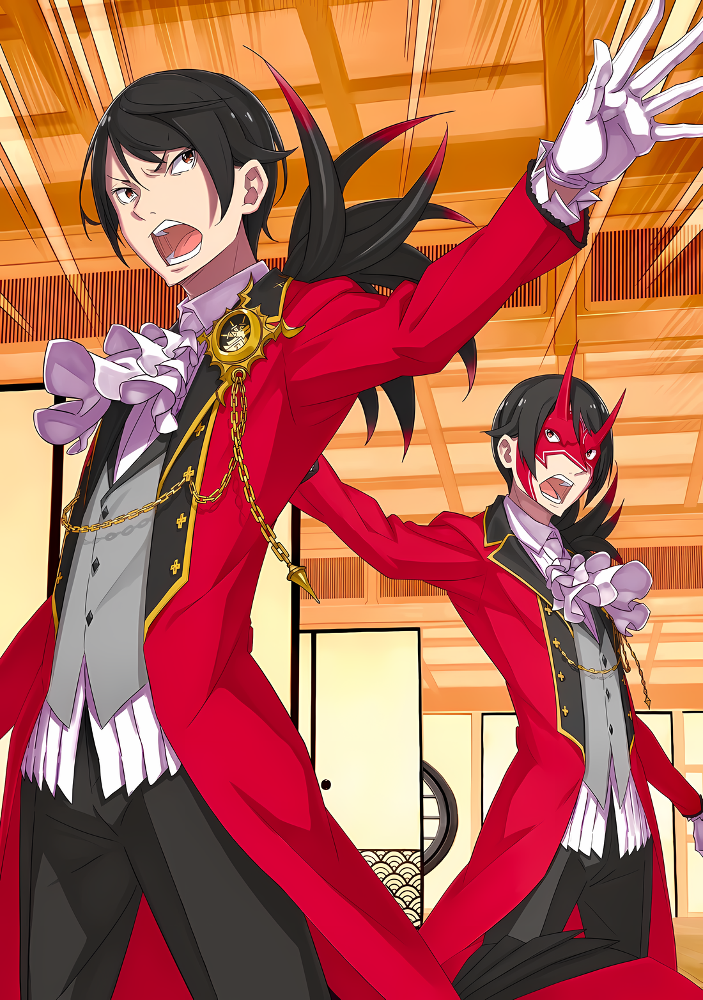

……В самом сердце Города Демонов «Хаосфлейм», в Замке Красного Лазурита, разбушевались тени.

Такова была истинная природа громового рева, потрясшего город, и кошмарного зрелища, увиденного глазами присутствующих.

В едином камне из малинового лазурита плясали красные и синие цвета. И великолепный замок, созданный из этих драгоценных камней причудливой красоты, рассыпался так же легко, как замок из песка.

Для тех, кто знал Город Демонов, и для его жителей это был шок, сравнимый с падением небес.

То, что не должно было произойти, действительно произошло, до такой степени размыв границы между сном и реальностью, и это не было исключением для тех, кто не был знаком с Городом Демонов.

???: …………

Толчки распространились и на комнату в дорожном трактире, который был подготовлен для внешних посетителей Города Демонов.

Некоторые уставились выпучив глаза и застыв на месте; некоторые напряглись всем телом в предельной бдительности; некоторые вскрикнули, упав на спину; некоторые прижались друг к другу, чтобы защититься от дрожи.

Однако, несмотря на разную реакцию, суть того, что их постигло, была одна и та же — «Угроза».

Находясь в плену непоправимой ситуации, все были охвачены инстинктивным страхом на мгновение; все, кроме……

??? & ???: ……Всем молчать!

В этот момент резкий, резонирующий, «Перекрывающий» голос прорезал промежуток времени, отмеченный жесткостью, вызванной угрозой.

Два однородных голоса, резонирующих в комнате…… ударили по барабанным перепонкам, пробудив даже те умы, которые погрузились в затишье.

Два черноволосых человека, издали резкий голос, после чего все стоявшие перед ними подняли головы.

Один из них стоял с оголенным лицом, а другой — с прикрытым маской Они,

Иллюстрация к **Ранобэ** Том 30 | Разукрасил V!c.ll2o

Абел: Не останавливайтесь! Если мы задержимся, чтобы разобраться с этой штукой, мы все потеряем свои жизни.

Винсент: То, что проглотило замок и продолжает поглощать небо — великий пожиратель. Если мы ничего не предпримем, число жертв умножится в мгновение ока!

Все: …………

Абел и Винсент: ……Кафма Ирулюкс!

Как будто их мысли были одинаковыми, взгляды двух мужчин сошлись на одном человеке.

Смуглокожий мужчина, на которого были устремлены эти пристальные взгляды — Кафма Ирулюкс, был ввергнут в смятение, не зная, в какую сторону обратить свой недоуменный взор.

Но замешательство длилось недолго. Потому что……

Абел и Винсент: Останови эту тень! Знай, что цена твоего промедления — жизни людей Империи!

Кафма: ……Да!

В тот момент, когда ему представили действия, которые необходимо предпринять, и ясную цель того, что нужно сделать, нерешительность в глазах Кафмы исчезла.

Кафма приложил кулак к груди, поклонился и произнес,

Кафма: Я покидаю вас. Да пребудет с вами Божественная защита Меча Света!

Винсент: Твоя работа будет под моей Божественной защитой. Напрягись до последнего.

Кафма: До последнего…!

Дав мощный ответ, Кафма направился прямо к окну.

Используя эту силу для прыжка, Кафма пробил окно вытянутой рукой и выскочил наружу, разбрасывая осколки стекла. Сразу же после этого спина Кафмы выгнулась, а из-за плаща, который он отбросил, расправились шесть прозрачных крыльев.

Трепеща крыльями, которые производили впечатление крыльев насекомого, фигура Кафмы летела по небу Города Демонов, словно рассекая само небо.

Курс лежал прямо на Замок Красного Лазурита, который должен был быть разрушен нахлынувшими тенями.

Абел: Сколько людей ты привел?

Бросив взгляд назад, на полет Кафмы, человек в маске Они …… Абел… задал острый вопрос. Он был адресован Винсенту, черноволосому красавцу, который получил поклон от Кафмы.

Человек, занимающий сейчас трон Империи Волакия, слегка сузил глаза в ответ на вопрос Абела.

Винсент: Моя свита, как ты видишь, состоит из Кафмы Ирулюкса и отсутствующего Ольбарта Дарккенна. Второй не принесет особой пользы.

Абел: Нет пешек, которые можно было бы заложить. Возможно, путешествие налегке дало обратный эффект.

Винсент: Ответственность, которую ты возлагаешь на меня, превосходит абсурд.

Как только Винсент без колебаний раскрыл свои карты, Абел произнес бесцеремонный комментарий. Он ответил жалобой, на что последний не обиделся.

Абел, подперев рукой подбородок и проведя пальцами по нижней части маски Они, задумался на несколько секунд, затем взглянул на остальных в комнате…… тех, кто не смог скрыть своего беспокойства по поводу угрозы.

Две девушки, обе юные на вид, смогли отреагировать на этот взгляд, хотя и не проронили ни слова.

Одной из них была Медиум О'Коннелл со светлыми волосами и голубыми глазами, а другой — Танза, девушка-олениха в кимоно с круглыми, трепетными глазами. Ни одна из них не стал бы решающим фактором в этой ситуации.

Единственный, кто потенциально мог бы стать каким-то ключевым действующим лицом, был….

???: А… а… Почему, почему… почему в такое время…

Медиум: Ал-чин…

Испуганный голос не обратил никакого внимания на спокойный взгляд Абела.

Подперев голову правой рукой, в ужасе от сцены за окном, но мучимый дилеммой невозможности отвести взгляд, стоял темноволосый мальчик, лицо которого скрывал потрепанный кусок ткани, беспорядочно свернутый в рулон.

Из всех, кто был с Абелом, этот мальчик в каком-то смысле был единственным, кто не показывал своей истинной глубины, но, учитывая его испуганный вид, который не был похож на притворство, Абел не решался включать его в план.

Это было не из соображений заботы о чувствах человека. ……Это была чисто оценка бесполезности.

Винсент: Если это так, то можно принять не так много мер.

Профиль Абела в тщательном размышлении был поражен словами Винсента, который стоял рядом с ним.

Стоя бок о бок, двое мужчин смотрели в окно…… или, возможно, их следовало бы назвать двумя Императорами.

Абел выдохнул, отбросив нахлынувшие чувства как тривиальные.

Винсент был прав; не так уж много возможных мер можно было принять.

И в ответ Винсенту, который пришел бы к такому же выводу, он произнес скупые слова……

Абел: ……Свяжись с Йорной Миссигр. Нам нужна ее сила.

△▼△▼△▼△

Таритта, почуяв перемену в ситуации, увлажнила языком пересохшие губы.

Перемена в воздухе, запах преследователей, ощущение на коже жажды крови и враждебности, направленной на нее…… все это привлекало ее совсем не так, как раньше, заставляя на мгновение приостановиться, чтобы принять решение, учитывая эти ощущения.

Она порывисто задалась вопросом, хорошо это или плохо.

Однако……

Таритта: ……Ни то, ни другое не имеет значения.

Если бы ее вывод был таким же, Таритта не стала бы сильно переживать.

Она знала, что изначально была не очень умна. Если бы это была Мизельда, ее старшая сестра, она, вероятно, смогла бы найти правильный ответ, основываясь на своей инстинктивной интуиции, даже если бы их умы не были настолько разными.

Но Таритта не обладала таким же обонянием, как ее сестра. Вероятно, ей также не хватало сообразительности. У нее не было абсолютно ничего.

Если тратить огромное количество времени на раздумья, то в конечном итоге это привело бы к бесконечным колебаниям по поводу правильности ответа.

Поэтому она решила просто не колебаться. Когда исход будет ясен, она сможет бесконечно мучиться над плюсами и минусами.

Так что Таритта не изменила своего подхода, независимо от изменения атмосферы ее преследователей.

???: Гах, гх….

Таритта: Ты не сможешь вырваться. Неважно, насколько ты силен.

Затянутая вокруг борющегося человека с налитыми кровью глазами, куртка Таритты блокировала его дыхательные пути.

Мужчина-баран с горящим правым глазом отчаянно пытался вырваться, но Таритта, сняв куртку, чтобы использовать ее рукав для сдавливания шеи, перерезала сухожилие на руке противника, лишив его возможности действовать.

Честно говоря, ее очень мучила выносливость ее преследователей, которые продолжали вставать на ноги даже после того, как она вырывала у них жизненно важные места.

Таритта: Не зная как с этим справиться, даже мне это так или иначе удалось.

???: …………

В конце концов, задыхающийся голос мужчины стал невнятным, а его тело, теряя силы, обмякло. Выбрав этот момент, Таритта сняла куртку с шеи мужчины и оттащила его обмякшее тело на обочину дороги.

Выдохнув, Таритта ахнула, а позади нее вдоль стен улицы в ряд лежали тела ее преследователей, задушенных ею.

Поняв, что удары и ножевые атаки неэффективны, а удушающие приемы —эффективны, она в итоге отбивалась от них одним-единственным приемом.

Хотя преследователи были наделены необычной силой и выносливостью, они, похоже, были новичками в искусстве эффективного применения такой силы.

Благодаря этому навыки Таритты оказались на высоте, и она смогла продолжить правильно нейтрализовывать своих преследователей.

……Если бы она могла просто дать ему умереть, это дело было бы закончено гораздо быстрее.

«???: Не убивай никого»

С этой фразой, промелькнувшей у нее в голове, Таритта была вынуждена бороться.

Абел дал ей эти слова наставления как раз перед тем, как они разделились, чтобы она могла послужить приманкой и дать всем возможность уйти из трактира.

Учитывая обстоятельства, в которые она попала, возможно, ей следовало бы возразить, назвав их тогда безрассудными словами. Но стал бы человек с такими проницательными глазами, как у Абела, давать указания, которые невозможно выполнить?

А может быть, он дал эти указания, полагая, что Таритта способна их выполнить?

Если так, то это означало бы, что Абел воспринял способности Таритты.

Таритта: …………

В какой степени Абел был способен видеть вещи?

Конечно, достаточно посмотреть на загадочные техники, поразившие Субару, Медиум и Ала, чтобы понять, что Абел не был человеком, способным предвидеть все возможные события и действовать с идеальным предвидением.

Если бы такое было возможно, то это была бы уже работа не человека, а необычного существа.

Это была область рассуждений, в которую не следует вторгаться, то, что не может быть нарушено человеком.

Нельзя было не подумать, что существует человек, способный достичь того, что находится за пределами его возможностей, скорее, это было бы рассуждением.

Как одна из Судрак, Таритта обладала умением схватить любую добычу.

Абел должен был знать, что Таритта овладела искусством удушения, которое не должно было действовать на зверей, и причина этого……

???: ……Ну и ну, зрелище не из приятных.

Таритта: ……тц

Пока она размышляла над этим, голос проскользнул в щель сознания Таритты, остановив ее на месте.

Резко вернувшись к реальности, Таритта развернулась с кинжалом в руке. Затем, надеясь нанести удар по убийце, который находился за ее спиной……

???: Вахвахвахва, подожди! Подожди, подожди! Слииишком~ преждевременное решение.

Таритта: ……Ты?

???: Оо, ты в порядке? Ты уже успокоилась? Ничего, если я опущу руки?

Как раз в тот момент, когда она собиралась обездвижить конечности своего противника, Таритта в одно мгновение перестала орудовать ножом.

Перед ней, держась за голову и неловко пытаясь защититься, стоял пепельноволосый, женоподобный мужчина в синей мантии с капюшоном.

Однако это был мужчина с красивым лицом; в его глазах не горел огонь, свойственный ее преследователям, и, прежде всего, любительская манера поведения делала его безобидным.

Однако факт оставался фактом: он уклонился от бдительности Таритты и стоял у нее за спиной.

Таритта: …………

Деликатный мужчина: Бооожечки~, похоже, мне очень не доверяют. Я просто обычный парень, проходящий мимо этого места….

Таритта: ……Я не думаю, что обычный человек смог бы смотреть на это и оставаться спокойным.

Самопровозглашенный «безобидный» деликатный мужчина дал еще одну причину, по которой она не могла ослабить бдительность по отношению к нему.

Что касается тел ее преследователей, выстроившихся в ряд у стены…… если бы он не подошел к ним и не проверил, живы они или мертвы, было бы неудивительно, если бы он посчитал их мертвыми; однако он остался невозмутим.

Если только у него не замерло сердце, она не могла придумать ответа, кроме того, что он к ним привык.

На настороженный взгляд Таритты хрупкий мужчина смущенно улыбнулся.

На мгновение она чуть не растерялась от улыбки этого тонкокостного мужчины, но боязнь опасности взяла верх над реакцией на его красивую внешность. Когда дело касалось красивых мужчин с нежными лицами, Флопа было достаточно.

……Сейчас не время думать о нем.

Деликатный мужчина: Ооо~ нет, меня увидели насквозь. Я бы не сказал, что это привычное зрелище дома. Я же говорил, что это было очень красивое зрелище. ……Ну, Таритта-сан.

Таритта: ……тц

Деликатный мужчина: О, не потроши меня, не потроши! Я не враг, даже если кажусь подозрительным!

Ее осторожность, на мгновение ослабевшая перед этим, мгновенно усилилась.

Мужчина с тонкими чертами лица, стоявший перед ней, назвал имя Таритты с холодным спокойствием, как будто она была его старой знакомой. Конечно, мужчина перед глазами Таритты не был никаким знакомым.

Здесь не должно быть никого, с кем Таритта была бы знакома и кто назвал бы ее по имени; эта информация не должна была быть получена им.

Единственными, кто мог дать ему эту информацию, были Абел и остальные, которые отделились от нее, но……

Таритта: Ты… ты знаком с моей семьей?

Деликатный мужчина: ――? Ты пришла со своей семьей? Я слышал, что Племя Судрак не часто выходят из леса, неужели политика вождя изменилась?

Таритта: Откуда ты знаешь, что я……!

Деликатный мужчина: Что тут такооого~, это ведь легко понять по тому, как ты говоришь. Вот и все.

С кривой улыбкой, отношение деликатного мужчины к Таритте, казалось, стало более близким, но, напротив, Таритта стала относиться к нему более настороженно, ее чувство неудовольствия усиливалось от его жуткости.

Не было ничего похожего на признак враждебности или чего-то подобного.

Однако усиливающаяся жуть мало-помалу внушала Таритте опасную мысль, что в данный момент она должна его устранить.

И Таритта догадывалась, как прорастут ростки подозрительности, какие бутоны они разовьют и какие цветы распустят.

Причина была……

Деликатный мужчина: ……Отброс Судрак.

Таритта: ……А.

Внезапно сознание Таритты помутилось, когда она услышала слова, сплетенные губами деликатного человека.

Таритта: ………

Почему этот человек произнес эти слова? ……Нет, почему он знает?

Потому что человек, который говорил эти слова Таритте раньше, уже……

Деликатный мужчина: Это заповедь, не так ли? Для тебя, ставшей Отбросом Судрака, Таритта-сан.

Таритта: А, заповедь…?

Деликатный мужчина: Это о чем-то, что можно описать как выравнивание звезд, или их руководство. Это как, о том, что у людей есть своя судьба~? Я занимаюсь тем, что смотрю на них.

Таритта была ошарашена, а хрупкий мужчина покачал головой, сказав: «Оххх~».

Затем он положил руку на свою грудь и двумя глазами метнул взглядом прямо на Таритту,

Деликатный мужчина: Наверное, это можно назвать заповедью для нас.

Таритта: …………

Таритта очень удивилась, настолько, что ее горло издало звук, когда местоимение было произнесено во множественном числе.

Громкость этого шума сопровождалась иллюзией, что весь мир дрожит. ……Нет, от удивления Таритты мир не затрясся.

Однако, на самом деле, мир дрожал.

Это было……

Деликатный мужчина: Вооот~ черт.

Деликатный мужчина издал беззаботный вздох, который придал ему впечатление беспечного человека.

Однако, случилось событие настолько чрезвычайное, что его отношение не могло выразить его полностью.

……Вдалеке прекрасный Замок Красного Лазурита, стоявший в самом сердце Города Демонов, далеко от Таритты и деликатного человека, разрушился с ужасающей силой, его красный и синий свет покрылся черной тьмой.

Это не было образным выражением, ибо действительно черная тьма покрыла Замок Красного Лазурита.

Нечто прекрасное, нечто сияющее было закрашено чем-то мерзким, чем-то проклятым.

Деликатный мужчина: Боже мой, о Боже, как бы это сказать… Это может быть, немного я не углядел.

Таритта: Ты….

Деликатный мужчина смотрел на рушащийся замок и потоки тьмы, используя свои руки как козырек.

Она подозревала, что этот человек, который казался таким беспечным, возможно, является причиной этого аномального события. Но, словно почувствовав сомнение Таритты, он пожал плечами и сказал,

Деликатный мужчина: Неловко говорить об этом сразу после того, как я рассказал о заповеди, но вот это и я не имеем друг к другу никакого отношения. В первую очередь, это проблема Королевства Лугуники, не так ли? Это вне моей компетенции.

Таритта: Вне твоей компетенции… Королевства Лугуники…?

Деликатный мужчина: Может быть, она не знает, что она «Звездочет»? Если это так, то Его Превосходительство сделал довольно смелую авантюру… Может быть, у него не было выбора в той руке, которая ему выпала?

Таритта: Не могу понять…! Если ты что-то знаешь!

Намереваясь запугать его ответом, Таритта шагнула к нему и схватила хрупкого мужчину за шею. Она прижала его стройную фигуру к стене и приставила лезвие к его белой шее.

Если бы Таритта щелкнула запястьем, из шеи мужчины тут же хлынула бы кровь.

Ощущение холодного лезвия должно было дать деликатному человеку достаточное предвидение его будущего.

Деликатный мужчина: Возможно, моя жизнь или смерть имеет мало общего с тем, что происходит….

Таритта: ……Кх

Деликатный мужчина: Не думаю, что вашей стороне стоит проводить здесь много времени. Я не наблюдаю за звездами, так что это всего лишь моя догадка.

И все же, хрупкий мужчина бесстрастно продолжал смотреть в глаза Таритты, игнорируя ощущение клинка.

В этот момент она почувствовала сильнейший дискомфорт по отношению к этому человеку. Без какого-либо четкого обоснования, которое можно было бы выразить словами, в ней промелькнуло желание просто отрубить этому человеку голову.

Однако, прежде чем она поддалась этому жестокому порыву……

Деликатный мужчина: Убийство меня не улучшит ситуацию. Так же было и в прошлый раз, не так ли?

……Этих слов было достаточно, чтобы остановить Таритту от того, чтобы покончить со всем этим с помощью ножа, который она держала в руке.

Деликатный мужчина: Упс!

Таритта: Пожалуйста, уйди с глаз моих! Сейчас же….

Скрежеща зубами, Таритта, все еще хватая нежного мужчину за загривок, бросила его на улицу.

Мужчина сумел как-то перекатиться, используя свои длинные ноги, и переломить падение, поглаживая рукой свою грубо обработанную шею и глядя на лицо Таритты с вопросом «Ты уверена, что все в порядке?».

Деликатный мужчина: Ты можешь перерезать себе горло, в прямом смысле… Возможно, у тебя больше никогда не будет возможности столкнуться со мной.

Таритта: Тогда это самое лучшее. Глядя на твое лицо, кажется, что….

Деликатный мужчина: …………

Таритта: Как будто ты в настроении заставить меня встретиться с кошмаром, который я видела много раз…!

С чувством, похожим на проклятие, Таритта взмахнула рукой, как бы отстраняя нежного человека.

Этот жест заставил мужчину вздохнуть и посмотреть в сторону рушащегося замка вдалеке,

Деликатный мужчина: Видимо, в отличие от меня, у тебя есть задание. Тааат~ может быть козырем, чтобы подавить эту тень].

Таритта: Я…? Я обладаю такой силой…

Деликатный мужчина: ……Заповедь уже в действии. Ты знаешь это, Отброс Судрак.

Таритта: …………

Деликатный мужчина: Ты вольна исполнить ее или нет. Как тот, кто не получил ее, я не завидую тебе в том, что ты можешь следовать по пути.

Сказав это, деликатный мужчина натянул на голову капюшон, повернулся спиной к Таритте и пустился бежать.

Быстро, но недостаточно быстро. Хотя она могла бы догнать его, если бы захотела, у Таритты не было желания преследовать его.

То, что в глубине души она не хотела больше с ним связываться, тоже было правдой.

Но самой главной причиной были слова, которые он оставил в конце……

Таритта: ……Заповедь уже в действии.

Она жалела, что не понимает, о чем он говорит. Но у нее была идея.

И эта мысль бесконечно, бесконечно мучила Таритту последние несколько дней.

Она не хотела беспокоиться, прежде чем начать действовать.

Она не хотела зацикливаться на бесплодных мучениях.

???: Таритта-чан!

Таритта: ……Кх, Медиум?

Когда Таритта, держась за плечи, опускала глаза вниз, ее окликнул знакомый голос.

Мгновенно обернувшись, Таритта увидела бегущую к ней маленькую девочку, которая махала рукой в ее сторону…… Медиум, уменьшившаяся в росте, шла к ней.

Медиум: Я так рада! Мы сразу же нашли Таритту-чан целой и невредимой!

Таритта: Рада, что ты тоже цела и невредима… А Абел, Субару и остальные в безопасности? Более того, что происходит……

Когда Медиум устремилась к ней, Таритта обрушила на нее шквал вопросов.

Она не ожидала, что та будет одна и будет искать Таритту. Конечно, было бы странно, если бы они с Ольбартом все еще играли в прятки во время крушения Замка Красного Лазурита, но не похоже, что у них был перерыв, чтобы обсудить это.

На вопрос Таритты Медиум слегка вздохнула,

Медиум: Абел-чин и Ал-чин в безопасности! Субару-чин и Луис-чан пропали! Кроме того, нам нужно что-то сделать с тенью, вышедшей из замка, так что Таритта-чан, иди сюда!

Таритта: Субару и Луис? А где……

Медиум: С этого момента мы собираемся остановить эту тень вместе с Йорной-чан! Сила Таритты-чан тоже нужна, так сказал Абел-чин!

Таритта: …………

Широко раскрыв глаза, Таритта не могла не поразиться тому, что ей сказали.

На краю ее поля зрения появилась черная тень, готовая нанести такой безумный урон, что даже Таритта, потрясенная общением с деликатным мужчиной, была вынуждена признать реальность ситуации.

Ни остановить эту тварь, ни бросить ей вызов не представлялось Таритте возможным.

К тому же, ей сказали, что Абел сейчас зовет ее……

Медиум: Таритта-чан, ты ведь не ранена? Ты все еще можешь идти? Я сделаю все, что в моих силах, так что ты можешь сделать все, что в твоих силах, вместе со мной!

Замешательство Таритты было быстро рассеяно непоколебимыми словами Медиум.

Даже если ее рост уменьшился, прямой нрав, которым она обладала, не уменьшился и не изменился. Словно руководствуясь этим, Таритта спокойно кивнула головой и сказала,

Таритта: Я поняла…… Мы сейчас же отправимся туда.

Медиум: Мм! Спасибо!

Таритта почувствовала боль в груди от облегчения Медиум и ее кивка.

Злость мучила Таритту долгое, безграничное количество времени. Забытый погружением в битву, этот гнев заявлял о себе в предвкушении великой битвы, приближения времени разрешения.

Таритта: ……Заповедь.

Таритта пробормотала слова, сказанные исчезнувшим тонким человеком, но только про себя.

Злость, казалось, клокотала в ее груди, словно ей нравилось, когда ее называли по имени.

△▼△▼△▼△

……Время вернулось к тому моменту, когда Замок Красного Лазурита был разрушен великим потоком тьмы.

Йорна: Успок….

Луис: УАУ!!!

В мгновение ока она отпрянула от девочки по имени Луис, которая, не раздумывая, попыталась прыгнуть вперед.

Вот так, следуя призыву каждого нерва своего тела к этой инстинктивной угрозе, не зная, что черепица крыши башни замка лопнет, она совершила мощный прыжок назад.

Растоптанная каблуками туфель на толстой подошве, черепица от удара разлетелась на соседние черепицы, распространяя разрушения.

Однако тот факт, что черепица разлетелась вдребезги, был слишком незначительным перед лицом событий, которые сразу же последовали.

Йорна: ………

С грохотом нахлынувшие тени, тьма и глубокая чернота поглотили замок, а взорвавшаяся черепица исчезла.

……Нет, поглощен был не только замок.

Глаза Йорны увидели, что башня Замка Красного Лазурита, его верхний и средний уровни были поглощены потоком тьмы, похожим на грязевой поток, и бесследно исчезли из мира.

Это была поистине темная тьма, которую нельзя было поглотить.

Настоящая тьма, которую нельзя было осветить ярким светом, которая не позволяла спастись ничему, если ее принять; которая затмевала всякую надежду, покрывая все вокруг отчаянием.

Об этом можно было судить инстинктивно. ……Это было тем, чего не должно было быть.

Луис: Уу!

Сдерживая сопротивляющуюся девочку в своих объятиях, Йорна бросила взгляд на черную материю.

Черноволосого мальчика в центре и Ольбарта, который прикасался к нему рукой в тот момент, когда его накрыла черная тень, нигде не было видно.

В тот же миг она увидела, как рука, которую отдернул Ольбарт, перестала существовать.

Эта вещь была настолько ошеломляющей, что даже Ольбарт, с его жадностью к жизни и острым чувством опасности, не смог избежать жертвования собственной рукой.

Вскоре после этого она отдала предпочтение прыжку с Луис на руках; из-за этого было неизвестно, жив Ольбарт или нет.

С одной стороны, она верила, что чудовищный старик никогда не умрет, но с другой стороны, в ее сознании звучал холодный голос, спрашивающий ее, может ли она действительно иметь оптимистичные мысли, глядя на эту реактивную черную штуку.

Кроме того, помимо жизни или смерти Ольбарта, было еще кое-что, что породило искажение в мыслях Йорны….

Йорна: Дитя….

Это был мальчик, который, казалось, был в сердце соболиной тени, поглотившей руку и безопасность Ольбарта.

По мнению Йорны, мальчик не обладал какими-то необычными способностями. Он прекрасно ориентировался в ситуации и не ошибался, когда ему следовало разыграть свои карты.

Если бы ей пришлось говорить об этом, то именно эти факторы принесли ему победу в противостоянии с Ольбартом. Однако похвала была адресована его решительности, а не превосходным способностям.

Поэтому она должна была сказать, что в тот момент не было никакой возможности, что мальчик мог сбежать.

Хотя это было бы справедливо только в том случае, если бы мальчик был жертвой.

Йорна: Если это поступок того ребенка….

Может ли это означать, что мальчик скрывается где-то в этой бескрайней черноте?

Йорна поняла, что не хочет верить в то, что мальчик сделал это намеренно. Признав это, она должна была принять решение.

Это был долг, который она должна исполнить как Госпожа Города Демонов, положение, которое она должна вынести, объект любви, который она должна выбрать……

Йорна: ……тц

Как только она подумала об этом, в темноте перед глазами Йорны произошла перемена.

Тень, поглотившая половину Замка Красного Лазурита собиравшаяся погрузить во тьму нижние уровни и стены замка, часть тени, контролирующая башню, извивалась, протягивая «руки» к Йорне и Луис в воздухе.

Йорна: ……….

Протянутые руки были буквально «руками», которые нельзя было сравнить ни с чем другим.

Черные руки протянулись к Йорне и Луис, которую она держала на руках. Поразительным было то, что их было не одна и не две, а сразу десять, двадцать или даже больше.

Причина, по которой протянувшиеся тени не обладали идиллическим спокойствием силуэтов, все дольше и дольше вытягивающихся в солнечном свете, заключалась в том, что руки, которые должны быть лишены эмоций, были переполнены ими.

Огромное количество теней и черных рук вызывали у нее одну-единственную эмоцию — «Голод».

Это был не просто «Голод» в простом смысле этого слова.

Это был непостижимый «Голод», жаждавший поглотить все и вся, что только возможно.

Йорна: Дитя, сейчас будет трясти. Будь осторожна, не прикуси язык!

Луис: У, ау… кх.

Чтобы избежать растущей тени, Йорна совершала необычные маневры в воздухе.

Она не знала о природе тени, и теперь, когда Йорна увидела, как тьма причинила вред Ольбарту, она сознательно решила, что прикосновение к ней будет смертельным, и поэтому у нее не было другого выбора, кроме как избегать ее.

Поэтому Йорна открыла глаза и, втянув в себя плитки, вырвавшиеся из своих мест в результате ее предыдущего прыжка, и используя их в качестве опоры, она создала маршрут побега через небо Города Демонов.

С трепещущим звуком фигура Йорны взмыла высоко в воздух, используя летающие плитки в качестве опоры.

Она попыталась выстрелить куском плитки в руку тени, чтобы сдержать ее, но, не сумев пробить тень, она была поглощена частью, на которую была нацелена, и исчезла в пустоте.

В соответствии с предположением, что его не следует трогать, Йорна проследовала к опорам на большую высоту.

Было бы лучше, если бы вытянутые руки тени были не в состоянии поддерживать непрерывный подъем плитки Йорны. Возможно, если удастся определить радиус действия тени, ей можно будет противостоять оттуда.

Хотя……

Йорна: Ужасно неприятно постоянно быть в обороне.

Ее не преследовали.

Конечно, это было и унизительно, но само собой разумеется, что Замок Красного Лазурита понесет наибольший урон.

Красный Лазурит был красивым и, прежде всего, редким драгоценным камнем.

Сама мысль о том, чтобы построить из него замок, была сущим абсурдом. Замок был построен не из-за богатства или власти Йорны.

В первую очередь, не Йорне пришла в голову идея построить замок из Красного Лазурита.

Замок из красных и синих цветов, Замок Красного Лазурита, построили жители Города Демонов.

Они решили, что чертоги правителя Города Демонов Йорны не должны выглядеть убого, поэтому каждый из них собрал драгоценные камни и построил этот прекрасный замок.

Это был редкий, драгоценный камень. Его было трудно обрабатывать, и нельзя было даже представить, сколько трудностей пришлось пережить при строительстве замка. Так было и с Йорной; она и представить себе не могла таких трудностей.

Излишне говорить, что Йорна наблюдала за строительством замка в полном объеме.

Поэтому……

Йорна: Ты проглотила мою любовь, паскуда!!!

Йорна протянула свои длинные тонкие пальцы к тени, поглотившей замок.

От них ничего не исходило, и это не было необходимым действием. Она просто хотела противостоять тени, напомнить ей, что это проявление ее гнева.

……Мгновение спустя, изнутри огромной тени, поглотившей Замок Красного Лазурита, раздался свирепый удар.

Йорна: ……………

У Йорны не было возможности узнать, есть ли у тени поводы, а тем более намерение.

Однако Йорна была уверена, что это был сильный удар.

Тень поглотила Замок Красного Лазурита…. все, что его составляло, вплоть до каждого камня, из которого были сложены его стены, продукт любви жителей к Йорне.

Почему она должна считать его просто замком?

Почему она не должна любить его?

В доказательство этого все черные руки, которые вблизи хвостов Йорны, рассеялись, и так как ничто не могло ее догнать, она взмыла в воздух.

Даже Луис, корчившаяся в ее объятиях, расширила глаза в шоке от бурного взрыва любви Йорны.

Однако Йорну не могла порадовать реакция девочки, которую можно было бы назвать восхищением.

Йорна: В конце концов, замок — это всего лишь замок, и можно сказать, что его можно перестроить. Но….

Луис: Уу?

Йорна: Неважно, попытаюсь ли я построить новый замок; этот замок, который я любила день за днем, был такой один…… Неужели я должна с сожалением думать о своей разрушающейся любви, потому что моих чувств было недостаточно?

Глядя на Замок Красного Лазурита, больше половины которого поглотила тень, не сохранив его первоначального вида, сердце Йорны сжалось от боли.

Но у Йорны не было времени предаваться сентиментальности.

Пусть теневые руки, преследовавшие их, и исчезли, но великий источник тьмы не исчез.

Не говоря уже о……

Йорна: Моя светлая кожа говорит мне, что угроза не исчезла.

Удар от взрыва Замка Красного Лазурита был настолько мощным, что мог бы снести весь замок в одиночку. Тем не менее, несмотря на то, что импульс от удара уменьшился, гнетущее чувство, исходящее от черной тьмы, ничуть не ослабло.

Если тень жива и здорова, то, конечно же, и угроза тоже.

Другими словами, она должна была создать или найти способ рассеять эту черную штуку любой ценой, пока условие, что ее нельзя трогать, остается неизменным.

???: ……Йорна-самааа!

Когда нервы Йорны обострились, голос, доносившийся издалека, с земли, ударил по ее барабанным перепонкам.

Взглянув туда, Йорна увидела, что те, кто звал ее, были жителями Города Демонов, пытавшимися собраться у рухнувшего замка. Они попали под обвал, пытаясь помочь спастись солдатам, выползающим из-под обломков.

С точки зрения черной тени, они, должно быть, выглядели слишком похожими на желанную добычу.

Йорна: Все, убегайте!

Под влиянием сигнала о надвигающейся опасности Йорна призвала жителей внизу к эвакуации.

Но она была слишком высоко в небе, чтобы броситься к ним вниз. Расстояние было слишком велико, они были слишком недосягаемы. И невозможно было требовать от всех них такого же чувства опасности, как у Йорны.

……В результате Йорна не могла ничего сделать, кроме как бессильно наблюдать за тем, как тени надвигаются на жителей, собравшихся в замке из беспокойства за нее, Госпожу Города Демонов.

Это……

???: ……Не думай, что я облегчу тебе задачу!!!

Жители замерли на месте, когда черная теневая рука протянулась к каждому из них, и за мгновение до того, как их поглотила вечная пустота, их тела выхватили сбоку.

Темно-зеленые колючие лозы, издалека протянулись к жителям.

Лозы, которые Йорна уже видела раньше, тянулись с бешеной энергией, быстрее теней. Они цепляли своими колючками тела жителей, позволяя им спастись.

Даже в Городе Демонов, где собрались существа, обладающие экзотической физиологией, Йорна могла вспомнить только одного человека, способного на такое.

???: Кафма Ирулюкс, по указу Его Превосходительства Императора, я к вашим услугам!

Человек, из вытянутых рук которого росли колючие лианы, а со спины хлопали прозрачные крылья…… Кафма Ирулюкс, материализовался в центре ситуации, заставив Йорну удивленно расширить глаза.

Удивительным было не только его необычное появление, но и то, что он защищал жителей Йорны.

В прошлом, под предлогом подавления восстания Йорны, Император Винсент послал войска, чтобы установить полный контроль над Хаосфлеймом.

Кафма был среди этих войск и был одним из тех, кто бесчинствовал в Хаосфлейме.

Поэтому его действия по защите граждан Йорны были……

Кафма: Неважно, кому ты служишь, ты в равной степени являешься подданной Империи.

Йорна: …………

Кафма: Генерал Первого класса Йорна! Я знаю, что у нас с тобой разные идеи, но мы не должны допустить этого! Я буду сотрудничать с тобой!

Отвечая таким образом на пристальный взгляд Йорны, похлопавший Кафма яростно взмыл в воздух.

Свободно танцуя в воздухе, привлекая к себе внимание теней, захвативших Замок Красного Лазурита, Кафма, казалось, намеревался полностью использовать свою мобильность и контроль, чтобы выиграть время.

Однако вопрос заключался в том, что делать с выигранным временем?

Луис: У! Аауу!

Йорна: Дитя?

Луис: У!

Сразу после этого Йорна задумалась над выбором действий, а Луис, все еще находящаяся на ее руках, снова пришла в ярость. Но то, как она бушевала, не было таким импульсивным и жестоким, как раньше.

Девушка вертелась на руках у Йорны и со стоном указывала на какое-то место на земле.

Йорна посмотрела туда, куда указывала Луис, и догадалась, что она хочет сказать.

И……

Йорна: Генерал Второго класса Кафма, я оставлю это место тебе на некоторое время.

Кафма: Если это то, что требуется тебе, то хорошо!

Йорна: И……

Кафма: Что такое?!

Кафма, который хотел избежать растущих теней, покружив вокруг, и сосредоточиться на противостоянии сильному врагу, слегка повысил голос на слова Йорны.

Йорна подумала, что было бы ошибкой не сообщить ему об этом, хотя она и не собиралась ему мешать,

Йорна: За то, что ты защитил моих детей, я благодарю тебя.

Кафма: ――. Как «Генерал», я сделал то, что должен был сделать!

Он был слегка озадачен благодарностью Йорны, однако Кафма ответил тем же.

Йорна изменила свою оценку этого человека, который вернулся к своей роли и выиграл необходимое время.

Хотя это не изменило ее впечатления о том, что он был твердолобым и несгибаемым человеком, но если он довел свои намерения до конца, то он действительно был добродетельным человеком. Если бы обстоятельства и условия позволяли, он был бы одним из тех, кого она могла бы полюбить.

Однако позиция Йорны номер один не будет отменена навсегда….

Йорна: Мы собираемся спускаться. Держись крепче.

Приняв в ответ более крепкую хватку Луис, Йорна направилась к цели, используя в качестве опоры обломки здания, опрокинутую землю и даже куски грязи, парящие в воздухе.

По пути она давала указания жителям, желающим получить дополнительную информацию, во что бы то ни стало удалиться от Замка Красного Лазурита……

вернее, от бывшего места, где когда-то стоял замок, а сама направлялась на крышу дома, расположенного в стороне от замка.

Там, неторопливо ожидая прибытия Йорны, стоял……

Йорна: Конечно, я думала, что Его Превосходительство Император должен был прийти.

???: Хм.

Там величественно стоял со сложенными руками темноволосый мужчина, его лицо закрывала маска Они.

Как только Йорна приземлилась перед глазами мужчины, Луис оставила ее руки и подбежала к нему, как будто ждала его.

Затем Луис схватила мужчину за руку и указала в сторону замка, ее длинные светлые волосы подпрыгивали,

Луис: Уау!

Абел: Я понимаю это без необходимости рассказывать всем. В конце концов, у нас были разногласия по поводу твоего лечения. У тебя достаточно наглости, чтобы показаться передо мной.

Луис: Уу! У!

Абел: Ты намерена повиноваться мне? Если да, то я добавлю тебя к нашему числу.

Мужчина ответил на жалобу Луис в бесстрастной манере, пока она дергала его за руку. Луис выглядела раздосадованной его ответом, но в конце концов отпустила руку, как будто другого выхода не было.

Тем не менее, причина, по которой она не бросилась бежать, вероятно, заключалась в том, что она все обдумала, как это сделала бы маленькая девочка.

……Она должна была любой ценой вернуть мальчика, которого проглотила черная тень.

Абел: Йорна Миссигр, ты понимаешь положение дел. Это великое бедствие нельзя оставлять без внимания.

Йорна: Я согласна. Как у правителя Города Демонов, не было другого выбора, кроме как отказаться от этой черной тьмы, которая превращает все в ничто одним лишь прикосновением. Не говоря уже о том, что она поглотила мой замок. ……Вы знали, что такое может случиться?

Абел: Я думал, что что-то происходит. Но что это было конкретно, я не мог предположить.

Йорна: …………

Прищурившись, Йорна попыталась оценить искренность человека, стоящего перед ней.

Но сердце мужчины было скрыто за маской Они, и она не смогла бы увидеть его, даже если бы захотела. Впрочем, даже если бы маски не было, заглянуть в его сердце было бы невозможно.

Уединенное существование, не позволяющее никому узнать его мысли, сердце или намерения…… таков был путь Семьдесят Седьмого Императора Священной Империи Волакии.

Это было……

Йорна: Ваше Превосходительство.

Абел: Не называй меня так небрежно. Если только ты не хочешь, чтобы я разрушил твои надежды в этом письме.

Йорна: Простите мою невежливость…… Как вы узнали, чего я желаю?

Абел: Не было уверенности. Пока ты не вернула моих посланников в целости и сохранности.

Услышав его ответ, Йорна была одновременно поражена и встревожена ходом мыслей стоящего перед ней человека.

Он собирался определить, верны его мысли или нет, используя ее встречу с его посланниками в предыдущий день и проверяя, благополучно ли вернулись оттуда его посланники или нет.

В связи с этим Йорна почувствовала горечь от того, что она танцевала на его ладони.

Но более того….

Йорна: Эти дети-посыльные должны хотя бы раз отругать Ваше Превосходительство.

Абел: Это будет после того, как все дела будут улажены. Йорна Миссигр, следуй моим указаниям.

Йорна: ……Если так будет лучше для вас, у меня нет другого выбора, кроме как подчиниться.

Однако деспотичная манера речи мужчины заставила ее на мгновение замешкаться и воспротивиться.

Йорне было что защищать. Город Демонов Хаосфлейм и его жителей. Все, что было необходимо для защиты, — это кто-то, способный правильно вести это дело.

Не в смысле умения вести битву, а в смысле умения управлять ею.

Йорна тоже гордилась этой силой. Но было бы неправильно использовать его в качестве объекта для сравнения.

Кто может состязаться в умении с человеком, который контролировал и управлял великой Империей, государством с самой большой землей?

Йорна: Так что же вы собираетесь делать?

— спросила Йорна, готовая принять любые меры для защиты Города Демонов.

Луис, которая выстроилась рядом с ней прежде, чем она поняла это, тоже смотрела на нее, соглашаясь с намерениями Йорны.

Встретившись взглядом с Йорной и Луис, мужчина…… нет, правитель Империи, кивнул в знак согласия.

А затем……

Абел: ……Покинуть город и отступить. У Города Демонов нет иного выбора, кроме как позволить этой тени поглотить его.
