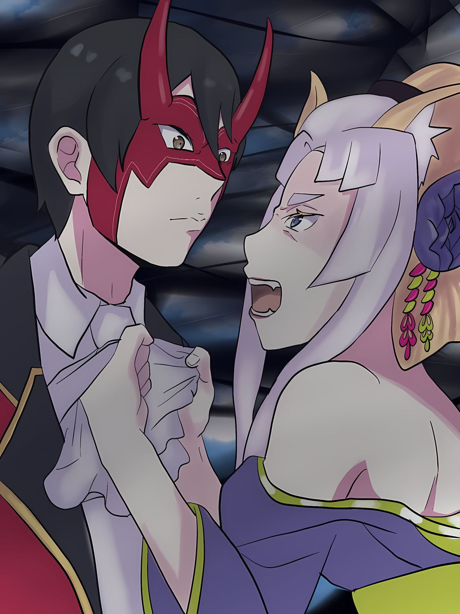

……Покинуть город и отступить.

В ответ на заявление человека в маске Они, щеки Йорны напряглись, а взгляд заострился.

Только что она решила уважать мнение стоящего перед ней человека, потому что Йорна считала, что это лучший способ защитить свои владения, Хаосфлейм.

Но вопреки решению Йорны, мужчина заговорил об оставлении города,

Йорна: Я не могу согласиться с таким мнением.

Абел: Почему?

Йорна: Разве это не очевидно? Это Город Демонов Хаосфлейм, последнее место для тех, кого преследовала Империя и кому не к кому обратиться, некуда идти… Бросить его….

Абел: Это неприемлемо, не так ли? ……Бесполезная сентиментальность.

Йорна: ……Кх, Винсент Волакия……!

Стиснув зубы из-за человека с холодным сердцем, скрестившим руки, правителем Империи, Йорна назвала его имя, сопровождая суровым взглядом. В ответ мужчина коснулся рукой маски Они.

И тут же в черных глазах, видимых даже сквозь маску Они, отразилась Йорна,

Абел: Сейчас я ношу имя Абел, поэтому называть меня так неуместно. И если ты собираешься просить благосклонности у Императора, это было бы весьма опрометчиво.

Йорна: ――. Народ Империи силен, не так ли?

Абел: Да.

Император…… или, скорее, человек, называвший себя Абелом, — провозгласил, что именно таков путь Империи.

Император, вершина Империи Волакия, должен быть воплощением железного кодекса, в который верили и который почитали жители Империи. Независимо от того, правда это или нет, Император должен был подтвердить это.

Услышав утверждение Абела, Йорна порицала себя за то, что неправомерно обратилась с просьбой.

Знал ли Абел о личности этой тени? О титанической черноте, поглотившей Замок Красного Лазурита целиком?

Поэтому ли он принял бессердечное решение покинуть город?

Йорна: Вы считаете это настолько опасным, что мы должны немедленно бежать? Что это вообще такое?

Абел: ……«Великое Бедствие».

Йорна: Великое… бедствие…?

За чередой вопросов Йорны последовало лишь пара тихих слов.

Однако, в противовес спокойному тону, вес слов, которые он произнес, был достаточен, чтобы вызвать недоумение в Йорне. ……Великое бедствие, значит.

Йорна: Под «великим бедствием», что именно вы имеете в виду?

Абел: Нечто, что ставит под угрозу существование Империи и приводит к разрушениям, до которых не может добраться даже свет солнца…… Так говорил об этом «Звездочет». Когда я впервые услышал это, я оценил это как преувеличение.

Йорна: …………

Абел: Глядя на происходящее, ты осознаешь, что в тех словах не было ни малейшего преувеличения.

Он указал подбородком на нее, на проявившуюся тьму…… на «Великое Бедствие», которое приводит к разрушению, как назвал его Абел.

Йорна не могла не почувствовать горечь внутри, когда слово «Звездочет», произнесенное его устами, отозвалось эхом. Существование «Звездочета» было одним из пороков Империи Волакия.

По крайней мере, Йорна могла описать это только так.

Начнем с того, что генезис сильного, горячего желания Йорны никоим образом не был связан со «Звездочетом».

В любом случае……

Йорна: Так вы поверите «Звездочету» на слово, подожмете хвост и убежите? Если да, то это, несомненно, будет проявлением бесстрашия. Я думаю, вы — воплощение образа действий Империи…… Очень, очень хороший пример.

Абел: Если ты полагаешь, что тебе удастся поколебать меня с помощью дешевой провокации, тебе лучше поспешить исправить это заблуждение. Во-первых, это не я принял слова «Звездочета» за чистую монету и устроил это безобразие.

Йорна: ……Я поняла, что у вас тоже есть некоторые мысли по поводу того, что предсказал «Звездочет».

Абел: У любого здравомыслящего человека не было бы приятных мыслей об этом. Но даже если эти мысли окажутся ненужными и будут проигнорированы, за ними последуют новые. В этом и заключается их неприятность. ……Хм.

Луис: Уу!

Когда Абел говорил, его слова были прерваны нетерпеливым рычанием Луис.

Похоже, она упрекала Абела и Йорну за то, что они ведут разговор, не имеющий прямого отношения к тому, как будет подавлено «Великое Бедствие».

Это было вполне естественно. «Великое Бедствие» было……

Луис: Уау!

Абел: ――. Йорна Миссигр, я хочу убедиться в одной вещи.

Йорна: …Что?

Сузив глаза на решительный призыв Луис, Абел указал на дико извивающееся «Великое Бедствие». Как только он направил свой вопрос на нее, Йорна сузила свои миндалевидные глаза.

Она примерно представляла, какие слова последуют за этим, и какие вопросы будут заданы.

Этим было……

Абел: Если ты и эта девочка вместе, то должен быть еще один…… черноволосый ребенок. Куда он исчез?

Йорна: ――. Если вы имеете в виду того ребенка….

Взгляд Йорны передал ответ на вопрос гораздо красноречивее, чем слова.

Взгляд Йорны обратился в сторону «Великого Бедствия», на которое неистово указывала Луис. Мальчик был там, когда тьма, поглотившая Замок Красного Лазурита, хлынула наружу.

……Нет, судя по тому, что видела Йорна, «Великое Бедствие», очевидно, вылилось изнутри мальчика.

Абел: Как я и ожидал.

В ответ на молчаливый ответ Йорны, Абел сложил в уме последний кусочек головоломки.

Это прозвучало как ультиматум, и Йорна посмотрела на Абела, призывая: «Вы……». Но в ответ на этот призыв Абел медленно покачал головой.

Абел: Хотя наши намерения пошли наперекосяк, от этого никуда не деться. Нет смысла зацикливаться на планах, если в итоге не будет никаких результатов.

Йорна: И что это значит?

Абел: Стратегия все та же. Покинуть Город Демонов и отступить. ……Но ущерб все равно будет нанесен. Мы не сможем избежать его полностью.

Йорна: ……Кх, я не могу согласиться….

И в тот момент, когда Йорна уже собиралась сказать ему, что не может согласиться с таким решением, что-то произошло.

Луис: Аа, у!

Абел: Гх…!

Издав крик боли, Абел упал на колени, схватив живот руками.

Быстрее, чем Йорна успела сократить расстояние между ним и собой, Луис бросилась в его сторону, ударив ладонью своей короткой маленькой руки.

Она бросила взгляд на того, кто принял безжалостное решение, Абела, и яростно зарычала во все горло,

Луис: Уау… Уау!

Воскликнув это, она развернулась и в мгновение ока исчезла из виду.

Это был мгновенный телепорт, который она продемонстрировала во время битвы с Ольбартом на башне замка. Не умея телепортироваться на большие расстояния, Луис телепортировалась несколько раз, снова возвращаясь на поле боя, где доминировало «Великое Бедствие».

Вдалеке Кафма задерживал «Великое Бедствие», используя насекомых в своем теле.

Йорне трудно было поверить, что девушка обладает чем-то, способным нанести решающий удар по «Великому Бедствию».

Если бы это было так, они бы попытались спасти мальчика сами, а не полагались на Абела. Так что у нее не было козыря.

Если бы существовала такая вещь, как козырь, это был бы……

Йорна: ……Можно ли противостоять тени Пламенем «Меча Света»?

Абел: …………

Йорна: Ваше Превосходительство!

Все еще держась за живот, Абел стоял на коленях на крыше здания.

Хотя она считала, что Абел заслужил удар Луис, Йорна также верила, что он был единственным, кто держал ключ к выходу из ситуации.

Император Империи Волакия был наделен поистине Зачарованным Мечом, который считался одним из Священных Мечей.

С Пламенем «Меча Света», даже существование этого «Великого Бедствия»….

Абел: ……Я не намерен тянуть с этим.

Однако ответ Абела на призыв Йорны оказался не таким, на какой она рассчитывала.

И Йорна не могла считать, что такой ответ дал бы нормальный человек. Даже если бы она знала, что «Великое Бедствие» было необычным событием, которое вызвало в нем готовность покинуть Город Демонов, считая его чем-то крайне опасным.

Йорна: Но все же… вы не достаете «Меч Света»…… Как вы можете допускать такое?

Абел: …………

Йорна: Ответь мне, Винсент Волакия! Если ты…… Если вы Император этой Империи, то для вас должна быть определенная роль! Если вы Император, то…!

Ее взгляд окутал злобный оттенок, после чего Йорна схватила стоящего на коленях Абела за воротник, заставив его встретиться с ней взглядом.

Арт от pabobingu

Во время всего этого город Хаосфлейм, которым управляла Йорна, находился в страшной опасности. В какой степени Кафма и Луис могли противостоять Великому Бедствию? В какой степени воздействие взрыва Замка Красного Лазурита помогло уменьшить силу «Великого Бедствия»?

Она ничего не понимала. Но она знала, что не может оставить все как есть.

При таком раскладе клятва Йорны, ее желание, останутся невыполненными.

А для этого, чего бы это ни стоило, ей требовалось содействие человека, стоящего перед ней.

Йорна: Если вы «Император» Империи Волакия……

Абел: …Я не буду использовать «Меч Света».

Йорна: ……Кх, вы….

Показав свои острые клыки, Йорна попыталась запугать Абела, упрямо пытаясь изменить его мнение.

Она редко делала столь грубый жест, как демонстрация клыков во рту. Однако, если бы она захотела, эти клыки могли бы легко разорвать на клочки стройную шею стоящего перед ней мужчины.

Но подобные угрозы были обычным делом для стоящего перед ней Абела.

Император Волакии занимал такое положение, при котором он постоянно сталкивался с непрекращающимися убийственными намерениями и враждебностью окружающих его людей. Именно по этой причине он занимал такую должность……

Йорна: Если вы — представитель Империи Волакия….

Абел: ……Когда ты уже поймешь, Йорна Миссигр?

Йорна: ……тц

Абел: Император нынешнего поколения, Винсент Волакия, отличается от Императора, которого ты себе представляешь. Я не обязан действовать в соответствии с твоими желаниями и идеалами.

Столкнувшись с его позицией, явно отличной от ее собственной, Йорна испустила небольшой вздох.

Наконец, ее рука оторвалась от шеи мужчины, которого она обхватила, и она сделала один неторопливый шаг назад. Отступив, Йорна скрежетнула зубами, глядя на Абела, держащегося за свою шею.

Она поняла его и без слов.

В маске Они или без нее, человек перед ее глазами не имел ни малейшего сходства с тем, кого Йорна себе представляла. Даже если в его жилах текла кровь возлюбленной Йорны.

Йорна: ……Я не могу принять ваши слова.

Абел: Если ты не оставишь Город Демонов, то потеряешь и все остальное.

Йорна: Сейчас этот Город Демонов — мое все!

Йорна ответила с распростертыми объятиями, вытащила кисэру, которое вставила меж грудей, и зажгла его кончик. Сразу же после этого она со всей силы втянула дым из кисэру и выпустила его в небо.

Фиолетовый дым, распространяясь, образовал массивное, огромное облако, которое направилось к окраинам поля боя, где бушевало «Великое Бедствие», над головами жителей Города Демонов, при виде этой угрозы, многие были в ужасе.

После этого клубы фиолетового дыма медленно рассеялись и упали на каждого из жителей…… на каждого из ее детей, фиолетовый дым оседал на их руках.

Йорна: ……Любите меня.

Бормотание Йорны было настолько слабым, что его мог услышать только Абел, находящийся в том же месте.

Однако волю Йорны понимали все, кто держал в руках фиолетовый дым, опустившийся на них. Поэтому, хотя ее голос не дошел до них, они все вместе приняли фиолетовый дым в свои открытые рты.

Йорна: ……Будьте любимы мной.

Продолжение слов Йорны, ее бормотание не служило никому и ничему.

Если уж на то пошло, то эти слова, несомненно, были индульгенцией, предложенной Йорне самой Йорной. Это был необходимый ритуал, призыв для того, чтобы продвинуть себя вперед.

Те, до кого доходил фиолетовый дым Йорны, те, кто глотал его, медленно, неторопливо поднимали взгляды. ……И в глазах каждого из них зажглось пламя.

Те, кого любила Йорна, те, кто любил Йорну; их души начали пылать, глядя вверх, на «Великое Бедствие».

Без сомнения, это было общение душ…… сила «Техники Брака Душ» полностью охватила Город Демонов.

Йорна: Этот город…… Хаосфлейм не будет потерян. ……Я желаю, чтобы вы все, вместе со мной, заставили нашего невоспитанного гостя вернуться туда, откуда он пришел.

Приняв боевую стойку, Йорна взмахнула кисэру перед собой.

По всему городу был слышен гул земли. Яростно и грозно раздавался шум бесчисленного топота обуви, бесчисленных шагов, бесчисленных дыханий и бесчисленных желаний сражаться.

Повинуясь любовному призыву предводителя Города Демонов, сходящиеся возлюбленные двинулись вперед.

Наблюдая за ними, Йорна слегка согнула колени, а затем высоко подпрыгнула в воздух.

Местом назначения этого прыжка, которое ожидало ее, была тень катастрофы, наполненная великой тьмой.

Как та, кто отражает все, что угрожает Городу Демонов……

Йорна: ……Я, Йорна Миссигр, «Чрезвычайно Яркая», буду твоим противником.

△▼△▼△▼△

В ответ на грохот земли раздался яростный боевой клич, подобный крику всего города.

Абел опустил руку со своей шеи, наблюдая за полем боя.

Абел: …………

Совершив безрассудную атаку во время своего крика, Йорна легко манипулировала обломками городского пейзажа и Замка Красного Лазурита, нанося яростные удары по «Великому Бедствию».

Использование здания для нанесения удара по чему-то неоднозначному можно было назвать довольно неортодоксальной атакой; однако, благодаря этой природе, черная тьма все же расширила себя…… какой эффект произвела атака на «Великое Бедствие», оставалось неясным.

Была ли она в какой-то степени эффективной или же совершенно бессмысленной?

Абел: ……Точно не будет полностью бессмысленной.

Не то чтобы он был тронут безрассудным нападением Йорны, но, несомненно, враг не был полностью неуязвим для такой атаки, что было заметно по тому, как часто он переставал действовать.

Замок Красного Лазурита был поглощен «Великим Бедствием» с момента его появления; несмотря на свою привязанность к этому замку, служившему ей долгое время обителью, Йорна провела атаку, превратив его в разрушительную силу, что, безусловно, замедлило темп «Великого Бедствия».

Если бы не это, «Великое Бедствие» продолжало бы расти в своем первоначальном темпе, поглотило бы Город Демонов целиком, и таким образом распространило бы свою бездну на всю Империю.

……Однако крах Империи был лишь отсрочен. Если его оставить в нынешнем состоянии, то он будет неизбежен.

Абел: Это самое отвратительное в нем.

Скрежеща коренными зубами, Абел вспоминал подробности о человеке, который предвидел «Великое Бедствие».

Удобное существо, которое предвидело грядущую угрозу, но отказалось просить о большем. Или лучше назвать это существо пешкой Наблюдателей?

В любом случае, его неприязнь к этому человеку не помогла бы ему здесь. Если уж на то пошло, то, возможно, стоит задуматься об этом человеке как том, кто находится в похожем положении.

Абел: ……Нацуки Субару, ты….

Сосредоточив свое внимание на «Великом Бедствии», которое продолжало буйствовать, Абел назвал имя, которого избегал.

И в этот момент.

???: Абел-чин! Мы вернулись!

Абел: …………

Среди всего этого шума, который вполне мог быть поглощен грохотом и ревом земли, высокий голос твердо достиг ушей Абела.

Повернув голову назад, обладатель голоса упал с неба. С легким стуком приземлившись позади Абела, девушка взмахнула рукой, и ее обняла смуглокожая женщина.

Абел: Ты вернулась, Медиум, Таритта.

Медиум: Еле как! Разве эта ситуация не отличается от той, о которой ты говорил раньше, Абел-чин? Где Йорна-чан?

Абел: ――. Вон там.

Освободившись из объятий Таритты, Медиум задала Абелу вопрос, спустившись на крышу, на что Абел поднял подбородок. Впереди них, прыгая по воздуху, Йорна атаковала «Великое Бедствие» физическими ударами, неоднократно свободно манипулируя зданиями.

Кроме того, Йорне в ее борьбе с «Великим Бедствием» помогал еще один…… Кафма, который также обладал средствами дальнобойных атак.

Однако, поскольку колючие лианы Кафмы тоже были «насекомыми», выросшими внутри его тела, не стоило позволять им быть поглощенными неиссякаемым «Великим Бедствием».

Кроме того, жители Хаосфлейма собрались, каждый из них разбирал здания в своих окрестностях, а затем атаковал, заставляя нескольких человек бросать куски зданий, как пушечные ядра, в «Великое Бедствие».

В прошлом, когда Йорна подняла знамя восстания против столицы Империи, сам город был использован в качестве оружия. Ужасающая коллективная тактика, которая причинила огромные страдания Имперским солдатам, чтобы получить полный контроль над городом.

Однако было неясно, будет ли эта тактика, эффективная против группы врагов, эффективна и против «Великого Бедствия», чья сила была непостижима.

Начнем с того, что он мог видеть на расстоянии……

Таритта: «Великое Бедствие», оно становится больше…?

Медиум: Эта штука, мы не можем оставить ее в покое! Абел-чин, что нам делать?

Наблюдая за тем, как «Великое Бедствие» медленно, но верно распространяется, Медиум и Таритта попросили Абела принять решение.

Первоначально цель заключалась в том, чтобы уйти и покинуть Город Демонов с помощью Йорны, но из-за одержимости Йорны Городом Демонов это осталось бы невыполненным.

В этом случае ход событий изменится в зависимости от того, что сделает Винсент. ……Нет

Абел: ……Или, прежде чем это произойдет, ты можешь изменить ситуацию, Таритта?

Таритта: Э….

Поскольку Абел в своем вопросе назвал ее по имени, Таритта удивленно распахнула свои узкие глаза, не находя слов.

Однако это удивление было вызвано не тем, что она не понимала, о чем он говорит, а скорее тем, что она не ожидала, что это будет сказано ей в это время.

Другими словами, она догадывалась о том, на что только что указал Абел.

Медиум: То, как ты это сказал, было довольно странно, не так ли? Что ты имеешь в виду?

Абел: Это тебя не касается. Таритта, как ты назвала эту штуку?

Таритта: О чем ты говоришь….

Абел: ……«Великое Бедствие», так ты его назвала. Откуда ты узнала это название?

В ответ на настойчивые слова Абела Таритта вздрогнула.

Обмен мнениями между ними оставил ошарашенную Медиум с широко раскрытыми глазами, выпустив «**виликое бедствие**…?», поскольку этот термин был ей незнаком.

Но реакция Медиум была естественной.

Увидеть существование неизвестной вещи, такой как эта, и назвать её «Великим Бедствием» — не очень-то сочеталось. Только те, кто знал о его существовании, могли по праву называть его «Великим Бедствием».

Другими словами……

Абел: Звезды научили тебя, как избежать уничтожения?

Таритта: ……Кх! Погодите-ка, я….

Абел: …………

Таритта: Я….

Таритта сделала один шаг вперед, положив руку на грудь, но слова после этого так и не смогли быть сказаны.

Ее лицо побледнело, глаза начали бешено двигаться; вид Таритты стал для нее непривычным, и Медиум поспешила встать рядом с ней, чтобы поддержать ее тело со словами «Таритта-чан!».

Однако у Таритты не было возможности ответить на сочувствие Медиум.

Возможно, она все это время верила, что сможет скрыть это. Она верила, что, возможно, ей удастся молчать вечно.

Абел: Дура.

Не существует такой вещи, как хорошо хранимый секрет или нераскрытая правда.

По крайней мере, если не предпринимать никаких усилий, чтобы скрыть этот секрет или правду, то день, когда это станет известно, обязательно наступит. Все, что можно сделать, — это отсрочить неизбежное.

Или, возможно, это можно отложить до смерти; по ее представлениям, она могла хранить этот секрет до тех пор, пока оставалась в мире живых.

Абел: Таритта, если ты действительно знаешь о «Великом Бедствии», жалеешь ли ты об этом?

Медиум: Жалеешь? Жалеет чем… Абел-чин! О чем ты говоришь!? Что с Тариттой-чан….

Абел: Разве ли это не очевидно. ……Я говорю о том, как в том лесу ты не смогла убить меня стрелой.

Таритта: …………

От удивления весь цвет лица Таритты исчез, свет в ее глазах слабо колебался.

Глядя прямо в ее глаза, Абел сделал паузу, вздохнул и продолжил.

Абел: Или, с этого момента, ты должна подчиняться этой заповеди свыше, охотница джунглей. Нет, должен ли я так тебя называть?

Таритта: …………

Абел: Та, кто унаследовала заповедь о предотвращении «Великого Бедствия», та, кто должна стать новым «Звездочетом».

△▼△▼△▼△

Ужасный грохот земли, реверберация воя, они словно предвещали конец света.

???: У, уу, ууу… ..кх!

Если бы он попытался закрыть голову руками и закрыть уши, то не смог бы этого сделать.

Это было проклятие единственной руки. Он не мог использовать обе руки, чтобы закрыть уши, чтобы полностью отключить свое сознание от этого конца света.

Прижав правое ухо к поднятому плечу, он засунул пальцы вытянутой руки в левое ухо, пытаясь закрыть его некачественной затычкой. Это было невозможно.

Земля дрожала. В воздухе витал ужас. Мир умирал.

Все они символизировали ужас, который разъедал Ала и лишал сил все его тело.

Ал: Почему… Почему, именно здесь… Хк!

Его голос прервался, когда он всё проклинал и проклинал отчаянные события, произошедшие до этого момента.

Конечно, такие проклятия ничего не значили. Потому что это было вовсе не проклятие. Он просто был несчастным неудачником, который после окончания игры только и делал, что утешал себя, говоря, что лучше было бы сделать вот так или вот так.

Он был готов к тому, что это случится, или так он считал.

……Нет, он не был готов. Он никогда не был готов к этому. Он просто отводил от этого глаза, притворяясь оптимистом, что это не произойдет, даже когда такая возможность приходила ему в голову.

Опасность того, что это произойдет, пока он работает с Нацуки Субару, была велика. Не просто немного, а более чем достаточно.

Скорее, эта ситуация не возникла бы, если бы он действовал вместе с кем-то, кроме Нацуки Субару.

Тем не менее, ничего не поделаешь. Потому что он не мог оставить его одного. Он никак не мог оставить его одного. Тогда Нацуки Субару не должен был сдаваться.

В результате этого, так как это было необходимо, он должен сам……

???: ……Ойой, я думал, кто плачет, оказалось, что это ты.

Ал: ……Кх!?

???: Какакакка! Посмотри, как ты только что отпрыгнул! Ты был словно гусеница, такой смешной, такой чертовски смешной!

Услышав внезапный голос посреди комнаты, он в панике встряхнул свое тело и повернул голову.

Увидев его непристойный вид, та сторона захлопала в ладоши…… нет, топала ногами, испуская взрывы смеха.

К сожалению, хлопанье в ладоши, очевидно, было тем, что другой человек, скорее всего, никогда не сможет повторить.

Потому что……

???: Боже, правая рука, которая была со мной более девяноста лет, ушла на тот свет без меня. Я в полной заднице. Как же я теперь буду делать пайковые шарики? Какакакка!

При этих словах весело смеющийся монструозный старик…… Ольбарт Дарккенн…… размахивал руками, показывая свою правую руку, которая исчезла от запястья вниз.
