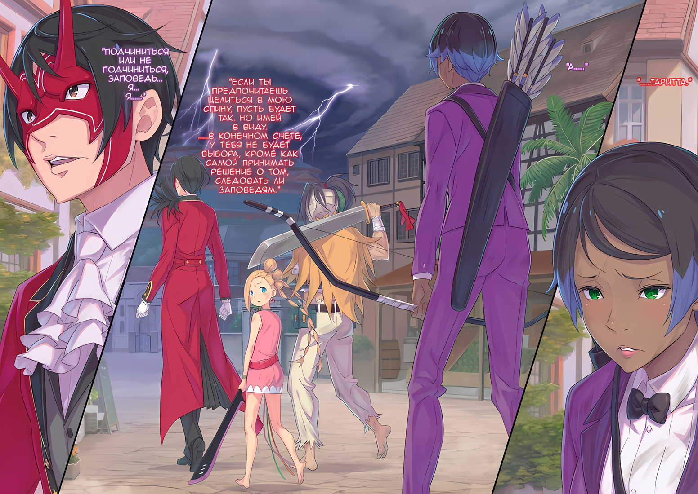

……Таритту впервые начали мучить кошмары, связанные с «Заповедью», за три года до этого.

До этого момента Таритта жила жизнью, совершенно не связанной с «Заповедью».

Разумеется, она также была в полном неведении о существовании «Звездочетов».

……Когда люди слышат слово «Заповедь», что приходит им на ум?

Рок и судьба, неизбежные испытания и препятствия на жизненном пути.

Когда речь заходила о таких вещах, между ними и заповедью существовала четкая разница. Вещи, которые были неизбежны, подобно дождю, когда идешь по бездорожью.

У «Племени Судрак» тоже было понимание чего-то вроде неизбежных событий.

Если говорить честно, то можно сказать, что «Смерть» была самой неотвратимой судьбой среди всех.

Старость и болезни, голод и травмы…… все, что связано со «Смертью», было занавесом судьбы, который настигнет всех без исключения, чего трудно избежать.

Независимо от человека, нельзя было идти против своей судьбы. Не следует и думать о том, чтобы бросить ей вызов.

Когда умирал их соотечественник, они молились и пели, чтобы его душа обрела покой.

Петь, пировать и провожать их было Путем Судрак, и Таритта верила в это.

Ее старшая сестра, Мизельда, была выдающейся судракийкой. Хотя она не была столь выдающейся, как ее сестра, Таритта также унаследовала кровь рода, который продолжал нести роль вождя Судрак на протяжении многих поколений.

Для Таритты быть судракийкой было непреложной истиной.

Следование учениям Судрак было естественным и не подлежало сомнению.

Таритта никогда не любила размышлять о чем-то. Она была не из тех, кто беспокоится о чем-то, и не хотела добавлять себе лишних забот.

Она верила, что ее жизнь будет состоять из следования по стопам старшей сестры рядом с «Племенем Судрак», ее собственным народом, который разделяет ее кровь и ее собственный путь, от начала и до конца.

Такова была ее судьба, ее предназначение….

???: Привет, Таритта. Я была избрана «Звездочетом», и мне нужно выполнить заповедь.

……Так и было, пока самая близкая ей, ее «Сестра души», не доверилась ей.

△▼△▼△▼△

Абел: ……Падение Империи — не связанно с «Великим Бедствием»?

Человек в маске Они смотрел прямо перед собой на Таритту, ее решимость пошатнулась, она еле как стояла на ногах.

Корчащаяся, струйчато-черная штука, видимая издалека, с первого взгляда инстинктивно распознавалась как «Великое Бедствие»; однако мужчина…… Абел… высмеял идею бояться ее.

Абел: Если так, то тебе незачем мешаться под ногами. ……Я прикажу тебе исчезнуть с доски, нахал.

Абел шагнул вперед, ясно и твердо заявив, что это нечто нежелательное.

В этот самый момент маленькая Медиум крикнула «Стой, стой!», находясь рядом с ним. Схватившись за подол одежды Абела, она изо всех сил остановила его движения,

Медиум: Ты вдруг стал очень решительным, не так ли?! Только вот это слишком опасно для тебя, Абел-чин!

Абел: Дура. Ясно, что нужно сделать. Если бы это было «Великое Бедствие», я бы сокрушался, что подготовка была недостаточной. Однако, если это не так….

Медиум: Что тогда?

Абел: Тогда это всего лишь развлечение перед настоящим делом. Нет времени для таких развлечений. Что касается этого, мы быстро положим этому конец. ……Ты тоже поймешь это, если будешь наблюдать издалека.

Подергивая подбородком, Абел указал Медиум на «Великое Бедствие» после ее вопроса. Но, не понимая его намерений, Медиум нахмурилась.

Она то и дело бросала взгляды на Абела и «Великое Бедствие», оценивая их,

Медиум: Я не понимаю ни слова из того, что ты сказал! У тебя плохая привычка важничать, Абел-чин!

Абел: Ты перекладываешь на МЕНЯ ответственность за отсутствие ТВОЕГО интеллекта?

Медиум: Как. Я. И. Сказала! Если я не могу понять смысл этого, тогда я встану на твоем пути! Абел-чин, ты сам себе мешаешь! Если бы ты был умным, ты бы это понял!

Абел: …………

Топчась на месте и надувая щеки, Медиум не отпускала подол одежды Абела.

Возможно, решив, что у него нет времени размышлять над непокорностью Медиум, ведь это одна из ее сильных сторон, Абел испустил небольшой вздох, а затем:

Абел: Если ты не заметила, эта девушка, Йорна Миссигр, Кафма Ирулюкс и жители Города Демонов отчаянно пытаются остановить «Великое Бедствие».

Медиум: Ммм~, опять эта твоя дурная привычка?

Абел: ――. У этой штуки есть воля. У нее явная, очевидная, человеческая воля.

Абел заговорил, а Медиум сказала, наклонив голову: «Воля?».

Таритта, стоявшая позади Медиум, тоже подняла бровь на вопрос последней. Это «Великое Бедствие», олицетворение конца света, обладает волей?

Более того, Абел назвал ее волей «Человека». Где может существовать такая вещь?

Прежде всего, она не могла даже представить себе, что это живое существо.

Фигура, которая со всей силой вгрызалась в мир, пузырилась, корчилась, предвещала конец самого мира.

Что же такого мог увидеть Абел, что заставило его сделать вывод о наличии у этого существа воли?

Как раз когда Таритта и Медиум пришли к этому же вопросу……

Абел: Ранее это существо потянулось к вам, людям.

Медиум: Э?

Таритта: ……А.

Неожиданные слова Абела заставили обоих издавать немые звуки.

Медиум, как оказалось, ничего не поняла, но Таритта почувствовала слабый дискомфорт. ……Когда она выхватила их двоих из тени, которая надвигалась на них, Таритта тоже это почувствовала.

От этой отвратительной черной твари исходило что-то похожее на легкую привязанность.

Абел: Скорее всего, оно отражает волю того, кто борется глубоко внутри него. Ища спасения, он протягивает руки. Поэтому.

Перед изумленным вскриком Таритты, Абел вытянул руку, указывая на «Великое Бедствие».

Таритта и Медиум, привлеченные этим жестом, посмотрели на него и теперь поняли, к чему клонит Абел.

Расположившись в центре Города Демонов на месте рухнувшего Замка Красного Лазурита, «Великое Бедствие» распространяло неумолимое разрушение и гибель на окружающую местность, расширяясь…… Но то, к чему простиралась темнейшая из теней, чтобы пожинать ее, принося гибель, принимая ее на себя, были не здания и не земля, а люди.

Получается что……

Медиум: ……Луис-чан и Йорна-чан единственные, на кого напали?

У Таритты сложилось такое же впечатление, как у слабо бормочущей Медиум.

Наблюдая издалека за ожесточенной битвой с «Великим Бедствием», они могли легко заметить предвзятость цели тени.

Двумя главными целями были Йорна, которая разворачивала бой на нескольких фронтах, и Луис, которая мгновенным движением уклонялась от привлеченных ею теней.

Даже Таритта была поражена, ее глаза широко раскрылись от невероятных движений Луис, но, обладая разрушительной силой, наступательные и оборонительные способности Йорны были свидетельством ее трансцендентной силы как одной из «Девяти Божественных Генералов».

Но человек из «Клана Насекомых» был не менее способным, демонстрируя подавляющие способности, сравнимые со способностями Йорны, снова и снова удерживая ущерб, нанесенный «Великим Бедствием», на минимальном уровне с помощью своих шипованных лоз. И все же, единственные атаки, которые летели в его сторону и в сторону бросающих здания жителей Города Демонов, были сродни шальным стрелам.

Медиум: Если оно нацелилось и на Луис-чан, значит, атака идет не по принципу «кто сильнее».

Абел: Принимая во внимание силу, и только силу, она не слишком отстает от Кафмы Ирулюкс. Но, оценивая ее с высоты птичьего полета, это самоочевидно. Она обладает волей. Значит, мне имеет смысл двигаться.

Таритта: Почему вы так уверены в этом…?

Абел: Это само собой разумеется. Не может быть, чтобы я нравился этому существу. Допустим, оно протягивает руки, как будто хочет за кого-то ухватиться, тогда такие, как я, не подходят для такого существа.

Таритта нашла бескорыстную манеру Абела говорить озадаченно и недоумевающе.

Она поняла мысль Абела, определившего существование «Великого Бедствия» как нечто, обладающее волей. Однако было необычно, что, используя это в качестве основы, критерии отбора «Великого Бедствия» были ясны.

Как будто Абел знал, кому принадлежит воля «Великого Бедствия».

Абел: ……Это Нацуки Субару.

Таритта: ……Кх!

Медиум: Э!?

Как бы отгоняя сомнения Таритты и непонимание Медиум Абел направил свой взгляд на «Великое Бедствие», когда утверждал это.

Увидев, что двое неподвижно и потрясенно смотрят на него, Абел глубокомысленно кивнул и продолжил,

Абел: Это было нечто, что переполняло Нацуки Субару изнутри. Поэтому неудивительно, что в дело вмешалась его воля. Все это время я считал его человеком с многочисленными тайнами, но это превзошло все мои ожидания.

Медиум: Погоди-ка, Абел-чин… Ты хочешь сказать, что это Субару-чин…!?

Абел: Строго говоря, это то, что позволяет отразить волю Нацуки Субару. Я не говорю, что это он, или что-то, служащее ему. ……В любом случае, результат один и тот же.

Медиум: Абел-чин, почему ты так спокойно к этому относишься!?

Медиум, круглые глаза которой расширились от удивления, жаловалась голосом, казавшимся, что она вот-вот заплачет.

Глядя на ее маленькую фигурку, черные глаза Абела, по ту сторону маски Они, сузились. Совсем как у взрослого, которого беспокоит истерика ребенка.

Абел: Я выгляжу спокойным? Он позволил этой штуке переполнить себя изнутри, и весь мой план рухнул. Для этого нужно все пересмотреть, а у меня сейчас нет на это времени. И все же ты утверждаешь, что я кажусь тебе спокойным?

Медиум: Нет! Нет, я не об этом говорю! Дело не в этом, а в том, что Субару-чин зовет на помощь, верно? Но даже если так, ты так спокойно к этому относишься, почему!?

Абел: ……Неужели, обнявшись с этой тварью в ее страданиях, можно взять ситуацию под контроль? К сожалению, реальность не столь сговорчива и благосклонна.

Пылкие слова Медиум, однако, не смогли поколебать железное сердце Абела.

Это было потому, что он был холодным человеком, неспособным понять сердца людей…… нет, он был человеком, который считал человеческое сердце неважным, но в то же время он был человеком, который умел разделять приоритеты.

Для тех, кто стоял на вершине, как политики и лидеры, это было качество, которым нужно было обладать.

То же самое требовалось и от Таритты, которой предстояло занять пост вождя.

Но……

Таритта: Для сеня, я….

Она не могла думать так же, как Абел, не могла обладать его решительностью.

Тем более, она не могла прямо сказать, что ненавидит что-то, как делала это Медиум.

Абел: У меня нет времени спорить с тобой. Я пошел. Я должен поговорить с Йорной Миссигр.

Медиум: ……С Йорной-чан? Но как?

Заявив, что не может больше тратить время на ответы на ее вопросы, Абел попытался сделать шаг вперед. Но Медиум прервала его, ее взгляд красноречиво свидетельствовал о сложности дальнейших действий.

Поделившись местом, куда он направляется, Абел, пытаясь поговорить с Йорной, окажется на передовой против безумного буйства «Великого Бедствия».

Поле битвы, где решение этих трансцендентных людей в доли секунды может означать разницу между жизнью и смертью.

Было очевидно, что Абел, выйдя вперед, подверг бы опасности только свою жизнь. На самом деле, он даже не сможет сделать шаг, который изменил бы ход битвы.….

Таритта: …………

Все тело Таритты замерло при мысли о движении, способном изменить ход битвы.

Или, возможно, такая возможность была доступна только Таритте. Только у нее были средства, чтобы успокоить отвратительного предвестника смерти, которым было «Великое Бедствие».

Единственная, кто знала о заповеди, данной ей ради того, чтобы отразить «Великое Бедствие», Таритта……

Медиум: ……Я тоже пойду.

Абел: Что?

При виде принятия такого важного решения тело Таритты задрожало.

Сбоку от Таритты голос Абела был наполнен сомнением, когда Медиум заявила об этом. Черные глаза мерцали, словно заглядывая в сердце сдерживающей себя маленькой девочки.

Абел: Ты, о чем ты думаешь? Начнем с простого: ты вообще меня слушаешь? Единственное основание, по которому я ухожу, это то, что я считаю, что эта вещь меня не любит. Если ты пойдешь туда….

Медиум: Я уже поняла! Так что я не пойду с тобой! Я пойду туда, где дерутся Луис-чан и Йорна-чан! Я хочу, чтобы Субару-чин нашел меня.

Абел: …………

Медиум: Если все так, как предположил Абел-чин, Субару-чин обратится ко мне, верно? Если это так, то у Луис-чан и остальных будет немного меньше проблем, не так ли? Может быть, тогда и Абел-чин не станет мишенью.

Абел: Во-первых, вероятность того, что я стану мишенью, меньше.

Медиум: Может быть, тогда вероятность будет еще меньше! Верно!?

Решительно шагнув вперед, Медиум подчеркнула свое предложение.

На мгновение стало ясно, что Абел всерьез обдумывает предложение Медиум. По ее словам, если «Великое Бедствие» отражает волю Субару, то вполне вероятно, что Медиум станет мишенью.

Однако Медиум по-прежнему вызывала опасения, ее рост оставался маленьким, а подвижность — затрудненной.

Даже если бы она взяла на себя роль привлечь внимание «Великого Бедствия», существовала большая вероятность, что она будет поглощена тенью, не сумев выполнить свою роль сколько-нибудь значительным образом. Если бы такое случилось, это вызвало бы душевное смятение у тех, кто ее окружал.

Он не думал, что не кто иной, как сама Таритта, сможет терпеть Медиум, не моргнув глазом.

Энергичная, полная жизни и не боящаяся быть рядом с другими, Медиум была одной из любимых спутниц Таритты. Она не смогла бы противостоять и своему брату, Флопу.

……В таком случае, она задалась вопросом, сможет ли она, в ее нынешнем состоянии, противостоять кому-либо.

Абел: Отказано.

Медиум: Абел-чин!

Абел: Я на мгновение задумался, но в твоем состоянии ты не сможешь выполнять роль приманки. Влияние твоей смерти на окружающих было бы более серьезной проблемой. Я не могу согласиться на такую авантюру.

Стоящий рядом с Тариттой Абел отверг предложение Медиум из тех же соображений.

Однако, скрежеща зубами от злости, глаза Медиум выражали отсутствие удовлетворения. Вполне возможно, что в этот момент она, пренебрегая мнением Абела, выскочит на поле боя и возвысит свой голос в сторону «Великого Бедствия».

И в такой опасной ситуации……

???: ……Тогда я буду защищать мисс Медиум. Теперь уж у тебя не должно быть никаких претензий, верно?

Перешагивая через обломки, голос вновь прибывшей фигуры прервался.

При звуке знакомого голоса группа из трех человек, повернулись в разные направления чтобы посмотреть на собеседника.

Меч Синего Дракона, висевший на толстой правой руке, и уродливая тряпка, закрывавшая лицо, придавали им подозрительный вид. Хотя ощущение того, что это особенно сильный человек, никогда не возникало, по какой-то причине в этот момент, в этом месте, человек, стоящий здесь, был полон боевого духа, настолько поразительного, что на него почти невозможно было смотреть…… Ал.

Медиум: Ал-чин! Ты стал больше…… и вернулся в норму!?

Ал: Верно, я просто случайно столкнулся со стариком, когда возвращался. У меня не было времени вернуться в трактир за шлемом, так что вам придется не обращать внимания на это неуклюжее представление.

Медиум: Вовсе нет, так здорово! Но если дедушка там….

За исключением тряпок, намотанных на лицо, Ал вернулся к своему первоначальному состоянию. Голос Медиум казался более солнечным из-за его слов, что заставило ее также беспокойно оглядеться вокруг.

Естественно, поскольку Медиум была в том же состоянии, она предпочла бы вернуться к себе.

Но Ал добавил «Извини» в связи с ситуацией Медиум,

Ал: Извини, я не смог взять с собой старика. Он сказал, что поступит мудро.

Медиум: Умм~, понятно. Ммм, я поняла! Но я рада, даже если только Ал-чин вернулся в прежнее состояние! Теперь ты перестал так бояться?

Ал: Бояться, это то, чего я не прекращу до конца моей жизни.

Медиум мгновенно переключилась, на мгновение опустив глаза, так как надежда была отнята у нее. Услышав ее слова, Ал понизил тон своего голоса, покачав головой.

Его голос был до краев наполнен неприкрытым страхом и тревогой. Перед лицом того «Великого Бедствия» все испытывали инстинктивный страх. Никто не мог осудить его за это.

Даже не смотря на то, что Ал испытывал настоящий страх…… Ал не старался притворяться.

Ал: Так или иначе, я должен это сделать…… Вперед, о неизбежная судьба.

Медиум: Ал-чин……

Внезапно Ал поднял над головой сцепленный Меч Синего Дракона; Медиум была поражена его решимостью.

Тем временем их разговор прервал небольшой фыркающий звук.

Абел: Для дрожащей, сморщенной мерзости ты, конечно, много говоришь. Этот Ольбарт Дарккенн не должен обладать способностью вдохновлять других.

Ал: И ты будешь прав. Старик просто наговорил много такого, что вывело меня из себя. Но не это мелкое дерьмо заставило меня встать.

Абел: Тогда что заставило? После того, как тебя лишили подвижности, как ты собираешься убедить меня, что ты можешь быть включен в мои планы на будущее?

Ал: …………

Абел, удерживаемый в таком состоянии Медиум, схватившейся за подол его одежды, спросил это у Ала.

Эти его холодные глаза, пронзающие маску Они, вероятно, все еще думали о победе, которую нужно было добыть. Как Ал сможет убедить Абела добавить его в свои ряды?

Когда Абел перевел взгляд на Таритту, она с трудом перевела дыхание, не в силах представить, как ему удастся убедить его.

Под пристальными взглядами Таритты, Абела и, наконец, Медиум, Ал……

Ал: Прости, но я не собираюсь тратить свои слова, чтобы убедить тебя, Абел-чан.

Абел: Хо.

Ал: Единственный босс, который у меня есть — это сексуально-красивая принцесса. Причина, по которой я пошел с тобой, в том, что я могу помочь брату… Вот что я собираюсь сделать. Не стесняйся использовать мои приемы в своих уравнениях, как хочешь, Абел-чан.

Заявив это с вызывающим видом, Ал взял в руки Меч Синего Дракона. Это резкое и четкое решение заставило лицо Абела, покрытое маской Они, слегка напрячься.

Но даже если ответ не соответствовал его собственным мыслям, у Абела не было ни силы, чтобы прогнать Ала, ни достаточно ценных отношений, чтобы удержать его. Именно так, как и предсказывал Ал.

Несмотря ни на что, Абел должен был разработать план, предполагая присутствие Ала.

Абел: Если твое здравомыслие вернулось, то даже то, что вернулось обратно — это всего лишь надоедливый клоун. Как ты собираешься бороться с тенью?

Ал: Коммерческая тайна. ……Ну, я не дам тебе умереть, мисс Медиум. И не волнуйся, я защищу и тебя, Абел-чан.

Медиум: Ал-чин….

На фоне бушующего прямо на его глазах «Великого Бедствия» ответ Ала был слишком обнадеживающим.

Что в этих словах заставило Медиум широко раскрыть глаза, так это удивление от ситуации, в которой Ал оправился от «Позора», названным Абелом, став воплощением чести.

Вследствие этого Медиум решительно кивнула:

Медиум: Я сделаю все возможное с Ал-чином! Абел-чин, ты не против?

Абел: ――. С самого начала присутствие вас двоих не входило в план.

Медиум: Большое спасибо. Просто тот очевидный факт, что нас не включили в число тех, кто обладает боевой силой, заставляет чувствовать, что к нам особое отношение.

Пожав плечами на ответ Абела, Медиум встала в ряд с Алом, который шагнул вперед. Только тогда рука Медиум наконец рассталась с рукавом Абела.

Размахивая освобожденной рукой, Абел издал небольшой выдох, затем повернулся лицом к «Великому Бедствию».

И тогда……

Абел: ……Таритта.

Таритта: А….

Абел: Если ты предпочитаешь целиться в мою спину, пусть будет так. Но имей в виду. ……В конечном счете, у тебя не будет выбора, кроме как самой принимать решение о том, следовать ли твоим заповедям или нет.

Вместо того чтобы повернуться к Таритте, он дал ей услышать это из-за своей спины; а затем шаги Абела направились в сторону поля боя.

Медиум и Ал, оба стоявшие в том же направлении, что и он, казалось, сопровождали его в его продвижении.

Таритта: ……Кх

Только Таритта не могла двигаться ни вперед, ни назад. Она могла видеть только спины этих трех людей.

Слова, которые Абел только что сказал ей, повторялись в ее голове снова и снова, словно напоминание самой себе. Просто выстрелить в спину Абела, прикрепив стрелу к луку в ее руках, было бы делом несложным.

Но если бы она могла окунуться в это несложное дело без лишних слов, Таритта бы не так волновалась.

Таритта: Подчиниться или не подчиниться, заповедь… я… я……

С силой прикусив губу, Таритта опустила голову вниз, сдерживая жар, медленно поднимающийся в теле.

Она не могла набраться решимости, чтобы прицелиться со стрелой в руках, или мужества, чтобы выплеснуть мысли, засевшие в ее сердце.

На фоне разрушенного Города Демонов, над которым доминировали лишь неистовые толчки и грохот, Таритта посмотрела вниз.

……Похоже на то, как в один прекрасный день она была сметена, осмеяна звездами.

Цветная иллюстрация к **Ранобэ** Том 30 | Перевод неофициальный и выполнен под контекст перевода rezero7arc | Клин djoenfoej

△▼△▼△▼△

Пока она защищалась от надвигающейся черной тьмы, в сердце Йорны бушевала буря.

Йорна: …………

Взмахнув кисэру, пурпурный дым послужил барьером, который остановил наступление «Великого Бедствия», сдерживая его распространение.

Через определенные промежутки времени части города выстреливались, подобно пушечным ядрам, в попытке нанести хоть малейший урон «Великому Бедствию».

Повторяя это снова и снова, чтобы справиться с разрастающимися тенями, которые могли лишить ее жизни от одного лишь удара, она направила все силы своего разума и тела на то, чтобы справиться с этим как можно лучше.

Однако она не могла долго продолжать эти все более неэффективные действия.

Йорна: ……Кх, чего это ты стала такой слабонервной?

Чтобы возразить на робость, поселившуюся в ее сердце, Йорна изогнула свои красивые губы.

Независимо от эффективности, она не собиралась отказываться от едких слов, которые бросила Абелу. Этот город принадлежал Йорне, и те, кто жил в нем, находились под ее защитой.

Последний оплот для тех, кому больше некуда идти, они не могли позволить себе потерять его……

Луис: Ууааауууу!!!

Йорна: Дитя……!

Внезапно, огромное количество черной порчи хлынуло вниз, нацелившись на Йорну. Прежде чем Йорна успела справиться с ней, появилась маленькая тень и метнулась к ней, двигаясь к ее талии, и в мгновение ока мир сразу же изменился.

На мгновение Йорна почувствовала, что у нее трясется голова, но, увидев, что земля в нескольких метрах от нее стала дыбом сразу после этого сильного удара, Йорна поняла, что ее защитили.

Это была голубоглазая девушка, ее золотистые волосы были собраны в пучок…… Луис.

Луис, чьи стройные плечи яростно вздымались и опускались…… ее прекрасное лицо приобрело мрачный оттенок; она неподвижно смотрела на «Великое Бедствие» расширенными от горя круглыми глазами.

Однако она смотрела не на само «Великое Бедствие», а на то, что находилось внутри него.

Йорна: Ты беспокоишься о ребенке, не так ли?

Луис: Уау……!

Короткий ответ на слова Йорны, и фигура Луис снова подпрыгнула, как мяч, и направилась в сторону «Великого Бедствия».

Луис прыгала вокруг верхней части «Великого Бедствия»…… этого пузырящегося, аморфного «Великого Бедствия», в котором не было ничего похожего на голову, но если она и была, то прыгала вокруг соответствующей ей части и привлекая ее внимание.

Нацелившись на миниатюрное тело Луис, около сотни теневых рук вылетели одна за другой; избежав всех этих ударов, Луис внесла неизмеримый вклад в предотвращение распространения разрушений.

Если бы не она, трудно было бы поверить, что Йорна и жители Города Демонов смогли бы самостоятельно сдержать «Великое Бедствие». Это только усиливало ужас.

Кафма: Используй это! Девочка!

Луис: Ау!

Помогая Луис прорваться, Кафма овладел колючими кустами, растущими из обеих рук.

Используя терновые лианы, обладающие значительной подавляющей способностью, в качестве подмостков, он ловко поддерживал маневры Луис по уклонению. Конечно, те шипы, которые поздно втянулись, были поглощены «Великим Бедствием», но Кафму, казалось, это не затронуло; как можно было видеть по искреннему выражению его лица, его немое, но мастерское исполнение возобновило бы активную роль.

За Луис, Кафмой и Йорной в их битве, жители Города Демонов продолжали сопротивляться «Великому Бедствию», хотя и в меньших масштабах. Те, у кого в глазах горел огонь, находились под влиянием «Техники Брака Душ» Йорны, их сила возросла.

Тем не менее, существовали индивидуальные различия и пределы того, насколько можно было поднять уровень своей силы.

Более того, «Техника Брака Душ» Йорны была склонна лучше относиться к слабым.

Это был инструмент, который позволял слабым противостоять сильным, а не заменял сильным противостояние с чем-то более сильным.

Это было не более чем разница в качестве души, на которую Йорна никак не могла повлиять.

Поэтому……

Йорна: ……И все же, прошло всего несколько минут.

Казалось, что прошло бесконечное количество времени, но прошло всего несколько минут с тех пор, как «Великое Бедствие» охватило Замок Красного Лазурита, и Йорна и остальные начали свою тотальную битву.

Тем не менее, износ Йорны и ее группы был немаленьким.

Вот что значит быть в таком месте, где постоянно опасаешься смертельных травм.

В этом, пожалуй, и заключалась разница между теми, кого считали настоящими воинами, и Йорной Миссигр, женщиной, которая просто случайно оказалась наделена силой.

Будь она настоящим воином, она бросила бы вызов этому «Великому Бедствию», способному полностью стереть ее с лица земли, и одержала бы победу, однако она не считала себя настолько благословенной для этого.

Это самосознание было сильной стороной лидера Города Демонов по имени Йорна Миссигр.

И поэтому……

???: Хия-ааа…!!!

С энергичным призывом к оружию на поле боя, которое, казалось, склонялось к ужасному положению, вышла свежая боевая сила.

Девочка небольшого роста, с тесаком в руках, ворвалась с такой скоростью, что слово «ворвалась» стало подходящим описанием.

Вторжение маленькой девочки с длинными косами, танцующими в воздухе, при сохранении оживленной атмосферы, привело всех на поле боя в состояние недоумения, в том числе и Йорну.

Конечно. Что может произойти с появлением одинокой девочки на поле боя? Все, что можно было увидеть, это маленькую девочку, проявляющую безрассудство, храбрость которой станет ее гибелью.

Более того, она была не единственной странной нарушительницей.

???: Вперед, мисс Медиум! Сразимся с гордостью!

— рявкнул мужчина в маске, который приземлился позади девушки, неся в руках Меч Синего Дракона.

Он был одним из тех, кто накануне посетил башню замка в качестве посыльного, но в отличие от того раза, его лицо скрывал не шлем, а скорее маска из ткани, а то, как он держал Меч Синего Дракона, было причудливым.

По какой-то причине он держал лезвие Меча Синего Дракона близко к своей шее, когда бежал в такой опасной позе.

Одна ошибка, и он нечаянно отрубил бы себе голову.

Как бы то ни было, атмосфера на поле боя замерла из-за этой проходящей мимо группы из двух человек, что вызывало лишь недоумение.

Однако это застывание коснулось только тех защитников, которые были в курсе этой стычки. ……«Великое Бедствие», очевидно лишенное всякой воли, не было удивлено этим подкреплением.

Тем не менее, большинство теней, отбрасываемых «Великим Бедствием», не были направлены ни на Йорну, ни на Луис, а скорее на девочку, которая только что выскочила наружу, словно из норы.

Она должна была защитить их; Йорна сделала резкое движение, но……

Ал: Направо! Встань на эшафот и прыгай! Поставь кончики ног на обломки, затем вверх!

Медиум: Урья!

Раздался крик человека в маске, и девушка подпрыгнула в такт, повысив восторженный голос.

Выполнив указание мужчины, девочка прыгнула вправо, наступила на обломок и полетела вперед. Как только нога девушки достигла обломка впереди нее, она использовала силу своих пальцев, чтобы взлететь вверх в большом прыжке.

В свою очередь, тень ласкала, царапала и окружала те места, куда двигалась девушка.

Девочке, однако, едва удалось увернуться от тени, добившись того, что она не пострадала.

Йорна: Это….

Это была та же сцена, которую она наблюдала в башне день назад; когда посланники приняли участие в поединке, предложенном Йорной, и были атакованы Императором…… или, скорее, человеком, выглядящим как Император, вместе с группой, которой он командовал.

Этот человек в маске избежал кризиса, приказав своим союзникам принять превентивные меры против шипов Кафмы и атак Ольбарта. Кроме этого, человек, казалось, не обладал никакими особыми способностями.

Была ли это просто потрясающе хорошая интуиция и никаких причин, кроме этого?

Хотя она считала последнее наиболее вероятным, она не могла прийти к выводу, почему именно так.

Тем не менее, ситуация изменилась.

Медиум: Ал-чин! Что дальше?

Ал: Не торопи меня, я нервный! Эй, татуировщик вон там, помоги мне! Я скажу тебе, что делать! Препятствуй движениям этой твари!

Кафма: Отказываюсь! Почему я должен слушать кого-то подозрительного, как….

Ал: Наверх! Раскинь лианы пошире!

Кафма: Что!?

Подобно тому, как его окликнула девочка, человек в маске, которого девочка назвала Алом, теперь обратился к Кафме.

Кафма, естественно, не захотел выполнять приказ другого, поскольку его компетенция была неизвестна, но черные тени, появившиеся вместе с криками Ала, доказывали, что сейчас не время для ссор.

Из рук Кафмы, поспешно наклонившегося и поднявшего руки над головой, потянулись терновые лианы, а огромная волна теней изменила направление и устремилась вдоль зарослей.

Конечно, терновые лозы не могли полностью противостоять этим всепоглощающим теням, но Кафма спас себе жизнь, заработав всего одну секунду.

Ворвавшись в пролом и избежав этой трудности, Кафма прорычал в сторону Ала: «Ты…!»,

Кафма: Ты можешь читать движения «Великого Бедствия»?

Ал: У нас есть небольшая связь. Ты готов выслушать, что я скажу?

Кафма: ――. Это неизбежно, если речь идет об уменьшении ущерба. Но я не потерплю необдуманных слов!

Ал: А ты более гибкий, чем я думал, спасибо.

Когда Кафма открыто признал свое превосходство, Ал саркастически усмехнулся и шагнул вперед.

Затем он снова проинструктировал девочку и Кафму, а Меч Синего Дракона, все еще приставленный к его собственной шее, начал командовать линией фронта против «Великого Бедствия».

И рядом с этой борьбой……

???: ……Йорна Миссигр.

Йорна: Вы….

Собираясь присоединиться к неожиданным боевым силам Ала и маленькой девочки, Йорна обратила свое внимание на человека в маске Они, пробирающегося и переступающего через обломки, Абела.

С момента их расставания прошло несколько минут, но он не был человеком с таким приятным характером, чтобы изменить свое мнение за столь короткое время.

Во-первых, разрыв между ним и Йорной был не из тех вещей, которые можно легко стереть с течением времени. Подобные потрясения, казалось, оставались на заднем плане.

И, как бы в подтверждение мыслей Йорны……

Абел: Покинуть Город Демонов; ты достаточно остыла, чтобы обдумать это предложение?

Беззастенчиво и безжалостно Абел снова подкинул Йорне предложение, которое уже однажды было отброшено.

Конечно, «остыла» было словом, не подходящим для разума, возбужденного боевым духом. Пока ситуация и их отношения оставались прежними, ответ со стороны Йорны тоже не изменился бы.

Посчитав спор бессмысленным, Йорна повернулась спиной к хладнокровному Императору.

Абел: Ты сказала, что это последнее место для тех, кому некуда идти и негде оставаться.

Йорна: …………

Абел: Я считаю это бесполезной сентиментальностью. Но позволь мне исправить твою ошибку.

Йорна: Мою… ошибку?

Этим непростительным аргументом попытка Йорны вернуться на поле боя была пресечена.

Это было абсурдно: Йорна ошиблась в отношении Города Демонов Хаосфлейм. Это был город Йорны. Все его жители были любимыми детьми Йорны.

Чтобы по отношению к ним у Йорны были какие-то заблуждения или что-то подобное….

Йорна: В чем именно моя ошибка?

Абел: Жители держатся не за этот город, а за тебя.

Йорна: …………

Абел: Город Демонов изначально был построен на пустынной земле, город, состоящий из остатков военных действий. Замок Красного Лазурита был возведен как символ, но истинным символом всегда была его башня. А именно — ты.

И снова глаза Абела устремились на Йорну, когда он сделал этот вывод.

Ее барабанные перепонки поразила сила и истинное значение этих слов, щеки Йорны порозовели.

Она понимала смысл. Но это было очень похоже на пустословие.

Была ли Йорна духовной опорой для жителей Города Демонов или нет, но факт оставался фактом: когда шел дождь, им нужен был кров, а когда они были голодны, им нужно было что-то есть.

Все, что мог предоставить город, Йорна не могла предоставить в одиночку.

Йорна: Или вы верите, что эти дети скажут, что они готовы терпеть одиозные вещи, такие как пустой желудок или промокать под дождем, пока я с ними?

Абел: ……Они бы так и сделали!

Йорна: Э….

Абел: Ты веришь, что все, что находится под твоим крылом, — это сосущий младенец? Ребенок, ворчащий в поисках утешения, ждущий, чтобы его накормили молоком? ……Это не мое мнение.

Из-за фигуры Абела, когда он отвечал, Йорна тихо застонала.

Сразу после этого позади них раздался сильный грохот, и в сторону Йорны и Абела полетели обломки, окутанные водоворотом «Великого Бедствия». Один из осколков пролетел настолько близко, что сорвал маску Они.

Йорна: ………Кх

Его бледное лицо было открыто, по лбу текла кровь, слегка задетая осколком, но его лицо ничуть не дрогнуло. Красавец поднял упавшую рядом с ним маску Они, сжимая ее в руках.

Показав свое истинное лицо, Абел…… нет, Винсент Волакия…… уставился на Йорну.

Абел: Народ глуп. Если им не больно, они забывают сопротивляться, если у них нет врагов, они даже не вооружаются. Они не знают, как объединиться без беды, и так боятся смерти, что отводят от нее глаза.

Йорна: …………

Абел: И при всем том, именно эта слабость и глупость делает их самими собой. Империя управляет своим населением с помощью металла и крови, а в Городе Демонов твой образ жизни послужил руководством для жителей. Следовательно….

Прервав на этом свои слова, Абел перевел взгляд в другую сторону. Место, куда устремился его взгляд, было обращено к тем, в чьих глазах горела любовь Йорны; это были жители, противостоящие «Великому Бедствию».

Решительно, они продолжали доблестно сражаться, чтобы защитить этот город.

Нет……

Абел: Ради тебя они будут терпеть голод и дождь. И ради дня, когда солнце взойдет вновь, ради дня, когда их желудки будут полны, они решили желать тебя!

А значит……

Абел: Покинуть Город Демонов. Их цель та же, что и твоя. И единственное место, куда они могут обратиться, это ты сама.

Йорна: ……Ах.

Абел: Или ты сетуешь на то, что не можешь этого сделать? Разве твои собственные желания и желания тех, кто борется за тебя, не совпадают?

Произнеся это, Абел вытер рукавом кровь со лба и снова надел на лицо маску Они.

И снова выражение его лица было скрыто когнитивным беспорядком, но слова, произнесенные накануне, проникли в самую глубину сердца Йорны, став занозой, которая никак не хотела выпадать.

С того момента, как Йорна прочитала послание, она поняла, что Абел знает, чего она хочет.

Но чтобы это стало достоянием гласности и использовалось в качестве ориентира в данный момент, было слишком мало сострадания. А отсутствие сострадания было тем качеством, которого так не хватало Императору Волакии нынешнего поколения.

Именно по этой причине принятие всех необходимых мер было……

Йорна: Если мы покинем Город Демонов и спасемся от «Великого Бедствия», что вы будете делать? Эта тварь может выпить этот город досуха, но не остановиться на этом!

Абел: Ты пытаешься сомневаешься в моих решениях? Ты полностью поняла, о чем я говорю.

Бросить Город Демонов и позволить «Великому Бедствию» делать все, что ему заблагорассудится, — каков истинный смысл этих слов?

Абел угрюмо ответил на вопрос Йорны, подергивая челюстью. Его жест указывал на само «Великое Бедствие»…… вернее, на основание под бушующим «Великим Бедствием».

Другими словами, там находилось место, где стоял Замок Красного Лазурита, где «Великое Бедствие» впервые дало о себе знать….

Абел: Сделай то же самое, что ты сделала, когда эта штука поглотила замок, но теперь для Города Демонов. ……Поглощенного замка было недостаточно, чтобы разнести его, но твой любимый Город Демонов будет совсем другим делом!

△▼△▼△▼△

???: …………

Издалека ветер трепал подол его наряда, пронзительные черные глаза смотрели на «Великое Бедствие», обрушившееся на город.

Схема Йорны по минимизации распространения ущерба, насколько это возможно, вместе с Кафмой, жителями города и другими неожиданными вкладами военной силы, похоже, давала некоторый эффект.

Однако и это продлится недолго.

Несомненно, угроза, которая была самой тьмой «Великого Бедствия», была непреодолимой.

Возможно, в древние времена люди лично наблюдали подобные вещи и, смирившись с концом света, оставляли после себя легенды, чтобы передать свой страх выжившим.

Самой экстремальной из них была «Ведьма Зависти». Это «Великое Бедствие» было таким же, как и предыдущее.

Но……

???: ……«Великое Бедствие», которое уничтожит Империю, это бедствие другого рода?

???: Да, да. О нееет~, это может быть проблемой, нет? То, что это произойдет таким образом, не было предусмотрено, мне хочется забыть свое место и пожаловаться звездам.

Со сложенными руками, неподвижно стоя на возвышении, стоял человек…… Винсент; а сбоку от него, глядя в ту же сторону, присел «Звездочет» в синей одежде.

Во время их путешествия мужчина даже не пискнул, чтобы предупредить их заранее, но выкрикнул «Воо~ всяяком~ слуучае~, это не в моей компетенции» в отношении бушующего «Великого Бедствия», чтобы избежать любой вины.

Однако одним из немногих достоинств «Звездочета» было то, что он не лгал о том, что видел.

Поэтому, если «Звездочет» был настолько смел, то это бедствие и гибель Империи, предвиденная «Звездочетом», должны были быть совсем другой проблемой.

Другими словами……

???: О, иду, иду. Боже, как я торопился.

Убирк: Боже мой, старик Ольбарт.

Позади Винсента, который задумчиво щурился, появился старик со слабым присутствием. «Звездочет» первым назвал имя пожилого человека…… Ольбарта, который кивнул головой со словами «Ай-ай-ай».

Бросив косой взгляд на Ольбарта, выстроившегося рядом с ним, Винсент нахмурил брови.

Винсент: Ты, ты где-то оставил свою правую руку?

Ольбарт: Как я и ожидал, вы весьма проницательны, Ваше Превосходительство. Вообще-то, я держу свою правую руку засунутой в нагрудный карман Вашего Превосходительства… Ну, по крайней мере, было бы забавно, если бы я это сделал. Она была проглочена той большой тенью.

Убирк: Понятно~. Похоже, это был довольно болезненный опыт.

Ольбарт: Даааа, это было болезненно. Даже в моем возрасте я плакал и хныкал, как маленький ребенок. Стыдно, стыдно.

— разглагольствовал Ольбарт, размахивая правой рукой, которая отсутствовала от запястья вниз.

Оставив в стороне Ольбарта и шараду «Звездочета», Винсент вновь окинул взглядом поле боя.

На месте бывшего Замка Красного Лазурита бушевало «Великое Бедствие». К тому же на него давила сила города, чтобы удержать его на расстоянии.

Меры, необходимые для отражения «Великого Бедствия», уже были переданы Йорне.

Так что после этого……

Ольбарт: Но разве это нормально, что Ваше Превосходительство просто случайно заглянул в это место?

Винсент: Это не имеет значения.

На слова Ольбарта, наклонившего голову, Винсент спокойно ответил.

Его роль заключалась в том, чтобы передать план Йорне и убедить ее. В свою очередь, Винсент должен был выполнить эту роль так, как это сделал бы Винсент.

Поэтому……

Винсент: Ход уже сделан. ……Этот шаг должен быть сделан Винсентом Волакией, Императором Империи Волакия.
